nInfo] [Table_Title] 2016.12.23

# 短期股价走势的预测信息（1）— 神秘的尾盘 30 分钟

# ——数量化专题之八十四

李辰（分析师）

刘富兵（分析师）

8 021-38677309

021-38676673

lichen@gtjas.com

liufubing008481@gtjas.com

证书编号 S0880516050003

S0880511010017

本报告导读：研究发现，日内交易时间段最后30分钟的股价走势，蕴含了显著的预测信息。

## 摘要：

[Table_Summary]• 研究发现，在高频或准高频领域，阿尔法因子的内在收益率将大幅提升，并且其对未来价格走势的预测显著性也将大幅提升。

- 在结合原有阿尔法体系的基础上，我们提出阿尔法因子四维属性的理念，即显著性、稳定性、独立性及频率单调性。

我们将利用个股分钟数据，通过收益率、波动率、流动性冲击 3个维度对尾盘 30分钟的价格走势进行研究观察。结果表明，日内尾盘 30分钟的价量对次日超额收益具有显著的预测信息，投资者在尾盘的交易行为是成交最为活跃、信息反映最为有效、筹码转换最为充分的阶段。

我们利用 DailyR、 DailyV、 DailyMI 三因子对次日股票超额收益进行预测，其中超额收益截面的预测方法我们采用经典的 ALPHA =IC*SCORE*VOLATILITY 的算法。检验结果，组合 IC 序列 T 检验值检验达到 6.21，表明三因子的预测具有极强的统计显著性。

高频因子的实际用法有多种，包括直接利用高频因子构建高频选股策略、将高频因子加入低频组合再增强、日内 T+0 的量化策略、亦或是高频因子低频策略的构建等。面对日趋严酷的市场投资环境，量化研究需要找到更为显著、稳定的本源信息，并结合高效的组合构建技术，实现真正的突破。

金融工程

## 金融工程团队：

刘富兵：（分析师）

电话：021-38676673

邮箱：liufubing008481@gtjas.com

证书编号：S0880511010017

刘正捷：（分析师）

电话：0755-23976803

邮箱：liuzhengjie012509@gtjas.com

证书编号：S0880514070010

李辰：（分析师）

电话：021-38677309

邮箱：lichen@gtjas.com

证书编号：S0880516050003

## 陈奥林：（研究助理）

电话：021-38674835

邮箱：chenaolin@gtjas.com

证书编号：S0880114110077

## 孟繁雪：（研究助理）

电话：021-38675860

邮箱：mengfanxue@gtjas.com

证书编号：S088011604008

## 殷明：（研究助理）

电话：021-38674637

邮箱：yinming@gtjas.com

证书编号：S0880116070042

叶尔乐：（研究助理）

电话：021-38032032

邮箱：yeerle@gtjas.com

证书编号：S0880116080361

## [Table_R相关报告

《期指交割平稳，市场情绪偏谨慎》2016.11.19

《投资和交易：价格，交易量和波动率》2016.11.18

《基于 MACD价格分段的阻力与支撑研究》2016.09.29

《基于奇异谱择时的 FOF 动量策略》2016.09.27

《基于主题影响力因子的投资策略》2016.09.22

## 1. 引言

在前一系列的阿尔法专题报告中，我们较为系统的构建了多因子组合研究的基本框架，从风险模型、阿尔法因子、组合权重优化以及业绩归因等方面，较为全面的阐述了组合管理的基本方法。在对组合进行样本外模拟跟踪的一年多以来，策略取得了较为稳健的超额收益。

然而，随着 A股市场有效性的逐步提升，传统多因子模型所面临的困境正不断显现，策略在收益性、稳健性方面均面临了较大的挑战。为了应对不断成熟的市场投资环境，量化研究需要与时俱进。

随着计算机在股票交易市场的普及，更多的高频准高频数据也大量被运用到了市场研究中。本系列报告《短期价格走势的预测信息》将在原有多因子模型框架下，着眼于市场微观结构下的投资机会。我们将利用更多短周期、高频率、日内的股价波动信息，挖掘更具有显著性的投资机会。

研究发现，在高频或准高频领域，阿尔法因子的内在收益率将大幅提升，并且其对未来价格走势的预测显著性也将大幅提升。在系列报告的第一篇《神秘的尾盘 30分钟》中，经研究观察发现，交易日内最后 30分钟的价格走势，蕴含了显著的预测信息，是阿尔法因子的重要来源。

本篇报告中，我们将结合原有的阿尔法体系，提出阿尔法因子四维属性的理念，即显著性、稳定性、独立性及频率单调性。随后，我们将利用个股 1 分钟数据，通过收益率、波动率、流动性冲击 3个维度对尾盘 30分钟的价格走势进行研究观察。结果表明，日内尾盘 30 分钟的价量对次日超额收益具有显著的预测信息，投资者在尾盘的交易行为是成交最为活跃、信息反映最为有效、筹码转换最为充分的阶段。

高频因子的实际用法有多种，包括直接利用高频因子构建高频选股策略、将高频因子加入低频组合再增强、日内 T+0的量化策略、亦或是高频因子低频策略的构建等，我们将在系列报告的后续研究中构建较为完整的策略体系。

高频量化交易是海外顶尖对冲基金的主流投资理念，也是 A股市场未来量化研究与实战的重要方向，其经验告诉我们，在高频或准高频的维度中，市场或许存在“真理”。

## 2. 阿尔法因子的四维属性

我们在前一系列的报告中，针对传统因子模型的特点，我们定义阿尔法因子具备显著性、稳定性、独立性 3大属性。

其中，显著性表明因子与价格存在显著的影响关系。通常情况下，我们利用截面回归方程的系数 T检验，来判断目标因子的显著性。显著性是阿尔法因子的最基本属性。

其次，在我们的投资理念中，为了区分阿尔法因子与风险因子的区别，我们定义了稳定性的概念：目标因子的因子收益率（或风险调整后相关系数 IC）在时间序列上稳健，即因子收益率 T检验显著（或 ICIR显著）。稳定性是区分阿尔法因子与风险因子的基本属性。（当然，也有投资者认为所有的阿尔法均为风险，因而不对阿尔法因子与风险因子做严格区分）

再次，在组合层面，我们提出阿尔法因子对收益率的稳定贡献应当是独立存在的。我们在《如何将阿尔法因子转化为超额收益》专题报告中，提出了纯因子组合与最小波动纯因子组合的相关概念，较为系统的将常见的阿尔法因子内在所包含的独立收益风险特征进行了统计分析。阿尔法因子的独立性保证了在构建多因子组合的过程中，目标因子可贡献边际增量收益。

本篇报告中，我们将提出阿尔法因子的第四维属性，即频率单调性。前面我们提到的三维属性，均是在静态的频率下，阿尔法因子的特性。而频率单调性则增加了我们对构建因子所应用的数据频率的思考，这将直接与我们之后所研究的高频或准高频领域的因子构建相关。

所谓阿尔法因子的频率单调性，指的是：阿尔法因子的预测显著性应随着构建因子的数据频率的变化而单调变化，也即以越高频的数据维度构建阿尔法因子，其因子预测性也应更为显著。换言之，我们认为，真正的阿尔法因子，在市场越高频的领域，其预测作用将更为显著。

反之，倘若我们定义的某一阿尔法因子，在低频维度上有较为显著的效果，而随着构建因子频率的逐渐提高，其作用反而在下降，我们则认为该因子或许并未抓取市场的本源信息。随着时间的推移，该因子在低频领域的预测效果将逐渐衰退。

我们下面将举几个简单的例子来说明我们所定义的频率单调性的概念。以换手率因子为例，我们分别以过去 20日累计换手率、过去 15日累计换手率、过去 10 日累计换手率、过去 5 日累计换手率与过去 1 日换手率构建目标因子 Liquidity20 、 Liquidity15 、 Liquidity10 、 Liquidity5 、Liquidity1，并统计目标因子对收益率截面的统计结果。其中，回归方程的以未来 1日收益率截面作为因变量，自变量为目标换手率因子，回归方程统计风险调整后累计因子收益率。其中，行业亚变量矩阵及其余风险因子包括 Beta 、 Momentum 、 Size 、 Earnings Yield、 Residual Volatility 、Growth 、 Value、 Leverage 和 Liquidity，详细定义可参考专题报告《基于组合权重优化的风格中性多因子选股策略》。统计时间自 2010年至 2016年，具体结果如下所示：

图 1 Liquidity 因子累计收益率
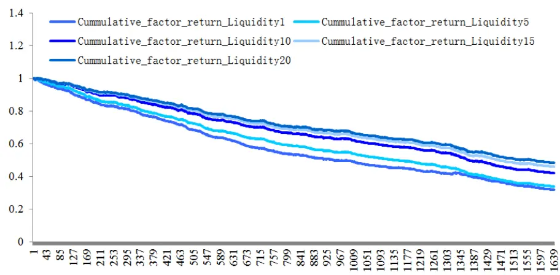
数据来源：国泰君安证券研究

表 1: Liquidity 因子绩效统计

|  | Liquidity20 | Liquidity15 | Liquidity10 | Liquidity5 | Liquidity1 |
| --- | --- | --- | --- | --- | --- |
| 年化因子收益率 | -11% | -11.8% | -13.1% | -16.4% | -17.4% |
| 因子收益IR | -4.74 | -4.90 | -5.21 | -6.12 | -6.21 |
| 风险调整后IC(均值） | -0.017 | -0.019 | -0.020 | -0.027 | -0.032 |

数据来源：国泰君安证券研究

图 2 Liquidity 因子绩效统计
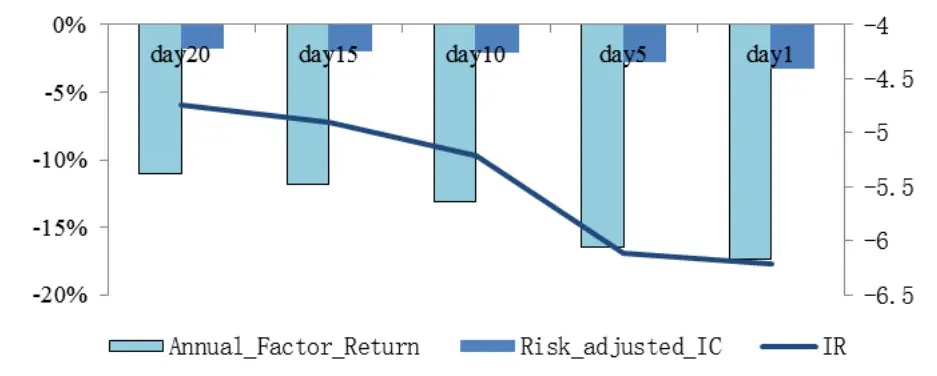
数据来源：国泰君安证券研究

可以看到，对于换手率 Liquidity因子来说，随着构建因子的数据频率不断提高，因子年化收益率、IR 和风险调整后 IC 均呈现单调变化。换言之，因子在越高频的数据维度下，显著性越强，即我们所谓的阿尔法因子的频率单调性。

我们引入阿尔法因子四维属性的概念，是为了说明随着因子频率的逐渐提高，因子所包含的预测信息和收益率贡献也将越发显著。这是我们探索更高频率上，收益更显著、稳定性更强的因子模型的重要理念基础。在下一章节中，我们就将通过市场更微观层面的价格走势研究，得到一些较为显著的因子观察结论。

## 3. 神秘的尾盘 30 分钟

股票的成交价格与成交量是市场最本源的基本信息，反映了投资者相互博弈的交易结果。从微观层面而言，高频维度的价格与成交量数据所蕴含的信息强度远高于低频维度的市场，因而具有更为显著的预测性。

本篇报告我们将首先从日内分钟级别的价格角度出发，构建一些具有统计显著性的准高频阿尔法因子，并得到一些有趣的结论。

日内交易时间段的投资者交易行为，具有典型的分布特征。通常而言，开盘30分钟及尾盘30分钟的股价波动率及成交量往往高于日内平均水平，这一时间段是大量机构投资者、知情交易者的交易时间，尤其是在尾盘 30 分钟，是市场信息充分反映、股票筹码充分换手的重要阶段。因而，该时间段内的股票价格走势包含了更重要的信息。

我们通过个股日内 1分钟交易数据，对较为典型的因子进行统计检验，并根据日内时间段进行分类构造，观察不同交易时间内的因子预测能力。我们将从收益率、波动率及流动性冲击 3个方面来考察日内因子的预测能力。其中检验时间为 2013年至 2016年，风格因子与行业因子定义与之前相同。

## 3.1. 因子有效性检验

我们首先根据个股日内 1分钟数据构建收益率反转因子，具体构建方式如下所示：

Daily Reverse = 0.5*Reverse + 0.5*Bias

|  | Reverse | 日内T时间段内股票收益率 |
| --- | --- | --- |
| Daily Reverse | Bias | 日内T时间段内股票乖离率指标 |

下面，我们将构建日内 8 个 30 分钟内，对应的 Daily Reverse 因子，并检验其与次日个股收益率截面的统计关系，具体结果如下所示：

图 3 Daily Reverse 因子累计收益率
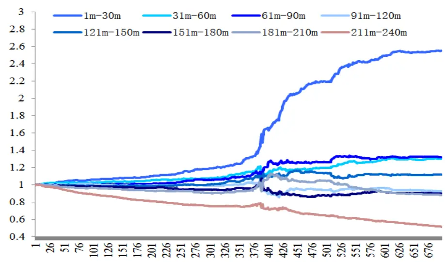
数据来源：国泰君安证券研究

表 2: Daily Reverse 因子绩效统计

|  | 1m-30m | 31m-60m | 61m-90m | 91m-120m | 121m-150m | 151m-180m | 181m-210m | 211m-240m |
| --- | --- | --- | --- | --- | --- | --- | --- | --- |
| 因子收益率 | 33.9% | 9.8% | 10.2% | -2.3% | 4.3% | -3.4% | -4.1% | -23.3% |
| 因子收益 IR | 4.06 | 1.23 | 1.22 | -0.27 | 0.52 | -0.39 | -0.46 | -2.70 |
| 风险调整IC | 0.036 | 0.017 | 0.008 | -0.001 | 0.003 | -0.003 | -0.013 | -0.038 |

数据来源：国泰君安证券研究

图 4 Daily Reverse 因子绩效统计
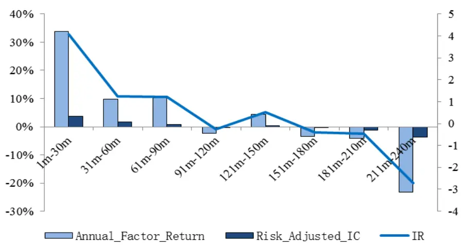
数据来源：国泰君安证券研究

可以看到，尾盘最后 30 分钟的价格走势，蕴含了显著的反转信息，即尾盘拉升的股票次日大概率获取超额负收益，而尾盘下跌的股票次日则有大概率获取超额正收益，并且这一规律除了在股灾等市场极端行情外，无论是在牛市、熊市或是震荡市都较为稳定。

从因子绩效的显著性来看，尾盘最后 30 分钟的因子绩效，其预测显著性高于其余时间段，并且因子年化收益率超过-20%，这在月频率因子检验中是极为罕见的。由此可见，短期价格走势所蕴含的信息，尤其是尾盘 30 分钟，是更为充分的，这也符合我们定义阿尔法因子四维属性的特性。

有趣的是，我们观察到，开盘 30分钟的走势也具有极为显著的预测性，并且其呈现了显著的动量特点，尤其是在趋势较强的市场环境中。也就是说，个股开盘 30分钟的走势与次日走势大概率正相关，而收盘 30 分钟的走势则与次日走势大概率负相关。这与我们上述提到了，在开盘 30分钟及尾盘 30分钟交易时间段内，成交最为活跃、信息反映最为有效、筹码转换最为充分的直观经验是相一致的。

接下来，我们同样根据日内 1分钟数据构建波动率因子，具体构建方式如下所示：

Daily Volatility = 0.5*Dastd+0.5*Residual Volatility

| Daily Volatility | Dastd 日内T时间段内股票收益率标准差 |
| --- | --- |
|  | Residual Volatility 日内T时间段内股票收益率残差标准差 |

同样，我们将构建日内 8 个 30 分钟内，对应的 Daily Volatility 因子，并检验其与次日个股收益率截面的统计关系，具体结果如下所示：

图 5 Daily Volatility 因子累计收益率
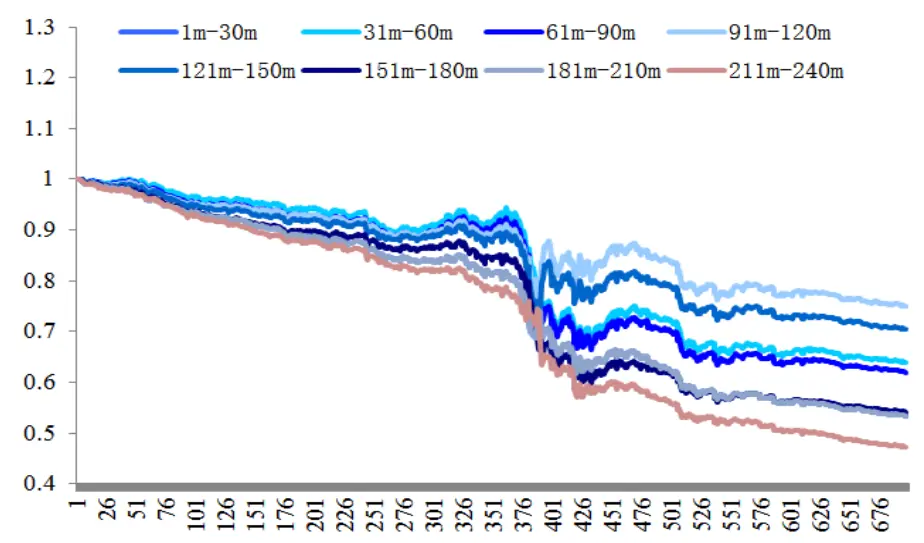
数据来源：国泰君安证券研究

表 3: Daily Volatility 因子绩效统计

|  | 1m-30m | 31m-60m | 61m-90m | 91m-120m | 121m-150m | 151m-180m | 181m-210m | 211m-240m |
| --- | --- | --- | --- | --- | --- | --- | --- | --- |
| 因子收益率 | -7.88% | -15.39% | -16.48% | -9.64% | -11.92% | -21.36% | -21.86% | -26.23% |
| 因子收益IR | -0.64 | -1.31 | -1.40 | -0.83 | -1.03 | -1.86 | -1.86 | -2.28 |
| 风险调整IC | -0.002 | -0.005 | -0.007 | -0.007 | -0.010 | -0.014 | -0.019 | -0.024 |

数据来源：国泰君安证券研究

图 6 Daily Volatility 因子绩效统计
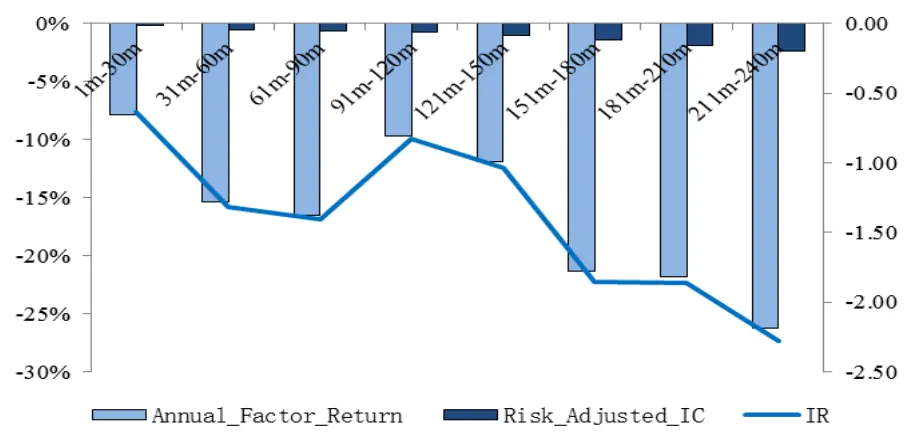
数据来源：国泰君安证券研究

与收益率因子 Daily Reverse 一样，波动率因子 Daily Volatility 同样是在最后 30 分钟时间段内，预测显著性最强。并且，Daily Revers 因子年化因子收益率高达-26.23%，信息比率为-2.28。这表明，尾盘 30分钟内波动率越小的个股，在次日则将大概率跑赢基准，反之亦然。这与个股在月频率的波动率属性同样也是一致的，只不过在准高频的维度下，显著性更强。

最后，我们同样根据日内 1分钟价格与成交金额数据构建流动性冲击因子，具体构建方式如下所示：

| Daily MILLIQ |  | 日内T时间段内成交金额峰值区间中， |
| --- | --- | --- |
|  | Daily Maxilliq | 股价涨跌幅比成交金额 |

同样，同样，我们将构建日内 8 个 30 分钟内，对应的 Daily MILLIQ 因子，并检验其与次日个股收益率截面的统计关系，具体结果如下所示：

图 7 Daily MILLIQ 因子累计收益率
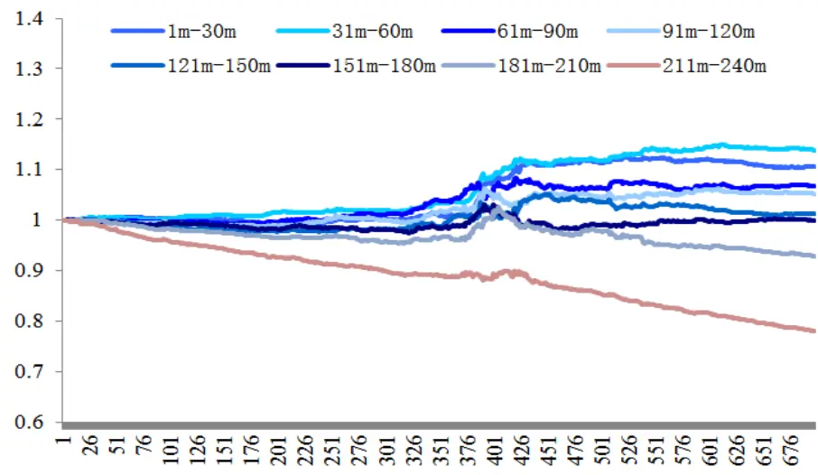
数据来源：国泰君安证券研究

表 4: Daily MILLIQ 因子绩效统计

|  | 1m-30m | 31m-60m | 61m-90m | 91m-120m | 121m-150m | 151m-180m | 181m-210m | 211m-240m |
| --- | --- | --- | --- | --- | --- | --- | --- | --- |
| 因子收益率 | 3.65% | 4.71% | 2.39% | 1.88% | 0.53% | 0.03% | -2.61% | -8.83% |
| 因子收益 IR | 1.84 | 2.43 | 1.07 | 0.72 | 0.19 | 0.01 | -1.13 | -4.14 |
| 风险调整IC | 0.001 | 0.004 | 0.001 | 0.000 | 0.000 | -0.001 | -0.006 | -0.014 |

数据来源：国泰君安证券研究

图 8 Daily MILLIQ 因子绩效统计
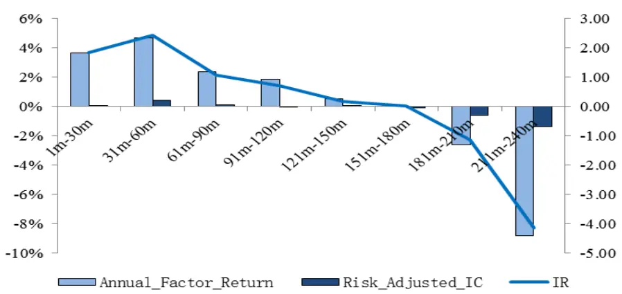
数据来源：国泰君安证券研究

流动性冲击因子同样也是在最后 30 分钟内预测效果最为显著，即流动性冲击越小的个股，次日将大概率跑赢基准。同时 Daily MILLIQ 因子收益率的信息比率高达 4.14，体现了极强的稳定性。

可以发现，无论是从收益率、波动率还是流动性冲击效用 3个角度检验，尾盘 30 分钟的预测显著性均明显强于其余时间段，呈现收益率反转、低波动与低流动性冲击的个股在次日将有更好的表现。

通过上述检验，我们认为在尾盘 30 分时间段内，投资者交易所产生的价格、成交量等信息更能充分反映投资者对未来股价走势的预期。

## 3.2.因子组合构建

我们下面分别构建基于尾盘 30 分钟时间段各因子的最小波动纯因子组合（Minimum Volatility Pure Factor Portfolio, MVPFP），以统计因子内在的收益风险属性，时间自 2013 年至 2016 年，组合构建方式具体为（MVPFP 构建详情参考专题报告《如何将阿尔法因子转化为超额收益》）：

$$
\begin{array}{ll}{{Min}}&{{\tilde{\sigma}_{\;_{active\;portfolio}}}}\\{{s.t.}}&{{w^{\prime}\cdot X_{\;_{T\;\mathrm{arg}\;et}}=1}}\\{{}}&{{}}\\{{}}&{{w^{\prime}\cdot X_{\;_{Risk}}=0}}\end{array}
$$

其中，方程的权重解集合为 $W=\textstyle\sum^{^{-1}}\:X\:(\:X\:^{\prime}\sum^{^{-1}}\:X\:)^{^{-1}}$ ，模拟组合构建不考虑交易成本，3因子组合绩效结果如下：

图 9 Daily Reverse MVPFP 累计收益率
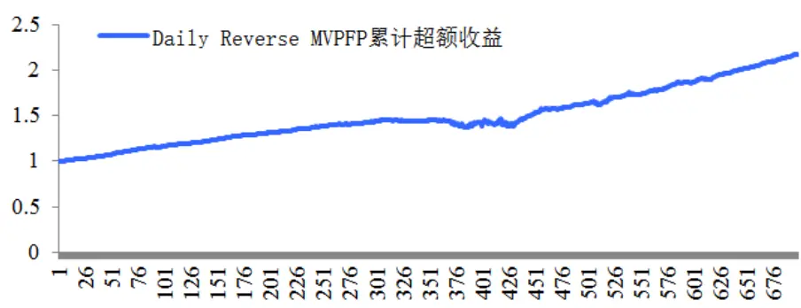
数据来源：国泰君安证券研究

图 10 Daily Volatility MVPFP 累计收益率
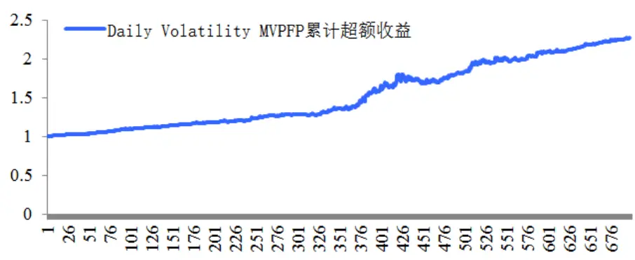
数据来源：国泰君安证券研究

图 11 Daily MILLIQ MVPFP 累计收益率
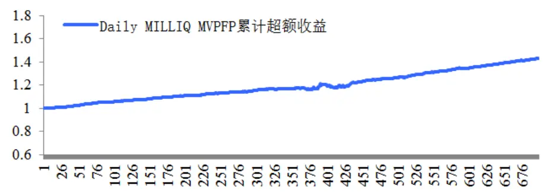
数据来源：国泰君安证券研究

表 5: 组合绩效统计

|  | Daily Reverse 组合 | Daily Volatility 组合 | Daily MILLIQ 组合 |
| --- | --- | --- | --- |
| 年化收益率 | 28.14% | 30.10% | 12.88% |
| 年化波动率 | 7.29% | 11.80% | 3.12% |
| 信息比率 | 3.86 | 2.55 | 4.13 |
| 最大回撤 | 6.43% | 6.62% | 2.76% |

数据来源：国泰君安证券研究

绩效统计的结果表明，通过适当的组合构建，3 因子的内在逻辑与收益风险特征均可实现，并且组合收益的稳定性较强。从单因子组合的收益角度而言，Daily Reverse 组合和 Daily Volatility 组合在不考虑成本的情况下，年化收益率均在 30%左右，这在月频率的因子构建中是几乎不可能的。这表明，在准高频领域，因子模型蕴含的超额收益可能比我们想象的更高。

## 3.3. 超额收益预测

最后，我们利用上述计算的收益、波动、流动性冲击 3类因子，对次日的超额收益进行预测统计，即计算预测超额收益截面与实际超额收益截面的相关系数 IC。其中，超额收益阿尔法的估计方式我们采用经典的$ALPHA=IC^{*}SCORE^{*}VOLATILITY$ 的方式，即对于第 t 天的 DailyReverse 、 Daily Volatility 、 Daily MILLIQ 因子，其所估计得第 t+1 日的超额收益率截面为：

$$
\begin{aligned}&Alpha_{_{t+1}}\\&=(DailyR_{_{t}}\cdot\overline{IC}_{_{R}}+DailyV_{_{t}}\cdot\overline{IC}_{_{V}}+DailyMI_{_{t}}\cdot\overline{IC}_{_{MI}})\cdot residual\nu olatility_{_{t+1}}\\\end{aligned}
$$

其中 $DailyR_{_t}$ $DailyV_{_t}$ $DailyMI_{_t}$ 分别为第 t 日，3 个因子的标准化截面， $\overline{IC_{_R}}、\overline{IC_{_V}}、\overline{IC_{_{ML}}}$ 分别为 3 个因子历史 250 日 IC均值（我们暂不考虑 IC的权重问题）， $而疆$ 为风险模型估计得到的第 t+1 日的个股残差波动率截面。

我们选择分布更为均匀的中证 500指数作为比较基准，计算阿尔法预测截面与个股实现超额中证 500收益率截面的组合信息系数，即

$$
IC_{_{Portfolio}}=Corrcorf\left(E\left\{Alpha\right\},r\right)
$$

进而，我们对 $IC_{\it{\Delta}_{Portfolio}}$ 序列进行显著性统计，以验证超额收益的预测是否存在统计意义上的显著性，具体结果如下：

图 12：IC Portfolio 序列
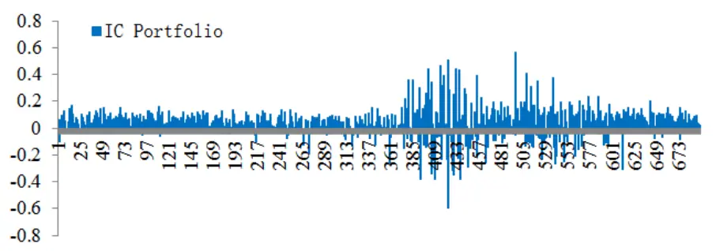
数据来源：国泰君安证券研究

表 6: IC Portfolio 序列绩效统计

| IC 均值 | T检验值 | 胜率 |
| --- | --- | --- |
| 0.043 | 6.21 | 74.5% |

数据来源：国泰君安证券研究

对于 $IC_{\it{\Delta}_{Portfolio}}$ 序列的显著性检验可以发现，除了在股灾等市场极端行情

外，其余时间仅用我们定义的收益、波动、流动性冲击 3因子预测次日个股的超额收益， IC序列的 T检验显著高达 6.21，这表明利用尾盘 30分钟的股价信息对超额收益的预测存在极强的统计显著性。

## 4. 总结

本篇报告是系列报告《短期股价走势的预测信息》的第一篇，我们通过阿尔法因子四维属性的思考，将研究深入各频率下的因子观察与检验。我们发现，在高频或准高频领域，阿尔法因子的内在收益率将大幅提升，并且其对未来价格走势的预测显著性也将大幅提升，这或许会对未来的量化研究有较大的启发。

研究具体而言，我们通过交易日股票价格走势的观察，从收益、波动、流动性冲击 3个维度进行了因子研究。我们分别检验了其日内各分档时间段的因子预测显著性绩效，以及相应的因子组合。结果表明，日内尾盘 30 分钟的价量对次日超额收益具有显著的预测信息，投资者在尾盘30分钟的交易行为是成交最为活跃、信息反映最为有效、筹码转换最为充分的阶段。然后，我们根据 3类因子的定义，对次日股票超额收益进行了预测显著性统计，结果表明，仅利用尾盘 30 分钟构建的收益、波动、流动性冲击 3类因子，即可对次日超额收益实现显著的预测。

高频因子的实际用法有多种，包括直接利用高频因子构建高频选股策略、将高频因子加入低频组合再增强、日内 T+0的量化策略、亦或是高频因子低频策略的构建等。我们将在下一篇专题报告《组合换手率与超额收益》中，引入了换手率控制的组合构建方法，这在高频策略的实现中是尤为重要的，因为高频策略对交易成本、换手率更为敏感，需要更为严格、定量的约束能力。

我们在本系列的后续报告中，将结合其他的研究观察结果，构建较为完整的高频（准高频）投资策略与体系。面对日趋严酷的市场投资环境，量化研究需要找到更为显著、稳定的本源信息，并结合高效的组合构建技术，实现真正的突破。可以想象，未来中国最顶尖的对冲基金，其策略一定包含有各维度、各逻辑、各频率下的超额信息来源，投资经理需通过组合管理的各种方法，实现最优的投资收益风险结构。

## 本公司具有中国证监会核准的证券投资咨询业务资格

## 分析师声明

作者具有中国证券业协会授予的证券投资咨询执业资格或相当的专业胜任能力，保证报告所采用的数据均来自合规渠道，分析逻辑基于作者的职业理解，本报告清晰准确地反映了作者的研究观点，力求独立、客观和公正，结论不受任何第三方的授意或影响，特此声明。

## 免责声明

本报告仅供国泰君安证券股份有限公司（以下简称“本公司”）的客户使用。本公司不会因接收人收到本报告而视其为本公司的当然客户。本报告仅在相关法律许可的情况下发放，并仅为提供信息而发放，概不构成任何广告。

本报告的信息来源于已公开的资料，本公司对该等信息的准确性、完整性或可靠性不作任何保证。本报告所载的资料、意见及推测仅反映本公司于发布本报告当日的判断，本报告所指的证券或投资标的的价格、价值及投资收入可升可跌。过往表现不应作为日后的表现依据。在不同时期，本公司可发出与本报告所载资料、意见及推测不一致的报告。本公司不保证本报告所含信息保持在最新状态。同时，本公司对本报告所含信息可在不发出通知的情形下做出修改，投资者应当自行关注相应的更新或修改。

本报告中所指的投资及服务可能不适合个别客户，不构成客户私人咨询建议。在任何情况下，本报告中的信息或所表述的意见均不构成对任何人的投资建议。在任何情况下，本公司、本公司员工或者关联机构不承诺投资者一定获利，不与投资者分享投资收益，也不对任何人因使用本报告中的任何内容所引致的任何损失负任何责任。投资者务必注意，其据此做出的任何投资决策与本公司、本公司员工或者关联机构无关。

本公司利用信息隔离墙控制内部一个或多个领域、部门或关联机构之间的信息流动。因此，投资者应注意，在法律许可的情况下，本公司及其所属关联机构可能会持有报告中提到的公司所发行的证券或期权并进行证券或期权交易，也可能为这些公司提供或者争取提供投资银行、财务顾问或者金融产品等相关服务。在法律许可的情况下，本公司的员工可能担任本报告所提到的公司的董事。

市场有风险，投资需谨慎。投资者不应将本报告作为作出投资决策的唯一参考因素，亦不应认为本报告可以取代自己的判断。
在决定投资前，如有需要，投资者务必向专业人士咨询并谨慎决策。

本报告版权仅为本公司所有，未经书面许可，任何机构和个人不得以任何形式翻版、复制、发表或引用。如征得本公司同意进行引用、刊发的，需在允许的范围内使用，并注明出处为“国泰君安证券研究”，且不得对本报告进行任何有悖原意的引用、删节和修改。

若本公司以外的其他机构（以下简称“该机构”）发送本报告，则由该机构独自为此发送行为负责。通过此途径获得本报告的投资者应自行联系该机构以要求获悉更详细信息或进而交易本报告中提及的证券。本报告不构成本公司向该机构之客户提供的投资建议，本公司、本公司员工或者关联机构亦不为该机构之客户因使用本报告或报告所载内容引起的任何损失承担任何责任。

## 评级说明

## 1.投资建议的比较标准

投资评级分为股票评级和行业评级。

以报告发布后的12个月内的市场表现为比较标准，报告发布日后的12个月内的公司股价（或行业指数）的涨跌幅相对同期的沪深300指数涨跌幅为基准。

## 2.投资建议的评级标准

报告发布日后的 12 个月内的公司股价（或行业指数）的涨跌幅相对同期的沪深300指数的涨跌幅。

|  | 评级 说明 |  |
| --- | --- | --- |
| 股票投资评级 | 增持 | 相对沪深 300指数涨幅15%以上 |
|  | 谨慎增持 | 相对沪深300指数涨幅介于5%～15%之间 |
|  | 中性 | 相对沪深300指数涨幅介于-5%～5% |
|  | 减持 | 相对沪深300指数下跌 5%以上 |
| 行业投资评级 | 增持 | 明显强于沪深 300 指数 |
|  | 中性 | 基本与沪深300指数持平 |
|  | 减持 | 明显弱于沪深 300指数 |

## 国泰君安证券研究所

|  | 上海 | 深圳 | 北京 |
| --- | --- | --- | --- |
| 地址 | 上海市浦东新区银城中路168号上海 银行大厦29层 | 深圳市福田区益田路 6009 号新世界 商务中心34层 | 北京市西城区金融大街 28 号盈泰中 心2号楼10层 |
| 邮编 | 200120 | 518026 | 100140 |
| 电话 | （021)38676666 | (0755)23976888 | (010)59312799 |
|  | E-mail: gtjaresearch@gtjas.com |  |  |