nInfo] [Table_Title] 2017.01.06

# 基金收益率分解及其在FOF选基中的应用

## ——数量化专题之八十五

刘富兵（分析师）

叶尔乐（研究助理）

8 021-38676673

021-38032032

liufubing008481@gtjas.com

yeerle@gtjas.com

证书编号 S0880511010017

S0880116080361

## 本报告导读：

利用资产因子模型，基金收益可以分解为各风格的收益和选股的收益，选股收益高且稳定的基金未来更好，用其作为选基指标选基可稳定获得超越基金中位数的收益。摘要：

le_Summary]动量效应选基无法获取基金考察期的收益，选基具有滞后性，且选基逻辑不纯粹，本报告通过剥离资产风格对基金的影响，仅考察基金选股能力构建选基策略，选基效果更好更稳定。利用资产因子模型，合理选择风格基准指数，基金收益可分解为不同风格上的收益和选股收益，基金之间的风格收益同质性强，而选股收益有着很大的区别。通过基金画像分析可知，长期优秀的偏股混合类主动型基金与量化型基金都具有长期正的选股收益。利用基金的选股收益移动平均作为选基指标选基自 2006 年 1 月到 2016 年 10 月可获得年化29.90%的绝对收益，策略相对沪深 300指数和备选基金中位数的年化超额收益分为为 27.07%和 25.14%，且策略相对备选基金中位数的超额收益长期稳定，最大回撤-10.89%。

选股能力是基金经理的个人特质，但是由于市场风格变化等各种因素，基金经理表现出来的选股能力很难长期保持，与其追踪基金经理进行长期投资，不如追踪选股能力来轮动选基。考察具有卓越选股能力的基金产品和其对应的基金经理，可以发现基金经理的选股能力短期有“强者恒强”的特点，各个时期选股能力强的基金集中且数量少，选股能力作为基金的特征相对稳定。但是一只选股能力强的基金从被识别开始，其选股能力很难保持2 年以上，很少有基金能够适应所有的市场环境，并且同一基金经理同时管理的多个基金产品所表现出来的选股能力也并不一定一致，因此从FOF的角度来看，追踪基金经理进行长期投资不如根据选股能力来选基。

金融工程

## 金融工程团队：

刘富兵：（分析师）

电话：021-38676673

邮箱：liufubing008481@gtjas.com

证书编号：S0880511010017

## 陈奥林：（分析师）

电话：021-38674835

邮箱：chenaolin@gtjas.com

证书编号：S0880516100001

## 李辰：（分析师）

电话：021-38677309

邮箱：lichen@gtjas.com

证书编号：S0880516050003

## 孟繁雪：（研究助理）

电话：021-38675860

邮箱：mengfanxue@gtjas.com

证书编号：S088011604008

## 殷明：（研究助理）

电话：021-38674637

邮箱：yinming@gtjas.com

证书编号：S0880116070042

## 叶尔乐：（研究助理）

电话：021-38032032

邮箱：yeerle@gtjas.com

证书编号：S0880116080361

## [Table_R相关报告

《短期股价走势的预测信息（1）— 神秘的尾盘 30 分钟》2016.12.21

《期指交割平稳，市场情绪偏谨慎》2016.11.19

《投资和交易：价格，交易量和波动率》2016.11.18

《基于 MACD价格分段的阻力与支撑研究》2016.09.29

《基于奇异谱择时的 FOF 动量策略》2016.09.27

## 1. 前言

FOF的投资流程涉及五个步骤，从上至下分别为：FOF产品设计、大类资产配臵、细类资产配臵、策略设计和基金选择。FOF产品设计的目的在于评估投资人的投资偏好，从而设计出具有针对性的产品结构，其决定了产品的投资目标。资产配臵包括大类资产和细类资产，主要根据各种资产风险收益特征的不同，挑选能够满足产品设计的类型资产。策略设计主要涉及持仓策略和资产再平衡策略的制定，是实现产品设计目标的主要方式。最后，由于 FOF 的本质是基金的组合，因此 FOF 设计的最终问题还是具体基金的选择。

图 1 FOF设计流程
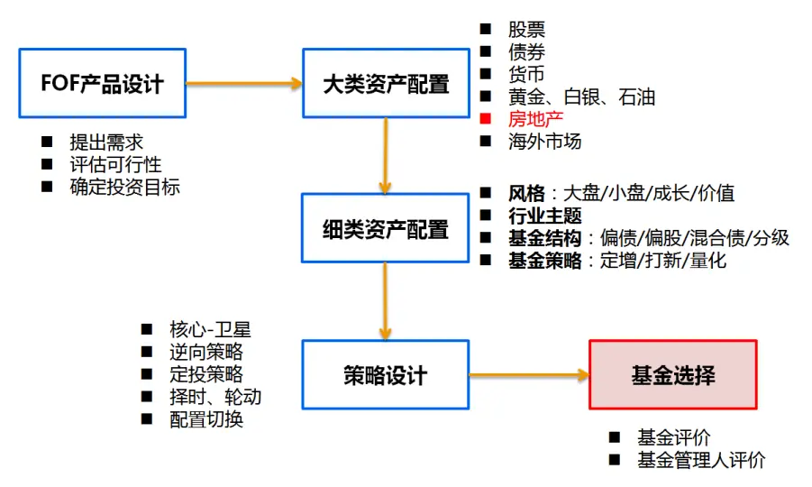
数据来源：国泰君安证券研究

本报告认为基金的选择是 FOF研究的基石，只有明确了基金选择策略，上层策略才能够得到有效回测和验证。因此本报告继续尝试解决类别资产下基金选择的问题。在上一篇报告《基于奇异谱择时的 FOF动量策略》中我们解决了基金选择的一个基本问题：

## 历史表现好的基金未来能否持续？

我们给出的结论是：针对股票型、混合型和债券型基金，在合适的动量描述指标下基金具有短期动量效应。由于动量效应选基无法获取基金考察期的收益，选基具有滞后性，并且由于动量选基考察的是基金投资最终的结果，其中结合了基金管理者的选股能力、择时能力、风险控制能力等等诸多因素，选基逻辑不纯粹，难以做到与上层策略的有效结合，因此本报告将尝试解决如下问题：

## 能否找到可解释基金良好表现的内因，从而深入动量本质？

基于此问题，本报告尝试对基金收益来源进行分解，探究基金业绩的内部因素，分离基金的择风格能力和选股能力，尝试发现基金业绩背后的稳定特质。

## 2. 基金收益率分解法

## 2.1.方法背景与描述

## 2.1.1. 提出背景

FOF收益的第一大来源为资产配臵，但是由于 FOF所配臵基金对各类资产的暴露并不完全公开，FOF管理人无法精确得到具体的配臵比例，从而削弱其对 FOF资产配臵的控制能力。在此背景下对基金资产风格考察的需求应运而生。

所谓“风格”，我们认为是某一类受到相似因素影响的证券所表现出来的趋同的风险收益特征。对于基金风格的分析方法从可获得的数据角度大致有两类：第一类利用基金持仓明细分析基金风格，第二类利用基金历史收益率分析基金风格。第一类方法可以通过 持 仓 分 析（Portfolio-Based Analysis，PBSA）确定某一时间截面上的基金持仓风格，但是由于持仓明细数据发布频率低，较难连续跟踪基金风格变化。第二类方法可以通过收益率分析（Return-Based Analysis，RBSA）拟合基金任意时段的平均风格表现，从投资结果中提取基金的风格特征，虽然精确度不如持仓分析，但是较高的数据发布频率使得分析可以相对连续的跟踪基金变化。本报告主要采用第二种分析方法。

## 2.1.2. 算法说明

William F. Sharpe 于 1992 年结合资产因子模型（Asset class factor model）提出收益率分析法，将资产风格划分为大盘价值、大盘成长、中盘、小盘以及不同类债券和海外市场，利用多元线性回归方法，对基金收益率进行回归，以最小化残差平方和为目标，得到基金在各资产风格上的近似比例。

$$
\begin{array}{c}{R_{t}=\left[\delta_{1}x_{1,t}+\delta_{2}x_{2,t}+\cdots+\delta_{n}x_{n,t}\right]+\varepsilon_{t}}\\{s.t.\ \delta_{1}+\delta_{2}+\cdots+\delta_{n}=1,}\\{\delta_{i}\geq0,i=1,2,\ldots,n}\end{array}
$$

其中 $R_{t}$ 代表基金 t 期收益率， $x_{i,t}$ 代表资产风格 i 在 t 期收益率，回归系数代表基金在各资产风格上的近似配臵比例。模型假设基金不能做空、不能加杠杆。

在得到基金于各资产风格上的近似比例后，我们可以利用此比例构建基金 的 “ 历史 风 格 指数” 。 在 选定市 场 基 准指数后我们可以得到基金在考察期任意区间内超额收益率的一种分解形式：

$$
\begin{array}{rl}&{R_{t}-Benchmark_{t}}\\&{\qquad=[R_{t}-FundStyleIndex_{t}]}\\&{\qquad+[FundStyleIndex_{t}-Benchmark_{t}]}\end{array}
$$

分解的前半部分代表基金偏离其所选风格的超额收益，这部分收益可能来自三方面：

1、模型风格基准选择不良，收益率未被所选风格充分解释；

2、基金挑选个股能力突出，获得了偏离风格的收益；

3、其他原因（例如大规模申购赎回导致的净值波动）。

对于原因 1，本报告通过合理的风格基准选取，尽可能的提高模型的解

释度来避免，模型解释度本报告用 $\begin{array}{r}{R^{2}=1-\frac{VAR(\varepsilon_{t})}{VAR(R_{t})},}\end{array}$ 代表。对于原因 3，

由于其大部分为突发性原因，不具有持续性，对于长期分析不构成显著影响。因此在模型解释度较高的前提下，我们认为这部分收益大概率来自基金优选个股的能力。

分解的后半部分代表基金所选风格相对市场基准的超额收益，代表了基金风格择时的超额收益。相比于选股，基金风格择时的行为并不一定是主动和有计划的。

我们将前半部分命名为基金的选股 Alpha，后半部分命名为基金的风格Alpha。

图 2 选股 Alpha 与风格 Alpha
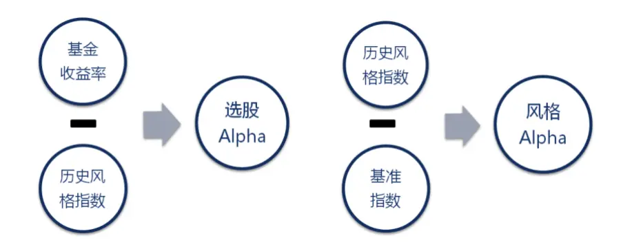
数据来源：国泰君安证券研究

## 2.1.3. 风格基准选取

风格的选取首先要尽可能穷尽基金能投资的所有标的，并且风格与风格的标的之间要有互斥性。以混合型公募基金为例，可投资的标的主要有A股、债券、货币、权证及股指期货，大部分非量化对冲型基金实际在权证和股指期货上的投资比例非常小，可以忽略不计。划分为偏股混合型的量化公募基金大部分目标也都是指数增强，极少做大规模的对冲，因此我们主要关心 A股和债券的风格特点。

图 3 偏股混合型量化基金投资于股指期货市值占股票总市值比例
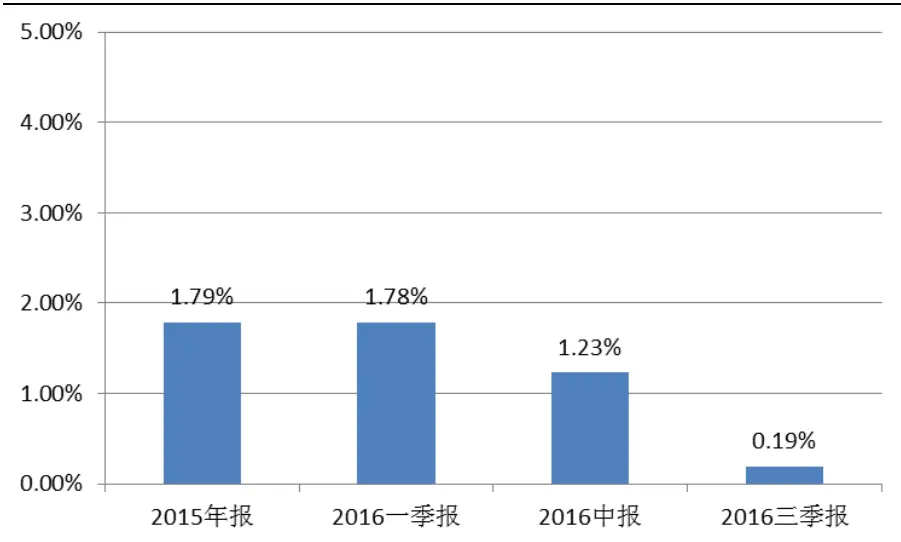
数据来源：Wind，国泰君安证券研究 注：投资于股指期货市值指合约名义金额，正值表示买入持仓，负值表示卖出持仓

A股市场传统的风格划分有市值风格（大盘/中盘/小盘）、成长-价值风格等。风格基准指数的选取可以自行构建，但本报告认为市场上已有的指数经历了长期市场检验，其构建方法相对成熟，并且其对市场风格的划分已经得到了充分市场共识，综合考虑我们选取中证指数有限公司构建的如下风格基准指数：沪深 300成长、沪深 300价值、中证 500成长、中证 500 价值、中证 1000。沪深 300 指数、中证 500 指数和中证 1000指数成分互不相交，分别代表了 A 股市场的大盘/中盘/小盘股票。从指数之间的相对表现可看到小市值股票比大市值股票长期累计表现要好，但是也存在阶段性大市值股票跑赢小市值股票的阶段。而成长价值风格不论是在大市值股票中还是中小市值股票中都存在轮动，成长和价值间没有绝对占优的风格。

图 4 不同指数累计相对表现
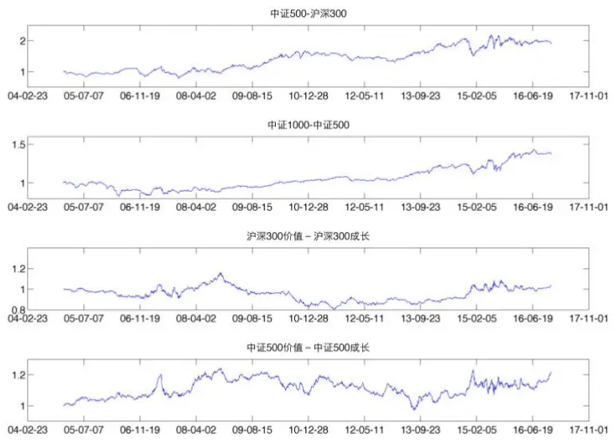
数据来源：国泰君安证券研究

债券风格主要受到债券期限的影响，按照债券期限的不同，我们选择中债总财富指数对应的期限分类指数（1年以下、1-3年、3-5年、5-7年、7-10 年、10 年以上），综合考虑相关性等因素，本报告选取如下三个风格基准指数分别代表了短期债券、中期债券、长期债券：中债总财富（1-3年）、中债总财富（5-7年）、中债总财富（10年以上）。当然债券种类繁多，其受到的影响还包括发行主体、信用评级等等，但是由于本报告主要考察混合型基金的收益率构成，股票市场的波动远高于债券市场，股票指数在回归模型中将是主要影响，因此对债券市场风格进行了简化。

图 5 中债总财富指数表现
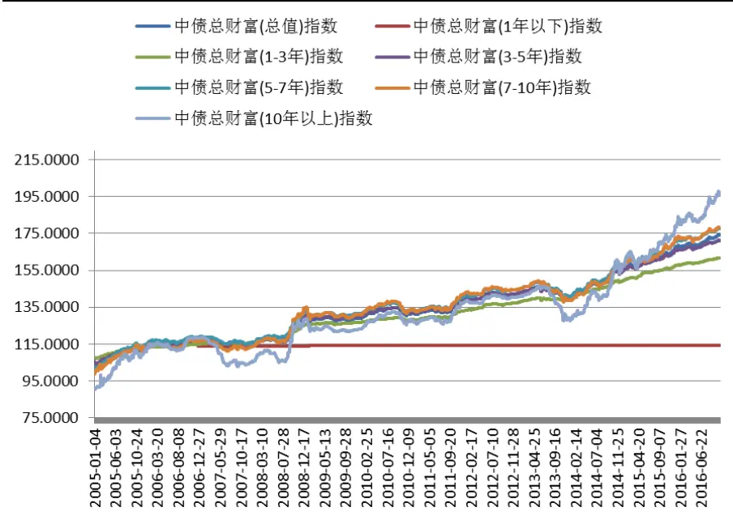
数据来源：Wind，国泰君安证券研究

综上我们最终选择 5个 A股风格基准指数，3个债券风格基准指数，以及现金作为模型回归的自变量：

表 1 选入风格基准

| 标的市场 | 风格基准 | 风格基准指数 |
| --- | --- | --- |
| 股票 | 大市值成长 | 沪深 300 成长 |
|  | 大市值价值 | 沪深 300 价值 |
|  | 中市值成长 | 中证500成长 |
|  | 中市值价值 | 中证500 价值 |
|  | 小市值 | 中证 1000 |
| 债券 | 短期债券 | 中债总财富（1-3年） |
|  | 中期债券 | 中债总财富（5-7年） |
|  | 长期债券 | 中债总财富（10年以上） |
| 货币 | 现金 | 现金 |

数据来源：国泰君安证券研究

## 2.2.基金风格画像

William F. Sharpe 提出的方法利用基金过去的月收益率滚动计算模型，从而连续月份的样本数据高度重叠，同时由于月频数据频率低，要得到稳定的回归结果需要很长的时间跨度（论文中采用 60个月）。因此虽然利用此方法计算，整体的风格变化相对平滑，但是得到的风格分布具有很强滞后性。

由于近几年我国基金净值数据的质量良好，发布频率最高为日频，因此本报告采用日频数据，相邻考察区间互不重叠的方式滚动计算，我们分别用半年频率、季频率和月频率对某一只成长风格偏股混合基金进行基金风格画像。画像时间段：2005年 1月到 2016 年 10月。图中代码分别表示：大市值价值（HS300V）、大市值成长（HS300G）、中市值价值（ZZ500V）、中市值成长（ZZ500G）、小市值（ZZ1000）、长期债券（BONDL）、中期债券（BONDM）、短期债券（BONDS）、现金（Cash）。

图 6 不同频率下的基金画像
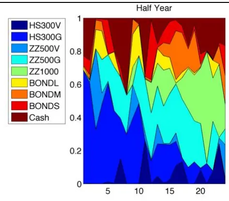
数据来源：国泰君安证券研究

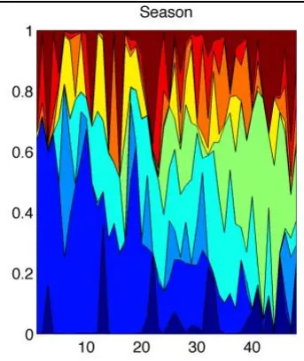

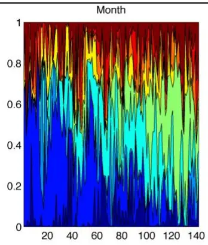

可以看到这只基金的风格早期偏大盘，后期偏中小盘，并且长期偏好成长股，这和此基金的投资目标相符。从月频数据来看，虽然基金风格总体有一个长期漂移，但是相邻月份之间调整频繁。

同样使用日频数据回归，半年频率、季频、月频三种频率下平均 分别为：0.9103、0.9174、0.9270，可见样本数据量的减少并没有削减模型的解释度，由于基金的风格变化频繁，并且收益率分析得到的是考察区间的平均风格，因此月频下进行基金风格画像理论上精确度相对最高。本报告之后的分析将主要建立在月频角度。

我们对某一位明星基金经理管理过的一只偏股混合型基金进行季频和月频的风格画像，并计算相应的风格 Alpha 和选股 Alpha。可以看到在其任期内（图中红圈部分），虽然基金的风格 Alpha不甚稳定，但是基金的选股 Alpha 长期保持正值，这在其他基金中并不多见。在此基金经理离任之后，基金的选股 Alpha 由正变负。通过统计可知此基金在这位基金经理任职期间相对沪深 300 年平均超额收益率 32.23%并且每年都为正，在此基金经理离职后年平均超额收益率-0.53%。可见基金的整体超额收益率与基金经理的选股 Alpha有很大的关系。

图 7 季频率下某明星基金画像
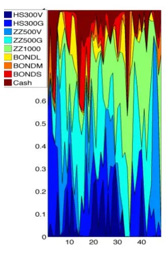

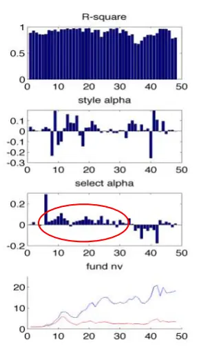
数据来源：国泰君安证券研究

图 8 月频率下某明星基金画像
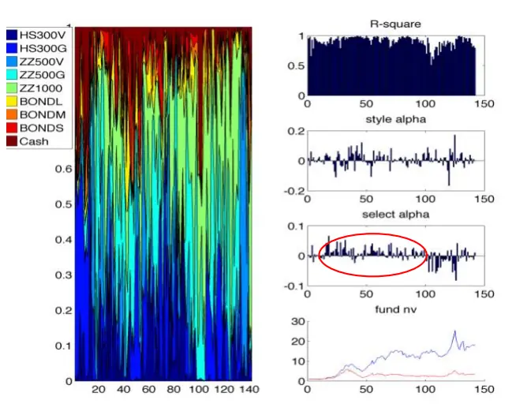
数据来源：国泰君安证券研究

我们再对一只偏股混合型量化基金进行风格画像，此基金是以沪深 300为基准，采用量化策略进行指数增强。可以看到其风格 Alpha 和选股Alpha 大多数时间都为正，但绝对值相对上一只分析的基金不高，这正是量化指数增强型基金的收益特点。此基金在 2014-2016 年分别获得超额收益 18%、10%和 17%（以每年 8 月为节点）。经统计其累计超额收益的最大回撤点在 2014 年 12 月，可以看到这个月选股 Alpha 仍为正，但是风格 Alpha 呈较大负值，量化型公募基金由于其风格偏好中小盘在2014 年的 12 月大盘风格转换期间或多或少都承受了一定的回撤。通过基金画像我们能够更清晰的了解基金超额收益的主要来源和基金所采取策略的特点。

图 9 季频率下某量化基金画像
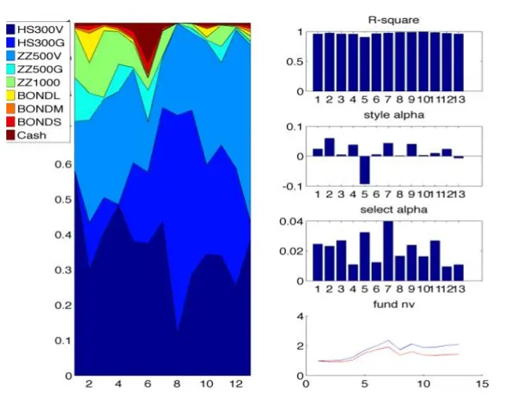
数据来源：国泰君安证券研究

图 10 月频率下某量化基金画像
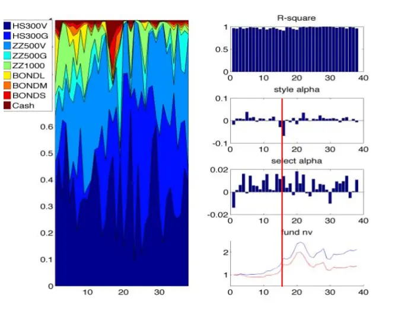
数据来源：国泰君安证券研究

## 3. 在选基中的应用

在本章中我们主要探索风格 Alpha 和选股 Alpha 对于选基的指导意义，包括是否有选基作用以及用什么形式去选基。作为选基指标，首先要考察的是指标是否在不同基金上有区分度。我们选取所有的 2010 年以前成立的偏股混合型基金，考察其 2010年到 2016 年月频率下不同基金风格 Alpha之间和选股 Alpha之间的平均相关系数。

表 2 不同基金间的指标平均相关系数

|  | 平均相关系数 |
| --- | --- |
| 风格 Alpha | 81.59% |
| 选股 Alpha | 27.73% |

数据来源：国泰君安证券研究

可以看到不同基金之间的风格 Alpha 相关性普遍很高，区分度不大，而选股 Alpha 相关性普遍很低，从下方的指标时间序列图中也能看到，每个月的风格 Alpha 相差不大，符号基本一致，而选股 Alpha 之间有很大的区别。因此作为选基指标选股 Alpha 更适合用来区分基金，下面我们将主要验证选股 Alpha是否对基金未来的良好业绩表现有预测性。

图 11 各基金 2010 年到 2016 年月风格 Alpha 与选股 Alpha
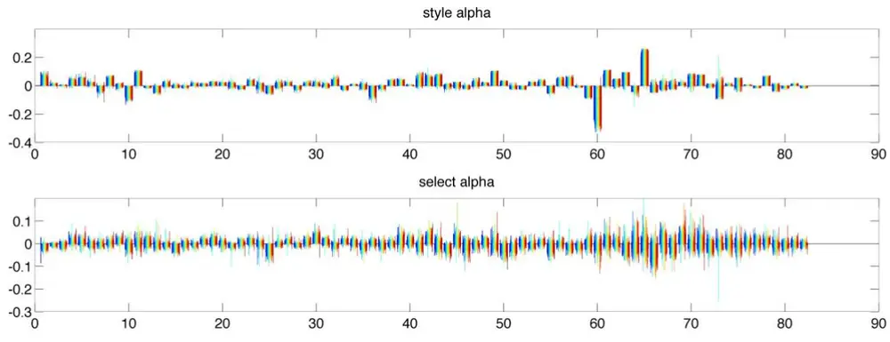
数据来源：国泰君安证券研究

## 3.1. 选股 Alpha 的选基能力分析

本报告以选基结果为标准评价指标的选基能力，通过构建指标选基策略考察选基结果相对比较基准（沪深 300指数、样本基金收益率中位数）的超额收益率以及胜率。

从第二节的基金画像举例中可以看到，长期为正的选股 Alpha 可能与基金经理个人能力和基金采用的策略相关，由于基金经理跳槽现象普遍，长期管理一只基金的情况较少，并且基金经理管理的不同基金的选股Alpha 表现并不一定具有一致性，从跟踪基金经理和策略的角度构建选股 Alpha 选基策略不便，本报告采用基金任意时刻过去平均选股 Alpha作为对基金未来选股 Alpha的预测值，也即选基指标进行选基。

针对选股 Alpha本报告构建的指标选基策略为：在月频率下计算备选基金过去 12个月平均选股 Alpha，作为选基指标。筛选出当月模型解释度大于 0.6的基金作为备选基金，利用选基指标对所有备选基金进行排序，选取所构造指标最高的 5只基金等权构建 FOF组合，按照月频率调仓。（由于公募 FOF 单只基金 20%的仓位限制，因此对于一只 FOF 产品至少需要等权的选择 5 只基金）策略回测时间为 2005 年 12 月到 2016 年10月。本策略的备选基金池选定为非分级基金的偏股混合型基金，基金数量共 489只。策略回测结果如下：

表 3 指标选基策略回测结果

|  | 年化收益率 | 年收益率 平均 | 年收益率 波动率 | 最大回撤 | 胜率 |
| --- | --- | --- | --- | --- | --- |
| 绝对收益 | 29.90% | 41.51% | 58.64% | -56.61% | 66.67% |
|  | 年化超额收 益率 | 年超额收益 率平均 | 年超额收益 率波动率 | 最大回撤 | 胜率 |
| 相对沪深 300 | 27.07% | 12.39% | 28.67% | -30.04% | 59.09% |
| 相对备选基 金中位数 | 25.14% | 14.10% | 12.30% | -10.89% | 65.91% |

数据来源：国泰君安证券研究

表 4 策略各年绝对收益

| 策略绝对收益 | 沪深300 | 备选基金中位数 |
| --- | --- | --- |
| 2006 135.65% | 121.02% | 119.48% |
| 2007 125.31% | 161.55% | 119.10% |
| 2008 -50.55% | -65.95% | -49.63% |
| 2009 84.51% | 96.71% | 66.32% |
| 2010 16.99% | -12.51% | 2.61% |
| 2011 -23.35% | -25.01% | -24.09% |
| 2012 17.58% | 7.55% | 4.71% |
| 2013 57.61% | -7.65% | 13.17% |
| 2014 42.35% | 51.66% | 20.15% |
| 2015 56.91% | 5.58% | 44.40% |
| 2016（至10月） -5.40% | -10.48% | -12.25% |

数据来源：国泰君安证券研究

图 12 策略净值曲线
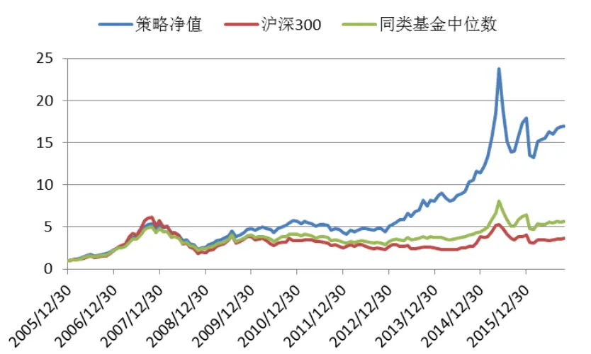

数据来源：国泰君安证券研究

图 13 策略相对沪深 300累计超额收益曲线
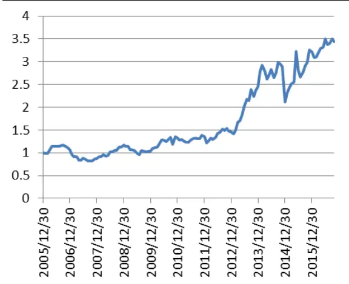
数据来源：国泰君安证券研究

图 14 策略相对备选基金中位数累计超额收益曲线
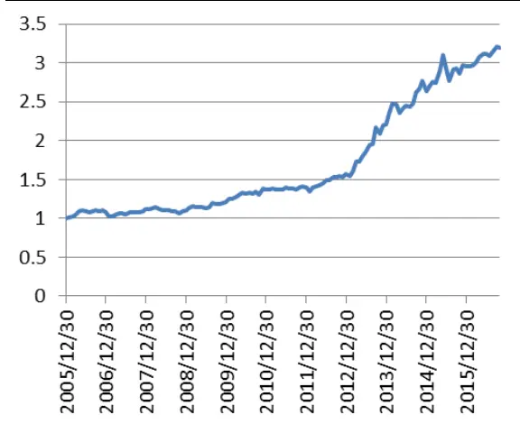
数据来源：国泰君安证券研究

回测证明利用选股 Alpha 选基能够长期获得超越沪深 300 指数和备选基金（偏股混合型）中位数的超额收益。选股 Alpha 作为选基指标有效性得到证实。下面我们对策略涉及的参数进行敏感性测试。本策略共涉及以下几个参数：

## 1、选基数量；

2、模型解释度筛选阈值；

3、平均选股 Alpha 窗口参数。

我们首先对选基数量和模型解释度筛选阈值进行敏感性测试，主要考察以下参数组的策略表现：

表 5 敏感性测试参数选择与考察结果

| 参数组序号 | 选基数量 | 模型解释度 筛选阈值 | 年化收益率 |
| --- | --- | --- | --- |
| 1 | 5 | 0.5 | 29.34% |
| 2 | 5 | 0.6 | 29.90% |
| 3 | 5 | 0.7 | 29.80% |
| 4 | 10 | 0.5 | 25.17% |
| 5 | 10 | 0.6 | 24.63% |
| 6 | 10 | 0.7 | 25.57% |
| 7 | 15 | 0.5 | 24.09% |
| 8 | 15 | 0.6 | 24.01% |
| 9 | 15 | 0.7 | 24.22% |

数据来源：国泰君安证券研究

图 15 参数敏感性测试
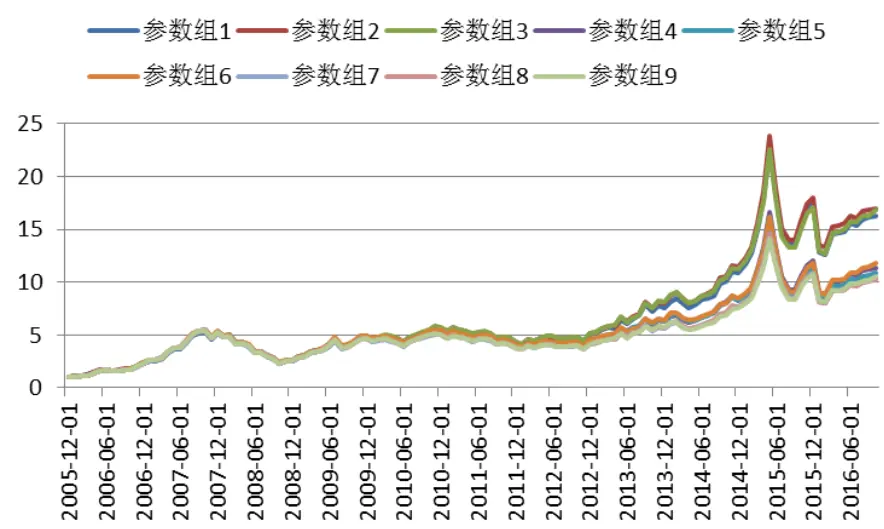
数据来源：国泰君安证券研究

可以看到策略对于模型解释度阈值几乎不敏感，在其取 50%-70%的区间里基本对策略结果没有影响，而选基数量对策略的影响较大，我们将在下一节的分析中看到，选股能力强的基金有强者恒强的特点，在整个市场中选股能力强的基金数量极少，因此扩大选基数量势必降低策略效果，选 10只和选 15只相对于选 5只效果差。

对于平均选股Alpha窗口参数，我们考察所有偏股混合型基金选股Alpha自相关系数，具有显著正自相关性的滞后项序号分布如下，可以看到选股 Alpha 与滞后 3、6、9、12、15 项正相关性显著的概率较高，为什么这些突出的滞后项正好相差三个月，需要进一步的探索，本报告仅考察策略对其的敏感性。

图 16 具有显著正自相关性滞后项序号分布
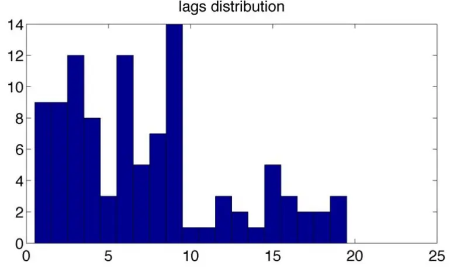
数据来源：国泰君安证券研究

表 6敏感性测试参数选择与考察结果

| 参数序号 | 平均选股 Alpha 窗口参数 年化收益率 |
| --- | --- |
| 1 | 3 22.01% |
| 2 | 6 24.33% |
| 3 | 9 27.93% |
| 4 | 12 29.90% |
| 5 | 15 25.19% |

数据来源：国泰君安证券研究

可以看到策略在平均选股Alpha窗口参数为12时也即一年考察期的情况下效果最好，过短的考察期（3、6）会削弱策略的效果，但是对窗口参数进行微调比如 9和 15，策略效果变化不太大，策略效果相对本参数的变化具有连续性。

## 3.2.选股 Alpha高的基金经理分析

本节主要探讨选股 Alpha 作为基金经理的能力体现的稳定性和持续性，策略所选到的基金代表了过去一段时间持续选股能力排名领先的基金，我们首先对其进行一定的统计：

图 17 策略被选基金统计
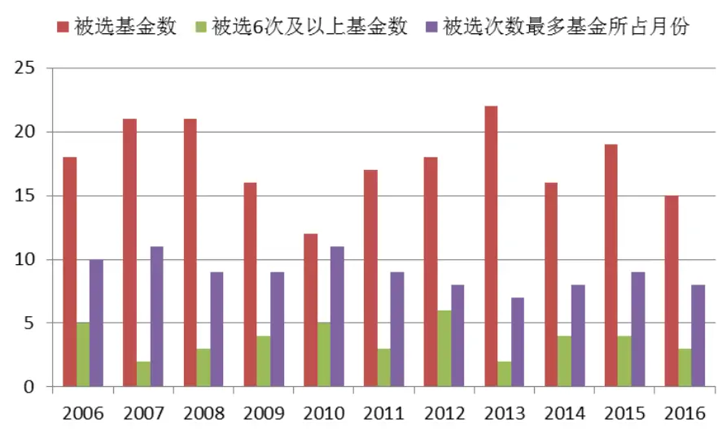
数据来源：国泰君安证券研究

可以看到，策略每年选 12-22只（每年共 60只）不同基金，每年被选次数最多的基金所占的月份在 7 个月到 11 个月之间。可见在 489 只偏股混合型基金中选股能力短期有“强者恒强”的特点，作为基金的特征相对稳定。回测的 11年间被选次数最多的基金一共在 47个月（共 130个月）中被选中，是偏股混合型基金中的长期明星基金，除去这只基金以外，被选次数较多的基金被选中的次数分别为 18、18、16、15 等等，和最好的基金差距显著。

我们考察每一年被选次数排名前 5的基金对应的当时在任基金经理，作为当年的“选股之星”。按照回测期 11 年间其被评为“选股之星”的次数排名得到排名前 20 的基金经理如下，其中数字代表当年排名前 5 的基金中其管理的基金个数，灰色部分代表其不管理偏股混合型基金的时间段。

表 7 “选股之星”基金经理统计

| 基金经 理编号 | 2006 | 2007 | 2008 | 2009 | 2010 | 2011 | 2012 | 2013 | 2014 2015 | 2016 | 总计 |  | 目前是 否公募 基金经 |
| --- | --- | --- | --- | --- | --- | --- | --- | --- | --- | --- | --- | --- | --- |
| A |  | 1 | 1 | 1 | 1 | 1 |  |  |  |  |  | 5 | 理在任 否 |
| B |  |  |  | 1 |  |  | 1 |  |  |  |  | 3 | 否 |
| C |  |  |  |  |  | 1 |  | 1 |  |  |  | 3 | 是 |
| D |  |  |  |  |  |  |  |  | 2 |  |  | 3 | 否 |
| E |  |  |  |  |  |  |  |  |  |  | 3 | 3 | 是 |
| F | 2 |  |  |  |  |  |  |  |  |  |  | 2 | 否 |
| G |  | 1 |  |  |  |  |  |  |  |  |  | 2 | 否 |
| H |  |  |  |  |  |  |  |  |  |  |  | 2 | 否 |
| I |  |  |  |  | 1 | 1 |  |  |  |  |  | 2 | 否 |
| J |  |  |  |  |  | 1 |  |  |  |  |  | 2 | 否 |
| K |  |  |  |  |  | 1 | 1 |  |  |  |  | 2 | 否 |
| L |  |  |  |  |  | 1 |  |  |  | 1 |  | 2 | 是 |
| M |  |  |  |  |  |  | 2 |  |  |  |  | 2 | 否 |
| N |  |  |  |  |  |  | 1 | 1 | 1 |  |  | 2 2 | 否 |
| 0 |  |  |  |  |  |  |  | 1 1 | 1 |  |  | 2 | 否 是 |
| P |  |  |  |  |  |  |  | 2 |  |  |  | 2 | 否 |
| Q |  |  |  |  |  |  |  | 2 |  |  |  | 2 | 是 |
| R |  |  |  |  |  |  |  |  |  |  |  | 2 | 否 |
| S |  |  |  |  |  |  |  |  |  |  |  | 2 | 是 |
| T |  |  |  |  |  |  |  |  |  |  |  |  |  |

数据来源：国泰君安证券研究

从表格中可以看到这些顶尖的基金经理其选股能力并不一定能够伴随其全部职业生涯，能够持续多年保持优秀选股能力的基金经理少之又少，但是大部分“选股之星”在开始管理偏股混合型基金不久后就能显示出其选股能力，这 20 个“选股之星”是在管理偏股混合型基金平均1.8 年后被评为“选股之星”的，最少的一入行就显示出持续的选股能力。进一步考察发现同一时期基金经理管理的不同基金所体现的选股能力也并不一定一致，只有 E、F、M、Q、R五位基金经理在其同时管理的两只及以上基金中都显示出了强大的选股能力，但是这几位基金经理就可观察到的数据来看在同时有两只及以上基金被本报告的策略选入后再也没能成为“选股之星”。

在成为“选股之星”，得到市场的认可之后，很多基金经理也会选择去私募或者担任基金公司管理层职位，从而不再管理公募基金，我们选出的排名前 20的基金经理如今还在任的仅有 6人。

综上所述，即便基金经理短期内选股能力优秀且具有一定的持续性，由于市场风格的变化和人事变动等因素，其所管理的基金很难一直保持市场领先，追踪基金经理进行投资不如根据选股 Alpha来选基。

## 4. 指标选基总结与展望

指标选基泛指通过分析基金历史业绩得到一定指标，利用指标大小排序进行选基的方法。不同的指标描述的角度不同，收益类指标主要从绝对收益终值和相对收益终值角度出发选基，考察基金牛市收益能力和熊市避险能力；风险类指标主要从控制基金净值负向波动的角度出发选基，考察基金风控能力和风险偏好；风险调整后收益类指标结合两者选择“性价比”最高基金。以上的指标都来自于对基金复权净值的直接计算，考虑的选基逻辑较粗糙。而选股 Alpha 指标剥离了市场整体和风格对基金表现的影响（市场风格对大部分基金的影响基本一致，基金的风格择时能力同质化较强），能够更加纯粹的考察基金经理的选股能力因素，而选股能力正是区分好坏基金的重要指标。FOF选基的终极目标在于选择类别资产下最能稳定增强资产收益的基金，这样的基金在资产总体回撤的情况下同样很难避免回撤，在高收益和低风险难以两全的情况下，回撤的控制和风险的规避可以从资产配臵和策略的角度解决。

本报告对基金未来选股 Alpha 的预测停留在利用过去平均值的角度，仍然有一定滞后性，未来的指标选基研究将关注更早更精确预测基金选股Alpha或其他区分好坏基金的指标上。

## 本公司具有中国证监会核准的证券投资咨询业务资格

## 分析师声明

作者具有中国证券业协会授予的证券投资咨询执业资格或相当的专业胜任能力，保证报告所采用的数据均来自合规渠道，分析逻辑基于作者的职业理解，本报告清晰准确地反映了作者的研究观点，力求独立、客观和公正，结论不受任何第三方的授意或影响，特此声明。

## 免责声明

本报告仅供国泰君安证券股份有限公司（以下简称“本公司”）的客户使用。本公司不会因接收人收到本报告而视其为本公司的当然客户。本报告仅在相关法律许可的情况下发放，并仅为提供信息而发放，概不构成任何广告。

本报告的信息来源于已公开的资料，本公司对该等信息的准确性、完整性或可靠性不作任何保证。本报告所载的资料、意见及推测仅反映本公司于发布本报告当日的判断，本报告所指的证券或投资标的的价格、价值及投资收入可升可跌。过往表现不应作为日后的表现依据。在不同时期，本公司可发出与本报告所载资料、意见及推测不一致的报告。本公司不保证本报告所含信息保持在最新状态。同时，本公司对本报告所含信息可在不发出通知的情形下做出修改，投资者应当自行关注相应的更新或修改。

本报告中所指的投资及服务可能不适合个别客户，不构成客户私人咨询建议。在任何情况下，本报告中的信息或所表述的意见均不构成对任何人的投资建议。在任何情况下，本公司、本公司员工或者关联机构不承诺投资者一定获利，不与投资者分享投资收益，也不对任何人因使用本报告中的任何内容所引致的任何损失负任何责任。投资者务必注意，其据此做出的任何投资决策与本公司、本公司员工或者关联机构无关。

本公司利用信息隔离墙控制内部一个或多个领域、部门或关联机构之间的信息流动。因此，投资者应注意，在法律许可的情况下，本公司及其所属关联机构可能会持有报告中提到的公司所发行的证券或期权并进行证券或期权交易，也可能为这些公司提供或者争取提供投资银行、财务顾问或者金融产品等相关服务。在法律许可的情况下，本公司的员工可能担任本报告所提到的公司的董事。

市场有风险，投资需谨慎。投资者不应将本报告作为作出投资决策的唯一参考因素，亦不应认为本报告可以取代自己的判断。
在决定投资前，如有需要，投资者务必向专业人士咨询并谨慎决策。

本报告版权仅为本公司所有，未经书面许可，任何机构和个人不得以任何形式翻版、复制、发表或引用。如征得本公司同意进行引用、刊发的，需在允许的范围内使用，并注明出处为“国泰君安证券研究”，且不得对本报告进行任何有悖原意的引用、删节和修改。

若本公司以外的其他机构（以下简称“该机构”）发送本报告，则由该机构独自为此发送行为负责。通过此途径获得本报告的投资者应自行联系该机构以要求获悉更详细信息或进而交易本报告中提及的证券。本报告不构成本公司向该机构之客户提供的投资建议，本公司、本公司员工或者关联机构亦不为该机构之客户因使用本报告或报告所载内容引起的任何损失承担任何责任。

## 评级说明

## 1.投资建议的比较标准

投资评级分为股票评级和行业评级。

以报告发布后的12个月内的市场表现为比较标准，报告发布日后的12个月内的公司股价（或行业指数）的涨跌幅相对同期的沪深300指数涨跌幅为基准。

## 2.投资建议的评级标准

报告发布日后的 12 个月内的公司股价（或行业指数）的涨跌幅相对同期的沪深300指数的涨跌幅。

|  | 评级 说明 |  |
| --- | --- | --- |
| 股票投资评级 | 增持 | 相对沪深 300指数涨幅15%以上 |
|  | 谨慎增持 | 相对沪深300指数涨幅介于5%～15%之间 |
|  | 中性 | 相对沪深300指数涨幅介于-5%～5% |
|  | 减持 | 相对沪深300指数下跌5%以上 |
| 行业投资评级 | 增持 | 明显强于沪深 300 指数 |
|  | 中性 | 基本与沪深300指数持平 |
|  | 减持 | 明显弱于沪深 300指数 |

## 国泰君安证券研究所

|  | 上海 | 深圳 | 北京 |
| --- | --- | --- | --- |
| 地址 | 上海市浦东新区银城中路168号上海 银行大厦29层 | 深圳市福田区益田路 6009 号新世界 商务中心34层 | 北京市西城区金融大街 28 号盈泰中 心2号楼10层 |
| 邮编 | 200120 | 518026 | 100140 |
| 电话 | （021)38676666 | (0755)23976888 | (010)59312799 |
|  | E-mail: gtjaresearch@gtjas.com |  |  |