nInfo] [Table_Title] 2017.01.10

# 短期股价走势的预测信息（2）—— 个股盘中异动

## —— 数量化专题之八十六

李辰（分析师）

刘富兵（分析师）

8 021-38677309

021-38676673

lichen@gtjas.com

liufubing008481@gtjas.com

证书编号 S0880516050003

S0880511010017

本报告导读：对于日内交易行为而言，追涨杀跌，实乃兵家大忌，通过量化交易模式克服内心贪婪恐惧则是科学有效的投资方式。

## 摘要：

[Table_Summary] • 通过对个股盘中异动的定义，我们发现 A股市场日内交易行为存在显著的反转效应。

- 当前市场环境下，对于部分拥有融券资源优势可实现变相T+0 交易的投资者而言，盘中异动信号可实现极为稳定可观的收益。

- 研究中我们发现，当前 A股市场所采用的集合竞价产生开盘价的方式是极为有效的定价模式，几乎可以完全修复前一交易日股价短期异常下跌波动所造成的定价非有效性。

- 进一步的研究发现，尾盘30分钟触发上涨异动信号的个股，在次日存在显著的低开效应。实证分析表明，该效应可实现90%的日交易胜率，是极为显著且稳定的信号。

- 我们利用上述效应所产生的交易信号，对原有的阿尔法策略进行了再增强。实证表明，通过上涨异动策略的交易，可实现沪深300增强策略每年3%-4%的超额收益再提升，中证500增强策略每年 4%-7%的超额收益再提升，效果显著。

- 对于日内交易行为而言，追涨杀跌，实乃兵家之大忌，通过量化交易模式克服内心贪婪恐惧则是科学有效的投资方式。

《短期股价走势的预测信息》之后的系列报告希望得到的不仅仅是有效的交易策略，更是希望通过微观结构的观察，加深投资者对市场本质规律的理解。

## 金融工程团队：

刘富兵：（分析师）

电话：021-38676673

邮箱：liufubing008481@gtjas.com

证书编号：S0880511010017

## 陈奥林：（分析师）

电话：021-38674835

邮箱：chenaolin@gtjas.com

证书编号：S0880516100001

## 李辰：（分析师）

电话：021-38677309

邮箱：lichen@gtjas.com

证书编号：S0880516050003

## 孟繁雪：（研究助理）

电话：021-38675860

邮箱：mengfanxue@gtjas.com

证书编号：S088011604008

## 殷明：（研究助理）

电话：021-38674637

邮箱：yinming@gtjas.com

证书编号：S0880116070042

## 叶尔乐：（研究助理）

电话：021-38032032

邮箱：yeerle@gtjas.com

证书编号：S0880116080361

## [Table_R相关报告

《基金收益率分解及其在 FOF 选基中的应用》2017.01.05

《短期股价走势的预测信息（1）— 神秘的尾盘 30 分钟》2016.12.21

《期指交割平稳，市场情绪偏谨慎》2016.11.19

《投资和交易：价格，交易量和波动率》2016.11.18

《基于 MACD价格分段的阻力与支撑研究》2016.09.29

## 1. 引言

本系列报告《短期价格走势的预测信息》旨在利用更多短周期、高频率、交易日内的股价波动信息，观察探究市场微观结构下的股价短周期波动规律，并挖掘具有显著预测特性的交易信号与投资机会。

本篇报告《短期股价走势预测信息（2）---- 个股盘中异动》通过对盘中股价异动价格模式的定义，发现 A 股市场存在显著的日内价格反转效应，即日内股价急速拉升后往往伴随着短期价格走势见顶回落，而日内股价急速下跌则往往伴随着短期价格走势见底反弹的显著规律。

然而，由于A股市场采用 T+1交易机制以及融券卖空机制的不成熟，导致交易信号较难直接转化为策略收益，但是对于部分拥有融券资源优势可实现变相 T+0 交易的投资者而言，盘中异动信号可实现极为稳定可观的收益。

同样，我们研究发现，当前 A股市场所采用的集合竞价产生开盘价的方式是极为有效的定价模式，几乎可以完全修复前一交易日股价短期异常下跌波动所造成的定价非有效性，使前日盘中异动交易信号所产生的收益几乎完全收敛殆尽。

进一步的，我们发现尾盘 30 分钟触发上涨异动信号的个股，在次日存在显著的低开效应。实证分析表明，该效应可实现 90%的日交易胜率，是极为显著且稳定的信号。

我们利用该信号对原有的阿尔法组合收益进行再增强，即卖出尾盘触发上涨异动信号的个股，并于次日开盘集合竞价买回。实证表明，通过上涨异动策略的交易，可实现沪深 300增强策略每年 3%-4%的超额收益再提升，中证 500增强策略每年 4%-7%的超额收益再提升，效果显著。

本篇报告的研究结果告诉我们：对于日内交易行为而言，追涨杀跌，实乃兵家之大忌，通过量化交易模式克服内心贪婪恐惧则是科学有效的投资方式。

## 2. 个股盘中异动观察

投资者往往热衷于追随市场热点进行交易，无论是行业板块、还是龙头个股，这是投资者人性的纯粹反应，当股价短期大幅上涨的情况下，投资者内心预期由非理性的贪婪主导，预期股价未来持续上涨，因而产生追涨的交易行为；当股价短期快速下跌的情况下，投资者内心预期由非理性的恐慌主导，预期股价未来持续下跌，因而产生杀跌的交易行为。

而这一特点，在散户交易群体中往往体现的更加充分，经常由于市场异动而产生非理性的追涨杀跌的交易行为。

对于量化研究而言，我们首先利用简单但唯一的标准，定义短期股价的异动，然后对其之后的价格走势进行分析研究，进而探究追涨杀跌行为究竟会产生怎样的交易结果。

## 2.1. 盘中异动定义

盘中股价异动的直观定义是短期股价的大幅波动，即单位时间内收益率的变化大于某一阈值，因此对于盘中异动的定义，我们利用涨跌速率的概念，即对于个股S ，当某一时间段内的收益率比时间大于某一阈值，则定义为触发异动，即

$$
return_{_{\Delta t}}^{^{S}}/\Delta t>\xi
$$

其中，对于最极端的情况而言，当Δt =1 min时，则表明1分钟内股票价格收益率的变化值。

下图为典型的盘中异动情况，在黄圈区域股价短期大幅波动，触发盘中异动信号。

图 1 个股盘中上涨异动
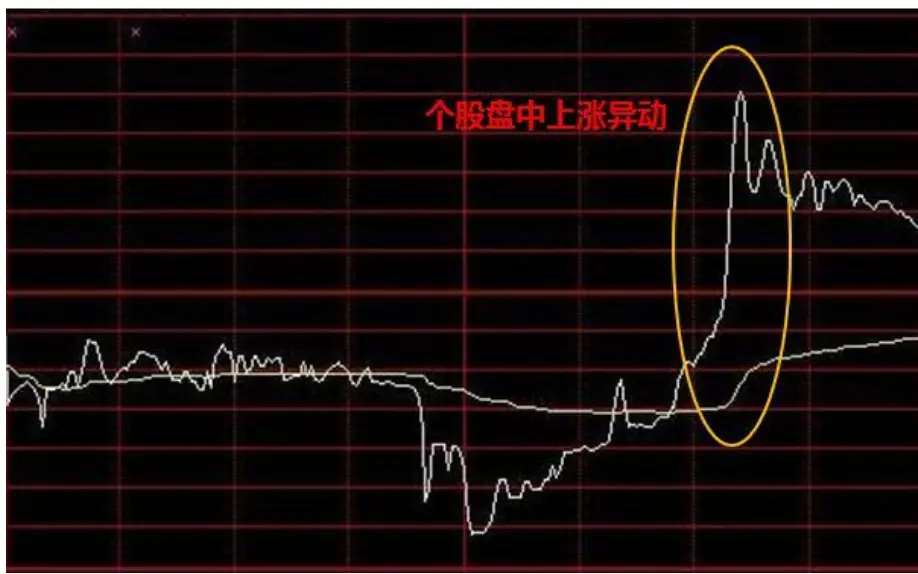
数据来源：国泰君安证券研究

图 2 个股盘中下跌异动
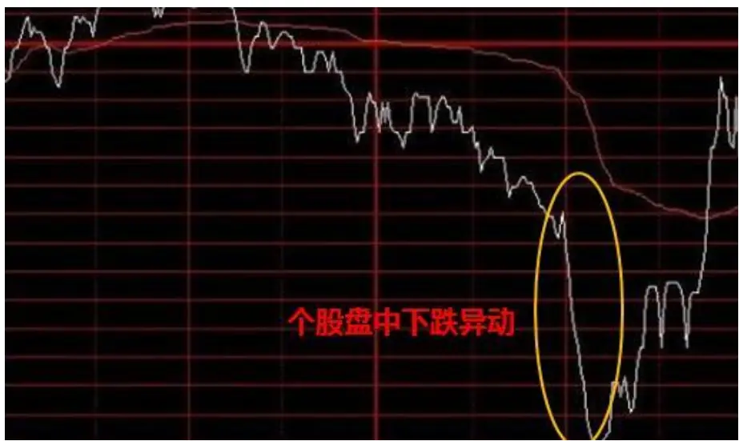
数据来源：国泰君安证券研究

本篇报告中的个股盘中异动定义均基于Δt =1min的条件，即我们观察的股价收益率变化区间为 1分钟。

## 2.2.盘中异动现象的短期收益观察

## 2.2.1. 盘中异动现象的短期收益观察

个股盘中异动的信号往往伴随着短期成交量的快速提升，显然在这一时间段内，股价走势不符合随机游走的假设，因而其对于未来短期价格走势可具有一定的预测性。

由于 A 股市场的涨跌停版制度，因此我们所定义的个股盘中信号具体为：

当个股盘中首次出现 1分钟交易时间内，收益率大于阈值ξ ，且个股处于非涨停情况下，则触发盘中上涨异动信号；当个股盘中首次出现 1分钟交易内，收益率小于 -ξ ，且个股处于非跌停情况下，则触发盘中下跌异动信号；

我们利用个股盘中异动的信号，观察其后一段时间内，股价收益的分布情况。其中，统计样本为全市场所有股票，时间自 2013年至 2016年。

我们设定当ξ = 3% 的情况下，未来•t 分钟内的收益率统计情况（我

们后面将对ξ 进行敏感性检验），具体结果如下表所示：

## 1）阈值 3%个股上涨异动信号

表 1: 阈值 3%个股上涨异动信号触发后•t 时间段收益统计

| ∆t | 1分钟 | 2分钟 | 3分钟 | 4分钟 | 5分钟 | 6分钟 | 7分钟 | 8分钟 | 9分钟 | 10分钟 |
| --- | --- | --- | --- | --- | --- | --- | --- | --- | --- | --- |
| 收益率均值 | -0.42% | -0.62% | -0.72% | -0.77% | -0.81% | -0.84% | -0.84% | -0.84% | -0.82% | -0.83% |
| 收益率中位数 | -0.23% | -0.65% | -0.80% | -0.87% | -0.89% | -0.90% | -0.89% | -0.88% | -0.87% | -0.89% |
| 样本胜率 | 33.09% | 27.45% | 26.24% | 26.31% | 26.81% | 26.97% | 27.90% | 29.02% | 29.79% | 29.91% |
| 样本数量 | 48893 | 48610 | 48435 | 48340 | 47914 | 47656 | 47473 | 47299 | 47112 | 46928 |

数据来源：国泰君安证券研究

图 3阈值 3%个股上涨异动信号触发后•t 时间段收益统计
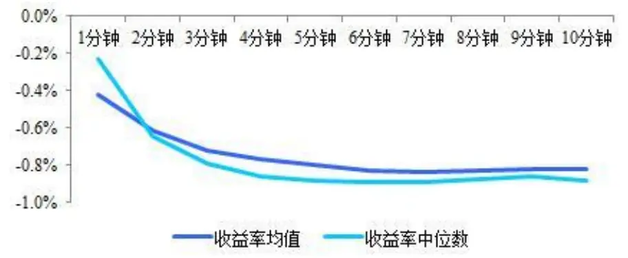
数据来源：国泰君安证券研究

统计结果表明，当个股触发盘中上涨异动信号，即 1分钟内涨幅超过 3%且未涨停的情况下，其随后的 10 分钟收益率呈现显著的负相关性，信号后 1 分钟至后 10 分钟，收益率均值、中位数均为负。其中后 5 分钟收益率达到最小，单次均值约为-0.81%，中位数约为-0.89%。从信号胜率的统计而言，短期急速拉升后，股价回落的概率超过 7成。

## 2）阈值 3%个股下跌异动信号

表 2: 阈值 3%个股下跌异动信号触发后•t 时间段收益统计

| ∆t | 1分钟 | 2分钟 | 3分钟 | 4分钟 | 5分钟 | 6分钟 | 7分钟 | 8分钟 | 9分钟 | 10分钟 |
| --- | --- | --- | --- | --- | --- | --- | --- | --- | --- | --- |
| 收益率均值 | 0.67% | 1.21% | 1.46% | 1.57% | 1.60% | 1.58% | 1.49% | 1.45% | 1.46% | 1.51% |
| 收益率中位数 | 0.48% | 1.26% | 1.50% | 1.55% | 1.55% | 1.49% | 1.43% | 1.39% | 1.39% | 1.43% |
| 样本胜率 | 60.01% | 71.34% | 75.27% | 76.03% | 75.47% | 74.38% | 72.24% | 71.08% | 70.53% | 70.28% |
| 样本数量 | 33437 | 33392 | 33364 | 33319 | 33223 | 33126 | 33025 | 32934 | 32854 | 32788 |

数据来源：国泰君安证券研究

图 4阈值 3%个股下跌异动信号触发后•t 时间段收益统计
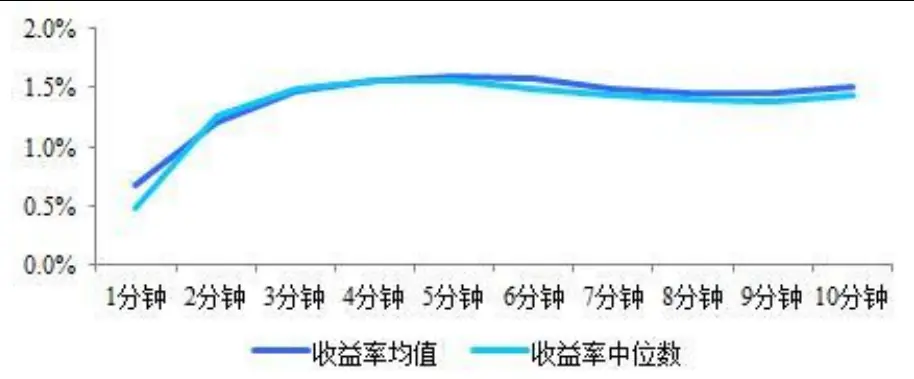
数据来源：国泰君安证券研究

统计结果表明，当个股触发盘中下跌异动信号，即 1分钟内跌幅超过 3%且未跌停的情况下，其随后的 10 分钟收益率呈现显著的负相关性，信号后 1 分钟至后 10 分钟，收益率均值、中位数均为正。其中后 5 分钟收益率达到最大，单次均值约为 1.60%，中位数约为 1.55%。从信号胜率的统计而言，短期急速下跌后，股价反弹的概率超过 7成。

上述统计结果表明，A股盘中交易异动存在显著的反转现象，短期快速拉升后，股价大概率回落，而短期快速下跌后，股价大概率反弹。

同时，我们发现，在同样的阈值情况下，上涨异动和下跌异动随后的收益率有些许差异，下跌反弹的 5分钟平均收益率 1.60%显著高于上涨回落的 5 分钟平均收益率 0.81%。究其原因不难理解，A股市场缺乏成熟的做空机制是导致股价短期无法快速下跌回归合理价格的重要因素。

## 2.2.2. 信号阈值敏感性分析

我们本节将对异动信号阈值ξ 进行敏感性分析，以考察 A股日内反转效

应是否显著存在，我们将分别设定ξ = 1% 2% 3% 4% 5%、 、 、 、 的情况

下，信号触发后•t 时间段内的收益率分布情况，具体结果如下所示：

1）不同阈值下上涨异动信号触发后•t 时间段收益对于上涨异动触发阈值的敏感性分析表明，在设定各阈值条件下，上涨异动后 1分钟至 10分钟区间段内，股价收益率均呈现显著的负向收益，这表明短期快速拉升后的冲高回落，在不同幅度的上涨异动状态下均显著存在。并且，通过不同触发阈值后 5分钟的收益率均值横向比较，可以发现，短期快速拉升越猛烈，其后期回落的幅度也随之相应越大，当设定上涨异动触发阈值达到 5%的情况，即 1分钟内股价跳涨超过 5%且不涨停，则之后 5分钟将平均回落接近 2%的幅度。

图 5阈值 1%上涨异动信号触发后•t 时间段收益
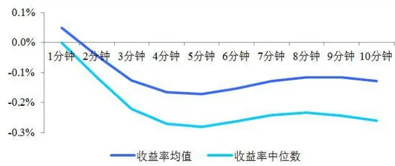
数据来源：国泰君安证券研究

图 6阈值 2%上涨异动信号触发后•t 时间段收益
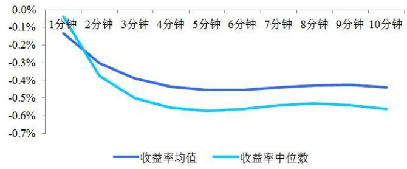
数据来源：国泰君安证券研究

图 7阈值 4%上涨异动信号触发后•t 时间段收益
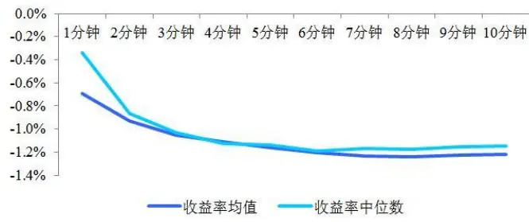
数据来源：国泰君安证券研究

图 8阈值 5%上涨异动信号触发后•t 时间段收益
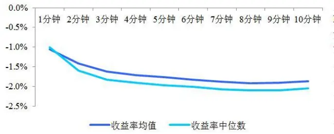
数据来源：国泰君安证券研究

表 3:不同阈值下上涨异动信号触发后 5分钟时间段收益统计

| 触发阈值 | 1% | 2% | 3% | 4% | 5% |
| --- | --- | --- | --- | --- | --- |
| 5 分钟收益率均值 | -0.17% | -0.45% | -0.81% | -1.16% | -1.76% |
| 5分钟收益率中位数 | -0.28% | -0.57% | -0.89% | -1.14% | -1.97% |
| 样本个数 | 1829401 | 204345 | 47914 | 16877 | 5677 |

数据来源：国泰君安证券研究

## 2）不同阈值下下跌异动信号触发后•t 时间段收益

图 9阈值 1%下跌异动信号触发后•t 时间段收益
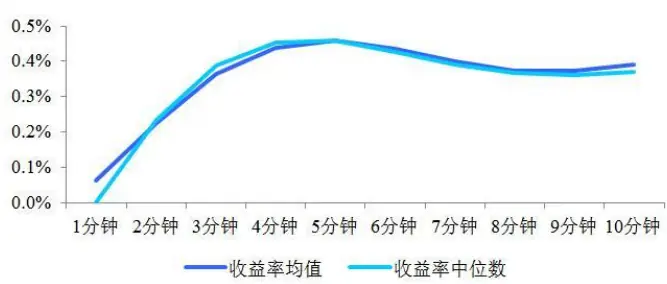
数据来源：国泰君安证券研究

图 10阈值 2%下跌异动信号触发后•t 时间段收益
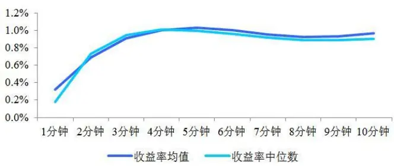
数据来源：国泰君安证券研究

图 11阈值 4%下跌异动信号触发后•t 时间段收益
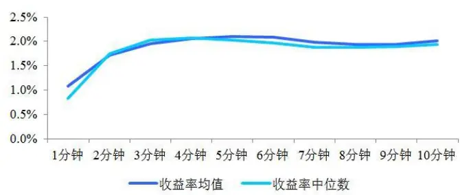
数据来源：国泰君安证券研究

图 12阈值 5%下跌异动信号触发后•t 时间段收益
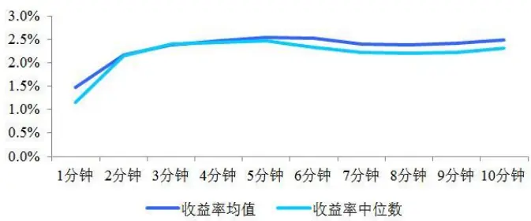
数据来源：国泰君安证券研究

表 4:不同阈值下下跌异动信号触发后 5分钟时间段收益统计

| 触发阈值 | 1% | 2% | 3% | 4% | 5% |
| --- | --- | --- | --- | --- | --- |
| 5 分钟收益率均值 | 0.46% | 1.03% | 1.60% | 2.10% | 2.53% |
| 5分钟收益率中位数 | 0.46% | 1.00% | 1.55% | 2.03% | 2.47% |
| 样本个数 | 1371901 | 140930 | 33223 | 11040 | 4537 |

数据来源：国泰君安证券研究

同样，对于下跌异动触发阈值的敏感性分析表明，在设定各阈值条件下，下跌异动后 1 分钟至 10 分钟区间段内，股价收益率均呈现显著的负向收益，这表明短期快速下跌的触底反弹，在不同幅度的上涨异动状态下均显著存在。并且，通过不同触发阈值后 5 分钟的收益率均值横向比较，可以发现，短期快速下跌越猛烈，其后期反弹的幅度也随之相应越大，当设定下跌异动触发阈值达到 5%的情况，即 1分钟内股价跳水超过 5%且不跌停，则之后 5分钟将平均反弹接近 2.5%的幅度。

## 3. 个股盘中异动策略的可行性分析

在上一章节中，我们通过对个股盘中异动后的收益率分布进行统计观察，发现 A股日内交易存在显著的反转特征，并且该特征在不同上涨下跌异动的幅度下都显著存在。那么，本章节我们将对盘中异动投资策略进行可行性分析。

## 3.1.T+0、融券与集合竞价

## 3.1.1. 收益源自何方

我们将每日触发上涨异动信号的N只个股未来5分钟的收益率的算术平均，作为当日信号收益率，其中我们扣除 0.3%为交易成本，自 2013 年至 2016 年，收益率及累计收益率如下图所示（其中平均每日出发个股数剔除股灾期间影响）：

图 13 阈值 3%个股上涨异动信号日收益率序列
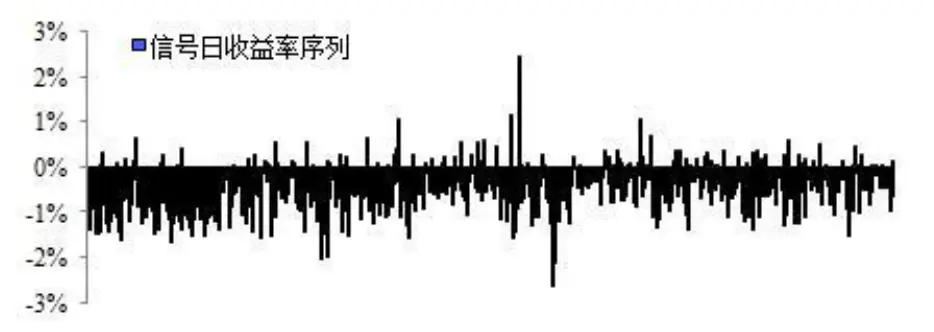
数据来源：国泰君安证券研究

表 5: 阈值 3%个股上涨异动信号日收益率统计

| 日收益率均值 | 平均每日出发个股数 | 日负向胜率 |
| --- | --- | --- |
| -0.45% | 40只 | 83.63% |

数据来源：国泰君安证券研究

统计结果表明，每日平均约 40只股票可触发 3%阈值情况下的上涨异动信号，平均日收益率为-0.45%，胜率为 83.63%，负向收益显著。

我们同样以每日触发下跌异动信号的N只个股未来5分钟的收益率的算术平均，作为当日信号收益率，具体情况如下：

图 14 阈值 3%个股下跌异动信号日收益率序列
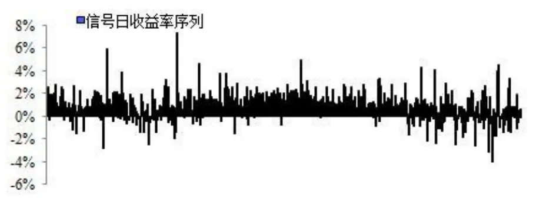
数据来源：国泰君安证券研究

表 6: 阈值 3%个股下跌异动信号日收益率统计

| 日收益率均值 | 平均每日出发个股数 | 日胜率 |
| --- | --- | --- |
| 0.87% | 24只 | 82.26% |

数据来源：国泰君安证券研究

统计结果表明，每日平均约 24只股票可触发 3%阈值情况下的下跌异动信号，平均日收益率为 0.87%，胜率为 82.26%，胜率显著。

对于上述两个策略的收益统计，我们不禁要问如此显著的收益率究竟来自何方？为了回答这个问题，我们不妨假设，当市场允许 T+0日内交易并且融券无摩擦的情况下，策略可实现的累计收益情况，具体如下图所示：

图 15上涨异动信号逐日累计超额收益
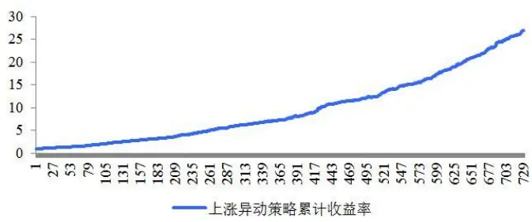
数据来源：国泰君安证券研究

图 16下跌异动信号逐日累计超额收益
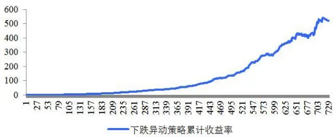
数据来源：国泰君安证券研究

可以发现，当我们假设市场允许 T+0以及无摩擦融券的情况下，盘中异动信号实现了惊人的收益表现，在过去 3 年多的时间内，上涨异动信号净值达到 30，而下跌异动信号净值更是达到 500（此处并未考虑信号触发先后顺序所产生的资金分配问题）。

因此，我们可以认为，个股异动产生的收益率表面上源自于非理性投资者追涨杀跌造成的股价短期偏离，而其本质上则源自于 A 股市场 T+1交易模式以及融券卖空机制不成熟而导致的市场非有效。该部分收益率对于绝大部分投资者而言，可望而不可及。但是，对于少部分有融券资源优势的投资者而言，由于融券可实现卖空以及变相 T+0交易模式，因此盘中异动信号可谓绝佳的日内投资策略。

## 3.1.2. 集合竞价的有效性

既然日内 T+0交易无法实现，那我们直观的想法就是能否可以将盘中异动触发的交易信号持有至次日开盘平仓？我们将对这个假设进行实证分析研究。我们首先考虑不受融券卖空机制影响的下跌异动信号。

我们选择尾盘 30分钟内触发的个股异动作为策略信号，即在尾盘 30分钟内，买入触发阈值 3%的下跌异动信号的个股，并以次日开盘集合竞价卖出，统计策略的收益表现。

同时为了比较，我们同样统计在尾盘 30分钟内，买入触发阈值 3%的下跌异动信号的个股，并以当天收盘价卖出的策略收益表现，两者均考虑单次双边交易成本 0.3%，具体表现分别如下图所示：

图 17下跌异动信号当日收盘价平仓
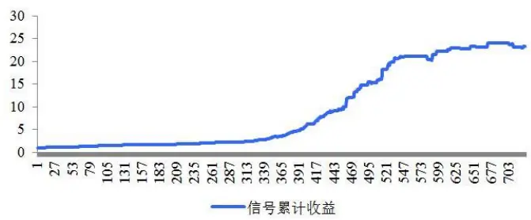
数据来源：国泰君安证券研究

图 18下跌异动信号次日开盘价平仓
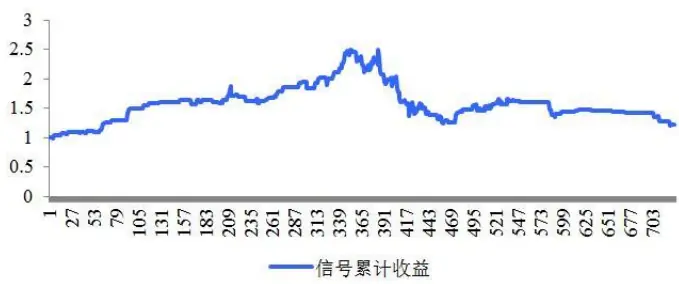
数据来源：国泰君安证券研究

实证结果令人惊讶，左图策略实现了 25 倍的净值表现，而右图的策略则几乎毫无收益，而这两者的区别仅仅是卖出时点的区别，左图为当日收盘卖出，而右图为次日开盘合集竞价卖出。

这个实证结果强有力的表明，集合竞价产生开盘价的机制是极为有效的，几乎可以完全修复前一交易日股价短期异常下跌波动所造成的定价非有效性。由于下跌异动的收益存在，因此在下跌异动底部买入的头寸，将最早于次日集合竞价卖出，导致在集合竞价过程中，卖方力量高于买方，因而使得下跌异动的套利收益消失。而这也使得我们希望通过买入下跌异动股票并在次日集合竞价抛出的想法无法实现，或许正是由于集合竞价机制的定价合理性，才使得上述我们所分析的个股异动收益只存在于 T日盘中交易的状态下。

## 3.1.3. 上涨异动与次日开盘价

那么盘中异动的收益真的只有在 T日内存在吗？或许，融券成为了我们最后的希望，下跌异动的个股通过次日集合竞价的定价回归到了合理价格，那么由于融券卖空机制的不成熟所导致的上涨异动的个股，在次日的集合竞价中能实现价格的合理回归吗？

我们对这一问题同样进行实证分析，我们选择尾盘 30 分钟内触发阈值3%的个股上涨异动的股票卖出，并以次日开盘集合竞价买入，统计策略的收益表现。

同样为了比较，我们选择相同的卖出信号，但以当日收盘价买入，两者均考虑单次双边交易成本 0.3%，具体表现分别如下图所示：

图 19上涨异动信号当日收盘价平仓
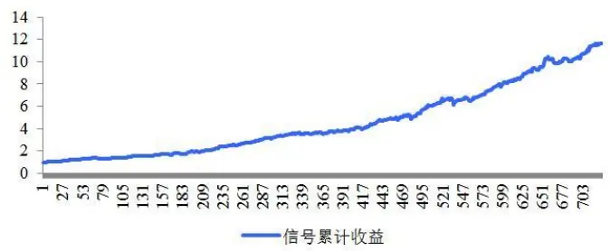
数据来源：国泰君安证券研究

图 20上涨异动信号次日开盘价平仓
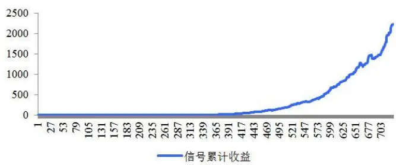
数据来源：国泰君安证券研究

结果表明，T日上涨异动个股，其 T+1日开盘价将显著低于信号触发价格。在上述统计中信号总计出现了 2818次，在扣除 0.3%成本的情况下负收益率情况出现了 2085 次，胜率达到 74%，信号平均收益率为-2.20%，平均每日触发信号个股 3.88只，从每日交易盈亏来看，胜率高达 90%。统计结果表明，该信息具有较强的稳定性与可观的收益表现。

我们同样对该效益对于异动阈值 ξ 进行敏感性分析，分别考虑

ξ = 1 % 2 % 3 % 4 % 5 %、 、 、 、 的情况下，收益的相关绩效统计，具体如下表所示：

表 7:不同阈值下上涨异动信号绩效统计

| 触发阈值 | 信号触发次数 | 负收益次数 | 胜率 | 平均收益率 |
| --- | --- | --- | --- | --- |
| 1% | 131927 | 80185 | 61% | -0.83% |
| 2% | 12754 | 8867 | 70% | -1.60% |
| 3% | 2818 | 2085 | 74% | -2.20% |
| 4% | 928 | 726 | 78% | -2.64% |
| 5% | 375 | 299 | 80% | -2.71% |

数据来源：国泰君安证券研究

上述统计结果可以发现，上涨异动效应对触发阈值ξ 的敏感性不强，并

且随着触发阈值的不断提高，信号出现次数逐渐减少，但是胜率及平均收益率则逐步提升。因此，敏感性分析表明，上涨异动个股在次日开盘集合竞价存在的低开效应是显著存在的。

导致这一收益来源的原因正是在于融券卖空机制的不成熟，使得当股价上涨偏离合理价格的过程中，空头卖出力量不足，因而其最早于次日开

## 盘集合竞价买入平仓的力量不足，因此套利收益空间显著存在。

因而，对于有融券资源优势的投资者而言，该效应可在 T+1交易机制的情况下，同样获得极为稳定的收益来源。

## 3.2.基于个股盘中异动的阿尔法再增强

上一节中，我们的实证分析研究表明，卖出触发下跌异动信号的个股，并以次日集合降价买入，将获得显著、稳定、可观的价差收益。但是由于融券机制的不成熟，直接运用该策略具有较大难度。

但是，对于现已有的组合而言，我们可以通过该策略的操作方式，实现一定成熟的稳健增强，即在当前组合持仓中，若有个股在尾盘 30 分钟内触发上涨异动信号，则卖出该股票，并于次日早盘集合竞价买回，实现价差收益。

本节中，我们将构建基于盘中上涨异动信号的阿尔法再增强策略，即在原有的阿尔法组合中，运用此操作方式，实现月中组合的再增强。

具体而言，在我们之前的系列报告中，我们通过组合权重优化的方法，将阿尔法模型与风险模型相结合，构建了市场、行业、风格中性的最优投资组合，实现了较为稳健的超额收益。组合构建过程中，风险因子包括 Beta 、 Momentum 、 Size 、 Volatility 、 Growth 、 Value 、 Leverage，具体定义详见《基于组合权重优化的风格中性多因子选股策略-数量化专题之五十七》。阿尔法因子则包括 YOY_EPS、 REVERSE、 Est PB、 MOM EstEPS、 DISPERSION、 HTOS、 MOM ROE、 RATEUP、 Earnings Yield 和Liquidity，具体定义详见《如何将阿尔法因子转化为超额收益-数量化专题之六十八》。

我们现在分别以沪深 300 增强组合和中证 500 增强组合为例，考察自2013 年至 2016 年，盘中上涨异动再增强策略的效果，组合构建方式参考《中证 500 之阿尔法验金石-数量化专题之六十》，其中上涨异动策略为了尽量多的覆盖组合个股，我们选择 ξ = 1% 作为触发阈值。策略具体绩效如下：

图 21 沪深 300原始组合与再增强组合累计超额收益对比
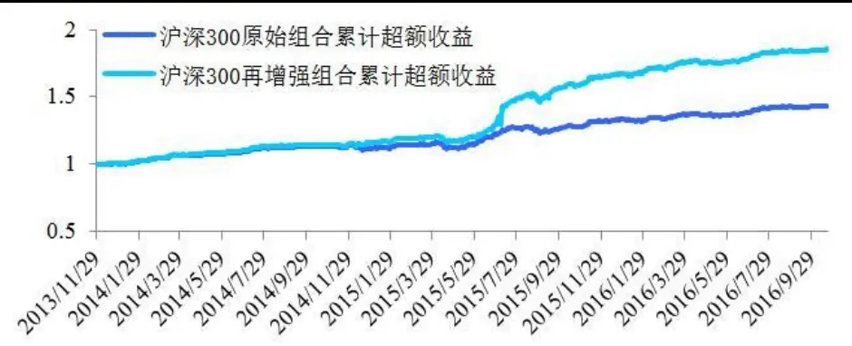
数据来源：国泰君安证券研究

表 8: 沪深 300原始组合与再增强组合收益对比情况

| 年份 | 原始组合超额收益 | 再增强组合超额收益 | 超额收益差 |
| --- | --- | --- | --- |
| 2014年 | 11.05% | 14.65% | 3.6% |
| 2015年 | 17.89% | 37.33% | 19.43% |
| 2016年 | 7.44% | 10.35% | 2.91% |

数据来源：国泰君安证券研究

策略实证结果表明，在沪深 300增强的多头组合中，运用上涨异动策略，可实现组合超额收益的再增强，在正常年份中，每年再增强超额收益约为 3%-4%左右（2015 年股灾期间由于市场异常波动使得策略获得较高的收益，但该收益在正常市场环境下无法实现，2015年除股灾期间其余时间段再增强超额收益也约为 3%）。在上述 3年时间段内，上涨异动信号总计触发 2840次，日均 4.03 次。

图 22 中证 500原始组合与再增强组合累计超额收益对比
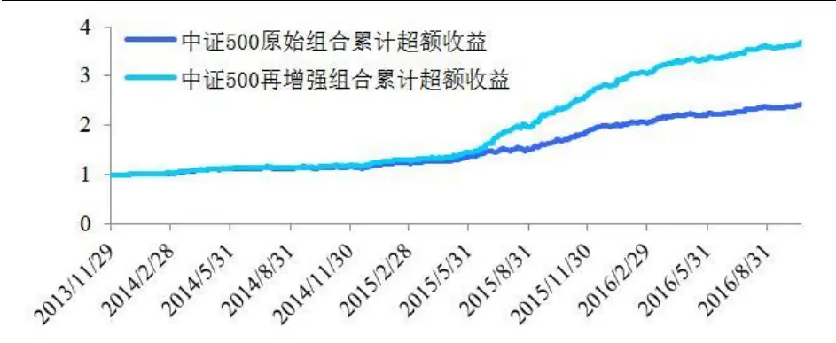
数据来源：国泰君安证券研究

表 9: 中证 500原始组合与再增强组合收益对比情况

| 年份 | 原始组合超额收益 | 再增强组合超额收益 | 超额收益差 |
| --- | --- | --- | --- |
| 2014年 | 16.98% | 20.94% | 3.96% |
| 2015年 | 52.83% | 83.54% | 30.71% |
| 2016年 | 19.44% | 26.96% | 7.52% |

数据来源：国泰君安证券研究

策略实证结果表明，在中证 500增强的多头组合中，运用上涨异动策略，可实现组合超额收益的再增强，在正常年份中，每年再增强超额收益约为 4%-7%。（2015 年股灾期间同样实现异常收益，正常市场环境下难以实现）。在上述 3年时间段内，上涨异动信号总计触发 3585次，日均 5.07次。

上述实证分析结果表明，无论是沪深 300 增强还是中证 500增强组合，都可以利用上涨异动策略实现原有组合收益外的再增强。其实，理论上而言，对于任意股票组合，该策略的再增强效果都是存在的，因而可较为广泛的运用。

## 4. 总结

本篇报告是系列报告《短期价格走势的预测信息》的第二篇，其中我们着重研究了个股日内异动现象所蕴含的短期预测信息。我们通过涨跌速率的概念定义了个股盘中异动：当个股盘中首次出现1分钟交易时间内，收益率大于阈值，且个股处于非涨停情况下，则为盘中上涨异动；当个股盘中首次出现 1分钟交易内，收益率小于阈值，且个股处于非跌停情况下，则为盘中下跌异动。

我们通过对个股异动信号触发后 1 至 10 分钟的收益分布观察，发现 A股市场盘中交易异动存在显著的反转现象，短期快速拉升后，股价大概率回落，而短期快速下跌后，股价则大概率反弹。并且，通过比较回落和反弹的幅度，我们得出了由于 A股市场融券卖空机制不健全导致的价格回归多空失衡的结论。

进一步的，在构建针对个股盘中下跌异动交易信号的投资策略过程中，我们发现在当前 A股市场 T+1交易以及融券卖空机制不健全的情况下，下跌异动策略的实际实现有较大难度。并且，T+1 的开盘价格竞价是极为有效的定价机制，几乎可以完全修复前一交易日股价短期异常下跌波动所造成的定价非有效性。但是，对于少部分有融券资源优势的投资者而言，由于融券可实现卖空以及变相 T+0 交易模式，因此盘中异动信号可谓绝佳的日内投资策略。

我们进一步发现，尾盘 30 分钟触发的上涨异动的个股，在次日存在显著的低开效应。导致这一收益来源的原因正是在于融券卖空机制的不成熟，使得当股价上涨偏离合理价格的过程中，空头卖出力量不足，因而其最早于次日开盘集合竞价买入平仓的力量不足，因此套利收益空间显著存在。该效应可实现 90%的日交易胜率，是极为显著且稳定的信号。

最后，我们利用尾盘上涨异动效应在原有的多因子模型组合中进行在增强的运用，即在多头组合中若有个股在尾盘 30分钟触发上涨异动信号，则直接卖出，并由次日开盘集合竞价买回。通过实证分析，该策略可实现沪深 300增强策略每年 3%-4%的收益再提升，中证 500增强策略每年4%-7%的收益再提升，效果显著。

本篇报告的研究告诉我们，对于日内交易行为而言，追涨杀跌实乃兵家大忌，通过量化交易模式克服内心贪婪恐惧则是科学有效的投资方式。

《短期股价走势的预测信息》之后的系列报告，还将继续探索短周期、高频率、日内维度下，股票价格走势的显著特性，我们希望得到的不仅仅是有效的交易策略，更是希望通过微观结构的观察，加深投资者对市场本质规律的理解。

## 本公司具有中国证监会核准的证券投资咨询业务资格

## 分析师声明

作者具有中国证券业协会授予的证券投资咨询执业资格或相当的专业胜任能力，保证报告所采用的数据均来自合规渠道，分析逻辑基于作者的职业理解，本报告清晰准确地反映了作者的研究观点，力求独立、客观和公正，结论不受任何第三方的授意或影响，特此声明。

## 免责声明

本报告仅供国泰君安证券股份有限公司（以下简称“本公司”）的客户使用。本公司不会因接收人收到本报告而视其为本公司的当然客户。本报告仅在相关法律许可的情况下发放，并仅为提供信息而发放，概不构成任何广告。

本报告的信息来源于已公开的资料，本公司对该等信息的准确性、完整性或可靠性不作任何保证。本报告所载的资料、意见及推测仅反映本公司于发布本报告当日的判断，本报告所指的证券或投资标的的价格、价值及投资收入可升可跌。过往表现不应作为日后的表现依据。在不同时期，本公司可发出与本报告所载资料、意见及推测不一致的报告。本公司不保证本报告所含信息保持在最新状态。同时，本公司对本报告所含信息可在不发出通知的情形下做出修改，投资者应当自行关注相应的更新或修改。

本报告中所指的投资及服务可能不适合个别客户，不构成客户私人咨询建议。在任何情况下，本报告中的信息或所表述的意见均不构成对任何人的投资建议。在任何情况下，本公司、本公司员工或者关联机构不承诺投资者一定获利，不与投资者分享投资收益，也不对任何人因使用本报告中的任何内容所引致的任何损失负任何责任。投资者务必注意，其据此做出的任何投资决策与本公司、本公司员工或者关联机构无关。

本公司利用信息隔离墙控制内部一个或多个领域、部门或关联机构之间的信息流动。因此，投资者应注意，在法律许可的情况下，本公司及其所属关联机构可能会持有报告中提到的公司所发行的证券或期权并进行证券或期权交易，也可能为这些公司提供或者争取提供投资银行、财务顾问或者金融产品等相关服务。在法律许可的情况下，本公司的员工可能担任本报告所提到的公司的董事。

市场有风险，投资需谨慎。投资者不应将本报告作为作出投资决策的唯一参考因素，亦不应认为本报告可以取代自己的判断。
在决定投资前，如有需要，投资者务必向专业人士咨询并谨慎决策。

本报告版权仅为本公司所有，未经书面许可，任何机构和个人不得以任何形式翻版、复制、发表或引用。如征得本公司同意进行引用、刊发的，需在允许的范围内使用，并注明出处为“国泰君安证券研究”，且不得对本报告进行任何有悖原意的引用、删节和修改。

若本公司以外的其他机构（以下简称“该机构”）发送本报告，则由该机构独自为此发送行为负责。通过此途径获得本报告的投资者应自行联系该机构以要求获悉更详细信息或进而交易本报告中提及的证券。本报告不构成本公司向该机构之客户提供的投资建议，本公司、本公司员工或者关联机构亦不为该机构之客户因使用本报告或报告所载内容引起的任何损失承担任何责任。

## 评级说明

## 1.投资建议的比较标准

投资评级分为股票评级和行业评级。

以报告发布后的12个月内的市场表现为比较标准，报告发布日后的12个月内的公司股价（或行业指数）的涨跌幅相对同期的沪深300指数涨跌幅为基准。

## 2.投资建议的评级标准

报告发布日后的 12 个月内的公司股价（或行业指数）的涨跌幅相对同期的沪深300指数的涨跌幅。

|  | 评级 说明 |  |
| --- | --- | --- |
| 股票投资评级 | 增持 | 相对沪深 300指数涨幅15%以上 |
|  | 谨慎增持 | 相对沪深300指数涨幅介于5%～15%之间 |
|  | 中性 | 相对沪深300指数涨幅介于-5%～5% |
|  | 减持 | 相对沪深300指数下跌 5%以上 |
| 行业投资评级 | 增持 | 明显强于沪深 300 指数 |
|  | 中性 | 基本与沪深300指数持平 |
|  | 减持 | 明显弱于沪深300指数 |

## 国泰君安证券研究所

|  | 上海 | 深圳 | 北京 |
| --- | --- | --- | --- |
| 地址 | 上海市浦东新区银城中路168号上海 银行大厦29层 | 深圳市福田区益田路 6009 号新世界 商务中心34层 | 北京市西城区金融大街 28 号盈泰中 心2号楼10层 |
| 邮编 | 200120 | 518026 | 100140 |
| 电话 | （021)38676666 | (0755)23976888 | (010)59312799 |
|  | E-mail: gtjaresearch@gtjas.com |  |  |