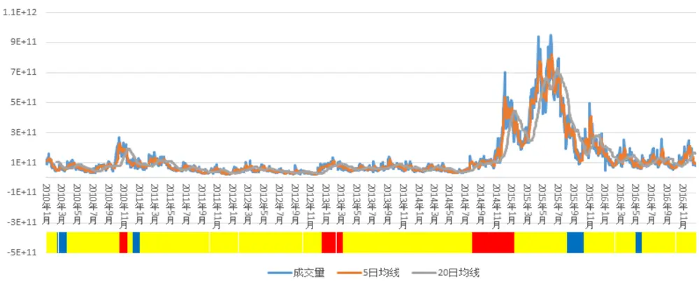
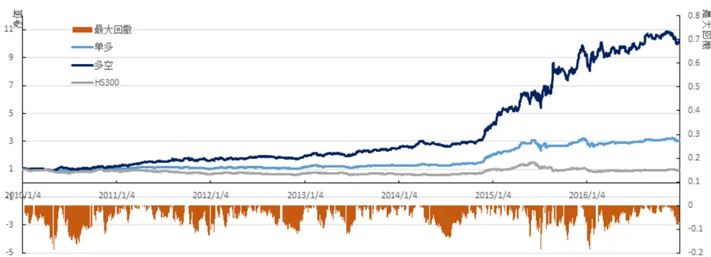
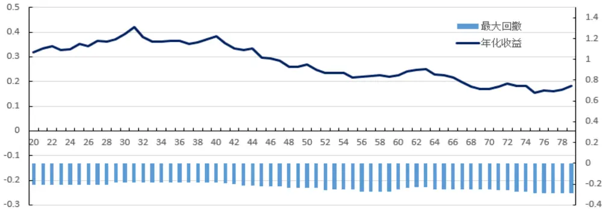
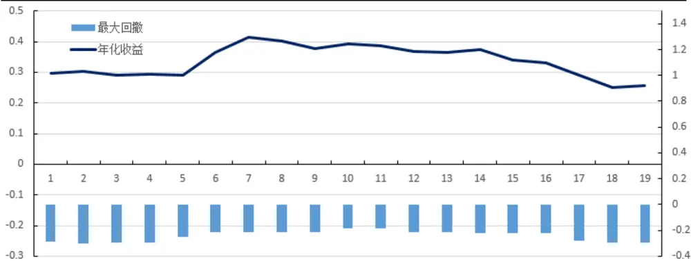

inInfo] [Table_Title] 2017.02.08

# 主题热点对市场择时的启示

## ——数量化专题之八十八

刘富兵（分析师）

殷明（研究助理）

8 021-38676673

021-38674637

liufubing008481@gtjas.com

证书编号 S0880511010017

yinming@gtjas.com

S0880116070042

## 本报告导读：

本报告从一个简单的市场现象展开，即主题在成交稳定市场中表现主要为主题热点轮动，在成交活跃市场表现是互相刺激互相加成，易形成市场共振，在成交萎缩市场表现为热点匮乏。不同状态的市场对后市有着显著不同的预测效应。本报告详细论述了此现象并基于此构建了一类择时策略。

## 摘要：

le_Summary]经研究发现，主题热点在市场上的轮动现象不但会影响个股的走势，还会对大盘有比较显著的启示作用，这主要是因为在不同的市场环境中，主题对市场的情绪、资金的配置起到了关键作用。

- 本篇报告首先根据市场上成交量的短期变化情况将市场分为三种状态：即成交活跃状态，成交萎缩状态和成交稳定状态。我们发现，在不同的市场状态下，主题轮动对后续行情影响有显著不同。

为了描述主题热点在市场上的强弱表现，我们提出了主题相对强弱指数概念。该指标从量价两方面描述了主题热点当前交易日相对上一交易日的相对强弱，之后我们在不同资金状态的市场上分别分析了该指标对后续行情的预测作用。

通过以上研究引出本篇报告的核心逻辑：根据市场成交量变化分为成交稳定市场、成交活跃市场、成交萎缩市场。在成交稳定市场，主题的表现主要为主题之间的轮动，由于成交量较稳定，没有增量资金入场，因此能够拉动的热点数量有限，如果数量过多，市场过热，则后期反而无力，市场表现出反转的态势；在成交活跃市场，主题的表现是互相刺激互相加成，也就是热点越多越容易形成市场共振，后市容易走强；在成交萎缩市场，主题表现为热点匮乏，市场毫无人气，越是没有热点越是人心涣散，后市走势偏弱。

- 基于上述思路，我们构建了基于主题相对强弱指标的择时策略，该策略从 2010 年初至 2016 年末七年时间里，可以在18.61%的最大回撤下获得约39.32%的年化收益。

金融工程

## 金融工程团队：

刘富兵：（分析师）

电话：021-38676673

邮箱：liufubing008481@gtjas.com

证书编号：S0880511010017

陈奥林：（分析师）

电话：021-38674835

邮箱：chenaolin@gtjas.com

证书编号：S0880516100001

## 李辰：（分析师）

电话：021-38677309

邮箱：lichen@gtjas.com

证书编号：S0880516050003

## 孟繁雪：（研究助理）

电话：021-38675860

邮箱：mengfanxue@gtjas.com

证书编号：S088011604008

## 殷明：（研究助理）

电话：021-38674637

邮箱：yinming@gtjas.com

证书编号：S0880116070042

## 叶尔乐：（研究助理）

电话：021-38032032

邮箱：yeerle@gtjas.com

证书编号：S0880116080361

## [Table_R相关报告

《基于上证综指的缺口研究》2017.02.05

《短期股价走势的预测信息（2）—— 个股盘中异动》2017.01.10

《基金收益率分解及其在 FOF 选基中的应用》2017.01.05

《短期股价走势的预测信息（1）— 神秘的尾盘 30 分钟》2016.12.21

《期指交割平稳，市场情绪偏谨慎》2016.11.19

## 1. 引言

量化择时研究专注于通过市场内外的信息对个股或指数的未来走势进行预测。市场内信息主要包括量价信息以及由此衍生出的一系列指标，而市场外信息则范围更广，包括情绪指标、关注度指标等等，即所谓大数据择时。本篇报告试图从一个新的角度进行择时研究，研究使用的信息本身依然是传统的成交量和价格信息，但是研究的主体不再是传统的大盘指数或者个股，而是主题热点。由于主题热点的选取本身是通过文本挖掘的手段获得的，因此本篇报告实际上综合了两者的优势，即通过文本挖掘的方式聚合出主题这个研究主体，而策略本身只采用主题的量价关系作为基础，不引入其他变量，保证数据的纯粹性。

通过观察不难发现，主题热点的轮动在不同类型的市场上具有显著不同的特点。我们经常疑惑于主题热点的爆发对后市大盘走势的预测作用，后市时而受益于市场情绪转暖获得短期的上涨，时而因为主题拉升后后劲不足阴跌绵绵。那么，不同市场环境下主题行情有没有什么显著规律可循？这种规律对后市是否有预测作用？能否根据此规律进行择时策略的构建？这正是本篇报告要解决的主要问题。我们在本文提出了一个基本思路：即证券市场根据近期成交量的大小可以分为成交稳定市场、成交活跃市场和成交萎缩市场。在成交稳定市场，主题的表现主要为主题之间的轮动，由于成交量比较稳定，市场没有增量资金进入，主题的轮动体现为存量资金的博弈，短期能够拉动的热点数量有限，如果数量过多，市场过热，则后期反而无力，市场表现出反转的态势；在成交活跃市场，主题的表现是互相刺激互相加成，也就是热点越多越容易形成市场共振，后市容易走强；在成交萎缩市场，主题表现为热点匮乏，市场毫无人气，人心涣散，后市走势偏弱。本篇报告正是基于这样的逻辑展开。

本篇报告的结构如下：第二章首先对市场状态进行了划分，即如何定义短期的市场的成交量状态；第三章则开始对不同市场状态下主题热点对后市的预测信息进行了详细阐述，包括主题相对强弱指数本身的定义，该指标在不同市场状态下对后市行情的影响，以及如何使用该指标进行择时；第四章根据以上信息构建了一类主题择时策略，并分析了策略的参数稳定性和适用条件，指出了其不足之处；最后，我们对报告进行了总结，并给出未来研究思路。

## 2. 市场状态划分

我们在引言中已经提到，由于在不同市场状态下主题表现对后市的影响不尽相同，因此，定义清楚市场状态就是很重要的前提工作。这一章我们借鉴均线系统中多个均线之间的交错关系，将均线工具使用在成交量中，从而判断出短期市场成交量状态。

## 2.1.市场的短期成交量

市场的成交量数据可以在每天休市后获得。因此，我们只能通过过去的成交量数据来判断当前的市场状态。具体来说，市场的成交量数值是一个连续的数值，而我们划分市场状态实际上相当于对这个数值进行区间化处理。一般来说，判断短期市场的状态相较于平均水平是更高还是更低有多种方法，例如设定静态阈值、布林轨道线法、移动均线法、时间序列法等等。本篇报告中我们使用移动均线法加以说明。

本篇报告基于沪深 300 指数（HS300）进行择时研究，因此相对应的，我们也取出 HS300 的所有股票的成交量数据作为判断市场成交量状态的原始数据。数据从 2010 年 1 月到 2016 年 12 月，共计 7 年时间，对这7年时间的成交量进行移动平均线计算，通过长短两根移动平均线（本篇报告中取常用的 5 日均线和 20 日均线）的交错位置定义当前市场状态，即：

成交活跃市场：

成交萎缩市场：

成交稳定市场：

上述公式的隐含意义非常简洁明了，通过a、b 两个参数控制短期成交量和长期成交量之间的相对关系，分别设置了上限和下限，短期成交量如果在上下限之间，则短期成交稳定；如果超越上限，则近期成交量放大；如果超越下限，则近期成交量缩小。为了简便，本篇报告所有示例中取值 a=0.5,b=2.这里 a、b 的取值对市场的划分会有影响，但是在下文 2.2节中介绍的平滑处理后，影响较小。

## 2.2.短期成交量状态划分

根据2.1节对市场成交量的划分方法，我们对HS300 的成交量进行了划分，具体步骤如下：

(a) 取 HS300 从 2010 年 1 月 1 日~2016 年 12 月 31 日所有交易日的日成交量数据，并计算其 5 日均线和20日均线；

(b) 根据 2.1 节对于三种市场状态的定义公式计算每个交易日所处的市场状态，成交活跃、成交萎缩、成交稳定状态分别用状态 1，-1,0表示；

(c) 由于市场状态有一定的延伸性，为了使得数据更加平滑，不至于在各种状态间频繁切换，对市场状态数据进行平滑。平滑方法为：考虑上一交易日的市场状态，如果为 1（或-1），则必须等到短期均线下穿（或下穿）长期均线才改变市场状态。举例说明：根据(a)、(b)步骤，我们得到 2010 年10 月 21日~2010年11月17 日的当日交易量、5 日平均线、20 日平均线和市场状态如表 1 所示。从表中不难看出，10 月 21 日和 10 月 22 日 MA(5)满足大于 2*MA（20）的条件，因此该两日的市场状态被标记为 1，而后面几个交易日状态都被标记为0。现在对 10月 25日数据进行平滑：由于上一交易日（10月22日）市场状态为1，因此，需要等到5日均线下穿20 日均线时才改变市场状态，10月 25日不满足这一条件，因此平滑后状态依然为 1。直到 11 月 16 日，第一次出现了短均线下穿长均线现象，此时我们不再平滑，标记当日状态为原始状态0，依次类推。

表 1：市场状态平滑示例

| 日期 | 当日交易量 | 5 日平均线 | 20日平均线 | 市场 状态 | 平滑后 状态 |
| --- | --- | --- | --- | --- | --- |
| 2010/10/21 | 1.75E+11 | 2.18E+11 | 8.15E+10 | 1 | 1 |
| 2010/10/22 | 1.63E+11 | 2.01E+11 | 8.42E+10 | 1 | 1 |
| 2010/10/25 | 2.09E+11 | 1.90E+11 | 9.04E+10 | 0 | 1 |
| 2010/10/26 | 2.05E+11 | 1.98E+11 | 9.49E+10 | 0 | 1 |
| 2010/10/27 | 1.77E+11 | 1.86E+11 | 1.00E+11 | 0 | 1 |
| 2010/10/28 | 1.41E+11 | 1.79E+11 | 1.06E+11 | 0 | 1 |
| 2010/10/29 | 1.46E+11 | 1.76E+11 | 1.14E+11 | 0 | 1 |
| 2010/11/1 | 1.87E+11 | 1.71E+11 | 1.23E+11 | 0 | 1 |
| 2010/11/2 | 2.34E+11 | 1.77E+11 | 1.26E+11 | 0 | 1 |
| 2010/11/3 | 1.79E+11 | 1.77E+11 | 1.34E+11 | 0 | 1 |
| 2010/11/4 | 1.65E+11 | 1.82E+11 | 1.38E+11 | 0 | 1 |
| 2010/11/5 | 1.97E+11 | 1.92E+11 | 1.42E+11 | 0 | 1 |
| 2010/11/8 | 1.74E+11 | 1.90E+11 | 1.48E+11 | 0 | 1 |
| 2010/11/9 | 1.70E+11 | 1.77E+11 | 1.54E+11 | 0 | 1 |
| 2010/11/10 | 1.77E+11 | 1.76E+11 | 1.60E+11 | 0 | 1 |
| 2010/11/11 | 2.09E+11 | 1.85E+11 | 1.64E+11 | 0 | 1 |
| 2010/11/12 | 2.24E+11 | 1.91E+11 | 1.69E+11 | 0 | 1 |
| 2010/11/15 | 1.44E+11 | 1.85E+11 | 1.75E+11 | 0 | 1 |
| 2010/11/16 | 1.54E+11 | 1.82E+11 | 1.83E+11 | 0 | 0 |
| 2010/11/17 | 1.19E+11 | 1.70E+11 | 1.88E+11 | 0 | 0 |

数据来源：国泰君安证券研究

图 1 市场状态划分

数据来源：国泰君安证券研究

根据上述的划分方式，我们将 2010年初到2016 年末 7 年的市场进行了状态划分，见图1所示。图中的折线图是当日成交量、成交量5日均线和成交量 20 日均线。坐标轴下方的状态条则是划分的市场状态，为了使视觉效果更加清晰，我们分别用红色代表成交活跃市场，蓝色代表成交萎缩市场，黄色代表成交稳定市场。从图中可以看出，在七年时间内，大部分时间市场处于成交稳定状态，成交活跃市场大部分出现在比较强势的牛市中，而成交萎缩市场则出现在跌幅较大的熊市中。

## 3. 不同市场状态下主题对后市的预测信息

不同市场状态下主题热点对后市走势的启示作用怎样？这是本章我们主要要探讨的话题。我们针对不同类型的市场状态，分别进行了样本统计，从而发现了相关规律，即成交活跃市场和成交萎缩市场下主题热点和后市走势都是正向相关关系。当然，在此之前我们需要先量化地定义主题的强弱。因此我们提出了主题相对强弱的概念。

## 3.1.主题相对强弱指数

我们称满足以下条件的主题为相对较强主题：

(a)当前交易日主题指数价格大于上一交易日主题指数价格；

(b)当前交易日主题内个股成交量大于上一交易日主题内个股成交量。

针对以上两点，需要做一些解释。首先，这里提到的主题指数是由主题下所有个股构成的指数，用以描述该主题的市场表现。本报告中的主题指数取自于Wind主题概念指数，如表2 所示。针对Wind数据，我们做了简单的统计研究，截止16 年12 月共148 个主题，平均每个主题个股数43支。本篇报告研究时间从10 年开始，去除 10年到 16年底 7年时间内缺失的主题，过滤后主题数92个。对92个主题进行行业分类，发现个股能够较均匀覆盖申万 28 个行业，且主题个股数量覆盖所有 A 股2/3 以上，因此数据具有一定的研究价值。其次，主题内个股的成交量数据是用主题中所有个股的成交量数据之和计算得到。由于在整篇报告中我们只对主题自身进行纵向时间轴的比较，不涉及主题之间的横向比较，因此该数据不进行归一化影响不大。最后，以上两个条件是必需同时满足的，也就是说，只有主题在量价两方面指标都强于上一交易日，才认为主题较上一交易日更强。

主题相对强弱指数定义为当前交易日中相对较强主题的个数。例如，2016年12月 14日，共有14个主题量价均战胜上一交易日 12月 13日，因此该指数值为 14；而 12 月 15 日则有 52 个主题战胜上一交易日，因此指数值为 52。考虑到数据处理后合法的主题数量为 92 个，因此主题强弱指数的变动区间为[0,92]。

表 2：主题指数一览

| 主题指数 | 主题代号 |
| --- | --- |
| 智能电网指数 | 884028.WI |
| 物联网指数 | 884030.WI |
| 迪士尼指数 | 884032.WI |
| 环保概念指数 | 884034.WI |
| 新能源指数 | 884035.WI |
| 风力发电指数 | 884036.WI |
| 锂电池指数 | 884039.WI |
| 垃圾发电指数 | 884040.WI |
| 绿色节能照明指数 | 884041.WI |
| 太阳能发电指数 | 884045.WI |
| 新材料指数 | 884057.WI |
| 生物育种指数 | 884062.WI |
| 移动支付指数 | 884069.WI |
| 新疆区域振兴指数 | 884074.WI |
| 高铁指数 | 884075.WI |
| 新能源汽车指数 | 884076.WI |
| … | … |

数据来源：Wind资讯，国泰君安证券研究

考虑主题相对强弱指数的实际含义，实际上表明了当前交易日有多少主题比上一交易日更强。因此，该数值越大，说明当前的主题热点炒作趋势越强。当然，这还不能直接预示后市走势，我们还需要集合当前的市场状态综合判断。因此，下面两节将分别针对两种不同的市场状态观察主题相对强弱指数对后市的预测作用。

## 3.2.成交活跃市场中指标的预测表现

首先考虑成交活跃市场中指标的表现。我们列出所有在成交活跃市场中的交易日，统计这些交易日的后5 日收益及胜率，将该结果和加入主题信息之后的统计结果相比较，看加入主题信息后是否有显著提升。我们首先考察主题相对强弱指数对后五日收益的预测效果，具体做法是将主题相对强弱指数根据百分位切分为前10%，前20%...前100%的样本数，统计每个切分后的子样本的五日收益和胜率，结果见表 3所示。

表 3：成交活跃市场中指标百分位表现

| 百分位 | 10% | 20% | 30% | 40% | 50% |
| --- | --- | --- | --- | --- | --- |
| 5 日收益 | 1.592% | 1.332% | 1.363% | 1.441% | 1.293% |
| 胜率 | 0.73684 | 0.66158 | 0.64912 | 0.65789 | 0.65263 |
| 百分位 | 60% | 70% | 80% | 90% | 100% |
| 5 日收益 | 1.220% | 1.060% | 1.0550% | 1.014% | 0.950% |
| 胜率 | 0.66667 | 0.63158 | 0.63816 | 0.61912 | 0.58263 |

数据来源：国泰君安证券研究

从表3不难看出，成交活跃市场的所有样本五日收益是 0.950%，胜率是58.263%，而随着百分位水平逐步提高，无论是五日收益还是胜率都有比较明显的上升，也就是说，两者之间有正相关关系，从投资的角度讲，如果在成交活跃市场上出现主题强势的现象，应该是买入或者加仓的时机。但是，由于在实际的投资当中，我们并不知道样本数量情况，无法通过百分位数来量化地确定主题是否“足够强”，而考虑到主题相对强弱指数本身是在[0,92]这个封闭区间内波动的，因此我们可以使用一个静态阈值 $\lambda_{\min}$ 来表示这个“高阈值”。也就是说，实际的投资决策中，我们在主题相对强弱指数大于 $\lambda_{\min}$ 时发出买入信号。

为了进一步说明这一点，我们列出全样本中所有在成交活跃市场下主题相对强弱指数大于 $\lambda_{\min}$ 的样本，这里取 $\lambda_{\min}$ 为 40，如表 4所示（表中 Index是主题相对强弱指数，Return 是后五日收益）。可以看到，在大于 $\lambda_{\min}$ 的样本中，交易日后五日收益达到1.463%，高出成交量活跃市场的平均值 0.950%；胜率达到 62.86%，高于平均水平 58.26%。

表 4：成交活跃市场下主题相对强弱指数大于 $\lambda_{\min}$ 的样本

| Date | 2010/10/20 | 2010/10/22 | 2010/10/26 | 2010/11/8 | 2012/12/20 |
| --- | --- | --- | --- | --- | --- |
| Index | 50 | 49 | 56 | 55 | 45 |
| Return | 0.002059 | 0.000393 | -0.000852 | -0.06585 | 0.025066 |
| Date | 2012/12/21 | 2012/12/31 | 2013/1/7 | 2013/1/18 | 2013/1/21 |
| Index | 42 | 63 | 47 | 42 | 49 |
| Return | 0.045551 | 0.003019 | 0.016459 | -0.009156 | 0.01569 |
| Date | 2013/2/8 | 2013/2/18 | 2013/2/20 | 2014/8/12 | 2014/8/19 |
| Index | 63 | 63 | 44 | 60 | 62 |
| Return | -0.063181 | -0.048406 | -0.039945 | 0.007516 | -0.021339 |
| Date | 2014/8/22 | 2014/9/4 | 2014/9/10 | 2014/9/19 | 2014/9/25 |
| Index | 51 | 44 | 41 | 55 | 44 |
| Return | -0.011447 | 0.005001 | -0.012788 | 0.004944 | 0.018461 |
| Date | 2014/10/9 | 2014/11/6 | 2014/11/17 | 2014/11/25 | 2014/11/26 |
| Index | 46 | 40 | 57 | 50 | 44 |
| Return | -0.015133 | 0.029402 | 0.032004 | 0.088763 | 0.089801 |
| Date | 2014/11/27 | 2014/11/28 | 2014/12/4 | 2014/12/11 | 2014/12/15 |
| Index | 44 | 40 | 46 | 41 | 63 |
| Return | 0.127015 | 0.112526 | 0.025339 | 0.051183 | 0.055095 |
| Date | 2014/12/25 | 2014/12/26 | 2015/1/5 | 2015/1/6 | 2015/1/13 |
| Index | 44 | 45 | 63 | 62 | 46 |
| Return | 0.091779 | 0.056654 | -0.03514 | -0.034885 | -0.033528 |

数据来源：国泰君安证券研究

## 3.3.成交萎缩市场中指标的预测表现

下面，我们再来考虑成交萎缩市场中指标的预测表现。和 3.2节一样，可以列出所有在成交萎缩市场中的交易日，统计这些交易日的后5日收益及胜率，将该结果和加入主题信息之后的统计结果相比较。我们将主题相对强弱指数根据百分位切分为前10%，前20%...前100%的样本数，统计每个切分后的子样本的五日收益和胜率，结果见表 5所示。

表 5：成交萎缩市场中指标百分位表现

| 百分位 | 10% | 20% | 30% | 40% | 50% |
| --- | --- | --- | --- | --- | --- |
| 5 日收益 | -0.447% | -0.459% | -0.405% | -0.342% | -0.232% |
| 胜率 | 0.4361 | 0.4552 | 0.4451 | 0.4627 | 0.4893 |
| 百分位 | 60% | 70% | 80% | 90% | 100% |
| 5日收益 | 0.267% | -0.223% | -0.172% | -0.194% | -0.176% |
| 胜率 | 0.4727 | 0.4745 | 0.4817 | 0.4941 | 0.4829 |

数据来源：国泰君安证券研究

从表 5 也可以看出，成交萎缩市场的所有样本五日收益是-0.176%，胜率是48.29%，而随着百分位水平逐步提高（和成交活跃市场相反，这里的百分位水平越高，指的是主体相对强弱指数越低），五日收益还是胜率都开始下降，但是下降的幅度并不大，也就是说，两者之间也是正相关关系，但是相关关系不如成交活跃市场那么明显。同样，由于在实际的投资当中，我们并不知道样本数量情况，无法通过百分位数来量化地确定主题是否“足够弱”，因此我们也使用一个静态阈 $值\lambda_{1\text{。 }}$ 来表示这个“低阈值”。也就是说，实际的投资决策中，我们在主题相对强弱指数小于 $\lambda_{10w}$ 时发出卖空信号。为了进一步说明这一点，我们也列出了全样本中所有在成交萎缩市场下主题相对强弱指数小于 $\lambda_{1ow}$ 的样本，这里取•low为 10，如表 6 所示。可以看到，在小于 $\lambda_{10\mathrm{w}}$ 的样本中，交易日后五日收益只有-0.395%，低于成交萎缩市场的平均值-0.176%；胜率只有42.86%，低于平均水平48.29%。

表 6：成交萎缩市场下主题相对强弱指数小于 $\lambda_{\mathrm{low}}$ 的样本

| Date | 2010/3/4 | 2010/12/9 | 2010/12/23 | 2010/12/24 | 2010/12/27 |
| --- | --- | --- | --- | --- | --- |
| Index | 1 | 6 | 1 | 2 | 0 |
| Return | 0.008039 | 0.034354 | -0.039048 | -0.010969 | 0.029026 |
| Date | 2010/12/28 | 2015/8/18 | 2015/8/19 | 2015/8/20 | 2015/8/21 |
| Index | 0 | 0 | 4 | 1 | 0 |
| Return | 0.042934 | -0.204549 | -0.221414 | -0.147766 | -0.068881 |
| Date | 2015/8/24 | 2015/8/25 | 2015/8/26 | 2015/8/27 | 2015/8/31 |
| Index | 0 | 9 | 0 | 3 | 1 |
| Return | 0.027782 | 0.104885 | 0.112417 | 0.01399 | 0.009734 |
| Date | 2015/9/1 | 2015/9/2 | 2015/9/10 | 2015/9/14 | 2015/9/15 |
| Index | 0 | 2 | 1 | 8 | 0 |
| Return | -0.001345 | -0.005539 | -0.035908 | 0.008264 | 0.059259 |
| Date | 2015/9/18 | 2015/9/25 | 2015/9/28 | 2015/9/29 | 2016/5/6 |
| Index | 1 | 2 | 3 | 5 | 0 |
| Return | -0.005943 | 0.033467 | 0.0632 | 0.083737 | -0.017704 |
| Date | 2016/5/9 | 2016/5/10 | 2016/5/13 | 2016/5/18 |  |
| Index | 0 | 0 | 5 | 0 |  |
| Return | 0.009686 | 0.005511 | 0.001068 | -0.002872 |  |

数据来源：国泰君安证券研究

## 4. 主题择时策略实证分析

通过上文的描述，我们已经发现了主题热点在市场择时中的作用。我们需要针对不同的市场状态进行多空的操作选择，基于此，我们构建了一类主题择时策略。

## 4.1.主题择时策略构建与分析

根据第三章的逻辑，市场根据近期成交量的变化情况可以分为三种状态，即成交活跃市场、成交萎缩市场和成交稳定市场。在成交活跃市场，主题热点越多，市场越容易形成共振，后市容易走强，具体到策略，只要主题相对强弱指数大于参数 $\lambda_{\mathrm{high}}$ ，则发出买入信号，直至市场状态改变进行平仓操作；在成交萎缩市场，市场缺乏人气，后市偏弱，因此主题强弱指数小于参数 $\lambda_{\mathrm{low}}$ 时，发出卖出信号，直至市场状态改变进行平仓操作；在成交稳定市场，一般没有外部资金流入，因此主题表现为轮动的特征，从而在主题强弱指数大于 $\lambda_{\min}$ 时发出做空信号，小于 $\lambda_{1ow}$ 时发出做多信号。考虑交易成本，构建出基于主题相对强弱指数的择时策略，策略曲线如图2所示。

择时标的：HS300指数

回测时间：2010.1.1-2016.12.31

策略方案：

首先确定当前市场状态，即当前市场属于成交活跃市场，还是成交萎缩 市场，还是成交稳定市场。

如果为成交活跃市场，则主题强弱指数大于 $\lambda_{\min}$ 时，发出做多信号，直至市场状态改变进行平仓；如果为成交萎缩市场，则主题强弱指数小于$\lambda_{1\mathsf{ow}}$ 时，发出做空信号，直至市场状态改变进行平仓；如果为成交稳定市场，则主题强弱指数大于 $\lambda_{\min}$ 时发出做空信号，小于 $\lambda_{1ow}$ 时发出做多信号。参数选择：选择 $\lambda_{\mathrm{high}}=30$ $\lambda_{100}=10$ （4.2 节会进行参数敏感性测试，证明该选择并非必须）

交易成本：考虑多空双边各千 2

图 2 主题择时策略收益曲线

数据来源：国泰君安证券研究

策略的相关指标如表 7 所示。

表 7：策略相关指标

| 初始净值 | 最终净值 | 年化收益 | 最大回撤 | 最大回撤区间 |
| --- | --- | --- | --- | --- |
| 1 | 10.1894 | 39.32% | 18.61% | 2015-06-16~ |
|  |  |  |  | 2015-07-09 |

数据来源：国泰君安证券研究

从策略的曲线可以看到，策略整体表现比较稳定，最大回撤为18.61%，出现在 2015 年 6 月 16 日到 2015 年 7 月 9 日这一波股灾的下跌中。回撤的主要原因比较明显，我们在做市场的状态定义的时候，使用了双均线策略，其中短均线为 5日均线，因此，状态判断的反应时间大于 5个交易日，因此在暴跌的市场上反应偏慢。其次的最大回撤出现在 2016年年初的这一波下跌。当时市场引入了熔断机制，从而使得整个 HS300的成交量大幅下跌，尤其在1月 7日这一天，市场更是很快跌破熔断线，从而导致当天成交量异常少。这就导致了我们通过成交量判断市场状态的方法出现了偏差。

## 4.2.参数敏感性测试

在策略中，我们频繁使用到了参数λhigh和λow，并且分别取值30和10。显然，这两个参数的选择会直接影响策略表现。那么，策略是否存在参数过度拟合的情况？如果变换参数的选择，是否会对策略造成很大影响？为了解决这些问题，我们分别对这两个参数进行了敏感性测试，即固定其中一个参数，在策略取值的附近遍历另一个参数，观察年化收益和最大回撤随参数的变化情况。我们将参数遍历测试的结果绘成图表，如表8，表9，图3，图4所示。

表 8：参数•high敏感性测试

| 参数λhigh | 最大回撤 | 年化收益 | 参数λlow | 最大回撤 | 年化收益 |
| --- | --- | --- | --- | --- | --- |
| 20 | -0.2064 | 0.3188 | 50 | -0.2384 | 0.2688 |
| 21 | -0.2064 | 0.3331 | 51 | -0.2384 | 0.2463 |
| 22 | -0.2064 | 0.3426 | 52 | -0.2579 | 0.2336 |
| 23 | -0.2064 | 0.3281 | 53 | -0.2528 | 0.2348 |
| 24 | -0.2064 | 0.3306 | 54 | -0.2528 | 0.2356 |
| 25 | -0.2064 | 0.3534 | 55 | -0.2528 | 0.2167 |
| 26 | -0.2064 | 0.3431 | 56 | -0.2741 | 0.2185 |
| 27 | -0.2064 | 0.3647 | 57 | -0.2741 | 0.2233 |
| 28 | -0.2064 | 0.3607 | 58 | -0.2741 | 0.2245 |
| 29 | -0.1861 | 0.3709 | 59 | -0.2741 | 0.2192 |
| 30 | -0.1861 | 0.3932 | 60 | -0.2536 | 0.2257 |
| 31 | -0.1861 | 0.4199 | 61 | -0.2362 | 0.2417 |
| 32 | -0.1861 | 0.3809 | 62 | -0.2308 | 0.2474 |
| 33 | -0.1861 | 0.3602 | 63 | -0.2308 | 0.2492 |
| 34 | -0.1861 | 0.3599 | 64 | -0.2519 | 0.2275 |

| 35 -0.1881 0.3642 65 -0.2519 0.2258 |
| --- |
| 36 -0.1881 0.3649 66 -0.2519 0.2164 |
| 37 -0.1881 0.3527 67 -0.2519 0.1975 |
| 38 -0.1881 0.3579 68 -0.2519 0.1774 |
| 39 -0.1881 0.3701 69 -0.2519 0.1698 |
| 40 -0.1881 0.3832 70 -0.2519 0.1702 |
| 41 -0.1898 0.3544 71 -0.2595 0.1790 |
| 42 -0.1985 0.3331 72 -0.2595 0.1919 |
| 43 -0.2167 0.3287 73 -0.2692 0.1812 |
| 44 -0.2167 0.3341 74 -0.2692 0.1812 |
| 45 -0.2194 0.2962 75 -0.2891 0.1545 |
| 46 -0.2194 0.2943 76 -0.2891 0.1622 |
| 47 -0.2194 0.2841 77 -0.2891 0.1614 |
| 48 -0.2384 0.2592 78 -0.2891 0.1655 |
| 49 -0.2384 0.2583 79 -0.2891 0.1832 |

数据来源：国泰君安证券研究

表 9：参数•low敏感性测试

| 参数λlow | 最大回撤 | 年化收益 | 参数λlow | 最大回撤 | 年化收益 |
| --- | --- | --- | --- | --- | --- |
| 1 | -0.2861 | 0.2977 | 11 | -0.1861 | 0.3863 |
| 2 | -0.3025 | 0.3025 | 12 | -0.2130 | 0.3681 |
| 3 | -0.2950 | 0.2903 | 13 | -0.2130 | 0.3631 |
| 4 | -0.2950 | 0.2926 | 14 | -0.2182 | 0.3734 |
| 5 | -0.2478 | 0.2894 | 15 | -0.2182 | 0.3387 |
| 6 | -0.2143 | 0.3636 | 16 | -0.2182 | 0.3311 |
| 7 | -0.2143 | 0.4124 | 17 | -0.2787 | 0.2889 |
| 8 | -0.2143 | 0.4010 | 18 | -0.2919 | 0.2504 |
| 9 | -0.2143 | 0.3776 | 19 | -0.2949 | 0.2555 |
| 10 | -0.1861 | 0.3932 | 11 | -0.1861 | 0.3863 |

数据来源：国泰君安证券研究

图 3 参数•high敏感性测试

数据来源：国泰君安证券研究

图 4 参数 $\lambda_{\mathrm{low}}$ 敏感性测试

数据来源：国泰君安证券研究

可以看到，固定参数• $100^{-10}=10$ $\lambda_{\mathsf{high}}.$ 在 20 到 80 之间变化时，整体呈现出年化收益递减，最大回撤递增的现象，在 $\lambda_{\mathrm{high}}$ 取值 30 附近（在区间[25,40]内）整体比较稳定，并在 $\lambda_{\min}=31$ 处取得年化收益的最大值。固定参数 $\lambda_{\mathrm{high}}$ =30，•low在1 到20 之间变化时，年化收益和最大回撤都没有显著的变化特征，但是 $在\lambda_{1\circ w}$ 取值 10附近（在区间[6,15]内）比较稳定。

因此，通过参数稳定性测试可以看出，虽然参数的取值对策略有一定影响，但是，只要在合适的区间内选择合适的参数，整体影响不大。

## 5. 总结与展望

本篇报告从主题热点出发，通过成交量对市场状态进行了划分，并探讨了不同市场状态下主题热点对后市的预测作用，提出了主题相对强弱指数的概念，并通过该指标构建了针对HS300指数的择时策略。该策略在过去7年内的表现比较稳定。

仔细回想该策略思想不难发现，本篇报告的核心实际上是把握了市场整体成交量和主题的量价之间的联动关系。传统的择时一般是基于大盘指数的量价信息本身，好处是信息非常直接，针对什么择时就使用什么信息，缺点则是信息量相对较少。从主题的角度进行择时，实际上相当于把整个市场划分为几个市场关注度较高的子集，通过观察这些子集之间的关系，以及主题和大盘之间的关系，寻求新的择时角度。其优势在于信息量更加丰富，缺点则是更加复杂。为了避免陷入策略过于复杂的窘境，本篇报告使用了最基本的双均线工具和阈值切分方法来进行了初步研究。

主题择时实际上也属于大数据择时的一部分。我们后续会进一步寻找投资者关心的数据和话题，探究大数据如何在择时方面发挥其优势。

## 本公司具有中国证监会核准的证券投资咨询业务资格

## 分析师声明

作者具有中国证券业协会授予的证券投资咨询执业资格或相当的专业胜任能力，保证报告所采用的数据均来自合规渠道，分析逻辑基于作者的职业理解，本报告清晰准确地反映了作者的研究观点，力求独立、客观和公正，结论不受任何第三方的授意或影响，特此声明。

## 免责声明

本报告仅供国泰君安证券股份有限公司（以下简称“本公司”）的客户使用。本公司不会因接收人收到本报告而视其为本公司的当然客户。本报告仅在相关法律许可的情况下发放，并仅为提供信息而发放，概不构成任何广告。

本报告的信息来源于已公开的资料，本公司对该等信息的准确性、完整性或可靠性不作任何保证。本报告所载的资料、意见及推测仅反映本公司于发布本报告当日的判断，本报告所指的证券或投资标的的价格、价值及投资收入可升可跌。过往表现不应作为日后的表现依据。在不同时期，本公司可发出与本报告所载资料、意见及推测不一致的报告。本公司不保证本报告所含信息保持在最新状态。同时，本公司对本报告所含信息可在不发出通知的情形下做出修改，投资者应当自行关注相应的更新或修改。

本报告中所指的投资及服务可能不适合个别客户，不构成客户私人咨询建议。在任何情况下，本报告中的信息或所表述的意见均不构成对任何人的投资建议。在任何情况下，本公司、本公司员工或者关联机构不承诺投资者一定获利，不与投资者分享投资收益，也不对任何人因使用本报告中的任何内容所引致的任何损失负任何责任。投资者务必注意，其据此做出的任何投资决策与本公司、本公司员工或者关联机构无关。

本公司利用信息隔离墙控制内部一个或多个领域、部门或关联机构之间的信息流动。因此，投资者应注意，在法律许可的情况下，本公司及其所属关联机构可能会持有报告中提到的公司所发行的证券或期权并进行证券或期权交易，也可能为这些公司提供或者争取提供投资银行、财务顾问或者金融产品等相关服务。在法律许可的情况下，本公司的员工可能担任本报告所提到的公司的董事。

市场有风险，投资需谨慎。投资者不应将本报告作为作出投资决策的唯一参考因素，亦不应认为本报告可以取代自己的判断。
在决定投资前，如有需要，投资者务必向专业人士咨询并谨慎决策。

本报告版权仅为本公司所有，未经书面许可，任何机构和个人不得以任何形式翻版、复制、发表或引用。如征得本公司同意进行引用、刊发的，需在允许的范围内使用，并注明出处为“国泰君安证券研究”，且不得对本报告进行任何有悖原意的引用、删节和修改。

若本公司以外的其他机构（以下简称“该机构”）发送本报告，则由该机构独自为此发送行为负责。通过此途径获得本报告的投资者应自行联系该机构以要求获悉更详细信息或进而交易本报告中提及的证券。本报告不构成本公司向该机构之客户提供的投资建议，本公司、本公司员工或者关联机构亦不为该机构之客户因使用本报告或报告所载内容引起的任何损失承担任何责任。

## 评级说明

## 1.投资建议的比较标准

投资评级分为股票评级和行业评级。

以报告发布后的12个月内的市场表现为比较标准，报告发布日后的 12个月内的公司股价（或行业指数）的涨跌幅相对同期的沪深 300 指数涨跌幅为基准。

## 2.投资建议的评级标准

报告发布日后的 12 个月内的公司股价（或行业指数）的涨跌幅相对同期的沪深 300 指数的涨跌幅。

|  | 评级 | 说明 |
| --- | --- | --- |
| 股票投资评级 | 增持 | 相对沪深300 指数涨幅15%以上 |
|  | 谨慎增持 | 相对沪深300指数涨幅介于5%～15%之间 |
|  | 中性 | 相对沪深300指数涨幅介于-5%～5% |
|  | 减持 | 相对沪深 300 指数下跌 5%以上 |
| 行业投资评级 | 增持 | 明显强于沪深 300 指数 |
|  | 中性 | 基本与沪深 300指数持平 |
|  | 减持 | 明显弱于沪深300指数 |

## 国泰君安证券研究所

|  | 上海 | 深圳 | 北京 |
| --- | --- | --- | --- |
| 地址 | 上海市浦东新区银城中路168号上海 银行大厦29层 | 深圳市福田区益田路 6009号新世界 商务中心34层 | 北京市西城区金融大街 28 号盈泰中 心2号楼10层 |
| 邮编 | 200120 | 518026 | 100140 |
| 电话 | （021)38676666 | (0755)23976888 | (010)59312799 |
|  | E-mail: gtjaresearch@gtjas.com |  |  |