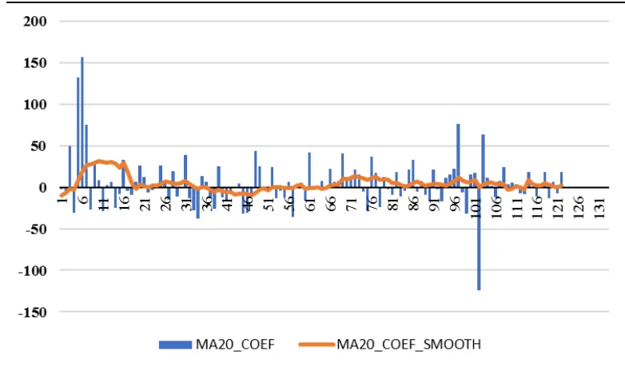
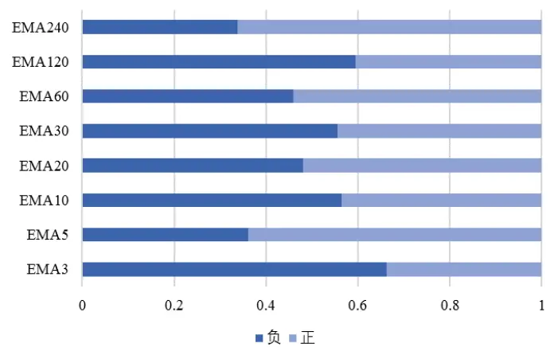
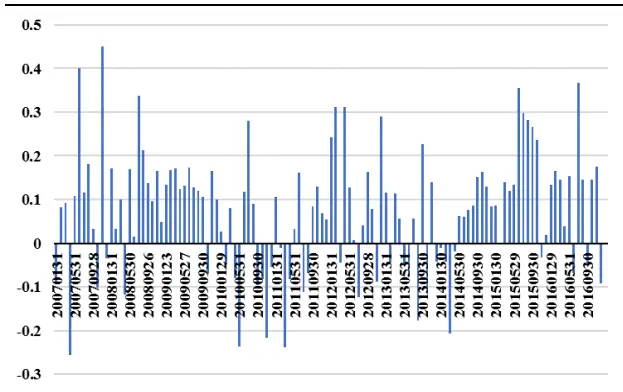
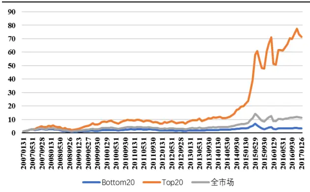
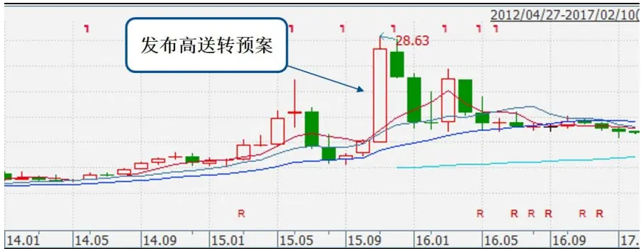
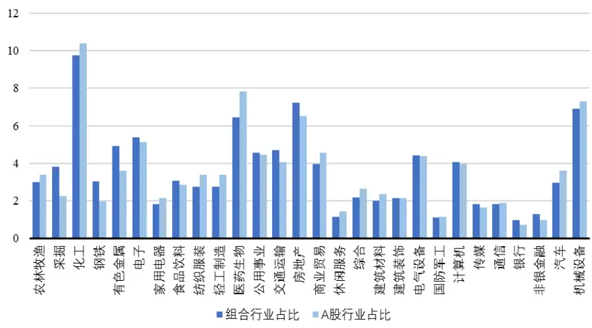
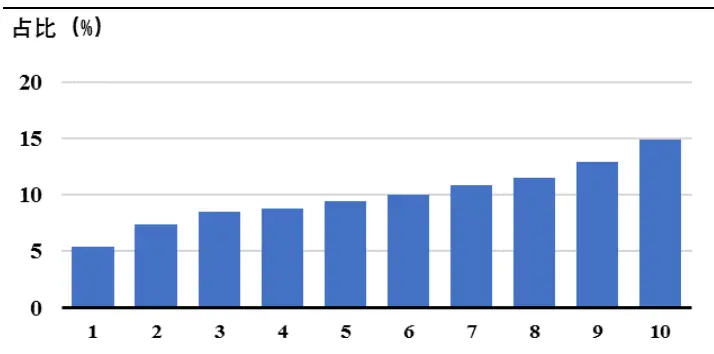
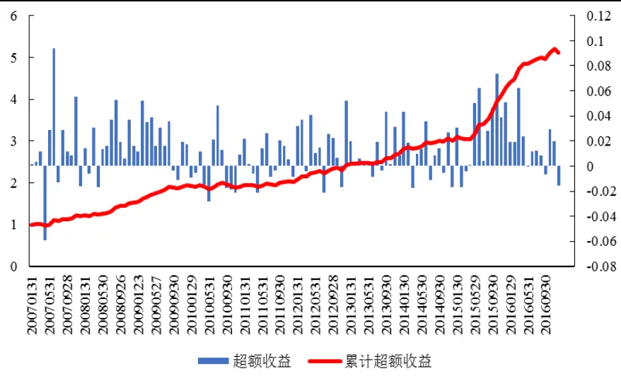

inInfo] [Table_Title] 2017.02.21

# 综合期限多样性的趋势选股策略

## ——数量化专题之九十

刘富兵（分析师）

8 021-38676673

liufubing008481@gtjas.com

证书编号 S0880511010017

## 本报告导读：

本报告将市场整体趋势特征与个股短期、中期、长期移动平均指标相结合，构建基于个股价格趋势的选股策略。

## 摘要：

[Table_Summary]• 移动平均线由于具有简单直观的特征，是最常用的技术指标之一，除了简单发送多空信号之外，移动平均指标作为历史股价走势信息的载体，能够对未来收益起到一定的预测作用。

由于不同期限移动平均指标包含的信息不同，本报告策略的核心思想在于同时捕捉个股历史短期、中期、长期趋势特征，并结合市场整体环境，构建趋势模型，进行个股收益的预测。模型本身不依赖于市场短期、中期、长期的动量反转特征的事前假设，各移动平均指标的预测方向和力度随市场整体环境而动态变化。

本报告以 2005 年 1 月至 2016 年 12 月为回测区间，构建选股策略。策略在整个回测期内的表现较为平稳，组合的年化超额收益为 15.3%，最大回撤 5.4%，信息比率 1.8，胜率为72.8%。

与简单移动平均指标构建的选股策略相比，趋势模型构建的股票组合不论从夏普比、信息比例、最大回撤和胜率角度来看均更优，特别是在控制回撤方面表现出明显的优势。这就意味着综合多方信息的趋势模型的整体稳定性更高，体现为较强的风险控制能力。

金融工程

## 金融工程团队：

刘富兵：（分析师）

电话：021-38676673

邮箱：liufubing008481@gtjas.com

证书编号：S0880511010017

陈奥林：（分析师）

电话：021-38674835

邮箱：chenaolin@gtjas.com

证书编号：S0880516100001

## 李辰：（分析师）

电话：021-38677309

邮箱：lichen@gtjas.com

证书编号：S0880516050003

## 孟繁雪：（研究助理）

电话：021-38675860

邮箱：mengfanxue@gtjas.com

证书编号：S088011604008

## 殷明：（研究助理）

电话：021-38674637

邮箱：yinming@gtjas.com

证书编号：S0880116070042

叶尔乐：（研究助理）

电话：021-38032032

邮箱：yeerle@gtjas.com

证书编号：S0880116080361

## （感谢博士后工作站黄皖璇对本报告的贡献）

## [Table_R相关报告

《次新股开板投资攻略》2017.02.10

《主题热点对市场择时的启示》2017.02.08

《基于上证综指的缺口研究》2017.02.05

《短期股价走势的预测信息（2）—— 个股盘中异动》2017.01.10

《基金收益率分解及其在 FOF 选基中的应用》2017.01.05

## 1. 背景介绍

## 1.1. 概述

在之前的专题报告《动量测评之均线策略》中我们曾提到，“股票价格序列由趋势和震荡两种走势类型连接而成，趋势完成后转震荡，震荡完成后转趋势，这是两种属性完全相反的走势类型，而单一技术指标要么为趋势属性，要么为反转属性，难以兼顾到两种不同的走势类型，很难取得高胜率。”由此不禁想到，如果单一指标无法在不同市场环境下均有效发挥作用，是否能够构建综合指标，使之兼具动量和反转特征，从而提高选股的准确性。

移动平均线由于具有简单直观的特征，是最常用的技术指标之一，在指导交易时，多用于发送多空信号。在单均线应用中，价格上穿或下穿均线是趋势形成的必要而充分条件；双均线系统里，长期和短期均线形成的“金叉”和“死叉”可分别发送做多和做空的信号。

不同期限移动平均指标包含的信息不同，短期、中期、长期移动平均指标分别捕捉了个股短期、中期、长期趋势特征。个股的价格在多、空相反方向力量的共同作用下形成，短期、中期、长期移动平均线分别捕捉个股短期、中期、长期的动量反转特征，可以简单看作股价所受到的正反两个方向作用力。除了个股本身因素之外，市场整体环境也会影响各方向作用力的效果。

鉴于此，本文通过截面回归的方式，寻找不同期限移动平均指标与下一期收益之间作用关系。具体而言，以股票下一期收益为被解释变量，以各期移动平均指标为解释变量，进行截面回归。回归得到的系数反映了市场整体趋势结构，即不同期限移动平均指标对下一期收益的预测属性，既包含方向、也包含大小。在模型具有较好的外推性的前提下，样本外收益预测指标便可以作为选股依据。

## 1.2. 理论依据

Wang（1993）定义了只有一种风险资产的简单经济体，假设每单位风险资产提供的股息流下随机过程：

$$
\mathrm{d}D_{t}=(\pi_{t}-\alpha_{D}D_{t})dt+\sigma_{D}dB_{1t}
$$

$\pi_{t}$ 为股息流的均值，每一期的水平由另一随机过程决定。Hanetal.(2016)将原始模型中的不知情交易者用技术指标交易者（Technical Trader）取代，并重新求解模型均衡状态下的股价变动函数，符合以下线性规律：

$$
P_{t}=P_{0}+P_{1}D_{1}+P_{2}\pi_{t}+P_{3}\theta_{t}+P_{4}A_{t}
$$

模型本身的求解过程明显超出了报告范围，这里强调的仅仅是移动平均线可用于预测股价的思想。

所谓的技术指标交易者，指的就是以技术指标作为交易参考的投资者。

正如索罗斯的“反身性理论”所述，认识函数和参与函数之间是互为决定的，技术指标影响投资者的交易，而投资者的交易反过来也会影响价格。因此技术交易者的引入导致模型中增添新的变量 $P_{4}A_{t}$

由于移动平均线是最常用的技术指标，因此这里我们用移动平均指标作为 $A_{t}$ 的代理变量，并且只关注这个新增变量对股价的影响。

## 2. 模型构建思路

自从股票交易制度产生以来，国内外大量投资者和学者致力于寻找股价的影响因素，探寻股价变动规律。Williams1938 年提出的股利贴现模型认为股票价格由公司的内在价值决定，股息率成为影响股价的重要因素之一；Markowitz 的均值——方差模型强调了预期收益与风险之间的关系，从而产生了寻找风险定价因子的思路；除了个股层面外，CCAMP模型的提出表明宏观因素例如GDP、通胀水平也对股票整体价格走势产生影响。

除了以上个股基本面、市场外部因素之外，股价还受到其内在变动规律的影响。在非有效市场条件下，各投资个体接收信息的时点可能不尽相同，股价在大部分情况下都不能对信息做出及时并完全地反映，股价变动趋势由此产生。而移动平均指标包含了历史股价信息，用于未来股价预测本身就具有一定的内在逻辑。

## 2.1. 趋势选股方法

在移动均线的选取中，为了捕捉股价在不同时期的趋势，我们分别选取3、5、10、20、30、60、120、240这些常用参数，得到的均线分别代表股价在过去超短期、短期、中期、长期的表现。考虑到指数移动平均线（EMA）相对普通移动平均线存在更高的灵敏度，相对较近的股价被赋予更高的权重，因此优选EMA 指标。具体构建方法如下：

$$
A_{it}^{n}=\frac{2}{n+1}P_{it}+\frac{n-1}{n+1}A_{it-1}^{n}\tag{1}
$$

$A_{it}^{n}$ 为 i股截至t期末的n 日EMA，考虑市场中个股之间价格相差巨大，为避免之后的回归模型受到极端值的干扰，我们对 EMA 指标进行进一步标准化：

$$
\tilde{A}_{it}^{n}=\frac{A_{it}^{n}}{P_{it}}\tag{2}
$$

也即将EMA除以当天收盘价，在得到标准化的 EMA 的基础上，进行截面回归：

$$
r_{it}=\beta_{0,t}+\sum\beta_{n,t}\tilde{A}_{it-1}^{n}+\epsilon_{it},n=3,5,10,20,30,60,120,240,\tag{3}
$$

其中， $r_{it}$ 为 i股在月度 t的收益， $\tilde{A}_{it-1}^{n}$ 表示月度 t-1 期末i股的n日标准化 EMA。

模型（3）以个股短期、中期、长期EMA为投入变量，同时捕捉个股历史短期、中期、长期股价趋势。以上趋势模型有以下两点值得特别关注:首先，用于估计股票 t期收益的移动平均线的观测截止日期在t-1 期，也就是样本外预测。其次，回归系数中的各期 EMA 由于包含重复的价格信息，因此必然存在多重共线性的问题。多重共线性会导致OLS 估计量的方差增大，显著性检验失去意义。但是经典回归模型要求解释变量之间不存在完全的多重共线性，所以非完全多重共线性的存在并不违背基本假定，OLS 估计仍然是最佳线性无偏估计，模型整体的有效性并不受到多重共线性的影响。

回归系数 的含义在于给定市场环境下，各股价移动平均值对下一期收益的预测属性。标准化的移动平均线在股价处于上升通道中不断减小，因此 为负则表示该趋势指标在预测股票收益中扮演动量的角色，反之, 为正则体现为反转属性。

图 1.EMA20 各期回归系数

数据来源：国泰君安证券研究、Wind资讯

以20日指数移动平均为例，图1 展示了回归系数 在各期的表现，不论大小和方向都在不断发生变化。在2007年牛市期间，EMA20 体现出明显的反转属性，之后时而动量、时而反转，这也是本文分别依据每个时点采用截面回归模型而非面板数据回归的原因。

图 2 展示了各回归系数分别为正、负的情况在整个样本期间（2006.12-2016.12）内的占比，可以看出，各移动平均线的相对预测属性均不稳定，因此我们对各期回归系数在时间序列上进行平滑处理：

$$
E_{t}[\beta_{n,t+1}]=\frac{1}{12}\sum_{m=1}^{12}\beta_{n,t+1-m}.\tag{4}
$$

得到 t+1 期的回归系数预测值。经过平滑处理之后，那些过去一个周期（12个月）表现不太稳定的移动平均指标在正反方向抵消的作用下趋于0。

图 2. 回归系数方向统计

数据来源：国泰君安证券研究、Wind资讯

最后计算回归系数的预测值与个股EMA 的乘积：

$$
E_{t}\big[r_{i,t+1}\big]=\sum_{n}E_{t}\big[\beta_{n,t+1}\big]\tilde{A}_{it}^{n},\tag{5}
$$

$E_{t}\big[r_{i,t+1}\big]$ 表示基于市场整体趋势特征和个股超短期、短期、中期、长期历史价格信息对下一期个股收益的预测，并基于此构建选股策略。注意到收益的预测值中不包含回归模型（3）中的截距项，因为截距项体现市场整体状态，在给定期间内对每只股票而言都是相同的，而我们构建选股策略关注的是个股之间收益预测的相对大小，故排除共同因素不会对结果产生影响。

## 2.2. 预测效果检验

得到个股收益的预测值之后，需要对其预测效果进行检验。我们以全A市场为备选股票池，以 2005 年 1 月至 2016 年 12 月为检验区间。由于个股EMA240 指标的计算需要接近一年的交易日数据，回归系数预测值的计算又需要一年的数据，因此可得的预测值的第一个起始时间实际为2007 年 1 月。

仿效因子 RankIC 的计算方法，首先计算个股预测收益排名与实际收益排名之间的相关性。相关统计量如表 1，各期 Rank IC 值的表现如图 3所示。

表 1. RankIC 统计量

| 均值 | 标准差 | 最小值 | 最大值 | T值 |
| --- | --- | --- | --- | --- |
| Rank IC 7.4% | 13.8% | -25.6% | 45.0% | 5.9 |

数据来源：国泰君安证券研究、Wind资讯

图 3. Rank IC 表现

数据来源：国泰君安证券研究、Wind 资讯

图 4. 分位数组合表现

数据来源：国泰君安证券研究、Wind资讯

测试期内RankIC 为正的比例占总样本的 70%，整体均值为 7.4%，最大值高达45%，最小值-25.6%，T 检验统计量值为 5.9。图4 展示了基于预测值划分的处于20%分位数以前以及80%分位数以后的股票组合在样本期内的累计收益，及其与全A 市场整体收益的比较，预测收益处于80%分位数以上的股票构成的组合收益远远高于A 股市场的平均收益，因此不论从 Rank IC 还是股票组合收益率表现的角度来看，基于多重期限EMA 指标的收益预测模型均表现较好。但从各期 RankIC 的表现也可以看出，模型的预测效果在整个样本期内并非十分稳定，还有进一步提高和优化的空间。

## 2.3. 模型改进

利用个股历史价格预测未来价格的前提是股价变化遵循一定的趋势，这种趋势可以是短期、中期亦或长期。但现实市场条件下，股价往往在短期事件的影响下产生异常波动，甚至导致其发生结构性的变化。

图 5. 短期事件导致股价异常波动举例

数据来源：国泰君安证券研究、Wind资讯

例如图 5 中的西泵股份（002536.SZ）于 2015 年 11 月 24 日发布了每 10股转 20 股派 2 元的高送转预案，市场反应强烈，预案发布日及次日股价连续涨停，连带公告前市场的提前反应，2015 年 11 月该公司股价涨幅超过 100%，股价在高送转预案刺激下产生的巨幅拉升明显无法仅从历史价格的角度解释。并且从西泵股份的案例可以看出，市场在短期事件的影响下容易产生过度反应，价格在拉升之后又出现回落。在趋势模型的框架下，这类短期事件导致的股价异常波动很难准确预测。

现实中可能导致股价偏离原有趋势发生大幅波动的事件很多，例如发布增发、并购、高送转预案，盈余公告每股收益远高于预期值等，此外，还有一些无法观测的隐形事件可能导致股价波动。短期事件的发生只是导致股价异常波动的必要而非充分条件，因此筛选出导致股价产生异常波动的事件并将受事件影响的样本删除是十分复杂的工作。

考虑个股交易量是反映投资者之间异质性预期的指标，交易量与价格之间的存在强烈的对应关系。我们不妨换一种思路，从交易量的角度出发，定位那些受到异常事件干扰的样本。由于模型对这类股票的收益预测准确度会受到影响，本文对其删除处理。

$$
\left\{\begin{aligned}Turnover_{it}>&\frac{1}{12}\sum_{T=t-11}^{t}Turnover_{iT}\\Turnover_{it}>&Meidan(Turnover_{it}),i=1,2,3\ldots N\end{aligned}\right.\tag{6}
$$

(7)

如何从交易量的表现发掘出受到短期事件影响的标的个股？本文认为当某股在某期间内的换手率同时满足(6)、(7)两个条件时，就大概率预示着短期事件的发生。

（6）式的思想在于纵向比较，由于每只股票都有自己的交易特征，如果和自身的历史交易情况相比，某公司在某一期的交易量（换手率）大于过去 12 个月的平均值，就意味着股票在该期的交易异常活跃，大概率是由外在事件导致的。但是需要注意的是，这种外在事件可能是市场整体行为而非个股行为。例如当牛市来临，投资者投资情绪高涨，大量资金纷纷入场，此时会导致市场整体成交量放大，（6）式条件容易被满足。

然而股价在市场整体趋势的带动下上涨或下跌本身也会形成个股趋势，不会对本文的模型产生强烈冲击，为了避免过度删除样本，我们在此基础上附加了条件（7），也即换手率高于同期市场上所有个股的中位数。只有当纵向比较条件和横向比较条件同时满足时，我们才认为个股在短期事件的影响下产生了交易量的异常放大，并对其进行删除处理。

表 2：异常交易样本占比

| 样本区间 | 异常交易样本占比(%) |
| --- | --- |
| 2007 | 33.5 |
| 2008 | 20.3 |
| 2009 | 36.0 |
| 2010 | 19.8 |
| 2011 | 15.3 |
| 2012 | 23.0 |
| 2013 | 30.8 |
| 2014 | 29.9 |
| 2015 | 38.9 |

| 2016 |
| --- |
| 15.0 平均值 26.2 |

数据来源：国泰君安证券研究、Wind资讯

表2 展示了每个样本区间符合上文定义的异常交易的样本占比，可以看出，2007、2009 和 2015 年在牛市的作用下，出现异常交易的股票占比较大，超过30%，在整个样本期内被定义为异常交易的样本占全样本的比例平均为 26.2%。从占比的角度来看，本文对异常交易设置的阈值相对较低，主要目的就在于将影响模型效果的样本做相对全面的删除，从而更好发挥模型预测选股的作用。

## 3. 策略实现

在原有模型的基础上，我们对产生异常交易的股票进行删除处理，并构建选股策略。具体而言，以全部A 股为备选股票池，在每个月末，根据个股各EMA指标值，采用（3）式的趋势模型进行收益预测。之后将得到的预期收益从大到小排序，每一期选取排名靠前的 200支股票。

在得到目标股票组合的基础上，首先需要观察其行业和市值分布情况。在对股票进行行业划分时，我们选取申万一级行业作为划分标准，分别计算 A 股市场中每个行业股票所占比例与股票组合中属于该行业的个股的比例。全部A股股票的行业分布和趋势模型选出的股票行业分布如图6所示。

对比A股的行业分布可以看出，模型选出的股票组合基本不存在行业偏向，股票组合在每个行业的配置比例与A股市场整体的行业分布情况基本相同。

图 6 趋势模型选股的行业分布

数据来源：国泰君安证券研究、Wind资讯

那么股票组合的市值分布又具有什么样的特征呢？我们将A 股市场上的所有股票按照流通市值的大小从小到大平均分为10 组，观察模型选择的各股票在各组之间的分布情况，如图7 所示。

在没有规模偏向的情况下，组合中各股落在每一个规模分组中的概率应该相同，各占10%的比例。但是从图 7展示的规模分布特征中可以看出，趋势模型选择的股票具有明显的大市值偏好。其中，规模最小的第一组的股票平均占比仅5.4%，而规模最大的第10组的相应占比达到了 14.9，接近于最小规模组的 3 倍，并且单调性更强，有着规模越大的股票占比越高的特征。

图 7 趋势模型选股的规模分布

数据来源：国泰君安证券研究、Wind资讯

为了避免大小盘风格对组合收益的影响，需要进一步对组合进行规模中性化处理。我们在每个规模分组的内部，对各股的收益预测值 $E_{t}\big[r_{i,t+1}\big]$ 进行组内标准化处理： $\frac{E_{t}[r_{i,t+1}]-\overline{E_{t}[r_{i,t+1}]}}{Std(E_{t}[r_{i,t+1}])}$

$$
\frac{E_{t}\big[r_{i,t+1}\big]-\overline{{E_{t}\big[r_{\iota,t+1}\big]}}}{Std(E_{t}\big[r_{i,t+1}\big])}\quad i\in Industry(I)
$$

使得每个规模分组内，个股的收益预测值服从标准正态分布，这样处理之后的预测值就具有相同的量纲，之后再进行组间混合选股。

## 3.1. 策略表现

1. 回测区间：2005 年 1 月-2016 年 12 月

2. 备选股票池：全部 A 股

3. 比较基准：中证 500

4. 换仓频率：月换仓，均价买入

5. 组合容量：200

6. 特殊情况：剔除交易日当天为 ST、停牌以及涨跌停买卖受到限制的股票

7. 交易成本：双边千三

图 8 相对中证 500的超额收益和累计超额收益

数据来源：国泰君安证券研究、Wind资讯

基于以上的模型构建方法以及之后的改进，策略的最终执行效果如图 8所示。图8中的柱状图和折线图分别展示了股票组合在测试期内相对中证500指数的超额收益和累计超额收益表现。

在整个样本回测期内，策略的表现较为平稳，组合的年化超额收益达到15.3%，最大回撤5.4%，信息比率 1.8，胜率为 72.8%。策略在各年度的表现情况如表3所示。

表 3 子区间内选股组合相对中证 500的表现

| 回测区间 | 平均收益（%） | 超额收益（%） | 区间胜率（%） | 最大回撤（%） |
| --- | --- | --- | --- | --- |
| 2007 | 1.3 | 19.59 | 75.0 | 4.4 |
| 2008 | 1.83 | 26.51 | 83.3 | 1.7 |
| 2009 | 2.14 | 26.67 | 83.3 | 1.4 |
| 2010 | -0.09 | -1.84 | 41.7 | 5.4 |
| 2011 | 0.48 | 5.90 | 58.3 | 2.8 |
| 2012 | 1.66 | 19.01 | 75.0 | 2.3 |
| 2013 | 1.00 | 11.47 | 83.3 | 1.0 |
| 2014 | 0.99 | 11.66 | 66.7 | 1.8 |
| 2015 | 3.03 | 41.07 | 83.3 | 1.9 |
| 2016 | 1.53 | 19.10 | 75.0 | 1.7 |

数据来源：国泰君安证券研究、Wind资讯。

从表3中各年度的收益风险特征来看，趋势模型在各年的表现均较为稳定，但还是受到市场宏观环境的影响，相对横盘震荡阶段，选股策略在市场整体趋势较强时表现更优。投资组合的收益在市场趋势特征明显的阶段较高，2008、2009、2013、2015 年胜率均高达 83.3%，特别是在 2015年全年的累计收益达到了 40%以上。但是 2010、2011 年期间，整个市场处于窄幅震荡的行情中，模型的选股能力略为逊色，整体收益不高，2010年的超额收益甚至为负，收益的最大回撤也是发生在此阶段。

## 3.2. 与单均线策略的比较

综上所述，趋势模型主要以个股加权移动平均值为投入变量，通过回归模型将不同期限的移动平均指标与市场整体表现特征相结合，既考虑了个股微观价格结构，也包含市场整体环境，其中，个股层面涵盖了短期、中期、长期历史价格趋势，最终体现出优良的选股能力。

为了体现趋势模型相对于单均线模型的优越之处，本文进一步采用相同的手段和方法，相同的回测区间，用单个加权移动平均指标取代趋势模型，分别进行选股测试。单均线选股策略与传统的动量交易策的思想完全相同，都是通过观察股价历史表现，构建相应股票投资组合。回测结果的统计量展示于表 4。

表 4：单均线策略比较

| 选股指标 | 年化超额收益(%) | 夏普比率 | 信息比率 | 最大回撤（%） | 胜率(%) |
| --- | --- | --- | --- | --- | --- |
| EMA3 | 3.7 | 0.6 | 0.52 | 13.6 | 53.3 |
| EMA5 | 5.7 | 0.65 | 0.74 | 9.9 | 59.1 |
| EMA10 | 8.3 | 0.71 | 0.98 | 9.8 | 65.0 |
| EMA20 | 15.3 | 0.78 | 1.23 | 9.7 | 68.3 |
| EMA30 | 12.9 | 0.81 | 1.33 | 10.2 | 70.0 |
| EMA60 | 11.4 | 0.86 | 1.46 | 11.0 | 66.7 |
| EMA120 | 15.1 | 0.87 | 1.38 | 10.2 | 70.0 |
| EMA240 | 14.1 | 0.85 | 1.35 | 14.2 | 67.5 |
| 综合趋势模型 | 15.3 | 0.90 | 1.8 | 5.4 | 72.6 |

数据来源：国泰君安证券研究、Wind 资讯。

虽然从收益的角度来看，趋势模型选股相较于单均线策略并没有明显的优势，但是不论从组合收益的夏普比、信息比例、最大回撤和胜率的角度，依据趋势模型构建的股票组合的效果均更优。这就意味着综合多方信息的趋势模型的整体稳定性更高，体现为较强的风险控制能力。

## 4. 总结及后续研究展望

## 4.1. 总结

均线是最常用的技术指标之一，在目前的实际投资中，多用于发送多空信号，但是除此之外，作为历史股价的反映，还可以用于个股收益的预测。

本报告策略的核心思想在于同时捕捉个股历史短期、中期、长期趋势特征，并结合市场整体环境，进行个股收益的预测。模型本身不依赖于市场短期、中期、长期的动量反转特征的事前假设，各移动平均指标的预测方向和力度随市场整体环境而动态变化。

回测结果显示，模型在各期的表现较为稳定，在200支股票构成的投资组合中，相对中证500 指数年化超额收益15.2%，最大回撤5.4%，信息比率 1.8。之后与单均线策略效果的比较可以看出，最大的优势在于可获得持续稳定的收益。

## 4.2. 后续研究展望

从分年度策略表现统计结果可以看出，趋势策略选股在市场趋势特征较为明显的阶段更为有效，而在震荡的市场行情中表现相对较弱。如何针对震荡市场进行策略加强?是今后研究需要主要解决的问题之一。

由于趋势模型仅依赖于股票的历史价格信息，并没有对个股的基本面信息加以考虑，但是风格特征不同的股票，其价格走势可能也具有不同的属性。对于信息透明度较低的股票，投资者对于股价的预测更加依赖于技术指标，理论而言，趋势模型应该在信息非对称性较强的股票中效果更好。因此，可尝试采用异质波动率、分析师覆盖、成交量等指标作为信息非对称的代理变量，对模型加以改进和进一步的优化，以增强预测效果。

另外，趋势交易策略其实具有广泛的适用性，除了选股之外，还可进一步发掘其在行业轮动、商品期货交易中的运用。

## 本公司具有中国证监会核准的证券投资咨询业务资格

## 分析师声明

作者具有中国证券业协会授予的证券投资咨询执业资格或相当的专业胜任能力，保证报告所采用的数据均来自合规渠道，分析逻辑基于作者的职业理解，本报告清晰准确地反映了作者的研究观点，力求独立、客观和公正，结论不受任何第三方的授意或影响，特此声明。

## 免责声明

本报告仅供国泰君安证券股份有限公司（以下简称“本公司”）的客户使用。本公司不会因接收人收到本报告而视其为本公司的当然客户。本报告仅在相关法律许可的情况下发放，并仅为提供信息而发放，概不构成任何广告。

本报告的信息来源于已公开的资料，本公司对该等信息的准确性、完整性或可靠性不作任何保证。本报告所载的资料、意见及推测仅反映本公司于发布本报告当日的判断，本报告所指的证券或投资标的的价格、价值及投资收入可升可跌。过往表现不应作为日后的表现依据。在不同时期，本公司可发出与本报告所载资料、意见及推测不一致的报告。本公司不保证本报告所含信息保持在最新状态。同时，本公司对本报告所含信息可在不发出通知的情形下做出修改，投资者应当自行关注相应的更新或修改。

本报告中所指的投资及服务可能不适合个别客户，不构成客户私人咨询建议。在任何情况下，本报告中的信息或所表述的意见均不构成对任何人的投资建议。在任何情况下，本公司、本公司员工或者关联机构不承诺投资者一定获利，不与投资者分享投资收益，也不对任何人因使用本报告中的任何内容所引致的任何损失负任何责任。投资者务必注意，其据此做出的任何投资决策与本公司、本公司员工或者关联机构无关。

本公司利用信息隔离墙控制内部一个或多个领域、部门或关联机构之间的信息流动。因此，投资者应注意，在法律许可的情况下，本公司及其所属关联机构可能会持有报告中提到的公司所发行的证券或期权并进行证券或期权交易，也可能为这些公司提供或者争取提供投资银行、财务顾问或者金融产品等相关服务。在法律许可的情况下，本公司的员工可能担任本报告所提到的公司的董事。

市场有风险，投资需谨慎。投资者不应将本报告作为作出投资决策的唯一参考因素，亦不应认为本报告可以取代自己的判断。
在决定投资前，如有需要，投资者务必向专业人士咨询并谨慎决策。

本报告版权仅为本公司所有，未经书面许可，任何机构和个人不得以任何形式翻版、复制、发表或引用。如征得本公司同意进行引用、刊发的，需在允许的范围内使用，并注明出处为“国泰君安证券研究”，且不得对本报告进行任何有悖原意的引用、删节和修改。

若本公司以外的其他机构（以下简称“该机构”）发送本报告，则由该机构独自为此发送行为负责。通过此途径获得本报告的投资者应自行联系该机构以要求获悉更详细信息或进而交易本报告中提及的证券。本报告不构成本公司向该机构之客户提供的投资建议，本公司、本公司员工或者关联机构亦不为该机构之客户因使用本报告或报告所载内容引起的任何损失承担任何责任。

## 评级说明

## 1.投资建议的比较标准

投资评级分为股票评级和行业评级。

以报告发布后的12个月内的市场表现为比较标准，报告发布日后的 12个月内的公司股价（或行业指数）的涨跌幅相对同期的沪深 300 指数涨跌幅为基准。

## 2.投资建议的评级标准

报告发布日后的 12 个月内的公司股价（或行业指数）的涨跌幅相对同期的沪深 300 指数的涨跌幅。

|  | 评级 | 说明 |
| --- | --- | --- |
| 股票投资评级 | 增持 | 相对沪深300 指数涨幅15%以上 |
|  | 谨慎增持 | 相对沪深300指数涨幅介于5%～15%之间 |
|  | 中性 | 相对沪深300指数涨幅介于-5%～5% |
|  | 减持 | 相对沪深 300指数下跌 5%以上 |
| 行业投资评级 | 增持 | 明显强于沪深 300 指数 |
|  | 中性 | 基本与沪深 300指数持平 |
|  | 减持 | 明显弱于沪深300指数 |

## 国泰君安证券研究所

|  | 上海 | 深圳 | 北京 |
| --- | --- | --- | --- |
| 地址 | 上海市浦东新区银城中路168号上海 银行大厦29层 | 深圳市福田区益田路 6009号新世界 商务中心34层 | 北京市西城区金融大街 28 号盈泰中 心2号楼10层 |
| 邮编 | 200120 | 518026 | 100140 |
| 电话 | （021)38676666 | (0755)23976888 | (010)59312799 |
|  | E-mail: gtjaresearch@gtjas.com |  |  |