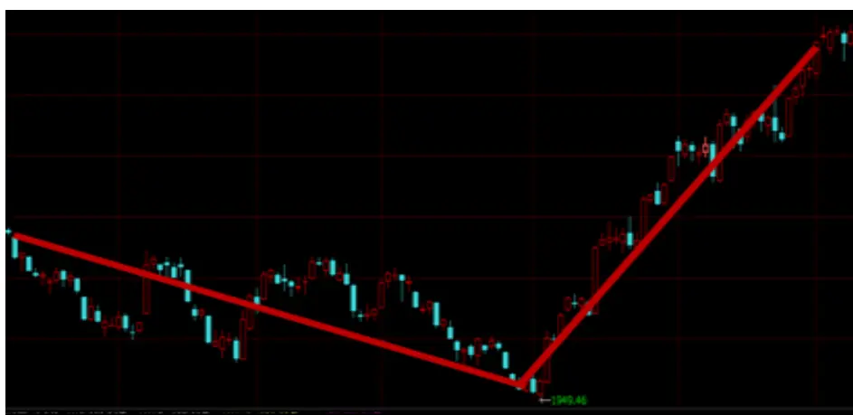
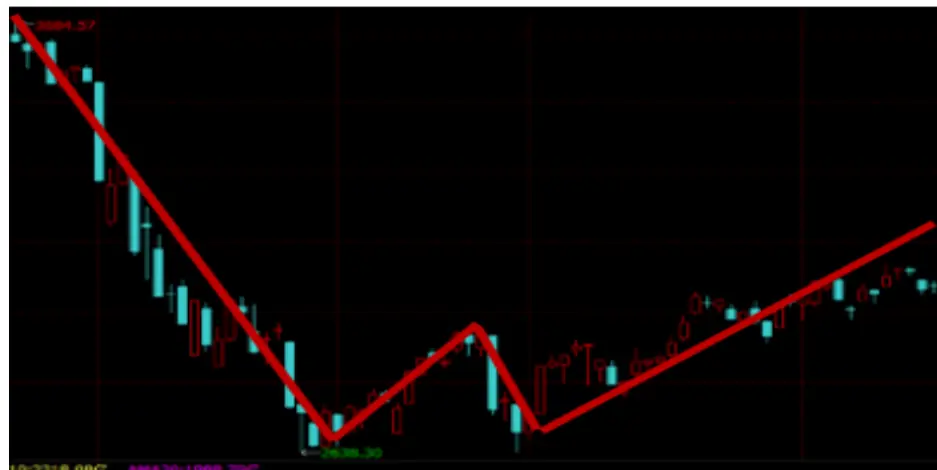
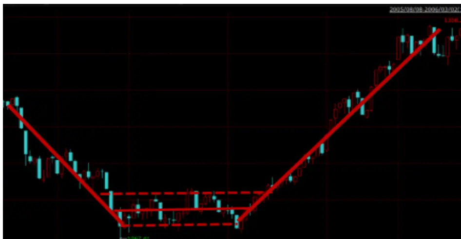
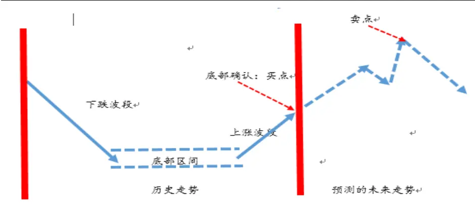
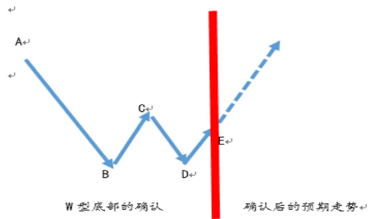
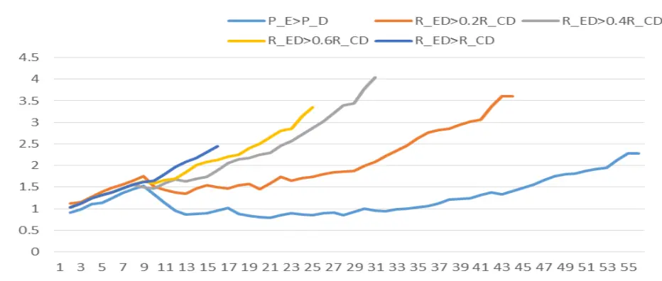

# W 型市场底部研究

# ——数量化专题之九十一

刘富兵（分析师）

8 021-38676673

liufubing008481@gtjas.com

证书编号 S0880511010017

## 本报告导读：

本报告根据市场底部的价格形态对市场底部进行分类，具体研究了如何通过 W 型底部的形态特征对 W型底部进行确认，并提出了基于 W型底部的择时投资策略。

## 摘要：

[Table_Summary]• 本篇报告对市场底部进行了定义并通过市场底部的价格形态把市场底部划分为 V型、W型和凹型。

- 本篇报告具体研究了如何通过W型底部的形态特征对W型底部进行确认，并提出了基于 W型底部的择时策略。

以上证综指为样本，基于 W型底部的择时策略在 2005年至 2016 年的历史回测中获得了 90%的胜率，20日的平均收益高达 4.83%。

W 型底部的形态特征对 W 型底部确认后的市场走势有较大影响。BC段的反弹越高，D 点相对高于 B 点，DE 段的上涨确认要求越高,确认后市场继续上涨的概率越高，上涨幅度越大。

- 在固定投资期限的约束下, W型底部确认后的 10到 20个交易日的平均上涨概率和平均绝对收益最高.

刘富兵：（分析师）

电话：021-38676673

邮箱：liufubing008481@gtjas.com

证书编号：S0880511010017

## 陈奥林：（分析师）

电话：021-38674835

邮箱：chenaolin@gtjas.com

证书编号：S0880516100001

## 李辰：（分析师）

电话：021-38677309

邮箱：lichen@gtjas.com

证书编号：S0880516050003

## 孟繁雪：（研究助理）

电话：021-38675860

邮箱：mengfanxue@gtjas.com

证书编号：S088011604008

## 殷明：（研究助理）

电话：021-38674637

邮箱：yinming@gtjas.com

证书编号：S0880116070042

## 叶尔乐：（研究助理）

电话：021-38032032

邮箱：yeerle@gtjas.com

证书编号：S0880116080361

## [Table_R相关报告

《基金收益率分解及其在 FOF 选基中的应用》2017.03.12

《综合期限多样性的趋势选股策略》2017.02.21

《次新股开板投资攻略》2017.02.10

《主题热点对市场择时的启示》2017.02.08

《基于上证综指的缺口研究》2017.02.05

## 1. 引言

回顾 A股的历史，熊长牛短是 A股市场最为重要的特征之一。作为主动型投资者，如果要在漫长的熊市和震荡市中获得较高的绝对收益，最为重要的是如何能够精确的判断市场的底部，从而抓住熊市和震荡市中为数不多的反弹（反转）机会。

然而由于市场本身的微观结构（投资者心态、不同投资者比例、市场投资规则等）不断的发生变化，同时市场的新增信息和外部环境（宏观经济环境、增量资金大小、场外投资者心态、管理层政策调控等）也存在着极大的不确定性，这些都可能使得市场底部的特征及后续走势不断的发生变化，因此很难用单一的模型或者同一套标准去预测所有不同类型的底部及其后续走势。

本系列报告将尝试从不同维度对市场底部进行细分，发现不同类型市场底部相对稳定的特征和联系，从而更准确的预测市场底部及其未来走势。

本报告是该系列报告的第一篇。我们根据市场价格形态把市场底部细分为 V 型、W型和凹型并详细探讨了如何基于 W型底部进行择时.在本报告中,我们主要尝试回答以下问题:如何确认W型底部,W型底部的历史形态特征,W 型底部形态特征对市场后续走势的影响,以及基于 W 型底部的择时策略的历史表现. 实证结果表明, W 型底部是一种极为准确的底部信号.通过 W 型底部的形态特征对 W 型底部确认后的 20 个交易日内,市场继续上涨的概率高达 90%, 平均上涨幅度为 4.83%.

在本篇报告的第 2章中, 我们首先对市场的底部进行定义,并根据市场底部的形态特征对市场底部进行分类.在第3章中,我们具体讨论如何对W型底部进行确认,并分析W型底部的历史形态特征.在第4章,我们构建了基于 W型底部的择时策略,并探讨 W型底部形态特征对择时策略效果的影响.第 5章为研究总结与展望.

## 2. .市场底部分类及投资逻辑

## 2.1. 什么是市场底部?

首先，在不同的时间段内，市场的底部大多也不尽相同, 因此对于市场底部的定义必须首先明确市场底部所在的时间区间。其次，市场底部的确认通常需要三部分的信息：1.底部之前的下跌部分 2. 底部区域 3.底部之后的上升部分。

具体而言，如果 $P_{t}$ 是时间段 $\left[\mathrm{t}-\mathrm{n}_{1}\mathrm{t}+\mathrm{n}_{2}\right]$ 的市场底部, $P_{t}$ 必须满足以下条件:

(1)min Pt,其中 $n_{\perp}>0,$ s∈[t−n₁t+n2]Pmin

$$
n_{2}>0,\;\alpha>0.
$$

$$
\mathrm{P}_{\max1}=\max_{s\in[t-n_{1},t]}\mathrm{P}_{s}\frac{p_{t}}{p_{\min}}\leq1+\alpha,\quad\mathrm{P}_{\min}=1+\alpha_{1},\quad\alpha_{1}\geq\alpha_{0}
$$

$$
\mathrm{P}_{\max2}=\max_{s\in[t\bar{t}+n_{2}]}\mathrm{P}_{s},\quad\frac{\mathrm{P}_{\max2}}{\mathrm{P}_{\min}}=1+\alpha_{2},\quad\alpha_{2}\gg\alpha_{\mathrm{c}}
$$

条件 1 用来确认市场底部区域，其中 $P_{min}$ 是市场底部区域的最低点位，$\pmb{\alpha}$ 用来描述市场底部的波动范围。

条件 2 是对市场底部之前的下跌波段的确认，其中 $Pmax_{\mathtt{i}}$ 是时间段

$[t-n_{\perp},t]$ 中下跌波段的最高点, $\pmb{\alpha}_{1}$ 用来描述下跌波段的下跌幅度。

条件 3 是对市场底部之后的上涨波段的确认，其中 $Pmax_{2}$ 是 $t+n_{2}]$ 中上涨波段的最高点， $\pmb{\alpha}_{2}$ 用来描述上涨波段的上涨幅度。

## 2.2. 市场底部的形态分类

根据市场底部区域的价格形态，市场底部形态一般可以分为以下三种类型.

1.V 型市场底部。当市场处于大幅度的下跌触及最低点后,即出现了一波幅度比较大的反弹或者反转.例如 2011 年 1 月 25 日、2012 年 1 月 6日、2012 年 12 月 4 日等.

图 1. V 型底

数据来源：Wind 国泰君安证券研究

2.W 型市场底部。我们经常会发现，当市场经历过 V型反弹后，市场又会在短期内再度下跌尝试突破前期低点未果，从而形成新的一轮反弹

（反转），在图形上形成 W型（双底），例如 2016年 2月 29日; 2016年6 月 24 日等.

图 2. W 型底

数据来源：Wind 国泰君安证券研究

3.凹型市场底部。当市场经过大规模的下跌后,经常会在一个狭窄的区间内里持续比较长的震荡走势,当突破区间后会形成一波比较大的反弹或者反转. 例如 2014 年 5 月到 7 月、2015 年 9 月、2015 年的 11 月等.

图 3. 凹型底

数据来源：Wind 国泰君安证券研究

## 2.3. 基于市场底部的投资逻辑

在实际投资中，一个好的基于市场底部的投资策略至少需要解决以下两个问题：

准确的确认市场的底部，即买点。一方面，由于数据信息相对较少，较早的预测市场底部，会降低对市场底部成功预测的准确度，但同时又可能会因为确认较早，抓住更多涨幅相对较小的反弹机会，并可能因为确认时点较早，获得更多的确认点之后上升波段的收益; 另一方面，由于数据信息相对更多，较晚的确认市场底部，会提高对市场底部成功预测的准确度，但同时又会因为确认较晚，损失部分涨幅较小的反弹，损失部分因为确认相对较晚所导致的反弹收益。从本质上讲，对市场底部的确认是寻找预测准确度，投资机会和投资收益这三者的最优均衡。

基于底部确认后走势的预判,选择最优的卖点. 底部确认后继续上涨的概率多少? 继续上涨的幅度是多大? 持续上涨的时间是多久? 这些对于底部确认后走势的判断直接决定了我们对于卖点的选择.底部确认后的走势大致受到两方面维度的影响,底部类型以及形态特征.例如,V型、凹型、W型底部在确认后走势有什么不同; W型底部中的下跌幅度、下跌时间、中继反弹高度如何影响确认后的走势等. 此外, 由于市场在不断的变化,如果实际走势和我们的预判有出入时的如何决策也是我们需要考虑的另一个问题.

图 4. 底部的确认和后续走势的预测

数据来源： 国泰君安证券研究

## 3. W 型底的确认及形态特征

W 型底部在 A 股的历史中非常常见。在熊市中，当市场经过一波大规模下跌后，市场往往会在形成W型底部之后出现一波较大的反弹或者反转;而在震荡市中，我们经常发现通过 W型底部来择时建仓，可以获得为数不多的反弹收益。作为 V 型底部的重叠，W 型底部的双底形态在技术分析上构成了比较明显的支撑点位，是一个比较强的买入信号。因此我们有必要对 W型底部的特征及其可能的投资机会进行近一步研究。

## 3.1. W 型底部的确认

由上节对底部的定义我们知道对 W 型底部的确认至少需要对双底（图 5中的 B、D点）、前底下跌波段（图 5中的 AB段）、双底之间的上升下跌波段（图 5中的 BC和 CD段）以及双底后的上升波段（图 5中的 DE段）进行确认。

图 5. W 型底部的确认及其之后走势的预测

数据来源： 国泰君安证券研究

具体的，如果 E点是 $\mathtt{[t-n_{1}}$ 的 W型底部的确认点，我们通过以下步骤对 W 型底部进行确认：

对 D 点进行确认: D 点为 $\mathtt{[t-n_{2}}$ 时间段的最低点,其中 $\mathtt{n_{2}}<\mathtt{n_{1}}$

$\mathrm{P}_{\mathrm{D}}=\min_{s\in[t-\pi_{2},t]}P_{s}$ , D 点距离当前的时间为 $\mathbf{t}-\mathbf{t}_{\mathcal{D}}$ , DE 段的涨幅为

$$
\begin{array}{r}{\mathbb{R}_{DE}=\frac{P_{E}}{P_{D}}-1.}\end{array}
$$

对 B 点的确认： B 点为时间段 $-\mathrm{n_1}t_D\mathrm{]}$ 最低点,

$\mathrm{P}_{\mathcal{B}}=\min_{s\in[t-\pi_{1},t]}P_{s},$ , B 点距离当前的时间 $\mathbf{t}-\mathbf{\nabla}t_{\mathcal{B}^{*}}$ 为了确保 W 型,

我们要求 B点和 D点的点位不能相差太大, $\begin{array}{r}{|\frac{P_{D}}{P_{B}}|-1\leq\alpha.}\end{array}$

对 C 点的确认：C 点为时间段 $[t_{\mathcal{B}}t_{\mathcal{D}}]$ 的最高点， $\mathbb{P}_{\bar{C}}=\max_{s\in[t_{B},t_{C}]}P_{s}$ , BC 段的

上涨幅度 $\mathbb{R}_{CB}=\frac{p_{C}}{p_{B}}-1$

对 A 点的确认：A 点为时间段 $[t-\mathtt{n_{1}}t_{\mathcal{B}}]$ 的最高点, $\mathrm{P}_{A}=\max_{s\in[t-\pi_{1},t_{B}]}P_{s}$ , AB

段的下跌幅度为 $\mathbb{R}_{AB}=\frac{P_A}{P_B}-1$ , A点距离当前的时间为 $\mathbf{;-t_{A}}.$由以上可知，确认不同的 W型底部主要由时间参数和形态参数决定.

时间类型的参数 $[\mathtt{n_{1}},\mathtt{n_{2}}]$ 决定了 W 型底部所在的时间区间： $\mathtt{n_{1}}$ 和 $\mathtt{n_{2}}$ 分别决定了 W型底部中的双底 D和 B发生的时间区间.

形态类型的参数决定了 W型底部各段的涨跌幅和持续时间: a.各段的涨跌 幅 度 参 数 $[\mathrm{~R}_{AB},\mathrm{~R}_{BC},\mathrm{~R}_{CD},\mathrm{~R}_{DE}]$ b. 各 段 的 时 间 长 度 参 数$\left[\mathsf{t}_{\mathcal{B}}\mathrm{-}\mathsf{t}_{\mathcal{A}}\mathrm{、}\mathsf{t}_{\mathcal{C}}\mathrm{-}\mathsf{t}_{\mathcal{B}}\mathrm{,、}t\mathrm{-}\mathsf{t}_{\mathcal{C}}\mathrm{、}\mathsf{t}\mathrm{-}\mathsf{t}_{\mathcal{D}}\right].$

## 3.2. W 型底部特征的统计分布

为了能够统计历史上大多数的 W型底部各段的特征（涨跌幅度、持续时间）,我们尽量的减少对参数的限制。 对于 W型底部的时间参数, 我们仅要求 D 点发生在过去的十个交易日之内, 即 $n_{1}=10,$ , 而同时 W 型底部的前底 B点发生在过去的 60个交易日之内， $n_{2}=60$ . 对于 W型底部的形态特征参数，我们要求 AB段的跌幅不小于 5%，BC段的涨幅不小于 2%。此外,为了确保 D点和B点相距不大,我们要求 D点和 B点的点位之差不能超过 2%, 即 $\alpha{=}2\%,$ . 由于 E点不仅是 W 型底部最后的确认点，也决定了基于 W型底部投资策略的买点，为了搜集尽可能多的 W型底部的样本，我们对于 DE 段的确认首先做了最低限制，仅要求当 E 点的点位高于 D点时即确认，具体的如何通过对 DE 段涨幅限制调整对 W 型底部确认以及后续走势的影响会在后面的部分详细讨论。

我们的样本包含上证综指 2005年 1月 1日到 2016年 12月31日的日频交易数据。 根据以上的参数，上证综指在 2005-2016 年区间共出现 54次 W 型底部。以下为 W 型底部 AB、BC、CD 各段的数据统计结果和相关性分析。

表 1: W 型底部特征的历史统计

| W型底各段数值 统计 | $\mathbf{R}_{AB}$ | $\mathbf{R}_{BC}$ | $\mathbf{R}_{CD}$ | $\mathbf{t}_{B}\mathbf{-t}_{A}$ | $\mathbf{t}_{C}\mathbf{-t}_{B}$ | $\mathbf{t}_{D}\mathbf{-t}_{C}$ |
| --- | --- | --- | --- | --- | --- | --- |
| 均值 | 17.39% | 6.58% | 6.63% | 28.7 天 | 10.59 天 | 10.89 天 |
| 标准差 | 11.37% | 3.77% | 3.36% | 10.62 天 | 8.14 天 | 5.93 天 |
| 最小值 | 6.52% | 2.02% | 2.08% | 10天 | 2 天 | 3天 |
| 最大值 | 53.51% | 21.19% | 20.29% | 50 天 | 46 天 | 25 天 |

数据来源： 国泰君安证券研究

## 表 2: W 型底部特征相关性分析

| W型底各段相关 性检验 | $\mathbf{cor}\left(\mathbf{R}_{AB},\mathbf{R}_{BC}\right)$ | $\mathbf{cor}\left(\mathbf{R}_{AB},\mathbf{R}_{CD}\right)$ | $\mathbf{cor}\left(\mathbf{R}_{BC},\mathbf{R}_{CD}\right)$ | $\mathbf{cor}\left(\mathbf{t}_{AB},\mathbf{t}_{BC}\right)$ | $\mathtt{cor}\;(\mathtt{t}_{AB},\mathtt{t}_{CD})$ | $\mathbf{cor}\left(\mathbf{t}_{BC},\mathbf{t}_{CD}\right)$ |
| --- | --- | --- | --- | --- | --- | --- |
| 相关系数 | 0.7197 | 0.7173 | 0.9504 | -0.5150 | -0.2707 | 0.0241 |
| t值 | 9.5004 | 9.7273 | 30.7852 | -3.0170 | -1.7317 | 0.1757 |

数据来源： 国泰君安证券研究

从表 1 中我们可以发现， AB 段的平均跌幅为 17.39%， BC 段的平均涨幅和 CD段的平均跌幅相近，分别为 6.58%和 6.63%。从持续时间上来看，AB 段的平均时间为 28.7 天，而 BC 段和 CD 段的持续时间也非常接近，分别为 10.59 天和 10.89 天，总体来说，BC 段和 CD 段的涨跌幅度和持续时间都接近 AB段的三分之一。从表 2 中我们发现，AB、BC、CD段的涨跌幅都显著的正相关。简单而言，AB 段的跌幅越大，BC 段的反弹高度越高，而 CD段的跌幅也越大。从各段的持续时间的相关性分析来看，AB 段和 BC 及 CD 段的持续时间是显著的负相关，即当 AB 段下跌的时间较长时，市场上通常会出现持续时间较短的反弹，而反弹后的下跌也通常会在较短时间内完成。

## 4. 基于 W 型底部的择时策略

由 2.3 可知，在基于 W型底部的投资策略中，最为核心的两个问题是如何选择最优的 E 点来确认 W 型底部（买点），以及在底部确认后，如何选择合适的投资期限（卖点）。在本部分，我们首先通过对 DE段上涨幅度进行限制，察看不同标准下对 E点的确认是否会对 W型底部的择时策略收益及胜率造成比较大的影响。其次，我们采用固定投资期限的方法，比较在不同的投资期限下，W 型底部的投资策略收益，从而找到基于 W型底部投资策略的最优固定投资期限。

表 3: 不同形态特征下 W型底部择时策略收益 $(\mathbb{P}_{E}>\mathbb{P}_{D})$

| $\mathbf{P}_{\bar{E}}>\mathbf{P}_{D}$ | 胜率 | 平均收益 | 最大收益 | 最小收益 | 样本数 |
| --- | --- | --- | --- | --- | --- |
| N=10 | 68.52% | 0.83% | 10.00% | -16.73% | 54 |
| N=20 | 72.22% | 1.76% | 12.59% | -16.28% | 54 |
| N=30 | 59.26% | 0.91% | 15.41% | -30.28% | 54 |
| N=40 | 59.26% | 0.93% | 18.85% | -24.55% | 54 |
| N=60 | 57.41% | -0.00% | 16.55% | -36.83% | 54 |

数据来源： 国泰君安证券研究

表 4: 不同形态特征下 W型底部择时策略收益 $\left(\mathbb{R}_{ED}>0.2\mathbb{R}_{CD}\right)$

| $\mathrm{R}_{ED}>0.2\mathrm{R}_{CD}$ | 胜率 | 平均收益 | 最大收益 | 最小收益 | 样本数 |
| --- | --- | --- | --- | --- | --- |
| N=10 | 88.10% | 3.18% | 10.00% | -4.50% | 42 |
| N=20 | 80.95% | 3.23% | 12.59% | -13.15% | 42 |
| N=30 | 66.67% | 2.97% | 15.06% | -13.70% | 42 |
| N=40 | 61.90% | 2.11% | 18.85% | -13.20% | 42 |
| N=60 | 66.67% | 1.80% | 16.55% | -23.17% | 42 |

数据来源： 国泰君安证券研究

表 5: 不同形态特征下 W型底部择时策略收益 $\left(\mathbb{R}_{ED}>0.4\mathbb{R}_{CD}\right)$

| $\mathrm{R_{ED}>0.4R_{CD}}$ | 胜率 | 平均收益 | 最大收益 | 最小收益 | 样本数 |
| --- | --- | --- | --- | --- | --- |
| N=10 | 96.67% | 4.46% | 10.00% | -1.48% | 30 |
| N=20 | 90.00% | 4.83% | 10.06% | -3.85% | 30 |
| N=30 | 70.00% | 4.03% | 15.06% | -12.57% | 30 |
| N=40 | 60.00% | 2.49% | 18.85% | -11.56% | 30 |
| N=60 | 70.00% | 2.52% | 16.55% | -23.17% | 30 |

数据来源： 国泰君安证券研究

表 6: 不同形态特征下 W型底部择时策略收益 $\left(\mathbb{R}_{ED}>0.6\mathbb{R}_{CD}\right)$

| $\mathrm{R_{ED}>0.6R_{CD}}$ | 胜率 | 平均收益 | 最大收益 | 最小收益 | 样本数 |
| --- | --- | --- | --- | --- | --- |
| N=10 | 95.83% | 4.91% | 10.00% | -1.48% | 24 |
| N=20 | 95.83% | 5.21% | 10.06% | -2.71% | 24 |
| N=30 | 62.50% | 4.06% | 10.06% | -12.57% | 24 |
| N=40 | 50.00% | 2.20% | 18.85% | -11.56% | 24 |
| N=60 | 62.50% | 1.90% | 16.55% | -23.17% | 24 |

数据来源： 国泰君安证券研究

表 7: 不同形态特征下 W型底部择时策略收益 $\left(\mathbb{R}_{ED}>\mathbb{R}_{CD}\right)$

| $\mathbb{R}_{ED}>\mathbb{R}_{CD}$ | 胜率 | 平均收益 | 最大收益 | 最小收益 | 样本数 |
| --- | --- | --- | --- | --- | --- |
| N=10 | 100.00% | 5.76% | 10.00% | 0.87% | 15 |
| N=20 | 100.00% | 6.17% | 10.06% | 1.89% | 15 |
| N=30 | 53.33% | 3.62% | 15.06% | -12.57% | 15 |
| N=40 | 46.67% | 1.89% | 18.85% | -11.56% | 15 |
| N=60 | 46.67% | -1.11% | 16.55% | -23.17% | 15 |

数据来源： 国泰君安证券研究

表3-表7 比较了W型底部投资策略在不同的DE段涨幅限制下以及不同投资期限下的历史收益。

首先，我们发现当 DE 段的涨幅越高时，W 型底部确认后继续向上的概率越高，平均的收益率也越高。我们以 20 个交易日的固定投资期限为例，当我们对 W型底部的确认仅要求 E点的点位高于 D点时，历史上一共出现 54 次 W型底部确认，在 E点确认后买入持有 20日后卖出的平均收益为 0.93%，胜率为 72.22%。 而当 W型底部的确认建立在 DE段的上涨必须超过 CD段跌幅的 20%时，W型底部确认的数量减少到 42次，而 20日的胜率和平均收益率分别提高到了 80.95%和 3.23%。当我们进一步把 DE段的涨幅要求提高到 CD 段的 40%、60%、100%时，确认后 W 型底部的样本数量分别减少到 30、24 和 15， 而确认后持有 20 日的平均收益分别上升到 4.83%、5.21%和 6.17%，胜率则分别提高到 90%、95.83%和 100%。由上可知，提高对 DE 段上涨幅度的要求，可以过滤部分反弹幅度较小以及反弹后迅速下跌的的 W型底部，从而大大的提高 W型底部确认后继续市场继续上涨的胜率和平均收益率。但同时，也丢失了部分反弹较小的 W 型底部确认后的收益。图 6展示了对 DE段不同涨幅限制下，W型底部确认后 20 日收益的历史累积净值。如果以最终净值为标准，当 W 型底部仅在 DE 段的涨幅超过 CD 段跌幅的 40%才确认的情况为最佳标准，在此标准下，历史上共发生了 30 次，累积净值为 4.06 (在后续的图表中,除非特殊说明,我们都以 $\mathrm{R_{ED}}>0.4\mathrm{R_{CD}}$ 作为对 W 型底部确认的标准).

图 6: W 型底部择时策略历史收益净值

数据来源： 国泰君安证券研究

其次我们发现在绝大多数情况下，W 型底部确认后的 10 到 20 个交易日左右的胜率和平均收益率最高。以表 4为例，W型底部确认后的 10个交易日的胜率为 88.10%, 平均收益率为 3.18%， 20 个交易日的胜率为80.95%，平均收益率为 3.23%。但当投资期限延长至 30个交易日时，胜率递减至 66.67%左右，而平均收益率也减少接近 10%至 2.97%；当投资期限进一步拉长至 40 个交易日时，胜率减少至 61.90%，而平均收益率也减少了超过 30%至 2.11%。在其他情况下，我们也发现了类似的结果。比较 3.2中 W型底部的各段的持续时间可知，DE段确认后持续上涨的时间大体上处于 AB段及 BC段的持续长度之间。

在此基础上，我们检验 W型底部其他形态特征对 W型底部择时策略的胜率及收益率的影响。我们主要发现以下结论：

AB 段的跌幅越高，W 型底部确认后的胜率及持续上涨的幅度并不一定越大。 表 8-表 10 展示了当 AB 段的跌幅分别高于 10%、15%和 20%的情况下，W 型底部确认后 20 日的上涨概率和平均收益。我们发现，当 AB 段的跌幅分别超过 10%、15%和 20%时，确认后 20日的胜率从原来的 90.00%变成 87.50%、85.71%和 66.67%，平均收益率从原来的 4.83%变成到5.28%、5.17%和 3.78%。这可能因为当前期市场处于大幅度的下跌后，市场处于恐慌，在后续的反弹过程中，持仓者更倾向于减仓降低风险，而场外资金也出于风险的考虑，倾向于选择观望。因此，市场后续有更大的继续下行的风险。

表 8: 不同形态特征下 W型底部择时策略收益 $\left(\mathbb{R}_{AB}\geq10\%\right)$

| $\mathrm{R_{AB}}\geq10\%$ | 胜率 | 平均收益 | 最大收益 | 最小收益 | 样本数 |
| --- | --- | --- | --- | --- | --- |
| N=10 | 95.83% | 4.71% | 10.00% | -1.48% | 24 |
| N=20 | 87.50% | 5.28% | 10.06% | -3.85% | 24 |
| N=30 | 66.67% | 4.36% | 15.06% | -12.57% | 24 |
| N=40 | 62.50% | 2.98% | 18.85% | -11.56% | 24 |
| N=60 | 62.50% | 1.07% | 16.55% | -23.17% | 24 |

数据来源： 国泰君安证券研究

表 9: 不同形态特征下 W型底部择时策略收益 $\left(\mathbb{R}_{AB}\geq15\%\right)$

| $\mathrm{R_{AB}}\geq15\%$ | 胜率 | 平均收益 | 最大收益 | 最小收益 | 样本数 |
| --- | --- | --- | --- | --- | --- |
| N=10 | 100.00% | 5.79% | 10.00% | 1.55% | 14 |
| N=20 | 85.71% | 5.17% | 10.04% | -3.85% | 14 |
| N=30 | 78.57% | 5.58% | 12.77% | -12.57% | 14 |
| N=40 | 71.43% | 4.31% | 12.76% | -11.56% | 14 |
| N=60 | 71.43% | 1.68% | 11.73% | -23.17% | 14 |

数据来源： 国泰君安证券研究

表 10: 不同形态特征下 W 型底部择时策略收益 $\left(\mathbb{R}_{AB}\geq20\%\right)$

| $R_{AB}\geq20\%$ | 胜率 | 平均收益 | 最大收益 | 最小收益 | 样本数 |
| --- | --- | --- | --- | --- | --- |
| N=10 | 100.00% | 5.57% | 10.00% | 1.55% | 6 |
| N=20 | 66.67% | 3.78% | 10.04% | -3.85% | 6 |
| N=30 | 66.67% | 1.18% | 12.49% | -12.57% | 6 |
| N=40 | 66.67% | 1.75% | 10.29% | -11.56% | 6 |
| N=60 | 66.67% | -4.19% | 5.73% | -23.17% | 6 |

数据来源： 国泰君安证券研究

BC 段的反弹高度越高，W型底部确认后的胜率越高，持续上涨的幅度越大。表 11-表 13 展示了当 BC 段的涨幅高于 5%，在不同的 AB 段的涨幅要求下, W型底部确认后的上涨概率和平均收益。对比表 5、表 8、表 9的结果，我们发现当BC段的涨幅要求从原来的2%以上上升到5%以上时，确认后 20 日的胜率从 85.71%-90%上升到 100%，平均收益从 4.83%-5.17%上升到 6.27%-6.67%；从表 14中可知,当 BC段的涨幅要求上升到 10%以上时，确认后 20 日的胜率上升到 100%，平均收益上升到 8.43%。从交易层面来讲，当 BC段的涨幅越高时,表明市场中多头的力量相对更强，因此在后续W型底部确认后市场继续上涨的概率和上涨幅度都会相应的提高。

表 11: 不同形态特征下 W 型底部择时策略收益 $\left(\mathbb{R}_{AB}\geq5\%\mathbb{R}_{CB}\geq5\%\right)$

|  | 胜率 | 平均收益 | 最大收益 | 最小收益 | 样本数 |
| --- | --- | --- | --- | --- | --- |
| N=10 | 100.00% | 5.52% | 10.00% | 2.52% | 11 |
| N=20 | 100.00% | 6.27% | 10.04% | 4.83% | 11 |
| N=30 | 63.64% | 2.74% | 12.49% | -12.57% | 11 |
| N=40 | 63.64% | 0.37% | 11.24% | -11.56% | 11 |
| N=60 | 63.64% | -3.61% | 15.23% | -23.17% | 11 |

数据来源： 国泰君安证券研究

表 12: 不同形态特征下 W 型底部择时策略收益 $\left(\mathbb{R}_{AB}\geq10\%\mathbb{R}_{CB}\geq5\%\right)$

|  | 胜率 | 平均收益 | 最大收益 | 最小收益 | 样本数 |
| --- | --- | --- | --- | --- | --- |
| N=10 | 100.00% | 5.80% | 10.00% | 3.30% | 10 |
| N=20 | 100.00% | 6.38% | 10.04% | 4.83% | 10 |
| N=30 | 60.00% | 2.84% | 12.49% | -12.57% | 10 |
| N=40 | 60.00% | 0.33% | 11.24% | -11.56% | 10 |
| N=60 | 60.00% | -4.29% | 9.32% | -23.17% | 10 |

数据来源： 国泰君安证券研究

表 13: 不同形态特征下 W 型底部择时策略收益 $\left(\mathbb{R}_{AB}\geq15\%\mathbb{R}_{CB}\geq5\%\right)$

|  | 胜率 | 平均收益 | 最大收益 | 最小收益 | 样本数 |
| --- | --- | --- | --- | --- | --- |
| N=10 | 100.00% | 6.97% | 10.00% | 4.80% | 6 |
| N=20 | 100.00% | 6.67% | 10.04% | 4.83% | 6 |
| N=30 | 66.67% | 4.53% | 12.49% | -12.57% | 6 |
| N=40 | 66.67% | 3.33% | 11.24% | -11.56% | 6 |
| N=60 | 66.67% | -3.26% | 9.32% | -23.17% | 6 |

数据来源： 国泰君安证券研究

表 14: 不同形态特征下 W 型底部择时策略收益 $\left(\mathbb{R}_{AB}\geq10\%\mathbb{R}_{CB}\geq10\%\right)$

|  | 胜率 | 平均收益 | 最大收益 | 最小收益 | 样本数 |
| --- | --- | --- | --- | --- | --- |
| N=10 | 100.00% | 5.59% | 6.38% | 4.80% | 2 |
| N=20 | 100.00% | 8.43% | 10.04% | 6.83% | 2 |
| N=30 | 100.00% | 12.34% | 12.49% | 12.20% | 2 |
| N=40 | 100.00% | 9.18% | 10.29% | 8.07% | 2 |
| N=60 | 100.00% | 4.00% | 4.73% | 3.27% | 2 |

数据来源： 国泰君安证券研究

上涨的幅度越大。表 15-表 16展示了 W型底部中双底点位差对 W型底部确认后继续上涨的概率及上涨幅度的影响。当 D点的点位高于 B点时，确认后 20日的市场继续上涨的概率达到了 100%，且平均收益为 5.87%。当D点的点位低于B点时，确认后20日的市场继续上涨的概率为82.35%，平均收益下降了 25.71%至 4.2%。从技术分析上来看，W型底部的升高预示着市场短期均衡的底部处于上升趋势，因此确认后上涨的概率和幅度也会相应的变大。

表 15: 不同形态特征下 W 型底部择时策略收益 ( )

| 胜率 | 平均收益 |  | 最大收益 | 最小收益 | 样本数 |
| --- | --- | --- | --- | --- | --- |
| N=10 | 100.00% | 4.87% | 10.00% | 0.87% | 13 |
| N=20 | 100.00% | 5.64% | 10.04% | 1.57% | 13 |
| N=30 | 69.23% | 3.47% | 12.49% | -12.57% | 13 |
| N=40 | 69.23% | 1.99% | 12.80% | -11.56% | 13 |
| N=60 | 69.23% | -0.61% | 16.55% | -23.17% | 13 |

数据来源： 国泰君安证券研究

表 16: 不同形态特征下 W 型底部择时策略收益 ( )

|  | 胜率 | 平均收益 | 最大收益 | 最小收益 | 样本数 |
| --- | --- | --- | --- | --- | --- |
| N=10 | 94.12% | 4.15% | 9.11% | -1.48% | 17 |
| N=20 | 82.35% | 4.20% | 10.06% | -3.85% | 17 |
| N=30 | 70.59% | 4.46% | 15.06% | -6.65% | 17 |
| N=40 | 52.94% | 2.87% | 18.85% | -9.58% | 17 |
| N=60 | 70.59% | 4.91% | 15.80% | -9.60% | 17 |

数据来源： 国泰君安证券研究

最后我们以表 5中的参数为样本，察看 W 型底部在各年的分布和收益情况。从表 17 中我们可以发现，当市场处于极端的行情中，一般很难出现 W 型底部。在出现大牛行情的 2006、2007、2009、2014 后半年、2015年前半年以及出现大熊行情的2008和2015年后半年的的5年半时间内，一共出现了 2 次，而在剩下的弱势震荡或者慢熊的 6 年半时间里，W 型底部一共出现了 28 次。此外,除去大牛市,在所有其他的年份，基于 W型底部的投资策略的全年累计收益均大幅度跑赢大盘指数.

表 17: W 型底部择时策略历年分布及收益

| 年份 | 2005 | 2006 | 2007 | 2008 | 2009 | 2010 |
| --- | --- | --- | --- | --- | --- | --- |
| 次数 | 3 | 0 | 2 | 0 | 0 | 4 |
| 20日平均收益 | 7.43% | 0 | 5.68% | 0 | 0 | 1.61% |
| 全年累计收益 | 23.80% | 0 | 11.67% | 0 | 0 | 6.17% |
| 上证综指收益 | -6.58% | 26.55% | 93.74% | -65.47% | 74.25% | -13.43% |
| 超额收益 | 30.38% | -26.55% | -82.07% | 65.47% | -74.25% | 19.50% |
| 年份 | 2011 | 2012 | 2013 | 2014 | 2015 | 2016 |
| 次数 | 5 | 6 | 4 | 4 | 0 | 2 |
| 20日平均收益 | 3.44% | 4.90% | 5.68% | 4.65% | 0 | 8.43% |
| 全年累计收益 | 18.05% | 32.91% | 24.69% | 18.01% | 0 | 17.55% |
| 上证综指收益 | -22.90% | 4.60% | -7.07% | 53.35% | 5.63% | -5.84% |
| 超额收益 | 40.95% | 28.31% | 31.76% | -25.34% | -5.63% | 23.39% |

数据来源： 国泰君安证券研究

## 5. 总结和展望

本篇报告通过市场底部的价格形态把市场底部细分为 V 型、W 型和凹形底部,具体研究了如何对 W 型底部进行确认,W 型底部的历史形态特征,W型底部形态特征对市场未来走势的影响,如何通过 W 型底部构建择时策略以及该策略的历史表现.

我们发现W型底部是一种极为准确的底部信号.实证结果表明,通过W型底部的形态特征对W型底部确认后的10到20个交易日为最优的固定投资期限。W型底部确认后的20个交易日内市场继续上涨的概率高达90%,平均上涨幅度为4.83%. 进一步的,我们具体分析了W型底部的形态特征对基于 W 型底部择时策略的影响.我们发现 W 型底部中,BC 段的反弹越大,D 点相对 B 点的点位越高,DE 段的上涨确认要求越高，W 型底部确认后的胜率和平均收益越高.而AB段的跌幅并不能显著提高W型底部确认后的市场继续上涨的概率。

本报告中我们仅采用了固定期限的方法尝试发现W型底部确认后的最优投资期限，在后续的研究中我们可以进一步的研究在不同的市场特征下，如何在 W型底部确认后选择最优的非固定的投资期限，进一步提高基于 W型底部的择时策略受益。

此外，如何基于 V型和凹形市场底部进行择时投资将是我们进一步研究的方向。

## 本公司具有中国证监会核准的证券投资咨询业务资格

## 分析师声明

作者具有中国证券业协会授予的证券投资咨询执业资格或相当的专业胜任能力，保证报告所采用的数据均来自合规渠道，分析逻辑基于作者的职业理解，本报告清晰准确地反映了作者的研究观点，力求独立、客观和公正，结论不受任何第三方的授意或影响，特此声明。

## 免责声明

本报告仅供国泰君安证券股份有限公司（以下简称“本公司”）的客户使用。本公司不会因接收人收到本报告而视其为本公司的当然客户。本报告仅在相关法律许可的情况下发放，并仅为提供信息而发放，概不构成任何广告。

本报告的信息来源于已公开的资料，本公司对该等信息的准确性、完整性或可靠性不作任何保证。本报告所载的资料、意见及推测仅反映本公司于发布本报告当日的判断，本报告所指的证券或投资标的的价格、价值及投资收入可升可跌。过往表现不应作为日后的表现依据。在不同时期，本公司可发出与本报告所载资料、意见及推测不一致的报告。本公司不保证本报告所含信息保持在最新状态。同时，本公司对本报告所含信息可在不发出通知的情形下做出修改，投资者应当自行关注相应的更新或修改。

本报告中所指的投资及服务可能不适合个别客户，不构成客户私人咨询建议。在任何情况下，本报告中的信息或所表述的意见均不构成对任何人的投资建议。在任何情况下，本公司、本公司员工或者关联机构不承诺投资者一定获利，不与投资者分享投资收益，也不对任何人因使用本报告中的任何内容所引致的任何损失负任何责任。投资者务必注意，其据此做出的任何投资决策与本公司、本公司员工或者关联机构无关。

本公司利用信息隔离墙控制内部一个或多个领域、部门或关联机构之间的信息流动。因此，投资者应注意，在法律许可的情况下，本公司及其所属关联机构可能会持有报告中提到的公司所发行的证券或期权并进行证券或期权交易，也可能为这些公司提供或者争取提供投资银行、财务顾问或者金融产品等相关服务。在法律许可的情况下，本公司的员工可能担任本报告所提到的公司的董事。

市场有风险，投资需谨慎。投资者不应将本报告作为作出投资决策的唯一参考因素，亦不应认为本报告可以取代自己的判断。
在决定投资前，如有需要，投资者务必向专业人士咨询并谨慎决策。

本报告版权仅为本公司所有，未经书面许可，任何机构和个人不得以任何形式翻版、复制、发表或引用。如征得本公司同意进行引用、刊发的，需在允许的范围内使用，并注明出处为“国泰君安证券研究”，且不得对本报告进行任何有悖原意的引用、删节和修改。

若本公司以外的其他机构（以下简称“该机构”）发送本报告，则由该机构独自为此发送行为负责。通过此途径获得本报告的投资者应自行联系该机构以要求获悉更详细信息或进而交易本报告中提及的证券。本报告不构成本公司向该机构之客户提供的投资建议，本公司、本公司员工或者关联机构亦不为该机构之客户因使用本报告或报告所载内容引起的任何损失承担任何责任。

## 评级说明

## 1.投资建议的比较标准

投资评级分为股票评级和行业评级。

以报告发布后的12个月内的市场表现为比较标准，报告发布日后的12个月内的公司股价（或行业指数）的涨跌幅相对同期的沪深300指数涨跌幅为基准。

## 2.投资建议的评级标准

报告发布日后的 12 个月内的公司股价（或行业指数）的涨跌幅相对同期的沪深300指数的涨跌幅。

|  | 评级 说明 |  |
| --- | --- | --- |
| 股票投资评级 | 增持 | 相对沪深 300指数涨幅15%以上 |
|  | 谨慎增持 | 相对沪深300指数涨幅介于5%～15%之间 |
|  | 中性 | 相对沪深 300指数涨幅介于-5%～5% |
|  | 减持 | 相对沪深300指数下跌5%以上 |
| 行业投资评级 | 增持 | 明显强于沪深 300 指数 |
|  | 中性 | 基本与沪深300指数持平 |
|  | 减持 | 明显弱于沪深 300指数 |

## 国泰君安证券研究所

|  | 上海 | 深圳 | 北京 |
| --- | --- | --- | --- |
| 地址 | 上海市浦东新区银城中路168号上海 银行大厦29层 | 深圳市福田区益田路 6009 号新世界 商务中心34层 | 北京市西城区金融大街 28 号盈泰中 心2号楼10层 |
| 邮编 | 200120 | 518026 | 100140 |
| 电话 | （021)38676666 | (0755)23976888 | (010)59312799 |
|  | E-mail: gtjaresearch@gtjas.com |  |  |