inInfo] [Table_Title] 2017.05.16

# 基于动态模分解的价格模式挖掘

## ——数量化专题之九十二

玉刘富兵（分析师）

8 021-38676673

liufubing008481@gtjas.com

证书编号 S0880511010017

## 本报告导读：

本报告借用流体力学中的动态模分解模型，挖掘股市短中期的内在价格模式，分析其股市运行的状态，最后据此建立起量化择时模型。

## 摘要：

le_Summary]动态模分解是一种新兴的数据挖掘算法。它把市场内在动态结构的分解为特征值和特征向量，用于表征市场运动的内部规律。它既能在趋势市中捕捉市场趋势、又能在震荡市中发现超跌机会。

动态模分解源于流体力学，适用于分析动态变化的“混沌”系统。其优势包括：算法易于实现、仅有时间窗口单参数、对于数据的分布等没有潜在的假设。

动态模分解的核心是挖掘系统的内在动态结构，用低维信息（特征值和特征向量）来刻画高维非线性的运动。它结合了时间维度的谱分析和空间维度的主成分分析，可看作是加入了信号相位信息的主成分分析，也可看作是特征提取后的时间序列分析。

模型的主导特征值反映了股价运动的未来趋势。当特征值的模大于1时，特征值位于单位圆外，是趋势扩张的信号；当特征值的模小于1时，特征值位于单位圆内，是趋势衰弱的信号；当特征值的模接近于1时，特征值位于单位圆上，是趋势震荡的信号。

模型的拟合优度反映了模型与市场的契合度。拟合优度过低时表明从技术分析层面来看市场的规律性较少，模型的适用性较低，模型结果的可信度较低。通常，我们在拟合优度不处于历史低位时使用该模型。

基于主导特征值与拟合优度的事件交易在过去 11 年中有近九成胜率，共发出 25 次信号，千三手续费下累积收益 70%。最大回撤 7%。基于主导特征值与拟合优度的择时策略，千三手续费下，单边买入策略年化收益率为21.7%。继续优化卖点后，年化收益率提高至 24.1%，夏普比率1.61，收益回撤比 1.31，最大回撤18.3%，发生于2007年牛市调整期间。自2008年以来，最大回撤为 12.2%。

金融工程

## 金融工程团队：

刘富兵：（分析师）

电话：021-38676673

邮箱：liufubing008481@gtjas.com

证书编号：S0880511010017

## 陈奥林：（分析师）

电话：021-38674835

邮箱：chenaolin@gtjas.com

证书编号：S0880516100001

## 李辰：（分析师）

电话：021-38677309

邮箱：lichen@gtjas.com

证书编号：S0880516050003

## 孟繁雪：（分析师）

电话：021-38675860

邮箱：mengfanxue@gtjas.com

证书编号：S0880517040005

## 蔡旻昊：（研究助理）

电话：021-38674743

邮箱：caiminhao@gtjas.com

证书编号：S0880117030051

## 殷明：（研究助理）

电话：021-38674637

邮箱：yinming@gtjas.com

证书编号：S0880116070042

## 叶尔乐：（研究助理）

电话：021-38032032

邮箱：yeerle@gtjas.com

证书编号：S0880116080361

## [Table_R相关报告

《负基差已成常态，投机资金参与热情不高》2017.05.05

《 Timing the market-An strategy based on W-shaped Bottom》2017.04.11

《W 型市场底部研究》2017.03.14

《基金收益率分解及其在 FOF 选基中的应用》2017.03.12

《综合期限多样性的趋势选股策略》2017.02.21

## 1. 引言

传统的技术分析通常仅能反映市场的动量效应或者反转效应中的一种。鲜有基于技术分析的模型既能在趋势市中捕捉市场趋势、又能在震荡市中发现超跌机会。动态模分解是一种新兴的数据挖掘算法。它把市场内在动态结构的分解为特征值和特征向量，用于表征市场运动的内部规律，从而实现动态反映市场的动量或反转效应。

动态模分解源于流体力学，用于分析与预测复杂的流体运动。在流体力学中，某些流体（例如湍流）的运动是“混沌”的。虽然流动由确定性系统产生，但是其规律具有极端复杂性，人类至今也无法完全掌握其流动机理。为了解决现实世界中的应用难题，学者提出了基于数据挖掘的分析方法——动态模分解。动态模分解的提出极大地便利了对流体的分析与预测，它避免了传统流体理论模型对流体数据的前提假设、深奥的理论推导以及复杂的方程求解等问题，而是另辟蹊径地从数据本身中来刻画运动规律，从而预测流体未来的运动方式。由于对数据的分布没有潜在假设，该算法可应用于其他动态变化的“混沌”系统。经提出后，此模型的强大的适用性迅速成功应用于流体力学、机械工程、生物、航空航天等诸多领域。

股市也看作为一个动态变化的“混沌”系统。本报告借用流体力学中的动态模分解模型，使用指数的成分股价格数据，挖掘股市短中期的内在价格模式，分析其股市运行的状态，最后据此建立起新的量化体系。具体而言，报告首先介绍了动态模分解与其他算法的区别、主要优势与核心算法，再简要概括了使用算法对股价进行分解得到特征值与拟合优度的方法。接着，本文着重分析了算法的特征值和拟合优度对于金融市场的启示。最后，本文结合三者构建了事件交易策略和择时策略。

## 2. 动态模分解算法简介

## 2.1.动态模分解算法概述

## 2.1.1. 动态模分解的产生与其他算法的区别

动态模分解为特征提取的一种方法。特征提取并非新鲜理论，在机器学习领域中有着大量特征提取的算法。最初流体分析主流也采用了主成分分析法等常规算法，但主成分分析法其本质是寻找能量最大的特征向量，并未考虑时间维度的信息。因此，如果把流体运动的时间顺序打乱，并不会改变主成分分析的结果。其原因在于，主成分分析法的构建基于二阶统计量（协方差矩阵）的分解，此过程会丢失重要的相位信息。能量最大的特征向量是否具有可持续性不得而知，所以我们无法根据主成分分析法进行预测。

出于上述原因，动态模分解算法应运而生并迅速在学界的各领域流行开来。与主成分相同，动态模分解本质也是降维的算法，它同样把时间序列分解成相对应的特征向量和特征值。区别在于: 主成分分析法的特征值大小代表着特征向量的信息含量，而动态模分解的特征值反映了特征向量随时间变化的强弱，从而能够忽略那些随着时间推进逐渐衰弱的信号。

在加入了时间维度的信息后，动态模分解保留了时间序列 ARIMA模型的许多优良特点。动态模分解同时结合了时间维度的谱分析和空间维度的主成分分析，我们可以把它看作是加入了信号相位信息的主成分分析，也可看作是进行了特征提取以及模式挖掘的时间序列分析。

模型的核心假设在于无外部冲击，属于无公式模型。由于没有预先假设样本数据服从特定的随机过程，故模型几乎没有参数，可通过数据挖掘来寻找样本数据的潜在规律。

动态模分解的优势包括：算法易于实现、仅有时间窗口参数且对于数据的分布等没有潜在的假设。

## 2.1.2. 动态模分解的核心原理

在了解了动态模分解与主成分分析法和时间序列分析的区别之后，我们进一步介绍其核心原理。

考虑我们有m 期的数据，每一期的横截面数据有 n个特征，假设n远大于m，其数据可以用矩阵n×m的矩阵来概括。

$$
X=\left[x_{1},x_{2},x_{3}\ldots\ldots x_{m}\right]
$$

$x_{\mathrm{~i~}}$ 为n维向量，代表在 i时刻获得的数据。动态模分解的目的在于在矩阵X 中提取数据中的隐含动态信息。为此，我们从中定义以下两个矩阵：

$$
X_{1}=\left[x_{1},x_{2},x_{3},\ldots,x_{m-1}\right]
$$

$$
X_{_2}=\left[x_{_2},x_{_3},x_{_4},\ldots,x_{_m}\right]
$$

$X_{\mathrm{~2~}}$ 即为下一时刻的 $X_{\mathrm{~i~}}$ 。由于 m 小于 n，我们总能找一个矩阵 A，满足以下等式：

$$
X_{_2}=AX_{_1},\quad[x_{_2},x_{_3},x_{_4},\ldots\ldots x_{_m}]=A[x_{_1},x_{_2},x_{_3},\ldots\ldots x_{_{m-1}}]
$$

矩阵A为算法的核心要素。它代表了在过去m 期，样本数据演变规律的线性估计。即，矩阵A 概括了第i 期的样本数据x 如何演变成下一期的

$x_{\mathrm{i+1}}$

动态模分解的目标在于从矩阵 A中提取低维的动态特征（特征值和特征向量）来最优地（最小二乘法角度）刻画系统的运动过程。利用分解得到的低维特征值和特征向量可以计算模型对 m 期真实数据的估计 $\tilde{x}_{\phantom{\dag}m}$ 以及预测未来m 期以后的数据。算法的线性最优特征体现为：算法寻找最优的低维特征值和特征向量，令 $\tilde{x}_{\phantom{}_{m}}$ 与真实值 $x_{\textit{ m }}$ 尽量接近，从而使残差的平方和最小:

$$
\left\|\widetilde{x}_{_m}-x_{_m}\right\|<<1
$$

可以看出，动态模分解的首要创新在于对数据的一阶差分 $\frac{dX}{dt}$ 进行特征分解而非数据本身，使得模型能够反映时间维度的信息。

A 的低维度特征值代表了对应特征向量随时间变化的趋势，可应用于择时；而特征向量反映了系统变化的内在结构，可应用于选股。

## 2.2.动态模分解的具体实现过程

## 2.2.1. 动态模分解算法实现步骤

动态模分解算法实现十分简单，假设已有时间序列数据 $X_{\mathrm{~\scriptsize~n~}\times\mathrm{~m~}}$ ，n 表示股

票样本个数，m 表示时间序列长度。每一列 $x_{\mathrm{~i~}}$ 即为 i 时刻的股票价格数据。我们可以把动态模分解分为六步：

第一步，标准化时间序列X

根据m日股票收益率的历史数据，使得 $x_{\mathrm{~0~}}$ 初始价格均为 1，从而计算得到每日标准化后的股票价格 $X=\left[x_{1},x_{2},x_{3}\ldots\ldots x_{m}\right]$

第二步，把时间序列X 分成两个矩阵 $X_{\mathrm{~i~}}$ 和 $X_{-}$

根据上小节定义， $X_{_1}=[x_{_1},x_{_2},x_{_3},.....\ x_{_{m-1}}],\quad X_{_2}=[x_{_2},x_{_3},x_{_4},.....\ x_{_m}]$

## 第三步，对矩阵X 进行奇异值分解（reduced SVD）

$X_{\mathrm{~1~}}=\textbf{ U }\Sigma\textbf{ W }^{\mathrm{~T~}}$ ，奇异值分解（reduced SVD）是针对非方阵特征提取的一种常见方式。它把一个 n×m 的矩阵分解为了U、• 和 W三个矩阵的乘积。其中，U为n×k 阶，• 为k×k 阶，W为 k×m阶， $\mathrm{k}=\min\left(\mathrm{n},\mathrm{~m}\right)$ 。如果把初始矩阵X 理解为一个线性变换，那么U和W为正交矩阵，刻画了线性变换的主要方向，而方阵• 记录了每个线性变换的重要程度。由于篇幅问题，其具体原理不再赘述。

第四步，计算A 的特征值•

首先，计算矩阵 $\widetilde{\textbf{ S }}=\textbf{ U }^{\top}\textbf{ \em X }_{2}\textbf{ \em W }\boldsymbol{\Sigma}^{\mathrm{~-1~}}$ ，再计算矩阵 $\tilde{\bf s}$ 的特征值。根据特征值定义： $\stackrel{\sim}{\mathrm{S}}v_{j}=\lambda_{j}v_{j},j=1,2,\ldots m,\lambda_{j}$ 即为A的低维特征值。

第五步， 计算 A 的特征向量 $\cdot\phi$

A共有m个特征向量。对于第 j个特征向量 $\phi_{\quad j}\quad=\quad U\nu_{\quad j}$

第六步，计算对第 m期数据的拟合值。

$$
\widetilde{x}_{_{m}}=Ax_{_{m-1}}=\phi\Lambda\phi^{^{-1}}x_{_{m-1}}
$$

如不深究算法原理和证明，根据上述六步，求得矩阵 A 的特征值、特征向量和拟合值即可。

## 2.2.2. 动态模分解算法原理详解

如上文所提，动态模分解的首个创新点在于对数据的线性变换矩阵A进行特征分解。由于 n 远大于 m，存在不止一个 A 满足条件 $X_{_{2}}=AX_{_{1}}$

并且矩阵 A 是一个 n×n 的庞大矩阵，所以常规的特征分解无法求得特征值和特征向量。即使A确定，普通的特征分解方法也只能产生十分庞大的 n 组特征值和正交的特征向量，无法实现有效降维。幸运的是，A的特征通常情况下并不需要 n 组特征值和特征向量进行刻画（A 通常不是满秩的），除非原始数据全部是随机游走，毫无规律。。

动态模分解第二个创新点在于巧妙的把A分解为了m-1组特征值和特征向量。这点不仅实现了无参数的降维，而且显著减少了模型的计算量，具体而言，动态模分解做了如下合理的假设:

当m足够大时， $x_{\mathrm{~m~}}$ 可以由过去的信息X 所表示，即:

$$
x_{_{m}}\;=\;\sum_{_{i=1}}^{^{m\;-1}}a_{_{i}}x_{_{i}}+r_{_{i}}
$$

其矩阵形式可以表示为：

$$
X_{_{2}}=X_{_{1}}S+re_{_{1}}
$$

其中，

$$
S=\left|\begin{array}{ccccc}{{0}}&{{0}}&{{\ldots}}&{{0}}&{{a_{_1}}}\\{{}}&{{}}&{{}}&{{}}&{{}}\\{{1}}&{{0}}&{{\ldots}}&{{0}}&{{a_{_2}}}\\{{}}&{{}}&{{}}&{{}}&{{}}&{{}}\\{{0}}&{{1}}&{{\ldots}}&{{\ldots}}&{{a_{_3}}}&{{}}\\{{}}&{{}}&{{}}&{{}}&{{}}&{{}}\\{{}}&{{\cdot}}&{{\cdot}}&{{\ldots}}&{{\cdot}}&{{\cdot}}\\{{}}&{{}}&{{}}&{{\ldots}}&{{1}}&{{a_{_{m-1}}}}\end{array}\right|
$$

r为残差向量，代表了矩阵A无法完全刻画系统运动过程中的残差部分，$e_{\mathrm{~i~}}$ 为单位向量， $e_{1}=\{0,0,\ldots1\}\in\mathbb{R}^{\mathrm{~m~-1~}}$

$$
\mathbf{r}e_{_1}=\begin{vmatrix}0&0&.&0&r_{_1}\\|0&0&.&0&r_{_2}\\|&.&.&.&.&|\\|&.&.&.&.&.\\|&.&.&.&.&.\\0&0&.&0&r_{_n}\end{vmatrix}
$$

由于 $X_{_{2}}\approx AX_{_{1}}=X_{_{1}}S$ ,可证明，S的特征值一定是 A的特征值，所以A

的特征值可由S的特征值近似表示。而S 只有m-1个特征值，其特征值维度得到了明显下降。概括地说，在假设每期的数据呈现自相关性的前提下，动态模分解通过构造了m×m的矩阵S，将求解高维矩阵 A特征值转化为求解低维矩阵 S 特征值。如果每期数据和历史数据毫无关联，则以上估计不成立。

在实际数值求解过程中，矩阵 S这种形式的矩阵性质并不良好，被称之为病态矩阵，常导致无法求解。为此，动态模分解引入了它的相似矩阵$\tilde{s}$ ，并计算其特征值。由于相似矩阵特征值相同，其解即为 S的特征值，也是A的特征值。而 A 的特征向量与其相似矩阵 $1\tilde{s}$ 满足下式:

$$
\phi_{\quad j}\quad=\quad U\nu_{\quad j}
$$

关于 $\tilde{s}$ 的特征值是A的特征值以及 $.\phi_{\textit{ j }}=U_{}\nu$ 的证明详见附录证明。

## 3. 动态模分解对股票价格模式挖掘的启示

动态模分解的应用广泛。Peter Schmid 于 2008 年推出该模型之后，其迅速在流体力学、机械工程、生物、航空航天等领域的实证中获得成功。既然它适用于多个领域，且股市也具有动态、非线性、混沌等特征，该模型是否可应用于金融市场? 本节，我们尝试把动态模分解应用于A股市场。样本数据为沪深 300成分股的日收盘价作为时间序列的横截面数据，样本时间段为2005年7 月至2017年3月。

## 3.1.主导特征值的定义与金融意义

把沪深300个股复权后的价格序列代入模型后，即可获得按信息含量大小排序的特征值序列。通常把序列第一个特征值称为主导特征值，反映了时间序列的核心趋势，类似于主成分分析中的主成分。需要注意的是，所有特征值都是复数。

根据特征值和特征向量的定义，模型对于t 期的估计公式为：

$$
\widetilde{x}_{_{t+1}}=Ax_{_{t}}=A^{^{t}}x_{_{1}}=\phi\Lambda^{^{t}}\phi^{^{-1}}x_{_{1}}
$$

从上式可以看出，当特征值的模大于 1 时，特征值位于单位圆外，t 期价格 $\tilde{x}_{{}_{t+1}}$ 随着时间 t 的增加，呈现震荡上涨，是趋势扩张的信号；当特征值的模小于 1 时，特征值位于单位圆内，t 期价格 $\tilde{x}_{{}_{t+1}}$ 随着时间 t 的增加，呈现震荡下跌，是趋势衰弱的信号。当特征值的模接近于 1时，特征值位于单位圆上，t期价格 $\tilde{x}_{{}_{t+1}}$ 随着时间t的增加，呈现区间震荡，是趋势震荡的信号。其性质与时间序列分析根据特征方程的特征根是否位于单位圆内来判断平稳性有异曲同工之处。

需要特别注意的是位于单位圆外横轴上的主导特征值，由于没有虚部的存在，它的增长速率为指数级增长，将快速成为影响市场价格的主导因素。以 2015 年 4 月和 5 月单边上涨的样本数据为例，其主导特征值位于横轴之上，代表市场强势的信号。下图给出了其所有特征值在复平面上的分布，红色实心点为序列前三的特征值。

图1 2015年 4月和5 月单边上涨区间特征值分布
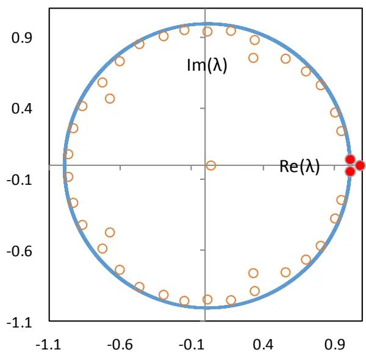
数据来源：国泰君安证券研究

以过去一个季度 60 天作为固定的时间窗口为例，下表给出了未来一周收益率对主导特征值和过去一周涨幅的回归结果。从回归结果来看，在控制了指数自身的动量效应后，主导特征值与未来周（5 日）收益率具有正相关性。但其 p 值过大，主导特征值的系数并不显著，T 统计量为0.776。结果表明，简单机械地用动态模分解的主导特征值预测未来的收益率，有一定的预测能力，但其效果并不理想。

表 1 未来一周收益率对主导特征值的回归结果

| 样本个数 | 2842 |  |  |  |
| --- | --- | --- | --- | --- |
| R^2 | 0.002 |  |  |  |
|  | 系数 | p值 | 标准误 | T统计量 |
| 主导特征值 | 0.024 | 0.438 | 0.030 | 0.776 |
| 过去一周涨幅 | 0.044 | 0.020 | 0.019 | 2.326 |
| 截距 | -0.020 | 0.503 | 0.031 | -0.670 |

数据来源：国泰君安证券研究

本报告认为上述做法结果不理想的原因主要有:

一、缺少对模型进行适用性检验。没有一个量化模型能够适用于所有市场环境，而作为数据驱动的模型，只要输入样本数据，模型都能输出特征值与特征向量。我们需要对模型的可信度进行一个判断，去除噪音信号。

二、时间窗口参数无法动态调整。金融市场的规律并非一成不变。规律也有短期规律和长期规律之分。在长达 12 年的市场中，试图从固定时间段中寻找规律并不合理。所以，自然的改进方式是对时间窗口参数进行动态调整。

因此，我们依次使用拟合优度与滚动参数两种方法对模型进行了改进，以期提高模型在金融市场的预测能力。

## 3.2.拟合优度的定义与金融意义

一个模型无法适用于所有环境，必然有其适用的条件。由于动态模分解的特点是数据驱动，所以其模型的前提假设相当的少。对于任意给定的时间序列数据，即使数据本身不存在明显的规律，模型依然都能返回其最优估计（除非完全线性无关）。所以，我们需要判断模型是否从过去历史价格数据中找到些许规律，还是仅给出了一个误差很大的估计。

为此，我们借鉴线性回归中的 $R^{\mathrm{~2~}}$ 定义了动态模分解的拟合优度:

$$
R^{^2}=\frac{\mathit{SSR}}{\mathit{SST}}=\frac{\|\stackrel{\sim}{x}_{_m}-\stackrel{\sim}{x}_{_m}\|}{\|\stackrel{\sim}{x}_{_m}-\stackrel{\sim}{x}_{_m}\|}.
$$

其中， $\tilde{x}_{\phantom{\dag}m}$ 表示模型对第 m 天价格的拟合值， $\overline{{x}}_{m}$ 为第 m 天真实价格的均

值。 $R^{\mathrm{~2~}}$ 的分子 SSR 为回归平方和，反映了被模型所解释的变异部分，

分母 SST 为总平方和，反映了真实价格本身的总变异程度。 $R^{\mathrm{~2~}}$ 越大，

代表模型拟合的效果越好，模型所得到的结论也更加可信。下图给出了60日时间窗口下的拟合优度。图中显示，日拟合优度的变化过于频繁，缺乏基本的稳定性、周期性与趋势性。一个固定的时间窗口应当是在一段时间内拟合优度较高，适用性较强，而在另一段时间内表现较差。显然，使用日拟合优度的原始值并未达到预期。

图 2 60日时间窗口的每日拟合优度
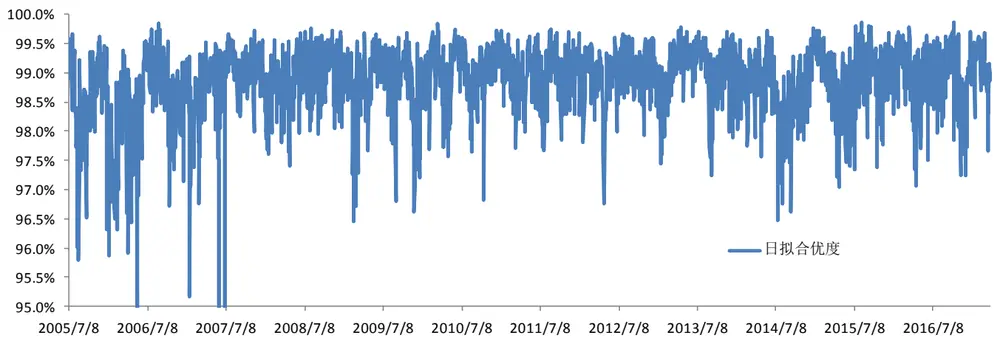
数据来源：国泰君安证券研究

事实上，拟合优度的确存在趋势性与周期性，只是被日频的数据中的噪音信号所掩盖了。下图表明，在对拟合优度作 30 日算术平均后，拟合优度体现出了良好的平滑性与周期性。拟合优度的变化表明了当前时间窗口下模型的可信度。平均拟合优度在一年内约完成一到两次完整的周期震荡，基本符合拟合优度的经济逻辑。所以，我们使用平滑后的拟合优度作为新的量化指标。

图 3 60日时间窗口的30日平滑拟合优度
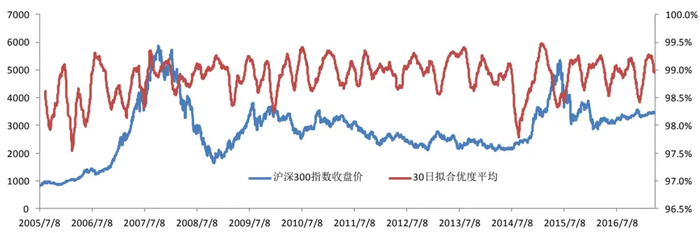
数据来源：国泰君安证券研究

定性上，当 $R^{\mathrm{~2~}}$ 过小时，模型拟合度较差，自然预测能力较弱。此时，

模型不对市场进行判断即可。落实到应用层面，需要定量地给出拟合优度过低的具体标准。在设计标准时，我们避免使用拟合优度的绝对数值，而使用相对值作为评判标准。一是为了避免过度拟合当前历史数据、二是鉴于拟合优度的阈值随时间窗口的变化而改变。时间窗口越长，拟合优度自然越高。使用拟合优度的绝对值时，不同的时间窗口需要给出不同的评判标准。以下给出两个相对标准，标准一要求相对严苛、标准二要求相对较低，我们分别检验其效果：

标准一: 平均拟合优度在其 5 日均值之上

标准二：平均拟合优度不处于半年低位（十等分中最小分组）

## 3.2.1. 拟合优度标准一筛选效果

首先检验标准一对样本数据进行筛选后的预测效果。拟合优度位于 5日均线之上，表明拟合优度处于上升趋势，由于要求严苛，样本数从2842减少到 1442，减少了几乎一半。而主导特征值系数在 1%显著性水平下显著大于0。主导特征值的预测能力显著增强。

表 2 标准一筛选后未来一周收益率对主导特征值的回归结果

| 样本个数 | 1442 |  |  |
| --- | --- | --- | --- |
| R^2 | 0.02 |  | T统计量 |
|  | 系数 | p值 标准误 |  |
| 主导特征值 过去一周涨幅 | 0.106 | 0.000 0.028 | 3.737 3.466 |
| 截距 | 0.176 -0.177 | 0.001 0.051 0.001 0.051 | -3.460 |

数据来源：国泰君安证券研究

据此，我们定义当市场满足以下两个条件时，即为短期交易的买点：1. 平均拟合优度在其 5日均值之上

## 2. 主导特征值位于单位圆外

假设在第二天买入，一周后卖出，下表统计了主导特征值不同阈值下交易的胜率、交易次数和收益率。随着阈值的增加至 1.08，策略的准确度可达 88%，但由于筛选要求较高，导致策略的信号发生次数较少，共发生了25次，平均一年 2次信号。

表 3 不同阈值下基于标准一的事件交易策略的收益情况

| 阈值 | 准确率 | 平均收益率 | 发生次数 |
| --- | --- | --- | --- |
| 1.02 | 62% | 0.90% | 217 |
| 1.03 | 67% | 1.28% | 130 |
| 1.04 | 69% | 1.62% | 80 |
| 1.05 | 75% | 1.70% | 59 |
| 1.06 | 78% | 1.68% | 37 |
| 1.07 | 83% | 2.13% | 29 |
| 1.08 | 88% | 2.47% | 25 |
| 1.09 | 94% | 2.51% | 18 |
| 1.10 | 100% | 2.95% | 13 |

数据来源：国泰君安证券研究

下图给出了当阈值为 1.08 时，使用该策略进行交易的累积净值曲线。考虑手续费双边千分之三，其累积收益70%，最大回撤 7%。回撤发生在2008年熊市时连续发出的2个信号上。分别是2008年 9月 21日（指数当日上涨9.34%）与2008年 11月 19日（上一日指数大跌 7.42%，当日大涨6.16%），均为指数出现的罕见的极端行情。极端行情的产生必然来自于市场强大的外部冲击，使得模型的前提假设失效，从而发生了错误信号。

图 4 基于标准一的事件交易策略累积净值
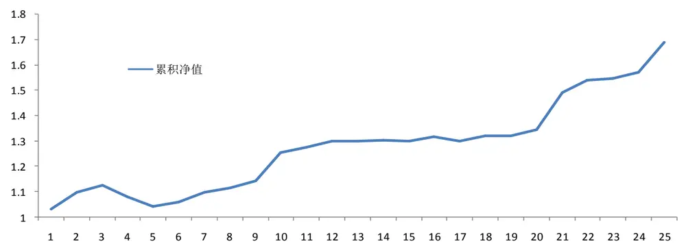
数据来源：国泰君安证券研究

使用主导特征值位于单位圆的位置对市场走势进行判断。它既可在过去60 天指数上涨的过程中，继续看涨；也可在 60 天的加速上涨过程中发出看跌信号。下图指出，模型计算得到的主导特征值与价格走势存在相关性，却也常出现背离的情况。由于模型并不根据市场价格所处位置择时，而是从市场内部每只股票的价格变化入手，寻找解释所有股票价格变化的变化规律。如果模型识别出了时间趋势上的价格变化规律，即使在快速下跌中，模型依然能够发出上涨信号。故从外部来看，主导特征值时而体现为动量效应，时而体现为反转效应。

图 5 基于标准一的事件交易策略具体买入位置
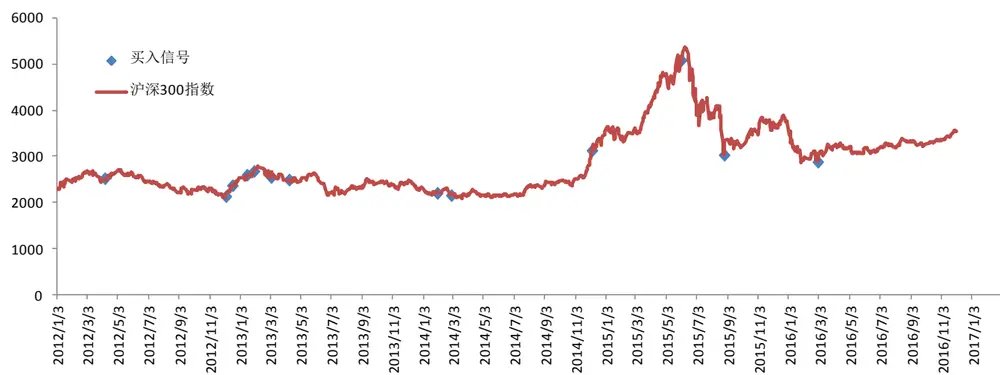
数据来源：国泰君安证券研究

## 3.2.2. 拟合优度标准二筛选效果

标准一由于筛选标准严格，从而策略胜率较高，但是信号发生的次数过少，导致其预测的整体收益率较低，适合风险偏好较低的投资者进行事件性投资。标准二仅要求平均拟合优度不处于半年（120 日）低位。因为平均拟合优度一年内约完成一到两次完整的周期震荡，半年时间最低点基本为上一次周期震荡的低位。若选择不创一年新低，则要求过于宽松，无法起到筛选有效信号的作用。接下来，我们检验使用标准二对样本数据进行筛选后的预测效果。

表 4 标准二筛选后未来一周收益率对主导特征值的回归结果

| 样本个数 | 2377 |  |  |  |
| --- | --- | --- | --- | --- |
| R^2 | 0.004 |  |  |  |
|  | 系数 | p值 | 标准误 | T统计量 |
| 主导特征值 | 0.047 | 0.150 | 0.033 | 1.440 |
| 过去一周涨幅 | 0.056 | 0.007 | 0.021 | 2.711 |
| 截距 | -0.044 | 0.182 | 0.033 | -1.336 |

数据来源：国泰君安证券研究

从回归结果来看，回归的 T 值从筛选前的 0.776 上升至 1.440，说明拟合优度的筛选是有效的。虽然标准二从回归结果来看差于标准一，但是标准二保留了大部分的样本数据，更加利于择时模型的构建，而标准一使得模型在一半时间内无法使用主导特征值对市场进行判断，只适合于事件性交易。

## 3.3.时间窗口的动态选择

动态模分解的输入为所有股票过去m期的价格数据，输出为 m 个特征值和特征向量。在使用模型计算前，我们仅需要选择合适的时间窗口 T。前文将过去一个季度约 60 天作为固定的时间窗口。其主要原因在于选择自然周期一个季度为时间窗口有一定的经济意义。由于上市公司的财报按季度为周期披露，公司 CEO、分析师和投资者的行为也易受此影响，表现出季度上的特征。然而，价格运动的规律并不一定正好体现在一个季度上。把时间窗口固定为 60 有一定的人为因素。因为选择其他更长或者更短的时间窗口可能更好地拟合股票价格的波动，仅考虑长期不变的单一时间窗口有一定的片面性。

时间窗口参数的选择应根据当前预测的准确率决定。预测准确率最高的参数自然最契合当前市场环境。我们将参数范围定在 50 至 100 之间，根据过去100个交易日各参数预测未来一周涨跌的准确率决定最优参数m。

选择参数范围在50到 100之间是因为:如果m过小，一方面，模型的线性相关假设不能够满足，其拟合效果较差，导致预测不准确；另一方面，主导特征值的稳定性也较差，见下图，过大的标准差容易产生错误的噪音信号。但这并不意味着m 越大越好，如果m过大，则模型的敏感度就会过低。

图6 不同时间维度下主导特征值的过去十年的标准差
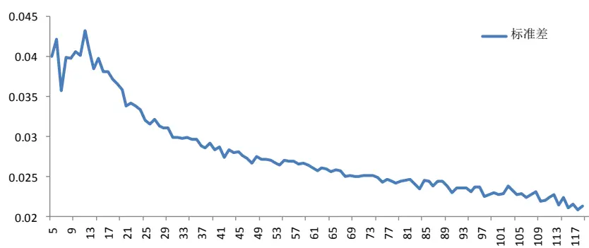
数据来源：国泰君安证券研究

按照 Fama 和 MacBeth(1973)的实证方式，在任一月份，把沪深 300 所有股票当月收益对滞后 n个月的收益进行回归得到回归系数，再把每个月份的回归系数平均，得到统计意义上滞后n月收益对当月收益的影响。下图给出了沪深 300 股票市场股票当月收益与滞后 1 个月至 50 个月的平均回归系数。从结果来看，沪深300股票的确存在着一定的周期性，但是周期性并不是稳定在一个季度，而是在2 个月至 4 个月之间，即每隔 2 至 4 个月出现一个顶峰。因而，考察 50 到 100 交易日相对容易发现规律。

图7 沪深 300成分股月收益率的平均自回归系数
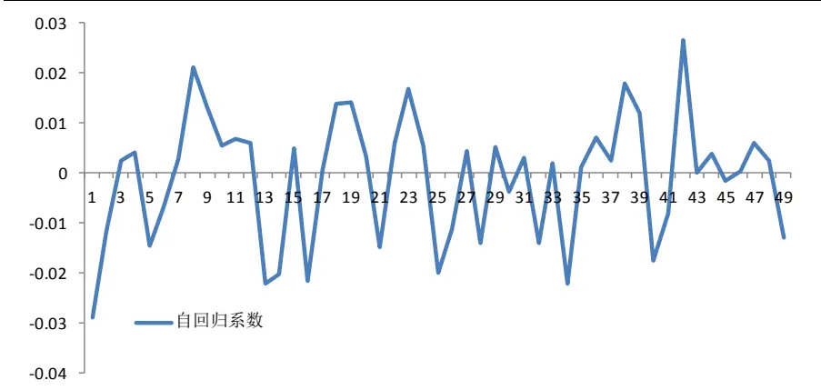
数据来源：国泰君安证券研究

下图给出了每日更新的滚动最优时间窗口，可以看出，最优时间窗口具有一定的持续性，变化频率相对较低。

图 8 滚动最优参数
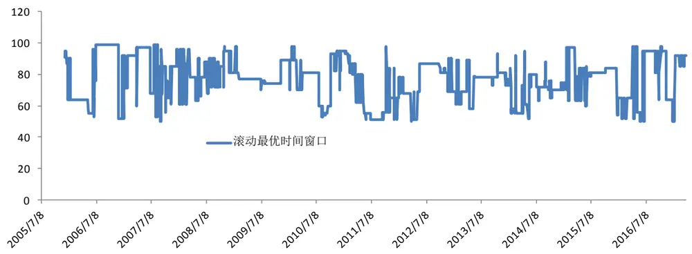
数据来源：国泰君安证券研究

下表给出了同时使用滚动最优参数和平滑拟合优度不处于低位的两种改进方式后的回归结果。结果表明，主导特征值系数在 0.1%的显著性水平显著大于0，T 统计量从 1.22上升至3.49。在结合两种改进方式后，模型的预测进一步得到增强。

表 5 滚动参数下未来一周收益率对主导特征值的回归结果

| 样本个数 | 2311 |  |  |
| --- | --- | --- | --- |
| R^2 | 0.008 | 标准误 | T统计量 |
|  | 系数 | p 值 0.000 |  |
| 主导特征值 过去一周涨幅 | 0.127 | 0.036 0.028 0.021 | 3.487 2.194 |
| 截距 | 0.046 -0.124 | 0.001 0.037 | -3.389 |

数据来源：国泰君安证券研究

同样，我们可以构建事件性交易策略，买入条件为：

1. 平均拟合优度不处于半年低位（十等分中最小分组）

2. 滚动最优参数的主导特征值位于单位圆外统计结果表明，结合滚动参数与标准二筛选后，由于样本量的增加，策略信号发生的次数大幅增加，准确率虽略有下降，但其累积收益优于基于标准一的策略。投资者可根据准确率与累积收益率之间的偏好选择相应的策略。当阈值较低时，基于标准二的策略绝对占优于标准一，更适合择时策略的构建。

表 6 不同阈值下基于滚动参数的事件交易策略的收益情况

| 阈值 | 准确率 | 平均收益率 | 发生次数 |
| --- | --- | --- | --- |
| 1.02 | 64.7% | 1.2% | 351 |
| 1.03 | 66.8% | 1.4% | 208 |
| 1.04 | 69.6% | 1.7% | 138 |
| 1.05 | 70.0% | 1.6% | 100 |
| 1.06 | 67.2% | 1.3% | 67 |
| 1.07 | 77.1% | 1.8% | 48 |
| 1.08 | 75.7% | 1.4% | 37 |
| 1.09 | 82.1% | 1.7% | 28 |
| 1.10 | 85.0% | 2.0% | 20 |

数据来源：国泰君安证券研究

表 7 标准一与标准二策略收益情况的比较

|  | 标准一筛选 |  | 滚动参数下标准二筛选 |  |
| --- | --- | --- | --- | --- |
| 阈值 | 准确率 | 累积收益(单利) | 准确率 | 累计收益（单利） |
| 1.02 | 62.0% | 195.3% | 64.7% | 421.2% |
| 1.03 | 67.0% | 166.4% | 66.8% | 291.2% |
| 1.04 | 69.0% | 129.6% | 69.6% | 234.6% |
| 1.05 | 75.0% | 100.3% | 70.0% | 160.0% |
| 1.06 | 78.0% | 62.2% | 67.2% | 87.1% |
| 1.07 | 83.0% | 61.8% | 77.1% | 86.4% |
| 1.08 | 88.0% | 61.8% | 75.7% | 51.8% |
| 1.09 | 94.0% | 45.2% | 82.1% | 47.6% |
| 1.1 | 100.0% | 38.4% | 85.0% | 40.0% |

数据来源：国泰君安证券研究

## 4. 基于动态模分解的择时策略

## 4.1.基于动态模分解的择时策略

结合滚动参数、主导特征值和拟合优度三者，我们可以构建沪深300指数择时策略。其买点构建方式与事件性交易相同，区别在于明确了交易的卖点。具体而言：首先，根据过去 100 个交易日 $t_{i-105}$ 至 $t_{i-6}$ 内各参数预测未来一周涨跌的准确率确定最优时间长度 m。其次，求得最优时间窗口m下的主导特征值和拟合优度。最后，根据主导特征值和拟合优度确定策略的买入卖出规则。

策略买点需要同时满足以下两个条件：

1. 主导特征值大于1.03

2. 平均拟合优度不处于半年低位（十等分中最小分组）

策略卖点只需满足以下任一条件：

1. 主导特征值小于0.99

2. 平均拟合优度处于半年低位（十等分中最小分组）

我们使用 2005 年 12 月至 2017 年 3 月沪深 300 成分股数据对上述策略进行历史回测，当发出买入信号时，在第二天的收盘价买入；当发出卖出信号时，在第二天的收盘价卖出，手续费设为双边千分之三，回测结果如下:

图 9 择时策略的净值曲线
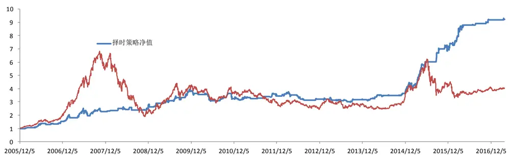
数据来源：国泰君安证券研究

自 2005 年 12 月至 2017 年 3 月，基于主导特征值的单边买入策略年化收益率为21.7%，最大回撤为 24.3%，发生在2008年的熊市期间。夏普比率1.37。分析每次交易，策略对买入的把握较为准确，买入后短期大概率有一定的收益率，但是有时仍没有及时卖出，导致 08 年出现了较大的亏损。如上文所述，动态模分解并非简单的动量策略，它与指数走势的相关性较低，从某些角度来看，这是模型的优势，但是应用于择时中，也会成为模型的劣势。例如，当模型看涨，而实际指数却大跌时，由于特征值与指数走势的相关性较低，模型的特征值可能仍然较大，从而导致较大的亏损，而其他趋势追随策略，则会在指数跌破均线时自然离场。对此，建议投资者需要自设止损位，避免出现较大的回撤。整体来看，策略在近三年表现较好。

表 8 择时策略表现统计

| 年化收益率 | 年化波动率 | 最大回撤 | 交易次数 | 夏普比率 | 收益回撤比 |
| --- | --- | --- | --- | --- | --- |
| 21.7% | 15.8% | 24.2% | 124 | 1.37 | 0.90 |

数据来源：国泰君安证券研究

## 4.2.改进卖点后的择时策略

动态模分解能精准地把握市场的买点，不仅能在震荡市的下跌中寻找超跌机会，也不会错过在趋势市的上涨行情。然而，模型的缺点是仅使用特征值信息对市场卖点的把握不够准确，从而导致回撤较大。其部分原因在于主导特征值在 1 附近时，模型预测市场处于区间震荡走势，即短期是看涨还是看跌并不明确。当使用主导特征值作为买点时，我们在不确定的情况下不发出信号即可。但是，当有持仓时，等到模型确认趋势下跌才卖出意味着在获得较高的收益率的同时不得不承受较大的回撤。

我们通过加入拟合优度辅助卖点投资决策使模型能够躲过中期的下跌行情如2008年和2015 年的熊市。但在其他情况下，仅靠主导特征值确认卖点显得过于单薄。例如，在震荡下跌时期，特征值可能维持在1左右，卖点信号的发出就会过于延迟。事实上，策略不少亏损的交易前期是有盈利的，只是因为没有及时清仓从而带来了回撤。所以，为了减少策略回撤，我们有必要进一步加强模型的卖出条件。

一种做法是提高卖出信号阈值，当主导特征值小于 1.01 时，此时模型无法判断短期走势，立即卖出。这样的做法的问题在于模型将错过牛市的大部分行情，策略整体持仓时间过短，导致收益率过低。

另一种做法是引入均线辅助卖点的判断：当指数下穿均线，则立即卖出。这样做不仅能避免震荡行情时当短期行情判断不准确时所带来的不必要的回撤，而且保证了模型不会在趋势上涨中过早离场。然而，模型不同于均线策略，其买点并非一定处于均线之上。在均线之下时，策略判断短期下跌过多，同样可能看涨。仅仅使用均线辅助卖点无法适用于买点在均线之下的情况。

出于上述考虑，我们首先根据买点发生日指数与均线的相对位置对买点进行分类。价格移动平均的周期与拟合优度平滑周期保持一致。当指数位于30日均线之上发出买入信号，此时买点为动量买点，破 30日均线，无论特征值是否小于 0.99，都于第二日收盘价卖出；指数位于 30 日均线之下发出买入信号，我们无法再使用均线辅助判断卖点。由于在下跌趋势中抢反弹属于逆势操作，持有时间过长，必然带来较大的亏损，为此，我们借鉴事件性交易策略，规定持有一周后（5 个交易日）无论特征值是否小于0.99，都及时清仓，从而锁定收益、降低回撤。

图10 辅助卖点判断方式
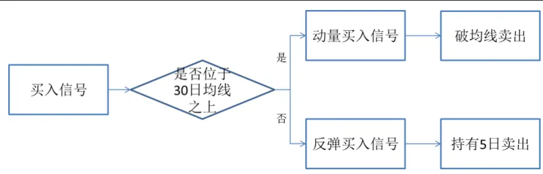
数据来源：国泰君安证券研究

在优化卖点后，同样使用 2005 年 12 月至 2017 年 3 月沪深 300 成分股数据对上述策略进行历史回测，手续费千分之三。

图 11 择时策略的净值曲线
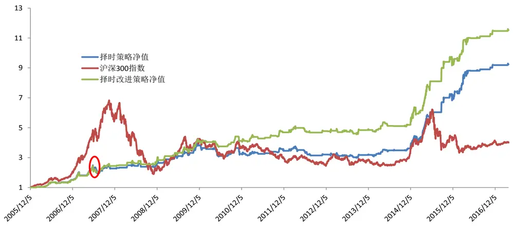
数据来源：国泰君安证券研究

改进卖点后，单边买入策略的年化收益率提高至24.1%，夏普比率1.61，收益回撤比 1.31，最大回撤 18.3%，发生于 2007 年牛市调整期间。自2008年以来，最大回撤为12.2%，发生于2010年 5月。

表 9 择时改进策略表现统计

| 年化收益率 | 年化波动率 | 最大回撤 | 交易次数 | 夏普比率 | 收益回撤比 |
| --- | --- | --- | --- | --- | --- |
| 24.1% | 14.6% | 18.3% | 124 | 1.61 | 1.31 |

数据来源：国泰君安证券研究

我们分年度统计了策略每年的开平仓次数、平均收益率、持仓时间和胜率等统计量。结果如下表，策略平均每年开仓10次，持仓时间约5天，整体胜率在68%左右。

表 10 择时策略的单次收益统计

|  | 交易次数 | 平均开仓时间 | 平均单次收益率 | 胜率 |
| --- | --- | --- | --- | --- |
| 2006/12/31 | 8 | 13 | 6.9% | 71% |
| 2007/12/31 | 11 | 9 | 4.3% | 83% |
| 2008/12/31 | 10 | 4 | 1.4% | 60% |
| 2009/12/31 | 13 | 6 | 3.0% | 85% |
| 2010/12/31 | 13 | 4 | 0.1% | 54% |
| 2011/12/31 | 14 | 4 | 0.9% | 50% |
| 2012/12/31 | 9 | 6 | 0.2% | 44% |
| 2013/12/31 | 15 | 4 | 0.1% | 53% |
| 2014/12/31 | 11 | 4 | 0.7% | 50% |
| 2015/12/31 | 8 | 12 | 6.6% | 90% |
| 2016/12/31 | 11 | 5 | 1.7% | 73% |
| 2017/12/31 | 1 | 3 | 0.5% | 100% |

数据来源：国泰君安证券研究

## 5. 总结与展望

本报告详细介绍了流体模型在金融市场择时上的应用。动态模分解本质上属于技术分析，其核心是挖掘系统的内在动态结构，用低维信息（特征值和特征向量）来刻画高维非线性的运动。

模型的特征值反映了模型预测股价运动的未来趋势。当特征值的模大于1 时，特征值位于单位圆外，是趋势扩张的信号；当特征值的模小于 1时，特征值位于单位圆内，是趋势衰弱的信号；当特征值的模接近于 1时，特征值位于单位圆上，是趋势震荡的信号。

模型的拟合优度反映了模型与市场的契合度。拟合优度过低时表明从技术分析层面来看市场的规律性较少，模型的适用性较低，模型结果的可信度较低。通常，我们需要保证拟合优度不处于历史低位。

基于主导特征值与拟合优度的事件交易在过去 11 年中有近九成胜率。基于主导特征值与拟合优度的择时策略，千三手续费下，年化收益率为21.7%。继续优化卖点后，年化收益率提高至 24.1%，夏普比率 1.61，收益回撤比1.31，最大回撤 18%，发生于2007年牛市调整期间。

动态模分解不仅可用于事件交易、择时。动态模分解能够在空间和时间维度上可以进行复杂且完整的预测（例如预测股票A 短期看涨、长期看跌同时预测股票 B 短期看跌、长期看涨），这使得模型具有很强的适用性。基于动态模分解的大势研判、选股与资产配置等都将是未来研究的方向。

## 6. 附录:定理的证明

定理： $\tilde{s}$ 的特征值为矩阵 A的特征值

证明： $\stackrel{\sim}{S}=U^{\mathrm{~T~}}X_{\mathrm{~}_{2}}V\Sigma$

设 $\tilde{s}$ 的特征值为 ，则根据特征值的定义:

$$
\stackrel{\sim}{S}v_{j}=\lambda_{j}v_{j},j=1,2,3\ldots m
$$

$$
\stackrel{\sim}{S}\;=\;P\Lambda P^{\;^{-1}}
$$

P为特征向量组成的矩阵，• 为对角矩阵，对角元素为其特征值。

又因为 $AX_{\mathrm{~\tiny~1~}}=X_{\mathrm{~\tiny~1~}}S,\quad X_{\mathrm{~\tiny~1~}}=U\Sigma V^{\mathrm{~\tiny~1~}}$

代入可得 $AU\Sigma V^{^{\scriptsize~T}}=U\Sigma V^{^{\scriptsize~T}}S$

等式两边右乘矩阵 $\big(\sum\boldsymbol{V}^{\textit{ T }}\big)^{\textit{ - 1 }}$

$$
AU\quad=\quad U\Sigma V^{^{^{T}}}S(\Sigma V^{^{^{T}}})^{^{-1}}=U\stackrel{\sim}{S}
$$

又因为 $\stackrel{\sim}{S}\;=\;P\Lambda P^{\;^{-1}}$

所以 $\boldsymbol{A}\boldsymbol{U}^{-1}=\boldsymbol{U}\stackrel{\sim}{\boldsymbol{S}}=\boldsymbol{U}\boldsymbol{P}\boldsymbol{\Lambda}\boldsymbol{P}^{-1}$

等式两边右乘矩阵P可得：

$$
A(UP)=(UP)\Lambda
$$

根据特征值定义可知，• 的对角元素 皆为 A的特征值，其相应的特征向量 $\phi_{\quad j}\quad=\quad U\nu_{\quad j}$

得证。

## 本公司具有中国证监会核准的证券投资咨询业务资格

## 分析师声明

作者具有中国证券业协会授予的证券投资咨询执业资格或相当的专业胜任能力，保证报告所采用的数据均来自合规渠道，分析逻辑基于作者的职业理解，本报告清晰准确地反映了作者的研究观点，力求独立、客观和公正，结论不受任何第三方的授意或影响，特此声明。

## 免责声明

本报告仅供国泰君安证券股份有限公司（以下简称“本公司”）的客户使用。本公司不会因接收人收到本报告而视其为本公司的当然客户。本报告仅在相关法律许可的情况下发放，并仅为提供信息而发放，概不构成任何广告。

本报告的信息来源于已公开的资料，本公司对该等信息的准确性、完整性或可靠性不作任何保证。本报告所载的资料、意见及推测仅反映本公司于发布本报告当日的判断，本报告所指的证券或投资标的的价格、价值及投资收入可升可跌。过往表现不应作为日后的表现依据。在不同时期，本公司可发出与本报告所载资料、意见及推测不一致的报告。本公司不保证本报告所含信息保持在最新状态。同时，本公司对本报告所含信息可在不发出通知的情形下做出修改，投资者应当自行关注相应的更新或修改。

本报告中所指的投资及服务可能不适合个别客户，不构成客户私人咨询建议。在任何情况下，本报告中的信息或所表述的意见均不构成对任何人的投资建议。在任何情况下，本公司、本公司员工或者关联机构不承诺投资者一定获利，不与投资者分享投资收益，也不对任何人因使用本报告中的任何内容所引致的任何损失负任何责任。投资者务必注意，其据此做出的任何投资决策与本公司、本公司员工或者关联机构无关。

本公司利用信息隔离墙控制内部一个或多个领域、部门或关联机构之间的信息流动。因此，投资者应注意，在法律许可的情况下，本公司及其所属关联机构可能会持有报告中提到的公司所发行的证券或期权并进行证券或期权交易，也可能为这些公司提供或者争取提供投资银行、财务顾问或者金融产品等相关服务。在法律许可的情况下，本公司的员工可能担任本报告所提到的公司的董事。

市场有风险，投资需谨慎。投资者不应将本报告作为作出投资决策的唯一参考因素，亦不应认为本报告可以取代自己的判断。
在决定投资前，如有需要，投资者务必向专业人士咨询并谨慎决策。

本报告版权仅为本公司所有，未经书面许可，任何机构和个人不得以任何形式翻版、复制、发表或引用。如征得本公司同意进行引用、刊发的，需在允许的范围内使用，并注明出处为“国泰君安证券研究”，且不得对本报告进行任何有悖原意的引用、删节和修改。

若本公司以外的其他机构（以下简称“该机构”）发送本报告，则由该机构独自为此发送行为负责。通过此途径获得本报告的投资者应自行联系该机构以要求获悉更详细信息或进而交易本报告中提及的证券。本报告不构成本公司向该机构之客户提供的投资建议，本公司、本公司员工或者关联机构亦不为该机构之客户因使用本报告或报告所载内容引起的任何损失承担任何责任。

## 评级说明

## 1.投资建议的比较标准

投资评级分为股票评级和行业评级。

以报告发布后的12个月内的市场表现为比较标准，报告发布日后的 12个月内的公司股价（或行业指数）的涨跌幅相对同期的沪深 300 指数涨跌幅为基准。

## 2.投资建议的评级标准

报告发布日后的 12 个月内的公司股价（或行业指数）的涨跌幅相对同期的沪深 300 指数的涨跌幅。

|  | 评级 | 说明 |
| --- | --- | --- |
| 股票投资评级 | 增持 | 相对沪深300指数涨幅15%以上 |
|  | 谨慎增持 | 相对沪深300指数涨幅介于5%～15%之间 |
|  | 中性 | 相对沪深300指数涨幅介于-5%～5% |
|  | 减持 | 相对沪深 300指数下跌 5%以上 |
| 行业投资评级 | 增持 | 明显强于沪深 300 指数 |
|  | 中性 | 基本与沪深 300指数持平 |
|  | 减持 | 明显弱于沪深300指数 |

## 国泰君安证券研究所

|  | 上海 | 深圳 | 北京 |
| --- | --- | --- | --- |
| 地址 | 上海市浦东新区银城中路168号上海 银行大厦29层 | 深圳市福田区益田路 6009 号新世界 商务中心34层 | 北京市西城区金融大街 28 号盈泰中 心2号楼10层 |
| 邮编 | 200120 | 518026 | 100140 |
| 电话 | （021)38676666 | （0755)23976888 | (010)59312799 |
|  | E-mail: gtjaresearch@gtjas.com |  |  |