inInfo] [Table_Title] 2017.07.03

# 回撤控制下的最优化大类资产配置策略

## ——数量化专题之九十四

刘富兵（分析师）

叶尔乐（研究助理）

8 021-38676673

021-38032032

liufubing008481@gtjas.com

yeerle@gtjas.com

证书编号 S0880511010017

S0880116080361

## 本报告导读：

本报告提出基于回撤控制的最优化资产组合策略，在“风险资产”和“无风险资产”间通过观察回撤大小设置浮动比例安全垫，在风险可控下获得稳健的增强收益。

## 摘要：

e_Summary]资产配置是主动投资艺术和组合理论科学的结合。组合理论科学为资产配置提供了资产的量化分析、科学的组合构建和严格的投资纪律。现代投资组合理论发源于 Markowitz的均值方差模型，其抽象出资产两大要素：预期收益和预期风险。并发展出一系列优化模型，但是这些模型不例外的都不区分“高风险资产”和“低风险固定收益资产”，导致策略高配“低风险固定收益资产”从而削减组合收益。而Merton 开创了随机控制下的资产组合模型，通过后人的不断研究，发展出区分“主动性资产”和“保留性资产”的组合保险策略，包括固定投资比例的 CPPI 策略和浮动投资比例的策略。本报告研究了其中基于回撤控制的最优化大类资产组合策略。

本报告的策略优点在于：1、策略将资产组合效用函数的长期收益率作为优化目标，相比只考虑风险的模型额外考虑了收益端，在资产有趋势性机会的情况下能进行切换，在资产风险调整后收益下降的情况下及时调低配置；2、策略区分“风险资产”和“无风险资产”，将“无风险资产”剔除出风险配置过程，防止由于长期高配“无风险资产”而失去“风险资产”的投资机会；3、采用回撤刻画风险，比波动率更关注组合价值的变动路径，为组合设置浮动安全垫，在组合回撤达到阈值时将减小“风险资产”的暴露为 0，达到控制回撤和保本目的。

本报告将控制组合总体价值回撤的思路转变为控制单独“风险资产”回撤的角度，防止由于一类资产回撤导致的所有“风险资产”暴露减为 0，从而失去潜在机会的情况。本报告还引入 CPPI 策略的风险乘数规则，在最大回撤可接受的范围内更大的增强了策略收益。除此之外，根据不同的标的选择，“无风险资产”本身也可能存在风险，本报告在“无风险资产”类别中利用回撤控制债券和货币资产的轮动，降低了“无风险资产”本身存在的风险。在2009年9 月到2017年3月的回测期，月频计算下，风险乘数 K=1，回撤控制系数 =5%的策略获得了年化 8.78%的收益，最大回撤-0.99%，夏普比率 2.31，风险乘数 K=3，回撤控制系数 =7%的策略获得了年化 13.47%的收益，最大回撤-3.68%，夏普比率 1.28。

金融工程

## 金融工程团队：

刘富兵：（分析师）

电话：021-38676673

邮箱：liufubing008481@gtjas.com

证书编号：S0880511010017

## 陈奥林：（分析师）

电话：021-38674835

邮箱：chenaolin@gtjas.com

证书编号：S0880516100001

## 李辰：（分析师）

电话：021-38677309

邮箱：lichen@gtjas.com

证书编号：S0880516050003

## 孟繁雪：（分析师）

电话：021-38675860

邮箱：mengfanxue@gtjas.com

证书编号：S0880517040005

## 蔡旻昊：（研究助理）

电话：021-38674743

邮箱：caiminhao@gtjas.com

证书编号：S0880117030051

## 殷明：（研究助理）

电话：021-38674637

邮箱：yinming@gtjas.com

证书编号：S0880116070042

## 叶尔乐：（研究助理）

电话：021-38032032

邮箱：yeerle@gtjas.com

证书编号：S0880116080361

## [Table_R相关报告

《基于短周期价量特征的多因子选股体系》2017.06.15

《基于短周期价量特征的多因子选股体系》2017.06.01

《基于动态模分解的价格模式挖掘》2017.05.15

《负基差已成常态，投机资金参与热情不高》2017.05.05

《 Timing the market-An strategy based on W-shaped Bottom》2017.04.11

## 1. 大类资产配置讨论

## 1.1.绝对收益之路

绝对收益是一种关注资产价值变动路径的提法，绝对收益要求策略在市场不论是上涨还是下跌中，都能给投资者带来长期稳定的正收益，是建立在锁定风险，控制回撤的基础上的。对于年金、保险和主权财富基金等资金，未来收益与支出的匹配是资金增值的主要目标之一，因此相对稳定可期的绝对收益是其偏爱的投资产品。

绝对收益的来源除了固定收益产品之外，还有对冲、套利、CTA、多资产、多策略等。在国内卖空机制不畅通，衍生品流动性不足品种单一的情况下，大类资产配置通过扩大收益来源成为绝对收益的大头。大类资产配置对于绝对收益的创造主要来自于以下几个方面：

1、切换和分散作用，可以在单一资产估值过高，难有增值空间时通过资产再平衡选择未来有更大更稳定增值潜力的资产，在止盈的基础上减少空仓导致的机会成本；

2、利用组合理论对冲，现代资产组合理论通过量化的方法研究资产组合的收益风险特征，通过资产权重的优化，可以降低资产组合的整体风险，平抑资产组合收益的波动；

3、更多的资产选择空间扩大了策略的资金容量，便于大规模资产的投资运作管理。从广义的角度来说，不同的投资策略也可以作为资产纳入资产配置策略中。

但是更多的资产选择空间也为投资提出了新的挑战：战略资产配置如何选择资产？战术资产配置如何把握时机？一个有效的资产配置过程需要投资者对所投资的各类资产都有较为深入的研究。目前并没有一种模型或者理论可以分析所有资产的特征和变化规律，资产配置需要多种研究的支持。

## 1.2. 艺术还是科学？

提到资产配置，不得不提到耶鲁大学捐赠基金（以下简称“耶鲁基金”）。作为资产配置数十年的实践者，耶鲁基金为其基金资产提供了持续稳定的长期高收益，其管理的基金从 1985 年的 20 亿美元增长到了 2016 年的254亿美元，过去10 年平均年化收益率8.1%，且在这 10 年中的8年都在美国大学捐赠基金中排名第一。

耶鲁基金采用的投资框架是主动市场判断+均值方差理论。在 1985 年David Swensen 接管之后摒弃了原有的股票、债券固定投资比例策略，转而采用 Markowitz 的均值方差框架，引入更多低相关性资产来分散风险，1986年，基金有超过 80%的资产配置于美国国内的股票和债券，2016年配置比例下降到11.5%，大部分资产转移到非传统资产比如PE、VC、房地产等。非传统资产有着潜在的高收益和与传统资产低相关性的特征，相比于交易所可交易的资产，其定价有效性弱，通过主动投资可以获得稳健的投资回报。

图 1 耶鲁大学捐赠基金资产配置
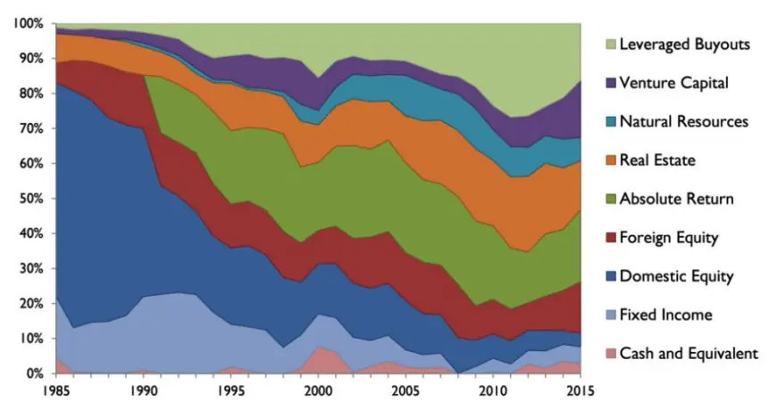
数据来源：国泰君安证券研究，耶鲁大学捐赠基金

对于流动性差的非可交易资产预期收益率和波动率的估计，需要对资产有深入的研究和洞见，即便对于可交易资产，除了用历史数据估测未来之外，对于市场结构性改变的预判，小概率事件的预判也非常重要，所以常常有人说资产配置是一种艺术。但是光靠主动的判断仍然是不够的，要想在风险控制下稳定的获得资产的收益就需要靠均值方差一类的量化组合模型，它不仅是风险分散的必要，也为整个配置过程提供了严格的纪律性。因此，资产配置只有在“主动投资艺术”与“组合理论科学”的结合下才能发挥效果。

图 2 资产配置框架
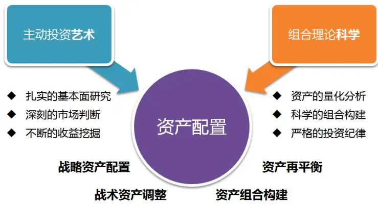
数据来源：国泰君安证券研究

从数量化研究的视角出发，本报告将首先讨论“组合理论科学”。通过比较传统资产组合模型，分析其优缺点，并从改进其缺点的角度，提出一种基于回撤控制的随机控制优化资产组合模型。

## 1.3.配置标的筛选

大类资产配置本身由于其较高的研究要求和渠道要求，一般大规模的机构资金比较适合，对于缺少投资研究支持和相关渠道的中小投资者而言过去较难做到。但是由于公募 FOF的开展，未来中小投资者也可越来越便捷的分享到大类资产配置的收益。公募FOF相比于普通公募基金的一大优势就在于FOF能覆盖的大类资产更加广泛，在资产间切换的灵活度更高，相比于直接投资标的资产，通过基金进行投资享有更好的流动性，因此作为 FOF 系列报告之一的本报告也将主要从公募 FOF 的角度选择配置标的进行研究。

图 3 FOF 策略框架
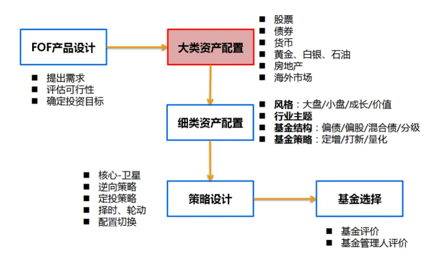
数据来源：国泰君安证券研究

从目前已有的公募产品来看，股票型、混合型、债券型基金覆盖：国内股票和国内债券两种资产，QDII 型基金主要覆盖：香港股票、美国股票、美国债券、黄金、原油、德国股票、全球股票、全球债券、全球资源等等资产，另类投资型基金覆盖：A股对冲产品、黄金、白银，货币型基金覆盖：货币。虽然可投资的标的资产看似很多，但是在实际投资过程中有较多标的难以操作，我们主要考虑以下几个因素来筛选目前可投资标的：

流动性：最新规模是否大于 1亿；

可操作性：是否开放申购赎回，是否二级市场可交易；

跟踪准确性：跟踪误差小，与其对应的标的不存在长期显著偏离；

筛选得到的大类资产有：国内股票、国内债券、香港股票、美国股票、黄金、原油、货币等。其中国内债券和货币同属于低风险、固定收益属性资产，由于债券的收益明显高于货币，因此在回测中暂时不考虑货币资产，综合考虑我们选择以下资产及代表资产的指数进行资产组合策略回测：

表 1 回测资产标的及指数

| A股 | 港股 | 美股 | 黄金 | 原油 | 国内债券 |
| --- | --- | --- | --- | --- | --- |
| 沪深 300 | 恒生指数 | 标普500 | SHFE黄金 | ICE WTI 原 油连续 | 中债企业债 总财富指数 |

数据来源：国泰君安证券研究

我们将在下一节具体讨论资产组合模型，本节我们首先利用这 6种资产考察均值方差模型（最大化夏普比率）最优配置结果。在 20 日调仓的条件下，由于数据的限制，我们考虑从2009年 3月到 2017年3月最优的配置结果：年化收益率 13.59%，最大回撤 0%，夏普比率 5.46，年化换手率207.73%。最优配置结果假设投资者可以提前知道未来 20天资产的精确收益率、波动率和资产间的协方差。从配置的结果上来看由于企业债相对于其他资产风险较低、夏普比率较高，策略长期高配企业债，风险较高的资产的主要作用是在企业债资产上进行增强，平均每年相对企业债收益率能够增强将近 7%。

图 4 均值方差模型最优配置结果
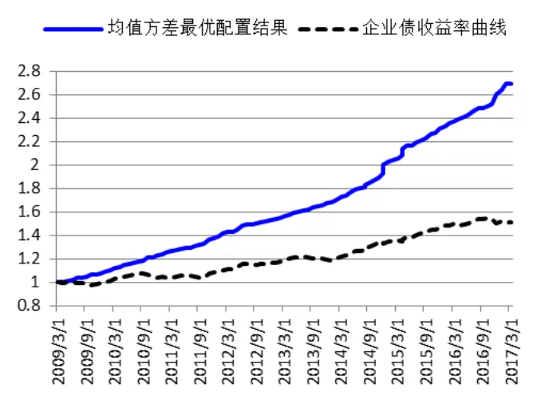
数据来源：国泰君安证券研究

图 5 均值方差模型最优配置变化
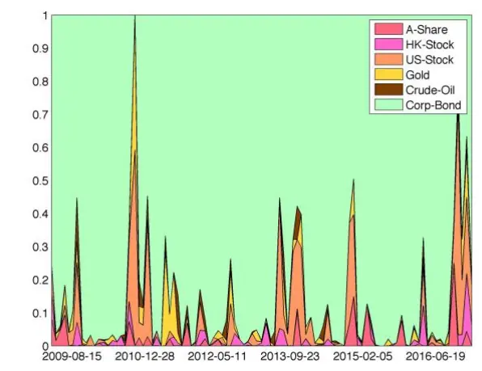
数据来源：国泰君安证券研究

## 2. 资产组合模型比较

## 2.1.现代投资组合模型

现代投资组合理论起始于 Markowitz 提出的均值方差模型。均值方差模型提取出资产的两个主要特征：预期收益和预期风险（用收益率的波动率表示），并在风险厌恶和预期收益最大化的条件下构造了有效边界。在有效边界上寻找使得效用函数（比如夏普比率）最大化的投资组合。在发达的证券市场中，均值方差模型早已在实践中被证明是行之有效的方法，但是均值方差模型本身也有较多缺陷，比如对输入参数的敏感性，估计误差被放大等。

为了克服均值方差模型对输入参数的敏感性，Fisher Black 和 RobertLitterman 在 1992 年提出了 Black-Litterman 模型，将投资者对大类资产的观点与市场均衡回报相结合，产生新的预期回报。该模型可以在市场基准的基础上，由投资者对某些大类资产提出倾向性意见，模型会根据投资者的倾向性意见，输出对该大类资产的配置建议，是一种典型的贝叶斯分析方法。新的资产配置具有符合直觉的组合及可以理解的权重配置。

以上的资产组合模型都同时考虑资产组合的收益和风险特征，但是对于资产未来收益和风险相对精确的预测困难重重，特别是对未来收益的预测，相比于二阶项的波动率预测误差更大。为了克服均值方差模型中对资产未来收益估计困难的问题，另一组仅考虑资产组合风险特征的模型也相继被提出，相比于资产未来收益率，资产波动率和协方差稳定性和延续性较强。相关模型主要有：目标风险模型、风险平价模型、等权配置模型、最小风险组合和最大分散度组合等。其中风险平价模型通过配平各资产对于资产组合风险的贡献，通常能够使得资产组合的夏普率高于任意单一资产。最大分散度组合通过最大化资产组合加权波动率与资产组合波动率的比率（类似于夏普比率，但是将加权收益替换成了加权

波动率： $\mathrm{max}\frac{w\sigma}{\sqrt{w\Omega w\prime}})$ ）来优化权重。

表 2 现代投资组合理论下的配置模型

| 配置策略 着重点 不足之处 |  |  |
| --- | --- | --- |
| 均值方差模型 | 收益与风险 | 对输入参数的敏感性 |
| Black-Litterman 模型 |  | 需要额外的市场观点 |
| 目标风险模型 |  | 收益和风险同步放大 |
| 风险平价模型 |  | 忽略收益目标，多数情况需要杠杆补充收益 |
| 等权配置模型 | 风险 | 忽略潜在的风险集中问题 |
| 最小风险组合 |  | 忽略收益目标，多数情况需要杠杆补充收益 |
| 最大分散度组合 |  | 忽略收益目标，对输入参数的敏感性 |

数据来源：国泰君安证券研究

为了对以上模型的配置过程有一个直观的认识，我们对其进行简单的回测，其中由于Black-Litterman 模型需要额外的市场观点，本报告将其暂且按下不表。回测采用 20日调仓频率，暂不考虑交易费用，用过去300个交易日的数据计算历史收益率和历史协方差作为其预期值的估计。回测时间自 2009 年 3 月到 2017 年 3 月。

表 3 现代投资组合理论下的配置模型回测

|  | 均值方差 (夏普率最高） | 目标风险 （波动率=0.02） | 风险平价 | 等权组合 | 最小风险 | 最大分散度 | 企业债 收益率 |
| --- | --- | --- | --- | --- | --- | --- | --- |
| 年化收益率 | 5.50% | 7.86% | 5.97% | 6.98% | 5.44% | 5.42% | 5.44% |
| 夏普比率 | 1.65 | 1.17 | 1.56 | 0.65 | 1.70 | 1.55 | 1.62 |
| 最大回撤 (月频) | -3.52% | -7.52% | -4.09% | -23.36% | -3.23% | -3.47% | -3.84% |
| 月胜率 | 71.13% | 58.76% | 68.04% | 56.70% | 73.20% | 68.04% | 71.13% |
| 年换手率 | 35.74% | 161.18% | 45.59% | 34.32% | 22.16% | 31.82% |  |

数据来源：国泰君安证券研究

目标风险模型的年化收益率最高，其在2014年到 2015年期间提高了对美股和A 股的配置，获得了较高的超额收益，但是相应的回撤也比较大并且 2014 年之前与作为比较基准的企业债收益率差别不大。从夏普比率、最大回撤、月胜率等角度来看，最小风险组合相对最优，其风险比仅持有企业债更小。风险平价模型和最大分散度模型的组合构成类似，但是最终的投资结果和单独持有企业债相比时好时坏，总体收益比较低，多数情况需要对债券加杠杆补充收益，而目前市场上的许多产品都对杠杆有着严格的限制，实际操作不便。

图 6 模型回测收益曲线
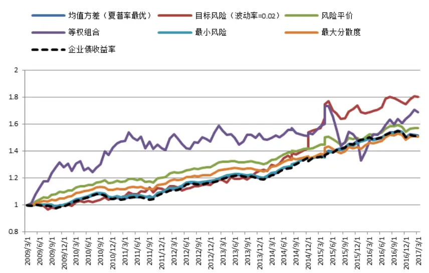
数据来源：国泰君安证券研究

从组合配置变化中可以看到，除了等权组合以外，由于债券的收益风险特征明显区别于其他资产，大部分考虑风险的模型都高配债券，导致最终的收益就是在债券基础上微小的增强。从本质上来说量化（统计）策略还是希望寻找高胜率的方法，并且押注尽可能多的次数，但是由于大类资产切换成本较高，所以调仓的频率不能太高，需要对资产未来有较长期的预测。债券、货币这类低风险资产相比于其他资产本身就有较高的可预测性和胜率，以其作为配置基底资产几乎是追求绝对收益的必然结果，但是这样做放弃了诸多高风险资产的收益机会。因此本报告希望策略在风险可控的情况下尽可能暴露一些风险资产的敞口，去提高策略的收益。在此我们提出一种基于回撤控制，同时又主动增加对风险资产暴露，博取风险资产趋势性机会的资产组合策略。

图 7 模型回测组合配置变化
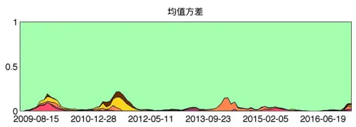

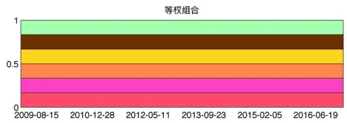

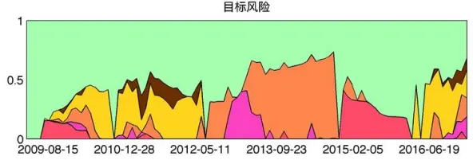

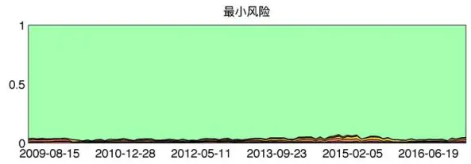

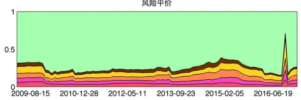
数据来源：国泰君安证券研究，注：图例与图 5一致

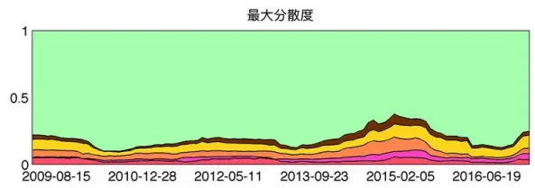

## 2.2.随机控制组合模型

Robert Merton 于 1970 年研究了连续时间下针对几何布朗运动金融资产的最优消费策略： $\begin{array}{r}{\operatorname*{max}E\int_{0}^{T}U(C,t)}\end{array}$ （U 为效用函数，C为消费策略），为

随机控制理论下的资产组合策略研究提供了框架。之后 Black 和 Perold于1987年提出了固定比例投资组合保险策略（简称CPPI），通过设定个人对资产报酬的要求和对风险的承受能力来设计符合个人需求的配置策略，策略将投资组合分成预期高风险高收益的主动性资产和预期低风险低收益的保留性资产，在维持固定的最低保险金额的情况下通过动态调整主动性资产的头寸实现保本要求下的资产增值，类似于一种期权投资。但是CPPI有其本身的缺陷，要使CPPI精确的达到保本的目的，必须连续不断的调整两种资产的比例，但是在交易成本存在的情况下，交易频率和交易成本的取舍是一个相对较复杂的问题，且对于有些较确定的市场风险，固定比例没有给出很好的规避指导。1993 年 Grossman 和Zhou 提出了一个全新的优化问题，新的问题致力于在控制最大回撤的条件下最优化资产组合期望效用的长期收益。问题最终给出了一个浮动比例的投资组合保险策略。

## 2.2.1. 模型问题描述

假设无风险资产价格具有常数收益率 r，而风险资产价格满足几何布朗运动：

$$
dP_{t}=P_{t}\big((b+r)dt+\sigma dZ_{t}\big),P_{0}>0
$$

$Z_{t}$ 是标准布朗运动，令 $W_{t}$ 表示资 $\cdot\vec{p}$ 组合的财富过程：

$$
dW_{t}=rW_{t}dt+x_{t}(bdt+\sigma dZ_{t})
$$

其中 $x_{t}$ 代表在 t 时刻持有风险资产的比例，我们定义历史最大财富贴现值为：

$$
{M}_{t}=max\big\{{W}_{s}e^{\lambda(t-s)};s\le t\big\}
$$

则最终的优化问题即为：

$$
\begin{array}{l}{\displaystyle\operatorname*{max}_{\{x_{t}\}}\overline{{\operatorname*{lim}_{T\infty}}}\frac{1}{T}\log E\big(U(W_{T})\big)\ ,U(W)=\frac{W^{1-\gamma}}{1-\gamma}\ ,0<\gamma<1}\\{\displaystyle\qquad\mathrm{s.t.}W_{t}\geq\alpha M_{t}}\end{array}
$$

其中效用函数采用的是 HARA（Hyperbolic absolute risk aversion）族函数之一的常数相对风险厌恶效用函数， 是风险厌恶系数。 是回撤控制系数，模型目标为在回撤控制的基础上最大化资产组合预期效用函数的长期收益率。Grossman 和 Zhou 认为最大回撤是非常重要的风险指标，这在现代投资组合理论中缺少体现，其代表性的均值方差模型将风险定义为收益率的波动率，而波动率是路径独立的，也就是说它没有考虑到资产组合的价值变化过程，对于回撤的控制是间接的。最大回撤将对投资者资金上和心理上造成巨大挑战，即便投资策略未来收益如何丰厚，一旦触及 $\dot{\mathcal{I}}$ 品的最大回撤阈值，产品就极有可能被强制平仓赎回。因此，利用回撤控制风险更贴合实际投资过程。

Grossman 和 Zhou 给出的是连续时间下单一风险资产优化问题的解析解，随后Cvitanic和 Karatzas在 1995年将模型和策略延拓到了多资产的情况，为模型的实际应用做了泛化。新的模型假设在多资产（d 个风险资 $\dot{\mathcal{P}}^{\mathrm{~)~}}$ 的情况下，无风险资 $\cdot\vec{p}$ 和风险资 $\cdot\vec{p}$ 的价格随机过程分别满足：

$$
dP_{0}(t)=P_{0}(t)r(t)dt,P_{0}(0)=1
$$

$$
dP_{i}(t)=P_{i}(t)\left[b_{i}(t)dt+\sum_{j=1}^{d}\sigma_{ij}(t)dZ_{j}(t)\right],\qquad P_{i}(0)=p_{i}>0
$$

定义折现过程：

$$
\beta(t):=\frac{1}{P_{0}(t)}=\exp\left(-\int_{0}^{t}r(s)ds\right),0\le t<\infty
$$

考虑一个资 $\cdot\dot{\vec{r}}$ 组合权重向量 $\mathbf{\sigma}^{\cdot}\pi(\cdot)=\bigl(\pi_{1}(\cdot),\ldots,\pi_{d}(\cdot)\bigr)^{\prime}$ ，以及与其对应的财富过程 $W^{\pi}(\cdot)$ ，则此财 $\overrightarrow{\frac{\triangledown}{\triangledown}}$ 过程由下式控制：

$$
\begin{array}{rlr}{{dW^{\pi}(t)=\sum_{i=1}^{d}\pi_{i}(t)(W^{\pi}(t)-\frac{\alpha M^{\pi}(t)}{\beta(t)})[b_{i}(t)dt+\sum_{j=1}^{d}\sigma_{ij}(t)dZ_{j}(t)]}}\\&{}&{+[(1-\sum_{i=1}^{d}\pi_{i}(t))(W^{\pi}(t)-\frac{\alpha M^{\pi}(t)}{\beta(t)})+\frac{\alpha M^{\pi}(t)}{\beta(t)}]r(t)dt}\end{array}
$$

$$
W^{\pi}(0)=w
$$

并且此财富过程要满足回撤控制条件：

$$
P[\beta(t)W^{\pi}(t)>\alpha M^{\pi}(t),\forall0\leq t<\infty]=1
$$

其中 $\alpha\in(0,1)$ ，历史最大财富折现值：

$$
M^{\pi}(t):=\operatorname*{max}_{0\leq s\leq t}\beta(s)W^{\pi}(s)
$$

多资产下财富过程的前一项是风险资产的配置比例与风险资产的价格变动随机项，后一项是无风险资产的配置比例与无风险资产的价格变动。相比于单一风险资产的模型，多资产模型将回撤的控制直接在财富过程中体现。

## 2.2.2. 模型的优点

相比于现代资产组合模型，由 Grossman 和 Zhou 提出，由 Cvitanic 和Karatzas发展的模型（以下简称“本模型”）有如下几个优点：

1、本模型对于资产组合权重优化是在回撤控制的条件下进行，比仅仅考虑波动率要更贴合实际，浮动的投资比例为资产设置可控的安全垫，安全垫一旦消失，模型将仅利用无风险资产的收益恢复总体财富。

2、区分“风险资产”与“无风险资产”（低风险的保留资产近似无风险资产），将“无风险资产”剔除出风险配置过程，防止长期高配“无风险资产”，导致放弃了“风险资产”的部分投资机会，从而削减策略收益。

3、将资产组合长期收益率作为优化目标，相比只考虑风险的模型额外考虑了收益端，在资产有趋势性机会的情况下进行切换。

## 3. 基于回撤控制的资产组合策略

## 3.1.模型的解及其改进形式

模型解的过程较为冗长有兴趣的读者可以参见相关文献，本节将仅讨论模型解析解本身及其改进与变种形式。

首先，原模型设计的回撤是从时间序列起始点开始的回撤，这对于在波动较大的市场中做长期投资显然过于保守，因此我们将其修改为滚动窗口回撤 REDD（Rolling Economic Drawdown），其中 H 为滚动窗口系数。

$$
REDD(t,H)=1-\frac{W_{t}}{M_{t,H}}
$$

其次，关于回撤控制系数 $_{.\alpha}$ 与风险厌恶系数 $\mathbf{\nabla}_{\cdot}\gamma,$ ，在原模型中并未给出两者之间的联系，从直觉上来说一个风险厌恶偏好高的投资者其对回撤的容忍也将比较低，因此我们简单的将动态回撤控制系数作为风险厌恶系数： $\gamma=\alpha.$ 。则解得风险资产权重的表达式为：

$$
\pi(t)=([\Sigma^{-1}\cdot\mu]^{T}\cdot\Sigma^{-1})\cdot max\left(0,\frac{1}{1-(1-\alpha)^{2}}\cdot\frac{(1-\alpha)-REDD}{1-REDD}\right)
$$

无风险资产的配置比例为：

$$
\pi_{0}(t)=1-\sum\pi(t)
$$

其中：

$$
\Omega=\left[\rho_{ij}\sigma_{i}\sigma_{j}\right]_{ij}=\Sigma\cdot\Sigma^{T}
$$

$$
\mu_{i}=R_{i}-r_{f}+\frac{1}{2}\sigma_{i}^{2}
$$

分别是预期协方差阵的Cholesky分解（ 是下三角阵），以及第 i个资产的预期收益漂移项。

解的前一项在风险资产只有一个的情况下可以写为： $\lambda/\sigma+1/2$ ，也就是资产预期夏普率除以预期波动率加 1/2。解的后一项由回撤控制，如果REDD 为 $^{0,}$ ，则此项系数得到最大值 $(1-\alpha)/(1-(1-\alpha)^{2})$ ，当 $\alpha$ 为 5%的情况下，此项系数为 5.01%。如果 REDD 达到 ，此项为0。也就是说一旦回撤达到容忍极限，就将清空风险资 $\cdot\vec{p}$ 的头寸。解的这两项都天然带有动量因素在其中，第一项中的资产预期收益率如果使用历史数据估计自然有动量的影响在其中，第二项在资产回撤减小的过程中会提高配置（有上限），在资产下跌中会减少配置，也有类似动量的操作。

最后，由于原模型并未对 的取值进行限制，因此可能涉及杠杆和做空，如遇到 的项为负数的情况下，直接赋予该风险资产的头寸为0，如遇到所有项的和大于1，则按比例将其缩减到 1。

## 3.2.模型回测与分析

模型需要两个输入和两个参数：资产预期收益率向量和资产预期协方差矩阵，回撤控制系数 与窗口选择参数H。

首先对于两个输入，我们用历史数据进行估计。预期收益率我们用滚动窗口区的年化收益率来表示。波动率的计算频率和最终的值有很大关系，我们在A股上利用过去 250个交易日的数据滚动的进行波动率的计算，分别用1 日、5日、20 日、60日（对应日频、周频、月频、季频）为间隔取值并计算波动率，在下图中可以看到周频以上的波动率计算结果和开始取值的点有明显的周期关系，导致得到的波动率估计并不稳定，同时我们也注意到周频及以上频率下计算的波动率始终围绕日频计算的波动率波动，相对来说日频计算的波动率比较稳定，因此我们采用日频数据估计资产的波动率和协方差。

图 8 不同计算频率下沪深300滚动波动率
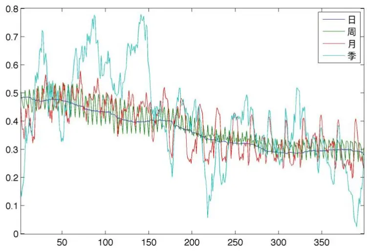
数据来源：国泰君安证券研究

在回测的过程中我们沿用之前的回测区间，2009年3 月到2017年3月，使用 20 日频率调仓，滚动窗口暂时设置为 120 个交易日，暂不考虑交易费用。企业债收益率波动小，具有固定收益属性，因此我们近似将企业债设为模型中的“无风险资产”（关于企业债的风险属性我们在后文中讨论），将除企业债外的 5 类资产设为“风险资产”。

表 4 不同回撤控制系数下策略回测结果

| 1-α | 1% | 3% | 5% | 7% | 10% | 15% | 20% | 25% |
| --- | --- | --- | --- | --- | --- | --- | --- | --- |
| 年化收益率 | 5.69% | 6.32% | 6.93% | 7.50% | 8.33% | 9.38% | 9.91% | 10.39% |
| 夏普比率 | 1.77 | 1.78 | 1.52 | 1.27 | 1.02 | 0.87 | 0.82 | 0.81 |
| 最大回撤 (月频） | -3.78% | -3.30% | -3.37% | -3.98% | -5.52% | -8.78% | -11.31% | -13.32% |
| 月胜率 | 71.13% | 74.23% | 70.10% | 70.10% | 68.04% | 64.95% | 63.92% | 62.89% |
| 年换手率 | 34.79% | 80.28% | 129.44% | 178.45% | 251.69% | 331.89% | 369.27% | 391.37% |

数据来源：国泰君安证券研究

从回测结果中可以看到，策略的最大回撤基本都控制在回撤控制系数设置的阈值之下。要注意的一点是，回撤控制系数只能控制“风险资产”的最大回撤，无法控制“无风险资产”的最大回撤，因此无论回撤控制系数多小，都无法减小组合中企业债本身造成的回撤。基础策略虽然风险可控，但是总体收益稳定性不强，因此我们提出以下改进。

## 3.2.1. 模型改进一：基于单独资产的回撤控制

原模型的回撤控制基于资产组合总体，当资产组合价值下降到回撤阈值的时候所有风险资产的头寸都会降为 0，这种一刀切的方式对于未来仍有上升机会的风险资产是“不公平”的，所以本报告对其作出改进，我们认为回撤的控制应当放在单独风险资产上，也就是说当某一风险资产自身的回撤达到回撤阈值的时候，此资产的头寸暴露为 0，只有当此资产的价格回到阈值以上才可继续配置。这样单一资产的大幅回撤不会影响到其他资产的头寸。在此基础上REDD由一个标量变为一个向量，向量的每一项表示如下：

$$
REDD_{i}=1-{\frac{P_{i}(t)}{\displaystyle{\operatorname*{max}_{t-H\leq s\leq t}\beta(s)P_{i}(s)}}}
$$

在模型改进的基础上进行回测得到结果如下：

表 5 不同回撤控制系数下策略回测结果

| 1-α | 1% | 3% | 5% | 7% | 10% | 15% | 20% | 25% |
| --- | --- | --- | --- | --- | --- | --- | --- | --- |
| 年化收益率 | 5.86% | 6.79% | 7.71% | 8.58% | 9.62% | 10.81% | 11.24% | 11.35% |
| 夏普比率 | 1.81 | 1.96 | 1.81 | 1.56 | 1.25 | 1.03 | 0.94 | 0.90 |
| 最大回撤 (月频） | -3.63% | -3.58% | -3.30% | -3.90% | -5.62% | -8.47% | -11.45% | -11.88% |
| 月胜率 | 72.16% | 75.26% | 75.26% | 75.26% | 70.10% | 65.98% | 68.04% | 63.92% |
| 年换手率 | 30.82% | 73.36% | 118.21% | 160.79% | 226.98% | 317.28% | 361.28% | 376.68% |

数据来源：国泰君安证券研究

图 9 不同回撤控制系数下策略收益率曲线
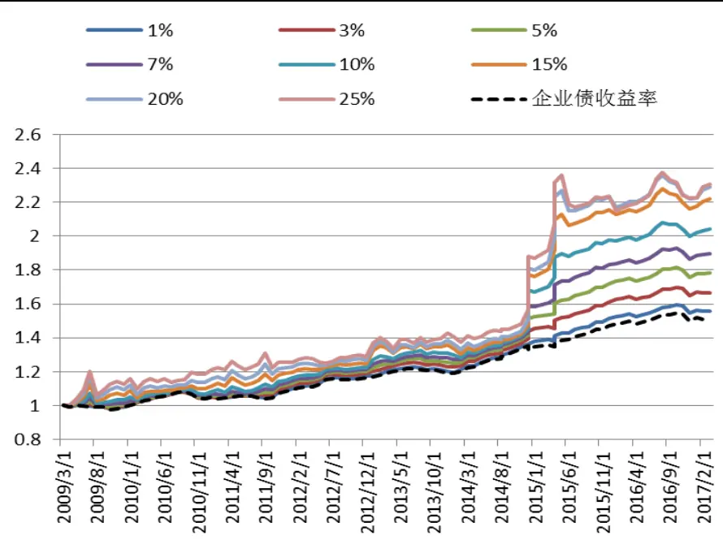
数据来源：国泰君安证券研究

新策略相对于控制组合总体回撤的策略，在风险一定程度减小的情况下增强了收益。

## 3.2.2. 模型改进二：风险乘数

考察资产配置变化过程我们发现，在前一改进后风险资产的总体比例相对于无风险资产仍然保持一个较低的水平。这是由于模型假设动态回撤控制系数等于风险厌恶系数： ，因此解中回撤控制项对风险资产的配比上限与回撤容忍度近似相等，当回撤容忍度比较低时，风险资产的配比上限较低。

图 10 改进一中 1- =7%的配置过程
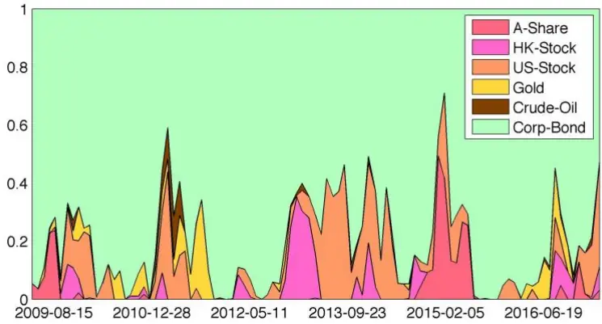
数据来源：国泰君安证券研究

在回撤可接受的情况下，我们可以通过适当调高风险资产的总体配置比例的方式增强收益。我们借鉴 CPPI 策略中的风险乘数规则，调高风险资产总体配置比例。风险乘数规则下配置比例（K为风险乘数）为：

$$
\pi(t)=K\cdot([\Sigma^{-1}\cdot\mu]^{T}\cdot\Sigma^{-1})\cdot max\left(0,\frac{1}{1-(1-\alpha)^{2}}\cdot\frac{(1-\alpha)-REDD}{1-REDD}\right)
$$

$$
\pi_{0}(t)=1-\sum\pi(t)
$$

这里的风险乘数并不是加杠杆，在风险资产权重和大于 1时仍要等比例缩减。风险乘数的增加实际上就是模型风险厌恶系数 的减小，我们首先继续在月频下进行回测，得到结果如下：

表 6 不同回撤控制系数与风险乘数下策略回测结果

| K | 2 |  | 3 |  |
| --- | --- | --- | --- | --- |
| 1-α | 3% 5% | 7% | 3% 5% | 7% |
| 年化收益 率 | 8.09% 9.88% | 11.38% | 9.36% 11.68% | 13.06% |
| 夏普比率 | 1.69 1.34 | 1.18 | 1.41 1.20 | 1.12 |
| 最大回撤 (月频) | -3.61% -5.53% | -7.79% | -4.98% -8.28% | -11.67% |
| 月胜率 | 77.32% 73.20% | 70.10% | 74.23% 72.16% | 69.07% |
| 年换手率 | 133.99% 223.89% | 297.34% | 194.78% 314.89% | 365.09% |

数据来源：国泰君安证券研究

图 11 不同回撤控制系数下策略收益率曲线
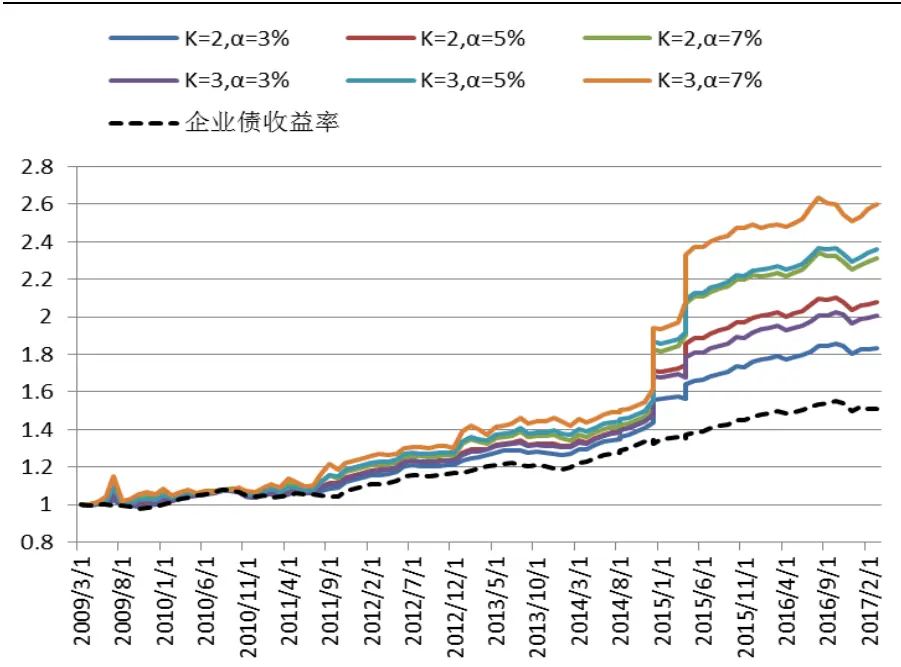
数据来源：国泰君安证券研究

可以看到在风险乘数提高的过程中，策略的效果不断的被增强，风险资产带来的超额收益放大更加明显，其中收益最高的 K=3， =7%策略最大回撤发生在 2009 年 7-8 月，这是由于当时 A 股牛市导致配置 A 股比较重，而市场波动又较剧烈导致的，资产的价格变化的肥尾性比模型预设的要更高，在风险事件发生的情况下需要借鉴本模型外的判断。除开这一异常点，如果从2009年9 月算起，最大回撤仅为-4.61%，模型在近几年表现都较为稳定（2014-2015 牛市回撤小的原因在于 A 股在股灾前调整过，整体资产夏普比率在股灾到来前有所下降，导致A 股配置比例下降）。

以上回测都在月频下进行，实际大类资产配置策略由于其调整权重成本较高，可能以更低的频率进行权重调整，本报告对季频（60日调仓）下的策略进行进一步的回测，模型采用基于单独资产回撤的控制模型，由于季频下调仓需要估计一个更为长期的收益率和波动率情况，滚动窗口暂时设置为180个交易日，回测结果如下：

表 7 不同回撤控制系数与风险乘数下策略回测结果

| K | 2 |  | 3 |  |
| --- | --- | --- | --- | --- |
| 1-α | 3% 5% | 7% | 3% 5% | 7% |
| 年化收益 率 | 8.71% 11.49% | 13.70% | 10.10% 13.11% | 15.30% |
| 夏普比率 | 1.42 1.26 | 1.22 | 1.18 1.22 | 1.17 |
| 最大回撤 (月频) | -3.84% -6.53% | -9.06% | -5.93% -9.30% | -10.50% |
| 月胜率 | 73.96% 69.79% | 67.71% | 73.96% 69.79% | 68.75% |
| 年换手率 | 88.31% 142.39% | 178.94% | 123.94% 180.58% | 207.72% |

数据来源：国泰君安证券研究

图 12 不同回撤控制系数下策略收益率曲线
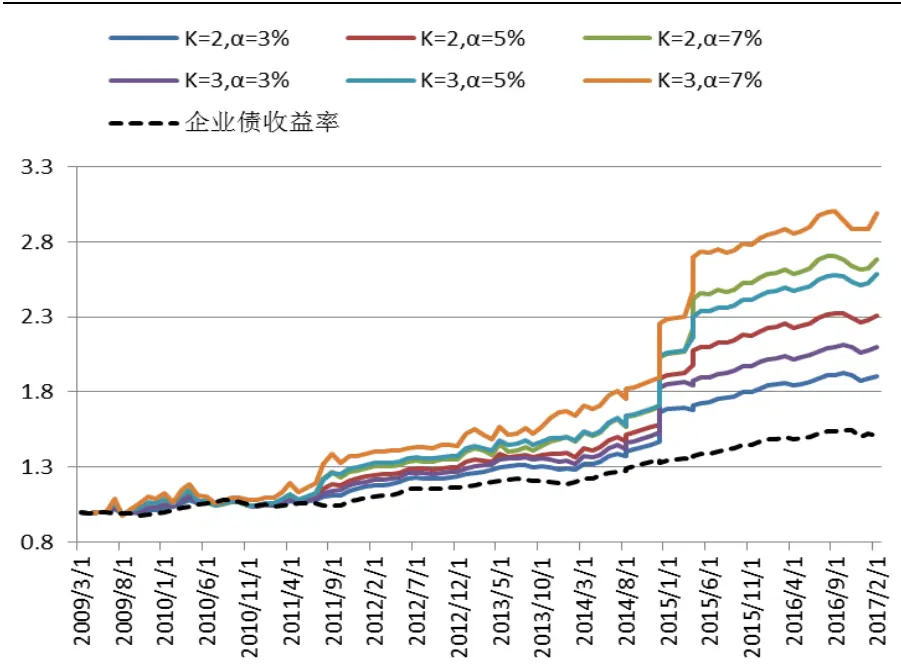
数据来源：国泰君安证券研究

可以看到在季频调仓下策略回撤水平与收益水平同步上升，但是总体变化不大，与月频下策略效果相近。其中 K=2， =7%的策略其组合配置变化如下，可以看到策略抓住了几种大类资产的几波主要趋势性机会。由于调仓频率低，模型对于回撤的控制能力在调仓的间隔期较低，但是在调仓频率（季频）下考察最大回撤仍处于较低水平，K=2， =7%的策略季频最大回撤-5.74%，K=3， =7%的策略季频最大回撤-5.88%。

图 13 季频调仓（60交易日）下 K=2， =7%策略组合配置变化
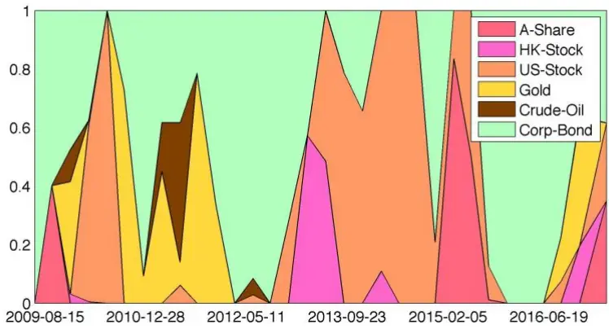
数据来源：国泰君安证券研究

## 3.2.3. 模型改进三：“无风险资产”也有风险

在前面几节的回测中，我们以企业债作为“无风险资产”，但是事实上企业债的风险并不小，只是相对于其他“风险资产”波动率小得多，且带有固定收益属性。因此虽然不能将债券放到和其他风险资产同等的框架下去考虑，我们可以通过在“无风险资产”内部增加一层回撤控制来降低回撤。在此我们引入风险更小的货币资产，以中证货币基金指数计算货币资产收益率。我们采用以下的轮动方法：

若滚动窗口 H 内，债券回撤超过回撤控制阈值 ，则债券资产切换为货币资产，反之保持债券资产的配置。

我们在不同的回撤控制阈值 下进行两类资产轮动的效果测试，测试在20日调仓频率下进行：

表 8 债券与货币轮动策略测试结果

| ε | 0.10% | 0.30% | 0.50% | 企业债 收益率 | 货币基金 收益率 |
| --- | --- | --- | --- | --- | --- |
| 年化收益率 | 6.06% | 5.74% | 5.72% | 5.44% | 3.33% |
| 夏普比率 | 3.05 | 2.52 | 2.40 | 1.62 | 9.95 |
| 最大回撤 (月频) | -1.03% | -1.78% | -1.78% | -3.84% | 0.00% |
| 月胜率 | 93.81% | 90.72% | 88.66% | 71.13% | 100.00% |
| 年换手率 | 386.60% | 257.73% | 231.96% |  |  |

数据来源：国泰君安证券研究

可以看到整体的最大回撤有一个显著的下降，组合的收益也有相应的提高。轮动策略能够有效的避免一些债券的下跌趋势。

图 14 “无风险资产”轮动策略收益曲线
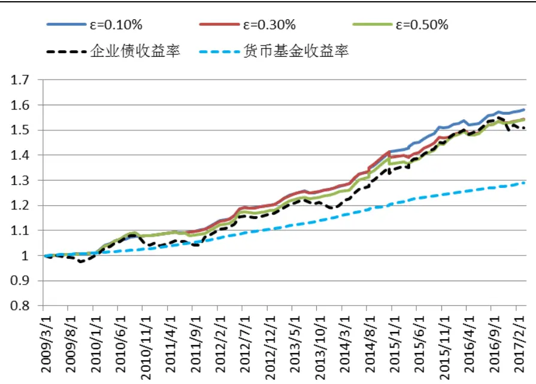
数据来源：国泰君安证券研究

因此在我们的模型中，我们将“无风险资产”内部轮动也加入到回撤控制模型中来，形成一个两级的回撤控制。在两级回撤控制下模型整体的收益有所提升，最大回撤有明显的下降。从2009年9月到2017年3 月，20 日调仓下，K=1 情况下收益回撤比可以达到 6-8，对于相对高风险的K=3，， =7%策略，最大回撤从-4.61%下降到了-3.68%。

表 9 “无风险资产”轮动后各参数下策略表现

| K | 1 | 1 | 1 | 2 | 3 |
| --- | --- | --- | --- | --- | --- |
| 1-α | 3% | 5% | 7% | 7% | 7% |
| 年化收益率 | 7.99% | 8.78% | 9.50% | 11.94% | 13.47% |
| 夏普比率 | 2.93 | 2.31 | 1.85 | 1.32 | 1.28 |
| 最大回撤 (月频) | -1.03% | -0.99% | -1.42% | -2.75% | -3.68% |
| 月胜率 | 90.22% | 85.87% | 80.43% | 71.74% | 69.57% |
| 年换手率 | 412.22% | 433.66% | 451.26% | 519.07% | 538.49% |

数据来源：国泰君安证券研究

图 15 “无风险资产”轮动后不同参数下策略收益曲线
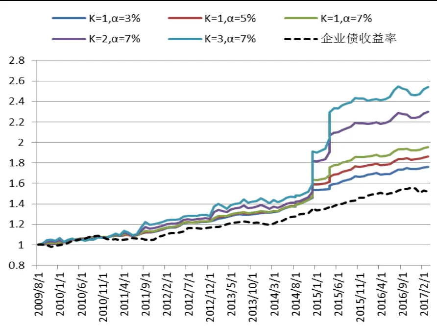
数据来源：国泰君安证券研究

## 4. 总结与展望

本报告从现代投资组合模型出发，讨论其风险配置过程中存在的问题。带有固定收益属性的资产不适合与股权、商品类资产放在统一风险配置下，因此本报告提出区分两者并在风险可控的情况下利用浮动比例的保险策略对两者进行配置，借鉴随机控制的方法，整体策略能够抓住大类资产的趋势性机会，在固定收益属性资产的基础上进行稳健的增强。

资产配置需要预测模型加组合模型的结合，本报告重点讨论组合策略的优劣以及改进，但是预期收益率向量和预期协方差矩阵是利用历史数据进行预测的，导致策略的结果受到动量效应的影响，如果市场动量效应有较大的变化，策略可能会面对较大的风险，因此利用其它模型更加精准的预测资产未来收益风险特征是本模型未来的必要补充，当然这个问题也是其他所有资产组合模型需要面对的问题。

其次模型假设资产的价格满足几何布朗运动，在考察和调仓周期较长的情况下，资产价格厚尾风险对策略的影响更高，整个市场的大幅波动对模型提出了不小的挑战，如何预警小概率事件的发生，防范极端市场的波动风险也是策略未来必要的补充。

最后Grossman 和 Zhou的模型只是从回撤的角度提出模型，实际随机控制理论还可以有更多的变种和提法，可以讨论模型在更多限制条件下的解决方案，也可以修正资产价格满足几何布朗运动的简单假设，对更符合实际情况的随机过程进行建模。

## 本公司具有中国证监会核准的证券投资咨询业务资格

## 分析师声明

作者具有中国证券业协会授予的证券投资咨询执业资格或相当的专业胜任能力，保证报告所采用的数据均来自合规渠道，分析逻辑基于作者的职业理解，本报告清晰准确地反映了作者的研究观点，力求独立、客观和公正，结论不受任何第三方的授意或影响，特此声明。

## 免责声明

本报告仅供国泰君安证券股份有限公司（以下简称“本公司”）的客户使用。本公司不会因接收人收到本报告而视其为本公司的当然客户。本报告仅在相关法律许可的情况下发放，并仅为提供信息而发放，概不构成任何广告。

本报告的信息来源于已公开的资料，本公司对该等信息的准确性、完整性或可靠性不作任何保证。本报告所载的资料、意见及推测仅反映本公司于发布本报告当日的判断，本报告所指的证券或投资标的的价格、价值及投资收入可升可跌。过往表现不应作为日后的表现依据。在不同时期，本公司可发出与本报告所载资料、意见及推测不一致的报告。本公司不保证本报告所含信息保持在最新状态。同时，本公司对本报告所含信息可在不发出通知的情形下做出修改，投资者应当自行关注相应的更新或修改。

本报告中所指的投资及服务可能不适合个别客户，不构成客户私人咨询建议。在任何情况下，本报告中的信息或所表述的意见均不构成对任何人的投资建议。在任何情况下，本公司、本公司员工或者关联机构不承诺投资者一定获利，不与投资者分享投资收益，也不对任何人因使用本报告中的任何内容所引致的任何损失负任何责任。投资者务必注意，其据此做出的任何投资决策与本公司、本公司员工或者关联机构无关。

本公司利用信息隔离墙控制内部一个或多个领域、部门或关联机构之间的信息流动。因此，投资者应注意，在法律许可的情况下，本公司及其所属关联机构可能会持有报告中提到的公司所发行的证券或期权并进行证券或期权交易，也可能为这些公司提供或者争取提供投资银行、财务顾问或者金融产品等相关服务。在法律许可的情况下，本公司的员工可能担任本报告所提到的公司的董事。

市场有风险，投资需谨慎。投资者不应将本报告作为作出投资决策的唯一参考因素，亦不应认为本报告可以取代自己的判断。
在决定投资前，如有需要，投资者务必向专业人士咨询并谨慎决策。

本报告版权仅为本公司所有，未经书面许可，任何机构和个人不得以任何形式翻版、复制、发表或引用。如征得本公司同意进行引用、刊发的，需在允许的范围内使用，并注明出处为“国泰君安证券研究”，且不得对本报告进行任何有悖原意的引用、删节和修改。

若本公司以外的其他机构（以下简称“该机构”）发送本报告，则由该机构独自为此发送行为负责。通过此途径获得本报告的投资者应自行联系该机构以要求获悉更详细信息或进而交易本报告中提及的证券。本报告不构成本公司向该机构之客户提供的投资建议，本公司、本公司员工或者关联机构亦不为该机构之客户因使用本报告或报告所载内容引起的任何损失承担任何责任。

## 评级说明

## 1.投资建议的比较标准

投资评级分为股票评级和行业评级。

以报告发布后的12个月内的市场表现为比较标准，报告发布日后的 12个月内的公司股价（或行业指数）的涨跌幅相对同期的沪深 300 指数涨跌幅为基准。

## 2.投资建议的评级标准

报告发布日后的 12 个月内的公司股价（或行业指数）的涨跌幅相对同期的沪深 300 指数的涨跌幅。

|  | 评级 | 说明 |
| --- | --- | --- |
| 股票投资评级 | 增持 | 相对沪深300指数涨幅15%以上 |
|  | 谨慎增持 | 相对沪深300指数涨幅介于5%～15%之间 |
|  | 中性 | 相对沪深300指数涨幅介于-5%～5% |
|  | 减持 | 相对沪深 300 指数下跌 5%以上 |
| 行业投资评级 | 增持 | 明显强于沪深 300 指数 |
|  | 中性 | 基本与沪深 300指数持平 |
|  | 减持 | 明显弱于沪深300指数 |

## 国泰君安证券研究所

|  | 上海 | 深圳 | 北京 |
| --- | --- | --- | --- |
| 地址 | 上海市浦东新区银城中路168号上海 银行大厦29层 | 深圳市福田区益田路 6009 号新世界 商务中心34层 | 北京市西城区金融大街 28 号盈泰中 心2号楼10层 |
| 邮编 | 200120 | 518026 | 100140 |
| 电话 | （021)38676666 | （0755）23976888 | (010)59312799 |
|  | E-mail: gtjaresearch@gtjas.com |  |  |