inInfo] [Table_Title] 2017.07.04

# 基于信息冲击视角的盈余公告效应研究

## ----数量化专题之九十五

刘富兵（分析师）

8 021-38676673

liufubing008481@gtjas.com

证书编号 S0880511010017

## 本报告导读：

本报告导读：本报告以上市公司正式财报（年报）发布为研究对象，采用事件研究法，观察公告日附近的市场反应并寻找相关交易机会。

## 摘要：

le_Summary]针对上市公司财报披露事件，本报告通过事件研究法，观察市场在公告日附近的反应，分别从公告前和公告后两个角度寻找潜在规律以及相关交易机会。

- 在预约披露制度下，上司公司发布公告是可预期事件，对于发生时间确定但实际内容不确定的事件，容易产生事前的预期炒作。

本文的研究发现，公告预约披露时间越是靠前、信息非对称性越严重的股票样本，越容易受到事前炒作，公告前累计异常收益越高。每年预约披露时间处于前 10%以上的样本，公告前 20 个交易日的平均累计异常收益 3.1%，绝对收益 8.2%，胜率 71.8%。如果在这部分样本中挑选出没有分析师覆盖也即信息非对称性更高的样本，公告前的累计异常收益可提高到4.8%，绝对收益11%，胜率为78.1%。

由于公告前炒作容易导致市场对于消息的过度反应，公告日当天消息出尽，预期兑现，股价在公告日当天通常会回落。

从公告后的角度来看，公告后漂移主要集中在之前发布过快报并且正式公告 EPS超预期的样本中。这部分样本在公告后60 个交易日的累计异常收益显著为正。

公告后漂移产生的主要原因是市场对信息反应滞后，因此在机构投资者参与较少的个股中，公告后漂移效应更加明显。如果从之前发布过快报，并且正式公告中超预期的样本中剔除前十大流通股东中机构占比超过10%的样本，公告后 60个交易日的累计异常收益为4.35%，绝对收益 11.1%，胜率为 61%。

本报告的研究发现，投资者对上市公司正式年报发布给予了高度关注，并在公告日附近存在明显规律性的交易行为，以此构建的交易策略具有较强的稳定性。本报告是对现有以业绩预告和业绩快报为主的研究成果的必要补充。

## 金融工程团队：

刘富兵：（分析师）

电话：021-38676673

邮箱：liufubing008481@gtjas.com

证书编号：S0880511010017

## 陈奥林：（分析师）

电话：021-38674835

邮箱：chenaolin@gtjas.com

证书编号：S0880516100001

## 李辰：（分析师）

电话：021-38677309

邮箱：lichen@gtjas.com

证书编号：S0880516050003

## 孟繁雪：（分析师）

电话：021-38675860

邮箱：mengfanxue@gtjas.com

证书编号：S0880517040005

## 蔡旻昊：（研究助理）

电话：021-38674743

邮箱：caiminhao@gtjas.com

证书编号：S0880117030051

## 殷明：（研究助理）

电话：021-38674637

邮箱：yinming@gtjas.com

证书编号：S0880116070042

## 叶尔乐：（研究助理）

电话：021-38032032

邮箱：yeerle@gtjas.com

证书编号：S0880116080361

## （感谢博士后工作站黄皖璇对本报告的贡献）

## [Table_R相关报告

《回撤控制下的最优化大类资产配置策略》2017.07.03

《基于短周期价量特征的多因子选股体系》2017.06.15

《基于短周期价量特征的多因子选股体系》2017.06.01

《基于动态模分解的价格模式挖掘》2017.05.15

《负基差已成常态，投机资金参与热情不高》2017.05.05

## 1. 背景介绍

盈余公告是上市公司向市场传递信息的重要载体之一，包含上市公司给定期间内的生产经营业绩、给定截至日期的资产负债情况等，盈余公告的披露会对市场带来信息冲击，并从一定程度上改变投资者对股价的预期，从而产生盈余公告效应。

自从 Ball and Brown(1968)最早提出“公告后漂移（PEAD）”的概念以来，盈余公告效应一直受到理论界和实务界的广泛关注。盈余公告效应是指上市公司公告的盈利数据变动所引起的股票价格漂移现象，传统理论多集中于对公告后股票价格漂移的探索和解释。所谓的公告后漂移现象，是指公告后的一段时间里，股票价格向着未预期盈余的方向变动，并具有一定的持续性。举例而言，如果一家上市公司披露的公告内容超预期，该公司的股价会在公告披露之后的一段时间里持续上涨。因此公告后漂移现象的存在为投资者提供了公告之后的短期交易机会。

其实，盈余公告效应并不仅限于公告后漂移，除了事后的反应之外，投资者在盈余公告披露之前还存在针对即将发布的公告提前反应的现象，这种公告前反应仅用信息提前泄露是无法完全解释的。这是本报告的研究对象——上市公司发布的正式公告所独有的特征。

现有的对上市公司盈余公告效应的研究主要集中在业绩预告和业绩快报，主要因为这两类报告的披露时间在正式报告之前，从直觉上来看，对市场造成的信息冲击应该相对较大。但是投资者对正式财务报表的关注度并不会因为披露时间的相对靠后而有所减弱。首先，业绩预告和业绩快报并非所有上市公司必须披露的事项，而正式报告的披露规则对所有上市公司均适用，因此以正式报告为研究对象选取的样本是无偏的。其次，虽然业绩预告、业绩快报中给出了公司的基本财务指标，但是正式报告就信息准确性和充分性而言完胜其他非正式报告。

除此之外，正式公告与其他非正式报告在披露制度上存在一项重要差异，也即报告披露时间预约制度。在每个会计期间截止之前，所有上市公司的公告预约披露时间都将以公开信息的形式传达给广大投资者，这就使得上市公司的公告披露成为了完全可以预期的事件，这种可预期指的是事件发生的时间，而公告内容本身却含有不可预期的成分，容易产生事件前的预期炒作。

因此，本报告以上市公司发布正式年报事件为研究对象，从年报公布日附近的市场反应中寻找投资交易机会，构建事件驱动交易策略。本报告的研究发现，投资者对上市公司正式年报发布给予了高度关注，并在公告日附近存在明显规律性的交易行为，以此构建的交易策略具有较强的稳定性。本报告是对现有以业绩预告和业绩快报为主的研究成果的必要补充。

## 1.1.上市公司盈余公告发布概述

关于上市公司发布的三类盈余公告——业绩预告、业绩快报和正式报告之间的区别比较在之前的专题报告《预期风险下，基于业绩快报的PEAD投资策略》中已经进行了较为详尽的描述。三类报告的披露遵循如图 1横轴所示的时间表。

图 1 上市公司盈余公告披露情况概览
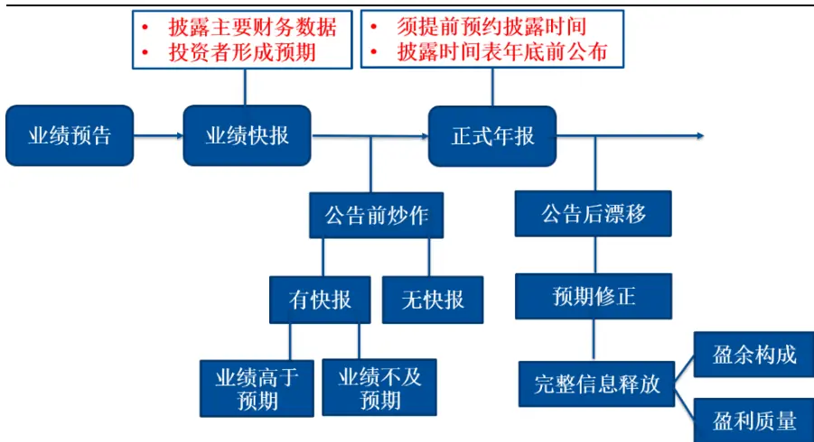
数据来源：国泰君安证券研究、Wind资讯

首先发布的是业绩预告。对于中小板和创业板公司，业绩预告是强制性披露的，通常是在上一期定期报告中或采用临时公告的形式对本报告期进行业绩预告。对于主板上市的公司，预期下一期经营业绩可能出现亏损、扭亏为盈、净利润同比变动超过50%等，才需要披露业绩预告。多数业绩预告的披露时间在会计期间截止日期之前，主要是对公司当期净利润情况的预计，准确性相对较低。

业绩快报是为了提高信息披露的及时性和公平性，上市公司在会计期间结束后、正式报告公告前初步披露未经注册会计师审计的主要会计数据和经营指标，披露时间介于快报和正式报告之间。上交所和深交所对于主板上市公司的快报披露不做强制性要求，但是对于中小板和创业板公司，如果他们年报的预约披露时间在 3-4 月，则需于 1-2 月先行披露业绩快报。

业绩快报中包含基本财务指标，如总利润、净利润、基本EPS等，信息准确度较高，与最终披露的正式报告之间具有高度一致性。因此，投资者能够基于业绩快报，对上市公司过去一个会计期间内的整体经营状况有个基本的把握，并对股价形成初步的预期。

最后压轴披露的是正式报告。对于所有沪深两市的上市公司，都必须于每年 4 月 30 日之前披露正式年报。在预约披露制度下，每家公司将于何时发布公告是一种公开信息，这就导致投资者存在针对即将发布的公告的预期炒作倾向。

正式公告披露之后，对于之前发布过快报的公司，投资者将根据正式报告中的相对信息增量进行预期修正，而对于之前没有发布过快报的公司，投资者应当更加期待正式报告。

因此，本报告分别从公告前和公告后两个角度，研究投资者在上市公司正式年报公布前后的反应。由于公告本身的作用是向市场传递信息，新信息的到来会给市场带来一定冲击，这种冲击的程度受原有信息不对称程度的影响，产生不同的市场反应。

## 1.2. 事件研究法简介

本报告采用标准的事件研究法（Event Study）捕捉上市公司公告事件对个股产生的影响。事件研究的难点在于难以寻找合适的比较基准，以反映个股受事件影响而产生的收益变动。而事件研究法的核心思想就是从个股原始收益中剥离出由事件本身产生的异常收益。异常收益的定义如下：

$$
AR_{it}=R_{it}-\widehat{R_{it}}
$$

其中 $R_{it}$ 为股票 i在 t 日的原始收益， $\widehat{R_{it}}$ 为正常收益，也即假设没有事件发生状态下的个股收益，需要运用一定的方法对其进行估计。

图 2 事件研究时间轴
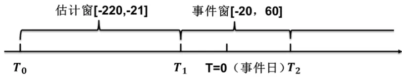

为了估计正常收益，我们把如图 2 所示的时间轴划分为三个部分，T=0为事件日，也即公告披露当天，将公告日前20日到公告后 60日的区间[-20，60]定义为时间窗，并假设事件对股价产生的影响主要集中在该时间范围内。事件前220 个交易日到21个交易日之间[-220，-21]被定义为估计窗，估计窗的主要作用就在于得到正常收益估计值所需参数，具体流程如下：

Step1. 用估计窗内的个股收益序列拟合因子模型，并计算相关因子载荷。在因子模型的选取上，本文选取最常用的Fama-French三因素模型，如式(1.1)所示。其中 为市场因子、 $SMB_{t}$ 为市值因子， 代表成长性因子，各因子的具体计算方法可参照 Fama and French(1993)。等式左边的 $R_{it}-r_{ft}$ 为股票 i在 t日的超额收益。

$$
R_{it}-r_{ft}=\beta_{i1}RMRF_{t}+\beta_{i2}SMB_{t}+\beta_{i3}HML_{t}+u_{it}~\tan{\ :(-220,-21)}\tag{1.1}
$$

通过估计窗内的数据拟合模型（1.1），我们可以得到各股在各因子上的因子载荷 的估计值。

Step2. 将估计窗内得到的 $\widehat{\beta_{\imath,{\tau}}}$ 、 $\widehat{\beta_{\imath1}}$ 、 $\widehat{\beta_{\imath2}}$ 和 $\widehat{\beta_{\imath3}}$ 带入到事件窗，计算正常收益$\widehat{R_{\iota t}}.$

$$
\widehat{R_{\iota t}}=\widehat{\beta_{\iota,0}}+\widehat{\beta_{\iota,1}}RMRF_{t}+\widehat{\beta_{\iota,2}}SMB_{i,t}+\widehat{\beta_{\iota,3}}HML_{i,t}\quad\mathrm{~t\in(-20,~60)~}\tag{1.2}
$$

（1.2）的含义是，在计算正常收益时，假设个股的因子载荷不变，对估计窗内得到的因子载荷估计值与事件窗内的实际因子表现计算相乘再相加。 $\widehat{R_{\iota t}}$ 为定价模型给出的个股 i在事件窗内t日的理论收益，不受外部事件的干扰。

Step3. 计算事件窗内的异常收益 $AR_{it}$ ：

$$
AR_{it}=R_{it}-\widehat{R_{\ it}}\tag{1.3}
$$

由于个股的实际收益中同时包含市场因素、风格因素以及事件驱动因素，计算异常收益的目的就是从原始收益中提取出由事件驱动产生的部分。

Step 4. 累计异常收益： $\begin{array}{r}{CAR_{i}=\sum_{t=1}^{T}AR_{it}.}\end{array}$ 。累计异常收益是异常收益的逐日累加。

## 2. 公告日附近异常交易表现

为了对公告日附近的异常收益和累计异常收益有个直观的把握，本文首先进行了全样本的统计分析。本文收集了从2009到2016年所有A 股上市公司发布正式年报的时间，剔除IPO首次发布公告的公司，共计 16540次公告。公告发布前 20 个交易日至后60个交易日的异常收益(AR)和累计异常收益（CAR）的表现统计如图 2 所示。

图 3 公告日附近的异常收益和累计异常收益
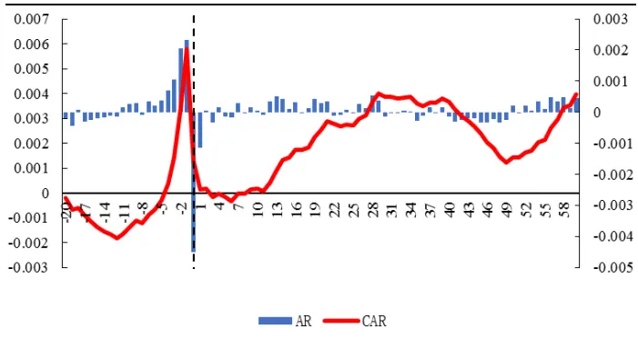
数据来源：国泰君安证券研究、Wind资讯

从图3可以看出，公告日附近的个股异常收益表现出一些有趣特征。在公告发布之前的几个交易日中，个股的异常收益为正，并随着公告日的临近不断提高，直到公告披露当天，异常收益突然由正转负，并且从量上来看，颇有消化前几日涨幅的态势。

从整个事件窗内异常收益的表现可以看出，对于可预期的公告披露事件，投资者倾向于在事前进行一波预期炒作，在公告日当天消息出尽，预期兑现，很可能发生踩踏。关于公告日当天的交易有一个细节值得一提:如果某上市公司的公告日为T，实际在上一个交易日收盘之后，该公司的公告就会披露在相关网站上。因此投资者有一晚上的时间消化报告内容，并在公告日当天开盘之前想好交易策略。

此外，从整体上来看，公告日后的异常收益没有表现出明显的规律，时正时负，并且围绕在0 值附近。这意味着就样本整体而言，公告后没有表现出一致性特征，这是因为市场对不同类型公告的反应有所差异。在报告的第4部分，我们会对全样本进行类别上的区分，以使得不同类型信息冲击导致差异化的市场反应规律清晰可见。

从图3中公告日附近的异常反应可以看出，在公告发布的当天以及随后两天，市场对公司的反应较为负面，应尽量避免。因此本报告以公告日为界，分别从公告前和公告后两个角度研究可行的交易策略。从实际操作上来看，分两次交易虽然会引致额外的交易成本，但是却可以巧妙规避公告日当天股价的大概率下跌。

## 3. 公告前预期炒作

在证券市场上，信息对股价波动有着非常重要的影响。上市公司发布公告的主要目的是向市场传递信息，历史经验表明，公告中披露的经营业绩，特别是盈利状况是投资者判断公司内在价值和相对价格高低的重要参考。

对于这种重大信息的发布，投资者的关注程度相对较高，对于一些可能发布利好消息的股票标的，投资者希望能在利好消息公开之前买入。特别是对于信息发布时间提前可知的情况，更容易导致提前反应。这种提前反应是一种博弈过程，存在以下两种情形：

1. 假设市场上只有两类投资者 A 和 B，A 投资者具有关于上市公司即将发布利好消息的私有信息，于是在市场上提前买入该公司股票，投资者B虽然没有私有信息，但可以观察到A 投资者的买入行为，推测其私有信息类型，并进行跟随性的买入交易。

2. A 投资者没有任何私有信息，但是在市场上购入上市公司股票虚张声势，让投资者B以为其具有正面的私有信息，从而跟风买入。

以上两种简单的博弈行为都会导致股价在公告之前的一波上涨，这种行为也称为公告前的预期炒作。如果投资者能够在博弈的相对前端，提前布局相关标的，则可获得短期收益。

## 3.1.公告预约披露时间的秘密

并非所有上市公司都有相同的预期炒作空间。在做空机制缺乏的市场中，只有那些更高概率发布好消息的公司才更有可能提起投资者的买入热情。

之前有研究发现，年报披露时间越是靠前的公司，公告好消息的可能性就越高。从上市公司的角度而言，如果上一期业绩靓丽，会迫不及待地向市场公布喜讯，而如果公司上一期的经营业绩不尽如人意，对坏消息的公布可能会心存顾虑。

在预约报告披露制度下，每一家上市公司必须于会计期末前向上交所/深交所预约其正式报告披露时间，之后沪深交易所将汇总并公告所有上市公司披露报告的时间表。依据时间表的安排，我们分别计算每一期预约披露时间相对靠前的 5%、10%以及 20%的公司从公告前 20个交易日到公告前1个交易日的累计异常收益表现，如图 4所示。

图 4 预约时间靠前公司的公告前累计异常收益
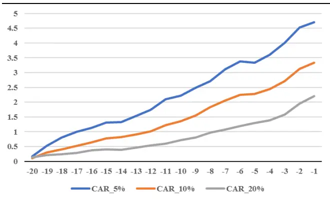
数据来源：国泰君安证券研究、Wind资讯

蓝色曲线、橙色曲线和灰色曲线分别代表每一期公告预约时间处于前5%、10%和20%的公司在公告前的累计异常收益表现。计算该收益时存在以下两个方面的细节:其一，在预约披露时间公开以后，少数上市公司会临时变更实际披露时间，为了避免后视性偏差，我们均以沪深交易所公布的首次预约日期为准；其二，有些公司于一月中上旬公布报告，从实战的角度来看，必须待到公告披露时间表公布之后才能进行买入操作，因此无法做到提前 20 个交易日买入。对于这种样本，我们选取时间表披露日期作为买入时点，并计算持有到公告前一交易日的收益表现。

总体来看，不论选取的样本容量多少，累计异常收益都随着公告日的临近而增长，但是随着样本容量的增加，累计异常收益曲线的斜率也在衰减。表1统计了三类样本在公告前 20个交易日的累计收益和胜率表现。

表 1：预约时间靠前公司的公告前 20交易日累计收益、胜率统计

| CAR_5% | CAR_10% | CAR_20% |
| --- | --- | --- |
| CAR（%） | 3.1 | 2.2 |
| 3.8 T值 9.6 | 10.3 | 11.2 |
| CUMRET（%） 8.6 | 8.2 | 7.3 |
| 胜率（%） 72.8 | 71.8 | 69.3 |

数据来源：国泰君安证券研究、Wind资讯

预约披露时间最为靠前的 5%的公司的累计异常收益为 3.8%，如果样本容量扩大四倍，选取前 20%的公司，则CAR 降低到2.2%。从第三行的绝对收益来看，假设自公告前 20 个交易日买入并持有到公告前一天，平均可获得8%左右的收益，并且该收益在不同样本容量之间相对稳定。

图 5 分年度公告前 CAR_10%表现
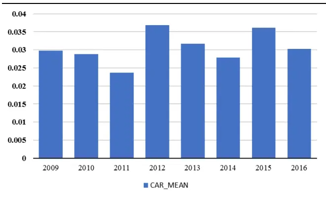
数据来源：国泰君安证券研究、Wind资讯

图5统计了不同年度预约披露时间相对靠前的10%样本在公告前的累计异常收益表现。图中可以看到，CAR 在各年间的表现稳定，均围绕在3%上下变动。

## 3.2.信息非对称性与炒作热情

公告前炒作的基础是信息不确定性，对于即将到来的信息，不可预测性越强，被炒作的可能性就越大。鉴于此，本文选取上市公司是否有分析师覆盖作为信息非对称性的代理变量，将公告预约披露时间处于前 10%的公司按照是否有分析师覆盖划分为两组，分别计算其累计异常收益,如图6所示。

图 6 分析师覆盖分组的 CAR_10%
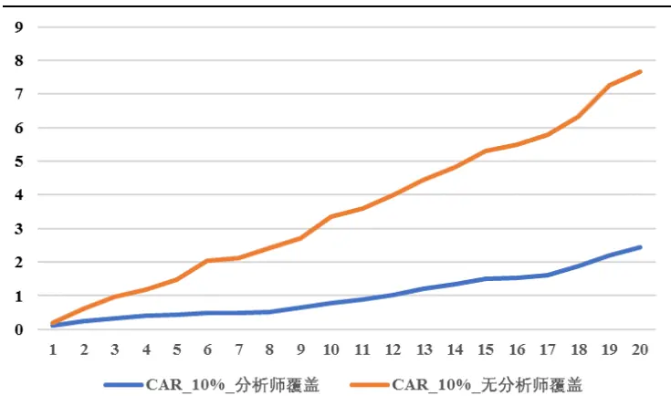
数据来源：国泰君安证券研究、Wind资讯

从图6中可以看出，由无分析师覆盖所代表的信息非对称性更强的分组中，公告前累计异常收益的表现更加突出，而对于分析师覆盖的个股样本，其公告前的累计异常收益并不十分显著。表2的第二列和第三列分别统计了没有分析师覆盖的个股子样本以及有分析师覆盖的个股样本的累计异常收益、绝对收益以及胜率表现。不论从 CAR、CUMRET 还是胜率的角度来看，没有分析师覆盖的样本在公告前的表现均更优，表示该类样本具有更高的投资价值。

表 2：分析师覆盖分组的收益、胜率统计

|  | 没有分析师覆盖 | 有分析师覆盖 |
| --- | --- | --- |
| CAR(%)均值 | 4.8 | 2.3 |
| T值 | 7.8 | 7.5 |
| CUMRET(%)均值 | 11.0 | 7.0 |
| 胜率（%） | 78.1 | 69.1 |

数据来源：国泰君安证券研究、Wind资讯

本节针对公告前市场上投资者的行为特征构建了相关交易策略。由于公告前的市场反应主要来自预期炒作，在过度自信和跟随性交易的影响下，很容易发生炒作过度的情形，因此公告当天消息出尽之后大概率会发生股价回调的现象，应该尽量避免。

## 4. 公告后漂移

公告之后的交易机会多来自公告后漂移（PEAD）。在有效市场假设下，市场对公开信息应该立刻完全反应，但现实中，受制于投资者的有限关注和信息传播缺乏效率，市场对新信息的理解和消化可能存在一定滞后。因此，针对上市公司公告的利好消息，股价可能不会在消息到来之时迅速调整到合理水平，而是短期内反应不足，在之后的一段之间里保持持续上涨的态势，公告后漂移作为一种市场异象，反映的是投资者对信息反应迟缓、反应不足的现象，合理把握的情况下我们可以利用这种市场失灵获利。

## 4.1.预期冲击与修正

通过上文中图1的表现可以看出，就样本整体而言，公告日后不存在明显的漂移特征，但并不能由此得到正式公告之后不存在交易机会的结论。整体上的无特征可能是因为将具有不同特征的样本混合在一起导致的。

本节选取两个重要切入点——公告前快报发布情况以及实际公告类型进行样本切割，以探究不同类型公告发布之后的市场反应，并以此寻找切实可行的交易机会。

## 4.1.1. 报告类型划分标准

上文对公司发布盈余公告流程的描述中曾提到，一些公司会在正式公告之前披露业绩快报。业绩快报中披露了未经审计的基本财务数据，包括总收入、总利润、基本每股收益、总资产、净资产收益率等。这些指标与最终披露的正式报告中相应指标数值上具有高度一致性。

因此，投资者可以根据业绩快报的内容，对公司在上一会计期间的经营状况有个整体上的把握。换而言之，业绩快报的公布能够帮助投资者对股价形成初步的预期。而对于正式报告之前发布过以及没有发布过快报的公司，正式公告对市场产生的信息冲击应该有所不同。

其次，上市公司发布的公告向市场传递的消息类型也直接影响市场对公告的反应。我们根据未预期盈余的方向，将正式公告划分成超预期和不及预期两种类型。

本报告使用公告实际 EPS与预期EPS 之间的差距代表未预期盈余。关于预期 EPS 的定义，对于有分析师覆盖的公司，则使用截止会计期末的Wind 分析师一致预测 EPS 作为市场对 EPS 的预期，如果公司尚无分析师覆盖，则简单使用第三季度报告中 EPS 乘以三分之四作为年报 EPS预期值，这样计算的未预期 EPS 指标基本覆盖所有公告公司。

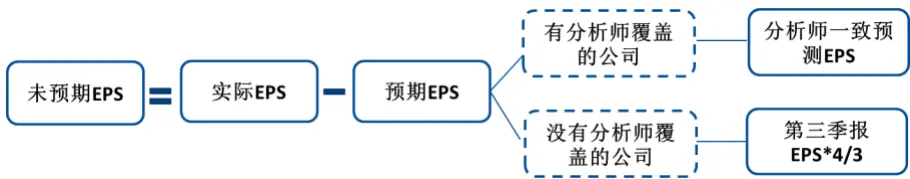

为了避免参数优化顾虑，我们简单将未预期盈余大于 0 的公告样本定义为超预期，剩余部分样本定义为不及预期。样本期内各年发布快报的公司占比和报告超预期的占比分别统计在表3 的第二和第三行中。

表 3：上市公司发布快报以及正式公告类型样本比例

| 时间 | 2009 | 2010 | 2011 | 2012 | 2013 | 2014 | 2015 | 2016 |
| --- | --- | --- | --- | --- | --- | --- | --- | --- |
| 快报发布比率% | 19.22 | 22.6 | 30.14 | 40.49 | 49.04 | 48.65 | 50 | 50.52 |
| 超预期比例% | 31.48 | 43.03 | 41.22 | 31.12 | 35.57 | 34.75 | 32.74 | 33.09 |

数据来源：国泰君安证券研究、Wind 资讯

从每年的快报发布比率可以看出，正式报告之前发布快报的公司在市场中的占比逐年增加，与市场不断加强公平、透明的监管方向相一致。正式报告超预期的比例一直稳定在30%-40%之间，这也从侧面反映出分析师给出的EPS预测值整体存在向上偏误。

## 4.1.2. 不同类型公告的公告日附近异常收益表现

我们根据正式公告之前是否发布过快报以及报告消息类型的不同将样本期内的全部公告样本划分成四个子样本，分别观察市场在公告前 20个交易日至公告后60 个交易日对不同类型正式公告的反应。

图 7 无快报、不及预期正式公告样本 CAR表现
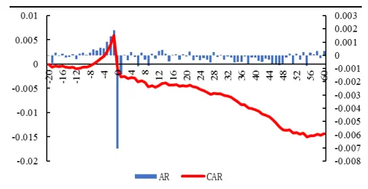
数据来源：国泰君安证券研究、Wind资讯

图 8 无快报、超预期正式公告样本 CAR表现
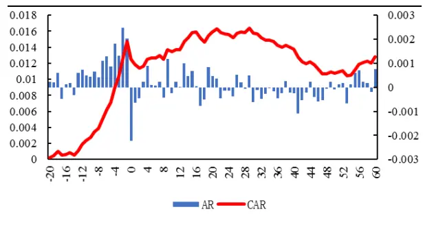
数据来源：国泰君安证券研究、Wind 资讯

图 9 有快报、不及预期正式公告样本 CAR表现
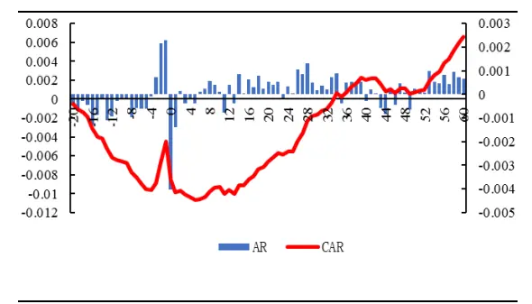
数据来源：国泰君安证券研究、Wind资讯

图10 有快报、超预期正式公告样本 CAR表现
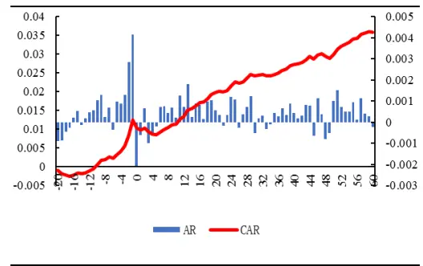
数据来源：国泰君安证券研究、Wind资讯

图 7-图 10 的区域划分情况如下：上下两组以正式公告之前有无快报为划分标准，左右两组以正式公告消息类型为划分标准。四张图表示的四种情况下，公告日附近的市场反应具有不同特征。

正式报告之前没有发布过快报，并且报告不及预期的公告样本在公告前20日到公告后60日的(累计)异常收益表现情况如图7 所示。当公司公告不及预期，除了公告日当天市场对其产生明显的负向反应之外，在公告后的一段时间里，还存在持续的负向异常收益，从而产生向下的公告后漂移。

与之相对应的是同样没有发布过业绩快报的样本，但是公告超预期的情况。图 8中值得一提的是公告前反应，虽然没有发布业绩快报的公司缺少公告前预期，但是对比图 7 和图 8，市场对公司即将发布的正式公告类型并非一无所知，超预期的公告前炒作明显相对更加剧烈，并且公告后的累计异常收益没有进一步上涨的空间，这意味着好消息对市场的冲击已经在公告前反应完毕。

图 9 和图 10 分别展示了之前发布过业绩快报的公司，正式公告不及预期以及超预期情况下的市场反应。从公告后的异常收益表现来看，不论公告不及预期还是超预期的公司，都存在正向的公告后漂移。

公告内容不及预期的样本在公告后持续走高的累计异常收益直观上有些难以理解，有必要进一步究其原因。考虑到这些公告样本在正式公告之前都发布过快报，很自然地对快报公布日附近的市场反应产生好奇。

图11和图 12分别展示了不及预期以及超预期的快报公告日附近的市场反应。对比图11 和图 12的表现，市场对不及预期快报产生了强烈的负向反应，这种反应从公告前一直持续到公告后。而如果发布的快报超预期，市场只在公告当天给予了正面反应。综合来看，市场对两类报告存在非对称性反应。

图 11 快报不及预期的CAR表现
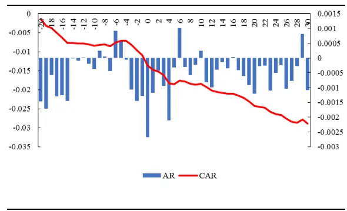
数据来源：国泰君安证券研究、Wind资讯

图 12 快报不及预期的CAR表现
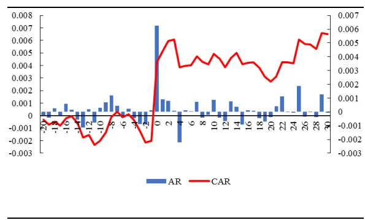
数据来源：国泰君安证券研究、Wind资讯

市场对两类快报的异质性反应可能来源于投资者对不同类型报告的理解差异。如果上市公司发布的公告不及预期，大家通常对信息的真实准确程度不予怀疑，因为上市公司理论上不存在故意做低利润的动机。但是对于超预期的公告，则可能心存疑虑，愿意等待收集更多信息之后再进行投资决策。这种心理导致了投资者对不及预期的快报过度反应，而对超预期快报反应不足。

因此图9 快报之后的正式公告样本中，对于公告不及预期的公司，累计异常收益表现为先下探，再回升，呈现V 字形特征。这种V字反转来源于对快报负面消息过度反应的修正，也包括预期修正。

而对于公告超预期的公司，公告前和公告后的累计异常收益都保持上升趋势，表现为好消息被逐渐消化的过程。从超预期快报公告日前后的市场反应可以看出，对于这类公司，快报的反应是相对不足的，公告后漂移的表现反应出市场对正式公告的反应亦是如此。这是因为被要求发布快报的公司其信息透明度相对较低，投资者在快报有限信息的条件下，持有谨慎的交易态度，等正式公告披露之后，消息才被逐渐消化反应。

虽然之前发布过快报的公司，不论实际公告超预期还是不及预期，都存在公告后向上漂移，但是从漂移的稳定性和力度来看，超预期的公告样本均更优。

我们将之前发布过快报并且正式公告超预期的样本筛选出来，与剩余公告样本进行对比，分别计算两组样本在公告后 60 个交易日的累计异常收益，如图 13 所示。两组样本对比可以发现，公告后漂移现象主要集中在有快报、超预期的样本中。剩余样本的公告后 CAR 围绕 0 轴上下波动，没有明显的漂移特征。

图 13 有快报、超预期公告样本相对其他样本的 CAR表现
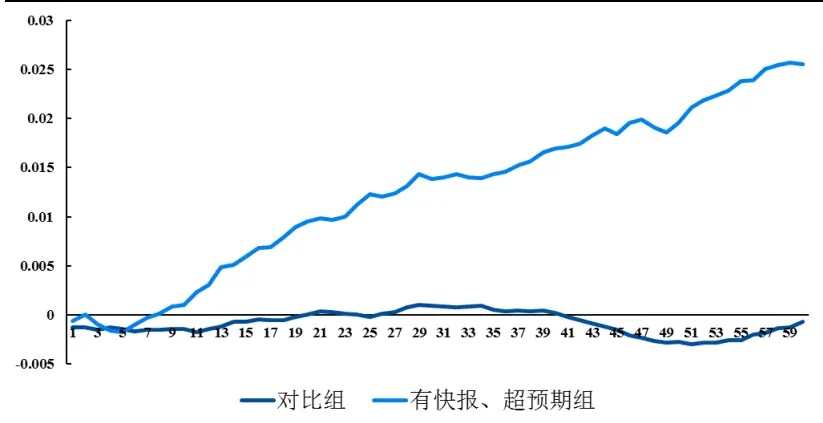
数据来源：国泰君安证券研究、Wind资讯

表 4 统计了有快报、超预期样本在公告后 60 个交易日的累计异常收益相关统计量。截至公告后 60 日，CAR 的均值为 2.01%，T 值为 4.35，统计上显著。

表 4： 有快报、超预期公告样本的公告后 CAR 表现

| 事件日 | 1 | 2 | 3 | 4 | 5 | 6 | 7 | 8 | 9 | 10 | 20 | 30 | 40 | 50 | 60 |
| --- | --- | --- | --- | --- | --- | --- | --- | --- | --- | --- | --- | --- | --- | --- | --- |
| 观测数 | 1971 | 1967 | 1972 | 1974 | 1973 | 1972 | 1974 | 1974 | 1976 | 1976 | 1919 | 1921 | 1901 | 1877 | 1896 |
| 平均值 | -0.06 | -0.01 | -0.12 | -0.19 | -0.21 | -0.14 | -0.06 | -0.04 | 0.02 | 0.01 | 0.81 | 1.01 | 1.42 | 1.58 | 2.01 |
| T值 | -1.03 | -0.1 | -1.16 | -1.55 | -1.49 | -0.94 | -0.39 | -0.22 | 0.12 | 0.07 | 2.98 | 3.05 | 3.69 | 3.63 | 4.35 |

数据来源：国泰君安证券研究、Wind 资讯

进一步观察 CAR 在不同年份的表现是否存在差异性特征，样本期内各年的平均 CAR 统计如图 14。除 2009 年之外，其余年份的 CAR 均为正值，表现相对稳定，2009 年 CAR 表现为负主要原因是当年符合筛选条件的公告样本较少，一共只有 70个左右，容易受到极端值的影响。

图 14 有快报、超预期公告样本分年度统计 CAR均值
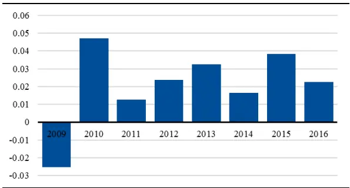
数据来源：国泰君安证券研究、Wind资讯

## 4.2.谁在主导公告后漂移？——机构 vs.个人

上一节的实证结果证明，公告后漂移主要集中在之前发布过快报、并且正式公告内容超预期的样本中，如果想要从这些样本中精选出一些公告后漂移更加明显从而更加适合投资交易的样本，就必须回归到公告后漂移的来源。

上文曾提到公告后漂移现象的产生原因是投资者对信息的反应较慢，新信息从发布到被市场完全消化需要一定的过程。什么样的公告对市场产生的信息冲击更大？什么样的投资者对信息的消化速度更慢呢？

一般而言，我们将市场上的投资者分为两类——机构 vs.个人，公告对不同类型投资者所主导的个股产生的信息冲击不同。机构相对个人，通常具有更强的信息获取和分析能力，他们通过调研、相关分析师跟踪，对上市公司的经营状况有着持续性的把握，一方面使得定期报告产生的信息冲击相对较小，另一方面使其对新信息的消化能力也相对较强。因此，如果某股票较多的被机构持有，则产生公告后漂移的可能性也相对较弱。

鉴于此，本文参考正式公告中披露的前十大流通股东中机构投资占比，将机构占比较高的样本从原样本中剔除，观察公告后漂移产生的异常收益是否存在进一步提高的可能性。

表 5: 剔除机构投资占比较高样本的 CAR表现

| 剔除范围 CAR (%) | 胜率(%) | 平均收益(%) | 样本数 |
| --- | --- | --- | --- |
| >0.3 3.49 | 57.6 | 10.6 | 1050 |
| >0.25 | 3.76 58.1 | 11 | 965 |
| >0.2 | 4.3 58.9 | 11.2 | 868 |
| >0.15 | 4.7 59.6 | 11.2 | 757 |
| >0.1 | 4.35 61% | 11.1 | 589 |

数据来源：国泰君安证券研究、Wind资讯

表5统计的是根据前十大流通股东中机构投资占比，在之前发布过快报、正式公告超预期的样本中分别剔除占比超过30%、25%一直到10%的样本。可以看出，阈值设定得越低，删除的样本就越多，剩余样本中机构参与投资的就越少，CAR也就越高，意味着公告后漂移主要由个人主导。但是绝对收益在样本间的表现不太明显，稳定在11%附近。

## 5. 总结与后续研究展望

## 5.1. 总结

本报告以上市公司发布的正式财务报告（年报）为研究对象，采用事件研究法，观察市场在公告日附近的反应，寻找规律以及潜在交易机会。

在预约披露制度下，所有上市公司披露正式公告的日期是公开信息，针对这种发生时间提前确定的事件，难免产生事前的预期炒作。考虑到公告预约披露时间相对靠前的公司，公告利好消息的可能性相对更高，在预期炒作的作用下，股价容易被推高。特别是对于本身信息不对称性更加严重的样本标的，投资者炒作的热情更加高涨，在公告前能产生更显著的异常收益。

公告前炒作通常会将股价推至相对高位，待公告日当天消息出尽，预期

兑现，股价大概率会向下调整，产生显著的负向超额收益。

从公告披露之后的异常收益表现来看，公告后漂移主要包含在之前发布过快报，并且实际公告内容超预期的样本中。在机构参与投资较少的标的样本中，公告对市场产生的信息冲击相对更大，因此相应的公告后漂移更加明显。

## 5.2.后续研究展望

本报告主要以上市公司的正式年报为研究对象，而半年报和季度报却没有提及，因为相同的技术方法应用于半年报和季度报没有发现相似的规律性特征，可能因为投资者对其他报告的关注程度没有年报那么高，也不能排除其他报告本身还具有一定特殊性，有待我们进一步挖掘。

此外，本文研究盈余公告事件，但没有涉及公告内容。众所周知，除了简单的财务指标外，盈余公告的信息含量十分丰富，盈利构成、盈余质量等都是判断公司价值的重要参考。但是投资者，特别是个体投资者对这些深层次财务指标的消化和理解需要更长的时间，不适合作为短期事件研究的对象，而更适合作为定价因子考察其对股价的长期影响。

## 本公司具有中国证监会核准的证券投资咨询业务资格

## 分析师声明

作者具有中国证券业协会授予的证券投资咨询执业资格或相当的专业胜任能力，保证报告所采用的数据均来自合规渠道，分析逻辑基于作者的职业理解，本报告清晰准确地反映了作者的研究观点，力求独立、客观和公正，结论不受任何第三方的授意或影响，特此声明。

## 免责声明

本报告仅供国泰君安证券股份有限公司（以下简称“本公司”）的客户使用。本公司不会因接收人收到本报告而视其为本公司的当然客户。本报告仅在相关法律许可的情况下发放，并仅为提供信息而发放，概不构成任何广告。

本报告的信息来源于已公开的资料，本公司对该等信息的准确性、完整性或可靠性不作任何保证。本报告所载的资料、意见及推测仅反映本公司于发布本报告当日的判断，本报告所指的证券或投资标的的价格、价值及投资收入可升可跌。过往表现不应作为日后的表现依据。在不同时期，本公司可发出与本报告所载资料、意见及推测不一致的报告。本公司不保证本报告所含信息保持在最新状态。同时，本公司对本报告所含信息可在不发出通知的情形下做出修改，投资者应当自行关注相应的更新或修改。

本报告中所指的投资及服务可能不适合个别客户，不构成客户私人咨询建议。在任何情况下，本报告中的信息或所表述的意见均不构成对任何人的投资建议。在任何情况下，本公司、本公司员工或者关联机构不承诺投资者一定获利，不与投资者分享投资收益，也不对任何人因使用本报告中的任何内容所引致的任何损失负任何责任。投资者务必注意，其据此做出的任何投资决策与本公司、本公司员工或者关联机构无关。

本公司利用信息隔离墙控制内部一个或多个领域、部门或关联机构之间的信息流动。因此，投资者应注意，在法律许可的情况下，本公司及其所属关联机构可能会持有报告中提到的公司所发行的证券或期权并进行证券或期权交易，也可能为这些公司提供或者争取提供投资银行、财务顾问或者金融产品等相关服务。在法律许可的情况下，本公司的员工可能担任本报告所提到的公司的董事。

市场有风险，投资需谨慎。投资者不应将本报告作为作出投资决策的唯一参考因素，亦不应认为本报告可以取代自己的判断。
在决定投资前，如有需要，投资者务必向专业人士咨询并谨慎决策。

本报告版权仅为本公司所有，未经书面许可，任何机构和个人不得以任何形式翻版、复制、发表或引用。如征得本公司同意进行引用、刊发的，需在允许的范围内使用，并注明出处为“国泰君安证券研究”，且不得对本报告进行任何有悖原意的引用、删节和修改。

若本公司以外的其他机构（以下简称“该机构”）发送本报告，则由该机构独自为此发送行为负责。通过此途径获得本报告的投资者应自行联系该机构以要求获悉更详细信息或进而交易本报告中提及的证券。本报告不构成本公司向该机构之客户提供的投资建议，本公司、本公司员工或者关联机构亦不为该机构之客户因使用本报告或报告所载内容引起的任何损失承担任何责任。

## 评级说明

## 1.投资建议的比较标准

投资评级分为股票评级和行业评级。

以报告发布后的12个月内的市场表现为比较标准，报告发布日后的 12个月内的公司股价（或行业指数）的涨跌幅相对同期的沪深 300 指数涨跌幅为基准。

## 2.投资建议的评级标准

报告发布日后的 12 个月内的公司股价（或行业指数）的涨跌幅相对同期的沪深 300 指数的涨跌幅。

|  | 评级 | 说明 |
| --- | --- | --- |
| 股票投资评级 | 增持 | 相对沪深300指数涨幅15%以上 |
|  | 谨慎增持 | 相对沪深300指数涨幅介于5%～15%之间 |
|  | 中性 | 相对沪深300指数涨幅介于-5%～5% |
|  | 减持 | 相对沪深 300指数下跌 5%以上 |
| 行业投资评级 | 增持 | 明显强于沪深 300 指数 |
|  | 中性 | 基本与沪深300指数持平 |
|  | 减持 | 明显弱于沪深300指数 |

## 国泰君安证券研究所

|  | 上海 | 深圳 | 北京 |
| --- | --- | --- | --- |
| 地址 | 上海市浦东新区银城中路168号上海 银行大厦29层 | 深圳市福田区益田路 6009号新世界 商务中心34层 | 北京市西城区金融大街 28 号盈泰中 心2号楼10层 |
| 邮编 | 200120 | 518026 | 100140 |
| 电话 | （021)38676666 | （0755）23976888 | (010)59312799 |
|  | E-mail: gtjaresearch@gtjas.com |  |  |