# 板块及行业指数价格分段研究

# ——数量化专题之九十六

刘富兵（分析师）

8 021-38676673

liufubing008481@gtjas.com

证书编号 S0880511010017

## 本报告导读：

从“走势结构”新的视角出发，研究板块、行业择时问题，以指导板块、行业轮动投资。

## 摘要：

le_Summary]从“走势结构”新视角出发，研究板块、行业轮动投资，搭建基于MACD价格分段的板块、行业择时体系。我们将基于 MACD的价格分段体系推广到板块、行业择时研究中，从“单个指数”以及“多指数关联”两方面总结规律，以指导板块、行业轮动投资。

“单指数”角度：研究板块指数、行业指数日线级别对应 30分钟级别段数统计规律，指导短中期投资。研究发现，大多数板块指数（如上证综指、上证 50、中小板指、创业板指等 4 个板块指数）日线级别在其对应的30分钟级别走势上出现 7 段时大概率会反转；大多数行业指数（如钢铁、建筑、电力设备、国防军工、汽车、银行、非银行金融等22个行业指数）日线级别在其对应的 30分钟级别走势上出现5、7或9段时大概率会反转。

“多指数”角度：进行“结构关联”研究，通过定义“波段跟随确认”，研究两指数“日线级别波段跟随确认”规律，以探寻板块、行业在短中期走势中强确定性的投资机会。

“波段跟随确认规律”之一——强确定性机会：在某一个指数 A 日线级别确认后，指数B具有极高概率（接近或等于 100%）会跟随确认，强调可投资深度。对于板块指数（基准指数A-跟随指数B），沪深300-上证综指，深证成指-上证综指、沪深300，中小板指-中证 500，中证 500-中小板指、上证综指等；对于行业指数，家电-煤炭、轻工制造，医药-交通运输、计算机等。

“波段跟随确认规律”之二——领先指示器：某一指数 A 日线级别确认后，绝大部分指数往往会跟随其确认，强调可投资广度。对于板块指数，沪深300、深证成指日线级别确认后，其余大部分板块指数会跟随其确认；对于行业指数，家电、机械、通信、商贸零售等日线级别确认后，均有10个以上的行业指数大概率会跟随其确认。

“波段跟随确认规律”之三——独立行情，某一指数 A 往往不会跟随其他指数确认，此外，在 A 指数确认后，其余指数也往往不会跟随 A 确认，提示可投资误区。对于板块指数，有创业板指；对于行业指数，有石油化工、银行。

跟随确认收益空间测算：选取历史收益空间大于1%的案例，对于板块指数（21个样本），平均跟随确认概率 87%，操作时间平均为 9.13个交易日，收益空间平均为 2.14%；对于行业指数（197 个样本），平均跟随确认概率为78%，操作时间平均为11.19个交易日，收益空间平均为 2.07%。

刘富兵：（分析师）

电话：021-38676673

邮箱：liufubing008481@gtjas.com

证书编号：S0880511010017

## 陈奥林：（分析师）

电话：021-38674835

邮箱：chenaolin@gtjas.com

证书编号：S0880516100001

## 李辰：（分析师）

电话：021-38677309

邮箱：lichen@gtjas.com

证书编号：S0880516050003

## 孟繁雪：（分析师）

电话：021-38675860

邮箱：mengfanxue@gtjas.com

证书编号：S0880517040005

## 蔡旻昊：（研究助理）

电话：021-38674743

邮箱：caiminhao@gtjas.com

证书编号：S0880117030051

## 殷明：（研究助理）

电话：021-38674637

邮箱：yinming@gtjas.com

证书编号：S0880116070042

## 叶尔乐：（研究助理）

电话：021-38032032

邮箱：yeerle@gtjas.com

证书编号：S0880116080361

## [Table_R相关报告

《基于信息冲击视角的盈余公告效应研究》2017.07.04

《回撤控制下的最优化大类资产配置策略》2017.07.03

《基于短周期价量特征的多因子选股体系》2017.06.15

《基于短周期价量特征的多因子选股体系》2017.06.01

《基于动态模分解的价格模式挖掘》2017.05.15

## 1. 引言

基于 MACD 的价格分段是一套应用于指数拐点以及走势延续判断的择时体系：其基于MACD的 DEA 指标对指数进行波段量化划分，并在此基础上研究总结指数周线、日线与 30 分钟等不同级别走势之间的对应关系规律，以指导投资。该体系具有较高的稳定性，近三年来，我们量化周报择时观点的准确率充分体现了这一体系在择时研究上的有效性。

此外，在使用过程中，我们逐渐发现该体系具有较强的延展性。去年，我们在原有体系基础上，对分段涨跌幅、时间、速率进行了更精细的研究，并发现了“级别错位”、“阻击+突破”等结构异象，进一步提高了价格分段体系对于指数择时的准确率。

今年以来，我们将价格分段体系推广到行业指数的择时研究中，从而指导行业轮动投资，取得了不错的效果；除了针对单个指数的规律研究，我们还发现了多指数关联的规律：板块之间，以及行业之间在结构确认上往往不是同时的，而是存在某种“一先一后”结构上相互关联的规律。

对此，我们将有关研究成果进行整理，撰写为“板块、行业指数择时系列报告”。具体在本系列的第一篇报告中，我们将介绍：

- “不同级别走势对应规律”在板块以及行业择时上的应用方法（“单指数”角度）；

- 进行“结构关联”研究（“多指数”角度）：研究不同板块、不同行业走势结构之间的关联规律，挖掘板块、行业走势结构中确定性较强的投资机会。

基于“走势结构”视角对板块、行业择时问题进行研究尚属首次，希望能够在后续研究中逐步解决板块轮动、行业轮动难题。

## 2. 日线级别对应 30分钟级别段数统计

从“单指数”角度研究规律应用，在本篇报告中，我们主要从“日线级别与30 分钟级别段数”的统计规律上去探究，以指导板块、行业在短中期的投资。

## 2.1.板块指数篇

选取常用的7 个板块指数进行统计研究：上证综指、上证 50、沪深300、深证成指、中小板指、创业板指以及中证500。

## 2.1.1. 上证综指

2.1.1.1. 上证综指日线级别“上涨”对应 30分钟级别段数X概率密度

图 1上证综指日线级别上涨对应 30分钟级别段数主要集中在 1、3、5、7段
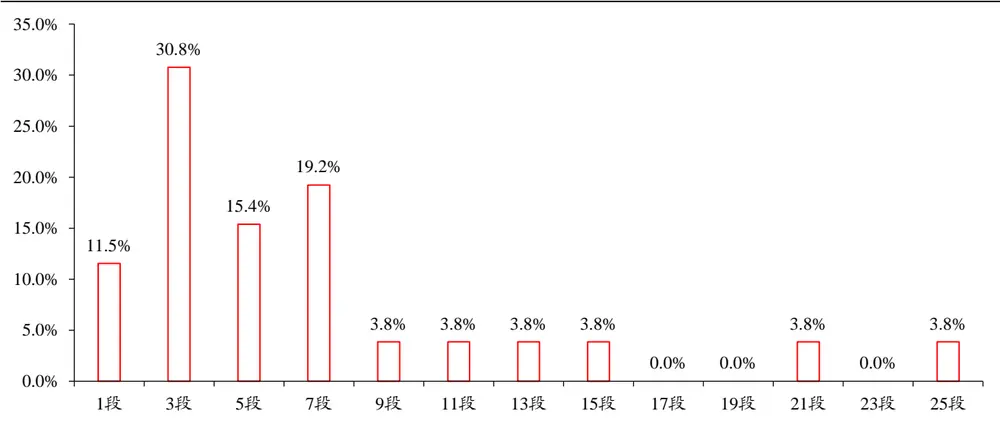
数据来源：Wind，国泰君安证券研究

X=1，3，5，7，9，11，13，15，21，25，日线一段上涨在 30分钟级别走势上出现的段数主要集中在 1、3、5、7 段，占比 77%。

## 2.1.1.2. 上证综指日线级别“下跌”对应 30分钟级别段数X概率密度

图 2上证综指日线级别下跌对应 30分钟级别段数主要集中在 1、3、5、7段
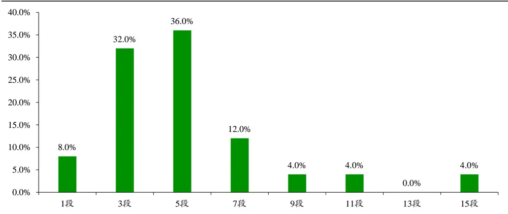
数据来源：Wind，国泰君安证券研究

X=1，3，5，7，9，11，15，日线一段下跌在30分钟级别走势上出现的段数主要集中在1、3、5、7 段，占比88%。

此外，Prob(X=1)=8.0%，所以日线级别的下跌，如果 30 分钟只走了一段则不能轻言见底，反弹后往往是第二次离场时机。

## 2.1.2. 上证 50

2.1.2.1. 上证 50 日线级别“上涨”对应 30分钟级别段数X概率密度

图 3上证 50日线级别上涨对应 30分钟级别段数主要集中在 1、3、5、7段
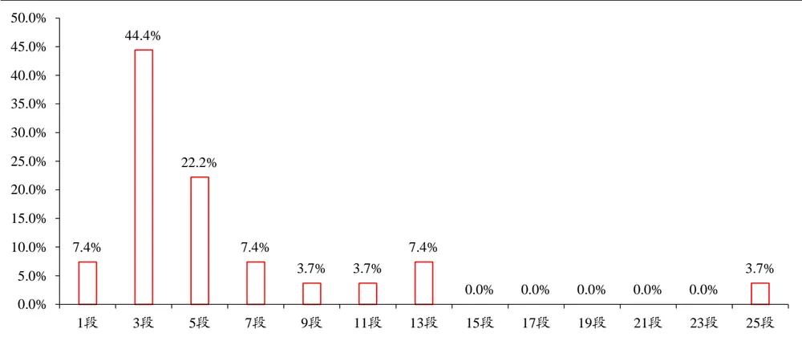
数据来源：Wind，国泰君安证券研究

X=1，3，5，7，9，11，13，25，日线一段上涨在 30分钟级别走势上出现的段数主要集中在 1、3、5、7 段，占比81%。

## 2.1.2.2. 上证 50 日线级别“下跌”对应 30分钟级别段数X概率密度

图 4上证 50日线级别下跌对应 30分钟级别段数主要集中在 1、3、5、7段
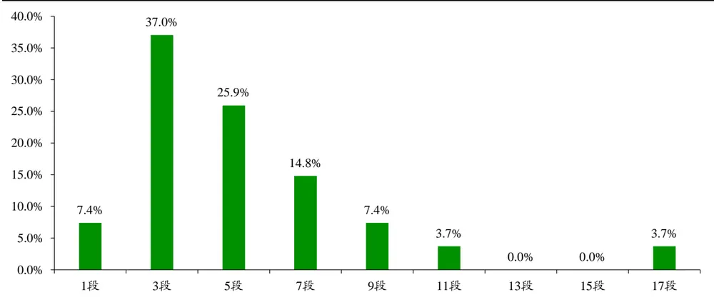
数据来源：Wind，国泰君安证券研究

X=1，3，5，7，9，11，17，日线一段下跌在30分钟级别走势上出现的段数主要集中在1、3、5、7 段，占比85%。

此外，可以发现，上涨与下跌均是Prob(X=1)=7.4%，所以无论日线级别的上涨还是下跌，如果 30分钟只走了一段则不能轻言见顶或者见底。

## 2.1.3. 沪深 300

## 2.1.3.1. 沪深 300日线级别“上涨”对应 30分钟级别段数X概率密度

图 5沪深 300日线级别上涨对应 30分钟级别段数主要集中在 1、3、5、7、9、11段
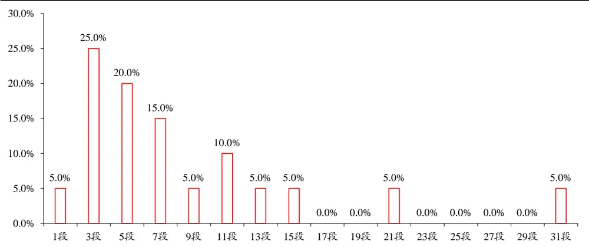
数据来源：Wind，国泰君安证券研究

X=1，3，5，7，9，11，13，15，21，31，日线一段上涨在 30分钟级别走势上出现的段数主要集中在 1、3、5、7、9、11段，占比80%。此外，Prob(X=1)=5%，所以日线级别的上涨，如果 30 分钟只走了一段则不能轻言见顶，往往会继续延续上涨。

## 2.1.3.2. 沪深 300日线级别“下跌”对应 30分钟级别段数X概率密度

图 6 沪深 300 日线级别下跌对应 30 分钟级别段数主要集中在 1、3、5、7 段
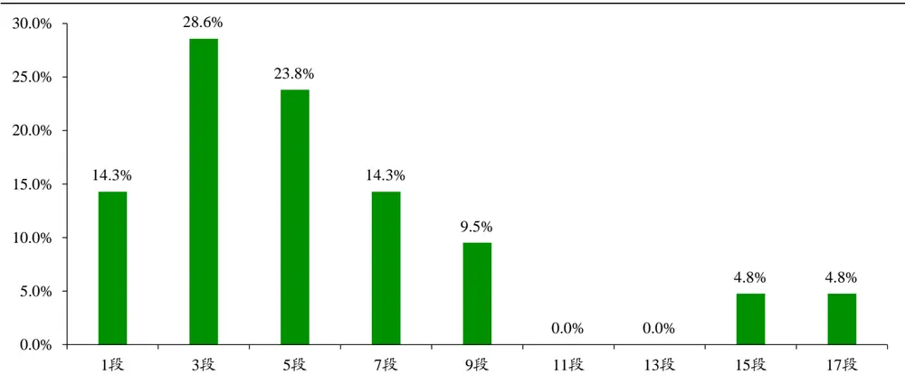
数据来源：Wind，国泰君安证券研究

X=1，3，5，7，9，15，17，日线一段下跌在30 分钟级别走势上出现的

段数主要集中在1、3、5、7 段，占比81%。

## 2.1.4. 深证成指

2.1.4.1. 深证成指日线级别“上涨”对应 30分钟级别段数X概率密度

图 7深证成指日线级别上涨对应 30分钟级别段数主要集中在 3、5、7、9、11段
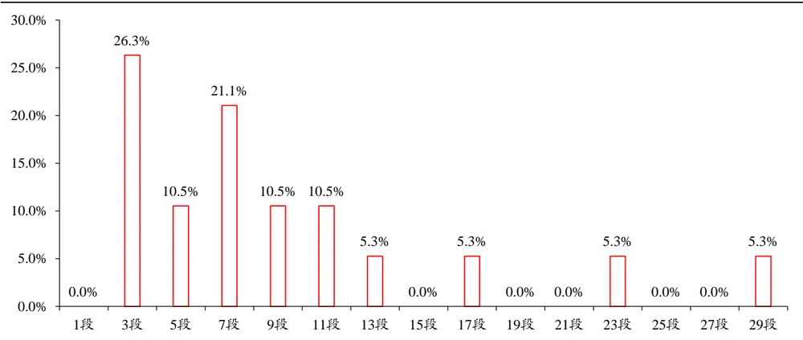
数据来源：Wind，国泰君安证券研究

X=3，5，7，9，11，13，17，23，29，日线一段上涨在 30 分钟级别走势上出现的段数主要集中在 3、5、7、9、11段，占比 79%。

此外，Prob(X=1)=0%，所以日线级别的上涨，如果 30 分钟只走了一段则不能轻言见顶，往往会继续延续上涨。

## 2.1.4.2. 深证成指日线级别“下跌”对应 30分钟级别段数X概率密度

图 8深证成指日线级别下跌对应 30分钟级别段数主要集中在 1、3、5、7段
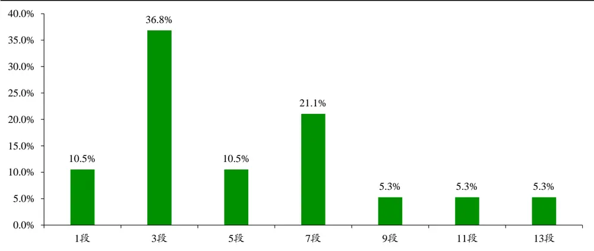

数据来源：Wind，国泰君安证券研究

X=3，5，7，9，11，13，17，23，29，日线一段下跌在 30 分钟级别走势上出现的段数主要集中在 1、3、5、7段，占比79%。

此外，Prob(X=1)=10.5%，所以日线级别的下跌，如果 30分钟只走了一段则不能轻言见底，反弹后往往是第二次离场时机。

## 2.1.5. 中小板指

2.1.5.1. 中小板指日线级别“上涨”对应 30分钟级别段数X概率密度

图 9中小板指日线级别上涨对应 30分钟级别段数主要集中在 1、3、5、7段
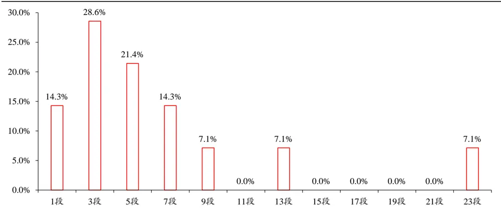
数据来源：Wind，国泰君安证券研究

X=1，3，5，7，9，13，23，日线一段上涨在30 分钟级别走势上出现的段数主要集中在 1、3、5、7 段，占比 79%。

2.1.5.2. 中小板指日线级别“下跌”对应 30分钟级别段数X概率密度

图 10中小板指日线级别下跌对应 30分钟级别段数主要集中在 1、3、5、7段
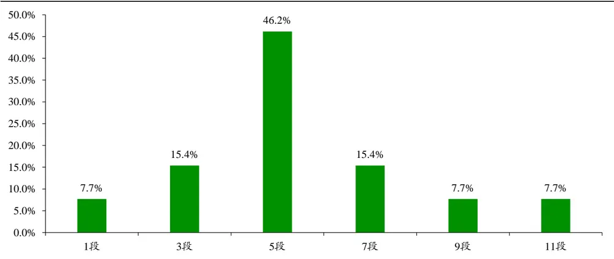
数据来源：Wind，国泰君安证券研究

X=1，3，5，7，9，11，日线一段下跌在30 分钟级别走势上出现的段数主要集中在1、3、5、7段，占比85%。

此外，Prob(X=1)=7.7%，所以日线级别的下跌，如果 30 分钟只走了一段则不能轻言见底，反弹后往往是第二次离场时机。

## 2.1.6. 创业板指

2.1.6.1. 创业板指日线级别“上涨”对应 30分钟级别段数X概率密度

图 11创业板指日线级别上涨对应 30分钟级别段数主要集中在 1、3、5、7段
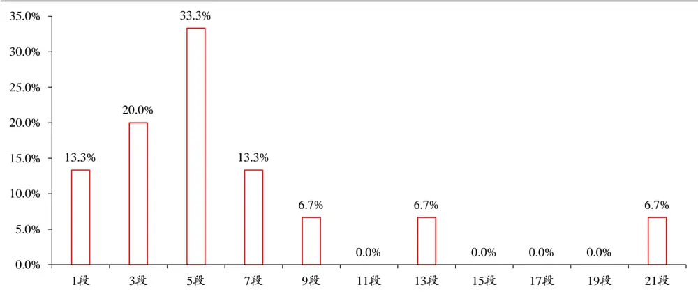
数据来源：Wind，国泰君安证券研究

X=1，3，5，7，9，13，21，日线一段上涨在30 分钟级别走势上出现的段数主要集中在1、3、5、7 段，占比80%。

2.1.6.2. 创业板指日线级别“下跌”对应 30分钟级别段数X概率密度

图 12创业板指日线级别下跌对应 30分钟级别段数主要集中在 1、3、5、7段
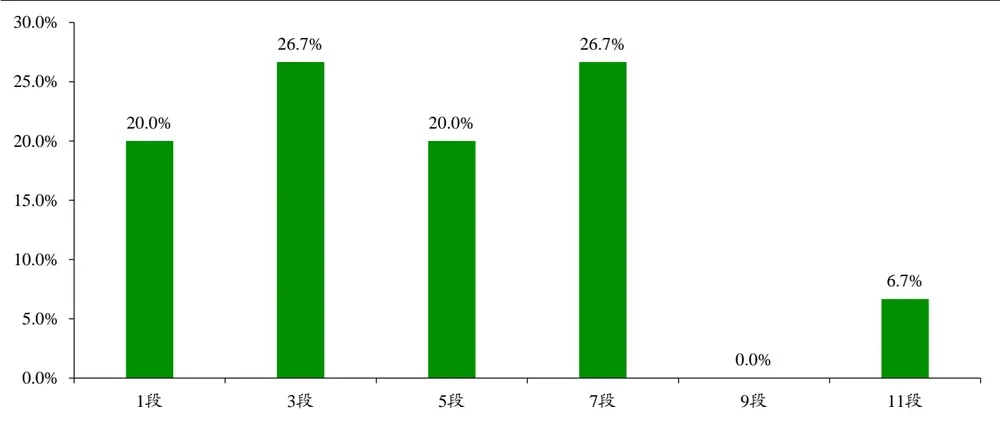
数据来源：Wind，国泰君安证券研究

X=1，3，5，7，11，日线一段下跌在 30 分钟级别走势上出现的段数主要集中在1、3、5、7 段，占比93%。

## 2.1.7. 中证 500

2.1.7.1. 中证 500日线级别“上涨”对应 30分钟级别段数X概率密度

图 13 中证 500 日线级别上涨对应 30 分钟级别段数主要集中在 1、3、7、11 段
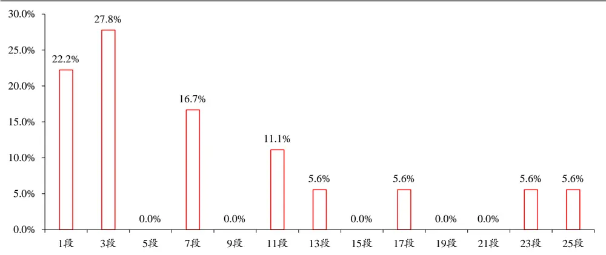
数据来源：Wind，国泰君安证券研究

X=1，3，7，11，13，17，23，25，日线一段上涨在 30分钟级别走势上出现的段数主要集中在 1、3、7、11 段，占比78%。

2.1.7.2. 中证 500日线级别“下跌”对应 30分钟级别段数X概率密度

图 14中证 500日线级别下跌对应 30分钟级别段数主要集中在 1、3、5、7段
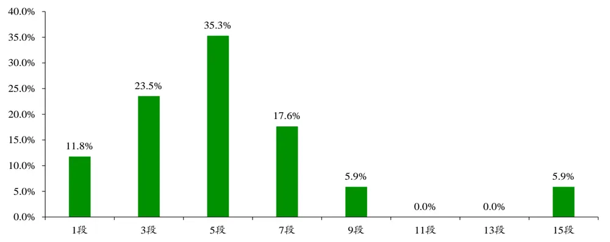
数据来源：Wind，国泰君安证券研究

X=1，3，5，7，9，15，日线一段下跌在30 分钟级别走势上出现的段数主要集中在1、3、5、7段，占比88%。

## 2.1.8. 规律总结

我们可以从上述“日线级别对应 30 分钟级别段数分布图”中提炼出两类信号，以指导投资：

顶（底）部信号指日线级别上涨（下跌）大概率（高于 80%）结束所对应30分钟级别的段数，当日线级别对应 30分钟级别段数走到这一段时，日线级别大概率会反转；

- 上涨（下跌）延续信号指日线级别上涨（下跌）大概率（高于90%）延续所对应30分钟级别的段数，当日线级别对应 30分钟级别段数走到这一段时，日线级别大概率会延续。

大部分板块指数的顶（底）部信号为 7段。通过下表可以发现，除了沪深300、深证成指以及中证 500的顶部信号为11段，其余指数的顶部信号均为7 段；此外，所有指数的底部信号均为7 段，这说明价格分段体系对于指数择时研究，有着不错的稳定性及适用性。

表 1：板块指数日线级别的反转信号多为 7段

| 指数名称 | 顶部信号 | 底部信号 | 上涨延续信号 | 下跌延续信号 |
| --- | --- | --- | --- | --- |
| 上证综指 | 7 | 7 |  | 1 |
| 上证50 | 7 | 7 | 1 | 1 |
| 沪深300 | 11 | 7 | 1 |  |
| 深证成指 | 11 | 7 | 1 | 1 |
| 中小板指 | 7 | 7 |  | 1 |
| 创业板指 | 7 | 7 |  |  |
| 中证500 | 11 | 7 |  |  |

数据来源：国泰君安证券研究

## 2.2.行业指数篇

由于中信行业指数自 2004 年 12 月 31 日发布以来，未曾进行过重大调整，可研究性较强，所以选用中信一级 28 个行业（去除综合）作为行业的代表指数，进行日线级别对应 30 分钟级别统计规律的研究。由于Wind 只有近三年行业的 30 分钟数据，且缺乏公开的权重信息或者编制规则，无法通过有限的规则信息完美地计算出各行业指数成分股的权重，从而通过个股的 30分钟数据合成行业指数的 30分钟数据。

所以，我们采用“优化权重”的方法计算指数成分股权重，从而对行业指数以往的 30 分钟收盘价数据进行最大化程度的复原，通过“优化权重”方法复原出来的指数开盘价、收盘价与当日的指数开盘价、收盘价的误差可以基本（8 成以上）控制在 1 个指数点位以内，该误差对行业指数30 分钟级别段数划分以及日线级别对应 30 分钟级别段数分布统计规律的影响有限。

## 2.2.1. 行业指数成分股的优化权重方法

在我们不加任何条件的情况下，若直接对成分股权重进行优化求解，求解速度较慢、精度较低且易陷入局部最优。所以，我们通过梳理可用的条件，将优化权重的问题一步步分解简化，从而变换为“0-1 不定方程”问题进行最终求解。

首先，对可用的条件进行整理：

- 中信行业指数的加权方式是按照自由流通股本分级靠档；

- 分红送转、配股、增发、可转债发行、回购、停牌等情况对成分股自由流通股本调整的规则，可以参照沪深300等指数的编制规则，规则有多种不够确定，且规则对行业指数产生作用的时间点也不确定；

- 基于股东行为造成的自由流通股本变化，调整维护的时间点也不确定。

在调整方法与调整的时点均不确定的时候，会造成的结果是：站在一个时点，指数的某成分股的分级靠档比例对应着N种可能性（基于N 种规则与规则时点）。那么，对于每一种可能性即可设置0-1 参数，这样就可以将问题转换为“0-1 不定方程”问题进行求解，其精度较高且速度较快。具体的操作方法如下：

考虑每日的指数点位计算公式：

$$
\frac{\sum\limits_{n=1}^{N}P_{_{t,n}}\cdot CAP_{_{t,n}}\cdot W_{_{t,n}}}{\sum\limits_{n=1}^{N}P_{_{t-1,n}}\cdot CAP_{_{t,n}}\cdot W_{_{t,n}}}=\frac{PI_{_{t}}}{PI_{_{t-1}}}
$$

其中，N 为成分股个数，P为成分股n的收盘价，CAP 为其 A股总股本，W为其分级靠档比例，PI为指数收盘价。

上式可化为：

$$
\sum_{_{n=1}}^{^{N}}\left(P_{_{t,n}}-\frac{PI_{_{t}}}{PI_{_{t-1}}}\cdot P_{_{t-1,n}}\right)\cdot CAP_{_{t,n}}\cdot W_{_{t,n}}=0
$$

现在我们已知 P、PI、CAP，但是对 W 不确定，假设 W 有两个可能的值 $\mathbf{W}^{1}$ 与 $\mathbf{W}^{2}.$ ，那么我们设一个 0-1变量 x（可取0或 1），将方程转化为一个多元0-1不定方程，进行优化求解，从而得到较为准确的 W。

$$
\sum_{_{s=1}}^{^{\infty}}\left(P_{_{t,s}}-\frac{PI_{_{r}}}{PI_{_{r-1}}}\cdot P_{_{t-1,s}}\right)\cdot CAP_{_{r,s}}\cdot W_{_{r,s}}^{^{1}}\cdot x_{_{s}}+\sum_{_{s=1}}^{^{\infty}}\left(P_{_{r,s}}-\frac{PI_{_{r}}}{PI_{_{r-1}}}\cdot P_{_{t-1,s}}\right)\cdot CAP_{_{r,s}}\cdot W_{_{r,s}}^{^{2}}\cdot(1-x_{_{s}})=0
$$

最后，使用上述得到的权重信息对个股 30 分钟数据进行加权可得行业指数的30分钟数据。

## 2.2.2. 规律总结

使用上述方法复原行业指数 30 分钟数据后，参照板块指数总结行业指数日线级别对应30分钟级别的统计规律，总结如下：

日线级别上涨：

- 对应30 分钟级别分段 5段大概率（80%以上，下同）见顶的行业：煤炭、交通运输

- 对应 30 分钟级别分段 7 段大概率见顶的行业：电力及公用事业、钢铁、基础化工、建筑、建材、电力设备、国防军工、汽车、餐饮旅游 、银行、非银行金融

对应 30 分钟级别分段 9 段大概率见顶的行业：石油石化、有色金属、轻工制造、纺织服装、食品饮料、农林牧渔、房地产、计算机、传媒

- 对应30分钟级别分段11段（及以上）大概率见顶的行业：机械、商贸零售、家电、医药、电子元器件、通信

## 日线级别下跌：

- 对应 30 分钟级别分段 5 段见底的行业：石油石化、电力及公用事业、基础化工、建材、餐饮旅游、家电、食品饮料、房地产、交通运输、电子元器件

- 对应 30 分钟级别分段 7 段见底的行业：煤炭、有色金属、钢铁、建筑、轻工制造、电力设备、国防军工、汽车、纺织服装、医药、农林牧渔、银行、非银行金融、通信、计算机、传媒

- 对应30 分钟级别分9 段（及以上）见底的行业：商贸零售、机械

## 表 2：行业指数日线级别的反转信号多为 5、7或 9段

| 行业名称 | 行业代码 | 顶部信号 | 底部信号 | 上涨延续信号 | 下跌延续信号 |
| --- | --- | --- | --- | --- | --- |
| 石油石化 | CI005001.WI | 9 | 5 |  | 1 |
| 煤炭 | CI005002.WI | 5 | 7 | 1 | 1 |
| 有色金属 | CI005003.WI | 9 | 7 | 1 | 1 |
| 电力及公用事业 | CI005004.WI | 7 | 5 |  |  |
| 钢铁 | CI005005.WI | 7 | 7 | 1 | 1 |
| 基础化工 | CI005006.WI | 7 | 5 |  |  |
| 建筑 | CI005007.WI | 7 | 7 |  |  |
| 建材 | CI005008.WI | 7 | 5 | 1 | 1 |
| 轻工制造 | CI005009.WI | 9 | 7 |  |  |
| 机械 | CI005010.WI | 11 | 11 |  | 1 |
| 电力设备 | CI005011.WI | 7 | 7 | 1 |  |
| 国防军工 | CI005012.WI | 7 | 7 |  | 1 |
| 汽车 | CI005013.WI | 7 | 7 | 1 |  |
| 商贸零售 | CI005014.WI | 11 | 9 |  | 1 |
| 餐饮旅游 | CI005015.WI | 7 | 5 |  |  |
| 家电 | CI005016.WI | 15 | 5 |  |  |
| 纺织服装 | CI005017.WI | 9 | 7 |  | 1 |
| 医药 | CI005018.WI | 15 | 7 | 1 | 1 |
| 食品饮料 | CI005019.WI | 9 | 5 | 1 |  |
| 农林牧渔 | CI005020.WI | 9 | 7 |  |  |
| 银行 | CI005021.WI | 7 | 7 |  |  |
| 非银行金融 | CI005022.WI | 7 | 7 |  | 1 |
| 房地产 | CI005023.WI | 9 | 5 | 1 |  |
| 交通运输 | CI005024.WI | 5 | 5 |  |  |
| 电子元器件 | CI005025.WI | 11 | 5 |  |  |
| 通信 | CI005026.WI | 13 | 7 |  |  |
| 计算机 | CI005027.WI | 9 | 7 | 1 |  |
| 传媒 | CI005028.WI | 9 | 7 | 1 |  |

数据来源：国泰君安证券研究

## 3. 结构关联研究：板块、行业指数日线级别波段跟随确认规律

从“多指数”角度出发，进行“结构关联”研究，在本篇报告中，我们主要通过研究两指数“日线级别波段跟随确认”规律，以探寻板块、行业在短中期走势中强确定性的投资机会。

## 3.1.波段跟随确认的定义

想要考察基准指数A 形成波段后，指数B是否也会跟随形成波段，这首先需要明确观察比较的标准：什么样的波段可用于站在当下进行比较。试想，若将指数B 2017年的一段上涨行情与指数A 2015年的一段上涨行情用于跟随确认比较，发现指数B 的波段比指数A 的波段后确认，这样的结论显然是缺乏意义的。所以，对于指数A与指数B 的波段跟随确认研究，需要指数B 与指数A在时间维度上大体属于同一轮行情，才可以对两者对应的波段进行跟随确认比较。

综上，对此我们需要严格定义波段的可比较条件，以便于波段跟随确认的规律研究（以下图上涨行情为例，下跌行情为上涨行情的上下对称）：

- 首先，当指数A 的 SA-CA 上涨波段确认时，指数 B 仍处于下跌状态；

- 其次，寻找指数 B 的下跌确认点 CB 与指数 A 的上涨确认时间点CA（蓝线区间）内的局部最低点SB；

最后，观察指数 A 的底部拐点 SA 与局部最低点 SB 之间的交易日数，若SA与 SB间隔在15 个交易日以内（橙线区间，日线级别波段确认平均需要15个交易日，具体交易日间隔可依具体实证需求），则指数B与指数A 满足可比较条件，这时可从点CA 开始做预测，研究指数B 是否跟随指数A 确认波段。

图 15波段跟随确认的可比较条件
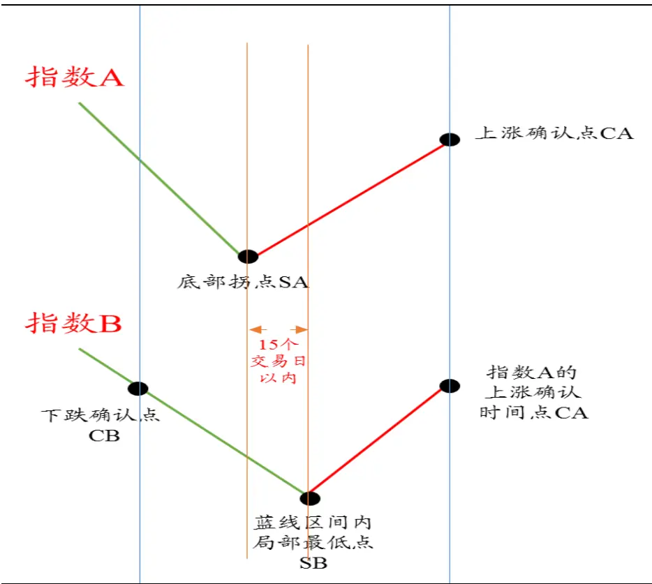
数据来源：国泰君安证券研究

- 预测：指数B会跟随指数A 在后市确认新的上涨波段。

- 若指数B后市确认上涨，则预测成功，即跟随确认；

- 若指数B后市迟迟未确认，反而跌破局部最低点SB，则预测失败，即未跟随确认。

- 跟随确认概率=跟随确认次数/（跟随确认次数+未跟随确认次数）

## 3.2.板块指数波段跟随确认规律

## 3.2.1. 跟随确认概率统计

统计板块指数两两之间的波段跟随确认概率，如下表，蓝色底纹为“跟随确认概率”大于80%的情况。

表 3：板块指数跟随确认概率统计

|  | 指数B |  |  |  |  |  |  |
| --- | --- | --- | --- | --- | --- | --- | --- |
|  | 上证综指 | 上证50 | 沪深300 | 深证成指 | 中小板指 | 创业板指 | 中证500 |
| 基准指数A | 上证综指 |  | 80% | 73% | 68% 87% | 42% | 78% |
|  | 上证50 | 88% | 79% | 68% | 75% | 56% | 70% |
|  | 沪深300 | 100% | 90% | 92% | 92% | 33% | 82% |
|  | 深证成指 | 100% | 93% | 100% | 85% | 40% | 84% |
|  | 中小板指 | 86% | 71% | 71% 71% |  | 56% | 100% |
|  | 创业板指 | 45% | 56% | 50% 45% | 56% |  | 64% |
|  | 中证500 | 100% | 82% | 85% 70% | 100% | 50% |  |

数据来源：Wind、国泰君安证券研究

## 3.2.2. 规律总结

从上表板块指数两两之间波段跟随确认的统计中，可以发现如下规律，根据在实际投资操作中的应用方式不同，这些规律可以总结为以下三类：强确定性机会、领先指示器、独立行情。

- 强确定性机会是指在某一个指数 A 日线级别确认后，指数 B 具有极高概率（大于 90%，尤其是 100%）会跟随确认。那么，在实际投资操作中，一旦指数A的日线级别得到确认，投资指数 B将具有极高的胜率。强确定性机会强调可投资的深度。

- 领先指示器是指在某一指数 A日线级别确认后，绝大部分指数往往会跟随其确认。那么，在实际投资操作中，一旦指数A 的日线级别得到确认，其后续大概率会形成一个覆盖较广（对于板块指数，表现为市值风格覆盖较广；对于行业指数，表现为行业覆盖较广）的行情。领先指示器强调可投资的广度。

- 独立行情是指某一指数 A日线级别确认后，其他指数往往不会跟随其确认；此外当其他指数日线级别确认后，指数 A也往往不会跟随它们确认。那么，在实际投资操作中，我们不能过于关注指数A 与其他指数的关联性，以至于错过或者忽视指数 A的独立行情。独立行情提示可投资的误区。

对于板块指数，按照“强确定性机会、领先指示器、独立行情”进行分类，可以具体得到以下规律：

## 3.2.2.1. 强确定性机会

- 跟随确认概率 100%的情况（格式，指数 A-指数 B）：沪深 300-上证综指，深证成指-上证综指、沪深300，中小板指-中证 500，中证

500-中小板指、上证综指。

- 两指数相互之间跟随确认概率均高于 90%的情况：中小板指-中证500（中证 500-中小板指），深证成指-沪深300（沪深 300-深证成指）。

跟随确认概率高于 90%，但低于 100%的情况：沪深300-上证50、深证成指、中小板指，深证成指-上证50。

## 3.2.2.2. 领先指示器

- 沪深300与深证成指日线级别确认对其他板块指数（除创业板指外）确认有较强的预测作用。当沪深300或深证成指日线级别确认后，其他板块指数（除创业板指外）跟随确认概率均高于 80%，其中沪深 300 确认后，上证综指跟随确认的概率为 100%，深证成指确认后，上证综指与沪深 300跟随确认的概率为 100%。

- 中证500波段日线级别确认对大部分板块指数（除创业板、深证成指外）确认有较强的预测作用。当中证500日线级别确认后，上证综指、上证50、沪深 300以及中小板指跟随确认概率均高于 80%，其中上证综指与中小板指跟随确认的概率为 100%。

## 3.2.2.3. 独立行情

- 创业板指与其他板块指数日线级别确认关联度较低。当创业板指日线级别确认后，其他板块指数跟随确认概率只有 50%左右，最大不超过65%；当其他板块指数日线级别确认后，创业板指跟随确认概率最大不超过60%。

## 3.2.2.4. 其他重要规律

上证 50 日线级别确认，只对上证综指确认有预测作用。当上证 50日线级别确认后，上证综指有 88%的概率跟随确认。

## 3.3.行业指数波段跟随确认规律

## 3.3.1. 跟随确认概率统计

统计行业指数两两之间的波段跟随确认概率，如下表，蓝色底纹为“跟随确认概率”大于80%的情况（第一列为基准指数A，第一行为指数B；单位：%）。

表 4：行业指数跟随确认概率统计

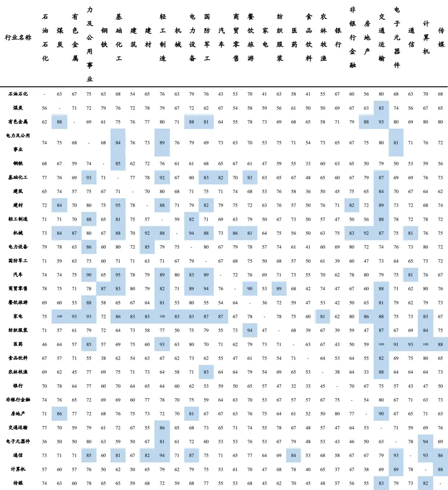
数据来源：Wind、国泰君安证券研究

## 3.3.2. 规律总结

对于行业指数，与板块指数类似，按照“强确定性机会、领先指示器、独立行情”进行分类，可以具体得到以下规律：

## 3.3.2.1. 强确定性机会

- 跟随确认概率100%的情况：家电-煤炭、轻工制造，医药-交通运输、

计算机。

- 两指数相互之间跟随确认概率均高于 90%的情况：无。

- 跟随确认概率高于 90%，但低于 100%的情况：有色金属-交通运输，基础化工-电力及公用事业、轻工制造，建材-基础化工，机械-建材、电力设备、房地产，汽车-电力及公用事业、基础化工，商贸零售-国防军工、餐饮旅游，家电-有色金属、电力及公用事业，纺织服装-餐饮旅游，医药-轻工制造、电子元器件、通信，房地产-交通运输，电子元器件-计算机，通信-轻工制造、电子元器件、计算机。

## 3.3.2.2. 领先指示器

- 家电、机械、通信、商贸零售日线级别确认对其他行业指数确认有一定的预测作用。

- 当家电行业确认时，有 17 个行业大概率会跟随其确认，其中包括同样具有周期消费品行业属性的房地产、汽车行业；

当机械行业确认时，有 15 个行业大概率会跟随其确认，其中包括同样为中游制造业的基础化工、建材、轻工制造、电力设备、国防军工等行业；

- 当通信行业确认时，有 11个行业大概率会跟随其确认，其中包括同为TMT行业的计算机、传媒行业，以及医药等新兴行业；

- 当商贸零售确认时，有 10 个行业大概率会跟随其确认，其中包括同具有必需消费品行业属性的餐饮旅游、纺织服装等行业。

## 3.3.2.3. 独立行情

- 石油化工、银行与其他行业指数日线级别确认关联度较低。

- 当石油化工日线级别确认后，除了交通运输跟随确认概率刚好达到80%外，其余行业跟随确认概率均低于 80%，另一方面，当其余行业日线级别确认后，石油化工跟随确认概率均低于80%；

当银行日线级别确认后，其余行业跟随确认概率均低于 80%，另一方面，当其余行业日线级别确认后，（除房地产确认后，银行跟随确认概率刚好达到 80%外）银行跟随确认概率均低于 80%。

## 3.4.跟随确认收益空间的测算

## 3.4.1. 跟随确认收益空间的测算规则

在第3.1-3.3小节中，我们发现定义并测算了板块指数相互之间跟随确认的概率，并总结了三类投资机会。而在本小节中，我们将设计波段跟随确认的实际买卖点信号，测算买入操作后的收益空间大小，以寻求兼顾胜率与收益的交易策略。

在此，我们以上涨行情为例（下跌行情为上涨行情的上下对称）：

- 买入点：观察预测点CA，即指数A 的上涨确认点，且指数 B与指数A 满足可比较条件

- 卖出点（下图红色虚线）：指数B 的上涨确认点CB，对应预测成功，

即跟随确认

- 止损点（下图绿色虚线）：指数 B 创新低点 SB2，对应预测失败，即未跟随确认

- 收益率：

- 预测成功CA-CB 段收益率 $\left(\boldsymbol{P}_{CB}-\boldsymbol{P}_{CA}\right)/\boldsymbol{P}_{CA}\times100\%$

- 止损操作CA-SB2 段收益率（以下简称止损收益率 $\boldsymbol{D}=\left(\boldsymbol{P}_{SB2}-\boldsymbol{P}_{CA}\right)$ $/P_{CA}\times100\%$

- 跟随确认收益空间：所有预测样本（考虑止损）的平均收益率

- 跟随确认操作时间：所有预测样本（考虑止损）从买入点至卖出点（止损点）耗费的平均交易日数

图 16波段跟随确认收益空间的测算规则
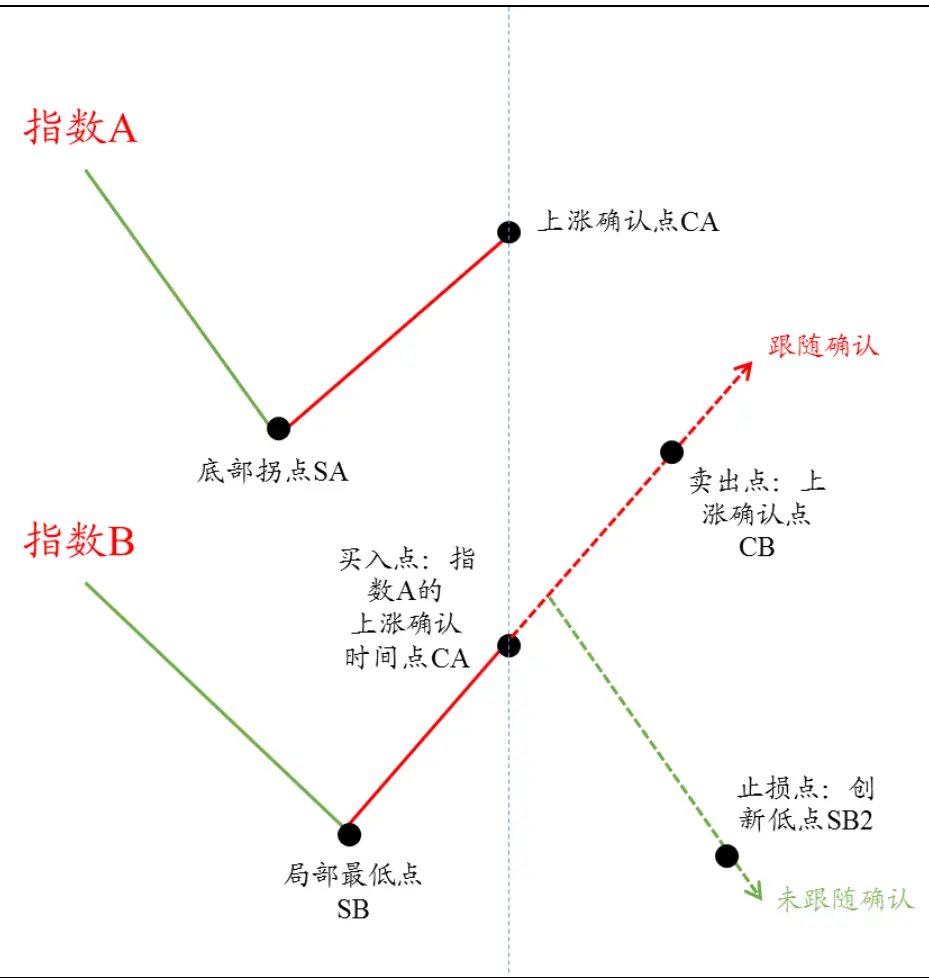
数据来源：国泰君安证券研究

## 3.4.2. 板块指数跟随确认收益空间测算

选取历史上板块指数跟随确认收益空间大于1%的案例（见下表），共计21个样本，平均跟随确认概率为 87%，操作时间平均为 9.13个交易日，收益空间平均为 2.14%。

表 5：板块指数跟随确认收益空间大于 1%的案例统计

| 基准指数A | 指数B | 跟随确认概率 | 操作时间 | 收益空间 | 基准指数A | 指数B | 跟随确认概率 | 操作时间 | 收益空间 |
| --- | --- | --- | --- | --- | --- | --- | --- | --- | --- |
| 上证综指 | 中小板指 | 88% | 16.5 | 2.68% | 深证成指 | 沪深 300 | 100% | 2.8 | 1.87% |
| 上证50 | 上证综指 | 86% | 5.5 | 1.26% | 深证成指 | 中小板指 | 85% | 13.0 | 1.74% |
| 上证50 | 中小板指 | 74% | 17.6 | 3.08% | 深证成指 | 中证500 | 84% | 9.1 | 1.77% |
| 上证50 | 创业板指 | 58% | 15.2 | 2.01% | 中小板指 | 上证综指 | 86% | 6.4 | 1.23% |
| 上证50 | 中证500 | 69% | 14.3 | 2.36% | 中小板指 | 深证成指 | 71% | 6.2 | 1.00% |
| 沪深 300 | 上证综指 | 100% | 3.2 | 1.78% | 中小板指 | 中证500 | 100% | 8.4 | 2.66% |
| 沪深 300 | 深证成指 | 93% | 4.0 | 1.11% | 中证500 | 上证综指 | 100% | 9.6 | 4.38% |
| 沪深 300 | 中小板指 | 93% | 11.6 | 3.41% | 中证500 | 上证50 | 82% | 9.7 | 2.84% |
| 沪深 300 | 中证500 | 83% | 10.9 | 1.96% | 中证500 | 沪深 300 | 86% | 8.1 | 1.63% |
| 深证成指 | 上证综指 | 100% | 3.4 | 2.12% | 中证500 | 中小板指 | 100% | 11.8 | 2.22% |
| 深证成指 | 上证50 | 93% | 4.3 | 1.78% |  |  |  |  |  |

数据来源：Wind、国泰君安证券研究

## 3.4.3. 行业指数跟随确认收益空间测算

选取历史上行业指数跟随确认收益空间大于 1%的案例（见下表），共计197 个样本，平均跟随确认概率为 78%，操作时间平均为 11.19 个交易日，收益空间平均为 2.07%。

表 6：行业指数跟随确认收益空间大于 1%的案例统计

| 基准指数A | 指数B | 跟随确认概率 | 操作时间 | 收益空间 | 基准指数 A | 指数B | 跟随确认概率 | 操作时间 | 收益空间 |
| --- | --- | --- | --- | --- | --- | --- | --- | --- | --- |
| 石油石化 | 电力设备 | 79% | 10.4 | 1.04% | 家电 | 国防军工 | 87% | 8.3 | 3.79% |
| 煤炭 | 轻工制造 | 79% | 10.2 | 1.11% | 家电 | 汽车 | 87% | 5.2 | 1.72% |
| 煤炭 | 电力设备 | 72% | 10.2 | 1.79% | 家电 | 餐饮旅游 | 78% | 11.3 | 2.17% |
| 煤炭 | 电子元器件 | 74% | 14.5 | 2.41% | 家电 | 纺织服装 | 70% | 10.8 | 2.90% |
| 煤炭 | 计算机 | 67% | 13.4 | 2.00% | 家电 | 医药 | 75% | 10.6 | 2.40% |
| 有色金属 | 煤炭 | 88% | 11.5 | 2.98% | 家电 | 农林牧渔 | 81% | 11.1 | 1.63% |
| 有色金属 | 轻工制造 | 80% | 9.1 | 1.28% | 家电 | 非银行金融 | 80% | 21.9 | 1.94% |
| 有色金属 | 电力设备 | 88% | 10.6 | 2.63% | 家电 | 交通运输 | 88% | 9.0 | 2.49% |
| 有色金属 | 国防军工 | 81% | 11.2 | 1.60% | 家电 | 计算机 | 83% | 10.2 | 3.77% |
| 有色金属 | 纺织服装 | 58% | 11.6 | 2.68% | 纺织服装 | 餐饮旅游 | 94% | 9.4 | 1.52% |
| 有色金属 | 银行 | 71% | 18.3 | 2.80% | 纺织服装 | 交通运输 | 87% | 5.6 | 1.71% |
| 有色金属 | 非银行金融 | 79% | 14.7 | 1.97% | 纺织服装 | 计算机 | 84% | 8.2 | 2.19% |
| 有色金属 | 房地产 | 88% | 8.2 | 1.31% | 医药 | 电力及公用事业 | 85% | 7.8 | 1.83% |
| 有色金属 | 交通运输 | 93% | 11.4 | 2.13% | 医药 | 轻工制造 | 93% | 6.6 | 2.30% |
| 有色金属 | 电子元器件 | 80% | 7.2 | 1.36% | 医药 | 餐饮旅游 | 79% | 8.1 | 1.33% |
| 有色金属 | 计算机 | 80% | 14.1 | 1.99% | 医药 | 纺织服装 | 63% | 10.0 | 3.02% |
| 电力及公用事业 | 煤炭 | 75% | 12.2 | 1.36% | 医药 | 交通运输 | 100% | 12.5 | 4.23% |
| 电力及公用事业 | 基础化工 | 84% | 11.4 | 1.34% | 医药 | 电子元器件 | 91% | 4.5 | 1.95% |
| 电力及公用事业 | 轻工制造 | 89% | 8.1 | 1.47% | 医药 | 通信 | 93% | 6.6 | 2.36% |
| 电力及公用事业 | 国防军工 | 69% | 16.2 | 1.14% | 医药 | 计算机 | 100% | 7.2 | 4.04% |
| 电力及公用事业 | 纺织服装 | 67% | 10.3 | 1.31% | 医药 | 传媒 | 88% | 9.1 | 1.57% |
| 电力及公用事业 | 电子元器件 | 81% | 12.3 | 1.82% | 食品饮料 | 有色金属 | 71% | 8.6 | 2.54% |
| 电力及公用事业 | 计算机 | 76% | 12.0 | 1.98% | 食品饮料 | 建材 | 63% | 11.9 | 1.34% |
| 基础化工 | 电力及公用事业 | 93% | 10.8 | 1.09% | 食品饮料 | 电力设备 | 73% | 9.1 | 2.39% |
| 基准指数A | 指数B | 跟隨确认概率 | 操作时间 | 收益空间 | 基准指数A | 指数B | 跟隨确认概率 | 操作时间 | 收益空间 |
| 基础化工 | 国防军工 | 83% | 8.6 | 1.70% | 食品饮料 | 家电 | 75% | 10.7 | 1.05% |
| 建筑 | 煤炭 | 74% | 12.3 | 1.58% | 食品饮料 | 医药 | 71% | 8.6 | 1.72% |
| 建筑 | 电力及公用事业 | 75% | 7.3 | 1.56% | 食品饮料 | 银行 | 53% | 17.3 | 1.78% |
| 建筑 | 轻工制造 | 80% | 9.3 | 2.58% | 食品饮料 | 非银行金融 | 64% | 23.2 | 4.31% |
| 建筑 | 电力设备 | 71% | 10.4 | 1.37% | 食品饮料 | 电子元器件 | 69% | 9.2 | 1.46% |
| 建筑 | 国防军工 | 75% | 9.6 | 1.93% | 食品饮料 | 计算机 | 80% | 8.7 | 2.53% |
| 建筑 | 餐饮旅游 | 68% | 11.9 | 1.16% | 银行 | 煤炭 | 78% | 16.8 | 2.15% |
| 建筑 | 纺织服装 | 68% | 11.3 | 3.44% | 银行 | 有色金属 | 64% | 11.9 | 1.28% |
| 建筑 | 非银行金融 | 75% | 14.8 | 1.27% | 银行 | 电力及公用事业 | 77% | 11.1 | 1.87% |
| 建筑 | 交通运输 | 84% | 22.7 | 1.68% | 银行 | 基础化工 | 70% | 12.7 | 2.29% |
| 建筑 | 电子元器件 | 70% | 10.5 | 1.10% | 银行 | 电力设备 | 62% | 15.2 | 2.58% |
| 建材 | 煤炭 | 84% | 12.8 | 2.78% | 银行 | 餐饮旅游 | 65% | 13.0 | 1.42% |
| 建材 | 基础化工 | 95% | 7.8 | 2.31% | 银行 | 纺织服装 | 41% | 12.8 | 1.83% |
| 建材 | 轻工制造 | 88% | 9.4 | 1.44% | 银行 | 交通运输 | 75% | 8.6 | 1.02% |
| 建材 | 国防军工 | 82% | 13.4 | 2.02% | 银行 | 电子元器件 | 57% | 15.8 | 1.84% |
| 建材 | 纺织服装 | 67% | 10.9 | 1.48% | 银行 | 计算机 | 47% | 13.6 | 2.14% |
| 建材 | 非银行金融 | 82% | 15.5 | 1.35% | 非银行金融 | 石油石化 | 74% | 8.4 | 1.19% |
| 轻工制造 | 石油石化 | 71% | 15.1 | 1.04% | 非银行金融 | 煤炭 | 76% | 9.0 | 1.95% |
| 轻工制造 | 电力及公用事业 | 88% | 10.2 | 1.64% | 非银行金融 | 钢铁 | 69% | 12.6 | 1.57% |
| 轻工制造 | 交通运输 | 88% | 11.8 | 1.37% | 非银行金融 | 建材 | 77% | 12.2 | 2.94% |
| 机械 | 石油石化 | 73% | 10.5 | 2.20% | 非银行金融 | 电力设备 | 75% | 9.1 | 2.83% |
| 机械 | 煤炭 | 84% | 7.1 | 2.82% | 非银行金融 | 国防军工 | 59% | 12.9 | 1.91% |
| 机械 | 有色金属 | 87% | 7.0 | 2.54% | 非银行金融 | 纺织服装 | 61% | 9.8 | 1.83% |
| 机械 | 基础化工 | 88% | 9.4 | 1.92% | 非银行金融 | 传媒 | 73% | 11.7 | 1.56% |
| 机械 | 建材 | 92% | 8.8 | 2.62% | 房地产 | 石油石化 | 71% | 9.9 | 1.32% |
| 机械 | 轻工制造 | 88% | 4.7 | 1.20% | 房地产 | 煤炭 | 86% | 13.4 | 2.73% |
| 机械 | 电力设备 | 94% | 5.8 | 2.70% | 房地产 | 有色金属 | 77% | 11.2 | 1.81% |
| 机械 | 国防军工 | 88% | 9.8 | 3.17% | 房地产 | 电力设备 | 81% | 13.7 | 3.50% |
| 机械 | 纺织服装 | 65% | 8.4 | 2.79% | 房地产 | 国防军工 | 67% | 9.4 | 1.23% |
| 机械 | 银行 | 75% | 15.8 | 3.16% | 房地产 | 餐饮旅游 | 76% | 15.7 | 2.35% |
| 机械 | 非银行金融 | 83% | 18.2 | 3.48% | 房地产 | 纺织服装 | 56% | 11.3 | 1.68% |
| 机械 | 房地产 | 92% | 8.5 | 2.81% | 房地产 | 银行 | 80% | 13.9 | 2.15% |
| 机械 | 交通运输 | 87% | 10.4 | 2.25% | 房地产 | 非银行金融 | 77% | 14.5 | 2.62% |
| 机械 | 电子元器件 | 75% | 10.1 | 1.25% | 房地产 | 交通运输 | 90% | 10.1 | 1.95% |
| 机械 | 计算机 | 76% | 11.5 | 1.28% | 房地产 | 电子元器件 | 67% | 9.5 | 1.21% |
| 电力设备 | 石油石化 | 79% | 22.9 | 1.09% | 房地产 | 计算机 | 67% | 10.7 | 2.40% |
| 电力设备 | 煤炭 | 78% | 12.3 | 3.78% | 交通运输 | 轻工制造 | 86% | 11.3 | 2.05% |
| 电力设备 | 电力及公用事业 | 86% | 8.9 | 2.16% | 交通运输 | 国防军工 | 73% | 14.2 | 1.41% |
| 电力设备 | 基础化工 | 80% | 13.8 | 1.05% | 交通运输 | 餐饮旅游 | 74% | 16.5 | 2.16% |
| 电力设备 | 建材 | 85% | 8.8 | 2.54% | 交通运输 | 纺织服装 | 67% 71% | 11.0 14.0 | 3.61% 1.92% |
| 电力设备 电力设备 | 轻工制造 纺织服装 | 79% 64% | 13.1 13.3 | 2.04% 2.33% | 交通运输 交通运输 | 电子元器件 计算机 |  |  |  |
| 汽车 | 煤炭 | 74% | 10.4 | 1.46% | 通信 | 石油石化 | 73% | 15.3 | 1.72% |
| 汽车 | 电力及公用事业 | 90% | 8.9 | 1.32% | 通信 | 电力及公用事业 | 85% | 10.5 | 1.88% |
| 汽车 | 基础化工 | 95% | 8.0 | 2.53% | 通信 | 基础化工 | 81% | 14.1 | 1.02% |
| 汽车 | 轻工制造 | 89% | 8.2 | 1.93% | 通信 | 建材 | 82% | 7.1 | 1.91% |
| 汽车 | 电力设备 | 83% | 7.7 | 1.21% | 通信 | 轻工制造 | 94% | 8.0 | 2.14% |
| 汽车 | 国防军工 | 89% | 7.5 | 3.44% | 通信 | 电力设备 | 87% | 7.8 | 1.36% |
| 汽车 | 纺织服装 | 63% | 8.7 | 1.94% | 通信 | 国防军工 | 75% | 13.8 | 1.14% |
| 汽车 | 计算机 | 76% | 12.5 | 1.26% | 通信 | 纺织服装 | 58% | 15.8 | 2.79% |
| 商贸零售 | 钢铁 | 87% | 10.3 | 2.58% | 通信 | 交通运输 | 79% | 10.7 | 1.63% |
| 商贸零售 | 建筑 | 80% | 10.9 | 1.56% | 通信 | 电子元器件 | 93% | 12.1 | 1.26% |
| 商贸零售 | 电力设备 | 89% | 9.7 | 2.10% | 通信 | 计算机 | 93% | 8.8 | 3.39% |
| 商贸零售 | 国防军工 | 94% | 9.8 | 2.67% | 通信 | 传媒 | 86% | 16.2 | 1.16% |
| 商贸零售 | 餐饮旅游 | 90% | 10.7 | 1.04% | 计算机 | 电力及公用事业 | 76% | 9.7 | 1.73% |
| 商贸零售 | 纺织服装 | 84% | 9.8 | 3.44% | 计算机 | 轻工制造 | 79% | 13.3 | 1.49% |
| 商贸零售 | 交通运输 | 88% | 20.5 | 1.49% | 计算机 | 纺织服装 | 57% | 13.6 | 2.36% |
| 商贸零售 | 计算机 | 80% | 9.7 | 1.42% | 计算机 | 交通运输 | 69% | 11.4 | 1.91% |
| 餐饮旅游 | 石油石化 | 69% | 10.2 | 1.82% | 计算机 | 电子元器件 | 89% | 11.6 | 2.03% |
| 餐饮旅游 | 电力及公用事业 | 88% | 12.4 | 2.00% | 计算机 | 传媒 | 88% | 15.6 | 1.20% |
| 餐饮旅游 | 轻工制造 | 81% | 6.0 | 1.13% | 传媒 | 石油石化 | 74% | 10.0 | 2.09% |
| 餐饮旅游 | 纺织服装 | 62% | 5.2 | 2.52% | 传媒 | 煤炭 | 63% | 11.0 | 1.18% |
| 餐饮旅游 | 电子元器件 | 79% | 9.3 | 1.25% | 传媒 | 电力及公用事业 | 78% | 9.6 | 1.80% |
| 餐饮旅游 | 计算机 | 79% | 9.6 | 2.61% | 传媒 | 钢铁 | 65% | 15.4 | 1.03% |
| 家电 | 煤炭 | 100% | 14.2 | 6.00% | 传媒 | 建材 | 68% | 13.0 | 1.33% |
| 家电 | 有色金属 | 93% | 10.0 | 6.16% | 传媒 | 国防军工 | 77% | 11.5 | 1.68% |
| 家电 | 电力及公用事业 | 93% | 5.4 | 1.91% | 传媒 | 纺织服装 | 52% | 10.9 | 2.23% |
| 家电 | 基础化工 | 86% | 17.4 | 2.87% | 传媒 | 交通运输 | 83% | 12.0 | 3.50% |
| 家电 | 建材 | 83% | 13.0 | 2.18% | 传媒 | 电子元器件 | 79% | 7.7 | 2.60% |
| 家电 | 轻工制造 | 100% | 7.0 | 3.82% | 传媒 | 通信 | 73% | 13.0 | 1.07% |
| 家电 | 机械 | 83% | 8.7 | 1.41% | 传媒 | 计算机 | 82% | 10.5 | 2.73% |
| 家电 | 电力设备 | 83% | 8.1 | 3.35% |  |  |  |  |  |

数据来源：Wind、国泰君安证券研究

## 本公司具有中国证监会核准的证券投资咨询业务资格

## 分析师声明

作者具有中国证券业协会授予的证券投资咨询执业资格或相当的专业胜任能力，保证报告所采用的数据均来自合规渠道，分析逻辑基于作者的职业理解，本报告清晰准确地反映了作者的研究观点，力求独立、客观和公正，结论不受任何第三方的授意或影响，特此声明。

## 免责声明

本报告仅供国泰君安证券股份有限公司（以下简称“本公司”）的客户使用。本公司不会因接收人收到本报告而视其为本公司的当然客户。本报告仅在相关法律许可的情况下发放，并仅为提供信息而发放，概不构成任何广告。

本报告的信息来源于已公开的资料，本公司对该等信息的准确性、完整性或可靠性不作任何保证。本报告所载的资料、意见及推测仅反映本公司于发布本报告当日的判断，本报告所指的证券或投资标的的价格、价值及投资收入可升可跌。过往表现不应作为日后的表现依据。在不同时期，本公司可发出与本报告所载资料、意见及推测不一致的报告。本公司不保证本报告所含信息保持在最新状态。同时，本公司对本报告所含信息可在不发出通知的情形下做出修改，投资者应当自行关注相应的更新或修改。

本报告中所指的投资及服务可能不适合个别客户，不构成客户私人咨询建议。在任何情况下，本报告中的信息或所表述的意见均不构成对任何人的投资建议。在任何情况下，本公司、本公司员工或者关联机构不承诺投资者一定获利，不与投资者分享投资收益，也不对任何人因使用本报告中的任何内容所引致的任何损失负任何责任。投资者务必注意，其据此做出的任何投资决策与本公司、本公司员工或者关联机构无关。

本公司利用信息隔离墙控制内部一个或多个领域、部门或关联机构之间的信息流动。因此，投资者应注意，在法律许可的情况下，本公司及其所属关联机构可能会持有报告中提到的公司所发行的证券或期权并进行证券或期权交易，也可能为这些公司提供或者争取提供投资银行、财务顾问或者金融产品等相关服务。在法律许可的情况下，本公司的员工可能担任本报告所提到的公司的董事。

市场有风险，投资需谨慎。投资者不应将本报告作为作出投资决策的唯一参考因素，亦不应认为本报告可以取代自己的判断。
在决定投资前，如有需要，投资者务必向专业人士咨询并谨慎决策。

本报告版权仅为本公司所有，未经书面许可，任何机构和个人不得以任何形式翻版、复制、发表或引用。如征得本公司同意进行引用、刊发的，需在允许的范围内使用，并注明出处为“国泰君安证券研究”，且不得对本报告进行任何有悖原意的引用、删节和修改。

若本公司以外的其他机构（以下简称“该机构”）发送本报告，则由该机构独自为此发送行为负责。通过此途径获得本报告的投资者应自行联系该机构以要求获悉更详细信息或进而交易本报告中提及的证券。本报告不构成本公司向该机构之客户提供的投资建议，本公司、本公司员工或者关联机构亦不为该机构之客户因使用本报告或报告所载内容引起的任何损失承担任何责任。

## 评级说明

## 1.投资建议的比较标准

投资评级分为股票评级和行业评级。

以报告发布后的12个月内的市场表现为比较标准，报告发布日后的 12个月内的公司股价（或行业指数）的涨跌幅相对同期的沪深 300 指数涨跌幅为基准。

## 2.投资建议的评级标准

报告发布日后的 12 个月内的公司股价（或行业指数）的涨跌幅相对同期的沪深 300 指数的涨跌幅。

|  | 评级 说明 |  |
| --- | --- | --- |
| 股票投资评级 | 增持 | 相对沪深 300指数涨幅15%以上 |
|  | 谨慎增持 | 相对沪深 300指数涨幅介于5%～15%之间 |
|  | 中性 | 相对沪深 300指数涨幅介于-5%～5% |
|  | 减持 | 相对沪深300指数下跌5%以上 |
| 行业投资评级 | 增持 | 明显强于沪深 300 指数 |
|  | 中性 | 基本与沪深 300指数持平 |
|  | 减持 | 明显弱于沪深300指数 |

## 国泰君安证券研究所

|  | 上海 | 深圳 | 北京 |
| --- | --- | --- | --- |
| 地址 | 上海市浦东新区银城中路168号上海 银行大厦29层 | 深圳市福田区益田路 6009 号新世界 商务中心34层 | 北京市西城区金融大街 28 号盈泰中 心2号楼10层 |
| 邮编 | 200120 | 518026 | 100140 |
| 电话 | (021)38676666 | （0755)23976888 | (010)59312799 |
| E-mail: gtjaresearch@gtjas.com |  |  |  |