nInfo] [Table_Title]2017.07.11

# 基于深度组合的选股策略

## ——数量化专题之九十七

刘富兵（分析师）

## 殷明（研究助理）

8 021-38676673

liufubing008481@gtjas.com

021-38674637

证书编号 S0880511010017

yinming@gtjas.com

S0880116070042

## 本报告导读：

本报告围绕“深度组合”的理念，阐述了如何将深度学习的基本理念借鉴到选股研究中。我们发现，通过深度学习方法提取的非线性特征和传统的风险模型选股具有良好的互补性质，从原理上讲，两者也是相辅相成的。深度组合虽然不是方法论上的创新，却从另一个角度解释了价格信息中蕴含的规律，并且其表现在过去 7年中比传统动量策略更强劲。

## 摘要：

le_Summary] 深度学习在语音、视频、自然语言处理等领域的成功使得越来越多的投资者开始尝试将其运用到投资中，然而，更高的噪音、更复杂的影响因素使得很多经典算法并不适用。本篇报告借鉴国外的“深度组合”理念，尝试将深度学习的基本理念使用到选股研究中。

本篇报告首先介绍了深度组合概念，然后从理论上解释了深度组合并不是方法论的创新，而是对市场不同角度的解读。之后我们对深度组合的构建方法做了详细介绍，并通过在沪深300上的选股实证为例，进一步介绍了数据处理的细节。

- 总体来说，深度组合的构建包含三个步骤，即通过自编码网络学习原始数据特征，转化为分类问题对T+1时期进行预测，通过指标验证组合构建的合理性并确定持仓方案。

为了解决传统的神经网络投资的“黑箱”问题，我们通过自编码过程中的损失函数作为指标，对策略进行了优化。一方面，对选股池中的股票，只选取置信度高的个股进行处理；另一方面，通过该指标判断策略是否失效。我们通过实证分析中的指标检验证明了该指标确实和策略收益是高相关的，并且不存在滞后性，从而使得策略在出现回撤时有章可循。

- 基于上述思路，我们构建了沪深300股票池中的选股策略，该策略从 2010 年中至 2017 年中的七年时间里，在 8.33%的最大回撤下获得约18.37%的年化收益，领先于传统的动量策略，并且，策略在今年取得了 7.113%的超额收益。

- 根据检验指标，我们对策略进行了进一步优化。优化的策略从收益端和风险端对原策略均有提升，进一步证实了指标的可靠性。

金融工程

## 金融工程团队：

刘富兵：（分析师）

电话：021-38676673

邮箱：liufubing008481@gtjas.com

证书编号：S0880511010017

## 陈奥林：（分析师）

电话：021-38674835

邮箱：chenaolin@gtjas.com

证书编号：S0880516100001

## 李辰：（分析师）

电话：021-38677309

邮箱：lichen@gtjas.com

证书编号：S0880516050003

## 孟繁雪：（分析师）

电话：021-38675860

邮箱：mengfanxue@gtjas.com

证书编号：S0880517040005

## 蔡旻昊：（研究助理）

电话：021-38674743

邮箱：caiminhao@gtjas.com

证书编号：S0880117030051

## 殷明：（研究助理）

电话：021-38674637

邮箱：yinming@gtjas.com

证书编号：S0880116070042

## 叶尔乐：（研究助理）

电话：021-38032032

邮箱：yeerle@gtjas.com

证书编号：S0880116080361

## [Table_R相关报告

《板块及行业指数价格分段研究》2017.07.05《基于信息冲击视角的盈余公告效应研究》2017.07.04

《回撤控制下的最优化大类资产配置策略》2017.07.03

《基于短周期价量特征的多因子选股体系》2017.06.15

《基于短周期价量特征的多因子选股体系》2017.06.01

## 1. 引言

量化选股研究一直是量化领域经久不衰的课题，其本质是在某个特定的股票池内，通过寻找某些个股优于一般股票的“性质”，以这些性质为基础构造组合，从而得到长期跑赢基准的策略。这里的“性质”传统意义上被称为“因子”，并由此衍生出一系列研究，包括如何挖掘具有稳定超额收益的因子，如何通过因子构造最优组合，如何平衡收益、风险、成本等投资因素，等等。然而，随着传统风险管理模型的兴起，投资者会发现挖掘新的具有“边际收益”的因子越来越难，同时，已知因子的收益也随着市场风格变换越来越不稳定，有些甚至渐渐失效。因此，在这个时点，我们有必要放开思路，重新审视因子选股。

与此同时，深度学习在包括视觉图像、音频信号处理、自然语言处理甚至自动驾驶等诸多传统领域都获得了巨大的成功，“人工智能”一词已经代替过去泛滥的“大数据”一词，一跃成为投资者们新的宠儿，甚至有人开始怀疑不久后会出现“投资机器人”，取代基金经理的工作。然而，当国内外诸多学者将深度学习算法应用到投资领域后发现，远高于传统领域的噪音和变量都使得深度学习在投资领域的研究并不那么容易成功。但是，这并不是宣告了深度学习的死刑，相反，近年来越来越多的研究者开始涉足该领域，在美国，越来越多的对冲基金开始引入人工智能的研究，甚至在国内，也开始有一批通过深度学习算法获得稳定超额收益的尝试涌现出来。

深度组合和传统的多因子体系不同，它使用深度神经网络训练出的因子进行组合构造，其最大的不同点就是无论是因子本身还是组合的构建过程都是非线性的。由于非线性的复杂性，因此这种构造过程需要更多的参数，更多的数据量支撑。深度学习使得这一切成为可能。本篇报告即是根据国内外众多的已有研究，综合其理念，并加入了一些自己的思考，针对因子选股问题进行了一些新的尝试。我们发现，通过这种方式构建的组合，由于非线性特征的复杂性，其稳定性虽然不能和传统的多因子选股方法相比，但在一些传统选股方式受挫的年份能够较高的超额收益，从而对因子选股研究做了有益的补充。具体到实证方面，我们在沪深 300 内的选股策略可以在 2011 年至今在 8.33%的回撤下跑出 18.37%的年化超额收益，其中，今年以来超额收益达到 7.11%，最大回撤1.33%。

本篇报告的结构如下：第二章首先介绍了深度组合的基本概念以及其构造方法；第三章则从不同的视角对深度组合的概念进行了诠释，这些是深度组合的理论基础，通过对这些视角的观察，一方面我们能更好的理解深度组合，另一方面我们也发现，其实这种构建方式并不是方法论上的创新，其基本思想和传统金融理论完全兼容；第四章开始介绍构建深度组合的细节算法，包括自编码学习隐含特征以及将选股问题转化为分类问题来处理，并给出了学习算法的一般方法；第五章我们对沪深 300选股做了实证分析，并对结果进行了分析和优化；最后，我们总结了深度组合方法的优势与不足，并对未来研究方向进行了展望。

## 2. 深度组合理念

本章主要介绍深度组合的基本概念，并对如何通过深度神经网络构建深度组合做一个大致的轮廓式的介绍，从而给读者一个初步印象。第四章中我们会对本章提到的算法进行详细介绍。

## 2.1.深度组合的基本概念

深度组合这个理念首次提出是由 JB Heaton 在其 2016 年 9 月的论文《Deep Learning in Finance: Deep Portfolios》中提出。文中提出了深度组合这个概念，但是却并没有对如何构建组合进行详细描述。这里的“组合”和组合管理中的“组合”含义并不相同，其构建目的是为了预测标普500指数的下一期收益率。但是，通过深度神经网络提取因子的思想却被和很多其他研究不谋而合。其中，Lawrence Takeuchi 在其论文《Applying Deep Learning to Enhance Momentum Trading Strategies inStocks》就详细描述了如何通过深度组合对传统的动量效应进行增强。同样，在音频处理领域大热的LSTM的算法也被运用到股票时间序列预测中，Jakob Aungiers 在其论文《LSTM Neural Network for Time SeriesPrediction》中详细描述了他所在的对冲基金是如何运用该算法进行投资的。

然而，本篇报告并不旨在对深度学习本身进行科普性介绍，也不对其算法及其推导过程进行详细描述。相反，我们希望借鉴海内外已有研究，结合自己的思考，将深度学习算法中的核心理念运用到选股中，并解决投资中的实际问题，例如投资者谈“机器学习”而色变的“黑箱问题”，回测效果好而实际效果差的过拟合问题等。

为了让大家对深度组合有一个大致的了解，这里先简单介绍深度神经网络的概貌，至于和神经网络相关的细节问题，例如前向后向算法、神经单元的优化等问题我们不做介绍，具体实施细节属于计算机算法范畴，可以参考神经网络相关书籍文献。

图 1深度神经网络示意
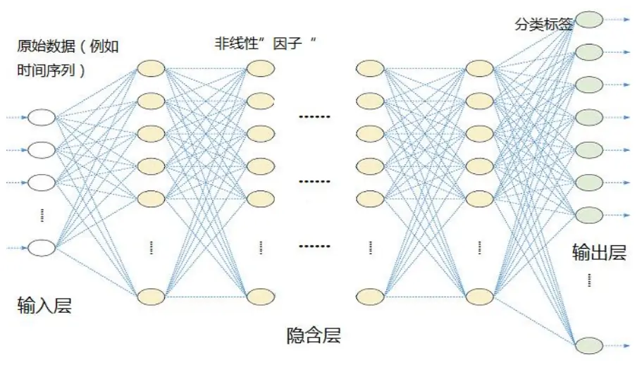
数据来源：国泰君安证券研究

如图1所示，是一个简单的深度神经网络示意图。深度神经网络和传统的神经网络在结构上并无二致，唯一区别就是字面上的“深度”，即包含了更多的隐含层。之所以要引入更“深”的结构，深度学习理论已经作了很详细的介绍，我们不再赘述，但是从投资的角度讲，由于我们每层的隐含层节点都使用简单的非线性激活函数，因此，通过增加层次，可以学习出更复杂的特征，或者所谓的非线性“因子”，从而使得网络的表达能力更强。将我们用于构建深度组合的原始信息作为输入层信息输入到神经网络中，经过网络一系列的学习过程，输出层输出我们需要构建组合的信息，整个过程即为深度神经网络构建组合的过程。可以看到，和传统的多因子组合构建方式不同，我们在整个过程中并未对因子本身做任何的处理（例如因子检验、因子正交化等），而是希望神经网络本身帮助我们完成这些任务。下面，我们来说明本文如何通过该网络构建深度组合。

## 2.2.深度组合的构造

本节介绍通过深度神经网络构建组合的基本思路。和传统的多因子选股体系不同，我们并不是通过个股的线性组合来构建策略，而是通过神经网络对特征进行提取，并以这些特征给出每只不同股票预期收益率区间的置信度，根据这些置信度确定组合的构造方式，具体来说步骤如下：

(a) 提取市场原始信息作为输入层数据输入神经网络。例如，如果需要挖掘个股的价格信息，则可以以个股过去的 T 期的收益率作为原始数据输入到网络中。本篇报告中，我们希望通过对股票价格序列的研究，挖掘出价格信息中的隐含规律，因此，神经网络的输入项即为选股池内每只个股过去120 日的收益率；

(b) 通过自编码网络学习价格信息蕴含的非线性特征。这部分应用了深度学习中最基本的算法——自编码来构建价格特征。具体算法在第四章中详细阐述，其本质是通过一种方式将隐含在时间序列中不同股票的共同“模式”挖掘出来；

(c) 利用上一步骤提取的特征对 T+1 期的预期收益率进行预测。为了使得输出项更加清晰，这一步我们将问题转化为传统的分类问题，即把连续的收益率数值区间化，输出落在不同收益率区间的“概率”，通过这个概率值，根据不同的投资目标构建相应组合。

## 2.3. 隐含假设

细心阅读 2.2 节会发现，如果要使用过去时间的价格序列通过深度神经网络来构建组合，其实隐含了一个非常强的假设，即：

假设：所有已知的因子信息和未知的因子信息都包含在过去的股票价格中，这些因子可以包括价量因子、财务指标因子、交易模式因子等。

可以看到，这是一个非常强的假设，在现实的市场中基本不可能满足。

那么，为什么我们还要提出这个假设呢？因为，如果这个假设成立，通过深度神经网络对过去时间价格序列的挖掘就是充分的，因为所有因子都已经包含在价格序列中了，如果策略还无效，那么说明挖掘的特征并不具有通用性，那么需要重新审视挖掘算法。相反，如果模型失效了，那么除了算法本身可能的问题外，更大的可能是这个假设并不成立，或者是在某段时间不成立。因此，我们需要有一个指标判断策略是否失效。我们在第 4.1 节中详细说明了如何通过一个量化的指标判断模型有效性。

通过本章阐述的方式，我们可以对个股的价格序列进行最简单的模式挖掘。考虑到这是我们在深度学习领域尝试的第一篇报告，我们并不打算使用很复杂的算法对数据本身做更多处理，而是将深度学习的基本理念应用到选股中，给投资者一个直观的印象，也即通过深度神经网络从价格序列中挖掘到的规律是否稳定存在，通过该方式构建的策略是否存在投资者普遍担心的黑箱问题、过拟合问题。这些问题在后续章节中将详细阐述。

## 3. 深度组合的理论基础及其不同视角

在我们对深度组合构建算法进行详细阐述之前，有必要从理论上解释这种方法的合理性和可靠性。考虑到投资者对传统金融学理论的既有理解，我们试图从传统的金融学理论视角出发，来审视深度组合构建过程。通过这些审视的过程，我们也可以从不同角度将深度组合的神秘面纱逐渐掀开，从而能够更好的解释深度组合的核心逻辑及本质。下面，我们将分别从 Markowitz 的均值-方差模型、Sharpe 的 CAPM 模型、Black-Litterman 模型、传统的多因子风险管理模型，以及信息论对信息传输和处理的角度来说明深度组合和这些理论几乎都是兼容的，也就是说，深度组合并不是方法论的创新，而只是从不同视角对组合构建进行了全新的尝试。

## 3.1. Markowitz 和 Black-Litterman 的视角

根据上文所述，对市场的解读就是特征提取的过程。无论是 Markowitz的均值方差模型，还是 Sharpe的CAPM模型，再到APT 模型，他们开始使用一层线性因子来处理股票价格，直到后来很多学者逐步发现了一系列的因子，例如价值、动量、流动性等等。其实，这些传统模型都在通过“特征”提取对市场进行解读。而深度组合也只不过是沿用了这样的思想，通过自编码的方式，提取出了一些非线性特征而已。

下面我们来说明怎么通过深度组合的框架来解释 Markowitz 的均值方差模型。均值方差模型其实是通过均值和协方差矩阵进行了“编码”：

$$
\overline{{\textit{ X }}}=\frac{1}{T}\sum_{\textit{ t = 1 }}^{T}\textit{ X }_{\textit{ i t }}
$$

$$
\textit{ X X }^{\textit{ \tiny { T } }}=\frac{1}{\textit{ T }}\sum_{\textit{ t }=1}^{\textit{ T }}\big(\textit{ X }_{\textit{ i t }}-\textit{ X }\big)\big(\textit{ X }_{\textit{ i t }}-\textit{ X }\big)^{\textit{ T }}
$$

用统计学术语来说，如果市场收益是具有常数预期收益和协方差的多元正态分布，则上述的指标已经能足够反应市场特征。相当于我们把N*T的观测数据“降维”到了N 个平均值和N(N-1)/2<<T 个方差值。

当然，实际上上述假设肯定是大部分时候不成立的。那么 BL 模型通过加入了投资者的置信度信息，使得框架更加完善。这和我们后文中 4.1节要介绍的目标函数 ( )的形式是完全一样的，即通过一个惩罚项来使得原始的优化目标稍作偏离。所以，无论是什么模型，其实都是希望通过一些指标或者特征来间接描述市场特征，只是深度组合中这种挖掘过程更加复杂。

## 3.2.信息论的视角

从信息传输的角度看深度组合的构造是这样的场景：原始信息从神经网络的输入层输入，要预测的信息在输出层。一个好的数据传输方式是将原始数据从输入层输入，经过若干层的处理，信息以最少损失的代价被传输到隐含层的最后一层，通过这一层的“特征”对输出层进行拟合。为什么要在神经网络中对数据进行传输呢？其一，原始数据噪音太多，维度太高，直接使用原始的 T 日到 T-n 日的价格数据很难直接预测 T+1时期的价格，即使可以，那也是时间序列分析领域要做的时期，在预测前需要对时间序列的平稳性等性质进行检验；其二，原始数据中包含的具有可预测性的特定“模式”只有通过数据流在神经网络中的传输才得以挖掘出来，但是这个过程要保证信息的损失最小。因此，从信息论的角度看，我们在神经网络中所有的工作就是围绕两个目标展开：第一，尽可能使得数据传输的信息损失最小；其二，尽可能使具有预测性的信息保留的最多。基于这两个目标，我们下 4.1 节中构造出了优化目标函数 ( )，该目标函数一方面使得信息损失最低，另一方面使得模型泛化能力最强，也就是预测能力更强。

另外，从信息论编码的角度来说，神经网络的隔层节点相当于对原始数据进行编码。与编码过程相对应的过程即为解码，一个好的编码算法一方面能够使原始信息得到最大程度的压缩，另一方面编码后的结果在进行解码的过程中，能最大化的复原原信息，也就是说，能够最大化的使得编码解码的过程“可逆”（当然，由于有信息损失，完全可逆是做不到的）。

## 3.3.传统多因子模型的视角

传统多因子体系通过“因子”解释股票的收益，并将股票收益区分为市场收益和个股的特质收益。通过对股票收益的分解，我们可以明确知晓每个因子在股票收益和风险中作出的贡献。通过我们可以构造目标函数来对收益和风险进行平衡，从而在一定的回撤下跑出稳定的收益，这种根据优化目标函数动态优化个股权重的方式被称为组合权重优化。

下面，我们从多因子模型的角度看看深度组合的构造过程。深度神经网络中的隐含层节点可以理解为多因子体系中的“因子”，因为这些节点也可以描述股票价格的特征。从隐含层到输出层，我们做的事情是通过这些特征去预测T+1时刻的股票价格，或者预期收益率。也就是说，这里做了一个假设，即假设我们抽取的这些特征在短时间内不会随着时间产生变化，从而可以将其外推，用于预测 T+1期的价格。这些特征在多因子体系中被称为“因子”，在技术分析研究中被称为“模式”或者“规律”。也就是说，无论什么研究方法，其实我们都做了一个假设：技术分析中我们认为价格的“模式”是短期内不变的，多因子体系中我们认为“因子”的特征是短期内不变的，而深度组合中，相对应的，我们认为隐含层抽取出的特征是短期内不变的。

从本章的分析不难看出，深度组合其实和传统的金融学理论、多因子模型都有很多相关之处，它并不是方法论上的创新，而是从不同角度对股票价格进行了解读。

## 4. 基于深度组合的选股策略

本章开始，我们对通过深度组合进行选股的核心算法进行阐述。深度组合的构建过程中主要涉及两个核心过程，即通过自编码学习隐含特征以及通过学习到的特征预测下一期个股收益。

## 4.1.自编码学习隐含特征

自编码算法虽然是深度学习中最经典最基础的算法，但是使用该算法进行选股研究，不但能有效提取股票过去价格的特征，更能够有效判断在选股的过程中，是否有足够的置信度将某只股票纳入选股池。具体做法是，对输入层信息通过某函数H(X)进行编码，得到隐含层节点的输出。再通过这些输出通过函数G(X)进行解码，我们希望经过编码、解码之后的结果和原信息尽可能相似。下面结合具体实例说明。

图 2 简化的自编码网络示意图
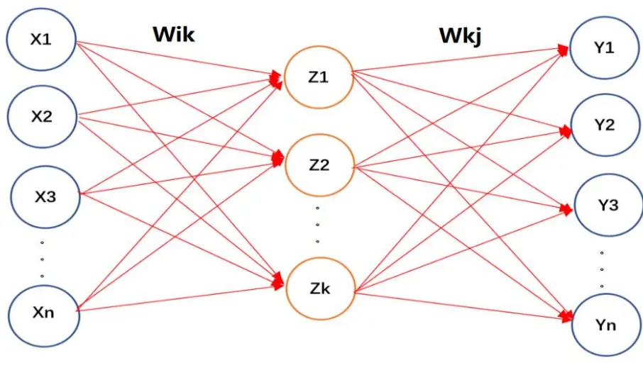
数据来源：国泰君安证券研究

如图 2，是一个简化的自编码网络示意图。图中的神经网络共有三层节点，其中第一层节点是输入层，输入信息是原始的股票价格信息，这里我们使用个股120日收益率作为输入，记为向量X。中间层的节点为隐含层节点，也是我们希望通过编码方式找到的特征的节点，记为向量 Z。输出层节点则是我们经过编码、解码过程之后希望复原的信息，记为Y。从原始的 n 维数据 $(\mathrm{x1,}\mathrm{x2,}\ldots\mathrm{,}\mathrm{xN})$ 到通过函数 H(X)作用到隐含层特征(z1 $\mathrm{,}\mathrm{z2,}\mathrm{\ldots,}\mathrm{zK)}$ 的过程即为编码过程，编码过程中使用的参数记为矩阵，其维度 $\mathrm{N^{*}K}$ 对应输入层节点数 N 和隐含层节点数 K。从隐含层特征(z1,z2,…,zK)通过函数 G(X)再映射到输出层数据的过程即为解码过程，解码过程中使用的参数记为矩阵 $W_{2}^{kj}(k\in[1,K],j\in[1,N])$ ，其维度K*N也对应隐含层节点数 K和输出层节点数N。为了表达方便，我们将通过编码解码过程得到结果Y的函数记为 $F_{_{\mathrm{F}}}\left(\;X\;\right)$ ，其满足：

$$
F_{_W}\left(\textit{X}\right)=H\left(G\left(\textit{X}\right)\right)
$$

其中第 j 项结果即：

$$
\begin{aligned}&F_{_W}\left(\boldsymbol{X}\right)_{_{j}}=\sum_{_{k=1}}^{^{K}}\mathcal{W}_{_{2}}^{^{kj}}G\left(\sum_{_{i=1}}^{^{N}}\mathcal{W}_{_{1}}^{^{ik}}\boldsymbol{X}_{_{i}}\right)\\&=\sum_{_{k=1}}^{^{K}}\mathcal{W}_{_{2}}^{^{kj}}\boldsymbol{Z}_{_{k}}for\boldsymbol{Z}_{_{k}}=G\left(\sum_{_{i=1}}^{^{N}}\mathcal{W}_{_{1}}^{^{ik}}\boldsymbol{X}_{_{i}}\right)\\\end{aligned}
$$

为了表征编码、解码之后的结果 $F_{_{\mathrm{~F~}}}(\mathrm{~}X\mathrm{~})$ 与原始信息的差异，我们定义偏差项 $\Delta\left(\textit{ W }\right)\quad=\quad\left\|\textit{ X }\quad-\quad F_{_{\textit{ w }}}\left(\textit{ X }\right)\right\|^{2}$ 。另外，为了使得模型不过于拟合，使用 L2的惩罚项 $\Phi\left(W\right)$ 来对目标函数进行矫正。因此，自编码网络的优化目标为：

$$
\zeta\left(\mathcal{W}\right)=\arg\min_{\mathcal{F}}\Delta\left(\mathcal{W}\right)+\lambda\Phi\left(\mathcal{W}\right)
$$

$$
\Delta\left(\textit{ W }\right)\quad=\quad\left\|\textit{ X }\quad-\quad F_{_{\textit{ W }}}\left(\textit{ X }\right)\right\|^{2}
$$

$$
\zeta\left(\mathcal{W}\right)~=~\sum_{_{i\;,j\;,k}}\left|\mathcal{W}_{_{1}}^{^{ik}}\right|^{2}~+~\left|\mathcal{W}_{_{2}}^{^{kj}}\right|^{2}
$$

那么，上述优化的过程即为学习出 ${\boldsymbol{{\boldsymbol{{\mathcal{W}}}}}_{1}}^{ik}$ 的过程。当然，优化目标 $\Delta(W)$ 的作用远不止学习参数 ${{{\bf{\Psi}}_{1}}^{ik}}$ 这么简单，其更重要的作用是衡量了我们在编码过程中丢失的信息量。显然，如果在这个特征提取的过程中信息损耗较大，则 $\Delta(W)$ 会很大。也就是说， $\Delta(W)$ 的大小直接衡量了该模型提取特征的准确度。因此，我们将 $\Delta(W)$ 作为一个检验指标，分别对以下两种情况进行检验：

(a) 针对个股的检验。在 T 时期，对于某只股票 S，通过学习到的参数W对股票S 进行编码，编码解码后的损失函数 $\Delta(W)$ 大于某一阈值Δ'，则说明该个股的编码信息损失很高，使用该编码结果进行下一步$\mathbf{T}\mathbf{+1}$ 时期的预测很不可信，因此可以直接剔除该股票；

(b) 针对模型的检验。上述情况的一个极端情况是，如果对于选股池中所有股票，损失函数 $\Delta(W)$ 的均值 $\Delta\left(\mathcal{W}\right)$ 大于某一个阈值 $\Delta^{\prime\prime}.$ ，则说明在当期，大部分股票使用编码方式得到的结果都不可信，那么模型可能已经失效，因此可以在该时刻放弃策略，或者切换到其他策略。导致模型失效的原因很多，有可能市场风格的切换导致失效，也可能我们在2.3节提到的强假设在该阶段不成立了，总之，如果我们找到的指标 $\Delta\left(\mathcal{W}\right)$ 满足相关度高、非滞后这两个条件，则说明这是一个可信的判断市场是否失效的指标。

## 4.2.转化为经典分类问题

在得到个股过去时间序列的特征表达后，下面一步就是要通过这些特征对T+1时间进行预测。在特征准确表达的前提下，对股票池进行选股就是一个标准的分类问题，即以T+1 时间该股票是否战胜指数来分类。当然，分类方法并不限于二分类，也可以通过个股的十分位数指标将输出且分为十个节点，甚至任意多个节点。这里我们使用最简单的两分类情况来说明。

图 3利用学习到的特征进行分类
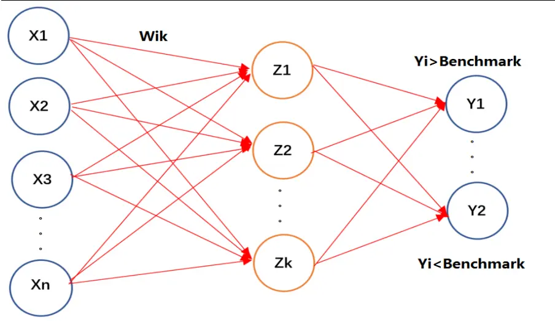
数据来源：国泰君安证券研究

如图 3，隐含层 Z 左侧的节点从编码阶段的结果保留，输入依然是时间价格序列，Z 依然是提取到的特征，Wik 是已经学习到的参数。将输出层的节点根据个股在 T+1 期是否战胜指数分为两个节点，假设 Y1 代表战胜指数，则如果样本战胜指数，标记 Y1 为 1，Y2 为 0，这样就转化为了机器学习中经典的分类问题。优化目标即为交叉熵：

$$
\Gamma\left(\textit{ W }\right)~=~-\sum_{_{i\mathrm{~=~}1}}^{^{\textit{ H }}}\textit{ y }_{_{i}}~*~1\mathrm{og}\left(\hat{\textit{ \textit { y } }_{_{i}}}\right)
$$

其中 表示样本的真实概率分布， $y_{\textit{ i }}$ $\hat{\textbf{ \textit { Y } }}_{i}$ 表示预测概率分布。当然，如果输出项是十分位指标或者其他非二分类问题，也依然可以用上式计算，只是对预测的 $\hat{\textbf{ y }}_{i}$ 需要增加一个 softmax 函数，具体来说，如果输出层的输入项是 $.\Theta$ ，则：

$$
\hat{\mathcal{V}}_{i}=soft\max\left(\boldsymbol{\Theta}_{i}\right)=\frac{\exp\left(\boldsymbol{\Theta}_{i}\right)}{\sum_{j}\exp\left(\boldsymbol{\Theta}_{i}\right)}
$$

那么，通过对 $\Gamma(W)$ 的优化，整个神经网络参数就可以学习出来。当然，这里只是一个简单的示意，实际使用中，需要用更多层次的网络结构。那么，如果选择网络结构就涉及下一个话题，模型选择问题。

## 4.3.模型选择及验证

说到神经网络，投资者们最排斥它的两个原因，其中之一就是过拟合问题。其实，神经网络的参数本身是否过拟合完全可以用最基本的样本外检验方式，以及观察训练集和测试集的学习曲线来解决。唯一有可能过拟合的是两种情况：一是超参数的过拟合，即模型选择本身过拟合了，例如每层选择不同的节点数，选择不同的层次差异很大，结果与模型十分敏感；二是由于金融数据的顺序性，不能像传统的方式那样将数据打散交叉验证，那么在验证过程中必然要人为的按照时间切分训练集和测试集，这个切分过程是主观的，很可能导致过拟合。因此，在模型选择和验证阶段，需要对网络结构进行敏感性分析，在得到某种结构使得学习效果最好的同时，验证该结构不能对结果过分敏感。另外，在切分训练集和测试集时，尽量使得每个集合包含不同的市场风格，例如贯穿牛熊，贯穿动量效应和反转效应适用的场景，贯穿大小盘风格切换的场景等，例如我们选择2000年到2008年作为训练集，这部分时间包含了不同类型的市场风格和状态，不至于使得模型因为市场风格单一化而过拟合。

## 4.4.构造深度组合的一般方法

本节简单总结构造深度组合的一般方法。见图 4，分为四步：首先对个股自编码，通过自编码完成非线性特征的抽取以及神经网络前半部分的参数学习，并且通过验证编码效果决定哪些股票进入选股池；其次将对T+1 时期的预测转化为分类问题，并学习网络后半部参数；再次通过选择不同的超参数构建不同结构的网络，找出最好的网络结构，同时验证超参数的敏感性；最后在具体的换仓日，将当期个股数据逐一输入网络的输入层，得到选股结果，在输入之前需要将过去最新的样本加入到训练集中，更新模型参数。

图 4构造深度组合的一般流程
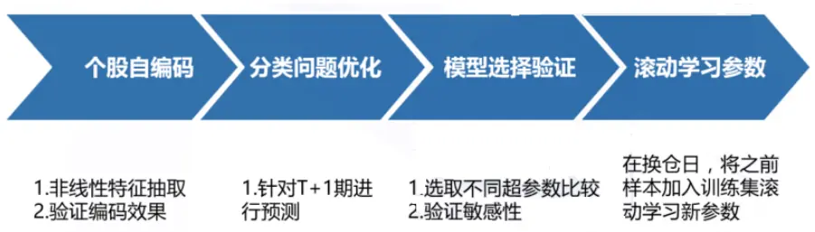
数据来源：国泰君安证券研究

下面，我们根据沪深 300选股的实例，来具体阐述整个过程。

## 5. 沪深 300选股实证分析

## 5.1.数据准备和预处理

取出A股从2000年到2017年 5月所有的日级别时间序列数据，并将样本根据时间切分成三个集合：2000年至2008年为训练集，2009年至2010年为验证集，2011 年至 2017 年为测试集。对于每个集合数据做以下预处理：

(a) 对T时刻每只股票，取其(T-1)日到(T-60)日每日累计收益率，以及(T-4)月到(T-12)月的每个月的每月累计收益率，共 60个日收益率+9个月收益率，共69维数据作为输入；

(b) 对以上所有数据，去除所有停牌、被ST 的情况；

(c) 对同一时间的数据使用 Z-Score做中心化处理；

(d) 根据(T+1)月的收益率对数据做标记，以前20%，后20%，中间数值为三个区间做划分，结果作为神经网络输出。

数据预处理完成后，开始对输入层进行自编码提取特征。图5 是特征提取之后，通过提取到的特征再解码返回的数据和原始数据的比较结果。图中第 1、3 行是原始数据，2、4 行是对应的处理过后的数据，将输入层的 69 维数据二维化后，使用不同的颜色代表不同大小的数值，这样可以比较直观的看到编码效果。不难看出，不同个股之间差异较大，例如第 6、7、12、16、17 只个股信息损失严重，基本上已经无法还原原始信息，而第3、4、8、14只股票相对来说信息损失较少，可以作为较高置信度的股票纳入选股池。通过这个可视化的方式，可以比较直观的看出，自编码这种算法对于某些个股还是能很好的提取其特征的。

图 5编码解码后结果和初始信息对照
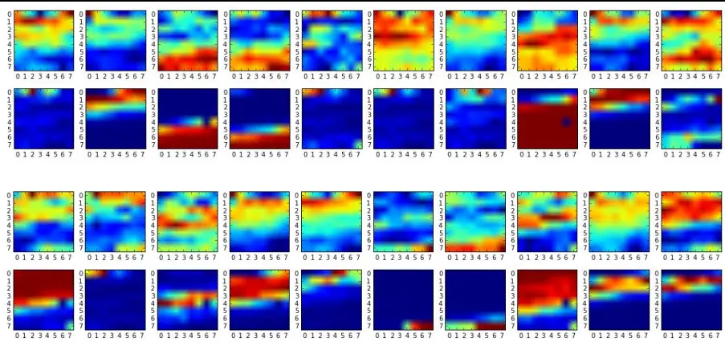
数据来源：国泰君安证券研究

下面是有关模型选择过程。模型选择过程包括神经网络的层次选择和单元个数选择。我们首先固定最后一层隐藏层节点数量为 100个，那么我们网络结构即为：69-S2-100-3，我们对 S2 通过验证集进行验证。验证结果如下：

表 1：69-S2-100-3 结构验证

| S2 | 60 65 70 |
| --- | --- |
| Γ(W) 0.311 0.306 | 75 80 85 0.302 0.297 0.295 |
|  | 0.316 |
|  | 0.292 115 120 125 |
| S2 95 100 | 105 110 |
| Γ(W) 0.301 0.312 0.317 | 0.325 |
|  | 0.331 0.347 0.349 |

数据来源：国泰君安证券研究

可以看到，选取 S2=90 是一个比较好选择，此时损失•(W)为 0.292。继续增加网络层次到五层结构，即 69-S2-S3-100-3，继续通过验证集对 S2、S3两个超参数进行验证，由于二维参数验证结果较为复杂，我们不再列出所有结果，仅以上述情况 S2=90为例，验证结果如表 2所示。

表 2：69-90-S3-100-3 结构验证

| S3 5 | 10 15 20 25 |
| --- | --- |
| 0.290 0.296 | 30 35 0.314 0.312 0.314 0.317 |
|  | Γ(W) 0.284 S3 40 |
| 45 50 |  |
|  | 55 60 65 70 |
| Γ(W) 0.311 0.322 0.327 |  |
|  | 0.325 0.335 0.337 0.329 |

数据来源：国泰君安证券研究

根据验证结果，选择 69-90-5-100-3 结构相对比较合理。以此类推，增加网络维度后，最终网络结构定格为69-90-5-10-100-3，在此结构上增加层次，损失•(W)并没有显著降低，因此我们根据简单性原则，不再增加网络层次。

## 5.2.选股策略构建

通过上述的数据与处理以及编码解码和验证过程，我们以及可以将网络结构确定下来，并且学习出网络中的参数。下面，我们就针对具体换仓日的情况来说明选股步骤。考虑到机构的交易限制，我们这里以月换仓为例来进行实证说明。

在换仓日 T，我们针对沪深 300 指数中的每只股票，分别做以下操作：针对股票S，将其过去时间序列的 69维特征输入到已经学好的神经网络中，检验其编码解码过程中的损失函数 (W)，如果该函数大于阈值Δ'(W)=30(由于所有维度已经用Z-Score正则化到[0,1]区间，所以可以使用静态阈值），则跳过该股票，否则计算其输出层概率值 • (i=1,2,3)。假设y表示排名前20%的股票，则通过两种不同方式做多当期值最高的50只股票：即等权做多或者根据 • 值的输出值配比权重做多。这里有三点需要说明：

首先，考虑到本策略是纯选股策略，因此不做任何的市场择时。但是根据我们之前的理论，如果沪深300中所有股票损失函数∆(W)的均值∆(W)大于某一个阈值∆"，则说明策略在本期失效，应该空仓或者切换到其他策略。因此，虽然我们这里的实证结果没有做这样的操作，但在实际投资过程中，可以通过该指标进行仓位选择和策略选择。

其次，这里我们的策略使用等权做多或者根据输出值配权做多的方式，没有对市场风格和行业做中性处理，一方面是方便和传统动量因子的选股策略做比较；另一方面，我们希望通过神经网络本身学习出市场的不同风格，因此不希望再对因子做处理。

第三，深度组合构建的结果是给出了不同股票在下一期收益能领先指数的概率，并不是具体的组合权重。所以，依然可以对这些股票组合根据已有的风险模型进行权重优化，这一点和传统多因子策略并不矛盾。

具体的策略方案如下：

选股范围：HS300指数成分股

回测时间：2010.5.4-2017.5.4

参数选择：超参数选择网络结构 69-90-5-10-100-3

交易成本：考虑多空双边千三费用

策略方案：

（一）等权做多输出层 • 值最高的50只股票

图 6等权做多选股策略收益曲线
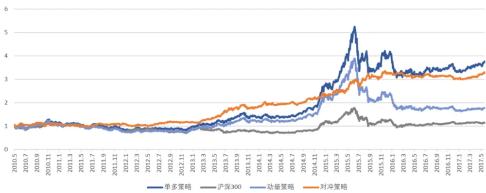
数据来源：国泰君安证券研究

策略的相关指标如表 3 所示。

表 3：等权做多策略相关指标

| 初始净值 | 最终净值 | 年化收益 | 最大回撤 | 最大回撤区间 |
| --- | --- | --- | --- | --- |
| 1 | 3.2565 | 18.372% | 8.33% | 2015-06-09~ |
|  |  |  |  | 2015-08-27 |

数据来源：国泰君安证券研究

## （二）根据输出层 • 值对股票进行配权

图 7根据输出层权重配比选股策略收益曲线
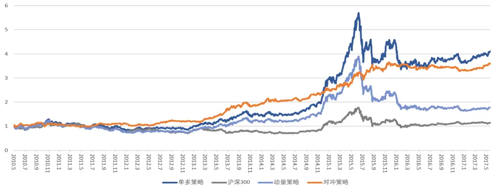
数据来源：国泰君安证券研究

策略的相关指标如表 4 所示。

表 4：根据输出层权重配比策略相关指标

| 初始净值 | 最终净值 | 年化收益 | 最大回撤 | 最大回撤区间 |
| --- | --- | --- | --- | --- |
| 1 | 3.5180 | 19.685% | 8.64% | 2015-06-09~ |
|  |  |  |  | 2015-08-27 |

数据来源：国泰君安证券研究

图6、图7是我们根据以上两种策略方案针对沪深 300选股的回测结果。图中，灰色曲线是策略基准沪深 300，浅蓝色曲线是使用传统多因子中的动量因子在不做任何风格中性和行业中性的情况下跑出的策略，深蓝色曲线是通过构建深度组合跑出的曲线，黄色是对冲沪深 300指数后的结果。可以看到，虽然都是只使用了价格信息，但是深度组合策略比传统动量策略更能体现价格的波动规律，在各个年份基本都能够战胜动量组合，而在动量效应最强的13年至15 年，深度组合更是得到了很大的增强效果。另外，在 15 年中和16 年初两次股灾期间，深度组合的整体回撤也要小于动量策略，也就是说，通过深度组合中的滚动学习方法，神经网络能够更加灵活的根据市场情况调节策略，较好的规避重大回撤节点。另外，不同权重配比方式本身对于策略的影响并不是很大，策略的整体属性特征基本一致。

我们同样在中证500成分股中做了类似实验，策略的调仓方式、换仓周期、换仓手续费以及选股方式都保持一致，在中证500内选股的实验结果如图8 所示。

图 8深度组合在中证500成分股中的表现
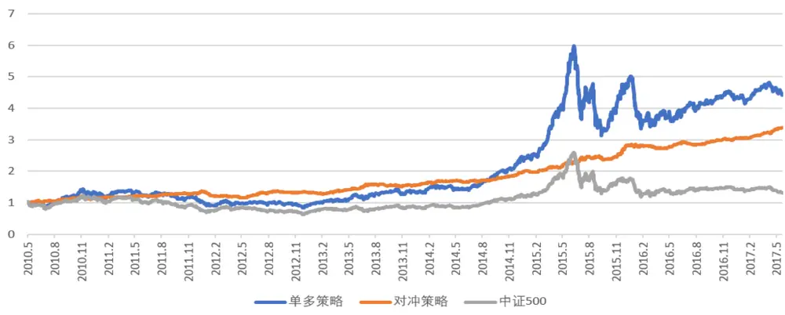
数据来源：国泰君安证券研究

策略的相关指标如表 5 所示。

表 5：中证 500选股策略相关指标

| 初始净值 | 最终净值 | 年化收益 | 最大回撤 | 最大回撤区间 |
| --- | --- | --- | --- | --- |
| 1 | 3.3854 | 19.032% | 9.61% | 2011-11-14~ |
|  |  |  |  | 2012-01-06 |

数据来源：国泰君安证券研究

可以看到，在中证500 中的策略选股效果和沪深300差异不大，在9.61%的最大回撤下可以获得 19.032%的年化收益。

然而，这个回测结果并不能说明深度组合就能够代替传统的因子选股策略，显然，从策略的稳定性、超额收益的信息比角度来说，该策略都无法和做了风险因子中性的阿尔法策略相比。而且，通过上图我们也可以较明确看到，由于没有进行中性操作，策略在各年度的收益差距也较大。在前两年，策略虽然也能稳定跑赢指数，但是提供的阿尔法相对较弱；而在13年至 15年间，策略大幅跑赢指数；之后又经历一段时间的稳定期；到了今年，策略再次战胜传统动量因子，且在今年财务指标因子、风格因子、成长型因子等多种中长期因子失效的年份，提供了很好的超额收益。从年份上看，由于深度组合使用了区别于传统多因子的非线性特征，因此不同年份和传统多因子策略形成了比较好的互补效应。因此，本策略除了自成一体的策略外，亦可以根据•(W)损失函数的情况在多策略之间切换，形成多策略体系。因此，为了表明这些特征，下文将分别从策略归因分析和使用损失函数优化两个角度，更详细地对策略进行进一步分析和优化。

## 5.3. 归因分析

细心的读者可能已经发现，受制于月度换仓策略的样本数据量限制，我们对选股池内不同的股票并没有分别建立模型，而是建立了一个统一的模型。这样的做法其实可能很难挖掘出个股的不同风格，而只能从价格形态中，挖掘出不同股票中价格模式的共性。这就导致我们在通过输出层结果做选股的时候，难免引入各种风格特征和行业特征。我们挑选了Barra 风险模型中最常使用的八个风格因子，即 Beta（超额收益与市场收益的回归系数），BP（市净率的倒数）、Earning Yield（市盈率的倒数）、Growth（盈利增长率）、Leverage（财务杠杆率）、Liquidity（换手率）、Momentum（动量）、Size（对数市值），对策略进行了归因，如图9 所示。

图 9 策略风格偏好
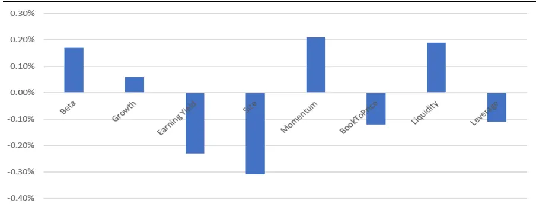
数据来源：国泰君安证券研究

同样，我们也对策略进行了行业配置分析，如图 10所示。

图 10策略行业偏好
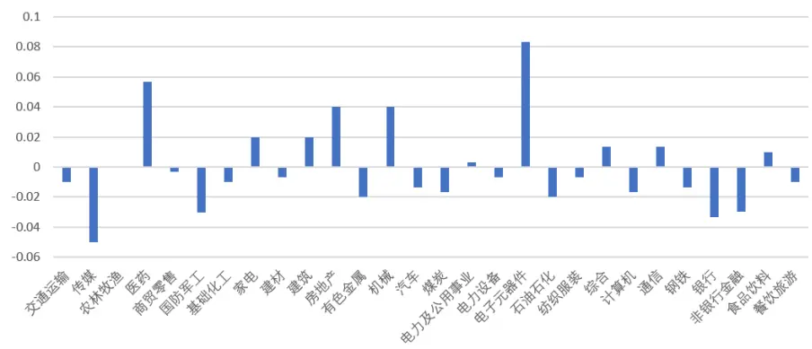
数据来源：国泰君安证券研究

可以看出，相对于沪深 300，策略比较倾向于配置小市值、高盈利性、动量效应、高流动性的股票。行业方面，策略倾向于高配电子元器件、医药、房地产、机械类股票，低配传媒、银行、非银金融、国防军工类股票。可以看出，策略还是具有一定的风格和行业特征，这也正是由于使用统一模型进行因子挖掘导致的。

## 5.4.策略指标分析

上文中提到，损失函数 $\Delta(W)$ 的均值 $\stackrel{-}{.\Delta(\psi)}$ 可以作为策略是否失效的一个重要指标，来判断我们是否应该切换策略。下面，我们针对策略的分年度收益和指标 (W)的关系来进一步观察该指标的可靠性。一个指标对策略的收益判断是否有效，主要需要满足两个条件：

(a) 相关性。即指标和策略收益、回撤表现出较高的相关性，具有相同的变化趋势，或者在统计意义上同向变化。

(b) 非滞后性。即指标不能滞后于策略，否则就没有预判意义。

我们将策略的分月度收益和指标函数的数值列在表6 中，并通过柱状图和折线图（图11）来观察两者的相关性和时间关系。

表 6：策略月度收益与指标关系

| 日期 收益损失 日期 收益损失 日期 收益损失 |
| --- |
| 10.5 5.07468.33 12.9 -0.774116.7015.1 0.428142.17 |
| 10.6 -0.81986.41 12.10-0.251101.9615.2 4.4 116.13 |
| 10.7 -0.69183.34 12.11 0.59095.61 15.3 2.807107.40 |
| 10.8 8.57654.42 12.12-0.17193.19 15.4 3.25 102.88 |
| 10.9 0.27493.52 13.1 -2.78192.97 15.5 8.71697.58 |
| 10.10-2.96092.59 13.2 7.982 70.80 15.6 -0.429111.66 |
| 10.11 1.97371.24 13.3 5.45663.42 15.7 5.927106.06 |
| 10.12-3.238110.22 13.4 2.896 78.58 15.8 4.404 67.34 |
| 11.1 -3.224111.53 13.5 5.182 70.67 15.9 -0.30960.20 |
| 11.2 -2.21488.65 13.6 8.908 80.14 15.10-1.36894.30 |
| 11.3 -1.895104.71 13.7 7.01083.79 15.11 6.14699.31 |
| 11.4 -1.958109.64 13.8 3.71879.07 15.12-0.862125.99 |
| 11.5 -0.37489.62 13.9 6.71967.16 16.1 -0.326110.85 |
| 11.6 3.67274.1813.10-4.065107.7816.2 -0.08 87.29 |
| 11.7 4.83084.94 13.11 2.99795.01 16.3 -3.27 80.00 |
| 11.8 1.786104.9313.12 1.33687.79 16.4 -1.473131.94 |
| 11.9 -1.36389.55 14.1 9.548118.9316.5 0.859107.46 |
| 11.103.03481.16 14.2 -1.906138.0416.6 2.41492.93 |
| 11.11 1.09385.95 14.3 -1.937137.9816.7 -0.705101.13 |
| 11.12-1.10298.52 14.4 1.340110.08 16.8 -0.45385.57 |
| 12.1 -7.02084.24 14.5 1.17493.63 16.9 0.19284.00 |
| 12.2 0.44385.78 14.6 3.53495.5016.10 -0.95100.29 |
| 12.3 1.181 91.02 14.7 -4.722105.1716.11-1.28688.56 |
| 12.4 0.03093.65 14.8 4.39889.91 16.12-1.95384.44 |
| 12.5 3.21565.78 14.9 8.39374.44 17.1 -0.09380.31 |
| 12.6 4.701 85.6314.100.278129.35 17.2 2.09 73.40 |
| 12.7 1.970103.5114.11 3.48396.96 17.3 1.128 78.50 |
| 12.8 6.346 70.84 14.12 5.396 84.19 17.4 2.89682.33 |

数据来源：国泰君安证券研究

图 11策略月度收益与指标关系
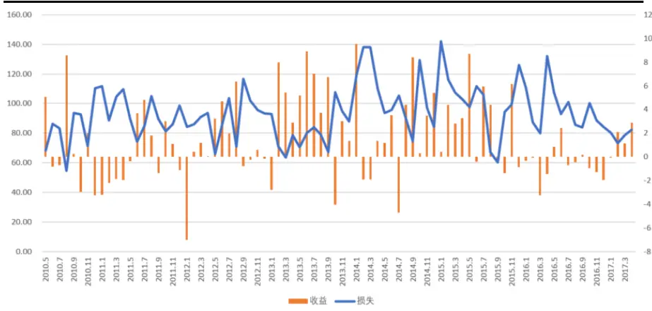
数据来源：国泰君安证券研究

从图表中不难看出，在损失函数 (W)较大时，策略的因子提取效果不好，对应的收益率较低；反之，在损失函数较小时，策略收益较高。另外，由于损失函数•(W)是我们在每月第一个交易日的换仓时间即可算出，而策略收益是在下一个月才得到的，因此，同期的损失函数是领先于策略收益的，因此，在计算两者相关性时无需对策略月度收益做滞后处理。我们针对上述策略的月度收益和损失函数计算两者的相关性，其相关性绝对值高达 0.3776（之所以取绝对值因为两者是反向变动关系），说明指标策略有很好的预测性。

## 5.5.利用损失函数优化策略

根据损失函数对我们的启示，当 $\stackrel{-}{\Delta}(\psi)$ 较大时，策略具有较低的置信度水平，秉着不做不确定性收益的原则，我们可以在损失函数较大的时候放弃该策略，转向其他策略，或者最简单的，使用基准来构建组合。为了进一步证明该损失函数的有效性，我们构建了以下策略：对每个换仓日，如果损失函数Δ(W)超过某一静态阈值（这里选择∆(W)=100)，则本期仓位使用基准沪深300指数成分股代替。也就是说，对于置信度不高的时间区间，放弃策略，回测结果如图12所示。

图 12深度组合选股收益曲线
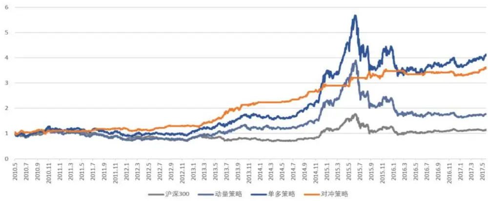
数据来源：国泰君安证券研究
策略的相关指标如表 7 所示。

表 7：策略相关指标

| 初始净值 | 最终净值 | 年化收益 | 最大回撤 | 最大回撤区间 |
| --- | --- | --- | --- | --- |
| 1 | 3.5801 | 19.985% | 6.14% | 2015-07-24~ |
|  |  |  |  | 2015-09-15 |

数据来源：国泰君安证券研究

可以看到，通过放弃对置信度不高的时间区间的投资，策略的稳定性得到了提升，最大回撤从 8.33%降低到 6.14%，年化收益从 18.372%提升到 19.985%。

## 6. 总结与展望

## 6.1.深度组合选股方法的优势和不足

从本篇报告的阐述中不难看出，深度组合选股的方法和传统方法既有关联又有补充，总体来说，其优势有以下几方面：

第一，深度组合可以学习出传统选股方法中没有使用到的非线性特征。随着大数据时代的到来，能够用于投资研究的数据越来越多，同时，如果我们愿意提高换仓频率和换手率，更多的日内交易信息也可以被深度神经网络运用起来。而为了学习出良好的非线性特征，考虑到神经网络中巨大的参数量，充足的数据量显然是必不可少的条件，而日内信息和海量数据提供了很好数据源。虽然在本篇报告中，我们还没有将数据信息增加到日内频度，就已经看到了较好的学习结果，因此，后续我们会对日内信息进行充分挖掘，充分利用神经网络这方面的优势。

第二，深度组合的特征维度可控。由于每层的节点选择是由模型选择确定的，每层节点数量也可以随着不同的应用需求进行调整，所以从该角度来说，特征数量是可控的。

第三，解决投资者对神经网络的“过拟合恐惧症”。其实，随着数据量的增加，我们完全可以做到训练过程和回测过程完全独立，而且，可以用验证集对结果进行验证。

然而，深度组合最大的不足就在于所谓的“黑箱”问题。神经网络参数复杂，隐含层得到的非线性特征很难像传统的因子那样用直观的金融意义来解释。但是从另一个角度来说，理解因子的金融含义，其本质目的还是为了在实际投资过程中做到风险可控，即一旦策略出现较大回撤，可以了解其回撤的原因，从而结合市场信息作出判断。本篇报告通过引入策略判定指标的方式也从另一个角度变相解决了这个问题。当然，文中也提到，如果只对收益进行建模，不做任何风险处理，深度组合还难以在稳定性上和传统选股策略相比，因此这也是深度组合未来研究的主要方向。

## 6.2.深度组合方法的未来应用

深度组合最大的使用场景一定是在更加高频、更加高信息量的日内交易中，对这一点我们深信不疑。考虑到国内对于这方面交易的限制，我们还很难直接构建T+0的策略。然而，使用日内信息进行 T+1或者底仓交易，或者在期货交易中使用，一定是深度组合方法最适合的应用场景。当然，随着数据量的提升，深度神经网络的复杂度也会伴随提高，深度学习面临更大的挑战。但是，本篇报告从日间的信息已经能做到还不错的收益，这让我们对未来充满憧憬。

## 本公司具有中国证监会核准的证券投资咨询业务资格

## 分析师声明

作者具有中国证券业协会授予的证券投资咨询执业资格或相当的专业胜任能力，保证报告所采用的数据均来自合规渠道，分析逻辑基于作者的职业理解，本报告清晰准确地反映了作者的研究观点，力求独立、客观和公正，结论不受任何第三方的授意或影响，特此声明。

## 免责声明

本报告仅供国泰君安证券股份有限公司（以下简称“本公司”）的客户使用。本公司不会因接收人收到本报告而视其为本公司的当然客户。本报告仅在相关法律许可的情况下发放，并仅为提供信息而发放，概不构成任何广告。

本报告的信息来源于已公开的资料，本公司对该等信息的准确性、完整性或可靠性不作任何保证。本报告所载的资料、意见及推测仅反映本公司于发布本报告当日的判断，本报告所指的证券或投资标的的价格、价值及投资收入可升可跌。过往表现不应作为日后的表现依据。在不同时期，本公司可发出与本报告所载资料、意见及推测不一致的报告。本公司不保证本报告所含信息保持在最新状态。同时，本公司对本报告所含信息可在不发出通知的情形下做出修改，投资者应当自行关注相应的更新或修改。

本报告中所指的投资及服务可能不适合个别客户，不构成客户私人咨询建议。在任何情况下，本报告中的信息或所表述的意见均不构成对任何人的投资建议。在任何情况下，本公司、本公司员工或者关联机构不承诺投资者一定获利，不与投资者分享投资收益，也不对任何人因使用本报告中的任何内容所引致的任何损失负任何责任。投资者务必注意，其据此做出的任何投资决策与本公司、本公司员工或者关联机构无关。

本公司利用信息隔离墙控制内部一个或多个领域、部门或关联机构之间的信息流动。因此，投资者应注意，在法律许可的情况下，本公司及其所属关联机构可能会持有报告中提到的公司所发行的证券或期权并进行证券或期权交易，也可能为这些公司提供或者争取提供投资银行、财务顾问或者金融产品等相关服务。在法律许可的情况下，本公司的员工可能担任本报告所提到的公司的董事。

市场有风险，投资需谨慎。投资者不应将本报告作为作出投资决策的唯一参考因素，亦不应认为本报告可以取代自己的判断。
在决定投资前，如有需要，投资者务必向专业人士咨询并谨慎决策。

本报告版权仅为本公司所有，未经书面许可，任何机构和个人不得以任何形式翻版、复制、发表或引用。如征得本公司同意进行引用、刊发的，需在允许的范围内使用，并注明出处为“国泰君安证券研究”，且不得对本报告进行任何有悖原意的引用、删节和修改。

若本公司以外的其他机构（以下简称“该机构”）发送本报告，则由该机构独自为此发送行为负责。通过此途径获得本报告的投资者应自行联系该机构以要求获悉更详细信息或进而交易本报告中提及的证券。本报告不构成本公司向该机构之客户提供的投资建议，本公司、本公司员工或者关联机构亦不为该机构之客户因使用本报告或报告所载内容引起的任何损失承担任何责任。

## 评级说明

## 1.投资建议的比较标准

投资评级分为股票评级和行业评级。

以报告发布后的12个月内的市场表现为比较标准，报告发布日后的 12个月内的公司股价（或行业指数）的涨跌幅相对同期的沪深 300 指数涨跌幅为基准。

## 2.投资建议的评级标准

报告发布日后的 12 个月内的公司股价（或行业指数）的涨跌幅相对同期的沪深 300 指数的涨跌幅。

|  | 评级 说明 |  |
| --- | --- | --- |
| 股票投资评级 | 增持 | 相对沪深 300指数涨幅15%以上 |
|  | 谨慎增持 | 相对沪深300指数涨幅介于5%～15%之间 |
|  | 中性 | 相对沪深 300指数涨幅介于-5%～5% |
|  | 减持 | 相对沪深300指数下跌 5%以上 |
| 行业投资评级 | 增持 | 明显强于沪深 300 指数 |
|  | 中性 | 基本与沪深 300指数持平 |
|  | 减持 | 明显弱于沪深300指数 |

## 国泰君安证券研究所

|  | 上海 | 深圳 | 北京 |
| --- | --- | --- | --- |
| 地址 | 上海市浦东新区银城中路168号上海 银行大厦29层 | 深圳市福田区益田路 6009 号新世界 商务中心34层 | 北京市西城区金融大街 28 号盈泰中 心2号楼10层 |
| 邮编 | 200120 | 518026 | 100140 |
| 电话 | （021)38676666 | （0755）23976888 | (010)59312799 |
|  | E-mail: gtjaresearch@gtjas.com |  |  |