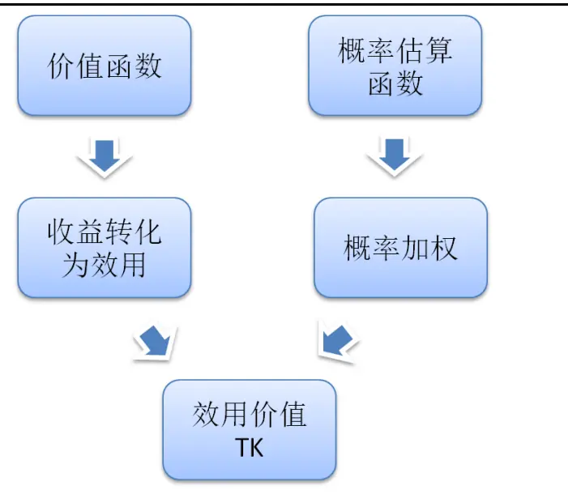
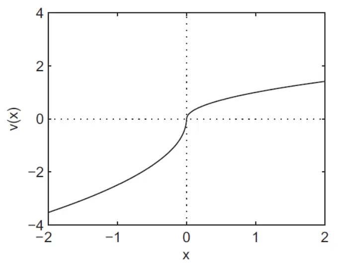
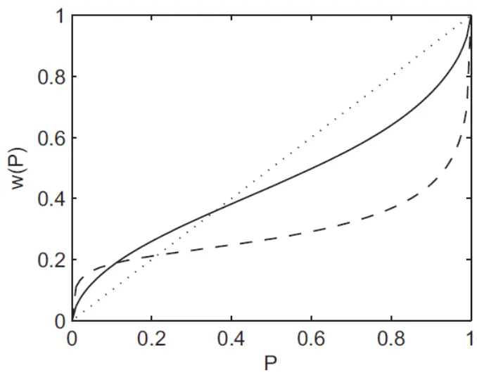
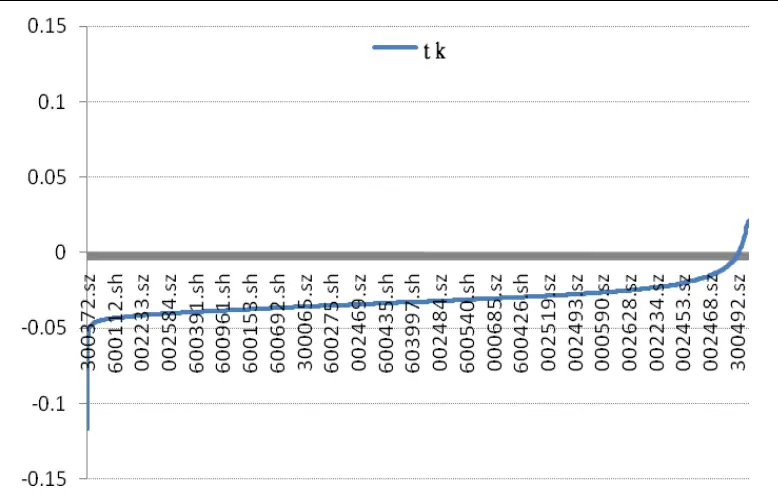
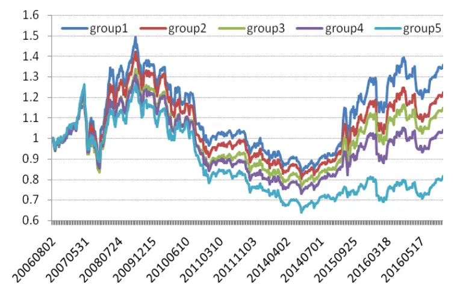
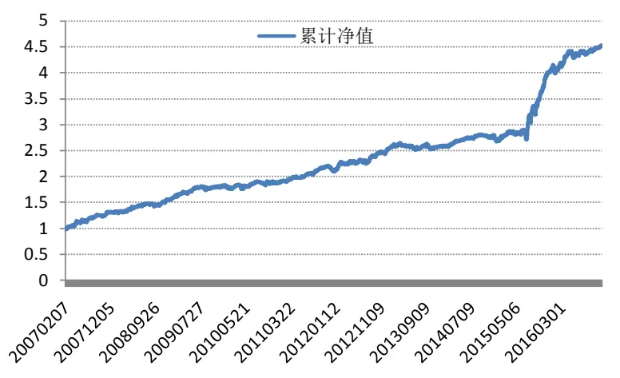
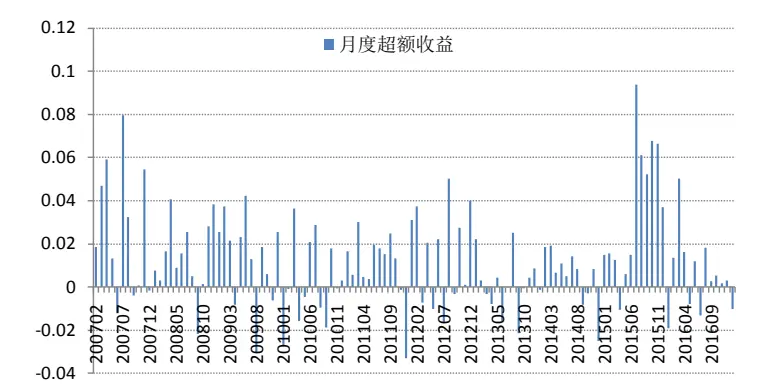
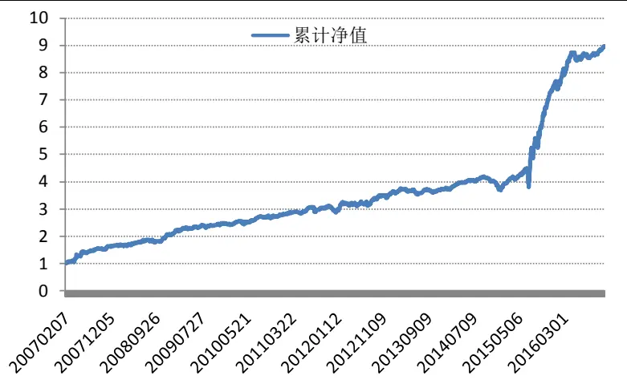
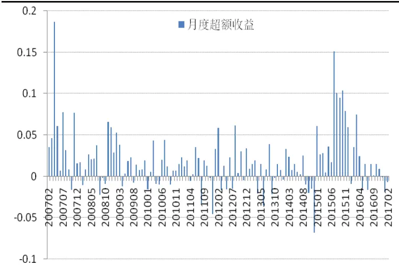

inInfo] [Table_Title] 2017.07.18

# 基于前景理论的选股策略

## ――数量化专题之九十八

陈奥林（分析师）

## 刘富兵（分析师）

8 021-38674835

021-38676673

chenaolin@gtjas.com

证书编号 S0880516100001

liufubing008481@gtjas.com

S0880511010017

## 本报告导读：

效用价值用于衡量人们对商品价值主观心理评价的指标。效用价值取决于人的欲望以及人对标的物的估价，即心中的预期。通过量化的方法可以观测股票的效用价值。

## 摘要：

[Table_Summary] • 从行为金融角度出发，能够从其特殊的逻辑层面挖掘独特的Alpha 收益来源，同时其也可有效的扩充 Alpha 因子的逻辑跨度，提高策略整体的稳定性。

本文以前景理论为蓝本，将历史收益风险特征作为投资者价值编译过程的输入变量，刻画不同预期收益在投资者心中的效用价值。同时，通过概率估算函数来模拟投资者心中对每个收益结果预估的概率，最终，根据概率赋权加总求得综合效用价值。

- 基于前景理论中所得到的效用越高的股票即为在投资者心中较为划算的股票，之后越易受追捧，后续容易走低。反之，效用低的股票会遭投资者冷落，后续走高。

- 基于TK因子构建的选股策略相对于中证800可取得年化15%的超额收益，相对于中证 500 可获得22%的年化超额收益，效果显著。

行为金融类因子在个人投资者参与度较高的个股上效果更加显著，这源于机构投资者决策模式与个人投资者不同。一方面，机构投资者更关注个股对组合收益的影响。另一方面，机构投资者基于盈利预测进行投资者决策，而个人投资者更多基于历史收益特征外推。

金融工程

## 金融工程团队：

刘富兵：（分析师）

电话：021-38676673

邮箱：liufubing008481@gtjas.com

证书编号：S0880511010017

## 陈奥林：（分析师）

电话：021-38674835

邮箱：chenaolin@gtjas.com

证书编号：S0880516100001

## 李辰：（分析师）

电话：021-38677309

邮箱：lichen@gtjas.com

证书编号：S0880516050003

## 孟繁雪：（分析师）

电话：021-38675860

邮箱：mengfanxue@gtjas.com

证书编号：S0880517040005

## 蔡旻昊：（研究助理）

电话：021-38674743

邮箱：caiminhao@gtjas.com

证书编号：S0880117030051

## 殷明：（研究助理）

电话：021-38674637

邮箱：yinming@gtjas.com证书编号：S0880116070042

## 叶尔乐：（研究助理）

电话：021-38032032

邮箱：yeerle@gtjas.com

证书编号：S0880116080361

## 殷钦怡：（研究助理）

电话：021-38675855

邮箱：yinqinyi@gtjas.com

证书编号：S0880117060109

## [Table_R相关报告

《基于深度组合的选股策略》2017.07.11

《板块及行业指数价格分段研究》2017.07.05《基于信息冲击视角的盈余公告效应研究》2017.07.04

《回撤控制下的最优化大类资产配置策略》2017.07.03

《基于短周期价量特征的多因子选股体系》2017.06.15

## 1. 概述

2017年是多因子选股较为艰难的一年，由于今年特殊的市场环境，龙头白马成为市场追捧的热点，资金抱团“漂亮50”走出了大小盘分化的行情。2017年上半年，多数Alpha因子遭遇回撤。在反思中，我们发现没有单一因子能够永远保证稳定的Alpha收益。为了提高整个组合的稳定性，我们需要备选因子在逻辑层面上更加分散化。目前来看，市场上多因子的备选因子主要分三大类，分别为市场类、一致预期类、财务类。虽然整体因子的数量已有相当的规模，但其在逻辑维度上的跨度明显较窄。因此，我们希望从行为金融的角度加入新因子，在提供有效 Alpha收益的同时，丰富备选因子逻辑维度多样化。

行为金融学从微观个体行为以及产生这种行为的心理等动因来解释、研究和预测市场的未来走势。具体来说，其通过研究投资者个体的思维决策过程，探究这个过程中个体非理性所产生的偏差来挖掘相应的投资机会。因此，行为金融能够从其特殊的逻辑层面产生独特的 Alpha收益来源，同时其也可有效的扩充 Alpha因子的逻辑跨度，提高策略整体的稳定性。

前景理论是行为金融学的一个重要部分，其描述了在不同的风险预期条件下，投资者的行为倾向是可以预测的。具体来说，在盈利状态下，投资者是风险厌恶的，投资者更倾向于确定性收益。相对地，在亏损状态下，投资者是风险偏好的，相比确定性亏损，投资者更倾向于”搏一把”。因此，前景理论通过刻画投资者的决策过程，量化每一种预期收益对于投资者的价值效用。然而，在实际投资的过程中，由于多数投资者的决策过程符合前景理论，从而导致效用越高（低）的股票，越易受投资者追捧（冷落），从而被高(低)估后续走低（高）。

相比于传统金融学模型，行为金融模型最大的不同在于其考虑了投资者心理特征的非线性变化。具体而言，预期收益与效用价值并不是线性对应的关系，随着预期收益的提高，其对应效用价值的提升速度是逐渐降低而非恒定的。

本文从前景理论出发，以历史收益序列作为投资者价值编译过程的输入变量，通过前景理论来刻画不同股票在投资者心中的投资效用，并投资效用较低被投资者低估的股票，获取了显著的收益。此外，本文不仅为了提供一个有效的选股因子，更加希望通过行为金融的研究，开启新的研究方向。

## 2. 核心逻辑

一句话概括策略的核心逻辑:许多投资者在心中通过股票的历史收益来编译其风险收益特征，即在心中形成标的股票的印象。在此基础上，由于多数投资者的决策过程符合前景理论，从而导致投资者的效用评估过程相似度较高，进而效用价值较高的股票被追捧，因此被高估。相对地，效用价值较低的股票遭冷落，价值低估。所以，我们基于股票的效用价值，选择被低估的股票进行投资，从而获取收益。

## 3. 前景理论简介

前景理论包含两个部分，“价值编译”和“效用评估”。 首先，价值编译即是投资者在在心中生成标的股票的风险和收益预期的过程。具体来说，投资者会基于标的品种的收益特征，评估自身承担了什么样的风险，又能获取什么样的投资收益，并据此得出未来预期的多种可能发生的收益情况。第二步，在评估环节，投资者会根据价值编译所生成的收益风险特征，并对所有预期可能发生的情况进行效用评估，形成一个综合的效用价值。

在对前景理论的量化实现过程中，核心难点在于如何对投资的价值编译阶段进行量化定义。以 50：50 硬币实验为例，一个投资者在进行实验时给出的回答，可能与实验结束后给出的回答完全不同。也就是说，实验中很难找到一个指标稳定地符合大多数投资者的价值编译过程。然而，在股票投资中，这个问题可以得到相应的简化。从交易层面来说，大部分投资者对股票的风险收益特征所形成的印象来源于过去的收益时间序列。并且更重要的是，投资者潜意识总是觉得过去的收益特征可以在未来进行外推应用。因此，我们可以基于标的品种过去一段时间的收益风险特征来刻画其在投资者心中的风险特征。

## 4. TK 因子构建

如上所述，本篇报告策略的核心逻辑在于投资效用价值较低，被投资者冷落从而被低估的股票。因此，我们需要基于前景理论的数量化方法来观测每一只股票在投资者心中的综合效用价值，即TK 值。

如图1所示，TK值（综合效用价值）由两部分构成，预期收益所对应的效用价值和预期收益在投资者心中发生的概率。简单来说，每一种可能发生的收益情况在投资者心中对应着相应的效用。而与此同时，该情况在投资者心中也对应着其预期发生的概率。如何量化效用价值和预期概率，在本篇报告中，将通过价值效用函数和概率估算函数来实现估算。

价值效用函数以前景理论为基础，能够根据每一个输入的股票预期收益估算出该收益对应到投资者心中的效用价值。例如，输入预期收益 0.6，输出效用价值0.53。

但是，价值效用函数只能对单一预期收益进行效用估算。为了得到一个综合的效用价值，我们需要对观测期的多个预期收益分配权重，而如何对不同收益分配权重则需要通过概率估算函数来获得。因此，我们基于概率估算函数模拟投资者心中的概率分布状态，从而计算预期收益对应的预期概率。

结合实际的因子构建流程，当我们拥有n 日的股票收益后，即可通过价值效用函数生成对应的n个效用价值。同时，我们通过概率估算函数对每日股票收益分配不同的权重，从而加总得到最终的效用价值（TK），即 TK=∑∏iv(xi)

图 1 TK 值构成

数据来源：国泰君安证券研究

## 4.1.价值效用函数

效用价值是亚里士多德19世纪70 年代提出，用于衡量人们对商品价值主观心理评价的一个指标。简单来说，效用价值取决于人的欲望以及人对标的物的估价，不表示标的物内在的性质。而标的的价格取决于其在投资者心中的价值，换句话说，效用价值决定标的价格。

在股票市场中，标的股票预期收益越高，其相应的效用价值也就越高。但是，预期收益和效用价值的关系却并不是恒定不变的。具体来说，行为金融研究发现投资者心理的效用与预期收益的关系呈非线性特征。以前景理论的经典实验为例，

A.你一定能赚 30000 元。

B.你有80%可能赚40000元，20%可能性什么也得不到。

实验结果是，大部分人都选择 A。但是，基于传统金融学理性投资者的假设背景下，选择B才是最优选择，其期望值更高(32000元)。这就说明，在盈利状态下，投资者是风险厌恶的，其心理上会受确定性效应的影响，从而选择期望较低的选择A。因此，我们需要从行为金融的角度出发，找到预期收益和效用价值的对应关系，从而更准确的评估每一个股票标的在投资者心中的效用价值。

本节我们需要使用价值效用函数来计算预期收益所对应的投资效用。其中，基于前景理论中风险偏好的不对称性，我们给予盈利状态较低的风险偏好，同时设定亏损状态下更高的风险偏好。从图2 中可以看出，随着预期收益的提高，效用价值提升的速度降低。此外，我们参照 Tverskyand Kahneman (1992)最早提出的前景理论文献对参数进行赋值，α取0.88，λ取 2.25。该赋值源于心理学研究，恒定且敏感性较低。

$$
v(x){=}\left\{\begin{array}{ll}{{x^{\alpha}}}&{{\mathrm{for}\quad x\geq0}}\\{{-\lambda(-x)^{\alpha}}}&{{x<0}}\end{array}\right.
$$

图2 价值效用函数

数据来源：国泰君安证券研究

## 4.2.概率估算函数

在科学研究的过程中，我们可以通过统计的方法计算相关结果发生的概率，在样本足够大的基础上，统计结果趋于稳定。然而，科学统计的概率并不一定能作为决策的依据，因为其与投资者心中感知的发生概率并不完全一致。

具体来看，投资者由于赌博和恐惧心理，从而会放大极端事件发生的概率。例如，买彩票的时候，虽然已知中奖率为0.01%，但当我们买入的时候，我们心里感知上的概率将远高于0.01%，可能为 0.1% 甚至更高。这源于人们心理上过度自信的影响，博彩时内心已经假定自己就是那个幸运儿。相对地，黑天鹅事件之所以称之为黑天鹅是因为其本身发生的概率并不高，由于黑天鹅事件对收益的打击过于沉重，即使其发生的概率极小，投资者依然会有针对性的进行风险控制。因此，恐惧会令投资者心理上放大黑天鹅事件发生的概率。

结合到实际的投资过程中，投资者往往会观测标的股票过去一段时间的价格走势，从而在心中外推形成多种可能的收益预期。同时，考虑到我们之前所提到的投资者对极端事件发生几率的放大效应，我们通过概率估算函数来求得投资者心中感知的概率。

此外，在实际的研究中，我们发现前景理论中效用的部分核心解释力来源于“彩票效应”。具体来说，历史具有正偏度的股票拥有很强的彩票属性，该类股票对投资者吸引力较高，投资者在评估其发生概率时过于乐观，从而推高了其当下的股价，降低了未来的收益。

综上所述，在概率配权过程中，模型需要赋予极端收益更高的权重，从而贴近投资者心理活动。具体来说，如图3 所示，概率估算函数整体呈现波浪形，其计算的概率与传统结果的最大不同在于其在极端值变化较快，而非线性变化。其中，通过加入概率估算函数中的参数γ或δ，我们能够有效的提高极端收益的概率权重。其中，当γ=1时，函数斜率保持不变。当当γ变小，函数斜率在两段相应变大。那么，如何确定参数γ或δ，这取决于投资者心中对极端事件过度效应的扭曲程度。从科学的角度出发，基于 Tversky and Kahneman (1992)的心理实验，我们选取该实验结果所对应的扭曲程度来模拟投资者心理概率分布。

$$
w^{+}(P)=\frac{P^{\gamma}}{(P^{\gamma}+(1-P)^{\gamma})^{1/\gamma}},w^{-}(P)=\frac{P^{\delta}}{(P^{\delta}+(1-P)^{\delta})^{1/\delta}}
$$

图 3 概率估算函数

数据来源：国泰君安证券研究

由于概率估算函数所得的是总概率，我们需要通过计算边际变化来获取目标收益的概率权重，即：

$$
\pi_{i}=\left\{\begin{array}{ll}{{w^{+}(p_{i}+...+p_{n})-w^{+}(p_{i+1}+...+p_{n})}}&{{\mathrm{for}~\stackrel{0\leq i\leq n}{-m\leq i<0}}}\\{{w^{-}(p_{-m}+...+p_{i})-w^{-}(p_{-m}+...+p_{i-1})}}&{{\mathrm{for}~\stackrel{-}{-m\leq i<0}}}\end{array}\right.
$$

## 4.3.效用在时间序列的衰减

由于不同时间节点对于投资者的参考价值是不同的，离当前时间越近的收益风险特征会被赋予更高的权重。因此，我们将进一步考虑效用价值在时间上的衰减影响。通过在模型中加入半衰期因子 Rho(Rho=0.98),降低时间较远的样本所产生的效用权重，提高近期样本的效用权重。

## 4.4. TK 因子计算

Step 1.

取过去60周收益，计算每周衰减系数，衰减系数 $\ c=\mathrm{Rho}^{\mathrm{n}}\quad(\mathrm{n}{=}1\dots60)$

Step 2.

将过去60周收益按从负到正进行排序。例如，一共有 m个负收益，n个正收益，

则为：

$$
(r_{-m},{\frac{1}{60}};r_{-m+1},{\frac{1}{60}};\ldots;r_{-1},{\frac{1}{60}};r_{1},{\frac{1}{60}};\ldots;r_{n-1},{\frac{1}{60}};r_{n},{\frac{1}{60}}),
$$

可以看出，每一个收益发生的概率皆为1/60

Step 3.

$$
\begin{array}{r}{\mathrm{TK}(\rho)\equiv\underset{\varrho}{\overset{1}{\sum}}\underset{i=-m}{\overset{-1}{\sum}}\rho^{t(i)}v(r_{i})\Bigg[w^{-}\left(\frac{i+m+1}{60}\right)-w^{-}\left(\frac{i+m}{60}\right)\Bigg]}\\{+\underset{\varrho}{\overset{1}{\sum}}\underset{i=1}{\overset{n}{\sum}}\rho^{t(i)}v(r_{i})\Bigg[w^{+}\left(\frac{n-i+1}{60}\right)-w^{+}\left(\frac{n-i}{60}\right)\Bigg]}\end{array}
$$

其中:

$$
v(x){=}\left\{\begin{array}{ll}{{x^{\alpha}}}&{{\mathrm{for}\quad x\geq0}}\\{{-\lambda(-x)^{\alpha}}}&{{x<0}}\end{array}\right.
$$

$$
w^{+}(P)=\frac{P^{\gamma}}{(P^{\gamma}+(1-P)^{\gamma})^{1/\gamma}},w^{-}(P)=\frac{P^{\delta}}{(P^{\delta}+(1-P)^{\delta})^{1/\delta}},
$$

$$
\underline{{\mathbf{\rho}}}=\boldsymbol{\rho}+\ldots\boldsymbol{\rho}^{60}
$$

参数：

$$
\alpha{=}0.88,\lambda{=}2.25
$$

$$
\gamma=0.61,\delta=0.69.
$$

## 5. TK 因子评价

## 5.1. 因子描述

以2016年8 月23 日个股TK得分为例，从图4可以看出，TK值在极端收益呈现快速的变化。具体来看，虽然效用函数在两段斜率会变缓，但是，投资者会给予极端收益更高的概率权重，从而导致其最终 TK值在极端时较高。其中值得一提的是，TK值越低，股票在投资者心中的效用越低，但这并不代表其过去跌幅大。举例来说，一个阴跌30%的股票相比暴跌20%后横盘的股票，其效用值却更高。

图 4 因子描述

数据来源：国泰君安证券研究

## 5.2. 因子区分度

为了考核TK因子对股票收益预测能力的稳定性，我们每月按股票 TK值等量分为5 组，等权重构建投资组合，每组300-400 只股票。其中，L1 为TK最小组，L5 为 TK最大组。从图 5可以看出，TK因子对未来收益有显著的区分能力。各组收益呈单调递增，TK值越小，未来收益越高。

图 5

数据来源：国泰君安证券研究

## 6. 基于 TK因子的策略表现

## 6.1. 组合构建

## 6.1.1. 标的指数选择

基于前景理论构建的策略更适用于散户持股高的股票池中，这源于机构投资者的思维模式与个人投资者或有所不同。其一，机构投资者通常站在股票组合的角度考察单一股票持仓变化对整体收益的影响。然而，个人投资者通常站在单一股票的角度进行评估。其次，机构投资者有着更好的研究支持，其更关注基于未来逻辑推荐所得的预测收益而非历史收益。相比之下，个人投资者更多的是基于历史价格涨跌来进行价值编译过程。

因此，我们需要扩大标的股票的备选范围，但为了尽可能小的避免风格暴露，我们分别选取中证800 等权和中证500作为标的指数，并分别进行行业中性处理。

## 6.1.2. 样本空间

考虑实际操作可行性，剔除停牌股票、剔除ST 股票，同时为了更好的提高行业权重的分散化程度，策略以中证500成分股作为股票池。

## 6.1.3. 换仓频率

策略采用月度换仓频率，策略在每月最后一个交易日构建投资组合，于次月第一个交易日均价进行换仓。

## 6.1.4. 交易成本

手续费为单边千分之三，建仓成本为当日均价。同时，考虑到实际投资时的流动性，如果上期持仓股票、下期标的股票换手率小于万分之五或者当日停牌，将默认无法卖出、买入。

## 6.2. 对冲中证 800 表现

## 6.2.1. 累计净值走势

从图6中可以看出，TK组合相对于中证 800等权指数有着显著稳定的超额收益。从2007年2 月至 2017 年2 月，策略获得了 309%的累计超额收益，年化超额收益15.01%，信息比率2.03。这对于一个单因子组合是一个非常不错的表现。

图6 对冲中证800净值

数据来源：国泰君安证券研究

## 6.2.2. 月度收益

从图7中可以看出，TK组合相对于中证 800等权指数月度胜率约 70%，收益显著。组合单月最大负收益-3.3%，整体表现稳定。

图7 对冲中证800等权月度表现

数据来源：国泰君安证券研究

## 6.2.3. 年度收益

如表1所示，TK组合相对于中证 800等权指数超额收益稳定，整体年度收益分布较为均匀。可以看出，TK组合在类似于2015 年情绪化严重的市场中超额收益更加显著。

表1 对冲中证800年度表现

| 年份 | 2007 | 2008 | 2009 | 2010 | 2011 | 2012 | 2013 | 2014 | 2015 | 2016 | 2017 |
| --- | --- | --- | --- | --- | --- | --- | --- | --- | --- | --- | --- |
| 超额收益 | 32.1% | 17.95% | 17.85% | 2.67% | 12.15% | 20.66% | 1.70% | 5.34% | 51.98% | 8.36% | -1.18% |
| 最大回撤 | -4.4% | -4.12% | -4.45% | -4.55% | -4.92% | -4.87% | -4.97% | -4.52% | -6.45% | -3.75% | -1.19% |

数据来源：国泰君安证券研究

## 6.3. 对冲中证 500 表现

## 6.3.1. 累计净值走势

从图8中可以看出，TK组合相对于中证 500指数超额收益显著。从2007年2 月至 2017 年 2 月，策略获得了 692%的累计超额收益，年化超额收益 22.87%，信息比率 2.11。

图8 对冲中证500净值

数据来源：国泰君安证券研究

## 6.3.2. 月度收益

从图9中可以看出，TK组合相对于中证 800等权指数月度胜率约 73%，收益显著。组合单月最大负收益-5.8%，整体表现稳定。

图9 对冲中证500月度表现

数据来源：国泰君安证券研究

## 6.3.3. 年度收益

如表2所示，TK组合相对于中证 500指数超额收益显著，各年份分布较为均匀。但是，TK组合在类似于 2013年分化行情中，表现较为不稳定。

表2 对冲中证500年度表现

| 年份 | 2007 | 2008 | 2009 | 2010 | 2011 | 2012 | 2013 | 2014 | 2015 | 2016 | 2017 |
| --- | --- | --- | --- | --- | --- | --- | --- | --- | --- | --- | --- |
| 超额收益 | 65.7% | 23.15% | 21.35% | 11.48% | 6.06% | 22.20% | 4.88% | 3.68% | 107.8% | 15.30% | -1.30% |
| 最大回撤 | -4.30% | -4.14% | -3.30% | -4.10% | -5.86% | -6.47% | -4.91% | -7.36% | -9.8% | -3.13% | -3.92% |

数据来源：国泰君安证券研究

## 7. 总结

本文以前景理论为蓝本，将历史收益风险特征作为投资者价值编译过程的输入变量，刻画不同预期收益在投资者心中的效用价值。同时，通过概率估算函数来模拟投资者心中对每个收益结果预估的概率，最终，根据概率赋权加总求得综合效用价值。

从行为金融角度出发，能够从其特殊的逻辑层面挖掘独特的 Alpha收益来源，同时其也可有效的扩充Alpha因子的逻辑跨度，提高策略整体的稳定性。

效用价值是投资者进行决策的核心依据，其表现形式较为抽象，但我们可以通过不同的模型对其进行量化实现，从而更好的了解不同股票在投资者心中的效用价值，进而构建量化策略。在此基础上，未来主要有两个研究方向，其一，完善效用评估模型，更好的对投资者的决策进行模拟。其二，考虑投资者的思维模式是否会受市场情绪影响，从而影响模型的有效性。

## 本公司具有中国证监会核准的证券投资咨询业务资格

## 分析师声明

作者具有中国证券业协会授予的证券投资咨询执业资格或相当的专业胜任能力，保证报告所采用的数据均来自合规渠道，分析逻辑基于作者的职业理解，本报告清晰准确地反映了作者的研究观点，力求独立、客观和公正，结论不受任何第三方的授意或影响，特此声明。

## 免责声明

本报告仅供国泰君安证券股份有限公司（以下简称“本公司”）的客户使用。本公司不会因接收人收到本报告而视其为本公司的当然客户。本报告仅在相关法律许可的情况下发放，并仅为提供信息而发放，概不构成任何广告。

本报告的信息来源于已公开的资料，本公司对该等信息的准确性、完整性或可靠性不作任何保证。本报告所载的资料、意见及推测仅反映本公司于发布本报告当日的判断，本报告所指的证券或投资标的的价格、价值及投资收入可升可跌。过往表现不应作为日后的表现依据。在不同时期，本公司可发出与本报告所载资料、意见及推测不一致的报告。本公司不保证本报告所含信息保持在最新状态。同时，本公司对本报告所含信息可在不发出通知的情形下做出修改，投资者应当自行关注相应的更新或修改。

本报告中所指的投资及服务可能不适合个别客户，不构成客户私人咨询建议。在任何情况下，本报告中的信息或所表述的意见均不构成对任何人的投资建议。在任何情况下，本公司、本公司员工或者关联机构不承诺投资者一定获利，不与投资者分享投资收益，也不对任何人因使用本报告中的任何内容所引致的任何损失负任何责任。投资者务必注意，其据此做出的任何投资决策与本公司、本公司员工或者关联机构无关。

本公司利用信息隔离墙控制内部一个或多个领域、部门或关联机构之间的信息流动。因此，投资者应注意，在法律许可的情况下，本公司及其所属关联机构可能会持有报告中提到的公司所发行的证券或期权并进行证券或期权交易，也可能为这些公司提供或者争取提供投资银行、财务顾问或者金融产品等相关服务。在法律许可的情况下，本公司的员工可能担任本报告所提到的公司的董事。

市场有风险，投资需谨慎。投资者不应将本报告作为作出投资决策的唯一参考因素，亦不应认为本报告可以取代自己的判断。
在决定投资前，如有需要，投资者务必向专业人士咨询并谨慎决策。

本报告版权仅为本公司所有，未经书面许可，任何机构和个人不得以任何形式翻版、复制、发表或引用。如征得本公司同意进行引用、刊发的，需在允许的范围内使用，并注明出处为“国泰君安证券研究”，且不得对本报告进行任何有悖原意的引用、删节和修改。

若本公司以外的其他机构（以下简称“该机构”）发送本报告，则由该机构独自为此发送行为负责。通过此途径获得本报告的投资者应自行联系该机构以要求获悉更详细信息或进而交易本报告中提及的证券。本报告不构成本公司向该机构之客户提供的投资建议，本公司、本公司员工或者关联机构亦不为该机构之客户因使用本报告或报告所载内容引起的任何损失承担任何责任。

## 评级说明

## 1.投资建议的比较标准

投资评级分为股票评级和行业评级。

以报告发布后的12个月内的市场表现为比较标准，报告发布日后的 12个月内的公司股价（或行业指数）的涨跌幅相对同期的沪深 300 指数涨跌幅为基准。

## 2.投资建议的评级标准

报告发布日后的 12 个月内的公司股价（或行业指数）的涨跌幅相对同期的沪深 300 指数的涨跌幅。

|  | 评级 | 说明 |
| --- | --- | --- |
| 股票投资评级 | 增持 | 相对沪深300指数涨幅15%以上 |
|  | 谨慎增持 | 相对沪深 300指数涨幅介于5%～15%之间 |
|  | 中性 | 相对沪深300指数涨幅介于-5%～5% |
|  | 减持 | 相对沪深 300 指数下跌 5%以上 |
| 行业投资评级 | 增持 | 明显强于沪深 300 指数 |
|  | 中性 | 基本与沪深 300指数持平 |
|  | 减持 | 明显弱于沪深300指数 |

## 国泰君安证券研究所

|  | 上海 | 深圳 | 北京 |
| --- | --- | --- | --- |
| 地址 | 上海市浦东新区银城中路168号上海 银行大厦29层 | 深圳市福田区益田路 6009 号新世界 商务中心34层 | 北京市西城区金融大街 28 号盈泰中 心2号楼10层 |
| 邮编 | 200120 | 518026 | 100140 |
| 电话 | （021)38676666 | (0755)23976888 | (010)59312799 |
|  | E-mail: gtjaresearch@gtjas.com |  |  |