inInfo] [Table_Title] 2017.08.01

# 多维度挖掘公开市场回购中的超额收益

## ——数量化专题之九十九

刘富兵（分析师）

殷钦怡（研究助理）

8 021-38676673

021-38675855

liufubing008481@gtjas.com

yinqinyi@gtjas.com

证书编号 S0880511010017

S0880117060109

本报告导读：本篇报告基于上市公司发布回购预案这一行为，从三个维度深入探究该公告在投资者心中的置信程度，以及预案后的市场反映。旨在透过回购公告的表面，窥探这一事件冲击对投资者预期的边际改变。

## 摘要：

le_Summary] 回购预案是上市公司回购进程中最为重要的一环，也是市场反应最为强烈的一环，它明确了回购的动机、最高回购价格、金额上限与时限，对投资者投资上市公司二级市场回购这一事件有很强的参考价值。

上市公司发布回购预案旨在向市场传递股价被低估的讯号，而投资者是否买账取决于该信号的强弱。由于预案并非最终决议，并不对公司是否如约回购构成强有力的约束，投资者情绪对不同公司发出的回购预案出现较大的分化，即投资者能否透过预案看到上市公司真金白银回购的决心。

在预案发布当日存在显著的公告日效应，而在预案发布一周内存在股价冲高回落的现象，原因主要来自于上市公司与投资者之间的预期博弈。上市公司希望降低自身回购的冲击成本，而投资者忌惮于上市公司信息优势地位短期选择观望待低点买入。我们发现预案后 5 日股价处于相对低位，是买入的好时机。且投资于回购预案这一事件时持有期不宜过长，以持有 20 个交易日为佳。

回购金额占自由流通市值比、股权集中度与回购溢价(折价)率与发布预案后股价的表现息息相关，从这三个维度分别构建的交易策略能够获得较高的超额收益与胜率。其中从回购溢价(折价)率角度构建的策略超额收益与胜率最高，持有 20 个交易日相对沪深 300 超额收益10.72%，胜率 76.2%。

- 策略风险提示：样本数量较少，无法完全覆盖牛熊周期

金融工程

## 金融工程团队：

刘富兵：（分析师）

电话：021-38676673

邮箱：liufubing008481@gtjas.com

证书编号：S0880511010017

## 陈奥林：（分析师）

电话：021-38674835

邮箱：chenaolin@gtjas.com

证书编号：S0880516100001

## 李辰：（分析师）

电话：021-38677309

邮箱：lichen@gtjas.com

证书编号：S0880516050003

## 孟繁雪：（分析师）

电话：021-38675860

邮箱：mengfanxue@gtjas.com

证书编号：S0880517040005

## 蔡旻昊：（研究助理）

电话：021-38674743

邮箱：caiminhao@gtjas.com

证书编号：S0880117030051

## 殷明：（研究助理）

电话：021-38674637

邮箱：yinming@gtjas.com证书编号：S0880116070042

## 叶尔乐：（研究助理）

电话：021-38032032

邮箱：yeerle@gtjas.com

证书编号：S0880116080361

## 殷钦怡：（研究助理）

电话：021-38675855

邮箱：yinqinyi@gtjas.com

证书编号：S0880117060109

## [Table_R相关报告

《银行委外视角下的产品选择：公募篇》2017.07.19

《基于前景理论的选股策略》2017.07.18

《基于深度组合的选股策略》2017.07.11

《板块及行业指数价格分段研究》2017.07.05

《基于信息冲击视角的盈余公告效应研究》2017.07.04

## 1. 上市公司二级市场回购简介

## 1.1.从投资者的角度出发：为什么该参与上市公司公开回购？

上市公司选择回购的时机往往是公司股价处于低谷，管理层急需提振投资者信心时期。通过宣布进行二级市场回购，一旦经过股东大会批准，公司即开始正式进入回购期。回购期内，公司自身投入的资金会为股票带来大量的买盘从而改变二级市场的供需博弈，为该股票带来流动性的边际提升。对于已经持有该股票的投资者，在公司发布回购预案后大多选择观望，等待公司股票正式进入回购期，对上市公司来说可以有效减轻短期内卖盘的压力。而对于之前未持有该股票的外部投资者，上市公司发布二级市场回购预案传递股价被低估的信号，导致投资者预期的边际变化，从而选择参与到二级市场回购中以期博取事件 alpha。

与此同时，所有在回购期内持有该股票者都具有选择卖出与否的权利，与自身的持股比例无关，因此公平性也成为了现金回购相比股利发放对一般投资者的优势所在。

然而，上市公司通过宣布回购发出股价被低估的信号，该信号的置信程度有多高？信号强度有多大？信号可以持续多久？这些问题的答案是决定该事件 alpha 正负高低的关键所在。本片报告将会从多个维度来探究上市公司发布的回购预案能否最终表现为对股价的正向刺激，以及投资者该如何选择买卖时点来实现该事件投资的利益最大化。

## 1.2.上市公司回购的目的探究

上市公司进行二级市场回购按预案中公布的回购目的可分为三类。第一类：稳定公司股价、提振投资者信心。公司对未来股价十分看好，但是受股市大环境的影响，股价出现非理性波动，公司回购股份用于维护广大股东利益。此类回购多发于股价大幅波动时期，例如 2015 年下半年股灾时，股份回购被列入证监会推出的救市“五选一”措施的其中一项。回顾过往的股份回购历史，大多数的股份回购都是基于该目的推出的，占比达到九成以上。将回购股份予以注销后，公司的总股本数减少，对公司的各项财务指标有显著的提升作用。同时，进行大额股份回购还可彰显公司目前具有稳定的现金流，进一步减轻投资者对企业负债率存在的担忧。第二类：回购股份用于实施员工持股计划。员工持股计划的股票来源可分为二级市场回购和定向增发两种，值得注意的是虽然一部分的员工持股计划的股票最终来源为二级市场购买型，但是在上市公司最初发布的草案中并没有明确限定股票来源（集中竞价、大宗交易、协议转让），因此我们的样本中只包含预案中即明确规定股票来源为公开市场回购型的员工持股计划。其余的员工持股计划类事件驱动策略可参考我们之前的报告：《员工持股计划：在预期博弈中寻找事件阿尔法》。第三类：回购股份用于实施股权激励。选择公开回购股份用于股权激励的上市公司占比较小，大部分公司仍通过直接增发或大股东出让的方法进行股权激励。

## 1.3.回购社会公众股时间线整理

- 公布预案：预案中一般至少需要涵盖回购目的、回购股份用途、回购股份的价格上限、拟回购的资金上限及资金来源、回购股份的期限、本次回购对公司经营、财务等可能造成的影响、回购后股权变动影响等重要条目。

- 提交股东大会进行决议。

- 上市公司发布《回购股份报告书》，该报告书中需详细确认预案中提及的各项事宜。并详细披露公司董监高是否在股东大会做出决议前6 个月内存在买卖公司股票的行为。

- 公司正式进入回购期，需按照规定进行定期报告，规定的时间节点包括：

- 首次回购股份事实发生的次日

- 上市公司回购股份占上市公司总股本的比例每增加 1%的，应当自该事实发生之日起3日内予以公告

- 定期报告中公告回购进展情况，包括已回购股份的数量和比例、购买的最高价和最低价、支付的总金额；

- 回购期届满或者回购方案已实施完毕的，上市公司应当公告已回购股份总额、购买的最高价和最低价以及支付的总金额。

- 对相应的回购股份予以注销或留存用于员工持股、股权激励。

## 2. 上市公司二级市场回购的股票池研究

2008年证监会颁布了《关于上市公司以集中竞价交易方式回购股份的补充规定》，该文件颁布后我国的股票回购才进入全流通、全市场化的阶段，回购的目的也与2008年之前被动的进行股权分置改革的目的不同，因此我们选取 2008 年 9 月后推出的股票回购计划作为我们的主要研究对象。

表 1截止 2017年 5月发布公开市场回购预案的股票一览(同家公司进行多次回购的分开计算)

| 股票代码 | 股票名称 | 预案日期 | 股票代码 | 股票名称 | 预案日期 | 股票代码 | 股票名称 | 预案日期 |
| --- | --- | --- | --- | --- | --- | --- | --- | --- |
| 000829.SZ 天音控股 |  | 2008/10/31 | 002353.SZ | 杰瑞股份 | 2014/7/4 | 600530.SH | 交大昂立 | 2015/8/15 |
| 000572.SZ 海马汽车 |  | 2008/11/4 | 000725.SZ | 京东方A | 2014/7/29 | 002271.SZ | 东方雨虹 | 2015/8/25 |
| 600380.SH健康元 |  | 2011/1/18 | 000402.SZ | 金融街 | 2014/8/22 | 300115.SZ | 长盈精密 | 2015/8/26 |
| 002048.SZ 宁波华翔 |  | 2011/5/17 | 603766.SH | 隆鑫通用 | 2015/1/6 | 300122.SZ | 智飞生物 | 2015/8/26 |
| 002054.SZ 德美化工 |  | 2011/8/29 | 000333.SZ | 美的集团 | 2015/6/27 | 002422.SZ | 科伦药业 | 2015/8/27 |
| 002048.SZ宁波华翔 |  | 2012/1/31 | 000100.SZ | TCL 集团 | 2015/7/2 | 000728.SZ | 国元证券 | 2015/9/9 |
| 600019.SH 宝钢股份 |  | 2012/8/28 | 600392.SH | 盛和资源 | 2015/7/7 | 002365.SZ | 永安药业 | 2015/9/11 |
| 600418.SH 江淮汽车 |  | 2012/9/14 | 601313.SH | 江南嘉捷 | 2015/7/8 | 002597.SZ | 金禾实业 | 2015/9/16 |
| 000868.SZ 安凯客车 |  | 2012/9/28 | 002478.SZ | 常宝股份 | 2015/7/9 | 002436.SZ | 兴森科技 | 2015/9/23 |

| 600642.SH申能股份 | 2012/10/26 |  | 600837.SH 海通证券 | 2015/7/9 | 000636.SZ | 风华高科 | 2016/1/11 |
| --- | --- | --- | --- | --- | --- | --- | --- |
| 002263.SZ 大东南 | 2012/10/29 |  | 600887.SH 伊利股份 | 2015/7/10 | 600208.SH | 新湖中宝 | 2016/1/19 |
| 002083.SZ孚日股份 | 2012/11/28 |  | 000159.SZ 国际实业 | 2015/7/10 | 600337.SH | 美克家居 | 2016/1/29 |
| 002060.SZ粤水电 | 2012/11/30 | 002399.SZ 海普瑞 |  | 2015/7/10 | 002029.SZ | 七匹狼 | 2016/2/3 |
| 002436.SZ 兴森科技 | 2012/12/5 | 600197.SH 伊力特 |  | 2015/7/11 | 601377.SH | 兴业证券 | 2016/2/3 |
| 600588.SH 用友网络 | 2012/12/5 | 002564.SZ 天沃科技 |  | 2015/7/13 | 000157.SZ | 中联重科 | 2016/6/14 |
| 002154.SZ 报喜鸟 | 2012/12/12 | 600064.SH 南京高科 |  | 2015/7/13 | 000725.SZ | 京东方A | 2016/7/15 |
| 002215.SZ 诺普信 | 2012/12/19 | 002328.SZ 新朋股份 |  | 2015/7/14 | 002610.SZ | 爱康科技 | 2015/9/8 |
| 002367.SZ 康力电梯 | 2012/12/19 | 000726.SZ鲁泰A |  | 2015/7/14 | 600896.SH | 览海投资 | 2016/9/14 |
| 600577.SH 精达股份 | 2012/12/21 | 000425.SZ 徐工机械 |  | 2015/7/14 | 300244.SZ | 迪安诊断 | 2016/11/25 |
| 002436.SZ 兴森科技 | 2013/4/12 | 002327.SZ富安娜 |  | 2015/7/14 | 300244.SZ | 迪安诊断 | 2016/11/28 |
| 001696.SZ 宗申动力 | 2013/4/13 | 002653.SZ 海思科 |  | 2015/7/14 | 600090.SH | 同济堂 | 2017/1/10 |
| 002304.SZ 洋河股份 | 2013/4/23 | 002612.SZ 朗姿股份 |  | 2015/7/14 | 300131.SZ | 英唐智控 | 2017/1/21 |
| 002355.SZ 兴民智通 | 2013/5/17 | 600759.SH 洲际油气 |  | 2015/7/16 | 300269.SZ | 联建光电 | 2017/1/21 |
| 600143.SH金发科技 | 2013/7/10 | 600683.SH 京投发展 |  | 2015/7/16 | 300269.SZ | 联建光电 | 2017/1/21 |
| 601313.SH 江南嘉捷 | 2013/7/19 | 000002.SZ 万科A |  | 2015/7/17 | 300311.SZ | 任子行 | 2017/1/23 |
| 600256.SH 广汇能源 | 2013/7/27 | 000975.SZ 银泰资源 |  | 2015/7/17 | 300382.SZ | 斯莱克 | 2017/2/9 |
| 601233.SH 桐昆股份 | 2013/8/16 | 300116.SZ | 坚瑞沃能 | 2015/7/21 | 002550.SZ | 千红制药 | 2017/2/10 |
| 002343.SZ慈文传媒 | 2013/8/17 | 000581.SZ | 威孚高科 | 2015/7/22 | 002422.SZ | 科伦药业 | 2017/3/30 |
| 600518.SH 康美药业 | 2013/10/22 300354.SZ |  | 东华测试 | 2015/7/22 | 300451.SZ | 创业软件 | 2017/5/4 |
| 600750.SH 江中药业 | 2013/11/7 | 600289.SH 亿阳信通 |  | 2015/7/24 | 300438.SZ | 鹏辉能源 | 2017/5/15 |
| 600098.SH 广州发展 | 2014/1/21 |  | 600674.SH 川投能源 | 2015/8/4 | 002102.SZ | 冠福股份 | 2017/5/17 |
| 002038.SZ 双鹭药业 | 2014/6/5 |  | 600690.SH 青岛海尔 | 2015/8/8 | 600986.SH | 科达股份 | 2017/5/23 |

数据来源：Wind, 国泰君安证券研究

图 1按月统计发布回购预案的公司数量
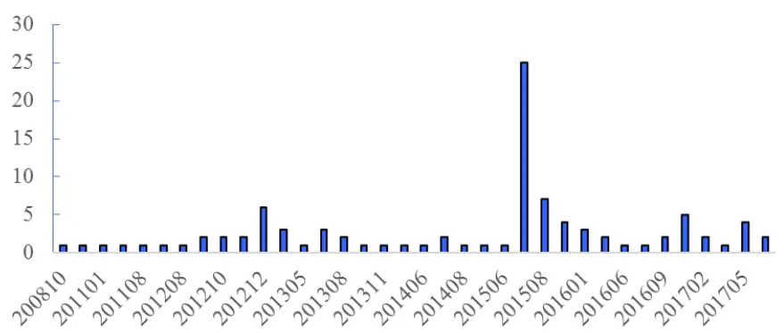
数据来源：Wind，国泰君安证券研究

上市公司选择宣布回购的时间具有强烈的择时性。从图 1可以看出，回购预案发生次数最多的前五个月份为 201507，201508，201212，201705和201609。除2012年12月外，剩下的4 个月份均为指数下跌月份，尤其是 2015 年 7、8、9 三个月位于的股灾时期。而 2012 年 12 月之前市场也处于长时间的下行中，上证综指从3000点一路跌到了2000点，市场情绪不高。上市公司多选于指数回落月份推出回购计划，与其旨在提振股价、增强投资者信心的意图相符。

图 2按上市板块统计发布回购预案的公司数量
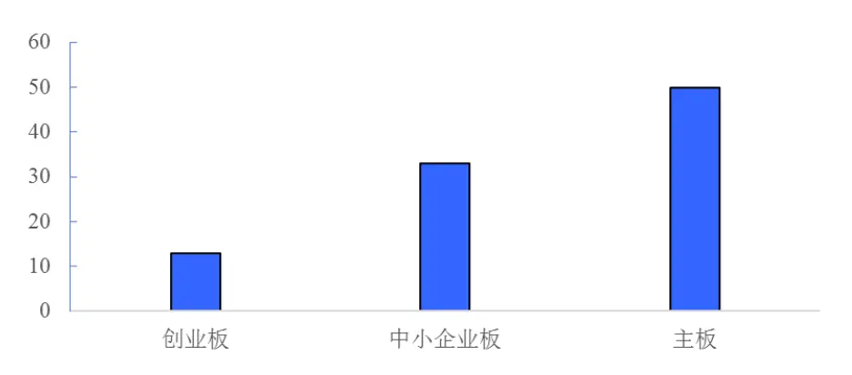
数据来源：Wind，国泰君安证券研究

按所属板块来看：主板的公司共计 49只，中小板31 只，创业板 10只，相对于板块总股票个数来说，创业板的股票选择回购的比例偏低。我们认为原因是创业板大多是新兴技术企业，对现金流的需求较主板企业和中小板企业更大一些，因此选择回购的公司数目偏低。

图 3按所属行业统计发布回购预案的公司数量
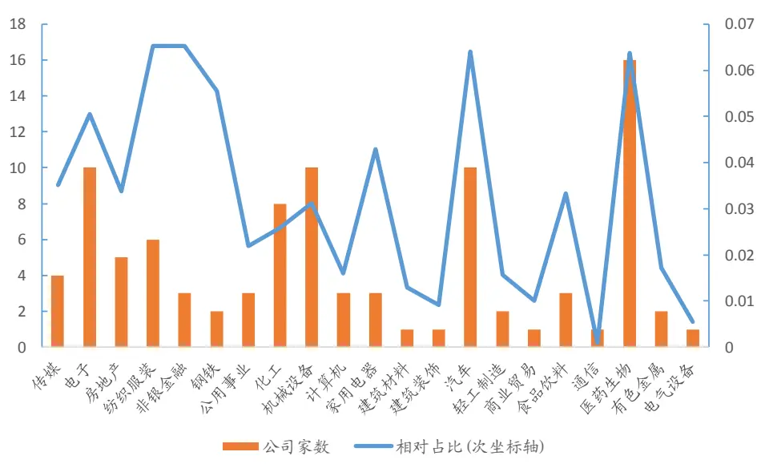
数据来源：Wind，国泰君安证券研究

按所属板块来看：分行业汇总后，回购的公司家数总和前五名为：医药生物、机械设备、汽车、电子、化工。取相对占比后，占比较多的行业为医药生物、汽车、纺织服装、非银金融与钢铁，可见传统行业进行回购的占比较高。

## 3. 以预案日为事件发生日的相对收益情况

## 3.1.全样本的相对收益：

我们取T_1 日为上市公司发布回购社会公众股预案后的首个交易日，观测以预案前后40 个交易日为窗口期内的全样本收益率。

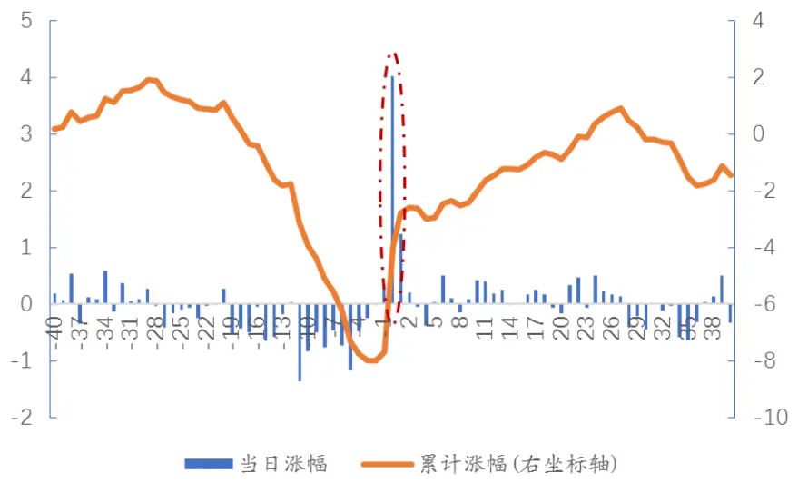
数据来源：Wind，国泰君安证券研究

我们观察到在上市公司发布回购预案后的首个交易日，市场反应强烈。取相对收益后，样本单日平均涨幅达到了 4%左右，显示了市场投资者整体对于上市公司回购的认可，尤其是在上市公司大多选择在熊市时进行回购的大背景下，在市场低迷的时期能取得如此收益已实属不易，并在未来的一段时间内都能维持该上涨的趋势，直到该热点褪去，收益率出现均值回归。并且从上图我们可以观测到，大约在回购预案后 30 个交易日左右收益率大幅下滑。可见由公司宣布回购预案带来的事件超额收益呈现短期脉冲性的特点，投资者应当把握住短期内的投资机会，投资该类型标的时持有时间不宜过长，以 30 个交易日内为宜。从上市公司选择回购的时点看，回购预案前 20 个交易日平均超额收益均为负，更加印证了上市公司选择发布回购预案的时点具有强烈的择时性，托底的意图明显。

我们对长时间停牌时期中推出了回购方案的股票进行剔除，并考虑到窗口期交易日天数的要求对近两个月内推出回购预案的股票同样予以剔除，剔除后股票池内共剩余 90只股票。其中有16只出现了首日一字涨停或涨停板只短暂打开可操作空间过小的行情，显示了市场对于回购预案的热烈追捧。

图 5首日一字涨停股票公告日后的相对收益情况
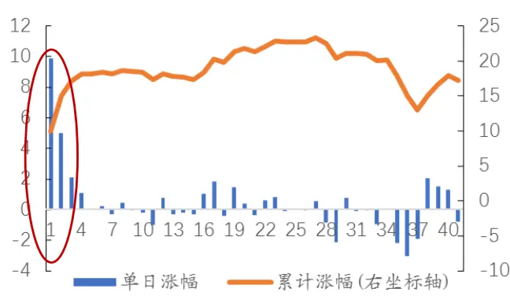
数据来源：Wind，国泰君安证券研究

图6调整首日操作空间后一字涨停样本相对收益情况
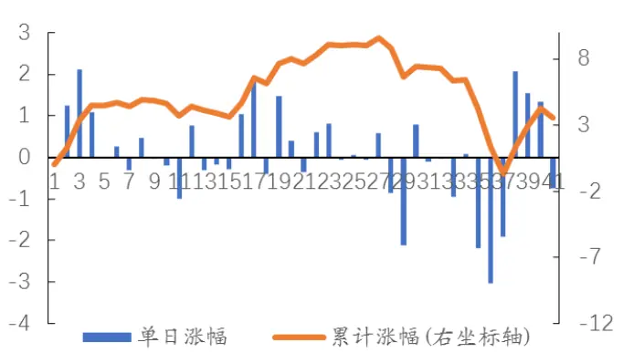

首日涨停的股票，5 日内均有强烈的追涨效应引发股价持续走高。然而由于收益率过于集中在预案首日附近，可操作空间很小。我们采取删数据不删样本的形式（即删除预案后一字涨停的收益数据，但保留股票样本，待涨停板打开后再计算收益率）考察这些首日涨停的股票可获取的收益(参考图6)。

首日涨停的股票，5 日后收益率围绕零轴附近波动。对于此类股票我们的建议是如果可以买进，可以在[T,T+5]区间内选择持有不超过 5个交易日赚取超短期事件超额收益，但5个交易日后投资价值不大，不建议后续进场。

图 7剔除首日一字涨停后样本的相对收益情况
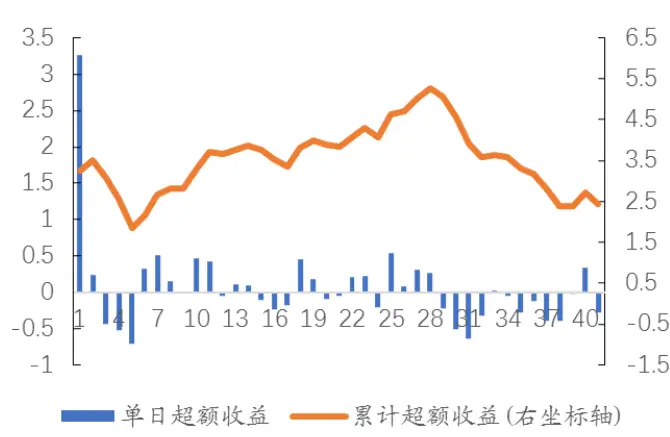
数据来源：Wind，国泰君安证券研究

图8剔除首日一字涨停样本并以首日均价买入的样本超额收益
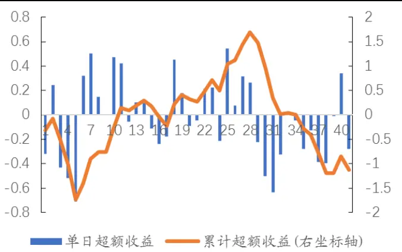

对于首日未涨停的股票，回购预案发布 5天后，股价处于相对低位。回购这一事件具有显著的短期公告日效应，在首日股价冲高后短期内出现回落，若加入以首日均价买入的这一限制收益空间更被进一步压缩。回购预案发布后持有一周累积超额收益率为-1.73%，胜率仅有 31.8%。

我们认为这一原因主要来自于上市公司与投资者的短期博弈。上市公司由于掏出了真金白银来回购，自然希望尽量降低自身的大买盘带来的冲击成本。由于回购这一行为存在时限性，需要在规定的事件内完成，短期内上市公司希望尽量降低股价以便以低成本买入。而投资者基于回购这一事件带来的边际预期的改变而预期股价上涨。但却担忧预案公布后的一周内由于首日的公告效应股价冲高而出现大幅回落，而选择观望几日等待股价处于相对低点后再进行买入。

从成交量的角度也印证了这一观点。我们分别统计了回购预案发布后 5日的日均成交量，以及除去预案发布后交易首日的4 日日均成交量，即

$$
\overline{{vol_{1}}}=(\sum\limits_{T=1}^{5}vol_{T})/5,\qquad T_{1}\lim\limits_jjjj\ast\frac{\sqrt{5}}{\sqrt{5}},\frac{j+1}{\sqrt{5}},\frac{j}{\sqrt{5}},\frac{j}{\sqrt{7}}\frac{k}{\sqrt{5}},\frac{j}{\sqrt{5}},\frac{j}{\sqrt{5}},\frac{j}{\sqrt{5}},\frac{j}{\sqrt{5}},\frac{j}{\sqrt{5}},\frac{j}{\sqrt{5}},\frac{j}{\sqrt{5}},\frac{j}{\sqrt{5}},\frac{j}{\sqrt{5}},\frac{j}{\sqrt{5}},\frac{j}{\sqrt{5}},\frac{j}{\sqrt{5}},\frac{j}{\sqrt{5}}\frac{k}{\sqrt{5}},\frac{j}{\sqrt{5}},\frac{j}{\sqrt{5}}\frac{k}{\sqrt{5}},\frac{j}{\sqrt{5}}\frac{k}{\sqrt{5}},\frac{j}{\sqrt{5}}.
$$

$$
\overline{{vol_{2}}}=(\sum_{T=2}^{5}vol_{T})/4
$$

$\overline{{vol_{2}}}<\overline{{vol_{1}}}$ 的样本数量占比达到 79%，由此可见预案后一周内的成交量

主要集中在预案后首日，次日后成交量下行，显示投资者的在预案发布后一周内因股价不确定性而保持观望态度。因此我们判断预案发布后一周才是建仓的最好时机。

## 4. 公告背后信心链的传递-从上市公司到投资者

单从上市公司发布的公告来看，回购的目的无非：1.因近期股价低迷，持续处于低位，为了维护投资者的信心与利益，公司决定以股份回购的方式传递信心；2.公司回购股份用于员工持股或股权激励。然而怀抱着相同的目的进行的股份回购的结果却出现了一定程度的分化。许多上市公司通过发布回购公告成功托底股价，向市场传递了公司股价被低估的信号，却也有公司在公告发布当日出现了跌停。追本溯源，其原因还得回到投资者信心的角度。随着中国A股市场上投资者投资水平的提升，简单的发布利好刺激股价的做法已经被市场抛弃，投资者更加关注“故事”背后上市公司拿出实际行动的决心。具体到二级市场回购这一事件投资上，回购预案的发布只是故事的开头，由于目前的政策并没有对上市公司于回购期内的回购行为作出具体的规范，A股市场上也不乏回购预案后迟迟没有动作最后草草了事的上市公司，因此上市公司能否依约进行回购，回购的股份会对公司现有股本造成什么样的影响，上市公司预计的回购行为最后有多少能实现？这些问题都左右着投资者对公司二级市场回购的信心，而信心的高低更直接决定了股价的走势。因此，我们从通过发布回购预案来传达公司股价被低估的这一信号能否成功传递到投资者的内心世界这一角度进行多方面的探讨。可谓拨开层层迷雾，方能见其真谛。

## 4.1.回购比例越高，说服力越强

## 4.1.1. 根据回购金额占比分组观察股票走势

公司预计回购金额对后期股票的走势有显著的区分作用。由于公司用于进行二级市场回购的资金均为公司自有资金，回购金额的大小可以一定程度上反映公司此次回购的诚心。为了去除公司自身大小的影响，我们选取回购金额/公司自由流通市值构建一个相对指标（若只公布金额区间的以区间中位数计算）。在计算公司自由流通市值时，从流通股本中剔除了持股 5%以上的大股东手中的股票，以及前十大股东中公布的高管持有的流通股的75%（高管每年可减持不超过 25%），即：

自由流通市值

=（流通股本－持股 5%股东所持股本

一与大股东构成一致行动人或关联方累计超过5%的股东所持股本一高管持股的75%)*市价

之所以选取公司自由流通市值作为量纲而不是总市值的原因是在公开市场回购时，由于占比5%以上（或与其关联方相加大于 5%）的大股东以及高管受到严格的信息披露的限制，在特定的公告期内不得交易股票。并且大股东通过二级市场回购直接套现手中的股票一经披露会向市场直接释放利空信号，并且可能会引来监管层的质疑。因此原本看似回购金额占总市值比重不大的一次回购，在剔除了无法自由流通的股票市值后，回购金额占比可能会带来翻天覆地的变化。

我们将回购金额/公司自由流通市值<=3%的记为Low_Pct组，回购金额/公司自由流通市值占比为3%-6%的记为 Middle_Pct组，占比达到6%以上的记为High_Pct组，观察这三组在回购预案发布后走势的区别。

值得注意的是，其中部分股票在发布回购预案之后随即宣布停牌进行如资产重组等重大事项的筹划，为了不影响我们单纯对回购这一事件的研究，将该部分异常股票剔除后的分组收益为：

图 9 分组累计超额收益
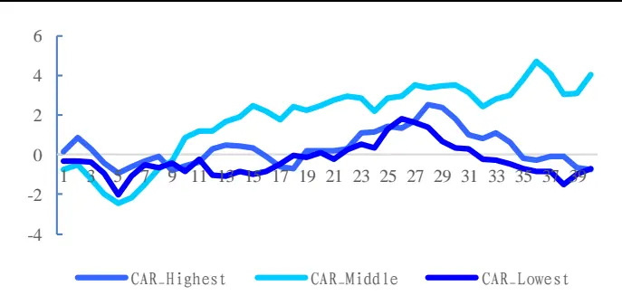
数据来源：Wind，国泰君安证券研究

图 10 剔除异常股后分组的累计超额收益
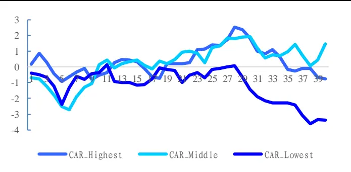

表 2 按回购金额/公司自由流通市值分组的[T+1,T+30]分组胜率

| 分组 | 组内股票数 | 胜率 |
| --- | --- | --- |
| High Pct | 25 | 54.5% |
| Middle Pct | 27 | 51.9% |
| Low Pct | 22 | 45.4% |

数据来源：Wind，国泰君安证券研究

由上图可见，无论是从事件超额收益还是从胜率上看，回购金额占自由流通市值大的公司在回购预案发布后的表现显著优于占比低的公司。公司乐意拿出更多资金进行二级市场回购能够更高的体现出公司对此次回购的决心，尤其是在回购多发生于熊市这一市场环境的前提下更能体现公司对此次回购的重视与对增强股价的渴望，与其预案中发布的“提振信心”的目的相符。未来可预期的大量买盘也会引导投资者在回购期开始前提前买入布局，短期内有效刺激股价的提升。而对回购金额占比较低的公司，这一回购行为反而被市场解读为了负面的消息，投资者担心公司发布回购预案意图提升股价却又诚意不足，其实只是为了单纯的资本运作，导致投资者信心不足，股价一路走低。

## 4.1.2. 基于回购金额占比角度的策略构建：

结合我们之前分析的预案后 5 日为最佳买点，持有 20 个交易日后卖出为卖出时点。考虑到回购金额占自由流通市值3%-6%的组(即Middle_Pct组)和占比达到 6%以上的组(即 High_Pct 组)在收益率和胜率上并无太大分化，我们将两组合并，即只对占比 3%以下的股票进行剔除。策略的结果为：

图 11 剔除回购金额占比低的股票后的平均超额收益
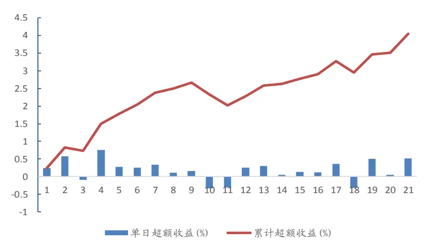
数据来源：Wind，国泰君安证券研究

该策略共筛选出49只股票，超额收益为 4.04%，胜率为 59.2%。

## 4.2.合理的股权结构能增强投资者信心：

## 4.2.1. 根据股权集中度分组观察走势：

我们将上市公司第一大股东的持股比例作为考量上市公司股权结构的标准。依据大股东持股比例，可将样本池内的股票分为三种：一、大股东持股比例小于或等于20%的，记为Group1，代表股权结构分散，大股东话语权偏低的公司，该类公司往往二股东、三股东的持股比例跟大股东较为接近，相互制约。二、大股东持股比例大于20%而小于或等于 30%的，记为Group2，代表股权结构较为均衡，大股东具有较高的话语权类股票。三、大股东持股比例高于30%的，记为Group3，代表股权高度集中的一类股票。我们对这三类股票在回购预案后的走势进行分组观察（同样剔除了重组股票的影响）。

图 12 按股权集中度分组的分组 30天平均超额收益
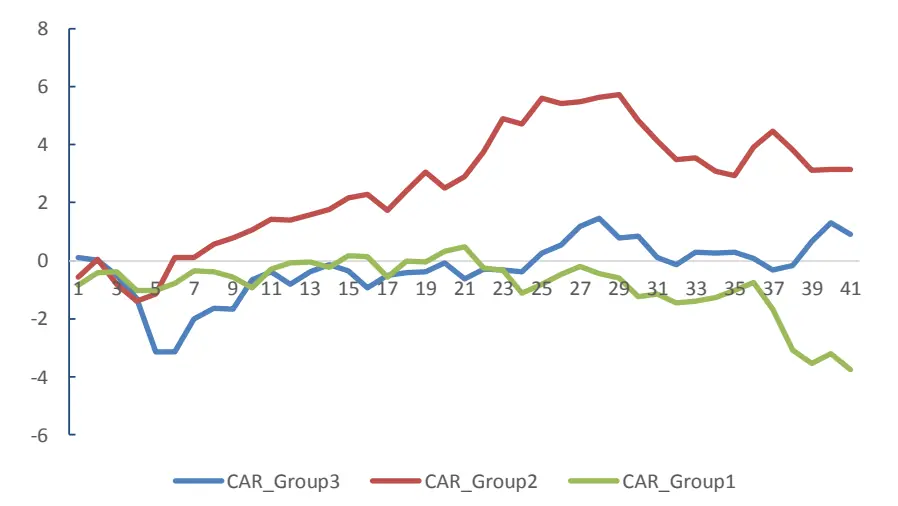
数据来源：Wind，国泰君安证券研究

股权集中度对二级市场回购的超额收益有显著的区分度。对于股权结构分散，大股东缺乏控制权的公司，由于董事会提出回购预案后仍需提交股东大会审核，存在股份回购预案无法经股东大会批准通过的风险，投资者信心不足，市场热情不高。对于股权结构过于集中的公司，短期内市场上存在明显博弈，由于大股东对公司决策的高度影响力，投资者担心其“一言堂”的地位会导致大股东对利好消息的发布具有高度的掌控权。由于中国市场上目前对上市公司宣布回购最终却不执行的这一行为惩罚力度偏低，表面宣布回购托底股价，实则为抬高股价便于高位减持或减轻股权质押的风险在大股东占比大的公司里更易出现。因此短期内外部投资者的观望情绪也较为浓厚。对于大股东控制权居中的公司，反而能从二级市场回购中获得最大的边际收益。通过减少总流通股数，大股东能进一步加强对公司的控制权。美股中上市公司选择回购以加大大股东对公司的控制权防止恶意收购的案例屡见不鲜。A股市场中公开市场回购也是上市公司增加大股东持股比例，防止由于股权结构过于分散而带来的恶意举牌、大股东缺乏对公司的控制权等一系列问题的有效解决手段。

## 4.2.2. 基于股权集中度角度的策略构建：

依旧选择预案发布后 5 日作为建仓点，持有 25 个交易日后卖出。建仓时选择第一大股东占比位于 20%至 30%之间的股票。持仓期间走势如图。

图13 选取股权结构更为合理的股票回购后走势图
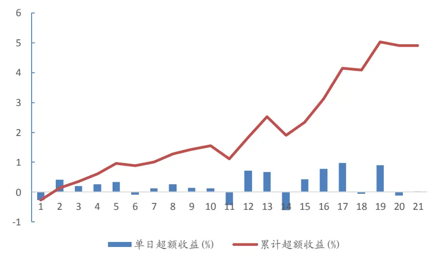
数据来源：Wind，国泰君安证券研究

该策略共选出23 只股票，持仓期累计超额收益4.9%，胜率 65.2%。

## 4.3.溢价回购，还是折价回购？

## 4.3.1. 溢价回购，投资者信心不足

过高的溢价率对公司股价并没有显著的提升作用，反而导致投资者怀疑上市公司回购动机。我们采取回购预案中公布的回购价格上限与预案前该股票的5日均价计算溢价率，即：

$\mathrm{\frac{\partial\psi_{ij}^{*}}{\partial t}}/\mathrm{\hbar}^{*}\mathrm{\frac{\partial\vec{\psi}_{i}}{\partial t}}=\mathrm{\frac{\vec{\ p}/\mathrm{\partial\vec{k}^{*}}]\cdot\vec{\cal F}_{k}^{R}-MA5}{MA5}}$ ，为正则为溢价回购，为负则为折价回购与传统的认知不同，高溢价率的回购未必能够带来高的超额收益。由于回购预案中公布的回购价格上限只是设置了一个价格天花板，而并不代表公司在实际操作中的真实最高回购价。以历史A股中回购溢价最高的TCL (000100.SZ)为例，管理层设定的回购价格上限为公司前 30 个交易日均价的 150%-10.05 元，而预案发布前一日收盘价仅 5.65 元，前 5 日均价仅5.68元，溢价率达85%。值得注意的是，公司自上市开始股价从未达到过 10.05 元。如此高溢价率的回购是否真的彰显了公司管理层的信心，投资者又是否买账？答案是否定的。预案发布后该股票并未走出向上的走势，反而继续低位震荡。从回购期完成后公布的股份回购情况中也可见，公司在长达7个月的回购期中，回购的最高价仅为4.87，最低价为3.87元，实际回购区间远低于公告的回购上限的 10.05元。因此，过高的回购溢价率反而会给投资者带来负面的影响，怀疑上市公司回购的真实动机。

图 14TCL集团(000100.SZ)发布溢价 85%回购方案前后的股价走势图
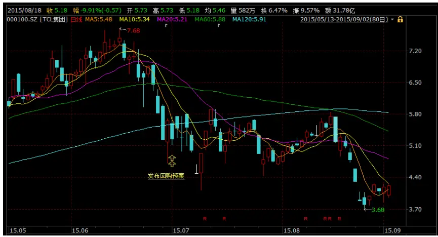
数据来源：Wind，国泰君安证券研究

## 4.3.2. 折价回购，带来“安全垫”效应增强信心

合理的折价回购能有效抑制下跌趋势，折价回购上限可解读为兜底价格。折价回购并不代表大股东对公司股价不看好，预测公司股价还会继续走低，反而可以视作股价的安全垫，为投资者明确了价值底线，有效抑制空头继续往下打压股价的意愿，因为股价一旦跌破回购上限，上市公司很有可能采取回购行为，用自身的大量买单拉升股价。同时，我们选取预案前 5 日均价为参考价格， 意在衡量预案前短期的股价走势对预案后市场反应的影响。

但是也要注意折价过多的一类股票蕴含的风险，折价过多容易导致投资者忌惮于上市公司信息优势的地位纷纷抛出手中的股票，踩踏出逃；更会引导投资者怀疑上市公司是不是真的想回购，还是迫于证监会的压力不得不出台相应的举措，投资者信心进一步下降。

图 15 国际实业(000159.SH)发布折价 10%回购方案前后的股价走势
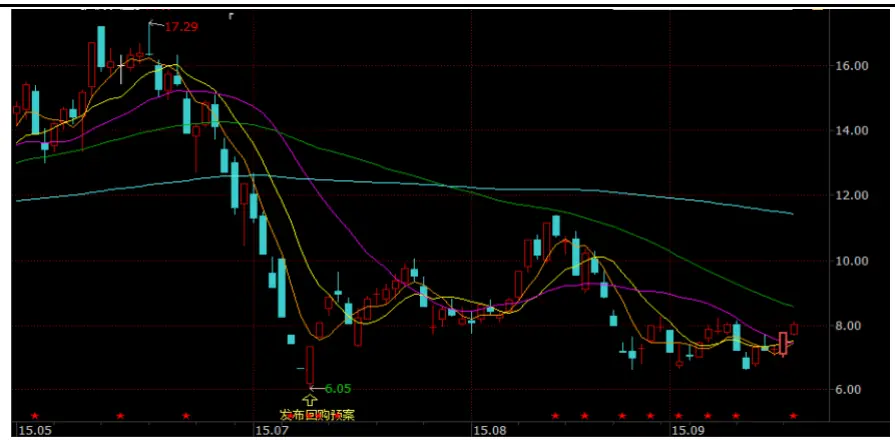
数据来源：Wind，国泰君安证券研究

根据以上讨论，我们用量化的手段观测溢价回购以及折价回购对股价的影响：

表 3 不同溢价率对股价的影响

| 溢价/折价率 | 组内股票个数 | 30 天超额收益 胜率 |
| --- | --- | --- |
| 折价率>20% | 1 | -30.9% 0 |
| 折价率<=20% | 21 | 9.97% |
| 溢价率<=20% | 25 | -2.10% 36% |
| 溢价率>20% | 27 | -0.30% 39.14% |

数据来源：Wind，国泰君安证券研究

由上表可见，折价回购形成的“安全垫”作用在股份回购，尤其是投资者对个股的信心不足，股价处于下跌趋势时的短期提振作用十分明显，20天平均超额收益达到9.97%。投资者可以对此类折价回购的股票特别关注。

## 4.3.3. 基于回购溢价率角度的策略构建：

基于上表，折价率控制在 20%以内的折价回购无论胜率还是超额收益都显著强于其余三组，因此我们仅选择折价 20%以内的股票，于预案后 5日买入，持有20 个交易日后以隔日收盘价卖出，策略的收益为：

图16 基于合理折价回购角度的策略构建
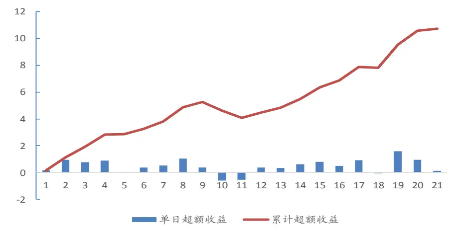
数据来源：Wind，国泰君安证券研究

该策略共选出21 只股票，20个交易日平均超额收益10.72%，胜率可达到 76.2%。

## 5. 基于回购的投资策略总结与展望

基于以上三个维度我们可以分别总结出投资观点以及最佳买点和卖点：

- 选取预案中回购金额占自由流通市值3%以上的股票

- 选取大股东持股比例介于20%至 30%之间的股票

- 选取折价回购，并且折价率<=20%的股票

于预案发布一周后以第二日均价买入，持有 20 个交易日后以隔日收盘价卖出。

表 4 不同筛选标准下的超额收益与胜率

| 筛选标准 | 股票数 | 超额收益 | 胜率 |
| --- | --- | --- | --- |
| 回购金额占比 | 49 | 4.04% | 59.2% |
| 大股东持股比 | 23 | 4.90% | 65.2% |
| 例 |  |  |  |
| 折价率 | 21 | 10.72% | 76.2% |

数据来源：Wind，国泰君安证券研究

投资者可基于自己对胜率、超额收益以及持仓股票数的要求选择相应的筛选标准。

另外，在前文中我们也提到，过去的A 股市场上“说而不做”的现象在回购这一事件上并非个例，存在一些只想炒作股价而不愿意掏出真金白银的“铁公鸡”型公司，由于过往监管力度较低，此类公司最后也并没有受到相应的处罚，市场乱象较多。而随着近来监管趋严，上市公司发布虚假利好消息的成本越来越高，回购这一事件也变得越来越成熟，留给了投资者们越来越多参与到该事件中以期获取超额收益的空间。在欧美成熟的资本市场中，回购向来被视为传递低估信号的一大有利工具或者代替股利发放回馈投资者的行为，上市公司也积极进行实际回购。我们也期待在回购这一事件上，A 股市场能逐渐向欧美市场靠拢，更加健康发展。

## 本公司具有中国证监会核准的证券投资咨询业务资格

## 分析师声明

作者具有中国证券业协会授予的证券投资咨询执业资格或相当的专业胜任能力，保证报告所采用的数据均来自合规渠道，分析逻辑基于作者的职业理解，本报告清晰准确地反映了作者的研究观点，力求独立、客观和公正，结论不受任何第三方的授意或影响，特此声明。

## 免责声明

本报告仅供国泰君安证券股份有限公司（以下简称“本公司”）的客户使用。本公司不会因接收人收到本报告而视其为本公司的当然客户。本报告仅在相关法律许可的情况下发放，并仅为提供信息而发放，概不构成任何广告。

本报告的信息来源于已公开的资料，本公司对该等信息的准确性、完整性或可靠性不作任何保证。本报告所载的资料、意见及推测仅反映本公司于发布本报告当日的判断，本报告所指的证券或投资标的的价格、价值及投资收入可升可跌。过往表现不应作为日后的表现依据。在不同时期，本公司可发出与本报告所载资料、意见及推测不一致的报告。本公司不保证本报告所含信息保持在最新状态。同时，本公司对本报告所含信息可在不发出通知的情形下做出修改，投资者应当自行关注相应的更新或修改。

本报告中所指的投资及服务可能不适合个别客户，不构成客户私人咨询建议。在任何情况下，本报告中的信息或所表述的意见均不构成对任何人的投资建议。在任何情况下，本公司、本公司员工或者关联机构不承诺投资者一定获利，不与投资者分享投资收益，也不对任何人因使用本报告中的任何内容所引致的任何损失负任何责任。投资者务必注意，其据此做出的任何投资决策与本公司、本公司员工或者关联机构无关。

本公司利用信息隔离墙控制内部一个或多个领域、部门或关联机构之间的信息流动。因此，投资者应注意，在法律许可的情况下，本公司及其所属关联机构可能会持有报告中提到的公司所发行的证券或期权并进行证券或期权交易，也可能为这些公司提供或者争取提供投资银行、财务顾问或者金融产品等相关服务。在法律许可的情况下，本公司的员工可能担任本报告所提到的公司的董事。

市场有风险，投资需谨慎。投资者不应将本报告作为作出投资决策的唯一参考因素，亦不应认为本报告可以取代自己的判断。
在决定投资前，如有需要，投资者务必向专业人士咨询并谨慎决策。

本报告版权仅为本公司所有，未经书面许可，任何机构和个人不得以任何形式翻版、复制、发表或引用。如征得本公司同意进行引用、刊发的，需在允许的范围内使用，并注明出处为“国泰君安证券研究”，且不得对本报告进行任何有悖原意的引用、删节和修改。

若本公司以外的其他机构（以下简称“该机构”）发送本报告，则由该机构独自为此发送行为负责。通过此途径获得本报告的投资者应自行联系该机构以要求获悉更详细信息或进而交易本报告中提及的证券。本报告不构成本公司向该机构之客户提供的投资建议，本公司、本公司员工或者关联机构亦不为该机构之客户因使用本报告或报告所载内容引起的任何损失承担任何责任。

## 评级说明

## 1.投资建议的比较标准

投资评级分为股票评级和行业评级。

以报告发布后的12个月内的市场表现为比较标准，报告发布日后的 12个月内的公司股价（或行业指数）的涨跌幅相对同期的沪深 300 指数涨跌幅为基准。

## 2.投资建议的评级标准

报告发布日后的 12 个月内的公司股价（或行业指数）的涨跌幅相对同期的沪深 300 指数的涨跌幅。

|  | 评级 | 说明 |
| --- | --- | --- |
| 股票投资评级 | 增持 | 相对沪深300指数涨幅15%以上 |
|  | 谨慎增持 | 相对沪深 300指数涨幅介于5%～15%之间 |
|  | 中性 | 相对沪深300指数涨幅介于-5%～5% |
|  | 减持 | 相对沪深 300指数下跌 5%以上 |
| 行业投资评级 | 增持 | 明显强于沪深 300 指数 |
|  | 中性 | 基本与沪深 300指数持平 |
|  | 减持 | 明显弱于沪深300指数 |

## 国泰君安证券研究所

|  | 上海 | 深圳 | 北京 |
| --- | --- | --- | --- |
| 地址 | 上海市浦东新区银城中路168号上海 银行大厦29层 | 深圳市福田区益田路 6009 号新世界 商务中心34层 | 北京市西城区金融大街 28 号盈泰中 心2号楼10层 |
| 邮编 | 200120 | 518026 | 100140 |
| 电话 | （021)38676666 | (0755)23976888 | (010)59312799 |
|  | E-mail: gtjaresearch@gtjas.com |  |  |