inInfo] [Table_Title] 2017.08.20

# 行业轮动中“确定性”的规律及投资机会

## ——数量化专题之一百

刘富兵（分析师）

蔡旻昊（研究助理）

8 021-38676673

021-38674743

liufubing008481@gtjas.com

caiminhao@gtjas.com

证书编号 S0880511010017

S0880117030051

## 本报告导读：

本报告根据宏观信息和市场交易信息构建了六类描述市场当前环境的指标，尝试找出这六类指标在行业轮动中“确定性”的规律，并基于这些“确定性’’规律构建行业轮动策略。

## 摘要：

le_Summary] 本篇报告从宏观环境、市场整体环境、市场风格、行业间涨跌、行业自身风险以及下行风险六个维度构建了六类不同的指标，尝试找出这六类指标与行业涨跌之间的因果联系。

通过数据挖掘中关联规则的方法，我们分别找出这六类指标在行业轮动中“确定性”的规律并基于这些“确定性”规律构建行业轮动策略。

基于不同指标下“确定性”规律构建的行业轮动策略在样本外都不同程度的战胜行业平均。其中，宏观环境指标以及行业自身风险指标对于强势行业的预测效果最佳，分别获得了 10.10%和 8.57%的超额收益。而市场整体环境指标对于弱势行业的预测最好，获得 14.43%的超额收益。

当我们综合所有指标下的“确定性”规律构建行业轮动策略时，该策略在样本外获得了 8.29%的超额收益，而月度最大回撤仅有 1.24%，胜率高达75%。

金融工程

## 金融工程团队：

刘富兵：（分析师）

电话：021-38676673

邮箱：liufubing008481@gtjas.com

证书编号：S0880511010017

## 陈奥林：（分析师）

电话：021-38674835

邮箱：chenaolin@gtjas.com

证书编号：S0880516100001

## 李辰：（分析师）

电话：021-38677309

邮箱：lichen@gtjas.com

证书编号：S0880516050003

## 孟繁雪：（分析师）

电话：021-38675860

邮箱：mengfanxue@gtjas.com

证书编号：S0880517040005

## 蔡旻昊：（研究助理）

电话：021-38674743

邮箱：caiminhao@gtjas.com

证书编号：S0880117030051

## 殷明：（研究助理）

电话：021-38674637

邮箱：yinming@gtjas.com

证书编号：S0880116070042

## 叶尔乐：（研究助理）

电话：021-38032032

邮箱：yeerle@gtjas.com

证书编号：S0880116080361

## 殷钦怡：（研究助理）

电话：021-38675855

邮箱：yinqinyi@gtjas.com

证书编号：S0880117060109

## [Table_R相关报告

《多维度挖掘公开市场回购中的超额收益》2017.08.01

《银行委外视角下的产品选择：公募篇》2017.07.19

《基于前景理论的选股策略》2017.07.18

《基于深度组合的选股策略》2017.07.11

《板块及行业指数价格分段研究》2017.07.05

## 1. 引言

基于经典的多因子体系, 我们可以发现截面上股票收益的分化主要归因于市场风险和行业风险。在 A 股市场,虽然行业的分化和轮动现象十分明显，但我们对此的理解却十分的局限。这使得在实际投资中，追求相对收益的投资者大多选择对投资组合进行行业中性化处理来规避行业风险带来的波动，转而从其他因子中寻求相对稳定的超额收益，但这也大大减少了进一步提高相对收益的空间;而对于追求绝对收益的投资者而言，对行业轮动的误判也经常会大大的影响他们的投资表现。因此如何准确解释和预测行业轮动一直是各类投资者关心和研究的核心。

影响行业涨跌的因素很多，从信息来源看，宏观信息、行业信息以及市场交易信息都会对行业的涨跌和轮动产生影响；而另一方面，由于行业之间特性的不同，这使得行业间对信息的敏感度存在着巨大的差异；随着新的信息的不断涌入以及市场环境及市场微观结构的改变，行业轮动的规律也不断的发生变化。因此，一个有效的解释并预测行业轮动的策略可能至少要包含以下三方面的特性：(1)信息来源多样 (2)能够捕捉行业之间对信息的敏感程度的差异 (3)不断更新调整这些信息对行业涨跌的影响。因此我们很难找到一条适用于所有行业且在时间序列上的解释能力又能保持稳定的规律。

虽然我们很难在行业轮动中找到这样“大一统”（适用于所有行业及所有场景）的规律，却可以由点到面，找到仅适用于特定行业或者特定情景的“确定性”的规律。所谓“确定性”，是指这些规律需要满足两个条件：1.样本内统计显著 2. 这些规律在短期内不会失效，样本外依然具有显著的预测作用。每一个基于单个“确定性”规律的策略从本质上都可以看成一种风险资产，根据投资组合理论，我们可以通过三个方面提高基于这些“确定性”规律的投资策略的表现：A.提高这些规律的统计显著性：如果这些规律在样本内越统计显著且在短期内没有失效，基于这些规律的投资策略的期望收益一般越高。 B.发现更多相关性低的规律：当这些规律的数量越多、相关程度越低时，基于这些“确定性”规律的投资策略的风险也越分散，收益也更加稳定。 C.不断的根据新的信息更新规律：随着市场环境的不断变化，原有的规律很有可能失效，因此我们需要根据新的信息不断的更新和调整这些“确定性”的规律，以保证这些规律在样本外的有效性。

因此本篇报告的核心在于尝试在行业轮动中找到多个相关性低且可以不断更新的“确定性”规律，并基于这些规律构建投资策略。

从信息来源来看，本篇报告主要基于宏观信息和市场交易信息，尝试从不同的角度构建可以预测行业轮动的指标(由于行业自身信息对行业的影响需要夹杂主观判断，很难客观的进行量化，并且不同行业间的信息难以进行横向比较，因此在本篇报告中的相关指标仅基于宏观信息和市场交易信息)。我们共构建了六类不同的指标分别描述宏观环境、市场、和行业间的信息：A.描述国家经济整体运行情况的宏观指标 B.描述交易市场整体环境的指标 C.描述当前市场风格的指标 D.体现行业涨跌分化的指标 E.描述行业自身交易风险的指标。F.描述行业自身下行风险的指标。由于这些指标的信息来源以及对于信息处理的方法和角度存在巨大的差别，这使得我们更容易基于这些信息来源丰富角度迥异的指标挖掘出数量多且关联度低的“确定性”的规律。

基于这六类指标，我们运用数据挖掘中寻找关联规则的方法，找出各类指标在行业轮动中的“确定性”规律并基于这些“确定性”的规律构建投资策略。相对于关于弱势行业的预测，这六类指标对于强势行业的预测在样本外的表现更好。我们发现，根据这六类指标与强势行业之间“确定性”的规律构建的行业轮动策略全部在样本外跑赢了行业平均。最为重要的，当我们综合所有指标在行业轮动中“确定性”的规律构建行业轮动策略时，可以在保持收益的前提下，大幅度的控制回撤，提高策略的稳定性。以行业平均为基准，该策略在样本外获得了年化 8.29%超额收益率, 月度最大回撤为-1.24%，战胜行业平均收益的概率为 75%。

在本篇报告的第2章中, 我们首先介绍了关联规则并具体讨论了如何运用关联规则找出各类指标在行业轮动中“确定性”的规律。在第 3章中,我们首先构建了宏观信息指标、市场风格指标、市场总体指标、行业间涨跌指标、行业间总风险指标及行业间下行风险这六类指标；其次我们分别讨论了如何基于这六类指标寻找他们在行业轮动中“确定性”的规律并基于这些规律构建行业轮动策略；最后，我们综合所有的六类指标下的“确定性”规律构建行业轮动策略。第4章为研究总结与展望。

## 2. 关联规则及其应用

顾名思义，关联规则是指事物之间可能存在的关联或者联系。作为数据挖掘中最为重要的研究之一,关联规则在实际生活中早已经被广泛的应用。例如，经典的“尿布”与“啤酒”案例（30%买“尿布”的父亲通常都会同时购买“啤酒”）。简单来说，关联规则是形如 的蕴涵式，关于它的严格定义如下：

假设 $I=\{I_{1},~I_{2},~...~I_{m}\}$ 是项的集合。给定一个交易数据库 D ，其中每个事物是I的非空子集。关联规则在D中的支持度是 D中的支持度是D中事物同时包含X，Y 的百分比，置信度则是 D 中事物已经包含 X的情况下，包含Y的百分比。

关联规则的筛选主要是基于支持度及置信度两个指标。支持度决定了样本内关联规则发生的频率，而置信度是规则准确程度的体现。

在本篇报告中，我们依据挖掘关联规则最为通用的 Aprior 算法，按照以下的步骤找出指标与行业之间显著的关联规则，从而发现各类指标在行业轮动中“确定性”的规律。

第一步，对各类指标进行量化,从而确定关联规则中所需要的事务集。我们把所有的事务分为两类，被预测型事务及预测型事务。在本篇报告中，我们把行业是否是强（弱）势行业作为我们所需要预测的事务。具体的，如果某行业在t 期超过(低于)行业平均收益时，我们定义该行业在t期为强势(弱势)行业。而对于如何基于各类指标定义预测性事务，将在后面的部分详细讨论。

第二步，对于所有基于各类指标挖掘出的关联规则，我们要求支持度不低于15%,置信度不低于 70%。为了使得这些样本内挖掘出的关联规则在样本外依然适用，我们尽可能的在样本内挖掘出支持度和置信度更高的规则（当我们要求置信度高于 70%或者支持度高于 15%时，能够发掘出的关联规则的数量过少，这使得样本内会产生过度拟合，样本外的预测也很难稳定）。

第三步，当我们在样本内寻找到这些规则后，我们需要对这些规则进行t 检验，保证这些规则在样本内对于行业是否超过行业平均在统计上显著大于0.在本报告，所有的 t检验需要满足90%的统计显著性。

第四步，由于市场环境在不断的变换，原有的规律可能也会随之改变，因此在有新的信息加入的时候，我们会重复之前三步的标准。一方面，检验之前的规律是否依然适用，另一方面察看是否有新的规律加入。例如，所有的关于t+1期的行业预测，是基于[0,t]期数据中的规律预测。

第五步，根据样本内规则所发出信号配置行业，对于每个信号预测的行业等权配置；当没有信号发生时，等权配置所有行业。例如，在 t期有三个信号发生，其中两个信号预测钢铁行业，另一个预测家用电器行业。在t+1期则配置2/3权重的钢铁行业，1/3权重的家用电气行业。

## 3. 行业轮动中“确定性”规律及投资策略

## 3.1. 宏观指标

由于行业之间存在着明显的周期性以及特征的差异，这导致行业之间对宏观指标的敏感程度不同。在本部分，我们基于主要的宏观指标，尝试找出与宏观指标关联最为紧密的行业，发现宏观指标与行业轮动之间“确定性”的规律

在宏观指标的选取上，我们选用以下12个指标:

工业增加值、固定投资额、消费者信心、零售总额、贸易差额、M0、M1、M2、CPI、PMI、人民币美元汇率和 3月期国债收益率。

我们的样本区间是2006年1月至 2017年5 月的月度宏观指标，当指标缺失时，我们沿用上期指标的数据。除去汇率和国债收益率，对于其他的宏观指标，我们根据当月宏观指标的同比是否超过上月同比来描述该指标的变化；而对于汇率和国债收益率，我们则按照当月的数值是否超过上月数值来描述该指标的变化。由于前十个宏观指标发布在下月中上旬，因此我们仅用t期的指标去预测 t+2期行业轮动的情况（t 期的汇率和国债收益率则预测t+1 期行业轮动的信息）。

我们以2005年1月至2015 年12 月的样本为例，根据以上 12个宏观指标，共发现了5 条“确定性”规律 （见表1）。表1中的第一列是各“确定性”规律发出信号的条件，第二列是各条件发生时所预测的强势行业，第三列是该规律条件发生的次数，第四列是该规律条件发生时，所预测行业是强势行业的概率。在28个申万一级行业指数中,相应的宏观指标仅对其中的5 个行业有较强的正向预测作用。在这5 个规则中，有些具有一定的经济含义，而有些则很难解读这背后的逻辑。例如，宏观指标转弱（贸易差额、汇率、CPI同比下降）或者债券收益率上升时，作为非周期且安全边际较高的食品饮料和家用电器板块则体现了较强的防御属性，往往在次月的表现超过行业平均。

表 1: 宏观指标预测强势行业

| 条件 | 预测 | 发生次数 | 置信度 |
| --- | --- | --- | --- |
| 3月期国债收益率上升；零售 总额同比下降 | 国防军工（强势） | 26 | 77% |
| 贸易差额同比下降；汇率下降 | 食品饮料（强势） | 33 | 73% |
| 工业增加值同比上升；CPI同 比下降 | 农林牧渔（强势） | 28 | 71% |
| 消费者信心同比下降；M2 同比 上升 | 汽车（强势） | 27 | 70% |
| CPI同比下降；3月期国债收 益率上升 | 家用电器（强势） | 27 | 70% |

数据来源： 国泰君安证券研究

我们基于 2006 年 1 月至 2015 年 12 月的宏观指标,对 2016 年 1 月至 2016年5月样本外的强势行业进行滚动预测并构建投资策略。当“确定性”规律发出信号时，我们次月买入所预测的行业；如果没有信号产生，则等权配置行业平均。图1中的蓝色曲线为该策略相对行业等权收益的净值曲线。红线左侧为样本内对该策略相对行业等权收益的净值曲线，而红线右侧为样本外该策略相对行业等权收益的净值曲线。

图 1. 宏观指标-强势行业
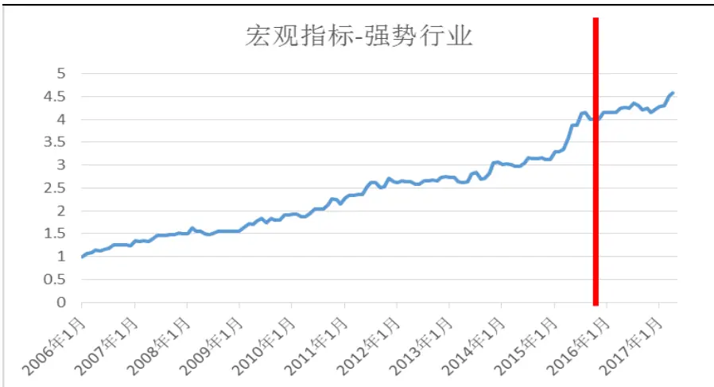
数据来源： 国泰君安证券研究

从表2中我们可知，相对于行业平均收益，基于宏观指标“确定性”规律的策略在样本外有10.10%的年化超额收益，月度最大回撤为-3.75%,样本外战胜行业平均的胜率达到75%。

表 2：宏观指标预测强势行业

|  | 年化收益率 | 标准差 | 最大回撤 | 胜率 |
| --- | --- | --- | --- | --- |
| 样本内 | 15.16% | 10.99% | -9.38% | 70.93% |
| 样本外 | 10.10% | 6.12% | -3.75% | 75% |

数据来源： 国泰君安证券研究

我们根据相同的方法，基于2006年1月至 2015年12 月的宏观指标,对2016年1月至 2016年 5月样本外的弱势行业进行滚动预测并构建投资策略，当信号发生时，我们做空所预测的行业，并计算该策略相对行业平均的超额收益。以2015年12月为例，在样本内我们共发现了 65条显著的预测弱势行业的“确定性”规律，这些“确定性”规律仅适用于12个行业。其中宏观指标对钢铁、交通运输和公用事业在所有“确定性”规律所预测行业中的比例最高。

图 3. 宏观指标-弱势行业：行业比例
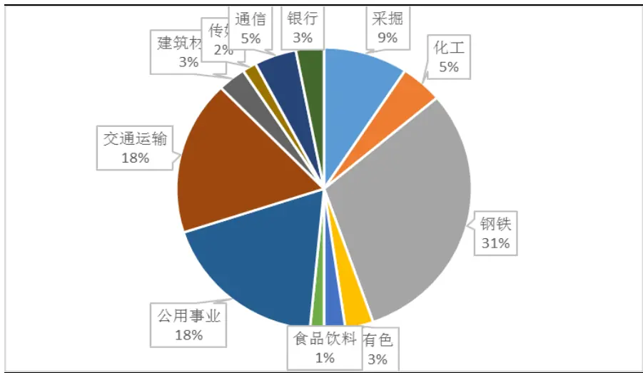

我们发现宏观指标对于弱势行业的预测在样本外的预测效果并不理想，对比行业平均，样本外的年化超额收益率为-6.68%，最大回撤为-10.17%，战胜行业平均的胜率仅为 31.25%。

图 4. 宏观指标-弱势行业
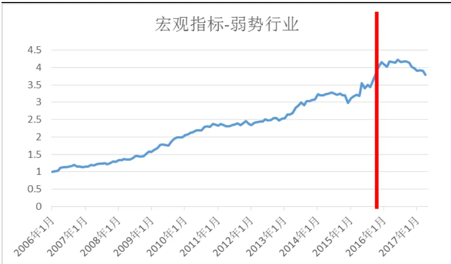
数据来源： 国泰君安证券研究

表 3：宏观指标-弱势行业

|  | 年化收益率 | 标准差 | 最大回撤 | 胜率 |
| --- | --- | --- | --- | --- |
| 样本内 | 15.20% | 9.00% | -9.30% | 71.19% |
| 样本外 | -6.68% | 6.03% | -10.17% | 31.25% |

数据来源： 国泰君安证券研究

## 3.2.市场风格指标

由于行业指数主要根据个股的行业属性选择是否纳入指数,而对于指数中个股的风格并没有加以控制或调整, 这使得不同行业指数对各种市场风格的暴露并不均匀。因此，当市场的风格出现明显的分化和轮动时，行业之间也会因为对各种风格敏感程度的不同,在走势上随之出现分化和轮动。

在本篇报告中，我们根据申万风格指数的表现来描述当前市场的主要风格特征。在样本中，我们包含了以下15个申万风格指数：

大\中\小盘指数、高\中\低市盈率指数、高\中\低市净率指数、高\中\低价股指数、亏损\微利\绩优股指数。

如果当期某风格指数的表现超过所有风格指数的平均收益时，我们定义该风格为强势风格；而低于风格指数平均收益时，该风格为弱势风格。

以2005至2015年十年的样本为例，我们发现的预测强势行业的规则共有11条，我们在此列举了置信度最高的5条规则。

表 4：市场风格指标-强势行业

| 条件 | 预测 | 发生次数 | 置信度 |
| --- | --- | --- | --- |
| 大盘指数（弱势）高市净率 指数（弱势） | 商业贸易（强势） | 29 | 79% |
| 低市净率指数（强势）绩优 股指数（弱势） | 农林牧渔（强势） | 25 | 76% |
| 中盘股指数（强势）高市净 率指数（弱势） | 综合（强势） | 26 | 73% |
| 绩优股指数（强势）低价股 指数（弱势） | 医药生物（强势） | 28 | 71% |
| 高市净率指数（强势）中市净 纺织服装（强势） 率指数（强势） |  | 28 | 71% |

数据来源： 国泰君安证券研究

我们基于2006年 1月至2015年12月的申万风格指数描述当前市场主要的强弱势风格,对2016年1 月至 2016年5月样本外的强势行业进行滚动预测并构建投资策略。图5 中的蓝色曲线为该策略相对行业等权收益的净值曲线。红线左侧为样本内对该策略相对行业等权收益的净值曲线，而红线右侧为样本外该策略相对行业等权收益的净值曲线。在样本外，该策略的年化超额收益率为8.21%, 月度最大回撤为-2.24%，战胜行业平均收益的胜率为71.43%。

图 5. 市场风格指标-强势行业
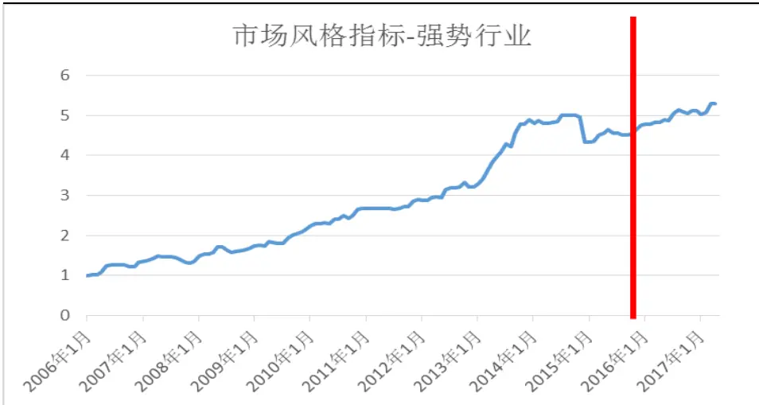
数据来源： 国泰君安证券研究

表 5：市场风格指标-强势行业

|  | 年化收益率 | 标准差 | 最大回撤 | 胜率 |
| --- | --- | --- | --- | --- |
| 样本内 | 16.89% | 11.21% | -13.59% | 75.51% |
| 样本外 | 8.21% | 5.60% | -2.24% | 71.43% |

数据来源： 国泰君安证券研究

我们根据相同的方法，基于 2006年1 月至2015年12 月的市场风格指标,对2016年 1月至 2016年5 月样本外的弱势行业进行滚动预测并构建投资策略，当信号发生时，我们做空所预测的行业，并计算该策略相对行业平均的超额收益。以 2015年12 月为例，在样本内我们共发现了113条显著的预测弱势行业的“确定性”规律，这些“确定性”规律适用于18个行业，其中交通运输、采掘和公用事业在所有“确定性”规律所预测行业中的比例最高。

表 6：市场风格指标-弱势行业

| 条件 | 预测 | 发生次数 | 置信度 |
| --- | --- | --- | --- |
| 高市盈率指数（强势）绩优 股指数（强势） | 建筑建材（弱势） | 26 | 81% |
| 大盘指数（强势）中价股指 数（弱势） | 交通运输（弱势） | 25 | 76% |
| 中市盈指数（弱势）中价股 指数（弱势） | 交通运输（弱势） | 26 | 73% |
| 高市净率指数（强势）微利 股指数（强势） | 采掘（弱势） | 28 | 71% |
| 中价股指数（弱势）亏损股指 数 | 交通运输（弱势） | 28 | 71% |

数据来源： 国泰君安证券研究

基于市场风格指标与弱势行业之间“确定性”规律的策略在样本外获得了年化2.01%的超额收益，最大回撤为-5.40%，战胜市场行业平均的胜率为 43.75%。

图6：市场风格指标-弱势行业
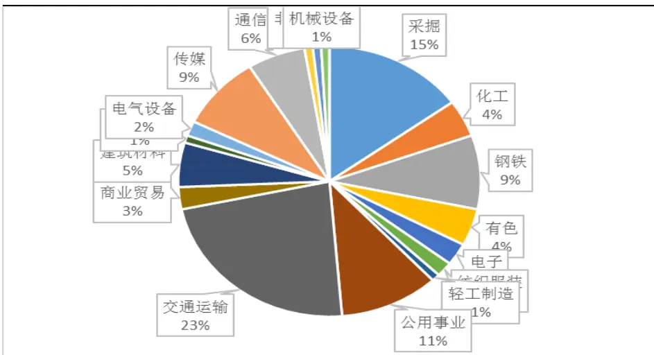
数据来源： 国泰君安证券研究

图7：市场风格指标-强势行业
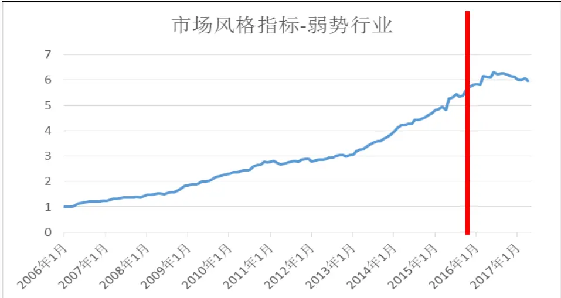
数据来源： 国泰君安证券研究

表 7：市场风格指标-弱势行业

|  | 年化收益率 | 标准差 | 最大回撤 | 胜率 |
| --- | --- | --- | --- | --- |
| 样本内 | 19.42% | 6.72% | -4.39% | 83.05% |
| 样本外 | 2.01% | 6.84% | -5.40% | 43.75% |

数据来源： 国泰君安证券研究

## 3.3.市场整体指标

作为市场的子集，行业指数的表现必然受到市场整体环境的影响。在本篇报告中，我们主要通过以下几个指标分别描述市场当前的状态。

1. 市场状态指标（牛/熊/震荡）：在以往的研究中我们知道投资者情绪、投资者风险偏好等与市场状态极其相关，因而行业之间在不同市场下的表现及规律存在着显著的差别。我们根据之前的报告对市场状态进行分类。当超过 20个行业的指数在月末站上 20日均线时，我们定义当前的市场为牛市；低于10个行业的指数站上 20日均线则定义为熊市；10到 20 个行业指数站上20日均线则定义为震荡市。

2. 市场风险指标：传统的金融学的研究中，在刻画市场风险的指标中，波动率的应用最为广泛。我们以沪深300指数作为市场整体走势的代理变量。当沪深300 指数当月的波动率（在本篇报告中所有的波动率都经过了标准化处理）超过（低于）上月的波动率时，我们定义当前市场的风险上升（下降）。

3. 市场下行风险指标：大量的金融文献（Bali et all (JFQA，2009),Chen et all (JPM，2015)等）发现市场的下行风险对股票的收益有明显的解释及预测能力。由于股票市场收益的分布有明显的肥尾效应，我们根据极值定理 (Extreme value theory)，按照以下的公式，以沪深300指数的日频数据滚动计算出沪深300指数日频的 VaR，再以该指数每月VaR的均值作为市场下行风险的代理变量。

$$
\mathrm{VaR}=\mathrm{u}+\frac{\sigma}{\delta}[\left(\frac{N}{n}p\right)^{-\delta}-1]
$$

其中 N 是滚动窗口的长度（在本篇报告中我们选取 N=200），u 是损失阀值（我们取u=-1%）,n是超过损失阀值的样本数量，p 是出现极大损失的概率（我们取 p=10%）, 和 是广义帕累托分布的参数。

4. 行业分化度指标：由于市场指数仅能提供市场总体平均走势的信息，并不能具体描述市场中个股或者行业之间分化的程度。当市场分化程度越明显时，行业之间的走势得差异也会相应的越大，例如“抱团取暖”则是市场分化中的一个典型现象。在本篇报告中，我们以申万28 个行业的月度数据为基准，计算出行业间的波动率。当当月行业间波动率超过（低于）上月指标时，我们定义当前市场行业间分化程度加大（减弱）。

以上四种指标分别从市场整体的趋势、总体风险、下行风险以及行业间分化的程度四个不同角度描述了当前交易市场整体的情况。我们基于这四个指标，尝试找出市场整体情况与行业轮动中“确定性”的规律。在对于强势行业的预测中，例如，以 2015年12月为截点，我们共发现了5条“确定性”的规律。

表 8：市场整体指标-强势行业

| 条件 | 预测 | 发生次数 | 置信度 |
| --- | --- | --- | --- |
| 市场 VaR 上升市场波动率下降 | 家用电器（强势） | 28 | 79% |
| 熊市 市场 VaR 下降 | 房地产（强势） | 26 | 77% |
| 市场 VaR 上升 行业分化加大 | 纺织服装（强势） | 25 | 72% |
| 牛市行业分化加大 | 电器设备（强势） | 28 | 71% |
| 牛市行业分化加大 | 计算机（强势） | 28 | 71% |

数据来源： 国泰君安证券研究

基于2006年 1月至2015年12月的描述市场整体情况的四类指标，我们对2016年 1月至 2016年5 月样本外的强势行业进行滚动预测并构建投资策略。图8中的蓝色曲线为该策略相对行业等权收益的净值曲线。红线左侧为样本内对该策略相对行业等权收益的净值曲线，而红线右侧为样本外该策略相对行业等权收益的净值曲线。在样本外，该策略的年化超额收益率为1.86%, 月度最大回撤为-0.94%，战胜行业平均收益的胜率为 41.67%。

图8：市场整体指标-强势行业
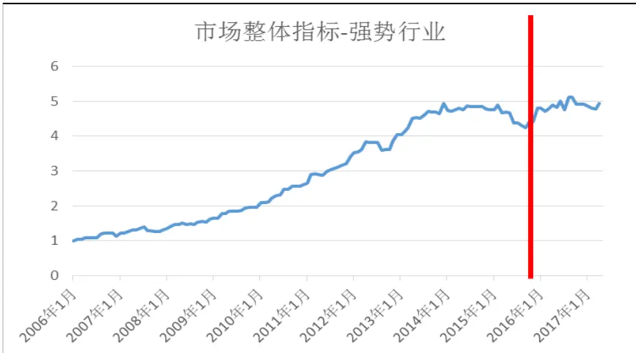
数据来源： 国泰君安证券研究

表 9：市场整体指标-强势行业

|  | 年化收益率 | 标准差 | 最大回撤 | 胜率 |
| --- | --- | --- | --- | --- |
| 样本内 | 16.31% | 10.56% | -14.17% | 79.55% |
| 样本外 | 1.86% | 10.28% | -6.58% | 41.67% |

数据来源： 国泰君安证券研究

我们根据相同的方法，基于 2006年1 月至2015年12 月的市场风格指标,对2016年 1月至 2016年5 月样本外的弱势行业进行滚动预测并构建投资策略，当信号发生时，我们做空所预测的行业，并计算该策略相对行业平均的超额收益。在对于弱势行业的预测中，例如，以 2015年12月为截点，我们共发现了13条“确定性”的规律。这些“确定性”规律仅适用于9个行业，其中交通运输、纺织服装、钢铁和化工在所有“确定性”规律所预测行业中的比例最高。

根据市场整体指标与弱势行业之间“确定性”规律，我们在样本外获得了年化14.43%的超额收益，最大回撤为-5.40%，战胜市场行业平均的胜率为 75%。

图9：市场整体指标-弱势行业
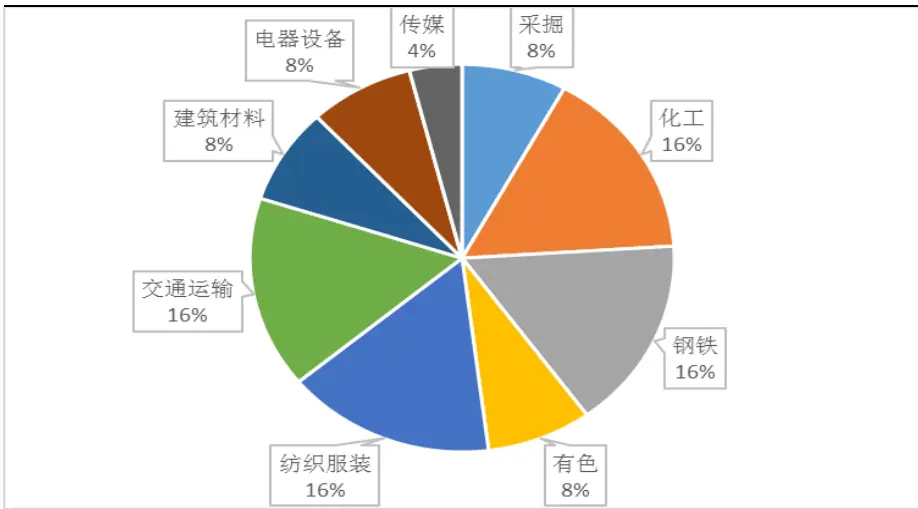
数据来源： 国泰君安证券研究

图10：市场整体指标-弱势行业
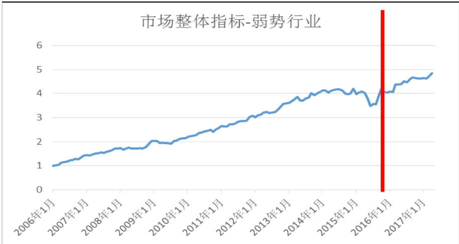
数据来源： 国泰君安证券研究

表 10：市场整体指标-弱势行业

|  | 年化收益率 | 标准差 | 最大回撤 | 胜率 |
| --- | --- | --- | --- | --- |
| 样本内 | 15.30% | 9.77% | -17.15% | 75.42% |
| 样本外 | 14.43% | 7.17% | -0.94% | 75% |

数据来源： 国泰君安证券研究

## 3.4.行业涨跌指标

根据历史数据，对于绝大多数行业，连续两月高于行业平均的概率低于40%。近年来，随着行业轮动速度的加快，传统的行业轮动中的动量效应所带来的超额收益逐渐消失。由于行业动量策略仅根据强势行业的信息对行业轮动进行预测，忽略了弱势行业可能对于行业轮动的预测作用。在本部分，我们尝试根据各行业当月表现的强弱，找出行业间表现强弱的信息在行业轮动中“确定性”的规律(当某行业在当月的表现高于（低于）行业平均时，我们定义该行业在当月为强势（弱势）行业)。

基于2006年 1月至2015年12月的行业间涨跌情况，我们对 2016年 1月至2016年 5月样本外的强势行业进行滚动预测并构建投资策略。以2015年12月为截点，我们共发现了 20 条行业涨跌指标对强势行业预测的“确定性”的规律，这些规律仅适用于9 个行业，其中家用电器、医药生物和汽车在所有“确定性”规律所预测行业中的比例最高。

图11：行业涨跌指标-强势行业
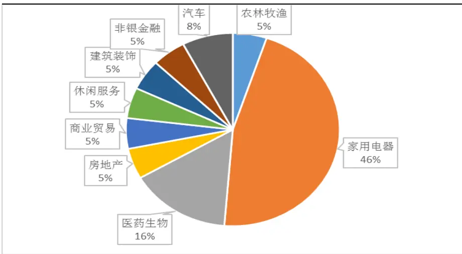
数据来源： 国泰君安证券研究

图12中的蓝色曲线为该策略相对行业等权收益的净值曲线。红线左侧为样本内对该策略相对行业等权收益的净值曲线，而红线右侧为样本外该策略相对行业等权收益的净值曲线。在样本外，该策略的年化超额收益率为6.68%, 月度最大回撤为-3.37%，战胜行业平均收益的胜率为62.50%。

图12：行业强弱指标-强势行业
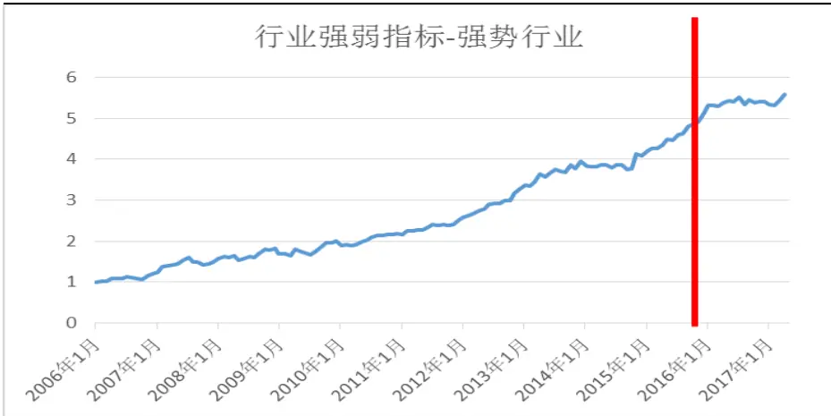
数据来源： 国泰君安证券研究

表 11：行业强弱指标-强势行业

|  | 年化收益率 | 标准差 | 最大回撤 | 胜率 |
| --- | --- | --- | --- | --- |
| 样本内 | 17.57% | 10.95% | -10.52% | 74.34% |
| 样本外 | 6.68% | 6.28% | -3.37% | 62.50% |

数据来源： 国泰君安证券研究

我们基于2006年 1月至2015年12月的行业涨跌指标,对2016年 1月至2016年5 月样本外的弱势行业进行滚动预测并构建投资策略，当信号发生时，我们做空所预测的行业，并计算该策略相对行业平均的超额收益。在对于弱势行业的预测中，例如，以2015年12月为截点，我们共发现了241条“确定性”的规律。这些“确定性”规律仅适用于 9个行业，其中交通运输和工用事业在所有“确定性”规律所预测行业中的比例最高。

图13：行业强弱指标-弱势行业
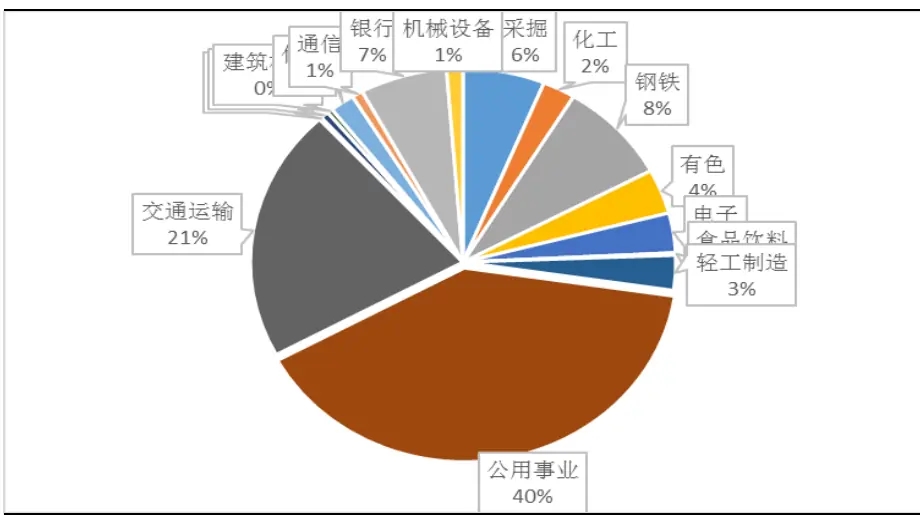
数据来源： 国泰君安证券研究

图13中的蓝色曲线为该策略相对行业等权收益的净值曲线。红线左侧为样本内对该策略相对行业等权收益的净值曲线，而红线右侧为样本外该策略相对行业等权收益的净值曲线。根据行业涨跌指标与弱势行业之间“确定性”规律，我们在样本外获得了年化-0.05%的超额收益，最大回撤为-4.25%，战胜市场行业平均的胜率为56.25%。

图14：行业强弱指标-弱势行业
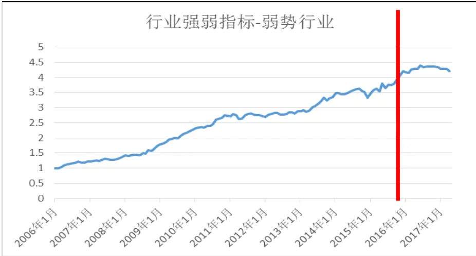
数据来源： 国泰君安证券研究

表 12：行业强弱指标-弱势行业

|  | 年化收益率 | 标准差 | 最大回撤 | 胜率 |
| --- | --- | --- | --- | --- |
| 样本内 | 15.31% | 7.80% | -8.21% | 74.58% |
| 样本外 | -0.05% | 3.94% | -4.25% | 56.25% |

数据来源： 国泰君安证券研究

## 3.5.行业间风险指标

如果把行业看成单个风险资产,行业自身风险的大小自然对于行业间收益的变化具有一定的预测作用。在本篇报告中，我们运用行业的波动率去描述行业自身的风险大小。在每月的月末，我们根据行业指数的日频数据计算出当月各行业的波动率。当该行业当月的波动率超过（低于）行业平均波动率时，我们定义该行业的风险超过（低于）行业平均。在此基础上，我们尝试找出行业间风险大小在行业轮动中“确定性”的规律。

基于2006年 1月至2015年12月的行业间波动率的指标，我们对 2016年1月至2016年5月样本外的强势行业进行滚动预测并构建投资策略。以2015年12 月为截点，我们共发现了 32条行业涨跌指标对强势行业预测的“确定性”的规律，这些规律仅适用于10个行业，其中机械设备、医药生物和家用电器在所有“确定性”规律所预测行业中的比例最高。

图15：行业 vol-强势行业
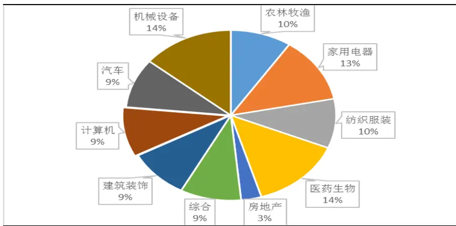
数据来源： 国泰君安证券研究

图16中的蓝色曲线为该策略相对行业等权收益的净值曲线。红线左侧为样本内对该策略相对行业等权收益的净值曲线，而红线右侧为样本外该策略相对行业等权收益的净值曲线。在样本外，该策略的年化收益率为8.57%, 月度最大回撤为-1.97%，战胜行业平均收益的胜率为 80%。

图16：行业 Vol-强势行业
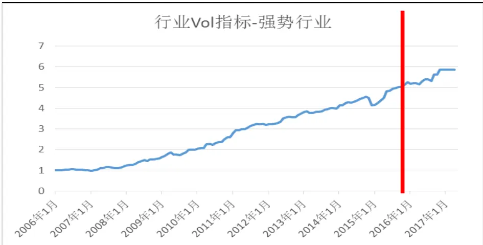
数据来源： 国泰君安证券研究

表 13：行业 Vol-强势行业

|  | 年化收益率 | 标准差 | 最大回撤 | 胜率 |
| --- | --- | --- | --- | --- |
| 样本内 | 18.09% | 9.09% | -9.25% | 80.53% |
| 样本外 | 8.57% | 6.85% | -1.97% | 80% |

数据来源： 国泰君安证券研究

我们根据相同的方法，基于 2006年1 月至2015年12 月的行业波动率指标,对2016年 1 月至2016 年5 月样本外的弱势行业进行滚动预测并构建投资策略，当信号发生时，我们做空所预测的行业，并计算该策略相对行业平均的超额收益。在对于弱势行业的预测中，例如，以 2015年12月为截点，我们共发现了 187条“确定性”的规律。这些“确定性“规律仅适用于12 个行业，其中交通运输、公用事业、银行和通信在所有“确定性”规律所预测行业中的比例最高。

图 17：行业 Vol-弱势行业
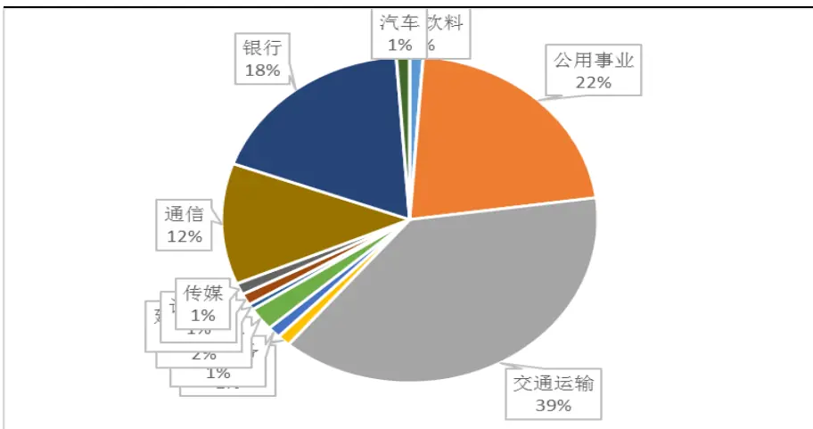
数据来源： 国泰君安证券研究

图18中的蓝色曲线为该策略相对行业等权收益的净值曲线。红线左侧为样本内对该策略相对行业等权收益的净值曲线，而红线右侧为样本外该策略相对行业等权收益的净值曲线。根据行业涨跌指标与弱势行业之间“确定性”规律，我们在样本外获得了年化0.23%的超额收益，最大回撤为-3.03%，战胜市场行业平均的胜率为43.75%。

图18：行业 Vol-弱势行业
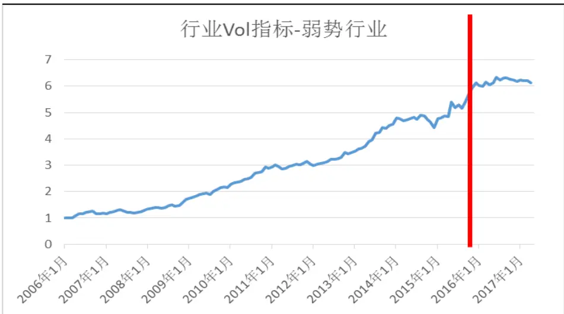
数据来源： 国泰君安证券研究

表 14：行业 Vol-强势行业

|  | 年化收益率 | 标准差 | 最大回撤 | 胜率 |
| --- | --- | --- | --- | --- |
| 样本内 | 19.86% | 10.48% | -9.56% | 73.73% |
| 样本外 | 0.23% | 5.21% | -3.03% | 43.75% |

数据来源： 国泰君安证券研究

## 3.6.行业间下行风险指标

最新的金融学相关研究发现,股票的下行风险存在着显著的风险溢价。在本部分,我们尝试寻找行业自身下行风险的变化和行业轮动的因果联系。在之前我们通过沪深300 指数构建了衡量市场整体下行风险 VaR指标，在本部分我们按照同样的方法，构建衡量行业自身下行风险的 VaR指标。为了去除市场下行风险对估算行业自身下行风险的影响，我们首先以行业指数的日频数据计算出各行业与行业平均收益之差（行业超额收益）; 然后，基于行业超额收益滚动计算出各行业的日频 VaR（N=200，u=0，p=10%）; 最后以行业当月日频 VaR 的均值作为该行业当月的 VaR值。当某行业的 VaR 小于（大于）行业平均 VaR, 我们定义该行业当月的下行风险超过（低于）行业平均。

基于2006年 1月至2015年12月的行业间下行风险指标（VaR），我们对2016年1月至2016年5月样本外的强势行业进行滚动预测并构建投资策略。以2015年12 月为截点，我们共发现了 10条行业涨跌指标对强势行业预测的“确定性”的规律，这些规律仅适用于 4个行业，其中家用电器在所有“确定性”规律所预测行业中的比例最高。

图19：行业 VaR-强势行业
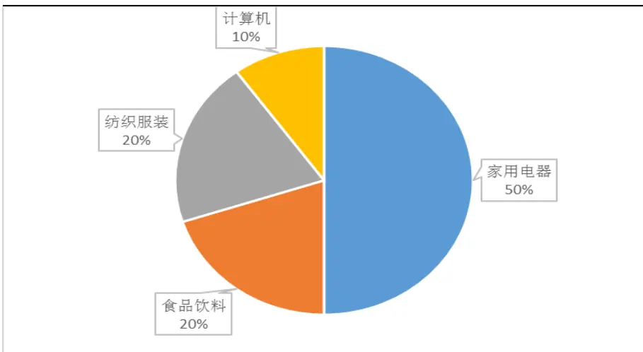
数据来源： 国泰君安证券研究

图20中的蓝色曲线为该策略相对行业等权收益的净值曲线。红线左侧为样本内对该策略相对行业等权收益的净值曲线，而红线右侧为样本外该策略相对行业等权收益的净值曲线。在样本外，该策略的年化收益率为8.97%, 月度最大回撤为-5.88%，战胜行业平均收益的胜率为66.67%。

图20：行业 VaR-强势行业
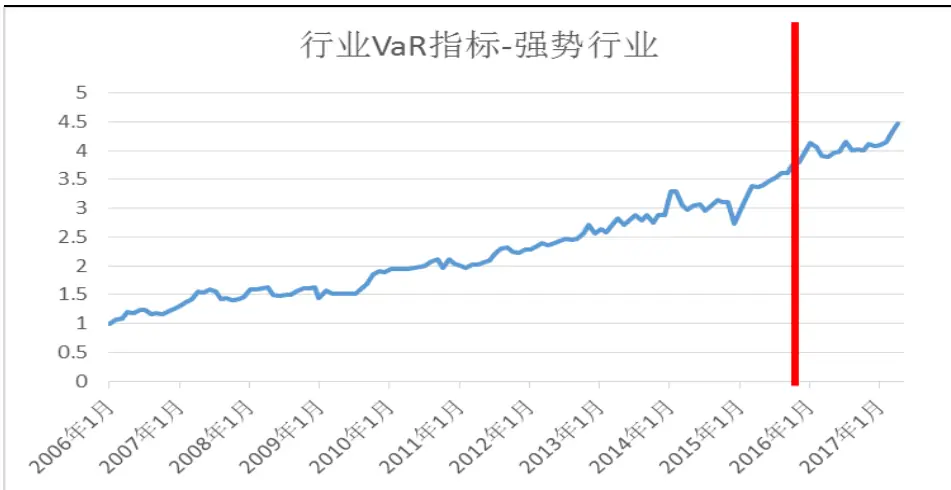
数据来源： 国泰君安证券研究

表 15：行业VaR-强势行业

|  | 年化收益率 | 标准差 | 最大回撤 | 胜率 |
| --- | --- | --- | --- | --- |
| 样本内 | 14.52% | 14.41% | -17.14% | 69.37% |
| 样本外 | 8.97% | 8.71% | -5.88% | 66.67% |

数据来源： 国泰君安证券研究

我们根据相同的方法，基于 2006年1 月至2015年12 月的行业VaR 指标,对2016年 1月至 2016年5 月样本外的弱势行业进行滚动预测并构建投资策略，当信号发生时，我们做空所预测的行业，并计算该策略相对行业平均的超额收益。在对于弱势行业的预测中，例如，以 2015年12月为截点，我们共发现了 289条“确定性”的规律。这些“确定性“规律仅适用于11个行业，其中交通运输、公用事业和采掘在所有“确定性”规律所预测行业中的比例最高。

图21：行业 VaR-弱势行业
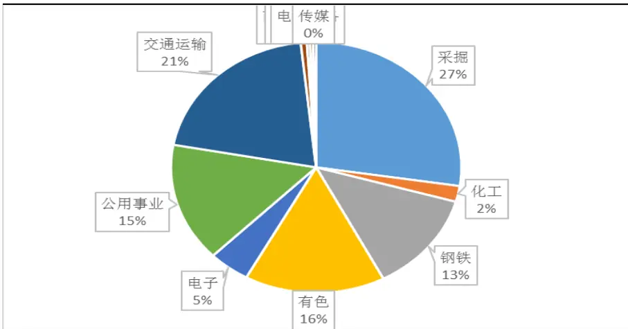
数据来源： 国泰君安证券研究

图21中的蓝色曲线为该策略相对行业等权收益的净值曲线。红线左侧为样本内对该策略相对行业等权收益的净值曲线，而红线右侧为样本外该策略相对行业等权收益的净值曲线。在样本外，该策略的年化超额收益率为-0.97%, 月度最大回撤为-6.83%，战胜行业平均收益的胜率为50%。

图22：行业 VaR-弱势行业
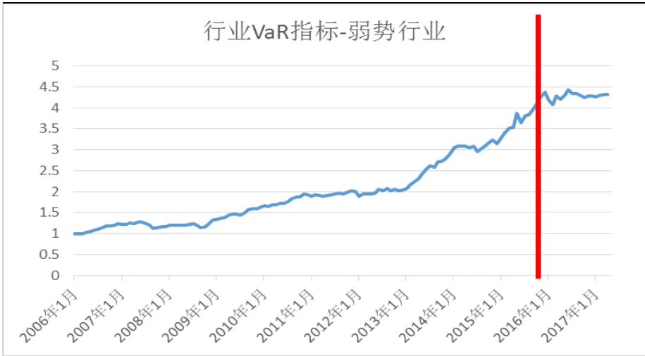
数据来源： 国泰君安证券研究

表 16：行业VaR-弱势行业

|  | 年化收益率 | 标准差 | 最大回撤 | 胜率 |
| --- | --- | --- | --- | --- |
| 样本内 | 15.90% | 9.12% | -11.85% | 73.73% |
| 样本外 | -0.97% | 7.70% | -6.83% | 50% |

数据来源： 国泰君安证券研究

## 3.7.综合所有指标的行业轮动策略

在3.1-3.5中，我们具体讨论了如何基于宏观指标、市场风格指标、市场总体指标、行业涨跌指标、行业间风险以及行业间下行风险这六类指标，寻找各类指标在行业轮动中“确定性”的规律，从而构建行业轮动策略。

我们发现，根据这六类指标与强势行业之间“确定性”的规律构建的行业轮动策略全部在样本外跑赢了行业平均。其中基于宏观指标构建的行业轮动策略在样本外的表现最好，而基于市场总体指标构建的行业轮动策略在样本外的表现最差。而根据这六类指标与弱势行业之间“确定性“规律构建的行业轮动策略表现不尽人意，仅有一半在样本外跑赢了行业平均。其中基于市场总体指标构建的行业轮动策略在样本外效果最好，而基于宏观指标构建的行业轮动策略在样本外表现最差。综合而言，基于市场风格指标构建的行业轮动策略无论是在对于强势行业预测，还是在对于弱势行业预测，在样本外的表现相对最为稳定。

由于这六类指标从本质上蕴含的信息存在巨大的差异，因此当市场出现急剧变化时，基于这六类指标的行业轮动的策略在表现上也容易出现巨大的分化。例如，在 2014 年底大小盘出现明显分化时，受到影响最为严重的是基于市场风格构建的行业轮动策略，出现了 13.59%的巨大回撤，而基于其他市场交易信息构建的指标上的行业轮动策略也不同程度的受到影响。但是基于宏观信息构建的行业轮动策略却在该时点并没有受到过多的影响。因此，如果未来市场的某一属性出现急剧的变化时，那么与这一属性紧密相关的行业轮动策略的表现难免会出现巨大波动。为了使得投资策略更加的稳健，我们尝试综合所有类别指标下的“确定性”规律，尝试构建更加稳定，能够适应不同市场环境的行业轮动的投资策略。

由于不同类别指标下“确定性”规律在数量上存在着显著的差异，因此如果我们简单的对所有的规律进行等权处理，这会导致投资组合的表现主要由“确定性”规律更加多的那类指标决定。为了使得投资组合最后的表现更加均衡的体现各类不同的信息指标，我们根据信号数据来源来调节各“确定性”规律的权重。

在本篇报告中，“确定性”规律总共来源于 6 类指标，我们按照以下方法对各信号配权：

第一步，在时间t,如果发出信号的“确定性”规律来源于 N类指标，则来源于同一类指标的信号在 t+1期所选择的行业的权重为 1/N。

第二步，对于来源于同一类别指标的信号，我们对此预测的行业等权处理。例如，在时间t,仅有基于“宏观指标”和“行业涨跌指标”的“确定性”规律发出信号。其中基于“宏观指标”的信号共有两个，那么每个信号所预测的行业在t+1 所占的权重为1/4。

按照以上方法，基于所有指标与强势行业之间“确定性”规律构建的行业轮动策略在样本外的年化超额收益率为8.29%, 月度最大回撤为

-1.24%，战胜行业平均收益的胜率为75%。

图23：所有指标-强势行业
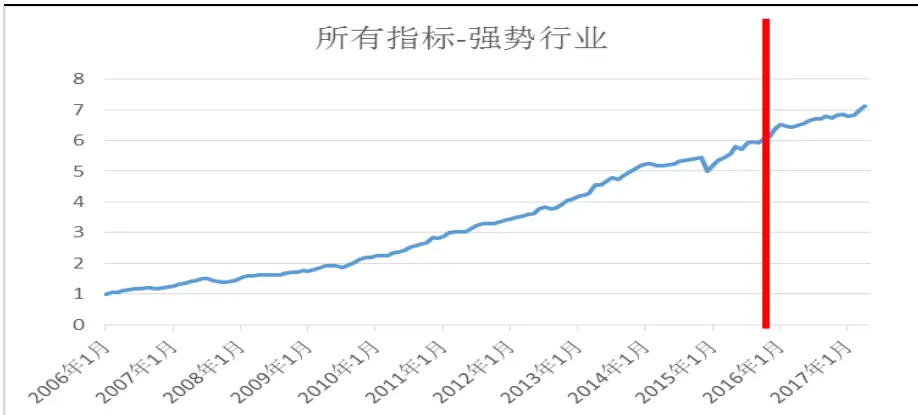
数据来源： 国泰君安证券研究

表 17：所有指标-强势行业

|  | 年化收益率 | 标准差 | 最大回撤 | 胜率 |
| --- | --- | --- | --- | --- |
| 样本内 | 20.24% | 7.63% | -8.66% | 88.14% |
| 样本外 | 8.29% | 3.57% | -1.24% | 75% |
| 样本外(六类指标平均) | 7.40% | 7.31% | -3.97% | 66.21% |

数据来源： 国泰君安证券研究

而综合所有指标与弱势行业之间“确定性”规律构建的行业轮动策略，相对于行业平均，在样本外获得了1.37%的超额收益，最大回撤为-3.06%,战胜行业平均的胜率为43.75%。

图24：所有指标-弱势行业
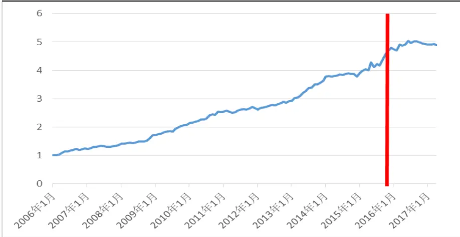
数据来源： 国泰君安证券研究

表 18：所有指标-弱势行业

|  | 年化收益率 | 标准差 | 最大回撤 | 胜率 |
| --- | --- | --- | --- | --- |
| 样本内 | 17.02% | 6.62% | -4.15% | 77.97% |
| 样本外 | 1.37% | 5.39% | -3.06% | 43.75% |
| 样本外(六类指标平均) | 1.50% | 6.15% | -5.10% | 50% |

数据来源： 国泰君安证券研究

## 4. 总结和展望

在本篇报告中，我们根据市场的宏观信息和市场交易信息，从不同的角度出发构建六类不同的指标：宏观指标、市场风格指标、市场总体指标、行业涨跌指标、行业间风险以及行业间下行风险。运用数据中挖掘关联规则的方法，我们尝试找出这六类指标在行业轮动中“确定性”的规律，并基于这些“确定性”规律构建行业轮动策略。我们发现，这六类指标从不同的角度出发，对于行业轮动具有显著的预测作用，基于这些“确定性”规律的行业轮动策略可以显著的跑赢行业平均。其中，相对于弱势行业的预测，这些指标对于强势行业在样本外的预测效果更好。最后，当我们综合所有的指标中“确定性“规律构建行业轮动策略时，可以在维持收益的基础上，大幅度的控制回撤，保持策略收益的稳定性。该策略在样本外获得了年化8.29%超额收益率, 月度最大回撤为-1.24%，战胜行业平均的概率为75%。

影响行业的涨跌和轮动的信息及内在逻辑错综复杂，由于行业自身属性上存在着巨大的差异，这使得我们很难找到一个适用于所有行业所有情景的解释并预测行业轮动的规则。不同于以往的关于行业轮动的研究，本篇报告尝试找出若干仅适用于特定行业或者特定情景的“确定性”的规律，从而“拼凑”出有效解释并预测行业轮动的策略。在本篇报告中，基于有限的6 类指标，我们在样本外已经获得了不错的效果，但这仅仅是管中窥豹。在未来，我们主要从以下几个方面出发，更多的挖掘出行业轮动中“确定性”规律，从而更好的拼凑出行业轮动的全图：

1.信息来源：在本篇报告中，我们仅包含了主要的宏观指标及交易信息。在以后的研究中，我们将进一步搜集关于行业自身的宏观类的信息并构建可预测行业轮动的指标。此外，如何对行业自身信息进行量化并客观的进行比较是我们今后研究的重点。

2.检测各类指标在周频及日频上对于行业轮动的预测效果。由于宏观指标发布频率的限制，在本篇报告中我们仅研究了这些指标对于月频下行业轮动的预测作用。在未来的研究中，我们将尝试从市场、行业及行业中个股的交易信息及脉冲型信息出发，研究这些信息对于更高频行业轮动的预测作用。

3.更好的量化指标所包含的信息。在本篇报告中，我们一般通过两到三种状态变量去刻画各类指标所隐含的信息。在以后的研究中，我们将尽可能通过更多的状态变量去更精确的描述各类指标，从而更加精准的抓住各类指标与行业轮动中更加“确定性”的规律。

## 本公司具有中国证监会核准的证券投资咨询业务资格

## 分析师声明

作者具有中国证券业协会授予的证券投资咨询执业资格或相当的专业胜任能力，保证报告所采用的数据均来自合规渠道，分析逻辑基于作者的职业理解，本报告清晰准确地反映了作者的研究观点，力求独立、客观和公正，结论不受任何第三方的授意或影响，特此声明。

## 免责声明

本报告仅供国泰君安证券股份有限公司（以下简称“本公司”）的客户使用。本公司不会因接收人收到本报告而视其为本公司的当然客户。本报告仅在相关法律许可的情况下发放，并仅为提供信息而发放，概不构成任何广告。

本报告的信息来源于已公开的资料，本公司对该等信息的准确性、完整性或可靠性不作任何保证。本报告所载的资料、意见及推测仅反映本公司于发布本报告当日的判断，本报告所指的证券或投资标的的价格、价值及投资收入可升可跌。过往表现不应作为日后的表现依据。在不同时期，本公司可发出与本报告所载资料、意见及推测不一致的报告。本公司不保证本报告所含信息保持在最新状态。同时，本公司对本报告所含信息可在不发出通知的情形下做出修改，投资者应当自行关注相应的更新或修改。

本报告中所指的投资及服务可能不适合个别客户，不构成客户私人咨询建议。在任何情况下，本报告中的信息或所表述的意见均不构成对任何人的投资建议。在任何情况下，本公司、本公司员工或者关联机构不承诺投资者一定获利，不与投资者分享投资收益，也不对任何人因使用本报告中的任何内容所引致的任何损失负任何责任。投资者务必注意，其据此做出的任何投资决策与本公司、本公司员工或者关联机构无关。

本公司利用信息隔离墙控制内部一个或多个领域、部门或关联机构之间的信息流动。因此，投资者应注意，在法律许可的情况下，本公司及其所属关联机构可能会持有报告中提到的公司所发行的证券或期权并进行证券或期权交易，也可能为这些公司提供或者争取提供投资银行、财务顾问或者金融产品等相关服务。在法律许可的情况下，本公司的员工可能担任本报告所提到的公司的董事。

市场有风险，投资需谨慎。投资者不应将本报告作为作出投资决策的唯一参考因素，亦不应认为本报告可以取代自己的判断。
在决定投资前，如有需要，投资者务必向专业人士咨询并谨慎决策。

本报告版权仅为本公司所有，未经书面许可，任何机构和个人不得以任何形式翻版、复制、发表或引用。如征得本公司同意进行引用、刊发的，需在允许的范围内使用，并注明出处为“国泰君安证券研究”，且不得对本报告进行任何有悖原意的引用、删节和修改。

若本公司以外的其他机构（以下简称“该机构”）发送本报告，则由该机构独自为此发送行为负责。通过此途径获得本报告的投资者应自行联系该机构以要求获悉更详细信息或进而交易本报告中提及的证券。本报告不构成本公司向该机构之客户提供的投资建议，本公司、本公司员工或者关联机构亦不为该机构之客户因使用本报告或报告所载内容引起的任何损失承担任何责任。

## 评级说明

## 1.投资建议的比较标准

投资评级分为股票评级和行业评级。

以报告发布后的12个月内的市场表现为比较标准，报告发布日后的 12个月内的公司股价（或行业指数）的涨跌幅相对同期的沪深 300 指数涨跌幅为基准。

## 2.投资建议的评级标准

报告发布日后的 12 个月内的公司股价（或行业指数）的涨跌幅相对同期的沪深 300 指数的涨跌幅。

|  | 评级 | 说明 |
| --- | --- | --- |
| 股票投资评级 | 增持 | 相对沪深300指数涨幅15%以上 |
|  | 谨慎增持 | 相对沪深300指数涨幅介于5%～15%之间 |
|  | 中性 | 相对沪深300指数涨幅介于-5%～5% |
|  | 减持 | 相对沪深 300 指数下跌 5%以上 |
| 行业投资评级 | 增持 | 明显强于沪深 300 指数 |
|  | 中性 | 基本与沪深 300指数持平 |
|  | 减持 | 明显弱于沪深300指数 |

## 国泰君安证券研究所

|  | 上海 | 深圳 | 北京 |
| --- | --- | --- | --- |
| 地址 | 上海市浦东新区银城中路168号上海 银行大厦29层 | 深圳市福田区益田路 6009 号新世界 商务中心34层 | 北京市西城区金融大街 28 号盈泰中 心2号楼10层 |
| 邮编 | 200120 | 518026 | 100140 |
| 电话 | （021)38676666 | （0755）23976888 | (010)59312799 |
|  | E-mail: gtjaresearch@gtjas.com |  |  |