inInfo] [Table_Title] 2017.08.22

# 缠论中的笔在 MACD 价格分段中的应用

## ——数量化专题之一百零一

孟繁雪（分析师）

刘富兵（分析师）

8 021-38675860

021-38676673

mengfanxue@gtjas.com

liufubing008481@gtjas.com

证书编号 S0880517040005

S0880511010017

## 本报告导读：

本报告对缠论中的笔进行严格的量化定义，同时将笔与已有的MACD价格分段结合，观察其结构特征与走势规律，进一步补充了MACD价格分段体系在指数择时方面的应用。摘要：

le_Summary]基于缠论中笔的波段价格划分规则：按照缠论中的 K 线处理方式，对包含的K线做合并处理；连接相邻的顶底分型形成一笔，且顶底分型之间至少有1根 K线相隔；或价格突破前一笔的新高或新低；每个波段中价格的最大值和最小值只出现在波段的起点或终点。

缠论中笔在 MACD 价格分段中的结构：由于 MACD 价格分段以 DEA 指标穿越0轴为标准划分，与缠论中的段划分近似，而笔是构成段的内部结构，故将缠论中笔与段结合观察其内部结构特征，可发现主要指数“上涨”和“下跌”对应缠论笔数主要集中在1，3，5，累计占比接近90%，且主要指数的顶部及底部信号一般不超过5笔，说明笔在段中的内部结构对于指数择时研究有着不错的稳定性及适用性。

缠论中笔在MACD中价格分段中的应用一：以上证综指为例，其下跌波段在日线级别走势上出现的笔数主要集中在1，3，5，累计占比高达 97%，即当 MACD 价格分段下跌中出现向下 5 笔时，波段日线级别底部已接近；介入点可考虑在出现 5笔下跌随后出现的笔上涨确认点处买入，等待MACD波段上涨确认；笔上涨确认到MACD上涨确认平均涨幅3.5%，平均提前10个交易日确认上涨。

缠论中笔在MACD中价格分段中的应用二：波段确认的笔数可以较好刻画市场走势的流畅性，波段确认时的笔数越少，市场的走势越流畅，随后的延伸越好；笔数越多，市场的走势越纠结，随后的反转概率越大；尤其是缠论 3笔确认MACD 日线级别“下跌”时，波段日线级别大概率见底；随后1笔上涨确认到 MACD上涨确认平均涨幅 4.5%，平均提前14个交易日确认上涨，有较好的上涨空间。

缠论中笔在MACD中价格分段中的应用三：借鉴缠论中相关的背驰概念，定义波段内的笔背离，同时进一步刻画市场状态，在价格不创一年的新高或新低的情况下寻找有效的背离反转位置，提前预判 MACD价格分段的拐点；符合条件的背离点到波段反转确认点的空间平均为6.5%，潜在的盈利空间更大。

金融工程

## 金融工程团队：

刘富兵：（分析师）

电话：021-38676673

邮箱：liufubing008481@gtjas.com

证书编号：S0880511010017

## 陈奥林：（分析师）

电话：021-38674835

邮箱：chenaolin@gtjas.com

证书编号：S0880516100001

## 李辰：（分析师）

电话：021-38677309

邮箱：lichen@gtjas.com

证书编号：S0880516050003

## 孟繁雪：（分析师）

电话：021-38675860

邮箱：mengfanxue@gtjas.com

证书编号：S0880517040005

## 蔡旻昊：（研究助理）

电话：021-38674743

邮箱：caiminhao@gtjas.com

证书编号：S0880117030051

## 殷明：（研究助理）

电话：021-38674637

邮箱：yinming@gtjas.com证书编号：S0880116070042

## 叶尔乐：（研究助理）

电话：021-38032032

邮箱：yeerle@gtjas.com

证书编号：S0880116080361

## 殷钦怡：（研究助理）

电话：021-38675855

邮箱：yinqinyi@gtjas.com

证书编号：S0880117060109

## [Tab 相关报告le_R

《行业轮动中“确定性”的规律及投资机会》2017.08.18

《多维度挖掘公开市场回购中的超额收益》2017.08.01

《银行委外视角下的产品选择：公募篇》2017.07.19

《基于前景理论的选股策略》2017.07.18

《基于深度组合的选股策略》2017.07.11

## 1. 引言

“缠论”是网络名人“缠中说禅”关于证券市场的一种投资理论，其借助数学中的形态分类方法和物理中的动力学理论来解释市场走势，以K线图为基础，通过K线包含关系处理，分辨出走势图中的分型（顶分型和底分型），通过分型得到笔的概念，再由笔构造出线段，线段确立走势中枢，继而判别走势类型，结合动力学部分的背驰及区间套，确定三类买卖点。

一根K线的高低点全部在其相邻K线的高低点范围之内，那么这根K线和其相邻 K 线就称为包含关系。K 线包含关系的处理如图 1 左侧所示：向上时把两K线的最高点当高点，两K线低点中的较高者当成低点；反之，向下时把两 K 线的最低点当低点，两 K 线高点中的较低者当成高点，这样就把两K线合并成一根新的K线；以此规律，向后依次递推处理K线。

K 线图的包含处理是一种过滤方式，它只关心市场短期的新高、新低，可以增加K线的有序性，使得K线图的升降关系更简明。这样非包含关系的三相邻K线可以进行完全分类，分为：上升K线，下降K线，顶分型，底分型。其中，相邻三根K线中，中间一根K线的高点是三根K线高点中最高的，其低点也是三根K线低点中最高的，这三根K线的组合就是顶分型；相应的中间一根K线的低点是三根K线低点中最低的，其高点也是三根K线高点中最低的，三根 K线的组合就是底分型。

图 1 缠论中的 K 线处理与分型
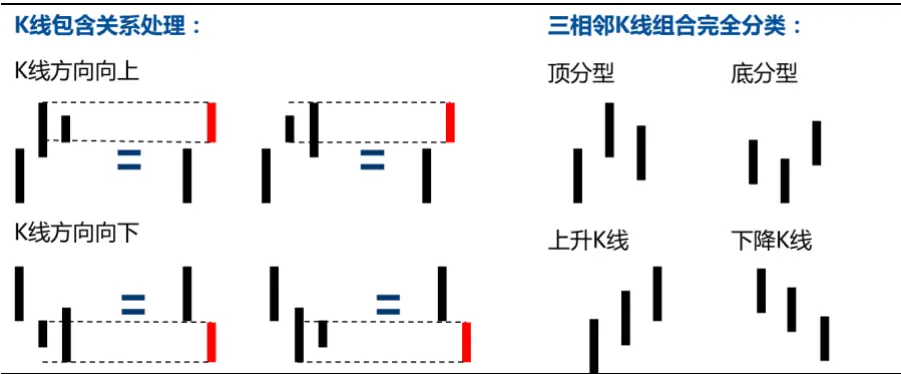
数据来源：国泰君安证券研究

确定分型后，两个相邻顶分型和底分型的顶底之间连线叫做笔，如图 2左侧所示，但需要注意是顶分型和底分型之间至少要有一根独立K线，即需要满足缠论中所说的结合律。线段至少要由三笔组成，且前三笔必须有重叠的部分，如图2 右侧所示。

图 2缠论中的笔与线段
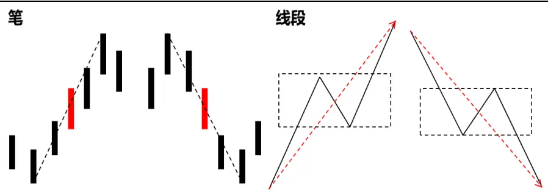
数据来源：国泰君安证券研究

市场上对于缠论的理解可谓“千人千缠”，意思是说对于同一段市场走势，根据个人对缠论方法的理解，每个人划分出来的走势中枢和买卖点可能都不一样。本报告借助缠论中的理念，首先对缠论中的笔进行了量化定义，避免主观划分而带来的误差；其次由于 MACD 价格分段是基于DEA指标穿越0轴形成，接近于缠论中段的刻画，进而考虑将笔与已有的 MACD 价格分段结合，观察笔在段中的内部结构特征；通过波段确认延伸情况及波段内背离情况的分析，提高预判波段走势结束的概率，从而进一步补充MACD价格分段体系在指数择时方面的应用。

## 2. 缠论中笔的价格分段介绍

价格分段有很多种方法，没有哪一种方法是最优的，不同分段规则的存在意义在于：选取某种分段使得当下走势的不确定性降到最低。本篇报告主要对基于缠论中的笔的价格方法进行探究，从另外一个视角观察市场走势结构。

## 2.1.笔的价格分段定义

## 基于缠论中笔的波段划分规则：

1) 按照缠论中K 线处理方法，包含的 K线做合并处理；

2) 连接相邻的顶底分型形成一笔，且顶底分型之间至少有1根K线相隔；或价格突破前一笔的新高或新低；

3) 每个波段中价格的最大值和最小值只出现在波段的起点或终点。

笔的波段划分第一个原则是按照缠论中的K线处理方法，对存在包含关系的两根 K 线合并，从而增加 K 线的有序性。第二个原则是按照缠论笔的规则顶底分型之间至少有1根K线相隔，同时补充了突破前一笔新高或新低的情况。第三个原则是波段定义的基本要求，起点或终点必然是波段中的最高点或最低点，需注意缠论K线处理时使用了K线的最高价和最低价，所以波段的极值点不是收盘价。

图 3基于缠论中笔的价格分段示意图
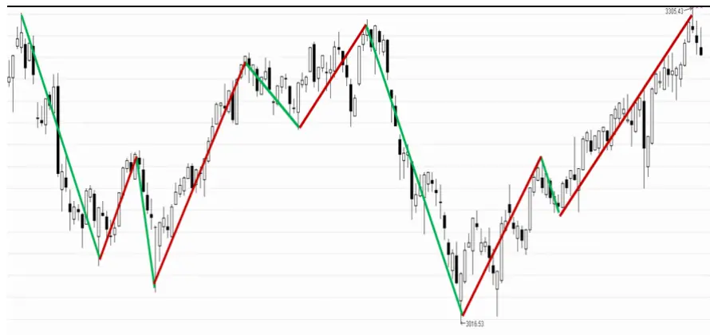
数据来源：国泰君安证券研究

## 2.2.笔的价格分段确认规则

对于一个上涨或者下跌波段拐点的确认，主要有以下三种情况：

第一种情况如图4，C点位置满足：①C到B之间至少存在3根处理后的不包含的K线；②从B开始的上涨行情创反弹以来的最高。而条件①满足意味着C点具备成为顶分型的条件，且顶底分型之间至少有1根K线相隔，因此 B 是拐点得到确认：AB波段结束，BC波段形成。

图 4 笔当下形成确认之一
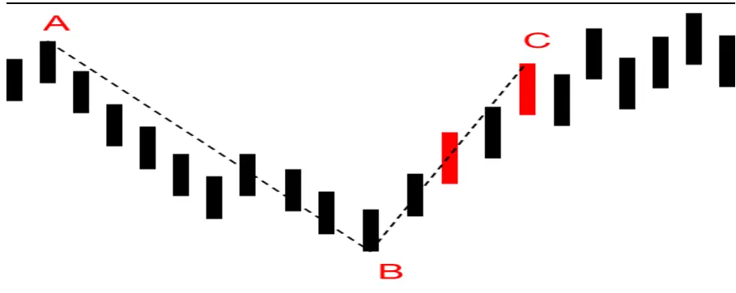
数据来源：国泰君安证券研究

第二种情况如图5，C点位置满足：①C到B之间至少存在3根处理后的不包含的K线； ②C不是从B开始的上涨行情创反弹以来的最高。此时不能确认B点是拐点。

D点位置满足：①D到 B之间至少存在3 根处理后的不包含的K线；②D是从B开始的上涨行情创反弹以来的最高。B点是拐点得到确认。

图 5笔当下形成确认之二
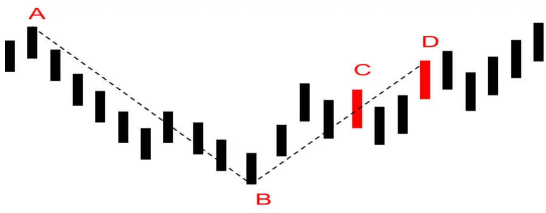
数据来源：国泰君安证券研究

第三种情况如图 6 左图所示，C 点位置满足：从 B 开始的上涨行情创反弹以来的最高，C 处价格大于 A 处价格。此时可以不考虑 C 到 B 之间至少存在3根处理后的不包含K线；否则将如右图所示，价格继续下跌至D，如果 BC 没有形成上涨笔，则下跌的笔 AD 的最高点将位于 C 处，而非波段价格起始点。所以B 是拐点可以得到确认。

图 6笔当下形成确认之三
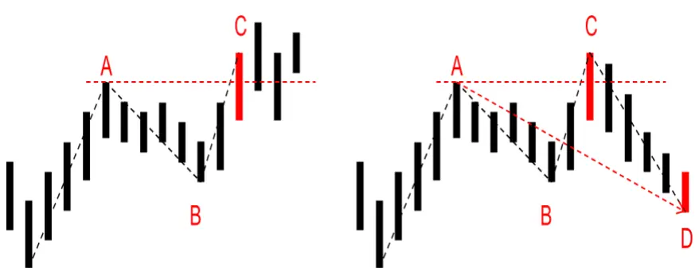
数据来源：国泰君安证券研究

## 2.3.笔的价格分段波动数据

以缠论中的笔对上证综指 2000 年 1 月 1 日至 2017 年 7 月 31 日的数据进行波段划分后，日线级别的涨跌波段共计 245 个，其中 123 个上涨波段，122 个下跌波段，笔是从价格波动幅度和周期的角度对市场进行的划分，所以波段划分较多。

分别从持续时间和涨跌幅两个维度对周、日、30分钟和5分钟的波段进行统计。周线级别（包含上涨和下跌）平均持续时间 17 个交易周，日线级别17个交易日，30分钟级别约为1.9个交易日，5分钟级别0.3个交易日，缠论的笔划分在分钟级别的持续周期从 K 线周期的角度来说也更短。

表 1: 上证综指基于缠论中笔划分的持续周期（2000-2017/7/31）

| 平均持续周期 (K线数) | 周 | 日 | 30 分钟 | 5分钟 |
| --- | --- | --- | --- | --- |
| 全部 | 17.84 | 17.33 | 14.72 | 13.53 |
| 上涨笔 | 18.60 | 18.55 | 15.32 | 13.87 |

| 下跌笔 17.04 | 16.10 | 14.11 | 13.20 |
| --- | --- | --- | --- |

数据来源：国泰君安证券研究

周线级别（包含上涨和下跌）平均持续幅度 34.7%，日线级别 11.9%，30 分钟级别 3.7%，5 分钟级别 1.3%，显然笔在周线及日线级别的可操作空间更大。

表 2: 上证综指基于缠论中笔划分的涨跌幅（2000-2017/7/31）

| 平均涨跌幅 | 周 | 日 | 30 分钟 | 5分钟 |
| --- | --- | --- | --- | --- |
| 全部 | 34.7% | 11.9% | 3.7% | 1.3% |
| 上涨笔 | 46.8% | 13.4% | 3.9% | 1.3% |
| 下跌笔 | -22.2% | -10.4% | -3.5% | -1.3% |

数据来源：国泰君安证券研究

## 3. 缠论中笔在 MACD 价格分段中的结构

将笔与段相结合，日线图上的一段上涨或者下跌，一般能出现多少笔呢？显然这个对应关系未必严格，基于日度收盘价计算得到的段的拐点未必可以严格对应到基于笔的最高最低价得到的拐点上，但绝大数情况下误差在 1 到 3 个交易日以内，所以寻求这种对应关系也是非常有益的。

## 3.1.上证综指 MACD 日线级别波动对应缠论笔的概率密度分布

类似于MACD价格分段中日线级别与30分钟级别的结构，由于笔之间也存在包含和被包含的关系，我们对于笔中既没有创新高也没有创新低的情况做合并：如果日线是上涨波段，对应的波段上没有创新高的笔都要被合并；反之，如果日线是下跌波段，对应的波段上没有创新低的笔都要被合并。

图7显示了上证综指自 2000 年以来，日线上一段上涨合并之后出现的笔数概率，上证综指上涨波段在日线级别走势上出现的笔数主要集中在 1，3，5，占比 89%；历史上最高出现过一次 13 笔的上涨，发生在2014-2015年的牛市；2006-2007年的牛市期间各出现了一次7笔上涨和9 笔上涨；2010/7/5-2010/11/8 出现了一次 9 笔的震荡上涨。

图 7上证综指 MACD日线级别“上涨”对应缠论笔数 X概率密度
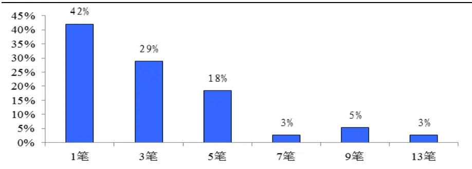
数据来源：国泰君安证券研究

上证综指下跌波段在日线级别走势上出现的笔数也主要集中在 1，3，5，占比 97%，只在 2008 年的熊市中出现了一次长达 11 笔的下跌；当上证综指日线级别下跌出现 5笔时，日线级别底部已临近。

图 8上证综指 MACD日线级别“下跌”对应缠论笔数 X概率密度
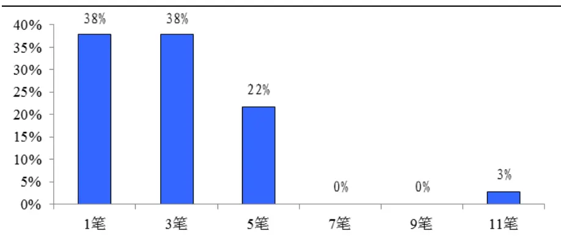
数据来源：国泰君安证券研究

## 3.2.MACD 日线级别缠论笔结构与对应 30分钟级别结构的对比

根据以上统计结果可以发现，缠论中笔在 MACD 价格分段中的结构和对应的 30 分钟级别结构规律存在很多相似之处，对波段的分解殊途同归，通过两套分段体系相互验证，可以减少我们对市场认知的不确定性；除此之外，两者之间也存在一些不同点，缠论中笔在 MACD 价格分段中的结构可以加以辅助和补充，提高我们的择时准确度。

图9上方为笔在MACD日线级别分段下的结构，下方为对应的MACD价格分段的30分钟级别内部结构；可发现笔在MACD日线级别分段下的波段数相对较少，且 5 笔结束的概率更高；有些情况下 MACD30 分钟级别已经走了5 段，但从缠论笔的角度只走了1笔。

图 9 上证综指 MACD 日线级别内部结构对比（2016-2017/7/31）
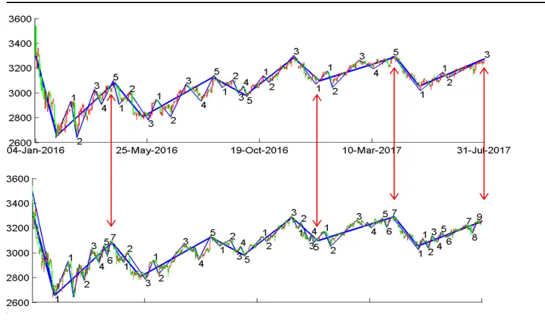
数据来源：国泰君安证券研究

## 3.3.主要指数 MACD 日线级别波动对应缠论笔的概率密度分布

选取常用的 7 个板块指数上证综指、上证 50、沪深 300、中证 500、深证成指、中小板指以及创业板指数据，统计研究 MACD 日线价格波动对应缠论笔的概率密度分布，可观察到主要指数的 MACD 日线级别“上涨”对应缠论笔数 X 概率密度与上证综指的结论近似，出现的笔数主要集中在1，3，5，甚至创业板指上涨1，3，5笔占比高达 94%。

表 3:主要指数的MACD日线级别“上涨”对应缠论笔数X 概率密度（2000-2017/7/31）

| 笔数 | 上证综指 | 上证50 | 沪深300 | 中证 500 | 深证成指 | 中小板指 | 创业板指 |
| --- | --- | --- | --- | --- | --- | --- | --- |
| 1笔 | 42% | 42% | 30% | 48% | 41% | 55% | 33% |
| 3笔 | 29% | 27% | 33% | 20% | 31% | 32% | 50% |
| 5笔 | 18% | 21% | 17% | 16% | 16% | 0% | 11% |
| 7笔 | 3% | 3% | 3% | 8% | 6% | 0% | 0% |
| 9笔 | 5% | 3% | 7% | 8% | 0% | 9% | 0% |
| 11 笔 | 0% | 3% | 7% | 0% | 0% | 5% | 0% |
| 13笔 | 3% | 0% | 3% | 0% | 6% | 0% | 0% |
| 15笔 | 0% | 0% | 0% | 0% | 0% | 0% | 6% |
| 1,3,5累计占比 | 89% | 91% | 80% | 84% | 88% | 86% | 94% |

数据来源：国泰君安证券研究

主要指数 MACD 日线级别“下跌”对应的缠论笔数更集中的出现在 1，3，5 笔，其中上证综指，上证 50 下跌 1，3，5 笔占比高达 97%；主要指数的顶部及底部信号一般不超过5笔，这说明笔在段中的内部结构对于指数择时研究有着不错的稳定性及适用性。

表 4: 主要指数的MACD日线级别“下跌”对应缠论笔数X 概率密度（2000-2017/7/31）

| 笔数 | 上证综指 | 上证50 | 沪深300 | 中证 500 | 深证成指 | 中小板指 | 创业板指 |
| --- | --- | --- | --- | --- | --- | --- | --- |
| 1笔 | 38% | 31% | 24% | 38% | 26% | 48% | 47% |
| 3笔 | 38% | 41% | 48% | 38% | 42% | 29% | 32% |
| 5笔 | 22% | 25% | 17% | 13% | 16% | 14% | 11% |
| 7笔 | 0% | 3% | 3% | 8% | 13% | 5% | 11% |
| 9笔 | 0% | 0% | 7% | 4% | 3% | 5% | 0% |
| 11 笔 | 3% | 0% | 0% | 0% | 0% | 0% | 0% |
| 1,3,5累计占比 | 97% | 97% | 90% | 88% | 84% | 90% | 89% |

数据来源：国泰君安证券研究

## 4. 缠论中笔在 MACD 价格分段中的应用

在实盘行情下，我们希望不要等到新的一段上涨或下跌段形成后，才判断前一波段结束，那时新的行情也许已经走了很长的一段。最理想的是在波段行情的顶点或底点附近提前判断整个日线级别行情的结束；而笔的反转确认显然快于波段的反转确认，本节我们主要通过缠论中的笔在线段中的内部结构特征，波段确认延伸情况及波段内背离情况的分析，提高预判波段走势结束的概率，进而指导交易。

## 4.1.应用一：波段“下跌”5 笔

上证综指及主要指数 MACD 日线级别价格波动对应缠论笔的概率密度分布出现的笔数主要集中在1，3，5笔；尤其上证综指下跌1，3，5笔占比高达 97%；由此可知，上证综指日线级别的一段下跌如果出现下跌 5笔，基本就是一个日线级别的拐点，意味着之后的日线DEA指标至少要上穿零轴形成一段上涨。

图 10波段下跌 5笔示意图
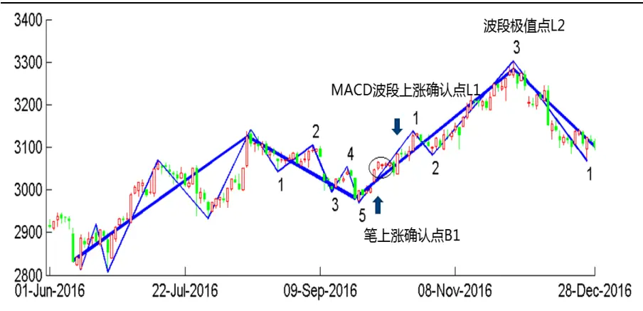
数据来源：国泰君安证券研究

表 5 统计了上证综指 MACD 日线级别“下跌”对应缠论 5 笔及以上的情况，只有一次08年大跌时出现了11笔的下跌，其他情况5笔下跌随后出现的笔上涨确认点 B1，到 MACD 波段上涨确认点 L1 的时间间隔 10 个交易日左右，2011 年以前平均涨幅 5%左右，2011 年之后笔到段确认的涨幅减小，平均的潜在上涨空间仍较为可观。

即当 MACD 价格分段下跌中出现向下 5 笔时，波段日线级别底部已接近；介入点可考虑在出现 5 笔下跌随后出现的笔上涨确认点 B1 处买入，等待MACD波段上涨确认，同时可考虑在10个交易日未形成段上涨时止损或带一定比例的阀值止损。

表 5: 上证综指 MACD日线级别“下跌”对应缠论 5笔及以上的情况

| 开始日期 结束日期 波动幅度 |  |  | 结束的 波段数 | 下一段波 动涨跌幅 | 第六笔确 认日期 | MACD 上涨确 认日期 | 笔提前 周期数 | 笔到段确认 的涨跌幅 | 潜在上涨 空间 |
| --- | --- | --- | --- | --- | --- | --- | --- | --- | --- |
| 20020708 | 20030103 | -23.8% | 5 | 15.6% | 20030110 | 20030127 | 11 | 8.0% | 10.2% |
| 20030415 | 20031118 | -19.3% | 5 | 35.0% | 20031121 | 20031201 | 6 | 5.2% | 30.6% |
| 20040406 | 20040913 | -29.1% | 5 | 16.2% | 20040917 | 20040923 | 4 | 3.5% | 3.5% |
| 20040923 | 20050201 | -18.8% | 5 | 10.9% | 20050203 | 20050224 | 8 | 5.4% | 6.1% |
| 20080114 | 20081104 | -69.0% | 11 | 22.5% | 20080430 | 20081208 | 149 | -43.4% | -43.4% |
| 20101108 | 20110125 | -15.3% | 5 | 14.2% | 20110131 | 20110217 | 8 | 4.9% | 9.6% |
| 20120504 | 20120926 | -18.3% | 5 | 6.4% | 20121009 | 20121022 | 9 | 0.8% | 0.8% |
| 20130912 | 20131113 | -7.4% | 5 | 7.8% | 20131118 | 20131128 | 8 | 1.0% | 2.5% |
| 20160815 | 20160926 | -4.6% | 5 | 10.1% | 20161011 | 20161021 | 8 | 0.8% | 7.1% |

数据来源：国泰君安证券研究

## 4.2.应用二：波段确认与波段延伸

一个波段形成是当下可以确认的，波段形成后到最终的拐点一般还会延续一段行情，一个很自然的问题是：这段延续的行情涨跌幅度大概有多少？能持续多长时间？当日线级别行情确认时，从笔数看行情又临近拐点了，这时如何进行判断？为了解决这些问题，我们对日线行情确认时的笔数及涨跌幅延伸情况做了统计分析。

首先我们对延伸情况进行定义：

延伸倍数 =（日线结束点涨跌幅 - 日线确认点涨跌幅）/（日线确认点涨跌幅）

延伸笔数 = 日线结束点笔数 - 日线确认点笔数

图 11波段确认与延伸示意图
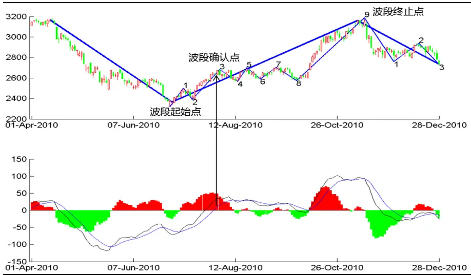
数据来源：国泰君安证券研究

与 MACD30 分钟价格分段结构近似，尤其下跌结构中，日线级别确认时的笔数越多，平均延伸笔数越小，延伸倍数越低；确认的笔数较好的刻画了市场上涨下跌的流畅性，波段确认时的笔数越少，市场的走势越流畅，随后的延伸越好；笔数越多，市场的走势越纠结，随后的反转概率越大。

表 6:上证综指日线级别“上涨”和“下跌”从波段确认到波段结束的延伸情况（2000-2017/7/31）

| 上涨确认时缠 论笔数 | 次数 | 平均延伸笔 数 | 平均延伸倍 数 | 下跌确认时缠 | 次数 | 平均延伸笔 数 | 平均延伸倍 数 |  |
| --- | --- | --- | --- | --- | --- | --- | --- | --- |
|  |  |  |  |  |  |  |  | 论笔数 |
| 1 | 27 | 1.63 | 3.38 | 1 | 27 | 1.70 | 1.45 |  |
| 3 | 10 | 1.60 | 0.67 | 3 | 9 | 0.22 | 0.27 |  |
| 5 | 1 | 0.00 | 0.07 | 5 | 1 | 0.00 | 0.00 |  |

数据来源：国泰君安证券研究

## 4.2.1. 缠论3 笔确认 MACD 日线级别“下跌”

进一步观察下跌3笔确认日线级别MACD下跌的情况共9次，其中8次3笔结束，只有一次 2013 年 9 月 12 日到 2013 年 11 月 13 日的下跌达到了 5 笔，而第 3 笔低点与第 5 笔低点较为接近,故下跌 3 笔确认日线波段形成时，下跌继续延伸概率较小，此时较大概率会形成底部反转。

图 12缠论 3笔确认 MACD波段“下跌”示意图
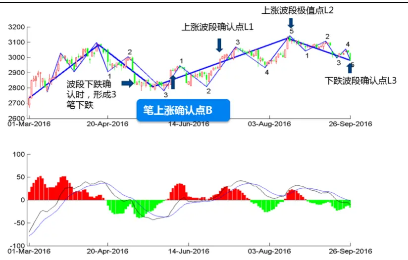
数据来源：国泰君安证券研究

当缠论3 笔确认MACD 日线级别“下跌”，随后 1笔上涨确认（B 点）时到 MACD 上涨确认（L1 点）平均涨幅 4.5%，平均提前 14 个交易日确认上涨，有较好的上涨空间；到 MACD 上涨波段极值点（L2）的潜在上涨空间平均接近10%；而如果等到 MACD下跌波段确认点（L3）时平仓，趋势强时如2014年会带来极高收益，但趋势弱时，如2008年1月22日，2013年12月 20日会带来亏损。

表 7: 上证综指缠论 3笔确认 MACD日线级别“下跌”，随后 1笔上涨确认时做多机会

| 笔上涨确 认日期 | MACD 上涨 确认日期 | 笔提前周 期数 | 笔到段确认 涨跌幅 | 最大 浮亏 | MACD 再次下跌 确认日期 | 笔到再次下跌确 认的涨跌幅 | 潜在上 涨空间 | 下跌段结束 的笔数 |
| --- | --- | --- | --- | --- | --- | --- | --- | --- |
| 20001010 | 20001106 | 19 | 2.5% | -2.0% | 20010206 | 2.7% | 9.4% | 3 |
| 20020621 | 20020624 | 1 | 9.3% | 0.0% | 20020815 | 4.6% | 10.9% | 3 |
| 20071205 | 20080107 | 21 | 7.0% | -4.1% | 20080122 | -9.6% | 9.0% | 3 |
| 20100212 | 20100330 | 27 | 3.7% | -1.4% | 20100426 | -1.6% | 4.9% | 3 |
| 20120411 | 20120502 | 13 | 5.6% | 0.0% | 20120525 | 1.1% | 6.2% | 3 |
| 20121211 | 20121214 | 3 | 3.7% | -0.6% | 20130318 | 8.0% | 17.3% | 3 |
| 20131118 | 20131128 | 8 | 1.0% | -0.6% | 20131220 | -5.1% | 2.5% | 5 |
| 20140318 | 20140410 | 16 | 5.4% | -1.6% | 20150702 | 93.2% | 155.1% | 3 |
| 20160601 | 20160704 | 21 | 2.6% | -2.8% | 20160926 | 2.3% | 7.3% | 3 |

数据来源：国泰君安证券研究

## 4.2.2. 缠论3 笔确认 MACD 日线级别“上涨”

进一步观察上涨3笔确认日线级别MACD上涨的情况共 10 次，其中4次3 笔结束，5 次 5 笔结束，1 次 9 笔结束，图 11 即为 2010 年 8 月 20 日-2010年9月29日，3笔确认波段上涨，随后波段持续了将近1个月的震荡之后才突破形成第9笔上涨，且第7笔与第5笔的高点接近；经观察可发现上涨 3 笔确认日线波段形成时，到第 5 笔后继续延伸概率较低。

当缠论 3 笔确认 MACD 日线级别“上涨”，且在出现第 5 笔上涨随后 1笔下跌确认的情况中，有 5 次随后不久出现了 MACD 日线级别“下跌”，但我们可以看到整体跌幅不大，在 1%-3%之间，且潜在下跌空间也只有 3%-6%，故当出现第“6”笔下跌时可能会形成 MACD 日线级别“下跌”，但下跌空间可能并不大 。

表 8: 上证综指缠论 3笔确认 MACD日线级别“上涨”，出现第“6”笔下跌时的做空机会

| 笔下跌确 认日期 | MACD 下跌 确认日期 | 笔提前 周期数 | 笔到段确认 的涨跌幅 | 最大上涨 (浮亏) | MACD 再次上 涨确认日期 | 笔到再次上涨确 认的涨跌幅 | 潜在下 跌空间 | 上涨段结束 的笔数 |
| --- | --- | --- | --- | --- | --- | --- | --- | --- |
| 20010115 | 20010206 | 6 | -1.8% | 1.6% | 20010320 | 0.7% | -6.2% | 5 |
| 20091222 | 20100126 | 24 | -1.0% | 7.6% | 20100330 | 2.6% | -3.8% | 5 |
| 20100826 | 20101130 | 60 | 8.3% | 21.4% | 20110217 | 12.4% | 2.8% | 9 |
| 20130918 | 20131108 | 30 | -3.9% | 2.1% | 20131128 | 1.3% | -4.7% | 5 |
| 20160823 | 20160926 | 22 | -3.5% | 0.2% | 20161021 | 0.0% | -3.5% | 5 |
| 20170418 | 20170424 | 4 | -2.1% | -00.0% | 20170626 | -0.4% | -4.5% | 5 |

数据来源：国泰君安证券研究

## 4.3.应用三：波段内笔背离

背离提示了走势异动的一种信号，可分为顶背离和底背离，一般通过对前后两段走势的力度进行比较，发出走势力度衰竭的信号。从物理学角度讲，股票市场的背离是指在长期趋势运行中，价格虽然前进但力度逐渐衰减，速度或者加速度开始放缓，而加速度的放缓并不表示趋势会立即停下来，正如车减速了，加速度为负数，速度减下来了但是不一定会停车。故背离也不能代表趋势会立即停止，它只是提示了一种信号：趋势放缓，并有可能会停止

## 4.3.1. 波段内笔背离的条件

这里我们借鉴缠论中相关的背驰概念，定义波段内的笔背离，同时进一步刻画市场状态，在价格不创一年的新高或新低的情况下寻找有效的背离反转位置，提前预判MACD 价格分段的拐点。

## 波段内的笔背离条件：

1) 两笔走势之间技术指标至少有一定回调：对比点（A）到当前背离点（C）之间的技术指标DIF至少需要回调50%；

2) 价格创新高，指标未创新高：当前点（C）的价格创了对比点（A）的新高或新低，但当前笔（BC）的MACD面积小于对比点的笔（OA）对应的面积；

3) 背离发生时走势不能太强势：当前价格不能创250日新高或新低，上涨时当前笔（BC）的平均成交量与对比点的笔（OA）的平均成交量相比不放大；

4) 背离判断滞后一根K线：当出现符合条件的背离后，如顶背离时价格不再创C点新高或底背离时价格不再创C点新低，则判断此时可能背离后会发生发转。

图 13波段内的笔背离示意图
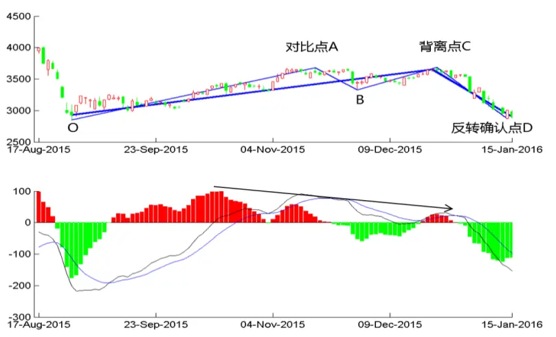
数据来源：国泰君安证券研究

## 4.3.2. 波段内笔背离的拐点判断

以上证综指 2005 至今的数据测试缠论内的笔背离情况，可发现波段内背离出现时能够较好的提前预判 MACD 价格分段的波段拐点，符合条件的背离点C到波段反转确认点D的空间基本在4%以上，潜在的盈利空间更大，尤其 2015 年股灾之后，市场处于震荡行情之中，背离后的反转效果较好。

表 9:上证综指缠论内的笔背离情况（2005-2017/7/31）

| 对比点 日期 | 背离点日 期 | 背离点 价格 | 最大浮 亏 | 波段确认时 的盈利空间 | 背离波段潜 在盈利空间 | 类型 |
| --- | --- | --- | --- | --- | --- | --- |
| 20101130 | 20101230 | 2759.6 | -3.0% | 6.1% | 10.8% | 底背离 |
| 20101130 | 20110119 | 2758.1 | -2.9% | 6.1% | 10.8% | 底背离 |
| 20130319 | 20130409 | 2225.8 | -2.3% | 4.3% | 4.4% | 底背离 |
| 20150709 | 20150827 | 3083.6 | -2.5% | 11.2% | 18.4% | 底背离 |
| 20151117 | 20151224 | 3612.5 | -0.4% | 13.5% | 26.5% | 顶背离 |
| 20160713 | 20160817 | 3109.6 | 0.0% | 4.2% | 4.2% | 顶背离 |
| 20161226 | 20170117 | 3108.8 | -0.2% | 2.8% | 5.8% | 底背离 |
| 20170223 | 20170322 | 3245.2 | -1.3% | 3.6% | 5.9% | 顶背离 |

数据来源：国泰君安证券研究

## 5. 总结

本篇报告主要介绍了缠论中的基本概念分型，笔与线段，对笔进行严格的价格分段定义，并统计笔的价格波动情况。

由于 MACD 波段划分以 DEA 指标穿越 0 轴为标准划分，与缠论中的段划分近似，而笔是构成段的内部结构，故将禅论中的笔与 MACD 价格分段体系结合。统计主要指数的 MACD 日线级别“上涨”和“下跌”对应缠论笔数的概率密度，可发现大部分指数的顶部及底部信号一般不超过 5笔，这说明笔在段中的内部结构对于指数择时研究有着不错的稳定性及适用性。

上证综指 MACD 日线级别“下跌”对应缠论 5 笔时，较大概率反转；进一步分析波段确认到波段延伸的情况时，可发现上涨 3 笔确认 MACD 日线级别上涨时，到第 5 笔后继续延伸的概率较低，下跌 3 笔确认 MACD日线级别下跌时，继续延伸的概率较低；波段内的笔背离，可以较早的提前预判市场可能出现的反转机会。

后续考虑继续将缠论中的其他理念，如中枢，背驰，三类买卖点等量化，捕捉一些较好的交易机会。

## 本公司具有中国证监会核准的证券投资咨询业务资格

## 分析师声明

作者具有中国证券业协会授予的证券投资咨询执业资格或相当的专业胜任能力，保证报告所采用的数据均来自合规渠道，分析逻辑基于作者的职业理解，本报告清晰准确地反映了作者的研究观点，力求独立、客观和公正，结论不受任何第三方的授意或影响，特此声明。

## 免责声明

本报告仅供国泰君安证券股份有限公司（以下简称“本公司”）的客户使用。本公司不会因接收人收到本报告而视其为本公司的当然客户。本报告仅在相关法律许可的情况下发放，并仅为提供信息而发放，概不构成任何广告。

本报告的信息来源于已公开的资料，本公司对该等信息的准确性、完整性或可靠性不作任何保证。本报告所载的资料、意见及推测仅反映本公司于发布本报告当日的判断，本报告所指的证券或投资标的的价格、价值及投资收入可升可跌。过往表现不应作为日后的表现依据。在不同时期，本公司可发出与本报告所载资料、意见及推测不一致的报告。本公司不保证本报告所含信息保持在最新状态。同时，本公司对本报告所含信息可在不发出通知的情形下做出修改，投资者应当自行关注相应的更新或修改。

本报告中所指的投资及服务可能不适合个别客户，不构成客户私人咨询建议。在任何情况下，本报告中的信息或所表述的意见均不构成对任何人的投资建议。在任何情况下，本公司、本公司员工或者关联机构不承诺投资者一定获利，不与投资者分享投资收益，也不对任何人因使用本报告中的任何内容所引致的任何损失负任何责任。投资者务必注意，其据此做出的任何投资决策与本公司、本公司员工或者关联机构无关。

本公司利用信息隔离墙控制内部一个或多个领域、部门或关联机构之间的信息流动。因此，投资者应注意，在法律许可的情况下，本公司及其所属关联机构可能会持有报告中提到的公司所发行的证券或期权并进行证券或期权交易，也可能为这些公司提供或者争取提供投资银行、财务顾问或者金融产品等相关服务。在法律许可的情况下，本公司的员工可能担任本报告所提到的公司的董事。

市场有风险，投资需谨慎。投资者不应将本报告作为作出投资决策的唯一参考因素，亦不应认为本报告可以取代自己的判断。
在决定投资前，如有需要，投资者务必向专业人士咨询并谨慎决策。

本报告版权仅为本公司所有，未经书面许可，任何机构和个人不得以任何形式翻版、复制、发表或引用。如征得本公司同意进行引用、刊发的，需在允许的范围内使用，并注明出处为“国泰君安证券研究”，且不得对本报告进行任何有悖原意的引用、删节和修改。

若本公司以外的其他机构（以下简称“该机构”）发送本报告，则由该机构独自为此发送行为负责。通过此途径获得本报告的投资者应自行联系该机构以要求获悉更详细信息或进而交易本报告中提及的证券。本报告不构成本公司向该机构之客户提供的投资建议，本公司、本公司员工或者关联机构亦不为该机构之客户因使用本报告或报告所载内容引起的任何损失承担任何责任。

## 评级说明

## 1.投资建议的比较标准

投资评级分为股票评级和行业评级。

以报告发布后的12个月内的市场表现为比较标准，报告发布日后的 12个月内的公司股价（或行业指数）的涨跌幅相对同期的沪深 300 指数涨跌幅为基准。

## 2.投资建议的评级标准

报告发布日后的 12 个月内的公司股价（或行业指数）的涨跌幅相对同期的沪深 300 指数的涨跌幅。

| 评级 |  | 说明 |
| --- | --- | --- |
| 股票投资评级 | 增持 | 相对沪深 300指数涨幅15%以上 |
|  | 谨慎增持 | 相对沪深 300指数涨幅介于5%～15%之间 |
|  | 中性 | 相对沪深 300指数涨幅介于-5%～5% |
|  | 减持 | 相对沪深300指数下跌 5%以上 |
| 行业投资评级 | 增持 | 明显强于沪深300 指数 |
|  | 中性 | 基本与沪深300指数持平 |
|  | 减持 | 明显弱于沪深300指数 |

## 国泰君安证券研究所

|  | 上海 | 深圳 | 北京 |
| --- | --- | --- | --- |
| 地址 | 上海市浦东新区银城中路168号上海 银行大厦29层 | 深圳市福田区益田路 6009 号新世界 商务中心34层 | 北京市西城区金融大街 28 号盈泰中 心2号楼10层 |
| 邮编 | 200120 | 518026 | 100140 |
| 电话 | （021)38676666 | (0755)23976888 | (010)59312799 |
|  | E-mail: gtjaresearch@gtjas.com |  |  |