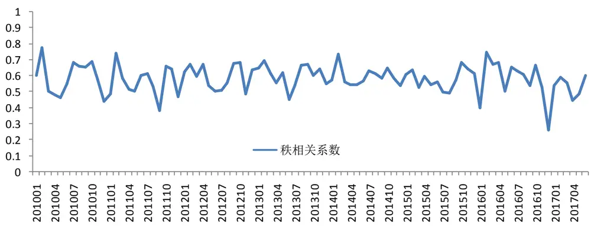
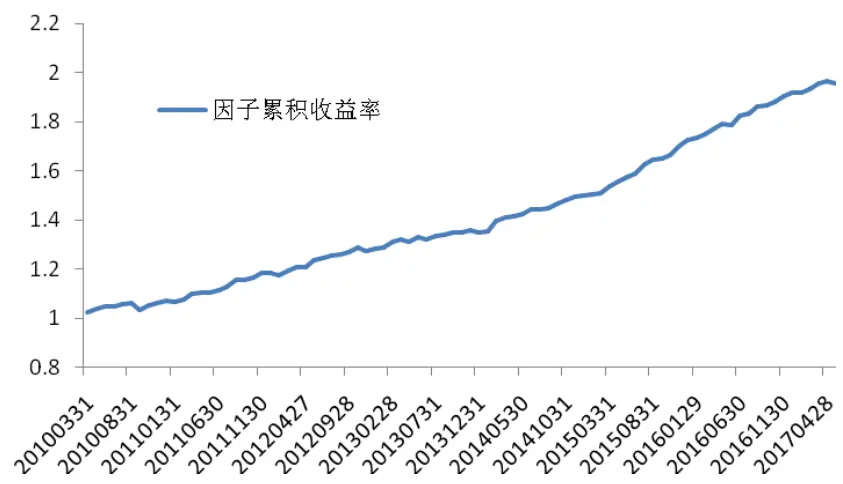
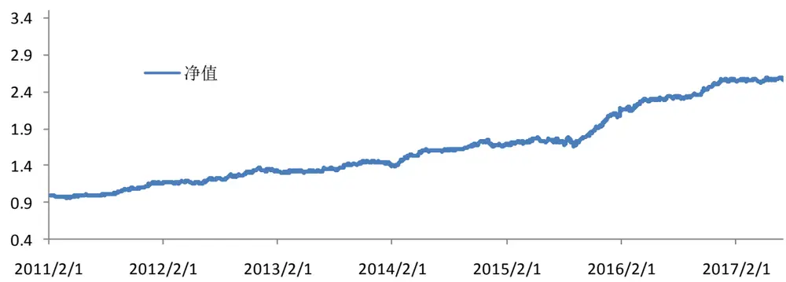

inInfo] [Table_Title] 2017.08.30

# 基于弹簧模型的量价分析

## ——数量化专题之一百零二

刘富兵（分析师）

8 021-38676673

liufubing008481@gtjas.com

证书编号 S0880511010017

## 本报告导读：

本报告借用力学中的弹簧模型，把股票价格在成交量的作用下的涨跌过程类比于弹簧在外力作用下被拉伸或压缩的运动过程，据此构建了基于弹簧塑性的选股因子。

## 摘要：

le_Summary]股票价格在成交量的作用下的涨跌过程类似于弹簧在外力作用下被拉伸或压缩的运动过程。假设股票价格在每一个时刻都存在一个不可测的均衡价格，对应弹簧的平衡位置，则股票同样具有弹簧的弹性与塑性特点。

当成交量较小时,股票体现弹性,股价受交易的冲击围绕均衡价格上下波动；当成交量较大时,股票体现塑性，在成交量推动下，均衡价格上下波动。均衡价格的波动叠加股价围绕均衡价格的波动共同构成了价格最终的波动。

股票塑性指在股票成交量的推动下，股票的均衡价格产生移动的性质。股票塑性越高表明投资者不需要巨大的成交量或大幅拉升股价就能推动均衡价格上涨。

- 基于量价构建的塑性模型的拟合优度超过 60%。97%的股票样本存在显著的塑性特征，且序列自相关性较低、残差正态性较好。

股票塑性反映了股票的锁仓比，即短期内不参与交易的流通股占流通股总量的比例。高锁仓比代表投资者对股票未来发展和股价上涨有较强信心，反映了该股票持有者在上涨中惜售、在下跌中不愿轻易止损的心态。本质上来讲，A股市场股票做空机制的不完善带来了高锁仓比股票的溢价。

塑性系数作为选股因子具有较强的显著性。IC和 ICIR 分别约为0.04和 1.32。在控制了市值、反转和行业后，因子收益率为 9.4%。对冲中证500指数后，基于塑性因子的行业中性策略年化收益率 15.9%，信息比率2.1，最大回撤 6.9%。策略表现为低换手率的特征，年平均换手率约为266%，对手续费的冲击敏感度较低。

金融工程

## 金融工程团队：

刘富兵：（分析师）

电话：021-38676673

邮箱：liufubing008481@gtjas.com

证书编号：S0880511010017

## 陈奥林：（分析师）

电话：021-38674835

邮箱：chenaolin@gtjas.com

证书编号：S0880516100001

## 李辰：（分析师）

电话：021-38677309

邮箱：lichen@gtjas.com

证书编号：S0880516050003

## 孟繁雪：（分析师）

电话：021-38675860

邮箱：mengfanxue@gtjas.com

证书编号：S0880517040005

## 蔡旻昊：（研究助理）

电话：021-38674743

邮箱：caiminhao@gtjas.com

证书编号：S0880117030051

## 殷明：（研究助理）

电话：021-38674637

邮箱：yinming@gtjas.com证书编号：S0880116070042

## 叶尔乐：（研究助理）

电话：021-38032032

邮箱：yeerle@gtjas.com

证书编号：S0880116080361

## 殷钦怡：（研究助理）

电话：021-38675855

邮箱：yinqinyi@gtjas.com

证书编号：S0880117060109

## [Tabl 相关报告e_R

《缠论中的笔在 MACD价格分段中的应用》2017.08.22

《行业轮动中“确定性”的规律及投资机会》2017.08.18

《多维度挖掘公开市场回购中的超额收益》2017.08.01

《银行委外视角下的产品选择：公募篇》2017.07.19

《基于前景理论的选股策略》2017.07.18

## 1. 引言

技术分析聚焦于市场交易行为。传统理论认为，一切影响股价变化的因素都最终反映在股票市场的自身行为中。而价格和成交量是市场交易行为最基本的表现，故技术分析研究者通常可忽略股价变动的每个因素，只需研究寻找价格与成交量的变动规律。由于股价和成交量共同组成了股票的交易行为，它们从两个维度上反映了股票的交易行为。价格变动反映了股票的供需关系，成交量变动反映了交易的活跃度。所以，在进行技术分析时，仅使用价格的分析方法具有一定的局限性，研究量与价的关系更能体现市场的交易行为。

量价关系一定程度上反映了市场的微观结构，相关研究较为丰富。定性分析上，技术形态研究者详细分析了K 线与成交量组成的各种形态所代表的含义，而量价关系的定量研究主要集中在股价或者收益率与成交量的线性相关性上。

本报告中，我们把股价在成交量作用下的涨跌过程类比为弹簧在外力作用下的运动过程，相对于弹簧塑性，引入了股票塑性的概念，从另一维度研究量价关系、构建量价因子。

## 2. 弹簧模型的建立

## 2.1. 核心思想

股票价格在成交量的作用下的涨跌过程类似于弹簧在外力作用下被拉伸或压缩的运动过程。一方面，每个弹簧都存在一个平衡位置，当弹簧偏离平衡位置时，弹簧有回归平衡位置的势能，根据胡克定律，弹簧形变越大，弹簧弹力越大,则回归平衡位置的势能也越大，体现为弹簧的弹性；另一方面，弹簧的平衡位置并非一成不变，弹簧若持续受到较大的外力作用，则平衡位置会向外力方向偏移，且弹簧所受外力越大、作用时间越长，则弹簧平衡位置偏移距离越大，体现为弹簧的塑性。

类比弹簧的弹性与塑性，假设股票价格在每一个时刻都存在一个不可测的均衡价格。均衡价格对应弹簧的平衡位置，代表着市场已反应所有与股票相关信息时的价格，它是供需平衡时市场供求双方共同认可的股价。若均衡价格的假设成立，则股票同样存在弹性和塑性的特征。

股票的弹性体现在：当股价大幅上涨时，若后续没有足够大的成交量支持，股价一般出现超买回调；反之，当股票大幅下跌后缩量，股价一般出现超跌反弹。这种均值回复的特点可理解为股票的弹性，当短时间内较大的成交量使得股价暂时偏离了均衡价格时，由于市场的非有效性，股价不会瞬间回归均衡价格，而需要一定时间逐步回归均衡价格，回归均衡价格速度越快，股票的弹性越大，其有效性越强。

股票的塑性体现在：若股价大幅上涨且上涨受到持续的成交量支持，则受锚定效应影响，投资者估计的股票价值也会有所调高，故即使短时间内成交量萎缩，股价也较难回复至上涨前的原均衡位置，反之亦然。此现象可看作股票的均衡价格产生了移动，体现为股票的塑性。

当成交量较小时,股票主要体现弹性,股价受交易的冲击围绕均衡价格上下波动；当成交量较大时,股票主要体现塑性，在成交量推动下，均衡价格上下波动。均衡价格的波动叠加股价围绕均衡价格的波动共同构成了价格最终的波动。由于 A 股市场换手率相对较高，股票塑性特征较为明显，且股票塑性对未来收益率具有一定的预测能力，所以，本篇报告以弹簧的塑性为主要研究方向。我们定义，股票塑性指在股票成交量的推动下，股票的均衡价格产生移动的性质。

## 2.2. 股价塑性基本模型

为了定量刻画股价的塑性大小，我们构建股票的塑性模型。直观来看，股票的塑性变形大小，即均衡价格的移动距离，由每笔交易的成交量和股价偏离均衡价格的大小两者共同决定。在其他因素不变的情况下，成交量越大或股价偏离均衡价格越多，则塑性变形越大。从上述逻辑出发，可构建包含高频数据的塑性模型，其数学表达式为：

$$
B_{_{K}}-B_{_{K-1}}=\alpha\frac{\displaystyle\sum_{_{i=1}}^{^{N}}Q_{_{K}}^{^{i}}(P_{_{K}}^{^{i}}-B_{_{K}}^{^{}})}{Q_{_{K}}^{^{F}}}+\varepsilon_{_{K}}
$$

其中,

$\boldsymbol{B}_{\textit{ K }},$ 第 K 日的均衡价格（Balance Price）

$|\boldsymbol{\mathcal{Q}}_{\boldsymbol{\mathcal{N}}}^{\textit{ i }}$ 第 K 日中第 i 笔交易的成交量

${\boldsymbol{P}}_{\mathit{K}}^{\textit{ i }}.$ 第 K日中第i笔交易的价格，

$\boldsymbol{\mathcal{Q}}_{\boldsymbol{\mathit{K}}}^{\boldsymbol{\mathit{F}}}$ 股票第K日的自由流通股数量

：第 K 日中的交易笔数

$\mathcal{E}_{\mathrm{~}_{\mathit{K}}}$ ：随机误差项

其中，等式左边 $B_{_{\textit{ K }}}\mathrm{~-~}B_{_{\textit{ K - }1}}$ 表示第 K 日均衡价格的变动幅度,代表塑性变形程度;等式右边刻画了当日逐笔交易对均衡价格的冲击。 $P_{_K}^{^{\textit{ i }}}\mathrm{~-~}\textit{ B }_{_K}$ 代表每笔交易偏离均衡价格的程度，对应于弹簧偏离平衡位置的距离；$|\boldsymbol{\mathcal{Q}}_{\boldsymbol{\mathcal{N}}}^{\textit{ i }}$ 为每笔交易的成交量，对应于弹簧所受作用力大小,分母 $\boldsymbol{\mathcal{Q}}_{\boldsymbol{\mathit{K}}}^{\textit{ F }}$ 为第 K日的自由流通股数，它对交易的冲击进行了标准化 。模型基本刻画出了塑性变形大小 $B_{_{\textit{ K }}}\mathrm{~-~}B_{_{\textit{ K }-}}$ 与偏离程度 $P_{_K}^{^{\textit{ i }}}\mathrm{~-~}\;B_{_I}$ 和成交量 $\boldsymbol{\mathcal{Q}}_{\boldsymbol{\mathcal{K}}}^{\textit{ i }}$ 的正相关关系，大致符合股价在成交量推动下的变动规律的经济学判断。

股票每日的均衡价格 $B_{\textit{ K }}$ 是股票短期的供需平衡点。作为潜在的不可测变量，我们必须寻找合理的代理变量。鉴于每日的价格波动可近似看作围绕其日均价波动，我们简单地使用股票日均价（日开高收低的均值）的 T 日平均作为股票均衡价格的代理变量,即:

$$
B_{_{K}}=\frac{\sum_{_{i=0}}^{^{T-1}}(open_{_{K-i}}+high_{_{K-i}}+Iow_{_{K-i}}+close_{_{K-i}})}{T}
$$

将上述基础模型两边同除以 $\boldsymbol{B}_{\textit{ K - 1 }}$ ，则模型变为：

$$
\frac{B_{_{K}}-B_{_{K\mathrm{~-~1~}}}}{B_{_{K\mathrm{~-~1~}}}}=\alpha\frac{\displaystyle\sum_{_{i=1}}^{^{N}}\mathcal{Q}_{_{K}}^{^{i}}(P_{_{K}}^{^{i}}-B_{_{K}}^{^{}})}{\mathcal{Q}_{_{K}}^{^{F}}B_{_{K\mathrm{~-~1~}}}}+\varepsilon_{_{K}}
$$

$$
VRBP=\frac{B_{_{K}}-B_{_{K-1}}}{B_{_{K-1}}},\quad SPPI=\frac{\sum_{_{i=1}}^{^{N}}\mathcal{Q}_{_{K}}^{^{i}}(P_{_{K}}^{^{i}}-B_{_{K}})}{\mathcal{Q}_{_{K}}^{^{F}}B_{_{K-1}}}
$$

其中，VRBP（variation rate of balanced price）代表了均衡价格的变动率。SPPI(stock price plasticity index)表示股价塑性冲击指数。SPPI的表达式虽然使用了高频数据，但经简单的恒等变形后，使用日频

数据的成交量 $Q_{\textit{ h }}$ 和成交额 $W_{\hbar}$ 即可计算出每日的SPPI。

$$
SPPI=\frac{\sum_{i=1}^{s}\mathcal{Q}_{g}^{i}(P_{g}^{i}-B_{g})}{\mathcal{Q}_{g}^{p}B_{g-1}}=\frac{\sum_{i=1}^{s}\mathcal{Q}_{g}^{i}P_{g}^{i}-B_{g}\sum_{i=1}^{s}\mathcal{Q}_{g}^{i}}{\mathcal{Q}_{g}^{p}B_{g-1}}=\frac{\mathcal{H}_{g}-B_{g}\mathcal{Q}_{g}}{\mathcal{Q}_{g}^{p}B_{g-1}}
$$

故模型可简记为：

$$
\begin{array}{rlrlrl}{V_{\mathit{RBP}}}&{{}=}&{\alpha}&{{}\cdot\mathit{SPPI}}&{{}+}&{\varepsilon}\end{array}
$$

VRBP对SPPI零截距回归的回归系数 体现了股价的塑性。 越大，股价塑性越大，即在 SPPI 一定时，均衡价格变动幅度越大。由于冲击方向与变形方向同向，故理论上模型的 应大于0。

需要注意的是，模型为无常数项的线性回归。因为当股价在均衡价格上交易，不存在价格偏离时，无论成交量如何变化，均衡价格理应不会改变。所以默认截距项为零符合弹簧模型的经济学原理。

以 2017 年 5 月 31 日全部 A 股数据过去 20 日数据为例，分别对每只股票拟合塑性模型的基本方程，当均衡价格分别取5日平均、10 日平均和20日平均时，回归结果统计如下：

表1 基本模型的回归统计

| 5 日平均 | 10 日平均 20 日平均 |
| --- | --- |
| 模型平均 R2 0.643 | 0.507 0.615 |
| 塑性系数平均p值 0.003 | 0.024 0.019 |
| 模型平均 DW 值 1.435 | 0.878 0.846 |
| 模型平均 JB 值 2.038 | 2.468 4.303 |
| 模型平均 JB 检验 p 值 0.575 | 0.525 0.457 |
| 塑性 1%显著性水平大于 0占比 97.5% | 86.9% 89.7% |
| 股票个数 3095 | 3054 2978 |

数据来源：国泰君安证券研究

基本模型的拟合优度平均大于 50%，模型总体的可信度较好。约 90%股票样本的塑性系数 显著大于 0，基本符合均衡价格往价格偏离方向移动的认知。

Durbin-Watson 反映了序列的一阶自相关性，DW 值越趋近于 0，正自相关性越强，越趋近于 2，表明相关性越低。Jarque_Bera 残差正态检验的p值越大，表明越不能拒绝残差为正态分布的原假设。模型 JB检验 p值较大，表明残差的正态性较好。

整体来看,均衡价格选择多少日平均都有些武断,但使用5日平均均价作为均衡价格的代理变量时拟合优度较高、自相关性较低、残差分布较正态，故我们选择均价的 5日平均作为均衡价格的代理变量。

## 2.3. 二次根式塑性模型

材料力学中，当作用力较大时，材料变形程度不再与作用力大小与偏离程度成正比。考虑到力学中塑性公式中包含幂函数形式的表达式，VRBP与 SPPI 可能不是简单的线性关系，因而考虑使用简单的二次根式表达式改进基本模型：

$$
\begin{array}{rlrl}{{\it VRBP}}&{{}=}&{\alpha\cdot\sqrt{{\it SPPI}}}&{+\varepsilon}\end{array}
$$

由于上述形式对 SPPI 的定义域必须存在为非负值的要求，所以，对上式进行合理改写，避免定义域问题对模型的影响。

$$
VRBP=\alpha\cdot sign(SPPI)\cdot\sqrt{abs(SPPI)}+\varepsilon
$$

同样使用2017年 5月 31日全部A股数据过去20日数据,比较原基础模型和改进后的二次根式模型，其统计结果如下：

表2 二次根式塑性模型的回归统计

| 根式模型 | 基本模型 |
| --- | --- |
| 模型平均 R2 0.732 | 0.643 |
| 塑性系数平均p值 0.000 | 0.003 |
| 模型平均 DW 值 1.534 | 1.435 |
| 模型平均 JB 值 2.183 | 2.038 |
| 模型平均 JB 检验 p 值 0.573 | 0.575 |
| 塑性 1%显著性水平大于 0占比 99.4% | 97.5% |
| 股票个数 3095 | 3095 |

数据来源：国泰君安证券研究

回归结果表明，二次根式模型确实更契合股票数据。模型平均R2从 64%提升至73%；塑性系数显著性水平也有明显上升；序列自相关性大于1.5，基本消除了自相关性。二次根式模型整体质量较好，是较优的模型形式。所以，我们选择二次根式模型作为最终的弹簧塑性模型。

## 3. 基于弹簧模型的量价分析

股票价格的弹簧理论在一个侧面上揭示了股票市场中股价变动的内在规律。股价塑性系数 反映了股票塑性的大小。本节对股票塑性 的金融学意义进行更深一步的分析。

## 3.1. 塑性系数反映股票锁仓比

在股票市场中，投资者可能出于某些原因在一段时间内不进行交易。锁仓比，即锁仓量占比，指短期内不参与交易的流通股占流通股总量的比例。

高锁仓比意味着股票真实的可流通股票数量远小于流通盘。它反映了股票较高的筹码集中度，表明该股票持有者在上涨中惜售，在下跌中不愿轻易止损的心态，这是投资者对股票未来发展和股价上涨有较强信心的表现。换言之，大批投资者一致看多的预期容易形成较高的锁仓比。对于高锁仓比的股票而言，股价未来大幅上涨不需要巨大的成交量支持，大幅上涨相对较为容易。由于做空机制的不完善，不持有该股票的投资者要么追涨，要么观望，市场无法创造出足够力量的空方来抑制股价的上涨，从而使得股票在短期内存在非有效性。本质上来讲，A 股市场股票做空机制的不完善带来了高锁仓比股票的溢价。

锁仓比虽然无法直接观测，但它与塑性系数存在同向变动的关系。塑性系数较高的股票，投资者使用少量资金且无须大幅拉升或打压股价就能推动股价均衡位置的变化。可证明，塑性系数本质上反映了股票的锁仓比。

## 3.2. 塑性系数与锁仓比的数学关系

其具体证明如下，假设 $\boldsymbol{\mathcal{Q}}_{\boldsymbol{\mathcal{K}}}^{\textit{ L }}$ 为股票的锁仓量， $\boldsymbol{\mathcal{Q}}_{\mathit{K}}^{\mathit{L}}\mathrm{~~/~}\boldsymbol{\mathcal{Q}}_{\mathit{K}}^{\mathit{F}}$ 即锁仓比。假设

理论上当股票锁仓比为 0 时，股价塑性系数为 $\alpha_{\mathrm{~}_{0}}$ ，即有

$$
\mathcal{VRBP}=\alpha_{0}\cdot\operatorname{sign}\left(\frac{\sum\limits_{j=1}^{x}\mathcal{Q}_{\kappa}^{j}(P_{\kappa}^{j}-B_{\kappa})}{(\mathcal{Q}_{\kappa}^{j}-\mathcal{Q}_{\kappa}^{j})B_{\kappa-1}}\right)\cdot\sqrt{\operatorname{abs}\left(\frac{\sum\limits_{j=1}^{x}\mathcal{Q}_{\kappa}^{j}(P_{\kappa}^{j}-B_{\kappa})}{(\mathcal{Q}_{\kappa}^{j}-\mathcal{Q}_{\kappa}^{j})B_{\kappa-1}}\right)}
$$

联立原方程

$$
\text{ \text { } }\text{ \text { } }\text{ \text { } }\text{ \text { } }\text{ \text { } }\text{ \text { } }\text{ \text { } }\text{ \text { } }\text{ \text { } }\text{ \text { } }\text{ \text { } }\text{ \text { } }\text{ \text { } }\text{ \text { } }\text{ \text { } }\text{ \text { } }\text{ \text { } }\text{ \text { } }\text{ \text { } }\text{ \text { } }\text{ \text { } }\text{ \text { } }\text{ \text { } }\text{ \text { } }\text{ \text { } }\text{ \text { } }\text{ \text { } }\text{ \text { } }\text{ \text { } }\text{ \text { } }\text{ \text { } }\text{ \text { } }\text{ \text { } }\text{ \text { } }\text{ \text { } }\text{ \text { } }\text{ \text { } }\text{ \text { } }\text{ \text { } }\text{ \text { } }\text{ \text { } }\text{ \text { } }\text{ \text { } }\text{ \text { } }\text{ \text { } }\text{ \text { } }\text{ \text { } }\text{ \text { } }\text{ \text { } }\text{ \text { } }\text{ \text { } }\text{ \text { } }\text{ \text { } }\text{ \text { } }\text{ \text { } }\text{ \text { } }\text{ \text { } }\text{ \text { } }\text{ \text { } }\text{ \text { } }\text{ \text { } }\text{ \text { } }\text{ \text { } }\text{ \text { } }\text{ \text { } }\text{ \text { } }\text{ }\text{ \text { } }\text{ \text { } }\text{ }\text{ \text { } }\text{ }\text{ \text { } }\text{ }\text{ }\text{ }\text{ }\text{ }\text{ }\text{ }\text{ }\text{ }\text{ }\text{ }\text{ }\text{ }\text{ }\text{ }\text{ }\text{ }\text{ }\text{ }\text{ }\text{ }\text{ }\text{ }\text{ }\text{ }\text{ }\text{ }\text{ }\text{ }\text{ }\text{ }\text{ }\text{ }\text{ }\text{ }\text{ }\text{ }\text{ }\text{ }\text{ }\text{ }\text{ }\text{ }\text{ }\text{ }\text{ }\text{ }\text{ }\text{ }\text{ }\text{ }\text{ }\text{ }\text{ }\text{ }\text{ }\text{ }\text{ }\text{ }\text{ }\text{ }\text{ }\text{ }\text{ }\text{ }\text{ }\text{ }\text{ }\text{ }\text{ }\text{ }}\text{ \text { } }\text{ }\text{ }\text{ }
$$

可得锁仓比与塑性系数的关系为：

$$
\frac{Q_{_K}^{^{^{L}}}}{Q_{_K}^{^{^{F}}}}=1-\frac{\alpha_{_0}^{^{^{2}}}}{\alpha^{^{^{2}}}}.
$$

上式表明，塑性系数 与锁仓比 $\left\{\boldsymbol{\mathcal{Q}}_{\mathit{K}}^{\mathit{L}}\mathrm{~~\middle/~}\boldsymbol{\mathcal{Q}}_{\mathit{K}}^{\mathit{F}}\right.$ 成正相关关系。直观上，若少量资金且无须大幅拉升或打压股价能推动股价均衡位置的变化，表明了股票的实际参与交易的流通盘较小，故塑性系数能够反映股票的锁仓比。

## 3.3. 塑性系数的因子检验

使用 2017 年 5 月底数据横向比较不同域下的塑性系数基本统计量，塑性系数因子偏向于大市值股票。上证50成分股的塑性系数均值可达 8，而中证 1000 成分股塑性系数均值仅为 5。除此之外，ST 股票的塑性系数也相对较高。这是因为大市值股票整体筹码较为稳定，而 ST 股票一方面容易受到炒作；另一方面，一旦由于亏损出现大幅下跌，投资者容易被高位套牢，从而出现被动锁仓。

表 3 塑性系数分域描述性统计

|  | 股票个数 | 均值 | 标准差 | 最小值 | 25% | 75% | 最大值 |
| --- | --- | --- | --- | --- | --- | --- | --- |
| 全A | 2783 | 5.34 | 2.15 | 1.11 | 3.84 | 6.49 | 24.89 |
| 上证50 | 50 | 7.95 | 4.33 | 1.86 | 5.48 | 9.35 | 24.89 |
| 沪深 300 | 297 | 6.25 | 2.84 | 1.48 | 4.39 | 7.35 | 24.89 |
| 中证500 | 496 | 5.53 | 1.90 | 1.11 | 4.17 | 6.79 | 12.54 |
| 中证1000 | 968 | 5.03 | 1.91 | 1.13 | 3.70 | 6.16 | 15.01 |
| ST 股票 | 74 | 6.00 | 2.48 | 2.24 | 4.42 | 7.06 | 15.85 |

数据来源：国泰君安证券研究

首先，检验塑性因子的持续性。持续性体现了股票的下图给出了 2010年以来，所有股票塑性系数相邻两月间秩相关系数。秩相关系数反映了基于塑性系数排序的股票序列的变化情况。平均来看，塑性系数的秩相关系数约为 56%，表明塑性系数具有较高的持续性，上月高塑性系数的股票，下一个月塑性系数大概率仍然处于高位，表明股票塑性是股票较为稳定的属性特征；但另一个方面，秩相关系数并非特别高，基于塑性系数排序的股票序列每个月依然有一定变化，从而仍可基于因子进行排序选股。

图 1 塑性系数的秩相关系数变化

数据来源：国泰君安证券研究

其次，检验塑性因子的预测能力。为了检验塑性因子的显著性,首先计算塑性因子的IC 与ICIR，分别为 4%和1.32，较为显著；其次，计算因子的月累积收益率，其结果如下图。具体而言，使用下一月的股票收益率对标准化后的当月塑性系数、当月对数市值和当月收益率以及 30 个行业哑变量进行回归，取塑性因子的回归系数作为因子当月收益。在控制市值、行业和反转因子后，因子收益率9.42%、月最大回撤 2.34%。

图2 塑性因子累积收益率

数据来源：国泰君安证券研究

表 4 因子显著性检验

| 统计量 |  |
| --- | --- |
| 因子年化收益率 | 9.42% |
| 因子收益率 IR | 3.18 |
| 月最大回撤 | 2.34% |
| IC | 0.04 |
| ICIR | 1.32 |

数据来源：国泰君安证券研究

## 4. 基于弹簧模型的选股策略构建

根据上文逻辑：塑性系数越大，锁仓比越高，越容易产生牛股，我们构建基于塑性系数的选股策略。

## 4.1. 组合构建

## 4.1.1. 样本空间

考虑实际操作可行性，剔除 ST 股票与次新股的全A市场股票作为股票池。

## 4.1.2. 换仓频率

策略采用月度换仓频率，策略在每月最后一个交易日构建投资组合，于次月第一个交易日均价进行换仓。

## 4.1.3. 策略构建

首先，由于塑性系数来源于回归系数，受数据质量、拟合效果等影响，其稳健性相对较差，因而有必要对塑性系数作平滑处理。我们对每月塑性系数进行指数加权平均，其指数权重 $\begin{array}{rlr}{\boldsymbol{w}_{\textit{ i }}}&{{}=}&{\left(\mathrm{~1~}-\mathrm{~}\alpha\mathrm{~}\right)^{\textit{ i }}}\end{array}$ ， 其 中

$\alpha\quad=\quad\frac{2}{\mathrm{~1~+~N~}}$ ，参数N取 12月，则指数加权平均公式为：

$$
\widetilde{\mathbf{x}}_{_{t}}=\mathrm{EMA}\quad(x_{_{t}})=\frac{\sum_{_{i=0}}^{^{t}}w_{_{i}}x_{_{t-i}}}{\sum_{_{i=0}}^{^{t}}w_{_{i}}},\quad w_{_{i}}=(1-\alpha)^{^{\prime}}
$$

指数加权平均后的~x 保证了塑性系数的稳健性，同时兼顾了因子没有严重的滞后性。

其次，剔出塑性系数的市值效应。使用指数加权平均的~x 对当月月底对

数市值进行回归，取残差序列，作为每只股票市值中性调整后的塑性系数。

最后，对策略进行行业中性处理。在各行业内选择市值中性调整后塑性系数最高的前3只股票作为投资标的，根据中证500行业分布，确定所选个股的投资权重。

## 4.1.4. 交易成本

手续费为双边千分之三，建仓成本为当日均价。同时，考虑到实际投资时的流动性，如果上期持仓股票、下期标的股票换手率小于万分之五或者当日停牌，将默认无法卖出、买入。

## 4.2. 对冲中证500 后的策略表现

## 4.2.1. 累计净值走势

对冲中证500指数后，基于塑性系数的单因子策略从 2011年至2017年6 月底共产生 157.36%的累计超额收益，年化超额收益 15.89%，信息比率2.10。其中，最大回撤 6.94%，发生于2015年8月13 日至9月 2日。因为个股的塑性相对较为稳定，所以策略整体换手率较低，年平均换手率约为266%，所以策略对手续费的冲击敏感度较低。

图 3 对冲中证500后的净值曲线

数据来源：国泰君安证券研究

## 4.2.2. 年度收益

塑性因子表现与市场投机氛围有较高的相关性。当市场投机氛围较浓厚时，锁仓比高的股票更容易产生价格泡沫，故策略在 2011 年、2015 年和2016年等市场换手率较高的年份中表现较好；而 2013年、2017年不少股票连续阴跌且不断创新低，市场投机情绪较弱，投资者由于套牢而产生被动锁仓，此类股票锁仓比较高，但无法产生超额收益，所以策略在2013年和 2017年中表现较差。下表给出了具体的策略表现的分年度统计。

表 5 策略表现分年度统计

| 年份 | 2011 | 2012 | 2013 | 2014 | 2015 | 2016 | 2017 |
| --- | --- | --- | --- | --- | --- | --- | --- |
| 年化收益率 | 18.30% | 16.22% | 7.13% | 16.87% | 23.70% | 22.84% | 0.08% |
| 最大回撤 | 3.3% | 4.0% | 3.8% | 4.7% | 6.9% | 2.5% | 2.5% |
| 信息比率 | 2.35 | 2.13 | 1.01 | 2.18 | 3.00 | 2.87 | 0.03 |
| 年换手率 | 250.3% | 327.2% | 232.1% | 317.4% | 252.7% | 239.3% | 242.9% |

数据来源：国泰君安证券研究

## 4.2.3. 敏感性分析

我们对选股数量作了敏感性分析，策略在不同选股数量下，仍较为稳定。在选股数量从3-5 的区间内，其表现结果如下：

表 6 策略敏感性分析

| 每个行业的选股数量 | 3 | 4 | 5 |
| --- | --- | --- | --- |
| 年化收益率 | 15.89% | 16.08% | 15.78% |
| 夏普比率 | 2.1 | 2.25 | 2.04 |
| 最大回撤 | 6.94% | 6.36% | 7.27% |

数据来源：国泰君安证券研究

## 5. 总结与后续研究展望

本文提出了基于弹簧模型的选股因子：股票塑性。股票塑性反映了股票均衡价格发生移动的难易程度。股票塑性越高，表明股价在没有巨额成交和大幅拉升或打压股价的情况下，均衡价格就能发生移动。股票塑性本质上反映了股票的锁仓比，即短期内不参与交易的流通股占流通股总量的比例。高锁仓比是投资者对股票未来发展和股价上涨有较强信心的表现。在多空机制不平衡的A 股市场，高锁仓比的股票容易产生短期的非有效性。所以，股票塑性可以作为选股的参考指标。

弹簧模型也是技术分析的一种。根据有效市场理论，随着市场的有效性上升，技术分析将逐渐失效。量价因子今年整体上表现欠佳，可能是市场有效性、成熟度上升的一种表现。然而，技术分析在短线分析中的地位仍然是无法取代的。技术分析可作为风险控制、股票买卖点选择的参考因素。研究对象上，弹簧模型不用拘泥于股票市场，期货、外汇、债券或衍生品等所有存在量价信息的市场都可应用该理论。数据频率上，我们可以考虑使用更高频的数据。弹簧模型使用了回归的方式，所以使用股票 30 分钟数据计算股票塑性系数，样本量将大幅增加，塑性系数所包含的信息将更多，同时估计更加准确。

## 本公司具有中国证监会核准的证券投资咨询业务资格

## 分析师声明

作者具有中国证券业协会授予的证券投资咨询执业资格或相当的专业胜任能力，保证报告所采用的数据均来自合规渠道，分析逻辑基于作者的职业理解，本报告清晰准确地反映了作者的研究观点，力求独立、客观和公正，结论不受任何第三方的授意或影响，特此声明。

## 免责声明

本报告仅供国泰君安证券股份有限公司（以下简称“本公司”）的客户使用。本公司不会因接收人收到本报告而视其为本公司的当然客户。本报告仅在相关法律许可的情况下发放，并仅为提供信息而发放，概不构成任何广告。

本报告的信息来源于已公开的资料，本公司对该等信息的准确性、完整性或可靠性不作任何保证。本报告所载的资料、意见及推测仅反映本公司于发布本报告当日的判断，本报告所指的证券或投资标的的价格、价值及投资收入可升可跌。过往表现不应作为日后的表现依据。在不同时期，本公司可发出与本报告所载资料、意见及推测不一致的报告。本公司不保证本报告所含信息保持在最新状态。同时，本公司对本报告所含信息可在不发出通知的情形下做出修改，投资者应当自行关注相应的更新或修改。

本报告中所指的投资及服务可能不适合个别客户，不构成客户私人咨询建议。在任何情况下，本报告中的信息或所表述的意见均不构成对任何人的投资建议。在任何情况下，本公司、本公司员工或者关联机构不承诺投资者一定获利，不与投资者分享投资收益，也不对任何人因使用本报告中的任何内容所引致的任何损失负任何责任。投资者务必注意，其据此做出的任何投资决策与本公司、本公司员工或者关联机构无关。

本公司利用信息隔离墙控制内部一个或多个领域、部门或关联机构之间的信息流动。因此，投资者应注意，在法律许可的情况下，本公司及其所属关联机构可能会持有报告中提到的公司所发行的证券或期权并进行证券或期权交易，也可能为这些公司提供或者争取提供投资银行、财务顾问或者金融产品等相关服务。在法律许可的情况下，本公司的员工可能担任本报告所提到的公司的董事。

市场有风险，投资需谨慎。投资者不应将本报告作为作出投资决策的唯一参考因素，亦不应认为本报告可以取代自己的判断。
在决定投资前，如有需要，投资者务必向专业人士咨询并谨慎决策。

本报告版权仅为本公司所有，未经书面许可，任何机构和个人不得以任何形式翻版、复制、发表或引用。如征得本公司同意进行引用、刊发的，需在允许的范围内使用，并注明出处为“国泰君安证券研究”，且不得对本报告进行任何有悖原意的引用、删节和修改。

若本公司以外的其他机构（以下简称“该机构”）发送本报告，则由该机构独自为此发送行为负责。通过此途径获得本报告的投资者应自行联系该机构以要求获悉更详细信息或进而交易本报告中提及的证券。本报告不构成本公司向该机构之客户提供的投资建议，本公司、本公司员工或者关联机构亦不为该机构之客户因使用本报告或报告所载内容引起的任何损失承担任何责任。

## 评级说明

## 1.投资建议的比较标准

投资评级分为股票评级和行业评级。

以报告发布后的12个月内的市场表现为比较标准，报告发布日后的 12个月内的公司股价（或行业指数）的涨跌幅相对同期的沪深 300 指数涨跌幅为基准。

## 2.投资建议的评级标准

报告发布日后的 12 个月内的公司股价（或行业指数）的涨跌幅相对同期的沪深 300 指数的涨跌幅。

|  | 评级 | 说明 |
| --- | --- | --- |
| 股票投资评级 | 增持 | 相对沪深300指数涨幅15%以上 |
|  | 谨慎增持 | 相对沪深300指数涨幅介于5%～15%之间 |
|  | 中性 | 相对沪深300指数涨幅介于-5%～5% |
|  | 减持 | 相对沪深 300指数下跌 5%以上 |
| 行业投资评级 | 增持 | 明显强于沪深 300 指数 |
|  | 中性 | 基本与沪深 300指数持平 |
|  | 减持 | 明显弱于沪深300指数 |

## 国泰君安证券研究所

|  | 上海 | 深圳 | 北京 |
| --- | --- | --- | --- |
| 地址 | 上海市浦东新区银城中路168号上海 银行大厦29层 | 深圳市福田区益田路 6009 号新世界 商务中心34层 | 北京市西城区金融大街 28 号盈泰中 心2号楼10层 |
| 邮编 | 200120 | 518026 | 100140 |
| 电话 | （021)38676666 | （0755）23976888 | (010)59312799 |
|  | E-mail: gtjaresearch@gtjas.com |  |  |