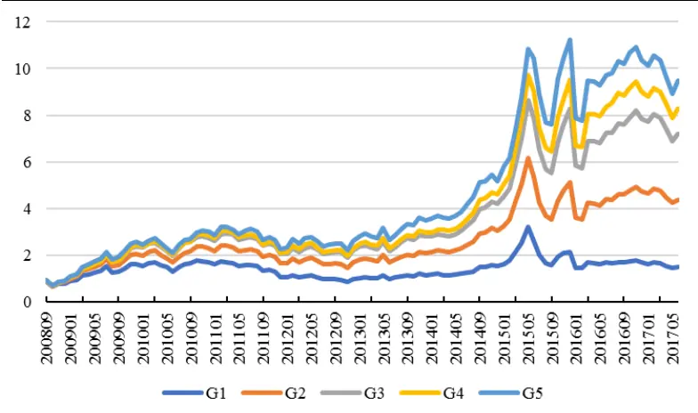
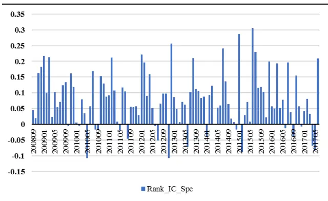
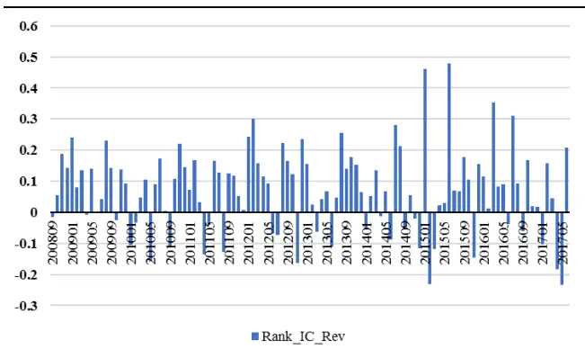
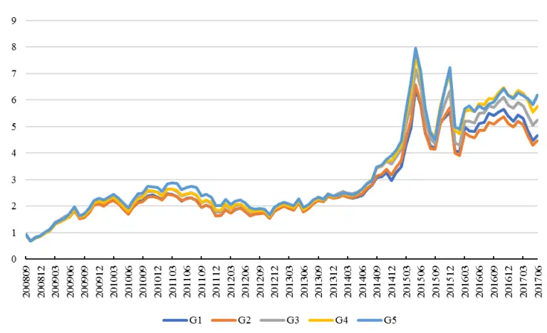
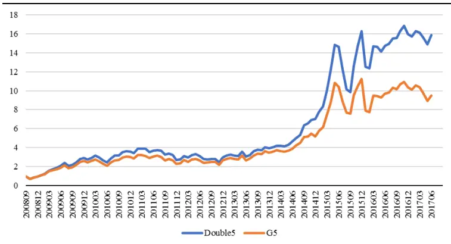
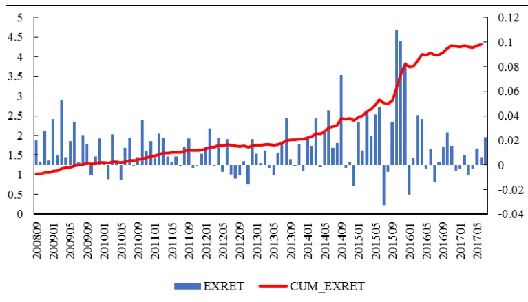

inInfo] [Table_Title] 2017.08.31

# 基于二维收益分解的选股策略

# ——数量化专题之一百零三

刘富兵（分析师）

8 021-38676673

liufubing008481@gtjas.com

证书编号 S0880511010017

## 本报告导读：

本报告基于线性模型将个股收益分解为基本面收益和投机性收益两个部分，同时利用基本面收益的动量属性和投机性收益的反转属性构建二维选股策略。

## 摘要：

le_Summary]本报告充分利用上市公司每个季度发布的财务报表信息，以理论模型为基础，提取估值相关指标并进行分类汇总，通过模型拟合个股收益和相关基本面指标之间的变动关系，将原始收益分解为基本面收益和投机性收益两个部分。

基本面收益是个股收益中基本面信息可解释的部分，这部分收益通常具有持续性。首先，公司财务报告的发布为季度频率，两个季度之间几乎没有信息更新。其次，除了某些严重受到季节性因素影响的公司以外，公司的经营状况和经营业绩至少从短期来看具有一定趋势性，因此公司个体的基本面表现本身就存在动量属性。

投机性收益为模型的残差项。由于缺乏基本面信息的支撑，这部分收益可能来源于市场投机性炒作、消息过度反应等非理性行为，通常不具有持续性。从 Rank_IC 的表现可以看出，投机性收益的预测属性接近于一个月反转因子的两倍。

基于两方面收益特征构建行业中性的选股策略，最终可实现相对中证500指数14.2%的年化超额收益，信息比率为 1.81，最大回撤 4.19%，月度胜率为73.4%，整体表现出优异的收益回撤比。

## 金融工程团队：

刘富兵：（分析师）

电话：021-38676673

邮箱：liufubing008481@gtjas.com

证书编号：S0880511010017

## 陈奥林：（分析师）

电话：021-38674835

邮箱：chenaolin@gtjas.com

证书编号：S0880516100001

## 李辰：（分析师）

电话：021-38677309

邮箱：lichen@gtjas.com

证书编号：S0880516050003

## 孟繁雪：（分析师）

电话：021-38675860

邮箱：mengfanxue@gtjas.com

证书编号：S0880517040005

## 蔡旻昊：（研究助理）

电话：021-38674743

邮箱：caiminhao@gtjas.com

证书编号：S0880117030051

## 殷明：（研究助理）

电话：021-38674637

邮箱：yinming@gtjas.com

证书编号：S0880116070042

## 叶尔乐：（研究助理）

电话：021-38032032

邮箱：yeerle@gtjas.com

证书编号：S0880116080361

## 殷钦怡：（研究助理）

电话：021-38675855

邮箱：yinqinyi@gtjas.com

证书编号：S0880117060109

## （感谢博士后工作站黄皖璇对本报告的贡献）

## [Table_R相关报告

《基于弹簧模型的量价分析》2017.08.30

《缠论中的笔在 MACD价格分段中的应用》2017.08.22

《行业轮动中“确定性”的规律及投资机会》2017.08.18

《多维度挖掘公开市场回购中的超额收益》2017.08.01

《银行委外视角下的产品选择：公募篇》2017.07.19

## 1. 研究背景和思路

## 1.1. 研究背景

对于资本市场参与者而言，“价值投资”并不是个陌生的概念。在血雨腥风的美国华尔街，价值投资造就了股神巴菲特，但是在国内资本市场的发展环境下，价值投资历来很少被认为是切实有效的投资策略。

随着今年以来市场整体发生的大小盘风格切换，白马股、蓝筹股的异军突起，以及监管层表露出的引导资本市场理性健康发展的决心，价值投资的理念似乎越来越多地受到关注并提及。

股票作为有价证券本身具有一定的内在价值，在价值规律的作用下，价格应该围绕价值上下波动。然而中国资本市场存在发展时间短，散户占比高等新兴市场特点，从投资者对概念股的追逐到频繁换仓导致的高换手率，随处可见的非理性行为导致股票市场的价格波动带有很强的投机色彩。

然而，历史上盈利性和成长性因子显著的阿尔法属性又体现出了市场理性的一面。在报告《基于组合权重优化的风格中性多因子选股策略》中我们发现，Earnings Yield 纯因子组合可获取 6.29%的年化收益率、2.54%的年化波动率，实现2.47的信息比率，成长性因子的纯因子组合信息比率为 1.4。换而言之，高盈利性和高成长性公司的股票平均可获得相对较高的收益率。

鉴于此，本报告从基本面分析的角度出发，用简单线性模型将个股收益分解为基本面收益以及投机性收益两部分。基于基本面收益的动量属性以及投机性收益的反转属性，构建选股策略。基本面收益和投机性收益分别反映了个股收益中的理性面和非理性面，相当于一枚硬币的正反两面，独立但又不可分割。因此我们在构建选股策略时，同时从收益的两个维度出发，甄选基本面表现良好并规避高投机性标的，以期实现风险分散下的双重收益。

## 1.2. 策略思路

股票的基本面影响因素有很多，大体上可分为宏观经济因素、中观行业因素以及微观公司个体因素，分别从不同层面影响着个股的价格表现。

经济周期、货币政策的扩张和紧缩、国内外金融环境等都会对实体经济产生影响。而股票市场通常是经济状况的晴雨表，经济衰退时，股市行情必然随之疲软下跌；经济复苏繁荣时，股价也会上升或呈现坚挺的上涨走势。

除了少数全市场齐涨齐跌的现象之外，多数情况下，宏观经济因素都会对不同行业股票的收益表现产生差异化的影响。例如经济整体的快速发展会带动周期股的上涨，利好钢铁、煤炭、机械制造等行业，国家产业政策的颁布也会有针对性地影响相关行业。由于本篇报告最终构建的股票组合需针对基准组合做行业中性化处理，并不涉及市场择时和行业择时，因此宏观层面和行业层面的基本面因素对最终的选股不产生影响，本篇报告的关注重点在于微观公司个体的基本面分析。

股票自身价值是决定股价最基本的因素，这主要取决于发行公司的经营业绩、资信水平以及连带而来的股息红利派发状况、发展前景、股票预期收益水平等。考虑上市公司发布的定期报告是全市场投资者获得相关信息的主要来源，本报告充分利用上市公司每个季度发布的财务报表信息，以理论模型为基础，提取估值相关指标并进行分类汇总，通过模型拟合个股收益和相关基本面指标之间的变动关系，将原始收益分解为基本面收益和投机性收益两个部分。

基本面收益具有持续性是本报告的核心假设之一。首先，公司财务报告的发布为季度频率，两个季度之间几乎没有信息更新。其次，除了某些严重受到季节性因素影响的公司以外，公司的经营状况和经营业绩至少从短期来看具有一定趋势性，因此公司个体的基本面表现本身就存在动量属性。

另外一个重要的假设是投机性收益的反转属性。投机性收益反映了价格偏离价值的部分，这部分收益的可能来源有很多，包括但不限于预期炒作、市场对消息的过度反应等市场非理性行为，不论来源于哪里，都具有着相同的不可持续特征。

在之前的报告《基于信息冲击视角的盈余公告事件研究》中我们发现，在预约披露制度下，上市公司发布公告的具体时间提前可知，投资者倾向于对即将到来的事件进行预期炒作，也即在没有任何基本面信息的情况下将股价炒至高位。在公告日当天，消息出尽，预期兑现，前期炒作得越凶的股票下跌的概率和幅度也越大。总而言之，由非理性行为导致的投机性收益在价值回归的作用下终将产生反转效应。

## 2. 模型方法

根据戈登不变股利增长模型（Golden’s Model），上市公司的价值可表示为：

$$
\lor={\frac{D}{r-g}}
$$

D 为公司支付的股利，由盈利水平和股利支付政策决定，r 为要求收益率，由标的公司的风险决定。潜在投资风险越高的公司，投资者对其的要求收益率也越高。g 代表股利增长率，为了让模型有更强的适应性，g通常以公司的成长性作为代理。

每一种估值模型在使用方面都存在一定的局限性，戈登股利增长模型当然也不例外，但是本报告采用以上模型的目的并不是估值，而是通过其来了解决定股价的几个方面因素，也即盈利性、成长性、安全性和股利支付率。本文中公司层面的基本面分析就以上述几个角度为切入点，数据全部来源于上市公司发布的定期报告。

## 2.1.变量选择及数据预处理

已有的大量国内外文献表明，除了 PB、PE，EPS 等常见的估值指标之外，诸多基本面指标对股价具有预测效应。

Sloan(1996)对盈余组成部分中的应计项目、现金流量的持续性及定价进行检验，发现应计项目持续性低于现金流量持续性，美国市场高估应计项目、低估现金流量，采用买入低应计公司、卖出高应计公司的投资组合，可获得10.4%的超额收益。

George and Hwang (2010)基于股票收益的横截面分析了上市公司破产风险与杠杆率之间的关系，研究表明上市公司的财务困境程度与财务杠杆存在显著的负相关关系，经过风险调整之后，低杠杆、低财务困境的回报溢价具有较强显著性。

Titman, Wei, and Xie (2004)的研究发现，由于投资者对上市公司实际控制人“帝国建设（Empire Building）”的行为反应不足，高资本性投资预示着公司股票未来的低收益。Novy-Marx (2013)认为销售毛利率对股价也具有横截面预测作用，指标具有的截面收益的预测效果不输 PB，销售毛利率更高的公司整体可获得相对更高收益。

相关文献还有很多，受篇幅限制就不一一列举，本报告在总结现有研究经验的基础上，选取已被学者和从业者发现对股价有显著预测作用的财务指标，拟合个股收益，从而将收益分解为基本面收益和投机性收益两大类。

采用量化的方法进行基本面分析容易遇到一些问题，首先，上市公司出于自身利益的考虑，可能会对其财务信息、特别是盈利相关信息进行粉饰和“战略性”调整，导致相关指标的真实有效性和持续性较差。其次，与交易型信息不同，财务类指标的信息来源为上市公司发布的定期报告，商业数据库中的这部分数据或直接手工录入，或通过类似爬虫软件抓取，具有一定的缺失和错误概率。这两种情况影响数据质量，容易导致 Garbage In，Garbage Out 的结果。

鉴于此，我们将多个具有类似属性的单个指标组合，分别构建代表公司盈利性、成长性、安全性的综合指标。综合指标的构建过程中尽量选取多个具有互补关系的单一变量，多角度全方位地捕捉公司在某一特征上的表现，并能平滑缺失值、错误值的影响。

例如在构建盈利能力指标时，EPS、ROA、ROE三类指标虽然代表不同类型投资者（股东、债权人）的利润回报，但是均以净利润为着眼点，众所周知，净利润受到会计政策的影响较大，容易被调整。同样反映获利能力的还有销售毛利率，该指标由营业收入和成本决定，操纵空间相对净利润要小很多。

关于公司的成长性，本文考虑了总利润、净利润、总资产、经营活动现金流相对去年同期的增长情况。采用反映超短期、短期、中期和长期偿债能力指标综合构建安全性指标。分红能力则用现金股利支付率表示。最后，鉴于规模因子一直以来体现出较强的收益预测作用，我们将个股流通市值纳入到基本面指标中，最终形成五大类基本面综合指标。各指标的具体定义如表1所示。

表 1：单个基本面指标定义

| 盈利性 | EPS | 每股收益 | 净利润/期末总股本 |
| --- | --- | --- | --- |
|  | ROE | 净资产收益率 | 净利润*2/(期初股东权益+期末股东权 益) |
|  | ROA | 资产收益率 | 净利润/平均资产总额 |
|  | SalePrf | 销售毛利率 | (营业收入-营业成本)/营业收入 |
| 成长性 | Tprfgrt | 总利润增长率 | 本期利润总额/去年同期利润总额-1 |
|  | NCFgrt | 经营活动现金流量净 额增长率 | 本期经营活动现金净流入/去年同期经 营活动现金净流入-1 |
|  | Nassgrt | 净资产增长率 | 期末净资产/去年同期净资产-1 |
|  | Nprfgrt | 净利润增长率 | 本期净利润/去年同期净利润-1 |
|  | Tassgrt | 总资产增长率 | 期末总资产/去年同期总资产-1 |
|  | Dbastrt | 资产负债率的倒数 | 总资产/总负责 |
| 安全性 | Cur | 流动比率 | 流动资产/流动负债 |
|  | Qck | 速动比率 | (流动资产-存货)/流动负债 |
|  | Cudb | 现金流动负债比 | 经营现金净流入/流动负债 |
|  | Ocudb | 经营净现金流量/带 | 经营活动产生现金流量净额/(负债合 |
|  | Divrt | 息债务 股利支付率 | 计-无息流动负债-无息非流动负债） 累计派现金额/归属于母公司的净利润 |
| 分红力 规模 | Size | 流通股总市值 | 流通股数*月末收盘价 |

数据来源：国泰君安证券研究

基本面指标均存在行业特征，例如轻资产行业（文化传媒、计算机、通信等）公司的资产回报率普遍高于重资产行业（钢铁、煤炭、有色金属等），因此不同行业之间的指标之间缺乏可比性，在使用财务指标建模之前，必须进行行业中性化处理。

同时需要注意的是，表1中盈利性、成长性、安全性对应的单一指标均为财务比率，比率的计算容易产生极端值。以往通常使用截尾或缩尾的方法处理极端值，截尾是选取一定的百分位作为阈值，将变量大于（小于）该阈值的样本删除，会导致样本缺失。而缩尾则是用百分位对应样本的指标值替代超过阈值的样本值，虽然保留了这部分样本，但是扭曲了原本的取值，因此不论是缩尾还是截尾都不是最优的处理方式。

借鉴Asness et al.(2013)的做法，我们首先对各变量取行业内排名，再对排名进行标准化处理，取各指标对应的z-score，这样既避免了极端值的影响，也消除了基本面指标的行业风格特征，标准化之后的各变量相关系数如表2所示。

表 2：财务指标相关性检验

|  | EPS | ROE | ROA | SalePrf | Dbastrt | Cur | Qck | Cudb | Ocudb | Tprfgrt | NCFgrt | Nassgrt | Nprfgrt | Tassgrt | Divrt |
| --- | --- | --- | --- | --- | --- | --- | --- | --- | --- | --- | --- | --- | --- | --- | --- |
| EPS | 1 |  |  |  |  |  |  |  |  |  |  |  |  |  |  |
| ROE | 0.86 | 1 |  |  |  |  |  |  |  |  |  |  |  |  |  |
| ROA | 0.83 | 0.89 | 1 |  |  |  |  |  |  |  |  |  |  |  |  |
| SalePrf | 0.37 | 0.37 | 0.48 | 1 |  |  |  |  |  |  |  |  |  |  |  |
| Dbastrt | 0.2 | 0.1 | 0.4 | 0.39 | 1 |  |  |  |  |  |  |  |  |  |  |
| Cur | 0.25 | 0.15 | 0.37 | 0.35 | 0.78 | 1 |  |  |  |  |  |  |  |  |  |
| Qck | 0.26 | 0.17 | 0.39 | 0.33 | 0.76 | 0.9 | 1 |  |  |  |  |  |  |  |  |
| Cudb | 0.26 | 0.26 | 0.32 | 0.19 | 0.22 | 0.11 | 0.15 | 1 |  |  |  |  |  |  |  |
| Ocudb | 0.27 | 0.27 | 0.33 | 0.22 | 0.21 | 0.11 | 0.16 | 0.88 | 1 |  |  |  |  |  |  |
| Tprfgrt | 0.37 | 0.43 | 0.39 | 0.15 | 0 | 0.02 | 0.03 | 0.1 | 0.11 | 1 |  |  |  |  |  |
| NCFgrt | 0.05 | 0.06 | 0.05 | 0.03 | -0.02 | -0.04 | -0.02 | 0.5 | 0.54 | 0.13 | 1 |  |  |  |  |
| Nassgrt | 0.56 | 0.6 | 0.56 | 0.26 | 0.13 | 0.18 | 0.19 | 0.08 | 0.09 | 0.36 | -0.02 | 1 |  |  |  |
| Nprfgrt | 0.38 | 0.43 | 0.4 | 0.15 | 0.01 | 0.02 | 0.03 | 0.1 | 0.11 | 0.97 | 0.12 | 0.36 | 1 |  |  |
| Tassgrt | 0.37 | 0.36 | 0.34 | 0.2 | 0 | 0.11 | 0.13 | -0.04 | -0.04 | 0.19 | -0.04 | 0.59 | 0.2 | 1 |  |
| Divrt | 0.18 | 0.14 | 0.16 | 0.1 | 0.1 | 0.11 | 0.11 | 0.09 | 0.1 | 0.04 | 0.01 | 0.1 | 0.04 | 0.09 | 1 |

数据来源：国泰君安证券研究

从表 2 中可以看出，绝大多数变量之间的相关系数小于 0.5，表明变量之间的相关性较弱，各变量可从多个分散化的角度捕捉公司的各类特征能力。

在得到单一指标的 z-score 的基础上，综合指标的取值为单一指标的平均，并做同样的标准化处理，盈利性、成长性、安全性指标的计算方法如下：

$$
\begin{array}{rl}&{\mathrm{Profit}=\mathrm{z}\big(z_{ROA}+Z_{ROE}+Z_{SalePrf}+Z_{EPS}\big)}\\&{}\\&{\mathrm{Growth}=\mathrm{z}\big(z_{Ttprfgrt}+z_{NOCFgrt}+z_{Ntasgrt}+z_{Ntprfgrt}+z_{Ttassgrt}\big)}\\&{}\\&{\mathrm{Safty}=\mathrm{z}\big(z_{Dbas}+z_{Cur}+z_{Qck}+z_{Ocudb}+z_{Cudb}\big)}\end{array}
$$

股利支付率、规模则由单一指标构成：

Payout = ZDivrt

Size = Zsize

以上指标均使用最近一期（季度）定期报告中披露的财务信息作为输入变量。但是投资者在关注公司某一方面的能力时，不仅关注当期表现，还会关注该能力的持续性。举例来说，投资者偏好盈利能力较强的公司，某公司在过去较长周期内一直保持着高盈利性水平，相比于之前表现平平，而最近一期盈利突然攀升的公司，对投资者的预期影响是不同的，进而影响股票的定价。因此，本报告另外加入各变量过去四个季度的移动平均 $FTTM_{i,t}^{k}$ ，以捕捉公司的各方面能力在整个年度周期内的持续性。

$$
FTTM_{i,t}^{k}=\frac{F_{i,q}^{k}+F_{i,q-1}^{k}+F_{i,q-2}^{k}+F_{i,q-3}^{k}}{4},k=1,2,3,4,5
$$

## 2.2. 模型设定

在获得标准化基本面指标及其移动平均的基础上，本节采用截面模型拟合个股收益和各类基本面信息之间的线性关系。被解释变量为个股月度收益，解释变量由上一节中涉及的五大类基本面信息以及行业变量构成，模型具体设定如下：

$$
r_{it}=\beta_{0,t}+\sum_{k=1}^{5}\beta_{1t}^{k}F_{i,t}^{k}+\sum_{k=1}^{5}\beta_{2t}^{k}FTTM_{i,t}^{k}+\sum_{l=1}^{27}\beta_{t}^{l}InduDum_{i,t}^{l}+\varepsilon_{it}
$$

其中， $\boldsymbol{F}_{i,t}^{k}$ 为i股在t时刻可获得的最近一期财报中，第k类指标的取值，$FTTM_{i,t}^{k}$ 为相应指标在最近四个季度的移动平均，考虑到宏观经济环境和行业政策信息等会导致个股收益呈现行业特征，故在模型中加入行业标$\dot{\tau})\stackrel{\pi}{\mathrm{\sim}}InduDum_{i,t}^{I}$ 对行业特征加以控制。

模型中截距项 $\beta_{0,t}$ 捕捉某时段内市场整体同涨同跌的部分， $\beta_{1t}^{k}\hbar\alpha\beta_{2t}^{k}$ 是基本面信息的回归系数，反映市场当前对各类型基本面的定价，各股所属的行业收益则体现在 $\mathbf{\nabla}_{\cdot}\beta_{t}^{l}$ 中。

基于该模型，各股原始收益可分解为两个部分，模型可解释的部分我们称之为基本面收益，残差项是基本面信息无法解释的我们称之为投机性收益。本文的选股策略就建立在二维收益分解所具有的不同动量反转特征的基础上。

## 2.2.1. 投机性收益的反转属性

上一节中从逻辑的角度提出了本文的两大假设，即投机性收益具有反转属性而基本面收益具有动量属性，本节从实证的角度验证该逻辑的切实有效性。首先关注的是投机性是否具有反转属性。

个股的投机性收益由模型的残差项表示，也即个股收益中基本面信息无法解释的部分，反映个股收益中的非理性。由于股票本身具有内在价值，相对基本面的偏离不会长期持续，内在价值就像一只无形的手，最终会将价格拉回到合理水平。正如 2015 年上半年创业板公司股票价格屡创新高，在市场参与者疯狂的投机热情下，股价相对基本面严重偏离，平均市盈率最高达到 133.7。当市场高涨的热情逐渐退去，那些之前被炒作上涨幅度最大的股票跌幅也更大。

为了验证投机性收益具有反转属性的假设，本文采用分层测试的方法，每个横截面将全部股票按照投机性收益从高到低的顺序在行业内部等分成五组，构建五个股票组合并持有到下一个换仓日，也即下个月末，从而构成时间序列上连续的股票组合。各组合对应的收益序列如图1所示。

图 1：投机性收益分组组合收益表现

数据来源：国泰君安证券研究

图 1 中从上至下依次对应的是根据历史投机性收益从低到高的顺序排序，月换仓频率下的五个股票组合的收益表现。G1 对应投机性收益最高的分组，G5 对应投机性收益最低的组合，两个组合的年化绝对收益分别为4.63%和 29.02%，组合之间的区分度十分明显，表现出单调变化特征。从分层组合表现的角度来看，投机性收益对股价变动存在非常明显的反向预测性。

表 3：投机性收益分组组合表现统计

|  | Group1 | Group2 | Group3 | Group4 | Group5 |
| --- | --- | --- | --- | --- | --- |
| 年化收益率（%） | 4.63 | 18.23 | 25.07 | 27.05 | 29.02 |
| 年化波动率（%） | 9.97 | 9.91 | 9.88 | 9.89 | 10 |
| Sharpe 比率 | 0.13 | 0.53 | 0.73 | 0.79 | 0.84 |
| 月度收益最大值（%） | 30.14 | 25.11 | 23.16 | 24.27 | 25.3 |
| 月度收益最小值（%） | -27.11 | -30.24 | -30.89 | -30.54 | -30.86 |
| 最大回撤（%） | 55.03 | 42.67 | 35.96 | 35.24 | 31.69 |

数据来源：国泰君安证券研究

同时注意到本文构建的投机性收益的本质是在原始月度收益中减去模型拟合的基本面收益之后的剩余部分，如果不做这部分收益剔除，组合收益就来源于一个月反转因子。从历史表现来看，一个月反转因子本身就有很强的预测属性，只有进一步提高单因子的预测效果，构建投机性收益的工作才存在价值和意义。

考虑因子 IC 是反映单因子收益预测能力的有效指标，为了比较投机性收益与一个月反转在预测能力上的区别，图 2 和图3 分别展示了两种指标对应的Rank_IC 表现，相关统计量如表 4所示。

图 2：投机性收益的Rank_IC表现

数据来源：国泰君安证券研究

图 3：一个月反转因子的 Rank_IC 表现

数据来源：国泰君安证券研究

投机性收益的 Rank_IC 的均值为 7.7%，一个月反转因子的相应值为7.1%，虽然从均值的角度来看，二者差别不大，投机性收益只是略胜一筹。但是从标准差的表现来看，投机性收益预测稳定性显著更高，T 统计量值为9.21，接近一个月反转因子的两倍。因此，剥离了基本面以后的剩余收益部分相对原始收益，具有显著更强的反转预测属性。

表 4：投机性收益和一个月反转因子的 Rank_IC统计量表现

| 统计量 | 均值 标准差 | 最小值 | 最大值 T值 |
| --- | --- | --- | --- |
| 投机性收益 | 7.7% 8.7% | -10.2% | 30.5% 9.21 |
| 一个月反转 | 7.1% 13.4% | -23.4% | 48.0% 5.4 |

数据来源：国泰君安证券研究

## 2.2.2. 基本面收益的动量属性

在本文的回归模型背景下，个股在t期的基本面收益可表示如下：

$$
\begin{array}{r}{\frac{\ddagger{}}{\ddagger{}}\mathcal{K}_{\mathrm{sinf}}\sharp\widetilde{\mathbf{x}}_{\bar{\mathfrak{s}}\bar{\mathfrak{n}}\cdot}^{\sharp}-\hat{\beta}_{0,t}+\sum_{k=1}^{5}\hat{\beta}_{1t}^{k}F_{i,t}^{k}+\sum_{k=1}^{5}\hat{\beta}_{2t}^{k}FTTM_{i,t}^{k}+\sum_{I=1}^{27}\hat{\beta}_{t}^{I}InduDum_{i,t}^{I}}\end{array}
$$

我们认为，基本面收益捕捉的是收益中的理性定价部分，并且不论是宏观经济、行业还是公司的基本面表现在短期内均具有趋势性，因此这部分收益在下一期大概率延续。

为了验证该假设，本节同样采取类似投机性收益的分层测试方式，每一期在行业内根据各股的基本面收益等分成五组，构建五个股票组合。测试期内的组合收益表现情况如图4 所示。

图 4：基本面收益分组组合收益表现

数据来源：国泰君安证券研究

图 4 中 G1（G5）组合对应历史基本面收益最低（高）分组，从五组收益曲线及表5 中相关统计表现可以看出，基本面收益对下一期股价具有正向预测作用，基本面收益越高的股票，下一期整体收益的表现也越好。虽然相比于投机性收益，组合之间的区分度较差，但是各组之间收益基本仍保持单调变化的特征。

表 5：基本面收益分组组合表现统计

|  | Group1 | Group2 | Group3 | Group4 | Group5 |
| --- | --- | --- | --- | --- | --- |
| 年化收益率（%） | 19.05 | 18.43 | 20.61 | 21.91 | 22.92 |
| 年化波动率（%） | 9.97 | 9.91 | 9.88 | 9.89 | 10 |
| Sharpe 比率 | 0.55 | 0.54 | 0.6 | 0.64 | 0.66 |
| 月度收益最大值（%） | 30.14 | 25.11 | 23.16 | 24.27 | 25.3 |
| 月度收益最小值（%） | -27.11 | -30.24 | -30.89 | -30.54 | -30.86 |
| 最大回撤（%） | 37.61 | 40.36 | 66.86 | 39.82 | 43.68 |

数据来源：国泰君安证券研究

模型较低的拟合优度是导致基本面信息预测效果相对较弱的潜在原因之一。实际中影响个股收益的因素不胜枚举，导致个股的收益表现捉摸不定，本文选取的指标虽然已尽量从多角度涵盖公司的基本面表现，但是还是很难大规模提高其对个股收益的解释力度。本文设定的模型平均每期的拟合优度为13%，这意味着基本面信息可捕捉的收益部分十分有限。

## 2.2.3. 双向选择效果

虽然基本面收益本身的预测效果差强人意，但其中包含的信息与投机性收益之间具有互补关系，二者分别捕捉了市场的理性面和非理性面，因此将基本面信息加入到投机性收益的选股策略中应该能够起到信息增强的作用。

为了同时利用基本面收益和投机性收益的预测性，本文基于两方面信息进行双向选股。具体的做法是首先将各股在行业内按照基本面收益和投机性收益独立分成五组，选取同时处于基本面收益和投机性收益最高分组的标的，构建股票组合。

双向选择下的股票组合与投机性收益单向分组最优组合的收益表现对比如图5 所示。双向选择下的组合收益表现由蓝色曲线表示，与黄色曲线所代表的投机性收益最高分组组合相比，加入基本面选股之后，组合整体表现明显增强，年化收益由29.02%上升到36.8%，夏普比率从 0.84上升到 1.04。

图 5：双向选择分组和单一分组收益对比

数据来源：国泰君安证券研究

## 3. 交易策略构建

## 3.1. 策略方法

本节基于以上分析，构建具体交易策略。由于我国 2007 年初进行了会计制度调整，调整前后的会计指标缺乏可比性，因此本文只采用 2007年以后的财务数据。为避免用到未来数据，本文统一在每一期定期报告强制披露截止日更新所有公司的财务信息，并且只使用调整前的数据。另外，年报和第一季报的发布截止日期均为 4 月 31 日，大量公司的年报和第一季度报的发布时间比较接近，考虑投资者对年报的关注度相对较高，因此本文在4月末采用年报数据更新财务信息。

具体的策略构建流程如下：

- 计算每一横截面所有个股对应的基本面收益： $FR_{it}$ ，从低到高排序，取得行业内排名 $\mathrm{Rank}(FR_{it})$ 。

- 计算每一横截面所有个股对应的投机性收益： $SR_{it}$ ，从高到低排序，取得行业内排名 $\mathrm{Rank}(SR_{it})$ 。

- 双向选择下，个股的最终排名为: $\mathrm{Min}[\mathrm{Rank}(FR_{it}),\ \mathrm{Rank}(SR_{it})]$

- 每一期每个行业内选取排名处于前1/10分位数以上的股票，行业内

等权。

- 选取中证500作为基准，行业间权重按照指数行业权重配比。

- 策略月换仓。

- 交易手续费考虑双边千三，剔除 ST、涨跌停等交易受到限制的股票。

## 3.2. 回测效果

策略在回测期内的表现如图 6 所示，可实现年化超额收益为 14.2%，信息比率 1.81，最大回撤 4.19%，相对中证 500 的月度胜率为 73.4%，整体表现出优异的收益回撤比。

图 6：对冲中证 500 的行业中性策略表现

数据来源：国泰君安证券研究

表6统计了策略分年度的业绩表现。表格中第二列和第三列分别给出了股票组合在区间内的月度平均绝对收益和相对中证500 的超额收益。从超额收益的表现可以看出，策略在区间内的表现稳定，每一年均可获得相对中证500的超额收益。

表 6：分年度策略表现

| 回测区间 | 平均收益 (%) | 平均超额收 益（%） | 区间胜率 （%) | 最大回撤 (%) |
| --- | --- | --- | --- | --- |
| 2008.09-2008.12 | -1.37 | 1.4 | 100 | 0 |
| 2009.01-2009.12 | 9.54 | 1.89 | 91.67 | 1.12 |
| 2010.01-2010.12 | 1.94 | 0.88 | 66.67 | 1.35 |
| 2011.01-2011.12 | -2.17 | 0.97 | 83.33 | 0.37 |
| 2012.01-2012.12 | 0.95 | 0.6 | 58.33 | 3.77 |
| 2013.01-2013.12 | 2.34 | 0.75 | 75 | 1.06 |
| 2014.01-2014.12 | 4.79 | 1.94 | 75 | 1.42 |
| 2015.01-2015.12 | 7.69 | 3.94 | 83.33 | 4.19 |
| 2016.01-2016.12 | -0.23 | 0.87 | 66.67 | 1.89 |
| 2017.01-2017.06 | -0.16 | 0.1 | 50 | 1.65 |

数据来源：国泰君安证券研究

## 4. 总结及后续研究展望

## 4.1. 总结

本报告采用线性回归的方式，开创性地将个股收益分解为基本面收益和投机性收益两个部分。我们将个股收益中由公司盈利性、成长性、安全性、分红能力以及行业特征所解释的部分定义为基本面收益，并将剩余部分定义为投机性收益。

基本面收益反映了个股收益中的理性面。由于公司的基本面表现短期内具有一定的趋势性，使得其存在一定的动量属性。而投机性收益则体现为价格相对价值的偏离，构成收益中的非理性面，投机炒作、过度反应等都是导致投机性收益的潜在原因，由于缺乏基本面支撑，该部分收益难以持续，在价值回复的作用下表现出较强的反转属性。

本文基于两方面收益的动量反转特征构建双向选择下的选股策略，由于基本面收益和投机性收益中包含的信息具有互补关系，二维选股策略可在规避单向风险的同时获得双向收益。

## 4.2.后续研究展望

为了将个股收益分解为两个部分，本文使用线性模型拟合基本面信息和个股收益之间的关系。使用简单线性模型虽然避免了过度拟合的顾虑，但也容易丢失信息，因为简单线性模型可能难以很好地刻画基本面信息与个股收益之间纷繁复杂的关系。

从两方面收益分别的表现来看，投机性收益的预测效果要比基本面收益出色很多，究竟是基本面信息本身的选股效力较差，还是本文构建的模型没有完全发挥出基本面信息的预测作用？这是一个值得进一步思考的问题。

因此本报告仅为投资者提供了收益二维分解的思路，从模型设计的角度来看还存在较大上升空间。在后续的研究中，可考虑引入机器学习的方法探究基本面信息与个股收益之间的关系，从而更好地发挥基本面在选股方面的价值。

## 本公司具有中国证监会核准的证券投资咨询业务资格

## 分析师声明

作者具有中国证券业协会授予的证券投资咨询执业资格或相当的专业胜任能力，保证报告所采用的数据均来自合规渠道，分析逻辑基于作者的职业理解，本报告清晰准确地反映了作者的研究观点，力求独立、客观和公正，结论不受任何第三方的授意或影响，特此声明。

## 免责声明

本报告仅供国泰君安证券股份有限公司（以下简称“本公司”）的客户使用。本公司不会因接收人收到本报告而视其为本公司的当然客户。本报告仅在相关法律许可的情况下发放，并仅为提供信息而发放，概不构成任何广告。

本报告的信息来源于已公开的资料，本公司对该等信息的准确性、完整性或可靠性不作任何保证。本报告所载的资料、意见及推测仅反映本公司于发布本报告当日的判断，本报告所指的证券或投资标的的价格、价值及投资收入可升可跌。过往表现不应作为日后的表现依据。在不同时期，本公司可发出与本报告所载资料、意见及推测不一致的报告。本公司不保证本报告所含信息保持在最新状态。同时，本公司对本报告所含信息可在不发出通知的情形下做出修改，投资者应当自行关注相应的更新或修改。

本报告中所指的投资及服务可能不适合个别客户，不构成客户私人咨询建议。在任何情况下，本报告中的信息或所表述的意见均不构成对任何人的投资建议。在任何情况下，本公司、本公司员工或者关联机构不承诺投资者一定获利，不与投资者分享投资收益，也不对任何人因使用本报告中的任何内容所引致的任何损失负任何责任。投资者务必注意，其据此做出的任何投资决策与本公司、本公司员工或者关联机构无关。

本公司利用信息隔离墙控制内部一个或多个领域、部门或关联机构之间的信息流动。因此，投资者应注意，在法律许可的情况下，本公司及其所属关联机构可能会持有报告中提到的公司所发行的证券或期权并进行证券或期权交易，也可能为这些公司提供或者争取提供投资银行、财务顾问或者金融产品等相关服务。在法律许可的情况下，本公司的员工可能担任本报告所提到的公司的董事。

市场有风险，投资需谨慎。投资者不应将本报告作为作出投资决策的唯一参考因素，亦不应认为本报告可以取代自己的判断。
在决定投资前，如有需要，投资者务必向专业人士咨询并谨慎决策。

本报告版权仅为本公司所有，未经书面许可，任何机构和个人不得以任何形式翻版、复制、发表或引用。如征得本公司同意进行引用、刊发的，需在允许的范围内使用，并注明出处为“国泰君安证券研究”，且不得对本报告进行任何有悖原意的引用、删节和修改。

若本公司以外的其他机构（以下简称“该机构”）发送本报告，则由该机构独自为此发送行为负责。通过此途径获得本报告的投资者应自行联系该机构以要求获悉更详细信息或进而交易本报告中提及的证券。本报告不构成本公司向该机构之客户提供的投资建议，本公司、本公司员工或者关联机构亦不为该机构之客户因使用本报告或报告所载内容引起的任何损失承担任何责任。

## 评级说明

## 1.投资建议的比较标准

投资评级分为股票评级和行业评级。

以报告发布后的12个月内的市场表现为比较标准，报告发布日后的 12个月内的公司股价（或行业指数）的涨跌幅相对同期的沪深 300 指数涨跌幅为基准。

## 2.投资建议的评级标准

报告发布日后的 12 个月内的公司股价（或行业指数）的涨跌幅相对同期的沪深 300 指数的涨跌幅。

|  | 评级 | 说明 |
| --- | --- | --- |
| 股票投资评级 | 增持 | 相对沪深300指数涨幅15%以上 |
|  | 谨慎增持 | 相对沪深300指数涨幅介于5%～15%之间 |
|  | 中性 | 相对沪深300指数涨幅介于-5%～5% |
|  | 减持 | 相对沪深 300 指数下跌 5%以上 |
| 行业投资评级 | 增持 | 明显强于沪深 300 指数 |
|  | 中性 | 基本与沪深 300指数持平 |
|  | 减持 | 明显弱于沪深300指数 |

## 国泰君安证券研究所

|  | 上海 | 深圳 | 北京 |
| --- | --- | --- | --- |
| 地址 | 上海市浦东新区银城中路168号上海 银行大厦29层 | 深圳市福田区益田路 6009 号新世界 商务中心34层 | 北京市西城区金融大街 28 号盈泰中 心2号楼10层 |
| 邮编 | 200120 | 518026 | 100140 |
| 电话 | （021)38676666 | (0755)23976888 | (010)59312799 |
|  | E-mail: gtjaresearch@gtjas.com |  |  |