inInfo] [Table_Title] 2017.09.20

# 盈余质量检验及其投资策略构建

## ——数量化专题之一百零五

刘富兵（分析师）

## 李栩（研究助理）

8 021-38676673

021-38674809

liufubing008481@gtjas.com

lixu019018@gtjas.com

证书编号 S0880511010017

S0880117090067

## 本报告导读：

本报告提供了可用于甄别上市公司盈余操纵行为的盈余质量检验工具，并对检验工具的有效性进行了深入研究，借以挖掘长期质优股以及排查“地雷股”。

## 摘要：

le_Summary]2017 年以来，市场逐步提升了对标的真实业绩的关注程度，曾经的“绩优股”接连被曝光财务造假，在这样的环境下，评价上市公司盈余质量好坏显得格外重要。本篇报告将深挖基本面逻辑，设计一套可以用于检验上市公司盈余质量好坏的工具，用以甄别“地雷股”、“假成长股”以及挖掘优质绩优股、“真成长股”。

由于盈余质量的高低无法直接被观测，我们选用了国内外学术研究中成熟的7个模型，设计出相应的代理变量，用以检验上市公司盈余质量高低，这些模型具体包括：应计利润（Accruals）、应计盈余管理、利润平滑（Smoothness）、真实盈余管理、损失确认及时性（TLR）、M-Score 模型以及本福特定律（Benford）。

盈余质量投资是指通过甄别上市公司盈余质量好坏，买入高质量标的，卖出（避免买入）低质量标的，从而获得相对投资收益的过程。通过考察盈余质量代理变量与未来业绩、投资收益之间的逻辑传导关系，发现了由应计盈余管理、应计利润、真实盈余管理以及 M-Score模型得到的代理变量 DAC、ACC、REM、M-Score是较为有效的盈余质量投资指标，通过这四个指标划分的组合在未来财报期具有较稳定的相对收益。其中通过应计盈余管理（DAC）筛选的高盈余质量组在下一半年报以及年报期的平均收益，相比于低盈余质量组分别高达 2.49%、1.58%，胜率分别为 88%、75%。

检验各盈余质量代理变量对不同行业的适用程度，通过在适用的行业中构造高盈余质量组与低盈余质量组，进一步提升盈余质量投资收益。通过应计盈余管理模型（DAC）在适用的行业中划分的高盈余质量组，相对于低盈余质量组在下一半年报期的胜率为 75%，相对收益平均为 3.64%，相较于未进行分行业处理前的收益提升了1.16%；在下一年报期的胜率为 88%，相对收益平均为 3.41%，相较于未进行分行业处理前的收益提升了1.83%。

尝试从“指标组合”、“事件组合”两个方面构建具有更高收益的盈余质量投资策略。关于“指标组合”：通过真实盈余管理模型（REM）与应计盈余管理模型（DAC）构造了代理变量组合——“低REM+低DAC”高盈余质量组，与其对应的低盈余质量组相比，该组合历史胜率100%（09-17年），相对收益平均可达13.59%；关于“事件组合”：将盈余质量检验工具与具体“盈余阈值”事件相结合，从而挖掘“真成长股”：以“扭亏为盈”事件为例，“扭亏为盈+高盈余质量”组比“扭亏为盈+低盈余质量”组的收益每年平均高出 9.47%。

金融工程

## 金融工程团队：

刘富兵：（分析师）

电话：021-38676673

邮箱：liufubing008481@gtjas.com

证书编号：S0880511010017

## 陈奥林：（分析师）

电话：021-38674835

邮箱：chenaolin@gtjas.com

证书编号：S0880516100001

## 李辰：（分析师）

电话：021-38677309

邮箱：lichen@gtjas.com

证书编号：S0880516050003

## 孟繁雪：（分析师）

电话：021-38675860

邮箱：mengfanxue@gtjas.com

证书编号：S0880517040005

## 蔡旻昊：（研究助理）

电话：021-38674743

邮箱：caiminhao@gtjas.com

证书编号：S0880117030051

## 殷明：（研究助理）

电话：021-38674637

邮箱：yinming@gtjas.com证书编号：S0880116070042

## 叶尔乐：（研究助理）

电话：021-38032032

邮箱：yeerle@gtjas.com

证书编号：S0880116080361

## 殷钦怡：（研究助理）

电话：021-38675855

邮箱：yinqinyi@gtjas.com

证书编号：S0880117060109

## [Table_R相关报告

《抱团行为和慢牛股研究》2017.09.19

《基于二维收益分解的选股策略》2017.08.31

《基于弹簧模型的量价分析》2017.08.30

《缠论中的笔在 MACD价格分段中的应用》2017.08.22

《行业轮动中“确定性”的规律及投资机会》2017.08.18

## 1. 盈余质量的定义

在过往三十年的学术研究中，“盈余质量”作为会计研究的重要课题一直备受关注，学者们普遍认为高盈余质量能够为投资者提供高质量的上市公司盈余信息，以帮助投资者更为准确地预测公司未来业绩，从而做出正确的投资决策。若上市公司进行了盈余操纵或管理，那么其财报盈余向投资者传递的信息质量往往较差；较差的信息质量不利于投资者合理地预期公司的未来业绩，并影响其做出正确的投资决策，从而导致其遭受投资损失，因此对上市公司盈余质量好坏的评价具有重要的意义。

进入 2017 年以来，投资者提升了对绩优股的关注程度，价值成为了市场上主流的风格；同时，媒体加大了对“问题股”的曝光力度，部分“地雷股”股价闪崩给投资者造成了较大的回撤与流动性冲击。在这样的环境下，对上市公司业绩真实性的评价显得更加重要。为此，本篇报告将深挖基本面逻辑，设计一套可以用于检验上市公司盈余质量好坏的工具，用于：

- 甄别“地雷股”、“假成长股”；

- 挖掘优质绩优股、“真成长股”。

## 2. 盈余质量的检验方法

由于上市公司盈余质量的好坏无法通过直接观测得到，所以我们需要寻找能够刻画标的盈余质量好坏的代理变量来进行盈余质量相关研究，代理变量的具体设计思路如下：

- 将用于预测上市公司未来业绩的盈余信息分解为高质量盈余以及低质量盈余两部分，高质量盈余稳定性高、持续性强、对未来盈余的预测性强；低质量盈余稳定性低、持续性弱、对未来盈余的预测性差。

- 盈余质量的好坏表现为高质量盈余与低质量盈余的相对大小，若低质量盈余占比较大，则该上市公司盈余质量较差。我们所设计的盈余质量代理变量应能够较准确地计量或反映低盈余质量的相对大小。

图 1盈余质量代理变量设计思路
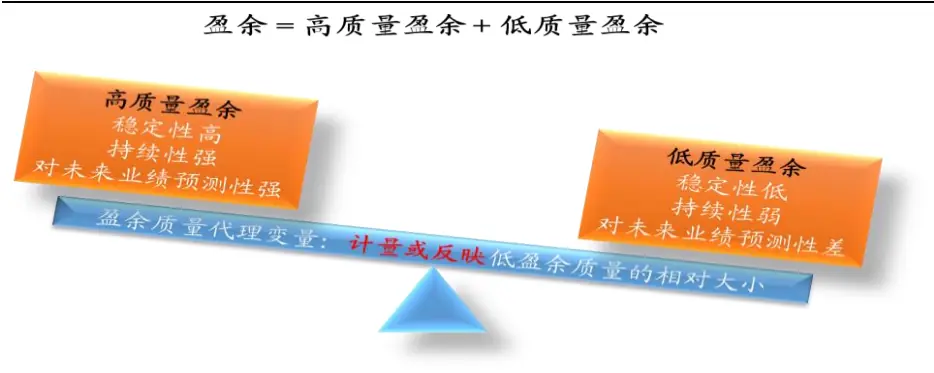

数据来源：国泰君安证券研究

按照上述思路，我们选取了国内外比较成熟的7个模型，设计相应的盈余质量代理变量进行检验，用以甄别上市公司盈余质量的好坏：

- 应计利润（Accruals）

- 应计盈余管理

- 利润平滑（Smoothness）

- 真实盈余管理

- 损失确认及时性（TLR）

- M-Score 模型

- Benford 定律

## 2.1. 应计利润（Accruals）

在权责发生制的会计准则下，会计盈余分为现金利润与应计利润两部分，Sloan（1996）在对现金利润、应计利润持续性的实证检验中发现了著名的“应计异象”：应计利润相比于现金利润的持续性较差，但由于市场对两者的认识不足，导致了应计利润占比较高的公司价值被高估，从而导致其被错误定价，而这错误定价在未来会得到逐步修正；通过买入低应计、卖出高应计的标的构建多空组合，一年可获得 10.4%的相对收益。

究其原因，现金利润来源于当期经营净现金流的增加；而应计利润更多来源于对未来现金流的确认，这给予了公司管理层较大的利润操纵空间，从而导致应计利润持续性较差，拥有较高应计利润的公司未来盈余往往会出现下滑。所以应计利润越大的公司，其盈余质量往往越差。

对于应计利润，可以从利润表与资产负债表两个角度去计量，其中利润表角度的计算公式为：

应计利润 = 营业利润 – 经营性净现金流

资产负债表角度的计算公式为：

应计利润 = 非现金营运资本变动

= Δ（流动资产 - 现金 – 短期投资 – 一年内到期的非流动资产）-Δ（流动负债 – 短期借款 – 一年内到期的非流动负债 –应交税费）– 折旧&摊销

为了不同资产规模的标的能够进行横向比较，我们采用应计利润/上一期总资产作为盈余质量的代理变量，用于计量标的盈余质量的好坏，其数值越大，标的盈余质量越差；当数值为负时，标的存在“藏利润”的可能性。

## 2.2.应计盈余管理（应计利润分离模型）

由于应计利润不完全都是由于主观操纵所产生的，其中有部分不可操纵是由自身增长所致，为了能够更准确地计量上市公司主观操纵的部分，Healy（1985）与DeAnglo（1986）首先提出了从总的应计利润总分离出非操纵与操纵两部分的思路，并基于一定假设设计了相应的模型，虽然模型缺陷较大，但是其为应计利润分离法后来的发展奠定了理论基础：

总应计利润（ACC） = 非操控性应计利润（NDACC） + 操控性应计利润（DACC）

Jones（1995）认为非操纵性应计利润主要受营业收入变动以及固定资产水平两个因素影响，营业收入的变动对应营运资本的变动，固定资产产生折旧，营运资本变动以及折旧均会对应计利润造成影响；对总应计利润利用上述两因素进行回归分解，其拟合值对应着非操纵性的应计利润，而不能被两因素解释的部分（回归模型的残差）则对应着操纵性应计利润，该模型被称为基本琼斯模型（Jones Model）。

在后来的研究中，建立在基本琼斯模型基础上的应计利润分离模型陆续被建立，包括：修正琼斯模型（Modified Jones Model）、无形资产琼斯模型、前瞻性修正琼斯模型、现金流琼斯模型、收益匹配琼斯模型（Performance matched）等。其中修正琼斯模型、无形资产琼斯模型以及收益匹配琼斯模型具有良好的实证口碑以及效果，在本篇报告中，我们选用修正琼斯模型进行相关研究：

修正琼斯模型建立在基本琼斯模型的基础上，不同的是，修正琼斯模型认为上市公司可通过改变信用条件来操控利润，所以在营业收入变动中扣除了应收账款变动，以计量更为准确的非操纵性应计利润。模型构建的步骤分为以下三步：

首先，通过对基本琼斯模型的表达式分行业进行截面回归，得到相应的系数 $\beta_{0},\ \beta_{I},\ \beta_{2}$

$$
\frac{ACC_{t}}{TA_{t-1}}=\beta_{0}+\beta_{1}\frac{\Delta REV_{t}}{TA_{t-1}}+\beta_{2}\frac{PPE_{t}}{TA_{t-1}}+\varepsilon_{t}
$$

其中，ACC为总应计利润，TA为总资 $\dot{\mathcal{P}}$ ，ΔREV为营业收入的变动，PPE为固定资产水平。

其次，将分行业回归所得系数代入下式以计算非操纵性应计利润。

$$
\frac{NDACC_{t}}{TA_{t-1}}=\hat{\beta}_{0}+\hat{\beta}_{1}\frac{\Delta REV_{t}-\Delta REC_{t}}{TA_{t-1}}+\hat{\beta}_{2}\frac{PPE_{t}}{TA_{t-1}}
$$

其中，ΔREC为应收账款的变动。

最后，从总应计利润中减去非操纵性应计利润可得操纵性应计利润。

$$
\frac{DACC_{t}}{TA_{t-1}}=\frac{ACC_{t}}{TA_{t-1}}-\frac{NDACC_{t}}{TA_{t-1}}
$$

操纵性应计利润更准确地反映了上市公司对利润操纵的程度，可作为我们检验盈余质量好坏的代理变量，其数值越大，则说明标的盈余质量越差；当数值为负时，该数值代表标的“藏利润”的程度。

## 2.3. 利润平滑

我们从财务数据、应计利润分离模型以及财报期重合三个不同的角度去观察利润平滑现象。

对于财务数据角度，Leuz, Nanda & Wysocki（2003）利用营业利润的标准差与经营净现金流的标准差的比值去衡量利润平滑：

$$
SmoothIndex1=\frac{\sigma_{OP}}{\sigma_{CFO}}
$$

该指标越小，则说明公司利润平滑现象越严重。其逻辑在于，公司的现金流量表一般难以被操纵，而利润表易被操纵，如果在营业利润波动较低的情况下，经营净现金流大幅波动，那么公司存在一定程度上平滑收益操作。

对于应计利润分离模型角度，Tucker & Zarowin（2006）通过比较不可操控性利润与操控性应计利润之间的相关关系去衡量公司利润平滑。具体计算过程如下。

首先，对营业利润运用应计利润分离模型进行拆解及合成：

$$
\begin{array}{rl}{\frac{\partial\hat{\mathcal{E}}}{\partial\mathcal{Z}}\downarrow[\mathcal{X}\mathcal{H}]\hat{\mathcal{H}}\{\mathrm{~O~P~}\}}&{=\frac{\partial\hat{\mathcal{Z}}}{\partial\mathcal{Z}}\frac{\partial\hat{\mathcal{P}}}{\partial\mathcal{Z}}\frac{\partial\hat{\mathcal{Z}}}{\partial\mathcal{Z}}\frac{\partial\hat{\mathcal{Z}}}{\partial\mathcal{W}}\left(\mathrm{CFO~}\right)\quad+\ \beta\frac{\partial}{\partial\mathcal{Z}}\hat{\mathcal{H}}\left\{\mathcal{Z}\right\}\left\{\mathcal{A}\right\}\left(\mathrm{ACC~}\right)}\\&{=\frac{\beta\mathcal{Z}}{\mathcal{Z}}\frac{\partial\hat{\mathcal{P}}}{\partial\mathcal{Z}}\frac{\partial\hat{\mathcal{P}}}{\partial\mathcal{Z}}\frac{\partial\hat{\mathcal{Z}}}{\partial\mathcal{Z}}\ \frac{\partial\hat{\mathcal{Z}}}{\partial\mathcal{W}}\ \left(\mathrm{~CFO~}\right)\quad+\ \frac{4\beta}{\beta\mathcal{Z}}\frac{4\beta}{\beta\mathcal{Z}}\frac{1}{\beta\mathcal{Z}}\frac{\partial\hat{\mathcal{Z}}}{\partial\mathcal{Z}}\hat{\mathcal{H}}\left\{\mathcal{Z}\right\}\hat{\mathcal{H}}}\\&{\quad\left(\mathrm{~NDACC~}\right)\quad+\ \frac{4\beta}{4\mathcal{P}}\frac{1}{4\mathcal{Z}}\frac{1}{\beta\mathcal{Z}}\hat{\mathcal{H}}\left\{\mathcal{Z}\right\}\hat{\mathcal{Z}}\hat{\mathcal{H}}\left\{\mathcal{Z}\right\}\left(\mathrm{~DACC~}\right)}\\&=\ \mathcal{K}\overline{{\mathrm{~v_\mathrm{Z}~}}}\frac{4\beta}{2\mathcal{Z}}\frac{1+4\hat{\mathcal{Z}}}{\beta\mathcal{Z}}|\pm\end{array}
$$

其次，对上述表达式取变化值，即

Δ 营业利润（OP） = Δ 不可操控性利润（PDI） +Δ 操控性应计利润（DACC）

最后，考察等式右边两个变化量之间的相关关系，

$$
SmoothIndex2{=}\rho(\Delta PDI,\Delta DACC)
$$

若两者呈负相关变动，则说明公司进行了利润平滑操作，且若该值越接

近于-1，则说明利润平滑现象越严重。

对于财报期重合角度，我们选取四季度单季度营业利润与下一会计年度一季度单季度营业利润进行比较：

$$
SmoothIndex3{=}\vert OP_{{t},{4}}/OP_{{t}+1,1}\vert
$$

若两者接近，即指标值越接近 1，则公司越可能存在一定利润平滑的操作。其逻辑在于年报与一季报发布时点接近，公司可以在满足本年度业绩需求的情况下，平滑一部分收益至下一会计年度，为满足下一年度业绩需求提供了一定操作空间。

## 对于利润平滑的利弊，学术界争论不一：

- 一方面认为，利润平滑向市场传递了企业较低的经营风险以及较低收益波动可能性的信息，有利于投资者对企业未来业绩进行合理预期；

另一方面认为，利润平滑降低了会计信息质量，影响了投资者对企业盈余的信任程度，从而不利于投资者对企业未来业绩进行合理预期。此外，一旦企业经营出现较大问题，利润平滑不可持续时，企业存在由于失去长久稳定性而带来较大边际变化导致经营或股价崩盘的风险。

## 2.4. 真实盈余管理

不同于应计盈余管理通过操纵应计项目从而操纵盈余，真实盈余管理通过安排真实的生产经营活动进行盈余操纵，短期可能为企业带来较为客观的收益，但这种非最优化地改变企业生产经营活动的行为，会降低未来的企业价值。

真实盈余管理的手段主要有销售操控、生产操控以及酌量性费用操控，其中：

- 销售操控主要通过放宽信用条件、加大销售折扣的方式做大利润，但同时会产生更少的净现金流；

- 生产操控主要利用规模效应大量生产以降低单位产品成本的方式做大利润，但同时会增加库存成本，产生更多的总生产成本；

- 酌量性费用操控主要通过缩减研发、广告以及维修开支等方式做大利润，同时会产生更少的酌量性费用。

扣除不可操控的正常经营活动部分后，企业将表现为更低的异常经营净现金流，更高的异常生产成本以及更低的异常酌量性费用。

Roychowdhury（2006）建立了异常净现金流、异常生产成本以及异常酌量性费用的分离模型。

对于销售操控，进行分行业截面回归的表达式如下，

$$
\frac{CFO_{t}}{TA_{t-1}}=\beta_{0}+\beta_{1}\frac{1}{TA_{t-1}}+\beta_{2}\frac{SALES_{t}}{TA_{t-1}}+\beta_{3}\frac{\Delta SALES_{t}}{TA_{t-1}}+\varepsilon_{t}
$$

其中，CFO 为经营净现金流，TA 为总资产，SALES为销售收入，ΔSALES为销售收入的变动，残差项为经营净现金流的异常值；

对于生产操控，进行分行业截面回归的表达式如下，

$$
\frac{PROD_{t}}{TA_{t-1}}=\frac{COGS_{t}+\Delta INV_{t}}{TA_{t-1}}=\beta_{0}+\beta_{1}\frac{1}{TA_{t-1}}+\beta_{2}\frac{SALES_{t}}{TA_{t-1}}+\beta_{3}\frac{\Delta SALES_{t}}{TA_{t-1}}+\beta_{4}\frac{\Delta SALES_{t-1}}{TA_{t-1}}+\delta_{t}
$$

其中，PROD 为总生产成本，由销货成本 COGS 与存货变化 ΔINV加总可得，残差项为生产成本的异常值；

对于酌量性费用操控，进行分行业截面回归的表达式如下，

$$
\frac{DISEXP_{t}}{TA_{t-1}}=\beta_{0}+\beta_{1}\frac{1}{TA_{t-1}}+\beta_{2}\frac{SALES_{t-1}}{TA_{t-1}}+\varepsilon_{t}
$$

其中，DISEXP为销售与管理费用之和，残差项为酌量性费用的异常值。

Chi（2011）对标准化后的异常值进行合成，得到了真实盈余管理活动指标 REM：

$$
REM=-AbnormalCFO+AbnormalPROD-AbnormalDISEXP
$$

该指标可以作为盈余质量的代理变量，其值越大，说明上市公司通过操控真实生产经营活动做大的利润越多；而当其值为负值时，实际经济意义不够明确。

## 2.5.损失确认及时性（会计稳健性）

Basu（1997）认为会计稳健性是指会计盈余对“坏消息”做出的反应相比于“好消息”应该更及时，并建立 Basu 反回归模型用以检验企业的会计稳健性。在市场有效的假设下，股价能够成为“好消息”与“坏消息”的代理变量，股票收益率大于0 对应“好消息”，小于0则对应“坏消息”。

$$
\frac{EPS_{t}}{P_{t-1}}=\beta_{0}+\beta_{1}D_{t}+\beta_{2}RET_{t}+\beta_{3}D_{t}\times RET_{t}+\varepsilon_{t}
$$

其中，EPS 为本年度每股收益，P 为上一年度末的股价；RET为上一年度财务报告发布开始至本年度财务报告发布结束（即本年 5 月至下一年4 月）的超额收益，D 为哑变量，若 RET小于 0，D=1，否则 D=0。 $\beta_{2}$ 表示盈余对“好消息”反应的程度， $\beta_{2}+\beta_{3}$ 表示盈余对“坏消息”反应的程度， $\beta_{3}$ 则表示盈余对“坏消息”相比于“好消息”反应的及时程度，所以 $\beta_{3}$ 若显著大于0，则代表企业会计较稳健。

Basu模型适用于时间序列上的检验，反映的是企业长期的会计稳健性表现。对于某一年企业之间会计稳健性的横向比较，Khan & Watts（2009）在其基础上建立了C-Score 模型进行相关研究，其用资产规模（SIZE）、市帐率（MTB）以及LEV（资产负债率）对 $\beta_{2}$ 与 $\beta_{3}$ 进行解释，

$$
\begin{array}{r}{\frac{EPS_{t}}{P_{t-1}}=\beta_{0}+\beta_{1}D_{t}+\left(\phi_{0}+\phi_{1}SIZE_{t}+\phi_{2}MTB_{t}+\phi_{3}LEV_{t}\right)RET_{t}}\\{+\left(\varphi_{0}+\varphi_{1}SIZE_{t}+\varphi_{2}MTB_{t}+\varphi_{3}LEV_{t}\right)D_{t}\times RET_{t}+\varepsilon_{t}}\end{array}
$$

通过对上式分行业进行截面回归，可以得到各系数的值，通过合成可得C-Score 指标：

$$
C-Score=\hat{\varphi_{0}}+\hat{\varphi_{1}}SIZE_{t}+\hat{\varphi_{2}}MTB_{t}+\hat{\varphi_{3}}LEV_{t}
$$

若企业会计较为稳健，其盈余则相对保守，表现为较高的盈余质量，所以 C-Score 指标可以作为盈余质量的代理变量，其指标数值越大，则盈余质量越高。

## 2.6. M-Score 模型

Beneish（1999）在对美国 1982 至 1992 年 74 家被证实盈余操纵的公司与其业绩匹配的公司进行比较研究后，筛选出了8个盈余操纵监控指标，这些指标数值越大，盈余操纵的可能性也就越大。

表 1: M-Score 模型指标一览

| 指标名称 | 计算方法 |
| --- | --- |
| 应收账款指数（DSR） | 本期应收账款占营收比例/上期应收账款占营收比例 |
| 毛利率指数（GMI） | 本期毛利率/上期毛利率 |
| 资产质量指数（AQI） | 本期非实物资产比例/上期非实物资产比例 |
| 营业收入指数（SGI） | 本期营业收入/上期营业收入 |
| 折旧率指数（DEPI） | 上期折旧率/本期折旧率 （折旧率=折旧费用/固定资产原值） |
| 销售管理费用指数（SGAI） | 本期销售费用占营收比例/上期销售费用占营收比例 |
| 应计（Accruals） | 应计利润 /总资产 |
| 财务杠杆指数（LEVI） | 本期资产负债率 /上期资产负债率 |

数据来源：国泰君安证券研究

Beneish通过Probit回归建立了上述8个指标与美国盈余操纵及正常公司的关系：

$$
\begin{array}{rl}{{}}&{{M\displaystyle{-Score}=-4.84+0.92(DSR)+0.528(GMI)}}\\{{}}&{{~+0.404(AQI)+0.892(SGI)}}\\{{}}&{{~+0.115(DEPI)-0.172(SGAI)}}\\{{}}&{{~+4.679(Accruals)-0.327(LEVI)}}\end{array}
$$

当某企业对应的M-Score指标大于-1.78的时候，该企业有很大可能进行了盈余操纵。M-Score 作为盈余质量好坏的代理变量，其数值越大，盈余质量越差。

## 2.7. Benford 定律

Frank Benford（1938）对人口出生率、死亡率、物理和化学常数、质素数字等各种数据进行统计分析后，发现这些数据首位数字为 1的概率约为30%，首位数字为2的概率约为 17%，随着数字增大，数字出现的概率依次递减，表现为服从以下分布：

$$
P\left(d_{i}\right)=\log_{10}\left(1+\frac{1}{d_{i}}\right),d_{i}=1,2,...9
$$

表 2: Benford 定律期望概率

| $\mathbf{\ b{d}}_{i}$ | 1 | 2 | 3 | 4 | 5 | 6 | 7 | 8 | 9 |
| --- | --- | --- | --- | --- | --- | --- | --- | --- | --- |
| $P_{e}$ | 30.10% | 17.61% | 12.49% | 9.69% | 7.92% | 6.69% | 5.80% | 5.12% | 4.58% |

数据来源：国泰君安证券研究

该定律如今在审计抽样上有着重要的应用，这里我们通过对上市公司利润表数据进行统计，计算上市公司数据首位数字分布与 Benford 定律对应分布的偏差X：

$$
X{=}\sum_{i=1}^{9}\left[p\left(d_{i}\right){-}p_{e}\left(d_{i}\right)\right]^{2}
$$

若X越大，则说明两者分布相差越大，对应企业盈余操纵嫌疑越大，盈余质量越差。

## 3. 盈余质量投资

盈余质量投资是指通过甄别上市公司盈余质量好坏，买入高质量标的，卖出（避免买入）低质量标的，从而获得相对投资收益的过程，其投资逻辑主要由业绩传导与投资传导两部分构成：

- 业绩传导：低质量盈余信息持续性弱于高质量盈余信息，若企业低质量盈余信息相比于高质量盈余信息占比过高（盈余质量较差），在未来企业业绩往往要出现下滑；

- 投资传导：投资者未充分认识企业盈余质量的好坏，则会高估低质量盈余占比较高的企业的价值，从而导致了对公司的错误定价，在投资者发现（或预期到）企业未来业绩出现下滑（或被曝光“疑似造假”）时，错误的定价会得到相应修正，致使不同盈余质量标的的投资收益在未来出现差别。

对于上述两个传导过程，我们在后文将进行分步检验：首先检验盈余质量与未来业绩之间的关系，其次检验盈余质量与投资收益之间的关系，以验证盈余质量投资的有效性。

## 3.1.盈余质量与未来业绩

在本节中，我们将对“业绩传导”的逻辑过程进行实证检验，观察上述盈余质量代理变量对未来业绩的影响：一方面，可以验证“业绩传导”逻辑过程是否存在；另一方面，可以通过检验筛选出逻辑与实证效果相符合的代理变量，用于后续的投资策略构建。

对于具体的检验过程，借鉴Gunny（2010）研究真实盈余管理与未来业绩之间关系的方法建立如下检验模型，其表达式为：

$$
AdjROA_{t+1}=\beta_{0}+\beta_{1}EQP_{t}+\beta_{2}AdjROA_{t}+\beta_{3}Size_{t}+\beta_{4}MTB_{t}+\beta_{5}Growth_{t}+\beta_{6}Z-Score_{t}
$$

其中，AdjROA为经过行业调整后（减去行业中位数）的总资产收益率，EQP为上述盈余质量的代理变量，控制变量Size为总资产的对数，MTB为市净率，Growth 为最近一期营业收入增长率，Z-Score 为财务困境指数，对于上述每个变量均采用中位数极值处理法进行极值处理。

若 $\beta_{I}$ 显著不为0，且符号方向与该代理变量的逻辑期望方向一致，则说明盈余质量好坏可以影响到企业未来经营状况。

## 3.1.1. 代理变量说明

由于季报及半年报对应的盈余信息存在一定季节性，所以关于上述盈余质量代理变量的构建以及其他相关变量均使用年报数据；此外，行业分类选用中信一级行业分类，由于金融行业财务报表的特殊性予以剔除处理，综合不是行业也予以剔除处理。具体对于每一变量，按照下述方式处理：

表 3: 代理变量具体说明

| 代号 | 盈余质量代理变量（EQP) | 表达式 | 具体说明 |
| --- | --- | --- | --- |
| ACC1 | Accruals（利润表） | $\frac{ACC_{1,t}}{TA_{t-1}}$ |  |
| ACC2 | Accruals（资产负债表） |  |  |
|  |  | $\frac{ACC_{2,t}}{TA_{t-1}}$ |  |
| DAC | DACC（应计盈余管理） | $\frac{DACC_{t}}{TA_{t-1}}$ |  |
| SM1 | Smoothness（财务数据角度） | $\underline{{\sigma}}_{oP}$ $\sigma_{cFO}$ | 使用5年的数据计算 |
| SM2 | Smoothness（应计利润分离模型 角度） | $\rho(\Delta PDI,\Delta DACC)$ | 使用5年的变化数据计算 |
| SM3 | Smoothness（财报期重合角度） | $\left\|OP_{t,4}/OP_{t+1,1}\right\|$ | 相差 0.05以内设为 0，否则为 1 |
| REM | REM（真实盈余管理） | REM |  |
| C-Score | C-Score(TLR) | C-score |  |
| M-Score | M-Score | M-score |  |
| BFL | Benford's Law | $\sum_{i=1}^{9}\left[p\left(d_{i}\right)-p_{e}\left(d_{i}\right)\right]^{2}$ | 使用5年的利润表数据计算 |

数据来源：国泰君安证券研究

## 3.1.2. ACC、DAC、REM 与 M-Score 历年检验均较显著

代理变量ACC、DAC、REM以及 M-Score所反映的盈余质量好坏对未来业绩有显著影响。通过对 $\beta_{I}$ 进行 t 检验得到如下 t 检验量统计表（其中蓝色部分表示在0.05的显著性水平下显著），可以发现，由应计利润、应计盈余管理、真实盈余管理以及M-Score模型所构造的盈余质量代理变量 ACC、DAC、REM 与 M-Score 在大多数年份能够显著影响未来业绩，这四个变量可能是较为有效的盈余质量代理变量，在“投资传导”检验中可进一步考察其有效性，而对于其余代理变量，它们的“业绩传导”检验均不显著。

表 4: ACC、DAC、REM 以及 M-Score 历年检验均较显著

| 盈余质量代理变量（EQP) | 期望符 号 | 2007 | 2008 | 2009 | 2010 | 2011 | 2012 | 2013 | 2014 | 2015 |
| --- | --- | --- | --- | --- | --- | --- | --- | --- | --- | --- |
| Accruals（利润表） |  | -4.72 | -5.02 | -1.49 | -4.06 | -3.87 | -6.95 | -7.17 | -5.12 | -8.06 |
| Accruals（资产负债表） |  | -2.38 | -4.30 | -3.32 | -4.33 | -2.67 | -4.24 | -1.53 | -2.26 | -3.71 |
| DACC（应计盈余管理） |  | -1.80 | -3.30 | -3.94 | -3.25 | -1.84 | -3.16 | -2.30 | -2.40 | -4.94 |
| Smoothness（财务数据） | ? |  |  |  | -2.57 | -1.01 | 1.34 | 1.82 | -0.15 | 1.44 |
| Smoothness（应计分离） | ? |  |  |  |  | -1.71 | -1.81 | -0.45 | -0.04 | 1.08 |
| Smoothness（财报重合） | ? | -0.79 | -0.09 | -1.12 | -1.43 | -3.40 | -1.77 | -1.50 | -2.44 | -2.84 |
| REM（真实盈余管理） |  | -3.79 | -4.36 | -4.54 | -3.94 | -3.93 | -5.96 | -5.35 | -4.56 | -4.53 |
| C-SCORE(TLR) | + | -1.59 | -1.02 | 4.04 | -0.61 | -2.58 | 4.58 | -4.96 | 0.96 | -0.38 |
| M-SCORE |  | -0.88 | -3.58 | -0.48 | -0.34 | -2.94 | -4.69 | -4.89 | -1.16 | -3.04 |
| Benford's Law |  |  |  | -2.29 | 0.00 | -1.27 | 0.49 | 0.18 | 0.04 | -0.55 |

数据来源：国泰君安证券研究

## 3.2.盈余质量与投资收益

在本节中，我们将对“投资传导”的逻辑过程进行实证检验，观察上述盈余质量代理变量与投资收益之间的关系，具体的检验方法如下：

- 同“业绩传导”检验部分，剔除金融行业以及综合，并剔除所有借壳上市的标的；

- 由于新会计准则从 2007 年开始实行，财报数据存在新旧准则衔接问题，所以我们从 2009 年（2008 年年报发布时）开始统计盈余质量代理变量与投资收益之间的关系，投资收益使用以万得全A（除金融、石油石化）为基准的超额收益；

- 盈余质量投资是一个较长期的过程，它是对企业未来业绩预期的修正，所以我们需要观察企业较长时间的股价表现，以准确把握盈余质量代理变量的作用期及有效性，鉴于我们的盈余质量代理变量是通过年报数据构造的，所以统计时间窗口设置为某年度全部年报发布完的4 月底到下一年度全部年报发布完的4月底（1 个自然年）。

## 3.2.1. “业绩传导”检验显著的代理变量

对“业绩传导”检验显著的由应计利润、应计盈余管理、真实盈余管理以及M-Score模型构造的盈余质量代理变量ACC、DAC、REM以及M-Score进行“投资传导”检验，若两者均有效，则该代理变量对于盈余质量投资是较为有效的指标。

## 3.2.1.1. 应计利润

通过“应计利润”模型构造代理变量 ACC1 与 ACC2，将全市场标的划分成低盈余质量组与高盈余质量组进行投资收益的比较与分析。对于低盈余质量组的构建，我们选取 ACC1（ACC2）较大的标的；对于高盈余质量组的构建，我们分别选取 ACC1（ACC2）较小以及 ACC1（ACC2）绝对值较小的标的，前者实质上考察的是“藏利润”的可能性，但由于“藏利润”往往不会造成恶劣的经济后果，并且未来业绩也有可能因为利润释放而超预期增长，所以我们在此将其作为高盈余质量的一种形式进行考察；后者考察的是既不“虚增利润”也不“藏利润”的高盈余质量标的的收益表现。具体的构建方法见下表：

表 5: 应计利润分组构建方法

| 分组名称 | 分组方式 | 年平均标的数 |
| --- | --- | --- |
| 低盈余质量组 | 全市场标的按ACC1（ACC2）从小到大排序等分为10组，选取第 10组作为低盈余质量组 | 280 |
| 高盈余质量组1 | 全市场标的按ACC1（ACC2）从小到大排序等分为10组，选取第1 组作为高盈余质量组 | 280 |
| 高盈余质量组2 | 全市场标的按ACC1（ACC2）的绝对值从小到大排序等分为10组， 选取第1组作为高盈余质量组 | 280 |

数据来源：国泰君安证券研究

使用代理变量ACC1将全市场标的按上述规则分为高盈余质量组1与低盈余质量组，每年在半年报发布期前后（7-9 月）以及年报发布期前后（次年1-4月），高盈余质量组 1相对于低盈余质量组的收益均较稳定。

其中半年报发布期前后相对胜率（以下未特殊声明，均指高盈余质量相对于低盈余质量）为 75%，相对收益平均为 2.75%，年报发布期前后相对胜率为 87.5%，相对收益平均为 2.91%；另一方面，观察其他月份的分组比较结果，相对胜率均不足 70%，且相对收益平均较低，其中6月份相对胜率只有 37.5%，相对收益平均为-0.76%。这说明盈余质量的好坏在非财报期未被充分反映在预期中，直到财务数据公布时预期才慢慢被修正，这样的结果与“投资推导”的逻辑是相符合的。

图 2ACC1-高盈余质量组1半年报期相对胜率 75%，年报期相对胜率 87.5%
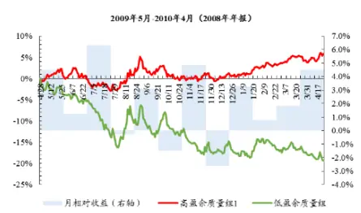

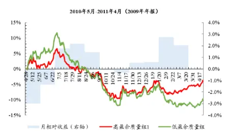

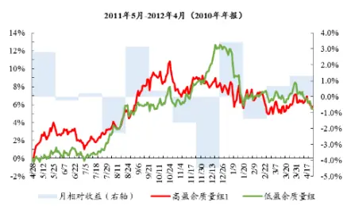

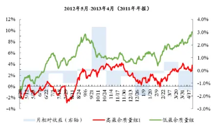

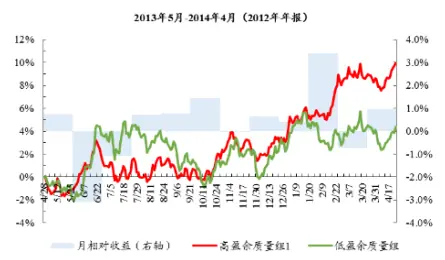

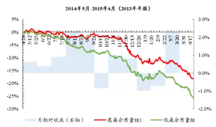

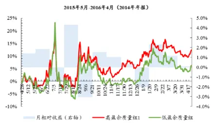
数据来源：Wind、国泰君安证券研究

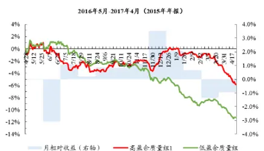

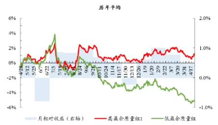

使用代理变量ACC2将全市场标的按上述规则分为高盈余质量组1与低盈余质量组，每年在半年报发布期前后（7-9月），高盈余质量组 1相对于低盈余质量组的收益均较稳定。半年报发布期前后相对胜率为 87.5%，相对收益平均为 1.92%；观察其他月份的分组比较结果，胜率及相对收益均较低，其中 5 月份相对胜率 25%，相对收益平均为-0.64%，6 月份相对胜率37.5%，相对收益平均为-1.14%。

图 3ACC2-高盈余质量组1半年报期相对胜率 87.5%
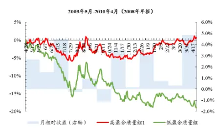

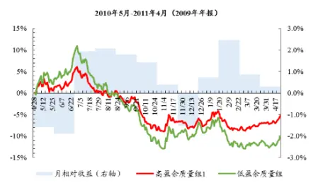

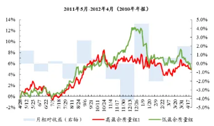

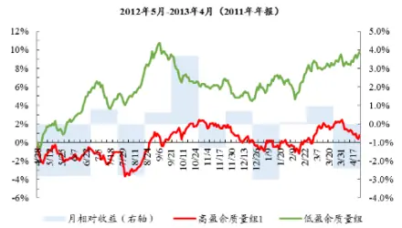

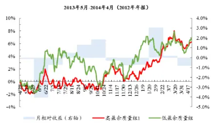

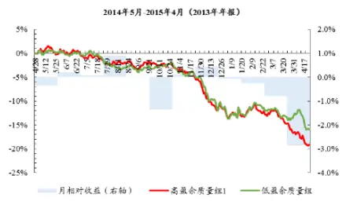

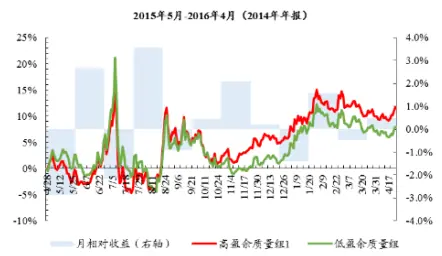
数据来源：Wind、国泰君安证券研究

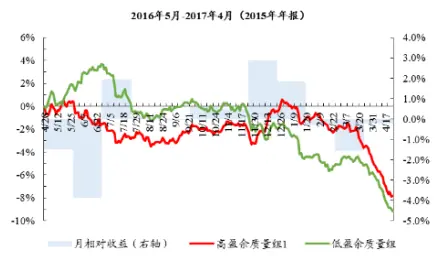

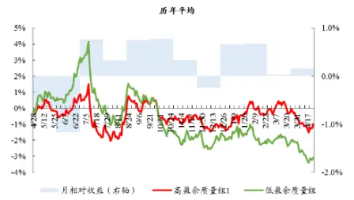

使用代理变量ACC1将全市场标的按上述规则分为高盈余质量组2与低盈余质量组，每年在半年报发布期前后（7-9 月）以及年报发布期前后（次年1-4月），高盈余质量组 2相对于低盈余质量组的收益均较稳定。其中半年报发布期前后相对胜率为 75%，相对收益平均为 3.07%，年报发布期前后相对胜率为 87.5%，相对收益平均为 3.90%；观察其他月份的分组比较结果，胜率及相对收益均较低，其中 6 月份相对胜率仅为12.5%，相对收益平均为-1.68%。

图 4ACC1-高盈余质量组2半年报期相对胜率 75%，年报期相对胜率 87.5%
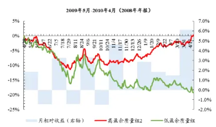

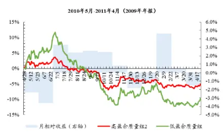

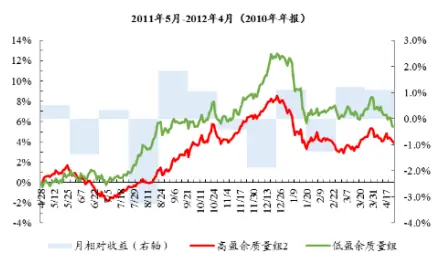

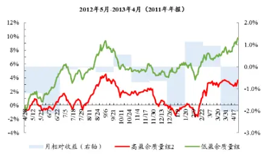

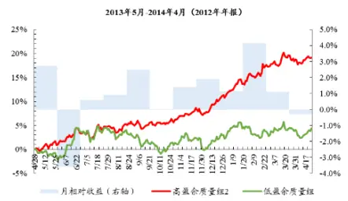

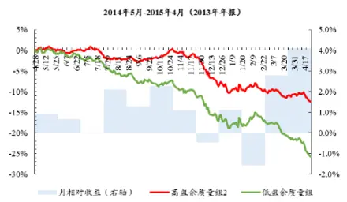

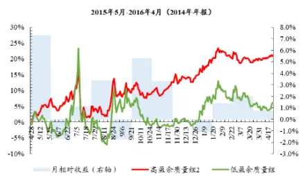
数据来源：Wind、国泰君安证券研究

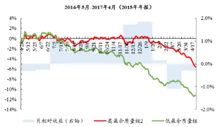

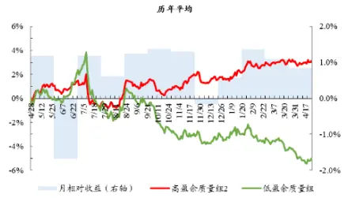

使用代理变量ACC2将全市场标的按上述规则分为高盈余质量组2与低盈余质量组，每年在半年报发布期前后（7-9 月）以及年报发布期前后（次年1-4月），高盈余质量组 2相对于低盈余质量组的收益均较稳定。其中半年报发布期前后相对胜率为 75%，相对收益平均为 3.12%，年报发布期前后相对胜率为 75%，相对收益平均为 2.41%；观察其他月份的分组比较结果，胜率及相对收益均较低，其中6月份相对胜率仅为 25%，相对收益平均为-0.92%。

图 5ACC2-高盈余质量组2半年报期相对胜率 75%，年报期相对胜率 75%
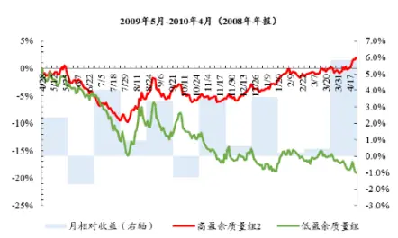

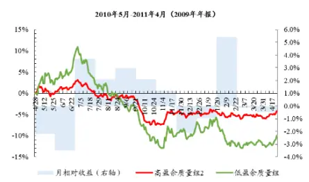

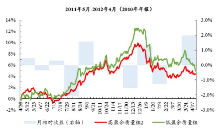

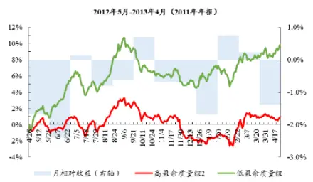

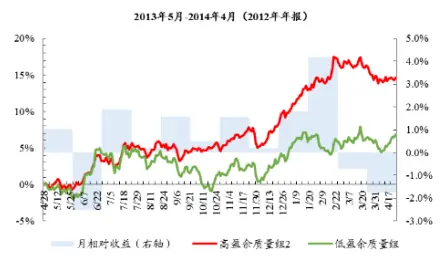

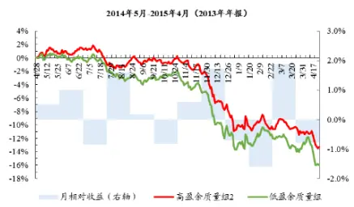

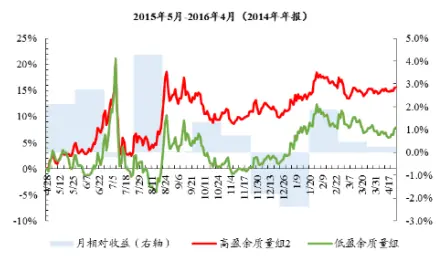
数据来源：Wind、国泰君安证券研究

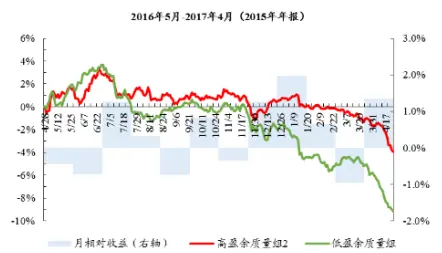

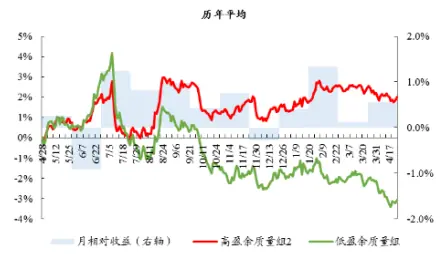

分年度观察低盈余质量组标的的行业分布，无论是通过利润表计算的ACC1还是通过资产负债表计算的 ACC2划分，低盈余质量组标的均主要集中在房地产、机械、医药、基础化工以及计算机行业。全时期看，没有行业能够长期维持在20%以上的占比，除了房地产、机械、医药、基础化工以及计算机行业以外，分布均较为均匀，对于煤炭、钢铁等周期行业，低盈余质量标的较少，占比较低，家电、餐饮旅游等消费行业，低盈余质量标的也较少，单个行业占比均低于2%。

图 6ACC低盈余质量组标的主要集中在房地产、机械、医药、基础化工以及计算机行业

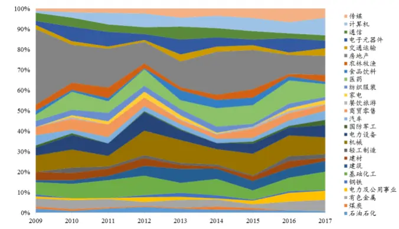
数据来源：国泰君安证券研究

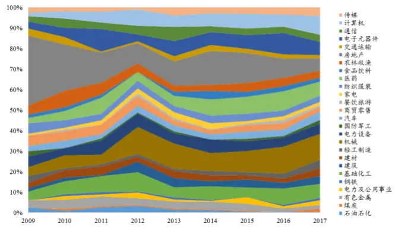

## 3.2.1.2. 应计盈余管理

通过“应计盈余管理”模型构造代理变量DAC，将全市场标的划分成低盈余质量组与高盈余质量组进行投资收益的比较与分析。对于低盈余质量组的构建，我们选取 DAC 较大的标的；对于高盈余质量组的构建，与上一小节应计利润模型类似，我们分别选取DAC较小以及 DAC 绝对值较小的标的，具体的构建方法见下表：

表 6: 应计盈余管理分组构建方法

| 分组名称 | 分组方式 | 年平均标的数 |
| --- | --- | --- |
| 低盈余质量组 | 全市场标的按DAC从小到大排序等分为10组，选取第10组作为 低盈余质量组 | 220 |
| 高盈余质量组1 | 全市场标的按DAC从小到大排序等分为10组，选取第1组作为高 盈余质量组 | 220 |
| 高盈余质量组2 | 全市场标的按DAC的绝对值从小到大排序等分为10组，选取第1 组作为高盈余质量组 | 220 |

数据来源：国泰君安证券研究

每年在半年报发布期前后（7-9月）以及年报发布期前后（次年1-4月），高盈余质量组1相对于低盈余质量组的收益均有稳定收益。其中半年报发布期前后相对胜率为 87.5%，相对收益平均为 2.18%，年报发布期前后相对胜率为87.5%，相对收益平均为2.06%。

图 7DAC高盈余质量组1半年报期相对胜率 87.5%，年报期相对胜率 87.5%
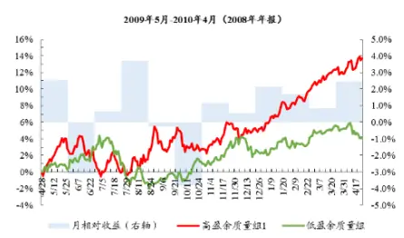

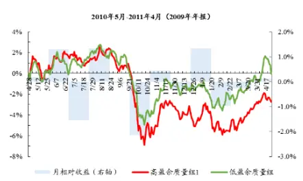

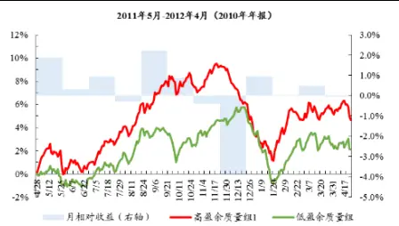

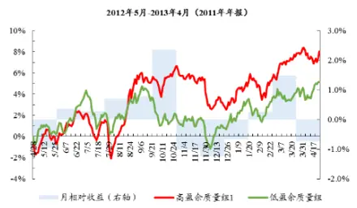

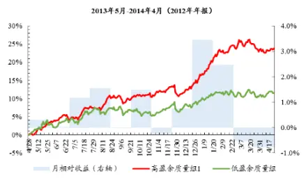

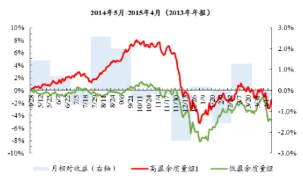

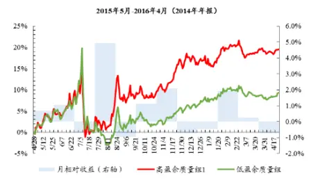
数据来源：Wind、国泰君安证券研究

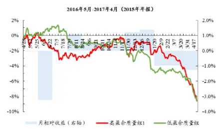

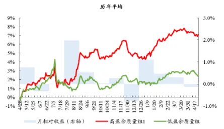

每年在半年报发布期前后（7-9月）以及年报发布期前后（次年1-4月），高盈余质量组2相对于低盈余质量组的收益均较稳定。其中半年报发布期前后相对胜率为 87.5%，相对收益平均为 2.49%，年报发布期前后相对胜率为75%，相对收益平均为 1.58%。

图 8DAC-高盈余质量组2半年报期相对胜率 87.5%，年报期相对胜率 75%
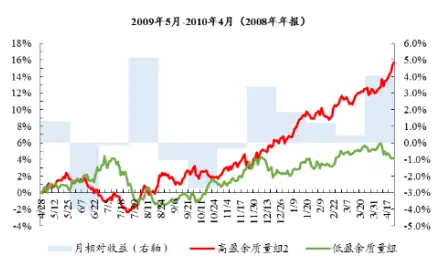

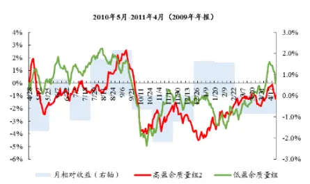

数据来源：Wind、国泰君安证券研究

与ACC1（ACC2）低盈余质量标的行业分布类似，DAC低盈余质量标的主要集中在房地产、机械、基础化工等行业。通过观察下表可以发现，所有行业长期占比均不超过 20%，主要集中于房地产、机械、基础化工等行业，但存在逐年收窄的趋势。

图 9DAC低盈余质量组标的主要集中在房地产、机械、基础化工行业

数据来源：国泰君安证券研究

## 3.2.1.3. 真实盈余管理

通过“真实盈余管理”模型构造代理变量REM，将全市场标的划分成低盈余质量组与高盈余质量组进行投资收益的比较与分析。对于低盈余质量组的构建，我们选取 REM 较大的标的；对于高盈余质量组的构建，与上述模型类似，我们选取REM较小以及REM绝对值较小的标的，具体的构建方法见下表：

表 7: 真实盈余管理分组构建方法

| 分组名称 | 分组方式 | 年平均标的数 |
| --- | --- | --- |
| 低盈余质量组 | 全市场标的按REM从小到大排序等分为10组，选取第10组作为 低盈余质量组 | 176 |
| 高盈余质量组1 | 全市场标的按REM从小到大排序等分为10组，选取第1组作为高 盈余质量组 | 176 |
| 高盈余质量组2 | 全市场标的按REM的绝对值从小到大排序等分为10组，选取第1 组作为高盈余质量组 | 176 |

数据来源：国泰君安证券研究

每年高盈余质量组 1相对于低盈余质量组的收益均不稳定。导致这样结果的原因可能是，通过真实盈余管理模型构造的 REM 为负时，其经济意义不如REM为正时明确，REM 为负时并不能很好地反映上市公司通过真实活动“藏利润”的行为，所以经过第一种分组方式检验后，REM并不是一个“投资传导”有效的指标，接下来我们将考察第二种分组方式的有效性。

## 图 10REM-高盈余质量组 1半年报期及年报期胜率收益均不稳定

数据来源：Wind、国泰君安证券研究

每年在下一年报发布期前后（次年 1-4月），高盈余质量组 2相对于低盈余质量组具有稳定收益。下一年报发布期前后高盈余质量组相对胜率为75%，相对收益平均为1.32%，说明REM对于通过第二种方式分组的标的“投资传导”过程较为有效。

图 11REM-高盈余质量组2年报期相对胜率 75%

数据来源：Wind、国泰君安证券研究

与上述 ACC1（ACC2）、DAC 等低盈余质量标的行业分布不同的是，REM低盈余质量标的主要集中在医药、商贸零售等消费行业。从REM低盈余质量标的的行业分布情况来看，医药行业占比较大，在后文我们将做行业中性处理，从每个行业中选取高低盈余质量标的对比收益，以消除行业分布不均匀的影响。

图 12REM低盈余质量组标的主要集中医药、商贸零售等消费行业

数据来源：国泰君安证券研究

## 3.2.1.4. M-Score

通过“M-Score”模型构造代理变量 M-Score，将全市场标的划分成低盈余质量组与高盈余质量组进行投资收益的比较与分析。对于低盈余质量组，我们选取M-Score较大的标的；对于高盈余质量组，我们分别选取M-Score较小的标的，具体的构造方法见下表：

表 8: M-Score 分组构建方法

| 分组名称 | 分组方式 | 年平均标的数 |
| --- | --- | --- |
| 低盈余质量组 | 全市场标的按M-Score从小到大排序等分为10组，选取第10组作 为低盈余质量组 | 267 |
| 高盈余质量组 | 全市场标的按M-Score从小到大排序等分为10组，选取第1组作为 高盈余质量组 | 267 |

数据来源：国泰君安证券研究

质量组具有稳定收益。下一年报发布期前后高盈余质量组相对胜率为75%，相对收益平均为 1.77%。

图 13M-Score-高盈余质量组年报期相对胜率 75%

数据来源：Wind、国泰君安证券研究

与 ACC1（ACC2）、DAC 低盈余质量标的行业分布类似，M-Score 低盈余质量标的主要集中在房地产、机械、基础化工等行业。通过观察下表可以发现，所有行业长期占比均不超过20%，与ACC1（ACC2）、DAC低盈余质量标的行业分布相类似，主要集中于房地产、机械、基础化工、医药等行业。

图 14M-Score低盈余质量组标的主要集中房地产、机械等行业

数据来源：国泰君安证券研究

## 3.2.2. 其他“业绩传导”检验显著的代理变量

## 3.2.2.1. C-Score

通过“C-Score”模型构造代理变量 C-Score，将全市场标的划分成低盈余质量组与高盈余质量组进行投资收益的比较与分析。对于低盈余质量组，我们选取 C-Score 较小的标的；对于高盈余质量组，我们分别选取C-Score较大的标的，具体的构造方法见下表：

表 9: C-Score 分组构建方法

| 分组名称 | 分组方式 | 年平均标的数 |
| --- | --- | --- |
| 低盈余质量组 | 全市场标的按C-Score从小到大排序等分为10组，选取第1组作为 | 267 |
|  | 低盈余质量组 全市场标的按C-Score从小到大排序等分为10组，选取第10组作 |  |
| 高盈余质量组 | 为高盈余质量组 | 267 |

数据来源：国泰君安证券研究

对每年高低盈余质量组标的的收益计算叠加平均值，结果见下图，从中可以发现，年报公布后至下一年报公布之间的所有月份，高盈余质量组相对于低盈余质量组的收益均不稳定。

图 15 C-Score 分组表现不稳定

数据来源：Wind、国泰君安证券研究

## 3.2.2.2. Benford’s Law

通过“Benford’s Law”模型构造代理变量BFL，将全市场标的划分成低盈余质量组与高盈余质量组进行投资收益的比较与分析。对于低盈余质量组，我们选取BFL较大的标的；对于高盈余质量组，我们分别选取 BFL较小的标的，具体的构造方法见下表：

表 10: BFL 分组构建方法

| 分组名称 | 分组方式 | 年平均标的数 |
| --- | --- | --- |
| 低盈余质量组 | 全市场标的按BFL从小到大排序等分为10组，选取第10组作为低 盈余质量组 | 135 |
| 高盈余质量组 | 全市场标的按BFL从小到大排序等分为10组，选取第1组作为高 盈余质量组 | 135 |

数据来源：国泰君安证券研究

对每年高低盈余质量组标的的收益计算叠加平均值，结果见下图，从中可以发现，年报公布后至下一年报公布之间的所有月份，高盈余质量组相对于低盈余质量组的收益均不稳定。

图 16BFL分组收益不稳定

数据来源：Wind、国泰君安证券研究

## 3.2.2.3. 值得关注的代理变量：利润平滑

从上文利润平滑模型的介绍中，我们知道学术界对利润平滑利弊的争论不一。在上一部分“业绩传导”检验中，利润平滑也并不是一个检验显著的代理变量，所以我们需要重点关注利润平滑模型构造的代理变量，探究其是否会影响标的股价的表现。对此，我们选用“利润平滑”模型构造代理变量 SM2（应计分离角度），将全市场标的划分成低盈余质量组与高盈余质量组进行投资收益的比较与分析。对于平滑组，我们选取SM2较小的标的；对于未平滑组，我们分别选取 SM2 较大的标的，具体的构造方法见下表：

表 11: SM2分组构建方法

| 分组名称 | 分组方式 | 年平均标的数 |
| --- | --- | --- |
| 平滑组 | 全市场标的按SM2从小到大排序等分为10组，选取第1组作为低 盈余质量组 | 160 |
| 未平滑组 | 选取 SM2 大于 0 的标的 | 83 |

数据来源：国泰君安证券研究

对每年平滑组与未平滑组标的的收益计算叠加平均值，结果见下图，从中可以发现，从下一半年报公布后至年报公布之间的所有月份，平滑组相对于未平滑组均表现较好，下一半年报期前后（7-9 月）平滑组可获得相对收益1.76%，胜率 80%，年报期前后（次年 1-4 月）平滑组可获得相对收益2.97%，胜率 80%。这说明了利润平滑一定程度上向市场传递了较为稳定的信息，有助于投资者对企业未来业绩进行合理预期。

图 17SM2平滑组半年报期、年报期相对胜率 80%

数据来源：Wind、国泰君安证券研究

## 3.2.3. “投资传导”检验总结

通过统计代理变量与投资收益之间的关系可以发现，“业绩传导”检验显著的代理变量，对于“投资传导”检验仍然比较有效，通过 ACC、DAC、REM（分组 2）及 M-Score 划分的高盈余质量组相对于低盈余质量组的胜率大部分在75%以上，收益大部分在 1%以上，这 4个代理变量对于盈余质量投资是比较有效的指标，可考虑使用这4个有效代理变量构建相关盈余质量投资策略；此外，通过利润平滑代理变量 SM2划分的平滑组相对于未平滑组的胜率为 80%，收益平均为2%左右。

表 12: 代理变量 ACC、DAC、REM（分组 2）与 M-Score 对于盈余质量投资较为有效

| “业绩传导”检 验结果 | 代理变量 | 半年报期（7-9月） |  | 年报期（次年1-4月） |  |
| --- | --- | --- | --- | --- | --- |
|  |  | 胜率 | 相对收益 | 胜率 | 相对收益 |
| 显著 | ACC1-分组1 | 75% | 2.75% | 88% | 2.91% |
|  | ACC1-分组2 | 88% | 1.92% | 63% | 1.48% |
|  | ACC2-分组1 | 75% | 3.07% | 88% | 3.90% |
|  | ACC2-分组2 | 75% | 3.12% | 75% | 2.41% |
|  | DAC-分组1 | 88% | 2.49% | 75% | 1.58% |
|  | DAC-分组 2 | 88% | 2.18% | 88% | 2.06% |
|  | REM-分组 1 | 63% | 1.35% | 50% | -1.30% |
|  | REM-分组2 | 63% | 0.80% | 75% | 1.32% |
|  | M-Score | 63% | 0.81% | 75% | 1.77% |
| 不显著 请务必阅读正文之后的免责条款部分 | C-Score | 75% | 0.90% | 50% | -0.37% 25 of 33 |

| BFL | 14% | -2.12% | 43% | 0.05% |
| --- | --- | --- | --- | --- |
| SM2 | 80% | 1.76% | 80% | 2.97% |

数据来源：Wind、国泰君安证券研究

## 3.3.再探“业绩传导”与“投资传导”过程

通过上述研究，我们知道通过代理变量ACC、DAC、REM 以及 M-Score筛选出的低盈余质量标的的行业分布并不均匀，一方面是因为我们建立的检验模型并不一定适用于所有的行业；另一方面是因为我们的代理变量很多是通过分行业分析与计算得到的，将其用于不同行业比较可能会有所偏误。对此，我们需要再探“业绩传导”与“投资传导”过程，对上述4个有效代理变量进行更加深入的研究：

- 首先，从行业入手，细化“业绩传导”过程检验，对不同行业的检验有效性加以区分，以寻找模型适用的行业；

- 其次，对于这些“业绩传导”过程检验有效的行业，分行业筛选高低盈余质量标的，以消除跨行业比较可能带来的偏误（有效行业中性）。

试想，在通过深入分析加强了“盈余质量-未来业绩-投资收益”的逻辑传导链后，上述有效盈余质量代理变量应该能够进一步提升盈余质量投资收益。

ACC、DAC、REM反映的盈余质量好坏对大部分行业标的的未来业绩有显著影响，M-Score 则表现稍差。使用“业绩推导”检验方程式分行业（中信一级除金融、综合外的 26 个行业）检验ACC、DAC、REM以及M-Score 四个代理变量在各行业的适用程度，即检验四个代理变量所反映的盈余质量好坏是否能够显著影响这 26 个行业中企业的未来业绩。经过检验，我们发现ACC1 对有色金属、钢铁等17个行业适用，ACC2对有色金属、建材等13个行业适用，DAC 对有色金属、基础化工等 15个行业适用，REM 对有色金属、电力及公用事业等 17 个行业适用，M-Score对钢铁、基础化工等 8个行业适用。

表 13: 分行业检验结果

| 行业名称 | ACC1 | ACC2 | DAC | REM | M-Score |
| --- | --- | --- | --- | --- | --- |
| 石油石化 | -0.70 | -0.02 | 0.72 | -1.13 | 0.58 |
| 煤炭 | -0.96 | 0.27 | -0.67 | -0.21 | -1.99 |
| 有色金属 | -5.41 | -5.19 | -4.40 | -4.72 | -0.01 |
| 电力及公用事业 | -0.81 | -0.85 | -0.92 | -2.82 | 0.60 |
| 钢铁 | -2.73 | -1.06 | -1.39 | -2.76 | -2.34 |
| 基础化工 | -4.05 | -0.52 | -3.56 | -1.85 | -2.21 |
| 建筑 | -1.67 | -1.15 | -0.97 | -2.66 | 1.02 |
| 建材 | -3.18 | -3.15 | -3.13 | -2.60 | -1.26 |
| 轻工制造 | -1.29 | -0.04 | -2.33 | -1.93 | -0.39 |
| 机械 | -7.25 | -3.62 | -5.85 | -5.46 | -1.40 |
| 电力设备 | -6.59 | -4.91 | -5.73 | -4.71 | -1.82 |
| 国防军工 | -1.99 | -2.45 | -1.75 | -2.19 | -2.62 |
| 汽车 | -3.64 | -2.08 | -3.48 | -3.18 | -2.41 |
| 商贸零售 | -4.51 | -3.00 | -4.83 | -1.36 | -0.63 |
| 餐饮旅游 | -1.44 | -0.20 | -1.80 | -0.70 | -0.85 |
| 家电 | -3.21 | -4.52 | -3.67 | -3.29 | -2.45 |
| 纺织服装 | -2.83 | 0.04 | -2.57 | -2.06 | -0.92 |
| 医药 | -2.21 | -2.00 | -1.58 | -4.55 | -1.02 |
| 食品饮料 | -4.60 | -3.19 | -3.04 | -2.69 | -4.21 |
| 农林牧渔 | -3.64 | -3.83 | -2.17 | -4.84 | -2.00 |
| 房地产 | -4.57 | -3.91 | -3.97 | -1.97 | 0.12 |
| 交通运输 | -2.47 | -1.23 | -2.21 | -3.74 | -1.19 |
| 电子元器件 | -0.93 | -0.87 | -0.29 | -2.86 | 0.44 |
| 通信 | -2.47 | 0.50 | -1.85 | -3.13 | -1.81 |
| 计算机 | -3.53 | -0.91 | -3.74 | -1.61 | -1.65 |
| 传媒 | -0.05 | -0.03 | -1.03 | -1.46 | -2.94 |

数据来源：Wind、国泰君安证券研究

通过代理变量ACC1、DAC、M-Score筛选的高低盈余质量两组标的的相对收益在进入下一半年报期后到年报期结束均表现稳定。通过代理变量 ACC、DAC、REM 以及 M-Score 在上一步“业绩推导”检验步骤有效的行业中按盈余质量高低各选排名靠前与靠后的5支标的构建高低盈余质量对照组，发现通过 ACC1、DAC、M-Score 构造的对照组进入半年报期后相对收益均表现稳定，通过 REM 构造的高盈余质量组 2 相对于低盈余质量组的收益在进入年报期后表现稳定。

图 18 ACC1、DAC、M-Score 构造的高盈余质量组自半年期开始均具有出稳定的相对收益

数据来源：Wind、国泰君安证券研究

代理变量有效性：DAC>ACC1>REM>M-Score。观察具体的统计结果，DAC 是最好的盈余质量代理变量，与有效行业中性处理前相比较，其相对收益在相对胜率变化较小的情况下有显著提升，其次是代理变量ACC1；REM与 M-Score的有效性同样得到了小幅提升。通过DAC划分的高盈余质量组1相对于低盈余质量组在半年报期的胜率为 75%，相对收益平均为 3.64%，相较于有效行业中性处理前提升了 1.16%；在年报期的相对胜率为 88%，相对收益平均为 3.41%，相较于有效行业中性处理前提升了1.83%。

表 14: 代理变量有效性：DAC>ACC1>REM>M-Score

| 代理变量 | 有效行业 | 年报期（次年1-4 半年报期（7-9月） |  |
| --- | --- | --- | --- |
|  |  | 胜率相对收益 | 月） 胜率相对收益 |
| ACC1-1 | 有色金属、钢铁、基础化工、建材、机械、电力设 | 88% 2.60% | 88% 2.47% |

| ACC1-2 | 备、汽车、商贸零售、家电、纺织服装、医药、食 品饮料、农林牧渔、房地产、交通运输、通信、计88% |  | 2.40% | 88% | 3.02% |
| --- | --- | --- | --- | --- | --- |
| ACC2-1 | 算机（共17个） 有色金属、建材、机械、电力设备、国防军工、汽25% |  | -0.45% | 88% | 2.82% |
| ACC2-2 | 车、商贸零售、家电、医药、食品饮料、农林牧渔、 房地产、交通运输（共13个） | 38% | -0.10% | 75% | 2.20% |
| DAC-1 | 有色金属、基础化工、建材、轻工制造、机械、电 力设备、汽车、商贸零售、家电、纺织服装、食品 | 75% | 3.64% | 88% | 3.41% |
| DAC-2 | 饮料、农林牧渔、房地产、交通运输、计算机（共75% 15个） |  | 2.01% | 75% | 2.75% |
| REM-1 | 有色金属、电力及公用事业、钢铁、建筑、建材、 机械、电力设备、国防军工、汽车、家电、纺织服 | 63% | 1.11% | 50% | -0.50% |
| REM-2 | 装、医药、食品饮料、农林牧渔、交通运输、电子63% 元器件、通信（共17个） |  | 0.90% | 88% | 2.94% |
| M-Score | 钢铁、基础化工、国防军工、汽车、家电、食品饮 料、农林牧渔、传媒（共8个） | 75% | 1.18% | 75% | 2.85% |

数据来源：Wind、国泰君安证券研究

## 3.4. 策略应用

在上一部分中，我们通过“业绩传导”与“投资传导”两部分检验得到了 4个比较有效的盈余质量代理变量： DAC、ACC、REM与 M-Score，并对它们在下一半年报期、年报期以及全年的投资收益表现做了详尽的统计研究。那么如何使用这4 个指标构建更高收益的盈余质量投资策略，我们尝试从两个不同方面入手：

- 指标组合：从上述 4 个代理变量中选取指标进行组合，旨在通过组合指标筛选出盈余质量更高的标的，以获得更高的投资收益。

- 事件组合：当标的触发“盈余阈值”事件时，通过考察期盈余质量好坏，区分“真成长”与“假成长”，通过投资盈余质量更高的标的，获得“真成长股”的长期收益。

## 3.4.1. 指标组合

尝试选用从两个不同角度构建的盈余质量代理变量 DAC 与 REM 来构造指标组合，DAC 代表了会计操纵角度，REM 代表了真实活动操纵角度，试想两者的组合应该能够全面地考察上市公司的盈余质量，从而筛选出盈余质量更高的标的，获得更高的投资收益。具体步骤如下：

- 首先，由于REM为负值时缺乏经济意义与检验稳定性，我们将REM大于0的标的按REM从小到大的顺序等分成三组；

- 其次，对上一步骤每组标的分别按DAC从小到大等分成 10 组，取DAC 指标最小的一组和最大的一组分别作为高盈余质量组与低盈余质量组进行收益统计比较。

检验结果如下图，低 REM 的高盈余质量组全年平均超额收益为11.65%，中 REM的高盈余质量组全年超额收益平均为 8.20%，高 REM的高盈余质量组全年超额收益平均为 4.15%，可见通过“低 REM+低DAC”构造的高盈余质量组的全年收益有了进一步提升。

图 19 低 REM+低 DAC 全年超额收益 11.65%

数据来源：Wind、国泰君安证券研究

分组观察相对收益，低REM组全年相对收益更加稳定，2009年至2017年高盈余质量组相比于低盈余质量组全年胜率 100%，相对收益为13.59%。

表 15: 低REM组全年收益更加稳定

| 分组 | 平均标的数 | 半年报期（7-9月） |  | 年报期（次年1-4月） |  | 全年（5-次年4月） |  |
| --- | --- | --- | --- | --- | --- | --- | --- |
|  |  | 胜率 | 相对收益 | 胜率 | 相对收益 | 胜率 | 相对收益 |
| 低REM | 30 | 100% | 5.05% | 63% | 3.59% | 100% | 13.59% |
| 中REM | 30 | 38% | 1.15% | 88% | 5.13% | 75% | 8.84% |
| 高 REM | 30 | 38% | 0.33% | 50% | 0.75% | 63% | 2.09% |

数据来源：Wind、国泰君安证券研究

## 3.4.2. 事件组合

观察2009年至今A 股所有上市公司年报公布的ROE 分布情况，可以发现样本出现在[0,2)区间的频率相比于[-2,0)区间出现了突变，随后样本频率在[2,6)区间出现一定下滑后，在[6,8)区间反向上升，达到了峰值；而对于其他区间，样本分布均展现了良好的单调性，分布较为平滑。这种分布的突变、异变很可能是由于上市公司为了达到某种“盈余阈值”而进行了管理、操作所致。

图 20 “盈余阈值”：区间[0,2)突变、区间[6,8)异变

数据来源：Wind、国泰君安证券研究

类似于上述“盈余阈值”，市场中存在着许多不同类型的“盈余阈值”，对此我们按照需求不同可以归纳为以下四类：

- “微盈微增”：微弱盈利（避免亏损）以及微弱增长（避免下滑），上文举例ROE分布在[0,2)区间处出现突变即可归类于此类事件；

- “预期管理”：略超分析师盈利预测；

- “承诺对赌”：刚好完成并购重组、股权激励等业绩承诺以及对赌协议（包括管理层对赌、薪资激励等）；

- “融资并购”：刚好达到发行条件，例如发行可转债要求最近三个会计年度加权平均资产收益率平均不低于 6%（净利润扣非前后取低值），上文举例 ROE 分布在[6,8)区间处出现异变即可归类于此类事件。

若标的的业绩增长到刚好进入“盈余阈值”，则称之为其触发了“盈余阈值”事件。对于触发“盈余阈值”事件的标的，可以通过考察其盈余质量好坏，区分“真上线”与“假上线”从而区分“真成长”与“假成长”，通过投资盈余质量更高的标的，获得“真成长股”的长期收益。

图 21 “盈余阈值”事件组合构建思路

数据来源：国泰君安证券研究

在此，我们属于“盈余阈值”事件的“扭亏为盈”事件进行盈余质量检验以及收益统计分析，具体步骤如下：

- 首先，选取标的样本，“扭亏为盈”标的的选取需要满足以下两个条件：上期营业利润小于 0，本期营业利润/全年平均总资产处于[0,0.01)之间；

- 其次，选用代理变量DAC对“扭亏为盈”标的的盈余质量进行检验：将标的按DAC数值从小到大等分为 3组，取DAC指标最小的一组和最大的一组分别作为高盈余质量组与低盈余质量组进行收益统计比较。

检验结果如下图，高盈余质量组全年平均超额收益为 13.06%。在下一半年报期（7-9 月）及年报期（次年 1-4 月），高盈余质量组相对于低盈余质量组有明显收益，而其他时间段两者收益并无明显差异，这进一步说明了盈余质量代理变量的有效性：本期年报发布完时，所有“扭亏为盈”的标的对于市场来说是同质的，“盈余质量”高低的信息并没被充分反映在市场预期中，高低盈余质量标的的投资收益并未明显差异，直到下一期财务数据公布时，不同“盈余质量”的标的出现了分化，低盈余质量标的业绩变脸不达预期，高盈余质量标的业绩持续增长，从而导致投资收益在财报期出现了明显的分化。

图 22 “扭亏为盈”高盈余质量组全年平均超额收益 13.06%

数据来源：Wind、国泰君安证券研究

具体观察相对收益，全年高盈余质量组相对于低盈余质量组的胜率为75%，收益为9.47%，分不同时间段看，高盈余质量组半年报期相比于年报期的胜率更高，年报期相比于半年报期的收益更高。

表 16: 高盈余质量组相对胜率75%，相对收益9.47%

| 平均标的数 | 半年报期（7-9月） |  | 年报期（次年1-4月） |  | 全年（5-次年4月） |  |
| --- | --- | --- | --- | --- | --- | --- |
|  | 胜率 | 相对收益 | 胜率 | 相对收益 | 胜率 | 相对收益 |
| 15 | 75% | 3.16% | 63% | 5.28% | 75% | 9.47% |

数据来源：Wind、国泰君安证券研究

## 本公司具有中国证监会核准的证券投资咨询业务资格

## 分析师声明

作者具有中国证券业协会授予的证券投资咨询执业资格或相当的专业胜任能力，保证报告所采用的数据均来自合规渠道，分析逻辑基于作者的职业理解，本报告清晰准确地反映了作者的研究观点，力求独立、客观和公正，结论不受任何第三方的授意或影响，特此声明。

## 免责声明

本报告仅供国泰君安证券股份有限公司（以下简称“本公司”）的客户使用。本公司不会因接收人收到本报告而视其为本公司的当然客户。本报告仅在相关法律许可的情况下发放，并仅为提供信息而发放，概不构成任何广告。

本报告的信息来源于已公开的资料，本公司对该等信息的准确性、完整性或可靠性不作任何保证。本报告所载的资料、意见及推测仅反映本公司于发布本报告当日的判断，本报告所指的证券或投资标的的价格、价值及投资收入可升可跌。过往表现不应作为日后的表现依据。在不同时期，本公司可发出与本报告所载资料、意见及推测不一致的报告。本公司不保证本报告所含信息保持在最新状态。同时，本公司对本报告所含信息可在不发出通知的情形下做出修改，投资者应当自行关注相应的更新或修改。

本报告中所指的投资及服务可能不适合个别客户，不构成客户私人咨询建议。在任何情况下，本报告中的信息或所表述的意见均不构成对任何人的投资建议。在任何情况下，本公司、本公司员工或者关联机构不承诺投资者一定获利，不与投资者分享投资收益，也不对任何人因使用本报告中的任何内容所引致的任何损失负任何责任。投资者务必注意，其据此做出的任何投资决策与本公司、本公司员工或者关联机构无关。

本公司利用信息隔离墙控制内部一个或多个领域、部门或关联机构之间的信息流动。因此，投资者应注意，在法律许可的情况下，本公司及其所属关联机构可能会持有报告中提到的公司所发行的证券或期权并进行证券或期权交易，也可能为这些公司提供或者争取提供投资银行、财务顾问或者金融产品等相关服务。在法律许可的情况下，本公司的员工可能担任本报告所提到的公司的董事。

市场有风险，投资需谨慎。投资者不应将本报告作为作出投资决策的唯一参考因素，亦不应认为本报告可以取代自己的判断。
在决定投资前，如有需要，投资者务必向专业人士咨询并谨慎决策。

本报告版权仅为本公司所有，未经书面许可，任何机构和个人不得以任何形式翻版、复制、发表或引用。如征得本公司同意进行引用、刊发的，需在允许的范围内使用，并注明出处为“国泰君安证券研究”，且不得对本报告进行任何有悖原意的引用、删节和修改。

若本公司以外的其他机构（以下简称“该机构”）发送本报告，则由该机构独自为此发送行为负责。通过此途径获得本报告的投资者应自行联系该机构以要求获悉更详细信息或进而交易本报告中提及的证券。本报告不构成本公司向该机构之客户提供的投资建议，本公司、本公司员工或者关联机构亦不为该机构之客户因使用本报告或报告所载内容引起的任何损失承担任何责任。

## 评级说明

## 1.投资建议的比较标准

投资评级分为股票评级和行业评级。

以报告发布后的12个月内的市场表现为比较标准，报告发布日后的 12个月内的公司股价（或行业指数）的涨跌幅相对同期的沪深 300 指数涨跌幅为基准。

## 2.投资建议的评级标准

报告发布日后的 12 个月内的公司股价（或行业指数）的涨跌幅相对同期的沪深 300 指数的涨跌幅。

| 评级 |  | 说明 |
| --- | --- | --- |
| 股票投资评级 | 增持 | 相对沪深 300指数涨幅15%以上 |
|  | 谨慎增持 | 相对沪深 300指数涨幅介于5%～15%之间 |
|  | 中性 | 相对沪深 300指数涨幅介于-5%～5% |
|  | 减持 | 相对沪深300指数下跌 5%以上 |
| 行业投资评级 | 增持 | 明显强于沪深 300 指数 |
|  | 中性 | 基本与沪深300指数持平 |
|  | 减持 | 明显弱于沪深300指数 |

## 国泰君安证券研究所

|  | 上海 | 深圳 | 北京 |
| --- | --- | --- | --- |
| 地址 | 上海市浦东新区银城中路168号上海 银行大厦29层 | 深圳市福田区益田路 6009 号新世界 商务中心34层 | 北京市西城区金融大街 28 号盈泰中 心2号楼10层 |
| 邮编 | 200120 | 518026 | 100140 |
| 电话 | （021)38676666 | (0755)23976888 | (010)59312799 |
|  | E-mail: gtjaresearch@gtjas.com |  |  |