inInfo] [Table_Title] 2017.12.24

# 基于时变波动率及跳扩散过程的期权定价

玉陈奥林（分析师）

刘富兵（分析师）

8 021-38674835

chenaolin@gtjas.com

021-38676673

证书编号 S0880516100001

liufubing008481@gtjas.com

S0880511010017

## 本报告导读：

## 摘要：

LRJ模型对股票分布的假设更为合理。模型既考虑股价连续变动的情况，同时加入Poisson跳扩散过程刻画由重大事件引起的股价突发性跳跃。

LRJ模型假设波动率为时变函数，更好反应由股票价格变动引起的波动率的变动，修正B-S模型恒定波动率的假设。

LRJ模型能够生成正向的隐含波动率偏斜，改进了B-S 模型深度实值或虚值期权，以及接近到期日的期权定价存在偏差。

基于时变波动率的跳扩散模型（LRJ）在当月、次月、季月合约上都有着不错的预测能力，其相对 BS 模型来说，精度显著提高。同时，LRJ模型的预测能力针对同一到期日，不同行权价的期权处于较为稳定的状态。尤其在近月合约和季月合约上，相较于BS 模型有显著的优势。

基于LRJ 模型的套利策略体现出稳定且显著的绝对收益。从 2015 年2月至2017年6月共计552 个交易日中，策略获得了876%的累加绝对收益。策略整体年化收益率 397%，信息比率1.63。

金融工程

## 金融工程团队：

刘富兵：（分析师）

电话：021-38676673

邮箱：liufubing008481@gtjas.com

证书编号：S0880511010017

## 陈奥林：（分析师）

电话：021-38674835

邮箱：chenaolin@gtjas.com

证书编号：S0880516100001

## 李辰：（分析师）

电话：021-38677309

邮箱：lichen@gtjas.com

证书编号：S0880516050003

## 孟繁雪：（分析师）

电话：021-38675860

邮箱：mengfanxue@gtjas.com

证书编号：S0880517040005

## 蔡旻昊：（研究助理）

电话：021-38674743邮箱：caiminhao@gtjas.com证书编号：S0880117030051

## 殷明：（研究助理）

电话：021-38674637邮箱：yinming@gtjas.com证书编号：S0880116070042

## 叶尔乐：（研究助理）

电话：021-38032032

邮箱：yeerle@gtjas.com

证书编号：S0880116080361

## 殷钦怡：（研究助理）

电话：021-38675855

邮箱：yinqinyi@gtjas.com

证书编号：S0880117060109

## [Tabl 相关报告e_R

《基于时变波动率的期权定价模型》2017.11.16

《盈余质量检验及其投资策略构建》2017.09.20

《抱团行为和慢牛股研究》2017.09.19

《基于二维收益分解的选股策略》2017.08.31

《基于弹簧模型的量价分析》2017.08.30

## 1. 前言

期权市场在中国处于萌芽阶段，就场内期权市场来看，50ETF期权上市已有2年多的时间，虽然规模相比股票现货来说有一定差距，但其流动性提升相当迅速，目前周成交量已超600万张。因此，尽早布局期权相关策略成为量化投资领域所关注的焦点

此前，由于 A股衍生品市场处于萌芽阶段，整个市场投资者结构较为单一，基本以机构和成熟的投资者为主。同时，市场流动性相对匮乏，资金容量有限。因此，期权方面的研究相对薄弱，且内容相对较为零散。然而，随着流动性的提升以及未来新品种的推进，市场将提高对期权市场的重视。

本文通过引入基于时变波动率及跳扩散过程的期权定价模型（LRJ），提高期权定价效率，并在此基础上构建日频交易策略。相对于 BS 模型来说，LRJ 模型能够更好的纳入个股时变波动和跳跃的特征，从而提高定价精度。此外，我们也希望以本文为基础，尝试为期权的学术研究策略化打下基础。

## 2. 基于时变波动率及跳扩散过程的期权定价模型

## 2.1. 上证 50ETF 指数基金特征

本文的主要研究对象为50ETF期权，其是目前唯一的场内期权品种，标的对应为华夏上证 50ETF。上证 50ETF 指数基金作为跟踪上证 50 指数的指数基金，其统计特征包含了股票指数一些常见的属性，例如厚尾性（Fat Tail）、偏斜（Skewness）、跳（Jump）、随机波动率（StochasticVolatility）等。图 1 和图 2 分别展示了 2005.02.23～2017.06.23 期间 50ETF收盘价以及其一阶差分的走势。可以看出，上证50的波动率极不稳定，变化具有很强的突发性，同时有显著的集聚特征。

图 1: 50ETF日内趋势时间序列
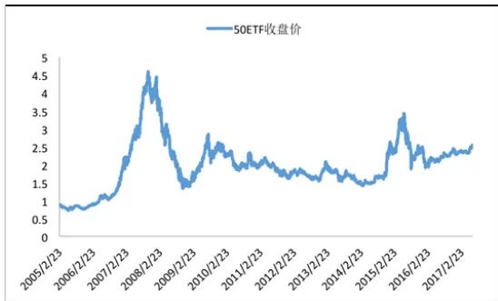
数据来源：国泰君安证券研究

图 2 ：50ETF 一阶差分序列
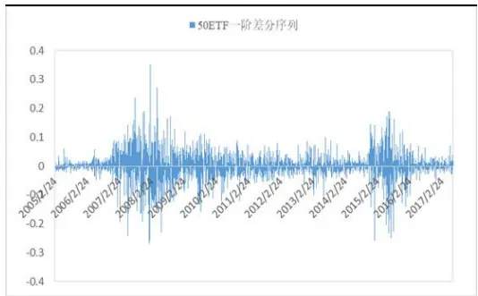
数据来源：国泰君安证券研究

另外，从 50ETF 指数基金的统计特征（表 1 所示）中我们可以发现，50ETF 的一阶差分的标准差为 0.0426，但在全部的 2999 个 50ETF 的一阶差分日数据样本中，一共存在 33 个与均值相差 4 倍标准差之外的数值，其比例超过了1.1%。换句话说，如果∆50ETF满足正态分布，这种情况发生的概率应该小于0.004%。同时，∆50ETF具有较高的偏度和峰度值。这些数据都验证了50ETF指数基金的收益厚尾性和跳跃的特征。

表 1:50ETF指数基金统计特征

| 50ETF | ∆50ETF |
| --- | --- |
| 均值 1.9906 | 0.0006 |
| 标准差 0.7113 | 0.0426 |
| 偏度 0.7898 | -0.3099 |
| 峰度 1.4528 | 8.0327 |

数据来源：Wind

## 2.2. B-S 模型

期权定价模型在近几年发展颇为迅速，然而，最经典的期权定价模型当数Black-Scholes模型，它奠定了期权定价理论的基础、推动了期权市场的发展，并广泛应用于衍生品市场中。整体上，Black-Scholes模型适用性较广，可理解性也较强，其能够有效的应用于期权等衍生工具的定价中。

具体来看，B-S 公式假设股票标的符合几何布朗运动：

$$
dlnS_{t}=\mu dt+\sigma dW_{t}
$$

在风险中性测度 $\mathbb{Q}_{\sf F}$ ，敲定价格为 $\mathrm{\ K}$ ，到期时间为 $\tau_{\sharp,\sharp}$ 欧式认购期权的定价公式为：

$$
C=S_{t}N(d_{1})-Ke^{-r(T-t)}N(d_{2})
$$

其 $\phi^{N(.)}$ 是标准正态累积分布函数。并且

$$
d_{1}=\frac{ln(\frac{S_{t}}{K})+(r+\frac{1}{2}\sigma^{2})(T-t)}{\sigma\sqrt{T-t}}
$$

$$
d_{2}=\frac{ln(\frac{S_{t}}{K})+(r-\frac{1}{2}\sigma^{2})(T-t)}{\sigma\sqrt{T-t}}
$$

虽然B-S 公式对期权定价存在较强的指导意义，但是该模型的假设前提过为苛刻，影响模型在实际应用中的可靠性，并不能完全刻画 50ETF期权的市场特征，主要表现在：

（1）B-S公式假设股价收益满足正态分布。这意味着股价是连续的。而在对50ETF统计特征的分析中，我们发现，实际情况下股价的收益不仅包括正态分布的情况，也包括由于重大事件而引起的突发状况造成的厚尾、跳跃等特征，B-S 模型没有考虑后者。

（2）B-S公式假定股票价格波动率不变。实际情况下，随着股票价格的上升，其波动率一般会上升，并非独立于股价水平。因此，理论波动率与实际波动率会有一定差距，从而影响模型的定价准确度。

（3）B-S 模型无法刻画深度实值和深度虚值期权的隐含波动率偏斜。B-S 对平值期权特别是到期时间在两个月以上的期权定价效果较好。但是对于深度实值或虚值期权，以及接近到期日的期权定价存在较大偏差。

## 2.3.基于时变波动率及跳扩散过程的期权定价模型

因此，针对B-S 公式的种种缺陷，我们提出基于时变波动率及跳扩散过程的期权定价模型。

假设股票标的符合如下随机过程

$$
dlnS_{t}=\mu_{t}dt+\sigma_{t}dW_{t}+JdN_{t}
$$

其中时变 $z=3$ 数 $\cdot\mu_{t}$ 是股票价格收益率期望值，时变函数 $\sigma_{t}$ 是 50ETF 指数的波动率函数， $N_{t}$ 是强度为λ的 Poisson 过程，跳幅 J 服从指数分布$\mathrm{J{\sim}Exp(\eta)}$

定义 $lnS_{t}$ 的条件特征函数如下：

$$
\varphi(T-t;s)=E_{t}^{\mathbb{Q}}[e^{islnS_{t}}]
$$

在风险中性测度 $\mathbb{Q}_{\sf T}$ ， $lnS_{t}$ 的条件特征函数具有如下显式形式：

$$
\varphi(T-t;s)=exp\{is(T-t)(\mu_{t}-\frac{1}{2}\sigma_{t}^{2})-\frac{1}{2}s^{2}\sigma_{t}^{2}(T-t)+\lambda(T-t)(\frac{\eta}{\eta-is})\}
$$

在风险中性测度 $\mathbb{Q}_{\sf F}$ ，敲定价格为 $\mathrm{.\Upsilon}\mathrm{K}_{\cdot}$ ，到期时间为 $\mathbb{T}_{\iota}$ 的欧式认购期权的定价公式为：

$$
C{=}S_{t}\varPi_{1}{-}Ke^{-r(T-t)}\varPi_{2}
$$

其中

$$
\varPi_{j}=\frac{1}{2}+\frac{1}{\pi}\int_{0}^{\infty}Re\{\frac{\varphi_{j}(s)e^{-i\varphi lnK}}{is}\}ds,\quad j=1,2
$$

$$
\varphi_{1}(T-t;s)=\frac{\varphi(T-t;s-i)}{\varphi(T-t,-i)},\qquad\varphi_{2}(T-t;s)=\varphi(T-t;s)
$$

相较于B-S 模型，基于时变波动率的跳扩散模型的优势在于

（1） 对股票分布的假设更为合理。模型既考虑股价连续变动的情况，同时加入Poisson跳扩散过程刻画由重大事件引起的股价突发性跳跃。

（2） 假设波动率为时变函数，更好反应由股票价格变动引起的波动率的变动，修正B-S 模型恒定波动率的假设。

（3） 基于时变波动率的跳扩散模型能够生成正向的隐含波动率偏斜，改进了 B-S 模型深度实值或虚值期权，以及接近到期日的期权定价存在偏差。

## 2.4. 模型比较

## 2.4.1. 2.4.1 参数校准

在此前基于时变波动率的跳扩散模型中，可以看到模型中有 4个参数，

分别为 $\mu_{t,}\sigma_{t,\lambda,\mathrm{~}\eta_{\mathfrak{c}}}$ 。在将模型应用于期权定价前，我们需要通过前一天期权的实际价格对参数进行估算。举例来说，如果我们预测 2017 年 2月 6 日期权价格，需要选择上一个交易日即 2017 年 2 月 3 日 50ETF 期权的收盘价作为校准数据。具体来看，2月3日50ETF收盘价为 2.342，同时，50ETF期权市场报价中包含 4种到期日期权，包括 2017年 02月22 日，2017 年 03 月 22 日，2017 年 06 月 28 日，2017 年 09 月 27 日。敲价范围在[2.05,2.5]之间。

在此基础上，考虑到期权流动性及定价的有效性，我们对于市场买入报价在[0,0.0001]深度虚值看涨期权，剔除这些报价数据。形成全部有效报价。如表 2 所示，我们对 2017 年 2 月 3 日 50ETF 看涨期权价格进行汇总和统计，包括数据处理过程。

表2：校正样本数据描述与处理

| 到期日 | 2017/2/22 | 2017/3/22 | 2017/6/28 | 2017/9/28 |
| --- | --- | --- | --- | --- |
| 全部报价 | 6 | 18 | 16 | 5 |
| 有效报价 | 6 | 18 | 16 | 5 |

注:

(“全部报价”表示 wind上该到期日全部的期权报价数目

“有效报价”表示该到期日买入报价为正的有效报价数目（剔除掉报价为[0,0.0001]之间的期权）)

为了校正样本具有更好的流动性和可靠度，我们删除了深度实值期权或者深度虚值期权的期权报价。只选择敲价范围在[2.25,2.4]之间的实值期权。

## 2.4.2. 目标函数

在模型校正过程中，通过最小化由模型价格与市场报价之间的误差构成目标函数，可以得到矫正参数。我们使用的目标函数是平均二次方差（Mean Square Error, MSE）函数，该目标函数表示所有样本期权市场报价与模型价格之间误差平方之和。对于每个期权到期日 $T_{i};$ ；假设有 $N_{i^{\prime}}$ 个市场报价 $\{C_{T_{i},K_{j}}^{Market}\}_{j=1}^{N_{i}}{}_{,\sharp}\oplus^{\{K_{j}\}_{j=1}^{N_{i}}}$ 是这些期权的执行价格，与这些期权

$$
\begin{array}{rl}&{\{C_{T_{i},K_{j}}^{Model}\}_{j=1}^{N_{i}}}\\&{\ast+\int_{-\infty}^{\infty}\dot{q}\{\dot{\gamma}\}_{l\infty}^{1+\infty}\frac{\dot{\gamma}_{l}^{3}}{2}\langle\dot{\beta}\rangle\dot{\mathcal{R}}\dot{\mathcal{R}}\dot{\mathcal{R}}\dot{\mathcal{R}}=\frac{\dot{\gamma}_{l}^{3}}{2}\langle\dot{\beta}\rangle\dot{\mathcal{R}}\dot{\mathcal{R}}\dot{\mathcal{R}}\dot{\mathcal{R}}\dot{\mathcal{R}}=0.}\end{array}
$$

$$
Loss^{MSE}=\sum_{j\ =1}^{N_{i}}(C_{T_{i},K_{j}}^{Market}\ -C_{T_{i},K_{j}}^{Model})^{2}
$$

利用梯度下降法求解最优参数。

## 2.4.3. 预测效果

利用上文估计参数，我们分别用基于时变波动率的跳扩散模型和B-S 模型对2017年 2月 6日 50ETF期权价格进行预测。

在模型预测精度评价指标上，我们定义两类函数衡量预测误差：平均绝对误差（MAE）和百分比误差（PE）。

MAE 定义为

$$
MAE=\frac{1}{N}\sum_{j=1}^{N}\left|C_{T_{i},K_{j}}^{Market}-C_{T_{i},K_{j}}^{Model}\right|
$$

PE 定义为

$$
PE=\frac{1}{N}{\sum_{j=1}^{N}}\frac{\left|C_{T_{i},K_{j}}^{Market}-C_{T_{i},K_{j}}^{Model}\right|}{C_{T_{i},K_{j}}^{Market}}
$$

我们发现，从拟合效果上来看基于时变波动率的跳扩散模型（LRJ）定价效率明显优于 B-S 模型。首先，针对流动性最大的当月期权，B-S 公式定价的百分比误差达到了 248.28%，而 LRJ 模型定价的百分比误差仅有18.74%；另外，对下月和当季到期的期权，LRJ的定价效率都明显优于B-S 模型；但是，需要说明的是，由于 LRJ模型中加入的跳扩散过程对50ETF指数基金的短期跳跃刻画比较准确，对于6个月以上的下季到期期权的定价效果不及B-S 公式。但是，期权的有效报价随着到期时间的延长而递减，并且下季到期的合约几乎没有流动性，因此总体来说 LRJ模型的实际效用还是显著的优于 B-S 模型。

表 3 B-S 和 LRJ 模型预测结果

| 拟合误差：平均绝对误差（MAE） |  |  |  |  |
| --- | --- | --- | --- | --- |
|  | 22-Feb-2017 | 22-Mar-2017 | 28-Jun-2017 | 27-Sep-2017 |
| B-S 模型 | 2.22% | 0.53% | 4.06% | 1.79% |
| LRJ 模型 | 0.24% | 0.31% | 0.75% | 2.90% |
| 拟合误差：百分比误差（PE） |  |  |  |  |
|  | 22-Feb-2017 | 22-Mar-2017 | 28-Jun-2017 | 27-Sep-2017 |
| B-S 模型 | 248.28% | 22.19% | 35.01% | 20.16% |
| LRJ 模型 | 18.74% | 8.01% | 13.66% | 29.48% |

数据来源：国泰君安证券研究

## 2.4.4. 实际预测情况对比

从实际 4 个到期合约的预测结果来看，基于时变波动率的跳扩散模型（LRJ）在当月、次月、季月合约上都有着不错的预测能力，其相对BS模型来说，精度显著提高。同时，LRJ模型的预测能力针对同一到期日，不同行权价的期权处于较为稳定的状态。尤其在近月合约和季月合约上，相较于 BS 模型有显著的优势。

图 3:B-S 和 LRJ 模型预测结果（当月）
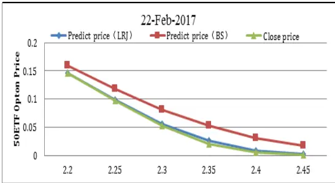
数据来源：国泰君安证券研究

图 4 ：B-S 和 LRJ 模型预测结果（次月）
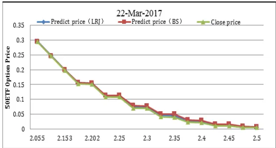
数据来源：国泰君安证券研究

图 5:B-S 和 LRJ 模型预测结果（季月）
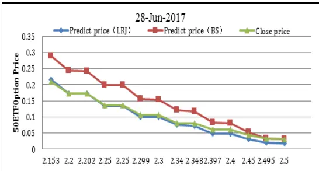
数据来源：国泰君安证券研究

图 6 ：B-S 和 LRJ 模型预测结果（隔季）
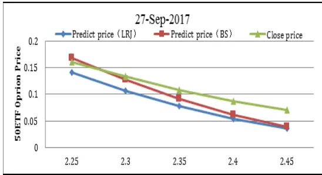
数据来源：国泰君安证券研究

## 3. 基于时变波动率期权定价模型的套利策略

## 3.1. 策略逻辑

我们发现基于时变波动率的跳扩散模型相较于B-S公式能够很好的捕捉到50ETF的厚尾性、偏斜、跳、时变波动率等特征，同时也能很好的刻画50ETF期权的隐含波动率偏斜，从而做到精准定价。如果我们能够准确对50ETF期权进行定价，寻找到市场上存在定价偏差的期权，同时通过套利的方法对冲掉标的的系统性风险，就能赚取绝对收益。

## 3.2.LRJ 模型与期权价值状态的关系

从表 4 中可以看出，基于时变波动率的跳扩散模型（LRJ）能够对当日期权的价格进行有效定价，从而在开盘时锁定当日收益。体来看，LRJ模型对实值期权的定价效率较高，胜率可以高达 74.5%。相比之下，由于虚值和平值期权的流动性更强，从而定价效率更高，因而模型的套利效率有所下降。但是，借助于虚值和平值期权更高的杠杆效应，其收益率体现出更高的弹性。

表4: LRJ模型与期权价值状态的关系

| 期权价值状态 | 平均收益率 | 胜率 | 交易天数 | 最大收益率 | 最大亏损 |
| --- | --- | --- | --- | --- | --- |
| 实值期权 | 0.69% | 74.50% | 581 | 51.97% | -33.31% |
| 平值期权 | 3.3. 基. 24% | 63.80% | 581 | 213.04% | -391.48% |
| 虚值期权 | 608% | 62.20% | 565 | 250.00% | -233.30% |

数据来源：国泰君安证券研究

## 3.3.基于时变波动率及跳扩散过程的期权定价模型的套利策略

从策略的稳定性以及收益最大化角度出发，综合考虑期权流动性，冲击成本，波动幅度等因素，我们构建了基于时变波动率及跳扩散过程的期权定价模型的 50ETF套利策略，具体细节如下：

- 买卖标的：买入模型价和开盘价绝对差值最大的平值期权，同时卖出模型价和开盘价差价最小的平值期权，

- 对冲情况：对冲标的 delta变动的风险。

- 交易时间：考虑交易冲击成本，以开盘后三十分钟均价买入，收盘前三十分钟均价卖出

- 交易成本：期权的手续费目前较高，因此，我们采用双边手续费百一，单边手续费千五。

- 特殊情况处理：考虑期权到期前两个交易日存在流动性风险，因此对到期前两个交易日进行空仓处理。

由于期权具有较高的杠杆，收益波动较大，因此计算收益时，我们采取收益累加的方式。举例来说，我们每日向策略投入等额的资金进行操作，使得每日期权组合的资金量维持不变。从图7 可以看出，基于 LRJ模型的套利策略体现出稳定且显著的绝对收益。从 2015 年 2 月至 2017 年 6月共计 552 个交易日中，策略获得了 876%的累加绝对收益。此外，从表5也可以看到，策略整体年化收益率397%，信息比率 1.63。

图7:LRJ 模型套利策略净值
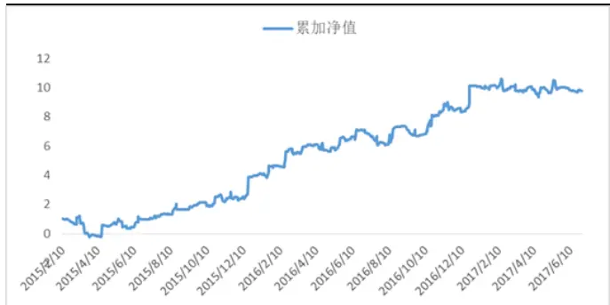
数据来源：国泰君安证券研究

表 5:LRJ 模型套利策略表现

| 年化收益率 | 年化波动率 | 信息比率 | 胜率 |
| --- | --- | --- | --- |
| 3.9695 | 2.4275 | 1.6352 | 53% |

数据来源：国泰君安证券研究

## 3.4. 套利策略组合分析

期权作为一个特殊的衍生品品种，其相较于股票现货和股指期货来说更为复杂。在实际操作过程中，我们不仅需要控制delta的暴露，也需要控制其他GREEKS 的暴露情况。

针对策略组合的风险暴露情况，表 6 给出对冲了套利组合的希腊字母暴露。可以看到，我们构建的 delta套利组合，除了有效对冲掉Delta 风险暴露，对 Gamma，Vega，Theta，Rho 风险也能够基本对冲。

整体来看，组合可以完全对冲掉市场利率波动带来的Rho 风险；此外，组合暴露了少许 Theta 风险，因此随着时间的流逝组合可能获取稍许时间收益。另外，Gamma，Vega风险，组合也能够基本对冲，但是需要警惕市场正向Gamma，Vega剧烈波动带来的负收益。

表6:套利组合希腊字母风险暴露

| De1ta | 0 |
| --- | --- |
| Gamma | 一，基本对冲 |
| Vega | 一，基本对冲 |

| Theta | +，基本对冲 |
| --- | --- |
| Rho | 0 |

数据来源：国泰君安证券研究

从图8中可以看出，交易在日度再平衡的基础上，Delta 风险基本可控，风险暴露几乎为 0。相对地，组合的 Gamma 和 Vega 在特殊市场环境下暴露会急剧变化。但是，策略整体仍处于风险可控的状态。此外，Theta和Rho的属性相对稳定，基本不会有较大的波动。

图 8:组合 Delta 暴露情况
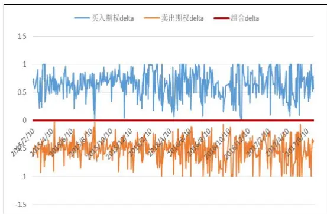
数据来源：国泰君安证券研究

图 9:组合 Gamma 暴露情况
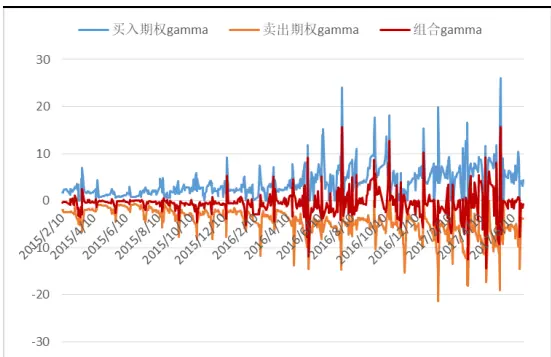
数据来源：国泰君安证券研究

图 10:组合 Vega 暴露情况
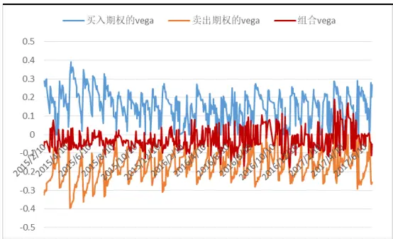
数据来源：国泰君安证券研究

图 11:组合 Theta 暴露情况
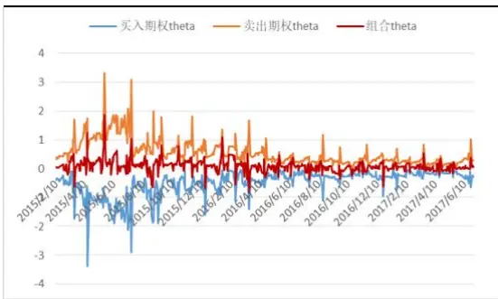
数据来源：国泰君安证券研究

图 12:组合Rho暴露情况

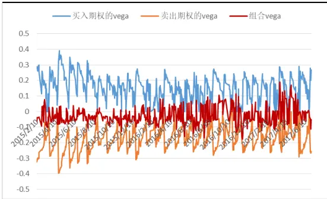
数据来源：国泰君安证券研究

## 4. 总结

本文在 BS 模型的基础上，进一步纳入股价跳跃因素，开发了基于时变波动率的跳扩散模型（LRJ）。从结果来看，LRJ 模型相比 BS 模型，能够更好的对期权进行定价，误差更小。在此基础上，我们通过 LRJ 模型进行了日度期权策略的构建，并获得了客观的绝对收益。

但是，本文中的策略只应用到了日度的频率，资金容量相对有限。此后，我们将尝试开发不同操作周期的模型，提高策略的多样性。随着期权市场的发展，期权品种在未来扩充后，策略吸引力也会持续提升。

## 本公司具有中国证监会核准的证券投资咨询业务资格

## 分析师声明

作者具有中国证券业协会授予的证券投资咨询执业资格或相当的专业胜任能力，保证报告所采用的数据均来自合规渠道，分析逻辑基于作者的职业理解，本报告清晰准确地反映了作者的研究观点，力求独立、客观和公正，结论不受任何第三方的授意或影响，特此声明。

## 免责声明

本报告仅供国泰君安证券股份有限公司（以下简称“本公司”）的客户使用。本公司不会因接收人收到本报告而视其为本公司的当然客户。本报告仅在相关法律许可的情况下发放，并仅为提供信息而发放，概不构成任何广告。

本报告的信息来源于已公开的资料，本公司对该等信息的准确性、完整性或可靠性不作任何保证。本报告所载的资料、意见及推测仅反映本公司于发布本报告当日的判断，本报告所指的证券或投资标的的价格、价值及投资收入可升可跌。过往表现不应作为日后的表现依据。在不同时期，本公司可发出与本报告所载资料、意见及推测不一致的报告。本公司不保证本报告所含信息保持在最新状态。同时，本公司对本报告所含信息可在不发出通知的情形下做出修改，投资者应当自行关注相应的更新或修改。

本报告中所指的投资及服务可能不适合个别客户，不构成客户私人咨询建议。在任何情况下，本报告中的信息或所表述的意见均不构成对任何人的投资建议。在任何情况下，本公司、本公司员工或者关联机构不承诺投资者一定获利，不与投资者分享投资收益，也不对任何人因使用本报告中的任何内容所引致的任何损失负任何责任。投资者务必注意，其据此做出的任何投资决策与本公司、本公司员工或者关联机构无关。

本公司利用信息隔离墙控制内部一个或多个领域、部门或关联机构之间的信息流动。因此，投资者应注意，在法律许可的情况下，本公司及其所属关联机构可能会持有报告中提到的公司所发行的证券或期权并进行证券或期权交易，也可能为这些公司提供或者争取提供投资银行、财务顾问或者金融产品等相关服务。在法律许可的情况下，本公司的员工可能担任本报告所提到的公司的董事。

市场有风险，投资需谨慎。投资者不应将本报告作为作出投资决策的唯一参考因素，亦不应认为本报告可以取代自己的判断。
在决定投资前，如有需要，投资者务必向专业人士咨询并谨慎决策。

本报告版权仅为本公司所有，未经书面许可，任何机构和个人不得以任何形式翻版、复制、发表或引用。如征得本公司同意进行引用、刊发的，需在允许的范围内使用，并注明出处为“国泰君安证券研究”，且不得对本报告进行任何有悖原意的引用、删节和修改。

若本公司以外的其他机构（以下简称“该机构”）发送本报告，则由该机构独自为此发送行为负责。通过此途径获得本报告的投资者应自行联系该机构以要求获悉更详细信息或进而交易本报告中提及的证券。本报告不构成本公司向该机构之客户提供的投资建议，本公司、本公司员工或者关联机构亦不为该机构之客户因使用本报告或报告所载内容引起的任何损失承担任何责任。

## 评级说明

## 1.投资建议的比较标准

投资评级分为股票评级和行业评级。

以报告发布后的12个月内的市场表现为比较标准，报告发布日后的 12个月内的公司股价（或行业指数）的涨跌幅相对同期的沪深 300 指数涨跌幅为基准。

## 2.投资建议的评级标准

报告发布日后的 12 个月内的公司股价（或行业指数）的涨跌幅相对同期的沪深 300 指数的涨跌幅。

|  | 评级 | 说明 |
| --- | --- | --- |
| 股票投资评级 | 增持 | 相对沪深300指数涨幅15%以上 |
|  | 谨慎增持 | 相对沪深 300指数涨幅介于5%～15%之间 |
|  | 中性 | 相对沪深300指数涨幅介于-5%～5% |
|  | 减持 | 相对沪深 300 指数下跌 5%以上 |
| 行业投资评级 | 增持 | 明显强于沪深 300 指数 |
|  | 中性 | 基本与沪深 300指数持平 |
|  | 减持 | 明显弱于沪深300指数 |

## 国泰君安证券研究所

|  | 上海 | 深圳 | 北京 |
| --- | --- | --- | --- |
| 地址 | 上海市浦东新区银城中路168号上海 银行大厦29层 | 深圳市福田区益田路 6009 号新世界 商务中心34层 | 北京市西城区金融大街 28 号盈泰中 心2号楼10层 |
| 邮编 | 200120 | 518026 | 100140 |
| 电话 | （021)38676666 | (0755)23976888 | (010)59312799 |
|  | E-mail: gtjaresearch@gtjas.com |  |  |