inInfo] [Table_Title] 2018.02.06

# ESG 投资之公司治理

# ——数量化专题之一百零七

李辰（分析师）

## 李栩（研究助理）

8 021-38677309

021-38032690

lichen@gtjas.com

证书编号 S0880516050003

lixu019018@gtjas.com

S0880117090067

## 本报告导读：

本篇报告以 ESG 投资理念为基础，针对其中公司治理部分进行详细研究，构建公司治理评价体系，检验其投资收益的显著性，并构建行之有效的 ESG投资策略。

## 摘要：

le_Summary]ESG 投资是指在投资决策过程中除了考虑财务回报以外，充分考虑环境（Environmental）、社会（Social）与治理（Governance）因素的一种投资理念。截至 2016 年末，全球共有 22.89 万亿美元资产专业地按照可持续投资策略进行管理，占全球资产管理总量的 26%，这些可持续投资策略或多或少地涉及了ESG 投资理念。

ESG 投资在海外具有一些大市值、高盈利、长动量以及低波动的风格特征，其风险相对较低，长期投资收益相对稳定，可持续性较强。比较 2007 年至 2016 年 MSCI 新兴市场 ESG 指数的年化收益率为3.6%，夏普比率为0.16，相较于其基准指数 MSCI新兴市场指数的年化收益0.4%以及夏普比率0.02，均有显著提升。

本篇报告从董事会、股权及股东、财务治理、薪酬及激励、治理行为及外部监督等五大方面筛选了 58 个因子构建了全面完善的 ESG公司治理评价因子。

经行业、风格因子风险调整之后的 ESG 公司治理评价因子的 IC 为0.02，ICIR 为 1.58，因子具有一定的显著性，其纯因子年化收益率为2.81%，Sharp 比率为1.58。另一方面，ESG 公司治理评价因子与大市值、高盈利、低杠杆有一定的相关关系，但相关系数均不高，因子独立性较高。

公司治理需要分域研究：企业生命周期的阶段不同，企业经营者对公司治理需求程度不同，投资者对公司治理的重视程度也不同。经分域检验，公司治理在大市值域具有更强的选股能力，评价因子在大市值域中 IC 为 0.026，相较于中市值域的 IC0.019 以及小市值域的IC0.020 均有显著提升。

构建相关 ESG 公司治理投资策略，1)优质筛选及负面排除策略：全市场优质筛选策略年化超额收益率（相对于万得全 A）为 11.78%，对应负面排除策略年化超额收益率为-3.78%，沪深300优质筛选策略年化超额收益率（相对于沪深 300）为6.10%，对应负面排除策略年化超额收益率为-1.14%；2)业绩相关因子结合的组合策略：ESG公司治理评价因子结合盈利因子的组合策略相对万得全 A 年化超额收益14.4%，跑赢盈利单因子策略 1.5%，IR 由 1.38 提升至 1.68；3)长期投资风险较低的G指数策略：G指数累积超额收益76.55%，年化超额收益率为 6.96%，年化换手率为 70%，特别是在 2017 年，其全年相对沪深300指数超额收益 25.04%，月超额胜率为75%，IR 为 3.14。

金融工程

## 金融工程团队：

刘富兵：（分析师）

电话：021-38676673

邮箱：liufubing008481@gtjas.com

证书编号：S0880511010017

## 陈奥林：（分析师）

电话：021-38674835

邮箱：chenaolin@gtjas.com

证书编号：S0880516100001

## 李辰：（分析师）

电话：021-38677309

邮箱：lichen@gtjas.com

证书编号：S0880516050003

## 孟繁雪：（分析师）

电话：021-38675860

邮箱：mengfanxue@gtjas.com

证书编号：S0880517040005

## 蔡旻昊：（研究助理）

电话：021-38674743

邮箱：caiminhao@gtjas.com

证书编号：S0880117030051

## 殷明：（研究助理）

电话：021-38674637

邮箱：yinming@gtjas.com证书编号：S0880116070042

## 叶尔乐：（研究助理）

电话：021-38032032

邮箱：yeerle@gtjas.com

证书编号：S0880116080361

## 殷钦怡：（研究助理）

电话：021-38675855

邮箱：yinqinyi@gtjas.com

证书编号：S0880117060109

## [Table_R相关报告

《基于时变波动率及跳扩散过程的期权定价模型及其策略应用》2017.12.24

《基于时变波动率的期权定价模型》2017.11.16

《盈余质量检验及其投资策略构建》2017.09.20

《抱团行为和慢牛股研究》2017.09.19

《基于二维收益分解的选股策略》2017.08.31

## 1. 引言

ESG 投资是近十年来兴起并成熟的理念，其是指在投资决策过程中除了考虑财务回报以外，充分考虑环境（Environmental）、社会（Social）与治理（Governance）等因素所带来的道德影响，在海外，许多国家主权基金、养老金被要求或者自发行使着ESG投资理念。根据全球可持续投资联盟（GSIA）2016年的趋势报告，全球共有 22.89万亿美元资产专业地按照可持续投资策略进行管理，占全球资产管理总量的 26%，这些可持续投资策略或多或少地涉及了ESG投资理念。

ESG 投资不仅仅是一种责任投资，许多海外研究表明，考虑 ESG 的投资表现为一些大市值、高盈利、长动量以及低波动的风格特征，其风险相对较低，长期投资收益相对稳定，可持续性较强。比较 2007年至2016年MSCI新兴市场ESG 指数（EM ESG）与其基准指数 MSCI新兴市场指数（MSCI EM）的收益表现，EM ESG 的年化收益达到 3.6%，Sharp比达到 0.16，相较于 MSCI EM 的年化收益 0.4%与 Sharp 比 0.02，均有显著地提升。

至今，全球已经有30多个经济体制定了企业ESG 信息披露的相关规范，并且有许多成熟的 ESG 评价体系，如 MSCI、Sustainalytics 及 ThomsonReuters等的ESG 评价产品；而在我国关于ESG信息的披露、评级以及投资，均尚未成型，处于早期发展的阶段。

具体每个因素来看，我国上市公司环境（E）与社会（S）方面的统计数据较少且标的覆盖度较低，但是关于上市公司治理（G）的信息披露相对成熟，统计数据充分且标的覆盖度较广，以往虽广受学界、市场零散的研究使用，但均未从公司治理整体情况出发检验治理综合评价对于权益投资的有效性。基于现状，本篇报告作为 ESG 领域的初步尝试，将针对治理（G）因素进行详细地研究，构建行之有效的 ESG投资策略。

关于本篇报告的具体研究内容，我们参考了相关法律法规、学术文献、商业产品以及国际相关治理准则，从董事会、股权及股东、财务治理、薪酬及激励、治理行为及外部监督等五大方面构建了全面完善的 ESG公司治理评价因子（第3部分），经过详尽研究，结果表明：

- 在经过行业、风格因子进行风险调整后的ESG 公司治理评价因子能够显著地贡献正向收益（第 4 部分）；

- ESG 公司治理评价因子独立性较好，与各大类风格以及与公司实际经营业绩相关程度不高（第 4 部分）；

- ESG 公司治理评价因子对于处于不同发展阶段的企业（如小公司与大公司）的投资有效性不尽相同，在大公司中具有更好的正向选股效果（第4部分）；

- 通过ESG 公司治理评价因子可构建简单有效的投资策略：优质筛选&负面排除策略、组合策略以及G 指数（第5 部分）。

## 2. ESG 简介

如前所述，ESG 投资是指在投资决策过程中除了考虑财务回报以外，充分考虑环境（Environmental）、社会（Social）与治理（Governance）因素的一种投资理念，具体来说：

- 环境（E）：衡量公司经营活动对环境的直接或间接影响；

- 社会（S）：衡量公司活动对客户、员工、股东、当地社区以及社会的直接或间接影响；

- 治理（G）：衡量受公司管理、控制和日常业务方式影响的流程、法规与制度。

ESG 投资常常与可持续投资、责任投资、绿色金融等理念联系在一起，目前ESG 在国内的发展尚属较为早期的阶段，在海外则已经有许多成熟的量化评价体系，包括 MSCI、Sustainalytics、Thomson Reuters、RepRisk以及 Bloomberg 的 ESG 评价体系等，其中 MSCI ESG Ratings 是广为使用，也是被研究最多的产品，其环境（E）因素主要考量气候变化、自然资本、污染&水资源以及环境条件等具体主题，社会（S）因素主要考量人力资本、产品责任、股东制衡以及社会条件等具体主题，治理（G）因素主要考量公司治理以及企业行为等具体主题。

表 1: MSCI ESG 评价体系

| 3 Pillars | 10 Themes | 37 ESG Key Issues |
| --- | --- | --- |
| 环境 | 气候变化 | 碳排放量、融资环境的影响、能源效率、气候变化的脆弱性、 产品碳足迹 |
|  | 自然资源 | 水资源压力、原材料采购、生物多样性&土地利用 |
|  | 污染&垃圾 | 有毒排放&垃圾、电子垃圾、包装材料&垃圾 |
|  | 环境的机会 | 清洁技术中的机会、可再生能源中的机会、绿色建筑中的机会 |
| 社会 | 人力资本 | 劳动管理、人力资本发展、健康&安全、供应链劳工标准 |
|  | 产品责任 | 产品安全&质量、隐私&数据安全、化学品安全投资、金融产品 安全健康与人口风险 |
|  | 利益相关者反对派 | 有争议的采购 |
|  | 社会的机会 | 获得沟通、获得保健服务、获得金融、获得营养&健康 |
| 治理 | 公司治理 | 董事会、所有权、工资、会计 |
|  | 公司行为 | 商业道德、腐败&不稳定、反竞争做法、金融体系的不稳定 |

数据来源：MSCI、国泰君安证券研究

## 2.1.ESG海外发展及业绩表现

据全球可持续投资联盟（GSIA）2016 年的趋势报告，全球共有 22.89万亿美元资产专业地按照可持续投资策略进行管理，相较于 2014 年增长了 25%，占全球资产管理总量的 26%，其中欧洲与美国占了全球可持续投资策略资产管理总量的 75%左右。根据美国可持续投资论坛（USSIF）的数据显示，2016年美国机构投资者ESG投资资产管理总额为4.73万亿美元，相比于2005年，十年中增长了 217%。

表 2: 欧美可持续投资策略规模约占全球的 75%

|  | 2014 |  | 2016 |  |
| --- | --- | --- | --- | --- |
|  | 资产总额 | 占比 | 资产总额 | 占比 |
| 国家 欧洲 | $10,775 | 58.80% | $12,040 | 52.60% |
| 美国 | $6,572 | 17.90% | $8,723 | 21.60% |
| 加拿大 | $729 | 31.30% | $1,086 | 37.80% |
| 澳大利亚/新西兰 | $148 | 16.60% | $516 | 50.60% |
| 亚洲（除日本） | $45 | 0.80% | $52 | 0.80% |
| 日本 | $7 |  | $174 | 3.40% |
| 全球 | $18,276 | 30.20% | $22,890 | 26.30% |

数据来源：GSIA、国泰君安证券研究。注：单位十亿美元。

GSIA 以及欧洲可持续投资论坛（Eurosif）将可持续投资策略分为以下 7大类，这些策略大多涉及了对公司ESG 的考察：

- 标准化筛选：投资符合相关标准、法规以及规则（环境保护、劳工标准、反腐败等）的资产；

- 优质筛选：投资某一行业或领域中 ESG得分高的资产或者对其赋予较高的权重；

- 负面排除：排除ESG 得分较低或者不符合标准化筛选策略的资产；

- ESG 整合：将 ESG 风险与潜在机会整合入传统的财务分析或因子研究中，多适用于使用量化方法进行 ESG投资；

- 可持续性主题投资：投资有关于可持续发展主题的资产；

- 影响力/目标投资：通常在私人市场上进行，旨在解决传统资本市场关注不足的个人、社区以及有明确社会、环境目标的企业；

- 股东参与策略：在ESG指导准则下行使股东权力参与企业治理、决策以及行为。

表 3: ESG 整合策略资产规模超 10 万亿美元

| 策略 | 2014 | 2016 | 增长率 |
| --- | --- | --- | --- |
| 影响力/目标投资 | $101 | $248 | 146% |
| 可持续性主题投资 | $137 | $331 | 140% |
| 优质筛选 | $890 | $1,030 | 16% |
| 标准化筛选 | $4,385 | $6,210 | 42% |
| 股东参与策略 | $5,919 | $8,365 | 41% |
| ESG 整合 | $7,527 | $10,369 | 38% |
| 负面排除 | $12,046 | $15,023 | 25% |

数据来源：GSIA、国泰君安证券研究。注：单位十亿美元。

从全球大多数市场 ESG指数的业绩表现来看，整体而言 ESG指数优于其市场基准指数。观察比较 2007年9 月至2016年11月MSCI全球各市场的 ESG 指数与其基准指数的收益表现，除了 World ESG 与 UK ESG收益表现弱于基准指数以外，其余市场ESG指数均表现为更高的年化收益与更高的Sharp 比率，尤其是 MSCI新兴市场ESG 指数，其年化收益相比于 MSCI 新兴市场指数（MSCI Emerging Market Index）提升了 3.2%，年化波动率下降了1.4%，Sharp比率提升了0.14。

表 4: MSCI新兴市场ESG指数年化收益为 3.6%，高于基准指数 3.2%

| 指数 | 年化收益 | 年化波动率 | Sharpe | 最大回撤 |
| --- | --- | --- | --- | --- |
| MSCI EM ESG EM | 0.40% 3.60% | 24.20% 22.80% | 0.02 0.16 | -61.60% -58.90% |
| MSCI USA | 11.80% | 11.50% | 1.03 | -15.90% |
| ESG USA MSCI Australia | 12.90% 1.70% | 11.60% 25.80% | 1.11 0.07 | -16.60% -63.30% |
| ESG Australia | 2.00% | 25.60% 22.30% | 0.08 | -62.00% -56.20% |
| MSCI Canada ESG Canada | 0.40% 2.00% | 22.50% | 0.02 0.09 | -54.80% |
| MSCI UK | -0.90% | 19.20% |  |  |
|  |  |  | -0.05 | -59.00% |
| ESG UK | -1.40% | 18.70% | -0.07 | -57.10% |
| MSCI Japan | 0.80% | 16.30% | 0.05 | -45.70% |
| ESG Japan | 1.00% | 16.70% |  |  |
|  |  |  | 0.06 | -46.40% |
| MSCI AC Europe | -1.10% | 21.40% | -0.05 | -60.10% |
| ESG Europe | 0.20% | 21.10% | 0.01 | -58.60% |
| MSCI World | 3.00% | 17.10% |  |  |
| ESG World | 2.60% | 17.20% | 0.18 0.15 | -54.00% -54.20% |

数据来源：MSCI、J.P. Morgan、国泰君安证券研究

## 2.2. ESG 相关政策梳理

尽管ESG 投资在我国的发展尚属早期，但是我国关于环境、社会以及治理的政策已经处于稳健实施中，并不断得以完善。

## 1）对于环境方面：

- 2017 年 11 月环保部通过《排污许可管理办法（试行）》，有序发放排污许可证，拥有许可证的企业可以继续生产，没有获得许可证的企业将关停整改；《中华人民共和国环境保护税法》于 2018年1月1日正式实施，对拥有排污许可证的企业根据其排污量开征环保税；

- 另一方面，2015年12月 31日，国家发改委出台《绿色债券发行指引》，绿色债券是资助企业开展或者建设符合规定的绿色项目或为这些项目进行再融资的债券工具，2017年12 月26日人民银行与证监会联合发布《绿色债券评估认证行为指引(暂行)》，规范发展绿色债券市场，加快发展绿色金融。

上述关于环境的奖惩政策，有助于优质企业降低经营以及融资成本，而对于不达条件的高污染、低效能企业面临着高成本、高税收以及关停整改的风险。

## 2） 对于社会方面：

对于上市公司社会责任报告虽无强制披露的法规，但是早在 2006 年 9月25日深交所就颁布过《深圳证券交易所上市公司社会责任指引》，对自愿披露的企业社会责任报告进行了相关指导。经过多年的发展，上市公司中自愿披露社会责任报告的数目越来越多，占总上市公司总数的比例稳定在25%左右。

图 1A股上市公司社会责任报告披露数占比约 25%
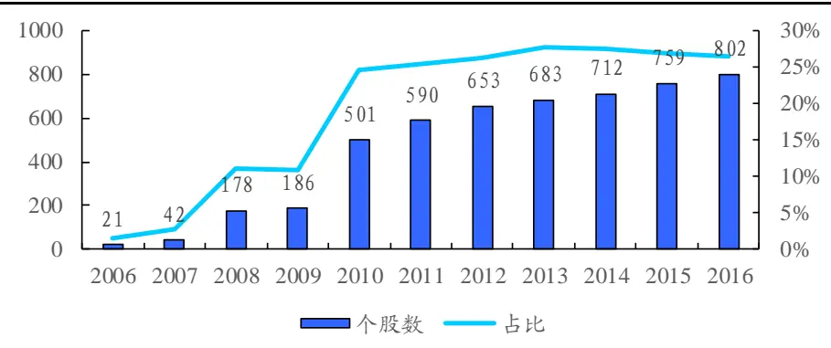
数据来源：国泰君安证券研究

## 3）对于治理方面：

我国《证券法》《公司法》《上市公司治理准则》《企业内部控制基本规范》等均拥有一系列用于保护中小股东，债权人以及规范公司治理结构的法律法规，此外还有《关于在上市公司建立独立董事制度的指导意见》等相关指导文件。

## 2.3.ESG整合的金融理论分析

在上述关于可持续投资7大策略的描述中，我们提到了“ESG整合策略”，即将ESG 风险与潜在机会整合入传统的财务分析或因子研究中，该策略多适用于使用量化方法进行 ESG投资。在这里，我们从金融理论角度，建立ESG与 DDM之间的传导关联，分析ESG 因素对股价可能的影响。

- 环境（E）：环境治理较好的企业经营成本相对更低，缴纳的环保税相对更少，此外还可通过发行绿色债券等途径降低企业融资成本，这些因素可带来预期股利升高，预期风险回报率降低，从而带来投资收益。

- 社会（S）：社会因素包括社会事务参与以及利益相关者管理等，这些因素对公司绩效具有一定的促进作用（Hillman & Keim（2001））。

- 治理（G）：良好的公司治理可以影响到企业经营发展的方方面面，究其原因是由于公司治理是一套有效解决委托代理问题的机制：良好的公司治理降低了代理成本，增强了信息透明度，使代理人与委托人（资金提供者与经理人、股东与其他利益相关者以及不同类型的股东之间）的利益尽可能一致，从而提升企业价值。一个简单的例子，若大股东与中小股东利益一致，不存在任何大股东“掏空”行为，这保证了中小股东一定能获得其应得的现金流（现金股利），同时降低了投资风险，从而给予公司更高的溢价。

图 2ESG整合策略金融理论分析
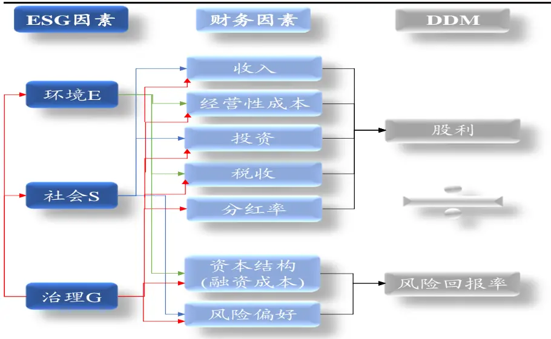
数据来源：国泰君安证券研究

## 3. ESG公司治理评价因子的构建

在上文 1.3 的“ESG 整合的金融理论分析”中，我们提到了公司治理的定义以及意义：公司治理是一套有效解决委托代理问题的机制。良好的公司治理降低了代理成本，增强了信息透明度，使代理人与委托人的利益尽可能一致，从而给予企业正面影响，提升企业价值。

这里我们参考学术研究对委托代理问题进行简要分类，以给予ESG 公司治理评价因子构建足够的理论支持，委托代理问题主要可以分成以下三类：

- 第一类，资金提供者与经理人：经理人可能的特权消费、建造个人帝国等问题会偏离股东价值最大化的追求，资金提供者将对此付出较高的监督成本，代理人也会为此付出较高的约束成本。

- 第二类，股东与其他利益相关者：其他利益相关者包括债权人、员工、监管机构、客户、供应商与公司当地社区等。其中被研究最多的是，股东与债权人之间的委托代理问题，例如当股东将债券融资用于风险较大的投资项目时，项目成功的超额回报将全部归股东所有，而失败的成本大多由债权人承担。其次，股东与员工之间的代理成本也是备受关注的问题，合适的激励机制，有助于提升公司经营绩效，而过多的员工所有权赋予，将提升员工地位，使其最大化自身利益，谋求超额工资，从而降低公司经营绩效。

- 第三类，不同类型的股东之间：主要是指大股东与中小股东之间的委托代理问题，这类问题在所有权与控制权集中的我国资本市场最为突出，如果能够有效建立相关公司治理机制，有效防制控股股东（实际控制人）以企业价值为代价追求自身价值最大化，那么将有效保证投资人获得应得的现金流，同时降低投资风险，相应地公司也可以获得较高的企业价值。对此我国监管层也有着严格的监管政策与措施，例如对“关联交易”的监管。

基于上述分析，本篇报告充分考虑国内上市公司的主要特征（聚焦于能够有效减少委托代理问题的公司治理机制与结构，特别是我国最为突出的大股东与中小股东之间的委托代理问题），依照公司治理的相关逻辑从相关法律法规、指导意见、国际治理准则、学术文献及报告中筛选出了 58 个指标，这些因子具有可获取、可量化、线性逻辑的特性，我们将这58个指标分为董事会（15个指标）、股权及股东（11个指标）、财务治理（9个指标）、薪酬及激励（6个指标）、治理行为及外部监督（17个指标）五大类从 2010年 1 月份开始构建了ESG 公司治理评价因子，该因子能够全面完善地反映上市公司治理机制的客观情况。

图 3ESG公司治理评价体系
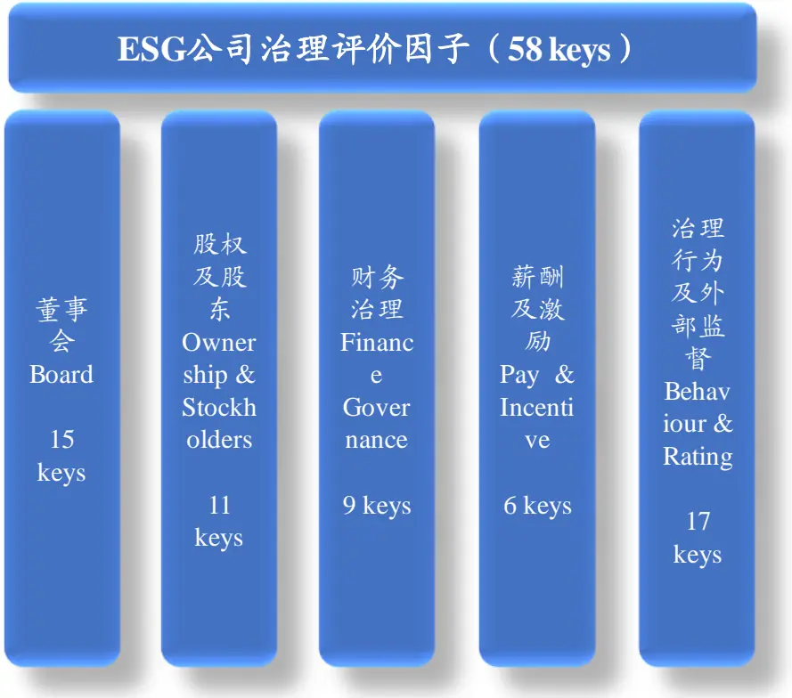
数据来源：国泰君安证券研究

## 3.1.ESG公司治理因子具体构建方法

对于董事会，我们从其结构概况、稳定性以及独立性等三个方面进行了评价：

- 关于董事会合理性方面，我们考察的问题是董事会的治理结构是否完善，是否是最优的设置，对此我们筛选了董事会规模、两职分离、董事会平均学历、繁忙董事监事的比例、监事会会议次数以及委员会设置的个数等 6 个指标进行评价。具体到指标的逻辑方向研究，Lipton & Lorsch（1992）、Yermack（1996）分别从理论与实证层面说明了大型董事会对公司绩效的有害性，他们认为董事会效率会随人数增加而降低，并且容易受到 CEO 的控制；《凯德伯瑞报告》（1992）建议公司应当两职分离，以增强董事会独立性；Hambrick& Mason（1984）的高阶理论认为企业绩效水平与管理人员的背景特征相关；Larcker, Richardson & Tuna（2007）认为拥有更少繁忙董事的企业会有更好的经营绩效；李维安（2006）选取了年度监事会会议次数作为监事会治理评价指标；《凯德伯瑞报告》（1992）认为企业应设立薪酬、审计以及提名委员会，且多数应由非执行董事构成。

- 关于董事会稳定性方面，我们考察的问题是董事会人员构成的稳定性，对此我们筛选了 3 年内 CEO 以及董事长变动（不含退休、任期届满）次数等2 个指标进行评价。具体到指标的逻辑方向研究，Hermalin & Weisbach(1998) 通过研究案例发现董事会发生变化的原因通常是因为过往糟糕的业绩表现，Crutchley（2002）也从动态的视角中说明了董事会稳定性与公司绩效之间的关系。

- 关于董事会独立性方面，我们考察的问题是独立董事结构是否合理，是否能够充分发挥作用，对此我们筛选了独立董事比例、其财务（法律）专家比例、其是否出席所有董事会会议、其高于 60 岁比例、其工作地点是否与其公司一致以及其是否有多重董事身份等7 个指标进行评价。具体到指标的逻辑方向研究，在证监会发布的《关于在上市公司建立独立董事制度的指导意见》中指出，独立董事对上市公司及全体股东负有诚信与勤勉义务：上市公司董事会成员中应当至少包括三分之一独立董事；独立董事需要具有五年以上法律、经济或者其他履行独立董事职责所必需的工作经验；独立董事连续3 次未亲自出席董事会会议的，由董事会提请股东大会予以撤换；Alam(2014)研究发现异地独董较多的公司，表现为更高的代理成本以及信息获取成本，更多的财务重述。

表 5: 董事会评价由 3 个子分类，共计 15 个指标构成

| 分类 | 子分类 | 编号 | 指标名称 | 期望方向 | 频率 |
| --- | --- | --- | --- | --- | --- |
| 董事 | 合理性 | 1 | 董事会规模 |  | 年频 |
|  |  | 2 | 董事长 CEO 是否是同一人* |  | 年频 |
|  |  | 3 | 董监高平均学历（学士、硕士、博士分别计1/3、2/3、1分） | 十 | 年频 |
|  |  | 4 | 繁忙董事监事比例（供职于4家公司以上的称为“繁忙”） | - | 年频 |
|  |  | 5 | 监事会会议次数 | 十 | 年频 |
|  |  | 6 | 委员会个数 | 十 | 年频 |
|  |  | 7 8 | 3年内CEO变动（不含退休、任期届满）次数 | – | 季频 |
| 会 Board | 稳定性 |  | 3年内董事长变动（不含退休、任期届满）次数 | - | 季频 |
|  |  | 9 | 董事会独立董事比例 | 十 | 年频 |
|  |  | 10 | 独立董事财务专家比例 | 十 | 年频 |
|  | 11 |  | 独立董事法律专家比例 | 十 | 年频 |
| 独立性 |  | 12 | 独立董事是否出席所有董事会会议* | 十 | 年频 |
|  |  | 13 | 独立董事高于60岁比例 | - | 年频 |
|  |  | 14 | 独立董事工作地点是否与上市公司一致* | 十 | 年频 |
|  | 15 |  | 独立董事是否有繁忙董事* | - | 年频 |

数据来源：国泰君安证券研究。注：*号为 0-1哑变量。

对于股权及股东，我们从其股权集中度、内部持股以及外部持股等三个方面进行了评价：

- 关于控制权与所有权方面，我们考察的问题是上市公司股权的整体结构，对此我们筛选了股权集中度指标、公司是否有实际控制人以及两权分离度（控制权/所有权）等 3 个指标进行评价。针对 A 股市场第三类委托代理问题较为突出的情况，我们的评价指标的期望方向应与能够降低大股东与中小股东代理成本的逻辑方向相一致。首先，我们对股权集中度切入进行分析，在A股市场中，上市公司的股权集中度普遍较高，股权集中的好处是在于大股东拥有较强的权力，大股东与管理层之间的代理成本较低，但却增加了大股东与中小股东之间的代理成本，尤其是对于通过“所有权金字塔”实现杠杆控制的公司来说，大股东可能有更严重的隧道效应与转移定价，两者之间的代理问题可能会更为严重；另一方面，股权如果过于分散虽然增加了股票流动性，但是管理层将缺乏监督，公司股东与管理层之间的代理问题可能相对严重。综合上述分析，我们认为股东集中度不过分高，两权分离度较低（控制权与所有权相接近）的公司能够有效降低大股东与中小股东之间的代理成本。

- 关于内部持股方面，我们筛选了监事持股比例、高管持股比例以及管理层（除高管外）持股比例等 3 个指标进行评价。对于管理层持股的逻辑期望方向，Morck, Shleifer & Vishny（1988）认为管理层持股对公司于有利，McConnell & Servaes（1990）通过实证研究也发现了管理层持股与企业经营业绩之间的正相关关系。

- 关于外部持股方面，我们筛选了基金、社保基金、QFII、非金融类上市公司的持股比例以及是否发行H股等5 个指标进行评价。具体到指标的逻辑方向的研究，Jensen & Meckling（1976）认为外部股东对管理层有监督作用，可以有效降低代理成本，提升公司经营绩效，李维安（2008）通过实证研究发现了机构投资者有助于提升公司治理水平，降低代理成本，提升经营绩效。

表 6: 股权及股东评价由3个子分类，共计 11个指标构成

| 分类 | 子分类 | 编号 | 指标名称 | 期望方向 | 频率 |
| --- | --- | --- | --- | --- | --- |
| 股权及股 东 Ownership & | 控制权与所有 | 1 | 股权集中度指标（前8大股东股票比例） |  | 季频 |
|  | 权 | 2 | 公司是否有实际控制人* |  | 年频 |
|  |  | 3 | 两权分离度（控制权/所有权） |  | 年频 |
|  | 内部持股 | 4 | 监事持股比例 | + | 年频 |
|  |  | 5 | 高管持股比例 | 十 | 年频 |
|  |  | 6 | 管理层（除高管外）持股比例 | + | 年频 |
|  |  | 7 | 基金持股比例 | 十 | 季频 |
| Stockholder S | 8 |  | 社保基金持股比例 | + | 季频 |
|  | 外部持股 | 9 | QFII 持股比例 | + | 季频 |
|  |  | 10 | 非金融类上市公司持股比例 | – | 季频 |
|  | 11 |  | 是否发行H股 | + | 季频 |

数据来源：国泰君安证券研究。注：*号为 0-1哑变量。

对于财务治理，我们从其财报审计、内部控制以及业绩预告等三个方面进行了评：

- 关于财报审计方面，我们考察的问题是审计的结论与审计的质量，对此我们筛选了财报审计出具标准无保留意见、3 年内审计事务所变动次数以及审计师得分（来自四大+1 分，来自境外+1 分）等 3个指标进行评价。其中，财报审计出具标准无保留意见、审计师得分、3年内审计事务所变动次数逻辑相对直观。

- 关于内部控制方面，我们综合考虑了内控报告、内控审计报告的内容后，筛选了内控报告是否有效、内部控制是否有问题，内控审计报告出具标准无保留意见等3 个指标进行评价。

- 关于业绩预告方面，我们考察的问题是业绩预告的精度，对此我们筛选了财报公布日调整次数、业绩快报（预告）是否准确、是否为 ST 等 3个指标进行评价。若一家上市公司财报公布日调整频繁，业绩快报（预告）与正式财报相距甚远，其对应的财务治理情况也相对较差。

表 7: 财务治理评价由3个子分类，共计 9个指标构成

| 分类 | 子分类 | 编号 | 指标名称 | 期望方向 | 数据频率 |
| --- | --- | --- | --- | --- | --- |
| 财务治理 Finance Governance | 财报审计 | 1 | 财报审计出具标准无保留意见* | 十 | 年频 |
|  |  | 2 | 3年内审计事务所变动次数 | - | 年频 |
|  |  | 3 | 审计师得分（来自四大+1分，来自境外+1分） | 十 | 年频 |
|  |  | 4 | 内控报告是否有效* | 十 | 年频 |
|  | 内部控制 | 5 | 内部控制是否有问题* | - | 年频 |
|  |  | 6 | 内控审计报告出具标准无保留意见* | 十 | 年频 |
|  |  | 7 | 财报公布日调整次数 | - | 季频 |
|  |  | 8 | 业绩快报、业绩预告是否准确* | 十 | 季频 |
|  | 业绩预告 | 9 | 是否为 ST* | – | 季频 |

数据来源：国泰君安证券研究。注：*号为 0-1哑变量。

对于薪酬，我们了筛选董事年薪前三名以及高管年薪前三名的对数等 2个指标进行评价，Jensen & Murphy（1990）、Elston & Goldberg（2003）、徐向艺等（2007）均实证表明了薪酬与公司业绩存在正相关的关系。另一方面，对于激励，我们筛选了员工持股计划以及股权激励相关指标进行评价。

表 8: 薪酬激励评价由2个子分类，共计 6个指标构成

| 分类 | 子分类 | 编号 | 指标名称 | 期望方向 | 数据频率 |
| --- | --- | --- | --- | --- | --- |
| 薪酬及 激励 Pay & Incentive | 薪酬 | 1 | log(董事年薪前三名) | + | 年频 |
|  |  | 2 | log(高管年薪前三名) | 十 | 年频 |
|  |  | 3 | 员工持股计划/总股本 | 十 | 季频 |
|  | 激励 | 4 | 高管员工持股计划/总股本 | 十 | 季频 |
|  |  | 5 | 股权激励权益/总股本 | 十 | 季频 |
|  |  | 6 | 高管激励权益/总股本 | + | 季频 |

数据来源：国泰君安证券研究。

对于治理行为及外部监督，我们从其大股东、管理层治理行为以及外部监督等两个方面进行了评价：

- 关于大股东、管理层治理行为方面，我们主要关注杠杆风险、代理成本代理指标、关联交易以及融资并购等5 个方面的问题。其中对于杠杆风险，我们选了董监高质押股票比例进行衡量；对于代理成本代理指标，我们筛选了管理费用率以及资产周转率作为第一类代理成本的代理指标，Ang, Cole & Lin（2000）发现高管理费用率一定程度上反映了企业管理层过度的在职消费而引发的第一类代理成本，此外还发现资产周转率越低，管理层对于资产使用率越低（可能源于管理层的错误决策、偷懒行为等），第一类代理成本越高，另一方面选择大股东占款率（其他应收款/总资产）作为第三类代理成本的代理指标（姜国华等（2005））；对于关联交易，我们筛选了关联人进货销货率、关联人融资保证比率以及3年内并购次数（关联交易）3 个指标进行评价，关联交易增加了大股东侵占公司资源的风险，所以我们预期关联交易的大小与公司治理的好坏存在负向关系；对于融资并购，Doukas & Petmezas（2006）认为频繁并购是由于管理层的过度自信造成的，导致了频繁并购后业绩下滑，张祥建 & 徐晋（2005）认为股权再融资后，大股东容易通过隧道行为侵占中小股东利益，所以过度频繁的融资并购可能伴随着更多的委托代理问题。

- 关于外部监督方面，我们主要关注违规处罚与投资者信息交流等两方面的问题。其中对于违规处罚，主要统计来自证监会、交易所、财政部等部门的公开处罚情况，近半年来诉讼仲裁涉案金额数以及被司法部门冻结股票的比例；对于投资者信息交流，主要统计投资者调研次数以及调研机构、媒体数等2个指标。

表 9: 治理行为及外部监督评价由 2个子分类，共计 17个指标构成

| 分类 | 子分类 | 编号 | 指标名称 | 期望方向 | 数据频率 |
| --- | --- | --- | --- | --- | --- |
|  |  | 1 | 董监高质押股票比例 |  | 季频 |
|  |  | 2 | 管理费用率 |  | 季频 |
|  | 3 |  | 资产周转率 | + | 季频 |
|  | 4 |  | 大股东占款率（其他应收款/总资产） 关联人进货销货率（（关联人采购额+关联人销售额） |  | 季频 |
|  | 5 |  | /净资产） |  | 半年频 |
| 治理行 为及外 | 治理行 为 | 6 | 关联人融资保证比率（（向关联方提供资金余额+关联 担保余额）/净资产） |  | 半年频 |
| 部监督 |  | 7 | 3年内并购次数（关联交易） |  | 季频 |
| Behavi |  | 8 | 3年内资产剥离次数（关联交易） |  | 季频 |
| our & |  | 9 | 股权再融资情况（是否增长超过5%）* |  | 季频 |
| Rating |  | 10 | 商誉/净资产 |  | 季频 |
|  |  | 11 | 重大资产重组失败数 |  | 季频 |
|  |  | 12 | 3年内重大资产重组停牌交易日数 |  | 季频 |
|  |  | 13 | 近1年来违规次数 |  | 季频 |
|  | 外部评 | 14 | 近半年来诉讼仲裁涉案金额数/营业收入 | - | 半年频 |
|  | 价 | 15 | 冻结股票比例 | - | 季频 |
|  |  | 16 17 | 投资者调研次数 调研机构、媒体数 | + | 季频 |

数据来源：国泰君安证券研究。注：*号为 0-1哑变量。

## 3.2. 评价因子合成方式

ESG 公司治理评价因子是公司治理能力的综合体现，是多个指标的复合作用，任一单指标无法充分反映公司的治理能力；为此，我们需要确定合理的加权方式，用上述单指标合成出一个 ESG 公司治理评价因子。在确定指标的加权方式之前，我们先对国际知名的ESG评价体系与国内学术界知名的公司治理评价体系的加权方式进行梳理，简要总结如下表。

表 10: 海内外成熟公司治理评价得分计算方式

| 国外 ESG 评价体系 |  |  | 国内学术界的公司治理评价体系 |  |
| --- | --- | --- | --- | --- |
| MSCI | Sustainalytics | Thomson Reuters | 南开公司治理评 价系统（李维安） 运用专家打分法 | 北师大公司 治理指数（高 明华） 对子类别中 每个指标进 |
| 先对ESG 大类下的关键 指标进行评分(0~10分)， 然后对指标进行加权平 均得到 ESG 大类评分， 再进行加权平均合成分 数，最后将分数在各个行 业中进行调整，得到最终 的 ESG得分，对应最低 CCC 至最高 AAA 的评级 | 对 ESG 大类下的 各个指标进行评 分（1~100分）， 对指标进行行业 调整后加权得到 ESG 大类评分，再 对 ESG 三类评分 进行加权得到最 终的 ESG 评分 （1~100分) | 计算E、S各个指标在行业 中的排名位置与G各个指 标在国家地区中的排名位 置，然后根据ESG大类下 的子类别对各自的指标进 行等权相加，得到ESG子 类别得分，根据其设定的 权重进行加权得到最终的 ESG评分（0~1分），根 据得分给予公司 ESG 评级 | 与层次分析法对 指标进行打分加 权加总，得到最终 的公司治理得分 （0~100分），对 应6个等级 （VI~I) | 行评分（0~1 分），对子类 别中的指标 等分求平均 值，再将平均 值进行相加 得到最终的 公司治理评 分 |

数据来源：国泰君安证券研究

综合上述评价体系，我们将在本篇报告中采用如下方式对ESG 公司治理评价因子得分进行计算：

- 第一步，对五大类中的各指标（连续变量需要进行去极值处理，去极值处理方法采用3倍标准差法）做归一化处理（使指标分布在[0,1]区间）：

$$
f_{i,n}=\left\{\begin{aligned}\overline{f_{i,n}}-3\cdot\sigma\left(\overline{f_{i,n}}\right),iff_{i,n}<\overline{f_{i,n}}-3\cdot\sigma\left(\overline{f_{i,n}}\right)\\\overline{f_{i,n}}+3\cdot\sigma\left(\overline{f_{i,n}}\right),iff_{i,n}>\overline{f_{i,n}}+3\cdot\sigma\left(\overline{f_{i,n}}\right)\end{aligned}\right.
$$

$$
f_{i,n}=\frac{f_{i,n}-\min(f_{i,n})}{\max(f_{i,n})-\min(f_{i,n})}
$$

该处理方式的优点在于，针对各类别中同时存在的连续变量与离散变量进行归一化处理，使两者具有了可比性以及可叠加性。

- 第二步，等权加总每一类中指标，然后对加总值仿照上一步骤进行去极值处理后，再对得分做标准化处理：

$$
F_{j,n}=\sum_{i}f_{i,n}
$$

$$
F_{j,n}=\frac{F_{j,n}-\overline{{F_{j,n}}}}{\sigma(F_{j,n})}
$$

- 第三步，等权加总五大类得分，获得最终的ESG 公司治理评价得分。

$$
GF_{_n}=\sum_{j}F_{_{j,n}}
$$

## 4. A股市场 ESG公司治理评价因子的有效性检验

在本部分中，我们将检验在上一部分中构建的ESG 公司治理评价因子在A 股市场上的投资有效性，主要分为以下三个步骤：显著性检验、相关性检验以及分域研究。

## 4.1.ESG公司治理评价因子显著性检验

显著性检验：检验 ESG 公司治理评价因子与下一期收益之间的相关程度，通过计算经行业、十大类风格调整后的ESG公司治理评价因子与经行业、十大类风格调整后收益的相关系数，可得到ESG公司治理评价因子的IC 以及 IR，具体公式如下：

$$
\begin{aligned}GF=\beta_{0}X_{identity}+\beta_{1}X_{best}+\beta_{2}X_{momentum}+\beta_{3}X_{size}+\beta_{4}X_{earnings\_yield}\\&+\beta_{5}X_{learning\_yield}+\beta_{6}X_{volatility}+\beta_{7}X_{value}+\beta_{8}X_{leverage}\\&+\beta_{9}X_{liquidity}+\beta_{10}X_{non-linear\_size}+\varepsilon_{GF}\\\end{aligned}
$$

$$
\begin{aligned}R=r_{0}X_{_{industry}}+r_{1}X_{_{beta}}+r_{2}X_{_{momentum}}+r_{3}X_{_{size}}+r_{4}X_{_{earnings\_yield}}\\&+r_{5}X_{_{earnings\_yield}}+r_{6}X_{_{volatility}}+r_{7}X_{_{value}}+r_{8}X_{_{leverage}}\\&+r_{9}X_{_{liquidity}}+r_{10}X_{_{non-linear\_size}}+r\varepsilon\\\end{aligned}
$$

$$
IC=\mathrm{corr}(\varepsilon_{GF},r\varepsilon)
$$

$$
ICIR=\frac{\overline{IC}}{\sigma(IC)}\cdot\sqrt{12}
$$

图 4ESG 公司治理评价因子 IC 为 0.02
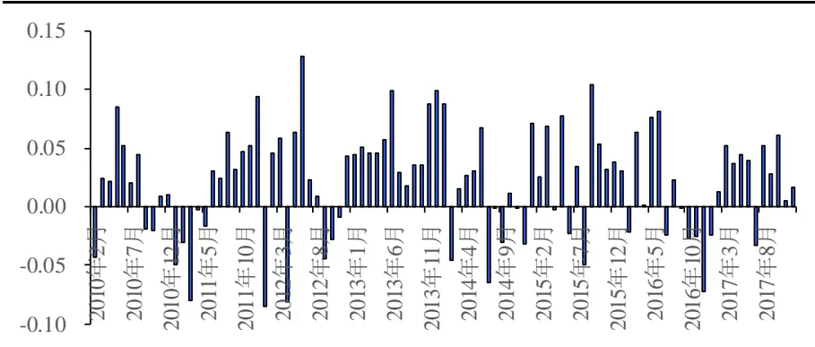
数据来源：国泰君安证券研究

经行业、风格因子风险调整之后的 ESG 公司治理评价因子的 IC 为 0.02，ICIR为 1.58，t统计量为 4.44，因子显著性较高。

表 11: ESG 公司治理评价因子的 IC 为 0.0206

|  | 全域 |
| --- | --- |
| IC | 0.0206 |
| std | 0.0453 |
| t统计量 | 4.44 |
| ICIR | 1.58 |

数据来源：国泰君安证券研究

ESG公司治理评价因子纯因子年化收益率为2.81%，Sharp比率为1.58。累计每月末通过截面回归得到的纯因子收益，自2010 年1 月至2018年1 月 19 日以来，ESG 公司治理评价因子纯因子累计收益 25.08%，年化收益率 2.81%，年化波动率为 1.79%，夏普比率为 1.58，最大回撤为1.70%，月胜率为 67%。

$$
\begin{aligned}R=&r_{0}X_{_{industry}}+r_{1}X_{_{bteal}}+r_{2}X_{_{momentum}}+r_{3}X_{_{size}}+r_{4}X_{_{earmings_{-}yield}}\\&+r_{5}X_{_{earnings_{-}yield}}+r_{6}X_{_{volatility}}+r_{7}X_{_{value}}+r_{8}X_{_{leverage}}\\&+r_{9}X_{_{liquidity}}+r_{10}X_{_{non-linear_{-}size}}+r_{GF}\cdot\mathcal{E}_{GF}\\R_{_{GF}}=&\prod_{t}^{T}r_{GF,t}\end{aligned}
$$

图 5ESG 公司治理评价因子累计收益 25.08%
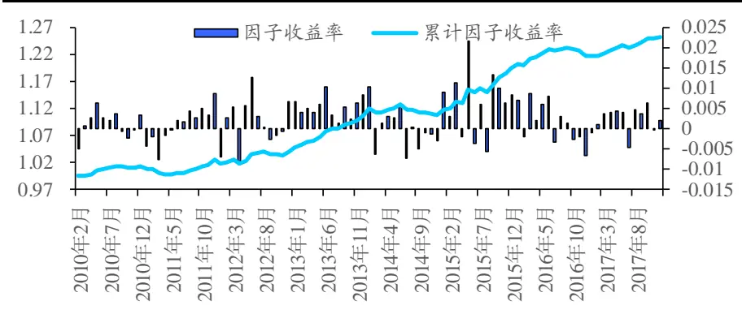
数据来源：国泰君安证券研究

表 12: ESG公司治理评价因子年化收益 2.81%

| 因子收益表现 |  |  |  |
| --- | --- | --- | --- |
| 累计收益率 | 25.08% | 夏普比率 | 1.58 |
| 年化收益率 | 2.81% | 最大回撤 | 1.70% |
| 年化波动率 | 1.79% | 月胜率 | 67% |

数据来源：国泰君安证券研究

因子收益衰退较缓慢，适合慢牛环境。通过累计d天收益率与当下截面因子做截面回归，可获得累计 d天的因子收益率，观察下图结果可以发现，ESG 公司治理评价因子收益衰退缓慢，累计120 天衰减了不足1%的收益，比较适合慢牛环境。究其原因，是因为企业的治理能力是相对稳定的，公司治理能力于企业，长期发挥着其正向的作用。

图 6因子收益衰退缓慢，适合慢牛环境
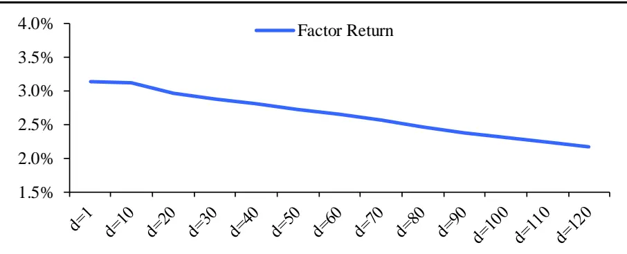
数据来源：国泰君安证券研究

## 4.2.ESG公司治理评价因子相关性检验

一个新的因子是否能够加入到我们的投资体系中，首先应该考察的是，其是否提供了不同于我们已知信息的增量信息，如果该“新因子”仅仅是我们已知信息的不同组合，那么其对于投资的实际意义将大大下降；也就是说，只有当我们构造的“新因子”与已有因子不存在明显相关性时，才可将该“新因子”用于后续研究与投资中。在本小节中，我们将计算ESG公司治理评价因子与十大类风格因子之间的相关性，完成相关性检验步骤。

图 7ESG公司治理评价因子与十类风格因子相关性不高
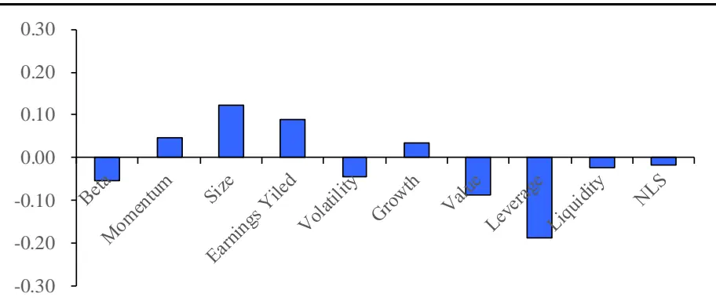
数据来源：国泰君安证券研究

ESG 公司治理评价因子与十大类风格因子相关性较低，可用于后续研究。每月末，对ESG 公司治理评价因子与十大类风格因子在截面上计算相关系数，ESG公司治理评价因子与大市值、高盈利、低杠杆有一定的相关关系，但相关系数均不高，因子独立性较高。

表 13: ESG 公司治理评价因子与十类风格因子相关性不高

| Beta | Momentum | Size | Earnings Yiled | Volatility | Growth | Value | Leverage | Liquidity | NLS |
| --- | --- | --- | --- | --- | --- | --- | --- | --- | --- |
| -0.05 | 0.05 | 0.12 | 0.09 | -0.05 | 0.03 | -0.09 | -0.19 | -0.02 | -0.02 |

数据来源：国泰君安证券研究

公司治理好的公司除了具有一定大市值、高盈利、低杆杠特征以外，还具有更高的盈利能力以及盈利能力的延续性强、稳定性高的特征。考察与十大类风格因子的相关性之外，我们也考察ESG公司治理评价因子与其逻辑相关的ROE、股息率等其他因子的相关性，探寻公司治理与盈利能力及其稳定性、分红之间的关系，发现ESG 公司治理评价因子数值越高的公司，当下盈利能力越高，未来盈利能力也越高，盈利能力稳定性也越高，分红也越高；但总体来说，相关系数均不高于 0.13，因子独立性并没有受到较大的影响。

表 14: 公司治理与盈利能力及稳定性、分红的相关性不高

| 属性 | 因子 | 相关系数（平均） |
| --- | --- | --- |
| 当下盈利能力 | ROE | 0.13 |
| 未来盈利能力 | delta ROE（经行业中位数调整） | 0.05 |
| 盈利能力稳定性 | 最近三年ROE(TTM)波动率（经行业中性处理） | -0.09 |
| 分红 | 股息率 | 0.06 |

数据来源：国泰君安证券研究

## 4.3.ESG公司治理评价因子分域研究

因子的分域（风格、行业、板块等）研究，一方面需要我们从逻辑上探寻因子最适用、最能发挥作用的域，另一方面需要我们从统计上验证因子在该域中的显著性。那么关于公司治理是否需要分域研究，我们分别从逻辑与统计上说明该研究的必要性。

企业生命周期的阶段不同，企业经营者对公司治理需求程度不同，投资者对公司治理的重视程度也不同。企业的生命周期理论，将企业的发展阶段分为导入期（发展期）、成长期、成熟期以及衰退期，对于其中发展成长期的小公司与成长成熟期的大公司来说，公司治理具有不同的意义与作用。

图 8企业阶段不同，企业经营者及投资者对公司治理的看法也不同
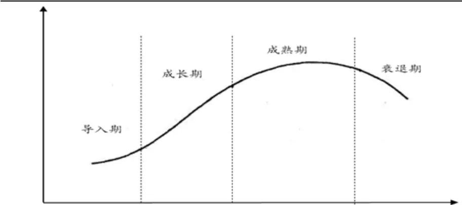
数据来源：国泰君安证券研究

从逻辑上看，公司治理对大公司的选股能力更强。我们分企业经营者与投资者两个视角去看，首先从企业经营者的视角看：

- 小公司企业处于高速发展阶段，企业人数少，同心协力开拓业务，代理问题不够突出，公司治理对企业经营发展影响不大，企业经营者不会可以追求标准化的公司治理制度；

- 大公司具有一定规模，需要有效控制企业风险，必须寻求标准化的公司治理，有利于企业稳定经营发展。

其次从投资者的视角看：

- 对于小公司，投资者更多关注企业的成长性，而不是企业的稳健性与制度的完善性；

- 对于大公司，投资者更看重企业价值，企业的稳定性以及分红的稳定性，更加重视公司治理。

从统计上看，公司治理在大市值域具有更强的选股能力，IC为 0.026，优于中市值域与小市值域。截取全市场排名前三分之一的标的作为大市值域，再截取全市场排名后三分之一的标的作为小市值域以及全市场排名中间三分之一的中市值域为对照组，检验ESG公司治理评价因子在大市值域与小市值域中的显著性差异，结果表明其IC为 0.026，相较于中市值域IC 值 0.019以及小市值域 IC 值 0.02 均有显著提升。

表 15: 大市值域中 ESG 公司治理评价因子达到 0.026

| 小市值域（1/3） 中市值域（1/3） |  |  | 大市值域（1/3） |
| --- | --- | --- | --- |
| IC | 0.0201 | 0.0189 | 0.0256 |
| std | 0.0616 | 0.0665 | 0.0602 |
| t统计量 | 3.19 | 2.78 | 4.17 |

数据来源：国泰君安证券研究

## 5. 常用策略构建

基于上述研究，本部分我们将构建一些简单的策略并做相应的历史回溯测试，从中观察ESG 公司治理评价因子在过去的收益表现，策略内容主要包括简单的优质筛选及负面排除策略，与业绩相关因子结合的组合策略以及长期投资风险较低的G 指数策略。

## 5.1.优质筛选及负面排除策略

分别对全市场、沪深300构建优质筛选及负面排除策略，观察对比两种策略的组合收益以及多空收益。具体的策略构建方法如下：

- 标的选取方法：对ESG公司治理评价因子经行业中性处理后的因子值进行排序，全市场（或沪深300）中排名前50的标的作为优质筛选策略的样本股，排名后50 的标的作为负面排除策略的样本股；

- 标的调整时间：每年 4月末、8 月末以及10 月末（一年三次，财报期后）；

- 交易手续费：单边千分之三；

- 加权方式：流通市值加权。

图 9全市场优质筛选策略
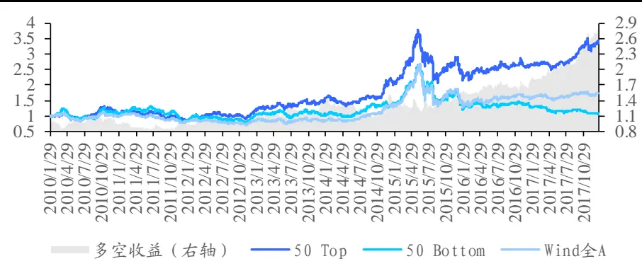
数据来源：Wind、国泰君安证券研究

图 10沪深 300优质筛选策略
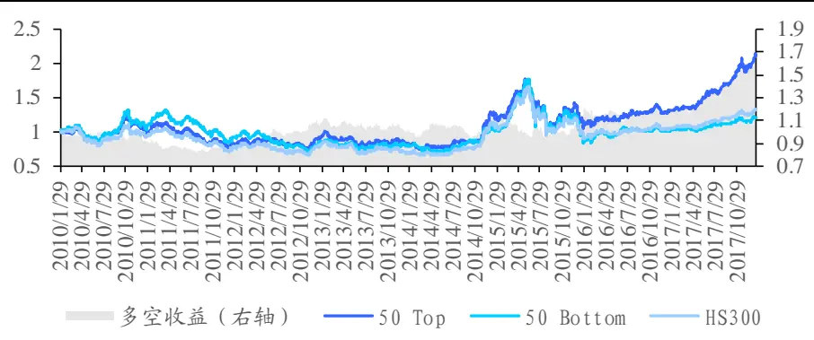
数据来源：Wind、国泰君安证券研究

全市场优质筛选策略年化超额收益率（相对于万得全 A）为 11.78%，负面排除策略年化超额收益率为-3.78%；沪深 300优质筛选策略年化超额收益率（相对于沪深 300）为 6.10%，负面排除策略年化超额收益率为-1.14%。

表 16: 优质筛选策略贡献正向超额，负面排除策略贡献负向超额

|  | 全市场 |  |  | 沪深300 |  |  |
| --- | --- | --- | --- | --- | --- | --- |
|  | 50 Top | 50 Bottom | 多空收益 | 50 Top | 50 Bottom | 多空收益 |
| 年化绝对收益率 | 16.46% | 0.75% | 14.13% | 9.83% | 2.43% | 6.50% |
| 绝对收益波动率 | 25.99% | 25.62% | 18.87% | 25.33% | 25.39% | 13.04% |
| 夏普比率 | 0.72 | 0.16 | 0.80 | 0.50 | 0.22 | 0.55 |
| 最大回撤 | -44.83% | -60.38% | -26.96% | -43.23% | -52.46% | -21.94% |
| 月胜率 | 58% | 51% | 51.24% | 57% | 54% | 50.98% |
| 年化超额收益率 | 11.78% | -3.78% | - | 6.10% | -1.14% | - |
| 超额收益波动率 | 15.13% | 17.58% | 1 | 8.08% | 9.47% | - |
| IR | 0.81 | -0.13 | - | 0.77 | -0.07 | - |
| 最大回撤 | -20.71% | -58.60% | - | -15.41% | -29.25% | - |
| 月超额胜率 | 58% | 51% | - | 57% | 51% | - |
| 年化换手率 | 110% | 86% | 一 | 70% | 83% | – |

数据来源：国泰君安证券研究

## 5.2. 组合策略

将ESG公司治理评价因子与传统的盈利、成长、盈利能力、分红等业绩相关的因子（盈利因子、成长因子以及ROE、股息率等）相结合，从全市场选取每组组合因子排名前 50 的标的构建等权组合，考察简单的组合策略的收益表现（超额收益以万得全 A 为基准）。其中因子的具体定义如下：

- 盈利因子（Earnings Yield）：基于一致预期每股收益、历史 EP 值以及每股现金收益加权合成的因子；

- 价值因子（Value）：账面市值比BP；

- ROE：净资产收益率（平均）；

- 股息率：每股现金分红/股票价格。

具体的策略构建步骤如下 ：

- 标的选取方法：对两个因子做标准化处理，等权相加后再做行业中性处理，最终得到组合因子值，根据组合因子值，选取因子值排名前50的标的；

- 标的调整时间：每年 4月末、8 月末以及10 月末（一年三次，财报期后）；

- 交易手续费：单边千分之三；

- 加权方式：等权。

业绩相关因子结合 ESG 公司治理评价因子的组合策略，相较于业绩相关单因子策略，收益与夏普比率均有较大提升，最大回撤均有一定程度的下降，说明考虑公司治理因素，可以有效提升组合收益，降低组合波动。其中ESG 公司治理评价因子结合盈利的组合策略（G+EY）相对万得全A 年化超额收益 14.4%，跑赢盈利单因子策略 1.5%，IR 由 1.38提升至 1.68，最大回撤由 25.1%降至 16.6%。

表 17: ESG 公司治理评价因子有助于增强业绩等相关因子

| 策略 | 绝对收益 | 夏普比率 | 最大回撤 | 月胜率 | 超额收益 | 超额收益波动率 | IR | 最大回撤 | 月超额胜率 | 年化换手率 |
| --- | --- | --- | --- | --- | --- | --- | --- | --- | --- | --- |
| EY | 21.4% | 0.90 | -45.6% | 64% | 12.9% | 9.1% | 1.38 | -25.1% | 62% | 129% |
| G+EY | 22.9% | 0.94 | -42.8% | 61% | 14.4% | 8.2% | 1.68 | -16.6% | 68% | 120% |
| Growth | 4.3% | 0.29 | -51.2% | 54% | -3.1% | 10.0% | -0.27 | -33.4% | 47% | 111% |
| G+Growth | 6.1% | 0.36 | -49.7% | 54% | -1.2% | 9.5% | -0.08 | -22.9% | 48% | 122% |
| ROE | 8.0% | 0.43 | -50.4% | 53% | 0.3% | 9.7% | 0.08 | -28.8% | 53% | 103% |
| G+ROE | 15.2% | 0.68 | -44.1% | 58% | 7.1% | 9.7% | 0.76 | -23.6% | 58% | 92% |
| Div | 7.4% | 0.39 | -55.0% | 55% | 0.3% | 12.4% | 0.09 | -34.4% | 54% | 70% |
| G+Div | 11.1% | 0.52 | -51.4% | 54% | 3.5% | 11.4% | 0.36 | -23.9% | 54% | 92% |

数据来源：国泰君安证券研究

## 5.3. G 指数编制

在上一部分公司治理分域研究中，我们验证了ESG公司治理评价因子在大市值域中的有效性：有助于提升大市值域选股能力，降低投资风险。基于该结论，我们期望能够从市场中选取长期投资风险较低的公司，并构建G指数，观察分析G指数在过去的收益表现。G 指数的具体编制规则如下：

- 样本股选取方法：沪深300样本股中ESG得分（行业中性处理）排名前50 的标的；

- 样本股调整时间：每年4月末、8 月末以及10月末（一年三次，财报期后）；

- 指数加权方式：经ESG公司治理评价因子调整后的流通市值加权。

经 ESG 公司治理评价因子调整后的流通市值加权方式指的是在流通市值加权权重 $w_{i}$ 的基础上，用 ESG 公司治理评价因子进行调整，得到最终的权重具体方法

终的权重 $\widetilde{W}_{i}$ ，具体方法如下：

$$
W_{i}=w_{i}\cdot\frac{ESG_{i}-\overline{ESG_{i}}}{\sigma\left(ESG_{i}\right)}
$$

$$
\tilde{W_{i}}=\frac{W_{i}}{\displaystyle\sum_{i}W_{i}}.
$$

G 指数 2010 年 1 月末至 2018 年 1 月 18 日累计收益 125.67%，同期沪深 300指数累计收益33.31%，超额收益累计76.55%。观察G 指数整体收益情况，发现 G 指数自 2010 年以来，相对沪深 300 指数超额收益逐步上升，15 年下半年开始至今超额收益显著提升。观察 G 指数回撤情况，发现 G 指数于上一轮牛市中出现较大回撤，这是由于 14 年下半年券商股集体行情与 15 年小市值股票行情造成的结果（行业、风格收益过高）。

图 11 2017全年 G指数相对沪深 300指数超额收益25.04%
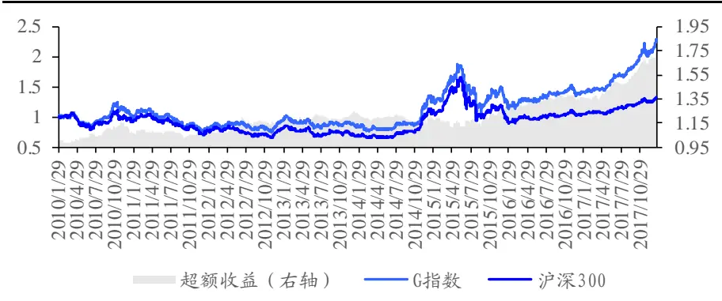
数据来源：Wind、国泰君安证券研究

G 指数累计超额收益 76.55%，年化超额收益率为 6.96%，年化换手率为 70%。特别是在2017年，其全年相对沪深300指数超额收益 25.04%，月超额胜率为 75%，IR 为 3.14，一定程度上说明了 ESG 公司治理评价因子在当下“蓝筹白马”的市场环境中具有较强的适用性。

表 18: G 指数 2017 年全年跑赢沪深 300 指数 25.04%

| 年份 | 年绝对收益 | 夏普比率 | 最大回撤 | 年超额收益 | 年超额波动 | IR | 最大回撤 | 月超额胜率 | 年化换手率 |
| --- | --- | --- | --- | --- | --- | --- | --- | --- | --- |
| 2010 | 9.80% | 0.49 | -21.8% | 12.60% | 9.35% | 1.32 | -5.4% | 73% | 69% |
| 2011 | -27.66% | -1.32 | -32.7% | -3.23% | 6.23% | -0.50 | -7.8% | 58% | 80% |
| 2012 | 15.35% | 0.78 | -18.2% | 7.29% | 6.10% | 1.19 | -5.2% | 58% | 69% |
| 2013 | -1.19% | 0.06 | -21.3% | 6.86% | 6.91% | 1.00 | -5.3% | 67% | 70% |
| 2014 | 46.80% | 1.88 | -15.0% | -2.94% | 7.26% | -0.38 | -9.8% | 42% | 69% |
| 2015 | 10.92% | 0.46 | -42.5% | 5.55% | 12.98% | 0.48 | -9.7% | 50% | 70% |
| 2016 | -5.38% | -0.10 | -22.5% | 6.92% | 8.81% | 0.81 | -5.2% | 58% | 61% |
| 2017 | 51.77% | 2.94 | -9.9% | 25.04% | 7.24% | 3.14 | -4.4% | 75% | 74% |
| 2018(至今) | 7.30% | 2.42 | -1.1% | 0.94% | 2.33% | 0.44 | -1.7% | 100% | - |
| 总体 | 10.72% | 0.53 | -42.5% | 6.96% | 8.36% | 0.85 | -12.7% | 60% | 70% |

数据来源：国泰君安证券研究

## 6. 研究总结与展望

本篇报告在 ESG 海外研究框架的基础上，对国内 ESG 公司治理投资进行了详尽地研究。

我们首先参照海外成熟评价框架，从相关法律法规、学术文献以及国际治理准则中选取了58 个因子，分成了董事会、股权及股东、财务治理、薪酬及激励、治理行为及外部监督5大类构建了一个整体的 ESG公司治理评价因子。

其次，我们检验了该因子的显著性与独立性，发现其在经过行业、风格风险调整后对于收益表现出了较好的单调性，且因子与十大类风格相关性较低。此外，我们还从逻辑与统计上，分别证明了该因子在大公司域中会具有更好的选股效果，这对于我们结合当下市场环境选取“蓝筹、白马、龙头股”有一定帮助与指导。

最后我们构建了简单有效的投资策略，包括优质筛选&负面排除策略，与业绩相关因子结合的增强策略，以及长期投资风险较低的 G 指数策略，这些策略均取得了一定的效果。

在后续的研究中，我们将持续跟踪ESG 投资在国内的发展情况，并跟进ESG 方面的最新变化对现有公司治理投资策略的影响；此外，在未来环境（E）、社会（S）数据逐步完善的情况下，我们将构建更加完整的 ESG投资策略。

## 本公司具有中国证监会核准的证券投资咨询业务资格

## 分析师声明

作者具有中国证券业协会授予的证券投资咨询执业资格或相当的专业胜任能力，保证报告所采用的数据均来自合规渠道，分析逻辑基于作者的职业理解，本报告清晰准确地反映了作者的研究观点，力求独立、客观和公正，结论不受任何第三方的授意或影响，特此声明。

## 免责声明

本报告仅供国泰君安证券股份有限公司（以下简称“本公司”）的客户使用。本公司不会因接收人收到本报告而视其为本公司的当然客户。本报告仅在相关法律许可的情况下发放，并仅为提供信息而发放，概不构成任何广告。

本报告的信息来源于已公开的资料，本公司对该等信息的准确性、完整性或可靠性不作任何保证。本报告所载的资料、意见及推测仅反映本公司于发布本报告当日的判断，本报告所指的证券或投资标的的价格、价值及投资收入可升可跌。过往表现不应作为日后的表现依据。在不同时期，本公司可发出与本报告所载资料、意见及推测不一致的报告。本公司不保证本报告所含信息保持在最新状态。同时，本公司对本报告所含信息可在不发出通知的情形下做出修改，投资者应当自行关注相应的更新或修改。

本报告中所指的投资及服务可能不适合个别客户，不构成客户私人咨询建议。在任何情况下，本报告中的信息或所表述的意见均不构成对任何人的投资建议。在任何情况下，本公司、本公司员工或者关联机构不承诺投资者一定获利，不与投资者分享投资收益，也不对任何人因使用本报告中的任何内容所引致的任何损失负任何责任。投资者务必注意，其据此做出的任何投资决策与本公司、本公司员工或者关联机构无关。

本公司利用信息隔离墙控制内部一个或多个领域、部门或关联机构之间的信息流动。因此，投资者应注意，在法律许可的情况下，本公司及其所属关联机构可能会持有报告中提到的公司所发行的证券或期权并进行证券或期权交易，也可能为这些公司提供或者争取提供投资银行、财务顾问或者金融产品等相关服务。在法律许可的情况下，本公司的员工可能担任本报告所提到的公司的董事。

市场有风险，投资需谨慎。投资者不应将本报告作为作出投资决策的唯一参考因素，亦不应认为本报告可以取代自己的判断。
在决定投资前，如有需要，投资者务必向专业人士咨询并谨慎决策。

本报告版权仅为本公司所有，未经书面许可，任何机构和个人不得以任何形式翻版、复制、发表或引用。如征得本公司同意进行引用、刊发的，需在允许的范围内使用，并注明出处为“国泰君安证券研究”，且不得对本报告进行任何有悖原意的引用、删节和修改。

若本公司以外的其他机构（以下简称“该机构”）发送本报告，则由该机构独自为此发送行为负责。通过此途径获得本报告的投资者应自行联系该机构以要求获悉更详细信息或进而交易本报告中提及的证券。本报告不构成本公司向该机构之客户提供的投资建议，本公司、本公司员工或者关联机构亦不为该机构之客户因使用本报告或报告所载内容引起的任何损失承担任何责任。

## 评级说明

## 1.投资建议的比较标准

投资评级分为股票评级和行业评级。

以报告发布后的12个月内的市场表现为比较标准，报告发布日后的 12个月内的公司股价（或行业指数）的涨跌幅相对同期的沪深 300 指数涨跌幅为基准。

## 2.投资建议的评级标准

报告发布日后的 12 个月内的公司股价（或行业指数）的涨跌幅相对同期的沪深 300 指数的涨跌幅。

|  | 评级 | 说明 |
| --- | --- | --- |
| 股票投资评级 | 增持 | 相对沪深300指数涨幅15%以上 |
|  | 谨慎增持 | 相对沪深 300指数涨幅介于5%～15%之间 |
|  | 中性 | 相对沪深300指数涨幅介于-5%～5% |
|  | 减持 | 相对沪深 300指数下跌 5%以上 |
| 行业投资评级 | 增持 | 明显强于沪深 300 指数 |
|  | 中性 | 基本与沪深 300指数持平 |
|  | 减持 | 明显弱于沪深300指数 |

## 国泰君安证券研究所

|  | 上海 | 深圳 | 北京 |
| --- | --- | --- | --- |
| 地址 | 上海市浦东新区银城中路168号上海 银行大厦29层 | 深圳市福田区益田路 6009 号新世界 商务中心34层 | 北京市西城区金融大街 28 号盈泰中 心2号楼10层 |
| 邮编 | 200120 | 518026 | 100140 |
| 电话 | （021)38676666 | (0755)23976888 | (010)59312799 |
|  | E-mail: gtjaresearch@gtjas.com |  |  |