[Table_Title2018.03.10

# 基于不同域研究的多因子选股体系

## －－数量化专题之一百零八

李辰（分析师）

8 021-38677309

lichen@gtjas.com

证书编号 S0880516050003

本报告导读：本篇报告通过引入分域研究的理念，对传统多因子模型研究方法进行了拓展，并构建了相应的研究分析框架与投资策略。

## 摘要：

[Table_Summary]• 本篇报告通过引入分域研究的理念，对传统多因子模型研究体系进行了当时拓展，并构建了相应的研究分析框架与投资策略。

分域研究解决的是传统线性预测模型对市场非线性特征刻画的不足，也是量化与基本面结合的有效途径，通过对各行业、板块投资逻辑的量化建模，可以使得模型更贴近市场本质投资逻辑，更加精确的发掘有效投资机会。

我们通过采用全域风险调整后子域相关系数统计的检验方式，并以 12 大类 189 个小类因子为基础因子库，通过对宽基域、板块域、行业域的比较分析，找到了各个股票域内的核心驱动因素，也对各个行业、板块之间的区别进行了有效梳理。

- 在分域阿尔法模型的基础上，我们分别构建了沪深 300成分股增强、中证500成分股增强、各行业指数成分增强策略，实证分析结果表明，域内有效阿尔法因子的应用可以获取较为稳健的超额收益。

通过分行业域模型预测整合得到全截面预测收益的方法，我们构建了全市场选股增强模型，实证分析结果表明，自 2011年 1 月至 2018 年 1 月，沪深 300 全市场增强策略年化超额收益 15%，信息比率 3.1；中证 500 全市场增强策略年化超额收益24.5%，信息比率 3.5，组合表现均较为稳健。

- 本篇报告的研究表明，即便在市场风格剧烈波动的环境下，在分域预测和风险中性控制的基础上，多因子模型仍能表现出稳健战胜市场基准指数的良好特性，是投资者值得信赖的投资方式。

金融工程

## 金融工程团队：

刘富兵：（分析师）

电话：021-38676673

邮箱：liufubing008481@gtjas.com

证书编号：S0880511010017

陈奥林：（分析师）

电话：021-38674835

邮箱：chenaolin@gtjas.com

证书编号：S0880516100001

## 李辰：（分析师）

电话：021-38677309

邮箱：lichen@gtjas.com

证书编号：S0880516050003

## 孟繁雪：（分析师）

电话：021-38675860

邮箱：mengfanxue@gtjas.com

证书编号：S0880517040005

## 蔡旻昊：（研究助理）

电话：021-38674743

邮箱：caiminhao@gtjas.com

证书编号：S0880117030051

## 殷明：（研究助理）

电话：021-38674637

邮箱：yinming@gtjas.com

证书编号：S0880116070042

## 叶尔乐：（研究助理）

电话：021-38032032

邮箱：yeerle@gtjas.com

证书编号：S0880116080361

## 殷钦怡：（研究助理）

电话：021-38675855

邮箱：yinqinyi@gtjas.com

证书编号：S0880117060109

## [Table_R相关报告

《ESG 投资之公司治理》2018.02.06

《基于时变波动率及跳扩散过程的期权定价模型及其策略应用》2017.12.24

《基于时变波动率的期权定价模型》2017.11.16

《盈余质量检验及其投资策略构建》2017.09.20

《抱团行为和慢牛股研究》2017.09.19

## 1. 引言

2017 年以来，市场风格发生巨大变化，以上证 50 为代表的大盘蓝筹股得到市场持续青睐，而中小市值的股票则持续下跌，各行业、板块的走势也出现了明显的分化。由此导致了传统阿尔法模型业绩波动加剧，部分因子预测能力几近失效。在这样的市场环境下，量化选股策略无疑需要向更加深入、更加细致的方向拓展。在这其中，组合管理深化、不同域的应用、风格因子配置是三个重要的研究拓展方向。

对于组合管理而言，我们在之前的报告中已经对风险模型的原理及应用、组合权重优化方法的应用、阿尔法因子的组合特征等研究方向有了较为系统的介绍。而对于风格因子配置而言，在应用量化统计模型的方法之余，基本面的研究逻辑及信息也不容忽视，两者结合或许可以提供有效的投资指引，这在我们之后的专题报告中会有具体介绍。

本篇报告重点讨论的是不同域的应用问题。

域即为股票范围，域的划分没有固定规则，可以根据不同宽基指数的划分，例如沪深 300、中证 500、上证50指数成分股域，也可以根据概念板划分，例如周期板块、消费板块、金融板块成分股域等，还可以根据行业板块划分，例如证监会行业划分、GICS行业划分股票域等，同样还可以根据风格板块划分，例如大中小市值风格股票域、高中低价值风格股票域等。

对于不同域的应用，其本质上解决的是传统线性模型对市场非线性特征部分刻画的不足。即便传统因子的检验方法在全市场截面上存在较强的统计显著性，但其在某些行业、板块、风格域中的影响远强于平均水平，而在某些行业、板块上却几乎没有影响，甚至反向情况。全域的因子检验并不能有效识别这一特征及其背后的内在规律，所以对因子的分域统计检验，可以更有效、贴切的探究市场背后的本质逻辑。尤其是在当前的市场投资风格下，各行业、板块、风格域背后的股价核心驱动因素差异较大，因此因子的分域研究是很有必要的。

不同域的应用研究路径有两条：其一，给定域的情况下，域内有效因子的研究及区别。例如，沪深300指数域与中证500指数域的有效阿尔法因子的区分以及相应的域属性区分。其二，给定因子的情况下，因子在不同域内的预测显著性差别。例如，ROE 因子在哪一类风格股票中区分度最高、选股效果最好的问题。

本篇报告将沿第一条研究路径，对不同域的股票价格驱动因素进行统计检验比较及逻辑分析。在后续的报告中，我们也将沿着第二条研究路径对各类因子的最优选股域进行实证策略分析。

在本篇报告的第二章节中，我们将提出域因子检验的方法。在第三章中，我们将根据构建的因子库，对宽基域、板块域以及行业域进行区分研究，进而比较各个宽基指数、板块、以及行业指数内在的区别。在第四章中，我们将构建相应的选股策略及实证分析研究。第五章为总结部分。

## 2. 不同域的问题

## 2.1.不同域的问题

传统多因子模型对因子的检验过程均包含了基本假设：即目标因子对股票收益率的影响是线性的，无论是回归法还是相关系数检验方法均是如此。然而，在实际市场运行中，各个行业、板块、风格的股价变动逻辑都有所不同，相同定义的驱动因子在各个行业、板块背后的实际逻辑也大相径庭，因此因子收益的非线性特征更贴近市场的本质特性。

研究市场非线性特征的方法较多，其中不同域的区分检验是逻辑上最为直观的。域的概念来自学术研究，Sloan[2001]、Beneish、Lee、Tapely[2001]等人将不同类型的股票具有不同的驱动因素的研究方法称之为域（Contextual）研究。诸多学术研究表明，例如，成长股具有更强的动量效应；财务质量因子对价值股的影响效应更为显著；价量特征因子对小市值股票的预测能力更强等等。

本篇报告将对A股市场进行实证域研究分析，我们将从宽基域、板块域、行业域3 个维度，利用统一的因子框架，寻找各个域内股价的核心驱动因素，在此基础上对各个域的属性进行区分比较，并进一步构建相应的投资策略。

## 2.2.不同域因子有效性检验

本节，我们将介绍域研究的流程，具体分为4 步骤：驱动因子整理分类、域的划分定义、域内因子有效性检验方法、域属性比较分析与策略应用。

## 2.2.1. 驱动因子整理分类

我们首先根据因子的定义逻辑，将因子库分为 12 大类因子，共计 189个小类因子，其中大类因子分为：盈利、一致预期、市场情绪、交易行为、规模、估值、杠杆、动量、成长、财务质量、其他以及银行专属。其中，一致预期类因子再根据分析师预期数据类型分为：一致预期盈利、一致预期估值、一致预期成长 3 类。

具体每大类因子中小类因子数量详见下表

表：各大类因子内子因子个数

| 因子 类型 | 盈利 因子 | 预期 盈利 | 预期 估值 | 预期 | 市场 | 交易 | 规模 | 估值 | 杠杆 | 动量 | 成长 | 财务 | 其他 | 银行 专属 |
| --- | --- | --- | --- | --- | --- | --- | --- | --- | --- | --- | --- | --- | --- | --- |
| 因子 数量 | 18 | 15 | 5 | 成长 3 | 情绪 17 | 行为 42 | 因子 8 | 因子 18 | 因子 8 | 因子 7 | 因子 15 | 质量 19 | 5 | 9 |

数据来源：国泰君安证券研究

全部因子的详细定义方式详见附录 1。所有因子的逻辑及构建方式，均来自于海内外学术研究报告，此处不再逐一说明。

## 2.2.2. 域的划分定义

域的定义划分较为主观，本篇报告中，我们将从宽基域、板块域、行业域3个维度进行考察分析。

具体而言：

1）宽基域包括：沪深 300、中证500、中证1000 及中证1000后；

2）板块域包括：周期、消费、服务、制造、TMT；

3）行业域包含申万一级 27 行业（除综合），具体为：交通运输、休闲服务、传媒、公用事业、农林牧渔、化工、医药生物、商业贸易、国防军工、家用电器、建筑材料、建筑装饰、房地产、有色金属、机械设备、汽车、电子、电气设备、纺织服装、计算机、轻工制造、通信、采掘、钢铁、银行、非银金融、食品饮料。

## 2.2.3. 域内因子有效性检验方法

通常而言，全域因子检验由于股票数量较多，因此检验方法较为灵活，例如常规的分档检验、风险调整回归检验、风险调整相关系数检验。但是，在子域中，由于股票数量存在不确定性，将导致域内分档检验或域内风险调整的结果不具备较强的统计检验效果，因此域内因子检验需要一些新的模式。

本篇报告中，我们将采用全域风险调整后子域相关系数统计的检验方式，即首先利用风险模型对全域股票因子截面和股票收益率进行风险调整，剔除市场大类风格因素影响，得到风险调整后因子载荷截面与风险调整后股票收益截面；其次，在风险调整后因子载荷截面与风险调整后股票收益截面中，提取对应子域向量，计算两者相关系数；最后，统计时间序列上，相关系数序列的统计显著性，得到域内目标因子的检验结果。详细步骤如下：

Step 1. 计算 t期原始因子值，并做去极值标准化处理，得到标准化原值因子载荷截面 $x_{_t}$ ；

Step 2. 计算风险调整后因子载荷截面 $\mathcal{E}_{\mathrm{~}t}$ ，即 $x_{_t}=\beta_{_t}\cdot X_{_t}^{^{risk}}+\varepsilon_{_t}$ ，其中$\textbf{ \textit { X } }_{risk}$ 包含行业哑变量矩阵及 10类风险因子载荷矩阵；

Step 3. 计算风险调整后个股收益残差截面 $\varepsilon r_{_t}$ ，即 $R_{_t}=\beta_{_t}^{^{\cdot}}\cdot X_{_t}^{^{risk}}+\varepsilon r_{_t}$ 其中 $R_{\phantom{}_{t}}$ 为股票收益率截面, $\boldsymbol{X}_{risk}$ 同上定义；

Step 4. 选取 $\mathcal{E}_{\mathrm{~r~}}$ 和 $\mathcal{E}\:r_{\iota}$ 截面中，截取对应目标域对应个股的因子载荷截

面 $\mathcal{E}_{t}^{\textit{ c o n t e x t u a l }}$ 和 $\mathcal{E}r_{_t}^{^{contextual}}$ 收益残差截面，并进行标准化处理；

Step 5 计算截面 $\mathcal{E}_{t}^{\textit{ c o n t e x t u a l }}$ 与截面 $\mathcal{E}r_{_t}^{^{contextual}}$ 的相关系数 $IC_{\textit{ t }}$ ；

Step 6 重复上述过程，得到 T时间内段的IC 序列，并统计IC 序列的相关统计检验指标。

采用全域风险调整后子域相关系数统计的检验方式即避免了域内风格因素的干扰，同时也解决了由于域内股票数量较少所导致的统计方法上的检验偏差，是域内因子有效性检验的较好方法。

## 2.2.4. 域比较分析与策略应用

根据 IC 序列显著性检验结果，我们根据下述 3 条件，选择有效的因子簇，具体而言：

1）有效因子IC 序列绝对值均值>0.02;

2） 有效因子 IC 序列 ICIR 绝对值>2;

3）有效因子簇中，两两因子的 IC序列相关性绝对值<0.5，其中高相关性因子的选择以ICIR 优先排序;

在此基础上，我们根据选择的有效因子簇的统计结果，分别计算如下指标：

1）域内股票收益截面预测IC绝对值加总值IC_ALL；

2）域内各大类因子的预测 IC绝对值加总值IC_STYLE；

3）域内各大类因子的预测成分占比。

有了上述各项指标后，我们可以对各个不同的域之间，股票收益的预测难度、核心驱动因子的区别、以及每类因子的占比高低等进行比较分析。

## 3. 不同域的股票价格驱动因素探究

本章，我们将根据不同域的因子有效性检验方法，利用第 2章中定义的因子库中的所有因子对不同域的股票进行覆盖检验，总结并比较各域的特点及区别。

其中，因子检验时间均为 2010 年 1 月至 2017 年 12 月，数据检验频率则均为月频率。

## 3.1.宽基域比较

宽基域的比较我们选择最为常见的沪深300、中证 500、中证1000作为目标研究域，中证1000后则表示全市场非ST股票中，除上述3个指数成分股之外的所有股票作为样本。

## 3.1.1. 宽基域的因子分析

## 3.1.1.1.沪深 300

沪深300指数选取沪深两市 A 股中规模大、流动性好且不存在重大问题的前300只股票作为其样本股。这 300支股票市值偏大，盈利较好，多分布于银行、非银行金融等行业。

沪深300成分股有效因子数量为 13个，预测IC加总 IC_ALL为 0.347，其中一致预期盈利占比 28.24%、交易行为占比 27.35%、市场情绪占比16.32%、成长占比14.70%、动量占比 13.39%，具体统计结果如下：

表：沪深 300有效因子显著性统计

| 因子类别 | 一致预期盈利 | 交易行为 | 市场情绪 | 成长 | 动量 |
| --- | --- | --- | --- | --- | --- |
| IC_STYLE | 0.0979 | 0.0948 | 0.0566 | 0.0509 | 0.0464 |
| IC_ALL | 28.24% | 27.35% | 16.32% | 14.70% | 13.39% |

数据来源：国泰君安证券研究

图：沪深 300大类有效因子IC加总统计
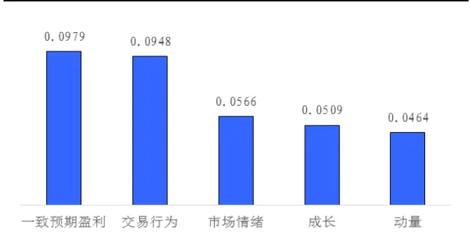
数据来源：国泰君安证券研究

图：沪深300大类有效因子占比统计
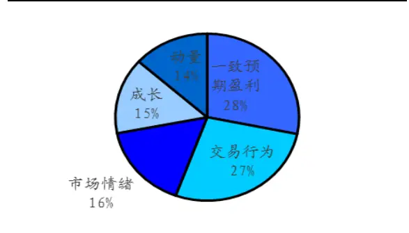
数据来源：国泰君安证券研究

表：沪深 300有效因子明细：

| 因子序号 | 因子名称 | 因子类别 | IC 均值 | ICIR | 因子序号 | 因子名称 | 因子类别 | IC 均值 | ICIR |
| --- | --- | --- | --- | --- | --- | --- | --- | --- | --- |
| 19 | Clo_MaxMin_3M | 交易行为 | 0.0271 | 3.16 | 89 | mom_3m | 动量 | -0.0228 | -2.39 |
| 22 | Corr_Clo_Turn | 交易行为 | -0.0376 | -5.31 | 95 | mom_np_FY1 | 一致预期盈利 | 0.0229 | 4.32 |
| 73 | Mean_Ret_Amt | 市场情绪 | 0.0238 | 2.83 | 96 | mom_oper_rev_q | 成长 | 0.0265 | 4.19 |
| 82 | mom3_rating | 一致预期盈利 | -0.0260 | -5.33 | 144 | SL_Volume_1M | 市场情绪 | -0.0328 | -4.35 |
| 83 | mom3_rev_FY1 | 一致预期盈利 | 0.0254 | 4.04 | 159 | Turn_Std_1M | 交易行为 | -0.0301 | -4.28 |
| 84 | mom3_roe_FY1 | 一致预期盈利 | 0.0235 | 4.06 | 184 | yoy_oper_rev | 成长 | 0.0244 | 4.06 |
| 88 | Mom_1Y_1M | 动量 | 0.0236 | 3.20 |  |  |  |  |  |

数据来源：国泰君安证券研究

## 3.1.1.2.中证 500

中证500指数从全部A股中剔除沪深300指数样本股及最近一年日均总市值排名前300股票后，选取 500支总市值最大、流动性好的股票作为其样本股。这500只股票能够综合反映 A股市场中小公司的股价表现，多分布于化工、医药生物以及 TMT等行业。

中证500成分股有效因子数量为 17个，预测IC加总 IC_ALL为 0.442，其中交易行为占比 54.54%、一致预期盈利占比 21.13%、市场情绪占比12.85%、成长占比11.48%，具体统计结果如下：

表：中证 500有效因子显著性统计

| 因子类别 | 交易行为 | 一致预期盈利 | 市场情绪 | 成长 |
| --- | --- | --- | --- | --- |
| IC_STYLE | 0.2409 | 0.0933 | 0.0568 | 0.0507 |
| IC_ALL | 54.54% | 21.13% | 12.85% | 11.48% |

数据来源：国泰君安证券研究

图：中证 500大类有效因子IC加总统计
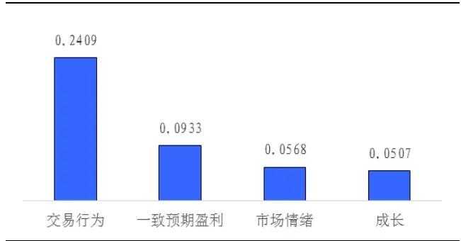
数据来源：国泰君安证券研究

图：中证500大类有效因子占比统计
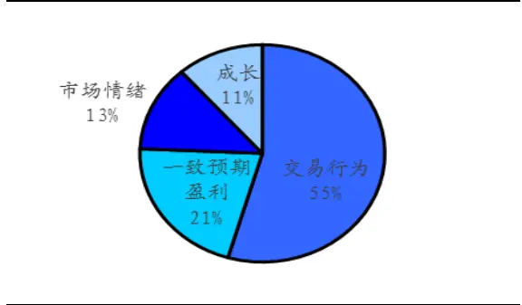
数据来源：国泰君安证券研究

表：中证 500有效因子明细：

| 因子序号 | 因子名称 | 因子类别 | IC 均值 | ICIR | 因子序号 | 因子名称 | 因子类别 | IC 均值 | ICIR |
| --- | --- | --- | --- | --- | --- | --- | --- | --- | --- |
| 20 | Clo_MaxMin_6M | 交易行为 | 0.0278 | 4.31 | 95 | mom_np_FY1 | 一致预期盈利 | 0.0260 | 6.17 |
| 22 | Corr_Clo_Turn | 交易行为 | -0.0332 | -5.86 | 98 | mom_rev_FY1 | 一致预期盈利 | 0.0212 | 5.53 |
| 25 | CoV_Volume_1M | 市场情绪 | -0.0290 | -5.64 | 153 | tsmon | 交易行为 | -0.0239 | -3.57 |
| 58 | High_Low | 交易行为 | -0.0333 | -5.13 | 154 | Turn_1M_3M | 市场情绪 | -0.0278 | -4.73 |
| 60 | iv_cmap | 交易行为 | -0.0220 | -4.17 | 168 | Vol_Diff | 交易行为 | -0.0217 | -3.59 |
| 62 | ivday | 交易行为 | -0.0226 | -4.17 | 170 | Vol_Std_1M | 交易行为 | -0.0309 | -3.85 |
| 70 | MACD | 交易行为 | -0.0256 | -3.23 | 184 | yoy_oper_rev | 成长 | 0.0227 | 4.79 |
| 81 | mom3_np_FY1 | 一致预期盈利 | 0.0252 | 5.56 | 186 | yoy_opprofit_q | 成长 | 0.0280 | 5.38 |
| 83 | mom3_rev_FY1 | 一致预期盈利 | 0.0209 | 5.65 |  |  |  |  |  |

数据来源：国泰君安证券研究

## 3.1.1.3.中证 1000

中证 1000 指数从全部 A 股中剔除沪深 300 指数以及中证 500 指数样本股后，选取规模偏小且流动性好的 1000 只股票作为其样本股。这 1000只股票能够综合反映 A 股市场小公司的股价表现，其与中证 500指数样本股的行业分布类似，多分布于化工、医药生物以及 TMT等行业。

中证1000成分股有效因子数量为14 个，预测IC 加总 IC_ALL为 0.455，其中交易行为占比 54.77%、市场情绪占比 23.49%、成长占比 11.73%、一致预期盈利占比10.01%，具体统计结果如下：

表：中证 1000有效因子显著性统计

| 因子类别 | 交易行为 | 市场情绪 | 成长 | 一致预期盈利 |
| --- | --- | --- | --- | --- |
| IC_STYLE | 0.2493 | 0.1069 | 0.0534 | 0.0456 |
| IC_ALL | 54.77% | 23.49% | 11.73% | 10.01% |

数据来源：国泰君安证券研究

图：中证 1000大类有效因子IC加总统计
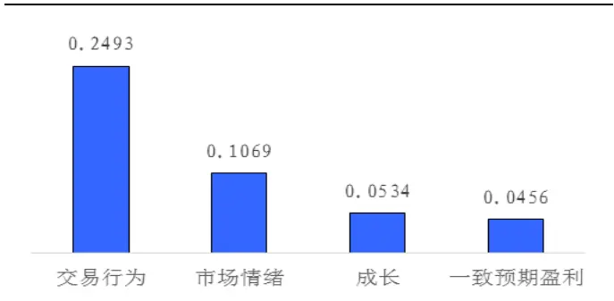
数据来源：国泰君安证券研究

图：中证1000大类有效因子占比统计
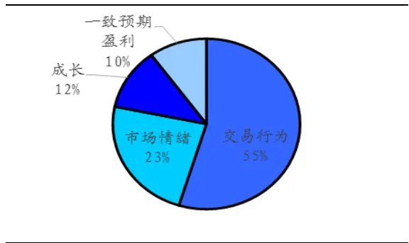
数据来源：国泰君安证券研究

表：中证 1000有效因子明细：

| 因子序号 | 因子名称 | 因子类别 | IC 均值 | ICIR | 因子序号 | 因子名称 | 因子类别 | IC 均值 | ICIR |
| --- | --- | --- | --- | --- | --- | --- | --- | --- | --- |
| 20 | Clo_MaxMin_6M | 交易行为 | 0.0275 | 4.81 | 95 | mom_np_FY1 | 一致预期盈利 | 0.0211 | 6.42 |
| 22 | Corr_Clo_Turn | 交易行为 | -0.0473 | -8.40 | 126 | Ret_AMT | 市场情绪 | 0.0251 | 5.41 |
| 58 | High_Low | 交易行为 | -0.0462 | -8.95 | 142 | Skew_Ret_1M | 交易行为 | -0.0205 | -4.31 |
| 62 | ivday | 交易行为 | -0.0242 | -4.47 | 156 | Turn_Mean_1M | 市场情绪 | -0.0394 | -6.18 |
| 72 | Mean_AMT | 市场情绪 | -0.0424 | -6.56 | 162 | Turn_StdRate_1M | 交易行为 | -0.0441 | -8.37 |
| 81 | mom3_np_FY1 | 一致预期盈利 | 0.0245 | 6.60 | 178 | yoy_eps | 成长 | 0.0267 | 5.88 |
| 86 | mom_1m_indus | 交易行为 | -0.0396 | -5.21 | 184 | yoy_oper_rev | 成长 | 0.0267 | 6.39 |

数据来源：国泰君安证券研究

## 3.1.1.4.中证 1000 后

中证 1000 后从全部 A 股中剔除沪深 300 指数、中证 500 指数以及中证1000指数后，选取剩余全部股票作为其样本股，这些样本股市值相较于中证1000指数更小，流动性相对较差。

中证 1000 后成分股有效因子数量为 20 个，预测 IC 加总 IC_ALL 为0.685，其中交易行为占比 44.82%、市场情绪占比 31.50%、成长占比8.31%、一致预期盈利占比 6.41%、规模占比 4.56%、动量占比 4.40%，具体统计结果如下：

表：中证 1000后有效因子显著性统计

| 因子类别 | 交易行为 | 市场情绪 | 动量 | 估值 | 杠杆 | 规模 |
| --- | --- | --- | --- | --- | --- | --- |
| IC_STYLE | 0.2911 | 0.2154 | 0.0278 | 0.0223 | 0.0220 | 0.0211 |
| IC_ALL | 48.53% | 35.92% | 4.63% | 3.73% | 3.66% | 3.53% |

数据来源：国泰君安证券研究

图：中证 1000后大类有效因子 IC加总统计
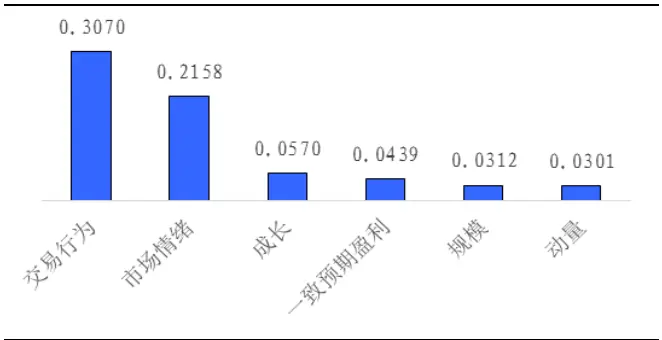
数据来源：国泰君安证券研究

图：中证1000后大类有效因子占比统计
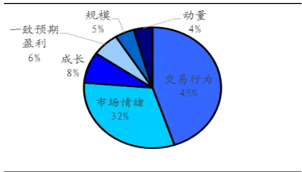
数据来源：国泰君安证券研究

表：中证 1000后有效因子明细：

| 因子序号 | 因子名称 | 因子类别 | IC 均值 | ICIR | 因子序号 | 因子名称 | 因子类别 | IC 均值 | ICIR |
| --- | --- | --- | --- | --- | --- | --- | --- | --- | --- |
| 5 | Amt_1M_3M | 市场情绪 | -0.0518 | -7.00 | 95 | mom_np_FY1 | 一致预期盈利 | 0.0218 | 5.87 |
| 20 | Clo_MaxMin_6M | 交易行为 | 0.0271 | 3.84 | 126 | Ret_AMT | 市场情绪 | 0.0358 | 6.11 |
| 22 | Corr_Clo_Turn | 交易行为 | -0.0508 | -8.81 | 130 | Ret_Std_1W | 交易行为 | -0.0322 | -5.27 |
| 25 | CoV_Volume_1M | 市场情绪 | -0.0411 | -6.27 | 142 | Skew_Ret_1M | 交易行为 | -0.0218 | -3.48 |
| 58 | High_Low | 交易行为 | -0.0537 | -7.95 | 156 | Turn_Mean_1M | 市场情绪 | -0.0331 | -4.59 |
| 60 | iv_cmap | 交易行为 | -0.0251 | -4.30 | 163 | Turn_StdRate_3M | 交易行为 | -0.0201 | -3.89 |
| 75 | mkt_cap_ard_indus | 规模 | 0.0312 | 6.43 | 166 | Up_Down_Vol | 市场情绪 | 0.0539 | 6.05 |
| 81 | mom3_np_FY1 | 一致预期盈利 | 0.0221 | 5.28 | 168 | Vol_Diff | 交易行为 | -0.0250 | -3.76 |
| 86 | mom_1m_indus | 交易行为 | -0.0513 | -6.08 | 184 | yoy_oper_rev | 成长 | 0.0302 | 6.23 |
| 91 | Mom_6M | 动量 | -0.0301 | -4.19 | 186 | yoy_opprofit_q | 成长 | 0.0268 | 5.55 |

数据来源：国泰君安证券研究

## 3.1.2. 因子综合分析

综合分析部分，我们将通过横向与纵向两个维度进行考量，其中横向分析通过每个域中各类因子的百分比占比排序，观察域中各类因子的影响程度高低；纵向比较通过每类因子在各域中的绝对预测能力 IC 值大小排序，观察该类因子在各不同域中的影响程度高低。

表：宽基域因子检验横向比较

| 沪深300 | 一致预期盈利(28.24%)>交易行为(27.35%)>市场情绪(16.32%)>成长(14.70%)>动量(13.39%) |
| --- | --- |
| 中证500 | 交易行为(54.54%)> 一致预期盈利(21.13%) >市场情绪(12.85%)> 成长(11.48%) |
| 中证 1000 | 交易行为(54.77%) >市场情绪(23.49%)> 成长(11.73%)> 一致预期盈利(10.01%) |
| 中证1000 后 | 交易行为(48.53%) > 市场情绪(35.92%) > 动量(4.63%) > 估值(3.73%) > 杠杆(3.66%) > 规模 (3.53%) |

数据来源：国泰君安证券研究

表：宽基域因子检验纵向比较

| 一致预期盈利 | 沪深 300 (0.0979) > 中证 500(0.0933) >中证 1000 (0.0456) > 中证 1000 后 (0.0439) |
| --- | --- |
| 交易行为 | 中证 1000 后(0.3070)>中证 1000(0.2493)>中证500(0.2409) > 沪深 |
| 动量 | 300(0.0948) 沪深 300(0.0464)>中证 1000 后(0.0301) |

| 市场情绪 | 中证 1000 后(0.2158)>中证 1000 (0.1069)>中证 500(0.0568)> 沪深 |
| --- | --- |
| 成长 | 300(0.0566) |
|  | 中证 1000 后(0.0570)>中证 1000 (0.0534)> 沪深 300(0.0509)>中证 |
| 规模 | 500 (0.0507) 中证1000后(0.0312) |

数据来源：国泰君安证券研究

## 3.1.3. 核心结论

1. 从盈利角度考量，随着上市公司市值规模的逐渐增大，市场对其预期盈利能力的关注度也越来越高。因为市值规模较大的公司，整体而言，经营相对稳定、业绩相对确定，因此市场更关注其确定性比较强的盈利部分。而小市值公司，行业竞争格局变化较快、不确定性较大、风险偏好较高，因此股价波动受盈利预期的影响占比响度较小。沪深 300 成分股域内核心预期盈利指标包括预期净利润、ROE、主营业务收入环比变化率等。

2. 从交易行为和市场情绪的角度考量，中证 1000、中证 1000 后股票域更易受市场交易行为、市场情绪影响，该域内股票市值小、波动大，游资炒作及散户投机占比较高，因此利用一些核心技术指标分析效果显著，例如价格振幅、价量相关性、换手率等。而在沪深 300大市值域内，价值投资、配置型机构投资者占比较高，因此股票价格受中短期交易行为影响的因素占比较低，换言之，技术分析效果差强人意。

3. 从动量效应来分析，沪深 300域内的成分股和中证 1000后成分股动量效应最为显著，呈现两端效应。沪深 300 域内动量效应原因在于，该域内成分股多为大盘蓝筹、行业龙头等，基本面盈利因子占主导驱动。而通常来说，基本面驱动因素占优、大于市场行为驱动的情况系，股票价格的延伸幅度、时间都相对长一些，因此动量效应更为明显。而中证 1000 后成分股动量效应主要受高质量的极小盘股影响，在该域内有一定概率出现翻倍股、十倍股。

4. 从规模效应而言，即便剥离了市场整体的大小盘风格，在中证 1000后域内仍然存在显著的小市值效应，这主要源于过去若干年，极小市值的上市公司在并购重组、借壳上市等资本运作下，存在较高的溢价，这一效应在规范并购重组监管、完善 IPO 及退市制度的情况下，或将逐渐消失。

5. 从整体宽基板块的预测难度而言，沪深 300 难于中证 500 难于中证1000 难于中证 1000 后，因为在 A 股市场阿尔法最高的部分仍然集中在以交易行为、市场情绪为主的因子层面中，加之中证 1000后、中证 1000 域宽度较大、较为分散，增强效果更为显著，而沪深 300增强空间则主要集中在以盈利、短期成长性为主的基本面因素挖掘中，中证500 则相对均衡一些。

## 3.2.概念板块域比较

我们将申万行业剔除综合后的 27个一级行业划分为 TMT、服务业、消费品、制造业以及周期品等5 大类概念板块，并将其作为目标研究域，具体见下表：

表：大类板块划分

| 大类板块 | 一级行业 |
| --- | --- |
| TMT | 电子、通信、计算机、传媒 |
| 服务业 | 房地产、交通运输、非银金融、建筑装饰、银行 |
| 消费品 | 纺织服装、家用电器、农林牧渔、商业贸易、休闲服务、医药生物、食品饮料 |
| 制造业 | 轻工制造、机械设备、国防军工、电气设备、汽车 |
| 周期品 | 建筑材料、采掘、公用事业、有色金属、钢铁、化工 |

数据来源：国泰君安证券研究

## 3.2.1. 板块域的因子分析

## 3.2.1.1.TMT 板块

TMT 板块包括电子、通信、计算机以及传媒等 4 个行业，其行业强调创新，其行业投资强调主题、产业链机会以及公司的成长性。

TMT板块成分股有效因子数量为 19个，预测IC加总 IC_ALL为 0.616，其中交易行为占比 56.19%、市场情绪占比 21.77%、成长占比 10.28%、一致预期盈利占比4.33%、盈利占比 4.10%、动量占比 3.33%，具体统计结果如下：

表：TMT板块有效因子显著性统计

| 因子类别 | 交易行为 | 市场情绪 | 成长 | 一致预期盈利 | 盈利 | 动量 |
| --- | --- | --- | --- | --- | --- | --- |
| IC_STYLE | 0.3461 | 0.1341 | 0.0633 | 0.0267 | 0.0253 | 0.0205 |
| IC_ALL | 56.19% | 21.77% | 10.28% | 4.33% | 4.10% | 3.33% |

数据来源：国泰君安证券研究

图：TMT板块大类有效因子IC加总统计
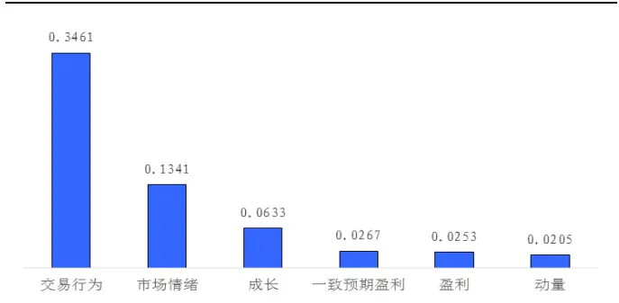
数据来源：国泰君安证券研究

图：TMT板块大类有效因子占比统计
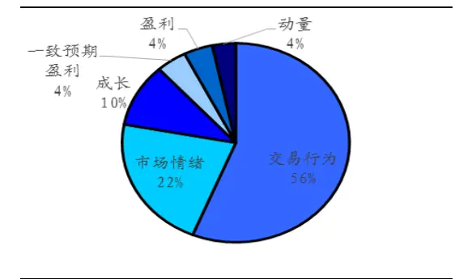
数据来源：国泰君安证券研究

表：TMT板块有效因子明细：

| 因子序号 | 因子名称 | 因子类别 | IC 均值 | ICIR | 因子序号 | 因子名称 | 因子类别 | IC 均值 | ICIR |
| --- | --- | --- | --- | --- | --- | --- | --- | --- | --- |
| 1 | acceleration | 动量 | -0.0205 | -2.76 | 86 | mom_1m_indus | 交易行为 | -0.0426 | -4.93 |
| 5 | Amt_1M_3M | 市场情绪 | -0.0411 | -5.86 | 126 | Ret_AMT | 市场情绪 | 0.0272 | 4.04 |
| 20 | Clo_MaxMin_6M | 交易行为 | 0.0262 | 4.05 | 153 | tsmon | 交易行为 | -0.0255 | -3.23 |
| 22 | Corr_Clo_Turn | 交易行为 | -0.0425 | -6.07 | 159 | Turn_Std_1M | 交易行为 | -0.0471 | -5.65 |
| 30 | DIFF | 交易行为 | -0.0249 | -3.73 | 162 | Turn_StdRate_1M | 交易行为 | -0.0416 | -6.34 |
| 31 | disposition | 交易行为 | -0.0218 | -3.82 | 164 | Turn_StdRate_6M | 交易行为 | -0.0212 | -3.57 |
| 55 | grossProfit_assets | 盈利 | 0.0253 | 4.85 | 166 | Up_Down_Vol | 市场情绪 | 0.0281 | 3.23 |
| 58 | High_Low | 交易行为 | -0.0526 | -8.12 | 178 | yoy_eps | 成长 | 0.0289 | 5.08 |
| 72 | Mean_AMT | 市场情绪 | -0.0376 | -5.15 | 184 | yoy_oper_rev | 成长 | 0.0345 | 5.25 |
| 83 | mom3_rev_FY1 | 一致预期盈利 | 0.0267 | 5.00 |  |  |  |  |  |

数据来源：国泰君安证券研究

## 3.2.1.2.服务业板块

服务业包括房地产、交通运输、建筑装饰以及银行、非银金融等金融服务业。

服务业板块成分股有效因子数量为12个，预测IC加总IC_ALL为 0.364，其中交易行为占比57.03%、市场情绪占比29.99%、动量占比6.71%、规模占比6.27%，具体统计结果如下：

表：服务业板块有效因子显著性统计

| 因子类别 | 交易行为 | 市场情绪 | 动量 | 规模 |
| --- | --- | --- | --- | --- |
| IC_STYLE | 0.2074 | 0.1090 | 0.0244 | 0.0228 |
| IC_ALL | 57.03% | 29.99% | 6.71% | 6.27% |

数据来源：国泰君安证券研究

图：服务业板块大类有效因子 IC加总统计
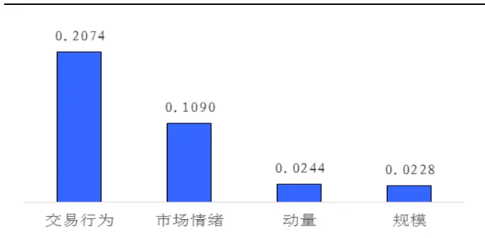
数据来源：国泰君安证券研究

图：服务业板块大类有效因子占比统计
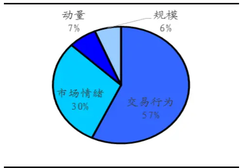
数据来源：国泰君安证券研究

表：服务业板块有效因子明细：

| 因子序号 | 因子名称 | 因子类别 | IC 均值 | ICIR | 因子序号 | 因子名称 | 因子类别 | IC 均值 | ICIR |
| --- | --- | --- | --- | --- | --- | --- | --- | --- | --- |
| 6 | Amt_Sum_1M | 市场情绪 | -0.0232 | 6 | 76 | mkt_cap_ard_log | 规模 | 0.0228 | 76 |
| 19 | Clo_MaxMin_3M | 交易行为 | 0.0336 | 19 | 91 | Mom_6M | 动量 | -0.0244 | 91 |
| 22 | Corr_Clo_Turn | 交易行为 | -0.0416 | 22 | 126 | Ret_AMT | 市场情绪 | 0.0277 | 126 |
| 58 | High_Low | 交易行为 | -0.0425 | 58 | 159 | Turn_Std_1M | 交易行为 | -0.0369 | 159 |
| 71 | Max_Ret_1M | 交易行为 | -0.0326 | 71 | 166 | Up_Down_Vol | 市场情绪 | 0.0354 | 166 |
| 73 | Mean_Ret_Amt | 市场情绪 | 0.0227 | 73 | 168 | Vol_Diff | 交易行为 | -0.0202 | 168 |

## 3.2.1.3.消费品板块

消费品板块包括家用电器、纺织服装、农林牧渔、食品饮料、医药生物、商业贸易以及休闲服务等 7 个行业，在 16 年以前，消费行业偏防御，16年以后逐渐偏进攻，关注成本、价格以及销售量变化。

消费品板块成分股有效因子数量为23个，预测IC加总IC_ALL为 0.645，其中交易行为占比 36.00%、市场情绪占比 27.22%、一致预期盈利占比16.55%、规模占比 7.21%、盈利占比 6.54%、成长占比 3.30%、一致预期估计占比3.18%，具体统计结果如下：

表：消费品板块有效因子显著性统计

| 因子类别 | 交易行为 | 市场情绪 | 一致预期盈利 | 规模 | 盈利 | 成长 | 一致预期估值 |
| --- | --- | --- | --- | --- | --- | --- | --- |
| IC_STYLE | 0.2323 | 0.1756 | 0.1068 | 0.0465 | 0.0422 | 0.0213 | 0.0205 |
| IC_ALL | 36.00% | 27.22% | 16.55% | 7.21% | 6.54% | 3.30% | 3.18% |

数据来源：国泰君安证券研究

图：消费品板块大类有效因子 IC加总统计
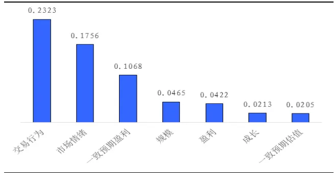
数据来源：国泰君安证券研究

图：消费品板块大类有效因子占比统计
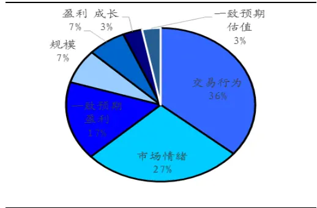
数据来源：国泰君安证券研究

表：消费品板块有效因子明细：

| 因子序号 | 因子名称 | 因子类别 | IC 均值 | ICIR | 因子序号 | 因子名称 | 因子类别 | IC 均值 | ICIR |
| --- | --- | --- | --- | --- | --- | --- | --- | --- | --- |
| 5 | Amt_1M_3M | 市场情绪 | -0.0457 | -6.87 | 83 | mom3_rev_FY1 | 一致预期盈利 | 0.0211 | 5.35 |
| 20 | Clo_MaxMin_6M | 交易行为 | 0.0264 | 4.01 | 84 | mom3_roe_FY1 | 一致预期盈利 | 0.0203 | 5.02 |
| 21 | Clo_RateMean_1M | 交易行为 | -0.0419 | -5.00 | 95 | mom_np_FY1 | 一致预期盈利 | 0.0240 | 6.27 |
| 22 | Corr_Clo_Turn | 交易行为 | -0.0448 | -6.85 | 98 | mom_rev_FY1 | 一致预期盈利 | 0.0207 | 5.80 |
| 25 | CoV_Volume_1M | 市场情绪 | -0.0346 | -6.47 | 126 | Ret_AMT | 市场情绪 | 0.0250 | 5.32 |
| 57 | grossProfitNonBank | 盈利 | 0.0220 | 4.20 | 130 | Ret_Std_1W | 交易行为 | -0.0273 | -4.75 |
| 58 | High_Low | 交易行为 | -0.0468 | -7.27 | 135 | roe | 盈利 | 0.0202 | 3.01 |
| 60 | iv_cmap | 交易行为 | -0.0243 | -5.00 | 149 | targetReturn | 一致预期估值 | 0.0205 | 3.34 |
| 72 | Mean_AMT | 市场情绪 | -0.0325 | -4.54 | 156 | Turn_Mean_1M | 市场情绪 | -0.0378 | -5.76 |
| 76 | mkt_cap_ard_log | 规模 | 0.0251 | 4.31 | 163 | Turn_StdRate_3M | 交易行为 | -0.0208 | -3.97 |
| 77 | mkt_cap_float | 规模 | 0.0214 | 5.49 | 184 | yoy_oper_rev | 成长 | 0.0213 | 4.28 |
| 82 | mom3_rating | 一致预期盈利 | -0.0207 | -5.67 |  |  |  |  |  |

数据来源：国泰君安证券研究

## 3.2.1.4.制造业板块

制造业板块包括机械设备、国防军工、轻工制造、电气设备以及汽车等5个行业。

制造业板块成分股有效因子数量为20个，预测IC加总IC_ALL为 0.625，其中交易行为占比 39.45%、市场情绪占比 26.10%、成长占比 13.44%、一致预期盈利占比 12.10%、动量占比 5.10%、规模占比 3.81%，具体统计结果如下：

表：制造业板块有效因子显著性统计

| 因子类别 | 交易行为 | 市场情绪 | 成长 | 一致预期盈利 | 动量 | 规模 |
| --- | --- | --- | --- | --- | --- | --- |
| IC_STYLE | 0.2467 | 0.1632 | 0.0840 | 0.0757 | 0.0319 | 0.0238 |
| IC_ALL | 39.45% | 26.10% | 13.44% | 12.10% | 5.10% | 3.81% |

数据来源：国泰君安证券研究

图：制造业板块大类有效因子 IC加总统计
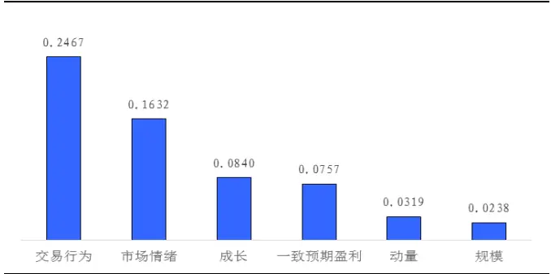
数据来源：国泰君安证券研究

图：制造业板块大类有效因子占比统计
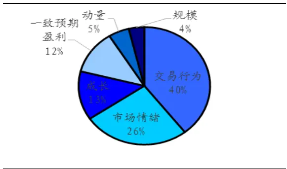
数据来源：国泰君安证券研究

表：制造业板块有效因子明细：

| 因子序号 | 因子名称 | 因子类别 | IC 均值 | ICIR | 因子序号 | 因子名称 | 因子类别 | IC 均值 | ICIR |
| --- | --- | --- | --- | --- | --- | --- | --- | --- | --- |
| 5 | Amt_1M_3M | 市场情绪 | -0.0406 | -5.89 | 89 | mom_3m | 动量 | -0.0319 | -3.89 |
| 20 | Clo_MaxMin_6M | 交易行为 | 0.0278 | 4.22 | 95 | mom_np_FY1 | 一致预期盈利 | 0.0261 | 6.44 |
| 22 | Corr_Clo_Turn | 交易行为 | -0.0470 | -7.77 | 96 | mom_oper_rev_q | 成长 | 0.0209 | 4.44 |
| 25 | CoV_Volume_1M | 市场情绪 | -0.0390 | -6.52 | 98 | mom_rev_FY1 | 一致预期盈利 | 0.0223 | 5.57 |
| 58 | High_Low | 交易行为 | -0.0426 | -6.84 | 126 | Ret_AMT | 市场情绪 | 0.0249 | 4.66 |
| 60 | iv_cmap | 交易行为 | -0.0259 | -5.09 | 153 | tsmon | 交易行为 | -0.0317 | -4.62 |
| 72 | Mean_AMT | 市场情绪 | -0.0358 | -5.31 | 159 | Turn_Std_1M | 交易行为 | -0.0487 | -7.38 |
| 73 | Mean_Ret_Amt | 市场情绪 | 0.0230 | 3.78 | 168 | Vol_Diff | 交易行为 | -0.0230 | -3.88 |
| 76 | mkt_cap_ard_log | 规模 | 0.0238 | 4.37 | 181 | yoy_np | 成长 | 0.0286 | 5.64 |
| 81 | mom3_np_FY1 | 一致预期盈利 | 0.0273 | 6.21 | 184 | yoy_oper_rev | 成长 | 0.0346 | 6.86 |

数据来源：国泰君安证券研究

## 3.2.1.5.周期板块

周期板块包括建筑材料、采掘、公用事业、有色金属、钢铁以及化工等6 个行业，其行业投资关注量、价以及库存，与下游房地产、汽车周期有一定关联，近一年来，供给侧改革成效明显，行业集中度提升，周期品上市企业盈利改善，股价也有所表现。

周期板块成分股有效因子数量为 25个，预测IC加总 IC_ALL为 0.672，其中交易行为占比 41.98%、市场情绪占比 17.30%、成长占比 11.24%、一致预期盈利占比7.66%、规模占比 6.32%、盈利占比 6.25%、动量占比6.12%、财务质量占比 3.13%，具体统计结果如下：

表：周期板块有效因子显著性统计

| 因子类别 | 交易行为 | 市场情绪 | 成长 | 一致预期盈利 | 规模 | 盈利 | 动量 | 财务质量 |
| --- | --- | --- | --- | --- | --- | --- | --- | --- |
| IC_STYLE | 0.2821 | 0.1162 | 0.0755 | 0.0515 | 0.0425 | 0.0420 | 0.0412 | 0.0210 |
| IC_ALL | 41.98% | 17.30% | 11.24% | 7.66% | 6.32% | 6.25% | 6.12% | 3.13% |

数据来源：国泰君安证券研究

图：周期板块大类有效因子 IC加总统计
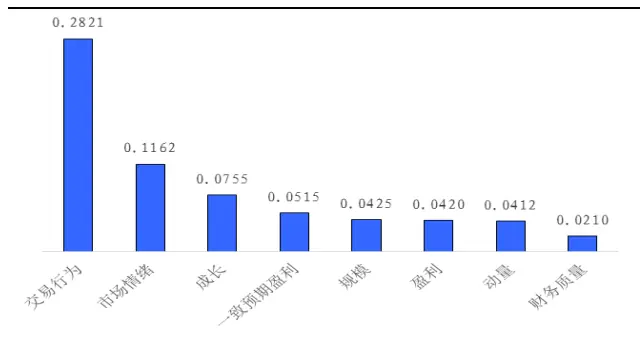
数据来源：国泰君安证券研究

图：周期板块大类有效因子占比统计
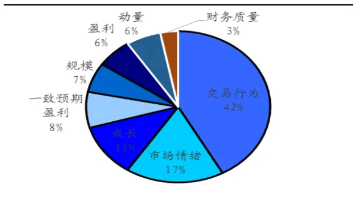
数据来源：国泰君安证券研究

表：周期板块有效因子明细：

| 因子序号 | 因子名称 | 因子类别 | IC 均值 | ICIR | 因子序号 | 因子名称 | 因子类别 | IC 均值 | ICIR |
| --- | --- | --- | --- | --- | --- | --- | --- | --- | --- |
| 20 | Clo_MaxMin_6M | 交易行为 | 0.0290 | 4.33 | 130 | Ret_Std_1W | 交易行为 | -0.0207 | -3.60 |
| 22 | Corr_Clo_Turn | 交易行为 | -0.0401 | -6.57 | 135 | roe | 盈利 | 0.0202 | 3.36 |
| 52 | fix_ratio | 财务质量 | -0.0210 | -3.05 | 142 | Skew_Ret_1M | 交易行为 | -0.0208 | -4.17 |
| 57 | grossProfitNonBank | 盈利 | 0.0218 | 3.96 | 150 | tax_q_growth | 成长 | 0.0223 | 4.66 |
| 58 | High_Low | 交易行为 | -0.0422 | -6.55 | 153 | tsmon | 交易行为 | -0.0232 | -3.16 |
| 60 | iv_cmap | 交易行为 | -0.0221 | -4.33 | 156 | Turn_Mean_1M | 市场情绪 | -0.0295 | -4.70 |
| 72 | Mean_AMT | 市场情绪 | -0.0281 | -4.78 | 162 | Turn_StdRate_1M | 交易行为 | -0.0394 | -7.20 |
| 75 | mkt_cap_ard_indus | 规模 | 0.0219 | 4.60 | 163 | Turn_StdRate_3M | 交易行为 | -0.0214 | -3.97 |
| 76 | mkt_cap_ard_log | 规模 | 0.0206 | 4.47 | 166 | Up_Down_Vol | 市场情绪 | 0.0328 | 4.29 |
| 81 | mom3_np_FY1 | 一致预期盈利 | 0.0272 | 6.39 | 168 | Vol_Diff | 交易行为 | -0.0233 | -4.16 |
| 90 | mom_3m_Indus | 动量 | -0.0412 | -4.63 | 184 | yoy_oper_rev | 成长 | 0.0237 | 4.77 |
| 95 | mom_np_FY1 | 一致预期盈利 | 0.0243 | 6.01 | 186 | yoy_opprofit_q | 成长 | 0.0295 | 4.76 |
| 126 | Ret_AMT | 市场情绪 | 0.0259 | 4.86 |  |  |  |  |  |

数据来源：国泰君安证券研究

## 3.2.2. 因子综合分析

表：板块因子检验横向比较

| TMT | 交易行为(56.19%) > 市场情绪(21.77%) > 成长(10.28%)> 一致预期盈利(4.33%) > 盈利(4.10%) > 动量 (3.33%) |
| --- | --- |
| 服务 | 交易行为(57.03%) > 市场情绪(29.99%) > 动量(6.71%) > 规模(6.27%) |
| 消费 | 交易行为(36.00%) > 市场情绪(27.22%) > 一致预期盈利(16.55%) >规模(7.21%) >盈利(6.54%) >成长 |
| 制造 | (3.30%) > 一致预期估值(3.18%) |
|  | 交易行为(39.45%) > 市场情绪(26.10%) > 成长(13.44%) > 一致预期盈利(12.10%) >动量(5.10%) >规模 |
| 周期 | (3.81%) |
|  | 交易行为(41.98%) > 市场情绪(17.30%) > 成长(11.24%) > 一致预期盈利(7.66%) >规模(6.32%) > 盈利 |
|  | (6.25%) > 动量(6.12%) > 财务质量(3.13%) |

数据来源：国泰君安证券研究

表：板块因子检验纵向比较

| 一致预期盈利 |  |  | 消费(0.1068)>制造(0.0757)>周期(0.0515)>TMT(0.0267) |
| --- | --- | --- | --- |
| 交易行为 |  |  | TMT(0.3461)>周期(0.2821)>制造(0.2467)> 消费(0.2323)>服务(0.2074) |
| 动量 |  |  | 周期(0.0412)>制造(0.0319)>服务(0.0244)>TMT(0.0205) |
| 市场情绪 |  | 消费(0.1756)>制造(0.1632) | > TMT(0.1341)> 周期(0.1162)> 服务(0.1090) |
| 成长 |  | 制造(0.0840)>周期(0.0755) | > TMT (0.0633) > 消费(0.0213) |
| 盈利 | 消费(0.0422) | >周期(0.0420) | > TMT (0.0253) |
| 规模 |  |  | 消费(0.0465)>周期(0.0425)>制造(0.0238)>服务(0.0228) |
| 财务质量 | 周期(0.0210) |  |  |
| 一致预期估值 | 消费(0.0205) |  |  |

数据来源：国泰君安证券研究

## 3.2.3. 核心结论

## 1. TMT：

TMT板块受交易行为、市场情绪因子影响较大，波动率高，交易投机属性高于其余板块。行业整体竞争格局变化较大，受创新产品、重大技术变革影响较大，技术革新带动新的投资周期的情况较为常见，例如通信行业中，5G 变革带动运营商资本开支的变化，集中度进一步提升，行业龙头收益显著。又如电子行业中，终端产品快速迭代，引发供应链产品与技术变革。因此，整体而言 TMT 板块整体不确定性较强，估值波动较大。占比较高的核心指标包括交易行为中的股价振幅、预期盈利中的营业收入预期变化、市场情绪中的换手波动率及成长因子中的 EPS同比增长等。

## 2. 消费：

消费板块受一致预期盈利、盈利因子影响较大，消费品行业竞争格局较为稳定，行业重大变化风险较小。部分消费品行业已经形成寡头垄断格局，或者正在形成类似格局，例如白电领域中，格力、美的双寡头加少量细分龙头格局明显。因此消费品板块更加看重上市公司业绩的确定性及收入增速、净利率增速变化。因此，盈利驱动特征较为明显。占比较高的核心指标包括分析师预期净利润、营业收入、ROE环比变化，营业成本收入比等。

## 3. 周期：

周期行业的景气与萧条之间存在明显的强周期性交替，对于上市公司而言，表现为业绩的高周期性波动，导致市场交易行为同样存在较强的周期性波动，因而交易行为因子影响同样较为显著。寻找业绩的拐点是周期股投资的关键，投资者在识别景气向上拐点之后积极买入，直到观测到向下拐点之后选择卖出。于此同时，由于受经济周期影响显著，因此在中长周期内，股价走势容易产生趋势动量效应。板块核心指标 ROE、预期净利润环比增速、行业动量指标等。

## 4. 制造业：

制造业品类繁多，从产业链角度来看，即存在周期特征明显的细分子行业，又同时存在相对稳定偏近下游的细分子行业；从产业成熟度来看，即存在技术快速变革迭代的新兴领域，又存在相对传统的制造领域。因此，整体而言，除市场行为外，较难辨别长期稳健明显的主导核心驱动因素，细分子行业内的驱动因素研究更具代表性。

## 5. 服务业：

服务板块细分一级二级子行业差异巨大，因此板块整体而言统一预测难度最大，IC 加总值最低。例如交运中的航空、航运、高速公路等子板块，核心驱动逻辑天差地别。非银中的券商、保险核心驱动逻辑也差异巨大。因此，服务行业板块整体而言，除一些普适性的交易行为市场情绪指标外，其余指标应区分子行业观察。

## 3.3.行业域比较

行业域的比较，我们选择申万一级行业指数（除综合）成分股作为目标研究域。

## 3.3.1. 行业域因子分析

## 3.3.1.1.交通运输

交通运输行业由港口、公交、航空运输、机场、高速公路、航运、铁路运输与物流等子行业组成，其行业景气程度一定程度上可反映经济的活跃程度。

交通运输成分股有效因子数量为 31个，预测IC 加总 IC_ALL为 1.060，其中交易行为占比 30.46%、市场情绪占比 15.59%、一致预期盈利占比12.94%、动量占比 10.41%、成长占比 8.52%、财务质量占比 6.75%、估值占比 5.84%、规模占比 3.46%、杠杆占比 3.09%、盈利占比 2.94%，具体统计结果如下：

表：交通运输有效因子显著性统计

| 因子类别 | 交易行为 | 市场情绪 | 一致预期盈利 | 动量 | 成长 | 财务质量 | 估值 | 规模 | 杠杆 | 盈利 |
| --- | --- | --- | --- | --- | --- | --- | --- | --- | --- | --- |
| IC_STYLE | 0.3228 | 0.1652 | 0.1371 | 0.1103 | 0.0903 | 0.0715 | 0.0619 | 0.0367 | 0.0328 | 0.0311 |
| IC_ALL | 30.46% | 15.59% | 12.94% | 10.41% | 8.52% | 6.75% | 5.84% | 3.46% | 3.09% | 2.94% |

数据来源：国泰君安证券研究

图：交通运输大类有效因子IC加总统计
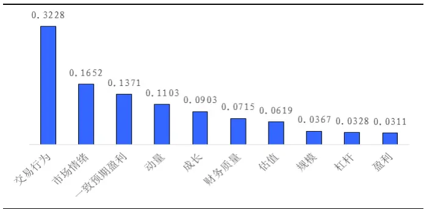
数据来源：国泰君安证券研究

图：交通运输大类有效因子占比统计
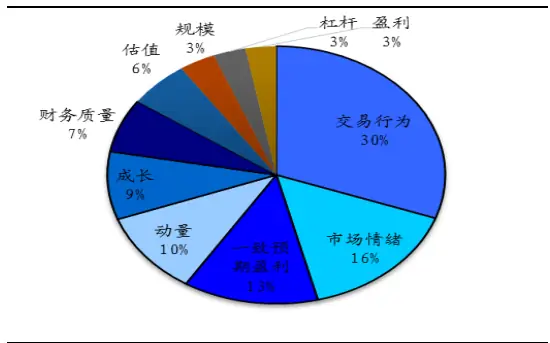
数据来源：国泰君安证券研究

表：交通运输有效因子明细：

| 因子序号 | 因子名称 | 因子类别 | IC 均值 | ICIR | 因子序号 | 因子名称 | 因子类别 | IC 均值 | ICIR |
| --- | --- | --- | --- | --- | --- | --- | --- | --- | --- |
| 1 | acceleration | 动量 | -0.0306 | -2.35 | 84 | mom3_roe_FY1 | 一致预期盈利 | 0.0246 | 2.32 |
| 5 | Amt_1M_3M | 市场情绪 | -0.0385 | -3.05 | 85 | mom_1m | 交易行为 | -0.0544 | -3.70 |
| 8 | assetsTurn | 财务质量 | 0.0466 | 3.65 | 90 | mom_3m_Indus | 动量 | -0.0522 | -3.80 |
| 22 | Corr_Clo_Turn | 交易行为 | -0.0502 | -4.21 | 92 | Mom_24M | 动量 | -0.0275 | -2.28 |
| 25 | CoV_Volume_1M | 市场情绪 | -0.0415 | -3.97 | 96 | mom_oper_rev_q | 成长 | 0.0217 | 2.24 |
| 26 | currencyRatio | 财务质量 | -0.0249 | -2.24 | 98 | mom_rev_FY1 | 一致预期盈利 | 0.0222 | 2.34 |
| 30 | DIFF | 交易行为 | -0.0259 | -2.06 | 99 | mom_roe_FY1 | 一致预期盈利 | 0.0214 | 2.17 |
| 35 | ebitda_ev | 估值 | -0.0304 | -3.14 | 113 | ocfp | 估值 | -0.0315 | -2.96 |
| 58 | High_Low | 交易行为 | -0.0665 | -4.84 | 114 | op_or_ttm | 盈利 | -0.0311 | -2.42 |
| 60 | iv_cmap | 交易行为 | -0.0333 | -2.99 | 126 | Ret_AMT | 市场情绪 | 0.0238 | 2.35 |
| 69 | longtermDebt_ratio | 杠杆 | -0.0328 | -2.79 | 130 | Ret_Std_1W | 交易行为 | -0.0270 | -2.28 |
| 71 | Max_Ret_1M | 交易行为 | -0.0353 | -2.90 | 165 | Up_Down | 交易行为 | -0.0301 | -2.52 |
| 73 | Mean_Ret_Amt | 市场情绪 | 0.0228 | 2.00 | 166 | Up_Down_Vol | 市场情绪 | 0.0387 | 3.28 |
| 76 | mkt_cap_ard_log | 规模 | 0.0367 | 3.83 | 184 | yoy_oper_rev | 成长 | 0.0297 | 2.80 |
| 79 | mom3_dps_FY1 | 一致预期盈利 | 0.0448 | 5.01 | 186 | yoy_opprofit_q | 成长 | 0.0389 | 3.23 |
| 80 | mom3_eps_FY1 | 一致预期盈利 | 0.0241 | 2.40 |  |  |  |  |  |

数据来源：国泰君安证券研究

## 3.3.1.2.休闲服务

休闲服务行业由景点、酒店、旅游综合、餐饮以及其他休闲服务等子行业组成，其投资关注于行业季节性。

休闲服务成分股有效因子数量为 21个，预测IC 加总 IC_ALL为 0.890，其中交易行为占比 34.43%、一致预期盈利占比 23.92%、市场情绪占比13.87%、规模占比 12.33%、估值占比 4.43%、一致预期估值占比 4.29%、财务质量占比3.38%、杠杆占比3.36%，具体统计结果如下：

表：休闲服务有效因子显著性统计

| 因子类别 | 交易行为 | 一致预期盈利 | 市场情绪 | 规模 | 估值 | 一致预期估值 | 财务质量 | 杠杆 |
| --- | --- | --- | --- | --- | --- | --- | --- | --- |
| IC_STYLE | 0.3065 | 0.2130 | 0.1235 | 0.1098 | 0.0395 | 0.0382 | 0.0301 | 0.0299 |
| IC_ALL | 34.43% | 23.92% | 13.87% | 12.33% | 4.43% | 4.29% | 3.38% | 3.36% |

数据来源：国泰君安证券研究

图：休闲服务大类有效因子IC加总统计
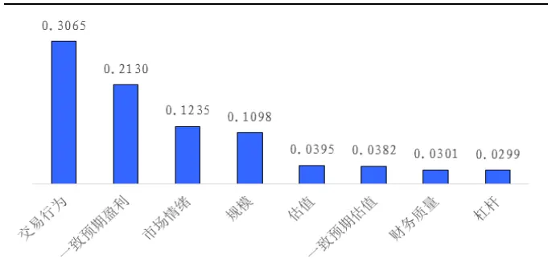
数据来源：国泰君安证券研究

图：休闲服务大类有效因子占比统计
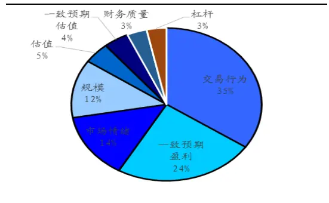
数据来源：国泰君安证券研究

表：休闲服务有效因子明细：

| 因子序号 | 因子名称 | 因子类别 | IC 均值 | ICIR | 因子序号 | 因子名称 | 因子类别 | IC 均值 | ICIR |
| --- | --- | --- | --- | --- | --- | --- | --- | --- | --- |
| 7 | assets_log | 规模 | 0.0340 | 2.05 | 78 | mkt_cap_float_log | 规模 | 0.0286 | 2.18 |
| 20 | Clo_MaxMin_6M | 交易行为 | 0.0447 | 2.34 | 79 | mom3_dps_FY1 | 一致预期盈利 | 0.0376 | 2.39 |
| 21 | Clo_RateMean_1M | 交易行为 | -0.0575 | -2.75 | 81 | mom3_np_FY1 | 一致预期盈利 | 0.0616 | 3.80 |
| 22 | Corr_Clo_Turn | 交易行为 | -0.0663 | -4.13 | 83 | mom3_rev_FY1 | 一致预期盈利 | 0.0385 | 2.18 |
| 24 | CoV_Ret_Amt | 市场情绪 | 0.0446 | 2.77 | 95 | mom_np_FY1 | 一致预期盈利 | 0.0384 | 2.42 |
| 28 | currentLiabRatio | 杠杆 | 0.0299 | 2.11 | 97 | mom_rating | 一致预期盈利 | -0.0368 | -2.17 |
| 32 | Dist_High | 交易行为 | -0.0386 | -2.18 | 130 | Ret_Std_1W | 交易行为 | -0.0419 | -2.54 |
| 39 | ep_de | 估值 | -0.0395 | -2.35 | 149 | targetReturn | 一致预期估值 | 0.0382 | 2.40 |
| 48 | ev1 | 规模 | 0.0472 | 3.03 | 152 | totLiab_mkt | 财务质量 | 0.0301 | 2.07 |
| 58 | High_Low | 交易行为 | -0.0576 | -3.13 | 166 | Up_Down_Vol | 市场情绪 | 0.0386 | 2.54 |
| 73 | Mean_Ret_Amt | 市场情绪 | 0.0403 | 2.42 |  |  |  |  |  |

数据来源：国泰君安证券研究
数据来源：国泰君安证券研究

## 3.3.1.3.传媒

传媒行业是生产传播各类信息产品以及提供相关增值服务的行业，具体包括了营销传播、互联网传媒以及文化传媒等子行业。

传媒成分股有效因子数量为 25个，预测IC加总 IC_ALL为0.975，其中交易行为占比47.86%、市场情绪占比12.27%、一致预期盈利占比 9.90%、财务质量占比9.43%、估值占比9.27%、盈利占比4.16%、成长占比3.61%、一致预期成长占比3.50%，具体统计结果如下：

表：传媒有效因子显著性统计

| 因子类别 | 交易行为 | 市场情绪 | 一致预期盈利 | 财务质量 | 估值 | 盈利 | 成长 | 一致预期成长 |
| --- | --- | --- | --- | --- | --- | --- | --- | --- |
| IC_STYLE | 0.4665 | 0.1195 | 0.0965 | 0.0919 | 0.0904 | 0.0406 | 0.0352 | 0.0341 |
| IC_ALL | 47.86% | 12.27% | 9.90% | 9.43% | 9.27% | 4.16% | 3.61% | 3.50% |

数据来源：国泰君安证券研究
数据来源：国泰君安证券研究

图：传媒大类有效因子IC加总统计
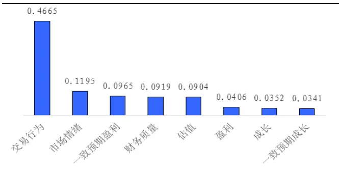
数据来源：国泰君安证券研究

图：传媒大类有效因子占比统计
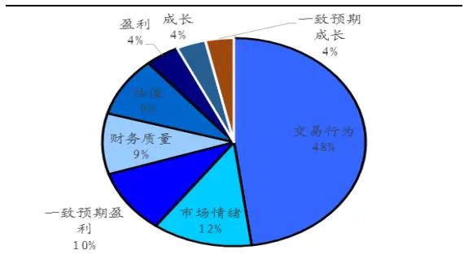
数据来源：国泰君安证券研究

表：传媒有效因子明细：

| 因子序号 | 因子名称 | 因子类别 | IC 均值 | ICIR | 因子序 号 | 因子名称 | 因子类别 | IC 均值 | ICIR |
| --- | --- | --- | --- | --- | --- | --- | --- | --- | --- |
| 5 | Amt_1M_3M | 市场情绪 | -0.0516 | -3.75 | 98 | mom_rev_FY1 | 一致预期盈利 | 0.0305 | 2.78 |
| 13 | bp_indus | 估值 | -0.0539 | -3.97 | 105 | netWorkingCap_assets | 财务质量 | 0.0242 | 2.11 |
| 19 | Clo_MaxMin_3M | 交易行为 | 0.0341 | 2.35 | 111 | np_growth_FY3 | 一致预期成长 | 0.0341 | 2.46 |
| 20 | Clo_MaxMin_6M | 交易行为 | 0.0500 | 3.72 | 115 | oper_ratio | 财务质量 | 0.0313 | 2.66 |
| 22 | Corr_Clo_Turn | 交易行为 | -0.0439 | -3.05 | 152 | totLiab_mkt | 财务质量 | 0.0364 | 2.73 |
| 25 | CoV_Volume_1M | 市场情绪 | -0.0409 | -3.19 | 153 | tsmon | 交易行为 | -0.0282 | -2.04 |
| 46 | eps_adjust | 盈利 | -0.0406 | -3.42 | 159 | Turn_Std_1M | 交易行为 | -0.0516 | -3.72 |
| 58 | High_Low | 交易行为 | -0.0558 | -3.69 | 163 | Turn_StdRate_3M | 交易行为 | -0.0284 | -2.09 |
| 70 | MACD | 交易行为 | -0.0412 | -2.79 | 167 | valueResidual | 估值 | 0.0365 | 3.04 |
| 73 | Mean_Ret_Amt | 市场情绪 | 0.0270 | 2.32 | 168 | Vol_Diff | 交易行为 | -0.0461 | -3.39 |
| 81 | mom3_np_FY1 | 一致预期盈利 | 0.0315 | 2.21 | 170 | Vol_Std_1M | 交易行为 | -0.0392 | -2.54 |
| 83 | mom3_rev_FY1 | 一致预期盈利 | 0.0345 | 2.33 | 177 | yoy_bps | 成长 | -0.0352 | -2.23 |
| 86 | mom_1m_indus | 交易行为 | -0.0480 | -3.33 |  |  |  |  |  |

数据来源：国泰君安证券研究

## 3.3.1.4.公共事业

公用事业行业包括电力、环保工程及服务、燃气以及水务等子行业。

公共事业成分股有效因子数量为 33个，预测IC 加总 IC_ALL为 1.065，其中交易行为占比 45.32%、一致预期盈利占比 19.60%、市场情绪占比11.96%、财务质量占比 5.43%、动量占比 4.71%、成长占比 4.20%、其他占比2.51%、估值占比2.35%、一致预期成长占比1.99%、盈利占比1.93%，具体统计结果如下：

表：公共事业有效因子显著性统计

| 因子类别 | 交易行为 | 一致预期盈利 | 市场情绪 | 财务质量 | 动量 | 成长 | 其他 | 估值 | 一致预期成长 | 盈利 |
| --- | --- | --- | --- | --- | --- | --- | --- | --- | --- | --- |
| IC_STYLE | 0.4827 | 0.2088 | 0.1274 | 0.0579 | 0.0502 | 0.0447 | 0.0267 | 0.0251 | 0.0212 | 0.0205 |
| IC_ALL | 45.32% | 19.60% | 11.96% | 5.43% | 4.71% | 4.20% | 2.51% | 2.35% | 1.99% | 1.93% |

数据来源：国泰君安证券研究

图：公共事业大类有效因子IC加总统计
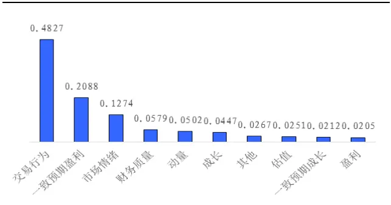
数据来源：国泰君安证券研究

图：公共事业大类有效因子占比统计
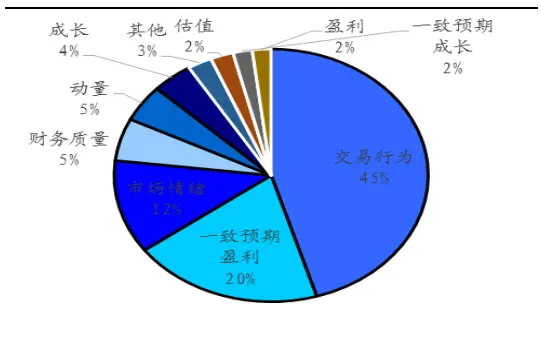
数据来源：国泰君安证券研究

表：公共事业有效因子明细：

| 因子序 号 | 因子名称 | 因子类别 | IC 均值 | ICIR | 因子序 号 | 因子名称 | 因子类别 | IC 均值 | ICIR |
| --- | --- | --- | --- | --- | --- | --- | --- | --- | --- |
|  |  |  |  |  |  |  | 一致预期盈 |  |  |
| 4 | admExpRatio | 财务质量 | 0.0212 | 2.29 | 97 | mom_rating | 利 | -0.0363 | -4.52 |
|  |  |  |  |  |  |  | 一致预期盈 |  |  |
|  |  |  |  |  |  |  | 利 | 0.0260 | 2.76 |
|  | Amt_Sum_1M | 市场情绪 | -0.0275 | -2.70 | 109 | np_FY1_ttm | 一致预期成 |  |  |
| 11 | beta | 其他 | 0.0267 | 2.24 | 121 | or_growth_FY1 | 长 | 0.0212 | 2.01 |
| 19 | Clo_MaxMin_3M | 交易行为 | 0.0285 | 2.61 | 126 | Ret_AMT | 市场情绪 | 0.0242 | 2.57 |
| 22 | Corr_Clo_Turn | 交易行为 | -0.0436 | -4.26 | 130 | Ret_Std_1W | 交易行为 | -0.0262 | -2.33 |
| 35 | ebitda_ev | 估值 | -0.0251 | -2.52 | 143 | Skew_Ret_1Y | 交易行为 | -0.0269 | -2.63 |
| 52 | fix_ratio | 财务质量 | -0.0367 | -2.58 | 153 | tsmon | 交易行为 | -0.0342 | -2.88 |
| 54 | grossMarginRatio_ttm | 盈利 | 0.0205 | 2.00 | 154 | Turn_1M_3M | 市场情绪 | -0.0433 | -3.81 |
| 58 | High_Low | 交易行为 | -0.0467 | -3.73 | 159 | Turn_Std_1M | 交易行为 | -0.0396 | -3.34 |
| 60 | iv_cmap | 交易行为 | -0.0288 | -2.86 | 162 | Turn_StdRate_1M | 交易行为 | -0.0586 | -5.93 |
| 71 | Max_Ret_1M | 交易行为 | -0.0452 | -4.04 | 164 | Turn_StdRate_6M | 交易行为 | -0.0313 | -3.37 |
|  |  | 一致预期盈 |  |  |  |  |  |  |  |
| 80 81 | mom3_eps_FY1 | 利 | 0.0238 | 2.58 | 166 | Up_Down_Vol | 市场情绪 | 0.0324 | 2.60 |
|  |  | 一致预期盈 |  |  |  |  |  |  |  |
|  | mom3_np_FY1 | 利 一致预期盈 | 0.0472 | 5.69 | 168 | Vol_Diff | 交易行为 | -0.0252 | -2.30 |
| 82 | mom3_rating | 利 | -0.0221 | -2.52 | 170 | Vol_Std_1M | 交易行为 | -0.0479 | -4.33 |
| 90 | mom_3m_Indus | 动量 | -0.0502 | -3.59 | 179 | yoy_eps_q | 成长 | 0.0221 | 2.15 |
|  |  | 一致预期盈 |  |  |  |  |  |  |  |
| 93 |  |  |  |  |  |  |  |  |  |
|  | mom_dps_FY1 | 利 | 0.0222 | 2.71 | 189 | yoy_total_assets | 成长 | 0.0226 | 2.20 |
|  |  | 一致预期盈 |  |  |  |  |  |  |  |
| 94 | mom_eps_FY1 | 利 | 0.0313 | 3.43 |  |  |  |  |  |

数据来源：国泰君安证券研究

## 3.3.1.5.农林牧渔

农林牧渔行业由种植业、渔业、林业、饲料、农产品加工、农业综合、畜禽养殖以及动物保健等子行业组成，其行业投资与通货膨胀相关程度较高。

农林牧渔成分股有效因子数量为 27个，预测IC 加总 IC_ALL为 0.969，其中交易行为占比46.15%、市场情绪占比21.69%、规模占比 9.92%、盈利占比 6.71%、一致预期盈利占比 5.20%、动量占比 4.30%、成长占比3.83%、财务质量占比 2.19%，具体统计结果如下：

表：农林牧渔有效因子显著性统计

| 因子类别 | 交易行为 | 市场情绪 | 规模 | 盈利 | 一致预期盈利 | 动量 | 成长 | 财务质量 |
| --- | --- | --- | --- | --- | --- | --- | --- | --- |
| IC_STYLE | 0.4473 | 0.2103 | 0.0962 | 0.0650 | 0.0504 | 0.0417 | 0.0371 | 0.0212 |
| IC_ALL | 46.15% | 21.69% | 9.92% | 6.71% | 5.20% | 4.30% | 3.83% | 2.19% |

数据来源：国泰君安证券研究

图：农林牧渔大类有效因子IC加总统计
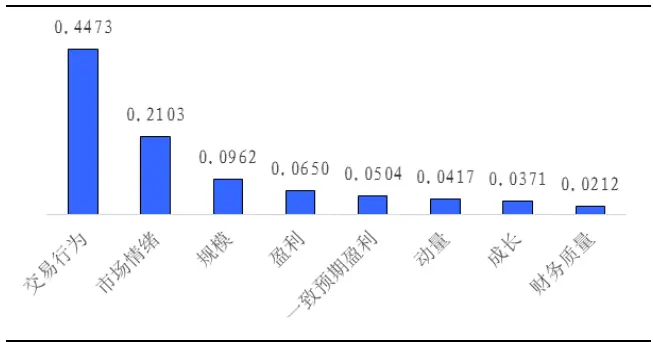
数据来源：国泰君安证券研究

图：农林牧渔大类有效因子占比统计
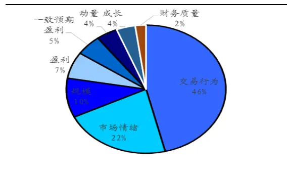
数据来源：国泰君安证券研究

表：农林牧渔有效因子明细：

| 因子序号 | 因子名称 | 因子类别 | IC 均值 | ICIR | 因子序号 | 因子名称 | 因子类别 | IC 均值 | ICIR |
| --- | --- | --- | --- | --- | --- | --- | --- | --- | --- |
| 1 | acceleration | 动量 | -0.0417 | -3.34 | 82 | mom3_rating | 一致预期盈利 | -0.0245 | -2.47 |
| 5 | Amt_1M_3M | 市场情绪 | -0.0609 | -5.45 | 84 | mom3_roe_FY1 | 一致预期盈利 | 0.0259 | 2.38 |
| 19 | Clo_MaxMin_3M | 交易行为 | 0.0341 | 2.63 | 126 | Ret_AMT | 市场情绪 | 0.0280 | 2.56 |
| 22 | Corr_Clo_Turn | 交易行为 | -0.0344 | -2.94 | 130 | Ret_Std_1W | 交易行为 | -0.0289 | -2.15 |
| 54 | grossMarginRatio_ttm | 盈利 | 0.0338 | 2.91 | 135 | roe | 盈利 | 0.0313 | 2.51 |
| 58 | High_Low | 交易行为 | -0.0679 | -5.64 | 144 | SL_Volume_1M | 市场情绪 | -0.0426 | -4.06 |
| 60 | iv_cmap | 交易行为 | -0.0307 | -2.69 | 153 | tsmon | 交易行为 | -0.0481 | -3.89 |
| 61 | iv_r2 | 交易行为 | -0.0232 | -2.12 | 159 | Turn_Std_1M | 交易行为 | -0.0564 | -5.25 |
| 68 | longDebt_debt | 财务质量 | 0.0212 | 2.26 | 164 | Turn_StdRate_6M | 交易行为 | -0.0257 | -2.22 |
| 71 | Max_Ret_1M | 交易行为 | -0.0530 | -4.40 | 166 | Up_Down_Vol | 市场情绪 | 0.0270 | 2.44 |
| 73 | Mean_Ret_Amt | 市场情绪 | 0.0241 | 2.21 | 170 | Vol_Std_1M | 交易行为 | -0.0451 | -3.47 |
| 76 | mkt_cap_ard_log | 规模 | 0.0302 | 3.13 | 174 | VR | 市场情绪 | -0.0277 | -2.50 |
| 77 | mkt_cap_float | 规模 | 0.0376 | 3.95 | 179 | yoy_eps_q | 成长 | 0.0371 | 3.04 |
| 78 | mkt_cap_float_log | 规模 | 0.0284 | 2.86 |  |  |  |  |  |

数据来源：国泰君安证券研究

## 3.3.1.6.化工

化工行业包括化学纤维、化学原料、化学制品、石油化工、塑料以及橡胶等子行业，其行业投资关注量、价、成本及价差。

化工成分股有效因子数量为 24个，预测IC加总 IC_ALL为0.969，其中交易行为占比 47.22%、市场情绪占比 14.94%、成长占比 12.03%、一致预期盈利占比9.43%、规模占比4.13%、动量占比3.20%、盈利占比3.09%、一致预期估值占比 3.08%、一致预期成长占比 2.89%，具体统计结果如下：

表：化工有效因子显著性统计

| 因子类别 | 交易行为 | 市场情绪 | 成长 | 一致预期盈利 | 规模 | 动量 | 盈利 | 一致预期估值 | 一致预期成长 |
| --- | --- | --- | --- | --- | --- | --- | --- | --- | --- |
| IC_STYLE | 0.3397 | 0.1075 | 0.0865 | 0.0678 | 0.0297 | 0.0230 | 0.0222 | 0.0222 | 0.0208 |
| IC_ALL | 47.22% | 14.94% | 12.03% | 9.43% | 4.13% | 3.20% | 3.09% | 3.08% | 2.89% |

数据来源：国泰君安证券研究

图：化工大类有效因子 IC加总统计
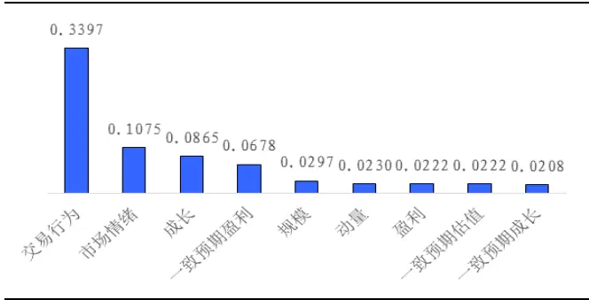
数据来源：国泰君安证券研究

图：化工大类有效因子占比统计
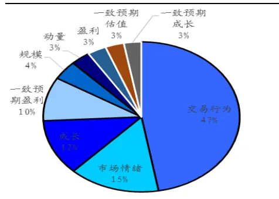
数据来源：国泰君安证券研究

表：化工有效因子明细：

| 因子序号 | 因子名称 | 因子类别 | IC 均值 | ICIR | 因子序号 | 因子名称 | 因子类别 | IC 均值 | ICIR |
| --- | --- | --- | --- | --- | --- | --- | --- | --- | --- |
| 5 | Amt_1M_3M | 市场情绪 | -0.0452 | -5.27 | 88 | Mom_1Y_1M | 动量 | 0.0230 | 3.18 |
| 6 | Amt_Sum_1M | 市场情绪 | -0.0315 | -3.78 | 95 | mom_np_FY1 | 一致预期盈利 | 0.0232 | 3.97 |
| 20 | Clo_MaxMin_6M | 交易行为 | 0.0281 | 3.42 | 111 | np_growth_FY3 | 一致预期成长 | 0.0208 | 3.23 |
| 22 | Corr_Clo_Turn | 交易行为 | -0.0420 | -5.93 | 126 | Ret_AMT | 市场情绪 | 0.0307 | 3.72 |
| 43 | ep_FY3 | 一致预期估值 | 0.0222 | 3.44 | 135 | roe | 盈利 | 0.0222 | 2.47 |
| 58 | High_Low | 交易行为 | -0.0505 | -6.39 | 150 | tax_q_growth | 成长 | 0.0279 | 3.98 |
| 60 | iv_cmap | 交易行为 | -0.0202 | -2.94 | 159 | Turn_Std_1M | 交易行为 | -0.0500 | -5.94 |
| 62 | ivday | 交易行为 | -0.0206 | -2.74 | 160 | Turn_Std_3M | 交易行为 | -0.0218 | -2.78 |
| 75 | mkt_cap_ard_indus | 规模 | 0.0297 | 4.24 | 162 | Turn_StdRate_1M | 交易行为 | -0.0374 | -5.36 |
| 81 | mom3_np_FY1 | 一致预期盈利 | 0.0230 | 3.69 | 168 | Vol_Diff | 交易行为 | -0.0258 | -3.48 |
| 83 | mom3_rev_FY1 | 一致预期盈利 | 0.0216 | 3.43 | 184 | yoy_oper_rev | 成长 | 0.0250 | 3.39 |
| 86 | mom_1m_indus | 交易行为 | -0.0433 | -4.33 | 186 | yoy_opprofit_q | 成长 | 0.0337 | 4.07 |

数据来源：国泰君安证券研究

## 3.3.1.7.医药生物

医药生物行业由化学制药、中药、生物制品、医药商业、医疗器械以及医疗服务等子行业组成。

医药生物成分股有效因子数量为 23个，预测IC 加总 IC_ALL为 0.694，其中交易行为占比 48.42%、一致预期盈利占比 19.93%、市场情绪占比

10.00%、盈利占比 7.48%、成长占比 4.06%、一致预期估值占比 3.70%、规模占比3.44%、财务质量占比 2.98%，具体统计结果如下：

表：医药生物有效因子显著性统计

| 因子类别 | 交易行为 | 一致预期盈利 | 市场情绪 | 盈利 | 成长 | 一致预期估值 | 规模 | 财务质量 |
| --- | --- | --- | --- | --- | --- | --- | --- | --- |
| IC_STYLE | 0.3362 | 0.1384 | 0.0694 | 0.0519 | 0.0282 | 0.0257 | 0.0239 | 0.0207 |
| IC_ALL | 48.42% | 19.93% | 10.00% | 7.48% | 4.06% | 3.70% | 3.44% | 2.98% |

数据来源：国泰君安证券研究

图：医药生物大类有效因子 IC加总统计
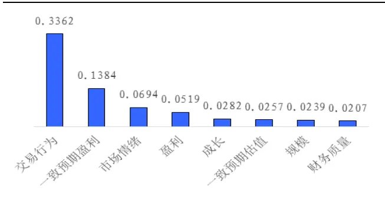
数据来源：国泰君安证券研究

图：医药生物大类有效因子占比统计
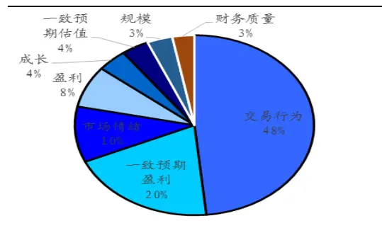
数据来源：国泰君安证券研究

表：医药生物有效因子明细：

| 因子序号 | 因子名称 | 因子类别 | IC 均值 | ICIR | 因子序号 | 因子名称 | 因子类别 | IC 均值 | ICIR |
| --- | --- | --- | --- | --- | --- | --- | --- | --- | --- |
| 4 | admExpRatio | 财务质量 | 0.0207 | 2.32 | 94 | mom_eps_FY1 | 一致预期盈利 | 0.0295 | 4.51 |
| 5 | Amt_1M_3M | 市场情绪 | -0.0357 | -4.71 | 95 | mom_np_FY1 | 一致预期盈利 | 0.0315 | 5.21 |
| 20 | Clo_MaxMin_6M | 交易行为 | 0.0273 | 3.01 | 98 | mom_rev_FY1 | 一致预期盈利 | 0.0282 | 4.21 |
| 22 | Corr_Clo_Turn | 交易行为 | -0.0440 | -4.70 | 99 | mom_roe_FY1 | 一致预期盈利 | 0.0215 | 3.42 |
| 25 | CoV_Volume_1M | 市场情绪 | -0.0337 | -4.31 | 135 | roe | 盈利 | 0.0262 | 2.86 |
| 30 | DIFF | 交易行为 | -0.0230 | -2.77 | 149 | targetReturn | 一致预期估值 | 0.0257 | 2.72 |
| 57 | grossProfitNonBank | 盈利 | 0.0257 | 3.13 | 153 | tsmon | 交易行为 | -0.0246 | -2.71 |
| 58 | High_Low | 交易行为 | -0.0451 | -5.53 | 159 | Turn_Std_1M | 交易行为 | -0.0362 | -4.28 |
| 71 | Max_Ret_1M | 交易行为 | -0.0337 | -3.94 | 165 | Up_Down | 交易行为 | -0.0303 | -3.65 |
| 77 | mkt_cap_float | 规模 | 0.0239 | 4.02 | 170 | Vol_Std_1M | 交易行为 | -0.0360 | -3.53 |
| 83 | mom3_rev_FY1 | 一致预期盈利 | 0.0277 | 3.81 | 184 | yoy_oper_rev | 成长 | 0.0282 | 3.87 |
| 86 | mom_1m_indus | 交易行为 | -0.0361 | -3.62 |  |  |  |  |  |

数据来源：国泰君安证券研究

## 3.3.1.8.商业贸易

商业贸易行业由一般零售、专业零售、商业物业经营以及贸易等子行业组成，其投资关注于商业模式等。

商业贸易成分股有效因子数量为 25个，预测IC 加总 IC_ALL为 0.854，其中交易行为占比 53.08%、市场情绪占比 25.33%、动量占比 10.07%、规模占比3.26%、估值占比 3.11%、一致预期盈利占比 2.71%、成长占比2.45%，具体统计结果如下：

表：商业贸易有效因子显著性统计

| 因子类别 | 交易行为 | 市场情绪 | 动量 | 规模 | 估值 | 一致预期盈利 | 成长 |
| --- | --- | --- | --- | --- | --- | --- | --- |
| IC_STYLE | 0.4533 | 0.2163 | 0.0859 | 0.0278 | 0.0265 | 0.0231 | 0.0209 |
| IC_ALL | 53.08% | 25.33% | 10.07% | 3.26% | 3.11% | 2.71% | 2.45% |

数据来源：国泰君安证券研究

图：商业贸易大类有效因子 IC加总统计
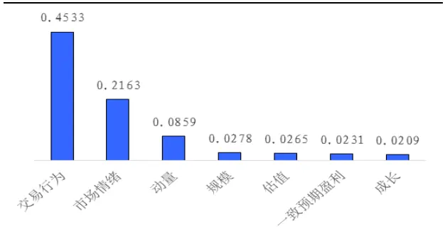
数据来源：国泰君安证券研究

图：商业贸易大类有效因子占比统计
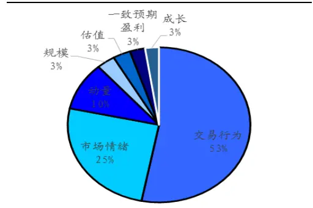
数据来源：国泰君安证券研究

表：商业贸易有效因子明细：

| 因子序号 | 因子名称 | 因子类别 | IC 均值 | ICIR | 因子序号 | 因子名称 | 因子类别 | IC 均值 | ICIR |
| --- | --- | --- | --- | --- | --- | --- | --- | --- | --- |
| 1 | acceleration | 动量 | -0.0288 | -2.49 | 76 | mkt_cap_ard_log | 规模 | 0.0278 | 2.53 |
| 17 | Clo_5D_60D | 交易行为 | -0.0674 | -5.01 | 82 | mom3_rating | 一致预期盈利 | -0.0231 | -2.74 |
| 19 | Clo_MaxMin_3M | 交易行为 | 0.0279 | 2.24 | 87 | Mom_1Y | 动量 | -0.0324 | -2.85 |
| 20 | Clo_MaxMin_6M | 交易行为 | 0.0301 | 2.64 | 92 | Mom_24M | 动量 | -0.0247 | -2.25 |
| 22 | Corr_Clo_Turn | 交易行为 | -0.0521 | -4.83 | 126 | Ret_AMT | 市场情绪 | 0.0373 | 3.90 |
| 25 | CoV_Volume_1M | 市场情绪 | -0.0287 | -2.58 | 130 | Ret_Std_1W | 交易行为 | -0.0383 | -3.72 |
| 30 | DIFF | 交易行为 | -0.0300 | -2.82 | 133 | Ret_Std_6M | 交易行为 | 0.0229 | 2.43 |
| 31 | disposition | 交易行为 | -0.0258 | -2.42 | 153 | tsmon | 交易行为 | -0.0317 | -2.82 |
| 34 | ebit_ev | 估值 | -0.0265 | -2.62 | 156 | Turn_Mean_1M | 市场情绪 | -0.0479 | -4.06 |
| 58 | High_Low | 交易行为 | -0.0603 | -5.47 | 163 | Turn_StdRate_3M | 交易行为 | -0.0295 | -2.64 |
| 60 | iv_cmap | 交易行为 | -0.0371 | -3.75 | 166 | Up_Down_Vol | 市场情绪 | 0.0400 | 3.61 |
| 72 | Mean_AMT | 市场情绪 | -0.0338 | -2.81 | 189 | yoy_total_assets | 成长 | 0.0209 | 2.06 |
| 73 | Mean_Ret_Amt | 市场情绪 | 0.0286 | 2.95 |  |  |  |  |  |

数据来源：国泰君安证券研究

## 3.3.1.9.国防军工

国防军工行业包括航天装备，航空装备，地面兵装以及船舶制造等子行业，其行业投资关注政策以及资产注入。

国防军工成分股有效因子数量为 10个，预测IC 加总 IC_ALL为 0.413，其中交易行为占比 51.81%、成长占比 18.83%、财务质量占比 17.43%、一致预期盈利占比11.92%，具体统计结果如下：

表：国防军工有效因子显著性统计

| 因子类别 | 交易行为 | 成长 | 财务质量 | 一致预期盈利 |
| --- | --- | --- | --- | --- |
| IC_STYLE | 0.2137 | 0.0777 | 0.0719 | 0.0492 |

| IC_ALL | 51.81% | 18.83% | 17.43% | 11.92% |
| --- | --- | --- | --- | --- |

数据来源：国泰君安证券研究

图：国防军工大类有效因子 IC加总统计
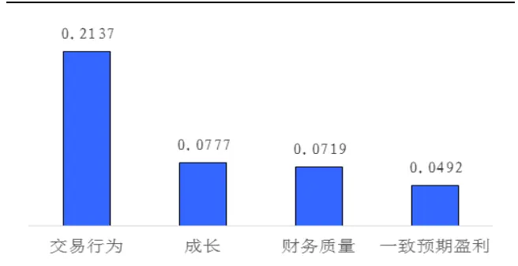
数据来源：国泰君安证券研究

图：国防军工大类有效因子占比统计
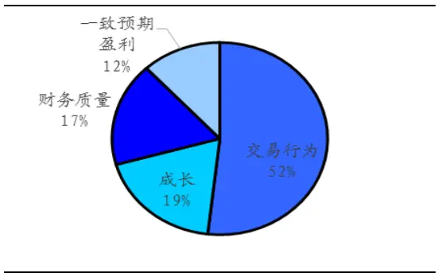
数据来源：国泰君安证券研究

表：国防军工有效因子明细：

| 因子序号 | 因子名称 | 因子类别 | IC 均值 | ICIR | 因子序号 | 因子名称 | 因子类别 | IC 均值 | ICIR |
| --- | --- | --- | --- | --- | --- | --- | --- | --- | --- |
| 19 | Clo_MaxMin_3M | 交易行为 | 0.0457 | 2.23 | 85 | mom_1m | 交易行为 | -0.0486 | -2.50 |
| 26 | currencyRatio | 财务质量 | 0.0326 | 2.19 | 96 | mom_oper_rev_q | 成长 | -0.0348 | -2.03 |
| 58 | High_Low | 交易行为 | -0.0378 | -2.10 | 118 | operExpRat io_bank | 财务质量 | -0.0393 | -2.11 |
| 62 | ivday | 交易行为 | -0.0401 | -2.32 | 165 | Up_Down | 交易行为 | -0.0416 | -2.14 |
| 84 | mom3_roe_FY1 | 一致预期盈利 | 0.0492 | 3.35 | 187 | yoy_roe | 成长 | 0.0429 | 2.96 |

数据来源：国泰君安证券研究

## 3.3.1.10. 家用电器

家用电器行业包括白色家电、视听器材等子行业，其中白色家电主要指冰箱、空调、洗衣机以及小家电等可以替代人们家务劳动的电器产品。

家用电器成分股有效因子数量为 34个，预测IC 加总 IC_ALL为 1.369，其中交易行为占比 34.82%、市场情绪占比 19.32%、动量占比 10.10%、一致预期盈利占比8.72%、一致预期估值占比5.61%、成长占比4.88%、规模占比4.45%、估值占比4.37%、其他占比3.30%、财务质量占比2.31%、盈利占比2.12%，具体统计结果如下：

表：家用电器有效因子显著性统计

| 因子类别 | 交易行为 | 市场情绪 | 动量 | 一致预期盈利 | 一致预期估值 | 成长 | 规模 | 估值 | 其他 | 财务质量 | 盈利 |
| --- | --- | --- | --- | --- | --- | --- | --- | --- | --- | --- | --- |
| IC_STYLE | 0.4768 | 0.2646 | 0.1383 | 0.1194 | 0.0768 | 0.0669 | 0.0610 | 0.0598 | 0.0451 | 0.0317 | 0.0290 |
| IC_ALL | 34.82% | 19.32% | 10.10% | 8.72% | 5.61% | 4.88% | 4.45% | 4.37% | 3.30% | 2.31% | 2.12% |

数据来源：国泰君安证券研究

图：家用电器大类有效因子 IC加总统计
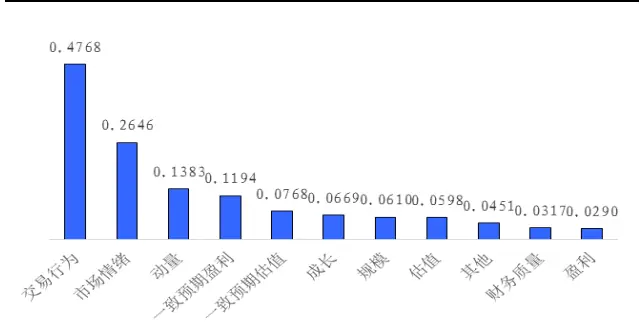
数据来源：国泰君安证券研究

图：家用电器大类有效因子占比统计
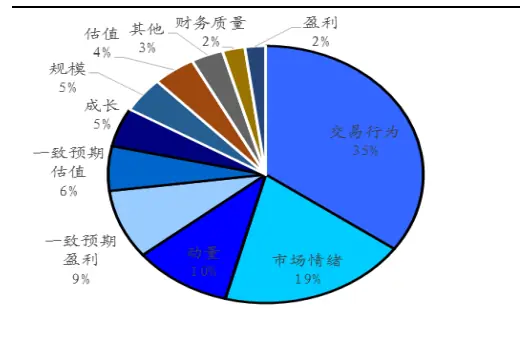
数据来源：国泰君安证券研究

表：家用电器有效因子明细：

| 因子序号 | 因子名称 | 因子类别 | IC 均值 | ICIR | 因子序号 | 因子名称 | 因子类别 | IC 均值 | ICIR |
| --- | --- | --- | --- | --- | --- | --- | --- | --- | --- |
| 12 | bp | 估值 | -0.0287 | -2.22 | 124 | priceDelay | 其他 | 0.0451 | 2.91 |
| 22 | Corr_Clo_Turn | 交易行为 | -0.0608 | -4.06 | 126 | Ret_AMT | 市场情绪 | 0.0400 | 2.92 |
| 24 | CoV_Ret_Amt | 市场情绪 | -0.0351 | -2.70 | 129 | Ret_Std_1M | 交易行为 | -0.0556 | -3.71 |
| 25 | CoV_Volume_1M | 市场情绪 | -0.0628 | -4.35 | 130 | Ret_Std_1W | 交易行为 | -0.0386 | -2.76 |
| 33 | dividendyield2 | 估值 | 0.0311 | 2.55 | 131 | Ret_Std_1Y | 交易行为 | 0.0358 | 2.89 |
| 43 | ep_FY3 | 一致预期估值 | 0.0431 | 3.14 | 136 | roe_ttm | 盈利 | 0.0290 | 2.03 |
| 48 | ev1 | 规模 | 0.0260 | 2.02 | 142 | Skew_Ret_1M | 交易行为 | -0.0250 | -2.08 |
| 58 | High_Low | 交易行为 | -0.0484 | -4.05 | 144 | SL_Volume_1M | 市场情绪 | -0.0575 | -3.79 |
| 76 | mkt_cap_ard_log | 规模 | 0.0350 | 2.79 | 149 | targetReturn | 一致预期估值 | 0.0337 | 2.64 |
| 81 | mom3_np_FY1 | 一致预期盈利 | 0.0344 | 2.96 | 150 | tax_9_growth | 成长 | 0.0360 | 2.93 |
| 83 | mom3_rev_FY1 | 一致预期盈利 | 0.0249 | 2.08 | 153 | tsmon | 交易行为 | -0.0460 | -2.90 |
| 86 | mom_1m_indus | 交易行为 | -0.0705 | -4.27 | 159 | Turn_Std_1M | 交易行为 | -0.0570 | -3.49 |
| 88 | Mom_1Y_1M | 动量 | 0.0431 | 2.96 | 166 | Up_Down_Vol | 市场情绪 | 0.0388 | 2.61 |
| 89 | mom_3m | 动量 | -0.0491 | -3.18 | 170 | Vol_Std_1M | 交易行为 | -0.0392 | -2.68 |
| 91 | Mom_6M | 动量 | -0.0461 | -2.84 | 174 | VR | 市场情绪 | -0.0304 | -2.12 |
| 93 | mom_dps_FY1 | 一致预期盈利 | 0.0311 | 2.67 | 176 | west_eps_FTM | 一致预期盈利 | 0.0290 | 2.11 |
| 118 | operExpRat io_bank | 财务质量 | 0.0317 | 2.32 | 178 | yoy_eps | 成长 | 0.0309 | 2.15 |

数据来源：国泰君安证券研究

## 3.3.1.11. 建筑材料

建筑材料行业包括水泥制造、玻璃制造以及其他建材等子行业。

建筑材料成分股有效因子数量为 28个，预测IC 加总 IC_ALL为 1.047，其中交易行为占比 46.17%、市场情绪占比 27.99%、一致预期盈利占比9.37%、动量占比 5.77%、杠杆占比 3.10%、一致预期成长占比 2.81%、规模占比2.60%、财务质量占比 2.20%，具体统计结果如下：

表：建筑材料有效因子显著性统计

| 因子类别 | 交易行为 | 市场情绪 | 一致预期盈利 | 动量 | 杠杆 | 一致预期成长 | 规模 | 财务质量 |
| --- | --- | --- | --- | --- | --- | --- | --- | --- |
| IC_STYLE | 0.4834 | 0.2931 | 0.0981 | 0.0604 | 0.0324 | 0.0294 | 0.0272 | 0.0230 |
| IC_ALL | 46.17% | 27.99% | 9.37% | 5.77% | 3.10% | 2.81% | 2.60% | 2.20% |

数据来源：国泰君安证券研究

图：建筑材料大类有效因子 IC加总统计
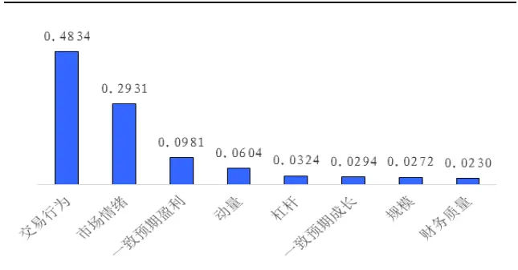
数据来源：国泰君安证券研究

图：建筑材料大类有效因子占比统计
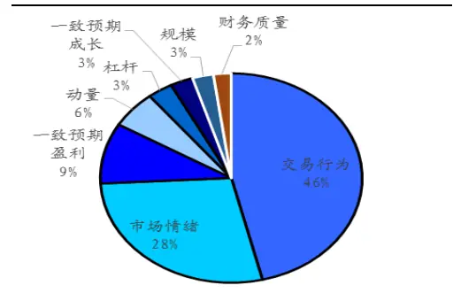
数据来源：国泰君安证券研究

表：建筑材料有效因子明细：

| 因子序号 | 因子名称 | 因子类别 | IC 均值 | ICIR | 因子序号 | 因子名称 | 因子类别 | IC 均值 | ICIR |
| --- | --- | --- | --- | --- | --- | --- | --- | --- | --- |
| 1 | acceleration | 动量 | -0.0306 | -2.26 | 95 | mom_np_FY1 | 一致预期盈利 | 0.0223 | 2.21 |
| 5 | Amt_1M_3M | 市场情绪 | -0.0641 | -4.75 | 109 | np_FY1_ttm | 一致预期盈利 | 0.0203 | 2.02 |
| 21 | Clo_RateMean_1M | 交易行为 | -0.0664 | -4.49 | 111 | np_growth_FY3 | 一致预期成长 | 0.0294 | 2.53 |
| 22 | Corr_Clo_Turn | 交易行为 | -0.0295 | -2.23 | 126 | Ret_AMT | 市场情绪 | 0.0388 | 3.74 |
| 51 | finExpRatio | 财务质量 | -0.0230 | -2.19 | 130 | Ret_Std_1W | 交易行为 | -0.0379 | -2.91 |
| 53 | floatshare_ratio | 杠杆 | -0.0324 | -2.80 | 132 | Ret_Std_3M | 交易行为 | -0.0322 | -2.56 |
| 58 | High_Low | 交易行为 | -0.0446 | -3.47 | 142 | Skew_Ret_1M | 交易行为 | -0.0269 | -2.25 |
| 60 | iv_cmap | 交易行为 | -0.0362 | -3.59 | 144 | SL_Volume_1M | 市场情绪 | -0.0440 | -3.58 |
| 62 | ivday | 交易行为 | -0.0550 | -4.44 | 158 | Turn_Mean_6M | 市场情绪 | 0.0258 | 2.01 |
| 73 | Mean_Ret_Amt | 市场情绪 | 0.0410 | 4.08 | 159 | Turn_Std_1M | 交易行为 | -0.0562 | -4.63 |
| 76 | mkt_cap_ard_log | 规模 | 0.0272 | 2.52 | 162 | Turn_StdRate_1M | 交易行为 | -0.0473 | -3.47 |
| 81 | mom3_np_FY1 | 一致预期盈利 | 0.0260 | 2.34 | 166 | Up_Down_Vol | 市场情绪 | 0.0513 | 4.52 |
| 92 | Mom_24M | 动量 | -0.0298 | -2.51 | 170 | Vol_Std_1M | 交易行为 | -0.0512 | -4.14 |
| 94 | mom_eps_FY1 | 一致预期盈利 | 0.0296 | 3.09 | 174 | VR | 市场情绪 | -0.0281 | -2.35 |

数据来源：国泰君安证券研究

## 3.3.1.12. 建筑装饰

建筑装饰行业由房屋建设、装修装饰、基础建设、专业工程以及园林工程等子行业组成。

建筑装饰成分股有效因子数量为 17个，预测IC 加总 IC_ALL为 0.609，其中交易行为占比 49.04%、市场情绪占比 16.71%、成长占比 13.82%、一致预期盈利占比 11.52%、盈利占比 4.47%、杠杆占比 4.43%，具体统计结果如下：

表：建筑装饰有效因子显著性统计

| 因子类别 | 交易行为 | 市场情绪 | 成长 | 一致预期盈利 | 盈利 | 杠杆 |
| --- | --- | --- | --- | --- | --- | --- |
| IC_STYLE | 0.2986 | 0.1018 | 0.0842 | 0.0701 | 0.0272 | 0.0270 |
| IC_ALL | 49.04% | 16.71% | 13.82% | 11.52% | 4.47% | 4.43% |

图：建筑装饰大类有效因子IC加总统计
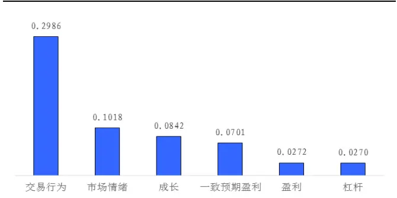
数据来源：国泰君安证券研究

图：建筑装饰大类有效因子占比统计
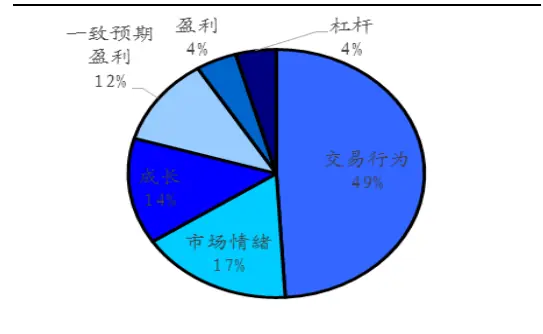
数据来源：国泰君安证券研究

表：建筑材料有效因子明细：

| 因子序号 | 因子名称 | 因子类别 | IC 均值 | ICIR | 因子序号 | 因子名称 | 因子类别 | IC 均值 | ICIR |
| --- | --- | --- | --- | --- | --- | --- | --- | --- | --- |
| 6 | Amt_Sum_1M | 市场情绪 | -0.0387 | -2.58 | 84 | mom3_roe_FY1 | 一致预期盈利 | 0.0358 | 2.75 |
| 19 | Clo_MaxMin_3M | 交易行为 | 0.0444 | 2.87 | 99 | mom_roe_FY1 | 一致预期盈利 | 0.0344 | 2.59 |
| 20 | Clo_MaxMin_6M | 交易行为 | 0.0596 | 4.19 | 159 | Turn_Std_1M | 交易行为 | -0.0377 | -2.82 |
| 22 | Corr_Clo_Turn | 交易行为 | -0.0427 | -2.73 | 162 | Turn_StdRate_1M | 交易行为 | -0.0325 | -2.29 |
| 32 | Dist_High | 交易行为 | -0.0385 | -3.17 | 166 | Up_Down_Vol | 市场情绪 | 0.0329 | 2.03 |
| 46 | eps_adjust | 盈利 | -0.0272 | -2.39 | 177 | yoy_bps | 成长 | -0.0339 | -2.56 |
| 58 | High_Low | 交易行为 | -0.0433 | -2.97 | 180 | yoy_net_ocf_q | 成长 | 0.0200 | 2.05 |
| 65 | long_debt_equity | 杠杆 | 0.0270 | 2.15 | 184 | yoy_oper_rev | 成长 | 0.0303 | 2.44 |
| 73 | Mean_Ret_Amt | 市场情绪 | 0.0301 | 2.43 |  |  |  |  |  |

数据来源：国泰君安证券研究

## 3.3.1.13. 房地产

房地产行业是进行房地产投资开发、经营管理以及服务的行业，具体包括了房地产开发以及园区开发等子行业，其具有较强的投资属性，与人口结构、政府政策息息相关。

房地产成分股有效因子数量为 18个，预测IC加总 IC_ALL为 0.572，其中交易行为占比 58.47%、市场情绪占比 22.10%、动量占比 10.93%、规模占比4.53%、财务质量占比 3.97%，具体统计结果如下：

表：房地产有效因子显著性统计

| 因子类别 | 交易行为 | 市场情绪 | 动量 | 规模 | 财务质量 |
| --- | --- | --- | --- | --- | --- |
| IC_STYLE | 0.3342 | 0.1263 | 0.0625 | 0.0259 | 0.0227 |
| IC_ALL | 58.47% | 22.10% | 10.93% | 4.53% | 3.97% |

数据来源：国泰君安证券研究

图：房地产大类有效因子IC加总统计
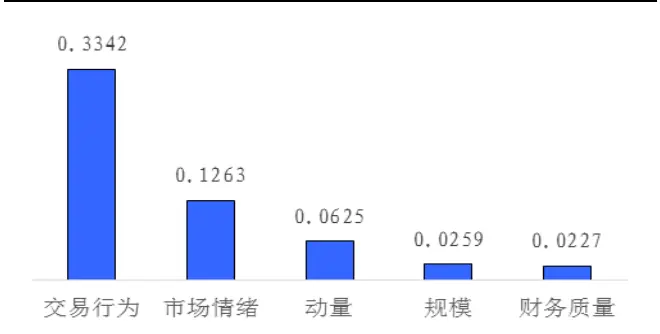
数据来源：国泰君安证券研究

图：房地产大类有效因子占比统计
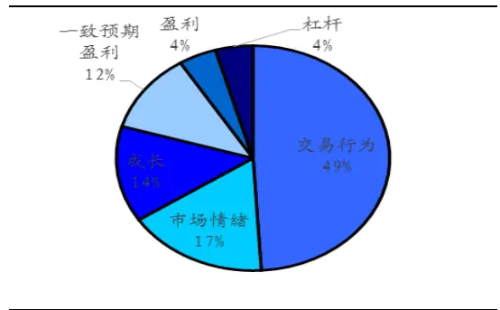
数据来源：国泰君安证券研究

表：房地产有效因子明细：

| 因子序号 | 因子名称 | 因子类别 | IC 均值 | ICIR | 因子序号 | 因子名称 | 因子类别 | IC 均值 | ICIR |
| --- | --- | --- | --- | --- | --- | --- | --- | --- | --- |
| 5 | Amt_1M_3M | 市场情绪 | -0.0444 | -4.52 | 118 | operExpRat io_bank | 财务质量 | -0.0227 | -2.46 |
| 19 | Clo_MaxMin_3M | 交易行为 | 0.0416 | 4.31 | 126 | Ret_AMT | 市场情绪 | 0.0338 | 4.66 |
| 22 | Corr_Clo_Turn | 交易行为 | -0.0408 | -4.18 | 130 | Ret_Std_1W | 交易行为 | -0.0251 | -2.70 |
| 58 | High_Low | 交易行为 | -0.0366 | -3.87 | 142 | Skew_Ret_1M | 交易行为 | -0.0276 | -3.25 |
| 73 | Mean_Ret_Amt | 市场情绪 | 0.0218 | 2.36 | 155 | Turn_CoV_1M | 交易行为 | -0.0310 | -3.45 |
| 76 | mkt_cap_ard_log | 规模 | 0.0259 | 3.27 | 156 | Turn_Mean_1M | 市场情绪 | -0.0264 | -2.88 |
| 86 | mom_1m_indus | 交易行为 | -0.0465 | -3.85 | 163 | Turn_StdRate_3M | 交易行为 | -0.0209 | -2.39 |
| 90 | mom_3m_Indus | 动量 | -0.0410 | -3.79 | 168 | Vol_Diff | 交易行为 | -0.0260 | -2.86 |
| 92 | Mom_24M | 动量 | -0.0215 | -2.44 | 170 | Vol_Std_1M | 交易行为 | -0.0380 | -4.12 |

数据来源：国泰君安证券研究

## 3.3.1.14. 有色金属

有色金属行业包括金属非金属新材料、黄金、稀有金属以及工业金属等子行业，其行业投资关注量、价、库存及成本。

有色金属成分股有效因子数量为 21个，预测IC 加总 IC_ALL为 0.659，其中交易行为占比42.34%、成长占比16.63%、一致预期盈利占比14.01%、盈利占比 13.74%、动量占比 8.14%、市场情绪占比 5.14%，具体统计结果如下：

表：有色金属有效因子显著性统计

| 因子类别 | 交易行为 | 成长 | 一致预期盈利 | 盈利 | 动量 | 市场情绪 |
| --- | --- | --- | --- | --- | --- | --- |
| IC_STYLE | 0.2792 | 0.1097 | 0.0924 | 0.0906 | 0.0537 | 0.0339 |
| IC_ALL | 42.34% | 16.63% | 14.01% | 13.74% | 8.14% | 5.14% |

数据来源：国泰君安证券研究

图：有色金属大类有效因子IC加总统计
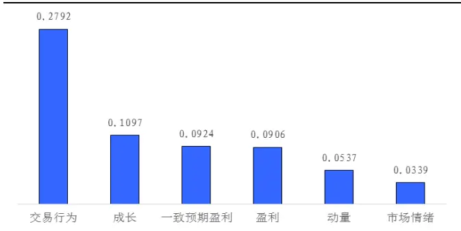
数据来源：国泰君安证券研究

图：有色金属大类有效因子占比统计
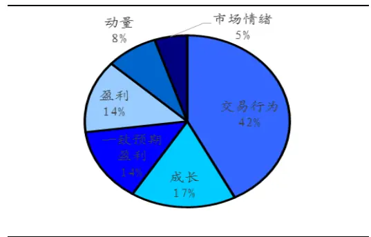
数据来源：国泰君安证券研究

表：有色金属有效因子明细：

| 因子序号 | 因子名称 | 因子类别 | IC 均值 | ICIR | 因子序号 | 因子名称 | 因子类别 | IC 均值 | ICIR |
| --- | --- | --- | --- | --- | --- | --- | --- | --- | --- |
| 19 | Clo_MaxMin_3M | 交易行为 | 0.0403 | 2.81 | 90 | mom_3m_Indus | 动量 | -0.0291 | -2.03 |
| 20 | Clo_MaxMin_6M | 交易行为 | 0.0361 | 2.82 | 94 | mom_eps_FY1 | 一致预期盈利 | 0.0271 | 2.75 |
| 22 | Corr_Clo_Turn | 交易行为 | -0.0424 | -3.49 | 99 | mom_roe_FY1 | 一致预期盈利 | 0.0219 | 2.34 |
| 25 | CoV_Volume_1M | 市场情绪 | -0.0339 | -2.84 | 135 | roe | 盈利 | 0.0355 | 3.54 |
| 55 | grossProfit_assets | 盈利 | 0.0264 | 2.54 | 142 | Skew_Ret_1M | 交易行为 | -0.0308 | -3.55 |
| 57 | grossProfitNonBank | 盈利 | 0.0286 | 2.88 | 162 | Turn_StdRate_1M | 交易行为 | -0.0409 | -3.19 |
| 58 | High_Low | 交易行为 | -0.0244 | -2.25 | 170 | Vol_Std_1M | 交易行为 | -0.0292 | -2.63 |
| 71 | Max_Ret_1M | 交易行为 | -0.0351 | -3.23 | 184 | yoy_oper_rev | 成长 | 0.0391 | 3.73 |
| 80 | mom3_eps_FY1 | 一致预期盈利 | 0.0214 | 2.36 | 187 | yoy_roe | 成长 | 0.0437 | 4.68 |
| 84 | mom3_roe_FY1 | 一致预期盈利 | 0.0219 | 2.36 | 189 | yoy_total_assets | 成长 | 0.0269 | 2.32 |
| 87 | Mom_1Y | 动量 | -0.0246 | -2.16 |  |  |  |  |  |

数据来源：国泰君安证券研究

## 3.3.1.15. 机械设备

机械设备行业包括通用机械，仪器仪表，专用设备，金属制品以及运输设备等子行业，其行业投资同时具有周期以及成长的属性。

机械设备成分股有效因子数量为 27个，预测IC 加总 IC_ALL为 0.872，其中交易行为占比 44.86%、一致预期盈利占比 17.90%、市场情绪占比12.12%、成长占比 9.71%、动量占比 6.87%、规模占比 3.44%、一致预期成长占比2.72%、估值占比 2.38%，具体统计结果如下：

表：机械设备有效因子显著性统计

| 因子类别 | 交易行为 | 一致预期盈利 | 市场情绪 | 成长 | 动量 | 规模 | 一致预期成长 | 估值 |
| --- | --- | --- | --- | --- | --- | --- | --- | --- |
| IC_STYLE | 0.3909 | 0.1560 | 0.1056 | 0.0846 | 0.0599 | 0.0300 | 0.0237 | 0.0208 |
| IC_ALL | 44.86% | 17.90% | 12.12% | 9.71% | 6.87% | 3.44% | 2.72% | 2.38% |

数据来源：国泰君安证券研究

图：机械设备大类有效因子 IC加总统计
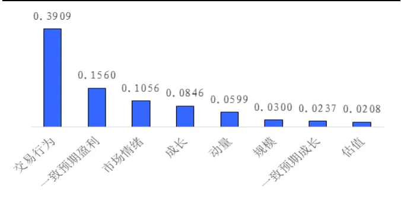
数据来源：国泰君安证券研究

图：机械设备大类有效因子占比统计
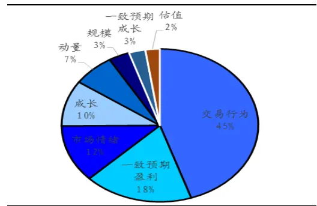
数据来源：国泰君安证券研究

表：机械设备有效因子明细：

| 因子序号 | 因子名称 | 因子类别 | IC 均值 | ICIR | 因子序号 | 因子名称 | 因子类别 | IC 均值 | ICIR |
| --- | --- | --- | --- | --- | --- | --- | --- | --- | --- |
| 5 | Amt_1M_3M | 市场情绪 | -0.0429 | -4.68 | 96 | mom_oper_rev_q | 成长 | 0.0227 | 3.33 |
| 20 | Clo_MaxMin_6M | 交易行为 | 0.0235 | 2.66 | 98 | mom_rev_FY1 | 一致预期盈利 | 0.0322 | 5.21 |
| 22 | Corr_Clo_Turn | 交易行为 | -0.0501 | -6.30 | 111 | np_growth_FY3 | 一致预期成长 | 0.0237 | 3.10 |
| 25 | CoV_Volume_1M | 市场情绪 | -0.0320 | -3.98 | 113 | ocfp | 估值 | 0.0208 | 3.71 |
| 58 | High_Low | 交易行为 | -0.0480 | -5.88 | 126 | Ret_AMT | 市场情绪 | 0.0307 | 3.95 |
| 60 | iv_cmap | 交易行为 | -0.0282 | -3.71 | 130 | Ret_Std_1W | 交易行为 | -0.0233 | -2.68 |
| 67 | Long_Short_EMA | 交易行为 | 0.0202 | 2.55 | 153 | tsmon | 交易行为 | -0.0346 | -3.70 |
| 76 | mkt_cap_ard_log | 规模 | 0.0300 | 3.70 | 159 | Turn_Std_1M | 交易行为 | -0.0521 | -5.72 |
| 80 | mom3_eps_FY1 | 一致预期盈利 | 0.0205 | 2.88 | 162 | Turn_StdRate_1M | 交易行为 | -0.0379 | -5.20 |
| 83 | mom3_rev_FY1 | 一致预期盈利 | 0.0335 | 4.80 | 168 | Vol_Diff | 交易行为 | -0.0252 | -2.79 |
| 84 | mom3_roe_FY1 | 一致预期盈利 | 0.0309 | 4.16 | 170 | Vol_Std_1M | 交易行为 | -0.0477 | -4.63 |
| 88 | Mom_1Y_1M | 动量 | 0.0205 | 2.78 | 184 | yoy_oper_rev | 成长 | 0.0364 | 5.58 |
| 89 | mom_3m | 动量 | -0.0393 | -3.94 | 186 | yoy_opprofit_q | 成长 | 0.0255 | 3.90 |
| 94 | mom_eps_FY1 | 一致预期盈利 | 0.0390 | 5.19 |  |  |  |  |  |

数据来源：国泰君安证券研究

## 3.3.1.16. 汽车

汽车行业包括汽车服务，汽车零部件，汽车整车以及其他交运设备等子行业，其行业投资关注需求。

汽车成分股有效因子数量为 24个，预测IC加总 IC_ALL为0.845，其中交易行为占比52.67%、市场情绪占比 24.32%、盈利占比 7.44%、成长占比 7.35%、规模占比 3.17%、估值占比 2.62%、财务质量占比 2.41%，具体统计结果如下：

表：汽车有效因子显著性统计

| 因子类别 | 交易行为 | 市场情绪 | 盈利 | 成长 | 规模 | 估值 | 财务质量 |
| --- | --- | --- | --- | --- | --- | --- | --- |
| IC_STYLE | 0.4451 | 0.2056 | 0.0629 | 0.0622 | 0.0268 | 0.0222 | 0.0204 |
| IC_ALL | 52.67% | 24.32% | 7.44% | 7.35% | 3.17% | 2.62% | 2.41% |

数据来源：国泰君安证券研究

图：汽车大类有效因子 IC加总统计
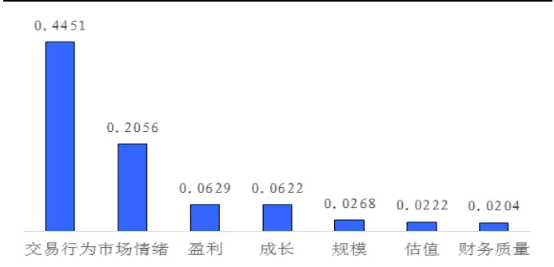
数据来源：国泰君安证券研究

图：汽车大类有效因子占比统计
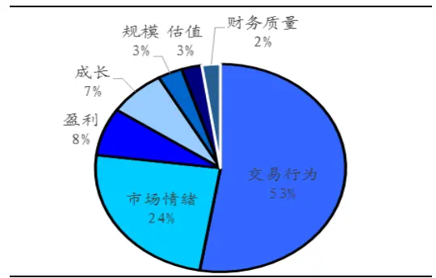
数据来源：国泰君安证券研究

表：汽车有效因子明细：

| 因子序号 | 因子名称 | 因子类别 | IC 均值 | ICIR | 因子序号 | 因子名称 | 因子类别 | IC 均值 | ICIR |
| --- | --- | --- | --- | --- | --- | --- | --- | --- | --- |
| 17 | Clo_5D_60D | 交易行为 | -0.0557 | -4.34 | 117 | operExpRat io | 财务质量 | 0.0204 | 2.13 |
| 20 | Clo_MaxMin_6M | 交易行为 | 0.0368 | 3.05 | 126 | Ret_AMT | 市场情绪 | 0.0243 | 3.10 |
| 22 | Corr_Clo_Turn | 交易行为 | -0.0502 | -4.87 | 130 | Ret_Std_1W | 交易行为 | -0.0307 | -2.71 |
| 30 | DIFF | 交易行为 | -0.0281 | -2.85 | 153 | tsmon | 交易行为 | -0.0440 | -3.82 |
| 55 | grossProfit_assets | 盈利 | 0.0346 | 3.97 | 154 | Turn_1M_3M | 市场情绪 | -0.0436 | -3.94 |
| 57 | grossProfitNonBank | 盈利 | 0.0284 | 2.64 | 159 | Turn_Std_1M | 交易行为 | -0.0571 | -4.72 |
| 58 | High_Low | 交易行为 | -0.0404 | -3.67 | 166 | Up_Down_Vol | 市场情绪 | 0.0401 | 3.74 |
| 60 | iv_cmap | 交易行为 | -0.0357 | -3.94 | 167 | valueResidual | 估值 | -0.0222 | -2.07 |
| 71 | Max_Ret_1M | 交易行为 | -0.0428 | -3.97 | 168 | Vol_Diff | 交易行为 | -0.0235 | -2.35 |
| 72 | Mean_AMT | 市场情绪 | -0.0313 | -2.88 | 174 | VR | 市场情绪 | -0.0358 | -4.08 |
| 73 | Mean_Ret_Amt | 市场情绪 | 0.0305 | 2.74 | 184 | yoy_oper_rev | 成长 | 0.0325 | 3.49 |
| 76 | mkt_cap_ard_log | 规模 | 0.0268 | 3.21 | 186 | yoy_opprofit_q | 成长 | 0.0297 | 3.59 |

数据来源：国泰君安证券研究

## 3.3.1.17. 电子

电子行业是研制生产各类电子设备以及电子元件、器件、仪器、仪表等的行业，具体包括了半导体、元件、光学光电子、电子制造以及其他行业等子行业。

电子成分股有效因子数量为 27个，预测IC加总 IC_ALL为0.834，其中交易行为占比 44.98%、市场情绪占比 21.12%、成长占比 16.51%、估值占比8.15%、规模占比3.48%、盈利占比3.00%、一致预期盈利占比2.76%，具体统计结果如下：

表：电子有效因子显著性统计

| 因子类别 | 交易行为 | 市场情绪 | 成长 | 估值 | 规模 | 盈利 | 一致预期盈利 |
| --- | --- | --- | --- | --- | --- | --- | --- |
| IC_STYLE | 0.3752 | 0.1761 | 0.1377 | 0.0680 | 0.0290 | 0.0250 | 0.0230 |
| IC_ALL | 44.98% | 21.12% | 16.51% | 8.15% | 3.48% | 3.00% | 2.76% |

数据来源：国泰君安证券研究

图：电子大类有效因子 IC加总统计
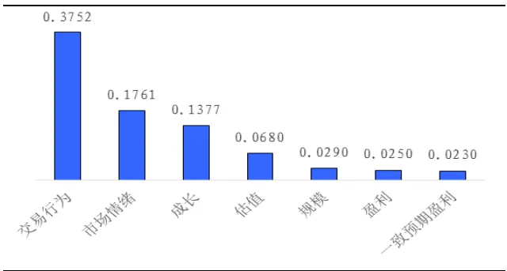
数据来源：国泰君安证券研究

图：电子大类有效因子占比统计
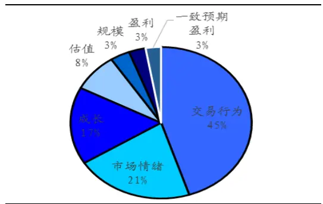
数据来源：国泰君安证券研究

表：电子有效因子明细：

| 因子序号 | 因子名称 | 因子类别 | IC 均值 | ICIR | 因子序号 | 因子名称 | 因子类别 | IC 均值 | ICIR |
| --- | --- | --- | --- | --- | --- | --- | --- | --- | --- |
| 17 | Clo_5D_60D | 交易行为 | -0.0428 | -3.53 | 101 | ncfp | 估值 | -0.0255 | -2.71 |
| 22 | Corr_Clo_Turn | 交易行为 | -0.0349 | -4.00 | 126 | Ret_AMT | 市场情绪 | 0.0304 | 3.08 |
| 25 | CoV_Volume_1M | 市场情绪 | -0.0273 | -3.15 | 153 | tsmon | 交易行为 | -0.0259 | -2.51 |
| 30 | DIFF | 交易行为 | -0.0208 | -2.32 | 154 | Turn_1M_3M | 市场情绪 | -0.0437 | -5.09 |
| 31 | disposition | 交易行为 | -0.0312 | -3.55 | 159 | Turn_Std_1M | 交易行为 | -0.0429 | -4.37 |
| 44 | ep_indus | 估值 | 0.0207 | 2.54 | 162 | Turn_StdRate_1M | 交易行为 | -0.0421 | -4.86 |
| 55 | grossProfit_assets | 盈利 | 0.0250 | 3.45 | 164 | Turn_StdRate_6M | 交易行为 | -0.0261 | -2.88 |
| 58 | High_Low | 交易行为 | -0.0569 | -6.31 | 166 | Up_Down_Vol | 市场情绪 | 0.0317 | 2.77 |
| 62 | ivday | 交易行为 | -0.0240 | -2.94 | 167 | valueResidual | 估值 | -0.0218 | -2.57 |
| 71 | Max_Ret_1M | 交易行为 | -0.0275 | -2.77 | 177 | yoy_bps | 成长 | -0.0212 | -2.56 |
| 72 | Mean_AMT | 市场情绪 | -0.0430 | -4.19 | 179 | yoy_eps_q | 成长 | 0.0240 | 3.43 |
| 76 | mkt_cap_ard_log | 规模 | 0.0290 | 3.37 | 184 | yoy_oper_rev | 成长 | 0.0326 | 3.63 |
| 94 | mom_eps_FY1 | 一致预期盈利 | 0.0230 | 3.09 | 186 | yoy_opprofit_q | 成长 | 0.0324 | 4.44 |
| 96 | mom_oper_rev_q | 成长 | 0.0274 | 3.12 |  |  |  |  |  |

数据来源：国泰君安证券研究

## 3.3.1.18. 电气设备

电气设备行业包括电机，电气自动化设备，电源设备以及高低压设备等子行业。

电气设备成分股有效因子数量为 25个，预测IC 加总 IC_ALL为 0.790，其中交易行为占比42.13%、一致预期盈利占比25.66%、成长占比16.19%、市场情绪占比12.79%、盈利占比3.23%、，具体统计结果如下：

表：电气设备有效因子显著性统计

| 因子类别 | 交易行为 | 一致预期盈利 | 成长 | 市场情绪 | 盈利 |
| --- | --- | --- | --- | --- | --- |
| IC_STYLE | 0.3327 | 0.2027 | 0.1278 | 0.1010 | 0.0255 |
| IC_ALL | 42.13% | 25.66% | 16.19% | 12.79% | 3.23% |

数据来源：国泰君安证券研究

图：电气设备大类有效因子 IC加总统计
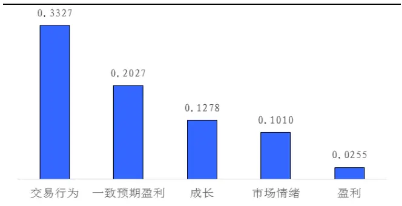
数据来源：国泰君安证券研究

图：电气设备大类有效因子占比统计
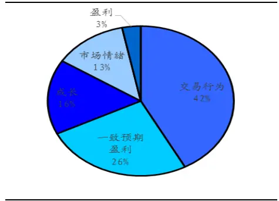
数据来源：国泰君安证券研究

表：电气设备有效因子明细：

| 因子序号 | 因子名称 | 因子类别 | IC 均值 | ICIR | 因子序号 | 因子名称 | 因子类别 | IC 均值 | ICIR |
| --- | --- | --- | --- | --- | --- | --- | --- | --- | --- |
| 19 | Clo_MaxMin_3M | 交易行为 | 0.0215 | 2.20 | 95 | mom_np_FY1 | 一致预期盈利 | 0.0251 | 3.61 |
| 20 | Clo_MaxMin_6M | 交易行为 | 0.0206 | 2.21 | 96 | mom_oper_rev_q | 成长 | 0.0414 | 4.57 |
| 22 | Corr_Clo_Turn | 交易行为 | -0.0453 | -4.87 | 97 | mom_rating | 一致预期盈利 | -0.0234 | -2.82 |
| 25 | CoV_Volume_1M | 市场情绪 | -0.0445 | -4.88 | 98 | mom_rev_FY1 | 一致预期盈利 | 0.0219 | 3.02 |
| 58 | High_Low | 交易行为 | -0.0448 | -4.64 | 126 | Ret_AMT | 市场情绪 | 0.0247 | 2.64 |
| 61 | iv_r2 | 交易行为 | -0.0288 | -3.47 | 137 | roic | 盈利 | 0.0255 | 3.01 |
| 67 | Long_Short_EMA | 交易行为 | 0.0224 | 2.37 | 154 | Turn_1M_3M | 市场情绪 | -0.0318 | -3.34 |
| 80 | mom3_eps_FY1 | 一致预期盈利 | 0.0219 | 3.27 | 159 | Turn_Std_1M | 交易行为 | -0.0461 | -4.58 |
| 81 | mom3_np_FY1 | 一致预期盈利 | 0.0340 | 4.82 | 163 | Turn_StdRate_3M | 交易行为 | -0.0330 | -3.46 |
| 82 | mom3_rating | 一致预期盈利 | -0.0237 | -2.82 | 170 | Vol_Std_1M | 交易行为 | -0.0398 | -3.75 |
| 83 | mom3_rev_FY1 | 一致预期盈利 | 0.0308 | 4.09 | 184 | yoy_oper_rev | 成长 | 0.0477 | 6.12 |
| 85 | mom_1m | 交易行为 | -0.0304 | -2.76 | 187 | yoy_roe | 成长 | 0.0387 | 4.97 |
| 94 | mom_eps_FY1 | 一致预期盈利 | 0.0218 | 3.11 |  |  |  |  |  |

数据来源：国泰君安证券研究

## 3.3.1.19. 纺织服装

纺织服装行业由纺织制造以及服装家纺等子行业组成。

纺织服装成分股有效因子数量为 24个，预测IC 加总 IC_ALL为 0.879，其中交易行为占比 54.72%、市场情绪占比 19.40%、一致预期盈利占比11.33%、规模占比 7.28%、成长占比 4.14%、财务质量占比 3.13%，具体统计结果如下：

表：纺织服装有效因子显著性统计

| 因子类别 | 交易行为 | 市场情绪 | 一致预期盈利 | 规模 | 成长 | 财务质量 |
| --- | --- | --- | --- | --- | --- | --- |
| IC_STYLE | 0.4809 | 0.1705 | 0.0995 | 0.0639 | 0.0364 | 0.0275 |
| IC_ALL | 54.72% | 19.40% | 11.33% | 7.28% | 4.14% | 3.13% |

数据来源：国泰君安证券研究

图：纺织服装大类有效因子 IC加总统计
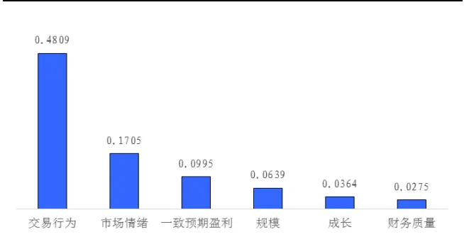
数据来源：国泰君安证券研究

图：纺织服装大类有效因子占比统计
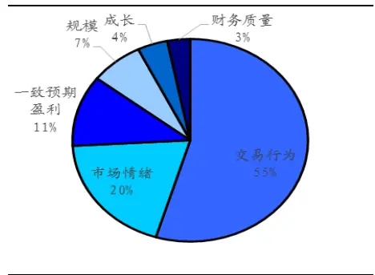
数据来源：国泰君安证券研究

表：纺织服装有效因子明细：

| 因子序号 | 因子名称 | 因子类别 | IC 均值 | ICIR | 因子序号 | 因子名称 | 因子类别 | IC 均值 | ICIR |
| --- | --- | --- | --- | --- | --- | --- | --- | --- | --- |
| 5 | Amt_1M_3M | 市场情绪 | -0.0576 | -4.54 | 100 | moneyCap_assets | 财务质量 | 0.0275 | 2.27 |
| 20 | Clo_MaxMin_6M | 交易行为 | 0.0352 | 3.13 | 126 | Ret_AMT | 市场情绪 | 0.0216 | 2.05 |
| 21 | Clo_RateMean_1M | 交易行为 | -0.0400 | -2.72 | 130 | Ret_Std_1W | 交易行为 | -0.0271 | -2.40 |
| 22 | Corr_Clo_Turn | 交易行为 | -0.0548 | -4.60 | 131 | Ret_Std_1Y | 交易行为 | 0.0288 | 2.42 |
| 58 | High_Low | 交易行为 | -0.0689 | -5.27 | 133 | Ret_Std_6M | 交易行为 | 0.0251 | 2.36 |
| 60 | iv_cmap | 交易行为 | -0.0402 | -3.44 | 155 | Turn_CoV_1M | 交易行为 | -0.0413 | -3.57 |
| 73 | Mean_Ret_Amt | 市场情绪 | 0.0443 | 3.67 | 156 | Turn_Mean_1M | 市场情绪 | -0.0471 | -3.74 |
| 77 | mkt_cap_float | 规模 | 0.0422 | 3.72 | 160 | Turn_Std_3M | 交易行为 | -0.0268 | -2.37 |
| 78 | mkt_cap_float_log | 规模 | 0.0218 | 2.18 | 163 | Turn_StdRate_3M | 交易行为 | -0.0264 | -2.47 |
| 82 | mom3_rating | 一致预期盈利 | -0.0271 | -2.75 | 168 | Vol_Diff | 交易行为 | -0.0309 | -2.55 |
| 83 | mom3_rev_FY1 | 一致预期盈利 | 0.0418 | 4.26 | 170 | Vol_Std_1M | 交易行为 | -0.0354 | -2.39 |
| 94 | mom_eps_FY1 | 一致预期盈利 | 0.0306 | 2.99 | 184 | yoy_oper_rev | 成长 | 0.0364 | 3.02 |

数据来源：国泰君安证券研究

## 3.3.1.20. 计算机

计算机行业由计算机设备以及计算机应用等两大部门组成，其中计算机设备主要指计算机相关设备的制造，计算机应用主要是指软件开发、IT服务等。

计算机成分股有效因子数量为 26 个，预测IC加总 IC_ALL为 0.866，其中交易行为占比 53.95%、市场情绪占比 15.43%、一致预期盈利占比10.72%、成长占比 8.59%、盈利占比 6.10%、动量占比 5.21%，具体统计结果如下：

表：计算机有效因子显著性统计

| 因子类别 | 交易行为 | 市场情绪 | 一致预期盈利 | 成长 | 盈利 | 动量 |
| --- | --- | --- | --- | --- | --- | --- |
| IC_STYLE | 0.4669 | 0.1335 | 0.0928 | 0.0744 | 0.0528 | 0.0451 |
| IC_ALL | 53.95% | 15.43% | 10.72% | 8.59% | 6.10% | 5.21% |

数据来源：国泰君安证券研究

图：计算机大类有效因子IC加总统计
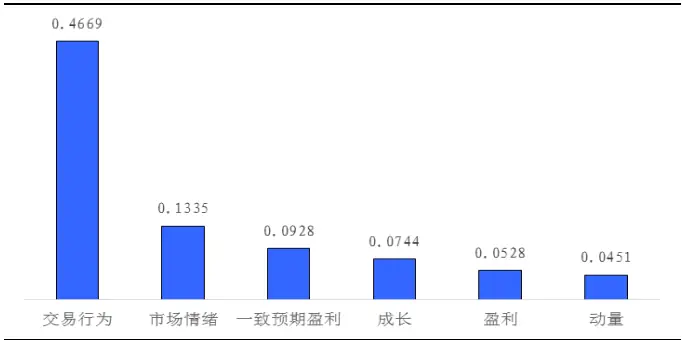
数据来源：国泰君安证券研究

图：计算机大类有效因子占比统计
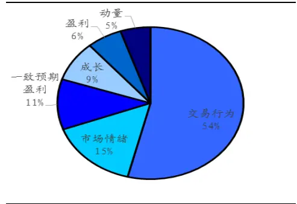
数据来源：国泰君安证券研究

表：计算机有效因子明细：

| 因子序号 | 因子名称 | 因子类别 | IC 均值 | ICIR | 因子序号 | 因子名称 | 因子类别 | IC 均值 | ICIR |
| --- | --- | --- | --- | --- | --- | --- | --- | --- | --- |
| 1 | acceleration | 动量 | -0.0214 | -2.14 | 81 | mom3_np_FY1 | 一致预期盈利 | 0.0276 | 3.20 |
| 5 | Amt_1M_3M | 市场情绪 | -0.0365 | -3.97 | 83 | mom3_rev_FY1 | 一致预期盈利 | 0.0375 | 4.21 |
| 20 | Clo_MaxMin_6M | 交易行为 | 0.0284 | 3.04 | 84 | mom3_roe_FY1 | 一致预期盈利 | 0.0277 | 3.93 |
| 21 | Clo_RateMean_1M | 交易行为 | -0.0414 | -3.68 | 88 | Mom_1Y_1M | 动量 | 0.0238 | 2.42 |
| 22 | Corr_Clo_Turn | 交易行为 | -0.0483 | -5.47 | 131 | Ret_Std_1Y | 交易行为 | 0.0263 | 2.78 |
| 25 | CoV_Volume_1M | 市场情绪 | -0.0336 | -3.23 | 132 | Ret_Std_3M | 交易行为 | -0.0298 | -2.40 |
| 30 | DIFF | 交易行为 | -0.0258 | -2.68 | 153 | tsmon | 交易行为 | -0.0236 | -2.04 |
| 45 | eps | 盈利 | 0.0216 | 2.01 | 159 | Turn_Std_1M | 交易行为 | -0.0509 | -4.74 |
| 55 | grossProfit_assets | 盈利 | 0.0312 | 3.40 | 162 | Turn_StdRate_1M | 交易行为 | -0.0396 | -4.21 |
| 58 | High_Low | 交易行为 | -0.0609 | -6.71 | 166 | Up_Down_Vol | 市场情绪 | 0.0255 | 2.28 |
| 60 | iv_cmap | 交易行为 | -0.0230 | -2.33 | 168 | Vol_Diff | 交易行为 | -0.0337 | -3.53 |
| 71 | Max_Ret_1M | 交易行为 | -0.0353 | -3.59 | 184 | yoy_oper_rev | 成长 | 0.0392 | 4.49 |
| 72 | Mean_AMT | 市场情绪 | -0.0378 | -3.74 | 187 | yoy_roe | 成长 | 0.0352 | 3.52 |

数据来源：国泰君安证券研究

## 3.3.1.21. 轻工制造

轻工制造行业包括包装印刷，家用轻工以及造纸等子行业。

轻工制造成分股有效因子数量为 27个，预测IC加总 IC_ALL为 0.922，其中交易行为占比 52.63%、市场情绪占比 27.01%、一致预期盈利占比11.04%、规模占比6.45%、杠杆占比 2.87%，具体统计结果如下：

表：轻工制造有效因子显著性统计

| 因子类别 | 交易行为 | 市场情绪 | 一致预期盈利 | 规模 | 杠杆 |
| --- | --- | --- | --- | --- | --- |
| IC_STYLE | 0.4852 | 0.2490 | 0.1018 | 0.0595 | 0.0264 |
| IC_ALL | 52.63% | 27.01% | 11.04% | 6.45% | 2.87% |

数据来源：国泰君安证券研究

图：轻工制造大类有效因子 IC加总统计
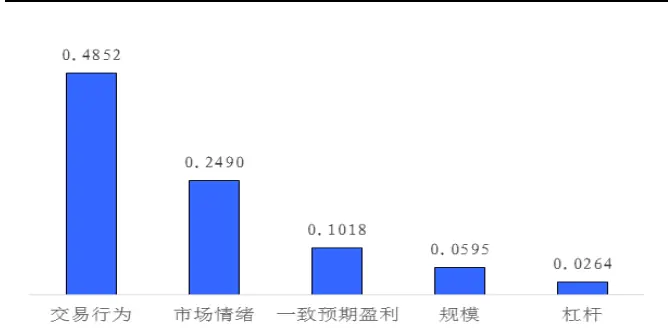
数据来源：国泰君安证券研究

图：轻工制造大类有效因子占比统计
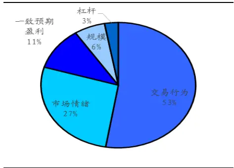
数据来源：国泰君安证券研究

表：轻工制造有效因子明细：

| 因子序号 | 因子名称 | 因子类别 | IC 均值 | ICIR | 因子序号 | 因子名称 | 因子类别 | IC 均值 | ICIR |
| --- | --- | --- | --- | --- | --- | --- | --- | --- | --- |
| 5 | Amt_1M_3M | 市场情绪 | -0.0514 | -4.43 | 73 | Mean_Ret_Amt | 市场情绪 | 0.0210 | 2.27 |
| 7 | assets_log | 规模 | 0.0219 | 2.23 | 76 | mkt_cap_ard_log | 规模 | 0.0376 | 3.33 |
| 18 | Clo_MaxMin_1M | 交易行为 | -0.0218 | -2.04 | 82 | mom3_rating | 一致预期盈利 | -0.0261 | -2.96 |
| 19 | Clo_MaxMin_3M | 交易行为 | 0.0407 | 3.58 | 95 | mom_np_FY1 | 一致预期盈利 | 0.0307 | 3.30 |
| 20 | Clo_MaxMin_6M | 交易行为 | 0.0435 | 4.12 | 97 | mom_rating | 一致预期盈利 | -0.0235 | -2.36 |
| 22 | Corr_Clo_Turn | 交易行为 | -0.0459 | -3.97 | 98 | mom_rev_FY1 | 一致预期盈利 | 0.0214 | 2.10 |
| 25 | CoV_Volume_1M | 市场情绪 | -0.0533 | -4.52 | 130 | Ret_Std_1W | 交易行为 | -0.0342 | -2.64 |
| 53 | floatshare_ratio | 杠杆 | -0.0264 | -2.34 | 131 | Ret_Std_1Y | 交易行为 | 0.0321 | 2.71 |
| 58 | High_Low | 交易行为 | -0.0287 | -2.37 | 153 | tsmon | 交易行为 | -0.0254 | -2.20 |
| 60 | iv_cmap | 交易行为 | -0.0314 | -2.73 | 156 | Turn_Mean_1M | 市场情绪 | -0.0388 | -3.20 |
| 61 | iv_r2 | 交易行为 | -0.0291 | -2.81 | 166 | Up_Down_Vol | 市场情绪 | 0.0381 | 3.63 |
| 70 | MACD | 交易行为 | -0.0305 | -2.44 | 168 | Vol_Diff | 交易行为 | -0.0378 | -3.93 |
| 71 | Max_Ret_1M | 交易行为 | -0.0329 | -3.11 | 170 | Vol_Std_1M | 交易行为 | -0.0514 | -4.48 |
| 72 | Mean_AMT | 市场情绪 | -0.0464 | -4.33 |  |  |  |  |  |

数据来源：国泰君安证券研究

## 3.3.1.22.通信

通信行业由通信设备以及通信运营等两大部门组成。

通信成分股有效因子数量为 24个，预测IC加总 IC_ALL为0.945，其中交易行为占比56.54%、市场情绪占比 12.16%、成长占比 9.20%、估值占比 9.08%、动量占比 4.23%、盈利占比 3.44%、财务质量占比 2.92%、规模占比2.42%，具体统计结果如下：

表：通信有效因子显著性统计

| 因子类别 | 交易行为 | 市场情绪 | 成长 | 估值 | 动量 | 盈利 | 财务质量 | 规模 |
| --- | --- | --- | --- | --- | --- | --- | --- | --- |
| IC_STYLE | 0.5343 | 0.1149 | 0.0870 | 0.0858 | 0.0400 | 0.0325 | 0.0276 | 0.0229 |
| IC_ALL | 56.54% | 12.16% | 9.20% | 9.08% | 4.23% | 3.44% | 2.92% | 2.42% |

数据来源：国泰君安证券研究

图：通信大类有效因子 IC加总统计
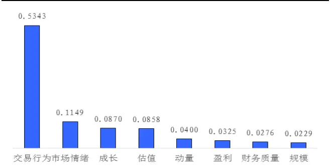
数据来源：国泰君安证券研究

图：通信大类有效因子占比统计
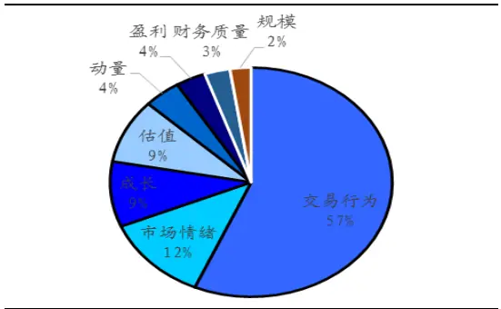
数据来源：国泰君安证券研究

表：通信有效因子明细：

| 因子序号 | 因子名称 | 因子类别 | IC 均值 | ICIR | 因子序号 | 因子名称 | 因子类别 | IC 均值 | ICIR |
| --- | --- | --- | --- | --- | --- | --- | --- | --- | --- |
| 1 | acceleration | 动量 | -0.0400 | -3.07 | 126 | Ret_AMT | 市场情绪 | 0.0442 | 3.60 |
| 13 | bp_indus | 估值 | 0.0503 | 3.76 | 131 | Ret_Std_1Y | 交易行为 | 0.0282 | 2.37 |
| 22 | Corr_Clo_Turn | 交易行为 | -0.0507 | -3.65 | 153 | tsmon | 交易行为 | -0.0357 | -2.66 |
| 30 | DIFF | 交易行为 | -0.0496 | -3.52 | 159 | Turn_Std_1M | 交易行为 | -0.0579 | -4.00 |
| 55 | grossProfit_assets | 盈利 | 0.0325 | 2.93 | 162 | Turn_StdRate_1M | 交易行为 | -0.0631 | -4.66 |
| 58 | High_Low | 交易行为 | -0.0409 | -3.05 | 163 | Turn_StdRate_3M | 交易行为 | -0.0456 | -3.80 |
| 71 | Max_Ret_1M | 交易行为 | -0.0349 | -2.59 | 167 | valueResidual | 估值 | -0.0354 | -2.50 |
| 72 | Mean_AMT | 市场情绪 | -0.0415 | -3.52 | 168 | Vol_Diff | 交易行为 | -0.0243 | -2.08 |
| 73 | Mean_Ret_Amt | 市场情绪 | 0.0292 | 2.13 | 170 | Vol_Std_1M | 交易行为 | -0.0471 | -3.35 |
| 75 | mkt_cap_ard_indus | 规模 | 0.0229 | 2.09 | 178 | yoy_eps | 成长 | 0.0315 | 2.48 |
| 85 | mom_1m | 交易行为 | -0.0563 | -3.91 | 180 | yoy_net_ocf_q | 成长 | 0.0240 | 2.13 |
| 123 | orgCapital | 财务质量 | 0.0276 | 2.67 | 184 | yoy_oper_rev | 成长 | 0.0314 | 2.97 |

数据来源：国泰君安证券研究

## 3.3.1.23. 采掘

采掘行业包括煤炭开采、其他采掘、石油开采以及采掘服务等子行业，其行业投资关注量、价及库存。

采掘成分股有效因子数量为 15个，预测IC加总 IC_ALL为0.465，其中市场情绪占比 37.24%、交易行为占比 13.76%、成长占比 13.49%、规模占比 12.35%、盈利占比 6.95%、一致预期盈利占比 6.15%、财务质量占比5.03%、估值占比5.03%，具体统计结果如下：

表：采掘有效因子显著性统计

| 因子类别 | 市场情绪 | 交易行为 | 成长 | 规模 | 盈利 | 一致预期盈利 | 财务质量 | 估值 |
| --- | --- | --- | --- | --- | --- | --- | --- | --- |
| IC_STYLE | 0.1731 | 0.0639 | 0.0627 | 0.0574 | 0.0323 | 0.0286 | 0.0234 | 0.0234 |
| IC_ALL | 37.24% | 13.76% | 13.49% | 12.35% | 6.95% | 6.15% | 5.03% | 5.03% |

数据来源：国泰君安证券研究

图：采掘大类有效因子 IC加总统计
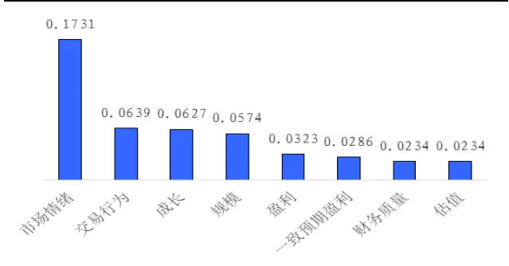
数据来源：国泰君安证券研究

图：采掘大类有效因子占比统计
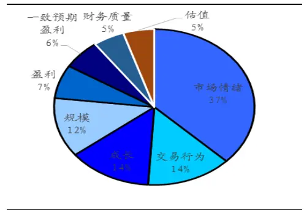
数据来源：国泰君安证券研究

表：采掘有效因子明细：

| 因子序号 | 因子名称 | 因子类别 | IC 均值 | ICIR | 因子序号 | 因子名称 | 因子类别 | IC 均值 | ICIR |
| --- | --- | --- | --- | --- | --- | --- | --- | --- | --- |
| 22 | Corr_Clo_Turn | 交易行为 | -0.0354 | -2.38 | 118 | operExpRatio_bank | 财务质量 | -0.0234 | -2.32 |
| 54 | grossMarginRatio_ttm | 盈利 | 0.0323 | 2.59 | 126 | Ret_AMT | 市场情绪 | 0.0345 | 2.78 |
| 72 | Mean_AMT | 市场情绪 | -0.0254 | -2.11 | 144 | SL_Volume_1M | 市场情绪 | -0.0453 | -3.54 |
| 73 | Mean_Ret_Amt | 市场情绪 | 0.0354 | 2.82 | 159 | Turn_Std_1M | 交易行为 | -0.0286 | -2.15 |
| 75 | mkt_cap_ard_indus | 规模 | 0.0312 | 2.07 | 166 | Up_Down_Vol | 市场情绪 | 0.0325 | 2.58 |
| 76 | mkt_cap_ard_log | 规模 | 0.0262 | 2.01 | 184 | yoy_oper_rev | 成长 | 0.0339 | 2.40 |
| 99 | mom_roe_FY1 | 一致预期盈利 | 0.0286 | 2.56 | 186 | yoy_opprofit_q | 成长 | 0.0288 | 2.16 |
| 102 | ncfp_indus | 估值 | 0.0234 | 2.09 |  |  |  |  |  |

数据来源：国泰君安证券研究

## 3.3.1.24. 钢铁

钢铁行业投资关注量、价、库存、成本及吨钢毛利。

钢铁成分股有效因子数量为 25个，预测IC加总 IC_ALL为1.015，其中交易行为占比52.74%、一致预期盈利占比17.00%、动量占比 8.19%、市场情绪占比 7.99%、成长占比4.36%、盈利占比 3.34%、估值占比3.29%、财务质量占比3.08%，具体统计结果如下：

表：钢铁有效因子显著性统计

| 因子类别 | 交易行为 | 一致预期盈利 | 动量 | 市场情绪 | 成长 | 盈利 | 估值 | 财务质量 |
| --- | --- | --- | --- | --- | --- | --- | --- | --- |
| IC_STYLE | 0.5351 | 0.1725 | 0.0831 | 0.0810 | 0.0443 | 0.0339 | 0.0334 | 0.0313 |
| IC_ALL | 52.74% | 17.00% | 8.19% | 7.99% | 4.36% | 3.34% | 3.29% | 3.08% |

数据来源：国泰君安证券研究

图：钢铁大类有效因子 IC加总统计
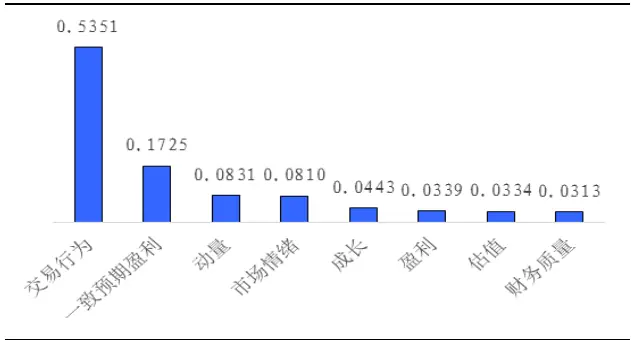
数据来源：国泰君安证券研究

图：钢铁大类有效因子占比统计
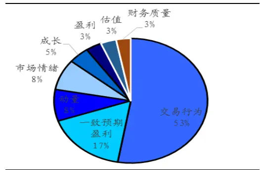
数据来源：国泰君安证券研究

表：钢铁有效因子明细：

| 因子序号 | 因子名称 | 因子类别 | IC 均值 | ICIR | 因子序号 | 因子名称 | 因子类别 | IC 均值 | ICIR |
| --- | --- | --- | --- | --- | --- | --- | --- | --- | --- |
| 13 | bp_indus | 估值 | 0.0334 | 2.06 | 94 | mom_eps_FY1 | 一致预期盈利 | 0.0482 | 3.30 |
| 20 | Clo_MaxMin_6M | 交易行为 | 0.0405 | 2.28 | 99 | mom_roe_FY1 | 一致预期盈利 | 0.0288 | 2.01 |
| 21 | Clo_RateMean_1M | 交易行为 | -0.0659 | -3.32 | 123 | orgCapital | 财务质量 | -0.0313 | -2.13 |
| 22 | Corr_Clo_Turn | 交易行为 | -0.0410 | -2.60 | 130 | Ret_Std_1W | 交易行为 | -0.0366 | -2.24 |
| 31 | disposition | 交易行为 | -0.0359 | -2.18 | 133 | Ret_Std_6M | 交易行为 | 0.0370 | 2.29 |
| 58 | High_Low | 交易行为 | -0.0540 | -2.99 | 134 | roa | 盈利 | -0.0339 | -2.27 |
| 60 | iv_cmap | 交易行为 | -0.0479 | -2.60 | 139 | RSI | 交易行为 | -0.0343 | -2.02 |
| 71 | Max_Ret_1M | 交易行为 | -0.0364 | -2.18 | 155 | Turn_CoV_1M | 交易行为 | -0.0352 | -2.20 |
| 73 | Mean_Ret_Amt | 市场情绪 | 0.0348 | 2.12 | 159 | Turn_Std_1M | 交易行为 | -0.0360 | -2.02 |
| 80 | mom3_eps_FY1 | 一致预期盈利 | 0.0440 | 2.91 | 162 | Turn_StdRate_1M | 交易行为 | -0.0343 | -2.20 |
| 84 | mom3_roe_FY1 | 一致预期盈利 | 0.0515 | 3.51 | 166 | Up_Down_Vol | 市场情绪 | 0.0462 | 2.58 |
| 87 | Mom_1Y | 动量 | -0.0406 | -2.54 | 181 | yoy_np | 成长 | 0.0443 | 3.05 |
| 91 | Mom_6M | 动量 | -0.0425 | -2.61 |  |  |  |  |  |

数据来源：国泰君安证券研究

## 3.3.1.25.银行

银行行业与经济环境有较大关联，其研究关注资产规模、净息差、拨备以及坏账等，其投资属性偏防御偏配置。

银行成分股有效因子数量为 17个，预测IC加总 IC_ALL为1.135，其中财务质量占比 19.11%、估值占比 16.12%、交易行为占比 15.77%、市场情绪占比14.99%、一致预期盈利占比10.93%、杠杆占比 7.52%、动量占比6.40%、规模占比5.16%、成长占比4.00%，具体统计结果如下：

表：银行有效因子显著性统计

| 因子类别 | 财务质量 | 估值 | 交易行为 | 市场情绪 | 一致预期盈利 | 杠杆 | 动量 | 规模 | 成长 |
| --- | --- | --- | --- | --- | --- | --- | --- | --- | --- |
| IC_STYLE | 0.2170 | 0.1830 | 0.1790 | 0.1701 | 0.1240 | 0.0854 | 0.0726 | 0.0586 | 0.0454 |
| IC_ALL | 19.11% | 16.12% | 15.77% | 14.99% | 10.93% | 7.52% | 6.40% | 5.16% | 4.00% |

数据来源：国泰君安证券研究

图：银行大类有效因子IC加总统计
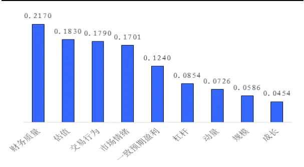
数据来源：国泰君安证券研究

图：银行大类有效因子占比统计
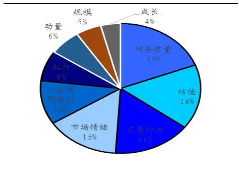
数据来源：国泰君安证券研究

表：银行有效因子明细：

| 因子序号 | 因子名称 | 因子类别 | IC 均值 | ICIR | 因子序号 | 因子名称 | 因子类别 | IC 均值 | ICIR |
| --- | --- | --- | --- | --- | --- | --- | --- | --- | --- |
| 8 | assetsTurn | 财务质量 | 0.1011 | 4.00 | 106 | nonCurLiab_equity | 杠杆 | -0.0854 | -3.22 |
| 13 | bp_indus | 估值 | -0.0604 | -2.26 | 115 | oper_ratio | 财务质量 | 0.0522 | 2.01 |
| 24 | CoV_Ret_Amt | 市场情绪 | -0.0583 | -2.44 | 132 | Ret_Std_3M | 交易行为 | -0.0635 | -2.70 |
| 32 | Dist_High | 交易行为 | -0.0526 | -2.26 | 143 | Skew_Ret_1Y | 交易行为 | -0.0629 | -2.75 |
| 33 | dividendyield2 | 估值 | 0.0579 | 2.36 | 150 | tax_q_growth | 成长 | 0.0454 | 2.12 |
| 49 | fcffp | 估值 | 0.0647 | 2.60 | 152 | totLiab_mkt | 财务质量 | -0.0637 | -2.53 |
| 74 | mkt_cap_ard | 规模 | 0.0586 | 2.12 | 156 | Turn_Mean_1M | 市场情绪 | -0.1118 | -3.78 |
| 84 | mom3_roe_FY1 | 一致预期盈利 | 0.0534 | 2.31 | 175 | west_avgroe_FY1 | 一致预期盈利 | 0.0707 | 2.83 |
| 92 | Mom_24M | 动量 | 0.0726 | 2.65 |  |  |  |  |  |

数据来源：国泰君安证券研究

## 3.3.1.26. 食品饮料

食品饮料行业由饮料制造以及食品加工等子行业组成，其中饮料制造包括白酒、啤酒、葡萄酒、软饮料等。

食品饮料成分股有效因子数量为 29个，预测IC 加总 IC_ALL为 0.941，其中交易行为占比28.14%、一致预期盈利占比21.92%、成长占比11.86%、市场情绪占比 10.51%、一致预期估值占比 7.94%、盈利占比 5.97%、估值占比5.84%、动量占比 3.07%、财务质量占比2.47%、规模占比2.29%，具体统计结果如下：

表：食品饮料有效因子显著性统计

| 因子类别 | 交易行为 | 一致预期盈利 | 成长 | 市场情绪 | 一致预期估值 | 盈利 | 估值 | 动量 | 财务质量 | 规模 |
| --- | --- | --- | --- | --- | --- | --- | --- | --- | --- | --- |
| IC_STYLE | 0.2649 | 0.2063 | 0.1116 | 0.0989 | 0.0747 | 0.0562 | 0.0549 | 0.0289 | 0.0232 | 0.0215 |
| IC_ALL | 28.14% | 21.92% | 11.86% | 10.51% | 7.94% | 5.97% | 5.84% | 3.07% | 2.47% | 2.29% |

数据来源：国泰君安证券研究

图：食品饮料大类有效因子 IC加总统计
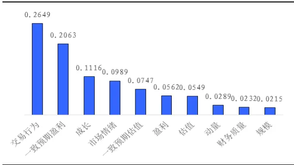
数据来源：国泰君安证券研究

图：食品饮料大类有效因子占比统计
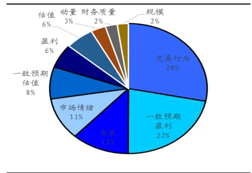
数据来源：国泰君安证券研究

表：食品饮料有效因子明细：

| 因子序号 | 因子名称 | 因子类别 | IC 均值 | ICIR | 因子序号 | 因子名称 | 因子类别 | IC 均值 | ICIR |
| --- | --- | --- | --- | --- | --- | --- | --- | --- | --- |
| 14 | bp_1f | 估值 | 0.0304 | 2.59 | 96 | mom_oper_rev_q | 成长 | 0.0321 | 2.57 |
| 19 | Clo_MaxMin_3M | 交易行为 | 0.0378 | 2.46 | 98 | mom_rev_FY1 | 一致预期盈利 | 0.0323 | 2.68 |
| 20 | Clo_MaxMin_6M | 交易行为 | 0.0319 | 2.34 | 99 | mom_roe_FY1 | 一致预期盈利 | 0.0270 | 2.46 |
| 22 | Corr_Clo_Turn | 交易行为 | -0.0355 | -2.61 | 126 | Ret_AMT | 市场情绪 | 0.0253 | 2.25 |
| 30 | DIFF | 交易行为 | 0.0331 | 2.18 | 130 | Ret_Std_1W | 交易行为 | -0.0291 | -2.25 |
| 33 | dividendyield2 | 估值 | 0.0245 | 2.20 | 137 | roic | 盈利 | 0.0305 | 2.11 |
| 41 | ep_FY1 | 一致预期估值 | -0.0329 | -2.28 | 138 | rps | 盈利 | 0.0258 | 2.08 |
| 51 | finExpRatio | 财务质量 | -0.0232 | -2.08 | 144 | SL_Volume_1M | 市场情绪 | -0.0331 | -2.62 |
| 73 | Mean_Ret_Amt | 市场情绪 | 0.0405 | 3.21 | 149 | targetReturn | 一致预期估值 | 0.0418 | 3.21 |
| 77 | mkt_cap_float | 规模 | -0.0215 | -2.06 | 150 | tax_9_growth | 成长 | 0.0249 | 2.22 |
| 79 | mom3_dps_FY1 | 一致预期盈利 | 0.0288 | 2.48 | 159 | Turn_Std_1M | 交易行为 | -0.0384 | -2.86 |
| 82 | mom3_rating | 一致预期盈利 | -0.0349 | -3.10 | 170 | Vol_Std_1M | 交易行为 | -0.0591 | -4.51 |
| 84 | mom3_roe_FY1 | 一致预期盈利 | 0.0293 | 2.31 | 180 | yoy_net_ocf_q | 成长 | 0.0264 | 2.55 |
| 88 | Mom_1_1M | 动量 | 0.0289 | 2.19 | 184 | yoy_oper_rev | 成长 | 0.0282 | 2.23 |
| 94 | mom_eps_FY1 | 一致预期盈利 | 0.0540 | 4.16 |  |  |  |  |  |

数据来源：国泰君安证券研究

## 3.3.1.27. 非银金融

非银金融行业由保险、券商以及多元金融等子行业组成。

非银金融成分股有效因子数量为 15个，预测IC 加总 IC_ALL为 0.650，其中盈利占比 32.82%、财务质量占比 24.28%、交易行为占比 20.59%、成长占比17.10%、市场情绪占比 5.22%，具体统计结果如下：

表：非银金融有效因子显著性统计

| 因子类别 | 盈利 | 财务质量 | 交易行为 | 成长 | 市场情绪 |
| --- | --- | --- | --- | --- | --- |
| IC_STYLE | 0.2134 | 0.1578 | 0.1338 | 0.1111 | 0.0339 |
| IC_ALL | 32.82% | 24.28% | 20.59% | 17.10% | 5.22% |

数据来源：国泰君安证券研究

图：非银金融大类有效因子IC加总统计
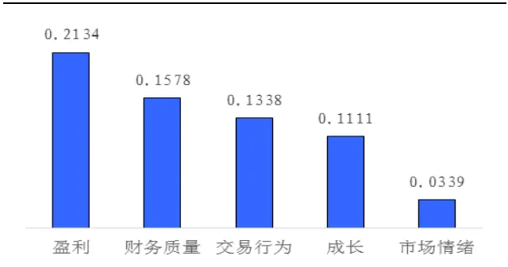
数据来源：国泰君安证券研究

图：非银金融大类有效因子占比统计
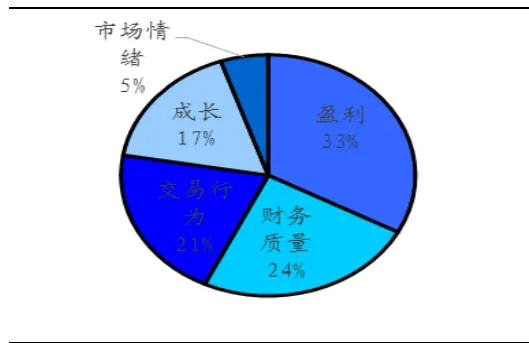
数据来源：国泰君安证券研究

表：非银金融有效因子明细：

| 因子序号 | 因子名称 | 因子类别 | IC 均值 | ICIR | 因子序号 | 因子名称 | 因子类别 | IC 均值 | ICIR |
| --- | --- | --- | --- | --- | --- | --- | --- | --- | --- |
| 4 | admExpRatio | 财务质量 | 0.0350 | 2.42 | 122 | or_ttm | 盈利 | -0.0360 | -2.44 |
| 31 | disposition | 交易行为 | -0.0315 | -2.08 | 126 | Ret_AMT | 市场情绪 | 0.0339 | 2.02 |
| 45 | eps | 盈利 | 0.0340 | 2.11 | 130 | Ret_Std_1W | 交易行为 | 0.0617 | 3.48 |
| 52 | fix_ratio | 财务质量 | -0.0425 | -2.81 | 136 | roe_ttm | 盈利 | 0.0377 | 2.13 |
| 54 | grossMarginRatio_ttm | 盈利 | 0.0550 | 3.16 | 141 | sales_profit | 盈利 | 0.0506 | 3.41 |
| 59 | invturn | 财务质量 | -0.0368 | -2.32 | 150 | tax_q_growth | 成长 | 0.0488 | 3.05 |
| 70 | MACD | 交易行为 | -0.0406 | -2.31 | 178 | yoy_eps | 成长 | 0.0623 | 4.02 |
| 117 | operExpRatio | 财务质量 | 0.0435 | 2.69 |  |  |  |  |  |

数据来源：国泰君安证券研究

## 3.3.2. 因子综合分析

表：行业因子检验横向比较

| 行业分类 | 有效因子组成 |  |
| --- | --- | --- |
| 交通运输 | 交易行为(30.46%)>市场情绪(15.59%)> 一致预期盈利(12.94%)>动量(10.41%)>成长(8.52%)>财 务质量(6.75%) > 估值(5.84%) > 规模(3.46%) > 杠杆(3.09%) > 盈利(2.94%) |  |
| 休闲服务 | 交易行为(34.43%)> 一致预期盈利(23.92%)>市场情绪(13.87%) >规模(12.33%)>估值(4.43%)> 一 致预期估值(4.29%) > 财务质量(3.38%) > 杠杆(3.36%) |  |
| 传媒 | 交易行为(47.86%) >市场情绪(12.27%) > 一致预期盈利(9.90%) >财务质量(9.43%) >估值(9.27%)> 盈利(4.16%) > 成长(3.61%) > 一致预期成长(3.50%) |  |
| 公共事业 | 交易行为(45.32%)> 一致预期盈利(19.60%)>市场情绪(11.96%)>财务质量(5.43%)>动量(4.71%)> 成长(4.20%) > 其他(2.51%) > 估值(2.35%) > 一致预期成长(1.99%) > 盈利(1.93%) |  |
| 农林牧渔 | 交易行为(46.15%) >市场情绪(21.69%) > 规模(9.92%) > 盈利(6.71%)> 一致预期盈利(5.20%) > 动量 (4.30%) > 成长(3.83%) > 财务质量(2.19%) 交易行为(47.22%) >市场情绪(14.94%) > 成长(12.03%)> 一致预期盈利(9.43%) >规模(4.13%) > 动 |  |
| 化工 医药生物 | 量(3.20%) > 盈利(3.09%) > 一致预期估值(3.08%) > 一致预期成长(2.89%) 交易行为(48.42%)> 一致预期盈利(19.93%) >市场情绪(10.00%) > 盈利(7.48%) > 成长(4.06%)> 一 |  |
| 商业贸易 | 致预期估值(3.70%) >规模(3.44%) >财务质量(2.98%) 交易行为(53.08%) >市场情绪(25.33%) >动量(10.07%) >规模(3.26%) >估值(3.11%) > 一致预期盈 |  |
| 国防军工 | 利(2.71%) >成长(2.45%) 交易行为(51.81%)>成长(18.83%)>财务质量(17.43%)>一致预期盈利(11.92%) |  |
| 家用电器 | 交易行为(34.82%) >市场情绪(19.32%) >动量(10.10%)> 一致预期盈利(8.72%)> 一致预期估值 (5.61%) > 成长(4.88%) > 规模(4.45%) > 估值(4.37%) > 其他(3.30%) > 财务质量(2.31%) > 盈利 |  |
| 建筑材料 | 交易行为(46.17%)>市场情绪(27.99%)>一致预期盈利(9.37%)>动量(5.77%)>杠杆(3.10%)>一致 预期成长(2.81%) >规模(2.60%) >财务质量(2.20%) |  |
| 建筑装饰 | 交易行为(49.04%)>市场情绪(16.71%)>成长(13.82%)>一致预期盈利(11.52%)>盈利(4.47%)>杠 |  |
| 杆(4.43%) |  |  |
| 房地产 |  | 交易行为(58.47%) >市场情绪(22.10%) >动量(10.93%) >规模(4.53%) >财务质量(3.97%) |
| 有色金属 |  | 交易行为(42.34%)>成长(16.63%)>一致预期盈利(14.01%)>盈利(13.74%)>动量(8.14%)>市场情 绪(5.14%) |
| 机械设备 |  | 交易行为(44.86%) > 一致预期盈利(17.90%) >市场情绪(12.12%) > 成长(9.71%) >动量(6.87%) >规 |
| 汽车 |  | 模(3.44%) > 一致预期成长(2.72%) >估值(2.38%) 交易行为(52.67%) >市场情绪(24.32%) > 盈利(7.44%) > 成长(7.35%) >规模(3.17%) > 估值(2.62%) > |
| 电子 |  | 财务质量(2.41%) 交易行为(44.98%) >市场情绪(21.12%) >成长(16.51%) >估值(8.15%)>规模(3.48%) >盈利(3.00%) > |
| 电气设备 |  | 一致预期盈利(2.76%) 交易行为(42.13%) > 一致预期盈利 25.66%) >成长(16.19%) >市场情绪(12.79%) >盈利(3.23%) |
| 纺织服装 |  | 交易行为(54.72%) >市场情绪(19.40%) > 一致预期盈利(11.33%) >规模(7.28%) >成长(4.14%) >财 |
| 计算机 |  | 务质量(3.13%) 交易行为(53.95%) > 市场情绪(15.43%) > 一致预期盈利(10.72%) > 成长(8.59%) > 盈利(6.10%) > 动 |
| 轻工制造 |  | 量(5.21%) 交易行为(52.63%) >市场情绪(27.01%) > 一致预期盈利(11.04%) >规模(6.45%) > 杠杆(2.87%) |
| 通信 |  | 交易行为(56.54%) >市场情绪(12.16%)>成长(9.20%) > 估值(9.08%) >动量(4.23%) > 盈利(3.44%) > |
| 采掘 |  | 财务质量(2.92%) >规模(2.42%) 市场情绪(37.24%) >交易行为(13.76%) >成长(13.49%) >规模(12.35%) >盈利(6.95%)>一致预期盈 |
| 钢铁 |  | 利(6.15%)>财务质量(5.03%) >估值(5.03%) 交易行为(52.74%)> 一致预期盈利(17.00%) >动量(8.19%)>市场情绪(7.99%)>成长(4.36%) >盈利 |
|  |  | (3.34%) > 估值(3.29%) > 财务质量(3.08%) 财务质量(19.11%)>估值(16.12%)>交易行为(15.77%)>市场情绪(14.99%)>一致预期盈利 |
| 银行 |  | (10.93%) > 杠杆(7.52%) > 动量(6.40%) > 规模(5.16%) > 成长(4.00%) |
| 食品饮料 | 交易行为(28.14%)> 一致预期盈利(21.92%)> 成长(11.86%) >市场情绪(10.51%)> 一致预期估值 (7.94%) > 盈利(5.97%) > 估值(5.84%) > 动量(3.07%) > 财务质量(2.47%) > 规模(2.29%) |  |

数据来源：国泰君安证券研究

表：行业域因子检验纵向比较

| 盈利 | 非银金融(0.2134) >有色金属(0.0906) >农林牧渔(0.0650) >汽车(0.0629) >食品饮料(0.0562) |
| --- | --- |
| 一致预期盈利 | 休闲服务(0.2130) >公共事业(0.2088)>食品饮料(0.2063) >电气设备(0.2027)>钢铁(0.1725) |
| 一致预期估值 | 家用电器(0.0768)>食品饮料(0.0747)>休闲服务(0.0382)>医药生物(0.0257)>化工(0.0222) |
| 一致预期成长 | 传媒(0.0341)>建筑材料(0.0294) >机械设备(0.0237)>公共事业(0.0212) >化工(0.0208) |
| 市场情绪 | 建筑材料(0.2931)>家用电器(0.2646)>轻工制造(0.2490)>商业贸易(0.2163)>农林牧渔(0.2103) |
| 交易行为 | 钢铁(0.5351)>通信(0.5343)>轻工制造(0.4852)>建筑材料(0.4834)>公共事业(0.4827) |
| 规模 | 休闲服务(0.1098)>农林牧渔(0.0962)>纺织服装(0.0639)>家用电器(0.0610)>轻工制造(0.0595) |
| 估值 | 银行(0.1830) >传媒(0.0904) >通信(0.0858) >电子(0.0680) >交通运输(0.0619) |
| 杠杆 | 银行(0.0854) >交通运输(0.0328)>建筑材料(0.0324) >休闲服务(0.0299) >建筑装饰(0.0270) |
| 动量 | 家用电器(0.1383) >交通运输(0.1103) > 商业贸易(0.0859) >钢铁(0.0831)>银行(0.0726) |
| 成长 | 电子(0.1377)>电气设备(0.1278)>食品饮料(0.1116)>非银金融(0.1111)>有色金属(0.1097) |
| 财务质量 | 银行(0.2170)>非银金融(0.1578) >传媒(0.0919) >国防军工(0.0719) >交通运输(0.0715) |

数据来源：国泰君安证券研究

表：各行业有效因子数量

| 家用电器 | 公用事业 | 交通运输 | 食品饮料 | 建筑材料 | 农林牧渔 | 机械设备 | 电子 | 轻工制造 |
| --- | --- | --- | --- | --- | --- | --- | --- | --- |
| 34 | 33 | 31 | 29 | 28 | 27 | 27 | 27 | 27 |
| 计算机 | 传媒 | 商业贸易 | 电气设备 | 钢铁 | 化工 | 汽车 | 纺织服装 | 通信 |
| 26 | 25 | 25 | 25 | 25 | 24 | 24 | 24 | 24 |
| 医药生物 | 休闲服务 | 有色金属 | 房地产 | 建筑装饰 | 银行 | 采掘 | 非银金融 | 国防军工 |
| 23 | 21 | 21 | 18 | 17 | 17 | 15 | 15 | 10 |

数据来源：国泰君安证券研究

## 3.3.3. 核心结论

1. 从有效因子数量角度考量，家电、公用事业、交通运输、食品饮料排名靠前，因子可预测、可区分度较高，而国防军工、非银金融、采掘、银行相对因子数量较少，预测难度相对较高。

2. 绝大部分行业均受交易行为（所有行业）、市场情绪（除国防军工）影响较强，因此整体而言 A 股市场交易属性的占比仍然较高，交易行为占比排名较高额行业包括房地产、通信、计算机，最低的则为银行、采掘。其中典型的指标包括收益振幅、价量相关性、历史换手率等。

3. 从分析师一致预期的角度考量，绝大部分行业均受到分析师预期因素影响显著，表明 A 股市场卖方一致预期可以较大程度的代表市场一致预期。其中 3个分析师预期因子 IC 加总较高的行业包括食品饮料、休闲服务、电器设备、医药生物、公共事业，因此这几个行业的卖方研究需重点关注。其中核心预期类指标包括预期净利润、ROE同比变化率、目标收益率、预期EP 等。

4. 从估值角度来看，行业的估值效应集中在两个极端，并且影响作用相反。银行板块行业内低市净率的股票相对更有优势，而电子、通信等新兴领域行业内高估值个股在一段时期内则更容易受到投资者的追捧。因此倘若在全域统一运用估值因子，会产生较大的偏差。

5. 从财务杠杆的角度考量，银行、交通运输为典型的高负债行业，因此过高的负债率往往意味着过高的经营与财务风险，财务杠杆因子表现出显著的负向特征，负债比率较低的上市公司未来走势表现相对较强。其中核心财务杠杆因子诸如长期负债比率等。

6. 短期成长性角度考量，电子行业具有典型的高成长性因素驱动的特征，尤其是在 LED半导体、安防等子领域，无论从行业景气度或者产业链发展角度上而言，成长性均较为突出。其中核心成长性因子包括EPS同比增长率、营业利润同比增长率等。

7. 动量效应在家电行业中的显著性极为突出，格力、美的双寡头行业格局稳定，垄断效应突出，股价走势体现出明显的强者恒强的趋势效应，因此以动量效应可在行业内作为主导因子预测超额收益。其中核心动量因子即为历史12个月剔除最近1个月后累积收益率。

8. 银行和非银的大金融板块是财务质量因子显著性最强的行业。一方面，由于金融企业处于高杠杆运营的状态，投资者对财务状况的敏感度更高；另一方面，金融类机构业务体系繁杂，报表信息效率较高，因此投资者关注度较高。其中核心财务质量因子包括资产周转率、管理费用比营业收入等。

9. 规模因子在休闲服务、农林牧渔、纺织服装、家用电器、轻工制造等行业表现为大市值特征，其原因在于上述几类行业在发展进程中，存在市场集中度逐渐提高的倾向，逐渐形成寡头格局，相应的龙头标的在此过程中收益。例如酒店子行业中的首旅酒店、锦江股份；又如家装行业中的欧派家具、索菲亚、尚品宅配这样的三强格局等。

## 4. 策略应用实证研究

本章将在上述分析的基础上，根据不同域的属性特点、不同域的有效因子选择，构建相应的选股策略。其中，我们首先通过模型预测精度 IC的计算，考察不同域的收益预测是否显著，若预测显著，则可进入组合构建步骤。在组合构建过程中，收益预测部分依据上述分域研究的结果，风险控制部分则根据传统 10 类风险因子的构建进行约束，最后应用权重优化算法求解最优投资组合。

## 4.1.子域成分股增强策略实证分析

## 4.1.1. 沪深 300 成分股增强

我们首先根据沪深300 成分域有效因子的筛选，计算模型预测精度IC。具体而言， $E(\varepsilon r_{_{t+1}})$ 为阿尔法模型预测的残差收益截面， $而$\varepsilon$$r_{_{t+1}}$$ 为实际残差收益截面，计算两者的相关系数称为模型预测精度 IC，该数值越高显著性越强，表明阿尔法模型的预测能力越强。

其中，阿尔法模型的预测残差收益截面由当期因子载荷截面加权得到，即 $E\left(\varepsilon r_{_{t+1}}\right)=\sum w_{_t}^{^j}\cdot\varepsilon_{_t}^{^j}$ ；

其中因子权重w 我们选择因子历史 12个月的ICIR。

沪深300 模型IC 序列如下所示：

图：沪深 300 Model IC 序列
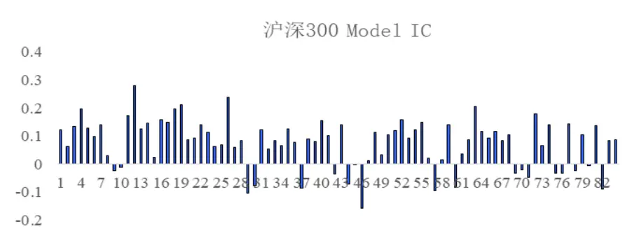
数据来源：国泰君安证券研究

检验结果表明，300成分股模型预测精度IC均值为0.075,ICIR为2.99。因此，模型预测精度有较强的统计显著性，在此基础上我们可以进一步构建组合，具体过程如下所示：

1）股票池选取沪深300成分股；

2）交易成本为单边千分之 1，印花税千分之1；

3）组合以月频率调仓；

4）组合个股的权重上限设为3%；

5）优化目标函数采用最大化预期超额收益率形式；

6） 行业中性约束中，因子敞口设定为相对正负 1%；

7）风格敞口控制中，10类风格因子约束设定为：

| 因子类型 | 风险敞口约束下限 | 风险敞口约束上限 |
| --- | --- | --- |
| Beta | -0.01 | +0.01 |
| Momentum | 0 | +8 |
| Size | -0.3 | 0.3 |
| Earning Yield | +Lim | +∞ |
| Volatility | -8 | 0 |
| Growth | -0.01 | +0.01 |
| Value | -0.01 | +0.01 |
| Leverage | -0.01 | +0.01 |
| Liquidity | -∞ | 0 |
| NonLinearSize | -8 | +8 |

其中+Lim表示该风格敞口的正向暴露极限。

策略组合累积净值、收益绩效统计及业绩归因分析如下：

图：沪深300成分股增强组合累积净值
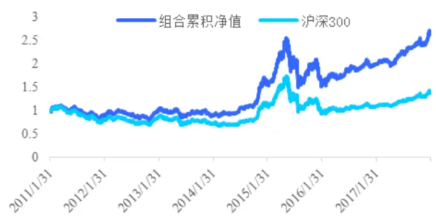
数据来源：国泰君安证券研究

图：沪深300成分股增强组合累积超额收益
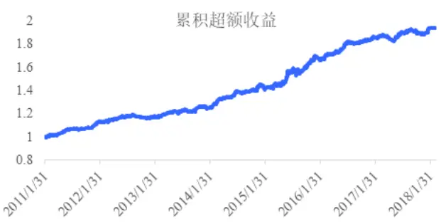
数据来源：国泰君安证券研究

表：组合绩效统计

| 累积超额收益 | 194% | 最大回撤 | 4.16% |
| --- | --- | --- | --- |
| 年化收益率 | 9.8% | 最大回撤开始时间 | 2015/08/03 |
| 年化波动率 | 4.4% | 最大回撤结束时间 | 2015/08/25 |
| 信息比率 | 2.23 | 组合年均换手率（双边） | 560% |

数据来源：国泰君安证券研究

表：组合绩效归因（月均）

|  | Mkt&Indu | Beta | Mom | Size | EY | Vol | Gro | PB | Lev | Liq | NLS | 选股 |
| --- | --- | --- | --- | --- | --- | --- | --- | --- | --- | --- | --- | --- |
| 收益归因 | 0% | 0.00% | 0.00% | 0.09% | 0.38% | 0.02% | 0.00% | 0.07% | 0.01% | 0.01% | -0.04% | 0.25% |
| T值 | 0 | -1.01 | 0.93 | 3.62 | 6.14 | 1.13 | -0.20 | 2.08 | 1.24 | 3.06 | -3.23 | 2.15 |

数据来源：国泰君安证券研究

表：归因选股收益序列
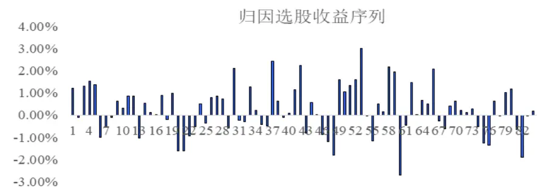
数据来源：国泰君安证券研究

## 4.1.2. 中证 500 成分股增强

中证500成分股增强策略构建方法与沪深300相同，其中模型预测精度IC统计结果如下：

图：中证 500 Model IC 序列
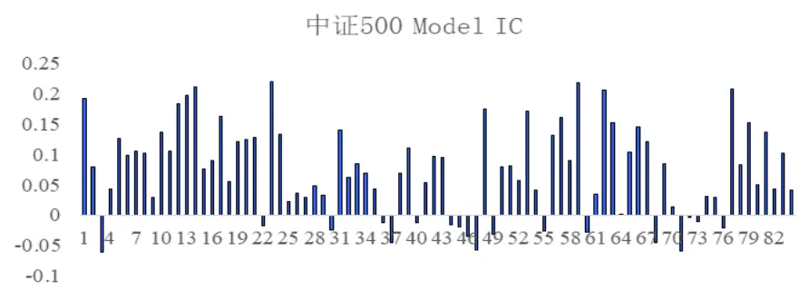
数据来源：国泰君安证券研究

检验结果表明，500成分股模型预测精度IC均值为0.073,ICIR为3.39。

在此基础上，构建中证500成分股增强测，组合构造方式与沪深 300一致，策略组合累积净值、收益绩效统计及业绩归因分析如下：

图：中证 500成分股增强组合累积净值
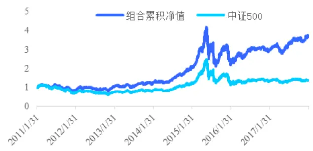
数据来源：国泰君安证券研究

图：中证500成分股增强组合累积超额收益
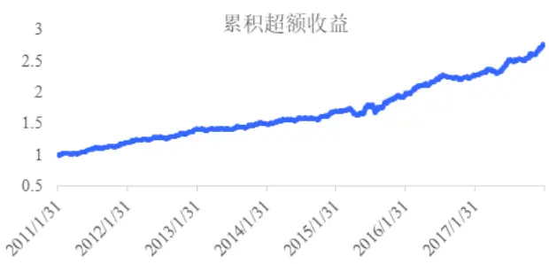
数据来源：国泰君安证券研究

表：组合绩效统计（月均）

| 累积超额收益 | 274% | 最大回撤 | 7.16% |
| --- | --- | --- | --- |
| 年化收益率 | 15.0% | 最大回撤开始时间 | 2015/08/03 |
| 年化波动率 | 5.89% | 最大回撤结束时间 | 2015/08/24 |
| 信息比率 | 2.55 | 组合年均换手率（双边） | 760% |

数据来源：国泰君安证券研究

表：组合绩效归因

|  | Mkt&Indu | Beta | Mom | Size | EY | Vol | Gro | PB | Lev | Liq | NLS | 选股 |
| --- | --- | --- | --- | --- | --- | --- | --- | --- | --- | --- | --- | --- |
| 收益归因 | 0% | 0.00% | 0.02% | -0.03% | 0.48% | 0.03% | 0.00% | 0.06% | -0.01% | 0.10% | 0.01% | 0.57% |
| T值 | 0 | 0.47 | 2.59 | -3.40 | 6.03 | 0.94 | -0.84 | 1.88 | -1.43 | 4.70 | 1.52 | 3.60 |

数据来源：国泰君安证券研究

表：归因选股收益序列
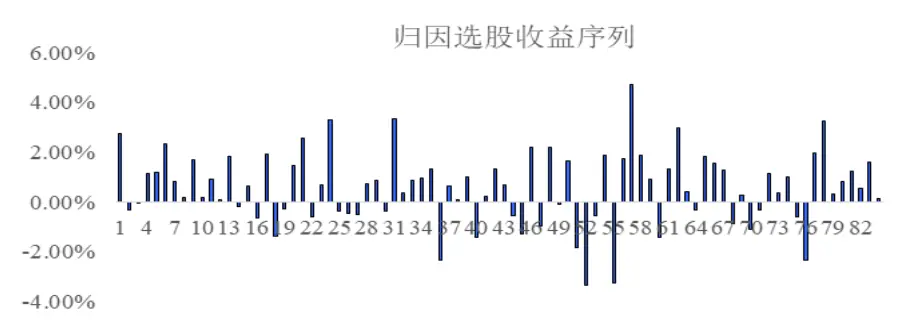
数据来源：国泰君安证券研究

## 4.1.3. 行业成分股增强

我们首先根据各行业域内有效因子，计算各行业模型预测精度 IC， 具体统计结果如下：

表：各行业 Model_IC 及 Model_ICIR

| 行业分类 | Model_IC 均值 | Model_IC_IR |
| --- | --- | --- |
| 交通运输 | 0.09 | 2.03 |
| 休闲服务 | 0.13 | 2.18 |
| 传媒 | 0.11 | 2.28 |
| 公共事业 | 0.10 | 2.91 |
| 农林牧渔 | 0.12 | 3.03 |
| 化工 | 0.09 | 3.09 |
| 医药生物 | 0.10 | 3.53 |
| 商业贸易 | 0.10 | 2.30 |
| 国防军工 | 0.09 | 1.66 |
| 家用电器 | 0.14 | 3.01 |
| 建筑材料 | 0.08 | 1.94 |
| 建筑装饰 | 0.09 | 2.01 |
| 房地产 | 0.07 | 2.07 |
| 有色金属 | 0.09 | 2.32 |
| 机械设备 | 0.09 | 3.07 |
| 汽车 | 0.12 | 3.35 |
| 电子 | 0.09 | 3.24 |
| 电气设备 |  | 3.60 |
| 纺织服装 | 0.11 | 2.68 |
| 计算机 | 0.11 | 3.09 |
| 轻工制造 | 0.10 0.08 | 1.86 |
| 通信 | 0.10 | 2.25 |
| 采掘 | 0.08 | 1.66 |
| 钢铁 | 0.10 | 1.67 |
| 银行 | 0.21 | 2.44 |
| 非银金融 | 0.10 | 1.82 |
| 食品饮料 | 0.11 | 2.27 |

数据来源：国泰君安证券研究

可以发现，通过行业域内因子的筛选建模，各行业的域内模型预测精度均达到显著水平，这表明因子体系可以构建较为有效的行业增强策略。

我们根据各行业有效因子，构建行业成分股增强策略，并进行比较分析，为了避免各行业多参数挖掘的影响，各行业组合构建方式保持一致，组合具体构建方法如下：

Step 1. 根据行业内有效因子载荷及历史 IC 序列，计算得到行业成分股预期超额收益截面，计算方法同上沪深 300中证500策略；

Step 2. 选择预期超额收益截面中排名靠前 1/3的股票作为 Top组合，其中组合权重根据流通市值经预期超额收益调整后得到，即

$$
w_{\phantom{\prime}_{i}}=\;w_{\phantom{\prime}_{i}}^{\phantom{\prime}}\;/\;\sum_{\phantom{\prime}_{n}}\;w_{\phantom{\prime}_{i}}^{\phantom{\prime}}\;,
$$

$$
w_{_i}^{\prime}=w_{_i}^{^{m\cdot k\cdot t}}\cdot(1+w_{_{\varepsilon}}),\quad w_{_{\varepsilon}}=\varepsilon r_{_i}/\sum_{_n}\varepsilon r_{_i},\quad w_{_i}^{^{m\cdot k\cdot t}}=mkt_{_i}/\sum_{_n}mkt_{_i}
$$

m k t 表示个股流通市值， $\mathcal{E}\boldsymbol{r}_{i}$ 为预期超额收益。

Step 3. 选择预期超额收益截面中排名靠后 1/3 的股票作为 Bottom 组合，权重构建方式同上。

各行业增强策略的具体回测结果及统计分析，详见下图：

图：交通运输行业指数增强策略
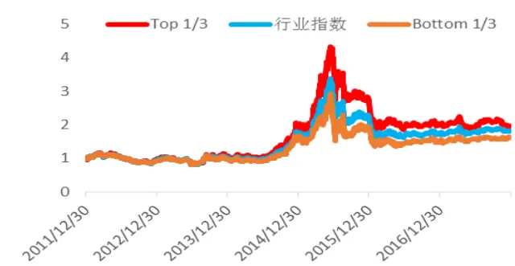
数据来源：国泰君安证券研究

图：休闲服务行业指数增强策略
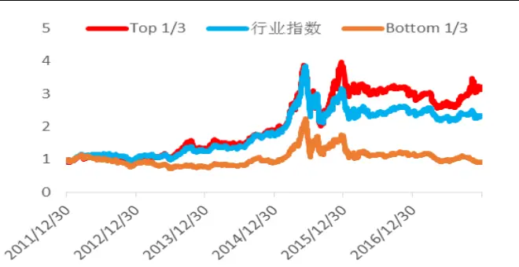
数据来源：国泰君安证券研究

表：交通运输行业增强策略收益统计
表：休闲服务行业增强策略收益统计

| 交通运输 | Top 1/3 | 指数 | Bottom 1/3 | 休闲服务 | Top 1/3 | 指数 | Bottom 1/3 |
| --- | --- | --- | --- | --- | --- | --- | --- |
| 年化收益率 | 15.53% | 13.95% | 12.66% | 年化收益率 | 24.44% | 18.25% | 3.44% |

数据来源：国泰君安证券研究
数据来源：国泰君安证券研究

图：传媒行业指数增强策略
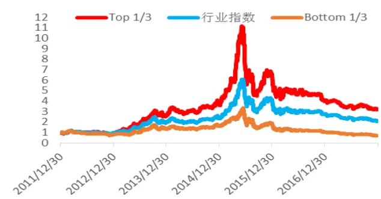

图：公用事业行业指数增强策略
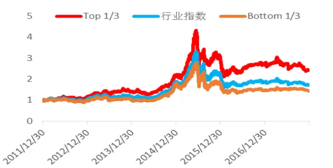

表：传媒行业增强策略收益统计
表：公用事业行业增强策略收益统计

| 传媒 | Top 1/3 | 指数 | Bottom 1/3 | 公用事业 | Top 1/3 | 指数 | Bottom 1/3 |
| --- | --- | --- | --- | --- | --- | --- | --- |
| 年化收益率 | 26.17% | 17.75% | -0.21% | 年化收益率 | 18.77% | 12.78% | 10.01% |

数据来源：国泰君安证券研究
数据来源：国泰君安证券研究

图：农林牧渔行业指数增强策略
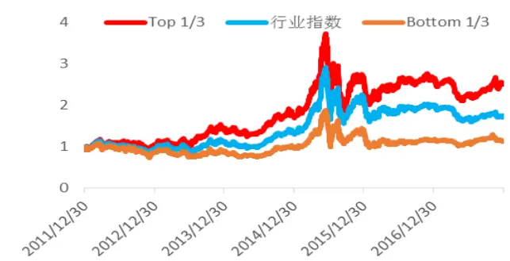
数据来源：国泰君安证券研究

图：化工行业指数增强策略
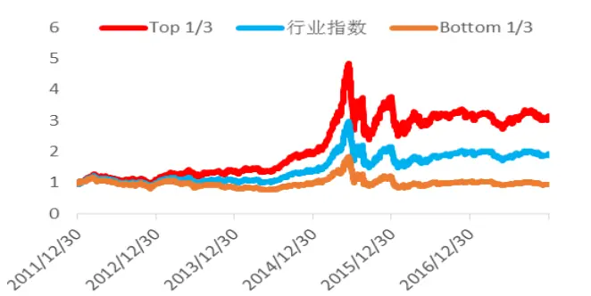
数据来源：国泰君安证券研究

表：农林牧渔行业增强策略收益统计
表：化工行业增强策略收益统计

| 农林牧渔 | Top 1/3 | 指数 | Bottom 1/3 | 化工 | Top 1/3 | 指数 | Bottom 1/3 |
| --- | --- | --- | --- | --- | --- | --- | --- |
| 年化收益率 | 20.64% | 13.54% | 6.33% | 年化收益率 | 24.24% | 15.10% | 2.76% |

数据来源：国泰君安证券研究
数据来源：国泰君安证券研究

图：医药生物行业指数增强策略
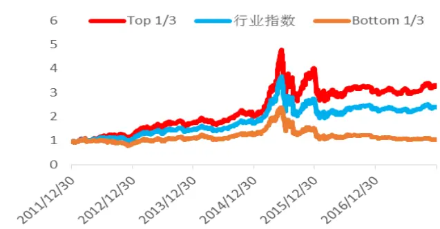
数据来源：国泰君安证券研究

图：商业贸易行业指数增强策略
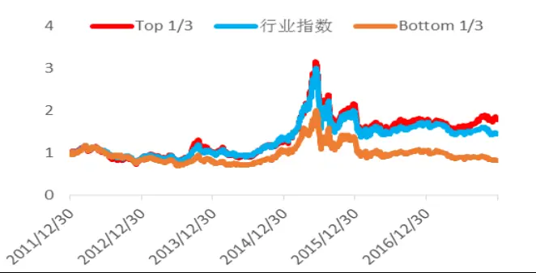
数据来源：国泰君安证券研究

表：医药生物行业增强策略收益统计
表：商业贸易行业增强策略收益统计

| 医药生物 | Top 1/3 | 指数 | Bottom 1/3 | 商业贸易 | Top 1/3 | 指数 | Bottom 1/3 |
| --- | --- | --- | --- | --- | --- | --- | --- |
| 年化收益率 | 24.73% | 18.76% | 4.54% | 年化收益率 | 15.16% | 10.58% | 1.20% |

数据来源：国泰君安证券研究
数据来源：国泰君安证券研究

图：国防军工行业指数增强策略
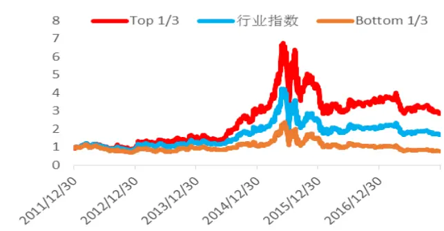
数据来源：国泰君安证券研究

图：家用电器行业指数增强策略
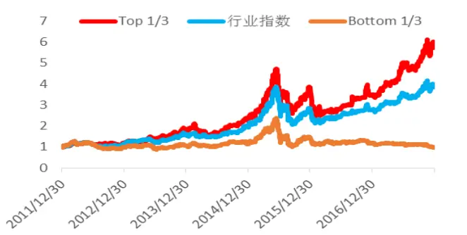
数据来源：国泰君安证券研究

表：国防军工行业增强策略收益统计
表：家用电器行业增强策略收益统计

| 国防军工 | Top 1/3 | 指数 | Bottom 1/3 | 家用电器 | Top 1/3 | 指数 | Bottom 1/3 |
| --- | --- | --- | --- | --- | --- | --- | --- |
| 年化收益率 | 26.67% | 16.43% | 2.86% | 年化收益率 | 35.52% | 27.53% | 4.52% |

数据来源：国泰君安证券研究
数据来源：国泰君安证券研究

图：建筑材料行业指数增强策略
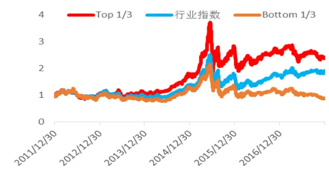
数据来源：国泰君安证券研究

图：建筑装饰行业指数增强策略
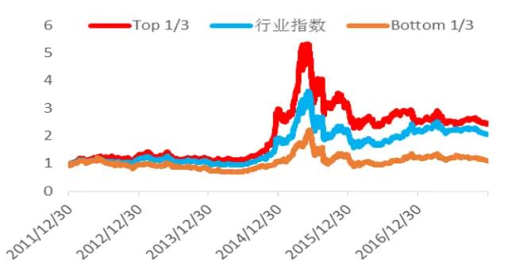
数据来源：国泰君安证券研究

表：建筑材料行业增强策略收益统计
表：建筑装饰行业增强策略收益统计

| 建筑材料 | Top 1/3 | 指数 | Bottom 1/3 | 建筑装饰 | Top 1/3 | 指数 | Bottom 1/3 |
| --- | --- | --- | --- | --- | --- | --- | --- |
| 年化收益率 | 20.45% | 15.75% | 3.55% | 年化收益率 | 21.09% | 17.11% | 6.73% |

数据来源：国泰君安证券研究
数据来源：国泰君安证券研究

图：房地产行业指数增强策略
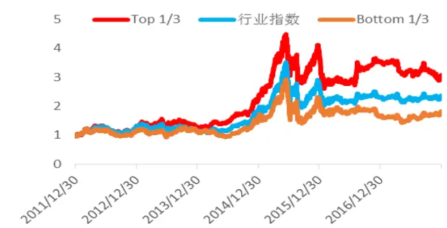
数据来源：国泰君安证券研究

图：有色金属行业指数增强策略
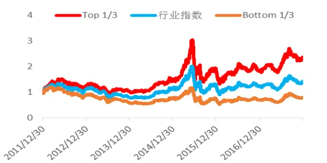
数据来源：国泰君安证券研究

表：房地产行业增强策略收益统计
表：有色金属行业增强策略收益统计

| 房地产 | Top 1/3 | 指数 | Bottom 1/3 | 有色金属 | Top 1/3 | 指数 | Bottom 1/3 |
| --- | --- | --- | --- | --- | --- | --- | --- |
| 年化收益率 | 23.59% | 19.04% | 15.72% | 年化收益率 | 20.46% | 10.89% | 1.61% |

图：机械设备行业指数增强策略
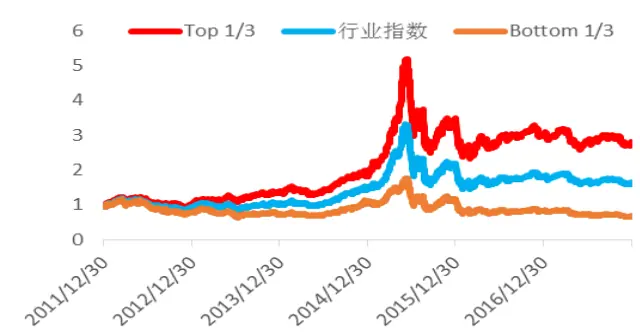
数据来源：国泰君安证券研究

图：汽车行业指数增强策略
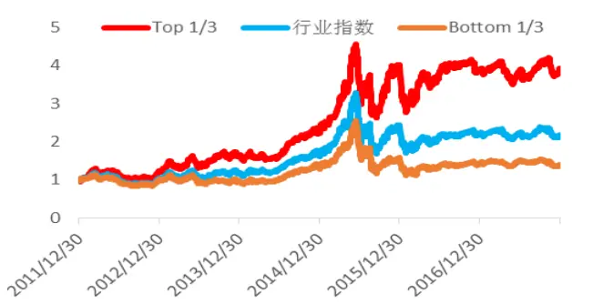
数据来源：国泰君安证券研究

表：机械设备行业增强策略收益统计
表：汽车行业增强策略收益统计

| 机械设备 | Top 1/3 | 指数 | Bottom 1/3 | 汽车 | Top 1/3 | 指数 | Bottom 1/3 |
| --- | --- | --- | --- | --- | --- | --- | --- |
| 年化收益率 | 22.11% | 12.82% | -1.98% | 年化收益率 | 27.75% | 17.32% | 10.00% |

数据来源：国泰君安证券研究
数据来源：国泰君安证券研究

图：电子行业指数增强策略
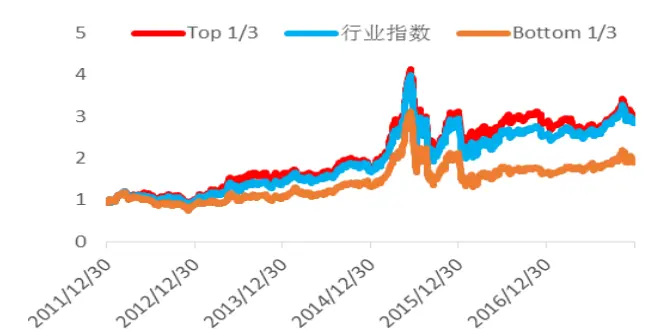
数据来源：国泰君安证券研究

图：电气设备行业指数增强策略
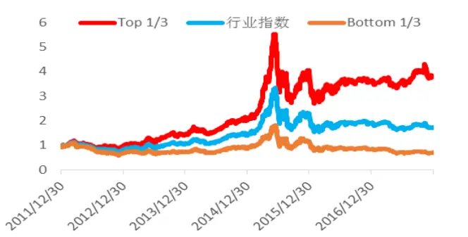
数据来源：国泰君安证券研究

表：电子行业增强策略收益统计
表：电气设备行业增强策略收益统计

| 电子 | Top 1/3 | 指数 | Bottom 1/3 | 电气设备 | Top 1/3 | 指数 | Bottom 1/3 |
| --- | --- | --- | --- | --- | --- | --- | --- |
| 年化收益率 | 23.61% | 23.23% | 17.23% | 年化收益率 | 27.61% | 13.79% | 1.32% |

数据来源：国泰君安证券研究
数据来源：国泰君安证券研究

图：纺织服装行业指数增强策略
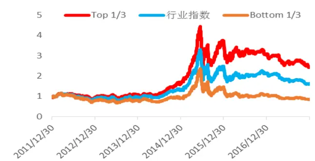
数据来源：国泰君安证券研究

图：计算机行业指数增强策略
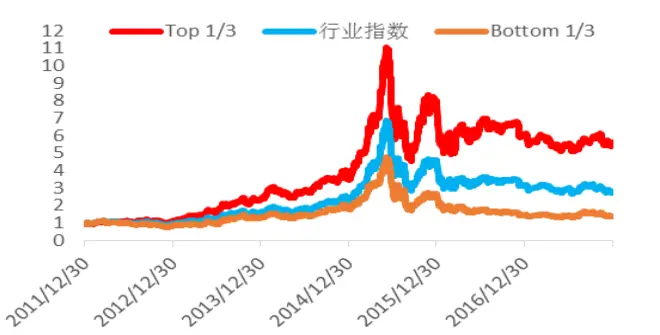
数据来源：国泰君安证券研究

表：纺织服装行业增强策略收益统计
表：计算机行业增强策略收益统计

| 纺织服装 | Top 1/3 | 指数 | Bottom 1/3 | 计算机 | Top 1/3 | 指数 | Bottom 1/3 |
| --- | --- | --- | --- | --- | --- | --- | --- |
| 年化收益率 | 19.40% | 12.34% | 1.81% | 年化收益率 | 36.32% | 23.44% | 11.96% |

数据来源：国泰君安证券研究

图：轻工制造行业指数增强策略
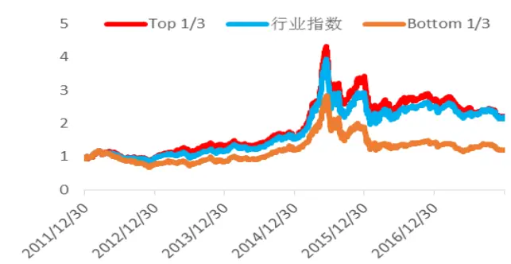
数据来源：国泰君安证券研究
数据来源：国泰君安证券研究

图：通信行业指数增强策略
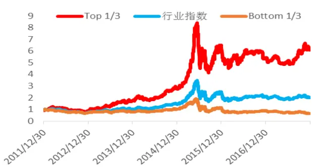
数据来源：国泰君安证券研究

表：轻工制造行业增强策略收益统计
表：通信行业增强策略收益统计

| 轻工制造 | Top 1/3 | 指数 | Bottom 1/3 | 通信 | Top 1/3 | 指数 | Bottom 1/3 |
| --- | --- | --- | --- | --- | --- | --- | --- |
| 年化收益率 | 17.41% | 16.86% | 7.26% | 年化收益率 | 36.91% | 16.65% | 2.66% |

数据来源：国泰君安证券研究
数据来源：国泰君安证券研究

图：采掘行业指数增强策略
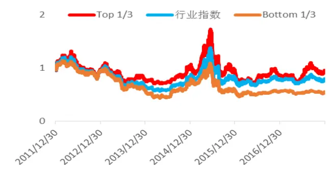
数据来源：国泰君安证券研究

图：钢铁行业指数增强策略
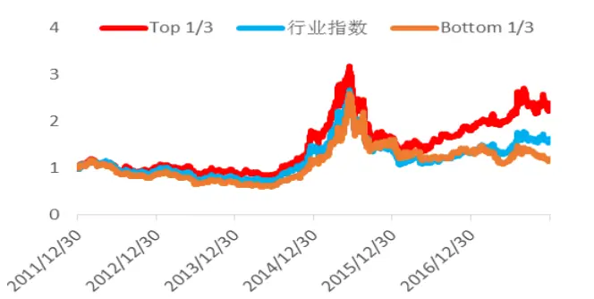
数据来源：国泰君安证券研究

表：采掘行业增强策略收益统计
表：钢铁行业增强策略收益统计

| 采掘 | Top 1/3 | 指数 | Bottom 1/3 | 钢铁 | Top 1/3 | 指数 | Bottom 1/3 |
| --- | --- | --- | --- | --- | --- | --- | --- |
| 年化收益率 | 4.82% | 0.40% | -6.14% | 年化收益率 | 20.00% | 12.73% | 7.87% |

数据来源：国泰君安证券研究
数据来源：国泰君安证券研究

图：银行行业指数增强策略
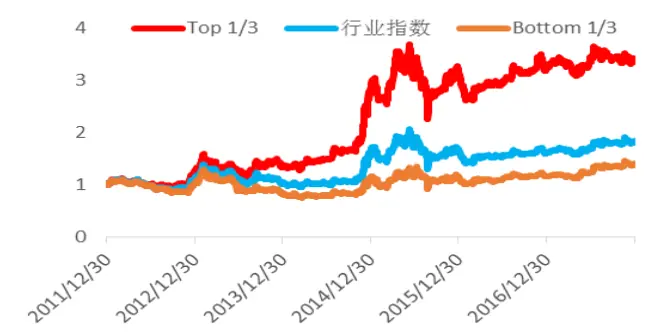

图：非银金融行业指数增强策略
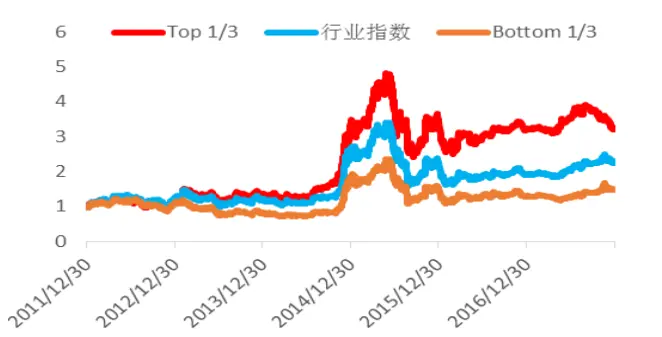

表：银行行业增强策略收益统计
表：非银金融行业增强策略收益统计

| 银行 | Top 1/3 | 指数 | Bottom 1/3 | 非银金融 | Top 1/3 | 指数 | Bottom 1/3 |
| --- | --- | --- | --- | --- | --- | --- | --- |
| 年化收益率 | 24.98% | 13.78% | 8.93% | 年化收益率 | 26.47% | 19.90% | 12.33% |

数据来源：国泰君安证券研究
数据来源：国泰君安证券研究

图：食品饮料行业指数增强策略
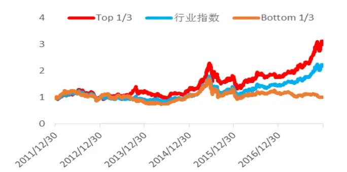
数据来源：国泰君安证券研究

表：食品饮料行业增强策略收益统计

| 食品饮料 | Top 1/3 | 指数 | Bottom 1/3 |
| --- | --- | --- | --- |
| 年化收益率 | 23.18% | 16.88% | 3.48% |

数据来源：国泰君安证券研究

表：各行业增强组合年化收益率汇总：

| 行业类型 | Top 1/3 | 指数 | Bottom 1/3 |
| --- | --- | --- | --- |
| 交通运输 | 15.53% | 13.95% | 12.66% |
| 休闲服务 | 24.44% | 18.25% | 3.44% |
| 传媒 | 26.17% | 17.75% | -0.21% |
| 公用事业 | 18.77% | 12.78% | 10.01% |
| 农林牧渔 | 20.64% | 13.54% | 6.33% |
| 化工 | 24.24% | 15.10% | 2.76% |
| 医药生物 | 24.73% | 18.76% | 4.54% |
| 商业贸易 | 15.16% | 10.58% | 1.20% |
| 国防军工 | 26.67% | 16.43% | 2.86% |
| 家用电器 | 35.52% | 27.53% | 4.52% |
| 建筑材料 | 20.45% | 15.75% | 3.55% |
| 建筑装饰 | 21.09% | 17.11% | 6.73% |
| 房地产 | 23.59% | 19.04% | 15.72% |
| 有色金属 | 20.46% | 10.89% | 1.61% |
| 机械设备 | 22.11% | 12.82% | -1.98% |
| 汽车 | 27.75% | 17.32% | 10.00% |
| 电子 | 23.61% | 23.23% | 17.23% |
| 电气设备 | 27.61% | 13.79% | 1.32% |
| 纺织服装 | 19.40% | 12.34% | 1.81% |
| 计算机 | 36.32% | 23.44% | 11.96% |
| 轻工制造 | 17.41% | 16.86% | 7.26% |

| 通信 | 36.91% 16.65% | 2.66% |
| --- | --- | --- |
| 采掘 | 4.82% 0.40% | -6.14% |
| 钢铁 | 20.00% 12.73% | 7.87% |
| 银行 | 24.98% 13.78% | 8.93% |
| 非银金融 | 26.47% 19.90% | 12.33% |
| 食品饮料 | 23.18% 16.88% | 3.48% |

数据来源：国泰君安证券研究

上述实证分析结果表明，无论是沪深300成分股增强、中证500成分股增强还是行业成分股增强，在域内有效因子筛选的基础上，均可以获取较为显著的超额收益。

## 4.2.综合增强策略实证分析

最后一部分，我们考虑在分域的基础上，利用不同域的阿尔法因子预测对应域的股票超额收益，在此基础上整合得到全域截面的超额收益预测值，并进一步构建组合。其中，我们选择分行业域情况下，利用报告中行业分析部分相应的因子，计算行业成分股预期超额收益率。对所有行业进行上述计算后，我们即可以得到全市场所有股票的超额收益预测截面。

然后，我们计算分域预测合成得到全域收益预测截面方法下，模型的预测精度IC，具体结果如下：

表：分域预测全域Mdel IC 序列
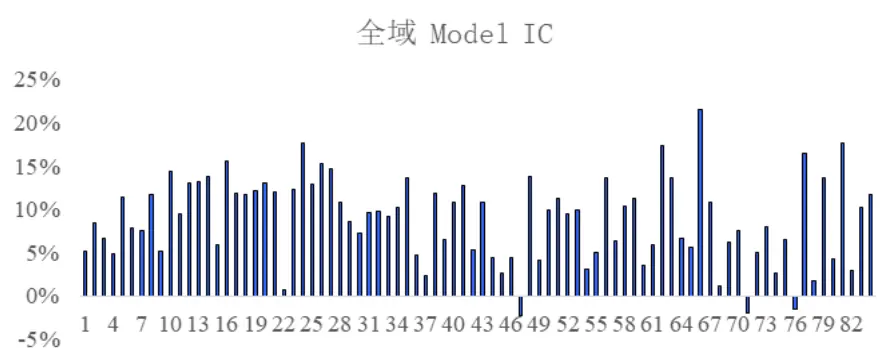
数据来源：国泰君安证券研究

可以发现，分域预测整合之后，模型的整体预测 IC 均值为 0.09,ICIR高达 6.4。

为了说明分域预测比传统全域有效因子统一预测的效果有所提升，我们比较两种方法下，模型预测精度 IC 的区别，具体结果如下（其中全域有效因子的筛选过程与上述分域选择的方法保持一致）：

图：分域预测与全域预测Model IC序列比较
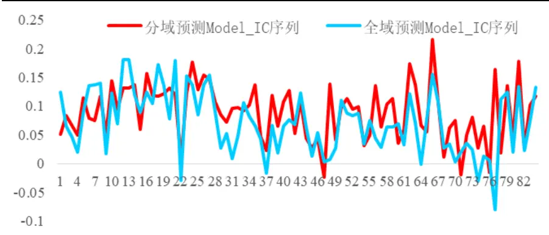
数据来源：国泰君安证券研究

表：分域预测与全域预测Model IC序列统计比较

| IC 均值 | ICIR |
| --- | --- |
| 分域预测 | 0.090 6.36 |
| 全域预测 | 0.072 4.56 |

数据来源：国泰君安证券研究

可以看到，分域预测的模型精度较之全域统计因子预测，IC均值、ICIR、IC胜率均有提升，因此分域阿尔法模型具有更强的预测能力。

最后，我们利用分域预测截面，构建全市场选股范围内（新股、ST股除外）的沪深300增强和中证 500增强策略，组合构建方式与上述成分股增强策略保持一致，具体结果如下：

全域选股沪深300 增强策略组合累积净值、收益绩效统计及业绩归因分析如下：

图：沪深 300 成分股增强组合累积净值
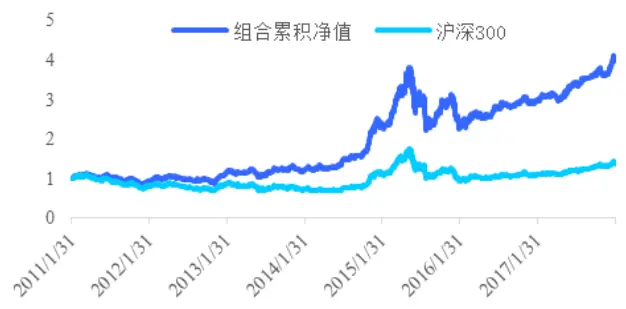
数据来源：国泰君安证券研究

图：沪深 300 成分股增强组合累积超额收益
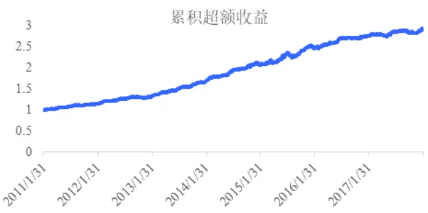
数据来源：国泰君安证券研究

表：组合绩效统计（月均）

| 累积超额收益 | 290% | 最大回撤 | 5.25% |
| --- | --- | --- | --- |
| 年化收益率 | 15.8% | 最大回撤开始时间 | 2015/07/28 |
| 年化波动率 | 5.1% | 最大回撤结束时间 | 2015/08/31 |
| 信息比率 | 3.1 | 组合年均换手率（双边） | 650% |

数据来源：国泰君安证券研究

表：组合绩效归因

|  | Mkt&Indu | Beta | Mom | Size | EY | Vol | Gro | PB | Lev | Liq | NLS | 选股 |
| --- | --- | --- | --- | --- | --- | --- | --- | --- | --- | --- | --- | --- |
| 收益归因 | 0% | 0.00% | 0.00% | 0.54% | 0.39% | 0.00% | 0.00% | 0.04% | 0.02% | 0.00% | -0.06% | 0.36% |
| T值 | 0 | -1.20 | 0.82 | 5.76 | 6.05 | 0.08 | -0.90 | 1.63 | 2.23 | 1.00 | -3.45 | 2.73 |

数据来源：国泰君安证券研究

图：归因选股收益序列
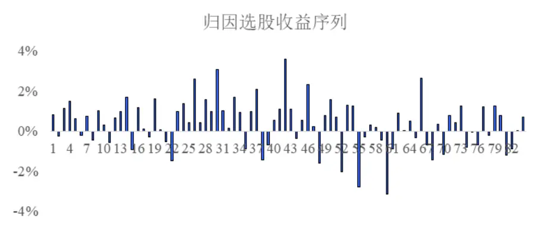
数据来源：国泰君安证券研究

全域选股中证500 增强策略组合累积净值、收益绩效统计及业绩归因分析如下：

图：中证 500 成分股增强组合累积净值
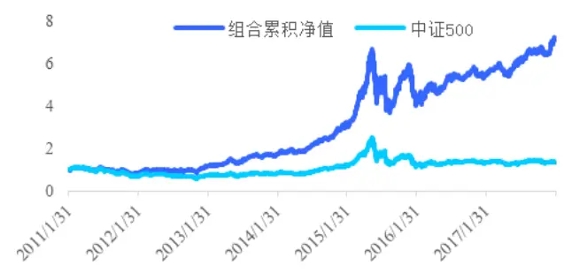
数据来源：国泰君安证券研究

图：中证 500 成分股增强组合累积超额收益
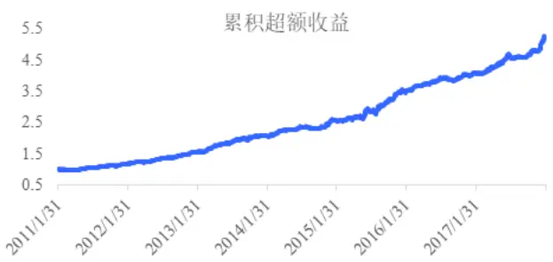
数据来源：国泰君安证券研究

表：组合绩效统计

| 累积超额收益 | 520% | 最大回撤 | 5.57% |
| --- | --- | --- | --- |
| 年化收益率 | 24.5% | 最大回撤开始时间 | 2015/07/09 |
| 年化波动率 | 6.93% | 最大回撤结束时间 | 2015/08/24 |
| 信息比率 | 3.53 | 组合年均换手率（双边） | 810% |

数据来源：国泰君安证券研究

表：组合绩效归因

|  | Mkt&Indu | Beta | Mom | Size | EY | Vol | Gro | PB | Lev | Liq | NLS | 选股 |
| --- | --- | --- | --- | --- | --- | --- | --- | --- | --- | --- | --- | --- |
| 收益归因 | 0% | 0.00% | 0.04% | -0.21% | 0.73% | 0.01% | 0.00% | 0.10% | 0.02% | 0.09% | 0.01% | 1.22% |
| T值 | 0 | -1.20 | 3.14 | -3.49 | 6.03 | 0.31 | -1.42 | 2.31 | 1.68 | 4.28 | 1.98 | 6.63 |

数据来源：国泰君安证券研究

图：归因选股收益序列
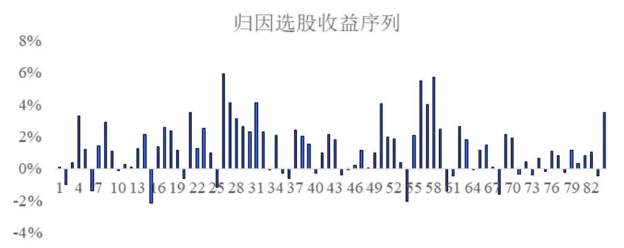
数据来源：国泰君安证券研究

在分域预测超额收益的基础上，沪深300与中证500的全市场增强策略，均表现出了较强的收益风险特性，月频换仓下，沪深 300增强年化超额收益 15.8%,信息比率 3.1,中证 500 增强年化超额收益 24.5%,信息比率3.5，最大回撤均发生在 2015 年股灾期间。并且，在 2017 年市场风格发生巨大变化的情况下，策略的稳定性仍然较高。因此，在分域预测和风险中性控制的基础上，多因子模型仍能表现出稳健战胜市场基准指数的良好特性。

## 5. 总结

本篇报告对传统多因子模型的研究框架进行了适当拓展，引入了分域研究的理念，针对不同的板块、风格、行业的股票域，检验并筛选相应区分的阿尔法因子集合，并在此基础上构建分域多因子选股增强策略。

我们通过采用全域风险调整后子域相关系数统计的检验方式，即避免了域内风格因素的干扰，同时也解决了由于域内股票数量较少所导致的统计方法上的检验偏差，是域内因子有效性检验的较好方法。

在此基础上，我们利用构建较为完整的因子库，对宽基域、板块域及行业域分别进行了因子检验，通过比较分析，即找到了各个股票域内的核心驱动因素，也对各个行业、板块之间的区别进行了有效梳理。其中，即不乏某些与基本面直观逻辑高度相关的结论，同时也发现若干新的统计结论，而其背后的投资逻辑同样值得深思。

在分域阿尔法模型的基础上，我们分别构建了沪深300 成分股增强、中证500成分股增强与各行业成分增强策略，实证分析结果表明，域内有效阿尔法因子的应用可以更好的获取较为稳健的超额收益。其中自2011年 1 月至 2018 年 1 月，沪深 300 成分股增强年化超额收益 9.8%，信息比率2.3；中证500成分股增强年化超额收益 15%，信息比率2.5。

进一步的，通过分行业域模型预测整合得到全截面预测收益的方法，我们构建了全市场选股增强模型，实证分析结果表明，自 2011 年 1 月至2018年1月，沪深300全市场增强策略年化超额收益15%，信息比率3.1；中证 500 全市场增强策略年化超额收益 24.5%，信息比率 3.5，组合表现均较为稳健。

分域研究解决的是传统线性预测模型对市场非线性特征刻画的不足，也是量化与基本面结合的有效途径，通过对各行业、板块投资逻辑的量化建模，可以使得模型更贴近市场本质投资逻辑，更加精确的发掘有效投资机会。

当然，在不同的市场环境下，各行业、板块的投资逻辑均会发生变化，本篇报告的研究逻辑采用最保守的方式，寻找一些长期相对稳定的影响因素。在后期的研究中，我们将更加深入的考察不同市场环境下，各行业板块相应的投资逻辑，并以量化建模的方式寻找最佳投资机会。

## 6. 附录

表：因子库明细

| 序号 | 因子名称 | 因子类别 | 因子定义 | 所用数据 |
| --- | --- | --- | --- | --- |
| 1 | acceleration | 动量因子 | 六个月动量排序 | 收盘价 |
| 2 | accural | 财务质量 | (△(流动资产-货币资金)-△流动负债-折旧与摊销)/平均总资产 | 流动资产，货币资金，流 动负债，折旧与摊销，总 资产 |
| 3 | accural_netIncome | 财务质量 | (△(流动资产-货币资金)-△流动负债-折旧与摊销)/净利润 | 流动资产，货币资金，流 动负债，折旧与摊销，净 |
| 4 | admExpRatio | 财务质量 | 管理费用/营业收入 | 利润 管理费用，营业收入 |
| 5 | Amt_1M_3M | 市场情绪 | 过去1个月日均成交额/过去三个月日均成交额 | 成交额 |
| 6 | Amt_Sum_1M | 市场情绪 | 一个月成交金额 | 成交额 |
| 7 | assets_log | 规模因子 | 总资产对数 | 总资产 |
| 8 | assetsTurn | 财务质量 | 营业收入_TTM/平均总资产 | 营业收入_TTM，总资产 |
| 9 | baddebt_coverage | 银行专属 | 不良贷款拨备覆盖率 | 不良贷款拨备覆盖率 |
| 10 | baddebt_rtio | 银行专属 | 不良贷款比例 | 不良贷款比例 |
| 11 | beta | 其他 | 过去一年股票收益率对市场收益率时间序列回归的系数 | 收盘价，市场指数收盘价 |
| 12 | bp | 估值因子 | 股东权益(报告期)/总市值 | 股东权益(报告期)，总市值 |
| 13 | bp_indus | 估值因子 | BP_LF/行业平均 BP_LF，其中 BP_LF=股东权益(最新公布)/总市 值 | 股东权益(最新公布)，总市 值，申万一级行业分类 |
| 14 | bp_lf | 估值因子 | 股东权益(最新公布)/总市值 | 股东权益(最新公布)，总市 值 |
| 15 | bps | 盈利因子 | (归属母公司股东的权益-其他权益工具)/报告期末总股本 | 归属母公司股东的权益， 其他权益工具，报告期末 |
| 16 | capAdequacyRatio _CT1 | 银行专属 | 核心一级资本充足率 | 总股本 核心一级资本充足率 |
| 17 | Clo_5D_60D | 交易行为 | 5 日均价/60 日均价 | 收盘价 |
| 18 | Clo_MaxMin_1M | 交易行为 | 1 个月最高价/最低价 | 收盘价 |
| 19 | Clo_MaxMin_3M | 交易行为 | 3 个月最高价/最低价 | 收盘价 |
| 20 | Clo_MaxMin_6M | 交易行为 | 6个月最高价/最低价 | 收盘价 |
| 21 | Clo_RateMean_1 M | 交易行为 | CLOSE/MEAN(CLOSE,20)-1 | 收盘价 |
| 22 | Corr_Clo_Turn | 交易行为 | 收盘价与换手率的相关系数 | 收盘价，换手率 |
| 23 | coskew | 交易行为 | 过去一年股票收益率与市场指数收益率的协偏度 | 收盘价，中证500 收盘价 |
| 24 | CoV_Ret_Amt | 市场情绪 | 过去20个交易日非负流动性的标准差/均值 | 收盘价，成交额 |
| 25 | CoV_Volume_1M | 市场情绪 | 过去1个月日成交量标准差/过去一个月日均成交量 | 成交量 经营活动产生的现金净流 |
| 26 | currencyRatio | 财务质量 | 经营活动产生的现金净流量/净利润 | 量，净利润 |
| 27 | current_ratio | 杠杆因子 | 流动资产/流动负债 | 流动资产，流动负债 |
| 28 | currentLiabRatio | 杠杆因子 | 流动负债/总资产 | 流动负债，总资产 |
| 29 | dbeta | 其他 | 过去一年市场下行条件下的BETA,即取市场收益率为负时的数据 计算个股 BETA | 收盘价，市场指数收盘价 |
| 30 | DIFF | 交易行为 | EMA(CLOSE,12)-EMA(CLOSE,26) | 收盘价 |
| 31 | disposition | 交易行为 | 收盘价/RP-1，其中， $RP_{t}=\frac{\sum_{n=1}^{60}(TURN_{t-n}\prod_{r=1}^{n-1}(1-TURN_{t-n+r}))CLOSE_{t-n}}{\sum_{n=1}^{60}(TURN_{t-n}\prod_{r=1}^{n-1}(1-TURN_{t-n+r}))}$ | 收盘价，换手率 |
| 32 | Dist_High | 交易行为 | 过去一年股价最高点距离当前时点的交易日天数 | 最高价 |
| 33 | dividendyield2 | 估值因子 | 股息率 | 股息率 |
| 34 | ebit_ev | 估值因子 | EBIT/EV，其中 EBIT 是息税前利润，EV 是企业价值（ev1，是否 包含货币资金) | 息税前利润，企业价值 |
| 35 | ebitda_ev | 估值因子 | EBITDA/EV，其中，EBITDA 税息折旧及摊销前利润，EV 是企业 价值 | 税息折旧及摊销前利润， 企业价值 |
| 36 | employeeGrowth | 其他 | (当前员工数量-去年同期员工数量)/去年同期员工数量 | 员工数量 |
| 37 | employeeGrowth_i ndus | 其他 | 员工增长率-行业平均增长率 | 员工数量 |
| 38 | ep | 估值因子 | 归属母公司净利润_TTM/总市值 | 归属母公司净利润_TTM， 总市值 |
| 39 | ep_de | 估值因子 | 扣除非经常损益的净利润_TTM/总市值 | 扣除非经常损益的净利润 |
| 40 | ep_FTM | 一致预期估值 | 归属母公司净利润_未来12 个月预测值/总市值 | _TTM，总市值 归属母公司净利润_未来 |
| 41 | ep_FY1 | 一致预期估值 | 归属母公司净利润_未来1年的预测值/总市值 | 12 个月预测值，总市值 归属母公司净利润_未来1 |
| 42 | ep_FY2 | 一致预期估值 |  | 年的预测值，总市值 归属母公司净利润_未来2 |
| 43 |  |  | 归属母公司净利润_未来2年的预测值/总市值 | 年的预测值，总市值 归属母公司净利润_未来3 |
| 44 | ep_FY3 | 一致预期估值 | 归属母公司净利润_未来3年的预测值/总市值 | 年的预测值，总市值 归属母公司净利润_TTM， |
|  | ep_indus | 估值因子 | EP/行业平均EP，其中,EP=归属母公司净利润_TTM/总市值 | 总市值 扣非归属母公司净利润， |
| 45 | eps | 盈利因子 | 扣非归属母公司净利润/总股本 | 总股本 |
| 46 | eps_adjust | 盈利因子 | 每股收益_最新股本摊薄 | 每股收益_最新股本摊薄 归属母公司股东权益，总 |
| 47 | equity_mkt | 估值因子 | 归属母公司股东权益/总市值 | 市值 |
| 48 | ev1 | 规模因子 | 公司价值 每股企业自由现金流/收盘价 每股企业自由现金流*总股本/总市 | 公司价值 每股企业自由现金流，收 |
| 49 | fcffp | 估值因子 | 值 | 盘价 |
| 50 | fcffps | 盈利因子 | 每股企业自由现金流 | 每股企业自由现金流 |
| 51 | finExpRatio | 财务质量 | 财务费用/营业收入 | 财务费用，营业收入 |
| 52 | fix_ratio | 财务质量 | 固定资产/股东权益 | 固定资产，股东权益 |
| 53 | floatshare_ratio | 杠杆因子 | 流通股本/总股本 | 流通股本，总股本 |
| 54 | grossMarginRatio_ ttm | 盈利因子 | 毛利_TTM/营业收入_TTM | 毛利，营业收入 |
| 55 | grossProfit_assets | 盈利因子 | 毛利_TTM/总资产 | 毛利_TTM，总资产 |
| 56 | grossProfitBank | 盈利因子 | (营业收入-营业支出)/营业收入 | 营业支出，营业收入 |
| 57 | grossProfitNonBa nk | 盈利因子 | (营业收入-营业成本)/营业收入 | 营业成本，营业收入 |
| 58 | High_Low | 交易行为 | 每个交易日最高价和最低价的极差 | 最高价，最低价 |
| 59 | invturn | 财务质量 | 存货周转率 利用过去一年股票收益率对市场收益率回归得到回归模型，根据回 | 存货周转率 |
| 60 | iv_cmap | 交易行为 | 归模型计算当前时间点的残差的平方即为特质波动率 | 收盘价，市场指数收盘价 |
| 61 | iv_r2 | 交易行为 | 过去一年股票收益率对 Fama 三因子回归的 R^2 利用过去三个月的股票收益率对Fama三因子回归得到回归模型， | 收盘价，市场指数收盘价 |
| 62 | ivday | 交易行为 | 根据回归模型计算当前时间点的残差的平方，然后对残差平方进行收盘价，市场指数收盘价 加权移动平均得到特质波动率 |  |
| 63 | laon_assets | 银行专属 | 贷款净值/总资产 | 贷款净值，总资产 |
| 64 | loandebt_ratio | 银行专属 | 存贷比 | 存贷比 |
| 65 | long_debt_equity | 杠杆因子 | (股东权益+长期负债)/股东权益 | 股东权益,长期负债 |
| 66 | long_debt_equity_ mkt | 杠杆因子 | (总市值+长期负债)/总市值 | 总市值,长期负债 |
| 67 | Long_Short_EMA | 交易行为 | (15 周指数移动平均-36 周指数移动平均) /36 周指数移动平均 | 收盘价 |
| 68 | longDebt_debt | 财务质量 | 长期负债比率 | 长期负债比率 |
| 69 | longtermDebt_rati 0 | 杠杆因子 | 非流动负债/(非流动负债+归属母公司股东的权益) | 非流动负债,归属母公司股 东的权益 |
| 70 | MACD | 交易行为 | MACD=2*(EMA(CLOSE,12)-EMA(CLOSE,26)-EMA(EMA(CLOSE,1 2)-EMA(CLOSE,26),9)); | 收盘价 |
| 71 | Max_Ret_1M | 交易行为 | 过去1个月最大日收益率 | 收盘价 |
| 72 | Mean_AMT | 市场情绪 | 过去1个月日均成交额 | 成交额 |
| 73 | Mean_Ret_Amt | 市场情绪 | 过去1个月（日涨跌幅绝对值/日成交金额）均值 | 收盘价，成交额 |
| 74 | mkt_cap_ard | 规模因子 | 总市值 | 总市值 |
| 75 | mkt_cap_ard_indu | 规模因子 | 总市值-行业平均市值 | 总市值，申万一级行业分 |
| 76 | S mkt_cap_ard_log | 规模因子 | 总市值取对数 | 类 总市值 |
| 77 | mkt_cap_float | 规模因子 | 流通市值 | 流通市值 |
| 78 | mkt_cap_float_log | 规模因子 | 流通市值对数 | 流通市值 |
| 79 | mom3_dps_FY1 | 一致预期盈利 | (当前 DPS_FY1-3 个月前 DPS_FY1)/3 个月前 DPS_FY1 绝对值 | 一致预测每股股利 FY1 |
| 80 | mom3_eps_FY1 | 一致预期盈利 | (当前 EPS_FY1-3 个月前 EPS_FY1)/3 个月前 EPS_FY1 绝对值 | 一致预测每股收益FY1 |
| 81 | mom3_np_FY1 | 一致预期盈利 | (当前净利润_FY1-3 个月前净利润_FY1)/3 个月前净利润_FY1 绝对 值 | 一致预测净利润 FY1 |
| 82 | mom3_rating | 一致预期盈利 | (当前分析师综合评级-3个月前分析师综合评级)/3个月前分析师综 合评级绝对值 | 分析师综合评级 |
| 83 | mom3_rev_FY1 | 一致预期盈利 | (当前营业收入_FY1-3个月前营业收入_FY1)/3 个月前营业收入 _FY1 绝对值 | 一致预测营业收入FY1 |
| 84 | mom3_roe_FY1 | 一致预期盈利 | (当前 ROE_FY1-3 个月前 ROE_FY1)/3 个月前 ROE_FY1 绝对值 | 一致预测净资产收益率 |
| 85 | mom_1m | 交易行为 | (当前收盘价-1 个月前收盘价）/1 个月前收盘价 | 收盘价 |
| 86 | mom_1m_indus | 交易行为 | 1 个月动量-行业平均1个月动量，其中，1个月动量=(当前收盘价 -1 个月前收盘价)/1 个月前收盘价 | 收盘价 |
| 87 | Mom_1Y | 动量因子 | 1年的收益率 | 收盘价 |
| 88 | Mom_1Y_1M | 动量因子 | 一年的收益率减去一个月的收益率 | 收盘价 |
| 89 | mom_3m | 动量因子 | (当前收盘价-3个月前收盘价）/3个月前收盘价 | 收盘价 |
| 90 | mom_3m_Indus | 动量因子 | 3个月动量-行业平均3个月动量，其中，3个月动量=(当前收盘价 -3 个月前收盘价）/3个月前收盘价 | 收盘价 |
| 91 | Mom_6M | 动量因子 | 6个月的收益率 | 收盘价 |
| 92 | Mom_24M | 动量因子 | 最近 24 个月收益率 | 收盘价 |
| 93 | mom_dps_FY1 | 一致预期盈利 | (当前 DPS_FY1-1 个月前 DPS_FY1)/1 个月前 DPS_FY1 绝对值 | 一致预测每股股利 FY1 |
| 94 | mom_eps_FY1 | 一致预期盈利 | (当前 EPS_FY1-1 个月前 EPS_FY1)/1 个月前 EPS_FY1 绝对值 | 一致预测每股收益FY1 |
| 95 | mom_np_FY1 | 一致预期盈利 | (当前净利润_FY1-1 个月前净利润_FY1)/1 个月前净利润_FY1 绝对 值 | 一致预测净利润 FY1 |
| 96 | mom_oper_rev_q | 成长因子 | 当前最近报告期单季度营业收入相对于上一个报告期单季度营业 收入的增长率 | 营业收入 |
| 97 | mom_rating | 一致预期盈利 | (当前分析师综合评级-1个月前分析师综合评级)/1个月前分析师综 合评级绝对值 | 分析师综合评级 |
| 98 | mom_rev_FY1 | 一致预期盈利 | (当前营业收入_FY1-1 个月前营业收入_FY1)/1 个月前营业收入 _FY1 绝对值 | 一致预测营业收入FY1 |
| 99 | mom_roe_FY1 | 一致预期盈利 | (当前 ROE_FY1-1 个月前 ROE_FY1)/1 个月前 ROE_FY1 绝对值 | 一致预测净资产收益率 FY1 |
| 100 | moneyCap_assets | 财务质量 | 现金/总资产 | 现金，总资产 |
| 101 | ncfp | 估值因子 | 现金净流量_TTM/总市值 净现金流收益率/行业平均净现金流收益率，其中，净现金流收益 | 现金净流量_TTM，总市值 现金净流量_TTM，总市 |
| 102 | ncfp_indus | 估值因子 | 率=现金净流量_TTM/总市值 | 值，申万一级行业分类 |
| 103 | net_interest | 银行专属 | 净息差 | 净息差 |
| 104 | netl1_assets netWorkingCap_as | 银行专属 | 一级资本净额/总资产 | 一级资本充足率 |
| 105 | sets | 财务质量 | 净运营资本/总资产 | 净运营资本，总资产 |
| 106 | nonCurLiab_equit y | 杠杆因子 | 非流动负债/股东权益 | 非流动负债，股东权益 |
| 107 | nonintere_assets | 银行专属 | 盈利资产/非盈利资产 | 盈利资产，非盈利资产 |
| 108 | noninterest_ratio | 银行专属 | 非利息收入/总利息收入 | 非利息收入，总利息收入 |
| 109 | np_FY1_ttm | 一致预期盈利 | 一致预测净利润 FY1/净利润_TTM | 一致预测净利润 FY1，净 利润_TTM |
| 110 | np_growth_FY1 | 一致预期成长 | (一致预测净利润 FY1-净利润_TTM)/净利润_TTM 绝对值 | 一致预测净利润FY1，净 利润_TTM |
| 111 | np_growth_FY3 | 一致预期成长 | (一致预测净利润 FY3-净利润_TTM)/净利润_TTM 绝对值 | 一致预测净利润 FY3，净 利润_TTM |
| 112 | OBV | 市场情绪 | VA=IF(CLOSE>REF(CLOSE,1),VOL,-VOL); OBV=SUM(IF(CLOSE=REF(CLOSE,1),0,VA),0);MAOBV=MA(OBV, | 收盘价，成交量 |
| 113 | ocfp | 估值因子 | M) 经营现金流_TTM/总市值 | 经营现金流_TTM，总市值 |
| 114 | op_or_ttm | 盈利因子 | 营业利润_TTM/营业收入_TTM | 营业利润_TTM，营业收入 |
| 115 | oper_ratio | 财务质量 | 主营业务比率 | 主营业务比率 |
| 116 | operCostRatio_no nBank | 财务质量 | 营业成本/营业收入 | 营业成本，营业收入 |
| 117 | operExpRatio | 财务质量 | 营业费用_TTM/营业收入_TTM | 营业费用_TTM，营业收入 _TTM |
| 118 | operExpRatio_ban k | 财务质量 | 营业支出/营业收入 | 营业支出，营业收入 |
| 119 | operRev2SalesExp | 盈利因子 | 营业利润_TTM/销售费用_TTM | 营业利润_TTM，销售费用 _TTM |
| 120 | operRev_assets | 盈利因子 | 营业收入_TTM/总资产 | 营业收入_TTM，总资产 |
| 121 | or_growth_FY1 | 一致预期成长 | (一致预测营业收入FY1-营业收入_TTM)/营业收入_TTM 绝对值 | 一致预测营业收入FY1， |
| 122 | or_ttm | 盈利因子 | 营业收入_TTM | 营业收入_TTM 营业收入_TTM |
| 123 | orgCapital | 财务质量 | 销售费用_TTM+管理费用_TTM | 销售费用_TTM，管理费用 _TTM |
| 124 | priceDelay | 其他 | 价格时滞=1-R1^2/R2^2，其中，R1^2 表示股票收益率对当前市场 指数收益率回归的R方，R2^2表示股票收益率对当期市场收益率 | 收盘价，市场指数收盘价 |
| 125 | quick |  | 以及当前市场收益率滞后项的R方 速动比率 | 速动比率 |
| 126 | Ret_AMT | 财务质量 市场情绪 | 过去1个月（日涨跌幅绝对值/日成交金额）均值 | 收盘价，成交额 |
| 127 | Ret_HL_60d | 交易行为 | 低于历史60日复合收益率的日收益波动除以高于历史60日复 | 收盘价 |
| 128 | Ret_Max_1M | 交易行为 | 合收益率的日收益波动的对数 过去一个月收益率最大值 | 收盘价 |
| 129 | Ret_Std_1M | 交易行为 | 1 个月收益率标准差 | 收盘价 |
| 130 | Ret_Std_1W | 交易行为 | 过去1周收益率的标准差 | 收盘价 |
| 131 | Ret_Std_1Y | 交易行为 | 过去1年收益率的标准差 | 收盘价 |
| 132 | Ret_Std_3M | 交易行为 | 3个月收益率标准差 | 收盘价 |
| 133 | Ret_Std_6M | 交易行为 | 6 个月收益率标准差 | 收盘价 |
| 134 | roa | 盈利因子 | 息税前利润_TTM/平均总资产 | 息税前利润_TTM，总资产 |
| 135 | roe | 盈利因子 | 净资产收益率 | 净资产收益率 |
| 136 | roe_ttm | 盈利因子 | 归属母公司净利润_TTM/平均归属母公司股东权益 | 归属母公司净利润_TTM， 归属母公司股东权益 |
| 137 | roic | 盈利因子 | 归属母公司净利润_TTM/平均投入资本 | 归属母公司净利润_TTM， |
| 138 | rps | 盈利因子 | 营业收入_TTM/总股本 | 投入资本 营业收入_TTM，总股本 |
| 139 | RSI | 交易行为 | 一定时期内市场的涨幅与涨幅加跌幅的比值 | 收盘价 |
| 140 | safexp_operrev | 财务质量 | (销售费用_TTM+管理费用_TTM+财务费用_TTM)/营业收入 _TTM | 销售费用_TTM，管理费用 _TTM，财务费用_TTM， |
| 141 | sales_profit | 盈利因子 | 净利润_TTM/营业收入_TTM | 营业收入_TTM 净利润_TTM，营业收入 |
| 142 | Skew_Ret_1M | 交易行为 | 过去1个月日收益率数据计算的偏度 | _TTM 收盘价 |
| 143 | Skew_Ret_1Y | 交易行为 | 过去1年日收益率数据计算的偏度 | 收盘价 |
| 144 | SL_Volume_1M | 市场情绪 | 过去1个月日均成交量/12个月日均成交量 | 成交量 |
| 145 | sp | 估值因子 | 营业收入_TTM/总市值 | 营业收入_TTM，总市值 |
| 146 | sp_adj | 估值因子 | 营业收入_TTM/(总市值+非流动性负债-货币资金) | 营业收入_TTM，总市值， |
| 147 sp_indus | 估值因子 |  | SP/行业平均 SP，其中 SP=营业收入_TTM/总市值 | 营业收入_TTM，总市值， |
|  |  |  |  | 申万一级行业分类 |
| 148 | tangAssetDebtRati 0 | 杠杆因子 | 负债合计/有形资产 | 负债合计，有形资产 |
| 149 | targetReturn | 一致预期估值 | 一致预期目标价格/收盘价-1 | 一致预期目标价格，收盘 价 |
| 150 | tax_q_growth | 成长因子 | (本期报告期单季度税收-上期单季度税收)/上期单季度税收绝对值 | 税收 |
| 151 | total_assets | 规模因子 | 总资产 | 总资产 |
| 152 | totLiab_mkt | 财务质量 | 负债合计/总市值 | 负债合计，总市值 |
| 153 | tsmon | 交易行为 | $TSMON_{i,j}=sign\left(\sum_{k=1}^{20}\hat{r}_{i-k,j}\right)*\frac{\hat{r}_{i,j}}{\hat{\delta}_{i,j}}$ 其中，i表示时间，j表示股票 $\hat{r}_{i,j}=r_{i,j}-\bar{r_{i,j}},\bar{r_{i,j}}$ 是收益的指数移动平均 平方的的指数移动平均值 | 收盘价 |
| 154 | Turn_1M_3M | 市场情绪 | $\hat{\delta}_{i,j}是\hat{r}_{i,j}$ 过去1个月日均换手率/过去三个月日均换手率 | 换手率 |
| 155 | Turn_CoV_1M | 交易行为 | 过去1个月换手率的标准差/过去一个月换手率的均值 | 换手率 |
| 156 | Turn_Mean_1M | 市场情绪 | 过去1个月的日均换手率 | 换手率 |
| 157 | Turn_Mean_3M | 市场情绪 | 过去3个月的日均换手率 | 换手率 |
| 158 | Turn_Mean_6M | 市场情绪 | 过去6个月的日均换手率 | 换手率 |
| 159 | Turn_Std_1M | 交易行为 | 过去1个月换手率标准差 | 换手率 |
| 160 | Turn_Std_3M | 交易行为 | 过去3个月换手率标准差 | 换手率 |
| 161 | Turn_Std_6M | 交易行为 | 过去6个月换手率标准差 | 换手率 |
| 162 | Turn_StdRate_1M | 交易行为 | 最近1个月日换手率标准差/最近2年日换手率标准差-1 | 换手率 |
| 163 | Turn_StdRate_3M | 交易行为 | 最近3个月日换手率标准差/最近2年日换手率标准差-1 | 换手率 |
| 164 | Turn_StdRate_6M | 交易行为 | 最近6个月日换手率标准差/最近2年日换手率标准差-1 | 换手率 |
| 165 166 | Up_Down | 交易行为 | 每日最高价与最低价之差 | 收盘价 |
|  | Up_Down_Vol | 市场情绪 | 每天一个亿成交量能推动股价的涨幅 总市值的对数对账面价值对数，净利润对数以及负债合计对数做横 | 收盘价，成交量 总市值，账面价值，净利 |
| 167 | valueResidual | 估值因子 | 截面回归的取残差 | 润_TTM，负债合计 |
| 168 169 | Vol_Diff | 交易行为 | 前20日的日均成交量-前250日的日均成交量 | 成交量 |
| 170 | Vol_Mean_3M Vol_Std_1M | 市场情绪 | 近三个月平均成交量 | 成交量 |
| 171 | Vol_Std_3M | 交易行为 交易行为 | 1 个月成交量标准差 | 成交量 |
| 172 | Vol_Std_6M |  | 3个月成交量标准差 | 成交量 |
| 173 | volume_m | 交易行为 市场情绪 | 6个月成交量标准差 一个月成交量之和 | 成交量 成交量 |
|  |  |  | VR=100*(TH*2+TQ)/(TL*2+TQ)，其中 TH 为近 20日内上涨日的 |  |
| 174 | VR | 市场情绪 | 成交量之和；TL 为近20日内下跌日的成交量之和；TQ为近20 日内收盘价不变日的成交量之和。 | 收盘价，成交量 |
| 175 | west_avgroe_FY1 | 一致预期盈利 | 一致预测 ROE_最近年度 | 一致预测 ROE_最近年度 一致预测 EPS_最近 12 个 |
| 176 | west_eps_FTM | 一致预期盈利 | 一致预测 EPS_最近 12 个月 | 月 |
| 177 | yoy_bps | 成长因子 | (当期 BPS-去年同期 BPS)/去年同期 BPS 绝对值，其中，BPS 表示 每股帐面价值 | 每股帐面价值 |
| 178 | yoy_eps | 成长因子 | (当期 EPS-去年同期 EPS)/去年同期 EPS 绝对值，其中，EPS 表示 每股收益 | 每股收益 |
| 179 | yoy_eps_q | 成长因子 | (当期单季度EPS-去年同期单季度 EPS)/去年同期单季度EPS 绝对 | 单季度归属母公司净利 |
|  |  |  | 值，其中，单季度EPS=单季度归属母公司净利润/总市值 | 润，总市值 |
| 180 | yoy_net_ocf_q | 成长因子 | (当期单季度经营现金流-去年同期单季度经营现金流)/去年同期单 | 经营现金流 |
|  |  |  | 季度经营现金流绝对值 |  |
|  |  |  | (当期净利润-去年同期净利润)/去年同期净利润绝对值 | 净利润 |
| 182 | yoy_np yoy_np_q | 成长因子 | (当期单季度净利润-去年同期单季度净利润)/去年同期单季度净利 | 净利润 |
| 183 |  | 成长因子 | 润绝对值 |  |
|  |  |  | (当期经营现金流-去年同期经营现金流)/去年同期经营现金流绝对 | 经营现金流 |
| 184 | yoy_ocf | 成长因子 | 值 |  |
| 185 | yoy_oper_rev | 成长因子 | (当期营业收入-去年同期营业收入)/去年同期营业收入绝对值 | 营业收入 |
|  |  |  | (当期单季度营业收入-去年同期单季度营业收入)/去年同期单季度 | 营业收入 |
|  | yoy_oper_rev_q |  | 营业收入绝对值 |  |
| 186 | yoy_opprofit_q | 成长因子 | (当期单季度营业利润-去年同期单季度营业利润)/去年同期单季度 | 营业利润 |
|  |  |  | 营业利润绝对值 |  |
| 187 | yoy_roe | 成长因子 | (当期 ROE-去年同期 ROE)/去年同期 ROE 绝对值，其中，ROE 表 | 净资产收益率 |
|  |  |  | 示净资产收益率 |  |
|  |  | 成长因子 | (当期总资产-去年同期总资产)/去年同期总资产绝对值 | 总资产 |
| 189 |  |  |  |  |
| 188 |  | 成长因子 |  |  |
|  | yoy_tot_equity |  | (当期股东权益-去年同期股东权益)/去年同期股东权益绝对值 | 股东权益 |
|  | yoy_total_assets |  |  |  |

数据来源：国泰君安证券研究

## 本公司具有中国证监会核准的证券投资咨询业务资格

## 分析师声明

作者具有中国证券业协会授予的证券投资咨询执业资格或相当的专业胜任能力，保证报告所采用的数据均来自合规渠道，分析逻辑基于作者的职业理解，本报告清晰准确地反映了作者的研究观点，力求独立、客观和公正，结论不受任何第三方的授意或影响，特此声明。

## 免责声明

本报告仅供国泰君安证券股份有限公司（以下简称“本公司”）的客户使用。本公司不会因接收人收到本报告而视其为本公司的当然客户。本报告仅在相关法律许可的情况下发放，并仅为提供信息而发放，概不构成任何广告。

本报告的信息来源于已公开的资料，本公司对该等信息的准确性、完整性或可靠性不作任何保证。本报告所载的资料、意见及推测仅反映本公司于发布本报告当日的判断，本报告所指的证券或投资标的的价格、价值及投资收入可升可跌。过往表现不应作为日后的表现依据。在不同时期，本公司可发出与本报告所载资料、意见及推测不一致的报告。本公司不保证本报告所含信息保持在最新状态。同时，本公司对本报告所含信息可在不发出通知的情形下做出修改，投资者应当自行关注相应的更新或修改。

本报告中所指的投资及服务可能不适合个别客户，不构成客户私人咨询建议。在任何情况下，本报告中的信息或所表述的意见均不构成对任何人的投资建议。在任何情况下，本公司、本公司员工或者关联机构不承诺投资者一定获利，不与投资者分享投资收益，也不对任何人因使用本报告中的任何内容所引致的任何损失负任何责任。投资者务必注意，其据此做出的任何投资决策与本公司、本公司员工或者关联机构无关。

本公司利用信息隔离墙控制内部一个或多个领域、部门或关联机构之间的信息流动。因此，投资者应注意，在法律许可的情况下，本公司及其所属关联机构可能会持有报告中提到的公司所发行的证券或期权并进行证券或期权交易，也可能为这些公司提供或者争取提供投资银行、财务顾问或者金融产品等相关服务。在法律许可的情况下，本公司的员工可能担任本报告所提到的公司的董事。

市场有风险，投资需谨慎。投资者不应将本报告作为作出投资决策的唯一参考因素，亦不应认为本报告可以取代自己的判断。
在决定投资前，如有需要，投资者务必向专业人士咨询并谨慎决策。

本报告版权仅为本公司所有，未经书面许可，任何机构和个人不得以任何形式翻版、复制、发表或引用。如征得本公司同意进行引用、刊发的，需在允许的范围内使用，并注明出处为“国泰君安证券研究”，且不得对本报告进行任何有悖原意的引用、删节和修改。

若本公司以外的其他机构（以下简称“该机构”）发送本报告，则由该机构独自为此发送行为负责。通过此途径获得本报告的投资者应自行联系该机构以要求获悉更详细信息或进而交易本报告中提及的证券。本报告不构成本公司向该机构之客户提供的投资建议，本公司、本公司员工或者关联机构亦不为该机构之客户因使用本报告或报告所载内容引起的任何损失承担任何责任。

## 评级说明

## 1.投资建议的比较标准

投资评级分为股票评级和行业评级。

以报告发布后的12个月内的市场表现为比较标准，报告发布日后的 12个月内的公司股价（或行业指数）的涨跌幅相对同期的沪深 300 指数涨跌幅为基准。

## 2.投资建议的评级标准

报告发布日后的 12 个月内的公司股价（或行业指数）的涨跌幅相对同期的沪深 300 指数的涨跌幅。

|  | 评级 说明 |  |
| --- | --- | --- |
| 股票投资评级 | 增持 | 相对沪深 300 指数涨幅 15%以上 |
|  | 谨慎增持 | 相对沪深300指数涨幅介于5%～15%之间 |
|  | 中性 | 相对沪深300指数涨幅介于-5%～5% |
|  | 减持 | 相对沪深 300 指数下跌 5%以上 |
| 行业投资评级 | 增持 | 明显强于沪深 300 指数 |
|  | 中性 | 基本与沪深 300 指数持平 |
|  | 减持 | 明显弱于沪深 300 指数 |

## 国泰君安证券研究所

|  | 上海 | 深圳 | 北京 |
| --- | --- | --- | --- |
| 地址 | 上海市浦东新区银城中路168号上海 银行大厦29层 | 深圳市福田区益田路 6009 号新世界 商务中心34层 | 北京市西城区金融大街 28 号盈泰中 心2号楼10层 |
| 邮编 | 200120 | 518026 | 100140 |
| 电话 | (021)38676666 | （0755)23976888 | (010)59312799 |
| E-mail: gtjaresearch@gtjas.com |  |  |  |