inInfo] [Table_Title] 2018.03.12

# 资产配置之步步为营：尾部风险控制与优化

## ——数量化专题之一百零九

玉陈奥林（分析师）

叶尔乐（研究助理）

8 021-38674835

021-38032032

chenaolin@gtjas.com

yeerle@gtjas.com

证书编号 S0880516100001

S0880116080361

## 本报告导读：

本报告通过修正均值方差理论的三大假设，形成了更贴近真实状况的风险监控体系，由此优化的配置组合获得了稳健的收益。

## 摘要：

le_Summary]均值方差理论框架的三大假设与真实的投资环境有很大偏差：资产回报为正态分布的假设，忽略了真实分布的尖峰厚尾与非对称性；波动率作为风险度量的假设，忽略了上行与下行风险的不对称性；组合优化目标为单位风险回报最大化的假设，忽略了具体回报目标，而回报目标决定了组合为此需要承担的最小风险，达不到目标也是一种风险。

本报告的目的即修正这三大假设，我们认为投资者真正关心的风险是：本金安全风险和投资目标不达风险，由此提出了一种全新的风险度量方式。同时通过核密度估计和多元正态分布变换我们拟合了资产真实分布的偏态、峰态和相关性，由此产生的随机数能帮助我们采用蒙特卡洛的方法计算风险度量，形成有效的风险监控体系。

通过最小化风险度量的组合优化方式，我们获得了较为稳健的资产配置效果。我们回测了 A 股、港股、美股、国债、黄金五类资产近10年的配置策略，在20日调仓频率下，获得了 10.10%的年化收益率，日频最大回撤-8.75%，夏普比率 1.45，从 2006 年到 2017 年每年收益都为正。60日调仓频率下，获得了 7.56%的年化收益率，日频最大回撤-4.01%，夏普比率 1.88。回测结果说明了如果能精确得当的描述和控制风险，即便没有预测端，资产配置也能获得较为稳定的收益。

模型的机制主要来自对尾部风险的控制。通过分析，模型的配置机制动量效应含量较低，其主要与资产的尾部风险相关性较高，能够成功的避免或是减小熊市、股灾、熔断对组合净值的影响。在预判金融风险上有一定价值。

未来随着监控指标和维度的完善，宏观事件维度的扩充，以及条件概率的加入，模型能够拓展为更加细致的风险监控体系，不论是在大类资产还是股票、期货策略都有应用空间。

金融工程

## 金融工程团队：

陈奥林：（分析师）

电话：021-38674835

邮箱：chenaolin@gtjas.com

证书编号：S0880516100001

## 李辰：（分析师）

电话：021-38677309

邮箱：lichen@gtjas.com

证书编号：S0880516050003

## 孟繁雪：（分析师）

电话：021-38675860

邮箱：mengfanxue@gtjas.com

证书编号：S0880517040005

## 蔡旻昊：（研究助理）

电话：021-38674743

邮箱：caiminhao@gtjas.com

证书编号：S0880117030051

## 殷明：（研究助理）

电话：021-38674637

邮箱：yinming@gtjas.com

证书编号：S0880116070042

## 叶尔乐：（研究助理）

电话：021-38032032

邮箱：yeerle@gtjas.com

证书编号：S0880116080361

## 李栩：（研究助理）

电话：021-38032690

邮箱：lixu019018@gtjas.com

证书编号：S0880117090067

## 杨能：（研究助理）

电话：021-38032685

邮箱：yangneng@gtjas.com

证书编号：S0880117080176

## 殷钦怡：（研究助理）

电话：021-38675855

邮箱：yinqinyi@gtjas.com

证书编号：S0880117060109

## [Table_R相关报告

《基于不同域研究的多因子选股体系》2018.03.10

《ESG 投资之公司治理》2018.02.06

《基于时变波动率及跳扩散过程的期权定价模型及其策略应用》2017.12.24

《基于时变波动率的期权定价模型》2017.11.16

《盈余质量检验及其投资策略构建》2017.09.20

## 1. 尾部风险的度量

“最重要的事情并不是预知未来，而是知道在每一个时间点上如何针对可获得的信息做出合理的回应。”

——Ray Dalio，桥水基金创始人

## 1.1.问题的提出

资产配置核心有两个方面：预测端和控制端。如果对资产的收益风险预测有很好的准确性，仅利用预测端就能获得较高的稳定收益，但一般预测端很难有较高准确性，也就是说不确定性占主导，在这种情况下控制端的部分才尤为重要。市场的变化存在较为稳定的特征，在这些特征中发掘风险并加以控制，即便没有预测端也能有效的避免极端损失，同时完成投资目标，正所谓步步为营，稳扎稳打。而要挖掘市场变化的细微特征就要求我们尽可能的还原市场本质的特征而不要做过多的假设。

大多数资产配置和组合构建的模型一般会在均值方差的理论框架下进行。均值方差模型要实现一个最优化的组合需要满足三个假设条件，这三个假设和真实的投资环境都有很大的偏差：

1）假设资产的回报呈正态分布。这忽略了资产的非对称性分布及厚尾分布，实际资产回报受到各项因素的影响，资产之间关系复杂，因此很难假设某一资产或者策略的回报分布为正态分布，分布的不对称性和厚尾性会扭曲组合的风险评价。

2）假设风险的定义就是资产回报的波动率。投资者对资产上行风险和下行风险的理解和偏好是完全不同的，用波动率来衡量风险忽略了这一事实，且波动率是路径独立的变量，对于资产管理过程中极端的回撤事件描述困难。

3）假设最优组合就是单位风险回报最高组合。这符合风险厌恶者的投资偏好，但是忽略了回报的绝对值水平。大多投资者在任一投资区间内都有一个回报目标要求，回报目标对于基金的资产配置来说至关重要，回报的要求直接决定了组合为了实现这一目标必须承担的最小风险。

而均值方差理论使用这些假设的根本原因是在于方便问题的求解和计算，在当下硬件和算法空前发达的时代，计算便捷性是较为容易克服的问题。因此本报告将使用一种新的风险度量方式克服均值方差模型中风险描述的缺陷，有效的刻画出投资者真正关心的风险，并且修正资产回报的分布问题，从而构建一种简洁而有效的资产配置风控体系。

## 1.2.风险的重新定义

投资者在投资期限内关心的实际风险通常有两个方面：

1）本金的安全：投资期间的回撤是真实存在的风险，投资者往往通过

设定止损条款或者赎回资金来尽量保证部分本金的安全；

2）回报的目标：投资者之所以愿意承担风险，是为了在投资期结束后能获得一个正的风险溢价，如果最终实现的回报低于预期目标，则这种可能性也将被视为风险。

我们可以将这两种风险用概率的方式描述出来：对于一个组合 $P_{t}$ ，假设投资期限为 $0\leq\mathrm{t}\leq\mathrm{T}$ ，定义 $X_{t}$ 和 ${\mathrm{}}^{\prime}Y_{t}$ 为如下变量：

$$
X_{t}=\log(P_{t}/P_{0})\mathrm{~},Y_{t}=\operatorname*{min}_{0\leq s\leq t}\log(P_{s}/P_{0})
$$

分别代表组合在 t 时刻的价值相对 0 时刻价值的对数回报，以及投资期内的最大损失。尽管许多研究在看待投资期内风险的时候都关注峰值到谷值之间的回撤幅度，但我们暂且探究组合最低价值相对初始价值的回撤幅度。那么我们就可以通过下式将我们定义的投资期内损失风险（简称“期内风险（Inner-horizon Risk）”）和投资期末业绩风险（简称“期末风险(End-of-horizon Risk)”）一起表达出来：

$$
\psi(x,y)=\mathbb{P}(X_{T}\leq x,Y_{T}\leq y)
$$

当然 $\psi\cdot$ 也可以分开两部分表示，第一部分是期内风险 $\psi_{IH}(y)=\psi(y,y)$ 是指不论组合在投资期末结束时表现如何，在到期日 T之前的任何一个时 点 ， 组 合 回 报 低 于 y 的 可 能 性 ； 第 二 部 分 是 期 末 风 险$\psi_{EH}(x,y)=\psi(x,y)-\psi(y,y)$ ，是指在整个投资期内最大损失幅度都不超过y的前提下，投资期末组合回报低于x 的可能性。那么总风险就可以分解为两类风险之和：

$$
\psi(x,y)=\psi_{IH}(y)+\psi_{EH}(x,y)
$$

为 $\daleth$ 研究 $\psi$ 的性质，我们假设组合的价值服从带漂移的几何布朗运动，这是通常的标准化假设：

$$
\mathrm{d}P_{t}=\mu P_{t}\mathrm{d}t+\sigma P_{t}\mathrm{d}W_{t}
$$

组合的初始价格 $P_{0}=1$ ，漂移参数 指投资期内的预期年化收益率， $\sigma$ 代表年化波动率。根据 Pranay Gupta 的证明，我们有如下推论：

推论：对于任意的x和 $\mathbf{y}.$ ，当 $\begin{array}{r}{\mathrm{y}\leq0\underline{{\mathrm{\tiny~ELx}}}\geq\mathrm{y}}\end{array}$ 时，风险表达式 $\ J)$ 可以表述为：

$$
\psi(x,y)=\mathcal{N}(d_{1})+\exp\left(\frac{2y(\mu-\sigma^{2}/2)}{\sigma^{2}}\right)\mathcal{N}(d_{2})
$$

$$
d_{1}={\frac{x-(\mu-\sigma^{2}/2)T}{\sqrt{\sigma^{2}T}}},d_{2}={\frac{2y}{\sqrt{\sigma^{2}T}}}-d_{1}
$$

其中 代表正态分布累计分布函数。

有了解析的表达式我们就能够在确定了 、 、x、y的情况下计算任意投资期限 T 的风险。在 ， ， ， 的情况下，总体风险的变化如下图所示：

图 1： 持有期望为正组合风险随持有期变化
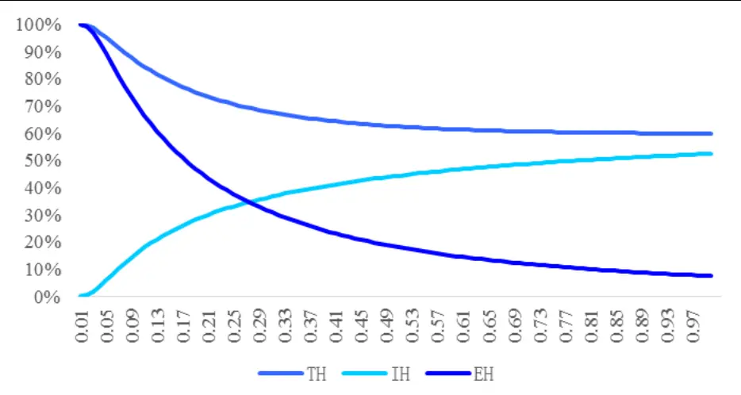
数据来源：国泰君安证券研究

在 为正的情况下，如果投资期较短，则 IH 较小，EH 较大，随着投资期的拉长，IH 逐渐变大，EH 逐渐变小，总风险逐渐减小。如果 为负（ ），总风险随着投资期的拉长先变小后变大，存在组合风险最小的持有期限，在本例中约为 。

图 2： 持有期望为负组合风险随持有期变化
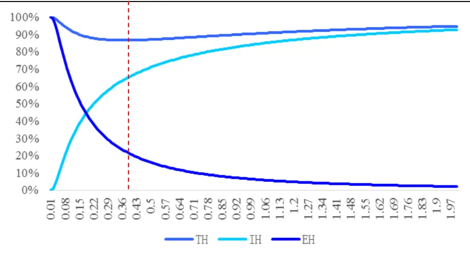
数据来源：国泰君安证券研究

对于任意运行中的组合，我们同样可以计算出任何时间，组合在剩余投资期限内的风险大小，我们以蒙特卡洛产生的某条组合的价值曲线举例（ ， ， ），计算其在剩余的投资期限中触发风险的概率（ ， ）：

图 3：运行中组合剩余期风险图示
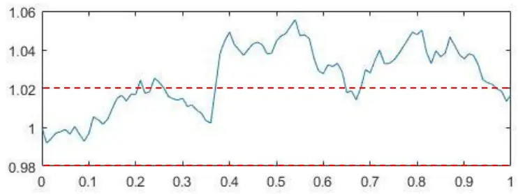

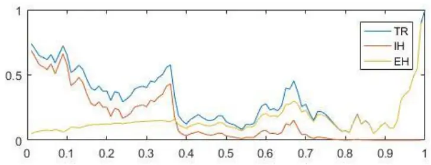
数据来源：国泰君安证券研究

可以看到在投资期限剩余较长的时候，总风险和组合已实现价值是近似负相关的，这个时候主要的风险贡献来自期内风险，但是在期末组合价值在回报目标 2%以下的情况下，风险急剧飙升，这个时候主要的风险贡献来源于期末风险。

## 1.3.还原真实的分布

尾部风险通常指小概率发生但是会导致巨大损失的风险，利用正态分布作为资产价格收益率的分布，会低估资产的尾部风险，同时忽略资产的偏态分布情况。这样得到的组合风险估计是有偏差的，我们以股票资产为例，计算沪深300指数2013年到2017年日收益率标准化后的分布，并与标准正态分布随机数的分布进行对比，可以看到沪深 300极端下跌与极端上涨行情发生的概率要明显高于正态分布，且沪深 300日收益率分布有偏态特征。

图 4： 沪深 300日收益率标准化分布与标准正态随机数
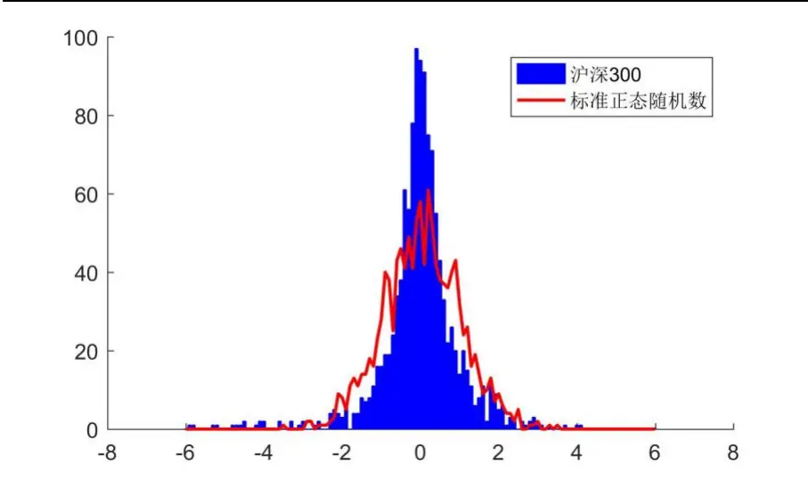

数据来源：国泰君安证券研究

为了更加贴近市场的分布，我们利用核密度估计的方式构造概率分布。核密度估计属于非参数检验方法，采用平滑的峰值函数来拟合观察到的数据点，设有 $x_{1},x_{2},\ldots,x_{n}$ 为独立同分布的n个样本点，其概率密度函数的核密度估计可以表示为：

$$
{\hat{f}}_{h}(x)={\frac{1}{n}}\sum_{i=1}^{n}K_{h}(x-x_{i})={\frac{1}{nh}}\sum_{i=1}^{n}K\left({\frac{x-x_{i}}{h}}\right)
$$

其中 K 为核函数，满足非负且积分为 1 的条件，h 为平滑系数$(K_{h}(x)=1/h\cdot K(x/h))$ ），理论上数据足够多而 h 趋向于 0 时分布能够收敛到真实分布，但是由于样本数量有限，因此过小的 h也会导致分布呈多峰形态，变得不够光滑，因此需要达到一个平衡：

图 5： 不同平滑系数下的拟合效果
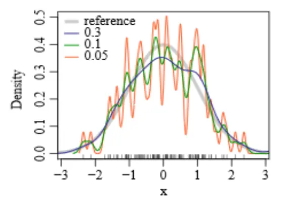
数据来源：Wikipedia，国泰君安证券研究

我们采用针对正态分布最优的 h参数以及正态核函数进行核密度估计，得到沪深300日收益率的经验分布函数：

图 6： 沪深 300日收益率标准化分布与核密度估计函数
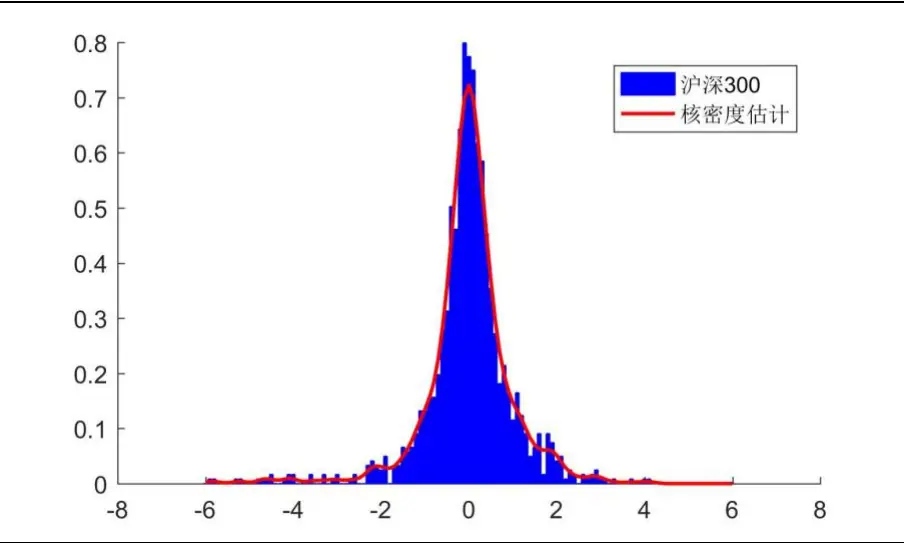
数据来源：国泰君安证券研究

由此密度函数生成的随机数分布相较正态分布更加接近真实分布，抓住了真实分布尖峰厚尾和偏态分布的特征：

图 7： 沪深 300日收益率标准化分布与核密度估计函数产生的随机数
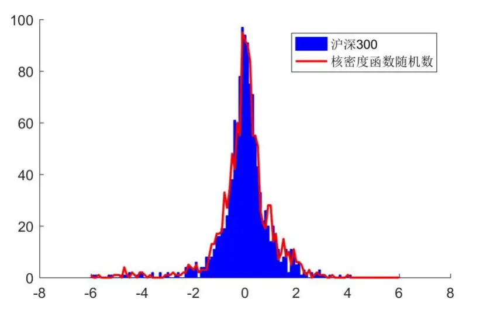
数据来源：国泰君安证券研究

对于多个资产，除了单一资产回报的峰态偏态，还需要捕捉资产回报之间的相关关系，我们可以用多维核密度函数进行估计或者采用诸如Copula函数或者马尔科夫链蒙特卡洛（MCMC）的方法，但是在样本点有限的情况下，扩展到高维有可能造成过拟合或者估计精度的损失，我们这里采用一个简便的替代方法。

我们知道由正态向量的线性变换性质：

$$
X\sim N(\mu,\Sigma)\Rightarrow AX\sim N(A\mu,A\Sigma A^{T})
$$

任何多元正态分布 $X\sim N(\mu,\Sigma)$ 都可以由独立的标准正态分布 $Z\sim N(0,1)$ 通过线性变换 $X=\mu+AZ,AA^{T}=\Sigma$ 得到。而在所有满足 $AA^{T}=\Sigma^{\sharp}\mathfrak{A}^{\prime}$ 中，通过Cholesky分解的下三角矩阵尤其便利，它将 $X=\mu+AZ^{\ddagger}$ 简化成如下形式：

$$
\begin{array}{l}{{X_{1}=\mu_{1}+A_{11}Z_{1}}}\\{{X_{2}=\mu_{2}+A_{21}Z_{1}+A_{22}Z_{2}}}\\{{\ldots\ldots}}\\{{X_{d}=\mu_{d}+A_{d1}Z_{1}+A_{d2}Z_{2}+\cdots+A_{dd}Z_{d}}}\end{array}
$$

同样的，我们可以首先求出各类资产收益率间的协方差矩阵的 Cholesky分解矩阵A，再由此矩阵以及各类资产回报分布的独立核密度估计随机变量 $K_{1},K_{2},\ldots,K_{n}$ 逐一推出包含相关关系的随机向量 $(X_{1},X_{2},\ldots,X_{n})$ ，并得到其联合分布：

$$
\begin{array}{l}{{X_{1}=K_{1}}}\\{{\nonumber}}\\{{X_{2}=(K_{1}-\mu_{1})/A_{11}\cdot A_{21}+K_{2}}}\end{array}
$$

$$
\begin{array}{rl}&{X_{n}=(K_{1}-\mu_{1})/A_{11}\cdot A_{n1}+(K_{2}-\mu_{2})/A_{22}\cdot A_{n2}+\cdots}\\&{\qquad+(K_{n-1}-\mu_{n-1})/A_{n-1n-1}\cdot A_{nn-1}}\\&{\qquad+K_{n}}\end{array}
$$

从公式的角度，我们可以保证 $(X_{1},X_{2},\ldots,X_{n})$ 的协方差矩阵和各类资产回报间的协方差矩阵一致。我们仅需验证新分布的边缘密度与 $K_{1},K_{2},\ldots,K_{n}$ 的分布一致即可。我们采用 Kolmogorov-Smirnov检验来验证两者产生的随机数分布是否两两相同，如果相同则我们认为 $(X_{1},X_{2},\ldots,X_{n})$ 的联合密度分布很好的模拟了市场真实的联合密度分布。

## 1.4.真实分布下的风险估计

得到了资产回报的联合分布我们就能够计算 1.2 小节提出的风险度量。由于不再使用几何布朗运动的一般假设，利用拟合的分布函数直接求风险度量的解析式较为困难，因此我们采用蒙特卡洛的方式计算风险度量。

蒙特卡洛方式通过对资产价格路径的多次模拟，能够近似的估计有关资产回报分布的各种度量。我们通过拟合的分布产生随机数组构建资产价格路径，通过判断触发期内风险或者期末风险的路径比例来近似的得到$\mathbb{P}(X_{T}\le x,Y_{T}\le y)$

我们选取以下资产以及对应的指数进行测试：

表 1： 测试资产类别及对应标的指数

| 资产 | A股 | 港股 | 美股 | 国债 | 黄金 |
| --- | --- | --- | --- | --- | --- |
| 标的指数 | 沪深 300 | 恒生指数 | 标普500 | 中债国债总 财富指数 | SGE黄金 9999 |

数据来源：国泰君安证券研究

我们测试了不同的模拟次数下持有单一资产风险度量的变化，输入的历史分布为2006年 1月开始的 120个交易日，投资期限选择20个交易日，对于回撤目标和收益目标，我们统一设置为 ， 。

图 8： 蒙特卡洛计算次数与风险度量变化
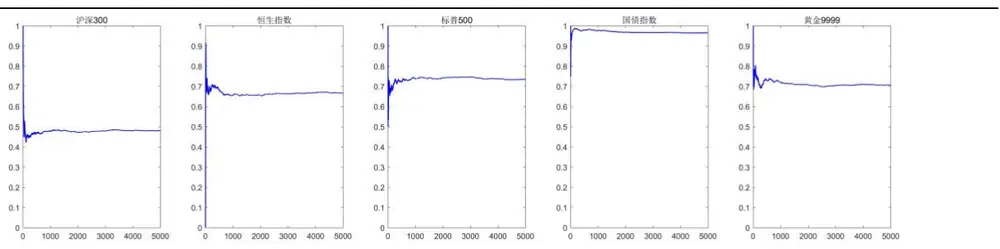
数据来源：国泰君安证券研究

可以看到基本所有资产在模拟次数达到 1500 次左右的情况下风险度量的值就相对较为稳定了。当然模拟次数越多整体的收敛性会越好。在精度要求没有那么高的情况下我们选择模拟1500次路径。

下面我们讨论多资产的边缘分布能否通过检验，我们取 2006 年到 2017年的数据，逐年计算上述五类资产核密度估计分布及变换后的联合分布，并考察由其边缘分布产生的随机数是否和原数据分布相同。

在显著性水平为 1%的情况下，生成的各年资产回报分布和原分布之间在 Two-sample Kolmogorov-Smirnov 检验下都不能拒绝原假设，也就是说在统计上没有充分的证据证明两者分布不同，显著性P 值分别如下：

表 2： Kolmogorov-Smirnov 检验显著性 P 值

| P-Value | 沪深300 | 恒生指数 | 标普500 | 国债指数 | 黄金指数 |
| --- | --- | --- | --- | --- | --- |
| 2006 | 64.58% | 64.58% | 25.32% | 72.32% | 49.41% |
| 2007 | 49.68% | 25.54% | 72.56% | 91.97% | 64.84% |
| 2008 | 14.68% | 43.78% | 26.41% | 4.66% | 65.87% |
| 2009 | 43.25% | 2.68% | 25.97% | 43.25% | 65.36% |
| 2010 | 17.30% | 64.84% | 21.11% | 72.56% | 36.34% |
| 2011 | 86.87% | 43.25% | 50.23% | 86.87% | 36.85% |
| 2012 | 11.45% | 11.45% | 57.39% | 3.43% | 21.31% |
| 2013 | 91.48% | 8.57% | 56.02% | 85.86% | 48.58% |
| 2014 | 96.15% | 43.51% | 43.51% | 96.15% | 80.55% |
| 2015 | 73.04% | 4.51% | 73.04% | 21.51% | 14.37% |
| 2016 | 11.59% | 57.66% | 43.25% | 80.35% | 50.23% |
| 2017 | 86.87% | 43.25% | 80.35% | 43.25% | 80.35% |

数据来源：国泰君安证券研究

这样我们就能够使用新生成的随机数模拟资产组合价值的路径，并在此基础上进行风险度量的计算了。

## 2. 尾部风险最小资产组合

大部分机构的投资者考核都有一定的期限，因此当前短期的风险比起长期的风险更为重要，通过将总的投资期拆分成更小的投资期单元，在每个投资单元中设定小目标，步步为营，稳扎稳打的方式，我们能更为精细的控制住风险，针对小目标的完成情况及时的调整投资策略。本篇报告提出的策略也是基于这样的思想，首先以 20 个交易日为调仓周期，在调仓周期内设定我们风险度量中的投资目标 x 和 y（这里我们统一使用 ， ）进行权重的优化，也就是说我们希望组合价值在未来20个交易日至少获得 1%的收益，且回撤不超过-1%。

均值方差模型权重的优化目标是预期收益率和预期波动率之间的一个平衡，两个指标要么在目标函数中要么在约束条件中，利用我们所提出的风险度量优化时只需要最小化触发风险的概率就可以既包含对回撤的控制又包含对收益的要求：

$$
\operatorname*{min}_{w}\mathbb{P}(X_{T}\leq x,Y_{T}\leq y)
$$

$$
\mathrm{s.t.}\sum w_{i}=1,w_{i}>0
$$

## 2.1. 股债组合

我们首先以股债双资产为例考察策略的效果，从2006 年开始以过去120个交易日数据作为资产回报分布拟合的输入，利用其产生的随机数每次模拟1500次，寻找风险度量最小的组合权重，按照权重进行资产配比。我们得到的组合净值变化如下：

图 9：20日调仓频率下股债组合净值曲线
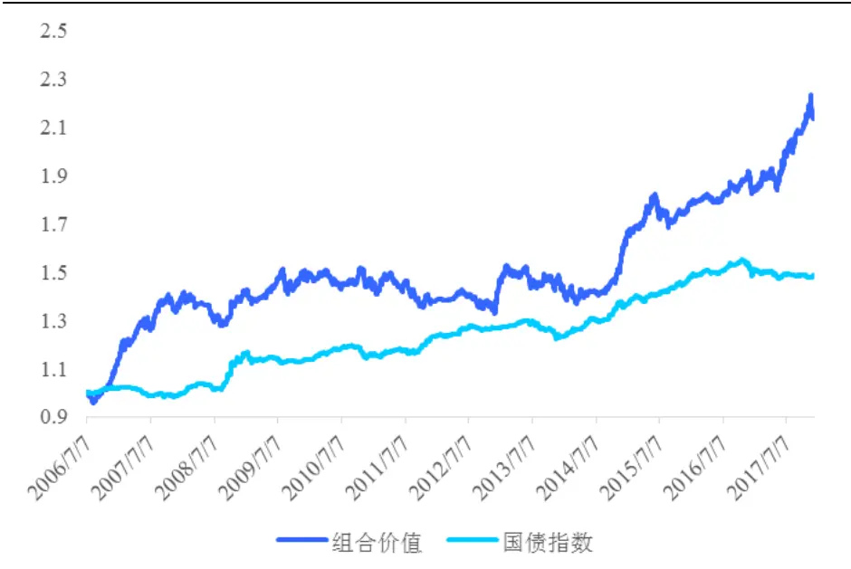
数据来源：国泰君安证券研究

表 3： 20日调仓频率下股债组合表现

| 年化收益率 | 最大回撤 | 夏普比率 | 触发风险总 概率 | 触发期内风 险概率 | 触发期末风 险概率 |
| --- | --- | --- | --- | --- | --- |
| 7.06% | -12.58% | 0.98 | 66.19% | 41.73% | 24.46% |

数据来源：国泰君安证券研究

可以看到虽然策略能够长期跑赢国债指数，在 2008 年股灾、2015 年股灾、2016 年初熔断当中提前降低仓位，在 2017 年慢牛行情中高仓位把握住了行情，但是统计下来仅在 33.81%的月份中完成了投资目标，在41.73%的月份中回撤超过-1%，在 24.46%的月份中虽然回撤没有超过阈值，但是收益目标未有达成。由于不对未来收益进行预测，仅通过控制风险最小化的方式在股债组合中还未能将风险完全分散化。通过调节收益目标x 和回撤要求 y可以进一步平滑组合价值曲线，本报告在此暂不展开。

图 10： 20日调仓频率下股债组合配置变化
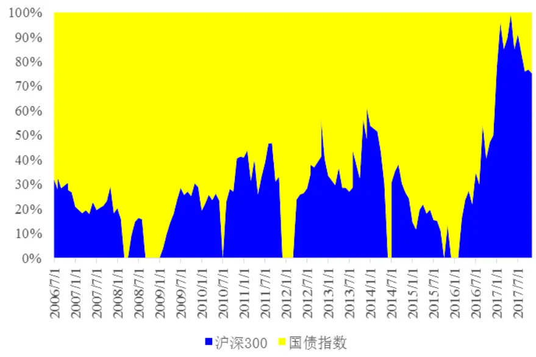
数据来源：国泰君安证券研究

从配置上看，模型主要在 2008年、2010年中、2014 年中、2011年末2012年年初，2015年末 2016年初大幅削减股票仓位，避免了A 股市场几次较严重的回撤。收益角度，模型在2016年末直至 2017年判断市场处于较为稳定的上涨趋势风险较小，并提前布局了较高的股票仓位，获得了收益的较大提升。我们将在后面章节中探讨模型这样配置的机制所在，究竟是动量使然还是风险特征使然。

## 2.2. 多资产组合

当然股债双资产对于风险的分散作用仍然有限，为了使得资产配置的分散作用得到较好的实现，我们将 1.4.节提到的五类资产一起放到组合中进行回测，结果如下：

图 11：20日调仓频率下多资产组合净值曲线
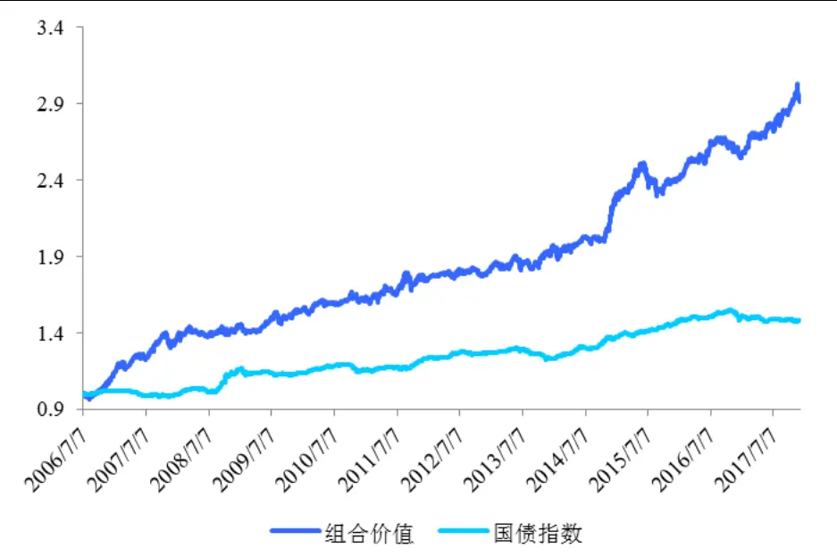
数据来源：国泰君安证券研究

表 4： 20日调仓频率下多资产组合表现

| 年化收益率 | 最大回撤 | 夏普比率 | 触发风险总 | 触发期内风 | 触发期末风 |
| --- | --- | --- | --- | --- | --- |
|  |  |  | 概率 | 险概率 | 险概率 |
| 10.10% | -8.75% | 1.45 | 60.43% | 41.01% | 19.42% |

数据来源：国泰君安证券研究

整体来看收益有所提升，回撤有所下降，夏普比率明显提升，多资产配置的特点在于机会更多，任何一个时期总有一两个资产表现较为亮眼，因此总体的收益在各年的分布较为均衡，回测结果在 2006到2017年的时间里每年收益皆为正，收益最低的一年为2012年，完成收益3.60%，整体体现了模型的稳定性。

图 12： 20日调仓频率下多资产组合各年收益率
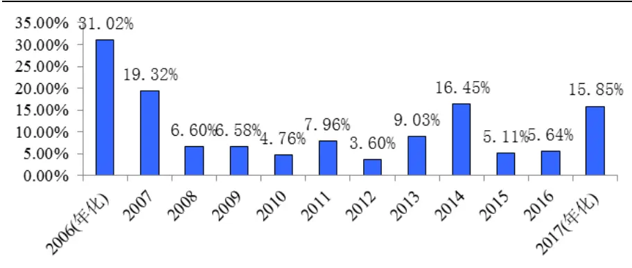
数据来源：国泰君安证券研究

从配置上看，模型不同于以波动率、协方差作为风险度量的模型（比如风险平价模型、最大分散度模型），这些模型往往会将波动率最小或者较小的资产作为主要资产，进行长期高仓位配置，并在此基础上补充买入其他资产。以本文提出的度量方式作为风险度量，将充分考虑各类资产的分布特点进行配置，由于债券货币之类波动率较小的资产对完成我们的收益目标帮助甚微，因此不到万不得已模型不会过高仓位配置这类资产。

图 13： 20日调仓频率下多资产组合配置变化
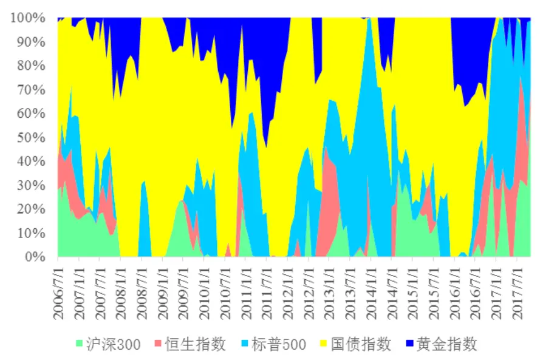
数据来源：国泰君安证券研究

上面的测试都建立在月频（20日）调仓的基础上，下面我们将同样进行季频（60 日）调仓的测试，我们设定季频的投资目标仍为： ，。这样一年的理论收益应该为 4%，但是模型的结果要好于我们设定的目标。

图 14： 60日调仓频率下多资产组合净值曲线
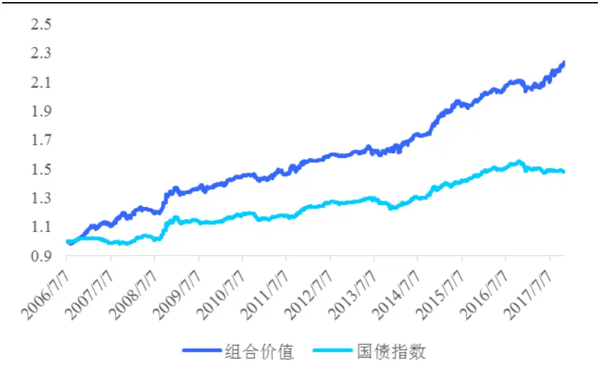
数据来源：国泰君安证券研究

可以看到年化收益率有所下降，但是回撤减少的更多，夏普比率达到了1.88，触发风险的概率也下降了，整体对于国债指数有一个长期稳定的增强作用。

表 5： 60日调仓频率下多资产组合表现

| 年化收益率 | 最大回撤 | 夏普比率 | 触发风险总 概率 | 触发期内风 险概率 | 触发期末风 险概率 |
| --- | --- | --- | --- | --- | --- |
| 7.56% | -4.01% | 1.88 | 45.65% | 28.26% | 17.39% |

数据来源：国泰君安证券研究

从配置上看，由于投资期限变长不确定性也会变大，因此模型会选择波动更小，更为稳妥的配置方式，而且期限越长，债券能够完成投资目标（1%）的概率也会上升，因此债券的权重有所提升。但这与以波动率和协方差作为风险度量的模型仍有区别，因为其在2013年中到2014年中、2017年，美股表现更优的情况下仍然会减少债券仓位，高仓位的参与美股行情。

图 15： 60日调仓频率下多资产组合配置变化
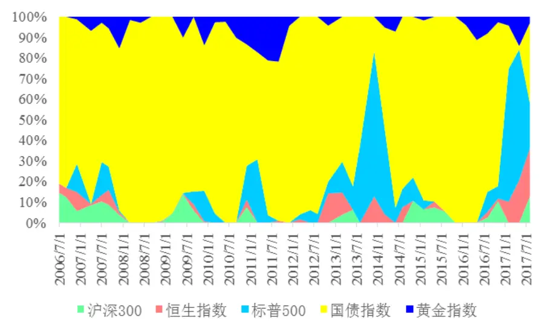
数据来源：国泰君安证券研究

## 2.3.目标可控性

本节我们探讨模型设定的目标的可控性，也即模型对于参数的敏感性。本模型主要涉及两个参数：目标回报与目标回撤。目标回报决定了策略需要承担的最小风险，目标回报过高势必导致组合整体波动和风险的上升。我们首先控制目标回撤 ，并测试不同的目标回报下，五类资产20日频率调仓的配置结果如下：

图 16： 不同目标回报下的风险概率
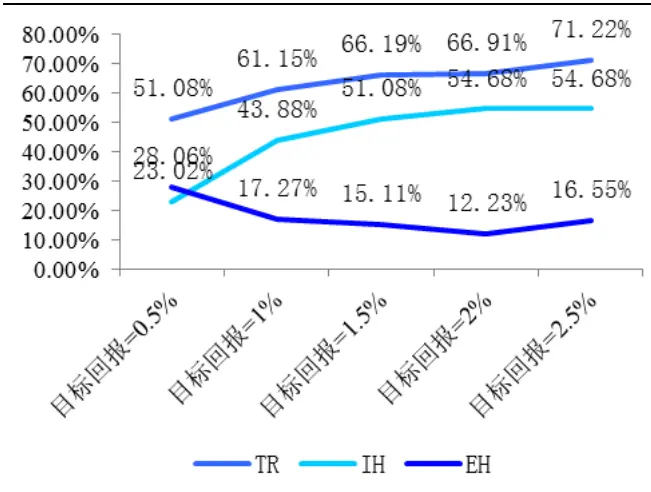
数据来源：国泰君安证券研究

图 17： 不同目标回报下的策略表现
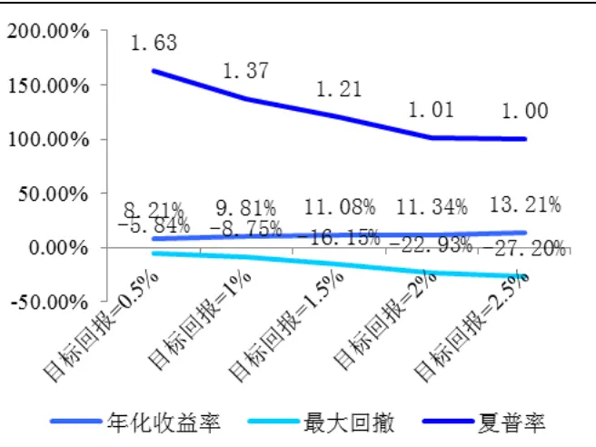
数据来源：国泰君安证券研究

可以看到，目标回报从 0.5%增长到 2.5%的过程中，虽然模型收益有一定的提升，但是回撤变化的幅度更大，使得模型最终的夏普比率是下降的。从风险的触发上来看，期内风险会快速上升，然后保持稳定，期末风险先下降但是当目标回报高于 2%后反而上升。因此我们认为目标回报的设定不宜过于激进，模型本身属于风控类型，对收益率要求过高会得不偿失。

图 18： 不同目标回报下的净值曲线
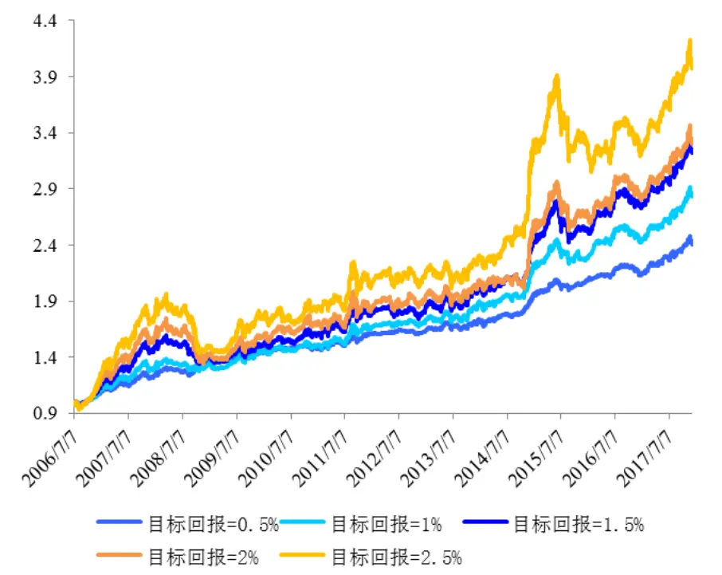
数据来源：国泰君安证券研究

下面我们控制目标回报 ，并测试不同的目标回撤下，五类资产20日频率调仓的配置结果如下：

图 19：不同目标回撤下的风险概率
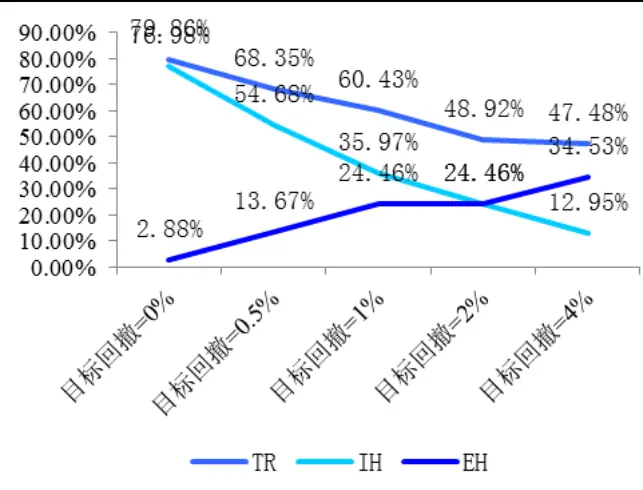
数据来源：国泰君安证券研究

图 20： 不同目标回撤下的策略表现
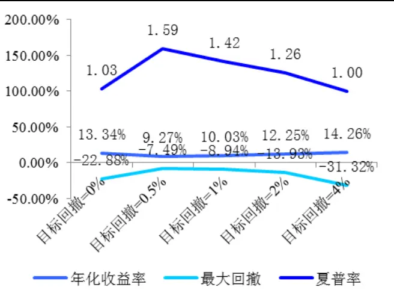
数据来源：国泰君安证券研究

可以看到目标回撤为 0%，也即最为严格的目标下，实际回撤是比较大的，而且相对其他参数值下策略的超额收益大部分来自 2006和2007年牛市，2007年之后表现一般。夏普率最高的是目标回撤 0.5%下的策略，在此目标回撤以上，夏普率单调下降。由此我们认为，当目标回撤设的过于严格的情况下，无论如何组合资产都会 100%的触发回撤风险，导致模型无法优化从而模型失效。因此我们认为目标回撤不宜过于严格，必须留出“缓冲区”，保证优化能正常进行。

图 21： 不同目标回撤下的净值曲线
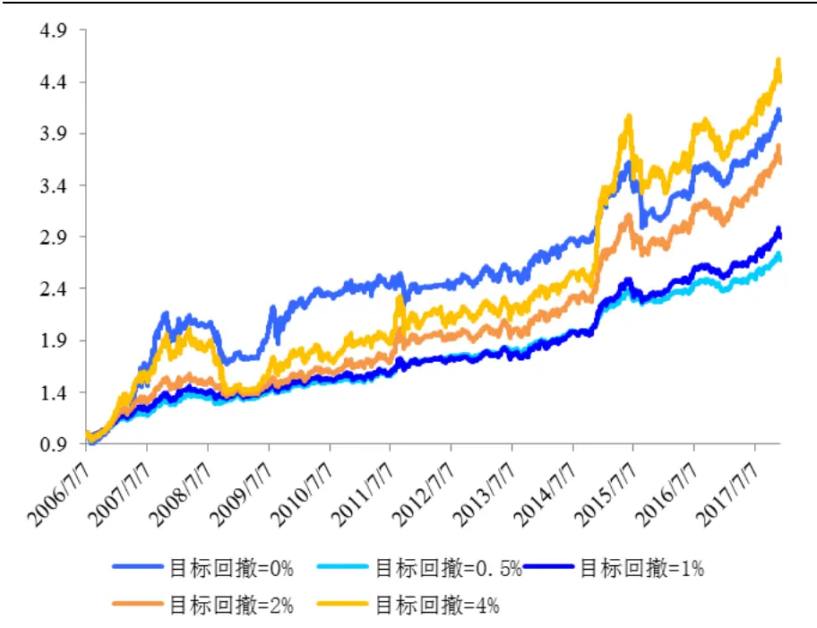
数据来源：国泰君安证券研究

## 2.4.模型机制探讨

知其然还要知其所以然，本节我们将讨论模型的配置机制，由于模型通过拟合分布并用蒙特卡洛计算概率的方式求解，因此没有代理变量供我们研究其在配置过程中的变化和导致的结果。我们主要通过配置某一种资产和一个分布特征较为恒定的资产（此处我们选择货币），观察其结果来总结归纳模型的配置机制。

我们以股票资产为例，选择其与货币基金指数进行配置，观察股票仓位与股票风险指标之间的关系，我们选择了如下收益率相关风险指标进行观察（日频）：均值、标准差、偏度、峰度、零阶下偏矩、一阶下偏矩、VaR（2.5%）、VaR（5%）、CVaR（2.5%）、CVaR（5%）。

我们设定 20 日调仓频率，目标回撤-1%，在目标收益为 0.1%、0.3%、0.5%、0.7%、0.9%下分别计算了股票仓位和各个风险指标的相关系数如下：

表 6： 不同目标收益下股票仓位与各风险指标相关系数

|  | 均值 | 标准差 | 偏度 | 峰度 | 零阶下 偏矩 | 一阶下 偏矩 | VaR (2.5%) | VaR (5%) | CVaR (2.5%) | CVaR (5%) |
| --- | --- | --- | --- | --- | --- | --- | --- | --- | --- | --- |
| x=0.1% | 0.05 | -0.23 | 0.12 | -0.03 | -0.01 | -0.22 | 0.26 | 0.23 | 0.25 | 0.25 |
| x=0.3% | 0.06 | -0.34 | -0.18 | 0.14 | -0.18 | -0.33 | 0.22 | 0.31 | 0.23 | 0.25 |
| x=0.5% | -0.09 | -0.84 | 0.29 | -0.03 | 0.22 | -0.70 | 0.76 | 0.76 | 0.81 | 0.80 |
| x=0.7% | -0.10 | -0.85 | 0.27 | -0.03 | 0.25 | -0.70 | 0.77 | 0.78 | 0.81 | 0.81 |
| x=0.9% | -0.13 | -0.85 | 0.28 | -0.02 | 0.27 | -0.69 | 0.76 | 0.77 | 0.81 | 0.80 |

数据来源：国泰君安证券研究

可以看到，股票仓位的高低和历史收益率均值之间的相关性很低，模型中动量效应的成分较少，和股票仓位相关性最高的主要是标准差、一阶下偏矩、VaR 和 CVaR，这几项指标是尾部风险的关键指标。同时我们注意到这种高相关性只在目标收益较高的情况下出现，在目标收益较低的情况下，货币资产本身完成投资目标的概率较高，因此股票的仓位将保持较低状态且和其风险指标相关性下降。因此模型的配置机制就在于优先选择能达成投资目标的风险最小资产，在其不能满足投资目标的情况下按照尾部风险大小加入其它高风险高收益资产，同时考虑风险的对冲分散作用。

## 3. 总结与未来方向

## 3.1.更为灵活的风险监控

本报告主要通过拟合真实分布产生随机数进行蒙特卡洛的方式计算资产组合风险。理论上任意有关概率的风险度量（不具有自相关性的序列）都能够得到计算，比如：

分布类：在险值VaR、条件风险价值 CVaR

触发类：回报达到一定值的概率、回撤达到一定值的概率；

停时类：首次达到某一水平时间、处于某一水平下时间、最优持有期限；

路径类：最高净值分布、最低净值分布、最大回撤分布这些指标不光可以用来对于对标衍生品进行定价，同时也能对投资组合的风险进行更为细致的监控。我们相信一个良好的风险监控体系就能帮助投资者在资产配置中获取稳健收益。同时这样的风险监控体系也可以用在其他策略中，包括股票和期货的投资。比如研究最大回撤的分布可以帮助我们判断某一策略产生的回撤属于正常范围还是预示着策略适用性的变化，从而我们就可以制定相应的止损策略。未来我们将对模型的各种应用进行尝试和探索。

## 3.2. 条件分布的引入

本报告使用的都是原始分布，实际还可以使用条件分布进行研究。条件分布的研究可以帮助我们理解某些市场特征或者外部变量事件影响下的市场回报分布，有助于投资者分析极端市场环境下的风险以及资产与资产之间的相互影响关系，对原始模型进行补充。

## 3.3.未来模型的改进

当然需要明确一点，即便未来收益率分布和历史收益率分布相同，利用历史收益率分布衡量的组合风险只是一部分风险，蒙特卡洛再多次实际的价格曲线也只有一条，包括事件、宏观、市场结构的变化和冲击都会带来其他维度的风险，我们将在之后的报告中继续讨论完善风险监控模型。除此之外，从算法上来说，本报告对于相关性的捕捉方法只是近似的方法，要获得更精确的总体相关性，捕捉资产尾部相关性还需要算法的进一步改进。而未来蒙特卡洛的计算效率也需要进一步加强。

## 本公司具有中国证监会核准的证券投资咨询业务资格

## 分析师声明

作者具有中国证券业协会授予的证券投资咨询执业资格或相当的专业胜任能力，保证报告所采用的数据均来自合规渠道，分析逻辑基于作者的职业理解，本报告清晰准确地反映了作者的研究观点，力求独立、客观和公正，结论不受任何第三方的授意或影响，特此声明。

## 免责声明

本报告仅供国泰君安证券股份有限公司（以下简称“本公司”）的客户使用。本公司不会因接收人收到本报告而视其为本公司的当然客户。本报告仅在相关法律许可的情况下发放，并仅为提供信息而发放，概不构成任何广告。

本报告的信息来源于已公开的资料，本公司对该等信息的准确性、完整性或可靠性不作任何保证。本报告所载的资料、意见及推测仅反映本公司于发布本报告当日的判断，本报告所指的证券或投资标的的价格、价值及投资收入可升可跌。过往表现不应作为日后的表现依据。在不同时期，本公司可发出与本报告所载资料、意见及推测不一致的报告。本公司不保证本报告所含信息保持在最新状态。同时，本公司对本报告所含信息可在不发出通知的情形下做出修改，投资者应当自行关注相应的更新或修改。

本报告中所指的投资及服务可能不适合个别客户，不构成客户私人咨询建议。在任何情况下，本报告中的信息或所表述的意见均不构成对任何人的投资建议。在任何情况下，本公司、本公司员工或者关联机构不承诺投资者一定获利，不与投资者分享投资收益，也不对任何人因使用本报告中的任何内容所引致的任何损失负任何责任。投资者务必注意，其据此做出的任何投资决策与本公司、本公司员工或者关联机构无关。

本公司利用信息隔离墙控制内部一个或多个领域、部门或关联机构之间的信息流动。因此，投资者应注意，在法律许可的情况下，本公司及其所属关联机构可能会持有报告中提到的公司所发行的证券或期权并进行证券或期权交易，也可能为这些公司提供或者争取提供投资银行、财务顾问或者金融产品等相关服务。在法律许可的情况下，本公司的员工可能担任本报告所提到的公司的董事。

市场有风险，投资需谨慎。投资者不应将本报告作为作出投资决策的唯一参考因素，亦不应认为本报告可以取代自己的判断。
在决定投资前，如有需要，投资者务必向专业人士咨询并谨慎决策。

本报告版权仅为本公司所有，未经书面许可，任何机构和个人不得以任何形式翻版、复制、发表或引用。如征得本公司同意进行引用、刊发的，需在允许的范围内使用，并注明出处为“国泰君安证券研究”，且不得对本报告进行任何有悖原意的引用、删节和修改。

若本公司以外的其他机构（以下简称“该机构”）发送本报告，则由该机构独自为此发送行为负责。通过此途径获得本报告的投资者应自行联系该机构以要求获悉更详细信息或进而交易本报告中提及的证券。本报告不构成本公司向该机构之客户提供的投资建议，本公司、本公司员工或者关联机构亦不为该机构之客户因使用本报告或报告所载内容引起的任何损失承担任何责任。

## 评级说明

## 1.投资建议的比较标准

投资评级分为股票评级和行业评级。

以报告发布后的12个月内的市场表现为比较标准，报告发布日后的 12个月内的公司股价（或行业指数）的涨跌幅相对同期的沪深 300 指数涨跌幅为基准。

## 2.投资建议的评级标准

报告发布日后的 12 个月内的公司股价（或行业指数）的涨跌幅相对同期的沪深 300 指数的涨跌幅。

|  | 评级 说明 |  |
| --- | --- | --- |
| 股票投资评级 | 增持 | 相对沪深 300指数涨幅15%以上 |
|  | 谨慎增持 | 相对沪深300指数涨幅介于5%～15%之间 |
|  | 中性 | 相对沪深 300指数涨幅介于-5%～5% |
|  | 减持 | 相对沪深300指数下跌 5%以上 |
| 行业投资评级 | 增持 | 明显强于沪深 300 指数 |
|  | 中性 | 基本与沪深 300指数持平 |
|  | 减持 | 明显弱于沪深300指数 |

## 国泰君安证券研究所

|  | 上海 | 深圳 | 北京 |
| --- | --- | --- | --- |
| 地址 | 上海市浦东新区银城中路168号上海 银行大厦29层 | 深圳市福田区益田路6009号新世界 商务中心34层 | 北京市西城区金融大街 28 号盈泰中 心2号楼10层 |
| 邮编 | 200120 | 518026 | 100140 |
| 电话 | （021)38676666 | (0755)23976888 | (010)59312799 |
|  | E-mail: gtjaresearch@gtjas.com |  |  |