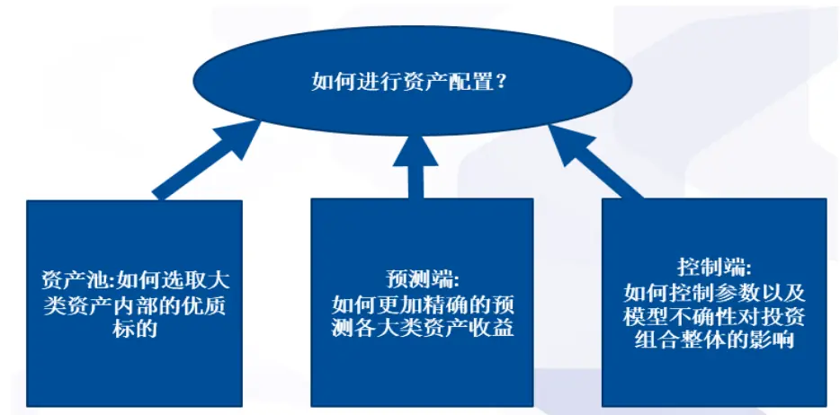
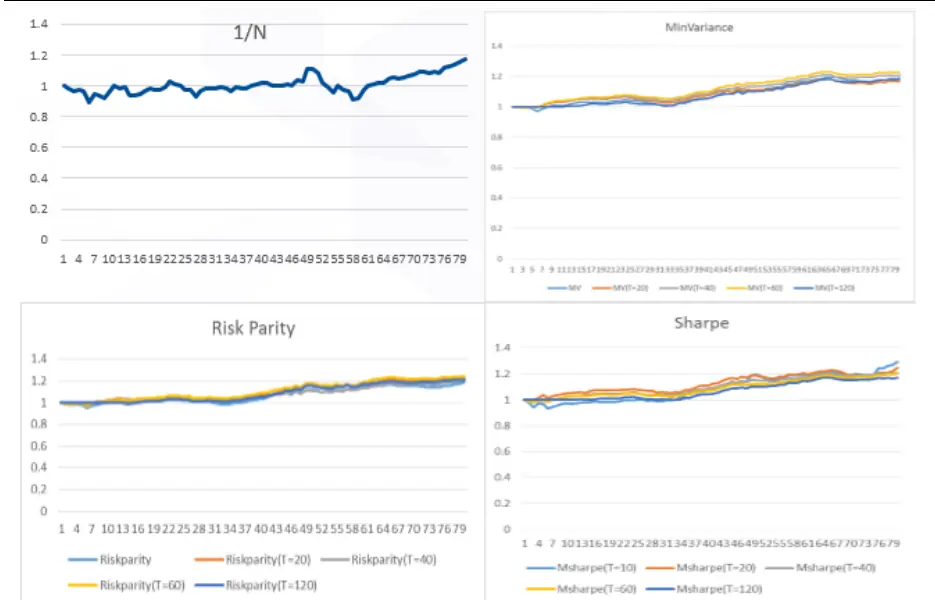
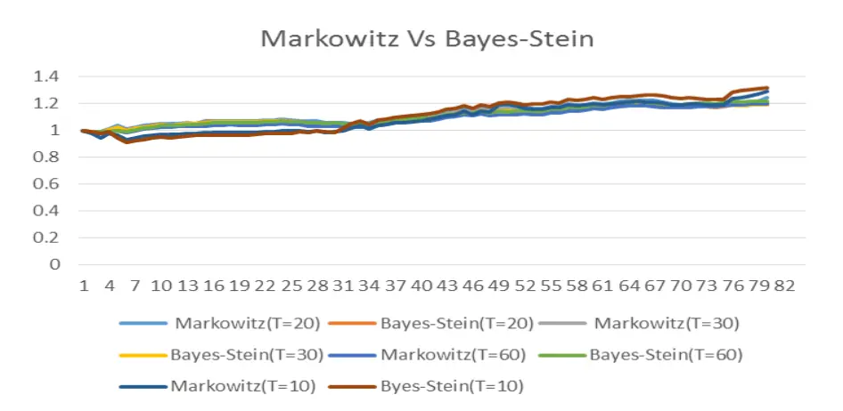
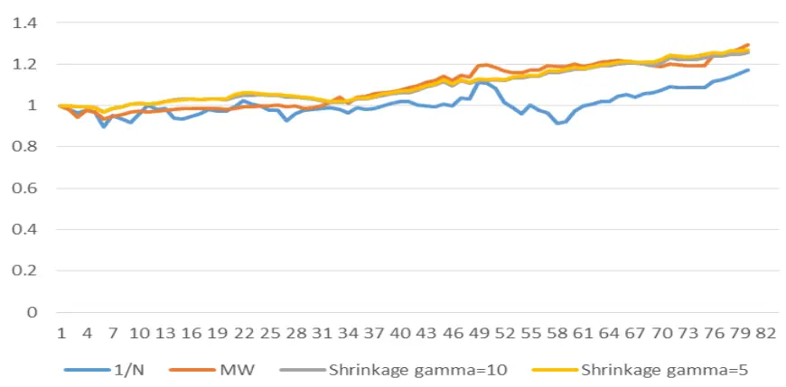
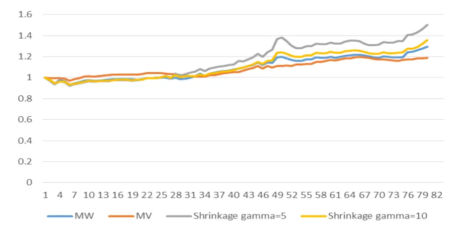
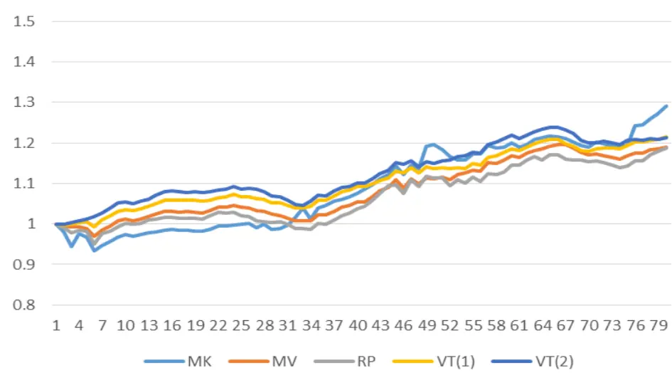
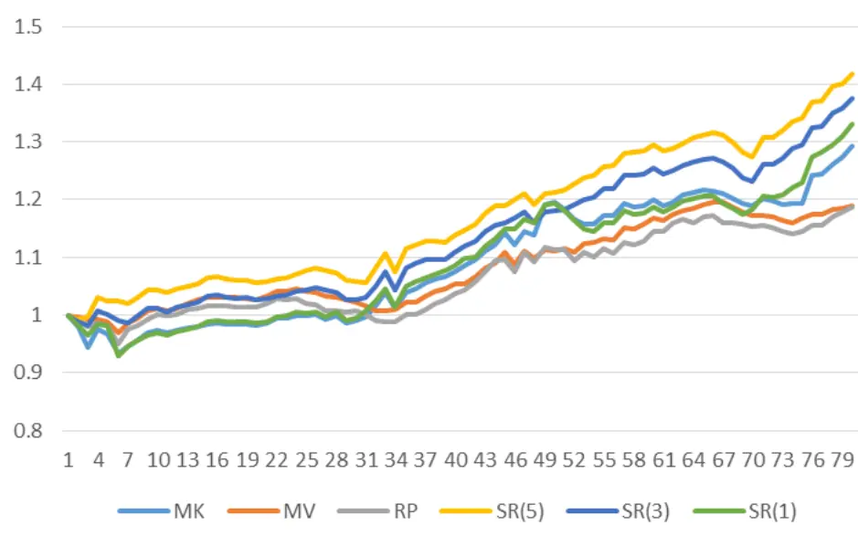
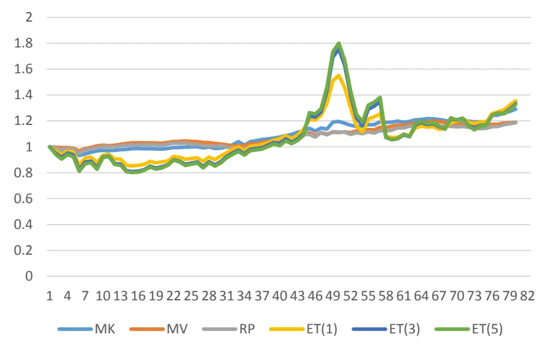

inInfo] [Table_Title] 2018.04.17

# 大类资产配置研究系列（一）控制端

## ——数量化专题之一百一十一

玉陈奥林（分析师）

## 蔡旻昊（研究助理）

8 021-38674835

021-38674743

chenaolin@gtjas.com

caiminhao@gtjas.com

证书编号 S0880516100001

S0880117030051

## 本报告导读：

本报告从资产配置研究的控制端出发，通过四种不同的模型减少参数不确定以及模型不确定对资产配置组合的影响，从而降低组合风险、提高组合收益和收益风险比。

## 摘要：

le_Summary]完整的自下而上的大类资产配置研究由资产池的选取、预测端和控制端三部分组成。本篇报告尝试通过对控制端的研究，减少参数不确定以及模型不确定对资产配置组合的影响。

通过Bayes-Stein模型，我们可以对各资产的预期收益进行更为稳定的估计，减少参数不确定对资产配置组合的影响，从而显著减少组合的风险，进一步提高组合的夏普比率。

通过Shrinkage模型，我们可以根据投资者的风险偏好，动态调整不同模型的权重，降低模型不确定对资产配置组合的影响，从而显著减少组合风险、提高组合收益、大幅度提高组合的夏普比率。

基于波动率稳定的特征、回避最优化目标函数的方法，波动率择时模型可以减少参数不确定以及模型不确定对资产配置组合的影响，从而显著降低资产配置组合整体的波动，提高组合整体的夏普比率。

夏普比率择时模型一方面运用资产收益率的预测信息提高组合整体收益，另一方面基于波动率的稳定特征减少参数不确定性对组合的影响，从而显著提高组合收益，控制组合风险，提高组合整体的夏普比率。

金融工程

## 金融工程团队：

陈奥林：（分析师）

电话：021-38674835

邮箱：chenaolin@gtjas.com

证书编号：S0880516100001

## 李辰：（分析师）

电话：021-38677309

邮箱：lichen@gtjas.com

证书编号：S0880516050003

## 孟繁雪：（分析师）

电话：021-38675860

邮箱：mengfanxue@gtjas.com

证书编号：S0880517040005

## 蔡旻昊：（研究助理）

电话：021-38674743

邮箱：caiminhao@gtjas.com

证书编号：S0880117030051

## 殷明：（研究助理）

电话：021-38674637

邮箱：yinming@gtjas.com

证书编号：S0880116070042

## 叶尔乐：（研究助理）

电话：021-38032032

邮箱：yeerle@gtjas.com

证书编号：S0880116080361

## 李栩：（研究助理）

电话：021-38032690

邮箱：lixu019018@gtjas.com

证书编号：S0880117090067

## 杨能：（研究助理）

电话：021-38032685

邮箱：yangneng@gtjas.com

证书编号：S0880117080176

## 殷钦怡：（研究助理）

电话：021-38675855

邮箱：yinqinyi@gtjas.com

证书编号：S0880117060109

## [Table_R相关报告

《基于研发投入资本化的淘金策略》2018.03.27

《大类资产配置之控制篇》2018.03.12

《资产配置之步步为营：尾部风险控制与优化》2018.03.12

《基于不同域研究的多因子选股体系》2018.03.10

《ESG 投资之公司治理》2018.02.06

## 1. 引言

诺贝尔经济学家罗伯特·席勒在《非理性繁荣》中指出：“我们应当牢记，股市债市定价并未形成一门完美的科学，几乎没什么方法能准确预测未来几天或几周股市或者债市的走向”。

也许我们可以基于市场的微观结构或者即时的新增信息根据历史统计显著性和金融逻辑较为精准的预测市场的短期走向，但我们至今依旧很难对市场的中长期走向做出精准的判断。即使我们找出一些行之有效的短期策略，但这些策略往往受到资金容量、市场流动性、交易成本等限制。特别是当投资者自身的资金量比较大的时候，配置单一的资产非常容易产生溢出效应（收益vs 规模），再加上高昂的交易费用都使得我们很难依靠这些短期策略提高投资组合整体的表现。因此当投资者的资金容量巨大时，中长期的投资策略则成为核心。

当我们对历史明星基金、明星基金经理的业绩进行归因分析时，可以清晰的发现投资组合的收益绝大多数来源于资产的配置而不是资产标的本身的选取。简单而言，由于我们很难对资产未来收益进行精确预测，从而缺乏选择资产的能力。

在理论上，Boyle 等人在“Keynes Meets Markowitz: The TradeoffBetween Familiarity and Diversification”一文中通过模拟不同资产未来收益的不确定时发现，当各类资产的未来收益不确定程度非常高时，投资者更应该通过分散的资产配置减少资产收益不确定性对于投资组合的影响。而当某一类资产未来收益的确定性更高时，我们应该更倾向于配置该资产。

因此，当我们对各类资产的未来收益不确定时，我们可以运用资产配置合理的分散风险；当我们对各类资产的未来收益确定时，我们也可以基于各类资产周期的不同，运用资产配置最大化投资组合的收益。

自下而上来看，一个完整的大类资产配置策略应该包含三个步骤：

(1) 资产池的选取（Security Selection）:即是否能够在某一大类资产中选择最优标的，从而提高资产配置组合整体收益。而最优标的地准确选择不仅需要精准判断各大类资产未来总体的走向，还需要进一步把握各大类资产内部不同标的之间未来的分化和走向。例如如何准确判断股票市场风格从而选择配置相应的风格指数或者ETF；又例如如何准确预测债券市场到期利率曲线变化从而选择合适到期时间的债券或者相应的衍生品。例如著名的耶鲁基金之所以能够获得超过 15%的绝对收益很大程度上取决于该基金在各类资产中优秀标的选择能力。在竞争激烈的PE 领域，耶鲁基金在该类资产的绝对收益超过了 36.1%；而在权益类的其他资产类别（包括绝对收益、美股和国外股票）也都取得了远超市场平均的业绩。因此，即使耶鲁基金在权益类资产的权重一直保持 80%以上，由于自身优秀的标的选择能力，这使得耶鲁基金的业绩一直傲视群雄。

(2) 预测端：即是否能够准确预测各大类资产的未来收益，从而提高资产配置组合整体收益。很多时候，当我们缺乏资产内部标的地选取能力时，是否能够准确判断各大类资产的总体走势很大程度上决定了我们是否能够战胜同类竞争对手。而对于各大类资产的预测能力从本质上体现在我们对于各类资产的择时能力，即我们对于各大类资产之间的权重调配能力上。

(3) 控制端：即如何控制由于对各类资产未来收益预测的错误对资产配置组合整体收益的影响。我们对于资产未来收益预测的错误来源一般可以分为两类：（1）参数估计的错误 (ParameterUncertainty) （2）模型自身的错误 ( Model Uncertainty)。例如以传统的 Markowitz 模型为例，各类资产在投资组合中的权重主要取决于我们对于各类资产预期收益率的期望，波动率以及资产之间协方差这三类参数。而我们对于这三类参数估计的准确程度直接影响了 Markowitz 模型的效果。即使我们准确估计了这三类参数，但由于各资产预期收益的分布大大偏离了模型假设的正态分布，这使得模型本身并不能准确地刻画投资组合整体收益的分布，使得Markowitz模型本身的适用性下降或者失效，从而加大 Markowitz模型在时间序列上表现的不稳定，加大了模型不确定对资产配置组合的影响。

因此，如何确定资产池（资产池）、如何预测各大类资产未来收益（预测端）以及如何控制参数及模型不确定性对于投资组合的影响（控制端）综合构建了一套完整的大类资产配置的研究体系。

图 1. 资产配置研究体系

数据来源： 国泰君安证券研究

本篇报告主要从资产配置研究中的控制端出发，通过减少参数不确定以及模型不确定对资产配置组合的影响，减少组合的风险，提高组合的收益和夏普比率。

首先由于资产预期收益估计的极大不确定性，我们运用 Bayes-Stein模型，基于资产的数目以及样本的大小，对各资产的预期收益进行稳定性估计，从而减少参数不确定对资产配置组合的影响。对比传统基于极大似然估计的Markowitz模型，通过更为稳定的预期收益率的估计，组合的整体风险显著的降低，而组合的夏普比率也得到了显著的上升。

其次，我们运用Shrinkage 模型，根据投资者的风险偏好，动态调整不同模型的权重，从而减少模型不确定对资产配置组合的影响，降低组合风险，提高组合整体表现。对比传统的资产配置模型，组合的标准差从原有的 16.34%~31.09%降低到 9.46%~9.55%。而组合整体的夏普比率从原有的 0.09~0.25 上升到 0.37~0.39。

最后，我们基于波动率的稳定特征以及规避优化目标函数的方法，建立波动率择时以及夏普比率择时模型。通过减少参数以及模型不确定，提高资产配置组合整体表现。对比传统的资产配置模型，波动率择时模型将组合整体风险从原有的 9.16%~16.34%下降到 7.53%~7.93%; 在保证组合收益的情况下，组合整体的夏普比率从原有的0.22~0.29大幅度上升到 0.37~0.40。而夏普比率择时模型一方面运用资产收益率的预测信息提高组合整体收益，另一方面基于波动率的稳定特征减少参数不确定性对组合的影响，从而控制组合的风险，大幅度的提高组合的收益风险比。对比传统资产配置模型，夏普比率择时模型的平均收益从原有的2.66%~4.00%大幅度提高到 4.92%~5.37%，同时组合的风险却依然维持在较低的水平，使得组合的夏普比率从原有的 0.22~0.29 显著上升到0.40~0.43。

在本篇报告的第 2 章中, 我们首先介绍了传统的大类资产配置模型及其历史表现，具体探讨了各类模型的特征及局限性。在第 3章中,我们介绍如何通过Bayes-Stein 模型减少参数不确定对资产配置组合影响。在第4章中,我们具体介绍如何运用 Shrinkage模型减少模型不确定对资产配置组合的影响。在第5 章中,建立波动率择时以及夏普比率择时模型，尝试通过同时减少参数以及模型不确定对资产配置组合的影响。第6章为研究总结与展望。

## 2. 传统的大类资产配置模型

## 常用的大类资产模型一般可以分为四类:

1. Naïve 模型(例如1/N 原则、股债4/6原则等)：通常指投资组合中各类资产权重为常数的一类模型。从本质上，这类模型认为各类资产的收益（风险）非常难以预测，这使得参数估计的错误以及模型自身的错误会严重的影响投资组合的收益。因此，简单的给各类资产赋予固定权重反而可以有效地分散投资组合的风险同时减少参数（模型）的错误对投资组合收益的影响。通常当组合中资产的数目较多或者资产收益率预测困难时，该类模型的整体较少。然而，这类模型完全忽视类各类资产收益（风险）可预测的属性，当资产的数目较少或者资产收益率可预测性较强时，该类模型的表现较差。

2. Markowitz 型模型（例如：寻找 Sharpe 比例最高的投资组合等）：

假设投资者的效用为投资组合预期收益和风险的函数（例如收益风险比、线形的收益风险函数等），通过最大化投资者的效用而找到最优的各类资产的权重。由于这类模型在进行优化时很大程度上取决于各类资产收益风险参数的估计，因此当资产数量较少或者资产未来收益风险较容易估计时，这类模型的表现较好。而当资产的未来收益风险变化剧烈较难估计时，这类模型的表现较差。另外，在实际运用中，这类模型在进行优化时，非常容易取得极端值，因此投资组合整体的换仓频率以及表现波动较大。

3. 风险平价模型:通过均衡各类资产对投资组合总体风险的贡献程度调节各类资产的权重。从本质上，这类模型的核心以风险控制为主，通过赋予风险较小的资产较大的权重（风险较大的资产较小权重）使得投资组合整体的风险维持在较低的水平。然而由于这类模型完全忽视了各类资产预期收益率的信息，因此很难通过这类模型有效的提高投资组合的期望收益（收益风险比）。、

4. 最小风险模型：通过最小化组合整体的风险来优化各类资产的权重。和风险平价模型类似，由于这类模型的目标是控制投资组合的整体风险，由于债券的历史风险显著低于其他大类资产，因此这类模型在大类资产配置中对于债券类资产的配置权重极高，从而使得基于最小风险模型的大类资产组合的表现主要取决于债券类资产。相对于风险平价模型而言，最小风险模型尝试更加苛刻的控制投资组合的总体风险，投资组合整体风险的控制更大程度上依赖于我们对于各类资产相关风险估计的准确程度。

表1. 传统大类资产配置模型的优劣势对比

|  | Na ive 模型 | Markowitz 模型 | 风险平价模型 | 最小风险模型 |
| --- | --- | --- | --- | --- |
| 优点 | 不依赖于参数和模型； 当资产的数目较多时， 模型的表现较好。 | 依赖的参数较多； 能够运用资产收益率 （波动率等）的可预测 性，最大化组合的收益 风险比； 当资产数目较少时，模 型的表现较好。 | 依赖的参数较少； 对参数的敏感度较低； 侧重于对组合的风险控 制； 当资产的数目较多时， 模型的表现较好。 | 依赖的参数较少 以最小化组合的风险为 唯一目标； 当对参数的估计较为准 确时，模型能够最大化 的控制组合的风险。 完全忽视资产收益率的 |
| 缺点 | 完全忽视资产收益率 (波动率等)的可预测 性； 当资产数目较少时，组 合的表现较差。 | 容易受到参数不确定性 的影响； 在进行优化时，经常容 易出现极端值； 当资产数目较多时，由 于参数和模型不确定性 的共同作用，模型的样 本外表现较差。 | 完全忽视资产收益率的 可预测性，组合的收益 率较低； 当资产的数目较少时， 组合的表现较差。 | 可预测性，组合的收益 率较低； 对参数的敏感度较高； 当资产的数目较多时， 由于参数以及模型不确 定性的共同作用，组合 的表现较差。 |

数据来源： 国泰君安证券研究

我们选用主要资产指数 2005-2017 年的月度数据尝试比较各传统大类资产配置模型的表现。对于权益类资产，我们选用上证综合指数、标准普尔500指数以及恒生指数;对于债券类资产，我们选用中债总财富指数以及 Barclay Aggregated US Bond Index; 而其他风险类资产，我们则选用SHFE黄金指数以及WTI原油指数。

我们对于所有的投资组合都加以卖空以及杠杆的限制。Jagannathan and Ma (2003) 证明有卖空和杠杆限制的投资组合从计量上可以减少协方差矩阵中主轴值的波动，减少估计误差对投资组合的影响，从而提高投资组合的整体表现。

表2. 各资产历史表现

|  | 标准普尔 | 恒生指数 | 上证综指 | Barclay 美国 债券指数 | SHEF 黄金指 数 | WTI 原油指数 | 中债总财富 |
| --- | --- | --- | --- | --- | --- | --- | --- |
| 均值(年化) | 6.39% | 8.38% | 8.94% | 3.5% | 2.57% | 0.12% | 3.27% |
| 标准差 | 48.54% | 69.45% | 96.09% | 12.44% | 49.74% | 62.77% | 10.59% |
| 夏普比率 | 0.13 | 0.12 | 0.09 | 0.28 | 0.05 | -0.00 | 0.31 |
| 偏度 | -0.99 | -0.55 | -0.17 | 0.80 | -0.23 | -0.12 | 0.20 |
| 峰值 | 3.47 | 2.07 | 1.37 | 5.83 | 3.26 | 4.19 | 1.80 |

数据来源： Wind 国泰君安证券研究

从表 2 中我们可以发现，在主要的风险类资产中，债券类资产的风险显著低于其他大类资产，这使得债券类资产在平均收益仅有 3%左右的情况下，夏普比率依然显著高于其他大类风险资产。而对于权益类资产而言，收益大致上维持在8%左右，而夏普比率仅有债券类资产的 1/3 到 1/2。而石油黄金等风险类资产相对于债券和权益类资产而言，中长期的投资价值并不高（收益以及收益风险比显著低于债券和权益类资产）。

图 2. 各传统大类资产模型历史表现

数据来源： Wind 国泰君安证券研究

我们根据不同的时间窗口（T=10、20、40、60、120）对各类资产的期望收益、波动率、协方差矩阵进行滚动估计，比较传统大类资产配置模型的历史表现。从图 2 中我们可以看出，以 1/N 为代表的Naïve模型的表现最差，完全的忽视各类资产的收益以及风险的信息显著的降低了投资组合整体的表现。而最小风险和风险平价模型的表现基本一致。由于债券类资产的风险显著低于其他风险类资产，当这两类模型以风险控制为目标时，债券类资产的权重机高，因此这两类模型的表现主要取决于债券类资产。另外，由于波动率的变化相对比较缓慢，因此当我们采用不同窗口估计各类资产风险时，这两类模型对于参数（滚动时间窗口长度 T）并不敏感。而以优化Sharpe比率为代表的 Markowitz模型，由于增加了对各类资产预期收益估计的信息，总体收益略高。但由于对各类资产预期收益率的估计对参数极其敏感，这使得参数的不确定性对 Markowitz 模型影响较大。

## 3. 参数不确定性下的资产配置模型

传统的资产配置模型下各类资产的权重一般可以表示成各类资产预期收益率、风险等相关参数的函数，因此基于这些模型的投资组合的表现很大程度上取决于我们对这些参数统计估计的准确程度。在计量上，由于波动率的变化相对比较缓慢且具有较长的记忆性，因而对于波动率的估计相对容易，精确度比较高。而预期收益的变化则相对比较剧烈，我们至今缺乏有效预估各资产收益的方法。在本部分，我们重点察看如何通过对资产收益相对稳定的估计方法减少参数不确定,特别是对预期收益率估计的不确定对资产配置模型的影响。

## 3.1. Bayes-Stein 模型

对于各资 $\cdot 产$ 预期收益的估计我们通常使用极大似然估计的方法（样本平均），而这种方法完全忽视了各资产收益之间的相关性，各资产自身风险变化等信息。因此当我们采用这种方法对投资组合收益进行估计时，极易产生巨大的偏差。Bayes-Stein模型则结合各资产的风险以及相关性等信息，尝试找到最为稳定的对于预期收益估计的统计方法。

$$
\mathrm{~\mathrm{~Min~}~}(\mu-\hat{\mu})\Sigma^{-1}\mathrm{~(}\mu-\hat{\mu}\mathrm{)~}
$$

其中 $\mu)$ 为各类资产真实的预期收益的向量，Σ为各类资产的协方差矩阵（这里一般通过极大似然估计的方法对协方差矩阵进行估计）。我们尝试找到最优的 $1\hat{\mu}$ 使得对于预期收益的估计误差相对各资产的风险最小，最为稳定。

$$
\mathrm{w}=\frac{\mu_{\mathrm{BS}}=(1-\mathrm{w})\mu_{\mathrm{ML}}+\mathrm{w}\mu_{\mathrm{Minvariance}}}{\mathrm{N}+2+(\mu_{\mathrm{ML}}-\mu_{\mathrm{Minvariance}})^{\mathrm{r}}\mathrm{T}\sigma^{-1}(\mu_{\mathrm{ML}}-\mu_{\mathrm{Minvariance}})}
$$

通过求解，我们可以发现Bayes-Stein模型对于各资产收益的估计是两种对于预期收益估计统计方法的加权平均。其中μ 为极大似然估计下资产预期收益的估计，而μ 为最小风险投资组合的预期收益。当资产的数目N越多,用于估计的时间序列长度T 越短时，极大似然估计的稳定性和置信度会下降，因此我们会相应的对极大似然估计配以较低的权重，而赋予对于参数相对不敏感的μMinvariance更高的权重。相反地，如果资产的数目下降，而用于估计的样本量上升，自然的极大似然估计的稳定性和置信度会上升，极大似然估计的权重则会上升。

图 3. Bayes-Stein 模型和 Markowitz 模型

数据来源： Wind 国泰君安证券研究

表 3. Bayes-Stein 模型和 Markowitz 模型

|  | Markowitz (T=10) | Bayes-Stein (T=10) | Markowitz (T=20) | Bayes-Stein (T=20) | Markowitz (T=30) | Bayes-Stein (T=30) | Markowitz (T=60) | Bayes-Stein (T=60) |
| --- | --- | --- | --- | --- | --- | --- | --- | --- |
| 平均收益 | 4.00% | 4.35% | 3.39% | 2.92% | 2.78% | 2.71% | 2.82% | 3.05% |
| 标准差 | 16.33% | 16.07% | 10.21% | 8.58% | 10.13% | 8.82% | 7.46% | 6.93% |
| 夏普比率 | 0.24 | 0.27 | 0.33 | 0.34 | 0.27 | 0.31 | 0.38 | 0.44 |

数据来源： Wind 国泰君安证券研究

我们根据不同时间窗口,基于极大似然估计以及 Bayes-Stein模型对各资产的预期收益率分别进行滚动估计,察看参数不确定对于传统资产配置模型(Markowitz 模型)的影响.

从表3中我们可以发现, 当我们使用越短的时间窗口对各资产预期收益进行极大似然估计时，该估计的置信度和稳定性越差，随着时间窗口长度的减少，该估计下Markowitz模型的表现稳定性越差、风险越大，整体投资组合的收益风险比越低。通过Bayes-Stein模型对于各资产预期收益的相对稳定的估计, 在不同的时间窗口下,我们都可以有效地减少基于Markowitz模型下的投资组合的风险,提高投资组合整体的收益风险比.特别是当时间窗口较短(T=10)时,原有的对于预期收益的估计可能存在显著的估计错误,Bayes-Stein模型不仅可以降低投资组合整体的风险,还可以显著的提高投资组合的绝对收益.因此,参数不确定,特别是对各类资产预期收益估计的不确定很大程度上影响了传统资产配置模型的表现,通过对参数相对稳定的估计（例如 Bayes-Stein模型）,我们可以显著的减少参数不确定对传统资产配置模型效用的影响,减少投资组合整体的风险,提高投资组合的收益风险比.

## 4. 模型不确定性下的资产配置模型

由于各类模型的侧重点不同，这使得我们几乎无法找到一个模型可以适用于所有的市场环境。以风险平价模型为例，当市场波动较大时，是否能够控制组合的风险成为筛选模型的主要目标，因此注重风险控制的风险平价模型使用性较强；而当市场比较平稳，是否能够提高组合整体收益成为筛选模型的标准时，过于注重控制风险忽视收益的风险平价模型则可能失效。

为了控制模型的失效（不确定）对于投资组合的影响，比较通用的是Shrinkage的方法，即新的投资组合各资产的权重是多个模型中各资产权重的加权平均。例如，Kan and Zhou (2007)中的三基金模型就是这类模型的特例。

$$
w_{1}=\sum_{i}^{n}a_{i}w_{i}.
$$

$$
\sum_{i}^{n}a_{i}=1
$$

为了方便起见，我们把 Shrinkage 的方法运用于两种不同的模型，具体查看Shrinkage模型如何控制模型的不确定对于投资组合的影响。

$$
w_{1}=aw_{2}+\;bw_{3}
$$

例如， $w_{1}$ 为 Shrinkage方法中各资产的权重， $w_{2}$ 和 ${}^{t}W_{3}$ 分别为模型2和3中各资产的权重，而这两类模型对于新的投资组合的贡献程度则由 a和b决定。对于a和 b 的选取一般由最优投资者的效用得到。通常投资者的效用一般表示为收益风险的线性函数，具体如下：

$$
$\operatorname{\tt~Max}\quad E(U_{a,b})$$\scriptstyle U=\mu-\lambda\sigma^{2}\mathrm{,~}\lambda$为投资者的风险厌恶指数.
$$

由第2 部分我们可以发现，相较于最小风险模型（风险平价模型），naïve 模型和 Markowitz模型在时间序列上表现极其不稳定，相对的模型的不确定性更大。因此我们首先基于Naïve 和 Markowitz这两类模型，运用shrinkage模型的方法，察看 Shrinkage 模型是否可以减少模型不确定性对于投资组合的影响。为了尽可能使得Naïve和 Markowitz模型的模型不确定性程度更高，我们用较短的时间窗口（T=10或者T=20）滚动比较这三类模型的历史表现（后面的部分我们都将以此为滚动窗口的长度，比较不同模型的历史表现）。

从表4 中我们可以发现，Shrinkage模型确实可以极大的改进模型不确定性对于投资组合的影响。首先，对比Naïve 模型和Markowitz模型，

Shrinkage模型显著的降低了投资组合风险，组合的标准差从原有的16.34%~31.09%降低到 9.46%~9.55%。其次，虽然组合的平均收益相比Markowitz 模型略有下降，但组合整体的夏普比率从原有的 0.09~0.25上升到0.37~0.39。投资者的风险偏好则直接决定了Shrinkage模型自身组合的波动。当投资者的风险偏好变低时（gamma=10减少到5）, 对风险控制的要求上升，因此 Shrinkage 模型会偏向波动较小的模型，从而降低投资组合整体的风险（风险从9.55%下降到9.46%）。

图 4. Shrinkage 模型(Naïve 和 Markowitz)

数据来源： Wind 国泰君安证券研究

表 4. Shrinkage 模型(Naïve 和 Markowitz)

|  | 1/N | Markowitz 模型(MK) | Shrinkage (gamma=5) | Shrinkage (gamma=10) |
| --- | --- | --- | --- | --- |
| 平均收益 | 2.78% | 4.00% | 3.68% | 3.50% |
| 标准差 | 31.09% | 16.34% | 9.55% | 9.46% |
| 夏普比率 | 0.09 | 0.25 | 0.39 | 0.37 |

数据来源： Wind 国泰君安证券研究

下面我们尝试运用Shrinkage模型减少Markowitz以及最小风险模型的模型不确定性对投资组合的影响。从表 5 中我们可以发现，尽管Shrinkage 模型下投资组合的风险高于最小风险组合（从 9.16%~16.34%上升到9.46%~22.12%），但由于投资组合整体的平均收益大幅度提高（从2.68%~4%上升到 4.75%~6.42%），这使得 Shrinkage 模型下投资组合的夏普比率高于 Markowitz 模型，不低于最小风险模型（从 0.25~0.29 上升到 0.29~0.30）。和之前的结论一致，当投资者自身的风险偏好下降时（gamma=5上升到10），Shrinkage 模型偏向于更为稳定的模型，这使得投资组合整体的风险下降，夏普比率上升。

综合以上我们可以发现，Shrinkage 模型可以基于投资者的风险偏好，调整不同模型的权重，从而减小由于单一模型造成的模型不确定性对投资组合的影响。对比传统的 naïve、Markowitz和最小风险模型，我们通过Shrinkage模型减少模型不确定性对投资组合的影响，我们可以大幅度的减少投资组合的风险、提高组合的平均收益和夏普比率。

图 4.Shrinkage 模型(Markowitz 和最小风险)

数据来源： Wind 国泰君安证券研究

表 5. Shrinkage 模型(Markowitz 和最小风险)

|  | Markowitz 模型(MK) | 最小风险模型(MV) | Shrinkage (gamma=5) | Shrinkage (gamma=10) |
| --- | --- | --- | --- | --- |
| 平均收益 | 4.00% | 2.68% | 6.42% | 4.75% |
| 标准差 | 16.34% | 9.16% | 22.12% | 9.46% |
| 夏普比率 | 0.25 | 0.29 | 0.29 | 0.30 |

数据来源： Wind 国泰君安证券研究

## 5. 基于波动率和夏普比率的资产配置择时模型

传统的资产配置模型（如风险平价模型、最小风险模型、Markowitz模型）大多根据各类资产收益以及风险的估计，通过对目标函数优化的方法对各类资产进行配置。虽然当参数的估计正确时，优化的方法确实是目标函数下的最优解；但当参数的估计存在不确定时，最优化的方法往往会放大参数不确定性对于模型表现的影响。另一方面模型的不确定（目标函数的设置）也往往因为优化过程中的极值效应显著影响着模型的表现。而Naïve 模型则完全忽视了资产的所有历史信息，存在着很大的改进空间。在本部分，为了减少参数不确定以及模型不确定对投资组合的影响，我们提出了基于波动率和夏普比率的资产配置择时模型。

## 5.1 波动率择时模型

为了尽可能减少参数以及模型不确定对于资产配置的影响，在本节我们根据各资产相对稳定的波动率构建波动率择时模型。

$$
\mathbf{w_{i}=}\frac{\cfrac{1}{\sigma_{\mathrm{i}}}^{\Theta}}{\sum_{\mathrm{i}}^{\mathrm{n}}\cfrac{1}{\sigma_{\mathrm{i}}}^{\Theta}}
$$

根据该模型，我们给予波动率低的资产更高的权重，而各资产波动率的变化对资产权重的边际影响则由参数θ决定。简单而言，当我们完全忽视波动率信息时，θ = 0 该模型等同于1/N的 Naïve模型，而当我们非常激进的根据波动率的变化调整组合权重时，θ = +∞时，该模型类似于最小风险模型。由于该模型仅选用了稳定度相对高的波动率信息，尽可能的减少了参数不确定对于组合的影响；另一方面通过放弃最优化目标函数的方法，减少模型的不确定性对组合的影响。下面我们具体查看是否该模型可以通过降低参数不确定和模型不确定性，提高组合整体表现。

从表6中我们可以发现，通过同时减少参数不确定以及模型不确定对组合整体影响，该模型在风险控制上大幅度的降低了投资组合整体的风险，对比原有的Markowitz、最小风险、以及风险平价模型，组合整体风险从原有的 9.16%~16.34%下降到 7.53%~7.93%; 在保证组合收益的情况下，组合整体的夏普比率从原有的0.22~0.29大幅度上升到0.37~0.40。此外，该模型对于参数的敏感度较弱，当我们选用不同的θ时，模型整体表现相差不大。

图 5. 波动率择时模型 VS 传统资产配置模型

数据来源： Wind 国泰君安证券研究

表6. 波动率择时模型 VS 传统资产配置模型

|  | Markowitz 模型(MK) | 最小风险模型(MV) | 风险平价模型(RP) | 波动率择时模型 θ = 1 (VT (1)) | 波动率择时模型 θ = 2(VT(2)) |
| --- | --- | --- | --- | --- | --- |
| 平均收益 | 4.00% | 2.68% | 2.66% | 2.97% | 2.96% |
| 标准差 | 16.34% | 9.16% | 12.24% | 7.53% | 7.93% |
| 夏普比率 | 0.25 | 0.29 | 0.22 | 0.40 | 0.37 |

数据来源： Wind 国泰君安证券研究

## 5.2 夏普比率择时模型

虽然通过波动率择时模型，我们可以减少参数不确定以及模型不确定性对组合的影响，我们可以通过波动率择时模型显著的减少投资组合整体的风险；但由于完全忽视了资产预期收益率的信息，组合整体的收益并不高。在本部分，我们纳入资产的收益率信息，构建夏普比率择时模型，通过回避优化目标函数的方法,减少模型不确定对组合的影响。查看我们是否可以通过夏普比率择时模型，控制组合风险，提高组合整体的收益。

$$
w_{i}=\frac{max(\frac{{\mu_{i}}^{\delta}}{\sigma_{i}},\:0)}{\sum_{i}^{n}max(\frac{{\mu_{i}}^{\delta}}{\sigma_{i}},\:0)},
$$

根据该模型，我们仅选取夏普比率为正的资产，赋予夏普比率高的资产更高的权重。而各资产夏普比率的变化对资产权重的边际影响则由参数δ决定。当我们完全忽视各资产夏普比率信息时，δ = 0 该模型类似于 1/N的Naïve 模型，而当我们非常激进的根据夏普比率的变化调整组合权重，δ = +∞时，该模型类似于Markowitz 模型。

图 6. 夏普比率择时模型VS 传统资产配置模型

数据来源： Wind 国泰君安证券研究

从表7中我们可以发现通过合适的运用各资产的夏普比率信息，减少模型不确定的影响，我们可以显著的在控制组合整体风险的前提下，大幅度的提高组合整体的收益。对比传统资产配置模型，当δ =

3、5时，夏普比率择时模型的平均收益从原有的2.66%~4.00%大幅度提高到4.92%~5.37%，同时组合的风险却依然维持在较低的水平，使得组合的夏普比率从原有的 0.22~0.29 显著上升到 0.40~0.43。

但我们也注意到，相比波动率择时模型而言，由于增加了对于资产预期收益率估计的信息，模型对于参数的敏感度略微上升。例如，当 $\delta=$ 1时，模型整体表现下降。

表7. 夏普比率择时模型VS 传统资产配置模型

|  | Markowitz 模 型(MK) | 最小风险模型 (MV) | 风险平价模型 (RP) | 夏普比率择时 模型δ = 5（SR | 夏普比率择时 模型δ = 3（SR | 夏普比率择时 模型δ=1（SR |
| --- | --- | --- | --- | --- | --- | --- |
| 平均收益 | 4.00% | 2.68% | 2.66% | (5)) 5.37% | (3)) 4.92% | (1)) 4.44% |
| 标准差 | 16.34% | 9.16% | 12.24% | 12.42% | 12.25% | 15.44% |
| 夏普比率 | 0.25 | 0.29 | 0.22 | 0.43 | 0.40 | 0.29 |

数据来源： Wind 国泰君安证券研究

## 5.3 预期收益择时模型

由于资产的预期收益难以估计且极不稳定, 我们不得不审视资产收益的预测信息对组合的贡献是否超过资产收益预测不确定对组合的负面影响。

通过构建以下收益率择时模型，我们具体检验收益率的预测信息和收益率预测的不确定对于组合的综合影响。根据该模型，我们仅选取预期收益率为正的资产；当资产的预期收益越高时，我们赋以更高的权重；δ则决定了资产预期收益变化对资产权重的边际影响。

$$
w_{i}=\frac{max({\mu_{i}}^{\delta},\:0)}{\sum_{i}^{n}max({\mu_{i}}^{\delta},\:0)}
$$

图 7.收益率择时模型VS 传统资产配置模型

数据来源： Wind 国泰君安证券研究

表8. 收益率择时模型VS 传统资产配置模型

| Markowitz 模 | 最小风险模型 | 风险平价模型 | 收益率择时模 | 收益率择时模 | 收益率择时模 |
| --- | --- | --- | --- | --- | --- |
| 型(MK) | (MV) | (RP) | 型δ = 5（ET | 型δ = 3（ET | 型δ = 1（ET |

|  |  |  |  |  | (5)) (3)) | (1)) |
| --- | --- | --- | --- | --- | --- | --- |
| 平均收益 | 4.00% | 2.68% | 2.66% | 6.51% | 6.33% | 5.68% |
| 标准差 | 16.34% | 9.16% | 12.24% | 72.51% | 68.22% | 50.31% |
| 夏普比率 | 0.25 | 0.29 | 0.22 | 0.09 | 0.09 | 0.11 |

数据来源： Wind 国泰君安证券研究

从表8中我们清楚地发现资产收益预测的不确定性对组合的负面效应显著强于资产收益预测增量信息对组合的贡献。对比传统的资产配置模型，基于收益率择时模型下的组合的风险显著的提高，从原来的9.16%~16.34%上升到 50.31%~72.51%, 虽然组合的平均收益由于收益的预测信息从原有的 2.66%~4.00%上升到 5.68%~6.51%，但组合整体的夏普比率却大幅度的从 0.22~0.29 下降到 0.09~0.11。

在本节，我们发现由于波动率相对的稳定，通过波动率择时模型，我们可以减少参数不确定以及模型不确定对于组合的整体影响，从而显著减少组合的风险，提高组合的夏普比率；但当我们仅根据资产预期收益率信息进行择时配置时，我们发现虽然资产预期收益的估计可以提高组合的平均收益，但由于资产的预期收益估计的极度的不稳定,预期收益估计的不确定大大提高组合的风险，从而显著降低组合的夏普比率；但当我们通过夏普比率择时模型同时运用波动率和资产预期收益信息时，我们发现基于资产收益的预测信息可以显著提高组合收益，而波动率的稳定特征降低了参数不确定以及模型不确定性对组合的影响，从而控制组合整体风险，显著提高组合夏普比率。

## 6. 总结和展望

一套完整的自下而上的大类资产配置研究体系由资产池的选取、预测端和控制端三部分共同组成。在本篇报告中，我们构建四种不同模型，具体探讨如何在控制端减少参数不确定以及模型不确定对资产配置组合的影响，从而提高组合收益、减少组合风险、提高组合收益风险比。

首先，我们使用Bayes-Stein 模型根据组合资产的数目以及样本的大小构建最为稳定的资产收益率的统计预测。我们发现通过相对稳定的资产收益率的统计预测，通过降低参数不确定对组合影响，该方法可以显著降低组合风险，提高组合收益风险比。

其次，由于传统的资产配置模型在时间序列上表现迥异，模型的不确定对组合影响巨大。通过Shrinkage模型，根据投资者的风险偏好，我们可以动态调整模型的权重，降低模型不确定对组合影响，从而显著提高组合收益、降低组合风险、提高组合夏普比率。

最后，为了同时控制参数不确定和模型不确定对资产配置组合的影响，我们提出了波动率择时以及夏普比率择时模型。我们发现通过利用波动率稳定的特征，回避优化目标函数可能造成的模型不确定性的影响，波动率择时模型可以显著的降低资产配置组合整体的波动，提高组合整体的夏普比率。而夏普比率择时模型一方面运用资产收益率的预测信息提高组合整体收益，另一方面基于波动率的稳定特征减少参数不确定性对组合的影响，从而控制组合的风险，大幅度的提高组合的收益风险比。

通过减少参数不确定以及模型不确定对资产配置组合的影响，控制段模型的核心在于控制组合整体的风险。对于投资者而言，想要大幅度的提高资产配置组合收益主要还是取决于资产池的选取以及预测端的研究。资产标的选取越优秀，资产收益预测越精确，控制段的风险控制要求越低。 在未来的大类资产配置研究中，我们将尝试从宏观信息出发，通过各资产的周期特征，提高对各类资产预测的准确度。另一方面，我们将从投资者风险偏好、市场风格、资金流向等角度出发，通过市场的微观结构，更深刻了解各资产内部标的的特征，筛选出更好的资产标的。

## 本公司具有中国证监会核准的证券投资咨询业务资格

## 分析师声明

作者具有中国证券业协会授予的证券投资咨询执业资格或相当的专业胜任能力，保证报告所采用的数据均来自合规渠道，分析逻辑基于作者的职业理解，本报告清晰准确地反映了作者的研究观点，力求独立、客观和公正，结论不受任何第三方的授意或影响，特此声明。

## 免责声明

本报告仅供国泰君安证券股份有限公司（以下简称“本公司”）的客户使用。本公司不会因接收人收到本报告而视其为本公司的当然客户。本报告仅在相关法律许可的情况下发放，并仅为提供信息而发放，概不构成任何广告。

本报告的信息来源于已公开的资料，本公司对该等信息的准确性、完整性或可靠性不作任何保证。本报告所载的资料、意见及推测仅反映本公司于发布本报告当日的判断，本报告所指的证券或投资标的的价格、价值及投资收入可升可跌。过往表现不应作为日后的表现依据。在不同时期，本公司可发出与本报告所载资料、意见及推测不一致的报告。本公司不保证本报告所含信息保持在最新状态。同时，本公司对本报告所含信息可在不发出通知的情形下做出修改，投资者应当自行关注相应的更新或修改。

本报告中所指的投资及服务可能不适合个别客户，不构成客户私人咨询建议。在任何情况下，本报告中的信息或所表述的意见均不构成对任何人的投资建议。在任何情况下，本公司、本公司员工或者关联机构不承诺投资者一定获利，不与投资者分享投资收益，也不对任何人因使用本报告中的任何内容所引致的任何损失负任何责任。投资者务必注意，其据此做出的任何投资决策与本公司、本公司员工或者关联机构无关。

本公司利用信息隔离墙控制内部一个或多个领域、部门或关联机构之间的信息流动。因此，投资者应注意，在法律许可的情况下，本公司及其所属关联机构可能会持有报告中提到的公司所发行的证券或期权并进行证券或期权交易，也可能为这些公司提供或者争取提供投资银行、财务顾问或者金融产品等相关服务。在法律许可的情况下，本公司的员工可能担任本报告所提到的公司的董事。

市场有风险，投资需谨慎。投资者不应将本报告作为作出投资决策的唯一参考因素，亦不应认为本报告可以取代自己的判断。
在决定投资前，如有需要，投资者务必向专业人士咨询并谨慎决策。

本报告版权仅为本公司所有，未经书面许可，任何机构和个人不得以任何形式翻版、复制、发表或引用。如征得本公司同意进行引用、刊发的，需在允许的范围内使用，并注明出处为“国泰君安证券研究”，且不得对本报告进行任何有悖原意的引用、删节和修改。

若本公司以外的其他机构（以下简称“该机构”）发送本报告，则由该机构独自为此发送行为负责。通过此途径获得本报告的投资者应自行联系该机构以要求获悉更详细信息或进而交易本报告中提及的证券。本报告不构成本公司向该机构之客户提供的投资建议，本公司、本公司员工或者关联机构亦不为该机构之客户因使用本报告或报告所载内容引起的任何损失承担任何责任。

## 评级说明

## 1.投资建议的比较标准

投资评级分为股票评级和行业评级。

以报告发布后的 12 个月内的市场表现为比较标准，报告发布日后的 12 个月内的公司股价（或行业指数）的涨跌幅相对同期的沪深 300 指数涨跌幅为基准。

## 2.投资建议的评级标准

报告发布日后的 12 个月内的公司股价（或行业指数）的涨跌幅相对同期的沪深 300 指数的涨跌幅。

| 评级 |  | 说明 |
| --- | --- | --- |
| 股票投资评级 | 增持 | 相对沪深 300 指数涨幅15%以上 |
|  | 谨慎增持 | 相对沪深 300指数涨幅介于 5%～15%之间 |
|  | 中性 | 相对沪深 300 指数涨幅介于-5%～5% |
|  | 减持 | 相对沪深 300 指数下跌 5%以上 |
| 行业投资评级 | 增持 | 明显强于沪深300指数 |
|  | 中性 | 基本与沪深 300指数持平 |
|  | 减持 | 明显弱于沪深300指数 |

## 国泰君安证券研究所

|  | 上海 | 深圳 | 北京 |
| --- | --- | --- | --- |
| 地址 | 上海市浦东新区银城中路168 号上 海银行大厦29层 | 深圳市福田区益田路6009号新世界 商务中心34层 | 北京市西城区金融大街28号盈泰中 心2号楼10层 |
| 邮编 | 200120 | 518026 | 100140 |
| 电话 | (021)38676666 | （0755）23976888 | (010)59312799 |
|  | E-mail: gtjaresearch@gtjas.com |  |  |