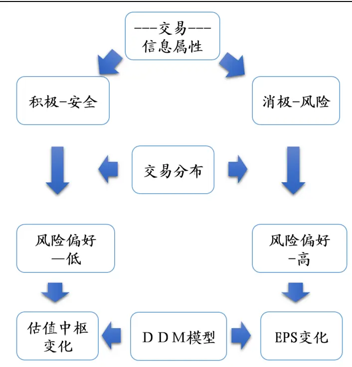
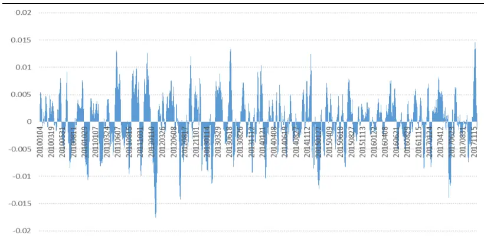
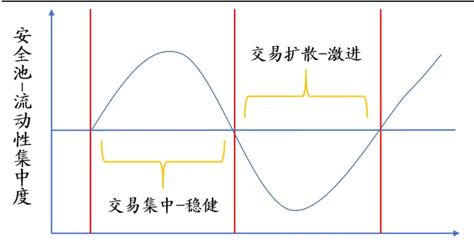
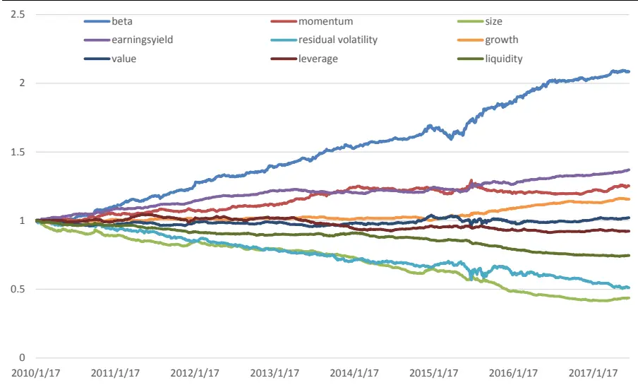
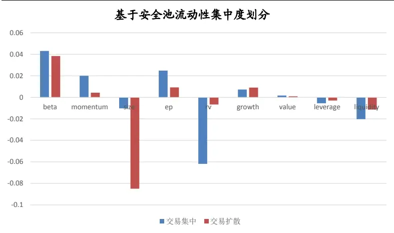
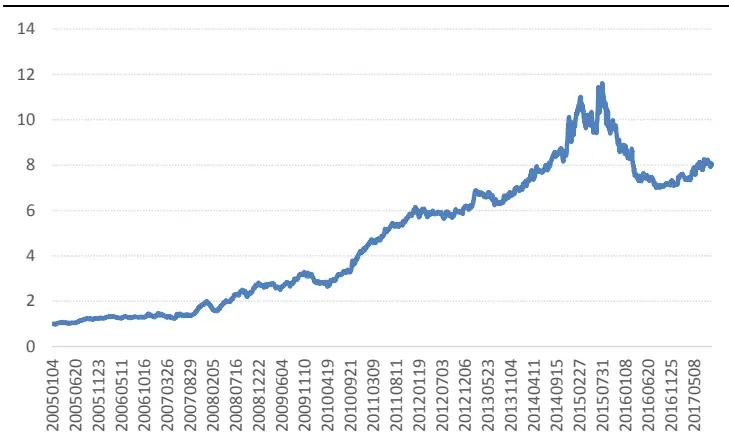

# 基于流动性偏好的风格配置策略

# ——数量化专题之一百一十一

## 玉陈奥林（分析师）

8 021-38674835

chenaolin@gtjas.com

证书编号 S0880516100001

## 本报告导读：

本文即尝试通过量化的方法刻画投资者风险偏好的变化，进而构建风格配置策略

## 摘要：

l 伴随着e_Summary] 2017 年量化产品收益的弱化，量化模型所产生 Alpha的稳定性也饱受质疑。此中，越来越多的投资者意识到风格配置的重要性，部分投资者逐渐尝试对风格进行主动暴露以博取收益。

- 我们构建了ILLIQ指标，其刻画了单位成交金额所负载的信息含量。基于此，我们进一步将全市场的股票区分为安全池和风险池。

- 根据市场流动性对于安全池和风险池的偏好情况，我们将投资者的风险偏好定义为稳健和激进两种状态。

9 大类风格因子里多数受风险偏好的影响，其收益在不同风险偏好下有显著区别。当风险偏好较低，投资者趋于稳健的时候，更倾向于配置市值大、估值低、动量强势、异质波动较低的股票。相对地，当市场风险偏好抬升，投资者逐渐变得激进的时候，其转而会配置小市值、高成长、特质收益强的股票

- 策略在过去将近 12 年的时间里累计净值达到 8.12，年化收益 19.06%。但是，策略在 2015 年 8 月-2016 年 2 月之间有较为显著的模型失效问题。

陈奥林：（分析师）

电话：021-38674835

邮箱：chenaolin@gtjas.com

证书编号：S0880516100001

## 李辰：（分析师）

电话：021-38677309

邮箱：lichen@gtjas.com

证书编号：S0880516050003

## 孟繁雪：（分析师）

电话：021-38675860

邮箱：mengfanxue@gtjas.com

证书编号：S0880517040005

## 蔡旻昊：（研究助理）

电话：021-38674743

邮箱：caiminhao@gtjas.com

证书编号：S0880117030051

## 殷明：（研究助理）

电话：021-38674637

邮箱：yinming@gtjas.com

证书编号：S0880116070042

## 叶尔乐：（研究助理）

电话：021-38032032邮箱：yeerle@gtjas.com证书编号：S0880116080361

## 李栩：（研究助理）

电话：021-38032690

邮箱：lixu019018@gtjas.com

证书编号：S0880117090067

## 杨能：（研究助理）

电话：021-38032685

邮箱：yangneng@gtjas.com

证书编号：S0880117080176

## 殷钦怡：（研究助理）

电话：021-38675855

邮箱：yinqinyi@gtjas.com

证书编号：S0880117060109

## [Table_R相关报告

《弱势环境下 A收益可观，B份额整体下跌》2018.04.22

《大类资产配置研究系列（一）控制端》2018.04.17

《基于研发投入资本化的淘金策略》2018.03.27

《大类资产配置之控制篇》2018.03.12

《资产配置之步步为营：尾部风险控制与优化》2018.03.12

## 1. 引言

2017 年，在抱团漂亮 50 的趋势背景下，大盘价值成为市场主流风格，同时亦形成了较强的赚钱效应，其持续的时间也远超历史平均水平。在风格极端分化的背景下，择时逐渐被淡化，风格配置成为主导组合收益的关键。从量化投资角度来看，本次龙头白马行情颠覆了过去较长时间小市值在Alpha 收益上的强势表现。伴随着量化产品收益的弱化，量化模型所产生Alpha 的稳定性也饱受质疑。此中，越来越多的投资者意识到风格配置的重要性，部分投资者也在原有风格中的基础上，开始尝试对部分风格进行主观暴露，并取得了不错的表现。

此前，量化投资在风格配置方向也有相应研究，但并没有形成具备较大影响力的报告。其思路主要有两个方向，其一，从内生性因素的角度来预测未来风格变化，即针对过去风格走势的内部结构演变通过机器学习等方法进行刻画，并对未来走势进行外推。然而，内生性的模型多为动量逻辑，很难找到趋势的拐点，因此，内生模型的样本外效果并不好。此后，量化研究逐渐改进为由外生因素的角度进行风格配置策略的研究。大部分研究主要从宏观经济指标和风格变化的联系出发，构建量化策略。但是，由于宏观经济指标传导到交易乃至风格变化的逻辑传导距离过长，因果关系也不够直观，导致该类模型的有效性大打折扣。因此，为了更好的对风格进行预测，降低模型在过长逻辑链中的信息损失，本文尝试从投资者风险偏好的角度出发，从交易数据中提取信息，进行风格配置。

具体来说，风格是投资者交易偏好发生变化，从而在交易过程中所产生的结果。因此，如果我们能够较好的刻画投资者交易偏好变化的过程，就可以有效的映射出未来风格的变化。我们知道，影响交易偏好发生变化的核心因素之一是风险偏好的变化，本文即尝试通过量化的方法刻画投资者风险偏好的变化，进而构建风格配置策略。

## 2. 策略逻辑

在2015年6 月的股灾之后，市场充斥着谨慎的气氛。可以明显的发现，市场大幅下行后，投资者的风险偏好乃至研究导向都发生了显著的变化。从风险偏好来说，投资者对股票安全性的重视程度大幅提升，相比此前单纯关注成长空间的大小，投资者开始重视未来成长的确定性。从研究导向来看，投资者偏好基本面研究，对炒概念和讲故事的股票倾向不断下降。既然投资者的偏好并非一成不变的，那我们能否通过量化的方法对投资者的风险偏好的变化进行刻画，从而寻找其与风格轮动之间的联系，这是我们接下来需要解决的问题。

图 1 策略逻辑框架

数据来源：国泰君安证券研究

上图形象展示了本文策略的逻辑框架，首先我们从交易中提取信息属性，并根据信息属性的方向进行划分。接下来，通过观察投资者流动性分布的变化情况，刻画投资者风险偏好的变化。具体来说，如果投资者更倾向于交易较为安全的股票，则判断此时投资者风险偏好较低，反之亦然。而风险偏好如何传导到风格变化中呢？这里，首先我们根据 DDM模型，大致可以将市场走势分为两种驱动模式，分别为分子驱动和分母驱动。分子驱动的行情中，投资者更重视公司未来业绩的变化，从而更倾向于讲故事和炒概念的股票。典型的案例类似于 2013 年创业板牛市的时期。相对地，在分母驱动的行情中，投资者更关心市场估值中枢的变化，此时也更青睐体积大、Beta高的个股。因此，当投资者风险偏好较高的时候，其更倾向于追逐公司未来成长性，从而促成分子驱动的行情，体现出来的则为成长、小市值等风格。反之，投资者风险偏好较低的时候，市场多为分母驱动的行情，此时个股之间同涨同跌的现象非常明显，同时概念股等也鲜有问津，体现出来的是价值、低波动等风格。在此基础上，接下来我们希望通过量化的方法来刻画由风险偏好到风格变化的整个故事。

## 3. 风险偏好的量化刻画

在此前逻辑框架的基础上，我们需要对整个逻辑框架中的量化细节进行落地，其中，我们需要解决 3 个核心问题。首先，如何量化定义交易中所负载的信息属性。其次，如何从流动性分布的变化刻画风险偏好的变化。最终，我们需要将整个故事落地为可操作的量化策略。

## 3.1. 信息载荷计算

首先，我们尝试对股票的安全属性进行定义。具体来看，股票的安全属性从不同的角度来看可以有不同的理解。从公司运营角度来看，业绩稳定的公司安全性较高。从流动性角度来看，市值大、成交额高的股票安全性较高。在本文中，我们尝试从交易的角度出发，将当下负载正向信息的股票定义为安全性较高的股票。由于交易是所有预期变化最终融为合力的结果，其能够较为真实地反映出当下投资者对标的股票边际预期的变化，如果当天交易负载正向信息，则我们认为该股票边际预期向好，相对较为安全。

基于以上的逻辑，我们构建了ILLIQ 指标，其刻画了单位成交金额所负载的信息含量。具体指标构建过程如下所示，其中，分子部分刻画了股票价格在日内运动路径的过程。举例来说，股票 A 某日 11 元开盘，最高价 13 元，最低价 8 元，收盘价 9 元。从 K 线涨跌来看，当日波动为2。从最高最低价来看，当日波动为5。从 ILLIQ 来看，当日波动为 8。也就是说，ILLIQ 能够最为充分的描绘股票价格运动的轨迹。在此基础上，采用市值调整后的成交金额作为分母，将股票运动路径对应于单位成交金额。简而言之，ILLIQ 反映了单位成交金额对股票价格运动所产生的影响。其中，它有两个重要的特征，首先，该指标是有方向的，如果当日ILLIQ 为正，则其负载的信息是正向的。其次，指标是有强度的，即数值越高代表信息强度越大。

$$
ILLIQ=flag*{\frac{2^{*}(high-low)-\mid close-open\mid}{amount\mid flow_{-}equity}}
$$

此外，ILLIQ 自身存在一定惯性，不同股票的ILLIQ 在量纲上有一定差异。举例来说，信息不对称程度越高的股票，其交易中所负载的信息含量也就越大，指标绝对值也就越高。因此，为了降低股票自身信息载荷惯性的影响，我们对其进行过滤处理，具体方法如下：

$$
ILLIQ\_ADJ={\frac{ILLIQ}{MA300\_ILLIQ}}
$$

我们通过使用个股过去移动平均300日指标值对指标进行过滤处理，从而使得调整后的指标在股票横截面上具备可比性。在此基础上，我们每日根据ILLIQ_ADJ 指标对所有股票进行排序，其中，排序靠前的股票代表其当日交易负载正向信息，也就越安全。相对地，排序越靠后的股票则代表股票负载负向信息，风险也相应较大。考虑到实际投资中，机构禁投池的比例大约为25%，因此，我们以75%分位为基准，将全市场所有的股票分为两个股票池，分别为安全池和风险池。

整体来说，本节我们通过构建信息载荷指标，并由此判断每只股票的安全程度。在此基础上，我们可以将全市场的股票区分为安全池和风险池。

下面，我们需要刻画投资者对两类股票池的偏好程度，从而映射出投资者风险偏好的变化。

## 3.2. 流动性集中度计算

由于流动性在时间维度上具有一定趋势性，在市场情绪较高的时候，市场交易量级会显著放大。因此，为了保证指标量纲的稳定性，我们将基于安全池和风险池的成交占比进行研究，这样就可以有效避免成交额数值波动较大的问题。在此基础上，为了保证量化策略的稳定性，我们需要有一个信号清晰、信号频率符合机构操作的量化指标。因此，我们选择类似于MACD 的DIF指标构建方法，具体如下：

流动性集中度（conct）=S日移动平均成交占比-L日移动平均成交占比

其中，S和L的参数我们参照 MACD 默认指标的12，26。

从图2中可以看出，流动性集中度指标在时间序列上处于相对稳定的状态，多空切换周期大概在 1个月左右。其中值得一提的是，该指标在2017年上半年的延续周期显著拉长，这与市场抱团大盘蓝筹的行情一致。

图 2 流动性集中度时间序列

数据来源：国泰君安证券研究

## 3.3. 风险偏好状态定义

在上一节中，我们构建了流动性集中度指标，可以看出，指标围绕零轴进行均值回复的运动。当流动性集中度指标在零轴上方时，说明市场的交易趋于向目标股票池进行集中。反之，当流动性集中度指标小于0时，说明交易逐渐向其他股票池进行扩散。具体来看，流动性追逐安全股票说明目前投资者是风险规避的，反之，投资者是风险偏好的。由此，我们根据流动性集中度情况将投资者的风险偏好对应为稳健和激进两种状态。

下面，我们将在投资者风险偏好的基础上，研究不同风格的收益表现是否在不同风险偏好状态下有显著的区别。

图 3 风险偏好状态定义

数据来源：国泰君安证券研究

## 4. 风格表现与交易偏好的联系

在上一节中，我们从流动性偏好的角度刻画了投资者风险偏好的变化，并通过量化的方法将风险偏好定义为稳健和激进两种状态。在此基础上，我们以Barra 九大类风格因子作为备选风格标的，进一步研究风险偏好状态和风格因子表现之间的联系。

图 4 展示了 Barra 九大类风格因子的溢价走势，可以看出，在足够长的时间里，直观上因子表现没有任何的周期性。或者说，因子表现长期看似是维持一个恒定斜率的运动，这也解释了为什么在 2017 年量化产品受到冲击之前，鲜有量化投资者重视因子择时的研究。但随着 Alpha 稳定性的下降，市场逐渐关注到风格因子波动的周期性。下面，希望通过风险偏好的状态对因子收益进行划分，即分别计算每个风格因子在不同状态下的平均单日收益。

图 4 风格因子表现

数据来源：国泰君安证券研究

从图5中可以看出，多数风格因子受风险偏好的影响，其收益在不同风险偏好下有显著区别。当风险偏好较低，投资者趋于稳健的时候，更倾向于配置市值大、估值低、动量强势、异质波动较低的股票，这与 2017年上半年的风格表现一致，可以统括为大盘蓝筹。相对地，当市场风险偏好抬升，投资者逐渐变得激进的时候，其转而会配置小市值、高成长、特质收益强的股票，这与高风险偏好下，市场倾向于炒主题、炒概念、炒故事的情况一致。从多因子体系的角度来看，无论风险偏好处于什么样的状态，小市值因子、动量因子和异质波动因子都可以贡献超额收益，这与我们过去 10 年的直观感受相同。但是，其产生超额收益的效率却有很大区别，其中绝大多数超额收益都来源于投资者风险偏好较高的时候。因此，风格因子的收益并不是以恒定的功率产生，而是随投资者风险偏好变化，有一定周期特征。

图 5 不同风险偏好下的因子表现

数据来源：国泰君安证券研究

## 5. 基于流动性集中度的风格配置策略

从量化投资角度来说，Barra 的风格因子框架，较为纯粹的区分了各种风格，并且有效提取每个风格因子纯粹的收益。但是，对于主动投资者来说，投资者可能更加关注投资逻辑和实际结果的贴合性。举例来说，事前我们通过判断成长因子强势，从而加大了成长因子的暴露。从事后因子表现来看，成长因子确实提供了Alpha 收益。然而，直观上来看，中证500没有沪深300收益高。也就是说，策略表现和直观感受有很大的偏差，从而导致投资者对策略的掌控性较弱，也因此降低了策略的实战价值。此外，主动投资者关心的风格只有两个核心风格，市值和价值。相比之下，类似于杠杆比率、异质波动等因子在主动投资者眼中并不可称为一种风格。

因此，为了使策略表现和投资者的直观感受更加贴合，提高策略的实际可操作性，我们以沪深300 和中证500的价差作为投资标的，构建了风格配置策略。其中，沪深300 在投资者直观感受上偏大盘价值，而中证500 相对于沪深 300 来说，直观上偏中小盘成长。所以，两个指数价差能够较好的反应价值和市值这两个核心风格。

投资标的：沪深300-中证500

回测时间：2005 年 1 月-2017 年 12 月

交易时间：当日发出信号后，次日均价交易

交易成本：双边千 3

从图6中可以看出，策略在过去将近12年的时间里累计净值达到 8.12，年化收益19.06%。但是，策略在 2015年8月-2016年 2 月之间有较为显著的模型失效问题，净值下跌 33%。具体来说，我们认为模型失效和回撤虽然都体现为净值的下降，但理念却有所区别。回撤指的是模型信号提早或延迟所导致净值发生反向运动的过程。相对于回撤，模型失效体现为模型产生收益的根本逻辑受到冲击，从而导致净值下行。本次模型失效的核心原因是证金公司等救市资金的外力冲击，也就是说，市场在股灾时的风格表现并不受市场内生性风险偏好变化影响，更多的是受救市资金偏好影响。

图 6 基于流动性偏好的风格配置净值

数据来源：国泰君安证券研究

从各年份收益来看，策略在 2015 年之前的收益显著且稳定，基本年化收益都在 25%以上。然而，策略在 2015、2016 年的收益较差，这与许多量化策略近年表现很相似。究其原因，从本质来说量化策略刻画的是市场某一个维度的内在运行机制。在平稳或封闭的市场环境下，量化策略可以锁定较为稳定的收益。然而，在外力冲击之下，市场内在机制受到影响，因而大部分量化模型都会受到波及。但是，市场自身像人体一样，存在修复机制。在外力冲击过后，随着时间的退役，市场会逐渐回复为原有内生机制。从表 1 中也可以看到，模型 2017 年的表现也相应好转。

表 1 分年度收益统计

| 年份 年收益 夏普比 |
| --- |
| 2005 23.38% 2.44319 |
| 2006 10.17% 0.95658 |
| 2007 48.17% 2.57315 |
| 2008 43.80% 2.35621 |
| 2009 13.47% 0.93245 |
| 2010 36.94% 2.42946 |
| 2011 42.63% 4.48654 |
| 2012 0.87% 0.09167 |
| 2013 13.07% 1.0596 |
| 2014 34.47% 2.36567 |
| 2015 -6.25% -0.2626 |
| 2016 -18.01% -1.4144 |
| 2017 12.38% 0.96313 |

数据来源：国泰君安证券研究

## 6. 总结与后续展望

近年来，A 股市场与国际市场日益紧密，其受外力冲击的频率和幅度比过去更加猛烈和频繁。外力冲击之下，市场原有的运行机制会发生变化，从而影响量化策略的稳定性。为了更好的适应市场的变化，提高策略的有效性，我们加大了主动量化研究的力度。理念上来说，主动量化侧重于博弈逻辑，这使得模型的生命力更久，但是，模型稳定性也相应有所下降。相比之下，传统量化更多侧重的是套利逻辑，其收益虽然稳定，但模型趋同度较高从而导致其所能承载的资金容量有限，因而生命力较为有限。研究方法来看，主动量化将赋予逻辑更多的权重，在一定程度上降低模型复杂的程度。因此，主动量化策略更像一个投资故事，其与实际投资环境的契合度更高，操作更加灵活。但是，主动量化仍将遵循严谨且稳健的论证原则。

本文从投资者风险偏好的角度出发，通过量化的方法对其进行刻画，进而构建风格配置策略。具体来说，首先我们基于交易负载的信息属性对股票的安全程度进行划分。在此基础上，我们根据市场流动性偏好刻画风险偏好状态。最后，我们深入研究了风险偏好状态和风格表现之间的联系，并构建了量化策略。整体来说，策略收益显著，年化收益 19%左右。

未来，我们将沿着主动量化研究的方向，从投资逻辑的角度出发，构建更加富有故事性的量化策略。同时，我们将更加重视模型的适用环境，以期在未来多变的市场环境中，更有效率的进行应对。

## 本公司具有中国证监会核准的证券投资咨询业务资格

## 分析师声明

作者具有中国证券业协会授予的证券投资咨询执业资格或相当的专业胜任能力，保证报告所采用的数据均来自合规渠道，分析逻辑基于作者的职业理解，本报告清晰准确地反映了作者的研究观点，力求独立、客观和公正，结论不受任何第三方的授意或影响，特此声明。

## 免责声明

本报告仅供国泰君安证券股份有限公司（以下简称“本公司”）的客户使用。本公司不会因接收人收到本报告而视其为本公司的当然客户。本报告仅在相关法律许可的情况下发放，并仅为提供信息而发放，概不构成任何广告。

本报告的信息来源于已公开的资料，本公司对该等信息的准确性、完整性或可靠性不作任何保证。本报告所载的资料、意见及推测仅反映本公司于发布本报告当日的判断，本报告所指的证券或投资标的的价格、价值及投资收入可升可跌。过往表现不应作为日后的表现依据。在不同时期，本公司可发出与本报告所载资料、意见及推测不一致的报告。本公司不保证本报告所含信息保持在最新状态。同时，本公司对本报告所含信息可在不发出通知的情形下做出修改，投资者应当自行关注相应的更新或修改。

本报告中所指的投资及服务可能不适合个别客户，不构成客户私人咨询建议。在任何情况下，本报告中的信息或所表述的意见均不构成对任何人的投资建议。在任何情况下，本公司、本公司员工或者关联机构不承诺投资者一定获利，不与投资者分享投资收益，也不对任何人因使用本报告中的任何内容所引致的任何损失负任何责任。投资者务必注意，其据此做出的任何投资决策与本公司、本公司员工或者关联机构无关。

本公司利用信息隔离墙控制内部一个或多个领域、部门或关联机构之间的信息流动。因此，投资者应注意，在法律许可的情况下，本公司及其所属关联机构可能会持有报告中提到的公司所发行的证券或期权并进行证券或期权交易，也可能为这些公司提供或者争取提供投资银行、财务顾问或者金融产品等相关服务。在法律许可的情况下，本公司的员工可能担任本报告所提到的公司的董事。

市场有风险，投资需谨慎。投资者不应将本报告作为作出投资决策的唯一参考因素，亦不应认为本报告可以取代自己的判断。
在决定投资前，如有需要，投资者务必向专业人士咨询并谨慎决策。

本报告版权仅为本公司所有，未经书面许可，任何机构和个人不得以任何形式翻版、复制、发表或引用。如征得本公司同意进行引用、刊发的，需在允许的范围内使用，并注明出处为“国泰君安证券研究”，且不得对本报告进行任何有悖原意的引用、删节和修改。

若本公司以外的其他机构（以下简称“该机构”）发送本报告，则由该机构独自为此发送行为负责。通过此途径获得本报告的投资者应自行联系该机构以要求获悉更详细信息或进而交易本报告中提及的证券。本报告不构成本公司向该机构之客户提供的投资建议，本公司、本公司员工或者关联机构亦不为该机构之客户因使用本报告或报告所载内容引起的任何损失承担任何责任。

## 评级说明

## 1.投资建议的比较标准

投资评级分为股票评级和行业评级。

以报告发布后的12个月内的市场表现为比较标准，报告发布日后的 12个月内的公司股价（或行业指数）的涨跌幅相对同期的沪深 300 指数涨跌幅为基准。

## 2.投资建议的评级标准

报告发布日后的 12 个月内的公司股价（或行业指数）的涨跌幅相对同期的沪深 300 指数的涨跌幅。

|  | 评级 | 说明 |
| --- | --- | --- |
| 股票投资评级 | 增持 | 相对沪深300指数涨幅15%以上 |
|  | 谨慎增持 | 相对沪深300指数涨幅介于5%～15%之间 |
|  | 中性 | 相对沪深300指数涨幅介于-5%～5% |
|  | 减持 | 相对沪深 300 指数下跌 5%以上 |
| 行业投资评级 | 增持 | 明显强于沪深 300 指数 |
|  | 中性 | 基本与沪深 300指数持平 |
|  | 减持 | 明显弱于沪深300指数 |

## 国泰君安证券研究所

|  | 上海 | 深圳 | 北京 |
| --- | --- | --- | --- |
| 地址 | 上海市浦东新区银城中路168号上海 银行大厦29层 | 深圳市福田区益田路 6009 号新世界 商务中心34层 | 北京市西城区金融大街 28 号盈泰中 心2号楼10层 |
| 邮编 | 200120 | 518026 | 100140 |
| 电话 | （021)38676666 | (0755)23976888 | (010)59312799 |
|  | E-mail: gtjaresearch@gtjas.com |  |  |