inInfo] [Table_Title] 2018.06.14

# 投资科技创新股：基本面成长因子再挖掘

## ——数量化专题之一百一十三

李辰（分析师）

## 李栩（研究助理）

8 021-38677309

021-38032690

lichen@gtjas.com

lixu019018@gtjas.com

证书编号 S0880516050003

S0880117090067

## 本报告导读：

本篇报告针对科技创新股投资，设计了“成长行业+研发支持+安全边际”选股框架，挖掘了逻辑与统计均显著的基本面成长因子，并构建了简单且行之有效的增强策略。摘要：

le_Summary]针对科技创新股投资，本篇报告从基本面逻辑出发，自上而下设计了一套科创股投资框架：“成长行业+研发支持+安全边际”，其中“成长行业”模块通过主观选择与量化筛选两种方法确定科创行业，“研发支持”模块挖掘了与科创行业相关的基本面成长因子，“安全边际”模块用于降低投资成长股的风险，三者紧密集合。

基于业绩波动与宏观经济波动相关程度低、成长性好以及研发支出高三条逻辑，构建了科创行业的量化筛选方法。结果表明，计算机、电子及医药行业被筛选出来的频率最高，与根据行业主营业务主观划分科创型成长行业的结果较为一致。此外，历史被筛选出来的行业的指数平均收益高于剩余行业，在过去8年间，累计相对收益 54%。

研发支持类指标考量企业研发投入水平与对研发支持的力度，主要包括研发支出、专利数、科研补助等 12个因子；安全边际类指标考量企业估值合理程度、技术与营销壁垒强度以及经营的可持续性，主要包括市研率、毛利率、总资产现金回收率等 7个因子。

在全市场、科技创新行业域分别测试了研发支持类与安全边际类因子的显著性，发现相较于全市场因子不显著或显著性不高且 IC不高的情况，两类因子在科创行业域中具有较高的 IC 且显著，从而从逻辑与统计上验证两类因子更适合在科创行业中选股。

检验了研发支持模块中基本面成长因子的长期表现，发现相较于传统成长因子衰退较快的情况，诸如研发支出、申请专利数等基本面成长因子，其累计因子收益长期稳定，呈平稳上升状态。对此，可考虑对因子进行时间序列上多周期的合成，多周期因子相较于单期因子可提升0.003左右，且显著性也有较高提升。

构建行业增强策略：首先构建不同的科技创新行业域，主观选择的“医药+TMT”板块域与单独的医药、电子、通信、计算机、传媒行业域，以及量化筛选的量化科创成长域；针对不同科创行业域，选择有效因子合成选股因子，并检验合成因子显著性，发现合成因子预测能力均有显著提升，IC为 0.04 左右；基于不同科创行业域的合成因子，在每个域中构建投资组合，相对于行业基准，收益均有增强。

在“医药+TMT”板块域、医药行业、电子行业、计算机行业域以及量化科创成长域中构建的策略，增强效果明显（年化超额收益平均在9%左右），且增强效果稳定（除了极少数年份，策略每年均能够带来正向的超额收益），此外增强策略组合拥有较低的换手（年化双边换手率平均在60%左右）。

## 金融工程团队：

陈奥林：（分析师）

电话：021-38674835

邮箱：chenaolin@gtjas.com

证书编号：S0880516100001

## 李辰：（分析师）

电话：021-38677309

邮箱：lichen@gtjas.com

证书编号：S0880516050003

## 孟繁雪：（分析师）

电话：021-38675860

邮箱：mengfanxue@gtjas.com

证书编号：S0880517040005

## 蔡旻昊：（研究助理）

电话：021-38674743

邮箱：caiminhao@gtjas.com

证书编号：S0880117030051

## 殷明：（研究助理）

电话：021-38674637

邮箱：yinming@gtjas.com

证书编号：S0880116070042

## 叶尔乐：（研究助理）

电话：021-38032032

邮箱：yeerle@gtjas.com

证书编号：S0880116080361

## 李栩：（研究助理）

电话：021-38032690

邮箱：lixu019018@gtjas.com

证书编号：S0880117090067

## 杨能：（研究助理）

电话：021-38032685

邮箱：yangneng@gtjas.com

证书编号：S0880117080176

## 殷钦怡：（研究助理）

电话：021-38675855

邮箱：yinqinyi@gtjas.com

证书编号：S0880117060109

## [Table_R相关报告

《世界杯趣文：世界杯中的超额收益》2018.06.13

《短期不悲观，长期不乐观》2018.05.27

《沪深 300 成分股调整名单》2018.05.18

《基于上市公司参股拟 IPO 企业的事件驱动研究》2018.05.11

《基于流动性偏好的风格配置策略》2018.05.03

## 1. 引言

2016年7月“十三五”国家科技创新规划发布，规划指出“十三五”时期是深入实施创新驱动发展战略的关键时期，以实现迈向创新型国家以及建设世界科技强国的目标，并详细地设定了科技进步贡献率、研发支出、研发人员占比、人均专利数等指标的目标值。相应地，证监会不断加大对科技创新企业的服务，出台了相关政策以支持符合国家发展战略，具有核心竞争力的高新技术企业和新经济新产业成长发展，进入 2018 年以来，市场对科技创新股的关注程度也在日益提升。

由此我们可以预见，在未来，科技创新企业有着巨大的发展空间，那么我们如何在二级市场中分享这些企业成长带来的收益，如何能够从众多企业中挑选出未来潜力巨大的标的，对于这些问题，我们在本篇报告中设计了一套自上而下的选股框架（成长行业+研发支持+安全边际），挖掘了非传统的基本面成长因子，并研究了这些因子长周期的使用方法，最后构建了可操作的量化投资策略，以从科技创新型成长行业中，筛选出优质的科技创新成长股，获取较高的成长股收益。

## 2. 投资框架：成长行业+研发支持+安全边际

科技创新企业身处成长行业，科技创新股投资本质上是一种成长股投资。然而，成长股投资理论及门派众多，这些传统理论能否适用于科技创新股的投资，以及还有哪些新理论可以指导我们进行投资，这需要做更加深入地研究。

在传统成长股的投资理论中，最为著名的应该是“成长股价值投资之父”菲利普·费雪的投资哲学，其认为优秀的成长企业应具有以下特点：

- 相比于同行的竞争优势（技术壁垒、成本优势）；

- 强大的研究能力、销售能力（研发产出、营销壁垒）；

- 优秀的财务治理以及管理团队（可持续经营）。

而关于新理论，我们应该更多地结合科技创新股的特点以及国内市场的情况，去考量相关的因素，例如：

- 高研发（恒瑞医药近 5年研发支出/营业收入平均在10%以上）；

- 高专利产出（海康威视近5年每年申请上百件专利）；

- 强政府支持力度（京东方 A 近 5 年获政府科研补助/营业收入均在1%以上）；

- 多方合作（科技部依托科大讯飞成立认知智能国家重点实验室）；

- 利润的质量（恒瑞医药近5年扣非归母净利润/归母净利润均接近1）等。

结合传统理论与新理论，我们将科技创新股投资具体考量的因素归为“研发支持”与“安全边际”两大类：

- 研发支持：考量企业研发投入水平以及对研发的支持力度。①研发，主要考量研发投入、专利产出、研发人数、技术人数、硕士博士人数等；②支持，主要考量科研补助、技术人员激励、合作成立实验室等。

- 安全边际：考量企业估值合理程度、技术与营销壁垒强度以及经营的可持续性。①估值，市研率等；②壁垒，总资产毛利率、毛利率、销售费用率等；③可持续性（含金量），总资产现金回收率、扣非净利润率等。

表 1:研发支持、安全边际类因子一览

| 因子类别 | 因子名称 | 频率 |
| --- | --- | --- |
|  | 研发支出/营业收入 | 半年频 |
|  | 研发费用/营业收入 | 半年频 |
|  | R&D人员占比 | 年频 |
|  | 当年申请专利数(合计) | 年频 |
|  | 当年申请专利数(发明) | 年频 |
|  | 累计有效专利数(合计) | 年频 |
|  | 累计有效专利数(发明) | 年频 |
|  | 政府补助（用于科研） | 年频 |
|  | 技术人员占比 | 年频 |
| 硕士占比 | 年频 |  |
|  | 博士占比 | 年频 |
|  | 技术人员激励权益/总股本 | 日频 |
|  | (净利润+研发支出)/总市值 |  |
|  | 研发支出/总市值 | 日频 |
|  | 毛利润/总资产 | 日频 |
|  | 毛利率 | 季频 |
|  | 销售费用率 | 季频 季频 |
|  | 扣非净利润/净利润 | 季频 |
|  | 经营性净现金流/总资产 | 季频 |

数据来源：国泰君安证券研究

至此，我们已经初步完成了投资逻辑框架的建设：首先筛选科技创新型成长行业，其次通过“研发支持”与“安全边际”两大要素进行股票的筛选。“成长行业+研发支持+安全边际”逻辑框架的优势在于：

- 针对科创行业成长的驱动因素，我们考虑了研发支持类因子，这类新的因子更加关注科创企业的基本面信息，与科创成长行业的发展逻辑更加相符；

- 针对科创行业成长过程中的高不确定性，我们考虑了有助于降低投资风险的安全边际指标；

- “成长行业”模块确定科创行业域，“研发支持”模块预测收益，“安全边际”模块降低成长股风险，三者互相配合，逻辑较为严密。

将投资逻辑框架进一步落实到量化投资策略，还需要对上述投资框架进行科学地统计检验以及回溯检验：

- 针对科技创新型成长行业的选择：我们提供了量化筛选以及后验的主观选择两种方法；

- 针对研发支持+安全边际两大要素的因子检验：我们进行了因子显著性、相关性检验，因子分成长行业域测试，因子衰退周期研究以比较上述基本面成长因子相比于统计意义上的成长因子的优势；

- 量化投资组合的构建：根据有效因子，在不同科创行业域中筛选相应标的，构建量化投资组合，统计历史表现。

图 1联立基本面逻辑与量化统计检验
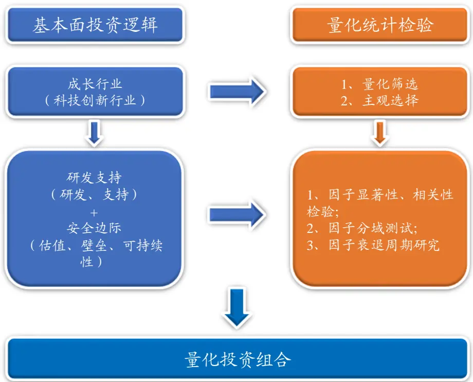
数据来源：国泰君安证券研究

## 2.1.如何选择科技创新型成长行业？

对于科技创新型成长行业的选择，我们可以采用量化筛选与主观选择两种方式，其中主观选择方法需要我们在历史中的每一时期均能够较为准确地把握业务未来可能高速增长的行业，其优点在于通过行业的主营业务判断，逻辑直接，准确性较高，缺点在于主观性强，预判困难，需要较高的专业知识与预测能力，以及其历史选择不可准确回溯，不便于进行统计检验，所以我们在本篇报告中，选择争议最小的医药与 TMT 行业（电子、通信、计算机、传媒）作为主观选择的科技创新型成长行业。而对于未来的实际投资，可以具体选择证监会科技创新咨询委员会侧重的高新技术产业和战略性新兴产业（主要包括互联网、大数据、云计算、人工智能、软件和集成电路、高端装备制造、生物医药等）。

除了主观选择方法以外，我们也可以采用量化筛选方法，量化筛选方法从科技创新行业的内在逻辑出发，基于统计结果筛选对应行业，其优点在于方法简单，易于筛选，较为客观，便于历史回溯，缺点在于逻辑不直接，可能由于过分强调共性而忽略个性，准确性有待进一步检验。对于具体的量化筛选方法，我们基于以下三条逻辑构建：

- 业绩波动与宏观经济波动相关程度较低。我们希望筛选出的行业尽可能不受宏观经济波动的干扰，其在未来的业绩增长尽可能只由自身决定，而不是由宏观经济主要带动的，另一方面，我们投资此类行业也意味着面临更低的系统性风险。

成长性好。我们希望筛选出的行业过去一段时间的行业规模（营业收入）与行业盈利情况（净利润）均处于增长状态，从而使我们投资此类行业能够享受可能的动量效应。

- 研发支出高。我们希望筛选出的行业能够与科技创新的属性更加相关，其行业的研发支出率应该处于全市场的前列。

我们对188个中信三级行业采用下述规则进行筛选：

表 2:量化科创成长域筛选方法

| 与宏观经济低相关 |  | 成长性好 | 研发支出高 |
| --- | --- | --- | --- |
| 代理变量 | 过去3年，中信三级行业净利 | 过去3年，中信三级行业营业 |  |
|  | 润同比增长率（季度）与工业 | 收入复合增长率与净利润复 | 最新一期行业研发支出/行业 |
|  | 增加值同比增长率（季度）的 | 合增长率 | 营业收入 |
|  | 相关系数 |  |  |
| 筛选阈值 | 相关系数<0.5 | 排名前2/3 | 排名前50% |

数据来源：国泰君安证券研究

根据上述筛选规则，自 2010 年 1 月至今每月对科创型成长行业进行筛选（以下称“量化科创成长域”），统计每个中信三级行业所对应的中信一级行业被筛选的平均频率（sum(一级行业所含三级行业被筛选出频率)一级行业所含三级行业个数），结果如下图，可以发现，在过去的历史中，计算机、电子及医药行业被筛选出来的频率最高，与根据行业主营业务主观划分科创型成长行业的结果较为一致。

图 2计算机、电子元器件、医药行业是科创行业主要的集中行业
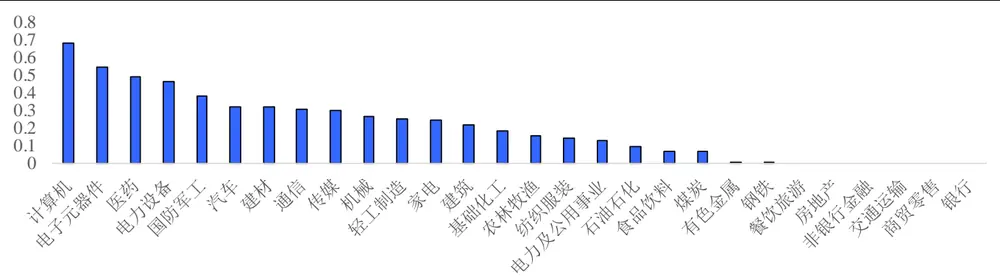
数据来源：Wind，国泰君安证券研究

历史收益：量化科创成长>医药+TMT>量化非科创成长>中证 500。对筛选出的行业指数构建月换仓等权组合，分别得到量化科创成长域、量化非科创成长域（剩余未被筛选行业）以及医药+TMT 板块基准指数。观察下图可以发现，在2010年4月30日至2018年4月 27日9年间，量化科创成长域整体收益高于医药+TMT 板块域，高于量化非科创成长域。所以长期来看，通过量化筛选科创成长行业的方法效果较好，筛选出的行业收益较为可观，累计相对收益为 54%（量化科创成长-量化非科创成长）。

图 3历史收益：量化科创成长>医药+TMT>量化非科创成长>中证 500
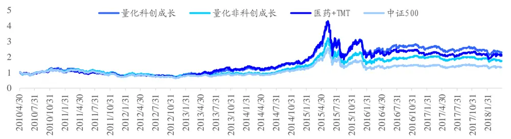
数据来源：Wind，国泰君安证券研究

截至2018年 4月末，最新一期筛选出的中信三级行业见下表：

表 3:最新一期量化筛选结果

| 最新筛选的三级行业 | 对应一级行业 | 最新筛选的三级行业 | 对应一级行业 |
| --- | --- | --- | --- |
| 塑料制品 | 基础化工 | 汽车零部件Ⅲ | 汽车 |
| 环保 | 电力及公用事业 | 小家电Ⅲ | 家电 |
| 长材 | 钢铁 | 照明设备 | 家电 |
| 树脂 | 基础化工 | 化学原料药 | 医药 |
| 日用化学品 | 基础化工 | 化学制剂 | 医药 |
| 其他化学制品 | 基础化工 | 中成药 | 医药 |
| 玻璃ⅢⅢI | 建材 | 生物医药Ⅲ | 医药 |
| 陶瓷 | 建材 | 医疗器械 | 医药 |
| 新型建材及非金属新材料 | 建材 | 调味品 | 食品饮料 |
| 造纸Ⅲ | 轻工制造 | 半导体Ⅲ | 电子元器件 |
| 包装 | 轻工制造 | 电子设备Ⅲ | 电子元器件 |
| 其他轻工Ⅲ | 轻工制造 | 增值服务Ⅲ | 通信 |
| 铁路交通设备 | 机械 | 动力设备 | 通信 |
| 仪器仪表Ⅲ | 机械 | 通信终端及配件 | 通信 |
| 金属制品Ⅲ | 机械 | 网络接配及塔设 | 通信 |
| 电站设备Ⅲ | 电力设备 | 线缆 | 通信 |
| 一次设备 | 电力设备 | 基础软件及套装软件 | 计算机 |
| 二次设备 | 电力设备 | 行业应用软件 | 计算机 |
| 光伏 | 电力设备 | 系统集成及IT咨询 | 计算机 |
| 航天军工 | 国防军工 | 专用计算机设备 | 计算机 |
| 兵器兵装Ⅲ | 国防军工 | 广播电视 | 传媒 |
| 乘用车ⅢⅢ | 汽车 | 互联网 | 传媒 |
| 专用汽车 | 汽车 | 棉纺制品 | 纺织服装 |

数据来源：Wind，国泰君安证券研究

## 2.2.为什么研发支持与安全边际指标适用于科创行业选股？

在本节，我们一方面将对研发支持与安全边际两类指标的构建逻辑做进一步地阐释，另一方面将对这些指标分行业进行观察，目的是为了更加直观地从统计层面了解这些新因子与科创行业的相关性，从而为“使用上述研发支持与安全边际指标在科创行业内选股”的投资逻辑提供更多的支持依据。

具体的观察方法是，对于某待测指标，分别计算2010 年至2017年年末各行业（中信一级行业）成分股该指标的平均值，然后观察比较其在不同行业中的情况。

## 2.2.1. 观察：研发支持类指标

研发支持类指标主要包括研发支出、专利产出等研发类指标，以及政府补助、技术人员激励等支持类指标。

从逻辑上看，科创行业其产品技术要求高，对研发的高投入以及专利的高产出不仅是其行业特征，还是其长期发展增长的核心动力。从统计上看，在过去8年里，计算机、通信、电子元器件及医药行业具有显著的高研发特征，家电、汽车、机械、电子元器件等具有制造业特征的行业具有较多的专利，这些行业均具有一定科技创新或高端制造的特征，与逻辑一致，说明这些行业发展某种程度上依赖于研发投入与专利产出。

图 4TMT、医药以及国防军工、机械等技术性行业研发投入与专利较多
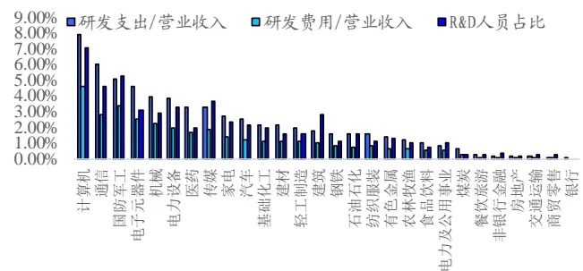
数据来源：Wind，国泰君安证券研究

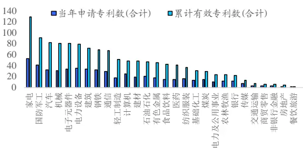

除了研发以外，在我国，政府的大力支持以及对技术人员的激励对于科创行业来说也较为重要，政府补助能够提供更多的资源，激励能够提升经营产出的效率。从统计上看，在过去 8 年里，政府对于 TMT 与医药等科创行业补助较高，且这些行业对于技术人员的激励也较高，与逻辑相符。

图 5TMT与医药行业科研补助、技术人员激励较高通过上述观察，我们发现相较于其他行业，研发支持类指标在医药与TMT等或具有高端制造业属性的科技创新型行业上有较为明显的差异，表现为较高的研发投入与研发支持力度，一定程度上表明了研发支持对于科创行业发展的重要性。作为可能的行业驱动因素，从这些行业里选取高研发支持的标的可能会产生超额收益，对此，我们将在本篇报告第3部分进行详细地统计检验。

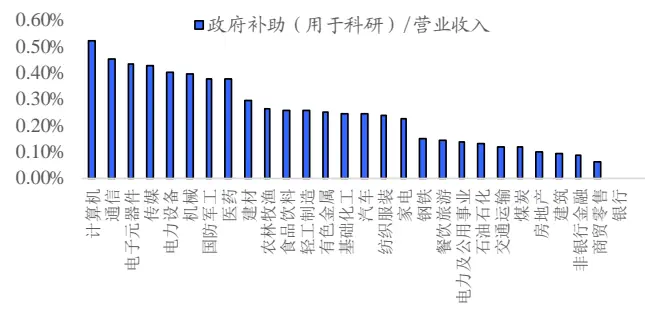
数据来源：Wind，国泰君安证券研究

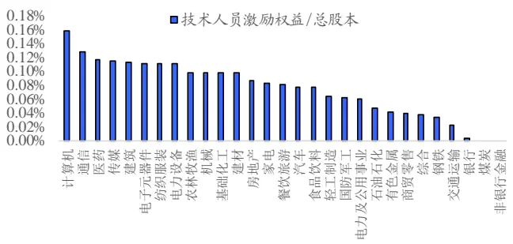

## 2.2.2. 观察：安全边际类指标

安全边际类指标主要包括毛利率、销售费用率等壁垒类指标，市研率等估值类指标，以及总资产现金回收率等可持续性指标。

从逻辑上看，科创行业技术壁垒较高，具有一定的成本优势，表现为较高的毛利率；此外，由于科创行业在当下看来，还尚属成长行业，其行业营销渠道还没有被充分建立，缺少营销壁垒，表现为较少的营业收入，从而需要较高的销售费用以扩大市场规模，如若毛利率与销售费用率均较低，说明其技术壁垒不高，营销投入不大，成长存在一定风险。从统计上看，在过去8年里，医药、计算机、传媒、通信等行业毛利率较高，医药、传媒、计算机、通信等行业销售费用率也较高，说明了科创行业存在一定的壁垒，与逻辑相符，通过壁垒类指标在这些行业域里选股，能够有效提升安全边际。

图 6医药、TMT行业毛利较高，行业存在一定技术壁垒；销售费用率较高，营销壁垒未充分建立
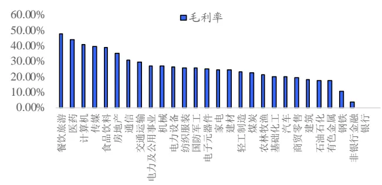
数据来源：Wind，国泰君安证券研究

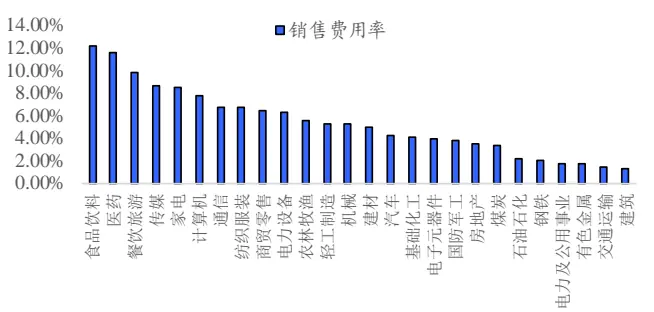

从逻辑上看，由于科创行业业绩的不确定性，传统的估值指标可能不适用于这类行业，但通过研发支出调整后的估值指标可以反映科创行业的价值；此外，由于科创行业产出的周期偏长，我们可以不过分要求利润，但经营净现金流必不可少，如果长期过低的经营现金流，将为可持续成长带来较高的风险。从统计上看，医药与TMT等科创行业的估值不低，总资产现金回收率不高，具有一定的风险。

图 7TMT、医药行业估值不低，总资产现金回收率不高，存在一定风险
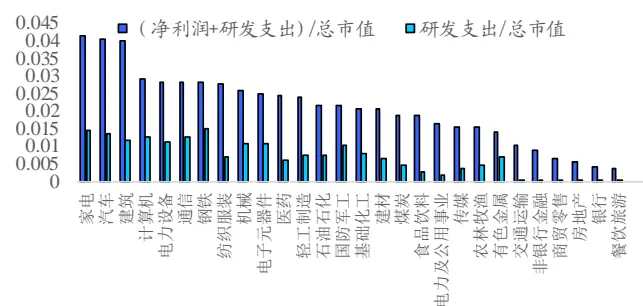
数据来源：Wind，国泰君安证券研究

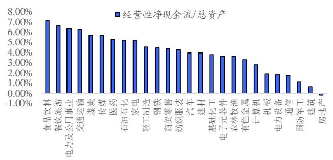

研发支持类指标驱动了科创企业的成长，但同时科创企业的成长也具有较高的不确定性，而安全边际类指标可为投资科创成长股降低一定不确定性。在科技创新型行业中，将研发支持与安全边际两类指标结合运用作为选股依据，可能会产生超额收益。对此我们进行了详细的统计检验，同样将在本篇报告第3 部分进行展示。

## 3. 单因子测试

在上文我们构建了科技创新股投资框架“成长行业+研发支持+安全边际”，并阐释了其构建的逻辑。在本章节，我们将对上述研发支持与安全边际类指标进行详细地统计检验，检验分为三个步骤：显著性检验与分域测试、相关性检验以及衰退期研究。

## 3.1.因子显著性检验及分域测试

显著性检验：检验研发支持及安全边际类指标与下一期收益之间的相关程度，通过计算经行业、十大类风格调整后的因子与经行业、十大类风格调整后收益的Pearson 相关系数，可得到因子的 IC及相应的t统计量。基于上述方法进行因子显著性检验，基于 2010 年 1 月至 2017 年 12 月数据的检验结果见下图，可以发现：

- 研发支持类因子在全域具有一定的显著性，但因子预测能力较低，因子IC 大多在0.01左右。

- 安全边际类因子在全域显著性较差，仅有市研率的倒数与销售费用率较显著，但因子预测能力较低，均不超过0.015。

图 8 因子显著性检验结果

| 因子类别 因子名称 | 全域IC |  | 量化科创成长域 |  |  | 医药+TMT板块域 |  |  |
| --- | --- | --- | --- | --- | --- | --- | --- | --- |
|  |  |  | t-stat | IC t-stat |  |  | IC t-stat |  |
| 研发支出/营业收入研发费用/营业收入R&D人员占比当年申请专利数(合计)当年申请专利数(发明)累计有效专利数(合计)研发支持累计有效专利数(发明)政府补助（用于科研）/营业收入技术人员占比硕士占比博士占比技术人员激励权益/总股本 | 0.0152 | 2.59 | 0.0234 |  | 2.92 | 0.0262 |  | 3.4 |
|  | 0.0104 | 1.27 | 0.0180 |  | 1.76 | 0.0251 |  | 2.26 |
|  | 0.0041 | 0.84 | 0.0142 |  | 1.93 | 0.0067 |  | 0.98 |
|  | 00108 | 3.39 | 0.0185 |  | 3.53 | 0.0156 |  | 3.01 |
|  | 0.0103 | 3.23 | 0.0204 |  | 3.87 | 0.0166 |  | 3.07 |
|  | 0.0100 | 3.19 | 0.0144 |  | 2.72 | 0,0107 |  | 1.94 |
|  | 0.0099 | 3.1 | 0,0120 |  | 2.3 | 0.0105 |  | 1.67 |
|  | 0.0157 | 4.51 | 0.0148 |  | 2.79 | 0.0156 |  | 2.7 |
|  | 0.0095 | 2.3 | 0.0182 |  | 2.86 | 0.0152 |  | 2.28 |
|  | 0.0115 | 3.11 | 0.0101 |  | 1.99 | 0.0167 |  | 2.88 |
|  | 0.0080 | 3.07 | 0.0174 |  | 3.36 | 0.0130 |  | 2.16 |
|  | 0.0094 | 2.65 | 0.0133 |  | 2.23 | 0.0084 |  | 1.8 |
| (净利润+研发支出)/总市值研发支出/总市值毛利润/总资产安全边际 毛利率销售费用率扣非净利润/净利润经营性净现金流/总资产 | 0.0043 | 0.93 | 0.0168 |  | 2.21 | 0.0191 |  | 2.54 |
|  | 0.0099 | 2.94 | 0.0260 |  | 4.7 | 0.0262 |  | 4.57 |
|  | 0.0069 | 1.21 | 0.0201 |  | 3.07 | 0.0219 |  | 3.54 |
|  | 0.0066 | 1.3 | 0.0147 |  | 1.97 | 0.0118 |  | 1.62 |
|  | 0.0147 | 3.81 | 0.0263 |  | 4.4 | 0.0200 |  | 3.03 |
|  | 0.0035 | 1.12 | 0.0054 |  | 0.95 | 0.0040 |  | 0.72 |
|  | 0.0061 | 1.74 | 0.0141 |  | 2.69 | 0.0096 |  | 1.73 |
| 传统成长因子 EPS同比增长率(对比用) 近5年营收复合增长率 | 0.0264 | 5.24 | 0.0255 |  | 4.41 | 0.0319 |  | 4.9 |
|  | 0.0046 | 1.22 | 0.0061 1.17 |  |  | 0.0065 1.11 |  |  |

数据来源：Wind，国泰君安证券研究

分域测试：分别截取量化科创成长域以及主观选择的医药+TMT 板块域标的的残差截面与残差收益计算 Pearson 相关系数，可得到分域 IC 及 t统计量。基于该方法对因子进行分域测试，测试结果见上表，可以发现：

- 无论在量化科创成长域还是医药+TMT 板块域，研发支持类因子预测能力均有一定地提升，尤其是研发支出/营业收入、研发费用/营业收入以及当年申请专利数，IC 提升较大，显著性也有一定的提升。

- 无论在量化科创成长域还是医药+TMT 板块域，安全边际类因子预测能力以及显著性均有一定地提升。

综上，通过比较全域显著性检验与分域测试的结果，我们可以发现大多数研发支持及安全边际类因子在成长行业域均能够提升选股效果。但是，无论全域还是分域，上述因子相较于传统统计层面上的成长因子，例如短周期成长 EPS 同比增长率因子，其 IC 仍然较低；但这些基于基本面构建的因子的优势在于，因子收益持续时间长，能够长期对标的收益产生影响，对此我们将在 3.3中进行详细地研究。

## 3.2.因子相关性检验

一个新的因子是否能够加入到我们的投资体系中，首先应该考察的是，其是否提供了不同于我们已知信息的增量信息，如果该“新因子”仅仅是我们已知信息的不同组合，那么其对于投资的实际意义将大大下降；也就是说，只有当我们构造的“新因子”与已有因子不存在明显相关性时，才可将该“新因子”用于后续研究与投资中。在本小节中，我们将计算上述因子与十大类风格因子以及传统成长因子之间的相关性，完成相关性检验步骤。

研发支持类因子与风格及传统成长因子相关程度不高。具体而言，研发支出因子与低杠杆有一定相关性，专利与大市值有一定相关性，政府补助与高估值低盈利有一定相关性，其余相关程度均不高。

图 9研发支持类因子与风格因子、传统成长因子相关性不高

|  | Beta | Momentum | Size | Earnings Yield Residual Volatility Growth |  |  | BTOPLeverage L |  | iquidity Non Linear Size YOY_EP |  |  | S SGRO |
| --- | --- | --- | --- | --- | --- | --- | --- | --- | --- | --- | --- | --- |
| 研发支出/营业收入 | 0.01 | 0.05 | 0.00 | -0.18 | 0.17 | 0.09 | -0.27 | -0.32 | 0.15 | 0.01 | 0.02 | -0.01 |
| 研发费用/营业收入R&D人员占比 | 0.03 | 0.02 | 0.00 | -0.12 | 0.11 | 0.06 | -0.17 | -0.20 | 0.10 | 0.01 | 0.03 | 0.00 |
|  | 0.05 | -0.03 | 0.01 | -0.09 | 0.06 | 0.07 | -0.12 | -0.13 | 0.07 | 0.00 | 0.06 | -0.01 |
| 当年申请专利数(合计) | 0.01 | 0.01 | 0.31 | 0.09 | -0.07 | 0.04 | 0.05 | 0.01 | -0.11 | -0.06 | 0.05 | -0.01 |
| 当年申请专利数(发明)累计有效专利数(合计) | 0.00 | 0.01 | 0.34 | 0.07 | -0.07 | 0.04 | 0.04 | 0.02 | -0.12 | -0.05 | 0.05 | -0.01 |
|  | 0.00 | 0.02 | 0.27 | 0.06 | -0.06 | -0.01 | 0.02 | -0.04 | -0.09 | -0.07 | -0.01 | 0.00 |
| 累计有效专利数(发明) | -0.02 | 0.02 | 0.31 | 0.04 | -0.08 | -0.01 | 0.01 | -0.02 | -0.12 | -0.05 | -0.02 | 0.01 |
| 政府补助（用于科研）技术人员占比硕士占比 | 0.00 | 0.02 | -0.06 | -0.21 | 0.13 | 0.05 | -0.20 | -0.21 | 0.16 | 0.03 | -0.03 | -0.03 |
|  | 0.04 | 0.01 | 0.04 | -0.10 | 0.12 | 0.08 | -0.15 | -0.10 | 0.09 | 0.02 | 0.05 | 0.01 |
|  | 0.02 | 0.02 | 0.15 | -0.02 | 0.03 | 0.08 | -0.08 | -0.02 | -0.03 | 0.02 | 0.08 | 0.02 |
| 博士占比 | 0.01 | 0.02 | 0.07 | -0.06 | 0.03 | 0.05 | -0.10 | -0.07 | 0.03 | 0.00 | 0.04 | 0.02 |
| 技术人员激励权益/总股本 | -0.03 | 0.05 | 0.03 | 0.01 | 0.04 | 0.09 | -0.11 | -0.09 | 0.03 | -0.01 | 0.08 | 0.04 |

数据来源：Wind，国泰君安证券研究

安全边际类因子与风格及传统成长因子相关程度不高。具体而言，研发支出调整后的EP 因子与高盈利有一定相关性，毛利润/总资产、毛利率、销售费用率与高估值低杠杆有一定相关性，经营性净现金流/总资产与高盈利有一定的相关性，其余相关程度均不高。

图 10 安全边际类因子与风格因子、传统成长因子相关性不高

|  | Beta | Momentum | Size |  | Earnings Yield Residual Volatility Growth BTOP |  |  |  |  | Leverage Liquidity Non Linear Size YOY_EPS SGRO |  |  |
| --- | --- | --- | --- | --- | --- | --- | --- | --- | --- | --- | --- | --- |
|  |  |  |  |  |  |  |  |  |  |  | 0.06 | 0.11 |
| (净利润+研发支出)/总市值 | 0.02 | -0.02 | 0.19 | 0.40 | -0.17 | -0.01 | 0.15 | -0.03 | -0.14 | -0.03 |  |  |
| 研发支出/总市值 | 0.06 | -0.08 | 0.02 | 0.03 | -0.04 | -0.03 | 0.14 | 0.01 | -0.02 | 0.00 | -0.04 | -0.04 |
| 毛利润/总资产 | -0.17 | 0.14 | 0.11 | 0.13 | -0.06 | 0.00 | -0.37 | -0.45 | -0.08 | -0.04 | 0.11 | 0.11 |
| 毛利率 | -0.13 | 0.09 | 0.09 | 0.11 | -0.05 | 0.02 | -0.24 | -0.26 | -0.05 | -0.02 | 0.05 | 0.08 |
| 销售费用率 | -0.14 | 0.05 | 0.00 | -0.13 | 0.00 | -0.05 | -0.26 | -0.33 | 0.02 | -0.02 | -0.07 | 0.00 |
| 扣非净利润/净利润 | -0.03 | 0.00 | 0.06 | 0.08 | -0.06 | 0.01 | -0.02 | -0.03 | -0.09 | -0.02 | 0.06 | -0.12 |
| 经营性净现金流/总资产 | -0.12 | 0.10 | 0.10 | 0.25 | -0.13 | -0.10 | -0.09 | -0.19 | -0.14 | -0.04 | -0.02 | 0.10 |

数据来源：Wind，国泰君安证券研究

## 3.3.因子衰退期研究：长期因子的应用

从逻辑上看，这些基于基本面构建的研发支持类成长因子相比于传统统计意义上的成长因子，对公司未来的影响持续性更强：诸如研发支出这种流量指标，当年的投入反映了为长期发展所付出的成本，往往在未来才能变现，每年的积累，可创造量变到质变的价值，例如开发出有技术壁垒或受专利保护的高尖端产品。

从统计上看，研发支出、研发费用、申请专利数的累计因子收益平稳上升，而 EPS同比增长率累计因子收益衰减较迅速。通过当下因子截面及此后每天风险因子构成的截面因子与此后每天收益率做横截面回归，可得到当天因子收益，累加每天因子收益后再求算数平均，可得到以下因子累计因子收益曲线。通过曲线可以发现，研发支出、研发费用、申请专利数累计因子收益在250 个交易日后仍处于缓慢上升状态，而EPS同比增长率累计因子收益在60 个交易日后逐渐衰减。

## 图 11研发支出与申请专利数等基本面成长因子累计因子收益稳定上升

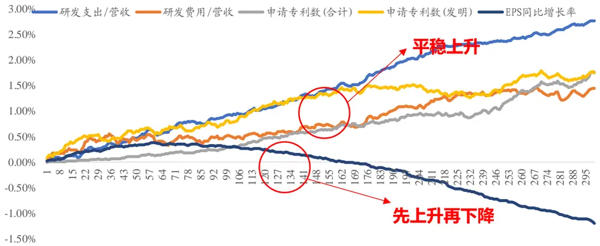
数据来源：Wind，国泰君安证券研究

上述结果表明，研发支出、研发费用、当年申请专利数等 4 个因子长期表现较好，在次年仍能带来一定的边际贡献，对此，我们可以考虑将此类长期因子在时间序列上进行多周期合成。因子合成的方法具体有等权、IC、ICIR 等，这里我们采用等权进行合成，然后观察因子检验结果。

两年平均合成因子相比于单期因子，IC均有提升。通过下图可以发现，研发支出、研发费用以及当年申请专利数两年平均因子的预测能力相比于最新一期截面因子均有显著提升。所以，在未来的研究或实际投资中，对于这些因子逻辑作用期较长，且因子收益缓慢稳定上升或衰退较慢的因子，可以考虑对其进行多周期合成处理后使用。在接下来的研究中，对于这4 个因子，我们均将使用两年平均的因子值。

图 12 多周期合成因子相比于单期因子 IC 与显著性均有提升

| 处理方式 | 因子名称 | 全域 |  | 量化科创成长域 |  | 医药+TMT |  |
| --- | --- | --- | --- | --- | --- | --- | --- |
|  |  | IC | t-stat | IC | t-stat | IC | t-stat |
| 两年平均 | 研发支出/营业收入 | 0.0173 | 2.88 | 0.0314 | 3.67 | 0.0292 | 3.74 |
|  | 研发费用/营业收入 | 0.0128 | 1.5 | 0.0275 | 2.51 | 0.0277 | 2.44 |
|  | 当年申请专利数(合计) | 0.0116 | 3.61 | 0.0222 | 3.32 | 0.0172 | 3.3 |
|  | 当年申请专利数(发明) | 0,0119 | 3.57 | 0.0252 | 3.54 | 0.0168 | 3.01 |
| 单期因子对照 | 研发支出/营业收入 | 0.0152 | 2.59 | 0.0287 | 3.39 | 0.0262 | 3.4 |
|  | 研发费用/营业收入 | 0.0104 | 1.27 | 0.0246 | 2.34 | 0.0251 | 2.26 |
|  | 当年申请专利数(合计) | 0.0108 | 3.39 | 0.0209 | 3.11 | 0.0156 | 3.01 |
|  | 当年申请专利数(发明) | 0.0103 | 3.23 | 0.024 | 3.38 | 0.0166 | 3.07 |

数据来源：Wind，国泰君安证券研究

## 4. 科技创新股投资策略构建

在本节，我们将基于“成长行业+研发支持+安全边际”的投资框架与第 3部分的因子测试结果，构建科技创新股投资策略。本节成长行业采用主观选择方法，即医药+TMT 板块，对于量化筛选方法所得到的量化科创成长域的策略构建，详见附录 6.2。策略构建的步骤有三：

- 首先，分别对于医药+TMT板块域以及单独的医药行业、电子行业、通信行业、计算机行业、传媒行业域，选用统计检验显著的因子基于一定规则合成选股指标，并检验合成因子的显著性；

- 其次，通过检验后显著的合成选股指标，分别从各个域中选取标的，构建投资组合，并与各自基准比较，验证策略有效性。

## 4.1.合成因子方法及显著性检验

考虑到因子的稳健性以及对未来收益的预测能力，我们用于合成的因子需要满足下述条件：首先，因子分域 IC 序列 t 检验显著；其次，因子分域 IC 需大于 0.015。对于 4.1 中构建的每个域，通过上述条件筛选有效的因子见下表（研发支出、研发费用、当年申请专利因子均为两年平均值）：

表 4:各行业域有效因子一览

|  | 研究支持 |  |  | 安全边际 |  |  |
| --- | --- | --- | --- | --- | --- | --- |
|  | 因子名称 | IC | t-stat | 因子名称 | IC | t-stat |
| 医药+TMT板块域 | 研发支出/营业收入 | 0.0292 | 3.74 | (净利润+研发支出)/总市值 | 0.0191 | 2.54 |
|  | 研发费用/营业收入 | 0.0277 | 2.44 | 研发支出/总市值 | 0.0262 | 4.57 |
|  | 当年申请专利数(合计) | 0.0172 | 3.30 | 毛利润/总资产 | 0.0219 | 3.54 |
|  | 当年申请专利数(发明) | 0.0168 | 3.01 | 销售费用率 | 0.0200 | 3.03 |
|  | 政府补助（用于科研）/营业收入 | 0.0156 | 2.70 |  |  |  |
|  | 技术人员占比 | 0.0152 | 2.28 |  |  |  |
|  | 硕士占比 | 0.0167 | 2.88 |  |  |  |
|  | 研发支出/营业收入 | 0.032 | 2.75 | 研发支出/总市值 | 0.0208 | 1.99 |
| 医药行业 | 研发费用/营业收入 | 0.034 | 1.98 | 毛利率 | 0.0176 | 1.83 |
|  |  |  |  | 销售费用率 | 0.0187 | 1.84 |
|  |  |  |  | 经营性净现金流/总资产 | 0.0163 | 1.80 |
|  | 研发支出/营业收入 | 0.028 | 2.29 | (净利润+研发支出)/总市值 | 0.0263 | 2.32 |
| 电子行业 | 当年申请专利数(合计) | 0.045 | 4.54 | 研发支出/总市值 | 0.0288 | 3.03 |
|  | 当年申请专利数(发明) | 0.043 | 4.51 | 毛利润/总资产 | 0.0288 | 2.66 |
|  | 累计有效专利数(合计) | 0.029 | 3.06 | 销售费用率 | 0.0337 | 2.78 |
|  | 累计有效专利数(发明) | 0.023 | 2.41 |  |  |  |
|  | 政府补助（用于科研） | 0.035 | 3.13 |  |  |  |
|  | 硕士占比 | 0.020 | 1.95 |  |  |  |
|  | 博士占比 | 0.021 | 2.15 |  |  |  |
|  | 研发支出/营业收入 | 0.034 | 2.59 |  |  |  |
| 通信行业 | 硕士占比 | 0.039 | 2.96 |  |  |  |
|  | 研发支出/营业收入 | 0.030 | 2.23 | (净利润+研发支出)/总市值 | 0.0334 | 2.64 |
| 计算机行业 传媒行业 | 政府补助（用于科研） | 0.023 | 2.07 | 研发支出/总市值 | 0.0287 | 2.31 |
|  | 技术人员激励权益/总股本 | 0.021 | 2.13 | 销售费用率 | 0.0243 | 2.06 |
|  | 技术人员激励权益/总股本 | 0.044 | 2.19 |  |  |  |

数据来源：Wind，国泰君安证券研究

通过上表的统计结果可以发现，“成长行业+研发支持+安全边际”的选股框架更加适用于在医药+TMT板块域以及医药、电子、计算机行业内做选股增强。接下来我们将基于合成因子做进一步检验：对于上述6个域中各自的有效因子，我们分别对它们做z-score标准化处理，然后等权合成，最后分别检验上述6个域中各自的合成因子的显著性，合成因子 IC较单因子均有提升。

表 5:各行业域合成因子检验结果

| 合成因子 | IC | t-stat |
| --- | --- | --- |
| 医药+TMT 板块域 | 0.037 | 4.98 |
| 医药行业 | 0.034 | 3.06 |
| 电子行业 | 0.054 | 5.17 |
| 通信行业 | 0.030 | 2.50 |
| 计算机行业 | 0.040 | 3.31 |
| 传媒行业 | 0.044 | 2.19 |

数据来源：Wind，国泰君安证券研究

2010年2月至 2018年 1月，医药+TMT板块域、医药行业、电子行业、计算机行业合成因子 IC 序列较为稳定，通信行业、传媒行业合成因子IC 序列稳定性较差。

图 13医药+TMT板块域、医药行业、电子行业、计算机行业合成因子 IC序列较为稳定
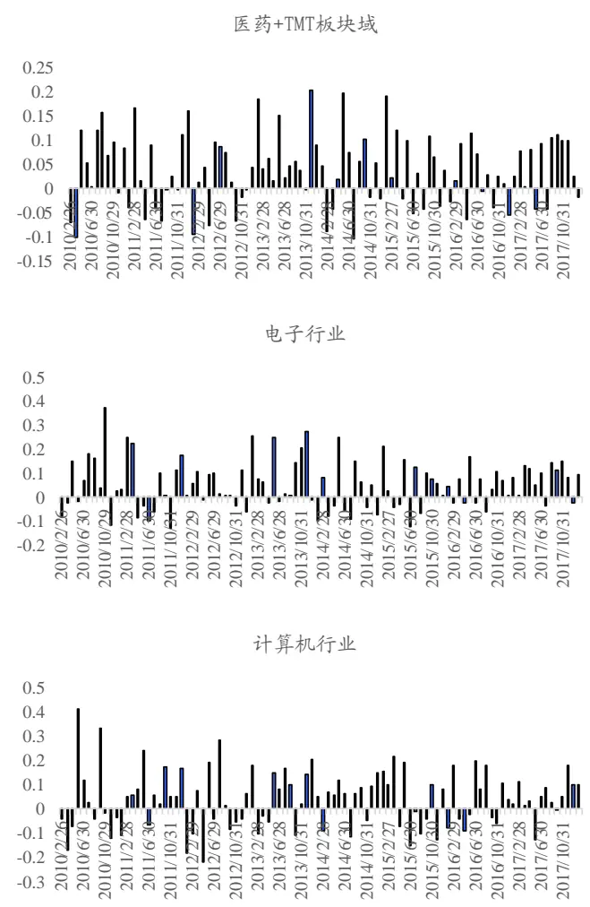
数据来源：Wind，国泰君安证券研究

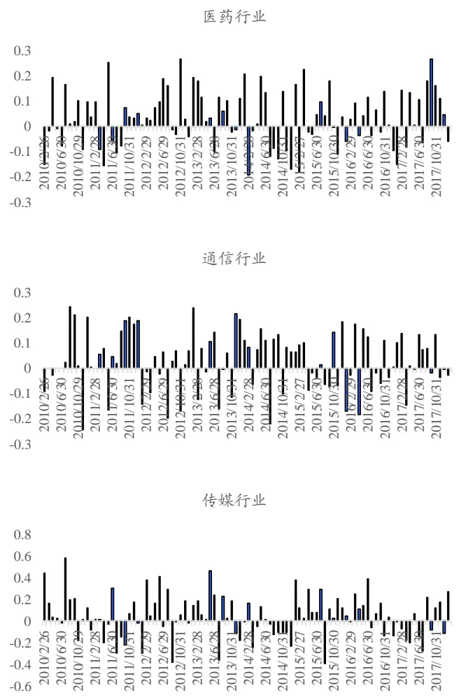

## 4.2.行业增强策略构建

在本小节，我们将基于 4.1 中构建的合成因子，分别对医药+TMT 板块域以及单独的医药、电子、通信、计算机、传媒行业构建行业增强策略，检验策略有效性，并对所构建组合进行业绩归因分析。具体的策略构建方法如下：

- 标的选取方法：对于上述某个域，对该域合成因子值进行排序，选取该域排名前 50 的标的（对于医药、电子、通信、计算机、传媒单一行业构建的策略，由于行业成分股数量较少，医药、电子、计算机过去8年月平均成分股数量不超过 200，故选取排名前 30的标的，而通信、传媒月平均成分股数量不超过 80，故选取排名前 15的标的）；

- 标的换仓时间：每年 4月末、8 月末以及10 月末（一年三次，财报期后）；

- 交易手续费：单边千分之三；

- 加权方式：等权；

- 比较基准：行业指数等权组合或行业指数；

- 回溯检验区间：2010 年 4 月 30 日至 2018 年 4 月 27 日。

## 4.2.1. 医药+TMT 板块域增强策略

医药+TMT 板块域增强策略 2010 年 4 月末至 2018 年 4 月末累计收益370%，同期基准指数累计收益 105%，超额收益 264%，增强效果显著。从医药+TMT 板块域选取合成因子排名前 50 的标的构建季度换仓等权组合，基准设定为对应的行业等权指数（通过5个中信一级行业对应的行业指数构建等权月换仓组合）。

图 14医药+TMT板块域增强策略历史超额收益 264%
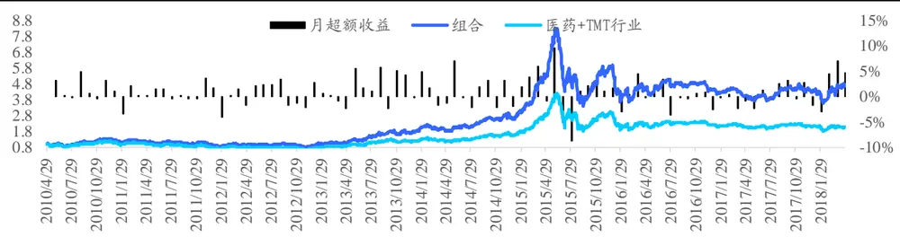
数据来源：Wind，国泰君安证券研究

医药+TMT板块域增强策略年化收益 21.33%，年化超额收益 11.01%，年化双边换手率为 63%，增强效果稳定。分年度来看，每年均能跑赢基准指数，除了 2015 年股灾时出现较大回撤以外，其余年份最大回撤均不超过9%，策略稳定性较好，信息比率为1.15。

表 6:医药+TMT板块域增强策略年化收益 21.33%，年化超额收益 11.01%

| 年份 | 年绝对收益 | 年绝对波动 | 夏普比率 | 最大回撤 | 年超额收益 | 年超额波动 | IR | 最大回撤 | 月超额胜率 | 年化换手率 |
| --- | --- | --- | --- | --- | --- | --- | --- | --- | --- | --- |
| 2010 | 27.62% | 26.09% | 1.07 | -19.3% | 15.88% | 6.44% | 2.34 | -3.97% | 75% | 45% |
| 2011 | -26.42% | 24.61% | -1.13 | -28.5% | 6.41% | 5.43% | 1.18 | -3.61% | 67% | 75% |
| 2012 | -0.86% | 26.61% | 0.10 | -28.2% | 3.42% | 6.54% | 0.55 | -8.30% | 58% | 68% |
| 2013 | 90.15% | 31.27% | 2.22 | -14.3% | 19.45% | 9.01% | 2.03 | -5.45% | 67% | 70% |
| 2014 | 45.38% | 25.54% | 1.60 | -17.9% | 12.79% | 7.61% | 1.63 | -3.64% | 50% | 62% |
| 2015 | 125.85% | 54.73% | 1.77 | -59.3% | 14.40% | 17.45% | 0.86 | -18.17% | 75% | 68% |
| 2016 | -24.04% | 37.57% | -0.54 | -37.6% | 1.46% | 5.74% | 0.28 | -6.26% | 50% | 52% |
| 2017 | -2.96% | 20.44% | -0.05 | -17.6% | 1.92% | 7.23% | 0.30 | -6.78% | 42% | 59% |
| 2018~ | 9.62% | 20.88% | 0.55 | -20.5% | 13.46% | 8.63% | 1.53 | -6.52% | 75% | - |
| 总体 | 21.33% | 33.29% | 0.75 | -59.3% | 11.01% | 9.44% | 1.15 | -18.17% | 60% | 63% |

数据来源：Wind，国泰君安证券研究

对策略组合进行业绩归因分析，可以发现选股贡献了较高的正向收益，而市值贡献了负收益。

图 15医药+TMT板块域增强策略选股收益显著
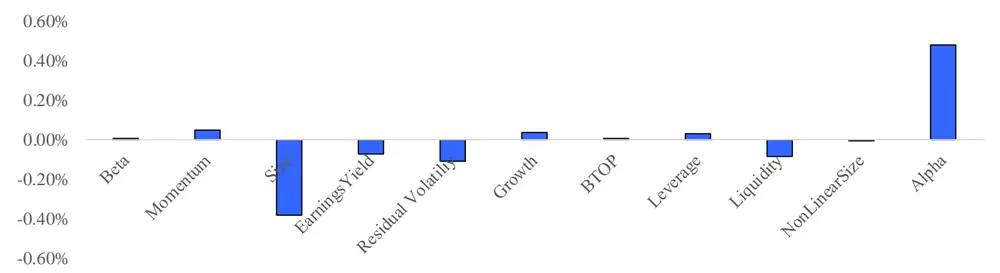
数据来源：Wind，国泰君安证券研究

## 4.2.2. 医药行业增强策略

医药行业增强策略 2010年 4月末至 2018年 4月末累计收益 342%，同期基准指数累计收益 127%，超额收益 215%，增强效果显著。从中信一级医药行业指数成分股内选取合成因子排名前 30 的标的构建季度换仓等权组合，基准设定为中信一级医药行业指数。

图 16医药行业增强策略历史超额收益 215%
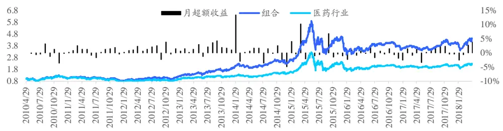
数据来源：Wind，国泰君安证券研究

医药行业增强策略年化收益 20.42%，年化超额收益 8.58%，年化双边换手率为 66%，增强效果稳定。分年度来看，除了 2016 年略低于基准以外，其余年份均跑赢基准指数，除了 2015 年股灾时出现较大回撤以外，其余年份最大回撤均不超过 8%，策略稳定性较好，信息比率为 1.03。

表 7:医药行业增强策略年化收益 20.42%，年化超额收益8.58%

| 年份 | 年绝对收益 | 年绝对波动 | 夏普比率 | 最大回撤 | 年超额收益 | 年超额波动 | IR | 最大回撤 | 月超额胜率 | 年化换手率 |
| --- | --- | --- | --- | --- | --- | --- | --- | --- | --- | --- |
| 2010 | 15.04% | 26.67% | 0.66 | -25.0% | 0.76% | 5.64% | 0.16 | -4.66% | 25% | 55% |
| 2011 | -24.54% | 23.42% | -1.09 | -27.1% | 7.85% | 5.25% | 1.47 | -4.11% | 75% | 70% |
| 2012 | 25.85% | 24.17% | 1.08 | -15.7% | 14.30% | 6.10% | 2.23 | -3.40% | 83% | 65% |
| 2013 | 66.92% | 26.98% | 2.04 | -14.3% | 21.75% | 8.00% | 2.51 | -3.44% | 92% | 68% |
| 2014 | 25.91% | 21.86% | 1.17 | -17.0% | 6.98% | 8.16% | 0.87 | -7.79% | 58% | 68% |
| 2015 | 95.32% | 46.65% | 1.68 | -47.3% | 15.19% | 14.67% | 1.04 | -12.25% | 33% | 74% |
| 2016 | -16.42% | 30.57% | -0.43 | -31.8% | -2.24% | 6.74% | -0.30 | -4.30% | 42% | 51% |
| 2017 | 6.99% | 16.22% | 0.50 | -10.9% | 2.73% | 6.69% | 0.44 | -5.50% | 58% | 70% |
| 2018~ | 10.28% | 15.50% | 0.72 | -16.6% | 3.26% | 4.74% | 0.71 | -5.13% | 50% | - |
| 总体 | 20.42% | 28.81% | 0.79 | -48.3% | 8.58% | 8.31% | 1.03 | -13.55% | 59% | 66% |

数据来源：Wind，国泰君安证券研究

对策略组合进行业绩归因分析，可以发现选股贡献了较高的正向收益，而Beta与市值贡献了较高的负收益。

图 17医药行业域增强策略选股收益显著
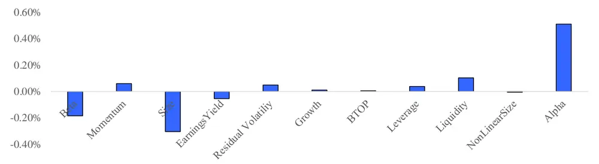
数据来源：Wind，国泰君安证券研究

## 4.2.3. 电子行业增强策略

电子行业增强策略 2010年 4月末至 2018年 4月末累计收益 282%，同期基准指数累计收益 131%，超额收益 151%，增强效果显著。从中信一级电子元件器行业指数成分股内选取合成因子排名前 30 的标的构建季度换仓等权组合，基准设定为中信一级电子元器件行业指数。

图 18电子行业增强策略历史超额收益 151%电子行业增强策略年化收益 18.23%，年化超额收益 5.58%，年化双边换手率为53%。分年度来看，除了2015年相对基准表现较差、2012年略低于基准收益以外，其余年份均战胜基准指数，除了 2015 年股灾时出现较大回撤以外，其余年份最大回撤均不超过7%，策略稳定性较好，信息比率为0.69。

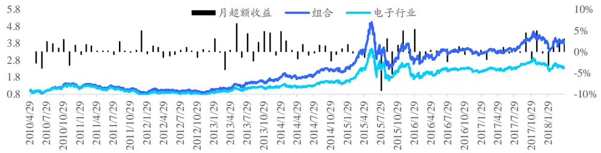
数据来源：Wind，国泰君安证券研究

表 8:电子行业增强策略年化收益 18.23%，年化超额收益5.58%

| 年份 | 年绝对收益 | 年绝对波动 | 夏普比率 | 最大回撤 | 年超额收益 | 年超额波动 | IR | 最大回撤 | 月超额胜率 | 年化换手率 |
| --- | --- | --- | --- | --- | --- | --- | --- | --- | --- | --- |
| 2010 | 35.01% | 28.92% | 1.19 | -19.3% | 3.88% | 9.20% | 0.46 | -6.89% | 63% | 45% |
| 2011 | -32.76% | 25.53% | -1.43 | -37.0% | 10.46% | 4.53% | 2.23 | -2.81% | 75% | 66% |
| 2012 | 7.62% | 26.45% | 0.41 | -26.6% | -0.06% | 4.53% | 0.01 | -4.78% | 58% | 55% |
| 2013 | 68.48% | 28.68% | 1.97 | -15.5% | 18.30% | 7.64% | 2.25 | -5.10% | 58% | 57% |
| 2014 | 25.90% | 24.55% | 1.07 | -17.3% | 7.79% | 6.42% | 1.20 | -4.08% | 58% | 46% |
| 2015 | 78.30% | 47.89% | 1.45 | -54.5% | -6.35% | 14.66% | -0.37 | -19.23% | 33% | 47% |
| 2016 | -12.64% | 31.61% | -0.27 | -29.7% | 1.49% | 6.39% | 0.26 | -6.88% | 58% | 42% |
| 2017 | 25.49% | 20.07% | 1.24 | -12.2% | 5.92% | 6.94% | 0.87 | -3.20% | 50% | 60% |
| 2018~ | -5.71% | 18.67% | -0.23 | -20.3% | 4.91% | 6.00% | 0.84 | -4.42% | 75% | - |
| 总体 | 18.23% | 30.88% | 0.70 | -54.5% | 5.58% | 8.38% | 0.69 | -19.23% | 57% | 53% |

数据来源：Wind，国泰君安证券研究

对策略组合进行业绩归因分析，可以发现选股贡献了较高的正向收益，而市值贡献了较高的负收益。

图 19电子行业域增强策略选股收益显著
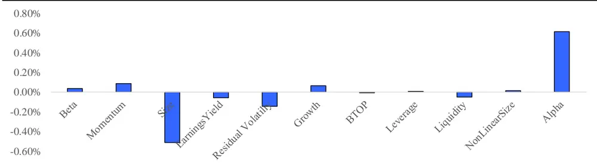
数据来源：Wind，国泰君安证券研究

## 4.2.4. 通信行业增强策略

通信行业增强策略 2010年 4月末至 2018年 4月末累计收益 203%，同期基准指数累计收益 93%，超额收益 110%，增强效果一般。从中信一级通信行业指数成分股内选取合成因子排名前 15 的标的构建季度换仓等权组合，基准设定为中信一级通信行业指数。

图 20通信行业增强策略历史超额收益 110%
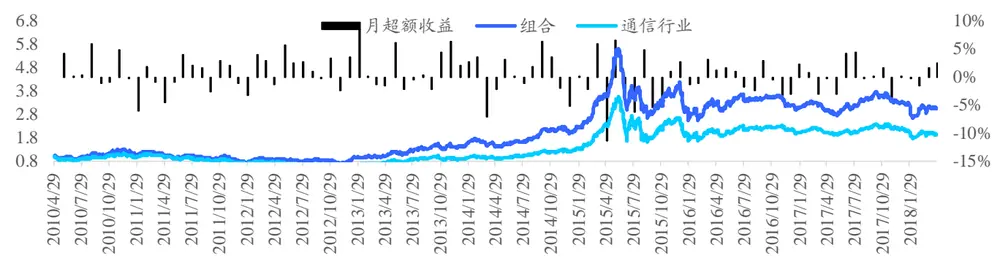
数据来源：Wind，国泰君安证券研究

通信行业增强策略年化收益 14.87%，年化超额收益 5.12%，年化双边换手率为58%。分年度来看，由于统计检验通信行业有效因子较少，增强效果不稳定，信息比率仅为 0.48。

表 9:通信行业增强策略年化收益 14.87%，年化超额收益5.12%

| 年份 | 年绝对收益 | 年绝对波动 | 夏普比率 | 最大回撤 | 年超额收益 | 年超额波动 | IR | 最大回撤 | 月超额胜率 | 年化换手率 |
| --- | --- | --- | --- | --- | --- | --- | --- | --- | --- | --- |
| 2010 | 21.52% | 28.48% | 0.83 | -17.5% | 16.59% | 12.18% | 1.33 | -8.74% | 63% | 49% |
| 2011 | -31.49% | 25.60% | -1.35 | -33.3% | -2.30% | 9.85% | -0.19 | -11.50% | 50% | 54% |
| 2012 | -1.72% | 27.75% | 0.08 | -29.4% | 19.48% | 10.03% | 1.83 | -7.24% | 67% | 71% |
| 2013 | 75.30% | 32.05% | 1.92 | -16.7% | 20.85% | 11.47% | 1.72 | -6.60% | 58% | 66% |
| 2014 | 39.79% | 25.06% | 1.47 | -19.9% | 2.92% | 9.04% | 0.36 | -9.68% | 58% | 64% |
| 2015 | 100.25% | 49.65% | 1.66 | -52.8% | -12.85% | 20.74% | -0.56 | -21.67% | 50% | 51% |
| 2016 | -21.07% | 36.32% | -0.47 | -36.7% | -4.21% | 7.63% | -0.53 | -9.59% | 42% | 46% |
| 2017 | 4.18% | 20.16% | 0.30 | -18.4% | 3.16% | 8.37% | 0.42 | -8.06% | 58% | 57% |
| 2018~ | -8.19% | 16.64% | -0.44 | -22.3% | 2.30% | 6.71% | 0.38 | -6.30% | 50% | - |
| 总体 | 14.87% | 32.29% | 0.59 | -54.5% | 5.12% | 12.03% | 0.48 | -25.57% | 55% | 58% |

数据来源：Wind，国泰君安证券研究

对策略组合进行业绩归因分析，可以发现选股贡献了一定正向收益，但其收益在过去并不稳定，故通信行业暂不宜通过上述方法构建行业增强策略。

图 21通信行业域增强策略选股收益不稳定

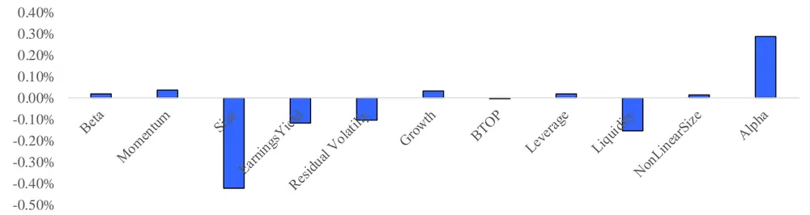
数据来源：Wind，国泰君安证券研究

## 4.2.5. 计算机行业增强策略

计算机行业增强策略 2010 年 4月末至 2018年 4月末累计收益 390%，同期基准指数累计收益 120%，超额收益 270%，增强效果显著。从中信一级计算机行业指数成分股内选取合成因子排名前 30 的标的构建季度换仓等权组合，基准设定为中信一级计算机行业指数。

图 22计算机行业增强策略历史超额收益 270%
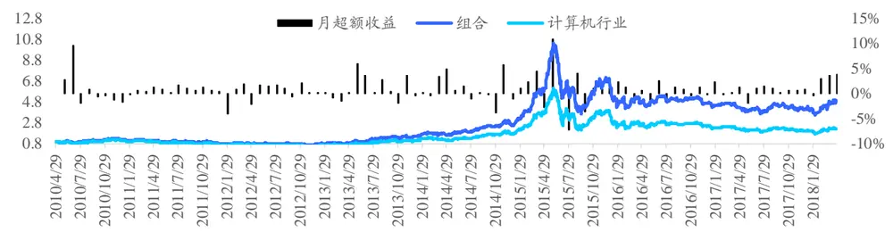
数据来源：Wind，国泰君安证券研究

计算机行业增强策略年化收益 21.98%，年化超额收益 9.40%，年化双边换手率为63%，增强效果稳定。分年度来看，每年均战胜基准指数，除了2015年股灾时出现较大回撤以外，其余年份最大回撤均不超过7%，策略稳定性较好，信息比率为 0.96。

表 10:计算机行业增强策略年化收益 21.98%，年化超额收益9.40%

| 年份 | 年绝对收益 | 年绝对波动 | 夏普比率 | 最大回撤 | 年超额收益 | 年超额波动 | IR | 最大回撤 | 月超额胜率 | 年化换手率 |
| --- | --- | --- | --- | --- | --- | --- | --- | --- | --- | --- |
| 2010 | 19.43% | 27.80% | 0.78 | -18.8% | 5.34% | 8.92% | 0.63 | -6.03% | 38% | 53% |
| 2011 | -30.99% | 25.40% | -1.34 | -32.6% | 9.42% | 5.42% | 1.70 | -1.98% | 92% | 68% |
| 2012 | -9.30% | 27.50% | -0.22 | -31.8% | 4.07% | 5.75% | 0.73 | -4.67% | 75% | 75% |
| 2013 | 97.94% | 33.33% | 2.23 | -14.8% | 12.98% | 8.38% | 1.50 | -5.78% | 67% | 69% |
| 2014 | 73.57% | 30.11% | 1.99 | -16.9% | 10.22% | 8.27% | 1.22 | -6.52% | 58% | 54% |
| 2015 | 166.95% | 60.63% | 1.93 | -65.1% | 10.33% | 20.23% | 0.59 | -22.82% | 67% | 72% |
| 2016 | -32.27% | 40.34% | -0.77 | -39.0% | 4.68% | 6.47% | 0.74 | -4.81% | 58% | 48% |
| 2017 | -12.65% | 23.53% | -0.46 | -22.9% | 8.04% | 5.77% | 1.37 | -3.38% | 83% | 61% |
| 2018~ | 20.89% | 21.42% | 1.00 | -19.3% | 10.11% | 4.37% | 2.25 | -2.82% | 75% | - |
| 总体 | 21.98% | 36.24% | 0.73 | -66.1% | 9.40% | 9.87% | 0.96 | -22.82% | 69% | 63% |

数据来源：Wind，国泰君安证券研究

对策略组合进行业绩归因分析，可以发现选股贡献了较高的正向收益，此外Beta 也贡献了一定的正向收益，而市值、盈利、波动、流动性贡献了负收益。

图 23计算机行业域增强策略选股收益显著
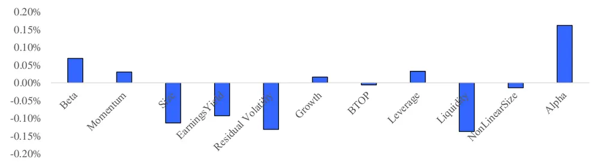
数据来源：Wind，国泰君安证券研究

## 4.2.6. 传媒行业增强策略

传媒行业增强策略 2010年 4月末至 2018年 4月末累计收益 161%，同期基准指数累计收益 33%，超额收益128%，增强效果一般。从中信一级传媒行业指数成分股内选取合成因子排名前 15 的标的构建季度换仓等权组合，基准设定为中信一级传媒行业指数。

图 24传媒行业增强策略历史超额收益 128%
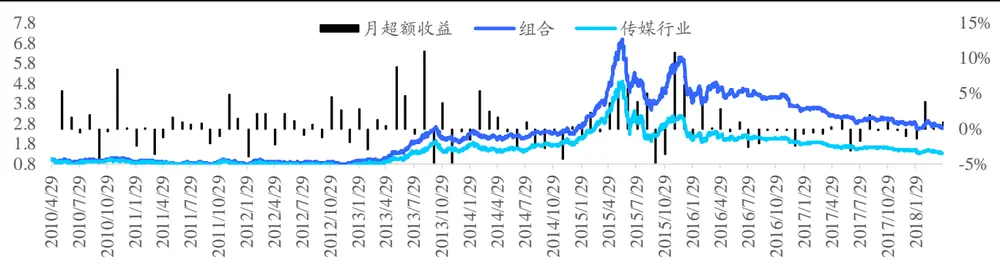
数据来源：Wind，国泰君安证券研究

传媒行业增强策略年化收益 12.72%，年化超额收益 6.52%，年化双边换手率为64%。分年度来看，由于统计检验通信行业有效因子较少，增强效果不稳定，信息比率仅为 0.56。

表 11:传媒行业增强策略年化收益 12.72%，年化超额收益6.52%

| 年份 | 年绝对收益 | 年绝对波动 | 夏普比率 | 最大回撤 | 年超额收益 | 年超额波动 | IR | 最大回撤 | 月超额胜率 | 年化换手率 |
| --- | --- | --- | --- | --- | --- | --- | --- | --- | --- | --- |
| 2010 | 2.68% | 26.87% | 0.23 | -20.3% | 12.45% | 8.87% | 1.37 | -8.87% | 63% | 60% |
| 2011 | -17.45% | 27.73% | -0.56 | -26.3% | -0.87% | 7.38% | -0.08 | -7.72% | 58% | 36% |
| 2012 | -0.04% | 27.24% | 0.13 | -26.3% | 4.79% | 7.84% | 0.64 | -4.34% | 58% | 66% |
| 2013 | 130.09% | 36.26% | 2.49 | -28.9% | 11.86% | 12.71% | 0.95 | -13.68% | 58% | 73% |
| 2014 | 16.84% | 25.11% | 0.75 | -17.8% | -3.91% | 10.47% | -0.33 | -14.64% | 42% | 48% |
| 2015 | 159.27% | 43.31% | 2.43 | -50.2% | 34.06% | 26.21% | 1.25 | -22.93% | 67% | 81% |
| 2016 | -38.19% | 36.40% | -1.14 | -38.4% | -1.65% | 8.45% | -0.15 | -9.04% | 33% | 105% |
| 2017 | -24.01% | 15.06% | -1.75 | -25.3% | -3.16% | 6.90% | -0.43 | -6.19% | 33% | 39% |
| 2018~ | -6.01% | 13.79% | -0.39 | -12.6% | 3.37% | 5.89% | 0.60 | -5.42% | 75% | - |
| 总体 | 12.72% | 31.26% | 0.54 | -64.3% | 6.52% | 12.75% | 0.56 | -22.93% | 52% | 64% |

数据来源：Wind，国泰君安证券研究

对策略组合进行业绩归因分析，可以发现选股贡献了一定正向收益，但其收益在过去并不稳定，故传媒行业暂不宜通过上述方法构建行业增强策略。

图 25传媒行业域增强策略选股收益不稳定
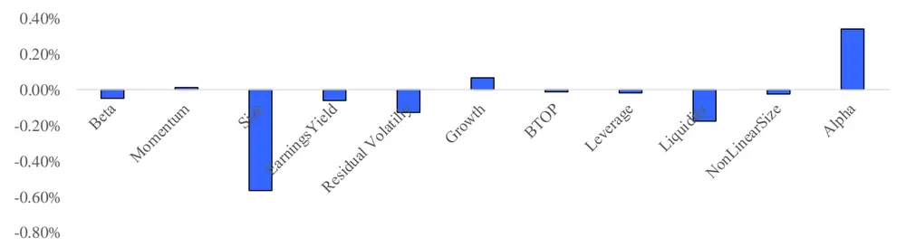
数据来源：Wind，国泰君安证券研究

## 4.2.7. 行业增强策略总结

经过上述回溯检验，我们发现对于“医药+TMT”板块域、医药行业、电子行业、计算机行业构建的行业增强策略，在组合年换手率较低的情况下，均带来了显著的增强效果，且增强效果历年稳定，对组合进行业绩归因分析，发现选股贡献了显著的正向收益；而对于通信行业与传媒行业，策略效果则较为一般，有待进行进一步地研究检验。

## 5. 研究总结

本篇报告基于“成长行业+研发支持+安全边际”框架进行了详尽地研究，并构建了科技创新股投资策略，在科创行业中取得了不错的行业增强效果。

我们首先通过梳理科创企业的基本面与投资逻辑，构建了“成长行业+研发支持+安全边际”的逻辑框架：设计了科创行业的筛选方法，并针对科创行业的驱动因素，构建了与之逻辑更相符合的研发支持类因子，同时，也考虑了成长股本身的高不确定性，构建了更适合科创成长股投资的安全边际类因子。

其次，我们检验了上述因子在全域以及科创行业域中的显著性，发现科创行业域中因子显著性更高，且预测能力更强，其在风险调整后对于收益表现出了较好的单调性，且因子与十大类风格相关性较低，从逻辑与统计上证明了，“研发支持+安全边际”类因子更适合在科创行业进行选股。此外，我们对于研发支持类基本面成长因子，还研究了其累计因子收益的长期表现，研究发现，相比于传统成长因子衰减迅速的情况，基本面成长因子收益长期稳定平稳上升，考虑对其做时间序列多周期合成处理，结果表明其预测能力得到进一步提升。

最后我们构建了简单但行之有效的行业增强投资策略，在医药+TMT 板块域、医药行业、电子行业、计算机行业以及量化科创成长域取得了较高且稳定的增强效果，且组合拥有较低的换手率。

## 6. 附录

## 6.1.成立实验室事件异常收益显著性检验

检验与国家、政府或高校等合作成立实验室事件异常收益的显著性，异常收益定义为剔除行业、风格收益后的残差收益。2010 年至 2018 年 4月10日，A股实验室成立事件共计 109个，除了2015 年牛市情况特殊外，公告数目呈逐年上升状态，其中2017年至今共计 30个，占比 28%。

图 26成立实验室事件呈逐年上升趋势
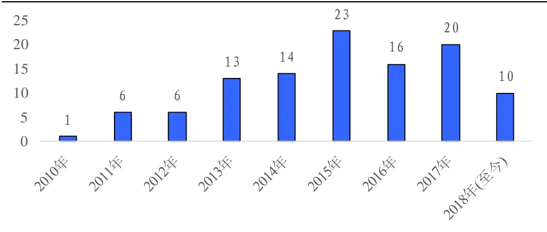
数据来源：Wind，国泰君安证券研究

事件首次公告后，累计异常收益不显著；事件公告前，累计异常收益显著。

图 27成立实验室事件公告前累计异常收益为正，公告后迅速下滑
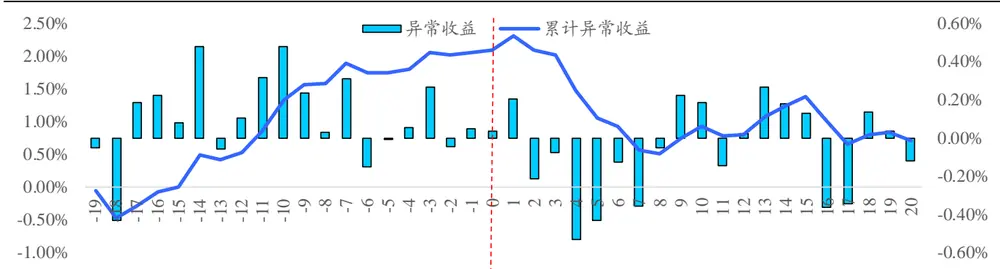
数据来源：Wind，国泰君安证券研究

图 28成立实验室事件公告前累计异常收益显著，公告后不显著
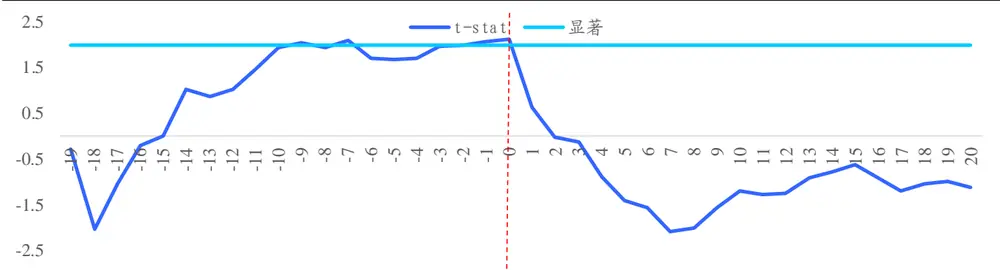
数据来源：Wind，国泰君安证券研究

## 6.2.量化科创成长域增强策略

本小节，我们将基于第4节的方法对量化科创成长域中有效因子进行梳理，并合成有效因子，检验合成因子显著性，最后构建量化科创成长域增强策略。

## 6.2.1. 合成因子显著性检验

量化科创成长域中有效因子较多，其合成因子的预测能力与显著性相比于单因子均有提升，合成因子 IC为 0.04。

表 12:量化科创成长域合成因子 IC为0.04，相比于单因子有明显提升

| 研究支持 |  |  | 安全边际 |  |  | 合成因子 |  |
| --- | --- | --- | --- | --- | --- | --- | --- |
| 因子名称 | IC | t-stat | 因子名称 | IC | t-stat | IC | t-stat |
| 研发支出/营业收入 | 0.0274 | 3.34 | (净利润+研发支出)/总市值 | 0.0168 | 2.21 | 0.040 | 5.24 |
| 研发费用/营业收入 | 0.0213 | 2.04 | 研发支出/总市值 | 0.0260 | 4.70 |  |  |
| 当年申请专利数(合计) | 0.0202 | 3.74 | 毛利润/总资产 | 0.0201 | 3.07 |  |  |
| 当年申请专利数(发明) | 0.0222 | 4.11 | 销售费用率 | 0.0263 | 4.40 |  |  |
| 政府补助（用于科研）/营业收入 | 0.0148 | 2.79 |  |  |  |  |  |
| 技术人员占比 | 0.0182 | 2.86 |  |  |  |  |  |
| 博士占比 | 0.0174 | 3.36 |  |  |  |  |  |

数据来源：Wind，国泰君安证券研究

2010年2月至2018年1月，量化科创成长域合成因子IC序列较为稳定。

## 图 29量化科创成长域合成因子 IC序列较为稳定

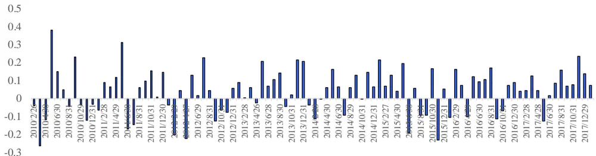
数据来源：Wind，国泰君安证券研究

## 6.2.2. 量化科创成长域增强策略

量化科创成长域增强策略 2010 年 4 月末至 2018 年 4 月末累计收益391%，同期基准指数累计收益 122%，超额收益 269%，增强效果显著。从量化科创成长域选取合成因子排名前 50 的标的构建季度换仓等权组合，基准设定为对应的行业等权指数（通过筛选出的中信三级行业对应的行业指数构建等权月换仓组合）。

图 30量化科创成长域增强策略历史超额收益 269%
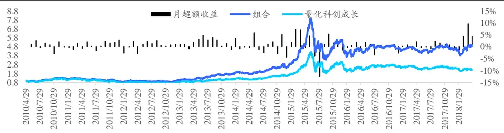
数据来源：Wind，国泰君安证券研究

量化科创成长域增强策略年化收益 22.00%，年化超额收益 10.14%，年化双边换手率为 93%，增强效果稳定。分年度来看，除了 2016 年略低于基准以外，其余年份均跑赢基准指数，除了 2015 年股灾时出现较大回撤以外，其余年份最大回撤均不超过 7%，策略稳定性较好，信息比率为 1.04。

表 13:量化科创成长域增强策略年化收益 22.00%，年化超额收益 10.14%

| 年份 | 年绝对收益 | 年绝对波动 | 夏普比率 | 最大回撤 | 年超额收益 | 年超额波动 | IR | 最大回撤 | 月超额胜率 | 年化换手率 |
| --- | --- | --- | --- | --- | --- | --- | --- | --- | --- | --- |
| 2010 | 26.75% | 24.01% | 1.11 | -16.5% | 6.57% | 5.56% | 1.18 | -5.03% | 63% | 80% |
| 2011 | -27.38% | 22.89% | -1.29 | -30.8% | 8.42% | 5.07% | 1.63 | -3.71% | 67% | 88% |
| 2012 | 5.84% | 24.37% | 0.36 | -21.5% | 6.20% | 5.08% | 1.21 | -3.58% | 75% | 149% |
| 2013 | 79.24% | 27.90% | 2.24 | -11.6% | 24.00% | 8.07% | 2.72 | -4.35% | 83% | 104% |
| 2014 | 40.91% | 23.36% | 1.59 | -14.4% | 4.95% | 7.90% | 0.65 | -6.84% | 42% | 85% |
| 2015 | 121.91% | 53.00% | 1.78 | -58.9% | 10.53% | 19.36% | 0.62 | -21.67% | 67% | 82% |
| 2016 | -16.39% | 35.64% | -0.32 | -34.2% | -1.95% | 6.51% | -0.27 | -6.01% | 50% | 74% |
| 2017 | -2.06% | 18.94% | -0.02 | -14.4% | 5.75% | 7.16% | 0.82 | -4.88% | 58% | 77% |
| 2018~ | 9.73% | 19.70% | 0.58 | -19.0% | 18.33% | 9.33% | 1.88 | -5.45% | 75% | - |
| 总体 | 22.00% | 31.28% | 0.79 | -58.9% | 10.14% | 9.76% | 1.04 | -21.67% | 64% | 93% |

数据来源：Wind，国泰君安证券研究

对策略组合进行业绩归因分析，可以发现选股贡献了较高的正向收益，而市值贡献了负收益。

图 31量化科创成长域增强策略选股收益显著
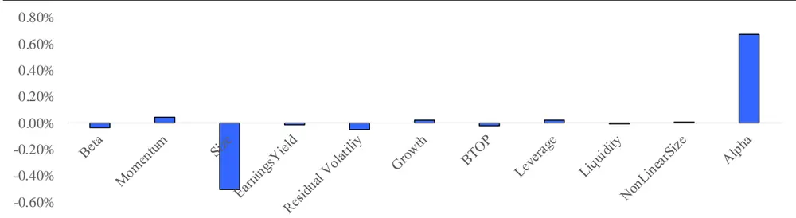
数据来源：Wind，国泰君安证券研究

## 本公司具有中国证监会核准的证券投资咨询业务资格

## 分析师声明

作者具有中国证券业协会授予的证券投资咨询执业资格或相当的专业胜任能力，保证报告所采用的数据均来自合规渠道，分析逻辑基于作者的职业理解，本报告清晰准确地反映了作者的研究观点，力求独立、客观和公正，结论不受任何第三方的授意或影响，特此声明。

## 免责声明

本报告仅供国泰君安证券股份有限公司（以下简称“本公司”）的客户使用。本公司不会因接收人收到本报告而视其为本公司的当然客户。本报告仅在相关法律许可的情况下发放，并仅为提供信息而发放，概不构成任何广告。

本报告的信息来源于已公开的资料，本公司对该等信息的准确性、完整性或可靠性不作任何保证。本报告所载的资料、意见及推测仅反映本公司于发布本报告当日的判断，本报告所指的证券或投资标的的价格、价值及投资收入可升可跌。过往表现不应作为日后的表现依据。在不同时期，本公司可发出与本报告所载资料、意见及推测不一致的报告。本公司不保证本报告所含信息保持在最新状态。同时，本公司对本报告所含信息可在不发出通知的情形下做出修改，投资者应当自行关注相应的更新或修改。

本报告中所指的投资及服务可能不适合个别客户，不构成客户私人咨询建议。在任何情况下，本报告中的信息或所表述的意见均不构成对任何人的投资建议。在任何情况下，本公司、本公司员工或者关联机构不承诺投资者一定获利，不与投资者分享投资收益，也不对任何人因使用本报告中的任何内容所引致的任何损失负任何责任。投资者务必注意，其据此做出的任何投资决策与本公司、本公司员工或者关联机构无关。

本公司利用信息隔离墙控制内部一个或多个领域、部门或关联机构之间的信息流动。因此，投资者应注意，在法律许可的情况下，本公司及其所属关联机构可能会持有报告中提到的公司所发行的证券或期权并进行证券或期权交易，也可能为这些公司提供或者争取提供投资银行、财务顾问或者金融产品等相关服务。在法律许可的情况下，本公司的员工可能担任本报告所提到的公司的董事。

市场有风险，投资需谨慎。投资者不应将本报告作为作出投资决策的唯一参考因素，亦不应认为本报告可以取代自己的判断。
在决定投资前，如有需要，投资者务必向专业人士咨询并谨慎决策。

本报告版权仅为本公司所有，未经书面许可，任何机构和个人不得以任何形式翻版、复制、发表或引用。如征得本公司同意进行引用、刊发的，需在允许的范围内使用，并注明出处为“国泰君安证券研究”，且不得对本报告进行任何有悖原意的引用、删节和修改。

若本公司以外的其他机构（以下简称“该机构”）发送本报告，则由该机构独自为此发送行为负责。通过此途径获得本报告的投资者应自行联系该机构以要求获悉更详细信息或进而交易本报告中提及的证券。本报告不构成本公司向该机构之客户提供的投资建议，本公司、本公司员工或者关联机构亦不为该机构之客户因使用本报告或报告所载内容引起的任何损失承担任何责任。

## 评级说明

## 1.投资建议的比较标准

投资评级分为股票评级和行业评级。

以报告发布后的12个月内的市场表现为比较标准，报告发布日后的 12个月内的公司股价（或行业指数）的涨跌幅相对同期的沪深 300 指数涨跌幅为基准。

## 2.投资建议的评级标准

报告发布日后的 12 个月内的公司股价（或行业指数）的涨跌幅相对同期的沪深 300 指数的涨跌幅。

|  | 评级 | 说明 |
| --- | --- | --- |
| 股票投资评级 | 增持 | 相对沪深300指数涨幅15%以上 |
|  | 谨慎增持 | 相对沪深 300指数涨幅介于5%～15%之间 |
|  | 中性 | 相对沪深300指数涨幅介于-5%～5% |
|  | 减持 | 相对沪深 300 指数下跌 5%以上 |
| 行业投资评级 | 增持 | 明显强于沪深 300 指数 |
|  | 中性 | 基本与沪深 300指数持平 |
|  | 减持 | 明显弱于沪深300指数 |

## 国泰君安证券研究所

|  | 上海 | 深圳 | 北京 |
| --- | --- | --- | --- |
| 地址 | 上海市浦东新区银城中路168号上海 银行大厦29层 | 深圳市福田区益田路 6009 号新世界 商务中心34层 | 北京市西城区金融大街 28 号盈泰中 心2号楼10层 |
| 邮编 | 200120 | 518026 | 100140 |
| 电话 | （021)38676666 | (0755)23976888 | (010)59312799 |
|  | E-mail: gtjaresearch@gtjas.com |  |  |