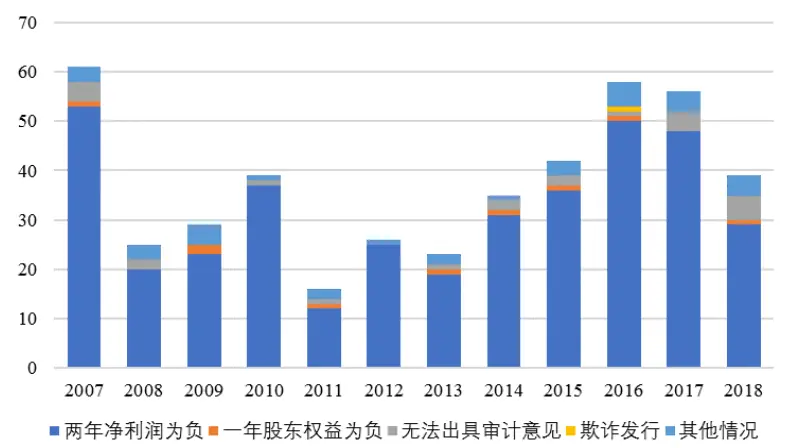
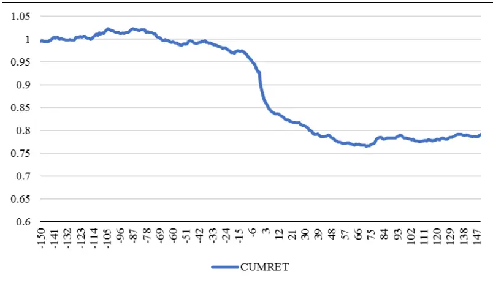
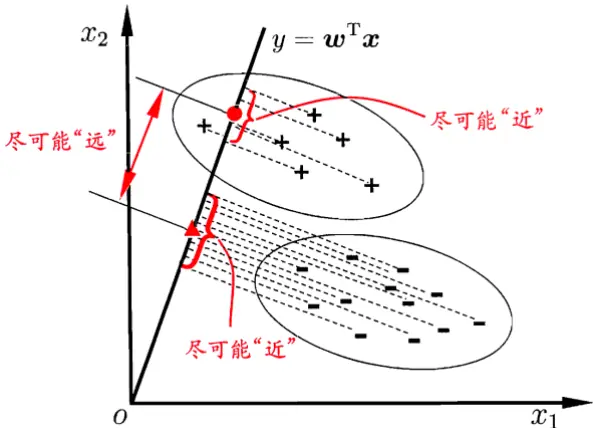
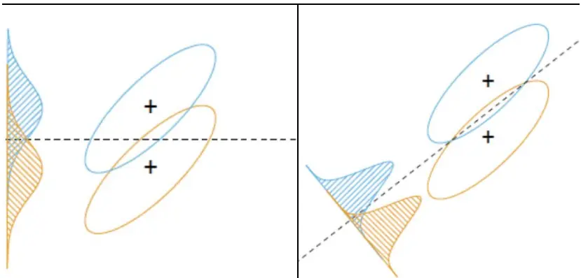
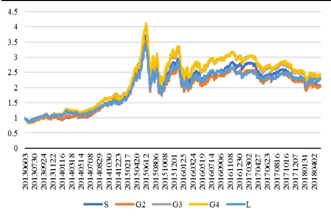
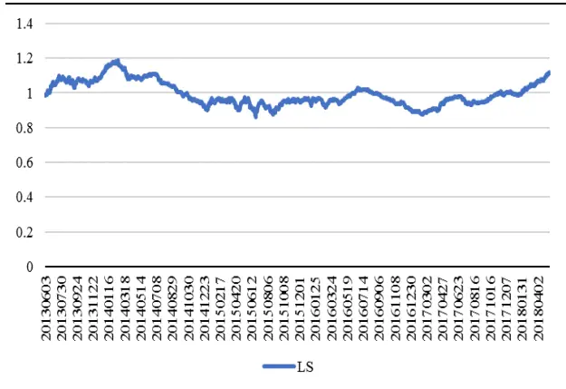
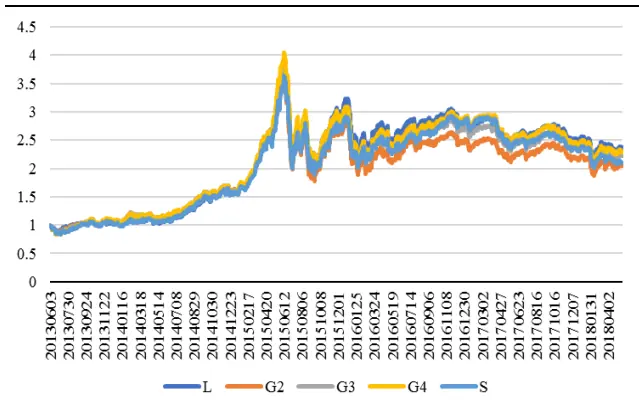
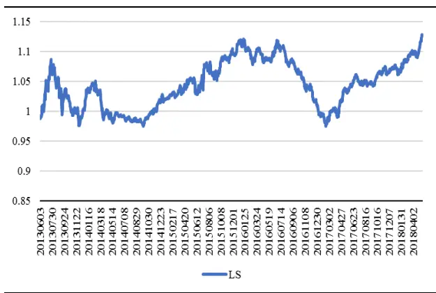

inInfo] [Table_Title] 2018.06.21

# 基于股票特别处理的 A股财务困境预测研究

## ——数量化专题之一百一十四

玉陈奥林（分析师）

## 黄皖璇（研究助理）

8 021-38674835

021-38677799

chenaolin@gtjas.com

huangwanxuan@gtjas.com

证书编号 S0880516100001

S0880116100008

## 本报告导读：

本报告以被实施特别处理的上市公司为研究对象，采用 Fisher判别和 Logistic回归分析的方式构建了财务困境预警指标，帮助投资者规避财务困境公司的同时也提供了量化公司财务健康状况的方式。

## 摘要：

le_Summary]从短期事件研究的角度来看，一个处于正常状态的公司不论是实施ST 之前还是之后都会对其股价产生明显的负向压力，特别是在 ST实际实施日附近产生明显的负向超额收益。从 2018 年被实施 ST 的公司平均表现来看，ST 实施前 150 个交易日的平均超额收益达到-31.32%，事后截至报告写作时间的短期超额收益为-25.7%。因此投资者对具有ST 风险的公司应该提前规避。

本文以被实施股票特别处理（ST）作为上市公司财务困境的指标，结合中国 A 股市场的现实状况和相关政策特征，使用 Fisher 判别和Logistic回归分析的方法，对A 股上市公司的财务状况进行预测。

两类模型均具有较好的预测效果，Logistic 模型体现出更强的极端值预测能力，而 Fisher 判别分析在则在全样本的情况下有更强的适应性，两种模型可各取其优。

随着市场风险偏好持续走低，ST 风险溢价持续扩大。从 ST 股票的收益表现来看，自 2017年开始，财务健康公司相对财务困境公司体现出明显的溢价趋势，并且我们基于宏观金融环境预测财务健康公司的相对溢价会在未来继续保持。

金融工程

## 金融工程团队：

陈奥林：（分析师）

电话：021-38674835

邮箱：chenaolin@gtjas.com

证书编号：S0880516100001

## 李辰：（分析师）

电话：021-38677309

邮箱：lichen@gtjas.com

证书编号：S0880516050003

## 孟繁雪：（分析师）

电话：021-38675860

邮箱：mengfanxue@gtjas.com

证书编号：S0880517040005

## 蔡旻昊：（研究助理）

电话：021-38674743

邮箱：caiminhao@gtjas.com

证书编号：S0880117030051

## 殷明：（研究助理）

电话：021-38674637

邮箱：yinming@gtjas.com

证书编号：S0880116070042

## 叶尔乐：（研究助理）

电话：021-38032032

邮箱：yeerle@gtjas.com

证书编号：S0880116080361

## 李栩：（研究助理）

电话：021-38032690

邮箱：lixu019018@gtjas.com

证书编号：S0880117090067

## 杨能：（研究助理）

电话：021-38032685

邮箱：yangneng@gtjas.com

证书编号：S0880117080176

## 殷钦怡：（研究助理）

电话：021-38675855

邮箱：yinqinyi@gtjas.com

证书编号：S0880117060109

## [Table_R相关报告

《投资科技创新股：基本面成长因子再挖掘》2018.06.14

《世界杯趣文：世界杯中的超额收益》2018.06.13

《短期不悲观，长期不乐观》2018.05.27

《沪深 300 成分股调整名单》2018.05.18

《基于上市公司参股拟 IPO 企业的事件驱动研究》2018.05.11

## 1. 研究背景

在供给侧改革的大背景下，企业之间的市场竞争日趋激烈，市场瞬息万变，再加上以美国关税政策为代表的国际因素的影响，企业的财务困境风险已客观存在。若企业不能及时有效地规避和防范风险，很有可能会陷入财务困境，上市公司也不例外。

今年 1-5 月，债券市场共发生违约事件 20 起，涉及违约主体 12 家，与过去两年相比，不但违约规模有所增长，违约的主体还存在向民企上市公司集中的趋势。

除了对债券投资人的资产价值产生严重影响外，也会对股票市场产生一系列的影响。从宏观角度来看，如果市场中违约的公司数目较多，表示实体经济资金面紧张，企业生存艰难，直接影响投资者的风险偏好。更为直接的是，在 2018 年违约的 20 支债券中，6 支涉及上市公司，违约事件的产生必然会对其股票表现产生严重的负向冲击。在金融监管加强的大环境下，权益类投资者避免具有财务风险的投资标的是一项基本的风险控制措施。

企业的财务状况由正常状态发展到困境状态不是一朝一夕形成的，而是一个日积月累、逐步演变的过程，财务困境真正发生之前都存在一些先兆，因此我们完全可以通过深入研究财务困境的成因、探索形成规律，在暴风雨来临之前做好相应的防范措施。

## 1.1. 政策背景

国外大部分的研究将依照法律规定宣告破产作为企业陷入财务困境的标志，主要基于两个原因：一方面，企业提出破产申请是客观发生并容易观测的行为，适合作为研究样本；另一方面，破产作为企业经营失败的最直接表现，对股权、债权人利益产生的影响较大，因此容易引起他们的重视。

但是当研究对象转为中国企业之后，对于财务困境的定义可能需要更多的结合市场的现实状况。在以上市公司为研究对象的研究中，国内学者倾向于将我国上市公司中被戴帽的企业定义为财务困境公司，主要基于以下几个方面的考虑：首先，我国上市公司到目前为止还没有出现过破产的案例，并且上市资格一直以来都是一种“壳”资源，即使上市公司面临破产，也会有其他公司将其接手（即所谓的“买壳”上市），不太可能出现申请破产的情况。因此，在前阶段用破产来界定中国上市公司的财务困境是不适宜的。第二，特别处理是一个客观发生的事件，有很高的可度性。第三，从摆脱特别处理的公司来看，大部分公司是通过大规模资产重组才摘掉特别处理的帽子的，这说明特别处理确实在一定程度上反映出公司陷入财务困境。

所谓戴帽，是考虑到部分上市公司业绩下滑、生产经营效率低下，导致其财务状况不断恶化，针对这一情况，为了让上市公司提高警惕，让广大投资者和债权人注意投资风险，中国证监会在上个世纪九十年代出台了上市公司风险预警制度。

当上市公司出现财务状况或者其他状况异常，可能导致其股票退市或损害投资者利益的，其股票交易将被实施风险警示。根据《沪深交易所股票上市规则》第十三章的规定，上市公司出现以下情形之一的，本所对其股票实施退市风险警示：

（一）最近两个会计年度经审计的净利润连续为负值或者被追溯重述后连续为负值；

（二）最近一个会计年度经审计的期末净资产为负值或者被追溯重述后为负值；

（三）最近一个会计年度经审计的营业收入低于 1000 万元或者被追溯重述后低于1000万元；

（四）最近一个会计年度的财务会计报告被会计师事务所出具无法表示意见或者否定意见的审计报告；

（五）因财务会计报告存在重大会计差错或者虚假记载，被中国证监会责令改正但未在规定期限内改正，且公司股票已停牌两个月；

（六）未在法定期限内披露年度报告或者中期报告，且公司股票已停牌两个月；

（七）因第 12.14 条股权分布不具备上市条件，公司在规定的一个月内向本所提交解决股权分布问题的方案，并获得本所同意；

（八）因首次公开发行股票申请或者披露文件存在虚假记载、误导性陈述或者重大遗漏，致使不符合发行条件的发行人骗取了发行核准，或者对新股发行定价产生了实质性影响，受到中国证监会行政处罚，或者因涉嫌欺诈发行罪被依法移送公安机关（以下简称欺诈发行）；

（九）因信息披露文件存在虚假记载、误导性陈述或者重大遗漏，受到中国证监会行政处罚，并且因违法行为性质恶劣、情节严重、市场影响重大，在行政处罚决定书中被认定构成重大违法行为，或者因涉嫌违规披露、不披露重要信息罪被依法移送公安机关（以下简称重大信息披露违法）；

（十）公司可能被依法强制解散；

（十一）法院依法受理公司重整、和解或者破产清算申请；

（十二）本所认定的其他情形。

对于风险警示的公司股票，在公司股票简称前冠以“ST”字样，以区别于其他股票，这类股票价格的日涨跌幅限制为 5%。2018 年度年报已经披露完毕，基于最新年报信息，沪深两市共计有 81 家上市公司处于风险警示的特别处理状态。

在本文考虑的样本区间内（2007-2018），A 股市场上共计出现了 449 次上市公司被实施ST 的情况，从表 1统计中可以看出，85.3%都是由于最近两个会计年度经审计的净利润连续为负值或者被追溯重述后连续为负值导致的，占据了绝大多数的样本。其次，导致股票 ST 的重要原因是被注册会计师出具无法表示意见或否定意见的审计报告。

表 1 特别处理公司样本统计

| ST原因 | 频数 | 占比% |
| --- | --- | --- |
| 最近两个会计年度的审计结果显示的净利润均为负值 | 383 | 85.3 |
| 最近一个会计年度的审计结果显示其股东权益为负值 | 9 | 2.0 |
| 被注册会计师出具无法表示意见或否定意见的审计报告 | 23 | 5.1 |
| 欺诈发行 | 1 | 0.2 |
| 出现其它异常状况 | 33 | 7.4 |
| 合计 | 449 | 100.0 |

数据来源：国泰君安证券研究

每一年被实施 ST 的样本总数目及其导致原因展示于图 1 中。从时间序列上来看，每年被实施特别处理的上市公司数目并没有特别明显的变化规律。从 ST 原因的角度来观察，本文发现最近两年由于被注册会计师出具无法表示意见或否定意见的审计报告的样本数目较往年明显增多，会计师之所以出具“非标意见”，表示其认为财务报表质量不合格，也就意味着除了较为直观的账面经营亏损之外，财务报告质量也在逐渐成为上市公司被实施退市风险警示的重要原因之一。

图 1 特别处理公司样本统计

数据来源：国泰君安证券研究

## 1.2.实施特别处理的事件研究

那么实施 ST 对个股收益存在什么样的影响呢？本节首先采用事件研究的方式，考察个股 ST 前后的累计超额收益表现。事件日定义为由正常交易状态转为ST的第一个交易日。

具体而言，我们计算每个 ST 状态转换前后 150 个交易日的累计超额收益。超额收益的计算采用每个公司相对其所属申万一级行业的行业指数的超额收益，定义式如下：

$$
AR_{it}=R_{it}-R_{It}
$$

其中 $R_{it}$ 为 i 股第 t 日的日收益， $R_{It}$ 为 i 股所对应的申万一级行业指数在t日的收益， $AR_{it}$ 则代表个股的日度超额收益。累计超额收益 $CUMRET_{it}.$ 是日度超额收益的逐日累加。

$$
CUMRET_{it}=\sum_{d=-150}^{t}AR_{id}
$$

图 2 2016-2018 年 ST 前后累积超额收益

数据来源：国泰君安证券研究

图 2 展示了 2016-2018 年期间个股被实施 ST 前后 150 个交易日的累计超额收益表现。市场对具有潜在 ST风险个股的负面反应在 ST实际实施前 100 个交易日就已经启动，并且在 ST 落地公告发布之后的短期内，市场表现出强烈的看空效应，在收益曲线上表现出断层式的下跌，此后累计收益曲线缓慢向下漂移，这种负面效应对个股的影响事后仍将维持近80个交易日。

表 2 分年统计的ST前和ST后的平均累计超额收益

| Year | MEAN_CUMRET_Pre-ST MEAN_CUMRET_Post-ST |
| --- | --- |
| 2007 15.34% | -15.27% |
| 2008 | -11.56% -23.13% |
| 2009 | -9.03% -6.11% |
| 2010 | 12.87% -5.72% |
| 2011 | -3.41% -13.37% |
| 2012 | -9.89% -1.11% |
| 2013 | -17.11% -4.39% |
| 2014 | -5.22% 1.75% |
| 2015 | -10.58% -10.28% |
| 2016 | 3.48% -4.28% |
| 2017 | -18.5% -13.83% |
| 2018 -31.32% | -25.7% |

数据来源：国泰君安证券研究

关于实施ST公司的分年平均超额收益统计如表2。从事前的角度来看，针对被 ST 的公司，市场大概率会做出提前的负向反应，事后的超额收益也几乎全部为负，特别是在今年，市场对 ST 公司的规避表现得更加明显。

现行的退市风险预警制度是针对上市公司出现财务异常以后采取的相关措施，提供的是一种事后信息。从图2中累计净值收益曲线的形态可以看出，在投资者具有理性预期的情况下，股价的负向反应可能在特别处理实际实施之前就已经形成，从而使投资者利益遭受巨大损失，因此投资者在决策时更需要事前信息。通过对上市公司建立财务预警模型，投资者可以对上市公司的财务状况进行实施跟踪，并预测其未来发展趋势，从而对股票的优劣做出评判，有助于减少投资的盲目性。

本文的研究目的就是在总结现有国内外研究方法的基础上，结合中国的相关政策和经济环境，采用相对更加科学的方式建立一套适合我国上市公司的财务困境预测模型，通过这个模型来预测上市公司陷入财务困境的可能性，并希望预测结果能为投资者、债权人和监管部门等提供一定的参考。

## 2. 财务困境预测模型

本文将被实施 ST 的个股定义为陷入财务困境的公司，预测公司是否将被ST 实际上是个二分类问题。

目前市场上的信用风险评分方法通常包括定性法、单变量法、多变量法，目前广泛采用多变量方法，包括判别分析(Discriminant Analysis)、逻辑回归(Logit Regression)和非线性模型如神经网络等。

在实际运用方面，Altman（1968）构建的 Z-score 模型是财务困境预测模型中的鼻祖，在美国、澳大利亚、巴西、加拿大、英国、法国、德国、爱尔兰、日本和荷兰得到了广泛的应用。Altman（1968）利用会计信息构建了22个预测破产风险的变量。采用 1946-1965年期间根据美国破产法案提交破产申请的制造业企业作为破产企业样本，从 22 个潜在备选指标中选取了5个最为关键的变量构建了最为原始的Z-Score模型：

$$
\mathrm{Z}=0.012X_{1}+0.014X_{2}+0.033X_{3}+0.006X_{4}+0.999X_{5}
$$

其中， $X_{1^{=}}$ 营运资本/总资产， $X_{2}=\hookleftarrow$ 存收益/总资产， $X_{3^{=}}$ 息税前利润/总资 $\cdot\vec{j^{z}}$ ， $X_{4}=XZ$ 益市值/总负债账面价值， $X_{5}=$ 销售收入/总资产。

Z-Score 模型基于各变量加权得分对企业是否破产进行判断，在 Z-Score原始模型中，得分高于2.99 的属于“安全”区域、低于 1.80的属于“困境”区域，两个得分之间的属于“灰色”区域。

原始的 Z-Score 模型适用范围较窄，仅限于已上市的制造业企业，之所以说仅适用于上市公司，是因为投入变量的计算过程中包含公司的总市值，鉴于此，Altman（1983）用账面价值取代总市值，构建了适用于私营企业的 Z'-Score 模型，进一步的，为了降低模型的行业敏感程度，使得模型更加具有普适性，Altman（1983）剔除了原有模型中的 $X_{5}$ 变量，形成了如下 Z''-Score 模型：

$$
Z^{\prime\prime}=3.25+6.56X_{1}+3.26X_{2}+6.72X_{3}+1.05X_{4}
$$

Altman（2014）将破产预测模型拓展到美国以外的市场，其中包含中国市场，考虑到发达市场和新兴市场存在较大差异，Altman 结合新兴市场特点，开发了适用于不同市场的 Z-Score 模型。由于中国市场一直缺乏有效的退市和破产机制，缺乏足够的退市和破产公司样本，针对国内市场的特殊状况，Altman 则将上市公司被实施“特别处理”作为企业陷入财务危机的标志，进行判别分析。

## 2.1. Fisher 判别分析

线性判别分析（Linear Discriminant Analysis）是一种经典的线性学习方法，在二分类问题上因为最早由 Fisher（1936）提出，所以也被称为“Fisher”判别。

根据周志华老师在《机器学习》中的论述，线性判别的思想就是给定训练样例集，通过数据自学习的方法将样例投影到一条直线上，使得同类样例的投影点尽可能接近、异类样例的投影点尽可能远离；在对新样本进行分类时，将其投影到同样这条直线上，再根据投影点的位置来确定新的样本类别。

图 3 Fisher判别二维示意图

数据来源：《机器学习》，周志华。

给定数据集 $\mathrm{D}=\{(\pmb{x}_{i},\pmb{y}_{i})\}_{i=1}^{m},~y_{i}\in\{0,1\}$ ，令 $\mu_{i}$ $\Sigma_{i}$ 分别表示第i类示例的集合、均值向量、协方差矩阵。若将数据投影到直线 $^{\prime w\pm}$ ，则两类样本在直线上的投影分别为 ${\pmb w}^{T}{\pmb\mu}_{0}$ 和 $\tau{\pmb{u}}\pmb{\nu}^{T}{\mu}_{1};$ ；若将所有样本点都投影到

直线上，则两类样本的协方差分别为 $\pmb{w}^{T}\Sigma_{_0}\pmb{w}\pmb{\mathcal{F}}\mathbf{\mu}\pmb{w}^{T}\Sigma_{_1}\pmb{w}$

投影线的选择欲使同类样例的投影点尽可能接近，也即同类样例投影点的协方差尽可能小，即最小化 $\pmb{w}^{T}\Sigma_{_0}\pmb{w}\mathrm{+}\pmb{w}^{T}\Sigma_{_1}\pmb{w}$ ，并且异类样例的投U影点尽可能远离，也即让类中心距离尽可能大，即最大化$||\boldsymbol{\mathbf{\ell}}\boldsymbol{\mathbf{\ell}}\boldsymbol{\mathbf{\ell}}\boldsymbol{\mathbf{\ell}}\boldsymbol{\mathbf{\ell}}\boldsymbol{\mathbf{\ell}}||\boldsymbol{\mathbf{\ell}}\boldsymbol{\mathbf{\ell}}\boldsymbol{\mathbf{\ell}}\boldsymbol{\mathbf{\ell}}\boldsymbol{\mathbf{\ell}}$ ，将两方目标结合，则可得到如下最优化目标：

$$
\begin{array}{rl}{\mathsf{Max}}&{{}\quad\mathcal{L}=\frac{||\boldsymbol{\omega}^{T}\boldsymbol{\mu}_{0}+\boldsymbol{\omega}^{T}\boldsymbol{\mu}_{1}||_{2}^{2}}{\boldsymbol{\omega}^{T}\Sigma_{0}\boldsymbol{\omega}+\boldsymbol{\omega}^{T}\Sigma_{1}\boldsymbol{\omega}}}\end{array}\tag{1}
$$

图 4 Fisher 判别投影方式

数据来源：国泰君安证券研究

判别式的核心思想可以用图 4 简单表示。假设两类样本的分布如椭圆形所示，基于以上优化目标，右边的投影线的设置方式明显要优于左边。考虑两类样本投影到直线上的分布，在右边的投影线的设置方式下，两类投影点在类内的分布更加密集，类间的区分度也达到最大。而左边的垂直投影线对应的两类投影点的分布更加扁平，两类分布的重合部分也明显更大。

表 3 指标定义

| 指标 |  | 定义 |
| --- | --- | --- |
| 盈利能力 | 投资回报率 | 息税前利润/总资产 |
|  | 资产收益率 | 净利润/平均总资产 |
|  | 净资产收益率 | 净利润/平均净资产 |
| 偿债能力 | 流动比率 | 流动资产/流动负债 |
|  | 资产负债率 | 总负债/总资产 |
|  | 负债权益比率 | 总负债/所有者权益 |
|  | 营运资本资产比率 | (流动资产-流动负债)/总资产 |
| 营运能力 | 总资产周转率 | 主营业务收入/平均总资产 |
|  | 存货周转率 | 主营业务成本/平均存货 |
|  | 应收账款周转率 | 主营业务收入/应收账款 |
| 成长能力 | 净利润增长率 | 本期净利润/上一期净利润-1 |
|  | 留存收益比率 | (盈余公积+未分配利润)/总资产 |
| 资本结构 | 市值负债比 | 总市值/总负债 |
|  | 账面市值比 | 所有者权益/总市值 |
| 盈余操纵 | 可操纵性应计 | 修正 Jones 模型 |

数据来源：国泰君安证券研究

本文总结了现有国内外关于中国A 股上市公司的财务困境相关研究，选取了如表3所示的15 个财务指标作为判别分析中 的备选指标，选取的指标分别从盈利能力、偿债能力、营运能力、成长能力、资本结构和盈余操纵的角度描述了公司的生产经营和财务健康状况。

通过上文的描述可知，判别分析中最重要的一步就是构建判别式。在Altman 的财务困境预测模型中，用于计算Z-Score的判别式的系数和变量都是事先给定的，本文在此基础上尝试使用变系数和非固定投入变量的模型构建方法，使用当期年报披露指标去预测下一期年报披露之后，公司是否会被实施特别处理。具体方式如下：

Step1. 选取过去一段时间（t-4，t-1）作为样本训练期（本文设定为 4年），在每个横截面上，对被实施 ST 的公司寻找与之配对的非 ST样本，配对样本的寻找选择是同申万一级行业分类中，规模最为接近的公司，因此训练集的公司数目是过去4 年ST 样本数的两倍。

Step2. 以配对样本为训练集，从 15 个备选指标中选取合适的指标 。这里采用逐步回归的方式筛选变量，设置显著性水平为 5%。也就是说实际选择的指标需要满足在两类样本中具有足够的区分度，T 检验在 5%水平上显著，并且尽可能降低指标之间的相关性。

Step3. 以Step2中选择的变量为投入变量，求解（1）式的优化方程，得到判别系数 。

Step4. 将判别系数 带入到 在t期的实际值中，得到公司在 t+1期的 y值，y 值为该公司投影的位置，之后则可根据投影的位置预测公司下一期是否被ST。

表 4 Fisher判别训练期入选指标

| 训练期 | 入选指标 |
| --- | --- |
| 2008-2011 | 资产收益率、资产负债率、总资产周转率 |
| 2009-2012 | 资产收益率、资产负债率、总资产周转率 |
| 2010-2013 | 资产收益率、资产负债率、投资回报率 |
| 2011-2014 | 资产收益率、资产负债率、投资回报率 |
| 2012-2015 | 资产收益率、资产负债率、投资回报率、净资产收益率 |

数据来源：国泰君安证券研究

整个过程本身其实并不复杂，但是有几个要点值得一提。首先，判别式中变量的选择较为关键，必须在预先设定的备选集中甄选对不同类别样本区分度较强的变量。其次，模型的预测效果对训练期长短的选择并不敏感，但是由于 A 股市场中每年被实施 ST 的公司样本数目不多，为了充分捕捉ST公司特征，训练期的选择也不宜过短。

将判别系数带入到相应指标后，可以得到每家公司对应的得分（类比于Z-Score），得分越低的公司被实施 ST 的风险就越高。Altman 在计算每家公司的得分之后，通过预先设定的固定阈值，例如在传统的 Z-Score模型中，将得分低于1.8的公司归为困境公司。

但是在本文的模型设定方式下，固定阈值显然是不尽合理的。首先，由于每一期自学习得到的判别式的系数和变量均不固定，公司得分在时间序列上缺乏可比性。其次，固定阈值会导致新的参数引入，可能会导致样本内过度拟合，样本外失效的担忧。

鉴于此，本文认为公司在每一期的得分在横截面上可比，因此可以设定横截面上的百分位水平作为分类标准。分类效果可以通过统计中的 TypeI & Type II Error 来测定。

Type IError表示选假设为正确的情况下，错误地拒绝了原假设的概率，Type II Error衡量了原假设为错误的情况下，错误地接受了原假设的概率，在统计分布中，两类错误存在此消彼长的关系。映射到本文的研究问题，Type I Error 对应实际 ST 但被模型预测为非 ST 的概率，Type IIError对应实际非ST但模型将其预测为 ST的概率。

表 5 Fisher 判别_阈值为 10%分位数对应的 Type I Error & Type II Error

| 时间 | 误判类型 | 预测非 ST 样本数 | 预测 ST 样本数 | 合计 | 误判率% |
| --- | --- | --- | --- | --- | --- |
| 2014 | 实际非 ST 样本数 | 2055 | 206 | 2261 | 9.11 |
|  | 实际 ST 样本数 | 11 | 23 | 34 | 32.35 |
| 2015 | 实际非 ST 样本数 | 2171 | 209 | 2380 | 8.78 |
|  | 实际 ST 样本数 | 9 | 33 | 42 | 21.43 |
| 2016 | 实际非 ST 样本数 | 2213 | 199 | 2412 | 8.25 |
|  | 实际 ST 样本数 | 10 | 47 | 57 | 17.54 |
| 2017 | 实际非 ST 样本数 | 2314 | 217 | 2531 | 8.57 |
|  | 实际 ST 样本数 | 15 | 41 | 56 | 26.79 |
| 2018 | 实际非 ST 样本数 | 2480 | 250 | 2730 | 9.16 |
|  | 实际 ST 样本数 | 13 | 26 | 39 | 33.33 |

数据来源：国泰君安证券研究

本文分别选取10%和50%分位数为阈值，也就是认为每一期得分分别高于前 10%和 50%分位数的公司是下一期被实施 ST 的备选公司。对应的Type I & Type II Error 分别统计在表 5 和表 6 的最后一列。

表 6 Fisher 判别_阈值为 50%分位数对应的 Type I Error & Type II Error

| 时间 | 误判类型 | 预测非 ST 样本数 | 预测 ST 样本数 | 合计 | 误判率 |
| --- | --- | --- | --- | --- | --- |
| 2014 | 实际非 ST 样本数 | 1148 | 1113 | 2261 | 49.23 |
|  | 实际 ST 样本数 | 0 | 34 | 34 | 0 |
| 2015 | 实际非 ST 样本数 | 1210 | 1170 | 2380 | 49.16 |
|  | 实际 ST 样本数 | 1 | 41 | 42 | 2.38 |
| 2016 | 实际非 ST 样本数 | 1234 | 1178 | 2412 | 48.84 |
|  | 实际 ST 样本数 | 1 | 56 | 57 | 1.75 |
| 2017 | 实际非 ST 样本数 | 1290 | 1241 | 2531 | 49.03 |
|  | 实际 ST 样本数 | 4 | 52 | 56 | 7.14 |
| 2018 | 实际非 ST 样本数 | 1382 | 1348 | 2730 | 49.38 |
|  | 实际 ST 样本数 | 3 | 36 | 39 | 7.69 |

数据来源：国泰君安证券研究

在 10%分位数的阈值下，每一期超过 2/3 的实际被 ST 公司都落在预测ST 范围内。当阈值扩展到 50%，犯第一类错误的概率可以降低到 10%以内，只有极少数的“漏网之鱼”没有被预测 ST 范围所覆盖，其中2014年的第一类错误率为 0。但是不可避免的是，随着阈值的放松，第一类错误率在降低的同时，第二类错误率也在同样增长。

阈值的选择可灵活由投资经理根据自身的投资风格和风险偏好决定。对于投资风格激进、风险偏好较强的投资经理，可以选择较低的阈值，排除少量风险较高的公司。对于投资风格保守、风险厌恶的投资经理而言，则可设定较高的阈值，尽可能全面地规避财务困境公司，从财务状况健康稳健的公司中寻找投资标的。

## 2.2. Logistic 回归分析

Logistic 回归分析是另外一种常用的处理分类变量的模型，相对于线性判别分析模型，由于其假设条件更少，相对更加鲁棒。Campbell et al.（2008）构建了基于 Logistic 回归分析的财务困境预测模型，与以往模型相比，最大的创新之处在于两个方面，其一是加入了解释变量的滞后特征，从而改进了模型的预测长度；其二是他们考虑了基于市场的预测变量，例如在计算财务指标时用总市值代替所有者权益，并加入超额收益和股价波动率等。

本文写作时也曾复制了Campbelletal.（2008）模型，但是效果并不理想，考虑可能的原因是从 A 股的历史表现来看，ST 股票常常作为“壳”概念被市场炒作，股价表现并不能发挥出应有的预测作用。同时为了与Fisher 判别分析方法进行更好的比较，本节构建的 Logistic 模型同样基于上一节中表3列举出的各项表示上市公司经营状况的财务指标。另外，鉴于以往绝大多数上市公司都是因为连续两年净利润为负而被实施 ST，当年实现负净利润的公司属于高危公司，因此本节在 Logistic 模型中加入了指示当年净利润是否为负的二值变量。整体模型设定如下：

$$
\begin{array}{r}{P_{t-1}\big(Y_{i,t}^{j}=1\big|Y_{i,t-1}^{j}=0\big)=\frac{1}{1+\exp(-\alpha_{j}-\beta_{j}x_{i,t-1})}}\end{array}
$$

在进行模型预测时，被解释变量为实施ST的条件概率，也就是在 t-1期没有被 ST 的公司，在 t 期的 ST 状况。 $Y_{i,t}^{j}=1~Y\perp i,t\perp j\perp{=}0$ 表示 i 公司在t期被实施特别处理ST（*ST）， $Y_{i,t}^{j}=0$ 则为正常状态。最后得到的P值越接近于1，意味着该公司被实施特别处理的概率就越大。

Logit模型用于实际预测的过程与 Fisher判别相类似，首先选取四年的样本训练期，选取具有显著预测效果的投入变量并得到其相应系数，用于下一期数据的预测，每一期向后滚动。从而得到每只股票对应的下一期被实施ST 的概率。

表 7 Logistic回归分析训练期入选指标

| 训练期 | 入选指标 |
| --- | --- |
| 2008-2011 | 净利润为负，账面市值比 |
| 2009-2012 | 净利润为负 |
| 2010-2013 | 净利润为负、存货周转率、净利润增长率 |
| 2011-2014 | 净利润为负、存货周转率、净利润增长率、负债权益比率 |
| 2012-2015 | 净利润为负、存货周转率、净利润增长率、负债权益比率、总资产周转 率 |

数据来源：国泰君安证券研究

需要注意的是，Fisher判别构建的判别式是基于 ST 和非 ST 个股的配对样本，而 Logistic 回归分析模型的搭建是基于全样本，因此两类模型方法选择的变量并不相同。

在 2009-2012 的训练期内，除了指示净利润为负的响应变量之外，其余变量均没有通过相关显著性检验。仅有的二值分类变量只能将全部样本划分为两个部分，不足以用于预测，因此模型失效。为了保持结果完整，我们退而求其次地将全部指标丢入到模型中，不关注其显著性，最终模型的预测效果应该会受到影响。表 8和表 9分别展示了选取 10%和50%分位数水平下，模型预测的 Type I & Type II Error。

表 8 Logistic 回归分析_阈值为 10%分位数对应的 Type I Error & Type II Error

| 时间 | 误判类型 | 预测非 ST 样本数 | 预测 ST 样本数 | 合计 | 误判率% |
| --- | --- | --- | --- | --- | --- |
| 2014 | 实际非 ST 样本数 | 2063 | 198 | 2261 | 8.76 |
|  | 实际 ST 样本数 | 3 | 31 | 34 | 8.82 |
| 2015 | 实际非 ST 样本数 | 2170 | 210 | 2380 | 8.82 |
|  | 实际 ST 样本数 | 10 | 32 | 42 | 21 |
| 2016 | 实际非 ST 样本数 | 2217 | 195 | 2412 | 8.08 |
|  | 实际 ST 样本数 | 6 | 51 | 57 | 10.53 |
| 2017 | 实际非 ST 样本数 | 2316 | 215 | 2531 | 8.49 |
|  | 实际 ST 样本数 | 13 | 43 | 56 | 23.21 |
| 2018 | 实际非 ST 样本数 | 2481 | 249 | 2730 | 9.12 |
|  | 实际 ST 样本数 | 12 | 27 | 39 | 30.77 |

数据来源：国泰君安证券研究

对比 Logistic 回归分析和 Fisher 判别的预测效果，当阈值设定为 10%分位数，Logistic 回归分析的预测效果相对更好，体现为模型犯第一类错误的概率更低。但是当阈值扩展到50%分位数的情况下，与 Fisher判别模型在相同阈值的情况相比，却没有明显的优势。该结果说明 Logistic回归分析与Fisher判别方法相比，在极端值的判断上具有一定的优势，但是对整体分布的拟合缺乏优势。

表 9 Logistic 回归分析_阈值为 50%分位数对应的 Type I Error & Type II Error

| 时间 | 误判类型 | 预测非 ST 样本数 | 预测 ST 样本数 | 合计 | 误判率 |
| --- | --- | --- | --- | --- | --- |
| 2014 | 实际非 ST 样本数 | 1146 | 1115 | 2261 | 49.32 |
|  | 实际 ST 样本数 | 2 | 32 | 34 | 5.88 |
| 2015 | 实际非 ST 样本数 | 1202 | 1178 | 2380 | 49.50 |
|  | 实际 ST 样本数 | 9 | 33 | 42 | 21.43 |
| 2016 | 实际非 ST 样本数 | 1231 | 1181 | 2412 | 48.96 |
|  | 实际 ST 样本数 | 4 | 53 | 57 | 7.02 |
| 2017 | 实际非 ST 样本数 | 1291 | 1240 | 2531 | 48.99 |
|  | 实际 ST 样本数 | 3 | 53 | 56 | 5.36 |
| 2018 | 实际非 ST 样本数 | 1382 | 1348 | 2730 | 49.38 |
|  | 实际 ST 样本数 | 3 | 36 | 39 | 7.69 |

数据来源：国泰君安证券研究

## 3. ST风险与资本市场表现

不论是 Fisher 判别分析计算的得分值还是 Logistic 回归分析计算的 ST概率，均能够反映上市公司被实施 ST 的风险，也即代表上市公司的财务健康状况，在 A 股市场中，市场是如何对财务健康状况进行定价的呢？

在每年的四月底年报披露完毕之时，我们可以通过模型计算每一家上市公司对应的财务状况指标，在横截面上根据指标的大小将所有公司等分成五组，分组时考虑市值中性，组合年度调仓。而后分别计算每组公司的平均收益。

图5展示的是根据Fisher 判别分析得分进行分组的组合累计收益曲线，从五条收益曲线的表现来看，组合之间的差距并不明显。财务状况最为健康的分组年化收益为17.9%，财务状况最差的分组年化收益为 15.4%，差距甚微。多空组合的收益表现如图6 所示，多头组合为财务健康的公司，空头组合为财务困境公司，多空收益在 2017 年之前无明显表现，但是自2017年以后呈现稳定向上的趋势。

图 5 Fisher判别得分分组组合收益曲线

数据来源：国泰君安证券研究

图 6 Fisher判别得分多空组合

数据来源：国泰君安证券研究

自 2017 年以来多空组合出现的趋势性特征本文认为与国内资本市场投资者转向从对公司基本面的关注息息相关。在 A股市场上，上市资格一直作为一种稀缺资源存在，ST公司可能作为一种“壳资源”成为其他非上市企业“借壳上市”的目标。通过资产重组，原本的 ST公司直接“咸鱼翻身”变成短期内股价飞涨的香饽饽。因此投资者对于“炒壳”的热情会淹没ST公司本身内涵的风险。

但是2017年以后，随着金融监管的加强，投资者的风险偏好逐渐降低，越来越多的投资者开始关注上市公司的经营质地，一些短期的概念难以炒作，特别是以 ST 为代表的财务困境公司会让人避而远之，很难再有炒作空间。

图 7 ST 条件概率分组

数据来源：国泰君安证券研究

图 8 ST 条件概率多空组合

数据来源：国泰君安证券研究

Logistic 回归分析相应的分组收益表现对应于图 7 和图 8，整体结论与Fisher 判别对应的图 5 图 6 十分类似，但又稍有不同，体现出更加明显的区间特征。

从图 8 中的多空收益表现可看出，财务健康公司的相对溢价自 2014 年底就表现出了一定趋势，但在 2016 年发生逆转，财务困境公司反而获得了相对超额收益。2015年 7月 4日，伴随市场指数震荡下跌，证监会暂缓 IPO 发行，拟上市公司开启了排队上市之路，进而开启了 2016 年的“壳市场”，当时的资本市场的“壳概念”被炒得异常火热，ST 以及潜在ST个股在二级市场游资、资产方的热烈追捧下收益急速增长。2017年以后，市场才对于财务健康回归理性定价。

本文认为，虽然财务健康指标从较长历史回溯期间来看表现并不稳定，但是在金融监管加强、逐步放开合格境外机构投资者投资的金融大环境下，投资者对于价值投资的关注短期内发生变化的可能性不大，财务健康状况被市场正确定价的趋势也将继续保持。

## 4. 总结

本文以被实施股票特别处理（ST）作为上市公司财务困境的指标，结合中国 A 股市场的现实状况和相关政策特征，使用 Fisher 判别和 Logistic回归分析的方法，对A股上市公司的财务状况进行预测。

从短期事件研究的角度来看，一个处于正常状态的公司不论是实施 ST之前还是之后都大概率对其股价产生负向压力，因此投资者对具有 ST风险的公司应该提前规避。

两类模型均具有较好的预测效果，Logistic 模型在阈值较低情况下的预测效果相对更好，体现为更强的极端值预测能力。Fisher 判别分析在宽阈值的条件下预测效果更胜，两种模型可各取其优。

从 ST 个股的市场表现来看，随着市场对基本面选股的关注度提升和对“炒壳”热情的衰退，ST股票所蕴含的风险越来越高，市场对公司财务健康状况给予的定价自 2017 年开始趋于合理，并且我们基于宏观金融环境预测财务健康公司的相对溢价会在未来继续保持。

## 本公司具有中国证监会核准的证券投资咨询业务资格

## 分析师声明

作者具有中国证券业协会授予的证券投资咨询执业资格或相当的专业胜任能力，保证报告所采用的数据均来自合规渠道，分析逻辑基于作者的职业理解，本报告清晰准确地反映了作者的研究观点，力求独立、客观和公正，结论不受任何第三方的授意或影响，特此声明。

## 免责声明

本报告仅供国泰君安证券股份有限公司（以下简称“本公司”）的客户使用。本公司不会因接收人收到本报告而视其为本公司的当然客户。本报告仅在相关法律许可的情况下发放，并仅为提供信息而发放，概不构成任何广告。

本报告的信息来源于已公开的资料，本公司对该等信息的准确性、完整性或可靠性不作任何保证。本报告所载的资料、意见及推测仅反映本公司于发布本报告当日的判断，本报告所指的证券或投资标的的价格、价值及投资收入可升可跌。过往表现不应作为日后的表现依据。在不同时期，本公司可发出与本报告所载资料、意见及推测不一致的报告。本公司不保证本报告所含信息保持在最新状态。同时，本公司对本报告所含信息可在不发出通知的情形下做出修改，投资者应当自行关注相应的更新或修改。

本报告中所指的投资及服务可能不适合个别客户，不构成客户私人咨询建议。在任何情况下，本报告中的信息或所表述的意见均不构成对任何人的投资建议。在任何情况下，本公司、本公司员工或者关联机构不承诺投资者一定获利，不与投资者分享投资收益，也不对任何人因使用本报告中的任何内容所引致的任何损失负任何责任。投资者务必注意，其据此做出的任何投资决策与本公司、本公司员工或者关联机构无关。

本公司利用信息隔离墙控制内部一个或多个领域、部门或关联机构之间的信息流动。因此，投资者应注意，在法律许可的情况下，本公司及其所属关联机构可能会持有报告中提到的公司所发行的证券或期权并进行证券或期权交易，也可能为这些公司提供或者争取提供投资银行、财务顾问或者金融产品等相关服务。在法律许可的情况下，本公司的员工可能担任本报告所提到的公司的董事。

市场有风险，投资需谨慎。投资者不应将本报告作为作出投资决策的唯一参考因素，亦不应认为本报告可以取代自己的判断。
在决定投资前，如有需要，投资者务必向专业人士咨询并谨慎决策。

本报告版权仅为本公司所有，未经书面许可，任何机构和个人不得以任何形式翻版、复制、发表或引用。如征得本公司同意进行引用、刊发的，需在允许的范围内使用，并注明出处为“国泰君安证券研究”，且不得对本报告进行任何有悖原意的引用、删节和修改。

若本公司以外的其他机构（以下简称“该机构”）发送本报告，则由该机构独自为此发送行为负责。通过此途径获得本报告的投资者应自行联系该机构以要求获悉更详细信息或进而交易本报告中提及的证券。本报告不构成本公司向该机构之客户提供的投资建议，本公司、本公司员工或者关联机构亦不为该机构之客户因使用本报告或报告所载内容引起的任何损失承担任何责任。

## 评级说明

## 1.投资建议的比较标准

投资评级分为股票评级和行业评级。

以报告发布后的12个月内的市场表现为比较标准，报告发布日后的 12个月内的公司股价（或行业指数）的涨跌幅相对同期的沪深 300 指数涨跌幅为基准。

## 2.投资建议的评级标准

报告发布日后的 12 个月内的公司股价（或行业指数）的涨跌幅相对同期的沪深 300 指数的涨跌幅。

|  | 评级 | 说明 |
| --- | --- | --- |
| 股票投资评级 | 增持 | 相对沪深300指数涨幅15%以上 |
|  | 谨慎增持 | 相对沪深300指数涨幅介于5%～15%之间 |
|  | 中性 | 相对沪深300指数涨幅介于-5%～5% |
|  | 减持 | 相对沪深 300指数下跌 5%以上 |
| 行业投资评级 | 增持 | 明显强于沪深 300 指数 |
|  | 中性 | 基本与沪深 300指数持平 |
|  | 减持 | 明显弱于沪深300指数 |

## 国泰君安证券研究所

|  | 上海 | 深圳 | 北京 |
| --- | --- | --- | --- |
| 地址 | 上海市浦东新区银城中路168号上海 银行大厦29层 | 深圳市福田区益田路 6009 号新世界 商务中心34层 | 北京市西城区金融大街28 号盈泰中 心2号楼10层 |
| 邮编 | 200120 | 518026 | 100140 |
| 电话 | (021)38676666 | （0755)23976888 | (010)59312799 |
|  | E-mail: gtjaresearch@gtjas.com |  |  |