inInfo] [Table_Title] 2018.06.28

# 基于因子投资的资产配置方法

## ——数量化专题之一百一十五

李辰（分析师）

## 余剑峰（研究助理）

8 021-38677309

021-38676186

lichen@gtjas.com

证书编号 S0880516050003

yujianfeng@gtjas.com

S0880118060039

## 本报告导读：

资产配置的本质在于配置风险因子。基于因子投资的配置方法能够在传统的资产配置体系下提升组合整体的风险收益表现，以更好地达到配置目标。

## 摘要：

le_Summary]本篇报告介绍了基于因子投资的资产配置方法。因子投资的核心思想认为，资产配置的本质在于配置资产背后的风险因子而非资产本身。Andrew（2014）将因子定义为“长期来看具有高收益的投资风格”。遵循其对因子是否可投资的区分，我们将因子分为了两类进行讨论：一类是不可直接投资的宏观因子，刻画了各资产类别间的共同风险；另一类是可投资的风格因子，解释了各资产类别内的风险溢价。

基于因子的资产配置方法并不需要完全颠覆传统的资产配置决策体系，而是在原有的框架里优化各层次组合的风险收益表现来更好地达到配置目标。报告介绍了三种将因子投资应用于资产配置的路径，分别是对组合风险的尽职调查、对风格因子的调整和自下而上基于风格因子的优化。

对于进行风格因子调整这一路径，我们以中证800指数作为基准在中国股票市场上构建了6个规则简单、透明且行业中性的可投资风格因子组合。这些风格因子组合分别是价值（Value）、质量（Quality）、市值（Size）、成长（Growth）、动量（Momentum）和低波动（LowVolatility）。基于风险模型，我们利用风格因子组合在每个季度截面上对沪深300指数和中证500 指数进行了复制。复制沪深300组合的效果出色，年化跟踪误差为3.74%，年化超额收益达到6.11%，IR 1.63，年化换手率309%，月胜率 70.40%。应用这一方法，资产管理人可以非常容易地将现有对市场指数的配置方案应用到相应的风格因子组合上，在不改变原有大类资产配置比例的同时获得配置风格带来的风险收益表现的提升，也无需再担心由于子基金管理人投资风格切换对整体组合的影响。

金融工程

## 金融工程团队：

陈奥林：（分析师）

电话：021-38674835

邮箱：chenaolin@gtjas.com

证书编号：S0880516100001

## 李辰：（分析师）

电话：021-38677309

邮箱：lichen@gtjas.com

证书编号：S0880516050003

## 孟繁雪：（分析师）

电话：021-38675860

邮箱：mengfanxue@gtjas.com

证书编号：S0880517040005

## 蔡旻昊：（研究助理）

电话：021-38674743

邮箱：caiminhao@gtjas.com

证书编号：S0880117030051

## 李栩：（研究助理）

电话：021-38032690

邮箱：lixu019018@gtjas.com

证书编号：S0880117090067

## 杨能：（研究助理）

电话：021-38032685

邮箱：yangneng@gtjas.com

证书编号：S0880117080176

## 殷钦怡：（研究助理）

电话：021-38675855

邮箱：yinqinyi@gtjas.com

证书编号：S0880117060109

## 余剑峰：（研究助理）

电话：021-38676186

邮箱：yujianfeng@gtjas.com

证书编号：S0880118060039

## 黄皖璇：（研究助理）

电话：021-38677799

邮箱：huangwangxuan@gtjas.com

证书编号：S088011610008

## [Table_R相关报告

《基于股票特别处理的 A 股财务困境预测研究》2018.06.21

《投资科技创新股：基本面成长因子再挖掘》2018.06.14

《世界杯趣文：世界杯中的超额收益》2018.06.13

《短期不悲观，长期不乐观》2018.05.26

《沪深 300 成分股调整名单》2018.05.17

## 1. 引言

在本篇报告里，我们在资产配置的研究框架下引入了因子投资的理念，指出资产配置的本质在于对各类资产背后的风险因子进行分散配置，而并非资产本身。

传统的大类资产配置方法从资产本身的经济属性角度进行收益和风险的预测，并未考虑资产背后的风险暴露。过于依赖股票和债券两类资产的配置方法使得传统资产组合往往呈现出高波动、分散化程度低的缺点。2000年后兴起的考虑私募股权、对冲基金以及商品等“另类资产”的配置方法也没有很好地解决风险过于集中的问题——另类资产与传统股债资产的相关性要远高于人们的预期。例如，私募股权投资与公开交易的股票资产本质上具有相同的风险因子，只不过前者包含相当程度的杠杆。另类投资策略的成功也与低利率和稳健经济增长的宏观环境密不可分，部分另类资产过低的流动性更是为人诟病。

因子投资思想在2008年至2010年的金融经济危机前后受到了极大的关注。资产价格的同时暴跌以及收益相关性的不断上升让人们愈发意识到分散组合真实风险来源的重要性。由此，机构投资者逐渐重视从因子角度重新审视所管理的资产组合，以达到分散风险的目的。以通货膨胀这一宏观因子为例，除了受通胀显著影响的利率债以外，权益类资产也会受到影响——通胀水平的上升一方面提高了资产未来的名义现金流，另一方面则因为提高了名义的利率水平而降低了资产的整体估值。如果能够清晰地估计各资产对各因子的敏感程度，管理者就能够分析组合整体的风险暴露，从而进一步优化资产配置。

本篇报告介绍了基于因子投资的资产配置方法。后文将分为三部分内容。第一部分遵循Andrew（2014）的因子投资思想，论述了宏观因子和风格因子的定义与应用。第二部分介绍了三种将因子投资应用于资产配置的方法路径，分别是对组合风险的尽职调查、对风格因子的调整和自下而上基于风格因子的优化。第三部分沿着风格因子调整这一应用路径，以中证800指数作为基准构建了 6 个规则简单、透明且行业中性的可投资风格因子组合。基于风险模型，我们利用这些风格因子组合对沪深 300 指数和中证 500 指数进行了“复制”。应用这一方法，资产管理人可以非常容易地将现有对市场指数的配置方案应用到相应的风格因子组合上，在不改变原有大类资产配置比例的同时获得配置风格因子带来的风险收益表现的提升。

## 2. 因子投资

在资产定价理论中，风险资产相对无风险资产具有超额收益（或者说风险溢价，Risk Premiums）是因为投资者承担了额外的风险。经典的资本资产定价模型（CAPM）将资产的风险溢价解释为该资产对全市场系统性风险暴露的补偿。风险资产具有的系统性风险越高，其风险溢价也就越高。CAPM的理论结果简洁而优雅，使得在现实中对风险资产的定价成为了可能，并与有效市场假说一起推动了被动投资策略的发展。

然而来自实证领域的研究却对 CAPM 及其后续理论模型的结果提出了强有力的质疑。数据至上的学者们开始寻找新的理论路径来解释现实金融市场中的风险溢价，Ross（1976）提出的套利定价理论（ArbitragePricing Theory，APT）成为了主流。该理论指出，市场在达到均衡时将不存在无风险的套利机会。当我们将一个风险资产的预期收益率刻画成一系列风险因子的线性组合时，对风险具有相同敏感度的风险资产的预期收益率应该相同，否则就存在套利的可能。

基于APT 的多因子模型主导了资产定价的实证研究，并在业界获得了巨大的成功（如著名的 Barra 风险模型）。Fama-French 三因子模型就是对APT 理论最为成功的应用之一，其后续的研究也一直致力于从实证数据中找出更好的因子来解释资产的未来收益。然而，APT的缺点也十分明显——由于没有清晰地阐述具体的定价因子，其实证研究与其说是理论分析，更多的是数据挖掘，而在逻辑上缺乏严谨的推导过程。

图 1 风险资产的定价
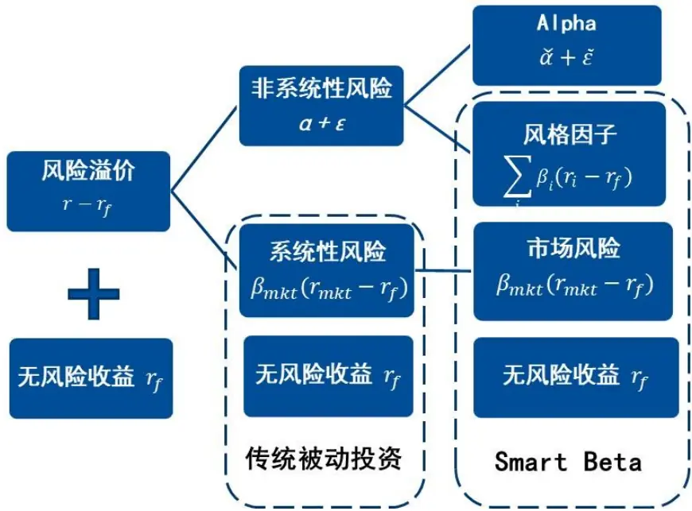
数据来源：国泰君安证券研究

基于APT的因子实证研究催生出了以SmartBeta指数为代表的因子投资策略。不同于传统被动投资策略仅考虑市场整体的系统性风险，因子投资策略投资于特定的投资风格，被认为是一种“另类的被动投资”。

Andrew（2014）将因子的风险描述为其收益表现所经历的“糟糕时刻（bad times）”，并认为投资者如果能忍受这一风险，则能够在市场达到均衡时获得该因子的风险溢价。这样的平铺直叙与APT不谋而合——超额收益存在的原因并不是资产本身能提供风险溢价，而是风险资产可以被视作对不同风险因子具有不同暴露程度的集合，底层的风险因子才是风险溢价的真正来源与驱动力。

图 2 大类资产与因子
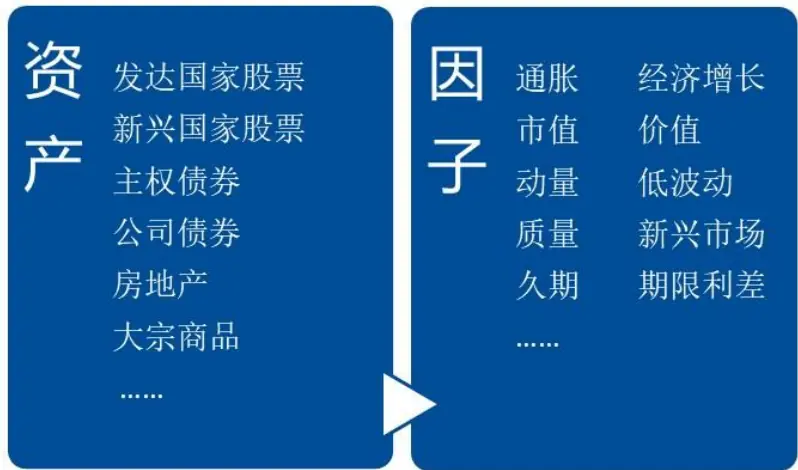
数据来源：国泰君安证券研究

## 2.1. 组合收益的因子分解

Bender et al. (2010) 对资产组合的收益率进行了分解，提出了三种因子类别，分别是对各大类资产具有共同影响的因子、风格因子和策略因子，并将收益中不能被这三类因子解释的部分视作管理能力带来的超额收益。

如下图所示，大类资产收益是被动投资于传统资产（比如股票或债券）所获得的收益补偿，主要受宏观因子（如通货膨胀、经济增长）的影响。风格因子的风险溢价则来源于资产内部对相应风格的风险暴露，包括股票市场中为人所熟知的价值风险溢价、市值风险溢价，以及债券市场中的利率期限结构、违约利差等。策略因子被定义为于对一类简单投资策略的执行，例如商品期货投资中常用的趋势投资策略或外汇交易中的利差交易策略（Carry Trade）。

图 3 Bender et al. (2010) 对资产的收益分解
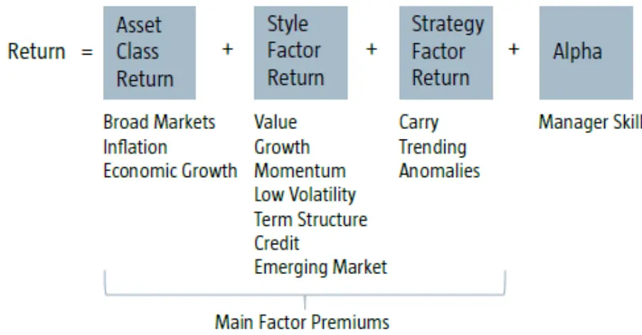
数据来源：Bender et al. (2010)，国泰君安证券研究

Andrew（2014）将因子定义为“长期来看具有高收益的投资风格（investment styles that deliver high returns over the long run）”，并强调风险溢价来源于承担该投资风格可能出现的短期亏损（例如经济滞胀时期）。他将传统的买入并持有一类资产（如股票或债券）而具有多头头寸的投资风格称为静态因子（Static Factor）；而将那些需要动态调整并且构建多空组合（Long-short Position）的投资风格称为动态因子（Dynamic Factor）。

在讨论因子投资思想时，Andrew 尤其强调因子的可投资性。对于不可直接投资的宏观因子，他称为“从学术角度看很纯粹，但难以应用（academically purer but much harder to implement）”。这是因为宏观因子对于各类资产的影响并不是简单而直接的，往往会呈现出与投资者直觉相反的情形。

总体而言，Andrew（2014）与 Bender et al.(2010)对于因子类别的划分大同小异。遵循前者对因子是否可投资的原则，我们将因子分为两类进行论述：一类是不可直接投资的宏观因子（Macro Factors），其刻画了各资产类别间的共同风险；另一类是可投资的风格因子（Style Factors），能够解释各资产类别内的风险溢价。

## 2.2. 宏观因子

Ang & Ulrich(2012) 从学术角度介绍了一种基于宏观因子的投资模型。他们从决定美国联邦基金利率（The Fed Funds Rate）的公式出发，考虑了通货膨胀和经济增长对实际债券（Real Bonds）、名义债券（Nominal Bonds）和股票（Equity）的决定作用。联邦基金利率（名义短期利率）被认为是当前总产出缺口（Output Gap）、通货膨胀预期（Inflation Expectation）以及货币政策冲击(Monetary Policy Shock)的线性函数。在给定期限下，股票资产的预期收益被分解为实际短期利率（Real Short Rate）、实际久期风险溢价（Real Duration Premium）、通胀风险溢价（Inflation Risk Premium）、预期通胀（Expected Inflation）以及实际现金流风险溢价（Real Cashflow Risk Premium）之和：

图 4 Ang & Ulrich(2012)对股票预期收益率的分解
$\mathrm{E}_{t}[R_{t}^{E,\S}(k)]=\mathrm{E}_{t}[R_{t}^{E,r}(k)]+\mathrm{E}_{t}[\pi_{t}(k)]$ Total equity return 
rt Real short rate, rt 
(yt(k) − rt) Real duration premium, DPt(k) 
+ Inflation risk premium, I RPt(k) 
+ Expected inflation, Et[πt(k)] 
+ (Et[RE,$(k)] − yi(k)) Real cashflow risk premium, CF Pt(k)
数据来源：Ang & Ulrich(2012)、国泰君安证券研究

Andrew & Ulrich(2012)对每一部分溢价进行了理论期限结构建模，并采用美国 1982 年 1 季度至 2008 年 4 季度共 27 年的季度数据，用向量自回归模型进行了联合估计。其实证结果表明，总产出缺口变动和通胀预期变动对股票收益的变动具有相当程度的解释力度，然而过多的参数设定使得该方法在实际应用中受到了极大的限制。但从建模思想来看，我们仍可以得到两点启示。其一，宏观变量的预期值与实际值的差距能影响资产未来的风险溢价。这是因为当前价格是未来资产价格的预期贴现值，只有未被当前价格定价的信息才会对未来收益产生影响。其二，由于资产的收益率难以预测，从分散风险角度而言，宏观因子对风险的解释更为重要。假定资产管理者已经得到了各类资产对不同宏观因子的暴露程度，则可以通过调节整体资产组合对因子的暴露水平来达到分散风险的目标。

遵循这一研究路径，BlackRock 的因子投资团队总结了 6 类宏观因子，分别是经济增长（Economic Growth）、真实利率(Real Rates)、通货膨胀（Inflation）、信用（Credit）、新兴市场（Emerging Markets）和商品（Commodities），并分别估计了它们对各资产的风险贡献。

图 5BlackRock基于宏观因子对大类资产的风险归因
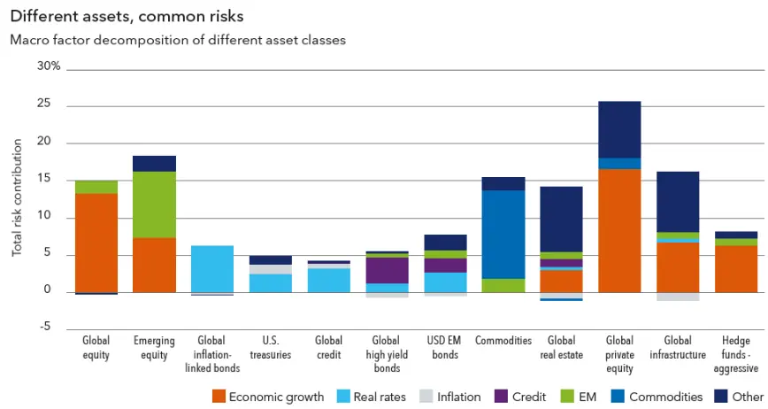
数据来源：BlackRock、国泰君安证券研究

1）经济增长（Economic Growth），由GDP 预期值与实际值之差（或总产出缺口）进行度量。对经济增长敏感的资产在经济扩张时期具有较高收益，而在经济下行时期表现不佳，包括股票、私募股权投资、房地产等。

2）实际利率(Real Rates)，由实际利率的预期值与实际值之差度量。对实际利率敏感的资产主要是债券类资产，其在利率下行时表现良好，而反之则表现不佳。

3）通货膨胀（Inflation），由通胀水平的预期值与实际值之差度量，对其敏感的资产主要是名义债券——当通胀预期上升，资产价格下降。

4）信用（Credit），由违约率的预期值与实际值之差度量，对其敏感的资产主要包括信用债和房地产。

5）新兴市场（Emerging Markets），由新兴市场和发达市场股票收益率之差度量，反映了对新兴市场的政治不确定性的风险补偿。

6）商品（Commodities），由商品价格的超预期变动度量。通常，机构投资者并不持有商品现货，而是通过投资商品期货市场来获得对商品资产的暴露。

Andrew & Ulrich(2012)利用宏观因子对资产风险进行分解的方法具备坚实的金融经济理论背景，但由于 GDP 数据的披露周期为季度，这一研究路径往往需要较长的宏观历史数据来估计资产对于宏观因子的敏感性水平。与之相对的，Greenberg et al.（2016）通过构建大类资产间的多空组合定义了6类相似的宏观因子，并在给定目标因子暴露约束条件下对 15 类大类资产进行了配置。这一方法的优点是将宏观因子变成了“可投资”的大类资产多空组合，但伴随的缺点则是给定目标宏观因子暴露这一条件本身就已经对各大类资产给出了隐含的配置比例——其本质是将大类资产的配置问题转化为了如何确定资产组合的目标因子暴露问题。

在实际投资中，桥水集团（Bridgewater Associates）的全天候策略（AllWeather Strategy）可以被认为是考虑了经济增长和通货膨胀的简单版宏观因子投资框架。该策略估计了不同资产分别在经济增长和通货膨胀的四个不同时期的表现（如下图所示）。全天候策略承认未来经济状态的无法预测性——策略对于四种可能出现的宏观环境分别给出了相等的概率，并用风险平价配置方法对不同环境下所选择的资产组合进行配置。换言之，在没有更多信息的条件下，投资者具有相同的概率“赌中”某一宏观环境，并通过相对应的资产组合获得收益，以达到长期表现稳健的配置目标。

图 6 桥水集团的全天候策略示例
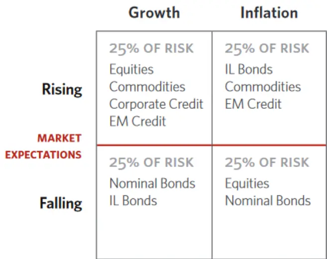
数据来源：Bridgewater、国泰君安证券研究

## 2.3. 风格因子

对股票、债券或衍生品进行一些简单的投资策略长期来看能够超越其所属市场的整体收益水平。这些投资策略往往通过构建多空组合来减小对相应市场风险的暴露，从而剥离出对应风格的风险溢价。因为代表了不同的投资风格，它们也被视作不同市场的风格因子，在业界被称为Smart Beta、Alternative Beta 或者 Exotic beta。

常见的风格因子包括价值-成长溢价（Value-Growth Premium，价值类与成长类股票的收益率之差）、动量溢价（Momentum Premium，历史表现较好与较差股票的收益率之差）、流动性溢价（Illiquidity Premium，低流动性股票与高流动性股票收益率之差）、波动率溢价（Volatility Risk

Premium，通过卖价外看跌期权并利用股票或者看涨期权构建的市场中性组合）等等。

面对数量繁多的风格因子，首先要回答的问题就是如何对因子进行有效的选择。在对挪威政府养老基金的评估中，Andrew 对如何筛选出可以作为资产配置对象的风格因子给出了四条准则：

1）风格因子必须具有严谨的金融经济理论支持。虽然在通常情况下我们无法对风格因子风险溢价背后的形成机制达成完全一致的共识，但持续地对风格因子进行严谨的讨论保证了其风险溢价具有强有力的逻辑支撑。

2）风格因子需要具备显著的风险溢价，并且该风险溢价预期在未来仍可持续。因子的风险溢价并不应该只在存在于历史——它应该能在未来的一段时期中仍持续存在。这意味着因子的风险是“系统性”的——尽管这一风险可能来自于投资者的心理因素或行为偏差，但其溢价并不会随着因子策略被投资者所熟知或广泛采用而消失。

3）风格因子收益的历史数据足够完备，必须覆盖表现糟糕的时期。风险溢价是承担该投资风格可能出现的短期亏损的补偿，我们需要足够长的收益数据来评估风险溢价在各个时期的表现，才能对其收益和风险的配置做出权衡。

4）风格因子能够通过流动性好、可交易的金融工具进行构建。大型机构投资者对其所配置策略的资金容量具有一定要求。因此，理想的因子策略应当具备较低的构建成本，并且由流动性好的证券组合而成。

值得指出的是，用于进行资产配置的风格因子通常是被市场所广泛认知的一类“系统性”风险，或者说风险因子。而具有统计意义的“异象（anomalies）”，或者说 alpha 因子，并不在考虑范围。只有当这些 alpha因子被市场所熟知并成为一种稳定的投资风格，才能作为配置的对象。

那么接下来要回答的问题是：如何构建可投资的风格因子基准并应用于资产配置中？

Ananth et al. (2017) 基于 Barra 股票风险模型给出了一个用纯多头因子组合进行资产配置的解决路径。他们以5个 MSCI因子指数来分别代表 5 类因子风格：MSCI USA Enhanced Value Index 代表价值因子（Value），MSCI USA Momentum Index 代表动量因子（Momentum），MSCI USA Risk Weighted Index 代表市值风格（Size），MSCI USAMinimum Volatility Index 代表低波动因子（Low Volatility），MSCI USASector Neutral Quality Index 代表质量因子（Quality）。这些因子指数在美国市场上都具有相应的可投资ETF标的。基于Barra 风险模型的因子暴露，这 5 类因子指数可以在时间截面上“尽可能地复制”（即最小化风险因子上的跟踪误差）传统的基于市值加权的指数（如 S&P500）。他们的研究发现，美国市场上大部分的主流市场指数可以有效地被 2 个或 3个因子指数所复制。应用这样的方法，管理者可以将传统资产配置组合中的资产价格指数“映射”到各因子指数上，也可以通过考察市场主流指数历史上的“风格组成”来分析其不同时期风险溢价的主要来源。在其官网上，BlackRock 公布了美国市场主要指数相对各风格指数的“历史分解”。

图 7 BlackRock 对 S&P500 的风格分解
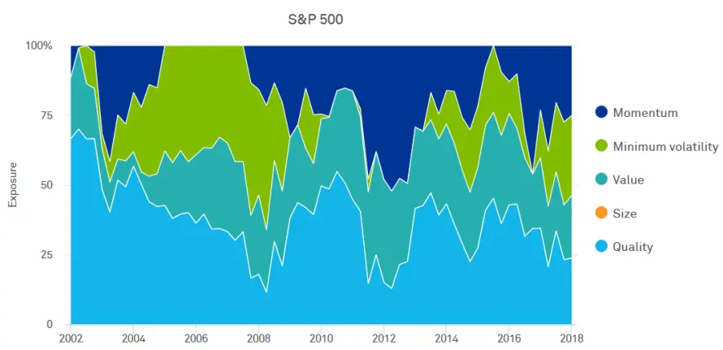
数据来源：BlackRock、国泰君安证券研究

## 3. 基于因子投资的资产配置方法

在讨论如何将因子投资应用于资产配置之前，我们先简单回顾一下资产配置的一般流程。

养老金等大型机构投资者通常会在整体上设计一个标准化的决策机制，往往是一个有序的、分层决策体系。如下图所示，大型机构投资者通常会在第一层次通过债务驱动的决策方法确定投资策略的整体风险偏好以及效用函数，并通过量化的方法构建长期的战略资产配置组合（Strategic Asset Allocation，SAA）。而第二层次的战术资产配置（TacticalAsset Allocation，TAA）以 SAA 作为基准，在原有的配置比例上考虑经济周期等影响进行调整。第三层次的投资组合则由一系列不同的投资风格或投资经理构成，以达到多元风格、分散风险的目的。整个投资体系会包含一个监控和研究分析框架，来对种类繁多的投资风格或投资策略进行跟踪、分析和反馈，并帮助管理人更好地选择具体的策略。而最终的实际交易决定了所选择的风格策略是否能得到有效执行。

图 8 大型机构投资者资产配置的一般流程
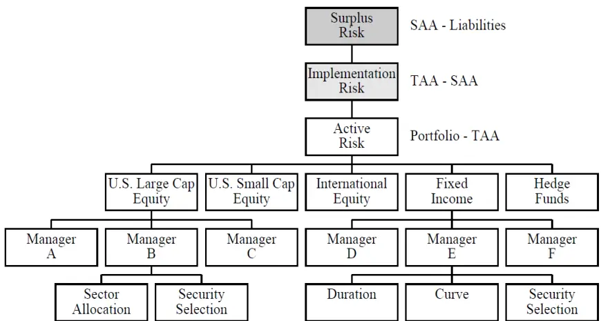
数据来源：Mina（2005）、国泰君安证券研究

基于因子的资产配置方法并不需要完全颠覆传统的资产配置决策体系，而是在原有的框架里优化各层次组合的风险收益表现来更好地达到配置目标。Koedijk et al.(2014)总结了三种将因子投资应用于资产配置的路径，分别是对组合风险的尽职调查（Risk Due Diligence）、对风格因子的调整（Factor Tilts）和自下而上基于风格因子的优化（FactorOptimization）。

## 3.1.对组合风险的尽职调查

这一路径的思想是基于因子的风险管理和风险归因，并进一步达到优化资产配置比例的目标。证券组合层面上基于风格因子的业绩归因和风险归因方法已经被投资者采纳，并被广泛用于对产品或策略的跟踪和反馈，报告在此不做累述。以下，我们主要介绍在战略资产配置层面利用宏观因子对资产组合进行分析的思路。

理想状态下，我们可以估计各大类资产对各个宏观因子的风险暴露程度，进而根据当前所配置的资产权重对整体组合在各个宏观因子上的风险暴露进行尽职调查，最后采用定量或定性的方法给出配置建议。该操作流程如下图所示。

图 9 利用因子对SAA组合风险进行风险尽调示例
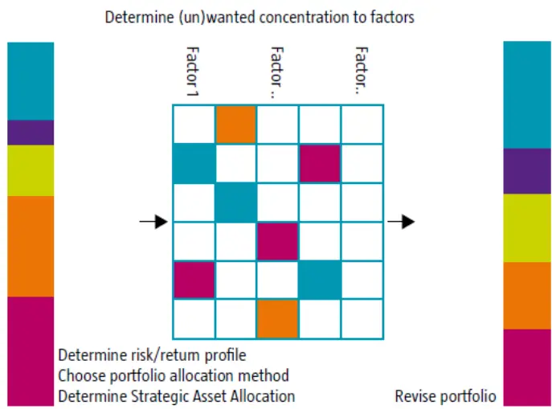
数据来源：Koedijk et al. (2014)、国泰君安证券研究

这里，我们以宏观因子等风险贡献组合作为初始配置组合来介绍在SAA层面利用宏观因子对资产配置比例进行调整的步骤。

1）构建基于宏观因子的等风险贡献组合。对所考虑的宏观因子（如BlackRock的 6类宏观因子——经济增长、真实利率、通货膨胀、信用、新兴市场和商品），采用风险平价（Risk Parity）方法进行配置，使得各因子对整体组合的风险贡献相等。在理论上，当各因子的因子收益具有相同的 Sharpe 比例并且之间的相关系数均为 0 时，等风险贡献组合就是最优的组合。但在现实中，各因子收益具有相同的 Sharpe 比例难以满足，收益间的相关性也往往在时间序列上呈现动态变化。对具体的配置需求，管理人往往还需要考虑可能存在的尾部风险（如资产组合的最大回撤）以及各资产的流动性。因此，需要进一步根据特定的配置需求对各宏观因子的风险贡献比例进行调整。

2）根据配置需求，在等风险贡献比例上进行调整，得到各宏观因子的风险预算。下表展示了根据配置需求调整宏观因子风险预算的示例。假定我们从收益风险比、尾部风险、流动性三个方面考察 6类宏观因子对组合整体的贡献。经济增长和信用两个因子收益率往往具有更高的Sharpe比，因此从收益风险比维度来看，我们建议上调两者的风险预算比例（下表中，“+”、“-”、“=”分别表示在该考虑维度下对某一宏观因子的风险预算进行上调、下调以及不变）。从尾部风险角度来说，我们建议上调真实利率、通货膨胀的风险预算比例而下调经济增长、信用和新兴市场的预算比例。同理，我们也能从流动性角度给出建议，最后得到综合的调整建议，并在原有等权的风险预算比例上进行调整，得到符合需求的风险预算。

表 1: 根据配置需求调整风险预算示例

| 考虑维度 | 经济增长 | 真实利率 | 通货膨胀 | 信用 | 新兴市场 | 商品 |
| --- | --- | --- | --- | --- | --- | --- |
| 收益风险比 | + | = | = | + | = | = |
| 尾部风险(最大回撤幅度) | - | + | + | - | - | = |
| 经济不景气时期的流动性 | = | + | + | = | - | = |
| 综合调整建议 | = | + | + | = | - | = |
| 调整前风险预算占比 | 16.7% | 16.7% | 16.7% | 16.7% | 16.7% | 16.7% |
| 调整后风险预算占比 | 16.0% | 25.0% | 20.0% | 16.0% | 7.0% | 16.0% |

数据来源：国泰君安证券研究

3）根据调整后的风险预算比例，结合资产组合整体目标风险水平，确定各资产的配置比例。在得到各宏观因子的风险预算后，我们就可以在给定的整体组合目标风险水平下，通过优化方法确定宏观因子的配置权重，进而得到各大类资产的配置权重。

以上展示了利用宏观因子在SAA层面对资产配置比例进行调整的步骤。采用这一方法有两个关键点。一是各大类资产对各个宏观因子的风险暴露的估计——其决定了如何将宏观因子的配置权重对应到资产权重上。二是对各宏观因子风险预算的调整。在这一点往往需要结合定性以及定量分析方法，并根据具体的配置需求给出调整建议。有关宏观因子的应用以及风险预算调整的研究，我们将在后续的报告中进一步讨论。

## 3.2.对风格因子的调整

在原有的大类资产配置权重基础上，管理者可以调整各资产内部的风格因子来达到主动管理的目标。这一路径并不需要改变原有大类资产的配置比例，而是通过分散并优化资产内部的风格组成来提高组合的整体表现。下图给出了利用风格因子对大类资产内部进行风格调整的示例。

图 10 利用风格因子对资产内部风格进行调整示例
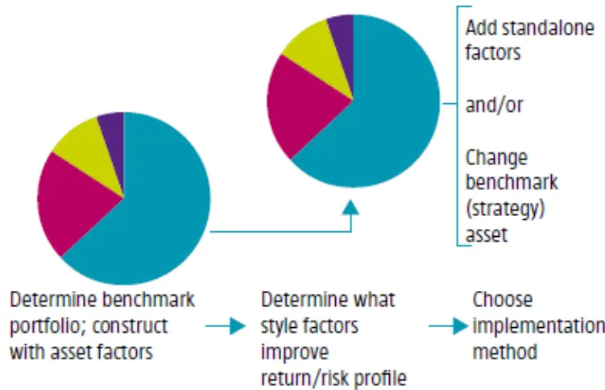
数据来源：Koedijk et al. (2014)、国泰君安证券研究

遵循这一路径，我们在下一章节展示了如何利用可投资的风格因子组合对市场主流指数进行“复制”。通过这一方法，管理者可以分析原有配置方案下资产内部的风格组成，并且在不改变原有方案的同时获得稳定配置风格因子带来的风险收益表现的提升。进一步，可投资的风格因子组合将是风格配置研究的天然配置标的，管理人可以结合主观或因子择时的研究结果对资产内部的风格因子权重进行调整以达到主动管理的目标。

## 3.3.自下而上基于风格因子的优化

对组合风险的尽职调查和对风格因子的调整这两种路径都是在传统的分层资产配置体系下，利用因子投资的方法改善资产组合的表现来更好地实现资产配置的具体需求。

相之对的，自下而上基于风格因子的优化则打破了传统自上而下的分层决策体系，直接以风格因子或者风格策略作为配置标的并通过优化方法确定配置比例。这样做的优势是风格因子之间的相关性往往要比的资产之间的相关性更为稳定（IImanen & Kizer，2012）。宏观因子对风格因子的理论逻辑联系相较于对大类资产也更为紧密。本质上，这一路径是将不同市场上的投资风格（或投资策略）视作投资标的，从传统的配置不同的资产发展为配置不同风格的策略，这也是因子投资的核心思想和最终目标。这一路径虽然具备相当的理论以及实证研究上的支持，但在实际中由于过于颠覆传统体系并且提高了相应的沟通成本而尚未得到广泛应用。

以上，我们介绍了对组合风险的尽职调查、对风格因子的调整和自下而上基于风格因子的优化这三种将因子投资应用于资产配置的路径。前两者并不需要改变原有资产配置的分层决策体系，而是在原有的配置方案上基于因子投资思想改善组合整体的风险收益表现。自下而上基于风格因子的优化这一路径则是因子投资的核心思想和最终目标，也将是这一研究的未来发展方向。遵循对风格因子调整这一路径，我们接下来在中国股票市场进行了实证研究。

## 4. 因子投资在中国股票市场的应用

2018 年 2 月 11 日，中国证监会公布《养老目标证券投资基金指引（试行）》，明确了养老基金应当采用基金中基金（FOF）形式或中国证监会认可的其他形式进行运作。以此为契机，中国被动投资市场有望迎来加速发展。高透明度、低费率的指数类产品天然地适合作为资产配置的底层资产。《指引》中也体现了对指数基金的“优待”——子基金为指数基金和ETF等品种的，运作期限应当不少于1年，最近定期报告披露的季末基金净资产不低于 1 亿元，而普通基金则分别需要 2年和 2亿元。

以SmartBeta 为代表的因子投资产品在具备被动投资高透明、低费率的优势同时，还能产生相应投资风格的超额收益。同时，资产配置的管理者也无需再担心由于子基金管理人风格切换对整体组合的影响。遵循前文提及的对风格因子进行调整的应用路径，本章节尝试在中国股票市场上应用因子投资方法来提高股票资产的收益风险表现。

## 4.1. 采用现有中证指数代表风格因子

参照MSCI的5 大因子指数，我们首先选取了5个现有的中证指数来代表中国市场的主要风格因子。风格因子与对应的中证指数如下表所示。

表 2: 根据风格因子选取的中证指数

| 风格因子 | 对应指数 | 指数编制简要说明 |
| --- | --- | --- |
| 动量 | 中证 800 动量 | 以中证800样本股作为样本空间，采用过去一年的风险调整价格动量，并 选取动量评分最高的250只股票作为样本股，采用调整后市值加权。 |
| 低波动 | 中证稳健低波 | 从沪深A股中选取50只流动性好、财务较为稳健且波动率较低的股票作 为指数样本股，采用波动率倒数加权。 |
| 质量 | 中证盈利质量 | 从沪深A股中选取100只流动性好、盈利质量较高的股票作为指数样本股， 采用盈利质量指标调整后的市值进行加权。 |
| 价值 | 中证 800 价值 | 以中证800指数为样本空间，从中选取价值因子评分最高的250只股票作 为样本股，以价值因子调整后的市值进行加权。 |
| 市值 | 中证1000 | 中证1000 指数由全部A 股中剔除中证800 指数成份股后，规模偏小且流 动性好的1000只股票组成，采用调整后市值加权。 |

数据来源：中证指数公司、国泰君安证券研究

因子投资首要的优点就是可以简单、低成本地获得某一投资风格的长期超额收益。以下，我们统计了各指数相对中证800 的超额收益表现。在2008年至 2017年的十年间，除了 800动量指数跑输中证 800以外，其余指数的年化超额收益均为正。其中，中证稳健低波的年化超额收益最高，达到7.67%，信息比（IR）0.65。而从分年度超额收益表现来看，各指数表现分化明显。市值风格和价值风格的切换是近十年来市场投资的主旋律，中证 1000 和中证 800 指数分年度的超额收益表现出了明显的“跷跷板”现象。而近年来，受金融去杠杆、A 股纳入 MSCI等宏观事件影响，中国股票市场结构性变化明显。2017年中证 800动量指数表现非常突出，相对中证800 的超额收益达到了12.48%。

表 3:各指数相对中证 800超额收益表现（2008-2018）

|  | 800 动量 | 稳健低波 | 盈利质量 | 800 价值 | 中证1000 |
| --- | --- | --- | --- | --- | --- |
| 年化超额收益 | -1.84% | 7.67% | 5.73% | 1.92% | 4.82% |
| 年化跟踪误差 | 6.79% | 12.50% | 12.23% | 6.87% | 14.72% |
| IR | -0.24 | 0.65 | 0.52 | 0.31 | 0.39 |
| 最大相对回撤 | 37.51% | 29.28% | 28.56% | 18.63% | 41.46% |

数据来源：Wind、国泰君安证券研究

表 4:各指数相对中证800年化超额收益

| 时间 | 800 动量 | 稳健低波 | 盈利质量 | 800 价值 | 中证1000 | 中证800 （绝对收益率） |
| --- | --- | --- | --- | --- | --- | --- |
| 2008 | -3.86% | 34.27% | 13.13% | 2.17% | 17.92% | -64.95% |
| 2009 | -12.34% | 4.95% | 15.38% | -0.87% | 18.15% | 103.65% |
| 2010 | 14.80% | 26.51% | 14.65% | -12.39% | 26.95% | 7.32% |
| 2011 | -8.64% | -5.74% | -3.92% | 9.19% | -7.20% | -27.38% |
| 2012 | 1.63% | -3.29% | -5.83% | 4.37% | -6.25% | 5.81% |
| 2013 | -1.13% | 33.68% | 28.10% | -6.04% | 33.97% | -2.13% |
| 2014 | -11.69% | -4.53% | -5.79% | 7.20% | -9.82% | 48.28% |
| 2015 | -13.30% | 50.02% | 39.62% | -7.29% | 53.24% | 14.91% |
| 2016 | -0.50% | 4.54% | 1.82% | 6.62% | -6.23% | -13.27 |
| 2017 | 12.48% | -19.96% | -20.61% | 11.30% | -28.15% | 15.16% |
| 2018(截至 5.9) | 1.19% | 2.65% | -1.14% | -0.81% | -1.09% | -3.84% |

数据来源：Wind、国泰君安证券研究

因子投资的另一优势是各风格因子的超额收益的相关性稳定且风险收益特征迥异，这使得管理人可以通过投资 SmartBeta产品或低成本构建底层风格因子组合来实现战术资产配置。下图分别展示了各中证指数2008年至 2018年间的超额收益率累计曲线、历史相关系数和各指数的风险收益表现。五个指数中，稳健低波、盈利质量和 800价值三者超额收益的正相关性较高（分别达到了 0.83、0.83和0.9）。这一结果并不十分理想，造成这样的原因与指数构建时未对行业权重做任何控制有关——行业因子是股票市场重要的一类风险因子。

事实上，风格因子指数的编制和选取是因子投资的首要环节。由于中国市场目前仍缺少适合进行因子投资分析的系列指数，我们接下来将尝试构建规则简单、透明且行业中性的可投资因子组合，并以此进行后续的分析。

图 11 各指数相对中证 800 累计超额收益率
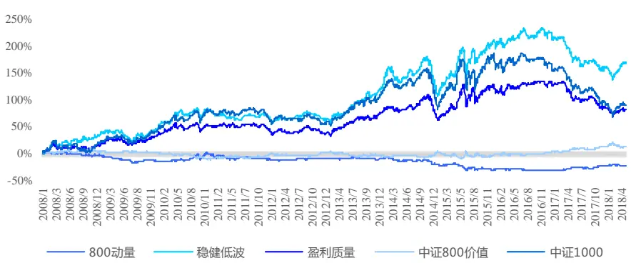
数据来源：国泰君安证券研究

图 12 各指数超额收益相关系数（2008-2018）
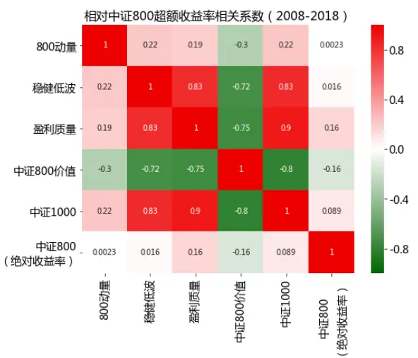
数据来源：国泰君安证券研究

图 13 各指数风险收益表现（2008-2018）
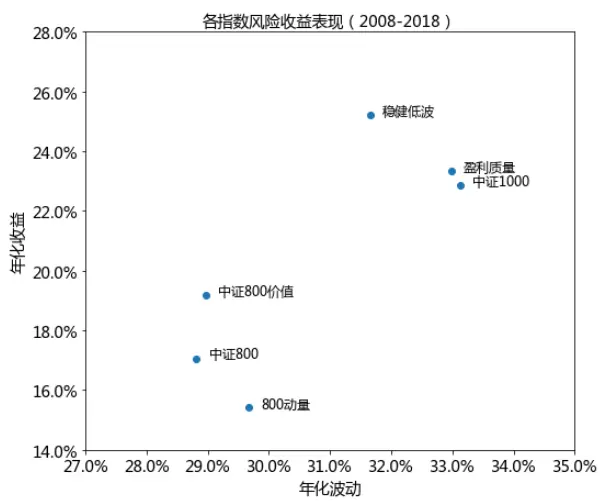
数据来源：国泰君安证券研究

## 4.2. 自行构建 Smart Beta 组合

我们以中证800指数作为基准构建了 6 个规则简单、透明且行业中性的风格因子组合，分别是价值（Value）、质量（Quality）、市值（Size）、成长（Growth）、动量（Momentum）和低波动（Low Volatility）。

考虑到SmartBeta 的被动投资属性，我们在构建组合时采用了季度作为调仓频率，这使得组合可以近似被视所一个可投资的被动指数。风格因子的可投资性原则促使我们并没有构建传统的多空因子组合或是纯因子组合——前者难以在具有较强卖空限制的中国市场实现，后者则高度依赖特定的风险模型并且具有较高的换手率。类似的，我们并没有在构建因子组合时对其余风格进行约束，这主要是希望构建的组合符合简单、透明、低成本的原则。尽管通过风险模型约束或“纯化”后的因子组合往往具备更好的风险收益表现和更低的相关性。各风格因子组合的具体构建方法详见附录。

以下，我们分别统计了各组合2009年至2018年 5月的表现以及相对中证800指数每年的年化超额收益水平。可以看到，所有风格因子组合都表现出了显著的超额收益，年化双边换手率均在1 倍到 1.5倍左右，历史Beta 在0.9~1.1 附近。除了市值因子组合的年化跟踪误差较大以外，其余组合的年化跟踪误差均在 6.20%至7.09%之间。

表 5:各风格因子组合表现（2009-2018）

|  | 成长 | 低波 | 动量 | 质量 | 市值 | 价值 | 中证800 |
| --- | --- | --- | --- | --- | --- | --- | --- |
| 年化收益率 | 8.64% | 11.19% | 8.30% | 10.79% | 17.45% | 14.71% | 7.011% |
| 年化波动率 | 28.49% | 23.76% | 28.25% | 27.06% | 31.31% | 25.74% | 25.88% |
| Sharpe | 0.43 | 0.57 | 0.42 | 0.51 | 0.67 | 0.66 | 0.39 |
| 年化换手率 | 131% | 131% | 116% | 149% | 144% | 123% |  |
| 年化超额收益率 | 2.22% | 3.14% | 1.62% | 3.79% | 10.66% | 6.88% |  |
| 年化跟踪误差 | 7.09% | 6.64% | 6.87% | 6.20% | 11.19% | 7.01% |  |
| IR | 0.31 | 0.47 | 0.23 | 0.61 | 0.95 | 0.98 |  |
| 历史Beta | 1.07 | 0.89 | 0.97 | 1.01 | 1.14 | 0.97 |  |
| 最大相对回撤 | 11.55% | 15.68% | 12.23% | 15.64% | 31.37% | 13.77% |  |

数据来源：Wind、国泰君安证券研究

图 14 成长因子组合表现（2012-2018）
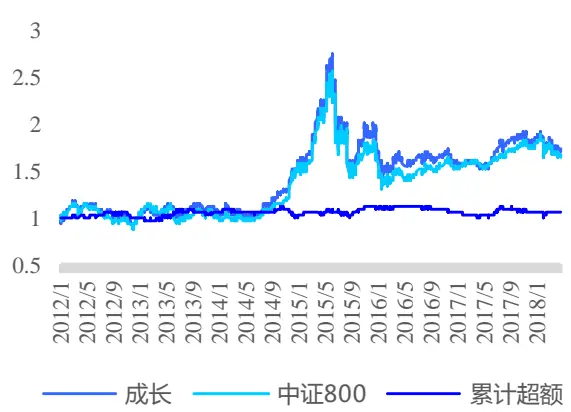
数据来源：国泰君安证券研究

图 15 低波因子组合表现（2012-2018）
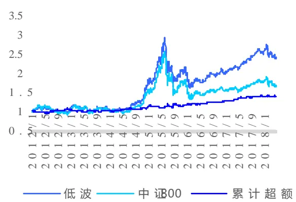
数据来源：国泰君安证券研究

图 16 动量因子组合表现（2012-2018）
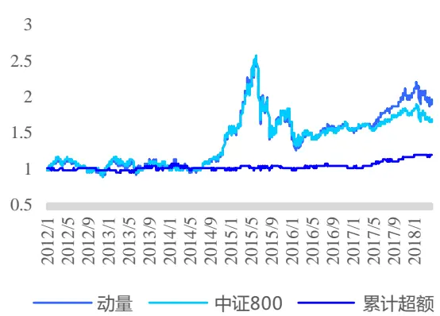
数据来源：国泰君安证券研究

图 17 质量因子组合表现（2012-2018）
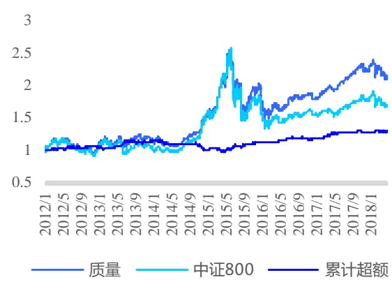
数据来源：国泰君安证券研究

图 18 市值因子组合表现（2012-2018）
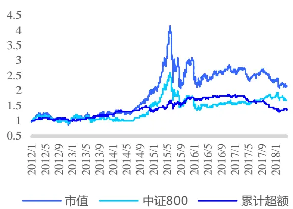
数据来源：国泰君安证券研究

图 19 价值因子组合表现（2012-2018）
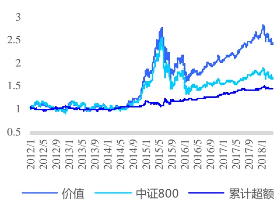
数据来源：国泰君安证券研究

表 6:每年各因子组合相对中证800年化超额收益（2009-2018）

| 时间 | 成长 | 低波 | 动量 | 质量 | 市值 | 价值 | 中证 800 （绝对收益率） |
| --- | --- | --- | --- | --- | --- | --- | --- |
| 2009 | 5.87% | -6.35% | -5.49% | -2.29% | 42.19% | 18.07% | 103.65% |
| 2010 | 10.13% | -9.37% | 11.71% | 10.03% | 21.70% | -8.82% | 7.32% |
| 2011 | -4.63% | 11.75% | -4.13% | 1.56% | -2.68% | 15.26% | -27.38% |
| 2012 | 0.03% | 3.22% | -1.17% | 4.17% | -1.84% | 1.82% | 5.81% |
| 2013 | 4.78% | -2.04% | 0.34% | 7.32% | 20.34% | -4.79% | -2.13% |
| 2014 | -3.29% | 9.52% | 0.01% | -13.06% | 9.37% | 15.67% | 48.28% |
| 2015 | 9.38% | 3.77% | -0.27% | 12.93% | 37.36% | 3.94% | 14.91% |
| 2016 | -4.18% | 9.89% | 2.22% | 5.90% | 2.43% | 11.57% | -13.27 |
| 2017 | -0.34% | 9.85% | 15.11% | 8.96% | -24.09% | 10.41% | 15.16% |
| 2018(截至 5.9) | 0.96% | 0.91% | 1.28% | 0.75% | -2.06% | 0.22% | -3.84% |

数据来源：国泰君安证券研究

各风格因子组合的累计超额收益率、超额收益率相关系数和风险收益表现展示如下。对比前文挑选的中证指数，我们所构建的可投资因子组合的累计超额收益除了市值因子波动较大外均相对稳定（对比图 11与图20），超额收益率间的相关性也明显降低（对比图 12与图 21）。这使得我们可以通过战术性地配置这些风格因子组合来改善组合整体的风险收益表现。

图 20各因子组合相对中证 800累计超额收益率
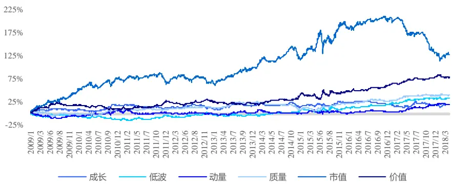
数据来源：国泰君安证券研究

图 21 各因子组合超额收益相关系数（2009-2018）
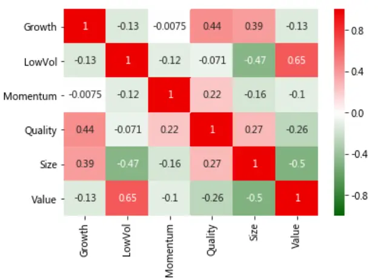
数据来源：国泰君安证券研究

图 22 各因子组合风险收益表现（2009-2018）
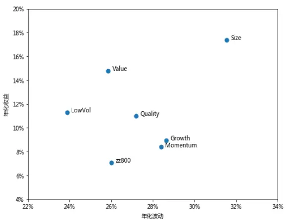
数据来源：国泰君安证券研究

虽然在构建风格因子组合时我们并没有涉及到风险模型，但后者在因子投资中的作用至关重要。如前文所述，因子投资所考虑的风格因子是“系统性”，是承担全市场熟知的风险所获得的补偿。因此，SmartBeta的超额收益本质上是对市场熟知的风险因子进行暴露获得的风险溢价。一方面，我们可以利用风险模型了解各风格指数或因子组合的风格暴露，分析超额收益来源。另一方面，在对因子组合进行配置时，我们可以通过风险模型更好地估计因子组合间的相关性以及整体组合的风险。对于后者，我们将在下一节中采用最小化跟踪误差的方法，利用风格因子组合“复制”沪深300指数和中证500指数。

以下，我们展示了所构建的各风格因子组合在调仓日相对中证 800指数的平均主动风险暴露水平。所用的风险模型的因子选取和构建方法详见报告《基于组合权重优化的风格中性多因子选股策略》。

成长组合不出意外地在成长因子上得到了正向暴露，但也在中市值因子上暴露明显。低波动组合的主动风险暴露主要在流动性、残差波动率和Beta 三个因子上。动量组合较为理想地只在动量因子上正向暴露较高。质量组合所期望暴露的风险是杠杆因子，但在价值因子的负向暴露明显。市值组合在市值因子上暴露显著。而价值组合在中市值、流动性、价值、残差波动率和盈利能力 5大因子上均有较高的主动风险暴露。

图 23 成长组合平均主动风险暴露（2009-2018）
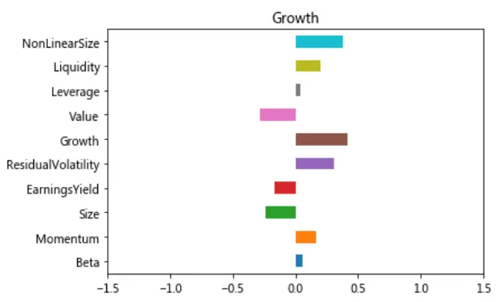
数据来源：国泰君安证券研究

图 24 低波动组合平均主动风险暴露（2009-2018）
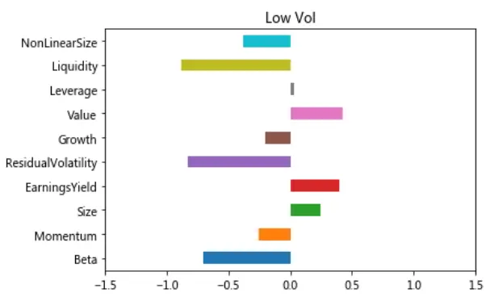
数据来源：国泰君安证券研究

图 25 动量组合平均主动风险暴露（2009-2018）
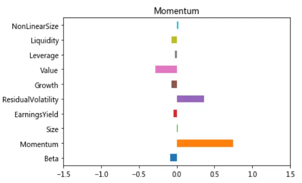
数据来源：国泰君安证券研究

图 26 质量组合平均主动风险暴露（2009-2018）
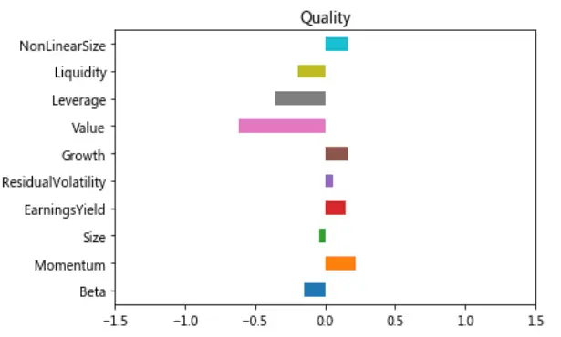
数据来源：国泰君安证券研究

图 27 市值组合平均主动风险暴露（2009-2018）
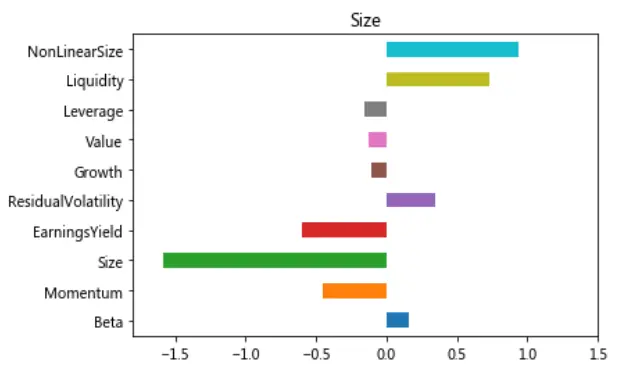
数据来源：国泰君安证券研究

图 28 价值组合平均主动风险暴露（2009-2018）
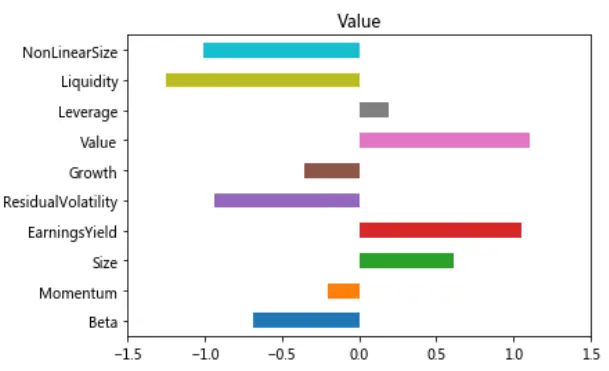
数据来源：国泰君安证券研究

实际中，我们在资产配置时对底层组合主动风险暴露的后验分析主要有两个应用场景：一是可以将现有因子组合进行简单组合来“对冲”不希望获得的主动风险暴露，从而得到收益风险表现更为稳健的配置效果；二是可以以此为启发，尝试在构建长期可投资的因子组合时直接采用两到三种风格因子。

## 4.3. 利用风格因子组合对市场指数进行复制

Ananth et al. (2017) 的研究指出，美国市场主流的市值加权指数可以有效地被2 个或3个因子指数所复制。通过这样的方法，资产管理人可以非常容易地将现有对市场指数的配置方案应用到相应的因子投资组合上，在不改变原有大类资产配置比例的同时获得稳定配置风格因子带来的风险收益表现的提升。利用前文所构建的因子组合，我们在2010年至 2018 年的每个季度末，通过最小化跟踪误差的方法对沪深 300 指数和中证 500 指数进行了“复制”。具体来说，在每个季末的时间截面上，我们对如下的优化问题进行求解：

$$
\begin{aligned}&\min w^{T}\Sigma w\\&s.t.\Sigma=F_{active}\Sigma_{f}F_{active}^{T}\\&w^{T}I=1\\&w\geq0\\\end{aligned}
$$

其中， 为各风格因子组合的权重向量， 为各风格因子相对被复制指数的主动风险暴露所形成的方差协方差矩阵，以 $\Sigma=F_{active}\Sigma_{f}F_{active}^{T}$ 进行计算。 $F_{active}$ 为各风格因子组合相对被复制指数的主动风险暴露矩阵， $\Sigma_{f}$ 为风险因子间的方差协方差矩阵。

为了便于理解，上面的最小化问题可以等价于求解如下的优化问题：

$$
\begin{aligned}&\min(F_{active}^{T}w)^{T}\Sigma_{f}F_{active}^{T}w\\&s.t.w^{T}I=1\\&w\geq0\\\end{aligned}
$$

其中， $\cdot F_{active}^{T}w$ 为整体组合相对被复制指数在各风险因子上的主动风险暴露的向量，整个优化问题也就等价于最小化由于主动暴露风险因子带来的跟踪误差。

利用所构建的风格因子组合对沪深300指数和中证500指数的复制效果如下表所示。其中，复制沪深300组合的效果较好，年化跟踪误差为 3.74%，年化超额收益达到 6.11%，IR 1.63，年化换手率 309%，月胜率70.40%。对中证500指数的复制效果稍差，年化跟踪误差为 6.32%，年化超额收益率 2.89%，IR 0.46，年化换手率 140%，月胜率 55.10%。

表 7:利用风格因子组合复制指数表现（2010-2018）

|  | 复制沪深 300 组合 | 沪深 300 指数 | 复制中证 500 组合 | 中证 500 指数 |
| --- | --- | --- | --- | --- |
| 年化收益 | 7.70% | 1.50% | 5.69% | 2.72% |
| 年化波动率 | 23.84% | 23.60% | 28.31% | 27.49% |
| Sharpe | 0.43 | 0.18 | 0.34 | 0.23 |
| 年化换手率 | 309% |  | 140% |  |
| 年化超额收益率 | 6.11% |  | 2.89% |  |
| 年化跟踪误差 | 3.74% |  | 6.32% |  |
| IR | 1.63 |  | 0.46 |  |
| 最大相对回撤 | 6.12% |  | 12.70% |  |
| 月胜率 | 70.40% |  | 55.10% |  |

数据来源：国泰君安证券研究

## 4.3.1. 对沪深300指数复制效果分析

下面展示了利用因子组合复制沪深300指数的每季度权重分布、净值曲线以及滚动120个交易日的年化跟踪误差。可以看到，沪深300指数在每个季度都可以被3至4 个因子组合有效地复制，滚动 120日的年化跟踪误差在 2%~6%左右。2010 年至今的两次较为剧烈的风格切换在复制权重图中也得到了清晰的体现。2013年1季度，组合中超过 85%的权重配置在了动量因子组合上，并且出现了历史上唯一一次对市值组合的配置（比例为 7.0%）。2016年4季度，组合超过65%的权重配置在了价值组合上。这两次风格切换也对应了两次跟踪误差的峰值。截至2018年 1 季度，复制沪深 300 组合的权重配比为价值组合 4.8%、动量组合68.2%和低波动组合 27.0%。

图 29 复制沪深 300指数每季度权重
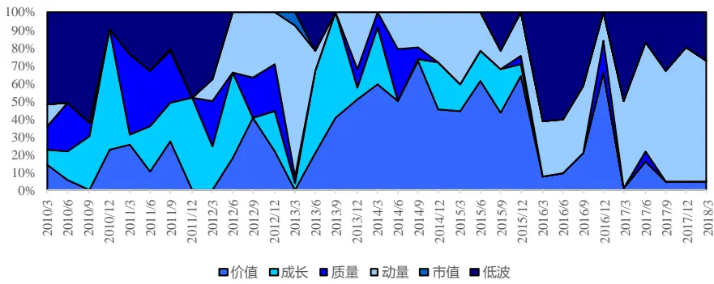
数据来源：国泰君安证券研究

图 30 复制沪深300组合净值表现
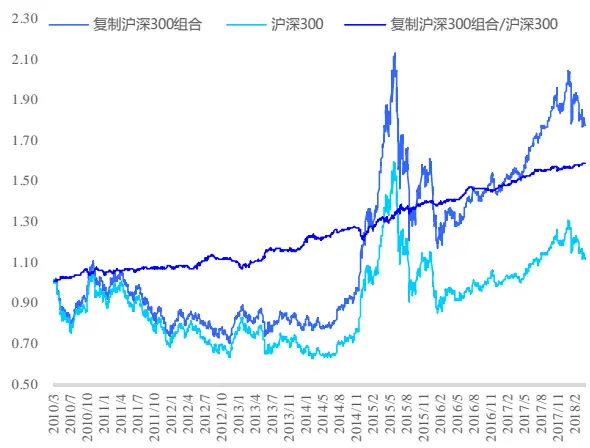
数据来源：国泰君安证券研究

图 31 复制沪深300组合120交易日滚动跟踪误差
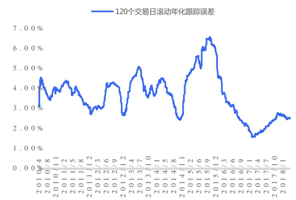
数据来源：国泰君安证券研究

## 4.3.2. 对中证500指数复制效果分析

下面展示了对中证500 指数的复制效果。由于我们在构建市值组合时采用了流通市值对数这一指标，市值组合不出意料地在历史上占据了复制中证500指数组合的大部分比例。这也导致了现有构建的因子组合在跟踪风格多样的中证 500 指数时相形见绌——年化跟踪误差达到了6.32%。从 120交易日的滚动跟踪误差来看：2015年初至 2016年中旬A股市场的巨幅震荡使得组合跟踪误差达到峰值——年化数值一度超过16%；但其余时间段仍相对稳定，均处于6%以内。截至 2018年1 季度，复制中证500组合的权重配比为成长组合58.7%和市值组合 41.3%。

图 32 复制中证 500指数每季度权重
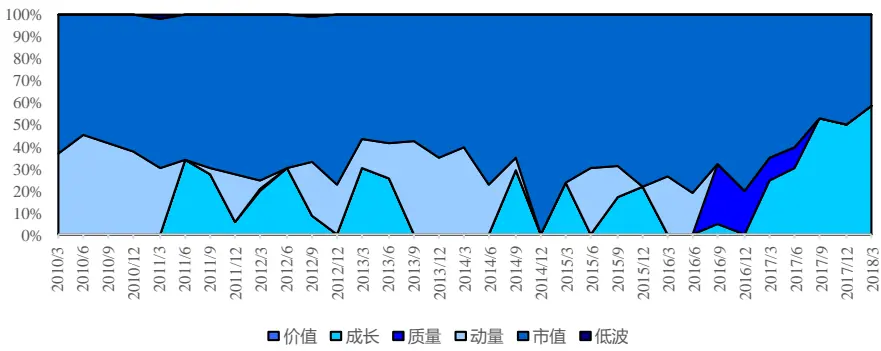
数据来源：国泰君安证券研究

图 33 复制中证500组合净值表现
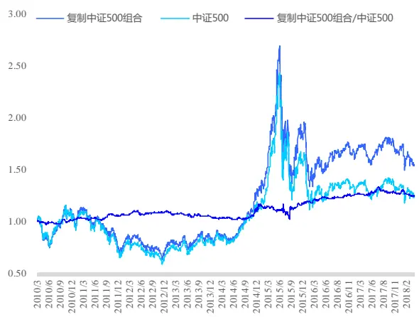
数据来源：国泰君安证券研究

图 34 复制中证 500组合 120交易日滚动跟踪误差
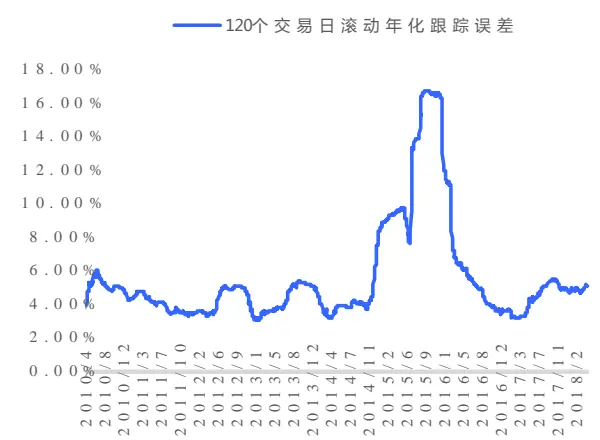
数据来源：国泰君安证券研究

以上，我们介绍了使用风格因子组合（或指数）对市场主流指数进行“复制”的方法，并采用前文构建的风格因子组合对沪深 300指数和中证 500 指数进行了实证分析。结果显示，沪深 300 指数可以被 3 至 4个因子组合有效地复制，年化跟踪误差为 3.74%，年化超额收益达到6.11%，IR 1.63，月胜率达到 70.40%。而中证 500 指数可以被 2 至 3 个因子组合复制，年化跟踪误差为6.32%。从复制组合的权重分布以及 120个交易日的滚动年化跟踪误差来看，跟踪误差的峰值均出现在市场剧烈波动时期。而在实际投资中，面对市场整体的巨幅震荡，提高在风格上的分散程度将会是比被动复制风格更好地选择，对此我们会在之后的研究中进一步展开。

回到本章节介绍利用风格因子组合复制主流市场指数的初衷，这一方法的目的是使得资产管理人可以非常容易地将原有对市场指数的配置方案应用到风格因子组合上，并获得配置风格带来的风险收益表现的提升。此外，通过直接投资于“被动”的风格因子组合，管理人也无需再担心由于子基金管理人投资风格切换对整体组合的影响。

## 5. 总结

本篇报告主要介绍了基于因子投资的资产配置方法。因子投资的核心思想认为，资产配置的本质在于配置风险因子而非资产本身。Andrew（2014）将因子定义为“长期来看具有高收益的投资风格”。遵循其对因子是否可投资的区分，我们将因子分为两类进行了讨论：一类是不可直接投资的宏观因子，刻画了各资产类别间的共同风险；另一类是可投资的风格因子，解释了各资产类别内的风险溢价。

基于因子的资产配置方法并不需要完全颠覆传统的资产配置决策体系，而是在原有的框架里优化各层次组合的风险收益表现来更好地达到配置目标。报告介绍了三种将因子投资应用于资产配置的路径，分别是对组合风险的尽职调查、对风格因子的调整和自下而上基于风格因子的优化。

对于进行风格因子调整这一路径，我们以中证800指数作为基准在中国股票市场上构建了6个规则简单、透明且行业中性的可投资风格因子组合。这些风格因子组合分别是价值（Value）、质量（Quality）、市值（Size）、成长（Growth）、动量（Momentum）和低波动（Low Volatility）。基于风险模型，我们利用风格因子组合对沪深300指数和中证 500指数进行了复制。复制沪深 300 组合的效果出色，年化跟踪误差为 3.74%，年化超额收益达到 6.11%，IR 1.63，年化换手率 309%，月胜率 70.40%。应用这一方法，资产管理人可以非常容易地将现有对市场指数的配置方案应用到相应的风格因子组合上，在不改变原有大类资产配置比例的同时获得配置风格带来的风险收益表现的提升，也无需再担心由于子基金管理人投资风格切换对整体组合的影响。

海外市场的因子投资市场已经发展得较为成熟，形成了以 SmartBeta ETF为代表的完备的产品线与行业体系，而国内的因子投资市场方兴未艾。在后续的报告中，我们将从两个方向进一步展开基于因子投资的资产配置研究。一方面，遵循对组合风险的尽职调查这一路径，前文已经给出了利用宏观因子在战略资产配置层面对资产配置比例进行调整的示例，我们将在这一方向上展开研究，分析宏观因子在中国市场上对资产配置的影响。另一方面，可投资的风格因子组合为资产配置管理人提供了低成本获得市场风格收益的渠道，也使得我们可以对风格进行更为清晰、直观的配置和择时。这一方向的研究将从资产配置角度聚焦风格因子择时在国内市场的应用。

## 参考文献

[1] Ang, Andrew. Asset management: A systematic approach to factor investing. Oxford University Press, 2014.

[2] Ang, Andrew, and Maxim Ulrich. Nominal bonds, real bonds. and equity, Working paper, Columbia GSB, 2012.

[3] Bender, J., Briand, R., Nielsen, F., & Stefek, D. Portfolio of Risk Premia: A New Approach to Diversification. The Journal of Portfolio Management, 2010, 36(2), 17–25.

[4] Greenberg, D., Babu, A., & Ang, A. (2016). Factors to Assets: Mapping Factor Exposures to Asset Allocations. Journal of Portfolio Management, 42(5), 18.

[5] Ilmanen, Antti, and Jared Kizer. "The death of diversification has been greatly exaggerated." Journal of Portfolio Management 38.3 (2012): 15.

[6] Koedijk, C. G., A. M. H. Slager, and P. A. Stork. "Factor Investing in Practice: A Trustees’ Guide to Implementation." Available at SSRN 2391694 (2014).

[7] Mina, Jorge. "Risk budgeting for pension plans." RiskMetrics Journal 6.1 (2005): 9-34.

[8] Madhavan, Ananth, Aleksander Sobczyk, and Andrew Ang. "What's in Your Benchmark? A Factor Analysis of Major Market Indexes." Working paper，2017.

[9] Ross, S. A. (1976). The arbitrage theory of capital asset pricing. Journal of Economic Theory, 13(3), 341-360.

## 6. 附录

## 6.1. 风格因子组合的构建方法

参考MSCI的风格因子指数编制方法，我们以中证800指数作为基准构建行业中性的风格因子组合。调仓时间为每季度末，行业分类采用申万一级行业分类标准。组合具体构建方法如下：

（1） 对于每一种投资风格，我们首先选取2~3 个对应的指标。对每一个指标，我们在中证800样本股内进行标准化（减均值除标准差）和三倍标准差的缩尾（winsorize）处理，得到每个样本股对应该指标的 Z-score。

（2） 将样本股的各个指标的Z-score值按照其对应的风格方向等权相加，再在行业内进行标准化和三倍标准差的缩尾处理，得到各样本股对应的得分（Z）。然后，将各样本股的得分进行如下变换，得到最终的因子得分：

$$
\operatorname{Final\:Score}=\left\{\begin{aligned}{}&{{}1+Z}&{Z\geq0,}\\{}&{{}\frac{1}{1-Z}}&{Z<0.}\end{aligned}\right.
$$

（3） 在每个行业内，选取因子得分最高的一个股票进入组合。再将剩余样本股按照因子得分进行排序，得分高者进入组合，直到股票个数达到200。

（4） 将组合内的股票以其流通市值乘以 Final Score 作为权重进行加权得到初始权重，再将组合初始权重对中证800 进行行业中性，得到最终的组合权重。

各风格因子选取的指标如下表所示：

表 8:构建风格因子组合所用指标

| 风格因子 | 所用指标 | 备注 |
| --- | --- | --- |
| 价值（Value） 质量（Quality） | 预期 PE、PB、每股经营性现金流 ttm/股价 ROE、ROA、负债权益比 | 银行和非银金融仅采用预期PE和PB两个指标 |
| 市值（Size） | 流通市值的对数 |  |
| 成长（Growth） | 净利润同比增长率、营业收入同比增长率 |  |
| 动量（Momentum） | 滞后一个月的6个月和12个月风险调整后动量 | 以过去一年周度收益率的标准差进行风险调整 |
| 低波动（Low Volatility） | 过去3个月和过去一年日度收益率的标准差 |  |

数据来源：国泰君安证券研究

## 本公司具有中国证监会核准的证券投资咨询业务资格

## 分析师声明

作者具有中国证券业协会授予的证券投资咨询执业资格或相当的专业胜任能力，保证报告所采用的数据均来自合规渠道，分析逻辑基于作者的职业理解，本报告清晰准确地反映了作者的研究观点，力求独立、客观和公正，结论不受任何第三方的授意或影响，特此声明。

## 免责声明

本报告仅供国泰君安证券股份有限公司（以下简称“本公司”）的客户使用。本公司不会因接收人收到本报告而视其为本公司的当然客户。本报告仅在相关法律许可的情况下发放，并仅为提供信息而发放，概不构成任何广告。

本报告的信息来源于已公开的资料，本公司对该等信息的准确性、完整性或可靠性不作任何保证。本报告所载的资料、意见及推测仅反映本公司于发布本报告当日的判断，本报告所指的证券或投资标的的价格、价值及投资收入可升可跌。过往表现不应作为日后的表现依据。在不同时期，本公司可发出与本报告所载资料、意见及推测不一致的报告。本公司不保证本报告所含信息保持在最新状态。同时，本公司对本报告所含信息可在不发出通知的情形下做出修改，投资者应当自行关注相应的更新或修改。

本报告中所指的投资及服务可能不适合个别客户，不构成客户私人咨询建议。在任何情况下，本报告中的信息或所表述的意见均不构成对任何人的投资建议。在任何情况下，本公司、本公司员工或者关联机构不承诺投资者一定获利，不与投资者分享投资收益，也不对任何人因使用本报告中的任何内容所引致的任何损失负任何责任。投资者务必注意，其据此做出的任何投资决策与本公司、本公司员工或者关联机构无关。

本公司利用信息隔离墙控制内部一个或多个领域、部门或关联机构之间的信息流动。因此，投资者应注意，在法律许可的情况下，本公司及其所属关联机构可能会持有报告中提到的公司所发行的证券或期权并进行证券或期权交易，也可能为这些公司提供或者争取提供投资银行、财务顾问或者金融产品等相关服务。在法律许可的情况下，本公司的员工可能担任本报告所提到的公司的董事。

市场有风险，投资需谨慎。投资者不应将本报告作为作出投资决策的唯一参考因素，亦不应认为本报告可以取代自己的判断。
在决定投资前，如有需要，投资者务必向专业人士咨询并谨慎决策。

本报告版权仅为本公司所有，未经书面许可，任何机构和个人不得以任何形式翻版、复制、发表或引用。如征得本公司同意进行引用、刊发的，需在允许的范围内使用，并注明出处为“国泰君安证券研究”，且不得对本报告进行任何有悖原意的引用、删节和修改。

若本公司以外的其他机构（以下简称“该机构”）发送本报告，则由该机构独自为此发送行为负责。通过此途径获得本报告的投资者应自行联系该机构以要求获悉更详细信息或进而交易本报告中提及的证券。本报告不构成本公司向该机构之客户提供的投资建议，本公司、本公司员工或者关联机构亦不为该机构之客户因使用本报告或报告所载内容引起的任何损失承担任何责任。

## 评级说明

## 1.投资建议的比较标准

投资评级分为股票评级和行业评级。

以报告发布后的12个月内的市场表现为比较标准，报告发布日后的 12个月内的公司股价（或行业指数）的涨跌幅相对同期的沪深 300 指数涨跌幅为基准。

## 2.投资建议的评级标准

报告发布日后的 12 个月内的公司股价（或行业指数）的涨跌幅相对同期的沪深 300 指数的涨跌幅。

|  | 评级 | 说明 |
| --- | --- | --- |
| 股票投资评级 | 增持 | 相对沪深300指数涨幅15%以上 |
|  | 谨慎增持 | 相对沪深300指数涨幅介于5%～15%之间 |
|  | 中性 | 相对沪深300指数涨幅介于-5%～5% |
|  | 减持 | 相对沪深 300 指数下跌 5%以上 |
| 行业投资评级 | 增持 | 明显强于沪深 300 指数 |
|  | 中性 | 基本与沪深 300指数持平 |
|  | 减持 | 明显弱于沪深300指数 |

## 国泰君安证券研究所

|  | 上海 | 深圳 | 北京 |
| --- | --- | --- | --- |
| 地址 | 上海市浦东新区银城中路168号上海 银行大厦29层 | 深圳市福田区益田路 6009 号新世界 商务中心34层 | 北京市西城区金融大街 28 号盈泰中 心2号楼10层 |
| 邮编 | 200120 | 518026 | 100140 |
| 电话 | （021)38676666 | (0755)23976888 | (010)59312799 |
|  | E-mail: gtjaresearch@gtjas.com |  |  |