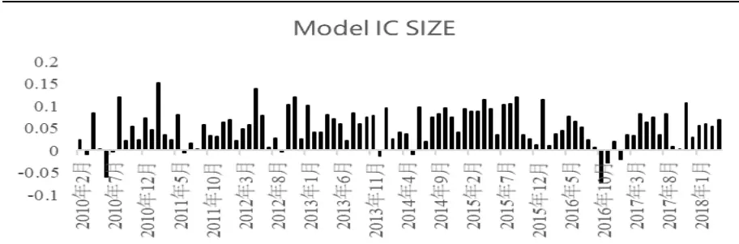
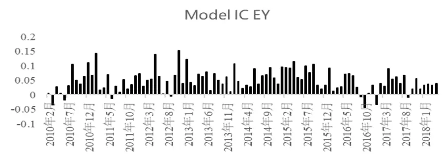
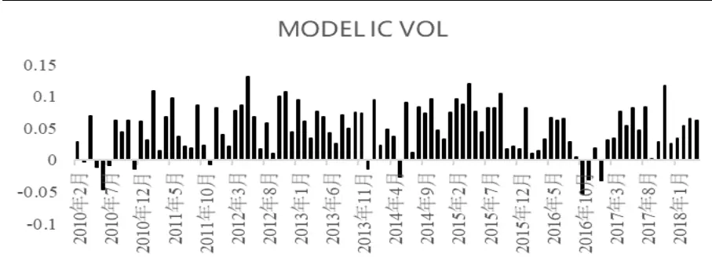
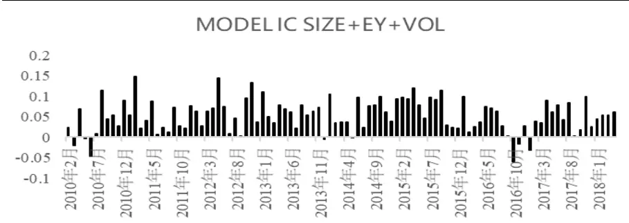
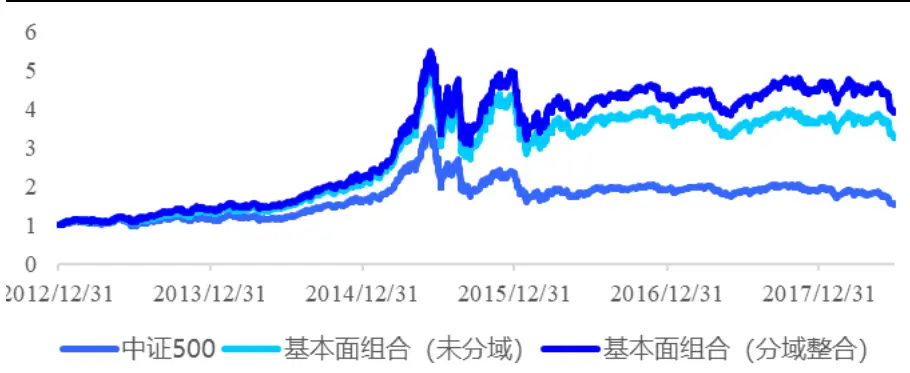
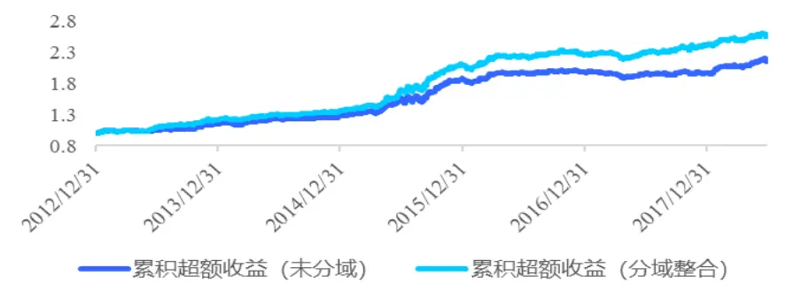
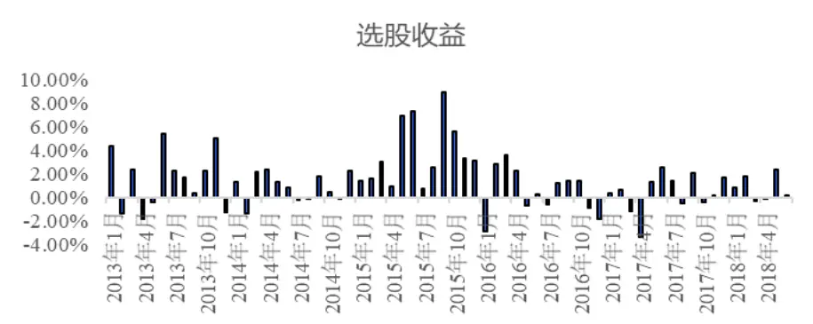
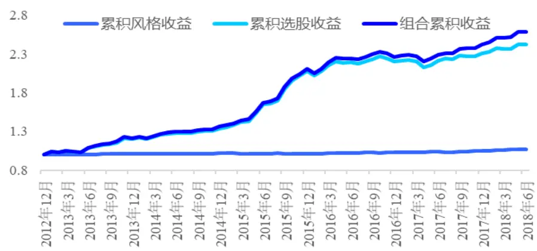

# 风格域划分下的基本面多因子选股策略

# －－数量化专题之一百一十六

李辰（分析师）

8 021-38677309

lichen@gtjas.com

证书编号 S0880516050003

## 本报告导读：

本篇报告以基本面因子为基础，在风格域划分的理念下，构建了基本面因子选股模型。

## 摘要：

[Tab • le_Summary] 基本面投资逻辑日益受到量化组合投资者的重视，本篇报告重点关注各类基本面因子对不同风格股票预测能力的差异及其在策略构建中的应用。

研究表明，基于市值域划分、盈利域划分以及波动域划分的状态下，各类基本面因子对不同风格域内的股票收益预测能力存在显著差异，相应的因子权重应有所区分。

- 阿尔法模型构建过程中，我们分别考虑了最优因子权重、个股因子权重匹配、预期收益整合等细节内容，目的是使得因子组合更有效的适应不同风格的市场环境变化，提高模型预测精度。

基于风格域划分下的基本面多因子策略自2013年至2018年6月，实现年化超额收益 18%，信息比率2.81。相比于未分域的基本面因子策略，该策略的年化收益、信息比率均有显著提升，最大回撤显著下降。并且回测结果显示，分域研究的优势在近两年的市场环境中，愈发明显。

- 后续的研究中，我们将在基本面因子所选择的股票池中，进一步考虑中低频技术类因子、中高频价量特征因子的运用，对策略收益进行再增强。

陈奥林：（分析师）

电话：021-38674835

邮箱：chenaolin@gtjas.com

证书编号：S0880516100001

## 李辰：（分析师）

电话：021-38677309

邮箱：lichen@gtjas.com

证书编号：S0880516050003

## 孟繁雪：（分析师）

电话：021-38675860

邮箱：mengfanxue@gtjas.com

证书编号：S0880517040005

## 蔡旻昊：（研究助理）

电话：021-38674743

邮箱：caiminhao@gtjas.com

证书编号：S0880117030051

## 李栩：（研究助理）

电话：021-38032690

邮箱：lixu019018@gtjas.com

证书编号：S0880117090067

## 杨能：（研究助理）

电话：021-38032685

邮箱：yangneng@gtjas.com证书编号：S0880117080176

## 殷钦怡：（研究助理）

电话：021-38675855

邮箱：yinqinyi@gtjas.com

证书编号：S0880117060109

## 余剑峰：（研究助理）

电话：021-38676186

邮箱：yujianfeng@gtjas.com

证书编号：S0880118060039

## 黄皖璇：（研究助理）

电话：021-38677799

邮箱：huangwangxuan@gtjas.com

证书编号：S088011610008

## [Table_R相关报告

《选基金核心是“选股”——》2018.07.11

《基于因子投资的资产配置方法》2018.06.28《基于股票特别处理的 A 股财务困境预测研究》2018.06.21

《投资科技创新股：基本面成长因子再挖掘》2018.06.14

《世界杯趣文：世界杯中的超额收益》2018.06.13

## 1. 引言

2018年以来，市场风格频繁切换，各行业、板块、主题热点轮动加剧，这对传统因子的预测能力及量化组合构建而言，提出了新的要求。本篇报告中，我们将延续此前分域多因子研究的理念，从风格域划分的角度出发，对因子在不同风格类型的股票中的预测能力进行深入分析，进而构建相应的投资策略。

同时，基于当前的市场环境，基本面投资逻辑日益受到量化组合投资者的重视，因此我们将重点关注各类基本面因子（盈利、估值、财务杠杆、股权结构、财务质量、成长、分析师一致预期）对不同风格股票预测能力的差异，进而在策略构建过程中进行一定的区分。

研究表明，基于市值域划分、盈利域划分以及波动域划分的状态下，各类基本面因子对不同风格域内的股票收益预测能力存在显著差异，相应的因子权重应有所区分。

策略构建过程中，我们首先利用最大化组合预测IC为目标，选择φ-11c加权域内因子，检验结果表明该方法较之等权、IC 加权、ICIR 加权等方法可提高模型预测精度。其次，我们利用端点距离倒数加权的方法，对个股因子权重进行匹配，使得个股更加精确的对应因子权重。最后，我们利用市值域、盈利域、波动域的整合预测方法得到股票收益预测截面。

基于风格域划分下的基本面多因子策略自2013年至 2018年6 月，实现年化超额收益18%，信息比率 2.81。相比于未分域的基本面因子策略，该策略的年化收益、信息比率均有显著提升，最大回撤显著下降。并且回测结果显示，分域研究的优势在近两年的市场环境中，愈发明显。

本篇报告第二部分将介绍分域因子检验的基本方法以及风格域划分下的基本面因子显著性检验结果，第三部分将介绍最优因子权重的推导过程、策略构建细及节实证分析，第四部分为总结。

## 2. 风格域划分下的基本面因子显著性检验

## 2.1.因子分域研究方法

域的概念来自学术研究，Sloan[2001]、Beneish、Lee、Tapely[2001]等人将不同类型的股票具有不同的驱动因素的研究方法称之为域（Contextual）研究。

分域研究解决的是传统线性预测模型对市场非线性特征刻画的不足，通过对因子的分域研究，可以使得模型更加贴近市场本质投资逻辑，提高策略预测准确性及胜率。

在上篇报告《基于不同域研究的多因子选股体系》中，我们提出了全域风险调整后子域相关系数计算的方法，该方法即避免了市场风格因素对因子检验的干扰，同时也解决了域内股票数量不足所导致的统计偏差，是分域因子有效性家宴的较好方式。本篇报告中，我们仍然利用该方法，具体步骤如下：

Step 1. 计算 t期原始因子值，并做去极值标准化处理，得到标准化原值因子载荷截面 $x_{t}$ ；

Step 2. 计算风险调整后因子载荷截面 ，即 $\boldsymbol{\varepsilon}_{\scriptscriptstyle t}$ $x_{_{t}}=\beta_{_{t}}\cdot X_{_{t}}^{\mathit{\Delta}risk}+\varepsilon_{_{t}}$ ，其中$\boldsymbol{X}_{\_risk}$ 包含行业哑变量矩阵及 10类风险因子载荷矩阵；

Step 3. 计算风险调整后个股收益残差截面 $\boldsymbol{\varepsilon}\boldsymbol{r}_{t}$ ，即 $R_{_t}=\beta_{_t}\cdot X_{_t}^{{\mathit{risk}}}+\varepsilon r_{_t}$ 其中 $R_{\mathbf{\Phi}_{t}}$ 为股票收益率截面, $\boldsymbol{X}_{\mathrm{\Delta\Omega}_{risk}}$ 同上定义；

Step 4. 选取 $\boldsymbol{\varepsilon}_{t}$ 和 $\boldsymbol{\varepsilon}\boldsymbol{r}_{t}$ 截面中，截取对应目标域对应个股的因子载荷截面c o n t e x t u a l 和 $\varepsilon r_{_t}^{^{contextual}}$ 收益残差截面，并进行标准化处理；

Step 5 计算截面 c o n te x tu a lt 与截面 $\varepsilon r_{t}^{\textit{ c o n t e x t u a l }}$ 的相关系数 $IC_{\ t}$ ；

Step 6 重复上述过程，得到 T时间内段的IC 序列，并统计IC 序列的相关统计检验指标。

## 2.2.风格域划分下的基本面因子显著性检验

我们选择盈利、估值、财务杠杆、成长、股权结构、财务质量和分析师一致预期 7 类基本面因子中 17 个子因子进行统计分析，具体因子构建如下：

表 1 因子定义及构建明细

| 因子类别 | 因子简称 | 因子构建明细 |
| --- | --- | --- |
| 估值 | Value | PB |
|  | Ebitda Ev | 税息折旧及摊销前利润比总市值 |
| 盈利 | Roe | 净资产收益率 |
|  | Earnings Yield | 由Ep、Estep、Cetop 三因子合成详细算法详见附录 |
| 财务杠杆 | Leverage | 由Mlev、Dtoa、Blev 三因子合成详细算法详见附录 |
|  | Fix ratio | 固定资产比总权益 |
| 成长 | Yoy Eps | Eps 同比增长率 |
|  | Mom Roe | ROE 环比增长率 |
|  | Growth | 由SGRO、EGRO、EGIB、EGIB_S四因子合成详细算法详见附录 |
|  | Yoy Operrev | 营业收入同比增长率 |
| 股权结构 | Htos | 前十大股东持股比例 |
| 财务质量 | Safexp Operrev | 销售、管理、财务费用比营业收入 |
| 一致预期 | Est PB | 预期PB |
|  | Mom Est Eps | 预期 Eps 环比变化 |
|  | Rating Up | 90内分析师上调评级家数 |
|  | Yoy Estnp | 预期净利率同比变化率 |
|  | Target Return | 预测目标价/当前收盘价-1 |

数据来源：国泰君安证券研究

我们首先对上述因子在全域范围内进行因子显著性检验，具体结果如下所示：

表 2 因子全域检验结果

| 因子类别 | 因子简称 | IC波动 |  |  |
| --- | --- | --- | --- | --- |
|  |  | IC均值 | 率 p值 | T检验 |
| 估值 | Value | 0.020 | 0.036 0.000 | 6.40 |
|  | Ebitda_Ev | -0.006 | 0.037 0.091 | -1.70 |
| 盈利 | Roe | 0.015 | 0.059 0.006 | 2.81 |
|  | Earnings Yield | 0.010 | 0.033 0.001 | 3.29 |
|  | Leverage | 0.008 | 0.038 0.025 | 2.27 |
| 财务杠杆 | Fixratio | -0.009 | 0.045 0.038 | -2.10 |
| 成长 | Yoy_Eps | 0.025 | 0.048 0.000 | 5.90 |
|  | Mom_Roe | 0.021 | 0.039 0.000 | 5.96 |
|  | Growth | -0.005 | 0.031 0.093 | -1.69 |
|  | Yoy_operrev | 0.012 | 0.042 0.002 | 3.17 |
| 股权结构 | Htos | -0.016 | 0.057 0.003 | -3.07 |
| 财务质量 | Safexp_ Operrev | 0.013 | 0.032 0.000 | 4.47 |
| 一致预期 | Est_PB | 0.006 | 0.043 0.129 | 1.53 |
|  | Mom_ | 0.019 | 0.035 | 5.98 |
|  | Est_Eps |  | 0.000 |  |
|  | RatingUp Yoy_Est_np | 0.007 0.005 | 0.028 0.005 0.031 0.059 | 2.85 1.91 |
|  | Target_ |  |  |  |
|  |  | 0.030 | 0.052 0.000 | 6.40 |
|  | Return |  |  |  |

数据来源：国泰君安证券研究

在此基础上，我们对上述 17 个基本面因子进行分风格域检验，其中我们选择市值域（Size High、Size Low）、盈利域（Earnings Yield High、Earnings Yield Low）及波动率域（Volatility High、Volatility Low）。其中High Low表示当期所有个股因子值截面排序前50%及后50%。

回测检验时间为2010 年1月至2018年6月，月频统计。表格中第一列为因子在该分域下的风险调整后IC均值，第二列为IC序列的T检验值，第三列为不同域下IC 序列差值的T检验值，具体结果如下表所示：

## 1. 市值域划分下的因子显著性统计

表 3 市值域划分下的因子显著性

| 市值域 |  | IC |  | Tstat |  | Diff Tstat |
| --- | --- | --- | --- | --- | --- | --- |
| 因子类别 | 因子简称 | Size High | Size Low | Size High | Size Low | High - Low |
| 估值 | Value | 0.006 | 0.005 | 1.20 | 2.03 | 0.08 |
|  | Ebitda Ev | -0.007 | -0.008 | -1.88 | -2.21 | 0.39 |
| 盈利 | Roe | 0.017 | 0.005 | 3.12 | 0.80 | 2.92 |
|  | Earnings Yield | 0.020 | -0.001 | 4.80 | -0.69 | 3.76 |
| 财务杠杆 | Leverage | 0.001 | 0.001 | 0.15 | 0.26 | 0.03 |
|  | Fix ratio | -0.013 | -0.002 | -3.44 | -0.40 | -2.74 |
| 成长 | Yoy Eps | 0.024 | 0.019 | 5.60 | 4.38 | 1.25 |
|  | Mom Roe | 0.021 | 0.014 | 5.98 | 4.04 | 1.85 |
|  | Growth | -0.001 | 0.000 | -0.37 | -0.07 | -0.23 |
| 股权结构 | Yoy Operrev | 0.013 | 0.015 | 3.22 | 3.66 | -0.40 |
| 财务质量 | Htos | -0.023 | -0.010 | -5.59 | -1.60 | -2.60 |
| 一致预期 | Safexp Operrev | 0.009 | 0.014 | 2.95 | 4.36 | -1.34 |
|  | Est PB | 0.012 | 0.008 | 2.74 | 2.04 | 0.89 |
|  | Mom Est Eps | 0.024 | 0.019 | 7.41 | 6.99 | 1.23 |
|  | Rating Up | 0.005 | 0.005 | 1.77 | 1.80 | -0.02 |
|  | Yoy Estnp | 0.002 | 0.009 | 0.55 | 3.17 | -1.97 |
|  | Target Return | 0.026 | 0.022 | 4.65 | 5.42 | 0.80 |

数据来源：国泰君安证券研究

结果表明，以大小盘划分的检验下，ROE、Earnings Yield、Fix ratio、MOM ROE、HTOS、Yoy Estnp 这 6 个因子 IC 序列统计结果具有显著差异。

其中，在大市值域中，盈利类因子ROE和Earnings Yield、财务杠杆类因子 Fix ratio、成长类因子 MOM ROE、股权结构因子 Htos 均极强的预测区分度。在小市值域中则效果较差。而在小市值域中，分析师预期净利润的变化率则显著强于大盘。

## 2. 盈利域划分下的因子显著性统计（Earnings Yield简写为 EY）

表 4 盈利域划分下的因子显著性

| 盈利域 |  | IC |  | Tstat |  | Diff Tstat |
| --- | --- | --- | --- | --- | --- | --- |
| 因子类别 | 因子简称 | EY High | EY Low | EY High | EY Low | High - Low |
| 估值 | Value | 0.015 | 0.001 | 3.62 | 0.23 | 2.21 |
|  | Ebitda Ev | -0.005 | -0.015 | -1.27 | -4.73 | 2.38 |
| 盈利 | Roe | 0.014 | 0.003 | 2.28 | 0.69 | 2.60 |
|  | Earnings Yield | 0.034 | 0.008 | 6.35 | 2.30 | 4.46 |
| 财务杠杆 | Leverage | 0.010 | -0.002 | 2.62 | -0.80 | 2.65 |
|  | Fix ratio | -0.005 | -0.009 | -1.29 | -2.28 | 0.96 |
| 成长 | Yoy Eps | 0.023 | 0.019 | 4.93 | 4.74 | 1.00 |
|  | Mom Roe | 0.017 | 0.017 | 4.55 | 5.23 | -0.14 |
|  | Growth | -0.002 | -0.002 | -0.65 | -0.94 | -0.04 |
|  | Yoy Operrev | 0.016 | 0.010 | 4.16 | 2.65 | 1.65 |
| 股权结构 | Htos | -0.020 | -0.011 | -4.07 | -2.42 | -2.47 |
| 财务质量 | Safexp Operrev | 0.010 | 0.014 | 2.81 | 4.68 | -1.06 |
| 一致预期 | Est PB | 0.004 | 0.015 | 0.99 | 3.52 | -2.45 |
|  | Mom Est Eps | 0.024 | 0.021 | 9.22 | 6.63 | 0.95 |
|  | Rating Up | -0.002 | 0.009 | -0.57 | 4.16 | -3.64 |
|  | Yoy Estnp | 0.010 | 0.003 | 3.37 | 0.98 | 2.44 |
|  | Target Return | 0.018 | 0.032 | 3.69 | 6.69 | -3.31 |

数据来源：国泰君安证券研究

结果表明，以高低盈利域划分的检验下，多达11个因子IC 序列统计结果具有显著差异。例如，在高盈利域股票中，Value、ROE、Leverage、Yoy Operrev、Htos等因子具有更强的预测区分度；而在低盈利域股票中，分析师一致预期 PB、上调评价家数及目标收益率等因子的预测显著性则更强。

## 3. 波动域划分下的因子显著性统计（Volatility简写为 Vol）

表 5 波动域划分下的因子显著性

| 盈利域 |  | IC |  | Tstat |  | Diff Tstat |
| --- | --- | --- | --- | --- | --- | --- |
| 因子类别 | 因子简称 | Vol High | Vol Low | Vol High | Vol Low | High - Low |
| 估值 | Value | 0.014 | -0.011 | 4.38 | -2.67 | 3.87 |
|  | Ebitda Ev | -0.004 | -0.012 | -1.17 | -3.13 | 1.82 |
| 盈利 | Roe | 0.014 | 0.005 | 2.64 | 0.83 | 1.66 |
|  | Earnings Yield | 0.009 | 0.008 | 3.13 | 2.07 | 0.13 |
| 财务杠杆 | Leverage | 0.002 | -0.003 | 0.94 | -0.60 | 0.82 |
|  | Fix ratio | -0.005 | -0.011 | -1.22 | -2.68 | 1.30 |
| 成长 | Yoy Eps | 0.023 | 0.017 | 5.66 | 3.78 | 1.28 |
|  | Mom Roe | 0.019 | 0.014 | 5.50 | 4.12 | 1.30 |
|  | Growth | -0.002 | 0.001 | -0.79 | 0.32 | -0.59 |
|  | Yoy Operrev | 0.017 | 0.010 | 4.15 | 2.65 | 1.62 |
| 股权结构 | Htos | -0.013 | -0.023 | -2.50 | -5.12 | 2.10 |
| 财务质量 | Safexp Operrev | 0.011 | 0.012 | 3.63 | 3.61 | -0.08 |
| 一致预期 | Est PB | 0.002 | 0.021 | 0.55 | 5.21 | -4.39 |
|  | Mom Est Eps | 0.019 | 0.026 | 6.39 | 9.17 | -1.83 |
|  | Rating Up | 0.008 | 0.001 | 2.92 | 0.30 | 1.57 |
|  | Yoy Estnp | 0.006 | 0.006 | 1.91 | 1.99 | -0.16 |
|  | Target Return | 0.030 | 0.015 | 6.11 | 3.16 | 3.13 |

数据来源：国泰君安证券研究

同样，在以高中低波动率划分的检验下，9个因子的 IC 序列出现显著差异，尤其集中在估值和分析师一致预期这两大类因子中。

从上述统计检验结果可以发现，各类基本面因子对于不同风格的股票收益预测能力是具有显著差别的。因此在预测不同风格的股票收益时，所选择的因子或者因子权重应当有区分。

## 3. 风格域划分下的基本面多因子选股策略

本节，我们将根据上述统计检验的结果，构建基于风格域划分下的基本面多因子选股策略。具体步骤包括：1）域内最优因子权重选择、2）个股因子权重匹配、3）预期收益整合及组合优化构建。

## 3.1.最优因子权重

我们首先需要确定在不同的风格域内（例如Size High、Size Low），各基本面因子的权重分配问题。由于因子检验的IC 序列具有显著的差别，因此基于 IC 的加权方式所得到的因子权重也差异较大，即域内预测能力强的因子会给予更高的权重，反之则低配权重。

传统因子权重配置考虑等权、IC 加权、ICIR 加权等方法，本节中我们将推导利用最大化因子组合 IC 的过程所求得的最优因子权重计算表达式，具体过程如下：

对于单期的M 个风险调整后因子值 $(F_{_1},F_{_2},...,F_{_M})$ ，合成的风险调整后因子值为

$$
\boldsymbol{F}_{c}\ :=\ :\boldsymbol{\Sigma}_{i=1}^{M}\boldsymbol{\nu}_{i}\boldsymbol{F}_{i}
$$

其中 ${(\nu_{_{1}},\nu_{_{2}},...,\nu_{_{m}})}^{T}$ 为权重向量

对于单期组合的超额收益 ，其可以表示为（推导过程详见附录 1）

$$
\begin{array}{l}{{\displaystyle\alpha=\frac{N-1}{\lambda}Co\nu(F_{_c},R)}}\\{{}}\\{{\displaystyle=\frac{N-1}{\lambda}\ast IC_{_{F_{c},R}}\ast Dis(F_{_c})\ast Dis(R)}}\end{array}
$$

其中N 为截面上的股票个数； 为风险厌恶系数，控制了承担主动风险的程度；R 为股票风险调整后的截面收益向量。上式说明组合单期的超额收益正比于风险调整后合成因子的IC 值。又因为

$$
\begin{array}{l}{{Co\nu(F_{_c},R)=Co\nu(\Sigma_{i=1}^{M}\nu_{i}F_{_i},R)=\Sigma_{i=1}^{M}\nu_{i}Co\nu(F_{_i},R)}}\\{{{}}}\\{{{}=\Sigma_{i=1}^{M}\nu_{i}IC_{_i}Dis(F_{_i})Dis(R)}}\\{{{}}}\\{{{}}}\\{{Dis(F_{_c})=\sqrt{\nu^{^T}\Phi\nu}}}\end{array}
$$

其中Φ为因子截面值的方差协方差矩阵，那么

$$
IC_{\phantom{}_{F_{c},R}}=\frac{Co\nu(F_{_c},R)}{Dis(F_{_c})^{\ast}Dis(R)}=\frac{\sum_{i=1}^{M}\nu_{i}IC_{\phantom{}_{i}}Dis(F_{i})}{\sqrt{\nu_{\phantom{}}^{\phantom{}}\Phi\nu}}
$$

又因为标准化后， $Dis(F_{_i})=1,i=1,2,...,M$

因此，最大化合成因子的 IC 问题等价于

$$
\mathrm{~m~a~x~}_{\nu}\frac{\nu^{\textit{ T }}IC}{\sqrt{\nu^{\textit{ T }}\Phi\nu}}
$$

上式的形式即为最大化 Shape Ratio问题。因为对于任意的 $w=k\nu$ ，当v是该问题的最优解时w 也一定是上式最优解。因此原问题等价于

$$
\begin{array}{l}{\displaystyle\textrm{ m a x }_{\nu}~\frac{1}{\sqrt{\nu^{\textit{ r }}\Phi~\nu}}}\\{\displaystyle s.t.}\\{\displaystyle_{w^{\textit{ r }}IC~=~1}}\end{array}
$$

即

$$
\begin{array}{l}{\operatorname*{min}_{\mathbf{\Sigma}_{w}}\ \boldsymbol{w}^{T}\boldsymbol{\Phi}\ \boldsymbol{w}}\\{s.t.}\\{\boldsymbol{w}^{T}\boldsymbol{I}\boldsymbol{C}\ =\ 1}\end{array}
$$

求解该二次优化问题易得原优化问题的解为

$$
\nu\stackrel{*}{{}={}}s\Phi\stackrel{-1}{I}C
$$

其中s 为任意的正值常数，用于对整体权重进行比例限制。

我们以波动率域划分为例，分别考察等权因子、IC 加权、ICIR 加权和Φ-1IC 加权算法的模型预测精度比较结果，具体如下：

表 6 不同因子加权方式下的模型预测精度比较

|  | 等权 | IC | ICIR | $\Phi^{{\bf\Pi}^{-1}}IC$ |
| --- | --- | --- | --- | --- |
| Model IC | 3.82 | 4.07 | 4.28 | 4.32 |

数据来源：国泰君安证券研究

可以看到， $\Phi^{{\bf\Pi}^{-1}}IC$ 加权算法对于模型整体预测能力而言，效果好于等权、IC 加权、ICIR 加权等方法。

## 3.2.个股因子权重匹配

在上述第一步确定了各个域内因子权重比例之后，我们考虑个股的因子权重匹配问题，即对于每一个股票，其所使用的因子权重同样亦有差别。

例如，假设因子A和因子B在大市值域和小市值域内的权重分为[0.2,0.8]和[0.6,0.4]，那么我们考虑股票 j 其所处在的市值截面的分位数水平:若其正处于 50%的分位数水平，则其对应的最终因子权重即为$[0.2^{*}50^{\circ}\flat+0.6^{*}50^{\circ}\flat,0.8^{*}50^{\circ}\flat+0.4^{*}50^{\circ}\flat]=[0.4,0.6];$ 若其所出的位置更靠近大盘区域，例如为25%正向分位数水平，则其所对应的大市值域的因子权重应占比更高，因而其最终因子权重即为[0.2*75%+0.6*25%，0.8*75%+0.4*25%]=[0.3,0.7]。

实际过程中，我们利用端点距离倒数加权的方式，具体过程如下：

假定对按高低分为两个域{ , }H L 的单一风格，每个域各自对应的因子权

重向量为 $\{\boldsymbol\nu_{\mathbf{\Sigma}_{H}},\boldsymbol\nu_{\mathbf{\Sigma}_{L}}\}$ 。我们将截面上的所有股票按照这一风格的因子值进

行排序，得到各个股票的分位数 $\mathcal{Q}_{i},i=1,2,...,N$ 。以分位数作为该股票在这一风格维度上高低程度的度量，并以其倒数作为权重进行加权。具体来说，对每一个股票i ，其因子权重为 $\nu_{{s_{i}}}=(1-Q_{{i}})\nu_{{{\scriptscriptstyle L}}}+Q_{{i}}\nu_{{{\scriptscriptstyle H}}}$

对分为三个域{ , , }H M L 的风格，其对应的因子权重为 $\{\nu_{{}_{H}},\nu_{{}_{M}},\nu_{{}_{L}}\}$ ，我们采用分段的方法，将距离个股最近的两个域对应的因子权重进行加权，即

$$
\begin{array}{rl}{\nu_{s_{i}}=\left\{\begin{array}{ll}{\begin{array}{rlrl}{(1-2Q_{i})\nu_{_{L}}+2Q_{i}\nu_{_{M}}}&{}&{0\leq Q_{i}<0.5}\\{\qquad\nu_{_{M}}}&{}&{Q_{i}=0.5}\end{array}}\\{\begin{array}{rl}{\nu_{_{M}}}&{}&{\qquad\quad\quad\quad\quad\quad\quad\quad\quad\quad}\\{\Bigl(2Q_{i}-1\bigr)\nu_{_{M}}+2(1-Q_{i})\nu_{_{H}}}&{}&{0.5<Q_{i}\leq1}\end{array}}\end{array}\right.}\end{array}
$$

## 3.3.预期收益整合及组合优化构建

上述两节，我们完成了每只个股对于17个基本面因子的权重配比问题，进而我们以个股因子载荷与对应因子权重的乘积作为个股超额收益的预测值。

在这其中，我们分别考察了市值域、盈利域及波动率域，对因子预测能力进行了显著的区分。由于单一个股同时受到不同的市场风格影响，因此我们将3种分域方法下的预测超额收益率进行等权合成作为最终个股超额收益预测值，截面值记为Er。

进一步的，我们考虑模型预测精度，即 Er与实际超额收益之间的相关系数，记为Model IC。其中，我们分别测算市值域、盈利域及波动率域的单独 Model IC 以及整合后的 Model IC，具体结果如下所示:

图 1 市值域划分下的模型预测精度

数据来源：国泰君安证券研究

图 2 盈利域划分下的模型预测精度

数据来源：国泰君安证券研究

图 3 波动域划分下的模型预测精度

数据来源：国泰君安证券研究

图 4 整合模型预测精度

数据来源：国泰君安证券研究

表 7 不同域划分下的模型预测精度比较

|  | 市值划分 | 盈利划分 | 波动率划分 | 等权整合 |
| --- | --- | --- | --- | --- |
| Model IC Tstat | 4.19 | 4.41 | 4.32 | 4.49 |

数据来源：国泰君安证券研究

结果表明，以基本面因子为基础，在风格域划分配置不用因子权重的方法下，模型获取了较为显著的预测能力。同时，在整合了市值域、盈利域、波动域之后的模型预测能力比之单独模型的预测能力有一定的提升，T 检验值达到4.49，预测效果较为稳健。

最后，我们构建投资组合。我们选择以最大化Er为目标函数，同时保持行业、风格中性控制，并以一定的个股权重上限控制股票个股，具体过程如下：

$$
\begin{array}{rl}{M\alpha\boldsymbol{x}\ }&{\boldsymbol{w^{\prime}}\cdot\boldsymbol{E}\boldsymbol{r}}\\{s\cdot\boldsymbol{t}.}&{\textbf{ ( }\boldsymbol{w^{\prime}}\cdot\boldsymbol{w}_{\textit{ s }}^{\prime}\textbf{ ) }\cdot\boldsymbol{X}_{\textit{ r i s k }}=0}\\&{\boldsymbol{w^{\prime}}\cdot\boldsymbol{X}_{\textit{ i n d u s t r y }}=\boldsymbol{w}_{\textit{ b }}^{\prime}}\\&{\boldsymbol{w}\geq\textbf{ 0 }}\\&{\boldsymbol{w}\leq\boldsymbol{s}}\\&{\sum\textbf{ \textit { w } }=\textbf{ 1 }}\end{array}
$$

其中，行业敞口限制为•1% 相对比例，市值估值等核心风格敞口设定均为•0.01 ，个股权重上限 s=2.5%。

## 3.4. 实证分析

基于上述策略设计，我们构建中证500增强组合，其中回测时间自 2013年 1 月至 2018 年 6 月，月频调仓，交易成本以双边千 3 计，选股范围为全市场非ST 非新股。

为了进行对比，我们同样构建不分域情况下的组合构建，其中因子选择、因子权重、个股因子权重匹配、组合优化等方法均与上述方法保持一致，具体结果如下所示：

图 5 策略累积收益统计

数据来源：国泰君安证券研究

图 6 策略累积超额收益统计

数据来源：国泰君安证券研究

表 8 分域整合与未分域策略绩效统计比较

| 年化超额收益 |  | 信息比率 | 最大回撤 |
| --- | --- | --- | --- |
| 基本面组合（未分域） | 14.6% | 2.20 | 6.80% |
| 基本面组合(分域整合） | 18.0% | 2.81 | 6.00% |

数据来源：国泰君安证券研究

回测结果表明，风格域划分下的基本面多因子选股策略获取了相对中证500 年化 18%的超额收益率，信息比率为 2.81，表现较为稳健。其中策略年化双边换手率约为 7倍。

同时，与未分域基本面组合相比较，分域整合处理后，策略的年化收益率由 14.6%提升至 18%，信息比率由 2.2 提升至 2.8，最大回撤由 6.8%下降至 6%。这一结果体现了分域研究的优势，并且这样的优势在近两年市场风格变化较大的环境下，更为明显。

下述为策略逐年绩效统计，具体结果为：

表 9 策略逐年绩效统计分析

| 年月 | 1月 | 2月 | 3月 | 4月 | 5月 | 6月 | 7月 | 8月 | 9月 | 10月 | 11月 | 12月 | 年化 超额 | 信息 | 最大 | 月度 |
| --- | --- | --- | --- | --- | --- | --- | --- | --- | --- | --- | --- | --- | --- | --- | --- | --- |
| 2013 | 4.39% | -1.33% | 2.43% | -1.70% | -0.31% | 5.44% | 2.49% | 1.88% | 0.43% | 2.55% | 4.88% | -1.02% | 20.7% | 比率 3.87 | 回撤 2.31% | 胜率 66.7% |
| 2014 | 1.18% | -1.31% | 2.22% | 2.54% | 1.38% | 0.86% | -0.20% | 0.00% | 1.67% | 0.59% | 0.15% | 2.84% | 12.2% | 2.37 | 3.16% | 83.3% |
| 2015 | 1.37% | 1.33% | 2.38% | 1.14% | 6.91% | 7.51% | 0.64% | 2.66% | 8.87% | 5.59% | 2.81% | 3.06% | 44.7% | 4.32 | 5.33% | 100% |
| 2016 | -2.85% | 3.00% | 4.25% | 2.40% | -0.52% | -0.02% | -0.17% | 0.93% | 1.81% | 0.72% | 0.18% | -2.40% | 7.39% | 1.4 | 3.72% | 58.3% |
| 2017 | 0.52% | 0.79% | -0.97% | -2.80% | 1.69% | 2.42% | 0.52% | -0.06% | 2.42% | 0.19% | 0.78% | 1.29% | 6.93% | 1.5 | 4.90% | 75% |
| 2018 | 1.99% | 1.20% | 0.28% | 0.75% | 2.78% | -0.37% | / | / | / | / | / | / | 14.0% | 2.77 | 1.80% | 83.3% |

数据来源：国泰君安证券研究

策略在各年份均获取了正向超额收益，其中2015年月度胜率达到100%，收益较高。2018年截至6月末，策略年化超额中证500指数约为14%，月度胜率 83.3%。

下述为策略业绩归因分析统计，具体结果为：

图 7 归因选股收益序列

数据来源：国泰君安证券研究

图 8 策略收益归因分解

数据来源：国泰君安证券研究

归因计算结果中，策略选股收益 T检验值达到4.93，选股收益显著。并且由于组合构建过程中中性化程度严格，因此风格收益贡献几乎为 0，策略实现收益全部由选股收益贡献。

## 4. 总结

本篇报告以7 类基本面因子为基础，在风格域划分的理念下，构建了基本面多因子选股模型。研究表明，基于市值域划分、盈利域划分以及波动域划分的状态下，各类基本面因子对不同风格域内的股票收益预测能力存在显著差异，相应的因子权重应有所区分。

阿尔法模型构建过程中，我们分别考虑了最优因子权重、个股因子权重匹配、预期收益整合等细节内容，目的是使得因子组合更有效的适应不同风格的市场环境变化，提高模型预测精度。

在组合构建过程中，我们仍然选择利用风险模型优化投资组合，并且由于基本面因子与大类市场风格因子相关性较低，因此我们设定了较为严格的行业、风格敞口。策略自 2013年至2018年，获取年化超额中证 500收益约为18%，信息比率2.8，表现较为稳定。

在后续的研究中，我们将在基本面因子所选择的股票池中，进一步考虑中低频技术类因子、中高频价量特征因子的运用，对策略收益进行再增强。

## 5. 附录

## 附录 1 单期组合超额收益的推导

对于给定的截面股票收益预测向量 f ，我们通过求解以下的经典均值方差问题来得到主动权重w ：

$$
\begin{array}{l}{\displaystyle{\textrm{ m a x }}_{w}\textit{ f }^{T}{w}-\frac{\lambda}{2}({w}^{T}\Sigma{w})}\\{\displaystyle}\\{\mathit{s.t.}}\\{\displaystyle{{w}}^{T}I=0}\\{\displaystyle{{w}}^{T}B=0}\end{array}
$$

股票的方差协方差矩阵以多因子风险模型进行刻画，即 $\Sigma\ =\ B\Sigma_{\ _{risk}}B^{\ T}\ +\ S$ 。其中，B 为风险模型下股票在各风险因子上的暴露矩阵，S 为残差的方差协方差矩阵。上述优化问题可以简化为

$$
\begin{array}{rl}&{\textrm{ m a x }_{w}\textbf{ \mathcal { f } }^{T}\boldsymbol{w}-\displaystyle\frac{\lambda}{2}(\boldsymbol{w}^{\textit{ T }}S\boldsymbol{w})}\\&{}\\&{s.t.}\\&{\boldsymbol{w}^{\textit{ T }}I=0}\\&{}\\&{\boldsymbol{w}^{\textit{ T }}B=0}\end{array}
$$

采用拉格朗日乘子法求解上式，可得每个股票的最优权重如下

$$
w_{_i}=\frac{f_{_i}-l_{0}-l_{1}\beta_{_{1i}}-...-l_{_K}\beta_{_{Ki}}}{\lambda\sigma_{_i}^{^2}}
$$

其中， $l_{0},l_{1},...,l_{\kappa}$ 为K • 1 个拉格朗日乘子。组合的截面超额收益则可以表示为

$$
\alpha=\Sigma_{\phantom{i=1}i}^{\phantom{N}}w_{\phantom{i}i}r_{\phantom{i}i}=\Sigma_{\phantom{i=1}i}^{\phantom{N}}\frac{f_{i}-l_{0}-l_{1}\beta_{1i}-\dots-l_{\kappa}\beta_{\kappa i}}{\lambda{\sigma}_{\phantom{i}i}^{2}}r_{i}
$$

$r_{\scriptscriptstyle i}$ 为个股的下一期收益率，因为 $w^{\textit{ r }}I=0$ 并且 $w^{\textit{ T }}B=0$ ，我们可以将上式中的r 以个股在风险模型下的残差 $r_{i}$ 收益替代，即

$$
\alpha=\Sigma_{i=1}^{N}\frac{f_{i}-l_{0}-l_{1}\beta_{1i}-...-l_{\kappa}\beta_{\kappa i}}{\lambda\sigma_{i}^{2}}(r_{i}-m_{\scriptscriptstyle0}-m_{1}\beta_{\iota i}-...-m_{\kappa}\beta_{\kappa i})
$$

记 $\boldsymbol{F}_{\mathrm{{}}_{i}}$ 和 $R_{\mathbf{\Phi}_{i}}$ 分别为个股风险调整后的预测值和收益（实际应用中未进行残差波动率修正）：

$$
F_{_i}=\frac{f_{_i}-l_{0}-l_{1}\beta_{_{1i}}-...-l_{_K}\beta_{_{Ki}}}{\sigma_{_i}}
$$

$$
R_{_i}=\frac{f_{_i}-m_{_0}-m_{_1}\beta_{_1i}-...-m_{_K}\beta_{_{Ki}}}{\sigma_{_i}}
$$

可以得到

$$
\alpha\ =\ \Sigma{}_{i=1}^{^N}w_{i}r_{i}\ =\ {\frac{1}{\lambda}}\Sigma{}_{i=1}^{^N}F_{i}R_{i}\ =\ {\frac{N\ -1}{\lambda}}Co\nu(F,R)
$$

## 附录 2 大类风格因子定义明细

表: 大类风格因子定义明细（小类因子加权方式详见BARRA CNE5 相关报告）

| 大类 因子 | 小类 因子 | 因子计算方式 |
| --- | --- | --- |
| Beta | BETA | $r_{\scriptscriptstyle i}=\alpha+\beta r_{\scriptscriptstyle m}+e_{\scriptscriptstyle i}$ ；利用个股收益率序列和沪深300指数收益率序列进行一元线性回归，益率序列 长度取250交易日。股收益率序列和沪深300指数收益率序列均以半衰指数加权，半衰期为60日。 |
| Momentum | RSTR | $RSTR=\sum_{t=L}^{T+L}w_{_t}[\ln(1+r_{_t})]$ ；其中 $_{\mathrm{T=500,~\mathrm{L=21}}}$ ，收益率序列以半衰指数加权，半衰期为120日。 |
|  |  | ；个股总市值对数值。 |
| Size | LNCAP | ${\cal L}NCAP={\cal L}N\left(total_{-}market_{-}capitalization\right)\|$ ；其中 为个股一致预期基本每股收益。 |
| Earnings | EPIBS | $EPIBS=est\_eps/\ P$ $est\_eps$ ；历史EP值，利用过去12个月个股净利润除以 |
| Yield | ETOP | $ETOP\ =earnings\_ttm\ /\ mkt\_freeshares$ 当前市值。 |
|  | CETOP | $CETOP=Cash\_earnings\ /\ P$ ；个股现金收益比股票价格。 |
|  | DASTD | $DASTD\ =\ \big(\sum_{t=1}^{T}\ w_{_t}\cdot\big(r_{t}-\mu\left(r\right)\big)^{2}\big)^{1/2}$ ；其中收益率序列长度取250个交易日，半衰期设定为40日。 |
| Volatility |  | $CMRA=ln(1+\operatorname*{max}\left\{Z(T)\right\})-ln(1+\operatorname*{min}\left\{Z(T)\right\})$ in |
|  | CMRA | 其中 $Z\left(T\right)={\sum}_{\tau=1}^{T}[ln\left(1+r_{\tau}\right)];$ $r_{\tau}$ 表示个股月收益率，T代表过去12个月。 |
|  | HSIGMA | $HSIGMA=std(e_{i})$ ；其中残差 为 BETA 计算中所得。 $\boldsymbol{e}_{i}$ |
|  | SGRO | 过去5年企业营业总收入复合增长率。 |
| Growth | EGRO | 过去5年企业归属母公司净利润复合增长率。 |
|  | EGIB | 未来3年企业一致预期净利润增长率。 |
|  | EGIB_S | 未来1年企业一致预期净利润增长率。 |
| Value | BTOP | $BTOP\ =\ common\_equity\ /\ current\_market\_capitalization$ |
|  |  | 计算企业总权益值除以当前市值。 |
|  | MLEV | $MLEV=(ME+LD)/ME$ ；其中M E表示企业当前总市值，LD表示企业长期负债。 |
| Leverage | DTOA | $DTOA=TD\mathrm{~/~}TA$ ；其中TD表示总负债TA 表示总资产。 |
|  | BLEV | $BLEV~=~(BE+LD)/~BE$ ；其中BE表示企业账面权益，LD表示企业长期负债。 |
|  | STOM | $STOM=\ln(\sum_{t=1}^{21}(V_{t}~/~S_{t})$ ；其中 $\mathbf{\Sigma}_{V_{t}}$ 表示当日成交量， $\boldsymbol{S}_{\boldsymbol{t}}$ 表示流通股本。 |
| Liquidity | STOQ | $STOQ\ =\ \ln({\frac{1}{T}}{\sum}^{T}\ \mathbf{exp}(STOM_{\ \tau}\ ))$ ；其中T=3。 |
|  | STOA | $STOA=\ln({\frac{1}{T}}{\sum}^{T}\exp(STOM_{\ \tau}))$ ；其中 T=12。 |

数据来源：国泰君安证券研究

## 本公司具有中国证监会核准的证券投资咨询业务资格

## 分析师声明

作者具有中国证券业协会授予的证券投资咨询执业资格或相当的专业胜任能力，保证报告所采用的数据均来自合规渠道，分析逻辑基于作者的职业理解，本报告清晰准确地反映了作者的研究观点，力求独立、客观和公正，结论不受任何第三方的授意或影响，特此声明。

## 免责声明

本报告仅供国泰君安证券股份有限公司（以下简称“本公司”）的客户使用。本公司不会因接收人收到本报告而视其为本公司的当然客户。本报告仅在相关法律许可的情况下发放，并仅为提供信息而发放，概不构成任何广告。

本报告的信息来源于已公开的资料，本公司对该等信息的准确性、完整性或可靠性不作任何保证。本报告所载的资料、意见及推测仅反映本公司于发布本报告当日的判断，本报告所指的证券或投资标的的价格、价值及投资收入可升可跌。过往表现不应作为日后的表现依据。在不同时期，本公司可发出与本报告所载资料、意见及推测不一致的报告。本公司不保证本报告所含信息保持在最新状态。同时，本公司对本报告所含信息可在不发出通知的情形下做出修改，投资者应当自行关注相应的更新或修改。

本报告中所指的投资及服务可能不适合个别客户，不构成客户私人咨询建议。在任何情况下，本报告中的信息或所表述的意见均不构成对任何人的投资建议。在任何情况下，本公司、本公司员工或者关联机构不承诺投资者一定获利，不与投资者分享投资收益，也不对任何人因使用本报告中的任何内容所引致的任何损失负任何责任。投资者务必注意，其据此做出的任何投资决策与本公司、本公司员工或者关联机构无关。

本公司利用信息隔离墙控制内部一个或多个领域、部门或关联机构之间的信息流动。因此，投资者应注意，在法律许可的情况下，本公司及其所属关联机构可能会持有报告中提到的公司所发行的证券或期权并进行证券或期权交易，也可能为这些公司提供或者争取提供投资银行、财务顾问或者金融产品等相关服务。在法律许可的情况下，本公司的员工可能担任本报告所提到的公司的董事。

市场有风险，投资需谨慎。投资者不应将本报告作为作出投资决策的唯一参考因素，亦不应认为本报告可以取代自己的判断。
在决定投资前，如有需要，投资者务必向专业人士咨询并谨慎决策。

本报告版权仅为本公司所有，未经书面许可，任何机构和个人不得以任何形式翻版、复制、发表或引用。如征得本公司同意进行引用、刊发的，需在允许的范围内使用，并注明出处为“国泰君安证券研究”，且不得对本报告进行任何有悖原意的引用、删节和修改。

若本公司以外的其他机构（以下简称“该机构”）发送本报告，则由该机构独自为此发送行为负责。通过此途径获得本报告的投资者应自行联系该机构以要求获悉更详细信息或进而交易本报告中提及的证券。本报告不构成本公司向该机构之客户提供的投资建议，本公司、本公司员工或者关联机构亦不为该机构之客户因使用本报告或报告所载内容引起的任何损失承担任何责任。

## 评级说明

## 1.投资建议的比较标准

投资评级分为股票评级和行业评级。

以报告发布后的12个月内的市场表现为比较标准，报告发布日后的 12个月内的公司股价（或行业指数）的涨跌幅相对同期的沪深 300 指数涨跌幅为基准。

## 2.投资建议的评级标准

报告发布日后的 12 个月内的公司股价（或行业指数）的涨跌幅相对同期的沪深 300 指数的涨跌幅。

|  | 评级 | 说明 |
| --- | --- | --- |
| 股票投资评级 | 增持 | 相对沪深300指数涨幅15%以上 |
|  | 谨慎增持 | 相对沪深300指数涨幅介于5%～15%之间 |
|  | 中性 | 相对沪深300指数涨幅介于-5%～5% |
|  | 减持 | 相对沪深 300指数下跌 5%以上 |
| 行业投资评级 | 增持 | 明显强于沪深 300 指数 |
|  | 中性 | 基本与沪深 300指数持平 |
|  | 减持 | 明显弱于沪深300指数 |

## 国泰君安证券研究所

|  | 上海 | 深圳 | 北京 |
| --- | --- | --- | --- |
| 地址 | 上海市浦东新区银城中路168号上海 银行大厦29层 | 深圳市福田区益田路 6009 号新世界 商务中心34层 | 北京市西城区金融大街 28 号盈泰中 心2号楼10层 |
| 邮编 | 200120 | 518026 | 100140 |
| 电话 | （021)38676666 | (0755)23976888 | (010)59312799 |
|  | E-mail: gtjaresearch@gtjas.com |  |  |