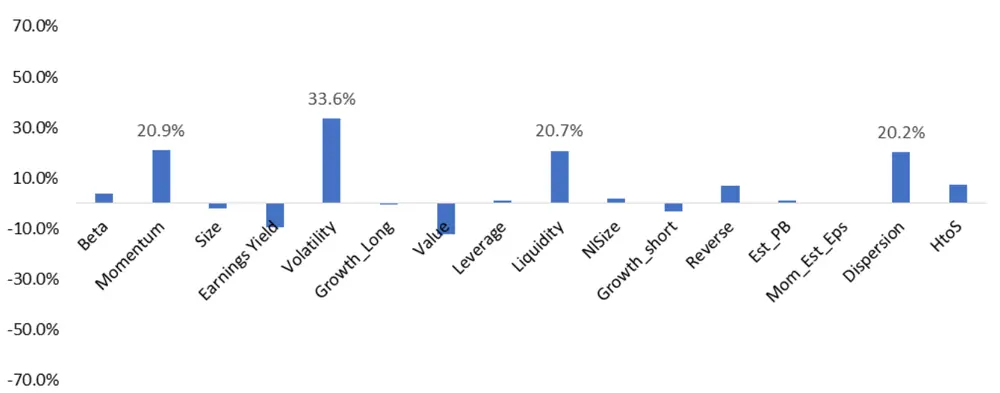
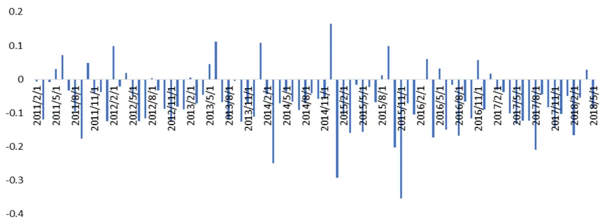
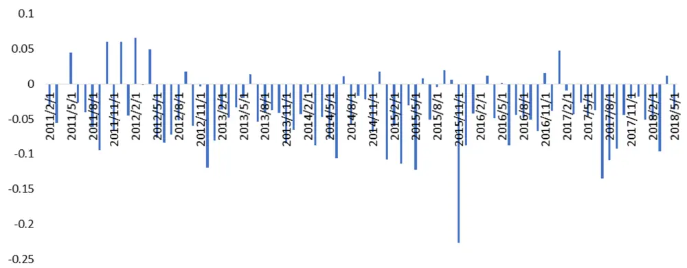
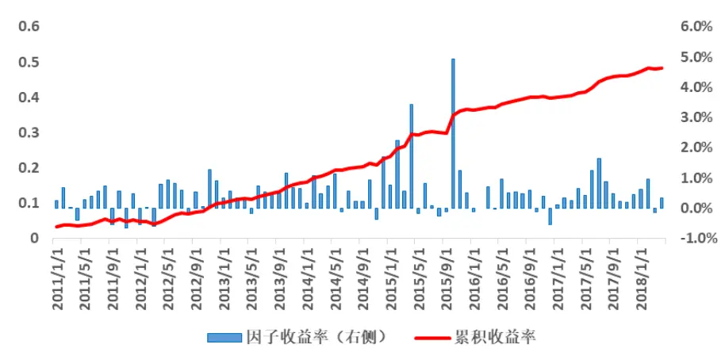
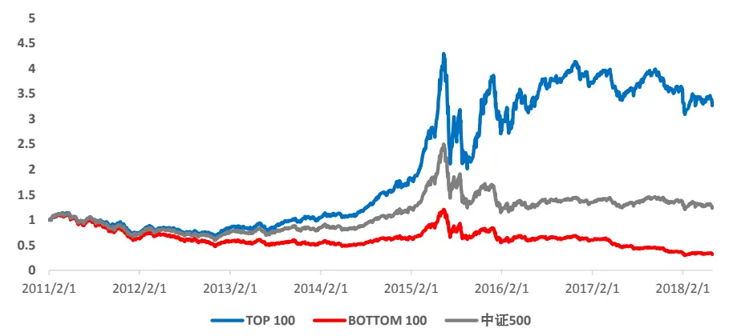
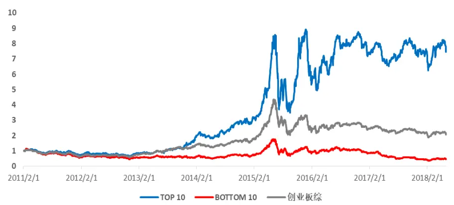
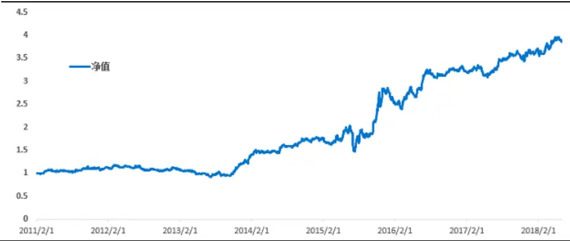

[Table_Title] 2018.07.26

# 基于风险模糊度的选股策略

## －－数量化专题之一百一十七

玉陈奥林（分析师）

## 杨能（研究助理）

8 021-38674835

chenaolin@gtjas.com

021-38032685

证书编号 S0880516100001

yangneng@gtjas.com

S0880117080176

## 本报告导读：

本篇报告以高频价格数据构建了低频 ALPHA因子。

## 摘要：

le_Summary]什么是风险模糊？投资者知道他知道什么（known knowns）产生期望；投资者知道他不知道什么(known knowns)反映风险；而投资者不知道他不知道什么的程度（unknown unknowns）表征风险模糊。风险模糊度刻画了未知概率分布的不确定性。在风险相同的情况下，投资者决策时有规避高风险模糊的倾向。

为什么存在风险模糊厌恶？若投资者对于股票的了解程度不够，那么他投资决策的失败将会归因于无知，而决策的成功则将被归因于侥幸和运气；相反，如果决策者被认为是专家，那么决策的成功更容易被归因于专业和经验，而决策的失败则会被归因于“倒霉”。因而，低风险模糊的股票，投资者预期分歧度低，更受投资者青睐。

如何刻画风险模糊程度？海外通常使用个股期权隐含波动率的日间波动率来计算 VoV 指标。由于个股期权数据的缺失，我们使用日内5分钟级别价格数据构造日内波动率代替个股期权隐含波动率，计算日内波动率的日间波动率。

因子预测能力与稳定性如何？VoV 无论是否剔出行业和九大类风格的影响都展现了与未来收益率的持续且稳定的负相关关系。未剔除行业与风格的情况下，IC为-0.06，ICIR 为-2.5；剔除行业与风格后，IC 下降至-0.04，但 ICIR 进一步提升至-2.81。VoV纯因子年化收益率为 5.08%，夏普比率为 2.25, 月最大回撤为 1.28%。

是否与其他量价类因子有较高的相关性？整体来看，纳入了高频数据的 VoV 因子仅与残差波动率因子有一定的相关性（34%），而与传统因子的相关性均较低。

如何指导投资？高 VoV 的股票有极高的投资风险，高 VoV 100 只股票组合年化超额收益率-16.4%，信息比率 2.98，稳定跑输大盘。投资者在选股时应考虑规避。低 VoV 投资组合在创业板内选股超额收益20.3%，信息比率2.02，月胜率63%，策略在2014年后尤为有效，可作为创业板选股增强的参考。

金融工程

## 金融工程团队：

陈奥林：（分析师）

电话：021-38674835

邮箱：chenaolin@gtjas.com

证书编号：S0880516100001

## 李辰：（分析师）

电话：021-38677309

邮箱：lichen@gtjas.com

证书编号：S0880516050003

## 孟繁雪：（分析师）

电话：021-38675860

邮箱：mengfanxue@gtjas.com

证书编号：S0880517040005

## 蔡旻昊：（研究助理）

电话：021-38674743

邮箱：caiminhao@gtjas.com

证书编号：S0880117030051

## 李栩：（研究助理）

电话：021-38032690

邮箱：lixu019018@gtjas.com

证书编号：S0880117090067

## 杨能：（研究助理）

电话：021-38032685

邮箱：yangneng@gtjas.com

证书编号：S0880117080176

## 殷钦怡：（研究助理）

电话：021-38675855

邮箱：yinqinyi@gtjas.com

证书编号：S0880117060109

## 余剑峰：（研究助理）

电话：021-38676186

邮箱：yujianfeng@gtjas.com

证书编号：S0880118060039

## 黄皖璇：（研究助理）

电话：021-38677799

邮箱：huangwangxuan@gtjas.com

证书编号：S088011610008

## [Table_R相关报告

《风格域划分下的基本面多因子选股策略》2018.07.12

《选基金核心是“选股”——》2018.07.11

《基于因子投资的资产配置方法》2018.06.28《基于股票特别处理的 A 股财务困境预测研究》2018.06.21

《投资科技创新股：基本面成长因子再挖掘》2018.06.14

## 1. 引言

前美国国防部长拉姆斯菲尔德有这样一句名言：

There are known knowns. There are known unknowns. There are unknown unknowns.

对于投资而言，投资者不知道他不知道什么反映的即是风险模糊的程度。

研究发现，与波动率异象类似，风险模糊度也存在着风险与收益呈现负相关的特征。我们把该现象称之为：风险模糊异象。

为什么投资者是风险模糊厌恶的、如何刻画股票的风险模糊特征、以及风险模糊异象是否能够构建投资策略是本篇报告关注的三大核心问题。

本篇报告第二章从风险模糊厌恶实验谈起，引入风险模糊的概念；第三章详细介绍了如何用VolofVol 刻画风险模糊的程度及其相关计算细节；第四章，我们从IC、纯因子组合的构建等角度检验了 Vol ofVol 对未来股票收益率的预测能力。最后一章构建了基于 Vol of Vol 相关的投资策略，供投资者参考。

## 2. 风险模糊厌恶

## 2.1.风险模糊厌恶实验

我们通常采用主观概率的方式来测度风险，并通过主观概率计算预期效用进行投资决策，从而实现预期效用最大化，这就是所谓的预期效用理论。当我们说有30%的概率明天会下雨。这个30%为主观概率，它表达了我们对第二天会下雨的信念就像是从一个含有30个红球和70个绿球的盒子里取出红球的可能性。数学上来讲，如果对于不确定性事件的主观概率为p 意味着决策者在以下两个选择中是无差异的：

选择一：如果E发生，则获得x元；否则无奖励。

选择二：从含有红球比例为p 的盒子里取出红球，则获得x元，否则无奖励。

预期效用理论受到了 Ellsberg（1961）的质疑。他提出了风险模糊厌恶效应的实验。该实验假设有两个盒子：

盒子一：50个红球和50个绿球

盒子二：100个球，但红球和绿球的比例未知

实验者需要从一个盒子里选一个球来猜它的颜色。如果猜对，则奖励 x元，若猜错，则无奖励。

表 1 风险与风险模糊的区别

| 盒子一 | 已知概率分布的 不确定性 | RISK | 风险 |
| --- | --- | --- | --- |
| 盒子二 | 未知概率分布的 不确定性 | UNCERTAINTY | 风险模糊 |

实验结果发现：大部分人更偏好50VS50的盒子一，即使实验者对猜红色或绿色没有偏好。这种形式的偏好在其他各类实验中均得到了验证，表明该偏好为一种普遍现象。而它直接违背了主观概率的可加性，因为在盒子一中拿到红球和拿到绿球的主观概率之和高于盒子二。该实验直接给出了预期效果理论的反例。它表明人们在很大概率上更愿意承担已知概率分布的不确定性事件（risk）的风险，而厌恶概率分布未知的不确定性事件（uncertainty）。这一重要发现表明预期效用理论虽然理论很完美，但应用于实际生活中可能是不对的，因为在现实世界中，大部分的决策问题都是概率分布都无法准确衡量的不确定性事件。股票投资亦是一个典型的例子。

若投资者能够确定股票价格未来上涨或者下跌的主观概率，那么根据预期期望理论，在预期收益相同的情况下，投资者一定偏好预期收益率波动更低的股票。但股票未来的收益率影响因素之多，使得股票未来收益率更像是一个概率分布未知的不确定性事件。所以，投资者在股市中首先厌恶的不是风险本身，而是风险模糊。

## 2.2.行为金融学的经验假说

为什么会存在风险模糊厌恶的现象? 经验假说认为，投资者对不确定事件（股票未来收益率）的价值判断不仅会估计不确定事件发生各种结果的主观概率，更会考虑主观概率估计的准确度。而估计的准确度是由投资者对相关事件的知识、经验和理解所决定的。在主观概率相同的情况下，投资者更愿意投资于那些他们自认为熟悉的、有竞争力和所擅长的领域，并为此付出更高的溢价，而非他们不了解的领域。

经验假说有认知上的解释和动机上的解释。在认知方面，人生经验告诉我们，我们在那些自己了解的领域比自己不了解的领域通常做的更好。这样的认知会让人在无意识间放大自己熟悉领域获胜的信心；从动机角度来看，与投机不同，投资带来的不仅仅是最终的金钱上的投资回报，还包括其投资或者投机行为所产生的心理回报。它产生于自我和他人的肯定与批评。实际上，这种评价是结果导向，而非行为导向的。

具体而言，如果是猜硬币的投机行为，无论最终结果成功或失败，投机者均会把其主要归因于运气。但有主观判断的投资行为并非如此。如果投资者对于股票的了解程度不够，那么他投资决策的失败将会归因于无知，而决策的成功则将被归因于侥幸和运气；相反，如果决策者被认为是专家，那么决策的成功更容易被归因于专业和经验，而决策的失败则会被归因于“倒霉”。

回到 Ellsberg 的风险模糊厌恶实验来看，人们不愿意选择未知分布的盒子二的原因是红球和绿球的比例是可知的，只是他们并不知道，他们觉得自己丢失了信息，从而低估自己能够成功的概率。

## 2.3.波动率之谜的解释

传统金融学理论（资产定价模型CAPM和套利定价模型APT）论证了股票的预期收益应与风险成正比。然而，海内外研究的实证结果却得出了相反的结论：用波动率或者特质波动率来衡量股票预期收益率的不确定性时，低风险（低波动率）的股票来收益率反而较高。例如中证500低波动率指数在过去12年里有 14 倍的涨幅。这一现象称之为“波动率异象”。

本质上来讲，波动率异象产生的根源是波动率并非真实反映了投资者所认为的风险。即传统金融学使用的贝叶斯框架，仅考虑了主观概率上的不确定性，而忽略了投资决策中认知上的不确定性。实际上，在经验假说下，投资者可能在决策时出现高波动偏好的特点。

投资者偏向于投资于那些他们自认为熟悉的股票，并且不直接把股票可观测的波动率作为风险；这也是为什么投资者更倾向于宁愿放弃分散化的好处，而集中投资于某一类他们十分熟悉的股票。因为几乎没有人能够对所有行业和股票都很熟悉，所以尽管他们的熟悉的股票有更大的波动，他们也愿意为此付出溢价，从而使得波动率（特质波动率）与预期收益率的关系出现了倒挂。

## 3. Vol ofVol 与风险模糊度

上一节提到，股票波动率仅刻画了主观投资风险的一部分，波动本身的不确定性同样是投资者在投资决策时考虑的风险点，且优先级比波动本身更高。使用波动率刻画风险忽略了风险模糊效应。为此，我们引入波动率的波动率（VolofVol）来刻画股票的风险模糊度。

套用前美国国防部长拉姆斯菲尔德的名言，投资者对投资的认知有三种可能。

第一种可能是knownknowns。投资者知道他知道什么，投资者会根据已知的信息产生对股票的预期收益率E(R)；

第二种可能是knownunknowns。投资者知道他不知道什么。由于信息的不完全，投资知道自己的预期收益率的判断存在误差，通常用标准差（波动率）来衡量。

第三种可能是unknown unknowns。投资者不知道他不知道什么。投资者对风险的认知是模糊的，投资者对股票未来波动率的估计也存在误差，类似的，我们用波动率的波动幅度VolofVol来衡量风险模糊的程度。

表 2 投资者三种认知的比较

| 认知 | 金融含义 | 数学表达 | 预测能力 |
| --- | --- | --- | --- |
| 投资者知道他知道什么 | 期望 | 均值 | 几乎没有预测能力 |
| 投资者知道他不知道什么 | 风险 | 波动率 | 预测能力一般 |
| 投资者不知道他不知道什么(的程度) | 风险模糊度 | 波动率的波动率 | 预测能力较高 |

## 3.1. Vol of Vol 的计算方式

在海外市场，股票的Vol of Vol 的计算方法通常是个股期权隐含波动率的标准差。A 股市场由于没有个股期权，我们采用日内 $\frac{\dot{\pi}}{\vert\nabla\pmb{\vert\tau}\vert}$ 频数据计算日内波动率代替期权隐含波动率，即：

$$
VOV_{\textit{ \textbf { i } },t}=\mathrm{std}\ ({\nu ol}_{\textit{ \textbf { i } },t}^{\textit{ \textbf { n o r m } }})
$$

其中，

$\begin{array}{rlr}{VO\bar{l}\begin{array}{c}{^{norm}}\\{\cdot\it{\Delta}_{\perp,t}}\end{array}}&{{}=}&{\bar{\it Zscore}\quad(\it{rol}\mathrm{~(\it~r_{i,\perp,\perp,}~)})}\end{array}$ ，表示股票i在t日标准化后的日内波动率。

VoV的具体计算步骤如下：

1. 根据高频数据处理传统，剔除开盘后 15 分钟和收盘前 15 分钟的价格数据，避免波动异常值的影响

2. 根据5分钟 K线的涨跌幅计算的当日日内波动率，约 40个样本点。

3. 为了剔除个股日内波动自身量级对 VoV的影响，我们需要在计算日间标准差之前预先对日内标准差在横截面上进行标准化处理，计算Z-score 值。

4. 使用 40 个交易日（约两个月）内标准化后的 $\sigma_{\textit{ i , t }}$ 计算标准差，得到最终的 VoV，标准差使用时间周期基本与 5 分钟涨跌幅的样本量保持一致。

## 3.2.日内波动率的估计方法

波动率的标准定义为：

$$
s={\sqrt{\frac{1}{N-1}\sum_{i=1}^{N}{(x_{i}-x)}^{2}}}
$$

虽然这样定义的方差是总体方差的无偏估计，但直接在方差上开平方所得到的波动率却是有偏估计。根据Jenson不等式，样本标准差低估了真实的 $\mathfrak{j}^{\pmb{\sigma}}\mathrm{_{:}}$ ：

$$
E(s)=E(\sqrt{{s}^{2}})<\sqrt{E(s^{2})}=\sqrt{\sigma^{2}}=\sigma
$$

当样本容量N较少时，总体标准差和样本标准差偏差较大，随着样本容量N的增大，偏差会减小。但是样本容量过大会导致收敛速度缓慢，称作非有效估计量。标准差为有偏且非有效的波动率估计量。鉴于日内分钟级别数据有限，我们采用更加有效的Parkinsion波动率。

该（波动率）估计量由 Parkinson（Parkinson 1980）发明，其通过极差构造了波动率，表达式为：

$$
\sigma\ =\ \sqrt{\frac{1}{4\ :N\ \ln\ 2}{\sum_{\ i=1}^{N}}\ (\ln\big(\frac{h_{i}}{l_{i}}\big)^{2}}
$$

式中， $h_{i}$ 是交易时段的最高价； $l_{i}$ 是交易时段的最低价。

根据 Euan Sinclair 著作 Volatility Trading,该估计量只需要较少的时间周期就可以收敛于真实波动率。依据人工生成的几何布朗运动（GBM）进行测试时，用Parkinson估计量的效率要比标准差估计量高出 5倍。

在实证过程中，我们也试图尝试使用了一些其他的高频波动率定义方式，包括 Garman-Klass 波动率和 Yang-Zhang 波动率等，他们具有更好的估计效率，但结果上来看，他们在不同检验方法下各有千秋。故考虑到计算便携性，我们使用Parkinson波动率来估计波动率。

## 4. Vol of Vol 与预期收益率

## 4.1.传统因子相关性检验

VoV 虽然反映的风险侧重点有所不同，但其本质上反映的依然是股票收益率的不确定性。因而，在度量 VoV与预期收益率之前，有必要计算VoV与其他因子的相关性，特别是波动率因子、特质波动率因子和市值因子等。我们分别计算了2011年至 2018年 5月底各月因子间的平均相关性，其结果如下：

图 1 VoV 与风格因子及常见ALPHA因子的相关性

数据来源：国泰君安证券研究

从相关性结果来看，VoV与波动因子有 34%的相关性，与动量、流动性和特质波动率因子有约 20%的相关性。作为价量类因子，VoV从另一维度刻画了股票收益的不确定性，整体来看，与传统的低频因子相关性并不高，但对风格因子：波动率、动量与流动性仍然存在一定的相关性，对此，我们需要剔除风格后判断它的增量预测能力。

## 4.2. Vol of Vol 预测能力检验

本小节我们分别检验了VoV因子在单因子和多因子体系下的未来收益率预测能力。

上一小节表明，VoV 作为技术类因子来看，它与某些技术类因子有中度的相关性。为了检验其提供的增量信息，我们需要剔除行业和九大类风格因子的影响；对于非多因子的投资者来说，单因子的预测能力更有意义，因而我们分别计算了剔除行业与风格前与剔除行业与风格后的 IC和 ICIR。

未剔除行业与风格的月度IC统计如下：

图 2 未剔除行业与风格的月度IC

数据来源：国泰君安证券研究

剔除行业与风格后VoV的IC、ICIR采用了以下算法:

$$
\begin{array}{rl}{VoV=\beta_{s}\ X_{\mathrm{nonstry}}+\beta_{s}\ X_{\mathrm{nonstry}}+\beta_{s}\ X_{\mathrm{nonstrons}}+\beta_{s}\ X_{\mathrm{nonstrons}}+\beta_{s}\ X_{\mathrm{nonstrons}}}\\&{+\beta_{s}\ X_{\mathrm{nonstrons}}+\beta_{s}\ X_{\mathrm{nonstrons}}+\beta_{s}\ X_{\mathrm{nonstrons}}\beta_{s}\ X_{\mathrm{nonstrons}}}\\&{+\beta_{s}\ X_{\mathrm{nonstrons}}+\beta_{s}\ X_{\mathrm{nonstrons}}}\\{R=r_{2}X_{\mathrm{nonstrons}}+r_{1}X_{\mathrm{nonstrons}}+r_{2}X_{\mathrm{nonstrons}}+r_{3}X_{\mathrm{nonstrons}}+r_{4}X_{\mathrm{nonstrons}}}\\&{+r_{5}X_{\mathrm{nonstrons}}+r_{5}X_{\mathrm{nonstrons}}+r_{7}X_{\mathrm{nonstrons}}+r_{5}X_{\mathrm{nonstrons}}}\\&{+r_{6}X_{\mathrm{nonstrons}}+c_{6}}\\{IC-conr(E_{\mathrm{nonstrons}},\varepsilon)}\\{IcIR=\frac{1}{\pi(E)}}\end{array}
$$

图 3 剔除行业与风格后的月度IC

数据来源：国泰君安证券研究

结果表明：VoV 对个股下一期整体收益率与残差收益率均呈现持续且较为稳定的负相关关系。未剔除行业与风格的情况下，IC 为-0.06，ICIR 为-2.5；剔除行业与风格后，IC下降至-0.04，但ICIR进一步提升至-2.81。

表 3 因子检验结果统计

| 统计量 | 未剔除行业与风格 | 剔除行业与风格 |
| --- | --- | --- |
| IC | -0.0634 | -0.0398 |
| std | 0.0876 | 0.0492 |
| ICIR | -2.50 | -2.81 |

数据来源：国泰君安证券研究

若把VoV作为ALPHA因子，构建纯因子组合，VoV是稳定的ALPHA 收益来源。VoV纯因子年化收益率为 5.08%，夏普比率为 2.25, 月最大回撤为 1.28%。

$$
\begin{array}{l}{{R\ =\ r_{0}X_{\mathrm{\it~industry}}+\ r_{1}X_{\mathrm{\it~beta}}+\ r_{2}X_{\mathrm{\it~momentum}}+\ r_{3}X_{\mathrm{\it~size}}+\ r_{4}X_{\mathrm{\it~earnings\mathrm{\it~-\it~yield}}}}}\\{{\ }}\\{{\displaystyle\qquad+\ r_{5}X_{\mathrm{\it~growth}}+\ r_{6}X_{\mathrm{\it~volatility}}+\ r_{7}X_{\mathrm{\it~\it~value}}+\ r_{8}X_{\mathrm{\it~leverage}}}}\\{{\ }}\\{{\displaystyle\qquad+{\bf r}_{9}X_{\mathrm{\it~liquidity}}+\ r_{\mathrm{\it~vov}}\varepsilon_{\mathrm{\it~voV}}}}\\{{\ }}\\{{\displaystyle{\cal R}_{\mathrm{\it~VoV}}\ =\ -\sum_{\mathrm{\it~\prime~}}r_{\mathrm{\it~VoV},t}}}\end{array}
$$

图 4 纯因子累积收益率

数据来源：国泰君安证券研究

## 4.3. 检验结果分析

从理论上来讲，由于投资者存在着风险模糊厌恶的特征，因此，承担了“风险模糊”风险的投资者应当有相应的风险溢酬，即高风险模糊，高股票收益。然而，上一小节的实证检验结果表明：风险模糊程度越高的股票，未来收益率越低。事实上，美国市场也有显著的低 VoV，高股票收益的异象（GuidoBaltussen，2014）。作者试图通过做空限制、跳跃风险、非对称性风险等各角度解释其VoV效应，但均在实证过程中未发现明显的证据，因而，我们把风险模糊效应看作一种独特的波动率异象。

## 5. 基于 VoV的策略构建及选股表现

虽然在理论上无法解释风险模糊异象，但并不妨碍我们据此构建相关的选股策略。上一节表明，VoV 因子对未来股票月收益率具有较高的预测能力，但该收益是否可实现，需要进一步回测验证。其策略具体构建方式如下：

股票池：全A 市场（剔除ST、停牌与次新）

目标组合：VoV经行业中性后选择最小的100只股票作为 TOP100组合；
最大的 100 只股票作为 BOTTOM100 组合。

调仓频率：月换仓

建仓成本：双边千分之三

加权方式：等权

图 5 全市场选股策略净值走势

数据来源：国泰君安证券研究

全市场策略截止2018年 5月底，TOP100年化超额收益率 14.5%，信息比率2.38，月胜率68%，自2018年以来获得3.65%的相对年化超额收益，最大回撤 14.5%，发生于 2017 年；BOTTOM100 组合年化超额收益率-16.4%，信息比率2.98。两个组合都有较高的信息比率，特别是BOTTOM100组合，稳定跑输大盘，有较大的投资风险，应注意规避。

表 4 全市场选股策略业绩绩效

| 全域 | 绝对收益绩效 |  | 相对收益绩效 |  |
| --- | --- | --- | --- | --- |
|  | Top 100 | Bottom 100 | Top 100 | Bottom 100 |
| 年化收益率 | 17.8% | -14.5% | 14.5% | -16.4% |
| 夏普比率 | 1.66 | 3.63 | 2.38 | 2.98 |
| 最大回撤 | -53% | -75% | -15% | -74% |
| 月胜率 | 54% | 46% | 68% | 26.4% |
| 年化换手率 | 823% | 849% | / | / |

数据来源：国泰君安证券研究

作为量价类指标，VoV 应当在量价类主导的域内有更好的效果。因此，我们进一步检验了其在创业板内的选股效果。我们在创业板内选择 VoV最小的 10 只股票作为 TOP 10 组合,VoV最大的 10 只股票作为 BOTTOM10 组合，其余设置不变。

图 5 创业板选股策略净值走势

数据来源：国泰君安证券研究

创业板内选股超额收益20.3%，信息比率2.02，月胜率 63%。创业板内策略在2014年以后策略表现收益尤为突出。2014年之前，特别是2012年和 2013 年，创业板投资主要为并购逻辑，这导致高风险模糊的股票更容易受到炒作的影响，与策略逻辑相互抵消，因而未有明显的超额收益。

图 6 相对创业板指数超额收益净值曲线

数据来源：国泰君安证券研究

表 5 创业板选股策略业绩绩效

| 创业板 | 绝对收益绩效 |  |  |
| --- | --- | --- | --- |
|  | Top 10 | Bottom 10 | Top 10 Bottom 10 |
| 年化收益率 | 31.8% | -10.1% 20.3% | -17.4% |
| 夏普比率 | 1.29 | 3.13 2.02 | 2.28 |
| 最大回撤 | -59% | -80% -28% | -80.1% |
| 月胜率 | 56% | 45% 63% | 35.6% |
| 年化换手率 | 876% | 866% 1 | 1 |

数据来源：国泰君安证券研究

## 6. 总结与展望

本篇报告的主要贡献在于：

- 通过风险模糊实验与经验假说，从行为金融学的角度解释 A 股市场长期存在的波动率异象。

- 我们提出投资者首先厌恶的是风险模糊，而非风险本身。

- 我们发现有悖于金融常识，使用VolofVol 刻画的风险模糊度，在剔出行业与风格后，依然呈现与个股收益率显著的负相关关系。

- 高 Vol of Vol 的股票有极高的投资风险，投资者在选股时应及时规避。

- 基于 VoV构建的创业板增强策略，年化超额收益率超过 20%，信息比率 2.02。

风险模糊度VolofVol 本质上反映的是股票预期收益率的不确定性。 它与股票收益率负相关关系产生的机理和背后的金融学解释值得我们进一步研究与思考。但不得不承认，由于股票收益率不确定性的不可观测性，实证上的研究是有极大的挑战性的。因此，从理论出发，更为可行的研究方向是发掘其它度量股票收益率不确定度的方式，并与VolofVol进行比较。

## 本公司具有中国证监会核准的证券投资咨询业务资格

## 分析师声明

作者具有中国证券业协会授予的证券投资咨询执业资格或相当的专业胜任能力，保证报告所采用的数据均来自合规渠道，分析逻辑基于作者的职业理解，本报告清晰准确地反映了作者的研究观点，力求独立、客观和公正，结论不受任何第三方的授意或影响，特此声明。

## 免责声明

本报告仅供国泰君安证券股份有限公司（以下简称“本公司”）的客户使用。本公司不会因接收人收到本报告而视其为本公司的当然客户。本报告仅在相关法律许可的情况下发放，并仅为提供信息而发放，概不构成任何广告。

本报告的信息来源于已公开的资料，本公司对该等信息的准确性、完整性或可靠性不作任何保证。本报告所载的资料、意见及推测仅反映本公司于发布本报告当日的判断，本报告所指的证券或投资标的的价格、价值及投资收入可升可跌。过往表现不应作为日后的表现依据。在不同时期，本公司可发出与本报告所载资料、意见及推测不一致的报告。本公司不保证本报告所含信息保持在最新状态。同时，本公司对本报告所含信息可在不发出通知的情形下做出修改，投资者应当自行关注相应的更新或修改。

本报告中所指的投资及服务可能不适合个别客户，不构成客户私人咨询建议。在任何情况下，本报告中的信息或所表述的意见均不构成对任何人的投资建议。在任何情况下，本公司、本公司员工或者关联机构不承诺投资者一定获利，不与投资者分享投资收益，也不对任何人因使用本报告中的任何内容所引致的任何损失负任何责任。投资者务必注意，其据此做出的任何投资决策与本公司、本公司员工或者关联机构无关。

本公司利用信息隔离墙控制内部一个或多个领域、部门或关联机构之间的信息流动。因此，投资者应注意，在法律许可的情况下，本公司及其所属关联机构可能会持有报告中提到的公司所发行的证券或期权并进行证券或期权交易，也可能为这些公司提供或者争取提供投资银行、财务顾问或者金融产品等相关服务。在法律许可的情况下，本公司的员工可能担任本报告所提到的公司的董事。

市场有风险，投资需谨慎。投资者不应将本报告作为作出投资决策的唯一参考因素，亦不应认为本报告可以取代自己的判断。
在决定投资前，如有需要，投资者务必向专业人士咨询并谨慎决策。

本报告版权仅为本公司所有，未经书面许可，任何机构和个人不得以任何形式翻版、复制、发表或引用。如征得本公司同意进行引用、刊发的，需在允许的范围内使用，并注明出处为“国泰君安证券研究”，且不得对本报告进行任何有悖原意的引用、删节和修改。

若本公司以外的其他机构（以下简称“该机构”）发送本报告，则由该机构独自为此发送行为负责。通过此途径获得本报告的投资者应自行联系该机构以要求获悉更详细信息或进而交易本报告中提及的证券。本报告不构成本公司向该机构之客户提供的投资建议，本公司、本公司员工或者关联机构亦不为该机构之客户因使用本报告或报告所载内容引起的任何损失承担任何责任。

## 评级说明

## 1.投资建议的比较标准

投资评级分为股票评级和行业评级。

以报告发布后的12个月内的市场表现为比较标准，报告发布日后的 12个月内的公司股价（或行业指数）的涨跌幅相对同期的沪深 300 指数涨跌幅为基准。

## 2.投资建议的评级标准

报告发布日后的 12 个月内的公司股价（或行业指数）的涨跌幅相对同期的沪深 300 指数的涨跌幅。

|  | 评级 | 说明 |
| --- | --- | --- |
| 股票投资评级 | 增持 | 相对沪深300指数涨幅15%以上 |
|  | 谨慎增持 | 相对沪深300指数涨幅介于5%～15%之间 |
|  | 中性 | 相对沪深300指数涨幅介于-5%～5% |
|  | 减持 | 相对沪深 300 指数下跌 5%以上 |
| 行业投资评级 | 增持 | 明显强于沪深 300 指数 |
|  | 中性 | 基本与沪深 300指数持平 |
|  | 减持 | 明显弱于沪深300指数 |

## 国泰君安证券研究所

|  | 上海 | 深圳 | 北京 |
| --- | --- | --- | --- |
| 地址 | 上海市浦东新区银城中路168号上海 银行大厦29层 | 深圳市福田区益田路 6009 号新世界 商务中心34层 | 北京市西城区金融大街 28 号盈泰中 心2号楼10层 |
| 邮编 | 200120 | 518026 | 100140 |
| 电话 | （021)38676666 | (0755)23976888 | (010)59312799 |
|  | E-mail: gtjaresearch@gtjas.com |  |  |