inInfo] [Table_Title] 2018.09.07

# 基于财报期效应的基本面因子动态配置研究

## ——数量化专题之一百一十八

李辰（分析师）

## 李栩（研究助理）

8 021-38677309

021-38032690

lichen@gtjas.com

证书编号 S0880516050003

lixu019018@gtjas.com

S0880117090067

## 本报告导读：

本篇报告研究了基本面因子在不同财报期季节预测能力存在的规律性现象，构建了基于财报期效应的基本面因子择时组合，可获得更高且更稳定的基本面因子投资收益。摘要：

e_Summary]自 2017 年以来市场对基本面因子关注程度日渐提高，然而在历史上大多数基本面因子对收益的预测能力并不稳定，若全年均使用这些因子构建组合，在每年的很多时间区间内，组合可能会出现较大回撤；另一方面，许多基本面因子在每年的某些特定时间区间内表现出极强且稳定的预测能力，这些时间段围绕着财报期拥有着明显的季节性规律，是该类基本面因子受投资者关注程度最高且投资逻辑最稳定的时期，若在这些时间段超配因子，可以获得更高且更稳定的投资收益，我们将“基本面因子在每年特定的财报期季节内，稳定地表现出极高预测能力”的规律性现象称作基本面因子的财报期效应。

围绕财报期划分财报期季节，梳理盈利、质量、成长、分红治理重要持股人、预期、估值等6 大类基本面因子财报期效应的逻辑，验证逻辑的统计显著性，研究结果发现，各大类因子及其预测能力最强且最稳定的时期分别是：盈利因子，财报期后“业绩炒作期”；盈余质量因子，中报三季报“预期甄别期”；成长因子，财报期前的“提前布局财报期”与财报期后的“业绩炒作期”；分红因子，分红方案公布后到正式分红前的“炒分红期”；上调预期因子，财报期内；估值因子，年底风险偏好较低的时期。

根据逻辑梳理与统计检验结果，设计了基于财报期效应的基本面因子动态配置方案：2~4 月“年报披露期”选择新成长以及上调预期因子，5~7月“业绩炒作期”选择盈利、成长、分红治理与重要持股人以及超预期因子，8~10 月“预期甄别期”选择盈余质量以及上调预期因子，11~1 月“布局年报期”选择估值、短期成长与长期成长以及超预期因子。

根据动态配置方案构建全市场选股中证 500增强组合，控制行业、风格中性及个股权重上限等，组合年化绝对收益26.91%，年化超额收益 18.59%，信息比率为 2.34，增强效果稳定；相比于不做择时的基本面中证500增强组合（对照组合），年化超额收益增加了 5.5%，信息比率提升了0.66。

金融工程

## 金融工程团队：

陈奥林：（分析师）

电话：021-38674835

邮箱：chenaolin@gtjas.com

证书编号：S0880516100001

## 李辰：（分析师）

电话：021-38677309

邮箱：lichen@gtjas.com

证书编号：S0880516050003

## 孟繁雪：（分析师）

电话：021-38675860

邮箱：mengfanxue@gtjas.com

证书编号：S0880517040005

## 蔡旻昊：（研究助理）

电话：021-38674743

邮箱：caiminhao@gtjas.com

证书编号：S0880117030051

## 李栩：（研究助理）

电话：021-38032690

邮箱：lixu019018@gtjas.com

证书编号：S0880117090067

## 杨能：（研究助理）

电话：021-38032685

邮箱：yangneng@gtjas.com证书编号：S0880117080176

## 殷钦怡：（研究助理）

电话：021-38675855

邮箱：yinqinyi@gtjas.com

证书编号：S0880117060109

## 余剑峰：（研究助理）

电话：021-38676186

邮箱：yujianfeng@gtjas.com

证书编号：S0880118060039

## 黄皖璇：（研究助理）

电话：021-38677799

邮箱：huangwangxuan@gtjas.com

证书编号：S088011610008

## [Table_R相关报告

《基于风险模糊度的选股策略》2018.07.26《风格域划分下的基本面多因子选股策略》2018.07.12

《选基金核心是“选股”——》2018.07.11

《基于因子投资的资产配置方法》2018.06.28《基于股票特别处理的 A 股财务困境预测研究》2018.06.21

## 1. 引言

自 2017 年以来，市场对基本面及基本面因子的关注程度日渐提高，以ROE 为例，2010~2017 年因子风险调整后 IC 平均为 0.006，而 2017 年至今 Adjusted-IC 平均为 0.073，也就是说，若我们在 Alpha 模型中考虑ROE因子，将为组合提供较高的收益贡献；然而，若对因子进行进一步的观察，可以发现ROE及其他基本面因子在历史上的IC 并不稳定，且因子显著性较低，即使在 2017 年后，也会在特定的某些时间段出现不稳定的状况，如果我们在全时期均选择配置这些基本面因子，那么在不稳定的时期组合将出现一定的回撤，带来投资上的损失，如果在这些不稳定的时期低配或者不配因子，可以避免损失提升组合稳定性；相应地，我们还发现了大多数基本面因子，在一些特定的时间段（围绕着财报期展现了较强的季节性规律）会拥有更高的关注程度以及更强的投资逻辑，从而导致因子在这些时期拥有相对高且稳定的预测能力，例如，ROE等盈利因子在财报期后的“炒业绩期”，因子预测能力十分稳定，且显著高于其他时期，如果我们在这些特定时期超配该类因子，可以获得更高且更稳定的投资收益。

图 1ROE等盈利因子在财报期后的“炒业绩期”预测能力更稳定，其他时期预测能力不稳定
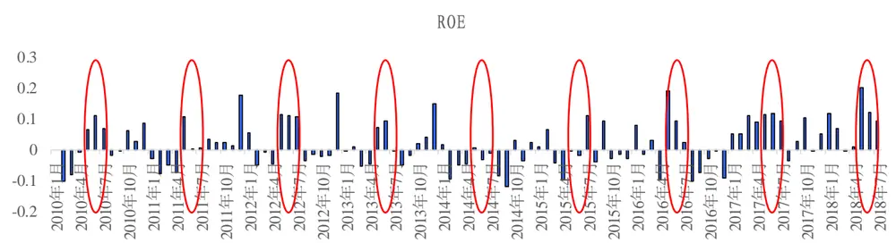
数据来源：Wind、国泰君安证券研究

针对上述描述，为了最大化程度地灵活运用基本面因子，本篇报告从大类基本面因子的内在逻辑出发，探索因子逻辑性最强、关注程度最高的时期并检验因子在该时期的有效性及稳定性，最终设计了基于财报期效应的基本面因子动态配置方案（参见下图，具体构建的逻辑框架、统计检验以及实证分析分别见本篇报告的第 2、3、4 部分），在因子有效且稳定的时期超配因子，不稳定的时期低配或者不配因子，从而提升基本面因子投资的收益率及信息比率。

表 1: 基本面因子动态配置方案一览

| 财报期季节 | 时间 | 配置因子类型 |
| --- | --- | --- |
| 春季躁动，年报披露期 | 2~4月（财报期内） | 新成长、上调预期 |
| 年报披露，业绩炒作期 | 5~7月（财报期后及前） | 盈利、成长、治理分红与重要持股人、超预期 |
| 中报三季报，预期甄别期 | 8~10月（财报期内） | 盈余质量、上调预期 |
| 三季报定调，布局年报期 | 11~1月（财报期后及前） | 估值、传统成长、超预期 |

数据来源：国泰君安证券研究

本篇报告实证结果表明，我们构建的基于财报期效应的基本面因子动态配置组合年化超额收益为18.59%，信息比率为2.34，最大回撤为-7.88%，相较于不做择时的对照组合年化超额收益提升了 5.5%，信息比率提升了0.66，最大回撤降低了 3.32%，效果提升显著。

## 2. 基本面因子财报期效应研究框架（逻辑框架部分）

由于系统性的基本面因子财报期效应研究课题相对于实际投资运用来说还较为新颖，其没有非常成熟的研究框架及结论，更多的是结合 A股市场的观察、投资经验及统计表现而形成的策略启发，所以在研究框架建立之前，我们有必要对时间效应（月度效应、季节效应、节假日效应、财报期效应等）有关的经典的学术文献进行简要回顾并加以分析，从而提炼出我们关于基本面因子财报期效应科学的合理的研究思路，并指导我们建立适用的研究框架。

有关于时间效应研究的学术文献，主要侧重于研究风格与行业等风险因子的月度效应表现，其中最为著名的研究是“一月效应”，其通过统计发现，在美股及全球其他诸多股市中，1 月份上涨的概率显著高于全年其余时期，且小市值股票的表现显著优于大市值股票。对于该异象广泛认可的解释有，税赋损失效应（Rozeff，1976）、“窗口粉饰”效应（Lakonishok，1988）等，其他相关的解释有，经济周期、利率、节假日与年终奖等。而在A股市场，统计发现并不存在显著的“一月效应”，但是存在较为显著的“春节二月效应”，在二月份A 股国家因子收益胜率为70%、小市值因子胜率为70%，二月异象显著，对于这种现象，我们发现行为金融上的解释更符合 A 股市场的情况。关于行为金融的解释，来源于 Qian 在《QEPM》中的研究，其认为风险偏好随着投资评估考核期从长到短逐渐下降，年初时风险偏好最高，因此更加偏好小盘、高估值、高风险、低质量的股票，这一定程度上解释了A股市场上常见的“春季躁动”现象，而年底的时候风险偏好最低，因此会偏好一些大盘、低估值、低风险、高质量的股票，一定程度上对应了 A 股市场年底时有发生的“大市值效应”；Qian 通过全球各国股票市场上半年与下半年质量因子 IC 的两样本均值t检验，证明了其“行为金融解释”的合理性。

## 2.1.基于月度效应的风格、行业因子择时方案尚不存在

沿着上述研究的思路，我们首先对风格、行业等风险因子的因子收益（个股收益与个股风险暴露回归所得系数）按月份分别进行周胜率的统计（周胜率=LEN(周度因子收益*胜率方向>0)/周数），检验因子月度效应并总结规律，其中风格因子的表现如下表，从中我们可以得到两个主要的结论：

- “春季躁动”时期中的2-3 月份，小盘股、高估值策略胜率更高；

- 年末风险偏好较低的时期（12 月份），低波动、低换手策略胜率更高。

表 2: 风格因子存在一定的月度效应，但胜率大多处于 8 成以下

| 周胜率 |  |  |  |  |  |  |  |  |  |  |  |  |
| --- | --- | --- | --- | --- | --- | --- | --- | --- | --- | --- | --- | --- |
|  | 胜率方向 | 1月 | 2月 | 3月 | 4月 | 5月 | 6月 | 7月 | 8月 | 9月 10月 | 11月 | 12月 |
| Beta | 十 | 62% | 52% | 85% | 76% | 70% | 62% 67% | 54% | 69% | 63% | 65% | 74% |
| Momentum | 十 | 50% | 45% | 55% | 51% | 68% | 74% 56% | 46% | 56% | 59% | 62% | 55% |
| Size | 1 | 59% | 70% | 70% | 49% | 59% | 49% 62% | 71% | 54% | 67% | 65% | 50% |
| Earnings Yield | + | 71% | 55% | 68% | 63% | 59% | 82% 59% | 40% | 59% | 63% | 44% | 76% |
| Residual Volatility |  | 44% | 45% | 68% | 71% | 62% | 67% 62% | 66% | 51% | 52% | 65% | 66% |
| Growth | 十 | 56% | 52% | 73% | 66% | 51% | 54% 54% | 54% | 59% | 52% | 53% | 50% |
| BTOP | 十 | 62% | 42% | 40% | 46% | 38% | 38% 51% | 51% | 56% | 52% | 53% | 55% |
| Leverage |  | 50% | 58% | 68% | 49% | 62% | 67% 54% | 63% | 51% | 56% | 53% | 37% |
| Liquidity |  | 56% | 52% | 58% | 68% | 57% | 62% 77% | 51% | 69% | 59% | 76% | 79% |
| Non Linear Size |  | 47% | 48% | 65% | 54% | 68% | 67% 51% | 60% | 46% | 63% | 71% | 53% |

数据来源：国泰君安证券研究

尽管可以从上述统计中总结出一定逻辑性可解释的规律，但我们不建议基于月度效应对风格因子进行择时，因为我们可以从上述统计中观察到，风格因子分月周胜率并不算高，大多处于80%以下，且风格能够对收益与波动产生显著影响，一旦择错，组合可能将出现较大的回撤。所以，对于风格因子月度效应的应用方法，我们建议从控制风险的角度出发，在某个风格因子非常不稳定且胜率较低的月份，严格控制其敞口。

其次对行业因子收益统计其月度效应周胜率，可以发现没有一个行业在某一月份的周胜率超过 80%，所以基于月度效应对行业进行择时也是不可行的。

表 3: 行业因子大多不存在月度效应

| 周胜率 |  |  |  |  |  |  |  |  |  |  |  |  |
| --- | --- | --- | --- | --- | --- | --- | --- | --- | --- | --- | --- | --- |
|  | 1月 | 2月 | 3月 | 4月 | 5月 | 6月 | 7月 | 8月 | 9月 | 10月 | 11月 | 12月 |
| 石油石化 | 53% | 39% | 43% | 34% | 41% | 49% | 31% | 37% | 36% | 33% | 44% | 34% |
| 煤炭 | 35% | 36% | 40% | 49% | 41% | 46% | 44% | 37% | 41% | 41% | 47% | 37% |
| 有色金属 | 53% | 42% | 48% | 59% | 43% | 41% | 54% | 51% | 38% | 48% | 44% | 45% |
| 电力及公用事业 | 24% | 48% | 48% | 41% | 54% | 46% | 41% | 46% | 33% | 59% | 38% | 34% |
| 钢铁 | 44% | 45% | 35% | 51% | 38% | 46% | 46% | 54% | 41% | 41% | 47% | 26% |
| 基础化工 | 38% | 52% | 48% | 37% | 49% | 49% | 54% | 51% | 49% | 52% | 35% | 50% |
| 建筑 | 32% | 48% | 43% | 27% | 41% | 49% | 44% | 49% | 38% | 44% | 53% | 53% |
| 建材 | 41% | 45% | 50% | 37% | 27% | 33% | 62% | 46% | 41% | 44% | 47% | 58% |
| 轻工制造 | 59% | 58% | 53% | 44% | 43% | 41% | 51% | 54% | 59% | 41% | 47% | 47% |
| 机械 | 50% | 42% | 55% | 29% | 41% | 56% | 33% | 31% | 46% | 59% | 53% | 53% |
| 电力设备 | 47% | 48% | 53% | 41% | 49% | 49% | 33% | 40% | 54% | 52% | 44% | 45% |
| 国防军工 | 59% | 58% | 38% | 49% | 46% | 51% | 49% | 46% | 44% | 37% | 44% | 47% |
| 汽车 | 44% | 52% | 35% | 37% | 49% | 56% | 36% | 43% | 62% | 44% | 41% | 42% |
| 商贸零售 | 29% | 39% | 43% | 49% | 43% | 36% | 38% | 60% | 54% | 37% | 24% | 50% |
| 餐饮旅游 | 65% | 42% | 58% | 39% | 41% | 41% | 59% | 57% | 59% | 26% | 44% | 47% |
| 家电 | 65% | 45% | 60% | 44% | 41% | 56% | 41% | 37% | 36% | 52% | 53% | 55% |
| 纺织服装 | 26% | 45% | 50% | 39% | 51% | 36% | 41% | 46% | 31% | 44% | 41% | 45% |
| 医药 | 65% | 48% | 53% | 51% | 59% | 51% | 59% | 43% | 49% | 56% | 50% | 53% |
| 食品饮料 | 56% | 73% | 45% | 61% | 59% | 59% | 62% | 34% | 51% | 59% | 32% | 42% |
| 农林牧渔 | 50% | 45% | 25% | 39% | 41% | 38% | 67% | 40% | 49% | 52% | 44% | 58% |
| 银行 | 50% | 39% | 50% | 51% | 43% | 38% | 36% | 49% | 28% | 56% | 53% | 42% |
| 非银行金融 | 41% | 33% | 50% | 61% | 35% | 41% | 44% | 46% | 46% | 52% | 38% | 58% |
| 房地产 | 29% | 36% | 50% | 51% | 51% | 56% | 46% | 51% | 46% | 48% | 65% | 47% |
| 交通运输 | 35% | 33% | 38% | 39% | 49% | 38% | 33% | 43% | 41% | 59% | 41% | 39% |
| 电子元器件 | 41% | 48% | 50% | 49% | 70% | 64% | 54% | 49% | 49% | 44% | 41% | 39% |
| 通信 | 41% | 55% | 50% | 41% | 51% | 54% | 51% | 51% | 62% | 33% | 59% | 53% |
| 计算机 | 53% | 45% | 68% | 34% | 59% | 49% | 41% | 60% | 56% | 41% | 56% | 50% |
| 传媒 | 53% | 42% | 40% | 46% | 46% | 44% | 51% | 49% | 46% | 41% | 47% | 39% |
| 综合 | 38% | 52% | 55% | 61% | 46% | 38% | 49% | 49% | 51% | 52% | 50% | 45% |
| 保险 | 47% | 45% | 48% | 59% | 51% | 51% | 36% | 49% | 46% | 63% | 62% | 63% |
| A 股市场 | 56% | 70% | 55% | 49% | 57% | 41% | 56% | 57% | 56% | 70% | 53% | 42% |

数据来源：国泰君安证券研究

综上所述，一个可行的基于月度效应的风格、行业因子择时方案是几乎不存在的，且观察上述图表，基于几个月合成的季节效应的风险因子择时方案也是难以设计的；风格、行业因子的时间效应更多可以应用在严格控制风险敞口，降低跟踪误差等方向。

## 2.2.基于财报期效应的基本面因子择时方案的可行性分析

在 2.1 节中，我们对基于时间效应的风格及行业因子择时方案的可行性进行了分析，发现方案难以在实际投资中运用实行，那么对于基本面因子，是否存在有切实可行的时间效应择时方案？我们认为是存在的，主要基于以下两个原因：

- 第一，基本面因子本质上是一种显著性较低的风格，但投资者对基本面因子的关注程度在特定时期，尤其是围绕着财报公布前中后的特定时期，相较于 2.1中显著的风格及行业因子来说，规律性更强，逻辑更稳定；

- 第二，基本面因子相较于传统风险因子，对收益与风险的影响有限，在胜率较高的情况超配因子可获得更高的超额收益，而如若择错，也不会显著影响组合收益，因此基本面因子择时具有较高的“性价比”。

## 2.2.1. 基本面因子分类及其受关注程度最高的时期分析

接下来，我们将基于上述思路结合相关文献及经验观察对各类基本面因子逻辑性最强，受投资者关注程度最高的时间段进行梳理，作为我们的经验假设，并在本篇报告的第 3部分进行对应的统计检验。具体而言，我们将对盈利、质量、成长、治理及分红、预期、估值等 6大类基本面因子的时间效应逻辑进行梳理：

- 对于盈利因子（反映盈利状况、盈利能力），其在财报公布后的“炒业绩时期”受关注程度最高，逻辑性最强；

- 对于质量因子（反映财务质量），由于财报发布期内对“雷”及整体的

财报质量的关注，其在财报发布期内受关注程度最高；

- 对于基于历史构建的成长因子（短期成长、长期成长），在财报公布前的提前布局期与财报公布后的“炒业绩期”受关注程度最高，而一些新成长因子，如股权激励常常带有一定的业绩承诺，所以其在年报期受到的关注程度也较高；

- 对于分红相关的因子，在分红预案出来后时期受关注程度最高，等到正式分红后，关注程度将大幅下降，而治理与重要持股人都是与分红相关的因素，良好的治理、高管持股比例高、机构持股比例高与合理的分红成正相关（具体参见国泰君安金融工程 2018 年 2 月发布的报告《ESG 投资之公司治理——数量化专题之一百零七》），所以治理、重要持股人因子在5~7月份也是受关注程度最高的时期；

- 对于预期相关的因子，例如分析师上调预期因子，由于其对之后公布的财报情况有较强较及时的预测作用，所以其在财报发布期内受关注程度最高，又例如超预期因子，未被预期到的超预期被定价的时间一般在财报发布之后，所以其在财报发布期后受关注程度最高；

- 对于估值因子，在年底风险偏好较低的时候，其受关注程度最高。

表 4: 6大类基本面因子高关注程度时间窗口

| 大类 | 细分类 | 关注程度最高的时间窗口 |
| --- | --- | --- |
| 盈利 |  | 财报公布后的“炒业绩期” |
| 质量 |  | 财报期内 |
| 成长 | 传统成长 新成长 | 财报公布前的“提前布局期”与财报公布后的“炒业绩期” 财报期内 |
| 治理及分红 | 分红 治理与重要持股人 | 分红预案公布后的“炒分红期” 年报期后 |
| 预期 | 上调预期 超预期 | 财报期内 财报期后 |
| 估值 |  |  |
|  | 年底风险偏好低的时期 |  |

数据来源：国泰君安证券研究

## 2.2.2. 财报期季节的划分

在本小节，为了进一步具体分析及检验上述基本面因子的时间效应，我们围绕着财报期将1年划分为了 4 个财报期季节，这 4 个财报期季节中的每一个包含的月份均有相似的逻辑，对于这4个财报期季节我们分别选择或超配最受关注且逻辑最强的基本面因子，构建基于财报期效应的基本面因子择时方案。

划分的好处在于，如若我们每个月去择因子，可能会大大提升换手率，且因子在某个月的表现具有一定偶然性，而基于一定规则将逻辑相似的月份聚集在一起划分为 4个财报期季节，可以降低换手率，且提升在特定时期因子表现的稳定性。

具体的财报期季节划分，及其对应逻辑如下：

- 2~4月春季躁动，年报披露期（财报期内）：春季躁动时期，年报及一季报的披露时期，该时期对于新成长与分析师上调预期关注度比较高；

- 5~7月年报披露，业绩炒作期（财报期后及前）：年报及一季报披露完毕，该时期是“炒业绩、炒成长、炒分红”的集中窗口时期；

- 8~10 月中报三季报，预期甄别期（财报期内）：中报与三季报的披露时期，上市公司一季报业绩增长有无“水分”在这个时期得以验证，如若持续大幅增长，全年业绩增长预期将得以保障，如若“业绩变脸”，全年预期将下调反转，所以为预期甄别期，是最关注财报质量的时期；

- 11~1月三季报定调，布局年报期（财报期后及前）：三季报发布后，全年业绩已经有了预期，布局年报期的成长及全年没有被充分关注过的低估值的票机会较大。

表 5:财报期季节的划分方法

| 财报期季节 | 时间 | 对应财报期窗口 |
| --- | --- | --- |
| 春季躁动，年报披露期 | 2~4月 | 财报期内 |
| 年报披露，业绩炒作期 | 5~7月 | 财报期后及前 |
| 中报三季报，预期甄别期 | 8~10月 | 财报期内 |
| 三季报定调，布局年报期 | 11~1月 | 财报期后及前 |

数据来源：国泰君安证券研究

## 2.3. 小结

在本篇报告的第 2 节中，我们从经典的“一月效应”谈起，首先检验了风格及行业因子的时间效应，研究表明基于时间效应的风格、行业因子择时方案是较难实现的，但在风格、行业极不稳定的时期从提升组合稳定性的角度去严控风险敞口是可行的应用思路；然后，我们对基于时间效应的基本面因子择时方案的可行性进行了逻辑上的论证，梳理了每类基本面因子逻辑最强，受关注程度最高的时期，并将这些时期进行整合，划分为4 个财报期季节，建立了基于财报期季节的基本面因子择时方案的逻辑框架，在第3节，我们将对建立的框架进行统计检验，检验基本面因子财报期效应的显著性与稳定性。

## 3. 基本面因子财报期效应检验（统计检验部分）

在本部分，我们将对 2.1.1 中提到的盈利、质量、成长、治理及分红、预期、估值等 6 大类基本面因子的财报期效应进行统计检验，关于这 6大类因子，我们具体选择了以下 26个代表指标，这 26个指标尽可能地覆盖了基本面逻辑的各个维度。

表 6: 待检验的6大类基本面因子，26个代表指标一览

| 大类 | 细分类 | 代表指标 | 待检验的经验假设 |
| --- | --- | --- | --- |
| 盈利 | 盈利状况 | 毛利率单季度 | 财报期后5~7月、11~1月受关注程度最高，预测能力应当强且稳定 |
|  |  | 毛利率 TTM |  |
|  | 盈利能力 | 净资产收益率 ROETTM |  |
|  |  | 净资产收益率 ROE |  |
| 质量 | 营运能力 | 总资产周转率 | 财报期内2~4月、8~10月受关注程度最高，预测能力应当强且稳定 |
|  | 杠杆与偿债 | (股东权益+长期负债)/股东权益 |  |
|  | 盈余波动性 | 经营净现金流变异系数（过去5年） |  |
|  | 投资质量 | 总资产增长率 |  |
|  | 盈余质量 | 应计利润率（Accruals） |  |
|  |  | 操控性应计利润/平均总资产 |  |
|  |  | M-Score |  |
| 成长 | 短期成长 | 盈利动量（单季度净利润增速） | 财报期前与后11~1月、5~7月受关注程度最高，预测能力强且稳定 |
|  |  | ROETTM 环比增长率 |  |
|  | 长期成长 | 营收3年复合增长率 |  |
|  |  | 净利润3年复合增长率 |  |
|  | 新成长 | 股权激励及员工持股计划/总股本 | 年报期受关注程度最高，预测能力强且稳定 |
|  |  | 研发投入/营业收入 |  |
| 治理及分红 | 治理 | 公司治理评分 | 分红方案发布后5~7月受关注程度最高，预测能力强且稳定 |
|  | 分红 | 股息率 |  |
|  |  | 分红利润比 |  |
|  | 重要持股人 | 高管持股比例 |  |
|  |  | 基金持股比例 |  |
| 预期 | 上调预期 | 预期 EPS 环比增长 | 财报期内2~4月、8~10月 |
|  | 超预期 | 净利润同比增速差 | 财报期后5~7月、11~1月 |
| 估值 |  | Earnings Yield | 年底11~1月风险偏好低时关注程度最 |
|  |  | Value(BTOP) | 高，预测能力强且稳定 |

数据来源：国泰君安证券研究

在构建好具体因子后，我们将对上述每大类因子做详细地统计检验，包括因子财报期季节 IC、IC 显著性与胜率（IC 方向与逻辑方向一致）的检验，以及因子不同财报期季节 IC 有无显著差别的两样本 t检验。由于2017年后市场对基本面因子的关注程度有大幅地提升，故将2017~2018年作为样本外进行观测，2010~2016 年作为样本内，以下统计检验结果与第4部分的动态配置方案均基于样本内表现而得。

## 3.1. 盈利因子

下列柱状图表示的是 ROE 因子分财报期季节的平均月度 IC，可以发现橙色部分（5~7月）“炒业绩”时期ROE因子的预测能力强且稳定，10、12、15、16、17年均为全年预测能力最强的时期，11、13 年也具有较强的预测能力，即使 14 年 ROE 因子 IC 全年均与逻辑方向相反，但其中5~7月因子对于收益的影响也相对较小。

图 2ROE因子在5~7月橙色部分预测能力强且稳定
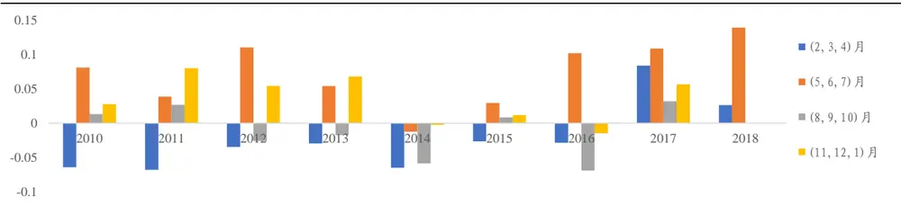
数据来源：Wind、国泰君安证券研究

从IC、IC 显著性t检验及胜率的角度去看，类似ROE等盈利因子在 5~7月“炒业绩”时期的预测能力是全年最强且最稳定的，而在其他时期因子预测能力并不显著，验证了盈利相关因子在“炒业绩”时期受关注程度相对最高的经验假设。

表 7: 盈利因子在5~7月“炒业绩期”表现突出

|  |  | IC |  |  |  |  | T-stat |  |  |  |  | 胜率 |  |  |  |  |
| --- | --- | --- | --- | --- | --- | --- | --- | --- | --- | --- | --- | --- | --- | --- | --- | --- |
|  | 逻辑方向 | 全时期 | 11~1 | 2~4 | 5~7 | 8~10 | 全时期 | 11~1 | 2~4 | 5~7 | 8~10 | 全时期 | 11~1 | 2~4 | 5~7 | 8~10 |
| 毛利率单季度 | + | 0.010 | 0.022 | -0.017 | 0.033 | 0.002 | 1.74 | 1.76 | -1.91 | 2.97 | 0.21 | 60% | 75% | 38% | 81% | 48% |
| 毛利率 TTM | + | 0.006 | 0.016 | -0.015 | 0.031 | -0.008 | 1.09 | 1.27 | -1.55 | 2.68 | -0.90 | 57% | 65% | 38% | 81% | 43% |
| ROETTM | + | -0.005 | 0.020 | -0.039 | 0.021 | -0.020 | -0.77 | 1.27 | -4.41 | 2.26 | -1.86 | 41% | 50% | 14% | 62% | 38% |
| ROE | + | 0.006 | 0.031 | -0.045 | 0.058 | -0.017 | 0.81 | 1.91 | -4.64 | 4.41 | -1.51 | 46% | 60% | 14% | 76% | 33% |

数据来源：Wind、国泰君安证券研究

比较不同财报期季节盈利因子IC差别的显著性，可以发现因子IC在5~7月与2~4月、8~10 月均有显著的差别。

表 8: 盈利因子IC在 5~7月与 2~4月、8~10月均有显著的差别

|  | 两样本t检验 |  |  |  |  |  |
| --- | --- | --- | --- | --- | --- | --- |
|  | (11~1,2~4) | (11~1,5~7) | (11~1,8~10) | (2~4,5~7) | (2~4,8~10) | (5~7,8~10) |
| 毛利率单季度 | 2.49 | -0.80 | 1.22 | -3.51 | -1.52 | 2.20 |
| 毛利率 TTM | 1.94 | -0.95 | 1.54 | -3.05 | -0.58 | 2.70 |
| ROETTM | 3.38 | -0.06 | 2.17 | -4.67 | -1.34 | 2.88 |
| ROE | 4.23 | -1.26 | 2.56 | -6.31 | -1.84 | 4.30 |

数据来源：Wind、国泰君安证券研究

## 3.2. 质量因子

首先观察营运能力、杠杆与偿债、盈余波动性及投资质量等质量因子的表现，可以发现这些代表性的因子没有一个时期与逻辑方向相同且显著。由此可见，在A股市场过去的历史中，大部分质量因子对投资收益几乎没有预测能力。

表 9: 大多数质量因子对收益几乎没有预测能力

| IC | T-stat | 胜率 |
| --- | --- | --- |

|  | 逻辑方向 | 全时期 | 11~1 | 2~4 | 5~7 | 8~10 | 全时期 | 11~1 | 2~4 | 5~7 | 8~10 | 全时期 | 11~1 | 2~4 | 5~7 | 8~10 |
| --- | --- | --- | --- | --- | --- | --- | --- | --- | --- | --- | --- | --- | --- | --- | --- | --- |
| 总资产周转率 | + | 0.000 | 0.001 | -0.008 | 0.000 | -0.003 | -0.17 | 0.25 | -2.54 | -0.08 | -0.97 | 47% | 46% | 39% | 48% | 45% |
| (股东权益+长期负债)/股东权益 | = | -0.001 | -0.002 | -0.004 | 0.001 | -0.001 | -0.93 | -0.52 | -1.17 | 0.18 | -0.20 | 49% | 53% | 55% | 43% | 46% |
| 经营净现金流变异系数 | = | 0.000 | 0.001 | 0.000 | 0.000 | -0.001 | 0.22 | 0.54 | 0.05 | 0.11 | -0.23 | 52% | 53% | 55% | 52% | 52% |
| 总资产增长率 |  | 0.009 | 0.005 | 0.003 | 0.017 | 0.002 | 4.66 | 1.19 | 0.86 | 3.60 | 0.50 | 44% | 46% | 51% | 39% | 51% |

数据来源：Wind、国泰君安证券研究

但是在A 股市场中，有一部分质量因子：盈余质量因子在某些时间段中存在较强的显著性。关于盈余质量因子的逻辑与检验，我们在 2017年 9月发布的报告《盈余质量检验及其投资策略构建——数量化专题之一百零五》中有详细地介绍，报告结果表明，A股市场中盈余质量不好的标的相较于盈余质量好的标的更可能在下一个财报期出现未预期的“业绩变脸”，从而在该财报期内出现收益的分化。

下列柱状图表示的是操控性应计利润率因子分财报期季节的平均月度IC，可以发现灰色部分（8~10月）中报与三季报期，操控性应计利润率因子的预测能力强且稳定，11、12、15、16年均为全年预测能力最强的时期，其他年份也具有较强的预测能力且IC 方向从未与逻辑方向相悖，稳定性较强。

图 3操控性应计利润率因子在 8~10月灰色部分预测能力强且稳定
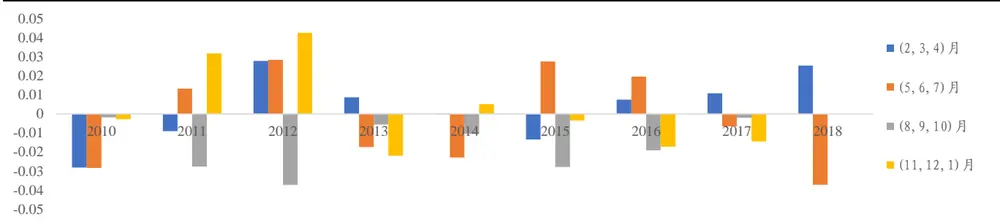
数据来源：Wind、国泰君安证券研究

从IC、IC 显著性t检验及胜率的角度去看，类似操控性应计利润率等盈余质量因子在 8~10 月中报与三季报发布期的预测能力是全年最强且最稳定的，而在其他时期因子预测能力并不显著，验证了盈余质量相关因子在财报发布期内受关注程度相对最高的经验假设。

表 10: 盈余质量因子在8~10月中报三季报预期甄别期表现突出

|  |  | IC |  |  |  |  | T-stat |  |  |  |  | 胜率 |  |  |  |  |
| --- | --- | --- | --- | --- | --- | --- | --- | --- | --- | --- | --- | --- | --- | --- | --- | --- |
|  | 逻辑方向 | 全时期 | 11~1 | 2~4 | 5~7 | 8~10 | 全时期 | 11~1 | 2~4 | 5~7 | 8~10 | 全时期 | 11~1 | 2~4 | 5~7 | 8~10 |
| Accruals |  | -0.003 | 0.008 | -0.012 | 0.008 | -0.015 | -0.72 | 0.75 | -1.70 | 1.26 | -2.38 | 53% | 50% | 62% | 29% | 71% |
| 操控性应计利润率 |  | -0.005 | 0.005 | -0.009 | 0.003 | -0.019 | -1.23 | 0.51 | -1.36 | 0.29 | -2.86 | 57% | 35% | 67% | 52% | 71% |
| M-Score |  | -0.003 | 0.005 | -0.012 | 0.013 | -0.016 | -0.71 | 0.55 | -1.52 | 1.91 | -2.89 | 57% | 40% | 71% | 43% | 71% |

数据来源：Wind、国泰君安证券研究

比较不同财报期季节盈余质量因子 IC 差别的显著性，可以发现因子 IC在8~10月与11~1月、5~7 月均有显著的差别。

表 11: 盈余质量因子 IC在 8~10月与11~1月、5~7月均有显著的差别

|  | 两样本t检验 |  |  |  |  |  |
| --- | --- | --- | --- | --- | --- | --- |
|  | (11~1,2~4) | (11~1,5~7) | (11~1,8~10) | (2~4,5~7) | (2~4,8~10) | (5~7,8~10) |
| Accruals | 1.50 | -0.13 | 1.80 | -2.10 | 0.31 | 2.56 |
| 操控性应计利润/平均总资产 | 0.57 | 0.15 | 2.14 | -0.34 | 2.00 | 1.77 |
| M-Score | 1.56 | -0.72 | 2.22 | -2.40 | 0.41 | 3.30 |

数据来源：Wind、国泰君安证券研究

## 3.3. 成长因子

下列柱状图表示的是ROETTM环比增长率因子分财报期季节的平均月度 IC，可以发现橙色部分（5~7 月）“炒业绩”时期与黄色部分（11~1月）布局年报期因子的预测能力强且稳定，10、12~17 年均为全年预测能力最强的时期。

图 4ROETTM环比增长率因子在 11~1月黄色部分、5~7月橙色部分预测能力强且稳定
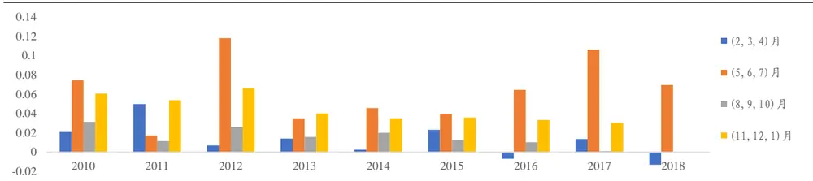
数据来源：Wind、国泰君安证券研究

从IC、IC 显著性t检验及胜率的角度去看，类似 ROETTM环比增长率等成长因子在5~7、11~1月“炒业绩”及提前布局财报时期的预测能力是全年最强且最稳定的，而在其他时期因子预测能力并不高。此外，一些例如股权激励及员工持股计划等新成长因子（具体参见国泰君安金融工程 2018 年 6 月发布的报告《投资科技创新股：基本面成长因子再挖掘——数量化专题之一百一十三》），在 2~4 年报期内也有较好的表现，这是由于股权激励往往存在较高的业绩承诺，所以股权激励实施较多的上市公司在年报期有较好的表现。上述检验验证了成长相关因子在提前布局财报期与财报期后“炒业绩”时期受关注程度相对最高的经验假设。

表 12: 成长因子在5~7、11~1月提前布局财报与“炒业绩”期表现突出

|  |  | IC |  |  |  |  | T-stat |  |  |  |  | 胜率 |  |  |  |  |
| --- | --- | --- | --- | --- | --- | --- | --- | --- | --- | --- | --- | --- | --- | --- | --- | --- |
|  | 期望方向 | 全时期 | 11~1月 | 2~4月 | 5~7月 | 8~10月 | 全时期 | 11~1月 | 2~4月 | 5~7月 | 8~10月 | 全时期 | 11~1月 | 2~4月 | 5~7月 | 8~10月 |
| 盈利动量 | + | 0.020 | 0.039 | 0.010 | 0.021 | 0.011 | 5.71 | 6.29 | 1.61 | 2.80 | 1.71 | 72% | 95% | 62% | 76% | 57% |
| ROETTM 环比增长率 | + | 0.034 | 0.045 | 0.016 | 0.056 | 0.018 | 8.27 | 7.71 | 2.35 | 6.19 | 2.55 | 82% | 100% | 71% | 90% | 67% |
| 营收3年复合增长率 | + | 0.005 | 0.011 | -0.010 | 0.030 | -0.012 | 0.91 | 0.85 | -1.14 | 3.39 | -1.32 | 53% | 65% | 43% | 71% | 33% |
| 净利润3年复合增长率 | + | 0.001 | 0.012 | -0.019 | 0.015 | -0.003 | 0.35 | 2.01 | -3.29 | 1.73 | -0.41 | 49% | 65% | 14% | 71% | 48% |
| 股权激励及员工持股计划 | + | 0.024 | 0.018 | 0.022 | 0.042 | 0.012 | 4.99 | 1.57 | 2.64 | 4.71 | 1.46 | 70% | 65% | 67% | 86% | 62% |
| 研发投入/营业收入 | + | 0.020 | 0.027 | 0.015 | 0.040 | -0.002 | 2.60 | 1.77 | 1.04 | 2.16 | -0.20 | 64% | 79% | 58% | 73% | 47% |

数据来源：Wind、国泰君安证券研究

比较不同财报期季节成长因子 IC 差别的显著性，可以发现大多数成长因子IC 在11~1月、5~7月与 2~4月、8~10 月均有显著的差别。

表 13: 大多数成长因子IC在 11~1月、5~7月与2~4 月、8~10月均有显著的差别

|  | 两样本t检验 |  |  |  |  |  |
| --- | --- | --- | --- | --- | --- | --- |
|  | (11~1,2~4) | (11~1,5~7) | (11~1,8~10) | (2~4,5~7) | (2~4,8~10) | (5~7,8~10) |
| 盈利动量（单季度净利润增速） | 2.97 | 1.56 | 2.81 | -1.11 | -0.11 | 1.00 |
| ROETTM 环比增长率 | 3.51 | -0.94 | 3.10 | -3.61 | -0.26 | 3.31 |
| 营收3年复合增长率 | 1.45 | -1.24 | 1.57 | -3.24 | 0.18 | 3.32 |
| 净利润3年复合增长率 | 3.91 | -0.18 | 1.79 | -3.25 | -1.84 | 1.62 |
| 股权激励及员工持股计划 | -0.39 | -1.77 | 0.34 | -1.63 | 0.88 | 2.50 |
| 研发投入/营业收入 | 1.15 | -0.03 | 1.82 | -0.98 | 0.65 | 1.52 |

数据来源：Wind、国泰君安证券研究

## 3.4.治理、分红及重要持股人因子

下列柱状图表示的是分红利润比因子分财报期季节的平均月度 IC，可以发现橙色部分（5~7 月）“炒分红”时期因子的预测能力强且稳定，10、12、14、15、16 年均为全年预测能力最强的时期，而一年中的其他时期，分红利润比因子的IC 方向极不稳定。

图 5分红利润比因子在5~7月橙色部分预测能力强且稳定
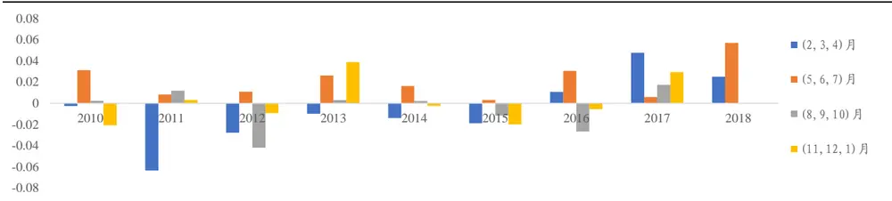
数据来源：Wind、国泰君安证券研究

从IC、IC 显著性t检验及胜率的角度去看，类似分红利润比等分红治理因子在5~7月“炒分红”时期的预测能力是全年最强且最稳定的，而在其他时期因子预测能力并不显著，验证了分红相关因子在“炒分红”时期受关注程度相对最高的经验假设。

表 14: 分红治理重要持股人因子在 5~7月“炒分红”期表现突出

|  |  | IC |  |  |  |  | T-stat |  |  |  |  | 胜率 |  |  |  |  |
| --- | --- | --- | --- | --- | --- | --- | --- | --- | --- | --- | --- | --- | --- | --- | --- | --- |
|  | 期望方向 | 全时期 | 11~1 | 2~4 | 5~7 | 8~10 | 全时期 | 11~1 | 2~4 | 5~7 | 8~10 | 全时期 | 11~1 | 2~4 | 5~7 | 8~10 |
| 公司治理评分 | + | 0.017 | 0.028 | -0.017 | 0.056 | 0.001 | 1.71 | 1.30 | -0.94 | 2.81 | 0.05 | 63% | 70% | 57% | 76% | 48% |
| 高管持股比例 | + | 0.020 | 0.028 | 0.002 | 0.044 | 0.007 | 2.56 | 1.40 | 0.16 | 2.93 | 0.57 | 67% | 80% | 62% | 76% | 52% |
| 基金持股比例 | + | 0.025 | 0.032 | 0.010 | 0.054 | 0.002 | 2.48 | 1.26 | 0.59 | 3.17 | 0.11 | 63% | 65% | 57% | 76% | 52% |
| 股息率 | 十 | -0.012 | 0.001 | -0.029 | 0.003 | -0.023 | -2.89 | 0.14 | -3.93 | 0.52 | -2.76 | 36% | 45% | 10% | 57% | 33% |

| 分红利润比 | + | -0.003 | -0.003 | -0.018 | 0.018 | -0.009 | -0.64 | -0.28 | -2.24 | 2.18 | -1.11 | 43% | 45% | 24% | 67% |
| --- | --- | --- | --- | --- | --- | --- | --- | --- | --- | --- | --- | --- | --- | --- | --- |

数据来源：Wind、国泰君安证券研究

比较不同财报期季节分红治理相关因子 IC 差别的显著性，可以发现因子IC 在5~7月与 2~4 月、8~10 月均有显著的差别。

表 15: 分红治理相关因子IC在 5~7月与2~4月、8~10月均有显著的差别

|  | 两样本t检验 |  |  |  |  |  |
| --- | --- | --- | --- | --- | --- | --- |
|  | (11~1,2~4) | (11~1,5~7) | (11~1,8~10) | (2~4,5~7) | (2~4,8~10) | (5~7,8~10) |
| 公司治理评分 | 1.52 | -1.07 | 0.92 | -2.70 | -0.75 | 2.18 |
| 高管持股比例 | 0.80 | -0.88 | 0.68 | -1.96 | -0.23 | 1.94 |
| 基金持股比例 | 0.65 | -0.82 | 0.92 | -1.80 | 0.34 | 2.11 |
| 股息率 | 2.57 | -0.27 | 1.93 | -3.32 | -0.58 | 2.50 |
| 分红利润比 | 1.22 | -1.56 | 0.51 | -3.13 | -0.82 | 2.34 |

数据来源：Wind、国泰君安证券研究

## 3.5. 预期因子

## 3.5.1. 上调预期因子

下列柱状图表示的是预期 EPS 环比增长因子分财报期季节的平均月度IC，可以发现蓝色部分（2~4月）与灰色部分（8~10月）财报期内因子的预测能力最强且稳定，11、12、13、14、16 年均为全年预测能力最强的时期，而因子在一年其他时期的预测能力与稳定性都不如财报期内，验证了分析师上调预期在财报期内受关注程度相对较高的经验假设。

图 6预期 EPS环比增长因子在 2~4月蓝色部分、8~10 月灰色部分预测能力强且稳定
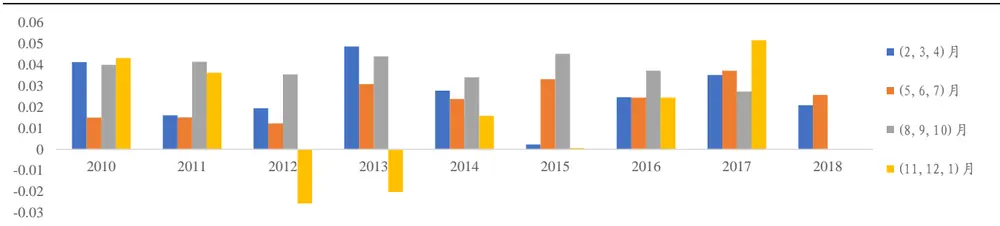
数据来源：Wind、国泰君安证券研究

从 IC、IC 显著性 t 检验及胜率的角度去看，类似预期 EPS 环比增长等上调预期因子在2~4月、8~10月财报期内的预测能力是全年最强且最稳定的，而在其他时期因子预测能力相对较弱且不如财报期内稳定。

表 16: 上调预期因子在2~4、8~10月财报发布期内表现突出

|  |  | IC |  |  |  |  | T-stat |  |  |  |  | 胜率 |  |  |  |  |
| --- | --- | --- | --- | --- | --- | --- | --- | --- | --- | --- | --- | --- | --- | --- | --- | --- |
|  | 期望方向 | 全时期 | 11~1 | 2~4 | 5~7 | 8~10 | 全时期 | 11~1 | 2~4 | 5~7 | 8~10 | 全时期 | 11~1 | 2~4 | 5~7 | 8~10 |
| 预期 EPS 环比增长 | + | 0.025 | 0.010 | 0.026 | 0.022 | 0.040 | 6.67 | 1.07 | 4.81 | 2.80 | 7.65 | 77% | 60% | 76% | 76% | 95% |

数据来源：Wind、国泰君安证券研究

比较不同财报期季节上调预期因子 IC 差别的显著性，可以发现因子 IC在8~10月与11~1月、5~7月均有显著的差别。

表 17: 上调预期因子IC在 8~10月与 11~1月、5~7 月均有显著的差别

|  | 两样本t检验 |  |  |  |  |  |
| --- | --- | --- | --- | --- | --- | --- |
|  | (11~1,2~4) | (11~1,5~7) | (11~1,8~10) | (2~4,5~7) | (2~4,8~10) | (5~7,8~10) |
| 预期 EPS 环比增长 | -1.44 | -0.96 | -2.79 | 0.38 | -1.87 | -1.86 |

数据来源：Wind、国泰君安证券研究

## 3.5.2. 超预期因子

下列柱状图表示的是净利润同比增速差因子分财报期季节的平均月度IC，可以发现橙色部分（5~7月）与黄色部分（11~1月）财报期后因子的预测能力最强且稳定，10~17 年均为全年预测能力最强的时期，而因子在一年其他时期的预测能力与稳定性都不如这两个财报期后的时间段，验证了超预期在财报期后受关注程度相对较高的经验假设。

图 7净利润同比增速差因子在 11~1月黄色部分、5~7月橙色部分预测能力强且稳定
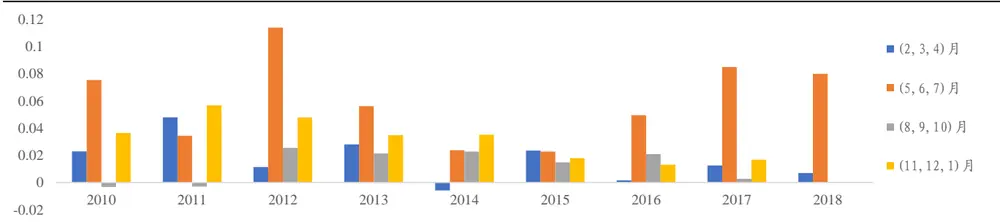
数据来源：Wind、国泰君安证券研究

从IC、IC 显著性t检验及胜率的角度去看，类似净利润同比增速差等超预期因子在5~7月、11~1月财报期后的预测能力是全年最强且最稳定的，而在其他时期因子预测能力相对较弱且不如财报期内稳定。

表 18: 超预期因子在5~7、11~1月财报发布后表现突出

|  |  | IC |  |  |  |  | T-stat |  |  |  |  | 胜率 |  |  |  |  |
| --- | --- | --- | --- | --- | --- | --- | --- | --- | --- | --- | --- | --- | --- | --- | --- | --- |
|  | 期望方向 | 全时期 | 11~1 | 2~4 | 5~7 | 8~10 | 全时期 | 11~1 | 2~4 | 5~7 | 8~10 | 全时期 | 11~1 | 2~4 | 5~7 | 8~10 |
| 净利润同比增速差 | + | 0.031 | 0.037 | 0.019 | 0.054 | 0.014 | 7.94 | 4.71 | 2.55 | 6.53 | 3.41 | 81% | 90% | 62% | 95% | 76% |

数据来源：Wind、国泰君安证券研究

比较不同财报期季节超预期因子IC 差别的显著性，可以发现因子 IC 在5~7 月、11~1 月与 2~4 月、8~10 月有一定的差别。

表 19: 超预期因子 IC 在 5~7 月、11~1 月与 2~4 月、8~10 月有一定的差别

|  | 两样本t检验 |  |  |  |  |  |
| --- | --- | --- | --- | --- | --- | --- |
|  | (11~1,2~4) | (11~1,5~7) | (11~1,8~10) | (2~4,5~7) | (2~4,8~10) | (5~7,8~10) |
| 净利润同比增速差 | 1.52 | -1.70 | 2.33 | -3.21 | 0.52 | 4.29 |

数据来源：Wind、国泰君安证券研究

## 3.6. 估值因子

下列柱状图表示的是 Earnings Yield因子分财报期季节的平均月度 IC，可以发现黄色部分（11~1月）年底风险偏好较低的时期因子的预测能力强且稳定，10~12、14、16、17 年均为全年预测能力最强的时期，而一年中的其他时期因子极不稳定，例如蓝色部分“春季躁动”时期，17年因子IC 达到了历史新高而18 年IC 又出现了历史新低。

图 8估值因子在 11~1月黄色部分预测能力强且稳定
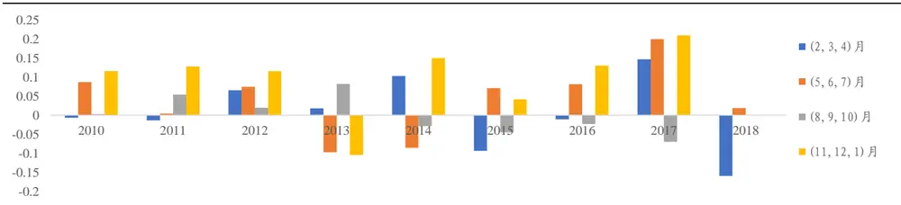
数据来源：Wind、国泰君安证券研究

从IC、IC 显著性 t检验及胜率的角度去看，类似 Earnings Yield等估值因子在 11~1 月年底时期的预测能力是全年最强且最稳定的，而在其他时期因子预测能力并不显著，验证了估值相关因子在风险偏好较低时期受关注程度相对最高的经验假设。

表 20: 估值因子在11~1月年底表现突出

|  |  | IC |  |  |  |  | T-stat |  |  |  |  | 胜率 |  |  |  |  |
| --- | --- | --- | --- | --- | --- | --- | --- | --- | --- | --- | --- | --- | --- | --- | --- | --- |
|  | 逻辑方向 | 全时期 | 11~1 | 2~4 | 5~7 | 8~10 | 全时期 | 11~1 | 2~4 | 5~7 | 8~10 | 全时期 | 11~1 | 2~4 | 5~7 | 8~10 |
| Earnings Yield | + | 0.028 | 0.075 | 0.009 | 0.019 | 0.009 | 1.76 | 1.98 | 0.37 | 0.55 | 0.34 | 59% | 65% | 62% | 57% | 52% |
| BTOP | + | 0.014 | 0.072 | 0.011 | -0.038 | 0.016 | 0.71 | 1.38 | 0.34 | -0.89 | 0.47 | 49% | 60% | 48% | 33% | 57% |

数据来源：Wind、国泰君安证券研究

比较不同财报期季节估值因子 IC 差别的显著性，可以发现 11~1月与其他月份差别的显著性并不是很高，再次说明了主观选择风格因子会存在一定的风险。

表 21: 估值因子 IC各财报期季节差别显著性不高

|  | 两样本t检验 |  |  |  |  |  |
| --- | --- | --- | --- | --- | --- | --- |
|  | (11~1,2~4) | (11~1,5~7) | (11~1,8~10) | (2~4,5~7) | (2~4,8~10) | (5~7,8~10) |
| Earnings Yield | 1.67 | 1.24 | 1.62 | -0.25 | 0.00 | 0.24 |
| BTOP | 1.23 | 1.85 | 1.14 | 0.92 | -0.10 | -0.99 |

数据来源：Wind、国泰君安证券研究

## 3.7. 小结

对上述六大类基本面因子进行财报期效应检验后，可以发现，检验结果基本验证了我们在本篇报告第二部分通过逻辑梳理得到的经验假设，大多数因子都存在显著的财报期效应。

表 22: 6大类基本面因子财报期效应检验结果综述

| 大类 | 细分类 | 预测能力最强的财报期季节 |
| --- | --- | --- |
| 盈利 |  | 5~7月“业绩炒作期” |
| 质量 |  | 8~10月“预期甄别期” |
| 成长 | 传统成长 | 11~1月“布局年报期”、5~7月“业绩炒作期” |
| 治理及分红 | 新成长 分红 | 2~4月“年报披露期”、5~7月“业绩炒作期” 5~7月“业绩炒作期” |
| 预期 | 治理与重要持股人 上调预期 | 2~4月“年报披露期”、8~10月“预期甄别期” |
| 估值 | 超预期 | 5~7月“业绩炒作期”、11~1月“布局年报期” |
|  | 11~1月“布局年报期” |  |

数据来源：国泰君安证券研究

## 4. 基于财报期效应的基本面因子动态配置方案

本篇报告第2部分构建了基本面因子财报期效应的逻辑框架并梳理了各类基本面因子在各个财报期季节的受关注程度高低，而第 3部分则对于逻辑框架与经验假设进行了统计检验，得到了与逻辑相符的结论。在第4 部分，我们将基于逻辑与统计检验的结果，构建基于财报期效应的基本面因子动态配置方案，并根据方案构建投资组合，进行回溯检验，以验证动态配置方案的可行性与有效性。

## 4.1.动态配置方案与对照方案

综合第 2、3 部分逻辑梳理与统计检验的结果，我们的基本面因子动态配置方案设计如下：2~4 月年报披露期选择新成长以及上调预期因子，5~7 月业绩炒作期选择盈利、成长、治理分红与重要持股人以及超预期因子，8~10 月预期甄别期选择盈余质量以及上调预期因子，11~1 月布局年报期选择估值、短期成长与长期成长以及超预期因子。

表 23:基本面因子动态配置方案一览

| 财报期季节 | 时间 | 配置因子类型 | 具体因子 |
| --- | --- | --- | --- |
| 报披露期 | 报期内） | 春季躁动，年2~4月（财新成长、上调 预期 | 股权激励及员工持股计划、预期EPS环比增长 |
| 年报披露，业 绩炒作期 | 5~7月（财 报期后及 前） | 盈利、成长、 治理分红与重 要持股人、超 | 毛利率单季度、毛利率TTM、ROETTM、ROE、盈利动量、 ROETTM环比增长率、营收3年复合增长率、净利润3年 复合增长率、公司治理评分、股息率、分红利润比、高管 |
| 中报三季报， |  | 预期 8~10月(财盈余质量、上 | 持股比例、基金持股比例、净利润同比增速差 Accruals、操控性应计利润、M-Score、预期 EPS环比增长 |
| 预期甄别期 三季报定调， | 报期内） | 调预期 11~1月(财估值、短期成 | Earnings Yield、盈利动量、ROETTM环比增长率、营收3 |

| 布局年报期 | 前） 超预期 | 报期后及长、长期成长、年复合增长率、净利润3年复合增长率、净利润同比增速 差 |
| --- | --- | --- |

数据来源：国泰君安证券研究

为了更好地验证动态配置方案的有效性，我们同时也设计了不对基本面因子进行择时的对照方案，具体方案设计如下：全年 1~12 月，每月均配置动态配置方案所选全部因子（盈利、成长、盈余质量、治理分红与重要持股人、预期、估值）。

## 4.2.动态配置组合及对照组合构建方法

在此，我们以中证500 为基准指数，保持行业、风格中性，并控制一定个股权重上限，构建 500全市场增强组合，组合的目标函数为最大化预

期收益率，预期收益率的计算方法是以最大化IC 的方式 $\left(\begin{array}{l}{\Phi^{\mathrm{~-1~}}\cdot IC}\end{array}\right)$ ）对

因子残差截面X进行加权（具体方法与证明过程可参见国泰君安金融工程2018年7月发布的报告《风格域划分下的基本面多因子选股策略——数量化专题之一百一十六》），具体的组合优化过程与约束条件如下：

$$
\begin{aligned}{}&{{}\textit{ M a x }}&{}&{{}w^{\prime}\cdot(\textit{ \mathbf { x } }\cdot\mathbf{\Phi}^{^{-1}}\cdot\textit{ I C })}\\{}&{{}\textit{ s . t . }}&{}&{{}\vee\textit{ ( }w^{\prime}\cdot w_{\textit{ b }}^{\prime})\cdot X_{\textit{ r i s k }}=\textit{ \mathbf { o } }}\\{}&{{}}&{}&{{}w^{\prime}\cdot X_{\textit{ i n d u s r y }}=w_{\textit{ b }}^{\prime}}\\{}&{{}}&{}&{{}\mathbf{o}\leq w\leq s}\\{}&{{}}&{}&{{}w^{\prime}\cdot\mathcal{I}=1}\\\end{aligned}
$$

- 基准指数：中证 500（000905.SH）

- 选股范围：全市场剔除上市未满1年的新股

- 风险控制：行业敞口±1%，风格敞口±0.05（其中 Size ± 0.01、EarningsYield+∞），个股权重上限 3%

- 换仓频率：月底换仓

- 交易成本：单边千分之三

- 回溯时间：2013 年 1 月 30 日至 2018 年 7 月 26 日，其中 2017 年 1月至2018年 7月为样本外检验期

一般来说，最新一期 IC 的估计值我们常常使用过去 12、24 或者 36 个月月度 IC 的平均值，而在我们的动态配置组合中，对于每个财报期季节选用的基本面因子，计算其过去 3 年对应财报期季节的月度 IC 的平均值作为最新一期 IC 的估计值；对照组合我们仍使用常规做法，也就是过去3 年月度IC 的平均值作为最新一期 IC 的估计值。

通过上述方法，我们可以得到动态配置组合与对照组合的预期收益率，在此我们计算了两个组合预期收益率的预测能力、信息比率并检验了其显著性，可以发现动态配置组合相对于对照组合的预期收益率 IC 与ICIR均有一定的提升。

表 24: 动态配置组合预期收益率 IC及 ICIR均高于对照组合

|  | IC | ICIR | T-stat |
| --- | --- | --- | --- |
| 请务必阅读正文之后的免责条款部分 18 of 22 |  |  |  |

| 动态配置组合 | 0.044 | 2.51 | 5.90 |
| --- | --- | --- | --- |
| 对照组合 | 0.037 | 2.27 | 5.32 |

数据来源：国泰君安证券研究

图 9两组合预期收益率IC时间序列展示
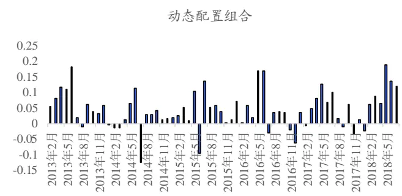
数据来源：国泰君安证券研究

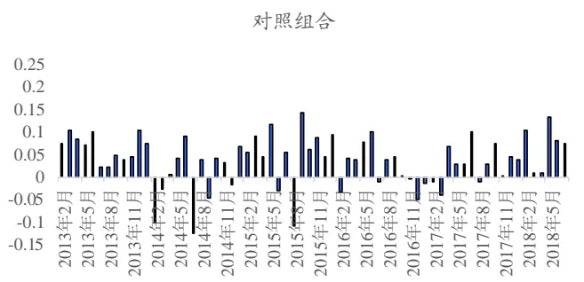

## 4.3.回溯检验结果

## 4.3.1. 动态配置组合年化超额收益 18.59%，信息比率 2.34

基于财报期效应的基本面因子动态配置组合 2013 年 1 月末至 2018 年 7月末累计绝对收益 270%，同期中证 500 指数累计收益 51%，累计超额收益155%，增强效果显著。

图 10基于财报期效应的基本面因子动态配置组合2013年 1月至2018年 7月累计收益 270%
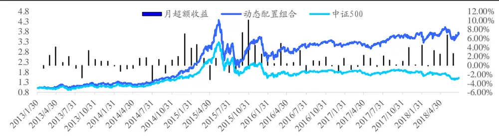
数据来源：Wind、国泰君安证券研究

基于财报期效应的基本面因子动态配置组合年化收益 26.91%，年化超额收益 18.59%，信息比率为 2.34，增强效果稳定。分年度来看，每年均能跑赢基准指数，月胜率平均在 70%以上，除了 2015 年股灾时出现较大回撤以外，近 3 年最大回撤均不超过 3%，策略稳定性较好；2018年表现尤其突出，截至 2018 年 7 月末全年累计超额收益为 24.70%，信息比率为4.32，月胜率为83%。

表 25: 基于财报期效应的基本面因子动态配置组合年化收益 26.91%，年化超额收益18.59%，信息比率2.34

| 年份 | 年绝对收益 | 年绝对波动 | 夏普比率 | 最大回撤 | 年超额收益 | 跟踪误差 | IR | 最大回撤 | 月超额胜率 | 年化换手率 |
| --- | --- | --- | --- | --- | --- | --- | --- | --- | --- | --- |
| 2013 | 22.52% | 23.11% | 1.00 | -16.0% | 12.19% | 6.52% | 1.81 | -4.50% | 73% | 965% |
| 2014 | 48.13% | 21.13% | 1.97 | -14.4% | 6.75% | 5.98% | 1.13 | -4.77% | 50% | 871% |
| 2015 | 88.92% | 50.42% | 1.52 | -53.1% | 35.15% | 11.58% | 2.67 | -7.88% | 75% | 875% |
| 2016 | -8.85% | 33.24% | -0.11 | -31.0% | 11.83% | 6.07% | 1.88 | -2.79% | 75% | 862% |
| 2017 | 12.74% | 15.83% | 0.84 | -10.9% | 13.04% | 5.03% | 2.47 | -2.29% | 75% | 891% |
| 2018(至今) | 5.10% | 18.55% | 0.36 | -15.8% | 24.70% | 5.19% | 4.32 | -1.38% | 83% | 827% |
| 总体 | 26.91% | 30.77% | 0.93 | -53.1% | 18.59% | 7.41% | 2.34 | -7.88% | 71% | 904% |

数据来源：Wind、国泰君安证券研究

对动态配置组合进行业绩归因，可以发现组合月平均选股收益（Alpha）较高，达到 1.36%，风格收益除了没有严格控制的盈利因子（EarningsYield）以外均较低。

图 11 组合选股收益显著
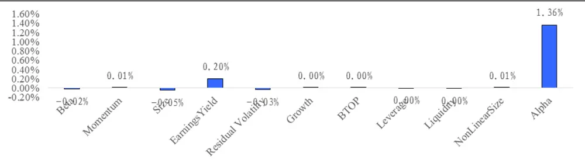
数据来源：Wind、国泰君安证券研究

## 4.3.2. 动态配置组合相对于对照组合的年化超额收益增加了 5.5%，信息比率提升了 0.66

比较动态配置组合与对照组合的绝对收益及超额收益，可以发现动态配置组合在 2015 年后相对于对照组合优势明显，累计绝对收益增强了85%，累计超额收益增强了 59%，尤其在样本外 2017年之后更为突出。

图 12动态配置组合相对于对照组合累计绝对收益增强 85%，累计超额收益增强了59%
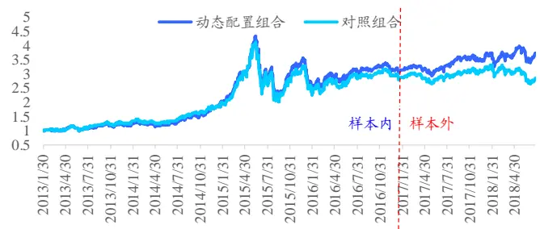
数据来源：Wind、国泰君安证券研究

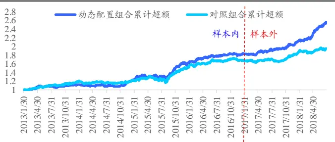

动态配置组合相对于对照组合的年化超额收益增加了 5.5%，信息比率提升了 0.66，此外动态配置组合超额收益最大回撤为-7.88%，相比于对照组合的-11.20%，均有一定提升。分具体年度看，除了 2013 年动态配置组合不及对照组合，年超额收益与信息比率在其余年份均有显著的提升，最大回撤也有显著的降低。

表 26: 动态配置组合相对于对照组合的年化超额收益增加了 5.5%，信息比率提升了 0.66

| 年份 | 年超额收益 | 跟踪误差 | IR | 最大回撤 | 月超额胜率 | 年化换手率 | 年超额收益 | 跟踪误差 | IR | 最大回撤 | 月超额胜率 | 年化换手率 |
| --- | --- | --- | --- | --- | --- | --- | --- | --- | --- | --- | --- | --- |
| 2013 | 12.19% | 6.52% | 1.81 | -4.50% | 73% | 965% | 16.46% | 6.58% | 2.36 | -2.87% | 73% | 793% |
| 2014 | 6.75% | 5.98% | 1.13 | -4.77% | 50% | 871% | 2.42% | 6.22% | 0.42 | -5.49% | 67% | 832% |
| 2015 | 35.15% | 11.58% | 2.67 | -7.88% | 75% | 875% | 27.44% | 11.63% | 2.15 | -11.20% | 75% | 811% |
| 2016 | 11.83% | 6.07% | 1.88 | -2.79% | 75% | 862% | 11.00% | 6.24% | 1.71 | -3.06% | 67% | 740% |
| 2017 | 13.04% | 5.03% | 2.47 | -2.29% | 75% | 891% | 7.49% | 5.33% | 1.39 | -4.35% | 67% | 851% |
| 2018(至今) | 24.70% | 5.19% | 4.32 | -1.38% | 83% | 827% | 8.17% | 4.71% | 1.70 | -3.32% | 67% | 816% |
| 总体 | 18.59% | 7.41% | 2.34 | -7.88% | 71% | 904% | 13.05% | 7.46% | 1.68 | -11.20% | 69% | 807% |

数据来源：Wind、国泰君安证券研究

## 5. 总结与未来展望

大多数基本面因子并不是在一年之中全部时期都那么稳健，其受财报期的影响，会在特定的财报期季节拥有相对最高的关注程度与相对较强的投资逻辑，而在其他时期关注程度与投资逻辑均较弱，表现为因子预测能力与稳定性的季节性差异。我们可以利用这样的季节性的差异，设计基本面因子动态配置方案，从而获得更高更稳定的基本面投资收益。此外，本篇研究的风险在于历史统计数据较少，稳定性有待进一步检验，展望未来，我们将持续跟踪观测因子的时间效应，不断完善研究成果。

## 本公司具有中国证监会核准的证券投资咨询业务资格

## 分析师声明

作者具有中国证券业协会授予的证券投资咨询执业资格或相当的专业胜任能力，保证报告所采用的数据均来自合规渠道，分析逻辑基于作者的职业理解，本报告清晰准确地反映了作者的研究观点，力求独立、客观和公正，结论不受任何第三方的授意或影响，特此声明。

## 免责声明

本报告仅供国泰君安证券股份有限公司（以下简称“本公司”）的客户使用。本公司不会因接收人收到本报告而视其为本公司的当然客户。本报告仅在相关法律许可的情况下发放，并仅为提供信息而发放，概不构成任何广告。

本报告的信息来源于已公开的资料，本公司对该等信息的准确性、完整性或可靠性不作任何保证。本报告所载的资料、意见及推测仅反映本公司于发布本报告当日的判断，本报告所指的证券或投资标的的价格、价值及投资收入可升可跌。过往表现不应作为日后的表现依据。在不同时期，本公司可发出与本报告所载资料、意见及推测不一致的报告。本公司不保证本报告所含信息保持在最新状态。同时，本公司对本报告所含信息可在不发出通知的情形下做出修改，投资者应当自行关注相应的更新或修改。

本报告中所指的投资及服务可能不适合个别客户，不构成客户私人咨询建议。在任何情况下，本报告中的信息或所表述的意见均不构成对任何人的投资建议。在任何情况下，本公司、本公司员工或者关联机构不承诺投资者一定获利，不与投资者分享投资收益，也不对任何人因使用本报告中的任何内容所引致的任何损失负任何责任。投资者务必注意，其据此做出的任何投资决策与本公司、本公司员工或者关联机构无关。

本公司利用信息隔离墙控制内部一个或多个领域、部门或关联机构之间的信息流动。因此，投资者应注意，在法律许可的情况下，本公司及其所属关联机构可能会持有报告中提到的公司所发行的证券或期权并进行证券或期权交易，也可能为这些公司提供或者争取提供投资银行、财务顾问或者金融产品等相关服务。在法律许可的情况下，本公司的员工可能担任本报告所提到的公司的董事。

市场有风险，投资需谨慎。投资者不应将本报告作为作出投资决策的唯一参考因素，亦不应认为本报告可以取代自己的判断。
在决定投资前，如有需要，投资者务必向专业人士咨询并谨慎决策。

本报告版权仅为本公司所有，未经书面许可，任何机构和个人不得以任何形式翻版、复制、发表或引用。如征得本公司同意进行引用、刊发的，需在允许的范围内使用，并注明出处为“国泰君安证券研究”，且不得对本报告进行任何有悖原意的引用、删节和修改。

若本公司以外的其他机构（以下简称“该机构”）发送本报告，则由该机构独自为此发送行为负责。通过此途径获得本报告的投资者应自行联系该机构以要求获悉更详细信息或进而交易本报告中提及的证券。本报告不构成本公司向该机构之客户提供的投资建议，本公司、本公司员工或者关联机构亦不为该机构之客户因使用本报告或报告所载内容引起的任何损失承担任何责任。

## 评级说明

## 1.投资建议的比较标准

投资评级分为股票评级和行业评级。

以报告发布后的12个月内的市场表现为比较标准，报告发布日后的 12个月内的公司股价（或行业指数）的涨跌幅相对同期的沪深 300 指数涨跌幅为基准。

## 2.投资建议的评级标准

报告发布日后的 12 个月内的公司股价（或行业指数）的涨跌幅相对同期的沪深 300 指数的涨跌幅。

|  | 评级 说明 |  |
| --- | --- | --- |
| 股票投资评级 | 增持 | 相对沪深 300 指数涨幅15%以上 |
|  | 谨慎增持 | 相对沪深300指数涨幅介于5%～15%之间 |
|  | 中性 | 相对沪深 300指数涨幅介于-5%～5% |
|  | 减持 | 相对沪深300指数下跌 5%以上 |
| 行业投资评级 | 增持 | 明显强于沪深 300 指数 |
|  | 中性 | 基本与沪深 300指数持平 |
|  | 减持 | 明显弱于沪深 300指数 |

## 国泰君安证券研究所

|  | 上海 | 深圳 | 北京 |
| --- | --- | --- | --- |
| 地址 | 上海市浦东新区银城中路168号上海 银行大厦29层 | 深圳市福田区益田路 6009 号新世界 商务中心34层 | 北京市西城区金融大街 28 号盈泰中 心2号楼10层 |
| 邮编 | 200120 | 518026 | 100140 |
| 电话 | （021)38676666 | (0755)23976888 | (010)59312799 |
|  | E-mail: gtjaresearch@gtjas.com |  |  |