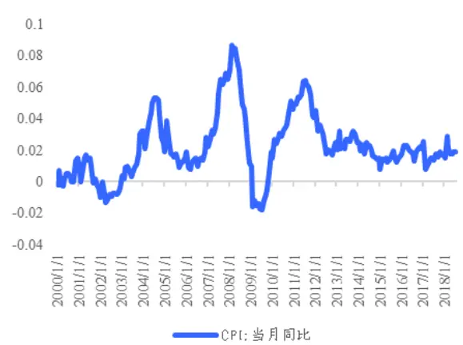
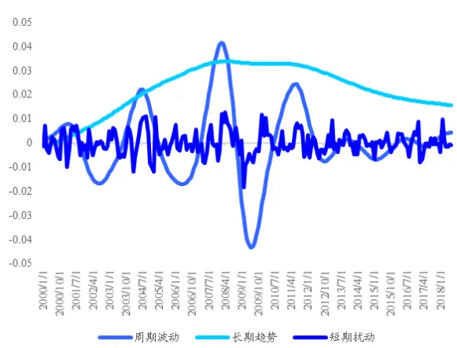
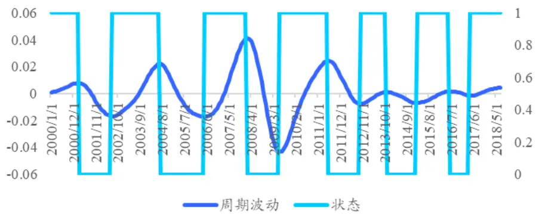
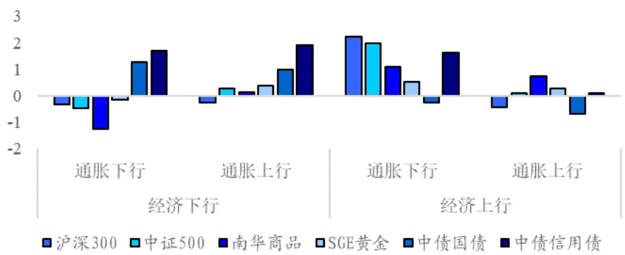
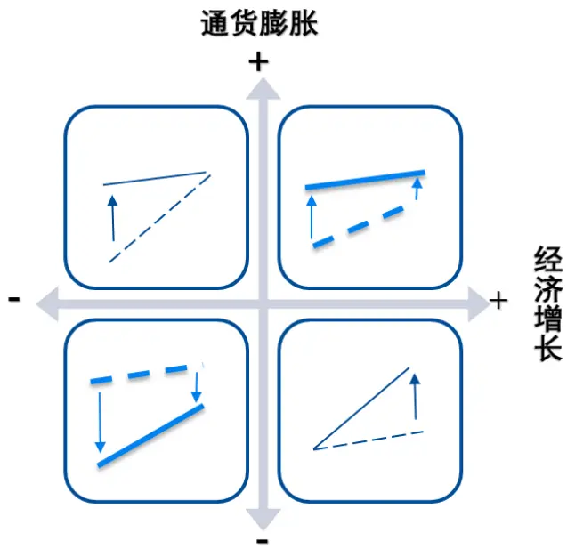
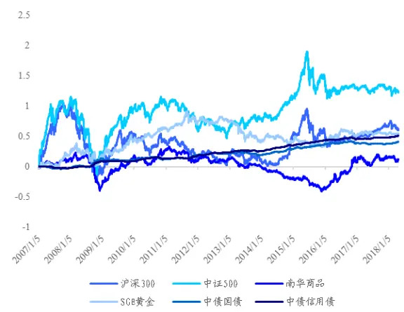
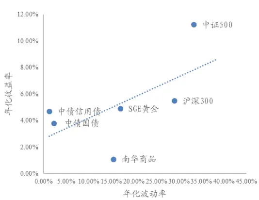
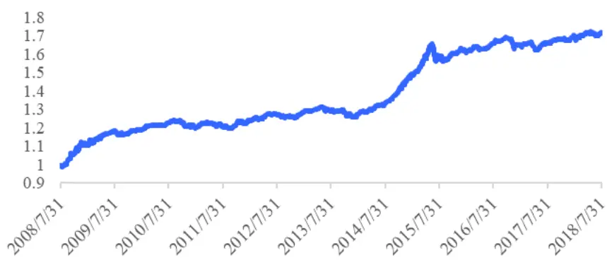
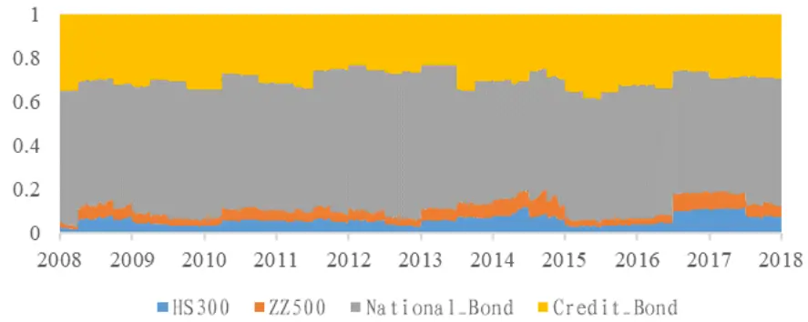

inInfo] [Table_Title] 2018.09.15

# 基于宏观状态的风险预算和资产配置

## ——数量化专题之一百一十九

李辰（分析师）

## 余剑峰（研究助理）

8 021-38677309

021-38676186

lichen@gtjas.com

证书编号 S0880516050003

yujianfeng@gtjas.com

S0880118060039

## 本报告导读：

报告基于全天候配置策略的思想，对不同宏观状态下大类资产的风险预算给出了一种设计路径。基于风险预算的配置策略具有低换手、低回撤、高 Sharpe 的特点。摘要：

le_Summary]宏观研究在大类资产配置研究中占据着决定性的地位，但在实际应用中宏观研究和量化配置模型难以得到有效的结合。从配置风险角度，本篇报告对不同宏观状态下国内大类资产的风险预算给出了一种设计思路。基于风险预算的配置策略具有低换手、低回撤、高 Sharpe的特点。并且当标的资产较多时，依据宏观状态的战术调整可以有效地提升策略表现。

以经济增长和通货膨胀两个宏观维度，报告对中国市场上不同宏观状态下的大类资产表现进行了统计检验。总体而言，大类资产随宏观状态变化呈现出明显的轮动特征。债券资产在经济下行通胀下行时期表现最佳。股票资产经济上行通胀下行时期表现相对出色。商品在经济上行通胀上行时期超额收益显著。而滞胀时期，黄金和货币是相对推荐的投资标的。

报告设计了不同宏观状态下的风险预算方案并进行了回测和情景测试。在不考虑分红和债券杠杆的季度调仓情形下，策略年化收益率5%~6%，年化波动率3%左右，Sharpe 1.5左右，历史最大回撤5%~6%，年化双边换手 30%左右。依据宏观状态进行战术调整可以对原有策略有所增强，年化收益提升 0.5%~1%。低换手的特点限制了宏观战术调整带来的影响，但优点则是策略对宏观观点具备很高的“容错率”。在回测中考虑股票资产分红收益以及债券资产加杠杆的影响之后，策略的年化收益率提升至 7%~9%，年化波动率4%左右，Sharpe1.6左右，历史最大回撤6%~8%。

金融工程

## 金融工程团队：

陈奥林：（分析师）

电话：021-38674835

邮箱：chenaolin@gtjas.com

证书编号：S0880516100001

## 李辰：（分析师）

电话：021-38677309

邮箱：lichen@gtjas.com

证书编号：S0880516050003

## 孟繁雪：（分析师）

电话：021-38675860

邮箱：mengfanxue@gtjas.com

证书编号：S0880517040005

## 蔡旻昊：（研究助理）

电话：021-38674743

邮箱：caiminhao@gtjas.com

证书编号：S0880117030051

## 李栩：（研究助理）

电话：021-38032690

邮箱：lixu019018@gtjas.com

证书编号：S0880117090067

## 杨能：（研究助理）

电话：021-38032685

邮箱：yangneng@gtjas.com

证书编号：S0880117080176

## 殷钦怡：（研究助理）

电话：021-38675855

邮箱：yinqinyi@gtjas.com

证书编号：S0880117060109

## 余剑峰：（研究助理）

电话：021-38676186

邮箱：yujianfeng@gtjas.com

证书编号：S0880118060039

## 黄皖璇：（研究助理）

电话：021-38677799

邮箱：huangwangxuan@gtjas.com

证书编号：S088011610008

## [Table_R相关报告

《基于财报期效应的基本面因子动态配置研究》2018.09.07

《基于风险模糊度的选股策略》2018.07.26

《风格域划分下的基本面多因子选股策略》2018.07.12

《基于因子投资的资产配置方法》2018.06.28

《选基金核心是“选股”——》2018.07.11

## 1. 引言

本篇报告基于全天候策略的配置思想，对不同宏观状态下国内大类资产的风险预算给出了一种设计路径。这一方法并不要求通过定量的手段来确定宏观状态，从而为宏观研究和量化配置模型提供了一种结合的思路。基于风险预算的配置策略具有低换手、低回撤、高 Sharpe的特点。并且当标的资产较多时，依据宏观状态的战术调整可以提升配置策略的表现。

宏观研究在大类资产配置研究中占据着决定性的地位，资产价格总是随着经济周期的起落出现周期性的涨跌。经典的资产定价理论模型认为，人们会根据对未来经济的预期进行消费和储蓄（或投资）的选择，从而金融资产的风险溢价会偏离其长期均衡水平，并随着经济增长的波动而波动（Lucas，1978）。但采用宏观经济变量对资产收益率进行预测的实证结果却并不理想，Goyal and Welch（2003，2007）的研究就指出宏观经济变量外对金融资产的风险溢价不具有样本外的预测能力。理论和实证结果难以一致，这一方面的原因是人们难以定量地刻画市场整体对宏观经济预期的变动，另一方面则是因为宏观因素对资产价格的影响往往并不简单直观。以通货膨胀为例，除了受通胀显著影响的债券资产外，权益类资产也会受到影响——通胀水平的上升一方面提高了资产未来的名义现金流，另一方面则因为提高了名义的利率水平而降低了资产的整体估值。

在定量分析宏观因素对资产价格变动的影响时，研究者往往难以得到理想的统计结果。这在历史数据较短、市场结构性变化明显的中国市场尤为常见，也进一步造成了宏观研究和量化资产配置模型在实际投资应用中的隔阂——后者通常要求对各资产的预期收益和预期风险给出定量估计，并且对参数变动十分敏感。实际中，均值方差分析框架下的配置模型难以直接指导投资，决策者往往需要通过调整参数或增加权重限制等方式来使得权重配置结果“合乎情理”，但这或多或少地背离了应用配置模型的初衷。

于是乎，不对资产预期收益进行预测的配置方法开始兴起，包括风险平价组合、最大分散度组合、最小方差组合等等。其中，桥水集团（BridgeWater）所采用的基于风险平价的全天候策略（AllWeather）在资产管理领域名噪一时，获得了巨大的成功。而2008年至 2010 年金融经济危机前后资产价格的同时暴跌，更进一步让人们意识到分散风险在资产配置中的重要性。由此，风险平价方法以及更广义的基于风险预算的配置方法受到了越来越多的关注。但当投资者应用风险预算方法制定配置方案时，又遇到了新的问题——如何合理地设计各资产的风险预算比例？

下文分为四个部分。报告第一部分以经济增长和通货膨胀两个宏观维度对中国市场上不同宏观状态下的大类资产表现进行了统计检验。总体而言，大类资产呈现出明显的轮动特征。债券资产在经济下行通胀下行时期表现最佳。股票资产经济上行通胀下行时期表现相对出色。商品在经济上行通胀上行时期超额收益显著。而滞胀时期，黄金和货币是相对推荐的投资标的。第二部分结合前文的统计结果，基于全天候策略的配置思想，设计了不同宏观状态下各大类资产的风险预算比例。第三部分对配置策略进行了回测和情景测试。基于风险预算的配置策略整体风格稳健，具备低换手、低回撤、高 Sharpe的特点。依据宏观状态进行战术调整可以对原有策略有所增强，年化收益提升0.5%~1%。低换手的特点限制了宏观战术调整带来的影响，但优点则是策略对宏观观点具备很高的“容错率”。在考虑股票资产分红收益以及债券资产加杠杆的回测时，策略的年化收益率达到7%~9%，年化波动率4%左右，Sharpe 1.6 左右，历史最大回撤6%~8%。

## 2. 中国市场的宏观状态与资产表现

我们以经济增长和通货膨胀这两个维度作为宏观经济状态的划分，这一方面可以验证经典的资产轮动理论（如美林时钟）在中国市场的适用性，另一方面则是因为经济增长和通货膨胀相对金融市场具有的“外生性”。

金融资产的表现反映了市场对宏观经济的预期。从这一逻辑来说，金融资产价格的起落理应领先于宏观经济的波动。那为何投资者依旧在试图通过宏观状态“预测”资产的表现呢？我们认为这很大程度上是因为政府部门会依据宏观经济形势推出相应的财政和货币政策来“熨平”经济周期的波动。大类资产会受到宏观政策调控的影响，而在较长的时期内表现出一定的规律性。就这一角度而言，经济增长和通货膨胀这两个宏观因素无论对于投资者还是政策制定者来说都是“外生变量”，适合作为宏观经济状态的划分。

表 1：划分宏观经济状态所用的宏观指标

|  | 经济增长指标 | 通货膨胀指标 |
| --- | --- | --- |
| 实际观测值 | GDP:不变价：当季同比 | CPI:当月同比 |
|  | 工业增加值：当月同比 | PPI:全部工业品：当月同比 |
|  | PMI |  |
|  | 财新中国 PMI OECD 综合领先指标 |  |
| 预测值 | 预测平均值：GDP:当季同比 | 预测平均值：CPI:当月同比 |
|  | 预测平均值：工业增加值：当月同比 | 预测平均值：PPI：当月同比 |

数据来源：Wind、国泰君安证券研究

报告采用了上表中的实际观测值和预测指标来分析中国市场的经济状态。对单一宏观指标的时间序列，我们先以经济研究领域常用的 HP 滤波方法进行两次滤波，来依次得到长期趋势、周期波动以及短期扰动。对周期波动序列，我们再以“谷-谷”法进行状态划分，使得谷谷之间至少包含15个月，峰谷之间至少包含 3个月。

对原始时间序列{y}，HP滤波是求解如下的优化问题来得到“光滑”的序列{τ}：

$$
\underset{_{t=1}}{\operatorname*{min}}\left(\sum_{_{t=1}}^{^{T}}(y_{_{t}}-\tau_{_{t}})^{^{2}}+\lambda\sum_{_{t=2}}^{^{T-1}}((\tau_{_{t+1}}-\tau_{_{t}})-(\tau_{_{t}}-\tau_{_{t-1}}))^{^{2}}\right)\;,
$$

优化目标函数的第一项要求滤波前和滤波后的两个时间序列尽可能地相近，第二项则要求滤波后地序列足够光滑。HP 滤波是对时间序列进行样本内的滤波方法，因此我们并没有对宏观指标的时间戳依据发布时间进行调整。以CPI当月同比为例，下面展示了对单个宏观指标进行上行和下行状态划分的过程。

图 1：CPI 当月同比（200001-201807）

数据来源：国泰君安证券研究

图 2：CPI当月同比 HP滤波分解

数据来源：国泰君安证券研究

图 3：CPI当月同比状态划分

数据来源：国泰君安证券研究

上面三张图依次展示了对CPI当月同比的滤波以及其上下行状态的划分结果。以CPI当月同比作为通胀的度量，在 2000年 1 月至2018年 7月间中国市场的通货膨胀水平共经历了6 轮周期变动，通胀上下行持续的时间在10到 24个月不等。

表 2：CPI 当月同比状态划分

| 阶段 | 开始时间 | 结束时间 | 持续时间（月） | 状态 |
| --- | --- | --- | --- | --- |
| 0 | 2000/1/31 | 2001/2/28 | 14 | 1 |
| 1 | 2001/3/31 | 2002/6/30 | 16 | 0 |
| 2 | 2002/7/31 | 2004/6/30 | 24 | 1 |
| 3 | 2004/7/31 | 2006/4/30 | 22 | 0 |
| 4 | 2006/5/31 | 2008/1/31 | 21 | 1 |

| 5 2008/2/29 | 2009/5/31 16 0 |
| --- | --- |
| 6 2009/6/30 2011/5/31 | 24 1 |
| 7 2011/6/30 | 2012/9/30 16 0 |
| 8 2012/10/31 | 2013/10/31 13 1 |
| 9 2013/11/30 | 2015/1/31 15 0 |
| 10 2015/2/28 | 2016/5/31 16 1 |
| 11 2016/6/30 | 2017/3/31 10 0 |
| 12 2017/4/30 | 2018/7/31 16 1 |

数据来源：国泰君安证券研究

进一步，我们对不同宏观状态下的大类资产表现进行统计检验并主要回答以下两个问题：

1. 哪些宏观指标的状态划分能显著区分大类资产的表现？

## 2. 不同宏观状态下，哪些大类资产的超额收益显著为正？

下表列示了报告所采用的指数以及对应的大类资产。

表 3：大类资产与对应指数

| 资产类别 | 所用指数 |
| --- | --- |
| 大市值股票 | 沪深 300 指数 |
| 中小市值股票 | 中证 500 指数 |
| 利率债 | 中债国债总财富指数 |
| 信用债 | 中债信用债总财富指数 |
| 商品 | 南华商品指数 |
| 黄金 | SGE 黄金 9999 |

数据来源：国泰君安证券研究

## 2.1.哪些宏观指标的状态划分能显著区分大类资产的表现？

对所有的宏观指标，我们均进行了上一节中的状态划分处理，并对各大类资产指数的周度收益率是否受到指标上行下行的影响进行了单因素ANOVA检验，统计结果如下表所示。

表 4: 不同宏观指标单因素ANOVA检验结果

| ANOVA-F 值 | 沪深 300 | 中证500 | 南华商品 | SGE 黄金 | 中债国债 | 中债信用债 | 合计 显著 |
| --- | --- | --- | --- | --- | --- | --- | --- |
|  |  |  |  |  |  |  | 个数 |
| PMI 工业增加值-当月同比 | 6.74** | 8.5*** | 5.74** | 1.26 0.03 | 8.32*** | 3.14* 12.58*** | 5 |
| 财新中国 PMI | 5.02** 8.57*** | 4.3** 8.22*** | 7.21*** 5.79** | 0.44 | 2.92* 2.98* | 4.61** | 5 5 |
| GDP-不变价-当季同比 | 3.83* | 2.94* | 7.13*** | 0.19 | 2.01 | 12.83*** | 4 |
| OECD 综合领先指标 | 5.76** | 6.57** | 5.54** | 0.00 | 1.18 | 5.98** | 4 |
| PPI-全部工业品-当月同比 | 0.72 | 1.08 | 3.22* | 0.38 | 12.1*** | 10.24*** | 3 |
| 预测平均值-PPI-当月同比 | 0.33 | 1.11 | 4.58** | 0.28 | 7.16*** | 6.82** | 3 |
| 预测平均值-工业增加值- | 2.17 | 1.20 | 6.84** | 0.03 | 7.39*** | 6.23** | 3 |
| CPI-当月同比 | 1.20 | 2.25 | 0.80 | 0.26 | 8.66*** | 3.51* | 2 |
| 预测平均值-CPI-当月同比 | 0.23 | 0.21 | 1.50 | 0.09 | 2.83* | 1.79 | 1 |
| 预测平均值-GDP-当季同比 | 0.15 | 0.35 | 0.99 | 0.18 | 0.78 | 0.58 | 0 |

数据来源：国泰君安证券研究。注：*、**和***分别表示 90%、95%和 99%的置信水平。

可以明显地看到，经济增长的状态切换对权益类资产产生了显著的影响，而通胀指标的上下行并没有造成沪深 300或者中证 500收益率表现上的显著差别。商品资产对经济增长和通货膨胀的变动均相对敏感，11个宏观指标中有8 个指标的统计结果都表现出了显著性。相对的，黄金资产对于经济增长和通货膨胀的状态切换均不敏感，各宏观指标的统计结果都没有通过显著性检验。债券类资产受到通胀的上下行影响较为显著。此外，信用债比利率债对经济增长的变化更为敏感。这是因为在经济增长时期信用债违约的可能性往往远低于经济下行时期。值得注意的是，CPI和GDP 的预测平均值的上下行并没有对各资产的收益率展现出较好的区分程度，这可能是因为预测值的变化已经较为充分地反映在了资产价格中。

## 2.2.不同宏观状态下哪些大类资产的超额收益显著为正？

在这一节，我们将经济增长和通货膨胀两个宏观状态相结合，来对不同宏观状态下各资产的周度超额收益率进行显著性检验。对于无风险收益率，我们采用了银存间 7日质押式回购利率（DR007）。统计时间为 2007年 1 月至 2018 年 4 月。由于中国市场的宏观数据时间较短，为了获得相对完备的统计意义，我们并没有挑选宏观指标进行状态的划分，而是将所有单因素ANOVA检验显著的经济增长指标和通货膨胀指标两两结合，来统计各资产在所有组合的不同宏观状态下超额收益显著为正的次数。

具体来说，我们采用了6个经济增长指标（PMI、工业增加值_当月同比、财新中国PMI、GDP_不变价_当季同比、OECD综合领先指标和预测平均值_工业增加值_当月同比）以及4个通货膨胀指标（PPI_全部工业品_当月同比、预测平均值_PPI_当月同比、CPI_当月同比和预测平均值_CPI_当月同比），并通过两两组合的方式构建了 24 种对中国市场宏观状态进行划分的组合。对每一种组合，我们分别对各大类资产超额收益在各个宏观状态下是否显著为正进行了 t 检验。以 90%的置信水平，我们统计了各资产在所有组合的不同宏观状态下显著为正的次数，结果如下表所示。

表 5: 不同宏观指标组合下大类资产超额收益显著为正次数统计

| 经济 增长 | 通货 膨胀 | 沪深 300 | 中证 500 | 南华 商品 | SGE 黄金 | 中债 国债 | 中债 信用债 |
| --- | --- | --- | --- | --- | --- | --- | --- |
| 下行 | 下行 |  |  |  |  | 24 | 24 |
|  | 上行 | 2 | 1 |  | 5 |  |  |
|  | 下行 | 5 | 6 |  |  | 2 | 16 |
| 上行 | 上行 |  | 6 | 13 |  |  |  |
|  |  | 1 |  |  |  |  | 5 |

数据来源：国泰君安证券研究

可以看到，中国市场的大类资产随着宏观状态的变化呈现出了明显的轮动特征。在 24 个指标组合的经济下行通胀上行时期，利率债和信用债的超额收益全部都通过了显著为正的统计检验，而该时期其他资产的超额收益均不显著。这是因为经济的下行预期使得投资者的风险偏好降低，并且政府在低通胀时期有较大的政策空间可以引导市场利率下行来刺激经济，利好债券资产。此外，纵向来看，信用债在经济上行通胀下行时期也表现出了较好的统计显著性，这与上一节的统计结果相一致。美林时钟理论认为，经济上行通胀下行时期权益类资产表现最优。而在我们的统计结果中，沪深300 和中证500仅分别表现出了 5 次和6次显著为正，只能说基本符合投资时钟的结论。商品在经济上行通胀上行时期表现出了 13 次的显著性，这是因为经济上行伴随着总需求的扩张而较高的通胀水平进一步抬升了商品资产的名义价格。而在滞胀时期（经济下行通胀上行），黄金资产出现了 5 次显著性，展现出了其作为避险资产的特征。同时，货币类资产也是在这一时期相对推荐的配置标的。

下图展示了以PMI和PPI当月同比进行状态划分的各资产超额收益率的风险收益比，其结果与表5 的统计结果大体一致。

图 4：各资产超额收益的风险收益比（以 PMI和 PPI当月同比划分）

数据来源：国泰君安证券研究

进一步，我们对不同宏观状态下利率期限结构的变动进行了统计检验。通过观察不同状态下利率期限结构的变动方向，投资者可以更好地选择不同久期的债券组合。具体来说，我们对2002年以来每日的 3个月、1年、2 年、5 年和 10 年的中债国债到期收益率计算了 bp 变动，并将 3个月的到期收益率的变动作为利率期限结构的水平变动，将 10 年和 2年到期收益率之差的变动作为利率期限结构的斜率变动。依旧采用前文24个宏观指标组合的t检验统计方法，以 90%作为检验的置信水平，统计到期收益率正向变动或负向变动的显著次数，并以正向和负向的累计加总值作为最后的次数统计值。结果如下表所示。

表 6: 不同宏观指标组合下利率期限结构变动

| 经济 增长 | 通货 膨胀 | Ytm_1y | Ytm_2y | Ytm_5y | Ytm_10y | Level | Slope |
| --- | --- | --- | --- | --- | --- | --- | --- |
| 下行 | 下行 | 24- | 24- | 24- | 24- | 24- | 10+ |
|  | 上行 | 12+ | 16+ | 6+ | 3+ | 4+ | 3- |
| 上行 | 下行 | 1+ | 2- | 6+ | 3+ | 4- | 6+ |

| 上行 | 20+ 24+ | 19+ 17+ | 12+ 9- |
| --- | --- | --- | --- |

数据来源：国泰君安证券研究。注：数字后的符号表示变动的方向。

可以看到，利率期限结构的变动在两个时期尤为明显。经济下行通胀下行时期，利率曲线出现了显著的下移，并且越发的陡峭。在这一时期，政府为了刺激经济会引导市场利率水平下移，并且短端利率下行更为明显，利率曲线变陡峭，利好短债。相对的，经济上行通胀上行时期，利率曲线会显著抬升，并且越发平缓，此时长债相对来说更具投资价值。下面给出了不同宏观状态下利率期限结构变动的示意图。

图 5：不同宏观状态利率期限结构变动示意图

数据来源：国泰君安证券研究

以上，我们对中国市场上不同宏观状态下的大类资产表现进行了统计检验，总体而言大类资产呈现出明显的轮动特征。债券资产在经济下行通胀下行时期表现最佳。股票资产经济上行通胀下行时期表现相对出色。商品在经济上行通胀上行时期超额收益显著。而滞胀时期，黄金和货币是相对较优的投资标的。

## 3. 基于宏观状态的风险预算设计

上一部分大类资产轮动的统计结果与美林时钟理论基本一致。但对于长期稳健的配置型资金而言，这些结果仍难以直接应用到配置模型中。以下，我们基于全天候策略的配置思想，通过对不同宏观状态下风险预算的设计来得到一种低换手、长期稳健的配置方案。

## 3.1.从风险平价到风险预算

经典的均值方差优化配置结果对“预期收益”的估计非常敏感，这使得均值方差优化问题的最优配置权重往往是由给定的边界条件所决定，也使得均值方差框架下的配置模型在实际应用中并不尽如人意。承担风险是获得超额收益的前提。有学者提出，投资者在进行资产配置时并不需要对资产的预期收益给出估计，只需要决定“如何合理地承担风险”，即如何对各资产的风险贡献进行事先的预算约束（Roncalli，2013）。通过配置风险来进行资产配置的方法要求风险度量满足“可加性”，即我们希望能通过将各个资产的“风险”加总来得到投资组合整体的“风险”，也希望可以通过对投资组合整体风险进行分配来对各个资产的风险贡献给出预算。

假定资产的权重向量为w ，资产间的方差协方差矩阵为• ，当我们以组合的波动率作为风险的度量时，可以对其进行如下的线性分解：

$$
\sigma\;(\;w\;)=\;\sqrt{w^{^T}\Sigma\;w}\;=\;\sum_{_{i=1}}^{^n}\;w_{_i}\;\frac{\partial\;\sigma\;(\;w\;)}{\partial\;w_{_i}}=\;\sum_{_{i=1}}^{^n}\;w_{_i}\cdot M\;C\;R_{_i}\;=\;\sum_{_{i=1}}^{^n}\;R\;C_{_i}\;\bullet\;\frac{\partial\;\sigma\;(\;w\;)}{\partial\;w_{_i}}\;.
$$

其中，RC 为资产的风险贡献，表示各资产在当前权重下对风险的贡献比例；MCR 为边际风险贡献（Marginal Contribution of Risk），表示在当前配置权重下，某一资产变动 1单位所带来的组合风险的变动：

$$
MCR_{_{i}}=\frac{\partial\sigma\left(w\right)}{\partial w_{_{i}}}=\frac{\left(\Sigma w\right)_{_{i}}}{\sigma\left(w\right)},
$$

风险平价（Risk Rarity），顾名思义，就是在进行资产配置时将各自产对组合的风险贡献给出相等的预算：

$$
R\;C_{_{i}}\;=\;R\;C_{_{j}}
$$

$$
w_{_{i}}\;\frac{\hat{\sigma}\sigma(w)}{\hat{\sigma}w_{_{i}}}=\;w_{_{j}}\;\frac{\hat{\sigma}\sigma(w)}{\hat{\sigma}w_{_{j}}}.
$$

当各资 $\cdot 产$ 的Sharpe Ratio 都相同并且相关系数也相同时，风险平价组合就位于有效前沿边界上。然而在现实中，各资产 Sharpe Ratio 都相同并且相关系数也相同的条件难以满足。特别是对于大类资产配置研究而言，Sharpe Ratio 相同这一假定过于苛刻。因此，我们可以放松假定，对不同的资产分配不同的风险贡献比例来进行配置，即风险预算（RiskBudgeting）配置方法。风险预算的优化问题可以有多种表达形式，其核心是优化问题的一阶条件需要满足给定的风险贡献比例条件：

$$
\frac{R\;C_{\;_{i}}}{b_{\;_{i}}}=\frac{R\;C_{\;_{j}}}{b_{\;_{j}}}
$$

其中， $b_{i}$ 是各资 $产$ 对整体组合的风险 $占$ 比。

在报告中，我们采用了如下形式的优化问题求解给定风险预算比例下的资产权重：

$$
\begin{aligned}&\min\mathrm{in}\sigma\left(y\right)\\&s.t.\\&\sum_{_{i=1}^{n}}^{^{n}}b_{_{i}}\ln y_{_{i}}\geq c_{_{i}}\\&\Delta y\geq0\\\end{aligned}
$$

这里得到的权重y 需要进一步归一化，来得到最后的权重向量：

$$
w_{_{i}}=\frac{y_{_{i}}}{I^{^{T}}y}
$$

## 3.2.中国市场的风险预算设计

Andrew 在其所著的《Asset Management: A systematic approach to factorinvesting》一书中将桥水集团（Bridgewater Associates）的全天候策略（AllWeather Strategy）称为是考虑了经济增长和通货膨胀的简单版宏观因子投资框架。该策略认为通过经济增长和通货膨胀划分的四个不同宏观状态分别利好不同的资产（如下图所示）。全天候策略承认未来经济状态的无法预测性——策略对于四种可能出现的宏观环境分别给出了相等的概率，并用风险平价配置方法对不同环境下所选择的资产组合进行配置。

图 6 桥水集团的全天候策略示例

| Growth |  | Inflation |
| --- | --- | --- |
| Rising MARKET | 25% OF RISK Equities Commodities Corporate Credit EM Credit | 25% OF RISK IL Bonds Commodities EM Credit |
| EXPECTATIONS Falling | 25% OF RISK Nominal Bonds IL Bonds | 25% OF RISK Equities Nominal Bonds |

数据来源：Bridgewater、国泰君安证券研究

借鉴全天候策略的思想，我们结合第二章的统计结果来对中国市场的大类资产设计风险预算。首先来简单回顾一下 2007 年至今各大类资产的表现。

表 7：中国市场大类资产 200701 至 201804 表现

| 大类资产 | 年化收益 (%) | 年化波动率 (%) | Sharpe | 最大回撤 (%) |
| --- | --- | --- | --- | --- |
| 沪深300 | 1.20 | 28.91 | 0.02 | -75.23 |
| 中证500 | 5.48 | 33.2 | 0.14 | -75.74 |
| 南华商品 | -0.04 | 15.56 | -0.04 | -53.53 |

| SGE黄金 | 3.59 | 17.05 0.16 | -47.82 |
| --- | --- | --- | --- |
| 中债国债 | 3.79 | 2.38 1.28 | -5.87 |
| 中债信用债 | 4.78 | 1.31 3.03 | -3.31 |

数据来源：Wind、泰君安证券研究

上表的统计结果有两点值得注意的地方。第一，股票类资产在近 10 年来看并没有显著地跑赢债券类资产。换句话说，从历史上来看，在中国市场上被动地投资股票指数在承担高波动的同时并没有获得应有的回报，这使得投资者很难对中国市场股票资产的长期预期收益给出一个合理的估计，进而也制约了量化配置模型的应用。第二，信用债的历史表现非常突出，在年化波动率 1.31%的同时获得了年化4.78%的收益水平，Sharpe达到3.03。这使得一旦采用信用债的历史数据进行配置分析，无论是用均值方差分析框架还是风险平价方法都会给予其过高的权重。但伴随着金融监管趋严以及资管新规的实施，信用债违约的事件将越来越常见。难以基于历史数据估计信用债的未来表现，是在中国市场应用量化配置模型遇到的另一问题。

图 7：资产累计收益率（200701-201804）

数据来源：国泰君安证券研究

图 8：资产风险收益表现（200701-201804）

数据来源：国泰君安证券研究

接下来，我们根据之前的统计结果为各大类资产设计风险预算。对经济增长和通货膨胀的四种宏观状态，我们先给予相同的风险预算（25%），再对不同状态下超额收益显著为正的资产分配相同的风险预算，以此得到一个长期的风险预算比例。此外，考虑到信用债历史表现的特殊性，我们将其风险预算设计为原有风险预算的 1/4。必须要说明的是，这一数值是主观给定的，可以被认为是违约风险和市场风险（波动率）之间的“风险转换系数”。实际中可以根据具体配置需求，进行多组参数的敏感性测试来确定。

具体来说，我们参照前文的统计结果（表8），对各资产在不同宏观状态下的风险预算给出设定，再将同一资产在各状态下的风险预算值相加来得到一个长期稳健的风险预算比例（表9）。这一风险预算比例可以作为长期的战略资产配置方案。以经济下行通胀下行时期为例，该状态下推荐的配置资产是利率债和信用债。我们将25%的风险预算等权分配，即各12.5%，再将信用债的风险预算转换为原有的1/4，即12.5%/4=3.125%，而把剩余的风险预算值分配给利率债。而对于不同状态下的资产选择上，考虑到股票和债券波动率上的巨大差异，我们给予股票资产一定的风险预算倾斜。只要在统计结果中股票类资产的超额收益在某一宏观状态下显著为正，就给予风险预算的分配，而对于债券类资产，我们要求其显著为正的次数超过1/3，即 8次以上。

表 8：不同宏观状态下的风险预算设计

| 经济增长 | 通货膨胀 | 沪深300 | 中证500 | 南华商品 | SGE黄金 | 中债国债 | 中债信用债 | 风险预算 |
| --- | --- | --- | --- | --- | --- | --- | --- | --- |
| 下行 | 下行 |  |  |  |  | 24 | 24 | 25% |
|  | 上行 | 2 | 1 |  | 5 |  |  | 25% |
| 上行 | 下行 | 5 | 6 |  |  | 2 | 16 | 25% |
|  | 上行 | 1 | 6 | 13 |  |  | 5 | 25% |

数据来源：国泰君安证券研究

表 9：不同宏观状态下的风险预算设计（续）

| 经济增长 | 通货膨胀 | 沪深300 | 中证500 | 南华商品 | SGE黄金 | 中债国债 | 中债信用债 | 风险预算 |
| --- | --- | --- | --- | --- | --- | --- | --- | --- |
| 下行 | 下行 |  |  |  |  | 21.87% | 3.13% | 25% |
|  | 上行 | 8.33% | 8.33% |  | 8.33% |  |  | 25% |
|  | 下行 | 11.46% | 11.46% |  |  |  | 2.08% | 25% |
| 上行 总计 | 上行 | 8.33% | 8.33% | 8.33% |  |  |  | 25% |
|  |  | 28.13% | 28.13% | 8.33% | 8.33% | 21.87% | 5.21% | 100% |

数据来源：国泰君安证券研究

进一步，我们可以结合宏观研究的结果，对于不同宏观状态下的风险预算进行调整。例如，当我们对经济增长上行的确定性较高但无法对通胀的变动方向给出预期时，可以提高经济上行对应状态的风险预算（表10）。而当我们对某一特定宏观状态的确定性较高时，可以单独提高其对应的风险预算比例（表 11）。各个宏观状态下风险预算的计算规则不变。

表 10：对经济上行具有主观判断的风险预算设计

| 经济增长 | 通货膨胀 | 沪深300 | 中证500 | 南华商品 | SGE黄金 | 中债国债 | 中债信用债 | 风险预算 |
| --- | --- | --- | --- | --- | --- | --- | --- | --- |
| 下行 | 下行 |  |  |  |  | 8.75% | 1.25% | 10% |
|  | 上行 | 3.33% | 3.33% |  | 3.33% |  |  | 10% |
|  | 下行 | 18.33% | 18.33% |  |  |  | 3.33% | 40% |
| 上行 总计 | 上行 | 13.33% | 13.33% | 13.33% |  |  |  | 40% |
|  |  | 35.00% | 35.00% | 13.33% | 3.33% | 8.75% | 4.58% | 100% |

数据来源：国泰君安证券研究

表 11：对经济下行以及通胀下行具有主观判断的风险预算设计

| 经济增长 | 通货膨胀 | 沪深300 | 中证500 | 南华商品 | SGE黄金 | 中债国债 | 中债信用债 | 风险预算 |
| --- | --- | --- | --- | --- | --- | --- | --- | --- |
| 下行 | 下行 |  |  |  |  | 61.25% | 8.75% | 70% |
|  | 上行 | 3.33% | 3.33% |  | 3.33% |  |  | 10% |
|  | 下行 | 4.58% | 4.58% |  |  |  | 0.83% | 10% |
| 上行 | 上行 | 3.33% | 3.33% | 3.33% |  |  |  | 10% |
|  | 总计 | 11.25% | 11.25% | 3.33% | 3.33% | 61.25% | 9.58% | 100% |

数据来源：国泰君安证券研究

当对经济增长或通货膨胀之中的单一宏观维度的确定性较高时，我们给与相应状态80%的风险预算。当对四种宏观状态的某一种确定性较高时，我们给与其 70%的风险预算。按照这样的方法，我们就可以得到一套依据宏观状态调整风险预算比例的战术配置方案，其具体参数列示如下。如此，我们就可以通过对宏观状态的判断选择不同的风险预算比例，再基于估计的各资产间的方差协方差矩阵通过优化器来得到相应的配置权重。

表 12：风险预算设计汇总

| % | 沪深300 | 中证500 | 南华商品 | SGE黄金 | 中债国债 | 中债信用债 |
| --- | --- | --- | --- | --- | --- | --- |
| 长期风险预算 | 28.13 | 28.13 | 8.33 | 8.33 | 21.87 | 5.21 |
| 经济上行 | 35.00 | 35.00 | 13.33 | 3.33 | 8.75 | 4.58 |
| 经济下行 | 21.25 | 21.25 | 3.33 | 13.33 | 35.00 | 5.83 |
| 通胀上行 | 31.25 | 31.25 | 13.33 | 13.33 | 8.75 | 2.08 |
| 通胀下行 | 25.00 | 25.00 | 3.33 | 3.33 | 35.00 | 8.33 |
| 经济上行通胀上行 | 31.25 | 31.25 | 23.33 | 3.33 | 8.75 | 2.08 |
| 经济上行通胀下行 | 38.75 | 38.75 | 3.33 | 3.33 | 8.75 | 7.08 |
| 经济下行通胀上行 | 31.25 | 31.25 | 3.33 | 23.33 | 8.75 | 2.08 |
| 经济下行通胀下行 | 11.25 | 11.25 | 3.33 | 3.33 | 61.25 | 9.58 |

数据来源：国泰君安证券研究

## 4. 风险预算配置策略回测

我们在这一章节对上一章设计的风险预算比例进行回测。回测采用季度作为调仓频率，以 60 个交易日作为半衰期计算资产间的方差协方差矩阵。回测的时间区间为2008 年7 月至2018年4 月。回测考虑三类资产标的组合，分别是股+债，股+债+黄金，股+债+黄金+商品。

我们对以下 3 类情景进行了回测：

1) 对宏观状态不做判断，坚持以长期的风险预算比例进行配置；

2) 对宏观状态进行主观判断，战术调整各资产的风险预算比例；

3) 采用HS300和 ZZ500 全收益指数，债券资产加 1.4倍杠杆进行回测。

其中，情景1为可以被认为是战略资产配置方案，没有用到宏观状态的未来信息。情景2 为战术配置方案，采用了PMI和 PPI当月同比作为宏观状态的划分，涉及未来宏观状态信息，其回测目的是为了分析正确判断宏观状态的战术调整对配置策略所造成的影响。情景 3考虑了实际投资中股票的分红收益以及债券加杠杆的情形，其结果对配置策略的实际投资表现更具参考意义。

回测以表 12 中各资产的风险预算比例作为参数b ，采用了 3.1 节中提及

的优化问题来求解各资产的权重。

## 4.1.战略配置：以长期风险预算比例配置

以股+债为例，下面分别展示了以长期风险预算比例进行配置的净值曲线、各资产的权重变化以及每年的回测表现。

图 9 股+债配置回测净值

数据来源：国泰君安证券研究

图 10 股+债配置回测每日权重

数据来源：国泰君安证券研究

表 13：股+债+黄金+商品配置每年回测表现

| 收益率 | 年化波动率 | Sharpe | 最大回撤 |
| --- | --- | --- | --- |
| 2008 10.40% | 5.90% | 1.43 | -1.59% |
| 2009 7.71% | 4.05% | 1.70 | -2.28% |
| 2010 1.76% | 2.58% | 0.13 | -3.05% |
| 2011 1.40% | 2.78% | -0.47 | -2.89% |
| 2012 3.92% | 2.30% | 0.68 | -2.06% |
| 2013 -0.80% | 2.62% | -1.34 | -4.31% |
| 2014 16.04% | 3.27% | 4.14 | -1.06% |
| 2015 11.13% | 5.23% | 1.74 | -6.06% |
| 2016 1.27% | 2.32% | -0.22 | -3.80% |
| 2017 1.56% | 2.29% | -0.38 | -2.76% |
| 2018 2.45% | 2.86% | 0.34 | -1.60% |

数据来源：国泰君安证券研究

就股债资产配置而言，由于股债资产波动率的巨大差异，配置策略将大部分的权重分配在了债券资产上。而当股票市场处于低波动时期（如2017 年），策略会显著的提高股票资产的权重。在回测的区间内，策略仅 2013 年收益率为负（-0.80%），其余年份的收益率均为正，并且最大回撤均得到了很好的控制。

下表列示了以长期的风险预算比例进行配置的不同标的资产的回测结果。可以看到，策略整体风格稳健，具备低换手、低回撤、高 Sharpe的特点，年化双边换手均仅在30%左右。值得注意的是，当配置标的中加入了黄金和商品两类资产后，组合的表现并没有得到显著的提升，年化收益还出现了不同程度的下降。这是因为黄金和商品分别是特定宏观时期表现最佳的配置资产，如果不依据宏观状态进行战术调整，加入黄金和商品仅能起到平滑净值波动和降低回撤的作用。

表 14：以长期风险预算比例配置回测结果

| 资产组合 | 年化收益 | 年化波动率 | Sharpe | 最大回撤 | 年化双边换手 |
| --- | --- | --- | --- | --- | --- |
| 股+债 | 5.91% | 3.37% | 1.51 | 6.06% | 29.80% |
| 股+债+黄金 | 5.81% | 3.25% | 1.54 | 5.58% | 34.02% |
| 股+债+黄金+商品 | 5.32% | 3.09% | 1.46 | 5.44% | 35.02% |

数据来源：国泰君安证券研究

## 4.2.战术配置：利用宏观状态战术调整风险预算比例

以PMI和PPI当月同比作为状态的划分，我们在这一节对风险预算的宏观战术调整方案进行回测。

表 15：股债配置回测

| 股+债 | 年化收益(%) | 年化波动率(%) | Sharpe | 最大回撤(%) | 年化双边换手(%) |
| --- | --- | --- | --- | --- | --- |
| 情景1：固定风险预算 | 5.91 | 3.37 | 1.51 | -6.06 | 29.80 |
| 情景 2：判断经济增长 | 6.35 | 3.41 | 1.62 | -4.69 | 49.10 |
| 情景3：判断通货膨胀 | 5.68 | 3.36 | 1.46 | -4.40 | 36.05 |
| 情景4: 判断四种宏观状态 | 5.72 | 3.20 | 1.53 | -4.09 | 53.71 |

数据来源：国泰君安证券研究

对股债配置情形来说，经济增长的合理判断将显著提高组合的收益水平，这主要是因为股票资产对经济增长变动非常敏感。而通胀因素在这一情形带来的效果更多的是平滑净值曲线波动与减小回撤，并不能显著地提升组合的表现。上表给出了股债配置时，分别采用固定风险预算、判断经济增长、判断通货膨胀以及判断4种宏观状态的回测统计。

而当配置的标的资产变多时（表16和表17），正确判断宏观状态来进行战术调整能明显地提升组合表现。因为黄金和商品分别是经济下行通胀上行、经济上行通胀上行时期的最佳资产标的，对经济增长和通胀的判断能显著提升组合的收益和 Sharpe比。

表 16：股债黄金配置回测

| 股+债+黄金 | 年化收益(%) | 年化波动率(%) | Sharpe | 最大回撤(%) | 年化双边换手(%) |
| --- | --- | --- | --- | --- | --- |
| 情景1：固定风险预算 | 5.81 | 3.25 | 1.54 | -5.58 | 34.02 |
| 情景2: 判断经济增长 | 6.24 | 3.30 | 1.65 | -4.21 | 52.98 |
| 情景3: 判断通货膨胀 | 5.90 | 3.28 | 1.56 | -4.51 | 44.41 |
| 情景4：判断四种宏观状态 | 6.06 | 3.08 | 1.69 | -4.21 | 58.28 |

数据来源：国泰君安证券研究

表 17：股债黄金商品配置回测

| 股+债+黄金+商品 | 年化收益(%) | 年化波动率(%) | Sharpe | 最大回撤(%) | 年化双边换手(%) |
| --- | --- | --- | --- | --- | --- |
| 情景1：固定风险预算 | 5.32 | 3.09 | 1.46 | -5.44 | 35.02 |
| 情景2: 判断经济增长 | 5.83 | 3.19 | 1.58 | -4.13 | 56.64 |
| 情景3:判断通货膨胀 | 5.87 | 3.20 | 1.59 | -4.34 | 47.87 |
| 情景4： 判断四种宏观状态 | 6.03 | 3.13 | 1.67 | -4.13 | 65.81 |

数据来源：国泰君安证券研究

## 4.3.考虑股票指数分红收益以及债券杠杆

从前两节的回测结果来看，基于风险预算的配置方法换手低、回撤小、Sharpe高，可以作为大型机构投资者的战略和战术资产配置方案。但仅就以上的回测结果来说有两点并不令人满意。一方面，宏观状态对策略收益的影响并没有特别突出；另一方面，策略整体的年化收益水平也并不具备特别强的竞争力。

对于第一点，由于策略的初衷是配置风险来得到长期稳健的组合，其低换手的特点限制了宏观战术调整带来的影响。但随之而来的优势则是策略对宏观观点具有很高的“容错率”。假设决策者对于宏观状态判断失准并且错误地给对应的资产分配了过高的风险预算，相关资产的资产权重并不会立马显著上升，而是会结合其当前的波动水平综合给出配置结果。

对于第二点，我们考虑在回测中加入股票资产的分红收益以及债券加杠杆的影响。具体来说，我们采用了 HS300 和 ZZ500 全收益指数代替原有的股票指数。在每个调仓日，我们重新计算了各资产的权重，在维持资产间配置比例不变的情形下对债券资产加 1.4 倍杠杆。下表将之前的回测结果与本节的回测结果进行了对比。可以看到，在考虑分红收益以及债券杠杆之后，策略的表现得到了显著的提高，年化收益率水平从 5%至6%提升到了7%~8%以上，并且依旧保持了低换手、低回撤、高 Sharpe的特点。此外，我们也对这一情形下的宏观战术调整进行了回测，结果详见表19。

表 18：考虑股票指数分红收益以及债券杠杆回测

|  | 资产组合 | 年化收益(%) | 年化波动率(%) | Sharpe | 最大回撤(%) | 年化双边换手 |
| --- | --- | --- | --- | --- | --- | --- |
| 无杠杆 | 股+债 | 5.91 | 3.37 | 1.51 | -6.06 | (%) 29.80 |
|  | 股+债+黄金 | 5.81 | 3.25 | 1.54 | -5.58 | 34.02 |
|  | 股+债+黄金+商品 | 5.32 | 3.09 | 1.46 | -5.44 | 35.02 |
|  | 股+债 | 8.21 | 4.50 | 1.60 | -7.91 | 40.46 |
| 加杠杆 | 股+债+黄金 | 7.92 | 4.28 | 1.62 | -7.18 | 45.41 |
|  | 股+债+黄金+商品 | 7.18 | 4.05 | 1.54 | -6.90 | 46.31 |

数据来源：国泰君安证券研究

表 19：考虑股票指数分红收益以及债券杠杆的回测汇总

|  | 资产组合 | 年化收益(%) | 年化波动率(%) | Sharpe | 最大回撤(%) | 年化双边换手 (%) |
| --- | --- | --- | --- | --- | --- | --- |
| 长期坚持固定 风险预算 | 股+债 | 8.21 | 4.50 | 1.60 | -7.91 | 40.46 |
|  | 股+债+黄金 | 7.92 | 4.28 | 1.62 | -7.18 | 45.41 |
|  | 股+债+黄金+商品 | 7.18 | 4.05 | 1.54 | -6.90 | 46.31 |
| 对经济增长具 有主观判断 | 股+债 | 8.87 | 4.54 | 1.72 | -6.20 | 67.55 |
|  | 股+债+黄金 | 8.56 | 4.34 | 1.73 | -5.43 | 71.37 |
|  | 股+债+黄金+商品 | 7.82 | 4.16 | 1.64 | -5.28 | 73.84 |
| 对通货膨胀具 有主观判断 | 股+债 | 7.99 | 4.47 | 1.56 | -5.77 | 48.87 |
|  | 股+债+黄金 | 8.17 | 4.30 | 1.67 | -5.85 | 59.12 |
|  | 股+债+黄金+商品 | 8.05 | 4.15 | 1.71 | -5.60 | 67.41 |
| 对四种宏观状 | 股+债 | 8.42 | 4.31 | 1.72 | -5.28 | 85.18 |
| 态具有主观判 | 股+债+黄金 | 8.29 | 4.05 | 1.79 | -5.42 | 86.64 |
| 断 | 股+债+黄金+商品 | 7.93 | 3.99 | 1.74 | -5.28 | 100.30 |

数据来源：国泰君安证券研究

综合本章回测的结果，基于风险预算的配置策略整体风格稳健，具备低换手、低回撤、高 Sharpe的特点。在不考虑分红和债券杠杆的季度调仓情形下，年化收益率 5%~6%，年化波动率 3%左右，Sharpe 1.5 左右，历史最大回撤 5%~6%，年化双边换手 30%左右。依据宏观状态进行战术调整可以对原有策略有所增强，年化收益可以提升0.5%~1%。低换手的特点限制了宏观战术调整带来的影响，但优点则是策略对宏观观点具备很高的“容错率”。在回测中考虑股票资产分红收益以及债券资产加杠杆的影响之后，策略的年化收益率提升至7%~9%，年化波动率 4%左右，Sharpe 1.6 左右，历史最大回撤 6%~8%。

## 5. 总结

本篇报告基于全天候策略的配置思想，对不同宏观状态下国内大类资产的风险预算给出了一种设计路径。这一方法并不要求通过定量的手段来确定宏观状态，从而为宏观研究和量化配置模型提供了一种结合的思路。基于风险预算的配置策略具备低换手、低回撤、高 Sharpe的特点。并且当配置的标的资产较多时，依据宏观状态的战术调整可以提升配置策略的表现。

报告第一部分以经济增长和通货膨胀两个宏观维度对中国市场上不同宏观状态下的大类资产表现进行了统计检验。总体而言，大类资产呈现出明显的轮动特征。债券资产在经济下行通胀下行时期表现最佳。股票资产经济上行通胀下行时期表现相对出色。商品在经济上行通胀上行时期超额收益显著。而滞胀时期，黄金和货币是相对推荐的投资标的。第二部分结合前文的统计结果，基于全天候策略的配置思想，设计了不同宏观状态下各大类资产的风险预算比例。第三部分对配置策略进行了回测和情景测试。基于风险预算的配置策略整体风格稳健，具备低换手、低回撤、高Sharpe的特点。依据宏观状态进行战术调整可以对原有策略有所增强，年化收益提升 0.5%~1%。低换手的特点限制了宏观战术调整带来的影响，但优点则是策略对宏观观点具备很高的“容错率”。在考虑股票资产分红收益以及债券资产加杠杆的回测时，策略的年化收益率达到 7%~9%，年化波动率 4%左右，Sharpe 1.6 左右，历史最大回撤6%~8%。

资产配置问题由于资金需求的不同、投资限制的不同，往往需要定制化程度较高的解决方案。本篇报告提出的基于宏观状态的风险预算配置方法风格稳健，适用于大型资金的长期配置。该方法还有两个可拓展的路径。一方面，报告采用的宏观状态划分只考虑了经济增长和通货膨胀两个宏观因素及其交叉影响。当决策者想要考虑更多的宏观维度（或者说宏观因子）时，可以参考全天候策略的思路，在不考虑宏观状态交叉影响的同时增加宏观因子的维度，进而设计相应的风险预算方案。另一方面，风险预算本身就是较好的风控方式，管理者可以在原有配置方案的基础上设计风险预算来达到择时调仓的目的。

## 参考文献

Ang, A. (2014). Asset management: A systematic approach to factor investing. Oxford University Press.

Bruder, B., & Roncalli, T. (2012). Managing risk exposures using the risk budgeting approach.

Goyal, A., & Welch, I. (2003). Predicting the equity premium with dividend ratios. Management Science, 49(5), 639-654.

Lucas Jr, R. E. (1978). Asset prices in an exchange economy. Econometrica: Journal of the Econometric Society, 1429-1445.

Lynch, M. (2004). The Investment Clock. Special report.

Roncalli, T. (2013). Introduction to risk parity and budgeting. CRC Press.

Welch, I., & Goyal, A. (2007). A comprehensive look at the empirical performance of equity premium prediction. The Review of Financial Studies, 21(4), 1455-1508.

## 本公司具有中国证监会核准的证券投资咨询业务资格

## 分析师声明

作者具有中国证券业协会授予的证券投资咨询执业资格或相当的专业胜任能力，保证报告所采用的数据均来自合规渠道，分析逻辑基于作者的职业理解，本报告清晰准确地反映了作者的研究观点，力求独立、客观和公正，结论不受任何第三方的授意或影响，特此声明。

## 免责声明

本报告仅供国泰君安证券股份有限公司（以下简称“本公司”）的客户使用。本公司不会因接收人收到本报告而视其为本公司的当然客户。本报告仅在相关法律许可的情况下发放，并仅为提供信息而发放，概不构成任何广告。

本报告的信息来源于已公开的资料，本公司对该等信息的准确性、完整性或可靠性不作任何保证。本报告所载的资料、意见及推测仅反映本公司于发布本报告当日的判断，本报告所指的证券或投资标的的价格、价值及投资收入可升可跌。过往表现不应作为日后的表现依据。在不同时期，本公司可发出与本报告所载资料、意见及推测不一致的报告。本公司不保证本报告所含信息保持在最新状态。同时，本公司对本报告所含信息可在不发出通知的情形下做出修改，投资者应当自行关注相应的更新或修改。

本报告中所指的投资及服务可能不适合个别客户，不构成客户私人咨询建议。在任何情况下，本报告中的信息或所表述的意见均不构成对任何人的投资建议。在任何情况下，本公司、本公司员工或者关联机构不承诺投资者一定获利，不与投资者分享投资收益，也不对任何人因使用本报告中的任何内容所引致的任何损失负任何责任。投资者务必注意，其据此做出的任何投资决策与本公司、本公司员工或者关联机构无关。

本公司利用信息隔离墙控制内部一个或多个领域、部门或关联机构之间的信息流动。因此，投资者应注意，在法律许可的情况下，本公司及其所属关联机构可能会持有报告中提到的公司所发行的证券或期权并进行证券或期权交易，也可能为这些公司提供或者争取提供投资银行、财务顾问或者金融产品等相关服务。在法律许可的情况下，本公司的员工可能担任本报告所提到的公司的董事。

市场有风险，投资需谨慎。投资者不应将本报告作为作出投资决策的唯一参考因素，亦不应认为本报告可以取代自己的判断。
在决定投资前，如有需要，投资者务必向专业人士咨询并谨慎决策。

本报告版权仅为本公司所有，未经书面许可，任何机构和个人不得以任何形式翻版、复制、发表或引用。如征得本公司同意进行引用、刊发的，需在允许的范围内使用，并注明出处为“国泰君安证券研究”，且不得对本报告进行任何有悖原意的引用、删节和修改。

若本公司以外的其他机构（以下简称“该机构”）发送本报告，则由该机构独自为此发送行为负责。通过此途径获得本报告的投资者应自行联系该机构以要求获悉更详细信息或进而交易本报告中提及的证券。本报告不构成本公司向该机构之客户提供的投资建议，本公司、本公司员工或者关联机构亦不为该机构之客户因使用本报告或报告所载内容引起的任何损失承担任何责任。

## 评级说明

## 1.投资建议的比较标准

投资评级分为股票评级和行业评级。

以报告发布后的12个月内的市场表现为比较标准，报告发布日后的 12个月内的公司股价（或行业指数）的涨跌幅相对同期的沪深 300 指数涨跌幅为基准。

## 2.投资建议的评级标准

报告发布日后的 12 个月内的公司股价（或行业指数）的涨跌幅相对同期的沪深 300 指数的涨跌幅。

| 评级 |  | 说明 |
| --- | --- | --- |
| 股票投资评级 | 增持 | 相对沪深 300指数涨幅15%以上 |
|  | 谨慎增持 | 相对沪深300指数涨幅介于5%～15%之间 |
|  | 中性 | 相对沪深 300指数涨幅介于-5%～5% |
|  | 减持 | 相对沪深300指数下跌 5%以上 |
| 行业投资评级 | 增持 | 明显强于沪深 300 指数 |
|  | 中性 | 基本与沪深300指数持平 |
|  | 减持 | 明显弱于沪深300指数 |

## 国泰君安证券研究所

|  | 上海 | 深圳 | 北京 |
| --- | --- | --- | --- |
| 地址 | 上海市浦东新区银城中路168号上海 银行大厦29层 | 深圳市福田区益田路 6009 号新世界 商务中心34层 | 北京市西城区金融大街 28 号盈泰中 心2号楼10层 |
| 邮编 | 200120 | 518026 | 100140 |
| 电话 | （021)38676666 | (0755)23976888 | (010)59312799 |
|  | E-mail: gtjaresearch@gtjas.com |  |  |