inInfo] [Table_Title] 2018.10.18

# 基于日内交易特征的选股策略

## ——数量化专题之一百二十

玉陈奥林（分析师）

## 杨能（研究助理）

8 021-38674835

021-38032685

chenaolin@gtjas.com

证书编号 S0880516100001

yangneng@gtjas.com

S0880117080176

## 本报告导读：

本篇报告通过刻画日内交易特征的方式构造了系列月度 ALPHA 因子

## 摘要：

[Table_Summary] • 个股的日内交易特征是当日交易关键要素的概况。通过多维度刻画一段时间内高开低收以外的日内交易细节信息，使得低频交易成为可能。

利用个股分钟级别的量价数据构造月频因子，我们更为推荐两步算法：首先刻画个股日内交易特征，再统计当月的日内交易特征。其更能突出体现个股日内交易细节信息，且与传统因子相关性较低。

日内交易特征可分为交易情绪、参与者结构和博弈状态三大类。我们分别对三大类因子特征进行举例说明，并对各因子进行有效性检验。多空有效的因子包括：日内 BETA、最高级出现时间、收盘成交量占比、成交量变异数比率、量价非平稳时间序列相关性等。月度 IC绝对值在3%-4%之间。

- 在组合构建端我们建议根据因子的多空表现分为两类：负面排除因子和多头增强因子。日内交易特征因子绝大多数仍然是空头有效，可作为负面排除因子，仅收盘成交量占比因子多空表现均较为稳定，建议作为多头增强因子。

- 仅使用日内交易特征因子构建的指数增强策略，经过基本面初筛、技术面复筛和ALPHA 因子增强三步后，年化超额收益18.53%,最大回撤 8.14%，信息比率 2.15。

## 金融工程团队：

陈奥林：（分析师）

电话：021-38674835

邮箱：chenaolin@gtjas.com

证书编号：S0880516100001

## 李辰：（分析师）

电话：021-38677309

邮箱：lichen@gtjas.com

证书编号：S0880516050003

## 孟繁雪：（分析师）

电话：021-38675860

邮箱：mengfanxue@gtjas.com

证书编号：S0880517040005

## 蔡旻昊：（研究助理）

电话：021-38674743

邮箱：caiminhao@gtjas.com

证书编号：S0880117030051

## 李栩：（研究助理）

电话：021-38032690

邮箱：lixu019018@gtjas.com

证书编号：S0880117090067

## 杨能：（研究助理）

电话：021-38032685

邮箱：yangneng@gtjas.com证书编号：S0880117080176

## 殷钦怡：（研究助理）

电话：021-38675855

邮箱：yinqinyi@gtjas.com

证书编号：S0880117060109

## 余剑峰：（研究助理）

电话：021-38676186

邮箱：yujianfeng@gtjas.com

证书编号：S0880118060039

## 黄皖璇：（研究助理）

电话：021-38677799

邮箱：huangwangxuan@gtjas.com

证书编号：S088011610008

## [Table_R相关报告

《基于宏观状态的风险预算和资产配置》2018.09.15

《基于财报期效应的基本面因子动态配置研究》2018.09.07

《基于风险模糊度的选股策略》2018.07.26

《风格域划分下的基本面多因子选股策略》2018.07.12

《选基金核心是“选股”——》

2018.07.11

## 1. 引言

个股的日内交易特征是当日交易关键要素的概况。日 K线高开低收数据即是经典的日内交易特征。K线理论中，高开低收的形态可用于反映多空博弈强弱。本篇报告试图挖掘其他日内交易细节，刻画有效的日内交易特征。

本报告首先使用个股1分钟级别的数据构造了一系列反映个股日内交易特征的日度指标，并由此构造了月度 ALPHA；其次，对日内交易特征在组合构建端的应用给出相应的建议；最后，基于日内交易特征构建了基础的选股模型。

基于日内交易特征的选股模型既是传统多因子模型下的因子补充，也是介于传统多因子模型和短周期量价模型的折衷方案，其超额收益来源是交易行为，但通过一定收益率的方式换取更低的换仓频率，从而增加策略的可落地性。

表 日内交易特征模型与传统模型的比较

|  | 传统多因子模型 | 短周期量价模型 | 日内交易特征模型 |
| --- | --- | --- | --- |
| 超额收益的来源 | 股票价值 | 交易行为 | 交易行为 |
| 因子数据 | 多元数据 | 日间量价数据 | 日内量价数据 |
| 因子有效周期 | 较长 | 较短 | 中等 |
| 策略交易频率 | 月度、季度 | 日度、隔日 | 周频、月频 |
| 换手率 | 较低 | 高 | 较高 |

数据来源：国泰君安证券研究

## 2. 日内交易特征因子的定义和有效性检验

利用个股分钟级别的量价数据构造月频因子，有两种算法：一种是直接把计算因子的数据频率从日转换为分钟；另一种是两步算法：首先刻画个股日内交易特征，再统计当月（过去 20 日）的日内交易特征，从而得到月频ALPHA 因子。我们认为第二种算法更占优，其原因在于：

1. 多日的分钟级别的价格数据由于休市和集合竞价制度存在时间间隔不一致的问题，导致因子计算出现偏差。例如在使用分钟数据计算多日的波动率时，其混合了日内波动率和日间跳空波动率。

2. 利用方法一计算的因子值与使用低频数据计算的通常具有中度的相关性，而使用方法二更能突出体现个股日内交易细节信息。

因而具体而言，我们采取以下标准化处理流程计算日内特征因子：

第一步，使用1分钟数据计算个股当日交易特征（剔除日内超过 2小时涨停或跌停的股票）

第二步，对于同一日不用个股的交易特征值去极值和标准化。

第三步，计算最近20 日非空值平均值（空值数量小于 5）

日内交易特征可分为交易情绪、参与者结构和博弈状态三大类。本节分别对三大类因子特征进行举例说明，并对各因子进行有效性检验。

剔除行业与风格后因子的IC、ICIR采用了以下算法:

$$
\begin{aligned}V=\beta_{_0}X_{_{industry}}+\beta_{_1}X_{_{beta}}+\beta_{_2}X_{_{monentinw}}+\beta_{_3}X_{_{size}}+\beta_{_4}X_{_{earnings\_yidill}}\\&+\beta_{_5}X_{_{grouth}}+\beta_{_6}X_{_{volaitility}}+\beta_{_7}X_{_{volate}}+\beta_{_8}X_{_{leregee}}\\&+\beta_{_9}X_{_{liquidity}}+\varepsilon_{_V}\\R=r_{_0}X_{_{industry}}+r_{_1}X_{_{beta}}+r_{_2}X_{_{monentinw}}+r_{_3}X_{_{size}}+r_{_4}X_{_{earnings\_yidil}}\\&+r_{_5}X_{_{grouth}}+r_{_6}X_{_{volaitility}}+r_{_7}X_{_{volate}}+r_{_8}X_{_{leregee}}\\&+r_{_9}X_{_{liquidity}}+\varepsilon_{_r}\\IC=corr(\varepsilon_{_V},\varepsilon_{_r})\\ICIR=\frac{\overline{IC}}{\sigma(IC)}\cdot\sqrt{12}\end{aligned}
$$

## 2.1.交易情绪类因子

股价日内价格走势通常反映了投资者的交易情绪。交易情绪类因子构建方式比较多元，相对有效的因子包括日内 BETA和最高价出现时间等。

举例 1：日内 BETA

因子定义： 日内1分钟收益率对市场平均收益回归的回归系数。

核心逻辑：日内Beta 越小，表明股票走势越特立独行，投资者情绪受市场影响较小，预期收益越高。

图1 剔除行业与风格后的月度 IC
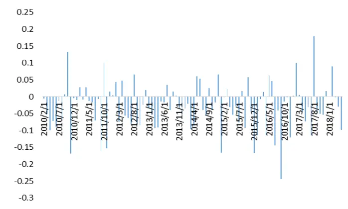
数据来源：国泰君安证券研究

图 2 纯因子组合多空收益率
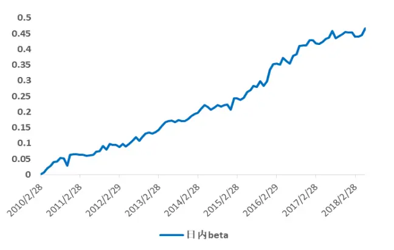
数据来源：国泰君安证券研究

表 因子显著性检验

| 因子定义 | IC | ICIR | Factor Return |
| --- | --- | --- | --- |
| 日内 BETA | -2.93% | -1.48 | 5.59% |

数据来源：国泰君安证券研究

## 举例 2：日内最高价出现时间

因子定义：日内最高价出现的时间索引值（剔除开盘涨跌停的情况）。hp_pos = idx ( high_price )

核心逻辑：有悖于直觉，最高价出现时间越早，投资者对隔夜信息的超买现象越严重，交易情绪越激进，未来上涨的可能性反而越高。

图1 剔除行业与风格后的月度IC
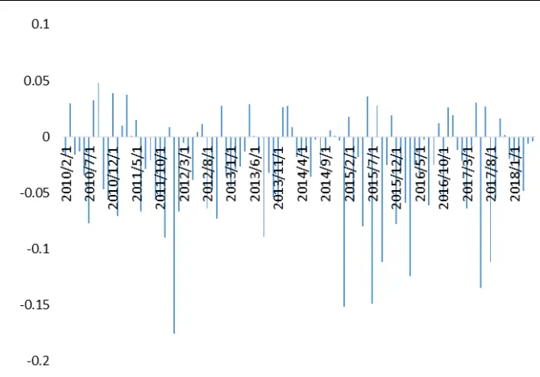
数据来源：国泰君安证券研究

图 2 纯因子组合多空收益率
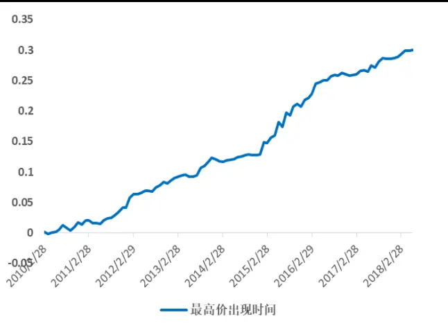
数据来源：国泰君安证券研究

表 因子显著性检验

| 因子定义 | IC | ICIR | Factor Return |
| --- | --- | --- | --- |
| 最高价出现时间 | -2.71% | -2.08 | 3.60% |

数据来源：国泰君安证券研究

## 2.2. 参与者结构类因子

参与者结构类因子最为推荐的因子构建方式。原因在于参与者结构因子与常见的日间技术类因子包括市值、换手率、动量或反转等相关性较小，因而能在边际上提供更多的预测性。

## 举例 1：收盘成交量占比

因子定义： 收盘前15分钟成交量占日总成交量的比例（不包括集合竞价成交量）。

核心逻辑：《基于微观市场结构的择时策略》提出投资者可分为知情交易者、趋势追踪者、跟随交易者三大类。由于T+1交易制度的存在，缺少信息的跟随交易者更倾向于尾盘交易，不愿承担日内波动。跟随交易者越多，投机性越高，预期收益越低，反之，长线投资者越高，预期收益率越高。因而，因子与预期收益率为负向关系。

该因子为我们所测因子中 IC 最高的因子，且多空表现均较为稳定，因而可以作为多头选股因子。

图1 剔除行业与风格后的月度IC
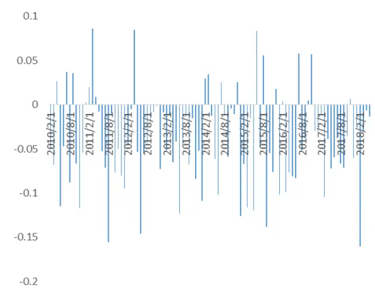
数据来源：国泰君安证券研究

图 2 纯因子组合多空收益率
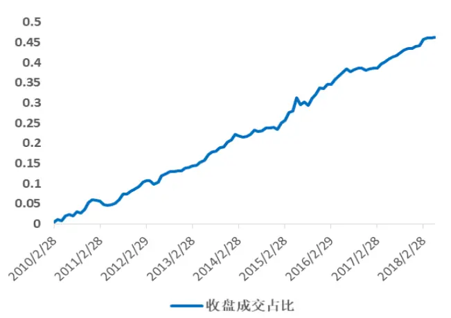
数据来源：国泰君安证券研究

表 因子显著性检验

| 因子定义 | IC | ICIR | Factor Return |
| --- | --- | --- | --- |
| 收盘成交量占比 | -4.05% | 2.64 | 5.56% |

数据来源：国泰君安证券研究

## 举例2：正成交量指标PVI

因子定义：放量时收益率之和

核心逻辑：根据费班克教授的观点，股票越是散户主导的市场。散户通常是一个喜欢追涨杀跌的群体，因此，当行情出现价涨量增的走势时，“散户群”参与度会较高。因而，PVI用于侦测行情是否属于散户市场，PVI越大，股票越是散户主导的市场。

图1 剔除行业与风格后的月度IC
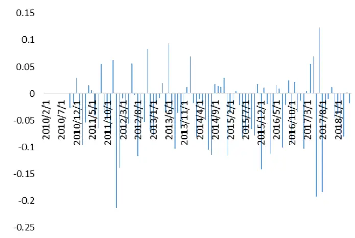
数据来源：国泰君安证券研究

图 2 纯因子组合多空收益率
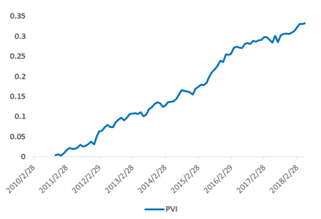
数据来源：国泰君安证券研究

## 表 因子显著性检验

| 因子定义 | IC | ICIR | Factor Return |
| --- | --- | --- | --- |
| 日内 BETA | -3.37% | -1.90 | 4.35% |

数据来源：国泰君安证券研究

## 2.3.博弈状态类因子

测试中表现最好的博弈状态类因子为风险模糊度 VoV （参见《基于风险模糊度的选股策略》）。其他相对有效的因子包括量价背离、变异数比率等。博弈状态类因子主要刻画了交易多空双方日内博弈的过程。

## 举例 1：量价背离

因子定义： 日内价格与成交量的负相关性

核心逻辑： 日内缩量上涨或者放量下跌优于放量大涨或缩量下跌，缩量上涨的股票，其交易中所负载的信息含量大、信息不对称程度高，因而动量较强（参见《基于流动性偏好的风格配置策略》）。

相关性衡量方式：非平稳时间序列相关性

$$
\widehat{\rho_{0}}=\frac{\mathrm{A}_{\mathrm{xy}}}{A_{x}A_{y}}
$$

$$
\mathbf{A}_{x}^{2}=\frac{1}{\mathbf{T}-\mathbf{1}}\boldsymbol{\Sigma}_{t=2}^{\mathbf{T}}\left(\mathbf{X}_{t}-\mathbf{X}_{t-1}\right)^{2}
$$

$$
\mathbf{A}_{y}^{2}=\frac{1}{\mathbf{T}-\mathbf{1}}\boldsymbol{\Sigma}_{t=2}^{\mathbf{T}}\left(\mathbf{Y}_{t}-\mathbf{Y}_{t-1}\right)^{2}
$$

$$
\boldsymbol{A}_{xy}=\frac{1}{\mathbf{T}-\mathbf{1}}\boldsymbol{\Sigma}_{t=2}^{\mathbf{T}}\left(\boldsymbol{X}_{t}-\boldsymbol{X}_{t-1}\right)\left(\boldsymbol{Y}_{t}-\boldsymbol{Y}_{t-1}\right)
$$

我们在《基于短周期价量特征的多因子选股体系》中发现了日间的量价背离对未来短期收益率有一定的预测能力。同样，我们使用日内数据刻画量价背离也得到了类似的结论。在原报告基础上，我们对相关系数的计算方法进行了一定的改进。

传统的 Pearson 相关系数潜在假设了时间序列的平稳性。由于股票价格和成交量序列是非平稳序列，使用 Pearson 相关系数来衡量量价相关性并不合适；Pearson相关系数的另一个缺点是简单地通过变量与均值的距离计算的相关系数，无法很好地把握时间序列变化的方向。

而我们使用的新的相关性计算方式很好的解决在非平稳序列情形下，同样我们构造5000对随机游走的时间序列，从而计算其相关系数。

## 图 两种相关性计算方法效果比较

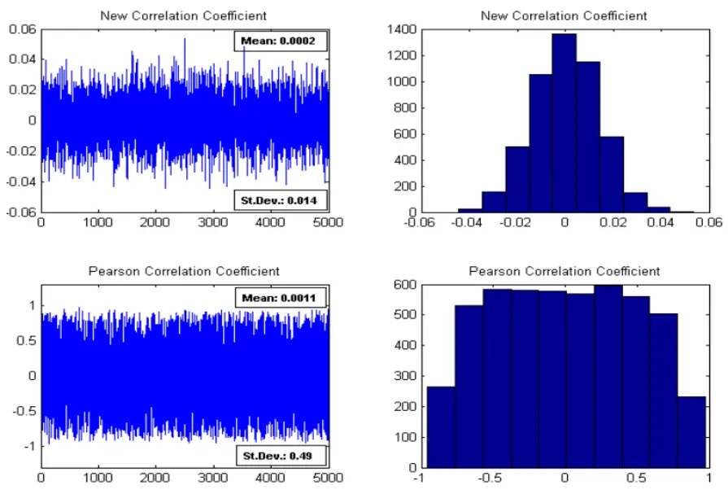
数据来源：国泰君安证券研究

从结果中，可以看到，新的相关系数均值比Pearson 系数更接近真实值 0。除此之外，它的标准差也小于 Pearson 相关性系数的标准差。所以，新的时间序列相关系数在捕捉变量之间的独立性时完全占优于 Pearson 相关性系数。

图1 剔除行业与风格后的月度IC
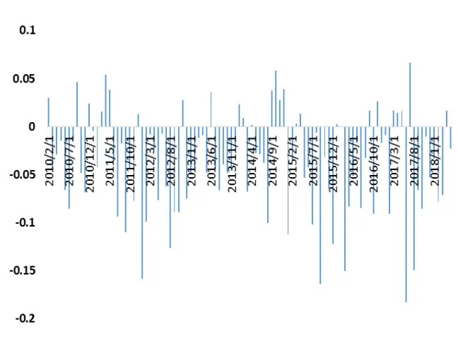
数据来源：国泰君安证券研究

图 2 纯因子组合多空收益率
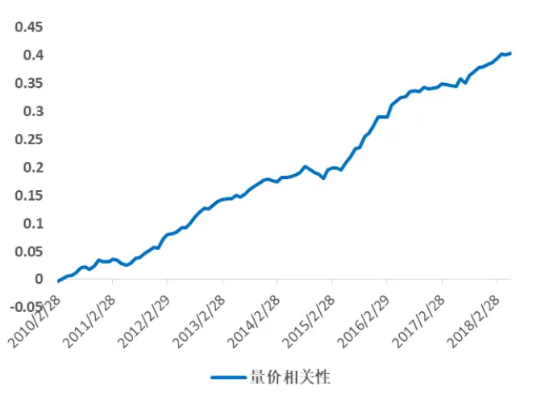
数据来源：国泰君安证券研究

表 因子显著性检验

| 因子定义 | IC | ICIR | Factor Return |
| --- | --- | --- | --- |
| 量价背离 | -3.73% | -2.45 | 4.85% |

数据来源：国泰君安证券研究

## 举例 2：变异数比率（Variance Ratio ）

因子定义： 不同期间累计成交量方差比。

$$
V_{R}=\frac{V_{aR}\left(\nu oI_{_{t,k}}\right)/k}{V_{aR}\left(\nu oI_{_{t,j}}\right)/j};\nu oI_{_{t,k}}=\sum_{j=1}^{k-1}\nu oI_{_{t-j}};k=5,j=10
$$

核心逻辑：参照Poterba（1987）的观点，变异数比率反映成交量的自相关性。变异数比率大于 1，则成交量有正的自相关性，趋势性较强。变异数比率小于1，则成交量有负的自相关性，均值回复较强。

该因子是所测因子中纯因子组合收益率最高的因子。我们使用 5分钟成交量均线的方差与 10 分钟成交量均线的方差构造了变异数比率，用于反映日内成交量的趋势性。通常，若日内出现放巨量后，随后未有资金跟进，出现成交量快速回落的现象时，成交量均值回复特点明显，表明信息连续性比较弱，从而预期收益较低。因此，该因子值与预期收益率呈现正向变动的关系。

图1 剔除行业与风格后的月度 IC
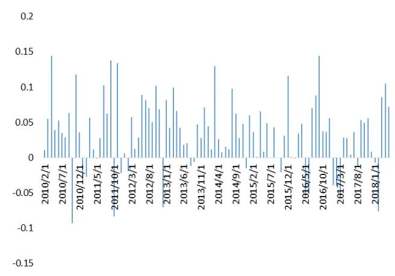
数据来源：国泰君安证券研究

图 2 纯因子组合多空收益率
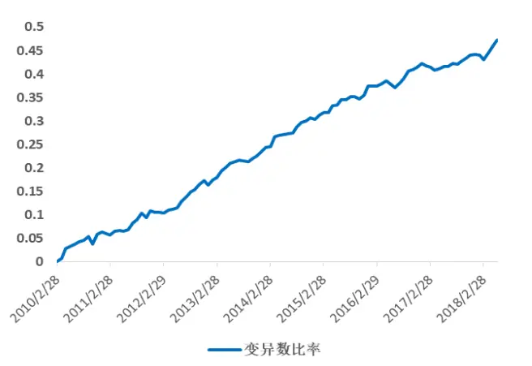
数据来源：国泰君安证券研究

表 因子显著性检验

| 因子定义 | IC | ICIR | Factor Return |
| --- | --- | --- | --- |
| 变异数比率 | 3.36% | 2.31 | 5.67% |

数据来源：国泰君安证券研究

## 3. 日内特征因子在组合构建中的应用

在之前的报告中，我们提出了量化选股的三个步骤：基本面因子初筛、技术类因子增强和微观交易结构的再增强。我们建议对于换仓频率较高的投资再加入一步——技术面的复筛，形成量化选股的四个步骤：

第一步，基本面因子初筛；

第二步，技术类因子复筛；

第三步，ALPHA因子增强；

第四步，微观交易结构的再增强。

若换仓频率较低（季频或以上），基本面筛选更重要；若换仓频率高（周频或月频），技术面筛选更重要。基本面筛选为了避免踩雷，而技术面筛选可以避免错误时间买入正确的股票，起到个股择时的作用。

更重要的原因是：技术类多空收益率高，但绝大数因子空头要好于多头，技术类因子由于做空限制的存在，空头在各年份都较为稳定，因而大部分技术面因子更适用于负向排除。以波动率因子为例，高波动股票由于存在做空限制下的过度乐观现象和投资者的赌徒心态，通常估值过高，从而未来收益率走低。

图 中证 500低波动指数2018年相对基准出现明显回撤
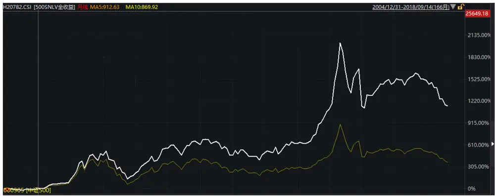
数据来源：国泰君安证券研究

基于上述思路，技术类因子可分为两类：负面排除因子与正向增强ALPHA 因子。根据因子多空的表现情况，我们针对日内特征因子进行分类，结果表明，绝大多数 IC 显著的因子仅可算作空头因子，而不能作为多头因子。其分类标准依据为是否 2010 年以来每年都有正超额收益。我们更关注多头的稳定性，若多头收益不稳定，则更倾向于认为该因子在多头上为风格因子，不建议做ALPHA增强。

负向排除因子：日内 BETA 、HighPrice_pos、技术指标 PVI 、VoV、量
价相关性、成交量变异数比率，WVAD
正向增强因子：收盘成交量占比

结果表明，在检验的系列日内交易特征因子中，仅收盘成交量因子可作为正向增强因子，其余因子虽然某些因子多头收益较高，但仍然建议作为负面排除因子。

具体而言，我们仅使用日内交易特征因子，构建基础的选股策略进行历史回溯，以供参考。策略构建暂不考虑微观交易增强，可分为三步：

## STEP 1:基本面初筛

- 剔除净利润或营业利润为负的股票

- STEP 2: 技术面复筛

- 剔除各个负向排除因子全市场最差 1/5的股票

- STEP 3:ALPHA 因子增强

- 行业中性后根据ALPHA因子（收盘成交量占比）排序，取前50只股票

回测相关参数设定如下：

股票池：全A市场（剔除ST、停牌与次新）

调仓频率：月换仓

建仓成本：双边千分之三

加权方式：等权

对冲指数：中证500等权

回测结果及相关绩效展示如下：

图 组合累计超额收益
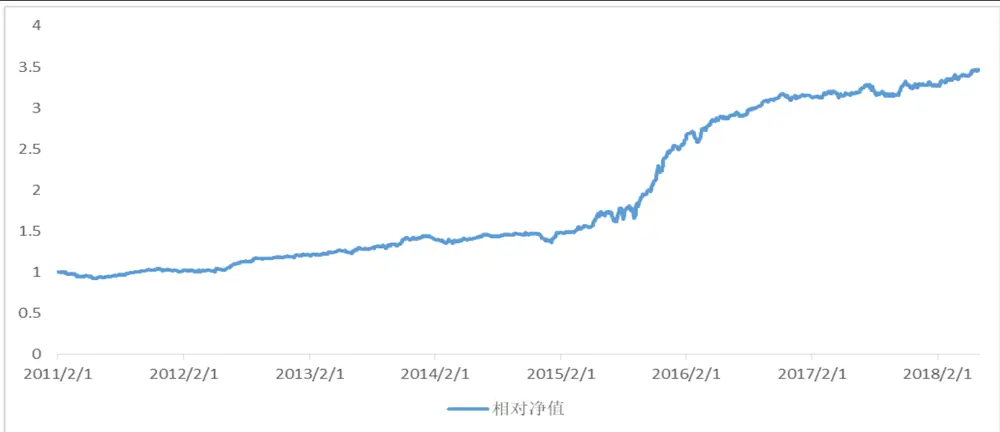
数据来源：国泰君安证券研究

表 组合绩效统计

| 年化收益率 | 最大回撤 | 信息比率 | 收益回撤比 |
| --- | --- | --- | --- |
| 18.53% | 8.14% | 2.15 | 2.28 |

数据来源：国泰君安证券研究

## 4. 总结与展望

本篇报告尝试用分钟级别的数据构造了一系列月频 ALPHA 因子，并对其进行了因子显著性检验。本篇报告主要借用了一些日频因子的构建方式刻画了日内交易特征。实际上，日内数据量巨大，刻画日内交易特征的方式众多，未来我们会继续开发其他日内交易特征因子，特别是多头收益稳定的因子。

除此之外，本篇报告主要针对日内交易特征构造了月度 ALPHA 因子，考虑到技术类因子有效性衰退较快，未来会进一步探索周度换仓策略的组合构建。

## 本公司具有中国证监会核准的证券投资咨询业务资格

## 分析师声明

作者具有中国证券业协会授予的证券投资咨询执业资格或相当的专业胜任能力，保证报告所采用的数据均来自合规渠道，分析逻辑基于作者的职业理解，本报告清晰准确地反映了作者的研究观点，力求独立、客观和公正，结论不受任何第三方的授意或影响，特此声明。

## 免责声明

本报告仅供国泰君安证券股份有限公司（以下简称“本公司”）的客户使用。本公司不会因接收人收到本报告而视其为本公司的当然客户。本报告仅在相关法律许可的情况下发放，并仅为提供信息而发放，概不构成任何广告。

本报告的信息来源于已公开的资料，本公司对该等信息的准确性、完整性或可靠性不作任何保证。本报告所载的资料、意见及推测仅反映本公司于发布本报告当日的判断，本报告所指的证券或投资标的的价格、价值及投资收入可升可跌。过往表现不应作为日后的表现依据。在不同时期，本公司可发出与本报告所载资料、意见及推测不一致的报告。本公司不保证本报告所含信息保持在最新状态。同时，本公司对本报告所含信息可在不发出通知的情形下做出修改，投资者应当自行关注相应的更新或修改。

本报告中所指的投资及服务可能不适合个别客户，不构成客户私人咨询建议。在任何情况下，本报告中的信息或所表述的意见均不构成对任何人的投资建议。在任何情况下，本公司、本公司员工或者关联机构不承诺投资者一定获利，不与投资者分享投资收益，也不对任何人因使用本报告中的任何内容所引致的任何损失负任何责任。投资者务必注意，其据此做出的任何投资决策与本公司、本公司员工或者关联机构无关。

本公司利用信息隔离墙控制内部一个或多个领域、部门或关联机构之间的信息流动。因此，投资者应注意，在法律许可的情况下，本公司及其所属关联机构可能会持有报告中提到的公司所发行的证券或期权并进行证券或期权交易，也可能为这些公司提供或者争取提供投资银行、财务顾问或者金融产品等相关服务。在法律许可的情况下，本公司的员工可能担任本报告所提到的公司的董事。

市场有风险，投资需谨慎。投资者不应将本报告作为作出投资决策的唯一参考因素，亦不应认为本报告可以取代自己的判断。
在决定投资前，如有需要，投资者务必向专业人士咨询并谨慎决策。

本报告版权仅为本公司所有，未经书面许可，任何机构和个人不得以任何形式翻版、复制、发表或引用。如征得本公司同意进行引用、刊发的，需在允许的范围内使用，并注明出处为“国泰君安证券研究”，且不得对本报告进行任何有悖原意的引用、删节和修改。

若本公司以外的其他机构（以下简称“该机构”）发送本报告，则由该机构独自为此发送行为负责。通过此途径获得本报告的投资者应自行联系该机构以要求获悉更详细信息或进而交易本报告中提及的证券。本报告不构成本公司向该机构之客户提供的投资建议，本公司、本公司员工或者关联机构亦不为该机构之客户因使用本报告或报告所载内容引起的任何损失承担任何责任。

## 评级说明

## 1.投资建议的比较标准

投资评级分为股票评级和行业评级。

以报告发布后的12个月内的市场表现为比较标准，报告发布日后的 12个月内的公司股价（或行业指数）的涨跌幅相对同期的沪深 300 指数涨跌幅为基准。

## 2.投资建议的评级标准

报告发布日后的 12 个月内的公司股价（或行业指数）的涨跌幅相对同期的沪深 300 指数的涨跌幅。

| 评级 |  | 说明 |
| --- | --- | --- |
| 股票投资评级 | 增持 | 相对沪深 300指数涨幅15%以上 |
|  | 谨慎增持 | 相对沪深300指数涨幅介于5%～15%之间 |
|  | 中性 | 相对沪深 300指数涨幅介于-5%～5% |
|  | 减持 | 相对沪深300指数下跌 5%以上 |
| 行业投资评级 | 增持 | 明显强于沪深300 指数 |
|  | 中性 | 基本与沪深300指数持平 |
|  | 减持 | 明显弱于沪深300指数 |

## 国泰君安证券研究所

|  | 上海 | 深圳 | 北京 |
| --- | --- | --- | --- |
| 地址 | 上海市浦东新区银城中路168号上海 银行大厦29层 | 深圳市福田区益田路 6009 号新世界 商务中心34层 | 北京市西城区金融大街 28 号盈泰中 心2号楼10层 |
| 邮编 | 200120 | 518026 | 100140 |
| 电话 | （021)38676666 | (0755)23976888 | (010)59312799 |
|  | E-mail: gtjaresearch@gtjas.com |  |  |