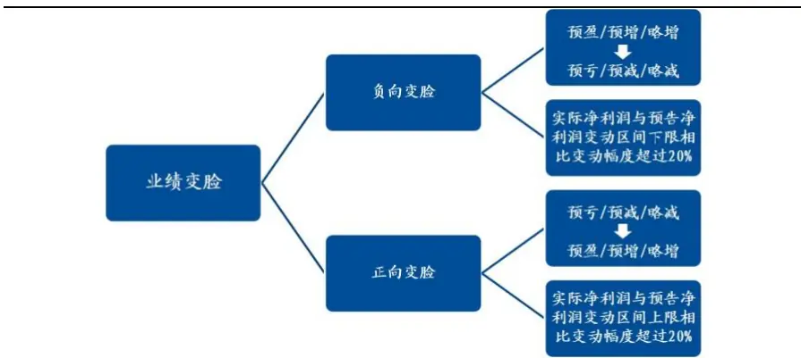
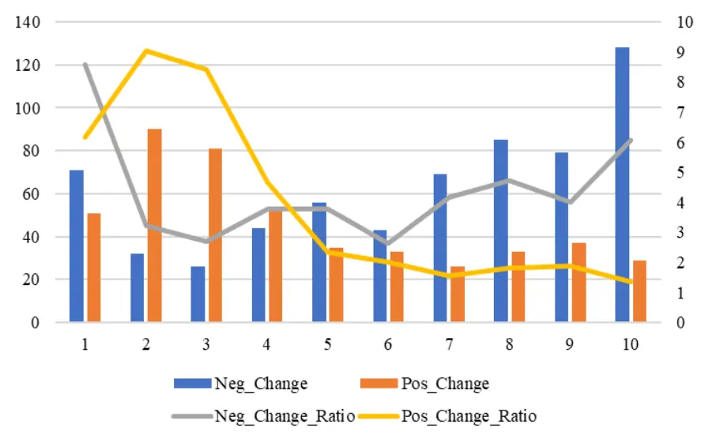
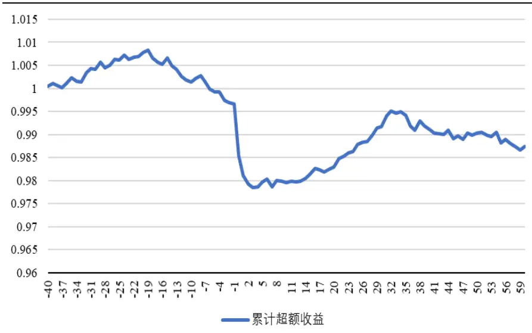
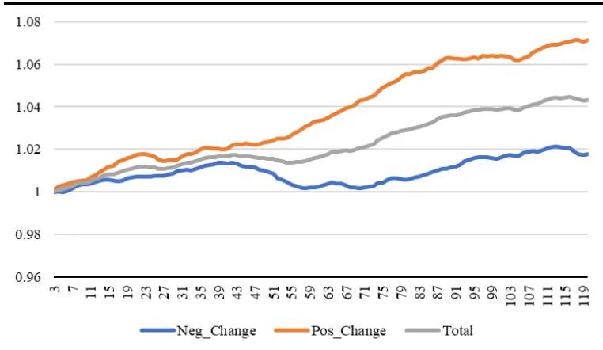

inInfo] [Table_Title] 2018.10.22

# 上市公司业绩变脸中的业绩预告之谜

## ——数量化专题之一百二十一

玉陈奥林（分析师）

## 黄皖璇（研究助理）

8 021-38674835

021-38677799

chenaolin@gtjas.com

huangwanxuan@gtjas.com

证书编号 S0880516100001

S0880116100008

## 本报告导读：

本报告以上市公司年报业绩预告发布之后的变脸现象为研究对象, 采用多项Logit模型，从上市公司的财务、公司治理以及业绩预告信息的角度对其进行预测。

## 摘要：

[Table_Summary]• 在市场整体风险偏好较低的阶段，投资者的关注会从收益端转向风险端，因此，2016年以来风险端驱动的策略收益更加显著

上市公司的业绩变脸分为正向变脸和负向变脸，其中正向变脸的规律性较弱，通常难以捕捉，负向变脸相对有迹可循。

本报告定义的业绩变脸主要针对上市公司发布的年度业绩预告，一方面涉及年度业绩预告之后的业绩修正公告，另一方面涉及直接的正式公告变脸。

基于已有的A股上市公司变脸信息，本文从公司的财务信息、公司治理、快报信息几个方面，寻找潜在的预测变量，以多项Logit 模型为基础，总结历史规律，对未来公司发布的业绩预告的真实准确度进行判断，从而构建相应的投资策略。

总体而言，公司的业绩变脸预测难度较大，模型显示出了初步的预测效果。但是，量化模型仅能归纳变脸公司的共性，精准预测还需要结合个股自身情况。从事件性收益的角度来看，模型对样本划分效果显著，体现出市场对于业绩变脸概率有一定预期。

金融工程

## 金融工程团队：

陈奥林：（分析师）

电话：021-38674835

邮箱：chenaolin@gtjas.com

证书编号：S0880516100001

## 李辰：（分析师）

电话：021-38677309

邮箱：lichen@gtjas.com

证书编号：S0880516050003

## 孟繁雪：（分析师）

电话：021-38675860

邮箱：mengfanxue@gtjas.com

证书编号：S0880517040005

## 蔡旻昊：（研究助理）

电话：021-38674743

邮箱：caiminhao@gtjas.com

证书编号：S0880117030051

## 李栩：（研究助理）

电话：021-38032690

邮箱：lixu019018@gtjas.com

证书编号：S0880117090067

## 杨能：（研究助理）

电话：021-38032685

邮箱：yangneng@gtjas.com

证书编号：S0880117080176

## 殷钦怡：（研究助理）

电话：021-38675855

邮箱：yinqinyi@gtjas.com

证书编号：S0880117060109

## 余剑峰：（研究助理）

电话：021-38676186

邮箱：yujianfeng@gtjas.com

证书编号：S0880118060039

## 黄皖璇：（研究助理）

电话：021-38677799

邮箱：huangwangxuan@gtjas.com

证书编号：S088011610008

## [Table_R相关报告

《基于日内交易特征的选股策略》2018.10.18《基于宏观状态的风险预算和资产配置》2018.09.15

《基于财报期效应的基本面因子动态配置研究》2018.09.07

《基于风险模糊度的选股策略》2018.07.26

《风格域划分下的基本面多因子选股策略》2018.07.12

## 1. 研究背景

## 1.1. 政策背景

为了降低公司经营着与外部投资者之间的信息不对称，提高证券市场的透明度，我国从 1998 年开始实施业绩预告制度，要求上市公司的业绩变动达到一定条件时，在正式公告前进行预披露。

业绩预告是风险提前释放的一种方式，上交所和深交所对业绩预告的披露规则稍有不同。根据《上海证券交易所股票上市规则》的规定，对于年度报告，如果上市公司预计全年可能出现亏损、扭亏为盈、净利润较前一年变动幅度超过 50%以上等情况，应当在当期会计年度结束后的 1月31日之前披露业绩预告。

深交所对于其主板、中小板和创业板公司的业绩预告披露制定了差异化的披露规则。主板上市的公司，预计报告期内（第一季度、半年度、第三季度和年度）出现以下情况的，应进行业绩预告：净利润为负、扭亏为盈、实现盈利且净利润与上年同期相比上升或者下降 50％以上（基数过小的除外）、期末净资产为负、年度营业收入低于1 千万元。

中小板公司，应在第一季度报告、半年度报告和第三季度报告中披露对年初至下一报告期末的业绩预告。公司预计第一季度业绩将出现归母净利润为负值、净利润与上年同期相比上升或者下降50％以上（基数过小的除外）、扭亏为盈，应不晚于3月31 日（在年报摘要或临时公告）进行业绩预告。

创业板公司的业绩预告同中小板公司是强制性披露的，全部创业板上市公司均要进行业绩预告。公司未在上一次定期报告中对本报告期进行业绩预告的，应当及时以临时报告的形式披露业绩预告。

虽然业绩预告对于不存在特殊情况的主板上市公司不是强制性披露，但不少主板上市公司还是会进行自愿性披露。每年发布业绩预告的公司占全部上市公司的比例如表1 的第一行所示。

表 1 业绩预告及其修正公告发布情况

| 年份 | 2008 | 2009 | 2010 | 2011 | 2012 | 2013 | 2014 | 2015 | 2016 | 2017 |
| --- | --- | --- | --- | --- | --- | --- | --- | --- | --- | --- |
| 业绩预告发布占比（%） | 67.07 | 70.44 | 67.46 | 70.49 | 72.66 | 75.45 | 76.74 | 80.2 | 81.65 | 77.51 |
| 发布业绩预告修正报告的公司数目 | 163 | 141 | 135 | 167 | 173 | 165 | 160 | 183 | 187 | 196 |

数据来源：国泰君安证券研究

从表1可以看出，平均而言，每年大约有80%的公司都会在正式年报披露之前发布业绩预告。但是业绩预告对于上市公司并非一锤定音，在业绩预告发布之后，很多上市公司还面临随后修正的现实状况。

按照上交所最新修订的《上市公司信息披露监管问答》中的要求：公司发现披露的业绩预告和实际业绩差异发生盈亏变化、预告金额或幅度较比较期业绩差异较大等情形时，需要披露业绩预告更正公告。实践来看，如果实际业绩与预告的业绩相比差异超过预告业绩20%的，也需要披露业绩预告更正公告。在披露业绩预告更正公告时，需要说明预告业绩情况以及差异的原因等内容。

表1中的第二行给出了每年发布业绩修正公告的公司数目，通常上市公司的业绩变脸就在业绩修正公告中显形。某养殖业公司在 2017 年三季报中预计全年将产生1 亿左右的净利润，随后于2018 年1 月31号又发布了业绩修正公告，称发现部分海域底播虾夷扇贝存货异常,可能对其计提跌价准备或核销处理,并将 2017 年业绩从预盈调整为预亏 5.3 亿元至7.2亿元，股价自此应声下跌近乎腰斩。

但是除此之外，也不乏正向变脸的上市公司，以 2017 年年报为例，某中小板公司 1 月 31 日发布业绩预告修正公告称，受国外税改政策的利好影响，预计公司 2017 年净利润为 6.2 亿元-8.8 亿元，比 2016 年增长915.14%-1340.85%。此前，公司预计 2017 年净利润变动区间为-55700万元至-15700 万元。

## 1.2.业绩变脸定义

图 1 业绩变脸定义图示

本文的研究以上市公司业绩变脸为基础，首先就需要对业绩变脸给出清晰的定义。变脸分为正向和负向两种，针对每一种变脸，又分为两种情形。如果上市公司发布了业绩修正公告，并且业绩修正公告与之前发布的业绩预告相比预测性质存在方向上的变化，例如从预盈、预增、略增修正为预亏、预减、略减，则属于负向变脸的情况之一。

除此之外，还有一些上市公司在没有发布业绩修正公告的情况下，直接公告变脸。本文借鉴《上市公司信息披露监管问答》的定义，认为公司实际净利润相对预告变动幅度超过20%的公司，也属于变脸。在监管趋严的背景下，这种直接公告变脸的情况应该越来越少，而发布业绩修正公告的公司数目应该越来越多。

## 1.3.变脸公司样本统计

在本文的样本考察期内，每年分别发生正向变脸和负向变脸的公司数目及占比统计如图2 所示。其中柱状图代表变脸的样本数目，折线为变脸样本在总样本中的占比。黄色柱状图代表的是正向变脸的公司数目，这类公司自2012年起数目相对稳定，并且十分少数，每年只有 30家左右，在全市场中的占比1%-2%。但是蓝色柱状图代表的负向变脸公司具有明显的趋势性特征，其数量逐年上升，2017年年报负向变脸的公司达到了128 家。

图 2 变脸样本的分年统计图

数据来源：国泰君安证券研究

正向变脸和负向变脸的分行业统计情况如表2所示，其中化工、电子、医药生物、机械设备行业变脸的公司的情况相对较多，但是该行业本身上市公司的数目也较多。从占比的角度来看，房地产、商业贸易、休闲服务行业的变量样本占比相对较高，达到了5%以上。

表 2 变脸样本分行业统计

| 行业 | 负向变脸 正向变脸 | 负向变脸占比（%） 正向变脸占比（%） |
| --- | --- | --- |
| 牧渔 | 30 12 | 5.54 2.21 1.23 |
| 采掘 | 16 4 | 4.94 |
| 化工 | 71 57 | 4.07 3.27 |
| 钢铁 | 13 7 | 5.08 2.73 |
| 有色金属 | 29 21 | 4.84 3.51 |
| 电子 | 47 37 | 4.99 3.93 |
| 家用电器 | 16 8 | 4.94 2.47 |
| 食品饮料 | 21 10 | 6.1 2.91 |
| 纺织服装 | 26 25 | 5.54 5.33 |
| 轻工制造 | 28 16 | 4.84 2.77 |
| 医药生物 | 40 25 | 3.74 2.34 |
| 公用事业 | 17 25 | 3.26 4.79 |
| 交通运输 | 9 12 | 2.78 3.7 |
| 房地产 | 27 40 | 3.68 5.45 |
| 商业贸易 | 17 21 | 4.25 5.25 |
| 休闲服务 | 11 9 | 6.63 5.42 |
| 综合 | 15 16 | 4.82 5.14 |

| 建筑材料 19 13 | 4.57 3.13 |
| --- | --- |
| 建筑装饰 13 | 4.08 4.08 |
| 电气设备 38 | 13 19 4.71 2.35 |
| 国防军工 2 | 4 1.57 3.15 |
| 计算机 25 | 19 3.21 2.44 |
| 传媒 16 | 5 4.94 1.54 |
| 通信 18 | 5 5.25 1.46 |
| 汽车 17 | 15 3.12 2.75 |
| 机械设备 49 | 29 3.87 2.29 |
| 合计 630 | 467 |

数据来源：国泰君安证券研究

业绩变脸，特别是负向变脸一旦出现必然会对上市公司的股价表现产生比较大的负面冲击。基于事件研究的角度，图3统计了上市公司发生业绩变脸前后的平均累计超额收益表现。T=0 日指代实际变脸发生日，超额收益为个股日收益减去其所属申万一级行业指数的超额收益，累计超额收益为超额收益的逐日累加。

图 3 的累计超额收益统计从 T=-40 日起，也就是变脸事件发生前的 40个交易日。从折线图的表现可以看出，在变量实际发生前，累计超额收益已经具有明显的下跌趋势性特征，说明市场上的投资者对负向变脸的公司存在提前的反应。在变脸实际发生前后的 3-5 个交易日，股价会产生剧烈地负向反应，随后又存在一定的超跌反弹态势。

既然市场上的投资者对业绩负向变脸的公司具有提前反应的特征，我们就希望能够在变脸实际发生之前，对其进行预测，从而实现避雷和提前埋伏正向变脸的目的。

图 3 负向变脸事件的累计超额收益

数据来源：国泰君安证券研究

## 2. 预测变量

考虑到上市公司的年度业绩预告通常采用两种方式，一种是在第三季度报中给出全年的预测，也就是随第三季度报发布，另外一种是在三季度报之后，采用临时公告的形式单独发布。不论采用何种披露方式，可以确定的是上市公司在发布业绩预告之时，前三季度报已经是公开信息，因此本文选取前三季度报中的财务信息、相关公司治理信息以及当期业绩预告信息三大类变量对上市公司随后的变脸情况进行预测。

## 2.1. 指标定义

财务指标方面，首先需要关注的是上市公司的盈利状况，以及盈利的构成，盈利构成反映盈利质量。如果公司的盈利主要来源于非经常性损益，则盈利的稳定性较差。其次是公司的成长性，较高成长性的伪造难度较高。再次，由于按照规定，上市公司必须在业绩修正公告中对其做出的修正给予明确的解释，在阅读整理相关公告内容的基础上，本文发现，除去宏观层面和行业层面的影响之外，从公司自身角度来看，业绩变脸的症结绝大多数都出现在计提资产减值损失相关的资产上，因此这类资产需要高度关注。

表 3 指标定义

| 指标 |  | 名称 | 注释 |
| --- | --- | --- | --- |
| 财务信息 | 总资产收益率 | ROA | 前三季度的 ROA |
|  | 销售毛利率 | GrossPrf | 毛利/销售收入 |
|  | 核心利润占比 | CorePrf | 核心利润/净利润 |
|  | ROA 同比增长 | ROAGro | 前三季度 ROA 的同比增长率 |
|  | 营业收入增长 | IncmGro | 前三季度营业收入的同比增长率 |
|  | 需要计提资产减 值准备的资产占 比 | ImpairAss | 长期股权投资、投资性房地产、 固定资产、无形资产、商誉资产 占总资产比例 |
|  | 应收项目资产占 比 | Recv | 应收账款、应收票据和其他应收 |
|  | 存货资产占比 | Invent | 款占比 存货在总资产中的占比 |
|  | 高管变动 | CEOLev | 前三季度有高管变动为1，否则0 |
|  | 重要股东增减持 | SHTrade | 重要股东的股权变动比例 |
| 公司治理 信息 |  | Top1_Hdrt | 前十大流通股东持股比例合计； |
|  | 股权结构 | Top10_Hdrt | 控股股东的持股比例 滚动3年历史发布过业绩修正公 |
|  | 业绩变脸历史 | ReviHist | 告取值为1，否则为0. |
| 业绩预告 信息 | 业绩预告发布时 点 | PostYear | 业绩预告的发布时间为会计年度 截止之后为1，否则为0. |
|  | 预计净利润变动 规模 | EstGroRtFlr | 预计净利润变动范围均值 |

数据来源：国泰君安证券研究

另外考虑上市公司的财务操纵行为可能很难通过简单的财务分析洞察，我们将同时考察上市公司的公司治理情况。例如上市公司的高管变动、重要股东在二级市场的交易行为、公司发布业绩修正公告的历史都能够从侧面反映出上市公司的生产经营和会计制度的健康程度。整体预测变量如表3 所示。另外，本文对涉及财务指标的变量全部予以行业中性化处理，即在行业内计算Z-score。

其中，毛利=营业收入-营业成本，是利润表中最难以被操纵和调整的项目，核心利润=营业收入-营业成本-营业税金及附加-销售费用-管理费用-财务费用，反映企业初始获利空间大小，往往与企业所处行业特点和企业在行业中的竞争优势相关。

在资产负债表当中，以长期股权投资、固定资产、商誉为代表的需要计提资产减值准备的资产对于公司而言就是悬在头上的达克莫斯之剑，这类资产面临持续性的减值计提，计提的规模大小可能随公司的会计政策变动而发生波动。

除了以上资产之外，存货和各种应收项目也存在计提资产减值损失的可能，存货资产对应的存货跌价准备和应收账款对应的坏账准备与商誉减值准备在利润表中同反映在资产减值损失这一科目中，区别在于之后是否可以转回。

例如当期已经计提了减值损失的存货资产，在下一期又被销售出去，销售的同时需要结转已经计提的减值。因此存货和各种应收项目如果在总资产中的占比较高，意味着公司存在更大的利润操纵空间。

除了公司本身会计制度不够完善是导致业绩变脸的一大重要原因之外，不排除有些公司的业绩变脸是有意的财务操纵，这就与上市公司的“大洗澡”动机相关。

根据A股上市公司的交易规则，上市公司连续两年亏损就会被戴帽成 ST（特别处理）股票，这种制度背景可能导致一些上市公司发现当年的亏损已经无力挽回，从而不妨多计提一些存货跌价准备，次年再转回，当年的亏损实际是为次年的盈利创造更大的空间。

## 2.2.指标预测的显著性检验

表 4 变量的配对样本 T 检验：负向变脸 VS.正常样本

| Year | Gros sPrf | Core Prf | Incm Gro | Impa irAss | Recv | Invent | Hdrt | Hdrt | SHTrade | CEO Lev | ROA | Revi Hist | ROA Gro | Post Year | EstGro RtFlr |
| --- | --- | --- | --- | --- | --- | --- | --- | --- | --- | --- | --- | --- | --- | --- | --- |
| 2008 | 0.16 | -2.85 | -0.84 | 2.71 | -0.18 | -1.09 | -1.83 | -1.79 | -0.57 | 0.76 | -1.35 | 2.98 | -0.66 | -2.61 | 0.82 |
| 2009 | -0.3 | -0.31 | -0.32 | 2.66 | 0.77 | -1.99 | -2.14 | -1.19 | -0.06 | 2.09 | -3.47 | -0.17 | -1.31 | -0.33 | -1.61 |
| 2010 | -1.59 | 0.56 | -0.92 | 1.78 | 2.04 | -1.58 | -2.37 | -1.46 | -1.42 | -0.93 | -4.3 | 1.72 | -2.53 | -1.49 | -0.68 |
| 2011 | -1.54 | -0.53 | -1.71 | 1.26 | -0.54 | -0.18 | -0.84 | -0.72 | -0.26 | 0.5 | -1.4 | 2.57 | -0.56 | -3.89 | -0.08 |
| 2012 | -1.07 | 0.06 | -2.04 | 2.61 | 0.89 | -1.31 | -0.6 | -0.69 | -0.37 | 0.81 | -1.77 | 3.71 | -0.48 | -2.6 | 0.59 |
| 2013 | 0.75 | -0.97 | -0.29 | -0.28 | 0.11 | 1.99 | -2.13 | -1.72 | -1.42 | 1.03 | -3.84 | 1.99 | -3.14 | -0.06 | -0.01 |
| 2014 | -1.15 | -0.2 | -1.42 | -1.32 | -0.43 | -1.12 | -0.27 | 0.03 | 0.93 | 2.32 | -2.96 | -0.12 | -2.02 | -1.97 | -0.64 |
| 2015 | -1.87 | -1.46 | 0.36 | -0.09 | 0.86 | -0.33 | -2.64 | -1.25 | -0.56 | 4 | -3.69 | 2.16 | -3.36 | -0.08 | -0.08 |
| 2016 | -2.73 | 0.71 | -2.94 | -0.06 | 1.51 | -1.21 | -1.01 | -1.83 | 1.08 | 0.35 | -4 | 3.32 | -3.22 | -2.7 | -0.45 |
| 2017 | -1.92 | 0.85 | -0.65 | 0.5 | 3.68 | -0.03 | -2.28 | -2.58 | 0.19 | -0.06 | -5.86 | 5.75 | -4.46 | -2.88 | -1.27 |

数据来源：国泰君安证券研究

表3中的变量选择主要是基于逻辑演绎，是否确实符合逻辑还需要通过实证检验。表4中给出了各变量在负向变脸和没有变脸公司中的分年度显著性检验，表格中给出的是 T统计量值。

从T统计量值在不同变量和不同年度的表现可以看出，并非所有变量在每年都具有显著的预测性，但是从整体预测方向角度而言，基本都是符合逻辑和常识的。

在财务指标方面我们发现，毛利率越高的公司随后发生负向变脸的概率就越低，毛利率反映上市公司初始的盈利空间；以ROA 同比增长和营业收入增长为代表的成长性越强的公司发生负向变脸的概率也越低；应收项目、需要计提减值准备的资产在总资产中的占比越大则公司负向变脸的概率就越高。

在公司治理方面，高管变动会增加公司负向变脸的概率，因为新上任的高管可能会集中性地处理其前任的一些历史遗留问题，例如应收款项中的坏账处理，从而会对当期账面经营成果产生不确定性的影响。股权集中度指标与业绩变脸也是具有显著的相关性，较高的股权集中度有助于降低公司负向变脸的概率。曾经有业绩变脸历史的公司之后再发生业绩变脸的概率也会明显高于之前没有过变脸的公司，意味着业绩变脸是一种习惯性操作。表示业绩预告发布时间是否会计年度截止之后的二值变量显著为负，意味着12月 31号以后发布的业绩预告的可信度和准确度都显著更高。

表5给出的是各变量在正向变脸样本中的预测性。对比两张表格不难发现，各变量在正向变脸样本中的预测性相对较弱，反映在 T值的绝对值相对大小和通过显著性检验的指标比例上。

前三季度的盈利状况指标在正向变脸的样本中同样具有显著为负的预测作用，表示前三季度盈利状况较好的公司其预告的准确性也越强，不论正向还是负向变脸的概率都相对较低。

表 5 变量的配对样本T检验：正向变脸VS.正常样本

| Year | Gros sPrf | Core Prf | Incm Gro | Impa irAss | Recv | Invent | Hdrt | Hdrt | SHTrade | CEO Lev | ROA | Revi Hist | ROA Gro | Post Year | EstGro RtFlr |
| --- | --- | --- | --- | --- | --- | --- | --- | --- | --- | --- | --- | --- | --- | --- | --- |
| 2008 | -2.79 | 2.1 | 0.27 | 0.83 | 0.64 | 0 | 0.57 | -0.38 | -0.21 | 0.22 | -0.34 | -0.21 | 1.38 | -3.4 | -0.71 |
| 2009 | 2.81 | 1.03 | 0.14 | -1.13 | -0.26 | -0.78 | -1.01 | -2.4 | -2.56 | 0.17 | 1.69 | 3.41 | -2.09 | -6.19 | -3.93 |
| 2010 | -0.99 | 0.78 | 1.3 | 0.51 | 1.64 | -1.52 | -0.99 | -0.68 | 0.29 | -0.27 | -1.32 | 4.03 | -0.8 | -5.64 | -1.58 |
| 2011 | -0.48 | 0.19 | -0.52 | 1.72 | -0.09 | -0.28 | 1.01 | 1.22 | -0.33 | -1.76 | -0.39 | 1.61 | -0.5 | -4.18 | -0.36 |
| 2012 | -1.55 | 1.1 | 0.38 | 3.95 | -0.58 | -0.84 | -0.49 | 0.55 | 0.24 | 0.01 | -4.57 | 1.47 | 1.62 | 0.17 | 4.15 |
| 2013 | 0.52 | -2.81 | 2 | 1.69 | -1.35 | 1.2 | 2.91 | 2.94 | 2.7 | 1.49 | -2.87 | 0.04 | 1.09 | 1.76 | 0.59 |
| 2014 | -1.82 | 0.72 | 2.95 | 1.81 | -0.46 | -0.69 | 1.69 | 1.8 | 0.95 | -0.78 | -2.43 | -1.12 | 1.77 | -1.34 | -0.18 |
| 2015 | -0.51 | -3.6 | 0.02 | -0.49 | -0.94 | 1.51 | -0.53 | -0.78 | -0.91 | 0.4 | -2.3 | 0.15 | 0.57 | -0.1 | -0.1 |
| 2016 | -1.47 | 1 | 1.33 | 0.6 | 0.97 | -0.98 | 0.03 | -0.63 | -0.69 | 0.31 | -2.08 | -0.88 | 0.97 | 0.69 | -0.41 |
| 2017 | -2.7 | -0.77 | 2.41 | 1.64 | -0.45 | -0.11 | 1.25 | 1.39 | 1.43 | 0.25 | -4.23 | 1.31 | -2.04 | -0.45 | -1.08 |

数据来源：国泰君安证券研究

总结各变量在表4 和表5中的预测属性，我们发现负向变脸公司的规律性相对更强，而正向变脸其背后的原因与逻辑难以揣测和琢磨。

## 3. 多项 Logit 模型

在上一节预测变量的基础上，结合本文的研究的现实状况，采用多项Logit 模型进行业绩变脸的预测。当分类反应变量的类别为 2 类以上，且类别之间无序次关系时，可以应用多项 Logit 模型，它是普通 Logit回归分析的一种自然拓展。

对于有j=1,2,…J 类的非次序反应变量，多项Logit模型可以通过以下Logit 形式给出：

$$
\operatorname{Ln}\left[{\frac{P(y=j|x)}{P(y=J|x)}}\right]=\alpha_{j}+\sum_{k=1}^{K}\beta_{jk}x_{k}\tag{3.1}
$$

也就是说，在多项 Logit 模型中，Logit 是由反应变量中的不重复的类别对的对比所形成的。之后对每一Logit分别建模，若反应变量有 J个类型，多项 Logit 模型中就有 J-1 个 Logit。

在本文的研究背景下，全部样本可以划分为三种类型——正向变脸、负向变脸和没有变脸，在这三种类型中，没有变脸的公司的关注度应该最低，因此选取这种类型作为比较基准。

模型（3.2）和模型（3.3）分别以负向变脸和正向变脸相对没有变脸的类型对比为考察对象，使用极大似然估计的方式同时估计两类模型。

$$
\operatorname{Ln}\left[{\frac{P(y=1|x)}{P(y=3|x)}}\right]=\alpha_{1}+\sum_{k=1}^{K}\beta_{1k}x_{k}\tag{3.2}
$$

$$
\mathrm{Ln}\left[\frac{P(y=2|x)}{P(y=3|x)}\right]=\alpha_{2}+\sum_{k=1}^{K}\beta_{2k}x_{k}\tag{3.3}
$$

之后通过模型（3.2）和模型（3.3）的联立求解，也就是简单的移项，可以求解到如（3.4）和（3.5）的概率表达式，分别表示某公司发生负向变脸和正向变脸的预测概率值。

$$
P(y=1|x)=\frac{e^{\alpha_{1}+\sum_{k=1}^{K}\beta_{1k}x_{k}}}{1+e^{\alpha_{1}+\sum_{k=1}^{K}\beta_{1k}x_{k}}+e^{\alpha_{2}+\sum_{k=1}^{K}\beta_{2k}x_{k}}}\tag{3.4}
$$

$$
P(y=2|x)=\frac{e^{\alpha_{2}+\sum_{k=1}^{K}\beta_{2k}x_{k}}}{1+e^{\alpha_{1}+\sum_{k=1}^{K}\beta_{1k}x_{k}}+e^{\alpha_{2}+\sum_{k=1}^{K}\beta_{2k}x_{k}}}\tag{3.5}
$$

具体而言，我们选取4年作为样本训练期，滚动估计模型，得到预测变量相应的系数β，将其带入到概率表达式中，再将个股第 5年各预测变量的实际值带入，则可以得到针对每家公司随后分别发生负向变脸和正向变脸的预测概率。

## 4. 模型实际预测效果和投资运用

上一节中构建的模型在现实中的预测效果如何？本节分别从模型预测变脸的准确度和预测个股的实际事后收益表现两个角度检验。

## 4.1.预测变脸的精确度

在得到概率的基础上，如果想要用于随后变脸的预测，能够达到怎样的预测精度可能是很多投资者最为关心的问题。表7展示了模型预测的召回率，以10%为例，每个横截面上按照负向变脸预测概率从高到低排序，从样本整体中抽取概率最高的 10%公司，这 10%公司中涵盖了随后真正发生负向变脸的18.91%的样本。在相对极端的情况下，从全样本中抽取50%的公司，这 50%公司涵盖了随后真正发生负向变脸的 75.32%的样本公司。如果观察正向变脸的情况，效果近乎于随机抽取，换而言之，正向变脸的预测难度更大。

表 6 预测精确度统计

| 全样本抽取% | 占负向变脸公司（%） | 占正向变脸公司（%） |
| --- | --- | --- |
| 10 | 18.91 | 11.09 |
| 20 | 35 | 21.74 |
| 30 | 50.9 | 35 |
| 40 | 62.83 | 47 |
| 50 | 75.32 | 56.74 |

数据来源：国泰君安证券研究

从召回率的角度来看模型的预测效果似乎有些不尽如人意，不得不承认的是，业绩变脸作为资本市场上的地雷，确实存在很多的意外因素，需要同时考虑特质性因素。

## 4.2. 事件收益

在现实市场交易中，投资者预期是影响股价变动的重要因素之一，而投资者的预期的形成和变化是一个不断贝叶斯调整的过程。例如当投资者观察到历史上商誉资产较重的公司容易发生业绩变脸，那么未来具有相同特征的公司再发布业绩预告，投资者就会对其加以防备。这种预期最终会反映在股价中。

因此变脸预期较高的公司与预期较低的公司之间自然会产生收益上的区别，不论这种变脸随后是否真实发生，这种区别都会存在，只是当后期预期实现的时候会得以加强或者是减弱。

为了验证这种变脸预期对个股收益的影响，本文采用事件性检验，观察个股业绩预告发布之后，具有不同变脸预期公司之间个股收益的区别。

图4给出的是公司发布业绩预告的短期事件超额收益，超额收益计算为个股原始收益减去其所属的申万一级行业指数的收益，累计超额收益为日超额收益的逐日累加。为了避免上市公司业绩预告发布对市场产生的短期冲击，本文从业绩预告发布之后的第三个交易日开始计算。

图4中的灰色曲线表示公司业绩预告发布之后120个交易日的累计超额收益的平均表现。从收益曲线的角度可以看出，上市公司发布业绩预告平均而言会产生短期超额收益。

基于多项Logit模型，本文根据各股对应的一组变脸概率的相对大小，在没有引入任何参数的情况下，将标的股份划分为两类：

潜在正向变脸预期的样本： $P(y=1|x)<P(y=2|x)$ （正向变脸的概率大于负向变脸），这类样本在公告后近 120 个交易日的累计超额收益对应图4中橘黄色曲线，累计超额收益为7.12%。

潜在负向变脸预期的样本: $P(y=1|x)>P(y=2|x)$ (负向变脸的概率大于正向变脸)，这类样本在公告后近 120 个交易日的累计超额收益对应图4中蓝色曲线，累计超额收益为4.34%。

从以上结果可以看出，在没有引入参数情况下的简单样本划分就可以得到两类样本的显著区别，投资者对公司业绩变脸的预期会显著影响公司的业绩预告之后的短期股价表现。

图 4 事件超额收益统计

数据来源：国泰君安证券研究

## 5. 总结与后续研究展望

## 5.1. 总结

本报告以A股上市公司的业绩变脸现象为研究目标，从公司的财务信息、公司治理、快报信息几个方面，寻找潜在的预测变量，以多项Logit模型为技术手段，在总结以往发生变脸公司特征的基础上，总结规律，从而对未来公司发布的业绩预告的真实准确度进行判断，从而构建相应的投资策略。

总体而言，公司的业绩变脸预测难度较大，其中正向变脸的公司其规律性更弱，但是外部投资者依然能够从上市公司的公开信息中寻找到变脸的蛛丝马迹，模型显示出了初步的预测效果，并且从事件性收益的角度来看，样本划分效果显著。

## 5.2.后续研究展望

本文的研究主要基于年度业绩预告发布之后上市公司的变脸行为，中报和季度报尚未考虑，一方面是由于中报和季度报就发生变脸的公司数目还是较少，另外变脸的原因更加多样，统计的规律性较弱。

此外，本文使用的线性模型在拟合样本时的局限性较大，后期将考虑使用决策树和随机森林的方式，更好地将一些非线性特征加以考虑。

最后，在策略实施方面，本文目前仅采用简单划分为两组的方式，还存在进一步细分以提高策略整体效果的空间。

## 本公司具有中国证监会核准的证券投资咨询业务资格

## 分析师声明

作者具有中国证券业协会授予的证券投资咨询执业资格或相当的专业胜任能力，保证报告所采用的数据均来自合规渠道，分析逻辑基于作者的职业理解，本报告清晰准确地反映了作者的研究观点，力求独立、客观和公正，结论不受任何第三方的授意或影响，特此声明。

## 免责声明

本报告仅供国泰君安证券股份有限公司（以下简称“本公司”）的客户使用。本公司不会因接收人收到本报告而视其为本公司的当然客户。本报告仅在相关法律许可的情况下发放，并仅为提供信息而发放，概不构成任何广告。

本报告的信息来源于已公开的资料，本公司对该等信息的准确性、完整性或可靠性不作任何保证。本报告所载的资料、意见及推测仅反映本公司于发布本报告当日的判断，本报告所指的证券或投资标的的价格、价值及投资收入可升可跌。过往表现不应作为日后的表现依据。在不同时期，本公司可发出与本报告所载资料、意见及推测不一致的报告。本公司不保证本报告所含信息保持在最新状态。同时，本公司对本报告所含信息可在不发出通知的情形下做出修改，投资者应当自行关注相应的更新或修改。

本报告中所指的投资及服务可能不适合个别客户，不构成客户私人咨询建议。在任何情况下，本报告中的信息或所表述的意见均不构成对任何人的投资建议。在任何情况下，本公司、本公司员工或者关联机构不承诺投资者一定获利，不与投资者分享投资收益，也不对任何人因使用本报告中的任何内容所引致的任何损失负任何责任。投资者务必注意，其据此做出的任何投资决策与本公司、本公司员工或者关联机构无关。

本公司利用信息隔离墙控制内部一个或多个领域、部门或关联机构之间的信息流动。因此，投资者应注意，在法律许可的情况下，本公司及其所属关联机构可能会持有报告中提到的公司所发行的证券或期权并进行证券或期权交易，也可能为这些公司提供或者争取提供投资银行、财务顾问或者金融产品等相关服务。在法律许可的情况下，本公司的员工可能担任本报告所提到的公司的董事。

市场有风险，投资需谨慎。投资者不应将本报告作为作出投资决策的唯一参考因素，亦不应认为本报告可以取代自己的判断。
在决定投资前，如有需要，投资者务必向专业人士咨询并谨慎决策。

本报告版权仅为本公司所有，未经书面许可，任何机构和个人不得以任何形式翻版、复制、发表或引用。如征得本公司同意进行引用、刊发的，需在允许的范围内使用，并注明出处为“国泰君安证券研究”，且不得对本报告进行任何有悖原意的引用、删节和修改。

若本公司以外的其他机构（以下简称“该机构”）发送本报告，则由该机构独自为此发送行为负责。通过此途径获得本报告的投资者应自行联系该机构以要求获悉更详细信息或进而交易本报告中提及的证券。本报告不构成本公司向该机构之客户提供的投资建议，本公司、本公司员工或者关联机构亦不为该机构之客户因使用本报告或报告所载内容引起的任何损失承担任何责任。

## 评级说明

## 1.投资建议的比较标准

投资评级分为股票评级和行业评级。

以报告发布后的12个月内的市场表现为比较标准，报告发布日后的 12个月内的公司股价（或行业指数）的涨跌幅相对同期的沪深 300 指数涨跌幅为基准。

## 2.投资建议的评级标准

报告发布日后的 12 个月内的公司股价（或行业指数）的涨跌幅相对同期的沪深 300 指数的涨跌幅。

|  | 评级 | 说明 |
| --- | --- | --- |
| 股票投资评级 | 增持 | 相对沪深300指数涨幅15%以上 |
|  | 谨慎增持 | 相对沪深300指数涨幅介于5%～15%之间 |
|  | 中性 | 相对沪深300指数涨幅介于-5%～5% |
|  | 减持 | 相对沪深 300 指数下跌 5%以上 |
| 行业投资评级 | 增持 | 明显强于沪深 300 指数 |
|  | 中性 | 基本与沪深 300指数持平 |
|  | 减持 | 明显弱于沪深300指数 |

## 国泰君安证券研究所

|  | 上海 | 深圳 | 北京 |
| --- | --- | --- | --- |
| 地址 | 上海市浦东新区银城中路168号上海 银行大厦29层 | 深圳市福田区益田路 6009 号新世界 商务中心34层 | 北京市西城区金融大街 28 号盈泰中 心2号楼10层 |
| 邮编 | 200120 | 518026 | 100140 |
| 电话 | （021)38676666 | (0755)23976888 | (010)59312799 |
|  | E-mail: gtjaresearch@gtjas.com |  |  |