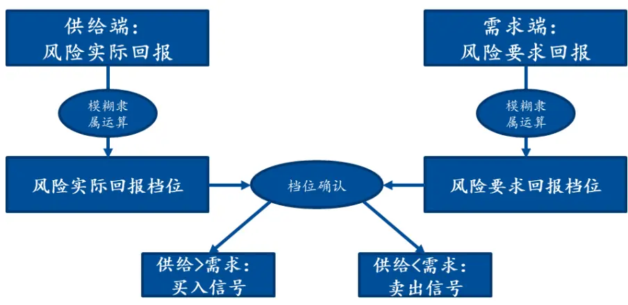
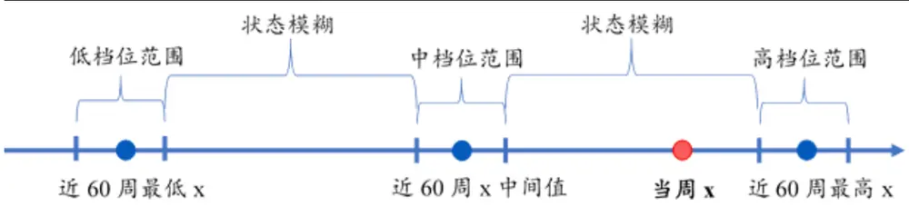
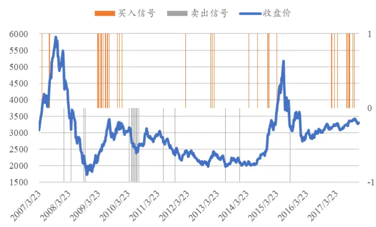
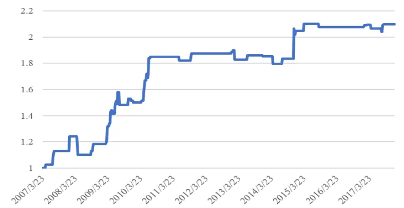
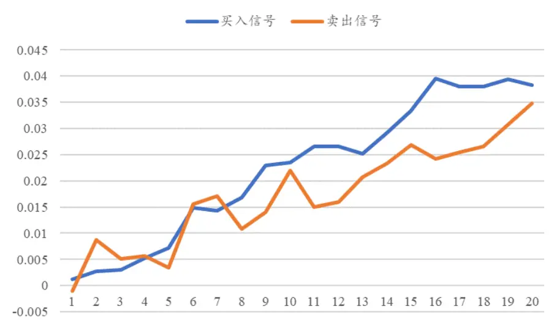
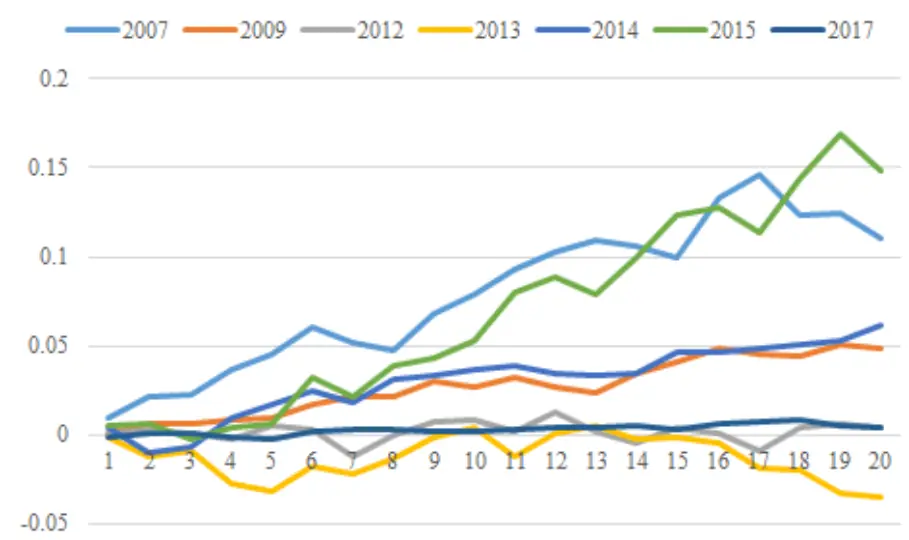
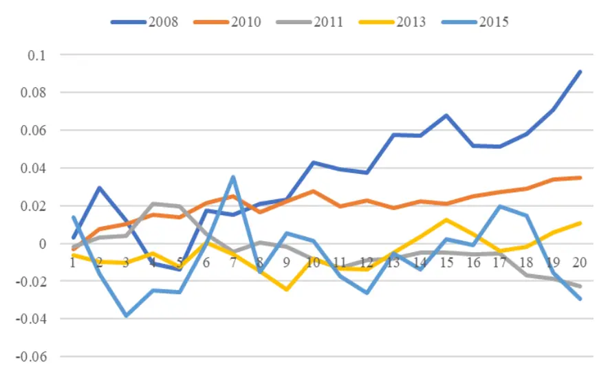

# 基于风险供求模糊匹配的择时策略

# --数量化专题之一百二十一

玉陈奥林（分析师）

8 021-38674835

chenaolin@gtjas.com

证书编号 S0880516100001

## 本报告导读：

通过模糊隶属度模型衡量市场风险回报比在供给端和需求端的平衡状态，继而对未来资产走势进行预测

## 摘要：

le_Summary]本篇报告中，我们从供需变化的角度着手，以风险回报比为标的，通过刻画风险回报比在供给端和需求端的状态，预测后续价格走势。

本文通过数量化指标定义了市场风险回报比在供给端和需求端的代理变量。在此基础上，通过模糊隶属度模型衡量市场风险回报比在供给端和需求端的平衡状态，继而对未来资产走势进行预测，构建相应量化策略

- 长期来看，策略发出买入信号后 20个交易日，平均可获得 3.8%的绝对收益，胜率 74%，效果显著。此外，策略多头在多数年份表现皆较为稳定。

- 本文基于供需关系构建了择时框架，从而在逻辑层面上对以动量反转特征为基础的择时模型进行了有效补充。

- 在模型设计方面，通过模糊隶属度算法，一方面，统一了不同指标量纲不一致的问题。另一方面，有效的解决了策略信号的稳定性问题。

陈奥林：（分析师）

电话：021-38674835

邮箱：chenaolin@gtjas.com

证书编号：S0880516100001

## 李辰：（分析师）

电话：021-38677309

邮箱：lichen@gtjas.com

证书编号：S0880516050003

## 孟繁雪：（分析师）

电话：021-38675860

邮箱：mengfanxue@gtjas.com

证书编号：S0880517040005

## 蔡旻昊：（研究助理）

电话：021-38674743

邮箱：caiminhao@gtjas.com

证书编号：S0880117030051

## 李栩：（研究助理）

电话：021-38032690邮箱：lixu019018@gtjas.com证书编号：S0880117090067

## 杨能：（研究助理）

电话：021-38032685邮箱：yangneng@gtjas.com证书编号：S0880117080176

## 殷钦怡：（研究助理）

电话：021-38675855邮箱：yinqinyi@gtjas.com证书编号：S0880117060109

## 余剑峰：（研究助理）

电话：021-38676186

邮箱：yujianfeng@gtjas.com

证书编号：S0880118060039

## 黄皖璇：（研究助理）

电话：021-38677799

邮箱：huangwangxuan@gtjas.com

证书编号：S088011610008

## [Table_R相关报告

《上市公司业绩变脸中的业绩预告之谜》2018.10.22

《基于日内交易特征的选股策略》2018.10.18《基于宏观状态的风险预算和资产配置》2018.09.15

《基于财报期效应的基本面因子动态配置研究》2018.09.07

《基于风险模糊度的选股策略》2018.07.26

## 1. 引言

在经济学领域中，我们知道资产价格发生变化的直接原因是标的供给和需求的不平衡，从而导致均衡点发生移动。但从更深层次的原因思考，供需关系发生变化的本质原因是投资者预期发生变化。结合到投资中，主动投资者的大势研判思路多为基于当下逻辑演绎，对未来投资者预期变化方向进行预判。这一做法的好处在于，其决策时所依据的信息时效性较高，能够更加及时的对市场变化作出反应。但其对个人对市场理解层面要求较高，甚至在一定程度上升到个人艺术的层面。既然把握预期难度较大，我们需要回头重新审视整个有效市场的过程，尝试寻找其中较为容易突破的部分。

信息到预期再到价格的转化过程就是有效市场，其是一个动态过程，而非一个静止的状态。在这个过程中，供需不平衡所推动均衡点发生的移动并非瞬时完成的。因此，如果能够通过量化的方法刻画供需之间的状态，那我们就可以知道后续标的运动的方向。

本篇报告中，我们从供需变化的角度着手，以风险回报比为标的，通过刻画风险回报比在供给端和需求端的状态，预测后续价格走势：风险回报供过于求，即市场为风险提供的实际回报高于投资者的要求回报时，资产受追捧，未来价格会上升，同理风险回报供小于求时资产不受追捧，未来价格会下降。

本篇报告第二章重点关注两个问题：如何将风险回报比在供给端和需求端的具体指标进行落地，以及如何解决不同指标量纲不一致的问题。第三章探究了供求不匹配后标的资产的市场表现，并构建了基于风险供求模糊匹配的择时策略。

## 2. 风险供求模糊匹配模型

从本文的研究背景已知，我们希望通过刻画市场风险回报比在供给端和需求端的匹配程度，从而对后续走势进行预测。然而，在理论到实践的过程中，需要解决几个核心问题。首先，如何选择适当的量化指标来作为风险回报比的代理变量。其次，我们需要构建合适的模型，将投资逻辑转换为策略信号。具体来说有两个核心点，第一个是指标量纲的问题。由于不同指标的量纲通常有较为显著的区别，从而无法直接对其进行对比。其次，量化策略从实际投资操作的角度来说，对于换仓频率和信号的稳定性有较高的要求。如果是两个指标数值高低的比较，很可能会导致多空信号频繁切换的情况。因此，我们希望保证模型信号整体的稳定性，从而更好的贴近实际投资操作。

接下来，我们要具体思考什么指标能够较好的反映市场所能提供的风险回报比。从指标的直观感受出发，本文以Sharp_ratio 代表当期市场为资产风险提供的实际回报。顾名思义，其较为直观的体现了单位风险所对应的收益回报。对于需求端，本文通过对 DDM 模型进行反推，以其中的风险溢价率ERP 代表投资者对于资产风险的要求回报。

## 2.1. 风险供求

## 2.1.1. 供给端

周夏普比代表当周市场为单位资 $\cdot 产$ 风险提供的实际回报，是风险回报的供给端：

$$
Sharp\;_{-}\;ratio\;=\;\frac{E\left(R\;\right)}{\sigma_{_{R}}}.
$$

其中 $E\left(R\right)$ 为当周上证综指日收益率的均值， 为当周上证综指日收益 $\sigma_{{R}}$ 率的标准差。

## 2.1.2. 需求端

风险溢价率ERP 为投资者对于资产风险的要求回报，是风险回报的需求端。ERP 可通过DDM模型求得：将资产要求回报率 R拆分为无风险收益率Rf和ERP，以盈利E代替股息D，得到 ERP 如下所示：

$$
P_{_0}=\frac{D_{_1}}{R-g}=\frac{D_{_1}}{R_{_f}+ERP-g}
$$

$$
ERP=\frac{D_{_{_{1}}}}{P_{_{0}}}+g-R_{_{f}},
$$

$$
\approx\frac{1}{PE}+g-R_{_{f}}
$$

其中 $\frac{1}{PE}$ 为上证综指日 PE(ttm)的倒数，g 为滞后一季的 GDP 季度增长率，每季度第一个季月的最后一天更新， $R_{\mathrm{~}_{f}}$ 为当日十年期国债日到期收益率。以当周日ERP 的均值作为当周的ERP。

## 2.2. 模型框架

如上所述，我们在得到风险回报比在供给端和需求端的代理指标之后，对比其平衡状态，如若不平衡，则证券价格会发生相应的变化。在实践过程中，我们需要对指标的量纲以及模型信号的稳定性进行控制。具体如图1所示，我们通过模糊隶属度算法，将任意一个时间序列指标转化为一个档位（分为高/中/低三档）。这样，我们就可以将原有数值上的比较转换为档位的比较，从而解决指标量纲的问题，同时模型稳定性也会显著提升。具体来看，通过模糊隶属运算划定当周 Sharp_ratio 与 ERP所处档位（高/中/低档），比较 Sharp_ratio 与 ERP 档位高低，若 Sharp_ratio档位 > ERP 档位，说明市场为风险提供的实际回报高于投资者的要求回报，风险回报供过于求，资产受追捧，未来价格会上升； Sharp_ratio档位 < ERP 档位，说明市场为风险提供的实际回报低于投资者的要求回报，风险回报供小于求，资产不受追捧，未来价格会下降。

图 1 模型框架

数据来源：国泰君安证券研究

## 2.3.模糊隶属度算法细节

模糊隶属度算法是一种数值转换的算法，其能够通过对比某期数值相对于其历史时间序列取值范围，刻画当前指标值相对高低的一种程度。具体来看，本文通过模糊隶属模型将当下周度 Sharp_ratio 和 ERP 的取值转化为相应档位，从而进行比较。

从算法形式来看，模糊隶属模型输入变量为最近 60 周 x 的时间序列以及当周x 的值（本文中 x为 ERP 和sharpratio）。模型输出结果为当周x

对应的档位以及隶属度 ,tx v 。其中，档位分别为高、中、低三档，而隶

属度反映当周 x 隶属某个档位的“程度”。 ,tx v 值域[0,1]，越接近 1 则属于该档的“程度”越大。

从算法细节来说，模型首先对输入的x 时间序列排序，并定义低、中、高三个区域。其中，每个区域有一个中心点，距离该区域中心点越近，则属于该区域的隶属度则越高。具体来看，首先模型会计算 x当前值相

对于其历史序列在低/中/高各档位上的中心点 vw 的距离（近 60 周 x 的最小/中间/最大值）：

$$
w_{_{\nu}}=\nu\Delta+\mathrm{~m~in}(x)\qquad\nu=0\mathrm{~,~}1\mathrm{~,~}
$$

$$
\Delta\;=\;\frac{\mathrm{max}\left(x\right)-\mathrm{min}\left(x\right)}{2}
$$

其中，档位数v取 0/1/2，对应低/中/高档位。

第二步，模型将当周 x 值与各档中心点的距离转换为各档隶属度 $\mu_{{x}_{t},\nu}$ 当周x值越接近各档中心点，则x 属于该档的“程度”越高，该档隶属度 $\mu_{{}_{x_{{}_{t}},{}_{v_{{}_{t}}}}}$ 越接近于 1。隶属度有内定阈值（通常 0.9），若当周x值与某档位中心点足够接近，使得存在 $\mu_{_{\tiny{~x_{_t},\nu~}}}>$ 阈值，则认为当周x属于 v档位，否则认为x状态模糊，不属于任何档位。

$$
\mu_{_{x_{_t},v}}=\exp\left(\frac{-(x_{_t}-w_{_v})^{^2}}{2\sigma^{^2}}\right)
$$

$$
\sigma\;=\;{\frac{\Delta}{q}}
$$

其中，q为决定钟形隶属函数形状的常数，取2.35。

图 2 算法举例

数据来源：国泰君安证券研究

特别需要指出的是,隶属度阈值取值不宜过低。高阈值意味着较小的档位范围，保证各档位范围无交叉，使 x只属于一个档位；此外，阈值从严设置也可以提高判定精度，这种情况下预测出的供求不匹配程度更强，未来资产价格发生相应变化的概率也更高。

若当周 Sharp_ratio 和 ERP 均有档位，则将二者档位进行比较。若Sharp_ratio档位 > ERP 档位，说明风险回报供过于求，资产受追捧，未来价格会上升；若 Sharp_ratio 档位 < ERP 档位，说明风险回报供小于求，资产不受追捧，未来价格会下降。

## 3. 风险供求模糊匹配择时策略表现

## 3.1.供求不匹配后的市场

我们取档位隶属度阈值为 0.9，在有显著档位隶属的前提下，当Sharp_ratio 档位 > ERP 档位时在当周最后一个交易日发出买入信号，Sharp_ratio 档位 < ERP 档位时发出卖出信号，我们期望后续市场价格向供求平衡点进行移动。由下图可以直观的看出，策略信号能够对上证综指后续走势起到显著的预测作用。

图 3 上证综指收盘价与信号

数据来源：国泰君安证券研究

为了更好的贴近实际投资操作，我们根据市场风险供求关系构建了CTA策略。具体来说，当市场供给端显著小于需求端时，则买入上证综指。结果如图5所示，策略在过去 10年的时间里可以获得稳定的绝对收益。但是，我们在研究中发现，当策略依据供求不平衡发出信号后，市场价格在再平衡的过程中会产生较强的惯性，使得价格在弱平衡状态下仍沿此前方向进行运动,这导致我们很难通过供求匹配显著程度来确定最优平仓时点。因此,本文将采用事件研究的方法，构建基于风险供求模糊匹配的事件驱动策略，时间窗口为20个交易日。

图 4CTA策略累积净值

数据来源：国泰君安证券研究

## 3.2.事件驱动策略表现

策略标的：上证综指

数据区间：2006.01.01 – 2017.12.31（从第 60 周开始，因此实际回测时间为 2007.03.19 - 2017.12.31）

手续费用：双边千三

建仓成本：当日均价

开仓条件：以不匹配当周最后一个交易日为事件发生日，若 Sharp_ratio档位 > ERP 档位则买入并持有 20 交易日，Sharp_ratio 档位 < ERP 档位则卖出并持有20 交易日

从图 6 可以看出，当市场供需显著不匹配后，市场在 20 个交易日内有较为明显的上涨\下跌特征。具体来说，策略多头胜率 74%，平均收益率约3.8%。相比之下，空头胜率略有下降，为61%，平均收益率约3.5%。

图 5 事件发生后20日累计收益率

数据来源：国泰君安证券研究

表 1：回测结果

|  | 买入信号 卖出信号 |
| --- | --- |
| 收益率 3.82% | 3.49% |
| 胜率 | 74.36% 61.11% |
| 开仓次数 39 | 18 |

数据来源：国泰君安证券研究

分年度来看，策略多头端在绝大多数年份都比较有效，最高在 2015 年可以获得 15%的绝对收益。由于 2015 年上半年是比较强的趋势市，可以看出，一定程度上，策略收益受市场本身走势强度影响。

图 6 买入信号分年度累计收益率

数据来源：国泰君安证券研究

表 2: 买入信号分年度回测结果

|  | 2007 | 2009 | 2012 | 2013 | 2014 | 2015 | 2017 |
| --- | --- | --- | --- | --- | --- | --- | --- |
| 收益率 | 10.98% | 4.90% | 0.37% | -3.55% | 6.16% | 14.80% | 0.43% |
| 胜率 | 100.00% | 80.00% | 50.00% | 0.00% | 80.00% | 100.00% | 72.73% |
| 开仓次数 | 3 | 15 | 2 | 2 | 5 | 1 | 11 |

数据来源：国泰君安证券研究

从策略空头端来看，策略整体效果略差于多头端。但是，其仍够能够在多数年份取得较好的效果。具体来看，策略能够较好的在 2008年和2010年规避市场下行风险。

图 7 卖出信号分年度累计收益率

数据来源：国泰君安证券研究

表 3: 卖出信号分年度回测结果

|  | 2008 | 2010 | 2011 | 2013 | 2015 |
| --- | --- | --- | --- | --- | --- |
| 收益率 | 9.12% | 3.49% | -2.25% | 1.05% | -2.94% |
| 胜率 | 75.00% | 77.78% | 0.00% | 50.00% | 0.00% |
| 开仓次数 | 4 | 9 | 2 | 2 | 1 |

数据来源：国泰君安证券研究

此外，本文对参数敏感度进行了测试，选取了多个不同阈值，测试其所发出信号的收益率与胜率。从表4 可以看出，随着阈值降低，供求不匹配的显著程度降低，策略预测有效性下降，继而收益率与胜率也随之降低。

表 4：其他阈值下的买入信号回测结果

| 0.8 | 0.7 | 0.6 | 0.5 |
| --- | --- | --- | --- |
| 收益率 | 3.32% 2.30% | 1.51% | 1.39% |
| 胜率 | 71.19% 68.35% | 63.72% | 63.69% |
| 开仓次数 | 59 | 113 | 157 |

数据来源：国泰君安证券研究

表 5：其他阈值下的卖出信号回测结果

| 0.8 | 0.7 | 0.6 | 0.5 |
| --- | --- | --- | --- |
| 收益率 1.45% | 0.88% | 0.09% | -0.24% |
| 胜率 53.33% | 52.17% | 49.09% | 46.15% |
| 开仓次数 | 45 69 | 110 | 169 |

数据来源：国泰君安证券研究

## 4. 总结与展望

本文给出了一个基于风险回报供求平衡关系的择时策略。首先，本文通过数量化指标定义了市场风险回报比在供给端和需求端的代理变量。在此基础上，通过模糊隶属度模型衡量市场风险回报比在供给端和需求端的平衡状态，继而对未来资产走势进行预测，构建相应量化策略。长期来看，策略发出买入信号后 20个交易日，平均可获得 3.8%的绝对收益，胜率74%，效果显著。

但是，单纯的将策略逻辑转化为数学信号并加以刻画略显生硬。未来，我们将尝试盘活策略，逐步将市场在风险回报的供求关系与实际投资体系相结合，从而更加灵活准确的对市场未来走势进行判断。

## 本公司具有中国证监会核准的证券投资咨询业务资格

## 分析师声明

作者具有中国证券业协会授予的证券投资咨询执业资格或相当的专业胜任能力，保证报告所采用的数据均来自合规渠道，分析逻辑基于作者的职业理解，本报告清晰准确地反映了作者的研究观点，力求独立、客观和公正，结论不受任何第三方的授意或影响，特此声明。

## 免责声明

本报告仅供国泰君安证券股份有限公司（以下简称“本公司”）的客户使用。本公司不会因接收人收到本报告而视其为本公司的当然客户。本报告仅在相关法律许可的情况下发放，并仅为提供信息而发放，概不构成任何广告。

本报告的信息来源于已公开的资料，本公司对该等信息的准确性、完整性或可靠性不作任何保证。本报告所载的资料、意见及推测仅反映本公司于发布本报告当日的判断，本报告所指的证券或投资标的的价格、价值及投资收入可升可跌。过往表现不应作为日后的表现依据。在不同时期，本公司可发出与本报告所载资料、意见及推测不一致的报告。本公司不保证本报告所含信息保持在最新状态。同时，本公司对本报告所含信息可在不发出通知的情形下做出修改，投资者应当自行关注相应的更新或修改。

本报告中所指的投资及服务可能不适合个别客户，不构成客户私人咨询建议。在任何情况下，本报告中的信息或所表述的意见均不构成对任何人的投资建议。在任何情况下，本公司、本公司员工或者关联机构不承诺投资者一定获利，不与投资者分享投资收益，也不对任何人因使用本报告中的任何内容所引致的任何损失负任何责任。投资者务必注意，其据此做出的任何投资决策与本公司、本公司员工或者关联机构无关。

本公司利用信息隔离墙控制内部一个或多个领域、部门或关联机构之间的信息流动。因此，投资者应注意，在法律许可的情况下，本公司及其所属关联机构可能会持有报告中提到的公司所发行的证券或期权并进行证券或期权交易，也可能为这些公司提供或者争取提供投资银行、财务顾问或者金融产品等相关服务。在法律许可的情况下，本公司的员工可能担任本报告所提到的公司的董事。

市场有风险，投资需谨慎。投资者不应将本报告作为作出投资决策的唯一参考因素，亦不应认为本报告可以取代自己的判断。
在决定投资前，如有需要，投资者务必向专业人士咨询并谨慎决策。

本报告版权仅为本公司所有，未经书面许可，任何机构和个人不得以任何形式翻版、复制、发表或引用。如征得本公司同意进行引用、刊发的，需在允许的范围内使用，并注明出处为“国泰君安证券研究”，且不得对本报告进行任何有悖原意的引用、删节和修改。

若本公司以外的其他机构（以下简称“该机构”）发送本报告，则由该机构独自为此发送行为负责。通过此途径获得本报告的投资者应自行联系该机构以要求获悉更详细信息或进而交易本报告中提及的证券。本报告不构成本公司向该机构之客户提供的投资建议，本公司、本公司员工或者关联机构亦不为该机构之客户因使用本报告或报告所载内容引起的任何损失承担任何责任。

## 评级说明

## 1.投资建议的比较标准

投资评级分为股票评级和行业评级。

以报告发布后的12个月内的市场表现为比较标准，报告发布日后的 12个月内的公司股价（或行业指数）的涨跌幅相对同期的沪深 300 指数涨跌幅为基准。

## 2.投资建议的评级标准

报告发布日后的 12 个月内的公司股价（或行业指数）的涨跌幅相对同期的沪深 300 指数的涨跌幅。

|  | 评级 说明 |  |
| --- | --- | --- |
| 股票投资评级 | 增持 | 相对沪深 300指数涨幅15%以上 |
|  | 谨慎增持 | 相对沪深300指数涨幅介于5%～15%之间 |
|  | 中性 | 相对沪深 300指数涨幅介于-5%～5% |
|  | 减持 | 相对沪深300指数下跌 5%以上 |
| 行业投资评级 | 增持 | 明显强于沪深300 指数 |
|  | 中性 | 基本与沪深300指数持平 |
|  | 减持 | 明显弱于沪深300指数 |

## 国泰君安证券研究所

|  | 上海 | 深圳 | 北京 |
| --- | --- | --- | --- |
| 地址 | 上海市浦东新区银城中路168号上海 银行大厦29层 | 深圳市福田区益田路 6009号新世界 商务中心34层 | 北京市西城区金融大街 28 号盈泰中 心2号楼10层 |
| 邮编 | 200120 | 518026 | 100140 |
| 电话 | （021)38676666 | (0755)23976888 | (010)59312799 |
|  | E-mail: gtjaresearch@gtjas.com |  |  |