# 上市公司核心竞争力投资策略

## --数量化专题之一百二十一

玉陈奥林（分析师）

8 021-38674835

chenaolin@gtjas.com

证书编号 S0880516100001

## 本报告导读：

本篇报告从技术竞争力、产品竞争力、内控竞争力和持续发展性 4个维度度量企业核心竞争力并合成了竞争力评价因子。

## 摘要：

le_Summary]四个维度认知企业核心竞争力：学术研究对于核心竞争力内涵的理解可概括为技术竞争力、产品竞争力、内控竞争力和持续发展性 4个维度。技术竞争力是决定企业核心竞争力的形成的基础因素，产品竞争力是企业核心竞争力的直接体现，内控竞争力强化企业在技术和产品方面的竞争优势，持续发展性揭示企业保有并提升现有竞争力的能力。

多指标合成竞争力评价因子：选取四个维度下可量化的指标合成竞争力评价因子。经行业和风格调整后的因子与传统风格因子相关性较低，保持了因子的独立性。预测能力方面，因子月度 IC 为1.59%，ICIR 为 1.40，具有一定的预测能力，同时在 10 年~13 年以及 17 年至今的低风险偏好环境中有更好的表现，IC 可以达到 2.95%，ICIR则为 2.87。

竞争力评价因子策略构建：沪深300内TOP组合年化超额收益6.10%，最大回撤 7.22%，月胜率 66%；中证 500 内 TOP 组合年化超额收益5.63%，最大回撤9.33%，月胜率 63%。长期慢熊环境中投资者倾向于抱团安全性高的股票，而核心竞争力为企业提供了安全边际，因此在这种环境下策略效果提升。

竞争力评价因子收益来源：通过探究企业当期的竞争力是否在下期落地为基本面指标的改善，发现竞争力评价因子能有效选出下期成长性较强的公司，即因子 alpha 收益反映的是企业未来真正的竞争优势。

竞争力评价因子收益持续性：竞争力评价因子在中短期内收益持续性较好，在中长期出现一定回撤，而在进入年报发布区间后收益回升，同时年报后和半年报后持仓期 alpha收益要高于三季报后持仓期。

竞争力评价因子行业适用性：通过分行业计算多空组合收益，发现因子适用性强的行业多为制造业下游产业或技术密集型产业，基于以上行业的增强策略年化收益 9.98%，最大回撤10.37%，月胜率63%。

陈奥林：（分析师）

电话：021-38674835

邮箱：chenaolin@gtjas.com

证书编号：S0880516100001

## 李辰：（分析师）

电话：021-38677309

邮箱：lichen@gtjas.com

证书编号：S0880516050003

## 孟繁雪：（分析师）

电话：021-38675860

邮箱：mengfanxue@gtjas.com

证书编号：S0880517040005

## 蔡旻昊：（研究助理）

电话：021-38674743

邮箱：caiminhao@gtjas.com

证书编号：S0880117030051

## 李栩：（研究助理）

电话：021-38032690

邮箱：lixu019018@gtjas.com

证书编号：S0880117090067

## 杨能：（研究助理）

电话：021-38032685邮箱：yangneng@gtjas.com证书编号：S0880117080176

## 殷钦怡：（研究助理）

电话：021-38675855邮箱：yinqinyi@gtjas.com证书编号：S0880117060109

## 余剑峰：（研究助理）

电话：021-38676186

邮箱：yujianfeng@gtjas.com

证书编号：S0880118060039

## 黄皖璇：（研究助理）

电话：021-38677799

邮箱：huangwangxuan@gtjas.com

证书编号：S088011610008

## [Table_R相关报告

《基于 PLS 方法的潜变量因子研究》2018.11.13

《基于风险供求模糊匹配的择时策略》2018.11.10

《上市公司业绩变脸中的业绩预告之谜》2018.10.22

《基于日内交易特征的选股策略》2018.10.18《基于宏观状态的风险预算和资产配置》2018.09.15

## 1. 引言

企业核心竞争力是一个较为模糊的概念，不同学者可以有不同的概念界定与评价方式。关于“核心竞争力”一词的表述,学术界最早由 Prahalad和 Hamel于 1900年提出,即核心竞争力是“由知识和技术内部整合形成的企业开发独特产品、发展独特技术和发明独特营销手段的能力,其实质是谁能比竞争对手以更低的成本、更快的速度去发展企业自身强大竞争力的核心能力”。

在经济全球化的背景下，上市公司的市场竞争环境日益激烈。对于企业来说，成功不再归功于一时偶然的新产品和新服务或随机应变的市场战略，而是更加取决于自身所具备的内在竞争能力，要想在当前市场竞争中保持持续竞争优势，培育和提升企业核心竞争力变得尤为重要。而对于投资者来说，随着 A股入摩后市场对价值投资理念的愈发重视，有效挖掘具有核心竞争力的上市公司，伴随其一同成长并分享成长带来的收益是战胜市场的重要条件。

基于以上考虑，本篇报告从企业的核心竞争力入手，综合学界对核心竞争力内涵的界定，利用可量化的评价指标设计了企业核心竞争力的评价体系，构建企业竞争力评价因子并检验其对未来股票收益率的预测能力，最后构建了基于竞争力评价因子的相关投资策略，并深入分析了因子的收益来源、收益持续性以及行业适用性。

## 2. 企业核心竞争力评价体系

## 2.1.核心竞争力认知维度

从学界已有研究来看，对于核心竞争力的内涵定义与评价指标不一而足。但综合来看可以分为4个维度，即企业的技术竞争力、产品竞争力、内控竞争力、持续发展性。

表 1: 国内外学者对于核心竞争力的主要观点

| 学者 | 主要观点 | 观点概括 | 认知维度 |
| --- | --- | --- | --- |
| Prahalad & Hamel | 核心竞争力是由知识和技术内部整合形成的企业开发独特产品、 发展独特技术和发明独特营销手段的能力 | 知识和技术 内部整合 | 技术竞争力 内控竞争力 |
| Stalk & Evans & Shulman | 核心竞争力强调了企业价值增值过程中某一特殊的技术与技能 | 价值增值 技术与技能 | 持续发展性 技术竞争力 |
| Prahalad | 核心竞争力是企业形成的有关客户的知识、与客户的良好关系以及由 此构成的创造性的和谐整体 | 客户关系 营销环境 | 产品竞争力 |
| Ga1lon | 核心竞争力反映公司职能部门的基础能力、SBU的关键能力和公司层 次的和谐能力 | 部门能力 公司战略 公司和谐 | 内控竞争力 |
| Barton | 核心竞争力是企业所拥有的能够为企业带来竞争优势的专有知识和信 息，是企业特有的、不易交易且提供竞争优势的知识体系 | 专有知识 | 技术竞争力 |
| Raffa & Zollo | 核心竞争力不仅存在于业务的运作系统中，而且存在于企业的文化系 统中，是企业员工深刻理解企业文化并在其指导下行动的结果 | 企业文化 | 内控竞争力 |
| Bogner & Thomas | 核心竞争力是企业的专有技能以及能够更好地指导企业实现比竞争对 手更高的顾客满意的认知 | 专有技能 顾客满意度 | 技术竞争力 产品竞争力 |
| Coulter | 核心竞争力是组织中主要创造价值并被多个产品或多种业务共享的能 力与优势 | 价值创造 产品收益 | 持续发展性 产品竞争力 |
| Helleoid & Simonin | 核心竞争力是企业独特的人力资源、物质资源和协调能力的组合 | 人力资源 物质资源 | 内控竞争力 |
| 丁开盛、梁雄健 | 核心竞争力以企业的核心技术为基础，通过企业的战略决策、生产制 造、市场营销、内部组织协调管理交互作用而获得使企业保持持续发 | 协调能力 核心技术 市场营销 | 技术竞争力 产品竞争力 |
| 芮明杰、陈晓静、 | 展的能力 核心竞争力是是能够给公司带来竞争优势的知识体系，包括公司的技 | 内部管理 持续发展 技术性知识 | 内控竞争力 持续发展性 |
| 王国荣 | 术性知识、管理性知识、制度性知识、个人知识和企业知识等 | 管理性知识 | 技术竞争力 内控竞争力 |

数据来源：Google Scholar, 国泰君安证券研究。

技术竞争力：反映企业所拥有的持续保持和增强其核心技术的能力，即技术创新能力。科技高速发展的当今，企业的竞争优势在很大程度上取决于技术上的优势，企业所拥有的核心技术是获得核心竞争力的必要条件。拥有先进的核心技术并保持技术变革会促使企业通过改变产品的相对成本地位，以及通过产品的异质化而使企业获得超越可比公司的高收益。由此可见，企业的核心技术优势对企业生产要素的加工过程、相对成本及最终产品的效能等产生了直接影响，是决定企业核心竞争力的形成的基础因素。技术竞争力是企业核心竞争力的“生成器”。

产品竞争力：反映企业最终产品为客户带来的可感知价值以及相对可比公司的市场占领能力和成本控制能力。产品是企业在行业竞争中的武器，产品竞争力是决定企业能否在行业竞争中胜出的直接因素。拥有具有竞争力的产品能够帮助企业在在提高经营效率、降低成本和提高市场占有率等方面优于竞争对手，使企业更好地满足顾客需求，为客户带来利益和价值，从而使资本在不断的运转中为企业自身带来新的经济效益，创造更多的价值，拥有具备竞争力的产品是企业核心竞争力的直接体现。产品竞争力是企业核心竞争力的“显示器”。

内控竞争力：反映企业在公司治理、内部协调方面的效率以及对可支配资源进行优化和整合的能力。企业内部知识、资源、人才和技术等多方面因素高效整合所形成的有机整体可以强化企业的核心竞争力，其强化能力不仅取决于企业的技术因素，而且与企业的管理能力、组织环境包括企业文化密切相关。稳定的核心竞争力不仅强调企业拥有专有的资源、先进的技术和优质的产品，更强调企业在协调这些重要因素方面表现出的整合能力和有效的管理能力。内控竞争力是企业核心竞争力的“催化器”。

持续发展性：反应企业保持当前发展趋势并在未来继续提升企业价值的能力。核心竞争力的提升与企业价值的提升是相互促进的关系，企业价值与股东权益息息相关，拥有较强持续发展性的公司可以持续为股东带来经济利益并形成虹吸效应，从而在未来继续保持当前的核心竞争力水平，维持企业长期的竞争优势。反过来，核心竞争力的提升有助于公司保持当前发展势头并在未来继续提升企业价值。持续发展性是企业核心竞争力的“推进器”。

图 1核心竞争力四个维度
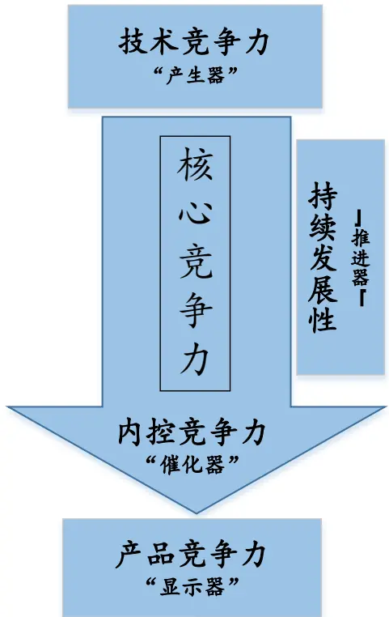
数据来源：国泰君安证券研究

根据以上对企业核心竞争力内涵的分析，围绕整合形成的 4 个维度，本文认为企业核心竞争力可以概括为：以企业拥有的知识与技术为基础，通过高效的内控系统和管理能力对各种资源进行合理的组织协调形成具备竞争优势的产品与服务，以此使企业实现持续发展与价值增值的内部能力。

## 2.2.核心竞争力评价指标

上一节我们从技术竞争力、产品竞争力、内控竞争力和持续发展性四个维度对企业核心竞争力的内涵进行了分析。下面本文尝试寻找各维度下可量化的财务指标来对企业核心竞争力进行评价，为构建企业核心竞争力评价因子做准备。

技术竞争力：聚焦核心技术与人才引进。①技术优势对企业生产要素的加工过程、相对成本及最终产品的效能等产生了直接影响，本文使用研发投入和专利情况等指标作为技术优势的代理变量。②知识经济使知识性人才成为企业愈来愈重要的资源，引进高质量人才是企业提升技术竞争力的基本保证，本文使用科研人员增量和人力投入回报率等指标作为人才引进的代理变量。

产品竞争力：聚焦市场格局与产品优势。①市场格局反映市场竞争程度，是影响产品竞争力的外部环境条件，本文使用同行业公司数量和市场占有率等指标作为市场格局的代理变量。②企业的最终产品或服务是企业创造价值的源泉，具有高品质和成本优势的产品才能满足市场及客户需求并为消费者和企业创造价值，本文使用企业营收水平、产品毛利水平等指标作为产品优势的代理变量。

内控竞争力：聚焦决策效率与薪酬激励。①企业的决策效率影响企业对内部知识、资源、人才和技术等多方面因素的的整合能力，较高的股权集中度意味着大股东拥有较强的权力，使得大股东与管理层之间的代理成本较低，提升决策效率，因此本文使用高管持股数量占比和前十大股东持股数量占比等指标作为企业决策效率的代理变量。②有吸引力的薪酬与激励体系有助于提升员工工作效率、保有并扩充当前人才团队，本文使用应付职工薪酬率和股权激励情况作为薪酬激励的代理变量。

持续发展性：聚焦公司价值与发展能力。①企业价值与股东权益息息相关，价值持续提升的公司可以为股东带来经济利益并形成虹吸效应，从而在未来继续保持当前的核心竞争力水平，维持企业长期的竞争优势，本文使用EVA变化情况和人均EVA 等指标作为企业价值的代理变量。②公司过往较高的发展能力侧面揭示了公司良好的发展逻辑，相对而言在未来更具有持续发展性，本文使用近 3年营收增长率和净利润增长率等指标作为发展能力的代理变量。

图 2核心竞争力评价指标框架
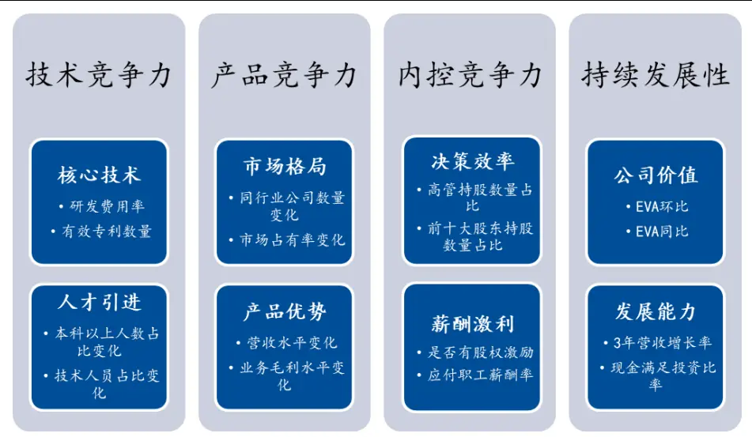
数据来源：国泰君安证券研究

表 2: 核心竞争力评价指标一览

| 维度 | 指标 | 计算方式 | 发布频率 |
| --- | --- | --- | --- |
| 技术竞争力 | 研发费用率 | 研发费用/营业收入 | 半年 |
|  | 有效专利数量 | 有效专利数量 | 年 |
|  | 专利平均年限 | Σ(有效专利剩余有效时间)/有效专利数量 | 年 |
|  | 本科以上人数占比变化 | △(本科以上人数/员工数量) | 年 |
|  | 技术人员占比变化 | Δ(技术人员数量/员工数量) | 年 |
|  | 人力投入回报率变化 | △(归母净利润/员工工资) | 季 |
| 产品竞争力 | 市场竞争度变化（负向） | △所属三级行业上市公司数量 | 季 |
|  | 市场占有率变化 | Δ(主营业务收入/相同主营业务公司收入之和) | 半年 |
|  | 业务毛利水平变化 | △(主营业务毛利率-相同主营业务公司数据中位数) | 半年 |
|  | 产品毛利水平变化 | △(主营产品毛利率-相同主营业务公司数据中位数) | 半年 |
|  | 营收水平变化 | Δ(营业收入/所属三级行业公司营业收入中位数) | 季 |
| 内控竞争力 | 高管持股数量占比 | 高管持股数量/总股本 | 半年 |
|  | 前十大股东持股数量占比 | 前十大股东持股数量/总股本 | 半年 |
|  | 管理人员占比 | 管理人员数量/员工数量 | 半年 |
|  | 是否有股权激励 | 报告期内发布过股权激励计划=1，否则=0 | 季 |
|  | 是否有高管激励 | 报告期内有针对高管的单独激励计划=1，否则=0 | 季 |
|  | 应付职工薪酬率 | 应付职工薪酬/营业收入 | 季 |
|  | 财报审计意见 | 财报审计结果为“标准无保留意见”=1，否则=0 | 年 |
|  | 内控审计意见 | 内控审计结果为“标准无保留意见”=1，否则=0 | 年 |
| 持续发展性 | EVA 同比 | (税后净利润-资本成本)同比变化 | 季 |
|  | EVA 环比 | (税后净利润-资本成本)环比变化 | 季 |
|  | 人均 EVA | EVA/员工数量 | 季 |
|  | 资本保值增值率 | 所有者权益环比变化 | 季 |
|  | 3年营收增长率 | 近三年营业收入增长率(TTM) | 季 |
|  | 3年净利润增长率 | 近三年归母净利增长率(TTM) | 季 |
|  |  | CFO/(购建固定资产等支付的现金-存货的减少+分配股利等 | 半年 |
|  | 现金满足投资比率 | 支付的现金) |  |

数据来源：国泰君安证券研究。

## 3. 竞争力评价因子构建

在上一节中本文从技术竞争力、产品竞争力、内控竞争力和持续发展性四个维度构建了企业核心竞争力的评价体系，并筛选出了各维度下可量化的评价指标。接下来本文利用这些评价指标构建竞争力评价因子，具体过程包括：同频化与缺失值填充→标准化→异常值平滑→维度内加权→各维度加权。

Step 1 同频化与缺失值填充：考虑交易所规定财务报告的披露截至日期分别为4月 30 日、8月31日、10月 31日和次年4 月30 日，本文将数据更新日期选定为 4 月 30 日、8 月 31 日和 10 月 31 日，分别对应前一年年报数据、当年半年报数据和当年三季报数据。同时对于报告中未披露的数据（如三季报不披露研发费用），沿用上期数据来进行缺失值填充。

Step 2 标准化：对各评价指标（“是否有高管激励”等分类变量除外）

进行行业内“均值-标准差”标准化：

$$
X_{_{ik}}^{^{\mathrm{~*~}}}=\frac{X_{_{ik}}-avg\left(X_{_{k}}\right)}{std\left(X_{_{k}}\right)}.
$$

其中错误!不能通过编辑域代码创建对象。公司所属一级行业的指标均值，错误!不能通过编辑域代码创建对象。为相应标准差。

Step 3 异常值平滑：本文将标准化后绝对值大于 3 的值看作异常值，使用“极值塌缩”的方式进行异常值平滑，这种方式在不影响正常值大小的情况下进行，并可以保持异常值之间相对大小关系不变。

## 错误!不能通过编辑域代码创建对象。

算法逻辑比较直观，如果某指标最大（小）值大于3.5，则将所有大（小）于3的异常值同比例缩小，使得①正常值不受影响；②平滑后的异常值大于3小于 3.5；③ 异常值之间相对大小关系不变。

Step 4 维度内加权：每个评价维度下指标等权加总，得到 4 个评价维度指标。

Step 5 各维度加权：加权汇总 4 个评价维度指标，得到竞争力评价因子。本文在这里初步考虑使用等权加总方式，下文会讨论针对企业发展阶段动态调整权重的加权方式。

图 3竞争力评价因子构建过程
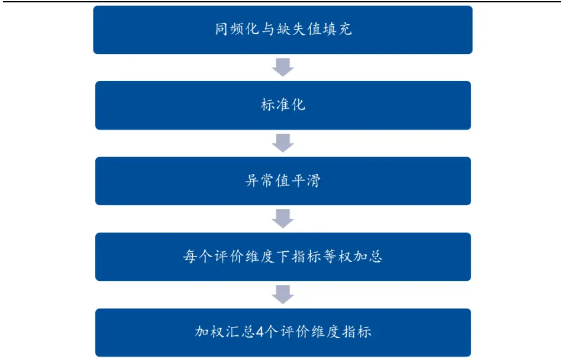
数据来源：国泰君安证券研究

## 4. 竞争力评价因子有效性检验

## 4.1.与风格因子相关性

竞争力评价因子从技术竞争力、产品竞争力、内控竞争力和持续发展性4个维度综合反映公司核心竞争力，从原始指标构成来看，其包含了“近三年营业收入增长率”等反映公司成长风格的指标，因此有必要计算竞争力评价因子与传统风格因子的相关性。本文计算了 2007 年至今每期末竞争力评价因子与风格因子的截面相关性，结果如下：

图 4竞争力评价因子与传统风格因子相关性
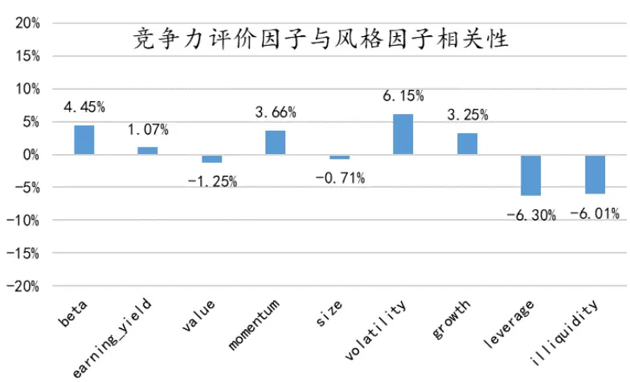
数据来源：国泰君安证券研究

从结果来看，竞争力评价因子与传统风格因子的相关性较低，均不足10%，可以认为因子独立性较强，提供了增量信息。相对而言，竞争力评价因子与 volatility、leverage 和 illiquidity 因子的相关性较强，为去除可能存在的相关性，本文对竞争力评价因子进行了行业中性和风格中性处理。

## 4.2.预测能力检验

本文通过以下方式对竞争力评价因子进行行业中性和风格中性，其中$ind_{_t}$ 为行业哑变量集合， $style_{_t}$ 为风格因子变量集合，残差项 X 即为中性化后因子值：

$$
X_{_{it}}=\beta_{_{ind}}\cdot ind_{_{it}}+\beta_{_{style}}\cdot style_{_{it}}+\varepsilon_{_{x}}
$$

在此基础上，本文计算中性化竞争力评价因子与经行业、传统风格因子调整后收益的相关系数来计算竞争力评价因子的 IC与ICIR：

$$
R_{_{it}}=\beta_{_{ind}}\cdot ind_{_{it}}+\beta_{_{style}}\cdot style_{_{it}}+\varepsilon_{_{R}}
$$

$$
IC=\operatorname{correl}\left(\varepsilon_{_X},\varepsilon_{_R}\right)
$$

$$
ICIR=\frac{a\nu g(IC)}{std(IC)}\times\sqrt{12}
$$

表 3：因子 IC 与 ICIR

| 指标 | 全样本 10~13年以及17年至今 |
| --- | --- |
| IC 1.59% | 2.95% |
| Std | 3.94 3.56 |
| ICIR | 1.40 2.87 |

数据来源：国泰君安证券研究

图 5 中性化竞争力评价因子月度 IC 序列
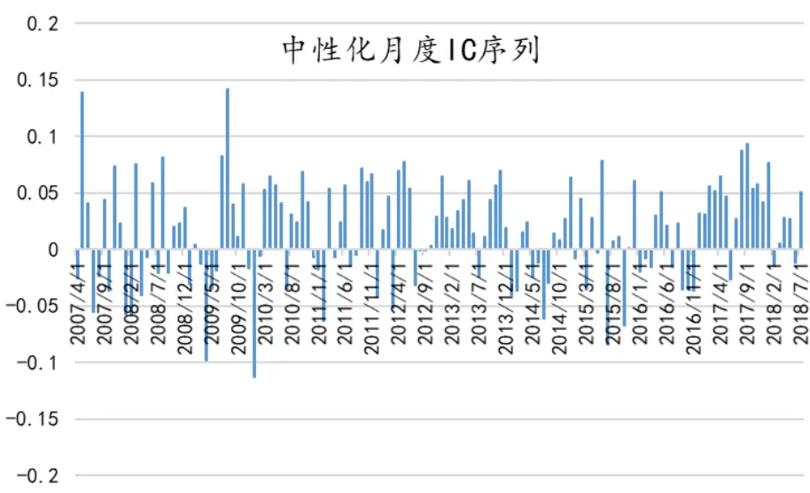
数据来源：国泰君安证券研究

中性化后的竞争力评价因子月度 IC 为 1.59%，ICIR 为 1.40，对下一期行业与传统风格因子调整后的收益具有较好的预测效果。具体来看，竞争力评价因子在长期慢熊环境中有更好的表现，如 10 年~13 年以及 17年至今，IC 可以达到 2.95%，ICIR 则为 2.87。究其原因，是因为慢熊环境中投资者倾向于抱团安全性高的股票，而核心竞争力为企业提供了安全边际，因此在这种环境下竞争力因子效果提升。

## 5. 基于竞争力评价因子的策略构建

## 5.1.基本选股策略

基于以上研究，本文利用竞争力评价因子构建简单选股策略并回测其选股效果。为实现组合行业中性，本文在构建组合时保持组合内行业比例与股票池行业比例相同；为实现组合市值中性，本文在构建组合时分别选取沪深300 成份股和中证 500成份股作为股票池并对冲其等权指数。策略具体构建方式为：

股票池：沪深300 成份股或中证500成份股

组合构建方式：选取股票池中各行业内竞争力评价因子最大的 20%股票作为行业中性TOP 组合，最小的 20%作为BOTTOM 组合。

换仓时间：每年4月底、8 月底和10 月底。

手续费：双边千三。

加权方式：等权。

对冲指数：300等权或 500 等权。

图 6沪深 300内选股净值走势
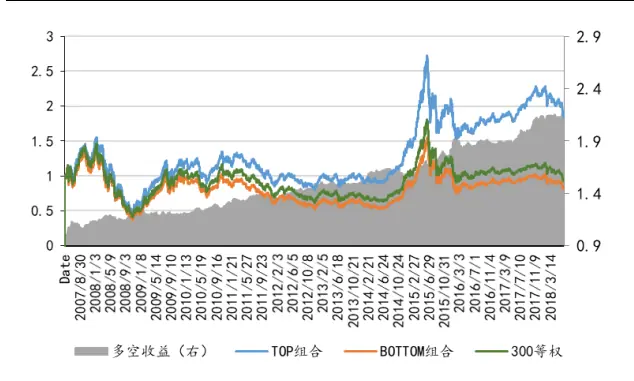
数据来源：国泰君安证券研究

图 7TOP对冲 300等权净值曲线
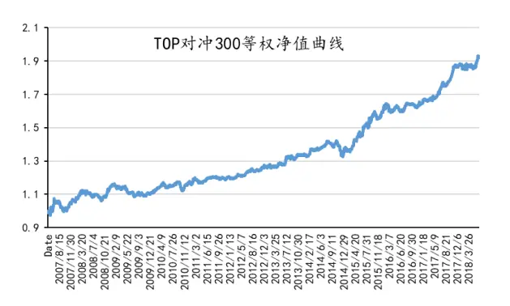
数据来源：国泰君安证券研究

图 8中证 500内选股净值走势
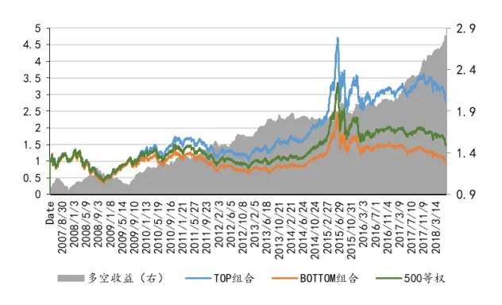
数据来源：国泰君安证券研究

图 9TOP对冲 500等权净值曲线
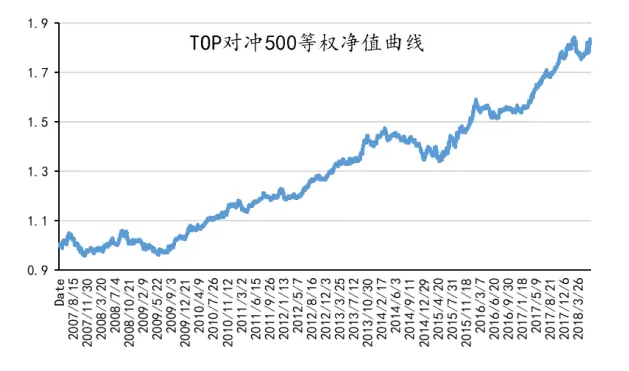
数据来源：国泰君安证券研究

表 4：沪深300及中证 500内选股绩效

| 指标 | 沪深300 |  | 中证500 |  |
| --- | --- | --- | --- | --- |
|  | 多空组合 | 对冲 300 等权 | 多空组合 | 对冲500 等权 |
| 年化收益 | 7.08% | 6.10% | 9.28% | 5.95% |
| 最大回撤 | 8.19% | 7.22% | 15.49% | 8.64% |
| 夏普比率 | 1.07 | 1.12 | 1.09 | 1.01 |
| 月胜率 | 61.94% | 65.67% | 66.41% | 63.43% |

数据来源：国泰君安证券研究

沪深300内TOP组合年化超额收益 6.10%，最大回撤 7.22%，月胜率66%；中证500内TOP组合年化超额收益5.63%，最大回撤9.33%，月胜率63%。作为单因子策略，竞争力评价因子的年化收益处于中等水平，但从胜率来看因子表现较为稳定。从净值曲线走势来看，09年中期~14年前期以及17年之后策略有较好表现，这与之前分析因子 IC 时的结论相同，即长期慢熊环境中投资者倾向于抱团安全性高的股票，而核心竞争力为企业提供了安全边际，因此在这种环境下策略效果提升。

## 5.2.收益来源分析

竞争力评价因子捕捉了企业当前在技术、产品、内控和发展方面的竞争优势，且可以获得较为明显 alpha收益。在此基础上，我们想要进一步研究以下两个问题：

①收益来源是什么：因子 alpha收益反映的是企业未来真正的竞争优势，还是只是基于当前时刻的竞争力预期？

②收益的持续性：如果反映的是企业未来真正的竞争优势，则因子的有效期限有多久？如果反映的是当前时刻的竞争力预期，则因子的调整速度有多快？

关于第一个问题，解决的核心在于企业当期的竞争力是否在下期落地为基本面指标的改善。具体方法为计算每期 TOP 组合和 BOTTOM组合在下一期基本面属性变化的差异。如果下一期两组合基本面属性有显著差异，则认为竞争力评价因子反映的是企业未来真正的竞争优势，否则因子只是基于当前时刻的竞争力预期进行定价。

关于基本面属性的选择，应能全面反映公司在收入水平、成本管理、盈利能力、盈余质量、现金流量等方面的改善，同时应尽可能体现因子的即时效果。处于以上考虑，本文使用营业收入单季同比、毛利率单季同比、净利润单季同比、ROE 单季同比、EPS单季同比和CFO 单季同比六个指标来反应企业是否在未来具有竞争优势。

选出指标后，对每个指标进行秩次标准化，即按一级行业分类后升序排列，将秩次/行业内股票数量作为标准化指标值。分别统计 TOP 组合和BOTTOM组合下一期指标均值，结果如下：

表 5：TOP组和 BOTTOM组下期基本面属性变化

| 全市场 |  |  | 沪深300 |  | 中证500 |  |
| --- | --- | --- | --- | --- | --- | --- |
| 指标 | TOP 组合 | BOTTOM 组合 | TOP 组合 | BOTTOM 组合 | TOP 组合 | BOTTOM 组合 |
| 营收单季同比 | 0.57 | 0.45 | 0.57 | 0.48 | 0.57 | 0.45 |
| 毛利率单季同比 | 0.53 | 0.48 | 0.52 | 0.47 | 0.53 | 0.48 |
| 净利润单季同比 | 0.56 | 0.46 | 0.55 | 0.47 | 0.55 | 0.46 |
| ROE 单季同比 | 0.54 | 0.48 | 0.53 | 0.47 | 0.54 | 0.48 |
| EPS 单季同比 | 0.55 | 0.47 | 0.55 | 0.49 | 0.55 | 0.48 |
| CFO 单季同比 | 0.52 | 0.49 | 0.52 | 0.50 | 0.52 | 0.50 |

数据来源：国泰君安证券研究

从统计上看，TOP组合在下一期收入水平、成本管理、盈利能力、盈余质量、现金流量等方面的成长性均优于 BOTTOM组合。特别地，竞争力评价因子对下期现金流量的预测作用较弱。这可能是因为 CFO 反映的是企业通过经营活动获得现金的能力，是经营能力在流动性维度的表达，对于应计项较多的企业来说参考性较弱。这说明竞争力评价因子能有效选出下期成长性较强的公司，即因子 alpha收益反映的是企业未来真正的竞争优势。

我们通过以下两种方式验证上述结论：首先，如果以上逻辑成立，竞争力因子失效的时期TOP 组合与BOTTOM组合在下一期基本面属性成长的差异应变小。我们分别计算了全样本因子多空收益为正和为负的时期TOP组合与BOTTOM组合在下一期基本面属性成长分位数之差，结果如下：

表 6：多空组基本面属性成长分位数之差

| 指标 | 多空收益为正 | 多空收益为负 |
| --- | --- | --- |
| 营收单季同比 | 0.125 | 0.116 |
| 毛利率单季同比 | 0.044 | 0.042 |
| 净利润单季同比 | 0.096 | 0.090 |
| ROE 单季同比 | 0.065 | 0.063 |
| EPS 单季同比 | 0.077 | 0.074 |
| CFO 单季同比 | 0.017 | 0.018 |

数据来源：国泰君安证券研究

可以看到除了CFO 外，当本期多空收益为负时，下一期 TOP 组合与BOTTOM组合基本面属性之差会变小，说明根据期初因子值构建的多空组合在持仓期内的表现与组合期末基本面属性变化相关，从而证明因子alpha收益来源于企业未来真正的竞争优势。

其次，如果以上逻辑成立，那么我们在计算因子值时控制住未来基本面属性的变化，因子的有效性应有所降低。出于此考虑，本文已进行中性化的竞争力评价因子利用下期营业收入单季同比等六个指标进行“再中性化”，分析再中性化后因子的有效性变化。结果显示，再中性化因子的 IC、ICIR以及多空年收益均低于原因子，与我们的预期相同。有必要指出，本文在这里引入未来数据不是为了构建因子或策略，而是为了验证因子alpha收益来源。

表 7：再中性化因子的表现有所降低

| 指标 | 原因子 | 再中性化因子 |
| --- | --- | --- |
| IC | 1.59% | 1.27% |
| ICIR | 3.94 | 3.51 |
| 多空年收益 | 5.75% | 5.22% |

数据来源：国泰君安证券研究

根据以上分析，我们可以对因子alpha收益的来源进行回答，即竞争力评价因子能准确捕捉企业在未来（下一财报期）收入水平、成本管理、盈利能力、盈余质量、现金流量等方面的成长性，进而产生与未来成长性正相关的alpha收益。

图 10竞争力评价因子 alpha收益来源

数据来源：国泰君安证券研究

## 5.3.收益持续性分析

在已知竞争力评价因子的收益来源后，我们试图回答第二个问题，即因子alpha收益的持续性。考虑到持仓期限的差异，我们分别统计 4 月底、8月底和 10 月底开仓的日累计多空收益。

图 11 因子多空累计收益
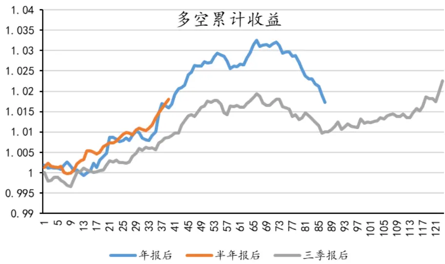
数据来源：国泰君安证券研究

整体上说，竞争力评价因子在中短期内收益持续性较好，在中长期出现一定回撤，而在进入年报发布区间后收益回升。作为一个长持仓期的低频因子，竞争力评价因子在换仓初期有稳定的 alpha 收益，且年报后和半年报后持仓期alpha收益要高于三季报后持仓期。出现这一现象的原因可能在于财报提供了关于公司未来竞争优势的增量信息，且年报和半年报的信息数量与质量要优于三季报，举例来说，企业技术人员数量只有年报披露，而管理人员数量只有年报和半年报披露。此外，在开仓大约 65个交易日后，因子收益开始出现明显回撤，引起回撤的年份主要是07年、14年、15年，均是历史上较为明显的牛市时期。出现以上现象的原因可能是因为牛市中风险偏好较低，想象空间大的概念型股票受益更多。

图 12 竞争力评价因子 alpha 收益持续性
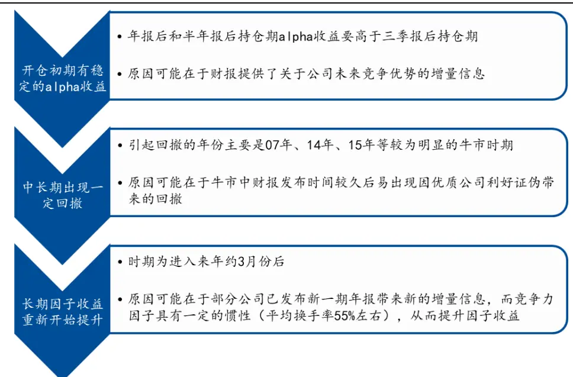
数据来源：国泰君安证券研究

## 5.4.行业适用性分析

不同行业所处的行业周期、产品类型、技术渗透率以及要素投入边际贡献均存在差异，可能会对竞争力评价因子的效果产生影响。因此在该部分，本文分行业检验竞争力评价因子的适用性并探究因子表现在行业间出现差异的原因，具体方法为在每个申万一级行业内选取因子值排名前后20%股票构建多空组合并计算其多空年化收益和夏普比率。结果如下：

表 8：因子分行业表现

| 行业 | 年化收益 | 夏普比率 | 行业 | 年化收益 | 夏普比率 |
| --- | --- | --- | --- | --- | --- |
| 电气设备 | 16.96% | 1.10 | 化工 | 5.17% | 0.44 |
| 家用电器 | 13.23% | 0.61 | 房地产 | 5.17% | 0.40 |
| 纺织服装 | 11.41% | 0.53 | 轻工制造 | 4.75% | 0.26 |
| 汽车 | 9.44% | 0.63 | 休闲服务 | 4.18% | 0.17 |
| 建筑材料 | 9.20% | 0.41 | 交通运输 | 3.74% | 0.19 |
| 公用事业 | 8.39% | 0.65 | 钢铁 | 3.04% | 0.14 |
| 农林牧渔 | 8.15% | 0.47 | 有色金属 | 2.85% | 0.17 |
| 医药生物 | 8.12% | 0.71 | 采掘 | 1.99% | 0.10 |
| 通信 | 8.05% | 0.42 | 传媒 | 0.99% | 0.06 |
| 计算机 | 7.88% | 0.47 | 综合 | 0.63% | 0.03 |
| 食品饮料 | 6.82% | 0.38 | 银行 | 0.03% | 0.00 |
| 机械设备 | 6.34% | 0.49 | 非银金融 | -0.06% | 0.00 |
| 电子 | 6.19% | 0.43 | 建筑装饰 | -2.81% | -0.15 |
| 商业贸易 | 5.51% | 0.37 | 国防军工 | -3.02% | -0.14 |

数据来源：国泰君安证券研究

因子适用性强的行业多为制造业下游产业或技术密集型产业。上表按照行业内因子多空年化收益降序排列，左侧为年化收益前 50%行业，右侧为后50%行业。可以看出，排名前 6的行业除建筑材料外，均属于制造业下游产业，这可能是因为制造业下游产业产品异质性较强且生产环节技术要求高，更需要有竞争力的技术和产品来抢占市场。而排名前 50%的其他行业基本为技术密集型产业，如医药生物、通信、计算机、电子等，背后的原因可能在于技术密集型产业需要持续的研发投入，保持核心竞争力即为其发展逻辑。

因子适用性弱的行业多为服务业下游产业或资本密集型产业。作为对比，因子在非银、银行、休闲服务等服务业下游产业适用性较弱，同时钢铁、有色、房地产等资本密集型产业的因子表现多在后 50%水平。合理的解释是服务业对技术竞争力的要求相对较低，而资本密集型产业多为中上游产业，产品同质性相对较强，使得竞争力评价因子的适用性降低。

在以上研究的基础上，本文将股票池限定为制造业下游产业或技术密集型产业来检验因子表现，具体策略构建方法如下：

股票池：申万电气设备、家用电器、纺织服装、汽车、公用事业、医药生物、通信、计算机和电子行业内股票。

组合构建方式：选取股票池中各行业内竞争力评价因子最大的 5%股票作为TOP 组合。

换仓时间：每年4月底、8 月底和10 月底。

手续费：双边千三。

加权方式：等权。

对冲指数：各行业指数涨幅加权均值，权重为行业内股票数量。

图 13 策略对冲行业加权指数净值曲线
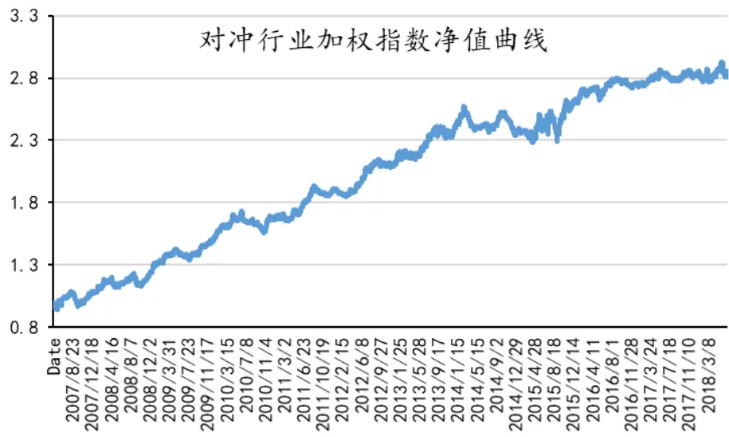
数据来源：国泰君安证券研究

策略自07年以来可获得9.98%的年化收益，最大回撤 10.37%，月胜率63%，夏普比率1.21。最大回撤出现在 2007年，自 08年之后各年回撤均在9%以下，策略表现较稳定。

表 9：策略分年度表现

| 年份 | 年化收益 | 夏普比率 | 年最大回撤 | 年份 | 年化收益 | 夏普比率 | 年最大回撤 |
| --- | --- | --- | --- | --- | --- | --- | --- |
| 2007 | 13.19% | 1.12 | -10.37% | 2013 | 11.85% | 1.75 | -3.58% |
| 2008 | 18.96% | 1.83 | -7.34% | 2014 | 0.34% | 0.09 | -7.07% |
| 2009 | 19.24% | 2.22 | -5.97% | 2015 | 10.76% | 1.05 | -8.92% |
| 2010 | 6.51% | 0.94 | -8.78% | 2016 | 7.84% | 1.53 | -3.91% |
| 2011 | 17.16% | 2.45 | -3.64% | 2017 | 4.50% | 1.06 | -3.19% |
| 2012 | 10.72% | 1.93 | -3.06% | 2018 | -1.41% | -0.17 | -4.31% |

数据来源：国泰君安证券研究

## 5.5.策略构建与收益分析总结

本文在该部分遵循基本策略构建→因子收益来源分析→因子收益持续性分析→因子行业适用性分析的研究思路，发现基于竞争力评价因子的行业和市值中性化组合策略表现较为稳定，同时在长期慢熊环境中有更好表现；通过探究企业当期的竞争力是否在下期落地为基本面指标的改善，发现竞争力评价因子能有效选出下期成长性较强的公司，即因子alpha收益反映的是企业未来真正的竞争优势，并根据因子失效期分析和后验IC 验证了上述结论；通过计算不同开仓期的因子累计收益，发现竞争力评价因子在中短期内收益持续性较好，在中长期出现一定回撤，而在进入年报发布区间后收益回升，同时年报后和半年报后持仓期alpha收益要高于三季报后持仓期；通过分行业计算多空组合收益，发现因子适用性强的行业多为制造业下游产业或技术密集型产业，并构建了基于以上行业的增强策略。

## 6. 总结与展望

本篇报告的主要贡献在于：

- 梳理了学术界对于核心竞争力内涵的理解，将其归纳为技术竞争力、产品竞争力、内控竞争力和持续发展性 4个维度，进而构建了核心竞争力的量化指标框架。

按照“同频化与缺失值填充→标准化→异常值平滑→维度内加权→各维度加权”的过程构建了竞争力评价因子，并使用了“极值塌缩”的异常值平滑方式，可以在不影响正常值大小的情况下进行，并可以保持异常值之间相对大小关系不变。

- 探究出因子alpha收益来源于企业未来真正的竞争优势，即竞争力评价因子能有效选出下期成长性较强的公司。

- 探究出因子alpha收益在时间序列上的有效性。研究发现，在中短期内收益持续性较好，在中长期出现一定回撤，而在进入年报发布区间后收益回升，同时年报后和半年报后持仓期 alpha收益要高于三季报后持仓期。

- 考查了因子的实用性。首先，我们发现基于竞争力评价因子的选股策略更适合长期慢熊环境。此外，分行业看，因子适用性强的行业多为制造业下游产业或技术密集型产业。

整体来说，作为单因子策略，竞争力评价因子的年化收益只是处于中等水平，且在07~09年以及04~15年的高波动环境下表现较差，原因在于竞争力评价因子更类似于一种“安全垫”因子，当市场非理性情绪较强时，因子表现可能不尽如人意。另一方面，不同于传统 alpha因子在时间维度上的普适性，基于基本面数据的量化因子依靠特定环境以及特定时间的信息流，策略针对性更强。此外，由于不同公司财报发布时间存在先后差异，按照法定财报发布截止日进行换仓的行为不可避免地错失了部分短期收益。因此进一步的研究可以聚焦于探寻普适性更强的反应企业竞争与生存能力的因子，或提升在财报发布期内的换仓频率，更好的捕捉边际信息带来的 alpha 收益。

本公司具有中国证监会核准的证券投资咨询业务资格分析师声明

## 参考文献

[1] Prahalad C K, Hamel G. The core competence of the corporation[M]//Strategische unternehmungsplanung—strategische unternehmungsführung. Springer, Berlin, Heidelberg, 2006: 275-292.

[2] Stalk G, Evans P, Shulman L E. Competing on capabilities: The new rules of corporate strategy[J]. Harvard business review, 1992, 70(2): 57-69.

[3] Prahlad C K. The role of core competencies in the corporation[J]. Research Technology Management, 1993, 36(6): 40.

[4] Gallon M R, Stillman H M, Coates D. Putting core competency thinking into practice[J]. Research-Technology Management, 1995, 38(3): 20-28.

[5] Leonard‐ Barton D. Core capabilities and core rigidities: A paradox in managing new product development[J]. Strategic management journal, 1992, 13(S1): 111-125.

[6] Bogner W C, Thomas H. Core competence and competitive advantage: A model and illustrative evidence from the pharmaceutical industry[J]. BEBR faculty working paper; no. 92-0174, 1992.

[7] Coulter M K, Coulter M K. Strategic management in action[M]. Upper Saddle River, NJ: Prentice Hall, 2002.

[8] Helleloid D, Simonin B. Organizational learning and a firm’s core competence[J]. Competence-based competition, 1994, 5: 213-239.

[9] Dugan M T, Gup B E, Samson W D. Teaching the statement of cash flows[J]. Journal of Accounting Education, 1991, 9(1): 33-52.

[10] 丁开盛, 梁雄健. 企业核心竞争能力初探[J]. 北京邮电大学学报:社会科学版, 1999 (1): 13-17.

[11] 李悠诚, 陶正毅, 白大力. 企业如何保护核心能力的载体——无形资产[J]. 国际商务: 对外经济贸易大学学报, 2000 (4): 49-52.

[12] 王健, 张晓媛. 企业竞争力指标体系研究[J]. 山东社会科学, 2014(11): 135-140.

[13] 章先彪. 基于企业生命周期的企业发展阶段理论研究[J]. 湖北经济学院学报: 人文社会科学版, 2007, 4(7): 78-79.

[14] 王冬梅, 石旭. 如何判定企业生命周期-财务分析法[J]. 商场現代化,2009, 10(564): 317-319.

作者具有中国证券业协会授予的证券投资咨询执业资格或相当的专业胜任能力，保证报告所采用的数据均来自合规渠道，分析逻辑基于作者的职业理解，本报告清晰准确地反映了作者的研究观点，力求独立、客观和公正，结论不受任何第三方的授意或影响，特此声明。

## 免责声明

本报告仅供国泰君安证券股份有限公司（以下简称“本公司”）的客户使用。本公司不会因接收人收到本报告而视其为本公司的当然客户。本报告仅在相关法律许可的情况下发放，并仅为提供信息而发放，概不构成任何广告。

本报告的信息来源于已公开的资料，本公司对该等信息的准确性、完整性或可靠性不作任何保证。本报告所载的资料、意见及推测仅反映本公司于发布本报告当日的判断，本报告所指的证券或投资标的的价格、价值及投资收入可升可跌。过往表现不应作为日后的表现依据。在不同时期，本公司可发出与本报告所载资料、意见及推测不一致的报告。本公司不保证本报告所含信息保持在最新状态。同时，本公司对本报告所含信息可在不发出通知的情形下做出修改，投资者应当自行关注相应的更新或修改。

本报告中所指的投资及服务可能不适合个别客户，不构成客户私人咨询建议。在任何情况下，本报告中的信息或所表述的意见均不构成对任何人的投资建议。在任何情况下，本公司、本公司员工或者关联机构不承诺投资者一定获利，不与投资者分享投资收益，也不对任何人因使用本报告中的任何内容所引致的任何损失负任何责任。投资者务必注意，其据此做出的任何投资决策与本公司、本公司员工或者关联机构无关。

本公司利用信息隔离墙控制内部一个或多个领域、部门或关联机构之间的信息流动。因此，投资者应注意，在法律许可的情况下，本公司及其所属关联机构可能会持有报告中提到的公司所发行的证券或期权并进行证券或期权交易，也可能为这些公司提供或者争取提供投资银行、财务顾问或者金融产品等相关服务。在法律许可的情况下，本公司的员工可能担任本报告所提到的公司的董事。

市场有风险，投资需谨慎。投资者不应将本报告作为作出投资决策的唯一参考因素，亦不应认为本报告可以取代自己的判断。
在决定投资前，如有需要，投资者务必向专业人士咨询并谨慎决策。

本报告版权仅为本公司所有，未经书面许可，任何机构和个人不得以任何形式翻版、复制、发表或引用。如征得本公司同意进行引用、刊发的，需在允许的范围内使用，并注明出处为“国泰君安证券研究”，且不得对本报告进行任何有悖原意的引用、删节和修改。

若本公司以外的其他机构（以下简称“该机构”）发送本报告，则由该机构独自为此发送行为负责。通过此途径获得本报告的投资者应自行联系该机构以要求获悉更详细信息或进而交易本报告中提及的证券。本报告不构成本公司向该机构之客户提供的投资建议，本公司、本公司员工或者关联机构亦不为该机构之客户因使用本报告或报告所载内容引起的任何损失承担任何责任。

## 评级说明

## 1.投资建议的比较标准

投资评级分为股票评级和行业评级。

以报告发布后的12个月内的市场表现为比较标准，报告发布日后的 12个月内的公司股价（或行业指数）的涨跌幅相对同期的沪深 300 指数涨跌幅为基准。

## 2.投资建议的评级标准

报告发布日后的 12 个月内的公司股价（或行业指数）的涨跌幅相对同期的沪深 300 指数的涨跌幅。

|  | 评级 说明 |  |
| --- | --- | --- |
| 股票投资评级 | 增持 | 相对沪深300指数涨幅15%以上 |
|  | 谨慎增持 | 相对沪深300指数涨幅介于5%～15%之间 |
|  | 中性 | 相对沪深300指数涨幅介于-5%～5% |
|  | 减持 | 相对沪深 300指数下跌 5%以上 |
| 行业投资评级 | 增持 | 明显强于沪深300 指数 |
|  | 中性 | 基本与沪深 300指数持平 |
|  | 减持 | 明显弱于沪深300指数 |

## 国泰君安证券研究所

|  | 上海 | 深圳 | 北京 |
| --- | --- | --- | --- |
| 地址 | 上海市浦东新区银城中路168号上海 银行大厦29层 | 深圳市福田区益田路 6009 号新世界 商务中心34层 | 北京市西城区金融大街 28 号盈泰中 心2号楼10层 |
| 邮编 | 200120 | 518026 | 100140 |
| 电话 | (021)38676666 | (0755)23976888 | (010)59312799 |
|  | E-mail: gtjaresearch@gtjas.com |  |  |