# 基于 CCK模型的股票市场羊群效应研究

# --数量化专题之一百二十二

陈奥林（分析师）

8 021-38674835

chenaolin@gtjas.com

证书编号 S0880516100001

## 本报告导读：

通过 CCK模型捕捉“羊群效应”，即板块成分股同向联动所形成的强趋势

## 摘要：

le_Summary]羊群效应反映的是个别股票的上涨或下跌引起相关股票收益率联动的现象，继而形成整个板块的趋势性运动。我们通过 CCK模型捕捉羊群效应所引起的这种板块强趋势。

模型不涉及参数，因而表现受市场状态影响较小，更具普适性。策略着眼于指数成分股组合内部微观结构的变化，进一步丰富了择时策略的逻辑维度。

羊群效应发生时，板块成分股收益率出现同向联动，也即收益率相关性增强，离散程度减弱，这也正是羊群效应经典识别模型——CCK模型的核心思想。

- 羊群效应的产生和市场、风格等多种因素有关，为了让模型捕捉到更多信息，我们将A股综合日市场回报率引入 CCK模型。

对于宽基指数，羊群效应策略效果和市场趋势，指数市值风格、风格纯度有关。市场存在上涨趋势时，策略效果较显著，高市值、风格纯度高的指数回测结果较好。存在上涨趋势时，以上证 50为标的指数，策略平均收益率 11.06%，胜率 88.89%。

对于行业指数，羊群效应策略效果和市场趋势，指数市值风格、行业属性有关。市场存在上涨趋势时，策略效果较显著，高市值、非成长型行业回测结果较好。策略在成长型行业中表现较差。存在上涨趋势时，以金融型行业指数为标的指数，策略平均收益率为 4.05%，胜率72.73%。

陈奥林：（分析师）

电话：021-38674835

邮箱：chenaolin@gtjas.com

证书编号：S0880516100001

## 李辰：（分析师）

电话：021-38677309

邮箱：lichen@gtjas.com

证书编号：S0880516050003

## 孟繁雪：（分析师）

电话：021-38675860

邮箱：mengfanxue@gtjas.com

证书编号：S0880517040005

## 蔡旻昊：（研究助理）

电话：021-38674743

邮箱：caiminhao@gtjas.com

证书编号：S0880117030051

## 李栩：（研究助理）

电话：021-38032690

邮箱：lixu019018@gtjas.com

证书编号：S0880117090067

## 杨能：（研究助理）

电话：021-38032685邮箱：yangneng@gtjas.com证书编号：S0880117080176

## 殷钦怡：（研究助理）

电话：021-38675855邮箱：yinqinyi@gtjas.com证书编号：S0880117060109

## 余剑峰：（研究助理）

电话：021-38676186

邮箱：yujianfeng@gtjas.com

证书编号：S0880118060039

## 黄皖璇：（研究助理）

电话：021-38677799

邮箱：huangwangxuan@gtjas.com

证书编号：S088011610008

## [Table_R相关报告

《基于 PLS 方法的潜变量因子研究》2018.11.13

《基于风险供求模糊匹配的择时策略》2018.11.10

《上市公司业绩变脸中的业绩预告之谜》2018.10.22

《基于日内交易特征的选股策略》2018.10.18《基于宏观状态的风险预算和资产配置》2018.09.15

## 1. 概述

新兴市场相对于发达国家市场来说，呈现价格波动大，高风险偏好等特点。因而，择时策略在A股是投资成败的关键因素。近年来，市场上的量化择时策略种类不断增多，而择时策略的稳定性问题一直受投资者关注。我们认为，策略的不稳定很大一方面原因是由于多数择时策略需引入参数作为阈值，而参数作为一个固定常量，难以在趋势市和震荡市等不同市场环境下中灵活应变，从而导致模型出现过拟合的问题。因此，我们应尽量降低择时策略的参数依赖性，以提高策略的适用性与生命力。

羊群效应通常来说，是由于个别股票的暴涨或暴跌引起其他相关股票收益率联动，致某类股票暴涨或暴跌。因此，通俗来说，羊群效应刻画的是个股之间联动性的变化，并于此对趋势强度进行判断。本篇报告中，我们通过 CCK 模型捕捉羊群效应所引起的这种板块强联动趋势，模型较少的涉及参数，因而在一定程度上缓解了过度拟合的问题。此外，传统择时策略多通过大盘量价数据、宏观经济指标等对大盘未来走势进行预判，本报告中的策略则着眼于指数成分股组合内部微观结构的变化，逻辑针对性更强，也可有效的提高择时策略丰富度。

本报告第二章首先从羊群效应的直观市场表现形式入手，接下来将其市场表现模型化，引入羊群效应的经典识别模型——CCK模型，并对模型进行了适当改进，使其更符合实际投资逻辑。第三章中，我们将改进模型应用于宽基指数与行业指数进行事件驱动择时，探究其在各指数中的有效性。

## 2. 羊群效应简介

## 2.1. A 股中的羊群效应

作为一种行为金融学中的经典行为偏差，羊群效应常见于A 股市场中：龙头股的上涨使得投资者对板块内其它尚未起涨的股票形成盈利预期，导致资金对此类股票形成追逐效应，体现为“头羊”领涨，“群羊”跟涨的现象。在此过程中，板块会由于大量资金的流入而产生强趋势。因此，如果我们能识别出羊群效应的发生，便有机会抓住该强趋势中蕴含的获利机会。因此，我们接下来思考的重点应该是如何识别出羊群效应的发生。

我们尝试从板块内部微观结构，也即板块成分股的表现这一角度入手，识别羊群效应的发生。我们发现羊群效应发生时，“群羊”跟涨导致板块成分股收益率会出现同向联动，也即收益率相关性增强，离散程度减弱——如2010年 10月，医药生物行业龙头股通化东宝大涨，随后该行业指数亦跟风上涨，板块成分股收益率相对市场收益率的离散程度降低。因此，我们能通过离散度降低识别出羊群效应的发生，而这也正是羊群效应经典识别模型——CCK模型的核心思想。我们将在下一节详细介绍CCK模型。

图 1医药生物行业指数收盘价及相关龙头股票收盘价
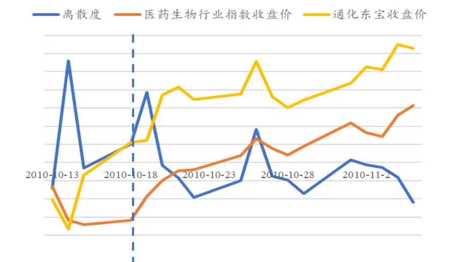
数据来源：国泰君安证券研究

## 2.2. CCK 模型

CCK 模型由 Chang, Cheng & Khorana 在 2000 年提出，其核心思想是通过组合成分股收益率相对于市场收益率Rm离散程度的变化识别羊群效应的发生。

Chang, Cheng & Khorana 首先通过以下推导证明了理性情况下，由于个股对市场风险的敏感程度不同，市场收益率Rm剧烈波动时，组合收益率相对于Rm的离散程度会线性增加：

定义股票组合在 t 时刻的截面绝对离散度C S A D 为

$$
\ CSAD_{\mathrm{\Omega}_{t}}=\frac{1}{N}\sum_{i=1}^{N}\left|R_{i,t}-R_{\mathrm{\Omega}_{m,t}}\right|
$$

根据 CAPM，有

$$
E(R_{i,t})=\gamma_{\mathrm{~0~}}+\beta_{i}E(R_{m,t}-\gamma_{\mathrm{~0~}})
$$

则期望C S A D ，即 $E\left(CSAD_{_t}\right)$ 为

$$
\begin{array}{rl}&{E\left(CSAD,\right)=E\displaystyle\left(\frac{1}{N}\sum_{i=1}^{N}\left|R_{i,i}-R_{n,i}\right|\right)}\\&{=\displaystyle\frac{1}{N}\sum_{i=1}^{N}\left(\sum_{j=1,i}^{N}E\left(R_{n,i}\right)-E\left(R_{n,i}\right)\right)}\\&{=\displaystyle\frac{1}{N}\left(\sum_{i=1}^{N}\left|\gamma_{i}+\beta_{i}E\left(R_{n,i}-\gamma_{0}\right)-(\gamma_{0}+\beta_{m}E\left(R_{n,i}-\gamma_{0}\right))\right|\right)}\\&{=\displaystyle\frac{1}{N}\sum_{i=1}^{N}\left|\beta_{i}-\beta_{m}\right|E\left(R_{n,i}-\gamma_{0}\right)}\\&{=\displaystyle\frac{1}{N}\sum_{i=1}^{N}\left|\beta_{i}-\beta_{m}\right|E\left(R_{n,i}-\gamma_{0}\right)}\end{array}
$$

对 $E\left(CSAD_{_t}\right)$ 求一、二阶导数，有

$$
\frac{\delta E\left(CSAD_{\iota}\right)}{\delta E\left(R_{\iota,\iota}\right)}=\frac{1}{N}\sum_{i=1}^{N}\left|\beta_{i}-\beta_{\iota}\right|>0
$$

$$
\frac{\delta^{~2}E\left(CSAD_{~t}\right)}{\delta E\left(R_{~m,t}\right)^{2}}=~0
$$

一阶导数为正，二阶导数为零，说明理性情况，即无羊群效应时，C S A D和Rm的关系为线性正相关。

而存在羊群效应时，CSAD 和 Rm的线性正相关关系会被打破。基于这一思想，Chang, Cheng & Khorana 构造了如下回归，根据回归中 ${R_{{_m,t}}}^{2}$ 的系数 ${\boldsymbol{\beta}}_{\mathbf{\nu}_{2}}$ 是否显著为负判断是否存在羊群效应： ${\boldsymbol{\beta}}_{\mathbf{\nu}_{2}}$ 显著时，说明 $CSAD_{\iota}$ 和Rm的关系为非线性； ${{\boldsymbol{\beta}}_{\mathbf{\Lambda}_{2}}}$ 为负时，如下图所示，随Rm增大，离散度会减速上升或加速下降。减速上升说明 $CSAD_{t}$ 上升幅度低于理性情况（理性情况下匀速上升），离散度加速下降更表明 $CSAD_{\iota}$ 和 Rm 间存在强负相关关系。因此， ${R_{{m},t}}^{2}$ 的系数 $\beta_{\gamma}$ 显著为负时说明羊群效应发生。

$$
CSAD_{t}=\alpha+\beta_{1}\left|R_{{}_{m,t}}\right|+\beta_{2}R_{{}_{m,t}}^{{}^{2}}+\varepsilon_{t}
$$

图 2β2 显著为负时 CSAD 与 Rm 关系
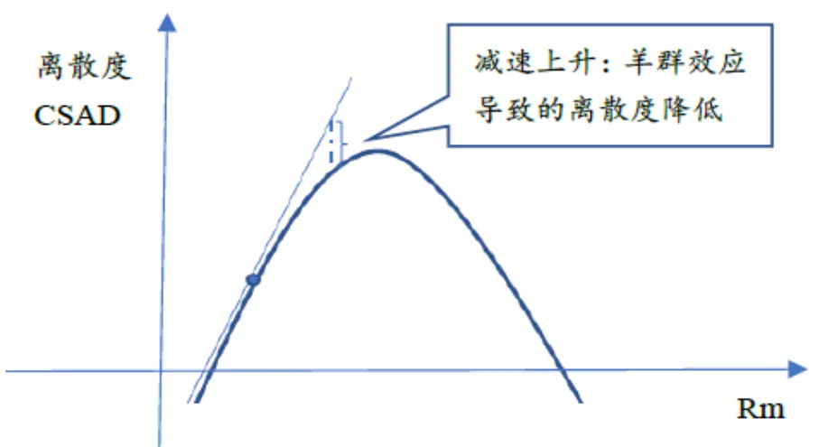
数据来源：国泰君安证券研究

## 2.3. 模型改进

CCK模型的所有因变量均基于市场收益率Rm构建，也即模型将市场作为羊群效应的唯一驱动因素，但在真实市场中，风格、行业等多种因素均会引起羊群效应，因此，模型变量可能需要根据市场实际情况进行调整。接下来，我们将重点比较由不同驱动因素驱动的羊群所引起趋势的相对强弱，并据此决定策略的具体调整方式。

从驱动因素的重要性出发，本文将主要探究市场驱动的羊群效应、市值风格驱动的羊群效应发生后的市场：我们以 22 交易日（一个月，包括当日）为滚动期，每天计算向前 22交易日其上证50成分股组合截面绝对离散度CSAD，估计以下两个模型的参数：

$$
\begin{array}{r}\begin{array}{l}{CSAD_{\mathrm{~\it t~}}=\alpha+\beta_{{\mathrm{~\scriptsize1~}}}\Big|R_{\mathrm{~\it m~,\mathrm{~\it t~}~}}\Big|+\beta_{{\mathrm{~\scriptsize2~}}}R_{\mathrm{~\it m~,\mathrm{~\it t~}~}}{\}}\end{array}}\end{array}
$$

$$
\begin{array}{r}{{CSAD}_{t}=\alpha+\beta_{1}\left|R_{\textrm{ \tiny { s m b , t } }}\right|+\beta_{2}{R_{\textrm{ \tiny { s m b , t } }}}^{2}+\varepsilon_{t}}\end{array}
$$

其中， $R_{\textit{ \textbf { m } },t}$ 为指数收益率， $R_{\scriptscriptstyle{smb},t}$ 为市值因子收益率，当对应二次项系数显著为负时，则发生了由该因素驱动的羊群效应。我们以滚动期内指数平均日收益率的正负区分市场趋势为上涨还是下跌，上涨状态下各指数收盘价与羊群效应发生时间如下图所示。从图中可以看出：

①羊群效应产生于趋势，作用于趋势，信号发出前后市场趋势明显。

②多数趋势波段由市场、市值风格共同驱动，少数波段为单一因素驱动；

③市场与市值风格多个“驱动力”共同驱动的羊群效应发生后，趋势更强：2008-2010 年间的羊群效应由市场或市值风格单个因素驱动，期间指数趋势较弱，甚至出现反转，其他年份则多由市场与市值风格共同作用，期间指数趋势更强。

图 3β2显著为负时 CSAD与Rm关系
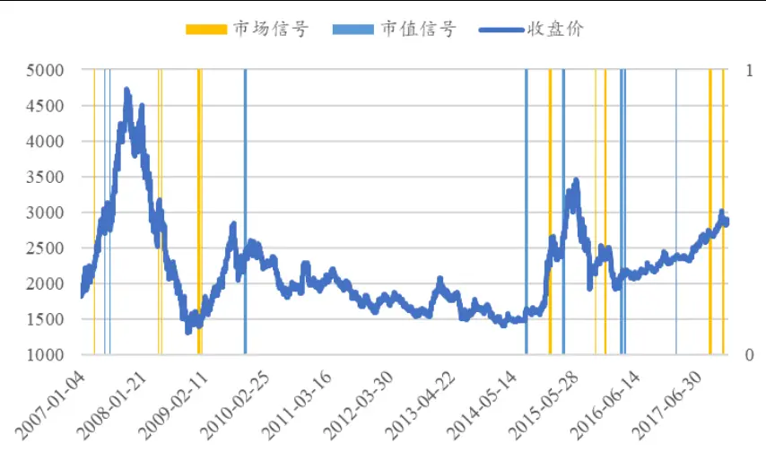
数据来源：国泰君安证券研究

趋势越强，择时效果越好，因此我们应将多个“驱动力”共同纳入模型，以捕捉其共同驱动的羊群效应所带来的强趋势。为达到这个目的，理论上应将各种风格、行业等收益率的绝对值与二次项引入模型，在多个二次项系数共同显著为负时开仓。但在实际建模过程中，我们无法找到所有驱动因素，也即将羊群效应驱动因素分别纳入模型会造成变量遗漏。因此我们简化模型，将所有驱动因素糅合为一个指标，以A 股综合日市场回报率(流通市值平均法)为 Rm，该回报率包含 A 股市场所有股票收益率信息，信息较完备。

## 3. 羊群效应策略表现

## 3.1.羊群效应策略在宽基指数上的应用

我们选取了投资者比较熟悉的六种宽基指数：上证综指、上证 50、沪深300、中证 500、中小板综、创业板指，通过 CCK 模型判断指数成分股间是否存在羊群效应，在羊群效应发生后买入/卖出。

策略标的：上证综指（000001.SH）、上证 50（000016.SH）、沪深 300（000300.SH）、中证 500（000905.SH）、中小板综合指数（399101.SZ）、创业板指数（399006.SZ）

股票组合：当日标的指数的成分股，剔除ST 股等非正常交易状态股票回测时间：2007.01.01 – 2017.12.31

手续费用：双边千三

建仓成本：次日均价

策略步骤：计算向前 22 日（包括当日）每天的成分股组合截面绝对离散度 CSAD，OLS 估计 CCK 模型中 ${R_{{m},t}}^{2}$ 的系数 ${\boldsymbol{\beta}}_{\mathbf{\Phi}_{2}}$ ，若 ${\boldsymbol{\beta}}_{\mathbf{\Phi}_{2}}$ 显著为负则认为当日该组合存在羊群效应，根据 22 日内指数平均收益率的正负区分羊群效应发生时的市场趋势为上涨/下跌，买入/卖出标的指数并持仓22交易日，持有期不重复开仓。

市场趋势为上涨时策略在宽基指数上的平均表现如下所示（分年度表现见附录）。可以看出，市场趋势方面，市场存在上涨趋势时，羊群效应策略效果相对较为显著。市值风格方面，高市值指数回测结果优于低市值指数，标的为上证 50时，平均收益率达11.06%，胜率88.89%，标的为沪深300时，平均收益率 3.42%，胜率63.64%，二者表现均优于中证500、中小板综、创业板指。重点关注的是，策略在风格最为混杂的上证综指上效果最差，平均收益率仅 0.19%，胜率60%。

表 1：上涨时羊群效应回测结果

|  | 上证综指 | 上证50 | 沪深300 | 中证500 | 中小板综 | 创业板指 |
| --- | --- | --- | --- | --- | --- | --- |
| 收益率 | 0.19% | 11.06% | 3.42% | 1.47% | 2.04% | 4.65% |
| 胜率 | 60.00% | 88.89% | 63.64% | 55.56% | 57.89% | 57.14% |
| 开仓次数 | 15 | 9 | 11 | 18 | 19 | 7 |

数据来源：国泰君安证券研究

图 4上涨时羊群效应策略分日累计收益率
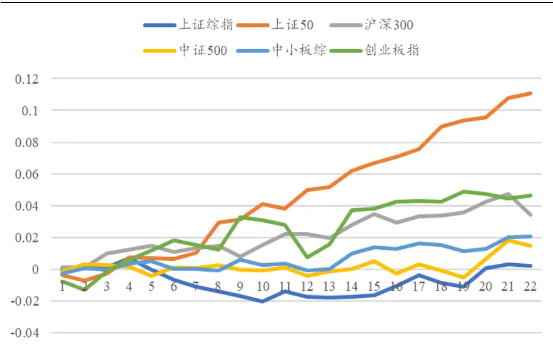
数据来源：国泰君安证券研究

市场趋势为下跌时策略在宽基指数上的平均表现如下所示（分年度表现见附录）。市场存在下跌趋势时，羊群效应策略效果相对不显著。市值风格方面，高市值指数回测结果依然优于低市值指数，标的为上证 50与沪深 300 时的策略表现依然优于标的为中证 500、中小板综与创业板指时的策略表现。风格纯度方面，策略在风格最为混杂的上证综指上效果依然不好，平均收益率仅-0.05%，胜率40.00%。

表 2：下跌时羊群效应回测结果

|  | 上证综指 | 上证50 | 沪深300 | 中证500 | 中小板综 | 创业板指 |
| --- | --- | --- | --- | --- | --- | --- |
| 收益率 | -0.05% | -0.21% | 6.10% | -2.09% | -3.16% | -8.34% |
| 胜率 | 40.00% | 46.15% | 71.43% | 37.50% | 40.00% | 23.08% |
| 开仓次数 | 15 | 13 | 7 | 16 | 15 | 13 |

数据来源：国泰君安证券研究

图 5下跌时羊群效应策略分日累计收益率
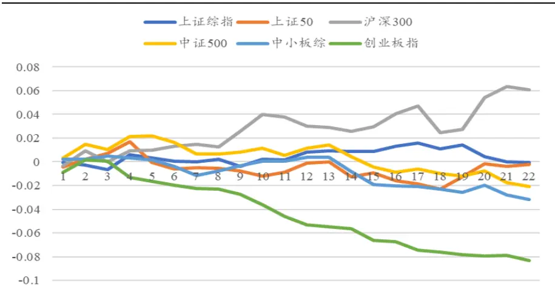
数据来源：国泰君安证券研究

我们认为市场存在下跌趋势时，羊群效应策略效果相对不显著的原因可能是卖空限制导致投资者可抛售的股票数量有限，因此下跌时羊群效应发生后下跌趋势持续时间较短。此外，市场在下跌时存在调和平均数问题。举例来说，市场从 2000点涨到4000点，涨幅为100%。而跌回2000点，只需下跌50%。因而，下跌的速度天然较上涨更快。从下图可看出，下跌时，羊群效应发生后下跌趋势确实仅存在于短期内。

图 6下跌时羊群效应发生后 7日累计收益率
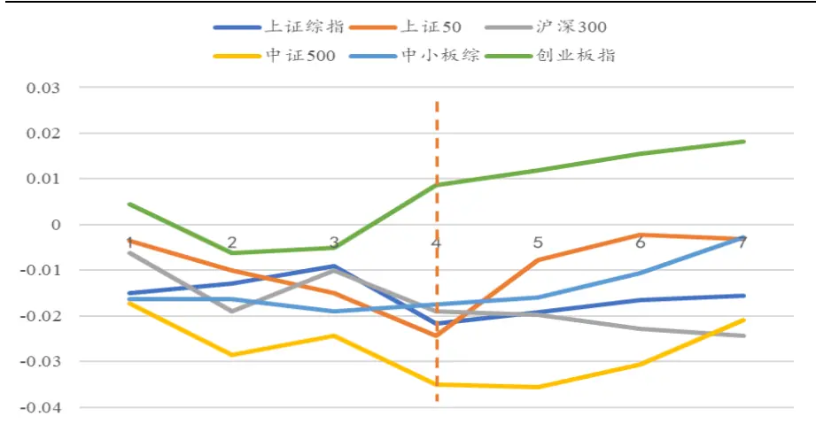
数据来源：国泰君安证券研究

市值风格方 $\cdot\ln$ ，上涨与下跌状态下，高市值指数回测结果均优于低市值指数。我们认为这可能是由于高市值股票信息透明度高，特质性信息少，价格更易受交易行为影响。

风格纯度方面，上涨与下跌状态下，策略在风格最为混杂的上证综指上效果均较差。我们在驱动因素部分已经论证过羊群效应的产生与风格有关，而上证综指风格纯度低，因此这种风格择时在上证综指上效果较差。

## 3.2.羊群效应策略在行业指数上的应用

我们选取了申万一级行业指数，将其按行业属性划分为周期、消费、成长、金融五大类，通过 CCK 模型判断各申万一级行业指数成分股间是否存在羊群效应，买入/卖出各大类行业中出现羊群效应的申万一级行业指数。

表 3: 行业分类

| 行业大类 | 申万一级行业 |
| --- | --- |
| 周期 | 采掘，化工，钢铁，有色金属，建筑材料，建筑装饰，电气设备，机械设备，交通运输，房地产，公用事业 |
| 消费 | 汽车，家用电器，纺织服装，商业贸易，食品饮料，医药生物，休闲服务，轻工制造，农林牧渔 |
| 成长 | 电子，通信，传媒，计算机，国防军工 |
| 金融 | 银行，非银金融 |

数据来源：国泰君安证券研究

策略标的：申万一级行业指数

股票组合：当日标的指数的成分股，剔除ST 股等非正常交易状态股票回测时间：2007.01.01 – 2017.12.31

手续费用：双边千三

建仓成本：建仓当日均价

策略步骤：计算向前 22 日（包括当日）每天的成分股组合截面绝对离散度 CSAD，OLS 估计 CCK 模型中 ${R_{{_m,t}}}^{2}$ 的系数 ${\boldsymbol{\beta}}_{\mathbf{\Phi}_{2}}$ ，若 ${\boldsymbol{\beta}}_{\mathbf{\Phi}_{2}}$ 显著为负则

认为当日该组合存在羊群效应，根据 22 日内指数平均收益率的正负区分羊群效应发生时的市场趋势为上涨/下跌，买入/卖出标的指数并持仓22交易日，持有期不重复开仓。

市场趋势为上涨时策略在行业指数上的平均表现如下所示（分年度表现见附录）。市场趋势方面，市场存在上涨趋势时，羊群效应策略效果较为显著。市值风格方面，高市值行业回测结果优于低市值行业，金融型行业平均收益率为4.05%，胜率72.73%。行业属性方面，成长型行业表现较差，平均收益率-2.90%，胜率44.44%。

表 4：上涨时羊群效应回测结果

| 周期型 | 消费型 | 成长型 | 金融型 |
| --- | --- | --- | --- |
| 收益率 | 2.03% 0.42% | -2.90% | 4.05% |
| 胜率 | 57.14% | 57.14% 44.44% | 72.73% |
| 开仓次数 | 63 | 63 27 | 11 |

数据来源：国泰君安证券研究

图 7上涨时羊群效应策略分日累计收益率
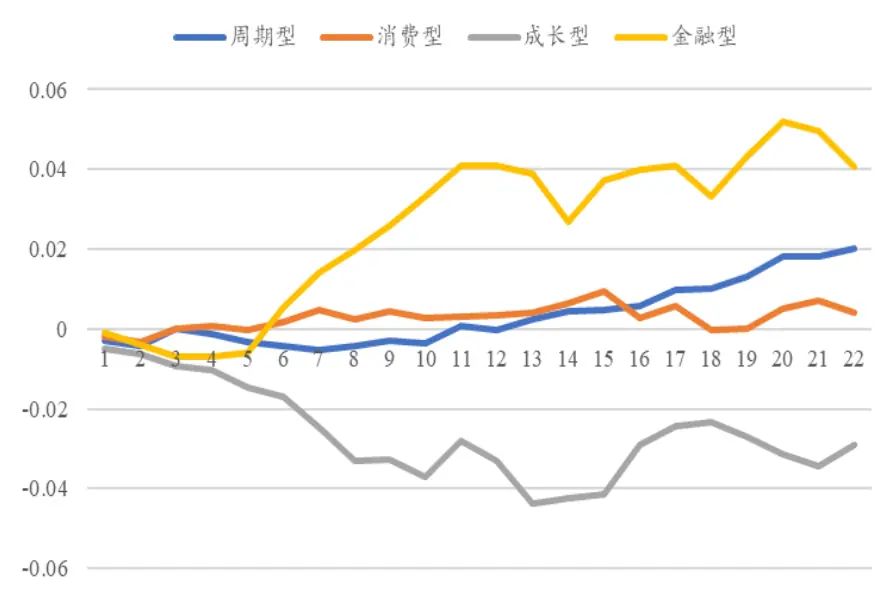
数据来源：国泰君安证券研究

市场存在下跌趋势时，羊群效应策略在行业指数上的效果相对不显著，收益率方面，仅消费型行业表现稍好，为 3.10%，成长型、金融型行业策略收益率均为负；胜率方面，所有行业胜率均低于 60%。

表 5：下跌时羊群效应回测结果

|  | 周期型 | 消费型 | 成长型 | 金融型 |
| --- | --- | --- | --- | --- |
| 收益率 | 0.46% | 3.10% | -2.92% | -1.88% |
| 胜率 | 50.00% | 57.14% | 36.67% | 44.44% |
| 开仓次数 | 68 | 63 | 30 | 9 |

数据来源：国泰君安证券研究

图 8下跌时羊群效应策略分日累计收益率
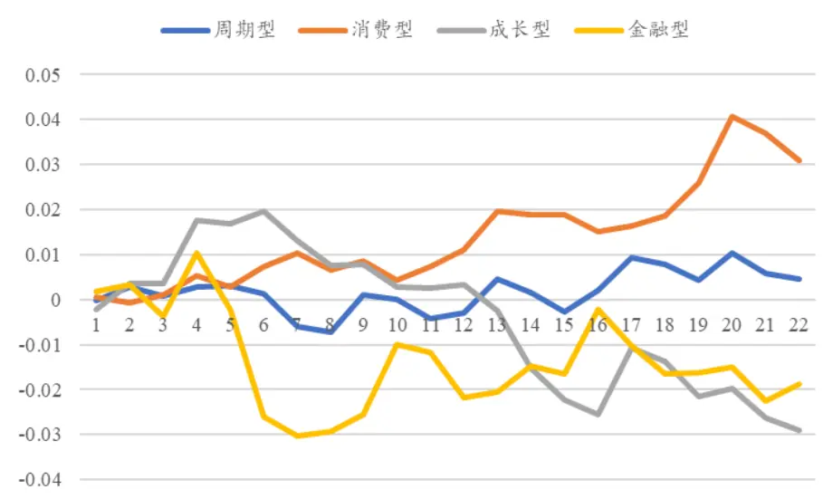
数据来源：国泰君安证券研究

同宽基指数，市场存在下跌趋势时，羊群效应策略效果相对不显著，原因可能同样是由于卖空限制。高市值指数回测效果更好，同样由于高市值股票信特质性信息少，价格运动过程中存在较大惯性。

行业属性方面，成长型行业回测结果较差，可能是由于成长型行业本身质量小，惯性弱，因此羊群效应发生后趋势强度与方向均不稳定。

## 4. 总结

本文探究了羊群效应的产生原因以及羊群效应和市场趋势的关系，并由此构建了基于羊群效应的量化策略：通过 CCK 模型判断标的指数成分股是否存在羊群效应，若存在则根据模型滚动期内的指数平均收益率正负判断市场为上涨/下跌，根据市场状态买入/卖出标的指数。

本文发现羊群效应策略有效性和标的指数的市值风格和风格纯度有关，未来研究在此基础上可进一步构建高市值且风格纯净度高的 Smart Beta指数，将其作为策略标的指数。此外，后期研究也可关注市场情况，如牛熊市与投资者情绪对于策略有效性的影响。

## 5. 附录

## 5.1.宽基指数分年度表现

表 6: 上证综指上涨时羊群效应发生后分年度表现

|  | 2007 | 2008 | 2009 | 2010 | 2012 | 2013 | 2014 | 2015 | 2016 | 2017 |
| --- | --- | --- | --- | --- | --- | --- | --- | --- | --- | --- |
| 收益率 | 19.31% | -20.12% | -5.89% | 6.43% | 10.60% | 5.99% | 10.76% | -10.62% | -2.79% | 1.30% |
| 胜率 | 100.00% | 0.00% | 0.00% | 50.00% | 100.00% | 100.00% | 100.00% | 50.00% | 33.33% | 100.00% |
| 开仓次数 | 1 | 1 | 1 | 2 | 1 | 1 | 1 | 2 | 3 | 2 |

数据来源：国泰君安证券研究

表 7: 上证50上涨时羊群效应发生后分年度表现

|  | 2007 | 2008 | 2009 | 2010 | 2014 | 2015 | 2017 |
| --- | --- | --- | --- | --- | --- | --- | --- |
| 收益率 | 17.46% | 2.92% | 15.61% | -1.34% | 42.38% | 3.70% | 1.36% |
| 胜率 | 100.00% | 100.00% | 100.00% | 0.00% | 100.00% | 100.00% | 100.00% |
| 开仓次数 | 2 | 1 | 1 | 1 | 1 | 2 | 1 |

数据来源：国泰君安证券研究

表 8: 沪深300上涨时羊群效应发生后分年度表现

|  | 2007 | 2008 | 2009 | 2010 | 2014 | 2017 |
| --- | --- | --- | --- | --- | --- | --- |
| 收益率 | 14.55% | -22.87% | -1.10% | -1.75% | 31.86% | 1.68% |
| 胜率 | 100.00% | 0.00% | 0.00% | 0.00% | 100.00% | 80.00% |
| 开仓次数 | 2 | 1 | 1 | 1 | 1 | 5 |

数据来源：国泰君安证券研究

表 9: 中证500上涨时羊群效应发生后分年度表现

|  | 2007 | 2008 | 2009 | 2010 | 2011 | 2012 | 2013 | 2014 | 2015 | 2016 | 2017 |
| --- | --- | --- | --- | --- | --- | --- | --- | --- | --- | --- | --- |
| 收益率 | 28.70% | -11.51% | 12.79% | 4.75% | -8.66% | 12.25% | 3.44% | 3.41% | 0.29% | -4.28% | 0.60% |
| 胜率 | 100.00% | 50.00% | 100.00% | 50.00% | 0.00% | 100.00% | 100.00% | 66.67% | 100.00% | 0.00% | 50.00% |
| 开仓次数 | 1 | 2 | 1 | 2 | 2 | 1 | 1 | 3 | 1 | 2 | 2 |

数据来源：国泰君安证券研究

表 10: 中小板综上涨时羊群效应发生后分年度表现

|  | 2007 | 2009 | 2010 | 2011 | 2012 | 2013 | 2014 | 2015 | 2016 | 2017 |
| --- | --- | --- | --- | --- | --- | --- | --- | --- | --- | --- |
| 收益率 | 18.26% | 8.57% | 1.45% | -5.14% | 14.79% | 0.37% | 2.34% | 2.92% | -3.45% | 0.46% |
| 胜率 | 100.00% | 100.00% | 33.33% | 0.00% | 100.00% | 100.00% | 75.00% | 100.00% | 33.33% | 50.00% |
| 开仓次数 | 1 | 1 | 3 | 2 | 1 | 1 | 4 | 1 | 3 | 2 |

数据来源：国泰君安证券研究

表 11: 创业板指上涨时羊群效应发生后分年度表现

|  | 2011 | 2012 | 2013 | 2014 | 2015 |
| --- | --- | --- | --- | --- | --- |
| 收益率 | -1.86% | -4.27% | -0.82% | -6.05% | 15.39% |
| 胜率 | 0.00% | 0.00% | 100.00% | 0.00% | 100.00% |
| 开仓次数 | 1 | 1 | 1 | 1 | 3 |

数据来源：国泰君安证券研究

图 9上证综指上涨时分年度累计收益率
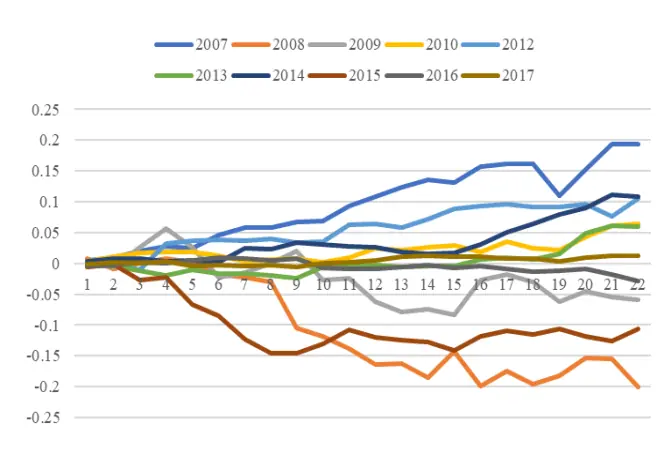
数据来源：国泰君安证券研究

图 10上证 50上涨时分年度累计收益率
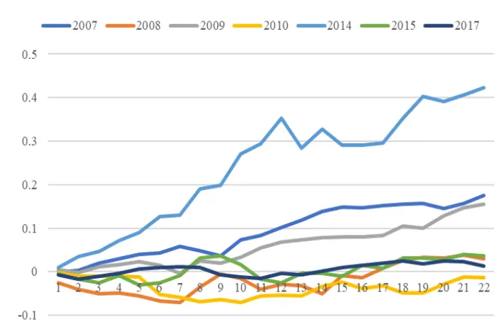
数据来源：国泰君安证券研究

图 11沪深 300上涨时分年度累计收益率
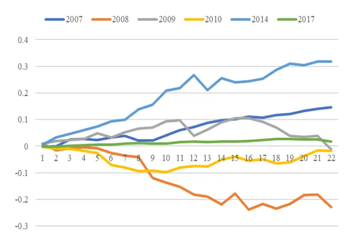
数据来源：国泰君安证券研究

图 12中证 500上涨时分年度累计收益率
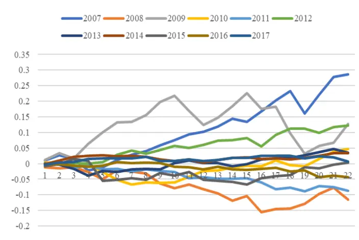
数据来源：国泰君安证券研究

图 13中小板综上涨时分年度累计收益率
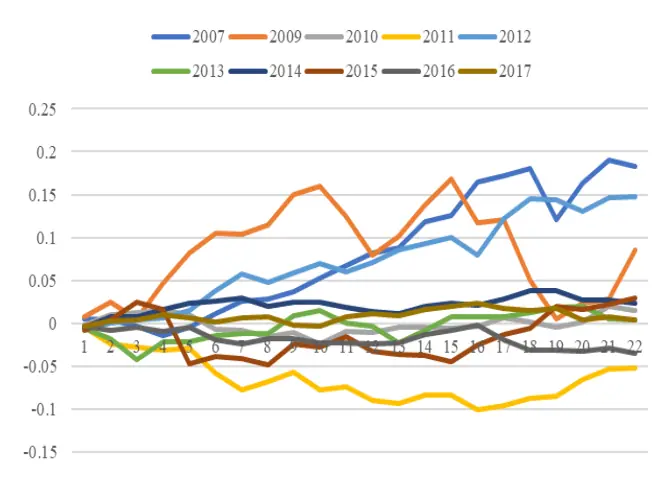
数据来源：国泰君安证券研究

图 14创业板指上涨时分年度累计收益率
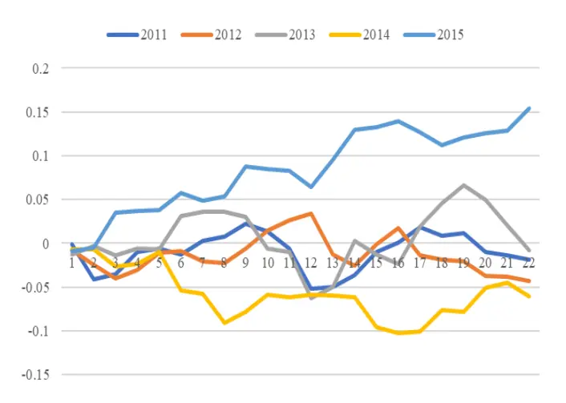
数据来源：国泰君安证券研究

表 12: 上证综指下跌时羊群效应发生后分年度表现

|  | 2008 | 2010 | 2011 | 2012 | 2013 | 2015 | 2017 |
| --- | --- | --- | --- | --- | --- | --- | --- |
| 收益率 | 7.92% | -1.25% | -3.25% | -11.70% | -2.87% | -1.47% | -1.78% |
| 胜率 | 100.00% | 0.00% | 0.00% | 0.00% | 0.00% | 50.00% | 25.00% |
| 开仓次数 | 4 | 1 | 2 | 1 | 1 | 2 | 4 |

数据来源：国泰君安证券研究

表 13: 上证 50下跌时羊群效应发生后分年度表现

|  | 2007 | 2008 | 2010 | 2011 | 2015 | 2017 |
| --- | --- | --- | --- | --- | --- | --- |
| 收益率 | -13.43% | 0.39% | -3.69% | 1.34% | 3.49% | -0.03% |
| 胜率 | 0.00% | 50.00% | 0.00% | 100.00% | 50.00% | 100.00% |
| 开仓次数 | 1 | 4 | 2 | 1 | 4 | 1 |

数据来源：国泰君安证券研究

表 14：沪深 300下跌时羊群效应发生后分年度表现

| 2007 | 2008 2015 |
| --- | --- |
| 收益率 -13.55% | 11.90% 4.80% |
| 胜率 0.00% | 100.00% 50.00% |
| 开仓次数 1 | 4 2 |

数据来源：国泰君安证券研究

表 15: 中证 500下跌时羊群效应发生后分年度表现

|  | 2008 | 2010 | 2011 | 2012 | 2013 | 2014 | 2015 | 2017 |
| --- | --- | --- | --- | --- | --- | --- | --- | --- |
| 收益率 | 5.54% | -8.71% | 2.72% | -14.39% | -6.62% | -4.72% | -8.84% | -2.23% |
| 胜率 | 50.00% | 0.00% | 100.00% | 0.00% | 0.00% | 0.00% | 0.00% | 50.00% |
| 开仓次数 | 4 | 1 | 2 | 1 | 1 | 1 | 2 | 4 |

数据来源：国泰君安证券研究

表 16: 中小板综下跌时羊群效应发生后分年度表现

|  | 2008 | 2010 | 2011 | 2012 | 2013 | 2015 | 2017 |
| --- | --- | --- | --- | --- | --- | --- | --- |
| 收益率 | 7.73% | -9.07% | -1.06% | -13.99% | -7.67% | -9.52% | -3.52% |
| 胜率 | 75.00% | 0.00% | 50.00% | 0.00% | 0.00% | 50.00% | 33.33% |
| 开仓次数 | 4 | 1 | 2 | 2 | 1 | 2 | 3 |

数据来源：国泰君安证券研究

表 17: 创业板指下跌时羊群效应发生后分年度表现

| 年份 | 2010 | 2011 | 2012 | 2013 | 2014 | 2015 | 2017 |
| --- | --- | --- | --- | --- | --- | --- | --- |
| 收益率 | -13.67% | -12.09% | -17.08% | -16.45% | -0.81% | -5.38% | -0.10% |
| 胜率 | 0.00% | 0.00% | 0.00% | 0.00% | 50.00% | 33.33% | 50.00% |
| 开仓次数 | 2 | 1 | 2 | 1 | 2 | 3 | 2 |

数据来源：国泰君安证券研究

图 15上证综指下跌时分年度累计收益率
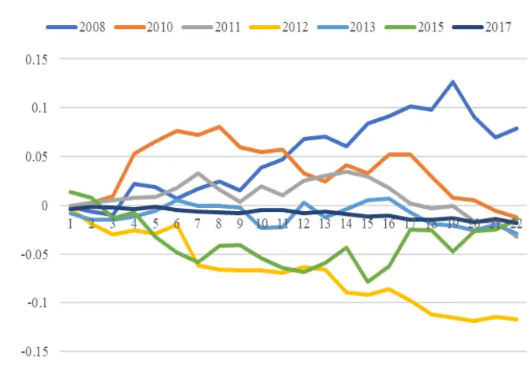
数据来源：国泰君安证券研究

图 16上证 50下跌时分年度累计收益率
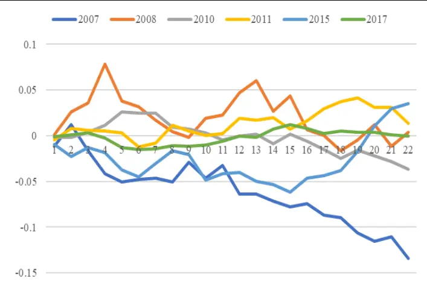
数据来源：国泰君安证券研究

图 17沪深 300下跌时分年度累计收益率
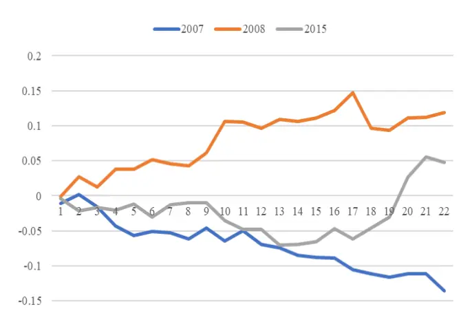
数据来源：国泰君安证券研究

图 18中证 500下跌时分年度累计收益率
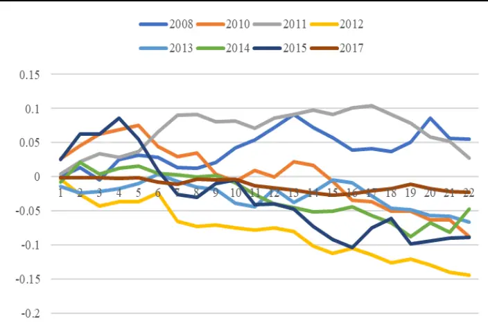
数据来源：国泰君安证券研究

图 19中小板综下跌时分年度累计收益率
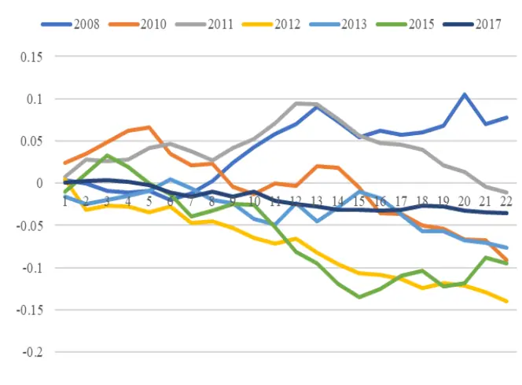
数据来源：国泰君安证券研究

图 20创业板指下跌时分年度累计收益率
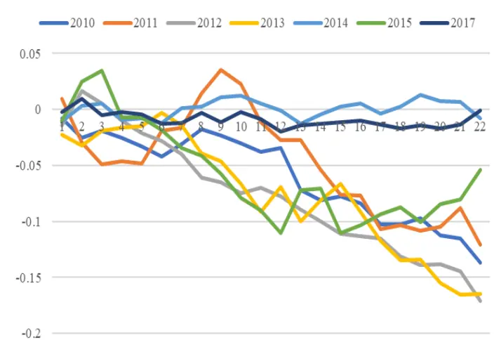
数据来源：国泰君安证券研究

## 5.2.行业指数分年度表现

表 18: 周期型行业上涨时羊群效应发生后分年度表现

|  | 2007 | 2008 | 2009 | 2010 | 2011 | 2012 | 2013 | 2014 | 2015 | 2016 | 2017 |
| --- | --- | --- | --- | --- | --- | --- | --- | --- | --- | --- | --- |
| 收益率 | 28.60% | -13.30% | 5.93% | -1.82% | -7.76% | 7.56% | 8.71% | 6.24% | 3.64% | -0.47% | -0.52% |
| 胜率 | 100.00% | 25.00% | 80.00% | 20.00% | 0.00% | 66.67% | 100.00% | 83.33% | 40.00% | 64.29% | 50.00% |
| 开仓次数 | 4 | 4 | 5 | 5 | 4 | 3 | 3 | 6 | 5 | 14 | 10 |

数据来源：国泰君安证券研究

表 19: 消费型行业上涨时羊群效应发生后分年度表现

|  | 2007 | 2008 | 2009 | 2010 | 2011 | 2012 | 2013 | 2014 | 2015 | 2016 | 2017 |
| --- | --- | --- | --- | --- | --- | --- | --- | --- | --- | --- | --- |
| 收益率 | 9.29% | -18.84% | 12.25% | -1.37% | 0.40% | 3.71% | 4.50% | 4.47% | 8.38% | -2.42% | -1.15% |
| 胜率 | 100.00% | 16.67% | 100.00% | 33.33% | 66.67% | 75.00% | 80.00% | 71.43% | 100.00% | 27.27% | 50.00% |
| 开仓次数 | 2 | 6 | 6 | 9 | 3 | 4 | 5 | 7 | 4 | 11 | 6 |

数据来源：国泰君安证券研究

表 20: 成长型行业上涨时羊群效应发生后分年度表现

|  | 2007 | 2008 | 2009 | 2010 | 2011 | 2012 | 2013 | 2014 | 2015 | 2016 | 2017 |
| --- | --- | --- | --- | --- | --- | --- | --- | --- | --- | --- | --- |
| 收益率 | 28.74% | -27.54% | 11.47% | -4.37% | -7.34% | 13.32% | -2.39% | 3.05% | -10.63% | -4.51% | -1.47% |
| 胜率 | 100.00% | 0.00% | 100.00% | 0.00% | 0.00% | 100.00% | 50.00% | 75.00% | 50.00% | 25.00% | 25.00% |
| 开仓次数 | 1 | 1 | 1 | 1 | 2 | 1 | 2 | 4 | 6 | 4 | 4 |

数据来源：国泰君安证券研究

表 21：金融型行业上涨时羊群效应发生后分年度表现

|  | 2014 | 2015 2016 | 2017 |
| --- | --- | --- | --- |
| 收益率 | 37.87% | 1.16% 1.79% | -0.14% |
| 胜率 | 100.00% | 75.00% 66.67% | 66.67% |
| 开仓次数 | 1 | 4 3 | 3 |

数据来源：国泰君安证券研究

图 21周期型行业上涨时分年度累计收益率
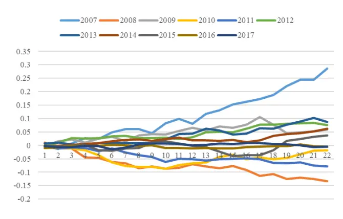
数据来源：国泰君安证券研究

图 22消费型行业上涨时分年度累计收益率
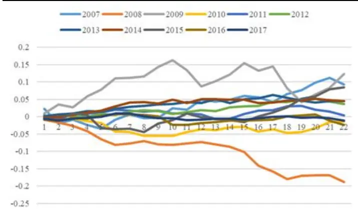
数据来源：国泰君安证券研究

图 23成长型行业上涨时分年度累计收益率
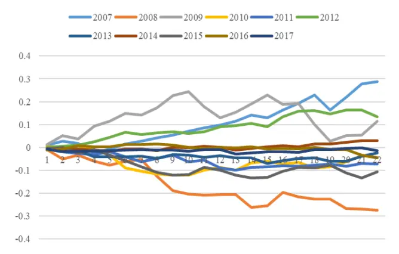
数据来源：国泰君安证券研究

图 24金融型行业上涨时分年度累计收益率
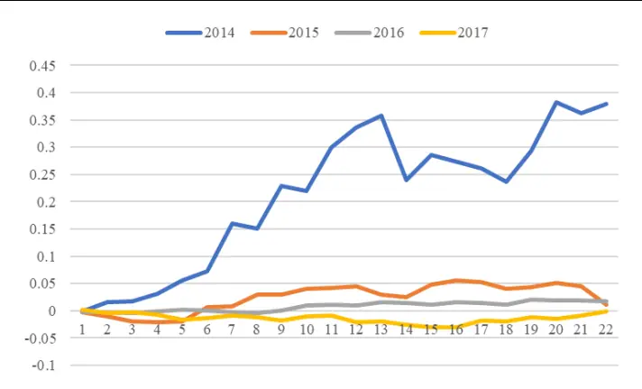
数据来源：国泰君安证券研究

表 22: 周期型行业下跌时羊群效应发生后分年度表现

|  | 2007 | 2008 | 2010 | 2011 | 2012 | 2013 | 2014 | 2015 | 2016 | 2017 |
| --- | --- | --- | --- | --- | --- | --- | --- | --- | --- | --- |
| 收益率 | -25.07% | 13.28% | -3.30% | -4.12% | -10.20% | -0.30% | -5.16% | 0.48% | -0.36% | -0.48% |
| 胜率 | 0.00% | 73.33% | 50.00% | 25.00% | 12.50% | 50.00% | 0.00% | 66.67% | 66.67% | 52.63% |
| 开仓次数 | 1 | 15 | 4 | 4 | 8 | 2 | 3 | 9 | 3 | 19 |

数据来源：国泰君安证券研究

表 23: 消费型行业下跌时羊群效应发生后分年度表现

|  | 2007 | 2008 | 2009 | 2010 | 2011 | 2012 | 2013 | 2014 | 2015 | 2016 | 2017 |
| --- | --- | --- | --- | --- | --- | --- | --- | --- | --- | --- | --- |
| 收益率 | -7.52% | 16.71% | -14.11% | -4.61% | 0.56% | -9.32% | -6.02% | -2.65% | 11.46% | -2.19% | -1.30% |
| 胜率 | 0.00% | 87.50% | 0.00% | 40.00% | 66.67% | 25.00% | 0.00% | 50.00% | 100.00% | 33.33% | 38.46% |
| 开仓次数 | 1 | 16 | 3 | 5 | 6 | 4 | 2 | 2 | 8 | 3 | 13 |

数据来源：国泰君安证券研究

表 24: 成长型行业下跌时羊群效应发生后分年度表现

|  | 2008 | 2010 | 2011 | 2012 | 2013 | 2014 | 2015 | 2016 | 2017 | 2008 |
| --- | --- | --- | --- | --- | --- | --- | --- | --- | --- | --- |
| 收益率 | 5.46% | -8.80% | 2.13% | -15.20% | -8.87% | -5.29% | -4.47% | -8.31% | -0.12% | 5.46% |
| 胜率 | 50.00% | 0.00% | 50.00% | 0.00% | 0.00% | 0.00% | 42.86% | 50.00% | 50.00% | 50.00% |
| 开仓次数 | 4 | 1 | 2 | 2 | 2 | 2 | 7 | 2 | 8 | 4 |

数据来源：国泰君安证券研究

表 25：金融型行业上涨时羊群效应发生后分年度表现

| 2015 | 2017 |
| --- | --- |
| 收益率 -1.86% | -2.10% |
| 胜率 42.86% | 50.00% |
| 开仓次数 7 | 2 |

数据来源：国泰君安证券研究

图 25周期型行业下跌时分年度累计收益率
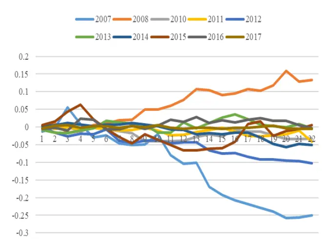
数据来源：国泰君安证券研究

图 26消费型行业下跌时分年度累计收益率
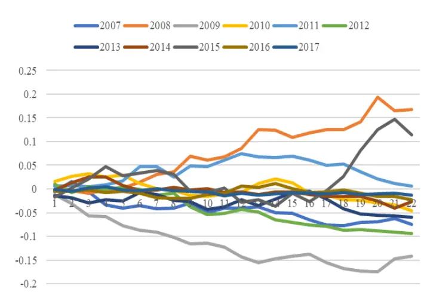
数据来源：国泰君安证券研究

图 27成长型行业下跌时分年度累计收益率
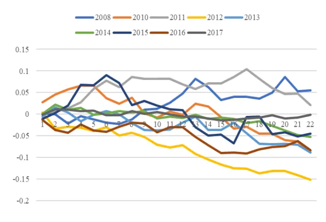
数据来源：国泰君安证券研究

图 28金融型行业下跌时分年度累计收益率
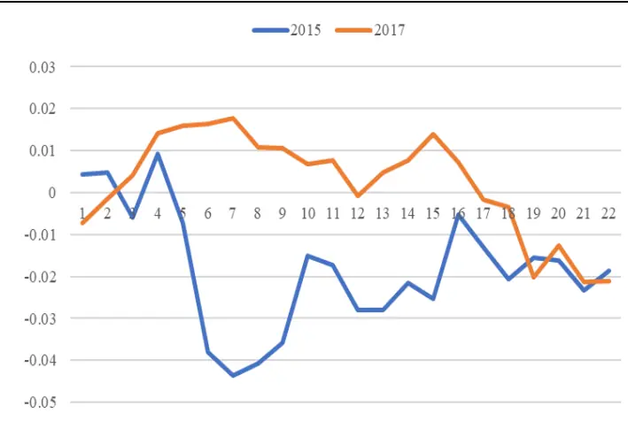
数据来源：国泰君安证券研究

## 本公司具有中国证监会核准的证券投资咨询业务资格

## 分析师声明

作者具有中国证券业协会授予的证券投资咨询执业资格或相当的专业胜任能力，保证报告所采用的数据均来自合规渠道，分析逻辑基于作者的职业理解，本报告清晰准确地反映了作者的研究观点，力求独立、客观和公正，结论不受任何第三方的授意或影响，特此声明。

## 免责声明

本报告仅供国泰君安证券股份有限公司（以下简称“本公司”）的客户使用。本公司不会因接收人收到本报告而视其为本公司的当然客户。本报告仅在相关法律许可的情况下发放，并仅为提供信息而发放，概不构成任何广告。

本报告的信息来源于已公开的资料，本公司对该等信息的准确性、完整性或可靠性不作任何保证。本报告所载的资料、意见及推测仅反映本公司于发布本报告当日的判断，本报告所指的证券或投资标的的价格、价值及投资收入可升可跌。过往表现不应作为日后的表现依据。在不同时期，本公司可发出与本报告所载资料、意见及推测不一致的报告。本公司不保证本报告所含信息保持在最新状态。同时，本公司对本报告所含信息可在不发出通知的情形下做出修改，投资者应当自行关注相应的更新或修改。

本报告中所指的投资及服务可能不适合个别客户，不构成客户私人咨询建议。在任何情况下，本报告中的信息或所表述的意见均不构成对任何人的投资建议。在任何情况下，本公司、本公司员工或者关联机构不承诺投资者一定获利，不与投资者分享投资收益，也不对任何人因使用本报告中的任何内容所引致的任何损失负任何责任。投资者务必注意，其据此做出的任何投资决策与本公司、本公司员工或者关联机构无关。

本公司利用信息隔离墙控制内部一个或多个领域、部门或关联机构之间的信息流动。因此，投资者应注意，在法律许可的情况下，本公司及其所属关联机构可能会持有报告中提到的公司所发行的证券或期权并进行证券或期权交易，也可能为这些公司提供或者争取提供投资银行、财务顾问或者金融产品等相关服务。在法律许可的情况下，本公司的员工可能担任本报告所提到的公司的董事。

市场有风险，投资需谨慎。投资者不应将本报告作为作出投资决策的唯一参考因素，亦不应认为本报告可以取代自己的判断。
在决定投资前，如有需要，投资者务必向专业人士咨询并谨慎决策。

本报告版权仅为本公司所有，未经书面许可，任何机构和个人不得以任何形式翻版、复制、发表或引用。如征得本公司同意进行引用、刊发的，需在允许的范围内使用，并注明出处为“国泰君安证券研究”，且不得对本报告进行任何有悖原意的引用、删节和修改。

若本公司以外的其他机构（以下简称“该机构”）发送本报告，则由该机构独自为此发送行为负责。通过此途径获得本报告的投资者应自行联系该机构以要求获悉更详细信息或进而交易本报告中提及的证券。本报告不构成本公司向该机构之客户提供的投资建议，本公司、本公司员工或者关联机构亦不为该机构之客户因使用本报告或报告所载内容引起的任何损失承担任何责任。

## 评级说明

## 1.投资建议的比较标准

投资评级分为股票评级和行业评级。

以报告发布后的12个月内的市场表现为比较标准，报告发布日后的 12个月内的公司股价（或行业指数）的涨跌幅相对同期的沪深 300 指数涨跌幅为基准。

## 2.投资建议的评级标准

报告发布日后的 12 个月内的公司股价（或行业指数）的涨跌幅相对同期的沪深 300 指数的涨跌幅。

|  | 评级 说明 |  |
| --- | --- | --- |
| 股票投资评级 | 增持 | 相对沪深 300指数涨幅15%以上 |
|  | 谨慎增持 | 相对沪深300指数涨幅介于5%～15%之间 |
|  | 中性 | 相对沪深 300指数涨幅介于-5%～5% |
|  | 减持 | 相对沪深300指数下跌 5%以上 |
| 行业投资评级 | 增持 | 明显强于沪深300 指数 |
|  | 中性 | 基本与沪深 300指数持平 |
|  | 减持 | 明显弱于沪深300指数 |

## 国泰君安证券研究所

|  | 上海 | 深圳 | 北京 |
| --- | --- | --- | --- |
| 地址 | 上海市浦东新区银城中路168号上海 银行大厦29层 | 深圳市福田区益田路 6009 号新世界 商务中心34层 | 北京市西城区金融大街 28 号盈泰中 心2号楼10层 |
| 邮编 | 200120 | 518026 | 100140 |
| 电话 | （021)38676666 | (0755)23976888 | (010)59312799 |
|  | E-mail: gtjaresearch@gtjas.com |  |  |