inInfo] [Table_Title] 2019.05.24

# ETF产品在国内市场的因地制宜与因时制宜

## ——数量化专题之一百二十三

黄皖璇（分析师）

## 陈奥林（分析师）

8 021-38677799

021-38674835

huangwanxuan@gtjas.com

chenaolin@gtjas.com

证书编号 S0880518110002

S0880516100001

## 本报告导读：

本报告在分析比较美国和中国A股市场主动投资和被动投资的相对关系基础上，对国内 ETF未来的发展进行展望。

## 摘要：

le_Summary]根据美国过去几十年资产管理领域的发展经验，在有效市场的作用下，被动投资的发展速度全面赶超主动投资。从实际收益的角度来看，绝大多数的主动型基金在扣除相关费用之后，并不能获得相对其基准组合的超额收益。

在A股市场中，我们追溯主动管理型基金的历史业绩发现，超过半数的基金产品在扣除相关管理和交易费用后，依然能够获得超过被动指数的收益，表明我国主动管理基金具有较高的投资效率。

主动投资的优势在特定市场阶段可能消失。如果将市场划分为不同阶段，可以看到主动投资在市场上涨阶段很难跑赢指数。2018 年市场经历了深度调整，各主要指数的估值处于历史相对低位，指数型基金的强β属性是其作为逆势加仓品种的重要原因。

从投资者结构的角度来看，A 股个人投资者交易占比常年在 80%以上，且没有下降趋势。个人投资者的存在于噪声交易紧密联系，市场非有效性的存在是主动管理获得超额收益的前提。

从主动管理规模的角度看，我国基金个体层面存在显著的规模报酬递减效应，而行业层面的规模报酬递减效应尚不明显，因此公募基金主动管理规模没有达到均衡状态，主动型基金的优势将继续延续。

- 宽基ETF在市场上涨阶段具备较强的进攻性，是投资者低位布局的有效工具。

从产品发行设计的角度出发，应注重其满足投资者配置需求的工具性属性，长期来看我们认为行业和策略类ETF更适合发行机构布局。

金融工程

## 金融工程团队：

陈奥林：（分析师）

电话：021-38674835

邮箱：chenaolin@gtjas.com

证书编号：S0880516100001

## 李辰：（分析师）

电话：021-38677309

邮箱：lichen@gtjas.com

证书编号：S0880516050003

## 孟繁雪：（分析师）

电话：021-38675860

邮箱：mengfanxue@gtjas.com

证书编号：S0880517040005

## 黄皖璇：（分析师）

电话：021-38677799

邮箱：huangwangxuan@gtjas.com

证书编号：S0880518110002

## 蔡旻昊：（研究助理）

电话：021-38674743

邮箱：caiminhao@gtjas.com

证书编号：S0880117030051

## 李栩：（研究助理）

电话：021-38032690

邮箱：lixu019018@gtjas.com

证书编号：S0880117090067

## 杨能：（研究助理）

电话：021-38032685

邮箱：yangneng@gtjas.com

证书编号：S0880117080176

## 殷钦怡：（研究助理）

电话：021-38675855

邮箱：yinqinyi@gtjas.com

证书编号：S0880117060109

## 余剑峰：（研究助理）

电话：021-38676186

邮箱：yujianfeng@gtjas.com

证书编号：S0880118060039

## [Table_R相关报告

《沪深300成分股调整名单与冲击成本预测》2019.05.20

《老有所依—中国养老金破局之路》2019.04.16

《ESG 投资：体系建立及策略应用（上）》2019.04.10

《北上资金偏好画像，由静至动》2019.03.31《宏观视角下的因子投资与风格配置（上）》2019.03.10

## 图目录

## 1. 研究背景

过去一年 A 股市场中 ETF 产品规模爆发式增长，无疑是低迷的市场环境中的一大热点。今年年初资本市场迎来了一波上涨，各主要市场指数表现不俗，对应的被动指数型基金也获利颇丰。在指数本身表现的内在驱动和基金管理公司大力营销的催化作用下，ETF产品作为一个的特殊基金类型，也逐渐得到越来越多投资者的认识，当下已经成为了各大公募基金管理公司重点布局的方向。

## 1.1. ETF 的美国发展现状

说到ETF的起源，不得不提到传统指数型基金。1975年，JohnBogle在美国设立了第一只面向公众开放的指数共同基金，即先锋500指数基金，该基金的成立标志着指数化投资的到来。

据统计，1977-1979 年先锋 500 指数基金的累计收益超过了市场上 1/4的共同基金，而到了 1980-1982 年间其累计收益已经超过了 1/2 的共同基金，随后在1983-1986年，该比例达到了3/4。先锋 500指数基金的丰厚回报使指数型基金逐渐成为主流的投资工具，其影响在全球日益扩大。

为了满足大型机构投资者风险对冲和套利的需求，ETF产品应运而生。与传统指数型基金相比，ETF兼具开放型和封闭型基金的特点，既可以在一级市场上以单位净值申购赎回，也可以在二级市场上按照市价买卖交易，并进行跨市场套利。综合而言，它具有交易费用低、透明度高、资金效率高、参与门槛低等优点。自 1993 年美国股票交易所推出了第一只真正意义上的跟踪S&P500的指数的ETF——SPDR，ETF在美国已经有了27年的发展历史。

根据美国投资公司协会 2019 年发布的美国基金业年鉴，数据显示截止到2018年底，美国ETF资产管理规模已经达到 33710 亿美元，是 2008年底的资产管理规模的6.35 倍，年复合增长率达到了 20.3%。同期传统的共同基金的资产管理规模的年复合增长率仅为6.29%。

图 1 美国共同基金和 ETF资产规模
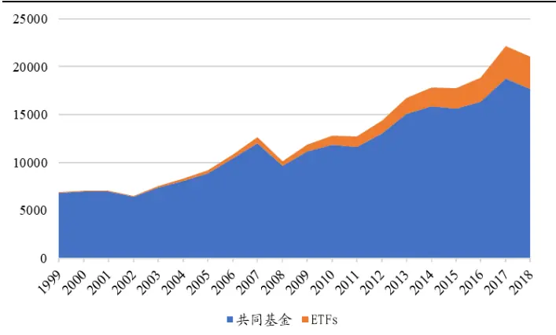
数据来源：国泰君安证券研究、ICI

从市场占比的角度来看，美国 ETF产品规模在整个股票市场中的占比自2000 年起呈现爆发式增长（Ben-David et al., 2017)，截至 2016 年底，该比例达到了 10%，而 ETF 的交易量在市场整体交易的比例达到了 30%以上。ETF产品作为一种创新型产品在美国资本市场攻城略地，其发展速度让传统的指数型基金和共同基金望尘莫及。

图 2 美国ETF的市值占比
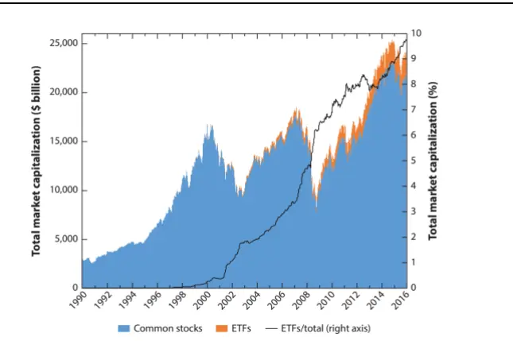
资料来源：Exchange Traded Funds, Ben-David et al.,2017

图 3 美国 ETF的交易占比
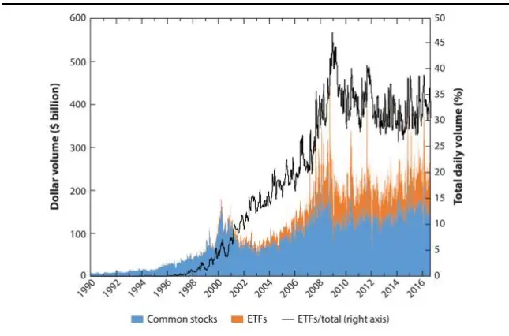

## 1.2. ETF 的国内发展现状

2018 年 A 股市场整体处于震荡调整过程中，交投清淡，ETF 产品却异军突起，迎来了大爆发的一年。截止到 2018 年底，ETF 的资产管理规模达到 3809 亿元（不包含货币 ETF），较 2017 年暴增 64%，全年新发行 ETF 产品 39 只，截止到年底的产品数量为 174 只，不论是从产品发行数量和资产管理规模的角度来看，都创下了历史之最。

图 4ETF数量和规模
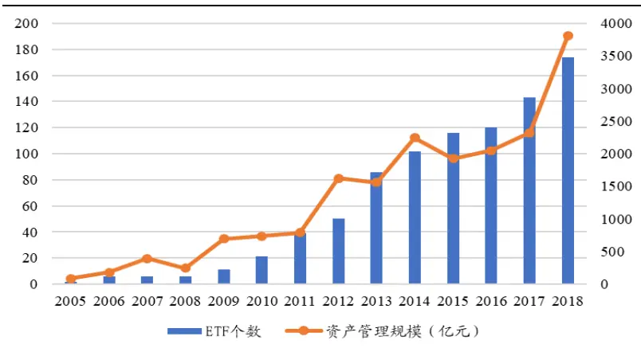
数据来源：国泰君安证券研究、Wind

反观美国ETF产品近 10年的快速发展，结合过去一年ETF在中国市场的爆发式增长，基金管理者和投资者都产生了相同的思考——美国 ETF的成功经验在我国资本市场是否可以被复制？被动投资相对主动投资在 A 股市场是否已经成为更优的选择？本文将带着这些疑问进行一些探索和思考。

我国早在2004年 11 月就推出了首只 ETF——上证50ETF，但是在此之后ETF发展较为缓慢，2004-2008 年间，沪深两市总共只有5只ETF上市交易。

图 5ETF产品发行统计
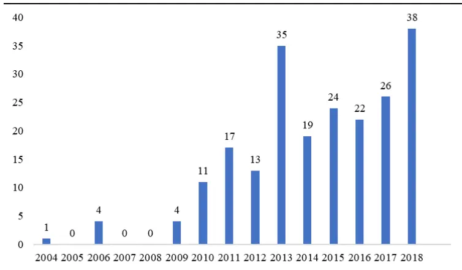
数据来源：国泰君安证券研究、Wind

2009年以后，我国 ETF产品进入了快速发展阶段。2009年以后沪深交易所开始加大力度推出创新型基金产品，ETF获得了难得的发展机遇，2010-2013 年跨市场 ETF、跨境 ETF、债券 ETF、黄金 ETF 等许多创新型的产品陆续涌出，我国ETF产品种类也日渐丰富起来。

表 1 ETF 产品发行分类统计

| 时间 | 规模指数 | 主题指数 | 风格指数 | 行业指数 | 策略指数 | 货币型 | 跨境型 | 债券型 | 商品型 |
| --- | --- | --- | --- | --- | --- | --- | --- | --- | --- |
| 2004 | 1 | 0 | 0 | 0 | 0 | 0 | 0 | 0 | 0 |
| 2005 | 0 | 0 | 0 | 0 | 0 | 0 | 0 | 0 | 0 |
| 2006 | 3 | 1 | 0 | 0 | 0 | 0 | 0 | 0 | 0 |
| 2007 | 0 | 0 | 0 | 0 | 0 | 0 | 0 | 0 | 0 |
| 2008 | 0 | 0 | 0 | 0 | 0 | 0 | 0 | 0 | 0 |
| 2009 | 2 | 2 | 0 | 0 | 0 | 0 | 0 | 0 | 0 |
| 2010 | 1 | 9 | 1 | 0 | 0 | 0 | 0 | 0 | 0 |
| 2011 | 7 | 5 | 2 | 1 | 2 | 0 | 0 | 0 | 0 |
| 2012 | 4 | 2 | 1 | 0 | 3 | 1 | 2 | 0 | 0 |
| 2013 | 10 | 2 | 1 | 12 | 1 | 1 | 2 | 3 | 3 |
| 2014 | 1 | 2 | 0 | 8 | 0 | 3 | 3 | 1 | 1 |
| 2015 | 9 | 0 | 0 | 8 | 0 | 6 | 1 | 0 | 0 |
| 2016 | 2 | 4 | 0 | 2 | 1 | 13 | 0 | 0 | 0 |
| 2017 | 8 | 6 | 0 | 6 | 0 | 3 | 1 | 2 | 0 |
| 2018 | 16 | 8 | 0 | 1 | 3 | 0 | 4 | 6 | 0 |
| 合计 | 64 | 41 | 5 | 38 | 10 | 27 | 13 | 12 | 4 |

数据来源：国泰君安证券研究、Wind

2018年全年ETF市场新发行产品数量为38只，除了跟踪宽基指数的ETF产品之外，发行量较大的还有主题型和债券型ETF。除了发行数量之外，

ETF 的交易活跃度在 2018 年也得到了极大的攀升，ETF 交易额与 A 股成交额的比值从 2015年下半年不足0.5%的最低点上升到3%以上，但是随着 2019 年 A 股市场转暖，ETF 的交易占比又有所回调，但是从绝对量的角度来看一直处于稳步上升的态势，这意味着ETF正逐渐受到越来越多投资者的认可并成为了他们的交易选择。

图 6ETF成交额占比
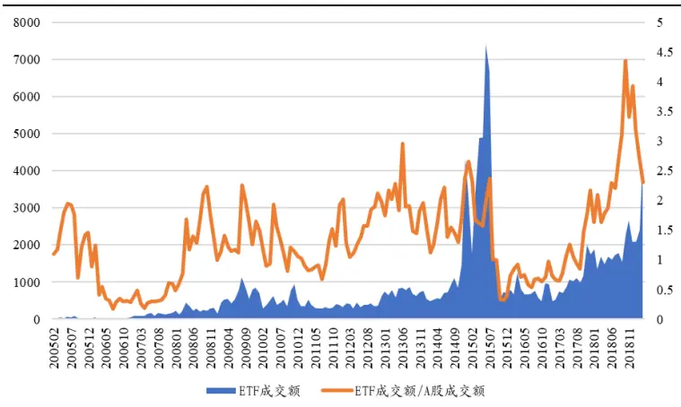
数据来源：国泰君安证券研究、Wind

## 2. ETF的美国成功之路

## 2.1.有效市场与被动投资

过去几十年，美国资产管理领域中的被动投资发展速度全面赶超主动投资。指数型基金（IndexFund）是美国上个世纪70 年代产生的基金产品，ETF的产生滞后其20年。根据 ICI的统计，被动投资基金（包括传统的指数型基金和 ETF 基金）的资产管理规模在 2018 年底达到了 6.6 万亿美元，占长期基金资产管理规模的 36%，而这一比例在 2008年仅18%。

图 7 美国基金市场规模占比
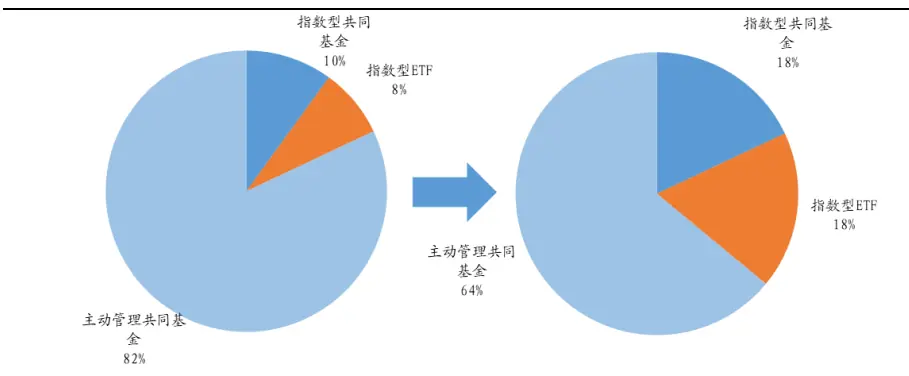
数据来源：国泰君安证券研究、Wind

从美国基金业的发展历史来看，虽然指数投资的起步相对较晚，初始资产管理规模也相对较小，但是其发展势头之迅猛已经对主动管理型基金的市场份额产生威胁。指数型共同基金乃至ETF在美国市场的成功并非偶然，诸多学者试图从理论和实证角度对其加以解释，其中最重要的就是有效市场理论。

在美国资本市场成立初期，市场中个人持股比例超过 90%，而根据2018年最新披露年报数据显示，超过90%的股票被机构所持有，个人持股比例不足 10%。根据 Stambaugh（2014）的研究，随着个人直接持股比例的降低，美国资产管理领域中的投资趋势正在从主动投资向被动投资转移。即便是在主动投资的范畴中，主动性投资成分也有所降低，也就是说主动管理的组合与基准指数之间的偏离也在收紧。

Stambaugh（2014）用微观结构理论模型对美国市场被动投资取代主动投资的趋势加以解释。他认为主动投资的效果取决于噪声交易者（NoiseTrader）在市场交易中的参与度。按照 Fischer Black 的定义，所谓的噪声交易者指的是一类市场参与者，他们在市场中交易产生的效用为负，对他们而言交易不如不交易。在行为金融学领域，噪声交易者往往跟个人投资者联系在一起，他们的交易行为通常缺乏理性。

随着资本市场的发展和资产管理行业的日趋成熟，个人投资者在市场中的占比将逐渐降低，相应市场中的噪声交易也会减少。主动投资正是通过纠正市场中由于噪声交易导致的错误定价而获利，一旦市场中的噪声交易比例降低，主动投资的获利空间也会缩小，从而限制了主动投资的发展。

确实，从实际收益的角度来看，美国超过半数的主动型基金在扣除相关费用之后，并不能获得相对其基准组合的超额收益，从而主动投资管理不如被动投资指数成为了美国市场中投资者和相关学者津津乐道的话题（Jensen (1968), Malkiel (1995), Gruber (1996), Wermers (2000), Pastorand Stambaugh (2002b), Fama and French (2010), Del Guercio and Reuter(2011)）。

晨星每半年发布的《Morningstar Active/Passive Barometer》中统计了主动型基金的“存活率”，也就是报告期内有多大比例的主动管理基金续存并产生了超越平均加权被动基金回报率的回报。报告发现，在截至2018年12月的10年时间里，只有 24%的主动基金超过了其相应被动基金的平均水平。

## 2.2.ETF——有效市场中低成本优势明显

被动投资相对于主动投资天然具有成本上的优势。被动投资，也即被动地跟踪某一指数，过程中不需要基金经理的择时和选股能力，因此基金管理费用通常低于主动管理型基金。另外，由于不需要频繁换仓，基金不涉及过多的交易费用。

相比于传统的指数型基金，ETF在成本和流动性上的优势更加明显：

第一，ETF能够有效跟踪指数。由于套利机制的存在，ETF基金与普通的指数基金相比，跟踪误差往往更小。

第二，成本较低。除了交易所的交易佣金外，ETF的管理费通常低于普通的指数型基金。

第三，较高的流动性。传统的指数型基金没有二级市场，只能在一级市场上以单位净值进行申购和赎回，但是ETF的二级市场可交易属性使得其报价实时更新，可以实现快速交易。并且可以实施跨一级市场和二级市场的套利交易。

## 3. 中国资本市场的有效程度与基金产品

## 3.1.中国资本市场交易以个人投资者为主

市场有效性越强，交易成本和流动性对投资者的重要性就越敏感，美国的资本市场环境无疑是ETF产品快速成长的最为重要的土壤。中国是否也具备类似的市场环境呢？

根据上交所公布的《上海证券交易所统计年鉴》的统计，沪市个人投资者的持股比例已经从 2007 年末的 48.29%下降到了 2017 年的 21.17%。但是在交易量方面，个人投资者的交易金额占比一直居高不下，每年超过 80%的交易来自于自然人投资者，这一比例在 2017 年达到 82.01%，而机构仅占14.76%，个人投资者的交易量是机构的5 倍之多。

图 8 上交所投资者结构
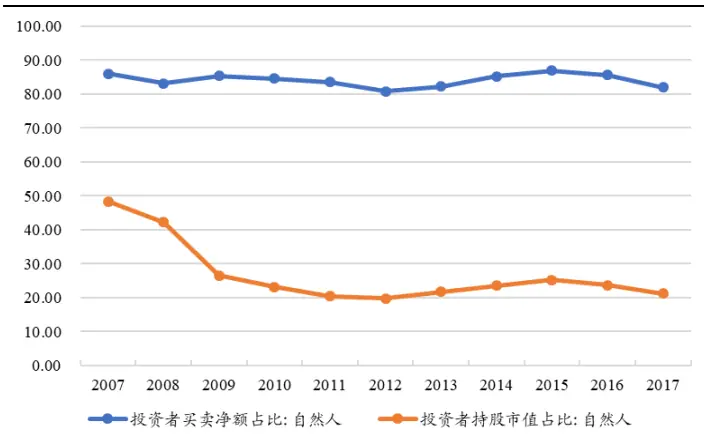
数据来源：国泰君安证券研究、Wind

频繁交易的个人投资者究竟是作为聪明的投资者还是所谓的“噪声交易者”呢？我们不妨再关注不同类型投资者的盈利数据，2017年自然人投资者整体盈利3108亿元，专业机构整体盈利11156亿元。个人投资者的交易量是专业机构的 5 倍而盈利却不足专业机构的 1/3。鉴于此，从投资者结构的角度来看，我国资本市场有效性程度较低。

## 3.2.主动管理的优势尚存

基于历史数据分析结果显示，主动管理型基金在A股市场中的管理效率也相对较强。我们搜集了A 股市场中所有的股票型和混合型基金，分别计算每只基金相对其基准指数的表现。每一只基金的基准通常为一个指数组合，例如基金大摩品质生活精选（000309.OF）在产品说明书中给出的业绩比较基准为“沪深 300 指数收益率*85%+标普中国债券指数收益率*15%”，我们就选取比重最大的一个股票指数作为其基准指数，该例子中基金的基准指数则为沪深300指数。对于偏债的混合型基金，其业绩比较基准中债券指数的权重相对更高，因此这类基金不在本节的分析讨论范围内。

在得到每只基金基准指数的基础上，我们分别计算基金续存期内，是否跑赢其相应的基准指数。按照基准指数的不同类型，我们将主动型基金划分为6 大类，每一类基金在其续存期内相对其基准指数的胜率统计如表 2。

表 2 按照基准指数类型分类的主动型基金胜率统计

| 指数类型 | 观测数 胜率 |
| --- | --- |
| 规模指数 | 0.553 |
| 行业指数 | 2306 86 0.688 |
| 策略指数 | 2 0.500 |
| 风格指数 | 4 1.000 |
| 主题指数 | 208 0.659 |
| 综合指数 | 18 0.944 |
| 合计 | 2631 0.569 |

数据来源：国泰君安证券研究、Wind

在所有的主动股票型基金中，对标规模指数的基金数量最多，其次是主题指数。跟踪策略指数和风格指数的基金数量较少，缺乏统计意义，其余所有类型的基金胜率均超过 50%，这意味着从基金管理历史业绩的角度来看，即使在扣除了管理费的情况下，A股大多数的主动管理型基金能够跑赢被动指数，获得相应的超额收益。

考虑到一些主动管理型基金在制定基准指数的时候可能倾向于选择相对较为容易获取超额收益的指数，而不以实际投资目的为考虑，这样就会产生计算偏差。市场上还有一类指数增强型基金，他们的投资范围相对固定，在给定基准的基础上，通过仓位和个股权重的调整以期获得相对基准指数的超额收益。

表 3 按照基准指数类型分类的指数增强型基金胜率统计

| 指数类型 | 胜率 |
| --- | --- |
| 规模指数 | 0.688 |
| 主题指数 | 112 14 0.643 |
| 策略指数 | 3 0.000 |
| 风格指数 | 3 0.000 |
| 综合指数 | 2 1.000 |
| 行业指数 | 1 1.000 |
| 合计 | 137 0.650 |

数据来源：国泰君安证券研究、Wind

表3统计了各类指数增强型基金相对基准指数的胜率，在基金的续存期内，指数增强型基金的整体胜率为 65%。据我们统计，在 112 个跟踪规模指数的基金中，49只基金跟踪沪深 300指数，胜率为 65.3%，31只基金跟踪中证500指数，胜率为 71%。从指数增强型基金历史业绩的角度来看，绝大多数能够起到有效的增强作用，这也是A 股市场显著区别于美国市场的重要特征之一。

## 3.3.被动投资的市场底部崛起

观察A股市场交易者结构以及主动管理型基金的绩效不难发现，A股市场有效性与美国市场相比存在一定的距离。但是被动投资在 2018 年的爆发式增长也具有其内在逻辑。

表 4 主动管理基金分段胜率统计

| 时间 | 观测数 | 胜率 | 上证指数收益 | 平均超额收益 |
| --- | --- | --- | --- | --- |
| 2005H1 | 49 | 0.959 | -10.015 | 9.553 |
| 2005H2 | 61 | 0.426 | 3.541 | 0.052 |
| 2006H1 | 75 | 0.680 | 23.127 | 7.776 |
| 2006H2 | 101 | 0.198 | 91.402 | -9.064 |
| 2007H1 | 128 | 0.281 | 109.262 | -12.383 |
| 2007H2 | 147 | 0.218 | 40.262 | -5.729 |
| 2008H1 | 166 | 0.988 | -49.922 | 11.967 |
| 2008H2 | 195 | 0.964 | -36.159 | 13.780 |
| 2009H1 | 224 | 0.013 | 130.655 | -24.700 |
| 2009H2 | 252 | 0.472 | 11.687 | 0.119 |
| 2010H1 | 283 | 0.982 | -28.149 | 10.858 |
| 2010H2 | 315 | 0.648 | -9.823 | 2.454 |
| 2011H1 | 346 | 0.176 | 8.106 | -4.386 |
| 2011H2 | 380 | 0.861 | -8.670 | 5.831 |
| 2012H1 | 418 | 0.495 | -2.758 | 0.182 |
| 2012H2 | 434 | 0.336 | 6.461 | -1.671 |
| 2013H1 | 457 | 0.958 | 0.453 | 16.386 |
| 2013H2 | 491 | 0.650 | 22.869 | 3.093 |
| 2014H1 | 558 | 0.805 | -1.552 | 5.288 |
| 2014H2 | 618 | 0.037 | 59.839 | -32.977 |
| 2015H1 | 827 | 0.768 | 11.094 | 15.900 |
| 2015H2 | 1042 | 0.845 | -17.538 | 10.764 |
| 2016H1 | 1247 | 0.742 | -11.607 | 5.547 |
| 2016H2 | 1586 | 0.260 | 4.598 | -3.704 |
| 2017H1 | 1860 | 0.239 | 3.187 | -4.529 -2.048 |
| 2017H2 | 2075 | 0.349 0.851 | 43.736 -31.654 | 6.423 |
| 2018H1 2018H2 | 2315 2377 | 0.596 | 4.862 | 2.315 |
| 2019Q1 | 2357 | 0.232 | 23.93 | -7.373 |

数据来源：国泰君安证券研究、Wind

如果我们将历史的时间轴进行划分，就可以看到主动投资的相对优势在特定的市场阶段可能消失。表 4 将 2005 年至 2018 年这 14 年间，按照每半年为一个时间区间，分别统计了不同区间内主动管理型基金相对基准指数的胜率。

在28个时间区间中，主动型基金获得平均正向超额收益的区间为18个，占据多大多数的比例。进一步观察不难发现，主动型基金的胜率与大盘指数收益之间呈高度负相关关系。

在样本考察期间，我国A股市场经历了三次快速上涨阶段，分别为2006年下半年至 2007 年 10 月、2008 年 11 月-2009 年 7 月以及 2014 年下半年至 2015 年 5 月，对应的区间内主动型基金胜率不足 3 成。由于主动型基金的股票仓位通常不会达到 100%，在市场上涨时的进攻性自然弱于百分百持有标的股票的指数型基金，相应的股票型基金在市场下跌过程中的防守性也更强。

表 5 指数增强型基金分时段胜率统计

| 时间 | 观测数 | 胜率 | 上证指数收益 | 平均超额收益 |
| --- | --- | --- | --- | --- |
| 2005H1 | 6 | 0.833 | -10.015 | 4.510 |
| 2005H2 | 6 | 0.833 | 3.541 | 0.990 |
| 2006H1 | 6 | 0.667 | 23.127 | -2.532 |
| 2006H2 | 6 | 0.000 | 91.402 | -6.045 |
| 2007H1 | 6 | 0.000 | 109.262 | -6.994 |
| 2007H2 | 6 | 0.167 | 40.262 | -4.765 |
| 2008H1 | 6 | 1.000 | -49.922 | 16.382 |
| 2008H2 | 7 | 1.000 | -36.159 | 10.421 |
| 2009H1 | 7 | 0.000 | 130.655 | -9.832 |
| 2009H2 | 10 | 0.000 | 11.687 | -2.467 |
| 2010H1 | 14 | 1.000 | -28.149 | 5.570 |
| 2010H2 | 16 | 0.375 | -9.823 | -1.694 |
| 2011H1 | 18 | 0.444 | 8.106 | 1.264 |
| 2011H2 | 23 | 0.870 | -8.670 | 3.738 |
| 2012H1 | 26 | 0.346 | -2.758 | -0.962 |
| 2012H2 | 29 | 0.414 | 6.461 | 0.151 |
| 2013H1 | 34 | 0.765 | 0.453 | 2.547 |
| 2013H2 | 40 | 0.500 | 22.869 | 0.188 |
| 2014H1 | 42 | 0.667 | -1.552 | 0.653 |
| 2014H2 | 44 | 0.205 | 59.839 | -4.327 |
| 2015H1 | 52 | 0.538 | 11.094 | 0.168 |
| 2015H2 | 54 | 0.759 | -17.538 | 2.929 |
| 2016H1 | 57 | 0.860 | -11.607 | 3.578 |
| 2016H2 | 70 | 0.686 | 4.598 | 1.551 |
| 2017H1 | 86 | 0.616 | 3.187 | 0.591 |
| 2017H2 | 94 | 0.660 | 43.736 | 1.794 |
| 2018H1 | 108 | 0.889 | -31.654 | 4.299 |

| 2018H2 | 118 | 0.805 4.862 | 2.374 |
| --- | --- | --- | --- |
| 2019Q1 | 126 0.095 | 23.93 | -2.212 |

数据来源：国泰君安证券研究、Wind

表5统计的指数增强型基金分区间的业绩表现与表4中主动型基金的情况类似。在历史上3次牛市中指数增强型基金很难起到增强作用，但是在熊市以及震荡市中，大多数指数增强基金产品能够获得相对基准指数的超额收益。

2018年市场经历了深度调整，当投资者预期市场处于底部区域时，指数型基金是低位布局的重要工具。如果投资者认为市场已经历了充足的调整并对后市看好，那么被动指数型产品则是相对更优的选择，因为在快速上涨的市场中 100%仓位的指数型产品通常收获更优的表现。

## 3.4. 主动管理相对优势的可持续性

上一节的研究结论显示，从历史经验的角度看，主动管理在A股市场尚有一定的相对优势，除去市场上涨趋势明显的阶段，大多数主动管理型基金和指数增强型基金跑赢指数是常态。接下来的问题就是，站在当下，主动管理的优势在未来是否可以持续？2018 年 ETF 基金的爆发是否标志着A股已经踏入了与美国类似的被动投资快速发展的时代？

## 3.4.1. 美国主动管理行业的规模报酬递减效应

美国的指数型基金产生于上个世纪 70 年代，有效市场理论的产生推动了指数型基金的发展。尽管从整体历史业绩的角度来看，美国主动管理型基金并不能为投资者带来超越被动投资的收益，但是主动管理在美国资产管理行业依然占据了65%的比例。

既然无法获得超额收益，为什么投资者还会选择主动管理。被动投资虽然一定程度上挤占了主动投资的市场份额，但却不能取而代之，许多研究试图从理论的角度对这个看上去有些非理性现象加以解释，最主流的理论就是主动管理行业的“规模报酬递减效应”。这里的规模报酬递减可以分为两个层次，一个是基金个体层面，另外一个是整个基金管理行业层面。

从基金个体的层面出发，寻找市场中的投资机会需要付出搜寻成本，在相对固定的基金研发团队资源的条件下，投资机会的寻觅可能受到限制。另外，大规模的交易容易对个股产生流动性冲击，直接吞噬潜在交易机会的收益从行业的角度出发，如果主动管理基金的规模增大到一定程度，以至于接近成为市场本身，主动管理战胜市场就会成为悖论。

主动管理的规模报酬递减效应在美国市场上已经得到了数据的验证（Berk and Green，2004；Pastor et al.，2014），我国资产管理行业发展到目前为止处于又什么样的状态？这个问题直接关系到我国未来主动投资和被动投资的相对发展。

图9和图10分别刻画了自2005年以来我国主动管理型基金和ETF基金的股票市值占比。从管理规模上看，我国主动管理型基金的在 2005 年到 2007 年之间增长迅速，这与 2007 年的 A 股牛市不无关系。自 2007年之后主动基金中的股票市值没有显著增长，相应的在市场总流通市值中的比重不断下降，截至 2018 年底，主动管理型基金持股市值在 A 股中的占比为 3.52%。另一方面，ETF 基金持有的股票市值却一直保持上涨的态势，随着去年 ETF 产品规模的爆发，其在 A 股流通盘中的占比在2018年爆发式上涨，截止到年底该比例为 0.93%。

图 9 股票型和混合型基金股票市值占比
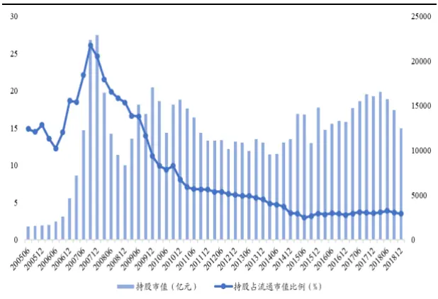
数据来源：国泰君安证券研究、Wind

图 10 ETF股票市值占比
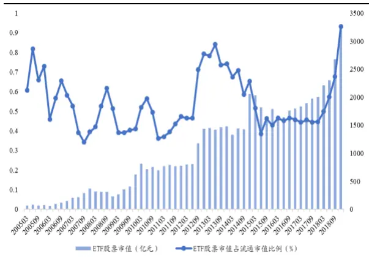
数据来源：国泰君安证券研究、Wind

## 3.4.2. A股基金个体层面的规模报酬递减效应

本文借鉴已有研究，采用简单线性回归的方式检验我国基金是否存在个体层面的规模报酬递减效应。为了较为准确的衡量基金的管理能力，我们首先根据一个季度的日频数据，采用 CAPM 模型计算单个基金的Alpha收益。基金的资金流指标计算如下：

$$
Flow_{t}=\frac{TNA_{t}(1+R_{t})}{TNA_{t-1}}
$$

Flow衡量了相隔两个季度基金的资金净流入。之后采用线性回归的方式考察基金超额收益与滞后的资金流之间的关系，考虑到基金收益在时间序列上可能存在一定的自相关性，模型中同时加入了基金超额收益的滞后项作为控制变量，结果如表 6所示。

表 6 基金个体层面的规模报酬递减

| 变量 | L.Flow | L.Alpha | L2.Flow | L2.Alpha | Intercept |
| --- | --- | --- | --- | --- | --- |
| 系数 | -0.482*** | 0.340*** | -0.0348 | 0.174*** | 1.475*** |
| (标准差) | (0.149) | (0.005) | (0.122) | (0.005) | (0.095) |

数据来源：国泰君安证券研究。注：***/**/*分别代表 0.01/0.05/0.1 显著水平上显著。

滞后一期的资金流系数显著为负，意味着从基金个体层面的角度来看，确实存在显著的规模报酬递减效应。换而言之，基金经理获取超额收益的能力会随着资金流入规模的扩大而降低。

## 3.4.3. 主动管理基金行业尚未显露规模报酬递减效应

对于基金管理行业层面，本文通过向量自回归模型（Vector AutoRegression）检验主动管理基金的市场规模(AumtoMktcap)与其获取超额收益(InduAlpha)之间的关系。

在得到每只基金超额收益的基础上，计算资产管理规模加权的基金行业超额收益，并考察行业超额收益的获取与主动管理规模之间的关系，这里采用基金主动管理的相对规模，也就是主动管理的权益类资产规模与A 股流通市值比例。

表 7VAR（2）模型结果

| 因变量 | L1.AumtoMktcap | L1.InduAlpha | L2.AumtoMktcap | L2.InduAlpha |
| --- | --- | --- | --- | --- |
| AumtoMktcap | 1.086*** | 1.587 | -0.168 | 4.555*** |
|  | (8.44) | (1.34) | (-1.37) | (3.84) |
| InduAlpha | 0.022 | 0.3336** | -0.020 | 0.143 |
|  | (1.37) | (2.29) | (-1.31) | (0.97) |

数据来源：国泰君安证券研究、Wind。注：***/**/*分别代表 0.01/0.05/0.1 显著水平上显著。

向量自回归模型的结果显示，从我国 A股市场的目前发展阶段来看，基金获取超额收益的能力可以解释未来行业的资产管理规模，行业超额收益提高可以吸引更多的资金流入，但不存在反向因果关系，也就是说行业资产管理规模对行业获取超额收益的能力不存在显著影响。

综上所述，目前来看我国主动管理型基金存在个体层面的规模报酬递减效应，资金流入会导致基金的超额收益降低，该结论与美国市场相同。但是从整个行业的角度来看，尚不存在规模不经济的现象，这可能与主动管理型基金在整个市场中的占比不高有关。

实际上，除了本文考察的公募基金之外，我国资产管理行业中还有很多其他类型的参与机构，例如私募、保险、银行券商资管以及产业资本等，公募基金的主动资产管理规模只占主动管理市场的一部分，因此主动型基金的资产规模对市场整体有效性的影响十分有限。从这种有限的视角出发，我国公募主动管理的规模并没有达到类似美国近乎均衡状态。结合A 股个人投资者市场参与程度偏高的低市场效率环境，我们认为主动管理基金获得超额收益能力能够进一步持续。

## 4. ETF的未来发展方向

## 4.1.机构配置工具

美国 ETF 盛行的一大重要原因就是满足了投资者的资产配置需求，在有效性较高的市场中，配置的重要性高于选股。ETF相对传统的主动管理型和被动投资型基金具有天然的成本和流动性优势，目前投资品种的丰富程度也日趋完善，能够有效的满足投资者在底层大类资产配置上的需求。Blackrock针对美国 ETF市场分析发现，投资被动指数 ETF进行被动投资只是表象，如果放到相对宏观的视角，从各类资产规模的配比来看，投资者正在通过投资 ETF 实施主动投资管理，因为各类 ETF 的规模比例存在相对市场的偏离。

图 11 ETF基金机构持有比例
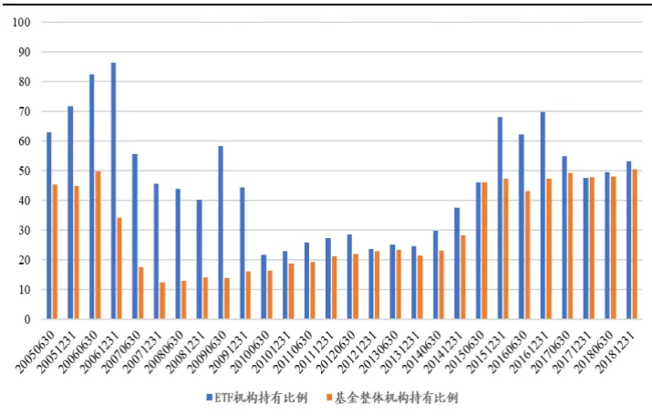
数据来源：国泰君安证券研究、Wind

图11展示了我国基金投资者中机构持股占比。需要特别说明的是，ETF联结基金通常作为机构投资者存在于基金的投资者结构中，但是ETF联结基金的投资者可能主要为个人投资者，所以相关统计得到的机构持股比例往往相对实际偏高。我们在计算过程中对ETF投资者结构做了双层剥离，计算 ETF的实际机构持股比例。

从时间序列来看，基金的机构持有比例自 2007 年之后一直不断提升。ETF基金品种创立之初主要投资者为机构，投资占比一度超过 50%，之后下降到20%左右，近几年机构持有比例与整个公募基金行业保持相同的上涨趋势，但是机构持股比例一直略高于行业平均水平，这意味着ETF相对于传统的基金品种更受机构投资者的青睐。

行业的规模在增长，而机构持股比例也在内生增长，这从侧面反映出机构的投资需求推动了行业的发展。随着养老金的入市，FOF产品数量和规模的进一步提高，机构对指数型基金的需求将会进一步提高。ETF基金具有低费用、管理透明、高流动性的特点，与传统股票基金相比有着更高的交易效率，而且在税收和管理费用等方面都更低廉。机构投资者产生长期的资产配置需求必然会推动ETF行业的发展。

## 4.2. 宽基指数 ETF低位布局

美国 ETF 目前的快速发展一方面来源于宽基 ETF 产品的核心作用，一方面也来源于各种创新型Smartbeta产品。传统的规模/行业指数ETF在美国市场上的竞争已经白热化，产品同质性严重，产品之间的竞争已经转变为基金费率的竞争。

由于指数ETF的主要考核标准是最小化跟踪误差，管理时间越长的基金更容易吸引资金，规模越大的基金越有成本优势。因此产生了头部公司强者恒强的“马太效应”，该现象在国内市场也体现的十分明显。

表8以跟踪中证500指数的 ETF为例，每半年为一个观测点对市场上跟踪该指数的ETF基金规模进行排序，从历史表现来看，规模排名前两位的ETF产品十分稳定。规模最大的也是成立时间最早的 500ETF在所有相同基准指数产品中的市场份额自2015年6月起一直保持在70%以上。

表 8 跟踪中证 500指数的 ETF基金规模排序

| DATE | AUM.1 | AUM.2 | AUM.3 | AUM.4 | AUM.5 | AUM.6 | AUM.7 | AUM.8 | AUM.9 | AUM.10 | AUM.11 |
| --- | --- | --- | --- | --- | --- | --- | --- | --- | --- | --- | --- |
| 201306 | 510500. | 159922. | 510510. |  |  |  |  |  |  |  |  |
| 201312 | 510500. | 510510. | 159922. |  |  |  |  |  |  |  |  |
| 201406 | 510500. | 510510. | 510520. | 159922. | 159935. |  |  |  |  |  |  |
| 201412 | 510500. | 510510. | 159922. | 510520. | 159935. |  |  |  |  |  |  |
| 201506 | 510500. | 510510. | 512500. | 159922. | 512510. | 159935. | 510520. |  |  |  |  |
| 201512 | 510500. | 510510. | 512500. | 159922. | 510560. | 512510. | 510520. | 159935. | 510580. |  |  |
| 201606 | 510500. | 510510. | 512500. | 159922. | 512510. | 510560. | 510520. | 159935. | 510580. |  |  |
| 201612 | 510500. | 510510. | 512500. | 159922. | 512510. | 510560. | 510520. | 159935. | 510580. |  |  |
| 201706 | 510500. | 510510. | 159922. | 512500. | 159935. | 512510. | 510560. | 510520. | 510580. |  |  |
| 201712 | 510500. | 510510. | 159922. | 512500. | 159935. | 512510. | 510560. | 510520. | 510580. |  |  |
| 201806 | 510500. | 510510. | 510590. | 512500. | 159922. | 512510. | 159935. | 510560. | 510520. | 510580. |  |
| 201812 | 510500. | 510510. | 512500. | 510590. | 159922. | 512510. | 159935. | 510560. | 510520. | 510580. |  |
| 201903 | 510500 | 510510 | 512500 | 510590 | 159922 | 512510 | 159935 | 510560 | 510580 | 510550 | 510520 |

数据来源：国泰君安证券研究、Wind

考虑到中证 500、沪深300、上证 50和创业板指是A股市场上最为主流的也是被规模ETF追踪最多的指数，图 12-图 15 分别考察以这四个宽基指数为基准的ETF规模变化，图中不同底色用于区分市场中跟踪指数的ETF基金数量。

图 12 中证 500指数估值与ETF规模
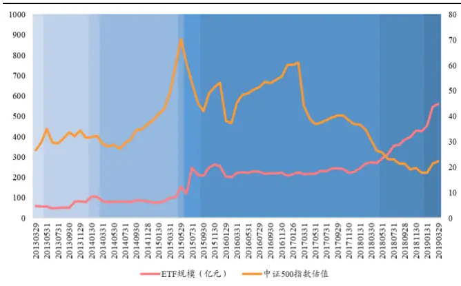
数据来源：国泰君安证券研究、Wind

图 13 沪深 300指数估值与 ETF规模
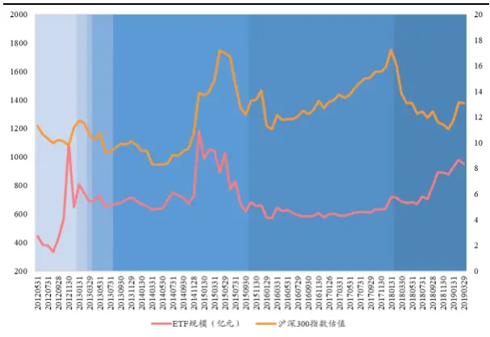
数据来源：国泰君安证券研究、Wind

图 14 上证 50指数估值与ETF规模
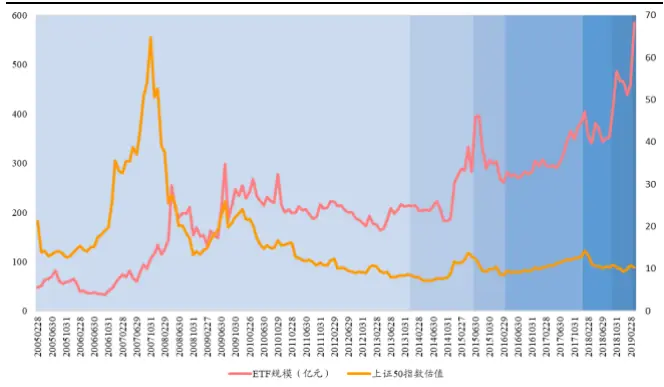
数据来源：国泰君安证券研究、Wind

图 15 创业板指估值与 ETF规模
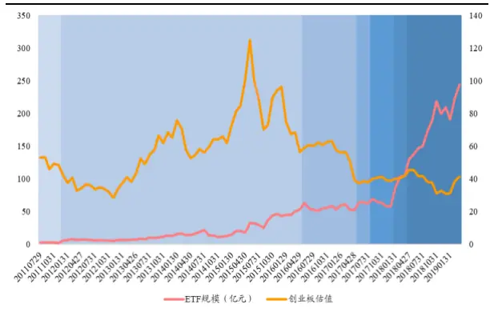
数据来源：国泰君安证券研究、Wind

跟踪沪深300 指数的ETF产品在产生初始阶段就吸引了大规模资金，之后规模随指数表现波动较大。其余三类指数ETF规模自产生以来均缓慢增长，如果将规模变化与相应估值表现联系起来不难发现，指数估值下行过程中相应ETF规模增长相对更快，也就是所谓的“越跌越买”，体现出投资者低位布局的偏好。

## 4.3.细分领域ETF将成为下一个突破点

上文分析描述了我国A股与美国市场投资环境的异同，目前来看，由于市场有效性尚未达到发达资本市场水平，主动管理相对被动投资仍然具有一定的优势。其实根据已有研究，这个现象在新兴市场中表现较为普遍。另外，针对基金规模报酬递减效应的研究结论显示，由于目前我公募主动管理型基金整体行业规模未达到均衡状态，因此主动投资的优势在未来还会延续，但是这并不意味ETF的发展会因此受到限制。

图 162019年一季度末各类 ETF规模（单位：亿元）
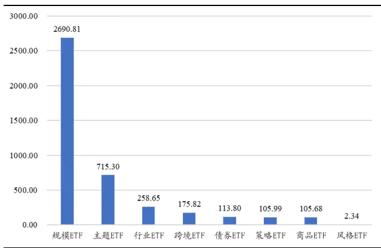
数据来源：国泰君安证券研究、Wind

图 17 各类 ETF 规模分布
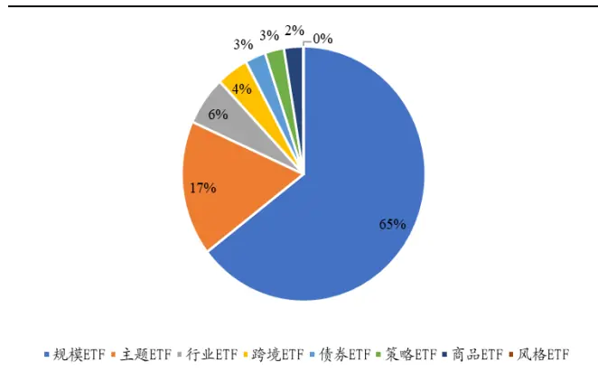
数据来源：国泰君安证券研究、Wind

从截止到目前我国ETF发行交易情况来看，以宽基指数为跟踪对象的规模ETF是 ETF市场中最主要的构成部分，占据整个市场中 65%的容量，主题、行业 ETF作为后起之秀，近几年发展也十分迅速。

图 18 主题ETF的规模和数量
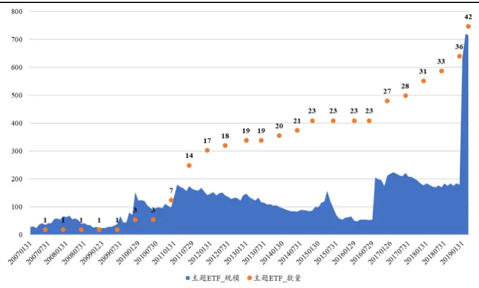
数据来源：国泰君安证券研究、Wind

目前主题 ETF 的市场规模仅次于规模 ETF。自从 2007 年第一只主题类ETF上市以来，虽然相关产品数量一直增加，规模变动却缺乏趋势性。与主题 ETF 类似的，行业 ETF 也是为了满足投资者对于某一特定领域的投资需求而存在。从目前市场中已有的行业ETF来看，规模相对比较大的主要是跟踪证券、医药、消费、金融以及信息板块的产品。产品布局远远没有实现各行业的全面覆盖，当然这也与相关产品的市场需求有关。发行相应产品需要付出固定的人力和物力成本，如果市场对产品的需求不能覆盖相应成本，机构发行也缺乏动力。但是相对处于白热化竞争、头部效应明显的宽基指数领域，提前布局具有潜在市场需求的行业ETF对于较晚涉足ETF的机构而言不失为一种选择。

此外，我们认为策略 ETF 在 A 股市场还有很大的发展空间。上文中的研究发现A股市场主动投资能够获得相对被动投资的超额收益，已有的针对其他新兴市场的研究也表明该现象在新兴市场中较为普遍，并认为这些超额收益能够被风格因素所解释（Klemens Kremnitzer，2012）。策略ETF也可称为SmartBeta ETF，虽然是被动跟踪某一指数的产品，相对传统的规模和行业ETF，该产品通过成分股的选择和权重的调整，加入了主动性的成分。虽然过去A股市场的风格切换较为频繁，但总不乏一些因子相对有效。通过投资策略ETF可以从因子层面实现主动投资，从这个角度来看，ETF的配置价值并不仅限于传统的被动投资。

## 5. 未来的研究方向

本文结合我国 A 股市场目前的投资环境，分析了 ETF 基金和主动管理型基金的发展现状。我们的研究结论显示，从目前来看，主动管理相对被动投资仍然具有一定优势，此外，从市场投资者结构和行业规模报酬递减效应的角度来看，相对优势还可继续延续。

本报告的研究主要站在产品发行方的角度，在以后的系列报告中，我们将会站在投资者的角度，对ETF产品进行分析，例如各基准指数的编制规则、产品流动性等。

最终落实到投资层面，需要结合大类资产配置相关模型，构建相关行业轮动、风格轮动以及指数择时等策略，发挥ETF在资产配置中的工具性作用。

## 本公司具有中国证监会核准的证券投资咨询业务资格

## 分析师声明

作者具有中国证券业协会授予的证券投资咨询执业资格或相当的专业胜任能力，保证报告所采用的数据均来自合规渠道，分析逻辑基于作者的职业理解，本报告清晰准确地反映了作者的研究观点，力求独立、客观和公正，结论不受任何第三方的授意或影响，特此声明。

## 免责声明

本报告仅供国泰君安证券股份有限公司（以下简称“本公司”）的客户使用。本公司不会因接收人收到本报告而视其为本公司的当然客户。本报告仅在相关法律许可的情况下发放，并仅为提供信息而发放，概不构成任何广告。

本报告的信息来源于已公开的资料，本公司对该等信息的准确性、完整性或可靠性不作任何保证。本报告所载的资料、意见及推测仅反映本公司于发布本报告当日的判断，本报告所指的证券或投资标的的价格、价值及投资收入可升可跌。过往表现不应作为日后的表现依据。在不同时期，本公司可发出与本报告所载资料、意见及推测不一致的报告。本公司不保证本报告所含信息保持在最新状态。同时，本公司对本报告所含信息可在不发出通知的情形下做出修改，投资者应当自行关注相应的更新或修改。

本报告中所指的投资及服务可能不适合个别客户，不构成客户私人咨询建议。在任何情况下，本报告中的信息或所表述的意见均不构成对任何人的投资建议。在任何情况下，本公司、本公司员工或者关联机构不承诺投资者一定获利，不与投资者分享投资收益，也不对任何人因使用本报告中的任何内容所引致的任何损失负任何责任。投资者务必注意，其据此做出的任何投资决策与本公司、本公司员工或者关联机构无关。

本公司利用信息隔离墙控制内部一个或多个领域、部门或关联机构之间的信息流动。因此，投资者应注意，在法律许可的情况下，本公司及其所属关联机构可能会持有报告中提到的公司所发行的证券或期权并进行证券或期权交易，也可能为这些公司提供或者争取提供投资银行、财务顾问或者金融产品等相关服务。在法律许可的情况下，本公司的员工可能担任本报告所提到的公司的董事。

市场有风险，投资需谨慎。投资者不应将本报告作为作出投资决策的唯一参考因素，亦不应认为本报告可以取代自己的判断。
在决定投资前，如有需要，投资者务必向专业人士咨询并谨慎决策。

本报告版权仅为本公司所有，未经书面许可，任何机构和个人不得以任何形式翻版、复制、发表或引用。如征得本公司同意进行引用、刊发的，需在允许的范围内使用，并注明出处为“国泰君安证券研究”，且不得对本报告进行任何有悖原意的引用、删节和修改。

若本公司以外的其他机构（以下简称“该机构”）发送本报告，则由该机构独自为此发送行为负责。通过此途径获得本报告的投资者应自行联系该机构以要求获悉更详细信息或进而交易本报告中提及的证券。本报告不构成本公司向该机构之客户提供的投资建议，本公司、本公司员工或者关联机构亦不为该机构之客户因使用本报告或报告所载内容引起的任何损失承担任何责任。

## 评级说明

## 1.投资建议的比较标准

投资评级分为股票评级和行业评级。

以报告发布后的12个月内的市场表现为比较标准，报告发布日后的 12个月内的公司股价（或行业指数）的涨跌幅相对同期的沪深 300 指数涨跌幅为基准。

## 2.投资建议的评级标准

报告发布日后的 12 个月内的公司股价（或行业指数）的涨跌幅相对同期的沪深 300 指数的涨跌幅。

| 评级 |  | 说明 |
| --- | --- | --- |
| 股票投资评级 | 增持 | 相对沪深 300指数涨幅15%以上 |
|  | 谨慎增持 | 相对沪深300指数涨幅介于5%～15%之间 |
|  | 中性 | 相对沪深 300指数涨幅介于-5%～5% |
|  | 减持 | 相对沪深300指数下跌 5%以上 |
| 行业投资评级 | 增持 | 明显强于沪深 300 指数 |
|  | 中性 | 基本与沪深300指数持平 |
|  | 减持 | 明显弱于沪深300指数 |

## 国泰君安证券研究所

|  | 上海 | 深圳 | 北京 |
| --- | --- | --- | --- |
| 地址 | 上海市浦东新区银城中路168号上海 银行大厦29层 | 深圳市福田区益田路 6009 号新世界 商务中心34层 | 北京市西城区金融大街 28 号盈泰中 心2号楼10层 |
| 邮编 | 200120 | 518026 | 100140 |
| 电话 | （021)38676666 | （0755）23976888 | (010)59312799 |
|  | E-mail: gtjaresearch@gtjas.com |  |  |