inInfo] [Table_Title] 2019.08.23

# 投资者关系管理行为的量化呈现

## ——数量化专题之一百二十四

玉陈奥林（分析师）

杨能（分析师）

8 021-38674835

021-38032685

chenaolin@gtjas.com

yangneng@gtjas.com

证书编号 S0880516100001

S0880519080008

本报告导读：具有良好的投资关系管理水平的上市公司存在超额收益。

## 摘要：

le_Summary]投资者关系管理(IRM)是上市公司实现公司价值最大化的战略管理行为。良好的投资者关系能够降低信息的不对称程度，提高公司的透明度和可信度，增强投资者对公司前景的信心，吸引投资者和分析师的跟进，有效避免股价波动率过大，同时增强股票的流动性，降低资本成本，最终提升公司价值。

上市公司的投资者关系管理水平可通过线上与线下交流两大类指标来衡量。线上指标包括“互动易”平台回复投资者问题频率与详细度、定期与不定期报告公布时效性等，线下指标包括机构调研频率、回复问题详细度等。除此之外，上市公司董秘是否获奖也是上市公司投资者关系管理水平的重要体现。

我们对所有相关指标进行了详细的测试。包括分层回测，分年度统计，控制 GICS 行业与 CNE6 风格后的因子收益率等。因子检验共发现 5个有效因子。

投资者关系管理类因子区分度一般，但因子收益主要集中在多头，且近 3 年内因子收益表现较高，呈现因子有效性增强的趋势。除此之外，因子收益率与市场收益率相关性较低。

对于深市个股，我们构造了投资者关系管理水平综合打分指标，综合指标15年以来无论是否剔除行业与风格，因子收益都相对稳定，18、19 年多头策略大幅跑赢市场。最后，对当前投资者关系水平较高的上市公司进行了展示。

金融工程

## 金融工程团队：

陈奥林：（分析师）

电话：021-38674835

邮箱：chenaolin@gtjas.com

证书编号：S0880516100001

## 李辰：（分析师）

电话：021-38677309

邮箱：lichen@gtjas.com

证书编号：S0880516050003

## 孟繁雪：（分析师）

电话：021-38675860

邮箱：mengfanxue@gtjas.com

证书编号：S0880517040005

## 黄皖璇：（分析师）

电话：021-38677799

邮箱：huangwangxuan@gtjas.com

证书编号：S0880518110002

## 蔡旻昊：（研究助理）

电话：021-38674743

邮箱：caiminhao@gtjas.com

证书编号：S0880117030051

## 李栩：（研究助理）

电话：021-38032690

邮箱：lixu019018@gtjas.com

证书编号：S0880117090067

## 杨能：（研究助理）

电话：021-38032685

邮箱：yangneng@gtjas.com

证书编号：S0880117080176

## 殷钦怡：（研究助理）

电话：021-38675855

邮箱：yinqinyi@gtjas.com

证书编号：S0880117060109

## 余剑峰：（研究助理）

电话：021-38676186

邮箱：yujianfeng@gtjas.com

证书编号：S0880118060039

## [Table_R相关报告

《银华 MSCI中国 A股 ETF投资价值分析》2019.08.16

《不容忽视的交易成本：量化个股隐性成本》2019.07.30

《多维度刻画基金：业绩、能力与主动管理程度》2019.07.19

《不同情景模式下的风格配置体系》2019.07.11

《全球化与 A 股定价格局》2019.05.28

## 1. 引言

投资者关系管理(Investor Relations Management)是一种上市公司实现公司价值最大化的战略管理行为。其目的是通过充分的自愿性信息披露，运用金融和市场营销的方法加强与投资界（包括现有股东、潜在投资者、分析师、基金经理以及媒体等）的沟通，促进投资界对公司的了解和认同。

良好的投资者关系对于上司公司股价会产生积极影响。赵英丽（2015）等人提出，中国上市公司投资者关系管理与企业价值正相关，投资者愿意为投资者关系管理水平高的公司支付溢价。

1. 提高公司声誉，降低负面事件冲击: 投资者关系管理通过提高公司可信度, 进而提升投资者的满意度和忠诚度, 提升公司整体形象，从而形成声誉资本。具有高声誉资本的公司在负面事件中存在一定的光环效应。投资者会倾向于认为公司的负面事件是外部因素导致的(Vanhamme、 Grobben,2009）。客观无意的归因的倾向性最终将减少负面事件对企业价值的冲击。

2. 广告宣传效应:马连福等(2010)认为投资者关系管理是公司营销的核心体现，也可以从侧面增加公司对自身强势业务的宣传，强调继续持有本公司股票或新购本公司股票的优越性、公司的成长性和收益性等，给投资者留下良好的第一印象。

3. 降低融资成本：G.Eccles（1995）等人也从投资者关系中的信息披露角度出发进行研究，发现信息披露充分的公司，其资本成本也较低。其逻辑在于：投资者对股票收益的估计存在着较大的不确定性，这依赖于他们可获得的信息，投资者对于可获取信息较少的公司的风险估计要比可获取信息多的公司高。为了抵消预期的高风险，投资者会要求较高的回报率，而这对公司而言正是较高的资本成本。

简而言之，投资者关系管理能够降低信息的不对称程度，规范公司治理体系，提高公司的透明度和可信度，增强投资者对公司前景的信心，吸引投资者和分析师的跟进，有效避免股价波动率过大，同时增强股票的流动性，降低资本成本，最终提升公司价值。

近几年来投资者关系管理水平优秀的企业超额收益显著。当个股数量较少时，投资者关系管理对公司价值的影响有限，但随着A股股票数量的增多、注册制改革的推进，重视投资者关系管理的上市公司将更有可能受到投资者的青睐。

本篇报告将从多个维度量化上市公司的投资者关系管理水平。

## 2. 上市公司投资者关系管理水平指标的构建

投资者关系管理可分为线上、线下两大类指标。线上投资者交流主要通过互动易平台，线下投资者交流主要方式为投资者调研。除此之外，上市公司董秘是否为金牌董秘也是上市公司投资者关系管理水平的体现。

表1 投资者关系管理水平可量化指标

| 类型 | 指标 |
| --- | --- |
| 线上 | 定期报告公布时效性 |
|  | 不定期报告公布时效性 |
|  | “互动易”平台回复投资者问题频率 |
|  | “互动易”平台回复投资者问题详细度 是否有官网（不可回测） |
| 线下 | 机构调研频率 |
|  | 回复投资者问题详细度 |
| 获奖 | 是否获得新财富金牌董秘称号 |

数据来源: 国泰君安证券研究

## 2.1. 线上“互动易”平台简介

“互动易”平台就是深交所为适应新形势下信息披露的需求而设立的。它由深圳证券交易所于 2010年 1月 1日推出，在 2011年11月 12日基于Web2.0平台（类微博模式）进行系统升级，并改名为“互动易”。同时，深交所在 《上市公司信息披露工作考核办法》（2011 年修订）也增加了对“互动易”的监管要求，以此引导上市公司充分重视，不断提高投资者关系管理水平。

我们从深交所“互动易”上收集了2011年-2019 年所有的深交所上市公司投资者问答记录，包括提问时间、回答时间、提问文字内容和回复文字内容。共包含深交所共 2109 家公司，共 200 多万条记录，平均每家公司约1200条问答记录。

自网站开放回复通道伊始，提问总量逐年递增至 2015 年底达到峰值，此后提问量有所减少，但大体保持稳定；平均回复时间则总体稳中有升。其中原因可能是随着互动平台的推广和发展，投资者提问质量有所增加，提问难度上升导致董秘需要花更长时间准备。且据观察，提问者中也出现了一些进行海量刷屏式提问的用户账号，每天围绕 5G、稀土、区块链、科创板等热门概念向上市公司提出大量问题，由于无法从平台探知真实身份，这也无疑间接打消了上市公司部分回答积极性。

图 1 “互动易”平均回复时间和提问数量
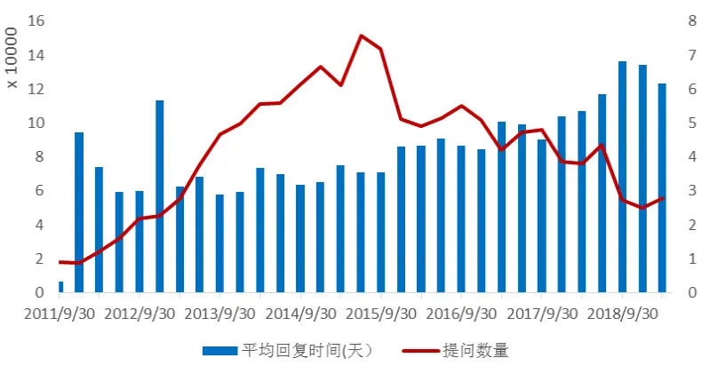
数据来源：国泰君安证券研究，互动易

从公司属性来看，外资企业的投资者管理表现总体优于国有企业和民营企业。

图 2 不同类型上市公司平均回复率
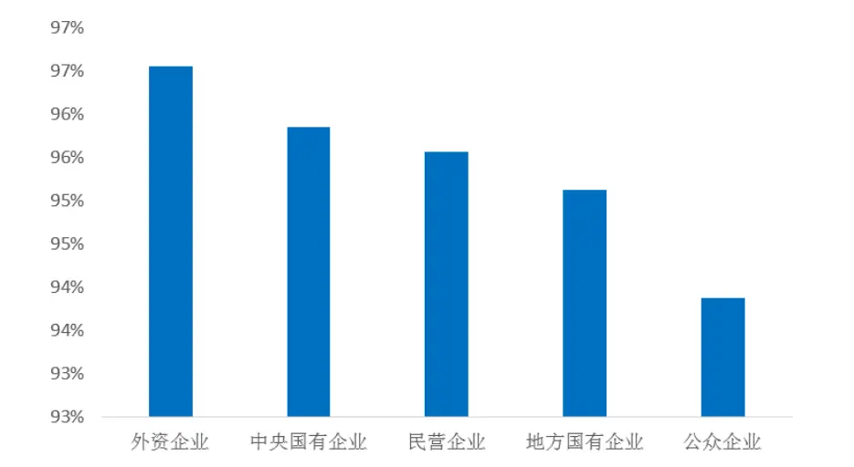
数据来源：国泰君安证券研究，互动易

从 GICS 板块分类来看，金融、消费品、医疗健康等板块总体较为重视线上投资者关系维护。

表 2 不同板块的互动易回答回复情况

| 行业 | 提问数 回答率 | 平均回复时间 |
| --- | --- | --- |
| Financials | 437103 96.8% | 7.3 |
| Consumer_Staples | 228458 96.7% | 7.7 |
| Utilities | 87980 96.6% | 6.8 |
| Real_Estate | 310708 96.4% | 7.5 |
| Communication_Services | 314584 96.3% | 6.3 |
| Materials | 709645 96.1% | 6.8 |
| Industrials | 925012 95.6% | 7.1 |
| Health_Care | 366965 95.2% | 5.8 |
| Consumer_Discretionary | 849116 95.1% | 6.5 |
| Information_Technology | 1002652 95.1% | 6.3 |
| Energy | 99113 94.0% | 10.3 |

数据来源：国泰君安证券研究，互动易

创业板企业中科技公司多、市值小，信息不对称程度较为严重，所以公司治理上更有激励来注重与投资者沟通与信息披露。创业板企业平均回复时间只有4.9天，同时创业板中长回答占比也最高。

图 3 不同交易所板块的平均回复时间与长回答占比
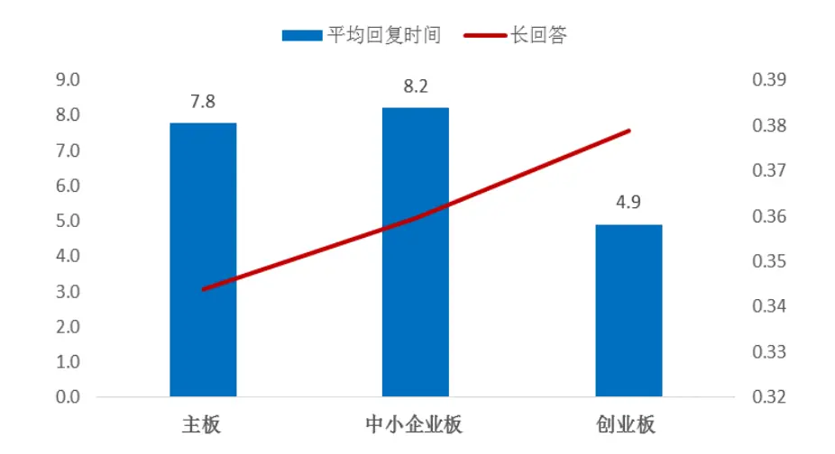
数据来源：国泰君安证券研究，互动易

## 2.2. 新财富分析师金牌董秘简介

张宏亮、崔学刚（2009）将2005至2006年的金牌董秘评选结果作为评价投资者关系管理的标准，经实证分析表明投资者关系对公司绩效的正影响关系；施安慈（2018）用2012至2017年“新财富金牌董秘”的评选结果来衡量上市公司投资者关系水平，研究发现投资者关系的质量具有对企业价值的促进作用。

而董秘之所以能反映投资者关系管理是源于该职务的本职工作，董事会秘书是公司重要的一个管理职务，除了负责会议筹备、文件保管以及企业信息披露等，董秘最重要的职责之一就是管理投资者关系，而不同董秘之间的异质性更是能够对信息披露产生不同程度的影响，例如良好的财务经历、社会资本或者专业能力均能提高信息的价值相关性，并且具备良好的社交能力的董秘更能有效的促进企业内外部的沟通交流，在资本市场中更好的发挥作用。

金牌董秘的排名数据均来源于新财富杂志于 2005 年起举办的“新财富金牌董秘”评选的结果，榜单排名是根据董秘的总得分进行由高至低的排序，而总得分是由监管机构、机构投资者、证券分析师、个人投资者、财经媒体及董秘自荐多方投票数计算加权得到（具体评分规则参考新财富金牌董秘评选办法），并有新财富设立的专家委员会参与相关奖项的评议，因此该排名数据兼备真实性与权威性。

新财富金牌董秘评选本着促进上市公司治理结构的优化、提升信息披露水平的目标，自创办以来的确推动了中国资本市场的健康发展，无论是深圳市2011年出台的《深圳人才认定标准》中规定金牌董秘可被纳入深圳后备级人才，还是金牌董秘的不可替代性（公司更换金牌董秘意味着向市场释放不重视维护与投资者关系的负面信号）都促使了董秘更加勤勉尽职，起到了一定的示范作用。

表 3 金牌董秘数据相关信息

| 届数 | 颁奖典礼时间（公布时间） | 排序方法 | 榜单总个数 |
| --- | --- | --- | --- |
| 第一届 | 2005年2月21日 | 未说明（非公司简称拼音排序） | 100 |
| 第二届 | 2006年3月15日 | 按总分高低排序 | 50 |
| 第三届 | 2007年4月18日 | 按总分高低排序 | 50 |
| 第四届 | 2008年6月28日 | 按总分高低排序 | 100 |
| 第五届 | 2009年8月29日 | 按总分高低排序 | 100 |
| 第六届 | 2010年8月14日 | 未说明（非公司简称拼音排序） | 100 |
| 第七届 | 2011年10月21日 | 未说明（非公司简称拼音排序） | 150 |
| 第八届 | 2012年6月16日 | 按公司简称拼音 | 150 |
| 第九届 | 2013年7月18日 | 按公司简称拼音 | 150 |
| 第十届 | 2014年7月18日 | 按公司简称拼音 | 150 |
| 第十一届 | 2015年8月6日 | 按公司简称拼音 | 200 |
| 第十二届 | 2016年6月30日 | 按公司简称拼音 | 300 |
| 第十三届 | 2017年6月29日 | 未说明（非公司简称拼音排序） | 200 |
| 第十四届 | 2018年6月29日 | 未说明（非公司简称拼音排序） | 188 |

数据来源：国泰君安证券研究

## 3. 投资者关系管理水平相关因子检验

本章节避免内容过于冗长，因子检验已剔除完全无效的因子。

检验内容主要包括：

1) 分层回测净值曲线（5组、等权）

2) 分层回测分年度收益统计

3) 等分 10 组平均年化收益柱状图

4) 单因子多空组合月累计收益 / 纯因子多空组合月累计收益

## 5) 测试因子相关统计量

其具体介绍详见附录。

## 3.1. 深市个股互动易相关指标检验

由于互动易仅有深市个股的因子数据，因此，我们选择股票池为深市全域并剔除：

1） IPO 未满 120 日

2）股价小于1

3）当日停牌

4）过去12 月内连续停牌超过 50天

5） ST 个股

## 3.1.1. 回复投资者问题频率（正向因子）

我们使用过去一段时间的回复总天数作为回复频率的代理变量。针对投资者在互动易上的提问，董秘通常会每隔一段时间在一天内集中回复。在一段时间内回复的越频繁，说明上市公司越重视投资者关系。我们尝试使用过去一个季度和过去半年构建因子,取得了近似的效果。以下使用过去一季度回复频率作为展示。

回复频率因子 5 组区分度一般，回复频率好于市场平均的个股一定ALPHA 收益；最高分位组在 14、15 年表现较差；在剔除 GICS 行业与所有风格后，因子累计收益较为稳定。因子收益率与市场有一定正相关性。

图 4 分组回测与年化收益
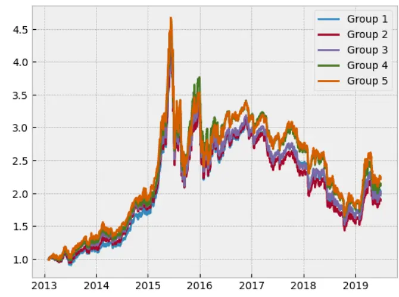
数据来源：国泰君安证券研究

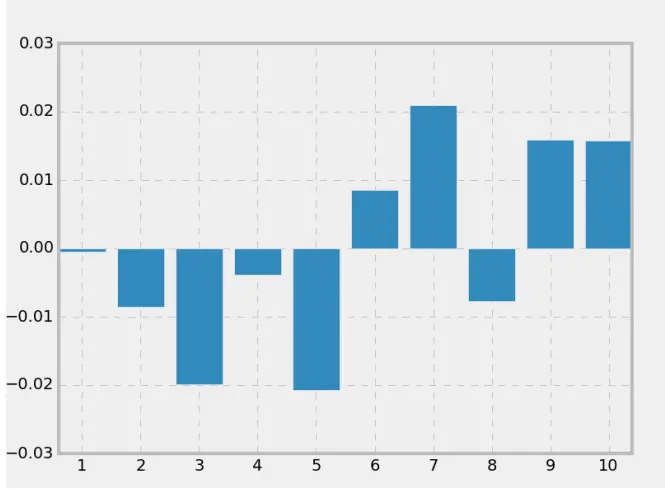

表 4 组合分年度收益统计

| trade_dt | 分位1 | 分位2 分位3 分位4 | 分位5 |
| --- | --- | --- | --- |
| 2013/12/31 | 14.9% | 18.3% 25.6% 29.8% | 34.6% |
| 2014/12/31 | 47.8% | 49.6% 44.4% 40.4% | 41.4% |
| 2015/12/31 | 91.8% | 84.3% 87.0% 101.7% | 82.6% |
| 2016/12/31 | -11.5% | -11.7% -13.6% -14.3% | -10.1% |
| 2017/12/31 | -15.5% | -20.0% -18.2% -15.9% | -13.6% |
| 2018/12/31 | -31.9% | -32.7% -31.9% -33.0% | -33.4% |
| 2019/12/31 | 21.5% | 21.6% 20.6% 19.1% | 23.0% |

数据来源：国泰君安证券研究

图 5 控制风格后因子月累计收益率
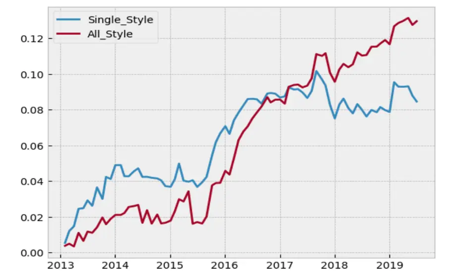
数据来源: 国泰君安证券研究

表 5 因子表现相关统计量

|  | Average \|t\| | Percent of \|t\|>2 | IR | Corr with |
| --- | --- | --- | --- | --- |
|  |  |  |  | Market |
| 回复频率 | 1.11 | 0.17 | 1.11 | 0.19 |

数据来源：国泰君安证券研究

## 3.1.2. 回复详细度（正向因子）

我们使用过去一段时间回复与提问字数差的均值作为回复详细度的代理变量。我们假设上市公司越重视投资者关系，对于投资者提问的回复会越详细，回复与提问字数之差从某种意义上部分反映了上市公司的对中小投资者的“态度”。我们使用过去一个季度数据进行检验。

回复详细度因子为典型的多头因子，其最高分位表现突出，其他分位表现差距不大。策略收益主要来源于 14、16 年。16 年以后多空收益有所减弱。考虑到使用字数量不能完全反映回答质量，我们之后可能会尝试剔除无效回答后重新进行因子构建。

图 6 分组回测与年化收益
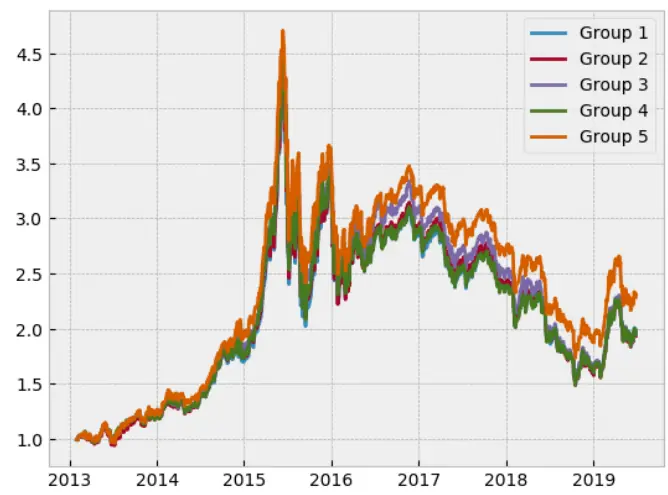
数据来源：国泰君安证券研究

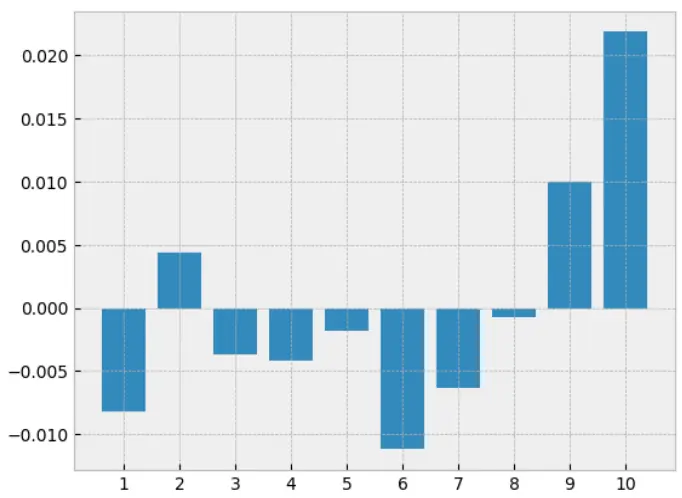

表 6 组合分年度收益统计

| trade_dt | 分位1 分位2 分位3 | 分位4 分位5 |
| --- | --- | --- |
| 2013/12/31 | 24.2% 22.8% 23.8% | 22.5% 25.6% |
| 2014/12/31 | 37.4% 42.0% 46.7% | 42.9% 54.2% |
| 2015/12/31 | 91.8% 90.6% 88.6% | 92.1% 84.3% |
| 2016/12/31 | -13.0% -12.5% -10.7% | -14.6% -9.8% |
| 2017/12/31 | -16.1% -17.4% -18.3% | -17.9% -16.1% |
| 2018/12/31 | -32.2% -33.7% -34.8% | -31.5% -30.2% |
| 2019/12/31 | 21.4% 21.3% 19.5% | 21.1% 21.3% |

数据来源：国泰君安证券研究

图 7 控制风格后因子月累计收益率
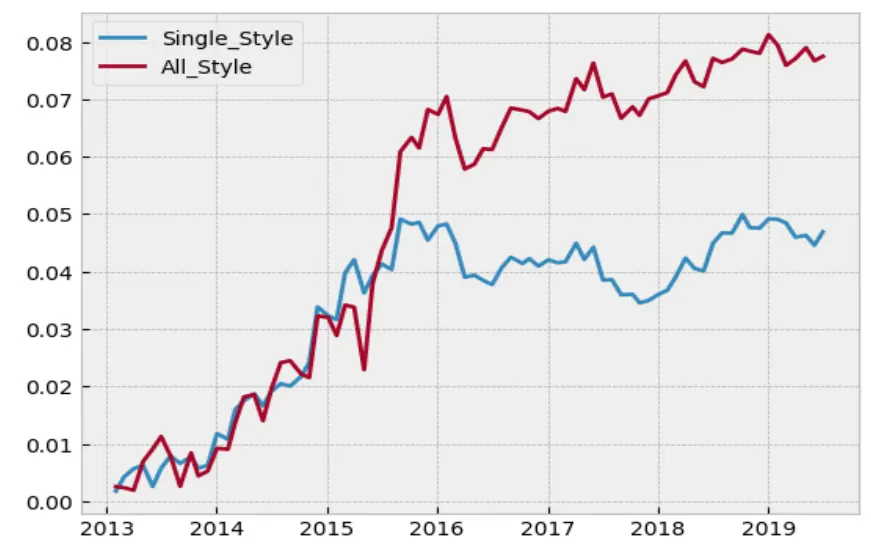
数据来源: 国泰君安证券研究

表 7 因子表现相关统计量

|  | Average \|t\| | Percent of \|t\|>2 | IR | Corr with |
| --- | --- | --- | --- | --- |
| 回复详细度 | 0.78 | 0.03 | 0.83 | Market -0.13 |

数据来源：国泰君安证券研究

## 3.2. 正式公告公布时效性检验

对于正式公告这类标准化数据，我们的因子检验股票池为中证800成分股。我们发现定期报告公布时效性有一定 alpha 收益，但不定期报告 alpha不显著，因此这小节仅分析定期报告相关测试结果。

## 3.2.1. 定期公告公布时效性（反向因子）

我们使用过去一年4个季度报告报告发布时长（报告公布日期减报告期）的均值作为定期报告公布时效性的代理变量。

该因子是一个最低分位显著优于其他分位的因子。该策略在 15 年之前完全无效，但 15 年之后，即使剔除了所有行业与风格，收益依然稳定且显著。

图 8 分组回测与年化收益
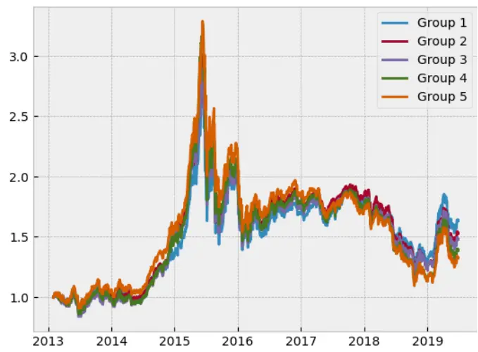
数据来源：国泰君安证券研究

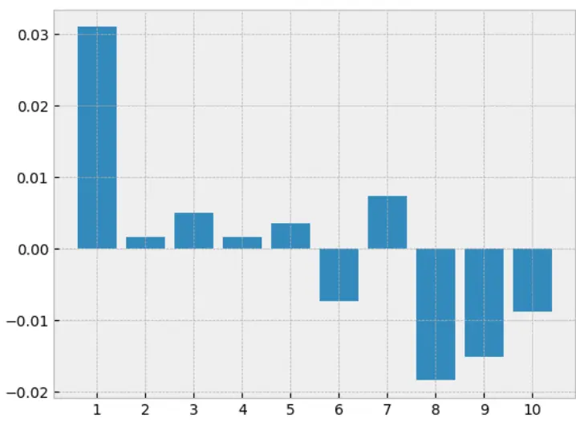

表 8 组合分年度收益统计

| trade_dt | 分位1 分位2 分位3 | 分位4 分位5 |
| --- | --- | --- |
| 2013/12/31 3.2% | 2.7% -1.6% | 0.0% 5.9% |
| 2014/12/31 | 30.7% 43.9% 52.2% | 47.1% 47.8% |
| 2015/12/31 | 45.4% 38.9% 33.7% | 41.4% 40.7% |
| 2016/12/31 | -14.0% -13.5% -13.6% | -14.6% -16.8% |
| 2017/12/31 | 5.5% 2.7% 1.9% | -1.3% -7.2% |
| 2018/12/31 | -27.4% -31.9% -29.7% | -34.5% -33.2% |
| 2019/12/31 | 26.3% 22.8% 18.9% | 20.6% 16.3% |

数据来源：国泰君安证券研究

图 9 控制风格后因子月累计收益率
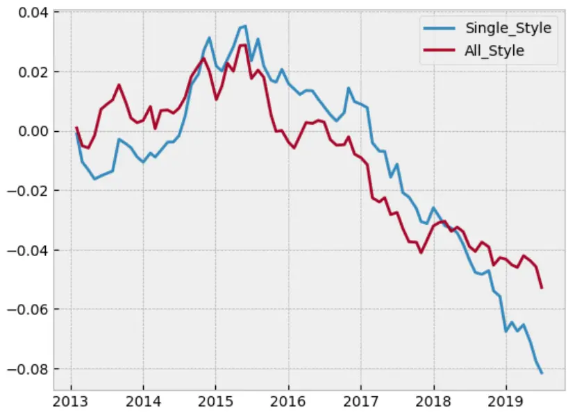
数据来源: 国泰君安证券研究

表 9 因子表现相关统计量

|  | Average \|t\| | Percent of \|t\|>2 | IR | Corr |
| --- | --- | --- | --- | --- |
|  |  |  |  | with Market |
| 定期报告公 |  |  |  |  |
| 布时效性 | 0.94 | 0.12 | -0.52 | 0.12 |

数据来源：国泰君安证券研究

## 3.3. 线下投资者交流因子检验

线下投资者交流暂时仅发现一个有效的因子：线下交流频率。其检验股票池同样为中证 800成分股。

## 3.3.1. 线下交流频率（正向因子）

我们以过去一年内机构调研总次数（不区分调研类型）作为线下上市公司投资者关系管理水平的代理指标。

线下交流频率因子区分度较好，但稳定性一般。最高分位在 15 年之后均能跑赢其他分位，其中17 年收益最为显著。

图 10 分组回测与年化收益
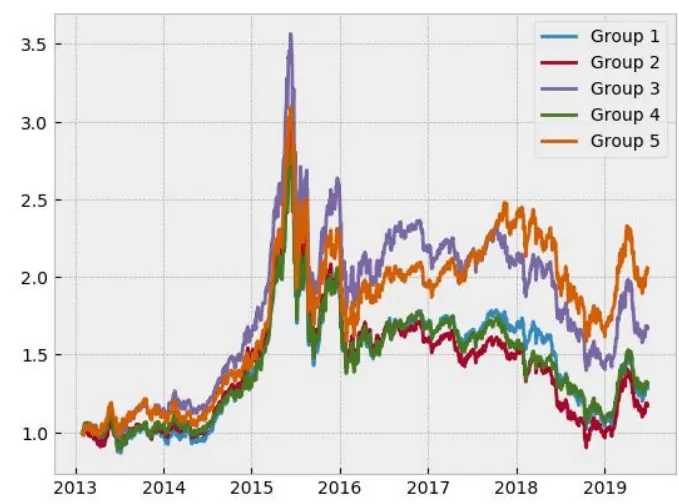
数据来源：国泰君安证券研究

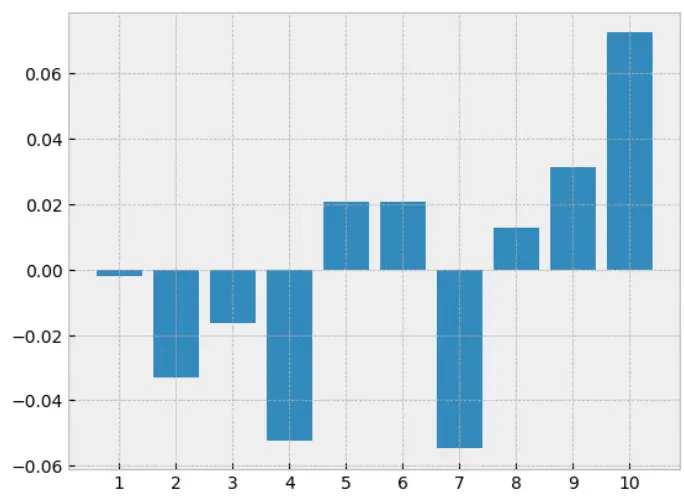

表 10 组合分年度收益统计

| trade_dt | 分位1 分位2 | 分位3 分位4 | 分位5 |
| --- | --- | --- | --- |
| 2013/12/31 | -0.7% 2.2% | 15.1% 4.5% | 12.5% |
| 2014/12/31 | 36.2% 45.9% | 41.6% 24.9% | 27.6% |
| 2015/12/31 | 46.0% 33.4% | 55.6% 52.8% | 55.4% |
| 2016/12/31 | -14.1% -20.3% | -14.6% -16.3% | -13.0% |
| 2017/12/31 | -2.0% -5.8% | -3.4% -6.7% | 20.8% |
| 2018/12/31 | -36.6% -34.7% | -32.2% -30.8% | -29.2% |
| 2019/12/31 | 21.7% 20.0% | 17.6% 21.6% | 23.6% |

数据来源：国泰君安证券研究

图 11 控制风格后因子月累计收益率
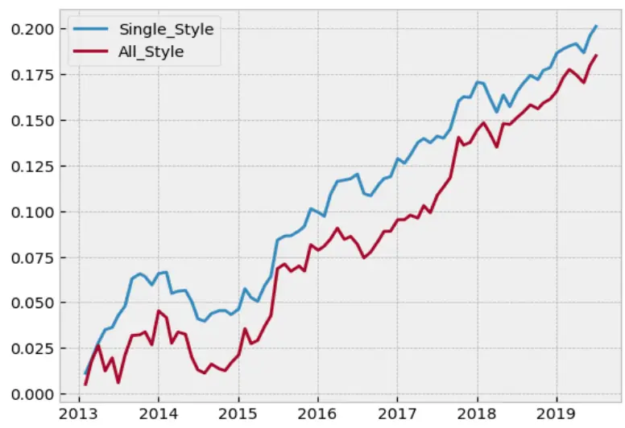
数据来源: 国泰君安证券研究

表 11 因子表现相关统计量

|  | Average \|t\| | Percent of \|t\|>2 | IR | Corr with |
| --- | --- | --- | --- | --- |
|  |  |  |  | Market |
| 机构调研 频率 | 0.98 | 0.10 | 1.08 | -0.03 |

数据来源：国泰君安证券研究

## 3.4. 上市公司董秘是否为金牌董秘

由于大部分年份获奖名单没有明确的次序，无法进行分组测试。为了测试获得金牌董秘称号的上市公司是否能够具有一定的超额收益，我们根据每一年的新财富董秘评选结果，在评选公布日第二天流通市值加权买入相应的上市公司作为投资组合，年换仓，手续费假设为双边千四，进行回测，回测结果如下：

图 12 金牌董秘组合
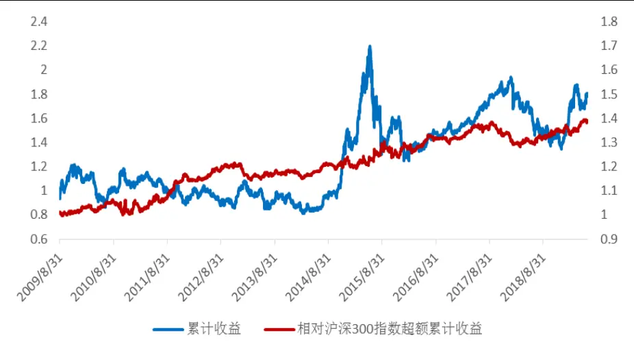
数据来源：国泰君安证券研究

从回测结果来看，获奖上市公司组合收益不高，但在没有做任何风格控制和组合优化的情况下，未来一年里仍大概率能够跑赢沪深300指数。

表 12 分年度统计超额收益

| 年份 | 超额收益 |
| --- | --- |
| 2009/12/31 | 1.4% |
| 2010/12/31 | -0.5% |
| 2011/12/31 | 15.3% |
| 2012/12/31 | 3.7% |
| 2013/12/31 | -2.5% |
| 2014/12/31 | 3.8% |
| 2015/12/31 | 1.9% |
| 2016/12/31 | 5.6% |
| 2017/12/31 | 1.5% |
| 2018/12/31 | 0.6% |
| 2019/12/31 | 2.9% |

数据来源：国泰君安证券研究

从因子多空收益来看，因子 13 年回撤较大，其他年份收益较为稳定，值得特别注意的是，纯因子收益在 2019 年表现突出。除此之外，因子收益与市场有一定的负相关性，该策略能够对冲部分市场风险。

图 13 控制风格后因子月累计收益率
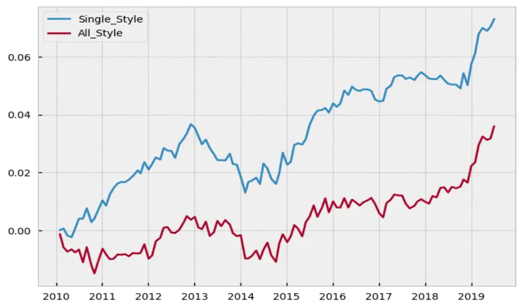
数据来源: 国泰君安证券研究

表 13 因子表现相关统计量

|  | Average \|t\| | Percent of \|t\|>2 | IR | Corr with |
| --- | --- | --- | --- | --- |
| 金牌董秘 | 1.01 | 0.10 | 0.39 | Market -0.09 |

数据来源：国泰君安证券研究

## 3.5. 小结

经测试，共有5个指标具有一定的信息含量。分别为回复投资者问题频率、机构调研频率、定期报告公布时效性、是否获得新财富金牌董秘称号以及线上回复投资者问题详细度。

作为舆情指标，这5类指标的分5组区分度一般，并非传统的线性ALPHA因子。因而根据指标的不同特征，可把指标分为两大类，一是基础指标，超过市场均值即可，并非越大越好；第二类是加分指标，只有指标打分特别突出的时候才有效，否则没有区分度。

表 14 测试指标分类

| 指标类型 | 指标名称 |
| --- | --- |
| 基础指标 | 回复投资者问题频率 |
|  | 机构调研频率 |
| 加分指标 | 定期报告公布时效性 |
|  | 是否获得新财富最佳董秘称号 |
|  | 线上回复投资者问题详细度 |
| 无效指标 | 不定期报告公布时效性 |
|  | 线下回复投资者问题详细度 |

数据来源：国泰君安证券研究

## 4. 投资者关系管理水平综合打分与排名

## 4.1. 综合指标构造

股票池：一方面由于沪市个股“互动易”数据较少；另一方面，考察中小市值域的投资者关系管理水平更具有实际意义，我们仅对深圳主板、中小板和创业板的个股进行综合打分，剔除上市不到一年的个股。

## 具体打分方式如下：

表 15 指标构造方式

| 指标类型 | 指标名称 加工方式 |
| --- | --- |
| 基础指标 回复投资者问题频率 | 位于前 50%取1，否则取0 |
| 机构调研频率 | 位于前 50%取1，否则取0 |
| 加分指标 | 定期报告公布时效性 位于前20%取1，否则取0 |
| 回复投资者问题详细度 | 位于前10%取1，否则取0 |
| 是否获得新财富最佳董秘称号 | 获得取1，否则取0 |

数据来源：国泰君安证券研究

最终得分在 0-5 分，最低 0 分，满分 5 分。

## 4.2. 综合指标打分因子检验

综合指标打分在15年以后有稳定的ALPHA 收益，多头收益贡献显著。

图 14 分层回测
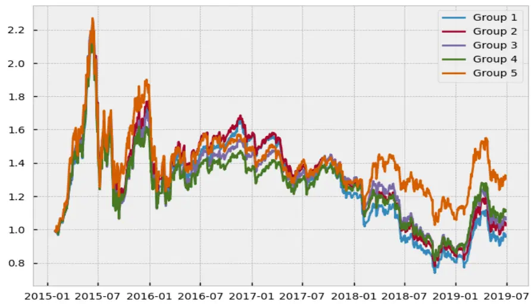
数据来源:国泰君安证券研究

图 15 控制风格后因子月累计收益率
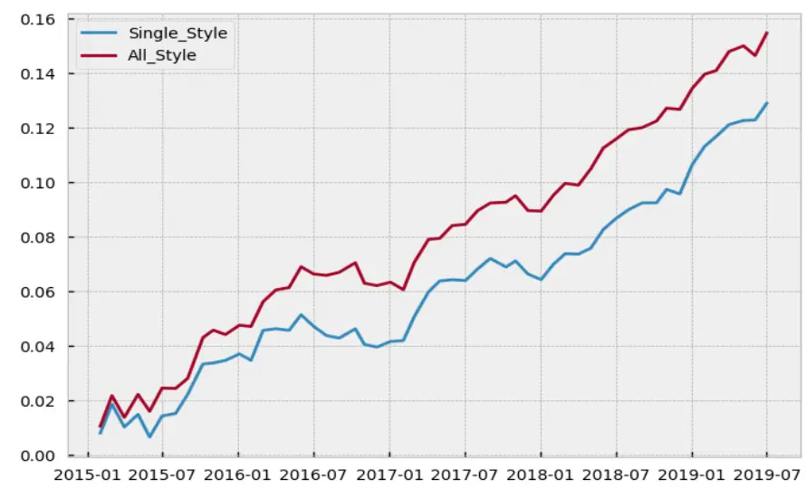
数据来源: 国泰君安证券研究

## 4.3. 深市个股投资者关系管理水平综合打分排名

以下为截止至 7月，深市股票打分大于 4的名单，供投资者参考。

表 16 深市个股投资者关系管理水平综合打分排名

| 股票名称 | 总市值(亿) | 回复频率 | 回复详细度 | 定期报告公 布时效性 | 机构调研次 数 | 是否金牌董 秘 | 综合打分 |
| --- | --- | --- | --- | --- | --- | --- | --- |
| 顺络电子 | 147 | 1 | 1 | 1 | 1 | 1 | 5 |
| 天虹股份 | 163 | 1 | 1 | 1 | 1 | 1 | 5 |
| 北陆药业 | 42 | 1 | 1 | 1 | 1 | 0 | 4 |
| 山西证券 | 224 | 1 | 1 | 0 | 1 | 1 | 4 |
| 卫星石化 | 160 | 1 | 0 | 1 | 1 | 1 | 4 |
| 依米康 | 29 | 1 | 1 | 1 | 1 | 0 | 4 |
| 江苏神通 | 37 | 1 | 1 | 0 | 1 | 1 | 4 |
| 兆驰股份 | 129 | 1 | 1 | 0 | 1 | 1 | 4 |
| 凯撒文化 | 49 | 1 | 1 | 0 | 1 | 1 | 4 |
| 众兴菌业 | 30 | 1 | 1 | 1 | 0 | 1 | 4 |
| 海王生物 | 95 | 1 | 1 | 0 | 1 | 1 | 4 |
| 星源材质 | 47 | 1 | 0 | 1 | 1 | 1 | 4 |
| 和而泰 | 77 | 1 | 1 | 0 | 1 | 1 | 4 |
| 一心堂 | 151 | 1 | 0 | 1 | 1 | 1 | 4 |
| 汤臣倍健 | 274 | 1 | 1 | 1 | 1 | 0 | 4 |
| 飞亚达A | 33 | 1 | 1 | 1 | 0 | 1 | 4 |
| 平安银行 | 2333 | 0 | 1 | 1 | 1 | 1 | 4 |

数据来源：国泰君安证券研究

## 5. 总结与展望

本篇报告根据多重数据来源，共构造了5 个刻画上市公司投资者关系管理水平的指标，并对其进行了较为详尽的单因子测试。

在下一篇报告中，我们将尝试扩投资者关系管理类因子，最终把相关指标落实到组合管理中，完成投资组合的构建与跟踪，形成具有投资价值的相关产品。鉴于小市值个股做投资者关系管理的意义更大，我们将尝试在创业板构建指数增强策略。

## 6. 附录

## 6.1. 风格定义

表 17 风格因子定义

| 大类因子 | 小类因子 | 释义 | 财报数 据类型 | 更新 频率 |
| --- | --- | --- | --- | --- |
| BETA | HBETA | 个股日收益率对万得全A指数收益率回归的斜率，时间窗口为252，半衰期63 |  | 日 |
| Value | BTOP | 股东权益比流通市值 | 最新 | 日 |
| Dividend Yield | DTOP | 现金分红比上月月末股价 | TTM | 日 日 |
|  | DTOPF | 分析师一致预期每股分红比当前股价 |  |  |
| Earnings Quality | ABS | NOA=流动资产-现金及其等价物-（流动负债-短期借款-应交税费） Accurals = -(∆NOA - D & A) / Avg (Tot _ assets ) | 年报 | 日 |
| Earnings Variability | VSAL | 过去5年营业总收入标准差比均值 | TTM | 日 |
|  | VERN | 过去5年归母净利润标准差比均值 | TTM | 日 |
|  | VFLO | 过去5年现金及现金等价物净增加额标准差比均值 | TTM | 日 |
| Earnings Yield Growth | CETOP | 经营性净现金流比流通市值 | TTM | 日 |
|  | ETOP | 归母净利润比流通市值 | TTM | 日 |
|  | EM | EBIT/EV(剔除货币资金) | 年报 | 日 |
|  | ETOPF | 一致预期净利润比流通市值 |  | 日 |
|  | EGRLF | 一致预期净利润未来 2 年 CAGR |  | 日 |
|  | EGRO | 过去 5年 EPS 对时间回归的斜率除以均值 | 年报 | 日 |
|  | SGRO | 过去5年每股营业收入对时间回归的斜率除以均值 | 年报 | 日 |
| Investment Quality | AGRO | 过去5年总资产对时间回归的斜率除以均值，再取相反数 | 年报 | 日 |
|  | IGRO | 过去5年流通股本对时间回归的斜率，再取相反数 |  | 日 |
| Leverage | CXGRO | Capex = ∆Fix edAsset + Depreicati on 过去5年 Capex 对时间回归的斜率，再取相反数 | 年报 | 日 |
|  | MLEV | （流通市值+长期借款)/流通市值 | 年报 | 日 |
|  | BLEV | （股东权益+长期借款）/股东权益 | 年报 | 日 |
|  | DTOA | 总资产/总负债 | 年报 | 日 |
| Liquidity | STOM | 对数月换手率 |  | 日 |
|  | STOQ | 对数季换手率 |  | 日 |
|  | STOA | 对数年换手率 |  | 日 |
|  | AVTR | 日换手率指数加权平均，时间窗口为252，半衰期为63 |  | 日 |
|  | MIDCAP | 对数总市值对对数总市值的三次方回归，样本权重为总市值的平方根，取残差项 |  | 日 |
| Mid Capializion Momentum | RSTR | 首先计算RS:累积指数加权对数日收益率，时间窗口252，半衰期126 |  | 日 |
|  | HALPHA | RSTR取过去11日至21日 RS 的平均 计算 HBETA 时的截距项，HALPHA 取其过去 11 日至 21 日 RS 的平均 |  | 日 |
| Profitability | ATO | 营业收入/总资产 | TTM/ | 日 |
|  | GP | 毛利 / 总资产 | 最新 年报 | 日 |
|  | GPM | 毛利 / 营业收入 | 年报 | 日 |
| Residual Volatility | ROA | 归母净利润 / 总资产 | TM | 日 |
|  | HSIGMA |  |  |  |
|  | DASTD | 计算 HBETA 时的残差波动率 个股日收益率的指数加权波动率，时间窗口252，半衰期42 |  | 日 日 |
|  | CMRA |  |  | 日 |
|  |  | 过去12个月累积月收益率的最大值与最小值之差 |  |  |
| Seasonality Short Term | SEASON | 过去五年已实现次月收益率的平均值 |  |  |
| reversal | STREV | 加权累积对数日收益率，时间窗口21，半衰期5 |  |  |
| Size | LNCAP | 对数总市值 |  | 日 |

数据来源：国泰君安证券研究

## 6.2. 因子检验计算方法

分组回测：采用月底换仓，等权投资的方式构建投资组合，手续费为千4。

Single Style Test 一共控制了 GICS 24 个行业与单个风格市值；All StyleTest 控制了上述所有大类风格与行业。其具体做法为：当月个股月收益率对测试因子其行业与风格 WLS 回归，权重为平方根流通市值，求得其系数与T 显著性。因子累计收益图为其系数的月累加值。

## 本公司具有中国证监会核准的证券投资咨询业务资格

## 分析师声明

作者具有中国证券业协会授予的证券投资咨询执业资格或相当的专业胜任能力，保证报告所采用的数据均来自合规渠道，分析逻辑基于作者的职业理解，本报告清晰准确地反映了作者的研究观点，力求独立、客观和公正，结论不受任何第三方的授意或影响，特此声明。

## 免责声明

本报告仅供国泰君安证券股份有限公司（以下简称“本公司”）的客户使用。本公司不会因接收人收到本报告而视其为本公司的当然客户。本报告仅在相关法律许可的情况下发放，并仅为提供信息而发放，概不构成任何广告。

本报告的信息来源于已公开的资料，本公司对该等信息的准确性、完整性或可靠性不作任何保证。本报告所载的资料、意见及推测仅反映本公司于发布本报告当日的判断，本报告所指的证券或投资标的的价格、价值及投资收入可升可跌。过往表现不应作为日后的表现依据。在不同时期，本公司可发出与本报告所载资料、意见及推测不一致的报告。本公司不保证本报告所含信息保持在最新状态。同时，本公司对本报告所含信息可在不发出通知的情形下做出修改，投资者应当自行关注相应的更新或修改。

本报告中所指的投资及服务可能不适合个别客户，不构成客户私人咨询建议。在任何情况下，本报告中的信息或所表述的意见均不构成对任何人的投资建议。在任何情况下，本公司、本公司员工或者关联机构不承诺投资者一定获利，不与投资者分享投资收益，也不对任何人因使用本报告中的任何内容所引致的任何损失负任何责任。投资者务必注意，其据此做出的任何投资决策与本公司、本公司员工或者关联机构无关。

本公司利用信息隔离墙控制内部一个或多个领域、部门或关联机构之间的信息流动。因此，投资者应注意，在法律许可的情况下，本公司及其所属关联机构可能会持有报告中提到的公司所发行的证券或期权并进行证券或期权交易，也可能为这些公司提供或者争取提供投资银行、财务顾问或者金融产品等相关服务。在法律许可的情况下，本公司的员工可能担任本报告所提到的公司的董事。

市场有风险，投资需谨慎。投资者不应将本报告作为作出投资决策的唯一参考因素，亦不应认为本报告可以取代自己的判断。
在决定投资前，如有需要，投资者务必向专业人士咨询并谨慎决策。

本报告版权仅为本公司所有，未经书面许可，任何机构和个人不得以任何形式翻版、复制、发表或引用。如征得本公司同意进行引用、刊发的，需在允许的范围内使用，并注明出处为“国泰君安证券研究”，且不得对本报告进行任何有悖原意的引用、删节和修改。

若本公司以外的其他机构（以下简称“该机构”）发送本报告，则由该机构独自为此发送行为负责。通过此途径获得本报告的投资者应自行联系该机构以要求获悉更详细信息或进而交易本报告中提及的证券。本报告不构成本公司向该机构之客户提供的投资建议，本公司、本公司员工或者关联机构亦不为该机构之客户因使用本报告或报告所载内容引起的任何损失承担任何责任。

## 评级说明

## 1.投资建议的比较标准

投资评级分为股票评级和行业评级。

以报告发布后的12个月内的市场表现为比较标准，报告发布日后的 12个月内的公司股价（或行业指数）的涨跌幅相对同期的沪深 300 指数涨跌幅为基准。

## 2.投资建议的评级标准

报告发布日后的 12 个月内的公司股价（或行业指数）的涨跌幅相对同期的沪深 300 指数的涨跌幅。

|  | 评级 | 说明 |
| --- | --- | --- |
| 股票投资评级 | 增持 | 相对沪深300指数涨幅15%以上 |
|  | 谨慎增持 | 相对沪深 300指数涨幅介于5%～15%之间 |
|  | 中性 | 相对沪深300指数涨幅介于-5%～5% |
|  | 减持 | 相对沪深 300 指数下跌 5%以上 |
| 行业投资评级 | 增持 | 明显强于沪深 300 指数 |
|  | 中性 | 基本与沪深 300指数持平 |
|  | 减持 | 明显弱于沪深300指数 |

## 国泰君安证券研究所

|  | 上海 | 深圳 | 北京 |
| --- | --- | --- | --- |
| 地址 | 上海市静安区新闸路669号博华广场 20层 | 深圳市福田区益田路 6009 号新世界 商务中心34层 | 北京市西城区金融大街甲9号金融 街中心南楼18层 |
| 邮编 | 200041 | 518026 | 100033 |
| 电话 | （021)38676666 | (0755)23976888 | (010)83939888 |
|  | E-mail: gtjaresearch@gtjas.com |  |  |