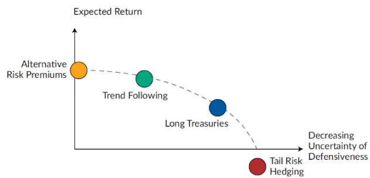
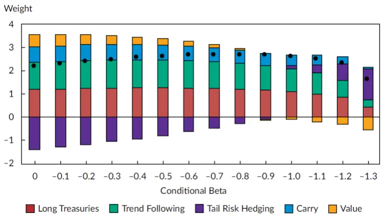
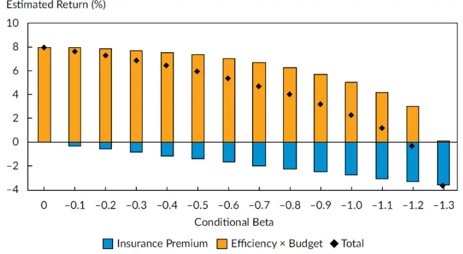
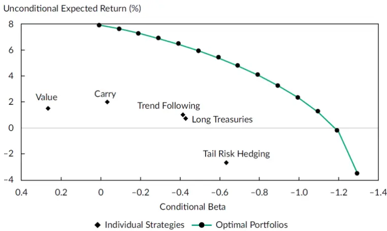
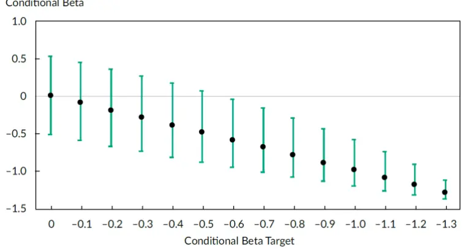
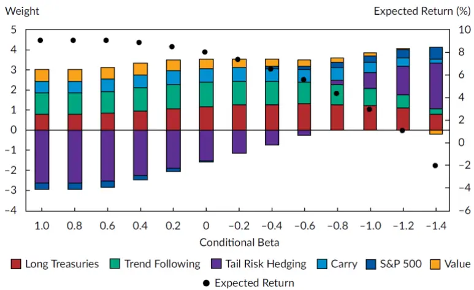
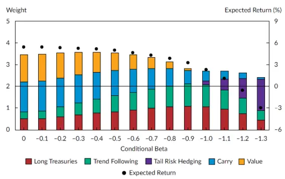
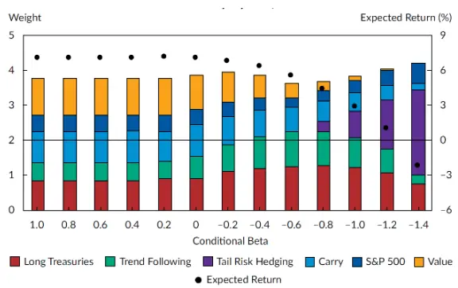

[Table_Title2021.02.10

# 如何有效对冲配置组合中的股票风险

## ——精品文献解读系列（二）

## 本报告导读：

本篇报告解读的文献提出了一个构建最优风险保护组合的方法框架。该方法可以协助投资者进行风险保护效果与预期收益率影响的权衡。

## 摘要：

le_Summary]投资学是一门学术界与业界紧密结合的学科，其中大类资产配置是这种紧密结合的代表。从Markowitz（1952）开创现代投资组合理论开始，学术界为业界提供了丰富的理论参考和方法模型，推动了大类资产配置实践的繁荣发展。为了帮助读者及时跟踪学术前沿，我们推出了“精品文献解读”系列报告，从大量学术文献中挑选出精品论文进行剖析解读，为读者呈现大类资产配置领域最新的思路和方法。

本篇为读者解读的文献是 Baz 与 Davis 等人于 2020 年发表于期刊Financial Analyst Journal 的文章: “A Framework for ConstructingEquity-Risk-Mitigation Portfolios”。

如何在不过多影响预期收益的情况下保护配置组合不受股票市场回撤的过度影响是资产配置研究中的重要问题。本文针对这一问题提出了一个构建最优风险保护组合的方法框架。这一框架假设投资者通过对已有的配置组合叠加风险保护组合的方式来实现对重大股票回撤风险的对冲。

本文提出的模型给出了利用优化权衡配置组合受股票回撤影响程度与预期收益率的框架。尽管给配置组合添加防守性质的元素不可避免的会削弱预期收益率，利用该模型构建的风险保护组合可以在维持风险保护效果的同时有效的减少对于预期收益率的影响。作者在实证分析中发现，通过这种方法构建的最优风险保护组合可以在付出有限预期收益率损失的基础上获得显著的股票风险保护。在保持正预期收益率的同时可以获得-1.1的条件 beta暴露。

本文的主要贡献在于提出了一个明确将股票风险回撤保护纳入配置组合构建模型的框架。这一方法可以扩展至其他股票风险保护度量以及风险度量并适用于其他可配置资产与策略。

大类资产配置研究

## or] 报告作者

李祥文(分析师)

8 021-38031560

lixiangwen@gtjas.com

证书编号 S0880520100001

王瑞韬(研究助理)

8 021-38038208

wangruitao@gtjas.com

证书编号 S0880121010024

## cReport] 相关报告

兼顾资产与因子的大类资产配置方法

2021.01.29

大类资产配置方法体系探秘

2021.01.22

全球机构投资者如何应对“黑天鹅”

2020.03.31

从“全天候”到风险平价：思考和展望 2020.03.12

Nowcast 中国宏观数据

2020.03.01

## 请输入摘要信息

## 1. 文献概述

## 文献来源：

Baz, Davis, Sapra, Gillmann, and Tsai (2020). A Framework for Constructing Equity-Risk-Mitigation Portfolios. Financial Analyst Journal, 76(3), 81-98.

## 文献摘要：

股票风险保护组合(Equity-Risk-Mitigation Portfolios)的关键在于策略预期收益率与其分散股票风险能力的权衡。通常情况下，策略更好的分散股票资产风险的能力伴随着更低的预期收益率，反之亦然。本文提出了一个构建最优股票风险保护组合的方法。在我们提出的模型中，投资者在条件股票beta的约束下最大化组合预期收益率。我们的实证结果证实了相比使用单一的风险保护策略，使用文中方法构建的股票风险保护组合具有显著更好的收益与风险保护特征。

## 文献评述：

作者在本文中提出的模型给出了利用优化权衡配置组合受股票回撤影响程度与预期收益率的框架。尽管给配置组合添加防守性质的元素不可避免的会削弱预期收益率，恰当的风险保护组合构建方法可以有效的减少这一成本。投资者可以参考本文提出的模型框架根据自身的预期收益率的需求以及对于股票回撤的容忍能力灵活构建风险保护组合。

## 实践意义与扩展：

本文的主要贡献在于提出了一个明确将股票回撤风险保护纳入配置组合构建模型的框架。本文使用股票下跌时期的条件beta作为各资产对风险的保护度量，并通过优化约束的方式纳入了传统均值方差下的配置组合构建模型。这一方法可以扩展至其他股票风险保护度量以及风险度量并适用于其他可配置资产与策略。

具体而言，文中作为示例的四类风险保护策略中的三类：看跌期权、债券以及趋势跟随类策略在我国市场具备一定的实践意义。其中投资者可以通过上证50ETF以及沪深300系列期权获得最为稳健的看跌期权保护。这种方式在国内实践的主要限制在于机构投资者投资标的的限制以及期权市场相较股票较小的市场体量。而对于趋势跟随类策略的配置，除了对该类策略直接进行配置外，投资者还可以通过在配置组合的再平衡中纳入趋势信息以获得对于趋势的可观暴露。Rattray等人在他们的文章“Strategic Rebalancing”1中进行了相关讨论，可供投资者更进一步的参考。

而除了原文中作者使用的条件 beta以外，投资者也可根据自身业务场景需求选择其他风险度量。Goldberg,Hayes & Mahmoud(2013)2, Rockafellar& Uryasev(1999)3等多篇文章就如何把在值风险(Value at Risk)、期望损失(Expected Shortfall)等其他风险度量纳入组合优化过程进行了详尽的讨论，同样可供投资者参考。

## 2. 引言

股票通常是投资者资产配置组合中波动最为剧烈的资产类别。也因此如何在不过多影响预期收益的情况下保护配置组合不受股票市场重大回撤的过度影响成为了资产配置研究中的重要问题。实践中投资者尝试以多种不同的方式来解决这个问题。在股票下跌阶段将其卖出显然是最为直观的选择，然而由于卖出股票的方案伴随着错失股票收益的较大机会成本，投资者普遍转而寻求借助持有其他机会成本相比更低的策略来保护组合受到股票重大回撤风险的影响。

在美国市场中被投资者普遍接受用于分散、缓解股票重大回撤风险的资产与策略包括：1.债券，2.趋势跟随类策略，3.看跌期权以及 4.其他诸如利差、价值等另类风格组合。与卖出股票这种完全避免损失并放弃所有可能未来收益的方法不同的是，这四类策略对于股票回撤风险保护的效果以及对于配置组合收益的影响并不直观，也因此需要更进一步的详细分析。

在本文中，我们提出了一个考虑股票回撤风险的资产配置方法框架。这种方法的核心观点在于预期收益率更低的风险保护策略有着更好的风险保护效果。也因此投资者在对配置组合进行股票风险保护时需要权衡最终配置组合的预期收益率以及风险保护的效果。

图1以定性的方式展示了前述四种常见风险保护策略的预期收益率与对股票风险保护的效果。图中的Y轴代表了策略的预期收益率而 X轴代表了策略对于股票回撤风险的保护效果。买入看跌期权、持有债券、持有趋势跟随类策略以及另类风格组合有着依次递增的预期收益率以及对应递减的股票风险保护效果。使用期权进行尾部保护有着最为确定性的保护效果，同样其负的预期收益率代表投资者需要为此付出较高成本。我们在后文中定义了用来衡量策略保护股票回撤风险能力的度量并以此为基础开发了考虑股票回撤风险的资产配置模型框架。

图 1：股票风险保护策略收益与保护效果

数据来源：Baz et al.(2020)，国泰君安证券研究

在接下来的文章中，我们首先介绍了上述四类策略用于保护重大股票回撤风险的历史研究与理论基础。随后提出了使用股票回撤时期的条件beta 作为各类资产风险保护效果的度量。最后我们以此为基础对传统均值方差模型进行拓展，纳入了对于股票回撤风险的考虑，并进行了相应的实证分析。

## 3. 风险保护策略

持有看跌期权对于股票重大回撤的保护来自于衍生品合约条款。期权持有者有权以事先规定的行权价格将股票卖出，从而期权合约的行权价格也代表了投资者组合价值的最低值。投资者通过买入看跌期权锁定了最大的可能损失。当然这种确定性的保护也伴随着相应的缺点。看跌期权的价格本身受到了股票价格以及波动率两者影响。看跌期权价格与股价的负相关关系以及波动率风险溢价现象(期权隐含波动率长期高于实现波动率)的存在使得长期持有看跌期权的方法会带来负的预期收益率。这也对应了其在图1中最右的位置。持有看跌期权以最高的成本获得了最为稳妥的风险保护。

在配置组合中持有国债或许是最为常见的股票风险保护策略。Baz, Sapra,& Ramirez(2019)在研究中发现，自九十年代以来，美国国债与股票呈现负相关的走势。在过去的 50 年间的大部分经济衰退股票下跌时期，美国国债都提供了正的收益率，有效的缓解了股票大跌对于配置组合的影响。当然借助持有债券分散股票重大回撤风险的方式同样有其局限性。正如 Campbell, Sunderam & Viceira(2017)的研究所展示的，股票与债券的相关性随时间变化，并不稳定，这种保护存在不确定性，其保护效果弱 于 持 有 看 跌 期 权 。 此 外 Wright(2011) 以 及 Adrian, Crump &Moench(2013)都认为近 10年来美国债券利率期限曲线越发平坦，加重了投资者关于债券类资产在未来提供收益的能力。从长期来看，债券的预期收益率远低于股票预期收益率，在四类分散股票回撤风险的资产中，仅仅高于需要付费的持有看跌期权。

趋势跟随类策略受益于各类资产中存在的持续性的趋势特征。Fung &Hsieh(2001)的研究表明，趋势跟随类策略与其他对做多波动率类型的策略有着相似的收益分布。这类策略有着整体上与股票负相关但是并不具有对股票以及波动率风险溢价显著负暴露的优点。也因此相对看跌期权，这类策略有着更好的预期收益率特征。当然这种更好的收益特征也伴随着相对较差的风险保护能力。这类策略对于突然发生的股票下跌通常难以起到有效的保护作用。

持有另类风险溢价策略对于股票重大回撤的保护来自于他们和股票资产的低相关性。另类风险溢价策略通常具有以下特点：(1)对传统股债资产暴露有限。(2)风险溢价的存在对应着清晰的经济学逻辑。(3)经过了历史数据的充分验证。(4)策略的实施需要借助杠杆以及衍生品构建多空组合。由于这类策略以限制对股票暴露的方式设计，他们也天然的成为保护股票风险的策略候选。当然，尽管这类策略从全样本看与股票类资产的相关性接近于 0，这种相关性同样并不稳定随时间而变动。

## 4. 风险保护组合的构建方法

在本章中，我们开发了一套构建股票风险保护组合的方法框架。这一框架可以被看作是Markowitz(1952)均值方差优化的一个扩展。我们在模型中加入了对于股票风险保护能力的约束以反映投资者保护配置组合不受到股票风险过多影响的需求。

我们使用股票大跌的市场环境下策略对于股票收益率的 beta（下称条件beta）来衡量这类策略保护股票下跌的能力。Page 和 Panariello(2018)曾指出，在股票下跌的市场环境中，资产之间的相关性与其他“正常”时期并不相同。因此使用条件 beta而不是无条件beta可以更好的捕捉这种关系。

$$
\tilde{\beta}=\frac{\mathrm{cov}(R_{Stock},R_{Asset}\mid R_{Stock}\leq T)}{\sigma(R_{Asset}\mid R_{Stock}\leq T)\sigma(R_{Stock}\mid R_{Stock}\leq T)}\tag{1}
$$

公式1中，T代表了用于判断股票大跌的收益率阈值。 $\tilde{\beta}.$ 为负表明此类资$产$ 与股票呈相反的变化趋势从而可以在股票下跌的时期起到保护作用。更负的 $1\tilde{\beta}_{1}$ 值(更大的绝对值)代表了该类策略更好的对股票下跌时期的保护能力。

我们在均值方差优化衡量配置组合预期收益率与预期波动率的基础上加入了对于条件 beta 的约束。正如之前的描述，因为具有较高预期收益率的风险保护策略有着更差的股票风险保护能力，加入条件 beta的约束至关重要。我们在公式2 中正式的定义了这个模型。投资者在目标波动率与目标条件beta 的约束下最大化投资组合的预期收益率。

$$
\begin{array}{c}{{Max_{w}E\big[R_{p}\big]=w^{T}\mu}}\\{{s.t.w^{T}\Sigma w=\sigma_{p}^{2}}}\\{{w^{T}\tilde{\beta}\leq\tilde{\beta}_{p}}}\end{array}\tag{2}
$$

在拓展后的优化中， $\mu$ 代表策略的无条件预期收益率；Σ代表策略的无条件方差协方差矩阵； $\sigma_{p}^{2}$ 代表投资者的目标无条件方差； $\tilde{\beta}_{1}$ 代表条件beta；$\tilde{\beta}_{p}$ 代表了投资者所需求的股票风险保护效果。优化中的两个约束分别对应了投资者所愿意承担的预期波动率以及对于股票下跌保护的需求。

为了能够更进一步的理解最优风险保护组合的含义，我们使用拉格朗日展开的方式对上述优化进行了更进一步的分析，使用 3 个具有特殊意义的组合对扩展后优化组合进行了分解。这三个组合分别为：

1. 不包含条件 $-\beta$ 约束的均值方差最优组合，对应权重 $w^{MVO}$ ，条件 beta暴露 $\cdot\tilde{\beta}^{MVO}$ ，以及夏普 ${\cdot}SR_{MVO}$

2. 条件 beta 的特征组合，即条件 beta 暴露为 1 且方差最小的组合，对应权重 $w^{B}$ ，组合无条件方差 $\sigma_{w^{B}}^{2}$ 以及夏普 $SR_{w^{B}}$

3. 对条件 $-\beta$ 无暴露的组合 $\cdot w^{MVO}-\tilde{\beta}^{MVO}w^{B}$ ，通过减去条件 beta 的特征组合以实现对均值方差最优组合的条件 $\cdot\beta$ 调整。

当优化问题中的条件beta约束处于激活状态时(这也是我们最为关心的情况)，可以得到如下形式的解析解：

$$
w^{*}=\tilde{\beta}_{p}w^{B}+c(w^{MVO}-\tilde{\beta}^{MVO}w^{B})\tag{3}
$$

最终风险保护组合的权重由两个部分组成，可以被直观的理解为一个分为两步的组合构建过程：首先使用条件 beta的特征组合根据股票下跌保护的目标构建风险保护组合 $\cdot\tilde{\beta}_{p}w^{B}$ 以满足风险保护需求。随后在这个基础上添加调整后的均值方差组合 $\cdot w^{MVO}\;-\;\tilde{\beta}^{MVO}w^{B}$ 以获得更高的预期收益率。组合最终获得的预期收益率由优化中总的目标波动率 $\cdot\sigma_{p}^{2}以及$ 为了实现风险保护效果所占用的目标波动率比例所共同决定。更为稳妥的风险保护组合会对应更大的目标波动率占用比例从而带来最终配置组合预期收益率的下降。

沿着同样的思路，股票风险保护组合的预期收益率也可以进行类似的分 解。

$$
E\big[R_{p}\big]=\mu^{T}\tilde{\beta}_{c}w^{B}+\Big(\sigma_{p}^{2}-\tilde{\beta_{c}}^{2}\sigma_{w^{B}}^{2}\Big)^{\frac{1}{2}}\big(SR_{MVO}^{2}-SR_{w^{B}}^{2}\big)^{\frac{1}{2}}\tag{4}
$$

公式 4 中的第一部分 $\cdot\mu^{T}\widetilde{\beta}_{c}w^{B}$ 对应了为了实现条件 beta 的约束而获得的预期收益率，这一部分预期收益率的存在来源于对传统均值方差优化中加入了条件β的约束。由于条件β通常为负，并且其特征组合的风险收益属性差于均值方差最优组合，它可以被理解为为了实现股票下跌风险保护所付出的成本。公式 4 中的第二部分两项则代表了扣除条件β约束的影响后剩余可使用的波动率预算以及以夏普为度量的组合有效性。当投资者追求更负的条件 beta时，会占用更多的目标波动率预算从而降低了风险保护组合的预期收益率。

公式4中第二部分的第二项对应了以夏普为代表的最优风险保护组合的效率。只有满足了风险保护目标之后剩余的波动率目标可以被用于提升预期收益率。最终风险保护组合的预期收益率被分解为了风险预算、组合有效性以及股票保护成本三部分。

$$
E[R_{p}]=风险预算\times 组合效率-股票保护成本\tag{5}
$$

公式5直观的表明了目标风险组合的关键在于权衡风险保护的成本以及对于预期收益率的需求。投资者可以通过将更多权重赋予高夏普(效率)策略的方式构建预期收益率更高的风险保护组合。

## 5. 实证结果

为了更好的理解上一章提出的风险保护组合的构建方法，我们将其应用在前文提及的对股票下跌具有保护作用的5 类策略中。这 5类策略分别

是持有美国国债、趋势跟随、看跌期权、利差(Carry)以及价值(Value)。
我们使用自 1994 年一季度开始至 2018 年四季度的季度数据进行回测。

表1中条件beta以及条件相关性的计算使用了标普500指数收益率低于-3.75%时期所对应的数据。对于各类策略的全样本收益数据，我们在策略回测中根据估计的交易成本进行了调整。持有美国国债、趋势跟随类策略、买入看跌期权、利差组合以及价值组合这五类策略对应的费后夏普分别为0.4、0.33、-0.5、0.86以及 0.58。更进一步的，为了反映当下较低的利率水平、以及策略可能存在的数据挖掘等问题，我们假设除持有看跌期权外的其他策略的未来夏普是历史回测值的 50%。表 1 中的第三列反映了我们对于未来策略夏普的假设，美国国债、趋势跟随、利差以及价值策略的夏普比率分别被设定为0.2、0.15、0.4以及 0.3。结合策略 5%的预设无条件波动率目标，他们分别对应着 1%、0.8%、2%以及1.5%的全样本预期收益率。

Unconditional Moment Assumptions
表2：风险保护策略收益率信息假设
Conditional Moment Assumptions

|  | Excess |  | Sharpe |  | Equity | Equity | Equity |
| --- | --- | --- | --- | --- | --- | --- | --- |
|  | Return | Volatility | Ratio | Volatility | Covariance | Beta | Correlation |
| S&P 500 | 5.2% | 15.6% | 0.33 | 10.3% | 1.1% | 1.00 | 1.00 |
| Long Treasuries | 1.0% | 5.0% | 0.20 | 6.7% | -0.4% | -0.42 | -0.64 |
| Tail risk hedging | -2.6% | 5.4% | -0.50 | 7.1% | -0.7% | -0.64 | -0.92 |
| Trend following | 0.8% | 5.0% | 0.15 | 6.4% | -0.5% | -0.43 | -0.70 |
| Carry | 2.0% | 5.0% | 0.40 | 5.7% | 0.0% | -0.04 | -0.06 |
| Value | 1.5% | 5.0% | 0.30 | 5.1% | 0.3% | 0.26 | 0.52 |

数据来源：Baz et al.(2020)，国泰君安证券研究

由于机构投资者通常在季度、半年甚至年度的时间窗口上关注组合的净值的变化，我们选用季度数据来计算条件β以及条件相关性。我们选用的-3.75%的收益率阈值对应着历史 20%的分位水平，可以代表投资者希望获得回撤保护的时期。

事实上，前一章中展示的资产配置框架可以对任意数量的资产与策略使用，投资者可以根据自身独特的需求来进行选择。我们在表 1中展示的5 类策略仅供参考并不代表所有可以用于保护股票下跌风险的策略。其他包括低波动中性策略在内的多种策略都可以被用作对股票风险的保护策略。

对于很多机构投资者而言，风险保护策略的构建通常是和资产配置权重相对独立的决策流程。因此在这一章的实证分析中，我们首先专注于投资者已经完成初步资产配置决策，确定了股票资产权重，并尝试以添加风险保护组合的方式为股票资产提供保护的应用场景。我们在组合优化中并没有纳入股票指数，而只是选择了前文提及的5类风险保护策略构。这样的设定也有益于对于组合特征的分析。在随后一章中我们会加入股票资产，讨论一个整合的资产配置组合构建过程。

图2展示了对应不同风险保护效果的最优风险保护组合。目标波动率统一被设置为10%。左边相对更大的条件beta代表了相对更弱的股票风险保护效果，在此时组合甚至通过卖出看跌期权的方式以获得预期收益率的提升。而在向图右移动的过程中，最优权重中看跌期权的权重随之上升，保护效果得到提升，条件 beta随之变小。

图 2：不同条件beta 目标对应的最有保护组合权重

数据来源：Baz et al.(2020)，国泰君安证券研究

图3展示了基于公式5的最优保护组合预期收益率分解。当组合条件beta暴露为0 时，投资者并没有将波动率的预算用于股票风险保护。此时所有的预期收益率来自于公式5中的风险预算与组合有效性而不包括风险保护成本的影响。而随着条件 beta的约束变为负数向图中右边移动，组合使用了越来越多的波动率预算用于对股票下行风险的保护，对应着公式5中的股票保护成本部分。在图的最右端，股票保护的部分占据了所有风险预算，而保护组合的预期收益率也相应为负，投资者为了稳妥的股票风险保护需要付出预期收益率的损失。

图 3：预期收益率拆解

数据来源：Baz et al.(2020)，国泰君安证券研究

图2中的结果证实了最优的风险保护组合确实是由多个风险保护策略共同组成。那么一个很自然的问题是，相比单独使用某一风险保护策略，投资者使用最优风险保护组合的效果会有多大提升。图 4 为这个问题给出了答案。图中绘出了这五类策略以及他们所能组成的保护组合对应的条件beta以及预期收益率。我们发现使用最优的保护组合而不是单一策略对股票回撤的保护优势是显著的。以持有国债的策略为例子，单一使用持有国债保护股票回撤风险对应-0.4的条件beta，1%的预期收益率以及0.2的夏普。而使用最优风险保护组合却可以带来 6.4%的预期收益率以及 0.64 的夏普。在同样的保护效果下获得了 3 倍的夏普提升。由最优保护组合形成的组合前沿相比单一保护策略有着显著的提升。

图 4：风险保护组合风险收益前沿

数据来源：Baz et al.(2020)，国泰君安证券研究

到目前为止，我们使用了样本方差与协方差矩阵对条件beta进行估计，这样的方法使得条件 beta 的估计受到估计误差的影响。过大的估计误差可能会影响最优风险保护组合的效果。为了衡量估计误差对于最优风险保护组合的影响，针对图4 中每一个最优风险组合，我们为其计算了95%的条件beta置信期间。结果如图 5所示，估计误差确实对于最优风险组合有着一定的影响。为了以 95%的置信度获得负的条件 beta 暴露，投资者需要将条件 beta 的目标设置在-0.6 以下。与此类似，如果投资者设定条件beta的目标为 0，搜获得的风险保护组合在 95%的情况下会落在-0.5到 0.5的区间中。

图 5：条件beta 估计的 95%置信区间

数据来源：Baz et al.(2020)，国泰君安证券研究

## 6. 改变机会集与优化约束

在这一章中，我们将股票类资产加入讨论并对优化问题引入了做空限制的约束以更加贴近现实世界的投资环境。

## 6.1. 加入股票资产

在前一章的实证分析中，股票资产并没有被纳入风险保护组合的讨论中。正如之前的讨论，我们提出的最优保护组合构建方法有着灵活适用于各类资产与策略的特点。在这一章中我们将股票宽基指数加入以研究对于风险保护组合的影响。

图6中给出了加入股票宽基指数后最优风险保护组合的对应权重。图中左边条件beta为正的最优风险保护组合代表了一个一步同时完成资产配置与风险保护决策的组合。而右边条件 beta为负的组合则更接近上一章中用于叠加至已有配置组合上保护股票回撤的风险保护组合。值得一提的是，图 6中随着条件 beta的下降，股票资产的权重却随之增加。这一现象是由于看跌期权与股票资产的负相关性决定的。

图 6：含股票的最优风险保护组合

数据来源：Baz et al.(2020)，国泰君安证券研究

## 6.2. 加入卖空限制

在之前的最优风险保护组合的构建中，我们并没有加入卖空的约束。尽管卖出这些策略事实上是可以执行的，卖出这些风险保护策略与风险保护组合的目标并不一致。举例来说，当投资者的目标是保护股票风险时，他们并不会去卖出看跌期权。

为了更加接近现实世界的投资环境，我们在公式 1的优化中加入了卖空限制，将所有策略的权重约束为正。图7与图 8分别展示了加入卖空限制后不含股票与含股票的最优风险保护组合。由于禁止卖空约束的出现，投资者不能再以卖出看跌期权的方式获得预期收益率的提升，组合中低收益率的国债与趋势跟随权重出现了显著下降，而另类风险策略对应的价差与价值组合权重则显著上升。加入了卖空限制后，最优风险保护组合的预期收益率都出现了一定程度的下降。以条件beta为-0.5的组合为例，在加入了卖空约束后，组合预期收益率由5.9%下降至4.9%。

图 7：卖空约束风险保护组合

数据来源：Baz et al.(2020)，国泰君安证券研究

图 8：卖空约束风险保护组合(含股票)

数据来源：Baz et al.(2020)，国泰君安证券研究

## 7. 总结

本文讨论了如何构建最优风险保护组合以保护配置组合不受重大股票回撤风险的过度影响。我们证明了这一问题的核心在于风险保护效果以及成本的权衡。投资者只有通过适当放弃预期收益率以获得股票重大回撤风险的保护。

尽管对股票重大回撤风险进行保护意味着预期收益率的相应下降，本文证明了投资者可以通过恰当的组合构建方法来减小其对配置组合预期收益率的影响。为了解决这一问题，我们基于均值方差优化进行扩展，提出了一个灵活的框架用于帮助投资者构建最优股票风险保护组合。投资者可以基于这一框架衡量保护效果与成本。

我们的实证结果证实，使用最优风险保护组合而不是单一的保护策略可以有效的提升组合的风险保护效率。通过构建最优风险保护组合，投资者并不需要牺牲很多预期收益率就可获得非常可观的风险保护。投资者可以同时获得正的预期收益率以及低至-1.1的条件beta暴露。

## 本公司具有中国证监会核准的证券投资咨询业务资格

## 分析师声明

作者具有中国证券业协会授予的证券投资咨询执业资格或相当的专业胜任能力，保证报告所采用的数据均来自合规渠道，分析逻辑基于作者的职业理解，本报告清晰准确地反映了作者的研究观点，力求独立、客观和公正，结论不受任何第三方的授意或影响，特此声明。

## 免责声明

本报告仅供国泰君安证券股份有限公司（以下简称“本公司”）的客户使用。本公司不会因接收人收到本报告而视其为本公司的当然客户。本报告仅在相关法律许可的情况下发放，并仅为提供信息而发放，概不构成任何广告。

本报告的信息来源于已公开的资料，本公司对该等信息的准确性、完整性或可靠性不作任何保证。本报告所载的资料、意见及推测仅反映本公司于发布本报告当日的判断，本报告所指的证券或投资标的的价格、价值及投资收入可升可跌。过往表现不应作为日后的表现依据。在不同时期，本公司可发出与本报告所载资料、意见及推测不一致的报告。本公司不保证本报告所含信息保持在最新状态。同时，本公司对本报告所含信息可在不发出通知的情形下做出修改，投资者应当自行关注相应的更新或修改。

本报告中所指的投资及服务可能不适合个别客户，不构成客户私人咨询建议。在任何情况下，本报告中的信息或所表述的意见均不构成对任何人的投资建议。在任何情况下，本公司、本公司员工或者关联机构不承诺投资者一定获利，不与投资者分享投资收益，也不对任何人因使用本报告中的任何内容所引致的任何损失负任何责任。投资者务必注意，其据此做出的任何投资决策与本公司、本公司员工或者关联机构无关。

本公司利用信息隔离墙控制内部一个或多个领域、部门或关联机构之间的信息流动。因此，投资者应注意，在法律许可的情况下，本公司及其所属关联机构可能会持有报告中提到的公司所发行的证券或期权并进行证券或期权交易，也可能为这些公司提供或者争取提供投资银行、财务顾问或者金融产品等相关服务。在法律许可的情况下，本公司的员工可能担任本报告所提到的公司的董事。

市场有风险，投资需谨慎。投资者不应将本报告作为作出投资决策的唯一参考因素，亦不应认为本报告可以取代自己的判断。
在决定投资前，如有需要，投资者务必向专业人士咨询并谨慎决策。

本报告版权仅为本公司所有，未经书面许可，任何机构和个人不得以任何形式翻版、复制、发表或引用。如征得本公司同意进行引用、刊发的，需在允许的范围内使用，并注明出处为“国泰君安证券研究”，且不得对本报告进行任何有悖原意的引用、删节和修改。

若本公司以外的其他机构（以下简称“该机构”）发送本报告，则由该机构独自为此发送行为负责。通过此途径获得本报告的投资者应自行联系该机构以要求获悉更详细信息或进而交易本报告中提及的证券。本报告不构成本公司向该机构之客户提供的投资建议，本公司、本公司员工或者关联机构亦不为该机构之客户因使用本报告或报告所载内容引起的任何损失承担任何责任。

## 评级说明

## 1.投资建议的比较标准

投资评级分为股票评级和行业评级。

以报告发布后的12个月内的市场表现为比较标准，报告发布日后的 12个月内的公司股价（或行业指数）的涨跌幅相对同期的沪深 300 指数涨跌幅为基准。

## 2.投资建议的评级标准

报告发布日后的 12 个月内的公司股价（或行业指数）的涨跌幅相对同期的沪深 300 指数的涨跌幅。

|  | 评级 说明 |  |
| --- | --- | --- |
| 股票投资评级 | 增持 | 相对沪深 300指数涨幅15%以上 |
|  | 谨慎增持 | 相对沪深300指数涨幅介于5%～15%之间 |
|  | 中性 | 相对沪深300指数涨幅介于-5%～5% |
|  | 减持 | 相对沪深300指数下跌5%以上 |
| 行业投资评级 | 增持 | 明显强于沪深300指数 |
|  | 中性 | 基本与沪深300指数持平 |
|  | 减持 | 明显弱于沪深300指数 |

## 国泰君安证券研究所

|  | 上海 | 深圳 | 北京 |
| --- | --- | --- | --- |
| 地址 | 上海市静安区新闸路669号博华广场 20层 | 深圳市福田区益田路 6009 号新世界 商务中心34层 | 北京市西城区金融大街甲9号金融 街中心南楼18层 |
| 邮编 | 200041 | 518026 | 100032 |
| 电话 | （021)38676666 | （0755)23976888 | (010)83939888 |
|  | E-mail: gtjaresearch@gtjas.com |  |  |