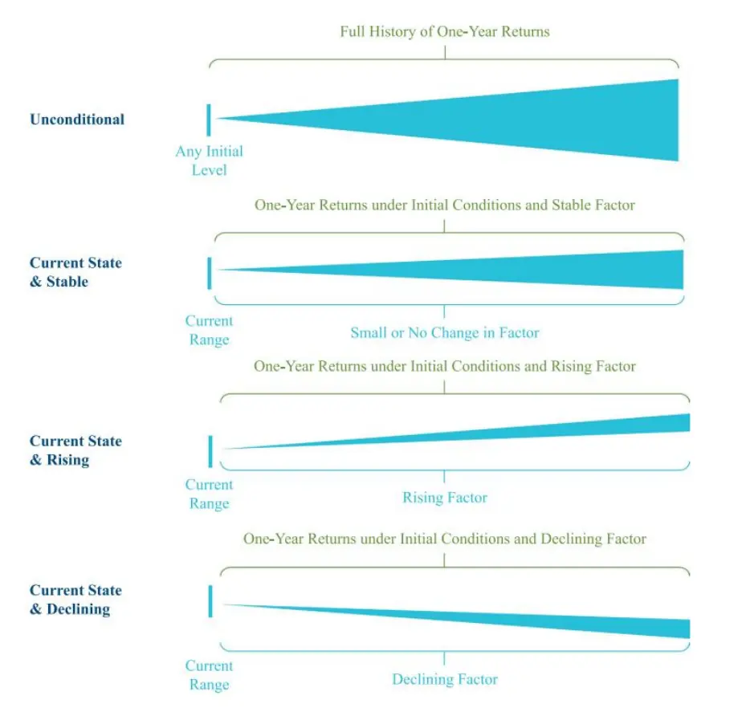

[Table_Title2021.02.18

## 战术资产配置的宏观经济仪表盘

## ——精品文献解读系列（三）

## 本报告导读：

本篇报告解读的文献构建了一套宏观经济仪表盘，可以帮助投资者解读宏观经济数据、筛选有效宏观因子，以更好地进行战术资产配置。

## 摘要：

le_Summary]投资学是一门学术界与业界紧密结合的学科，其中大类资产配置是这种紧密结合的代表。从Markowitz（1952）开创现代投资组合理论开始，学术界为业界提供了丰富的理论参考和方法模型，推动了大类资产配置实践的繁荣发展。为了帮助读者及时跟踪学术前沿，我们推出了“精品文献解读”系列报告，从大量学术文献中挑选出精品论文进行剖析解读，为读者呈现大类资产配置领域最新的思路和方法。

本篇为读者解读的文献是 Clewell et al.（2018）在期刊 The Journal ofPortfolio Management 上发表的论文“Macroeconomic Dashboards forTactical Asset Allocation”。

该文献构建了一套宏观经济仪表盘，可以帮助投资者洞悉宏观因子对资产收益的影响。与其他文献不同，本文并没有对宏观因子的市场定价进行实证统计检验，而是重点强调了如何使用宏观因子数据来辅助进行投资策略。宏观经济仪表盘可以结合历史数据和对宏观因子的预期走势，对配对交易资产在未来 1年的收益率进行预测，为投资者做出战术资产配置决策提供有益参考。

大类资产配置研究

## or] 报告作者

李祥文(分析师)

8 021-38031560

lixiangwen@gtjas.com

证 书 S0880520100001

王瑞韬(研究助理)

8 021-38038208

wangruitao@gtjas.com

证书编号 S0880121010024

## cReport] 相关报告

如何有效对冲配置组合中的股票风险2021.02.10

兼顾资产与因子的大类资产配置方法2021.01.29

大类资产配置方法体系探秘

2021.01.22

全球机构投资者如何应对“黑天鹅”2020.03.31

从“全天候”到风险平价：思考和展望 2020.03.12

## 1. 文献概述

文献来源：

Clewell, David, et al. "Macroeconomic Dashboards for Tactical Asset Allocation." Journal of Portfolio Management. 44.2 (2018): 50-61.

## 文献摘要：

本文构建了一套宏观经济仪表盘，可以帮助投资者洞悉宏观因子对资产收益的影响。与其他文献不同，本文并没有对宏观因子的市场定价进行实证统计检验，而是重点强调了如何使用宏观因子数据来辅助进行投资策略。宏观经济仪表盘可以结合历史数据和对宏观因子的预期走势，对配对交易资产在未来 1 年的收益率进行预测，为投资者做出战术资产配置决策提供有益参考。

## 文献评述：

如何根据宏观经济数据对资产配置进行中短期的战术调整，是所有投资者面临的重要问题，也是本文构建宏观经济仪表盘的目的。值得注意的是，本文并没有给出一套完整的基于宏观因子的战术配置策略，而仅仅是提供了一套解读宏观经济数据、筛选有效宏观因子的方法和思路。投资者可以参考本文构建自己的宏观经济仪表盘，并将从中得到的结论融入到自己的配置策略和投资决策中。

## 2. 引言

本文旨在建立一套宏观经济仪表盘（Macroeconomic Dashboards），以便于投资者将宏观因子（MacroFactors）应用于战术资产配置。无论是在学术界还是在业界，大家普遍认为宏观因子是资产收益率的重要驱动力。但是，很少有文献资料去阐释如何使用这些宏观因子来进行投资决策。在这种背景下，本文构建了一套宏观经济仪表盘，方便投资者从大量宏观数据中发现关键指标，进而更好地将宏观因子应用于战术资产配置。

本文不会去构建一套完整的基于宏观因子的大类资产配置策略，而是希望投资者能够结合宏观经济仪表盘与其他策略方法，更好地进行战术资产配置。将宏观因子融入传统配置策略至关重要。比如，传统的基于相对估值的战术资产配置策略，通常简单地根据估值指标（比如PE）进行“低买高卖”，但是这种策略在宏观经济剧烈变动时期可能会失效。本文构建的宏观经济仪表盘能够及时跟踪宏观因子，并对资产的未来业绩表现进行预判，可以帮助投资者将宏观因子融入战术资产配置策略。

## 2.1. 宏观因子对资产收益有重要影响

大量学术文献验证了宏观因子对资产收益的重要影响。Chen etal.（1986）发现，按照规模分类的股票投资组合对宏观因子（如利率、工业生产、通货膨胀、信用利差、消费等）的敏感性可以在很大程度上解释投资组合之间的业绩差异。Fama and French（1989）通过研究股票和债券市场，发现可以使用利率、信用利差等宏观因素来预测资产收益率。其他的大量研究也都验证了宏观因子在解释大类资产表现和风格溢价上的重要性。表 1 列举了近些年来相关文献所研究的宏观因子，主要包括消费、失业率、通过膨胀、经济增长和石油价格等。

表 1：现有文献对宏观因子的研究（部分）
Jensen, Johnson, and Mercer [1997] show that the size and value effects depend largely on the monetary environment 
Booth and Booth [1997] emphasize the importance of monetary policy in explaining stock and bond returns 
Lettau and Ludvigson [2001] show how consumption patterns forecast excess equity market returns. 
Dahlquist and Harvey [2001] show that the yield curve is predictive of stock returns. 
Zhang et al. [2009] find a significant relationship between macroeconomic variables and the size and style premia. 
They show that value and small-cap stocks outperform in periods of economic growth. Also, they find a positive relationship between inflation 
and value outperformance. 
Boyd, Hu, and Jagannathan [2005] analyze the effect of unemployment and find that rising unemployment is bad news for stocks during 
contractions but, counterintuitively, good news during expansions. 
Ludvigson and Ng [2009] show that "real" and "inflation" factors have predictive power for bond returns 
Kritzman, Turkington, and Page [2012] show that regimes in inflation and GDP explain asset class returns and that macro regime-switching 
models can be used for tactical asset allocation. 
Franz [2013] shows that macro factors can be used to dynamically optimize an investor's stocks vs. bonds allocation over time. 
Page [2013] shows a significant link between macroeconomic surprises (in GDP and inflation) and bond, stock, and commodity returns. 
Naik et al. [2016] relate the business cycle to returns for a broad list of risk factors. 
Bernanke [2016] explains that oil prices and the stock market are correlated (albeit not perfectly) because of a common exposure to aggregate demand. 
Blair and Qiao [2017] build a market-timing model for U.S. stocks with 20 factors, including oil, inflation rates, and spreads
数据来源：Clewell et al.（2018），国泰君安证券研究

## 2.2. 在资产配置中应用宏观因子存在困难

虽然学术界一再强调宏观因子的重要性，但是投资者在进行战术资产配置（6-18个月）时却难以将宏观因子融入配置策略。这是因为学术界很少去讨论如何将宏观预期进行市场定价。此外，宏观经济数据种类繁多指标冗杂，这使得投资者难以区分其中的噪声和信号，无法找到驱动资产收益的有效指标。

在资产配置实践中面临的另外一个问题是，宏观因子在不同的初始条件下，对资产收益的影响可能大不相同。比如，Boyd etal.（2005）的研究表明，失业率上升对股票收益的影响在经济扩张期和衰退期是完全不同的；类似地，工业生产下降对股票收益的影响也取决于初始经济环境的好坏。我们认为宏观因子对资产收益的影响取决于当前所处的情境状态，但这一问题在先前的学术研究中鲜有讨论。

## 3. 构建宏观经济仪表盘

本文通过构建宏观经济仪表盘，将宏观因子映射到资产预期收益。与其它学术论文通常采用计量经济学方法不同，本文使用的方法更加简便，更加直观。我们构建的宏观经济仪表盘具备以下特点：

（1）并不是基于静态历史数据样本进行回归分析，而是会进行动态更新，可以为投资者进行战术资产配置提供实时的参考；

（2）关注配对资产之间的相对收益情况；

（3）强调在不同情境状态下，有哪些宏观因子对资产配对交易有显著影响；

（4）通过宏观因子当前所处的百分位水平来反应当前所处经济状态。

本文构建的宏观经济仪表盘包含了学术文献关注的主要宏观因子，具体如表2所示。

表 2：宏观经济仪表盘包含的宏观因子

| Macro Factor | Change Type (Level, %) | Factor Start Date |
| --- | --- | --- |
| VIX | % | Jan. 1990 |
| Global Industrial Production | Level Level | Jan. 1991 |
| ex-Construction (Y/Y) |  |  |
| Oil Price (Brent Crude) U.S. Dollar Index | % | Jan. 1990 |
|  | % | Jan. 1990 |
| High-Yield Credit Spread | % | Jan. 1990 |
| (Spread-to-Worst) | Level |  |
| U.S. Investment-Grade Credit | % | Jan. 1990 |
| Spread (Option-Adjusted Spread) | Level |  |
| U.S. Manufacturing PMI | Level | Jan. 1990 |
| Real 10-Year U.S. Treasury Yield | Level | Jan. 1990 |
| Real 2-Year U.S. Treasury Yield | Level | Jan. 1990 |
| U.S. 10-Year vs. U.S. 2-Year Nominal Yield Differential | Level | Jan. 1990 |
| Gold | % | Jan. 1990 |
| U.S. Core Inflation (Y/Y) | Level | Jan. 1990 |
| Euro Core Inflation (Y/Y) | Level | Jan. 1990 |
| Euro Spot | % | Jan. 1990 |
| Yen Spot | % | Jan. 1990 |
| U.S. Unemployment Rate | Level | Jan. 1990 |
| J.P. Morgan Emerging Markets Currency Index | % | Jan. 2000 |

Notes: All series are retrieved from Haver, except for high-yield spreads (J.P. Morgan Global High Yield Spread-to-Worst), J.P. Morgan Emerging Markets Currency Index, DXY (Factset), and U.S. investment-grade spreads (Bloomberg Barclays U.S. Aggregate Index OAS). Historical analysis data end in December 2016. All data are sourced at the monthly frequency. Levels are based on data reported April 10, 2017. We estimate real yields as the nominal Treasury yield less year-over-year Core CPI.

表 3 展示了我们关注的配对交易资产（asset-class-level pair trades）。对于每一对资产，我们基于当前宏观因子的水平和情境状态，通过回顾历史数据，试图回答如下问题：如果投资者能够预测宏观因子未来一年的变动方向，那么持有该配对资产在未来一年可以获得的收益率是多少？

表 3：资产类别回报

| Stocks vs. Bonds | Russell 3000 vs. Bloomberg Barclays U.S. Aggregate | Jan-1990 |
| --- | --- | --- |
| Stocks vs. Global High Yield | Russell 3000 vs. Credit Suisse High Yield | Jan-1990 |
| Int'1 Equity vs. U.S. Equity | MSCI ACWI ex-U.S. vs. Russell 3000 | Jan-1990 |
| EM Equity vs. DM Equity | MSCI EM vs. MSCI EAFE | Jan-1990 |
| U.S. Growth vs. U.S. Value | Russell 1000 Growth vs. Russell 1000 Value | Jan-1990 |
| DM Growth vs. DM Value | MSCI EAFE Growth vs. MSCI EAFE Value | Jan-1990 |
| U.S. Small-Cap vs. U.S. Large-Cap | Russell 2000 vs. Russell 1000 | Jan-1990 |
| Int'1 Small-Cap vs. Int'1 Large-Cap | S&P Global Small Cap ex-U.S. vs. MSCI ACWI ex-U.S. | Jan-1997 |
| Real Assets vs. Global Equities | T. Rowe Price Real Assets Blended Benchmark vs. MSCI ACWI | Jan-1990 |
| Global High Yield vs. U.S. IG | Credit Suisse High Yield vs. Bloomberg Barclays U.S. Aggregate | Jan-1990 |
| EM Dollar-Debt vs. U.S. IG | J.P. Morgan EMBI Global vs. Bloomberg Barclays U.S. Aggregate | Jan-1993 |
| Non-$ Debt vs. U.S. IG | Bloomberg Barclays Global Aggregate ex-U.S. vs. Bloomberg Barclays U.S. Aggregate | Jan-1990 |
| EM Dollar-Debt vs. Global High Yield | J.P. Morgan EMBI Global vs. Credit Suisse High Yield | Jan-1993 |
| Long Euro/Short USD | EURUSD (Spot) | Jan-1990 |
| Long USD/Short Yen | USDJPY (Spot) | Jan-1990 |
| Long Euro/Short Yen | EURJPY (Spot) | Jan-1990 |
| Long USD/Short DM Currencies | U.S. Dollar Index (DXY; Spot) | Jan-1990 |
| Long EM Currencies/Short USD | J.P. Morgan EmergingMarkets Currency Index (Spot) | Jan-2000 |

Notes: Historical analysis data end in December 2016. Unless specifically identified, asset class returns are computed using total return indices. All data are sourced monthly. The T. Rowe Price Real Assets Blended Benchmark is the following: As of December 1, 2013, the Real Assets Combined Index Portfolio comprises 25% MSCI ACWI Metals & Mining, 20% Wilshire RESI, 20% FTSE EPRA/NAREIT Dev Real Estate Index, 19.5% MSCI ACWI Energy, 10.5% MSCI ACWI Materials, 4% MSCI ACWI IMI Gold, and 1.00% MSCI ACWI IMI Precious Metals and Minerals. Prior to this date, the Real Assets Combined Index Portfolio was composed of 25% MSCI ACWI Metals & Mining, 20% Wilshire RESI, 20% FTSE EPRA/NAREIT Dev Real Estate Index, 16.25% MSCI ACWI Energy, 8.75% MSCI ACWI Materials, 5% UBS World Infrastructure and Utilities Index, 4% MSCI ACWI IMI Gold, and 1.00% MSCI ACWI IMI Precious Metals and Minerals. 
Sources: Bloomberg Barclays, Russell, Credit Suisse, FactSet, J.P. Morgan, and T. Rowe Price.

图1展示了构建宏观经济仪表盘的思路方法。为了构建宏观经济仪表盘，首先定义宏观因子 $f$ 的初始状态（initial conditions） $IC(f)_{t}$ ，其取值可能为 low、medium 或 high，如式（1）所示：

$$
\begin{array}{r}{IC(f)_{t}=\left\{\begin{array}{cc}{"low"}&{x_{L}\leq f_{t}<x_{(25^{0}\%*f)}}\\{"medium"}&{x_{(25^{0}\%*f)}\leq f_{t}\leq x_{(75^{0}\%*f)}}\\{"high"}&{x_{(75^{0}\%*f)}<f_{t}\leq x_{U}}\end{array}\right.}\end{array}\tag{1}
$$

其中， $f_{t}$ 表示宏观因子 $f$ 在时间 t的取值； $x_{U}$ 和 $x_{L}$ 分别表示宏观因子 $f$ 在历史上的最大值、最小值； $x_{(25\%*f)}\acute{\ast}\ "\infty x_{(75\%*f)}$ 分别表示宏观因子 f 在历史时间序列中 25%分位数、75%分位数。

接下来，我们定义宏观因子f在时间t+1的情境指标（scenarios $)S(f)_{t+1}$ 如式（2）所示：

$$
S(f)_{t+1}=f_{t+1}-f_{t}\tag{2}
$$

结合情景指标S $(f)_{t+1}$ 的数值，投资者需要根据经验定义宏观因子f的预期表现，包括“平稳”（Stable）、“上升”（Rising）和“下降”（Declining）。比如，如果预期宏观因子 10 年期国债收益率从t到t+1时刻的涨幅高于25bp，则可定义该宏观因子的预期表现为“上升”。

最后，计算配对交易的条件期望收益率 $R_{t+1}^{C}$ ，如式（3）所示：

$$
R_{t+1}^{C}=\mathbb{E}(R_{t+1}\vert IC_{t},S_{t+1})\tag{3}
$$

具体来说，我们寻找在历史上出现过的同时匹配 $IC_{t}$ 和 $S_{t+1}$ 的时期，计算这些情境下相应配对交易收益率的平均值，即为 $R_{t+1}^{C}$ 。同时，我们在宏观经济仪表盘中还列示了相应情境下收益率 10%分位数和 90%分位数。

比如，我们想要评估宏观因子美元，对配对交易资产——小盘股与大盘股——的影响。从整个样本区间来看，在1990年11月至2016年 12月期间，美国小盘股（罗素 2000指数）12个月滚动收益率跑赢大盘股（罗素 1000）的概率为 51%。从当前时间节点（2017 年 4 月 10 日）来看，最新的美元指数达到 100.6，处于 1990 年 11 月以来的前 25%分位。进一步地，假设投资者在进行战术资产配置时，预期美元指数在未来会进一步上涨。回顾历史数据，当美元处于前25%分位，并且在随后1年继续上涨 5%（或更多）时，美国小盘股收益率在随后 1 年跑赢大盘股的概率是88%，平均超额收益是 8.2%，10%和90%分位超额收益分别是-2.3%和 15.9%。综上，当美元处于高位且预期会继续上涨时，小盘股收益大概率能够跑赢大盘股，其背后的原因可能是美元在高位继续上涨影响了出口贸易，而小盘股受出口的影响比大盘股较小。

图 1：构建宏观经济仪表盘的思路

数据来源：Clewell et al.（2018），国泰君安证券研究

## 4. 解读宏观经济仪表盘

表4展示了宏观经济仪表盘的示意图，包括对区域1-区域 6的解释。其中最重要的数据栏是区域 6 中的“条件收益率”（Conditional Returns），该条件收益率由所有宏观因子条件收益率加权得到。

表 4：宏观经济仪表盘示意图
Macro Factor Analysis: 12-Month Forward Return Outlook Given Current State (as of April 10, 2017)

| Macro Factor | Performance OverEntire Time Period |  | Conditional Returns |  | Global IPex-Construction | 3 U.S. Mfg.PMI | U.S. 4Unemployment |
| --- | --- | --- | --- | --- | --- | --- | --- |
| Current Value |  |  |  |  | 0.79% | 54.8% | 4.5% |
| Long-Term PercentileRank State | Avg Return %& [Range](A) | HitRate(B) | Avg Return %& [Range](C) | HitRate(D) | 34(Medium) | 70(Medium) | 11(Low) |
| Russell 3000 vs. U.S. Agg | 4.7[–23, 22.5] | 72%2 | 3.6[–23.9, 22.3] | 69%6 | 7.1[-9.4, 22.4] | 6.1[–4.6, 17] | 5 -4.1[-35, 16.8] |
| Russell 3000 vs. CreditSuisse High Yield | 1.3[-18.1, 17] | 58% | 1.7[-16.9, 16.9] | 61% | 5[-7.7, 17.1] | 5.3[-3, 14.8] | 0.6[–19.2, 18.4] |
| MSCI ACWI ex-U.S. vs.Russell 3000 | -4.1[-19.9, 12.3] | 36% | -2.7[-16.6, 12.4] | 39% | -2.9[-16.4, 12.4] | -5.3[–20.5, 11.1] | -0.8[-11.9, 12.1] |
| MSCI EM vs. MSCI EAFE | 4.8[-17.3, 27.9] | 58% | 3.3[-16.2, 25.6] | 55% | 3.6[-14.4, 22.9] | -3.9[-18.3, 18.4] | 3.4[–32.6, 26.8] |
| Russell 1000 Growth vs.Russell 1000 Value | -0.5[-12.9, 11.4] | 51% | -1.1[-13.7, 11.9] | 48% | 1.6[-10.4, 13.8] | -0.3[-12.6, 8.8] | -0.9[–28.3, 22.9] |

1Asset class decision with corresponding indices.

2For reference: Average 12M relative return from January 1990 through December 2016, 10th to 90th range, and positive return hit rate.

4 Each factor includes the current value, the long-term percentile rank, and the current state. Low: 0–25th %tile; Medium: 25th to 75th %tile: High: 75th to 100th %tile.

5Given each indicator and current state, calculate the average relative returns, the 10th to 90th %tile range, and color whether this variable (at least present state) has an 80% chance of indicating profits (green) or losses (red).

6 Aggregate average of returns and ranges. The p-value indicates whether the average aggregate return is statistically different than the unconditional (full sample) average; formally, it should be below 0.05 (or 95% confidence level) to indicate a meaningful difference

表5至表8分别展示了宏观因子在无预期、预期稳定、预期上升和预期下降的情况下，宏观经济仪表盘给出的结果。对比这些表格可以发现，宏观因子的变动方向会影响相关资产在未来1年的收益表现。

当宏观经济保持稳定或上涨时，风险资产的表现往往会比较优异，比如小盘股、高收益率债券、新兴市场债券等。另一方面，当美国失业率从低位开始上升时，往往会伴随着股票的下跌抛售。

新兴市场货币也是一个值得重点关注的因子。新兴市场货币保持稳定或上升时期，新兴市场股票、房地产、债券等均能获得较好的收益。当前新兴市场货币处在历史低位（底部5%分位），如果后期大幅上涨或继续下跌，势必会导致相关资产的剧烈波动。此外，油价如果从当前水平（63%分位）保持稳定或者上涨，也会显著驱动新兴市场股票、房地产和债券的价格上涨。

从表 5 至表 8 中，我们还可以解读出很多其他的有用结论。总的来看，这些结论与经济常识、学术研究保持一致。宏观经济仪表盘中的条件收益率及其置信区间、历史胜率（hit rate）等指标可以帮助投资者从海量的宏观数据中快速找出有参考价值的宏观因子。同时值得注意的是，宏观经济仪表盘需要定期更新，因为初始条件的改变会导致投资结论的变化。

表 5：预测未来1年收益率的宏观经济仪表盘（基于当前宏观状态，对宏观因子变化不做预期）

| Macro Factor | PerformanceOver EntireTime Period |  | ConditionalReturns |  | Global IPex-Construction | U.S. Mfg.PMI | U.S.Unemployment | Oil Price | U.S. CoreInflation | High-YieldSpread(Level Chg) | VIX(% Change) | Real 2Y U.S.TreasuryYield (Core) | U.S. DollarIndex | JPM EMCurrencyIndex |
| --- | --- | --- | --- | --- | --- | --- | --- | --- | --- | --- | --- | --- | --- | --- |
| Current Value |  |  |  |  | 0.79% | 54.8% | 4.5% | USD $52.2 | 2.22% | 457 bps | 10.6 | -1.0% | 100.6 | 68.2 |
| Long-Term % RankState | Avg Return &[Range](A) | HitRate(B) | Avg Return &[Range](C) | HitRate(D) | 34(Medium) | 70(Medium) | 11(Low) | 63(Medium) | 46(Medium) | 34(Medium) | 2(Low) | 21(Low) | 85(High) | 5(Low) |
| Russell 3000 vs. U.S. Agg | 4.7[-23, 22.5] | 72% | 3.6[-23.9, 22.3] | 69% | 7.1[→9.4, 22.4] | 6.1[-4.6, 17] | -4.1 | 2.1 | 1.9[-31.2, 25.6] | 4.5[-21.1, 22] | 8.3 | 10.3 | -2.7 | 3.4 |
|  |  |  |  |  |  |  | [-35, 16.8] | [-24.3, 21.8] |  |  | [–1.6, 20.9] | [-3.7, 26.5] | [-30.8, 21.5] | [-25.5, 28.4] |
| Russell 3000 vs. Credit SuisseHigh Yield | 1.3[−18.1, 17] | 58% | 1.7[−16.9, 16.9] | 61% | 5[-7.7, 17.1] | 5.3[−3, 14.8] | 0.6[−19.2, 18.4] | -3[-20.9, 9.6] | 1.4[–21.9, 19.4] | 3.2[−10.5, 16.8] | 5.7 | 3.2[−7.7, 14] | -1.8[−23.4, 18.8] | -3.1[−22.9, 11.1] |
|  |  |  |  |  |  |  |  |  |  |  | [–3.5, 14.9] |  |  |  |
| MSCI ACWI ex-U.S. vs.Russell 3000 | -4.1[−19.9, 12.3] | 36% | -2.7[-16.6, 12.4] | 39% | -2.9[-16.4, 12.4] | -5.3[-20.5, 11.1] | -0.8[-11.9, 12.1] | -0.3[−19.6, 14.6] | -3[−18, 12.1] | -4.2[−16.4, 11.5] | 0 | –7.4[–15.9, 0.1] | -2[-11.6, 10.4] | -0.7[−11.7, 12.2] |
|  |  |  |  |  |  |  |  |  |  |  | [-19.3, 17] |  |  |  |
| MSCI EM vs. MSCI EAFE | 4.8[-17.3, 27.9] | 58% | 3.3[-16.2, 25.6] | 55% | 3.6[-14.4, 22.9] | -3.9[-18.3, 18.4] | 3.4[-32.6, 26.8] | 10[-12.2, 29.2] | 1.3[-25.8, 23.8] | 1.7[-15.2, 26.6] | 5.6[-15.6, 31.2] | 0[−18.8, 16.7] | 2.3[-29.1, 23] | 7[-13, 21.7] |
| Russell 1000 Growth vs.Russell 1000 Value | -0.5[-12.9,11.4] | 51% | -1.1[-13.7, 11.9] | 48% | 1.6[-10.4, 13.8] | -0.3[−12.6, 8.8] | -0.9 | -5.1 | -0.8 | -1.5 | 0.6 | 1.4 | -3.2 | -1.1 |
|  |  |  |  |  |  |  | [-28.3, 22.9] | [-17.9, 9.5] | [-14.6, 16.4] | [−14.1, 9.4] | [9.6, 8.1] | [-7.5, 8.1] | [-31.8, 23.2] | [-10, 7.2] |
| MSCI EAFE Growth vs. MSCIEAFE Value | -2.1[-11.3, 7] | 38% | -2.1[−11.8, 7.8] | 38% | -1[−10.1, 8.2] | -1.6 | -2.2 | -3.4 | -2.3 | -2.5 | -2.1 | 1.2 | 4.9 | -1.2 |
|  |  |  |  |  |  | [-9.7, 5.9] | [−16.6, 9] | [-12.4, 8] | [−10.2, 5.8] | [−12.6, 7.5] | [−12.5, 7.7] | [-6,8.7] | [-19.4, 6.3] | [-11.9,8.9] |
| Russell 2000 vs. Russell 1000 | 0[-9.7, 12.6] | 51% | 0.2[-9.7, 12.8] | 52% | -1.3[−10.9, 11.5] | -2.3[-9.4, 6.6] | -1.5 | 3 | -0.6 | 1.2 | -1.7 | -0.5 | 1.8 | 3 |
|  |  |  |  |  |  |  | [-23.2, 12.9] | [-7.9, 16.1] | [−15, 12.8] | [-8.3, 10.2] | [-8.8, 6.5] | [-8.6, 8.7] | [-24, 17.4] | [-8.1, 18.2] |
| S&P Global Small Cap ex-U.Svs. MSCI ACWI ex-U.S. | 3.1[−5.1, 9.2] | 71% | 2.9[−5, 8.7] | 71% | 1.9[−5.7, 8.3] | 3[−2.3, 7.5] | 0.1 | 5.3 | 1.9 | 2 | 1.8 | 4.3 | 3.6 | 7.6 |
|  |  |  |  |  |  |  | [−6.6, 6.8] | [−1.3, 14] | [-6,8.4] | [-4.5, 7.2] | [-4.6, 5.8] | [−1.6, 9.8] | [−5.7, 11.8] | [1.9, 15.8] |
| Real Assets BlendedBenchmark vs. MSCI ACWI | 1[-15.7, 18] | 52% | 2[-15.9, 20.4] | 53% | -0.2[−14.5, 15.9] | 0.4[−14.6, 15.4] | 3.9[-18.7, 23.6] | 8.9[-6.8, 22.7] | 0.6[-20.3, 22.5] | -0.9[−15.4, 15.6] | -0.4 | -3.4 | 5.5 | 5.9 |
|  |  |  |  |  |  |  |  |  |  |  | [-12.3, 14.7] | [−18.9, 15.9] | [-18.7, 25] | [-14.2, 18.4] |
| Credit Suisse High Yield vs.Barclays U.S. Agg | 3[-9.3, 12.9] | 66% | 1.5[-10.7, 10.7] | 57% | 1.6[−7, 10.1] | 0.4[−7.3, 8.2] | -5.1[−14.2, 5.5] | 4.7[−10.8, 21.8] | 0.1[-12.6, 10.2] | 0.9[-11.5, 9.3] | 2.2 | 6.8[−5.3, 18.4] | -1.4[−12.6, 17.3] | 6.1 |
|  |  |  |  |  |  |  |  |  |  |  | [-4.9, 7.3] |  |  | [-6.3, 22.7] |
| JPM EMBI Global vs. BarclaysU.S. Agg | 4[−10.8, 22.3] | 64% | 4.2[−9.6, 21.5] | 66% | 7.2[-8.5, 24.7] | 1.2[-9.4, 10.3] | -0.5[-17.3, 17.6] | 6.1[-5, 21] | 3.1[-12.1, 21.4] | 5.8 | 2.1 | 4.7[-3.5, 14.3] | 2.7[-14, 22.3] | 7.7[−1.8, 21.3] |
|  |  |  |  |  |  |  |  |  |  | [−6.7, 26.5] | [−14.4, 27.3] |  |  |  |
| Barclays Global Agg ex-U.Svs. Barclays U.S. Agg | -0.4[−10.7, 9.4] | 50% | -1.3[−13.6, 9.1] | 47% | -1.8[-12.8, 8.1] | -1 | -3 | 0.1 | -1.8 | -2.3 | 0.7 | -2.7 | -0.2 | 4 |
|  |  |  |  |  |  | [−14.5, 8.7] | [−15.4, 6.4] | [−12.8, 11.2] | [-13.3, 9.4] | [-14, 7] | [−10.9, 8.7] | [−12.6, 4.9] | [−15.8, 13.2] | [-11.3, 15.3] |
| JPM EMBI Global vs. CreditSuisse High Yield | 1.5[-13.3, 18.8] | 53% | 2.6[−11.2, 19.6] | 58% | 5.2[-4, 21.7] | 0.4[−10.2, 11.2] | 4.2 | 2.2 | 2.6 | 5 | -0.3 | -2.5 | 3.7 | 1.2[−8.2, 9] |
|  |  |  |  |  |  |  | [−8.6, 21.1] | [-7.5, 12.7] | [-11.3, 16.8] | [-11.6, 22.9] | [-19, 21.9] | [−13.8, 5.7] | [-11.3, 21.1] |  |
| EURUSD (Spot Index) | -0.1[-13.3, 13.8] | 48% | -0.3[−14.2, 14] | 49% | -2.5[-15, 12.7] | -0.4[-13, 12.3] | 0[-13.6, 12.5] | 1.8[−12.6, 15.9] | 0.3[-13.6, 15.6] | -3.5 | 0.8[-14.8, 12.3] | -3.4[−15.5, 5.8] | 2.9[−11.7, 18] | 5.1[-14.8, 21.7] |
|  |  |  |  |  |  |  |  |  |  | [−14.6, 7.2] |  |  |  |  |
| USDJPY (Spot Index) | -0.5[−13.1, 15.3] | 43% | 0.2[-13.1, 16.2] | 48% | 0.8[−13.6, 16.1] | 0.6[-12, 15.4] | -1.5[-14.2, 14.1] | -1.6[-12.3, 12] | 1.3[-13.5, 19.7] | 0.8 | 2.5 | 3.9[-10.8, 22] | -2.5[-13.1, 13.7] | -3.6[-12.2, 11] |
|  |  |  |  |  |  |  |  |  |  | [−13.6, 20.8] | [−11.8, 16.5] |  |  |  |
| EURJPY (Spot Index) | -0.9[−18.5, 14.1] | 49% | -0.4[-18.5, 14.2] | 52% | -2.1[−19.6, 10.3] | -0.4[-12.1, 9.7] | -1.4[-22.3, 14.1] | -0.1[−16.2, 11.9] | 1.4[−19.8, 16.6] | -2.7[-21.5, 15.8] | 2.7[−9.5, 13.4] | [-16.2, 25.3] |  | 0.1 |
|  |  |  |  |  |  |  |  |  |  |  |  |  | [−19.2, 14.9] | [−12.4, 11.4] |
| U.S. Dollar Index (DXY) | 0.7[−10.9, 11.7] | 54% | 1[-10.9, 12.7] | 55% | 2.6[-9.4, 14.1] | 0.8[−9.4, 12.8] | 0.7[-9.5, 11.8] | -0.9[−12.1, 10.8] | 0.8[−11.2, 11.9] | 3.5[−6.1, 13.4] | 0.3[-9.5, 14.1] | 3.7[4.2, 16] | -1.6[−13.1, 9.1] | -3[−15.4, 14.1] |
| JPM EMCI | -2.5[−14.3, 8.8] | 42% | -3.1[−14.8, 8.2] | 38% | -3.3[-16.5, 7.7] | -2.6[−16.5, 6.8] | -3.4[−14.4, 8.3] | 0[−12.3, 10.3] | -2.9 | -5.4 | -2.8 | -5[−16, 5.8] | -3.6[−13, 8.3] | -2.3[−16.3, 10.8] |
|  |  |  |  |  |  |  |  |  | [−13.9, 8.3] | [−15.9, 5.6] | [−16.5, 9.3] |  |  |  |

The P-value associated with (C) ≠ (A) is generally between 0.9 and 1.0 given current economic factors. This means the current average and distribution is not statistically different fom the long-term averages.

注：表 5-表 8中的当前时刻指的均是 2017-04-10。

表 6：预测未来1年收益率的宏观经济仪表盘（基于当前宏观状态，假设宏观因子未来 1年预期保持稳定）

| Macro Factor | PerformanceOver Entire | Global IPex-Construction | U.S. Mfg.PMI | U.S.Unemployment | Oil Price | U.S. CoreInflation | High-YieldSpread(Level Chg) |  | VIX(% Change) | Real 2Y U.S.TreasuryYield (Core) | U.S. DollarIndex | JPM EMCurrencyIndex |  |  |  |
| --- | --- | --- | --- | --- | --- | --- | --- | --- | --- | --- | --- | --- | --- | --- | --- |
| Current Value | Time Period | 0.79% | 54.8% | 4.5% | USDS 52.2 | 2.22% | 457 bps |  | 10.6 | -1.0% | 100.6 | 68.2 |  |  |  |
| Long-Term Percentile RankState | Avg Return &[Range] | 34(Medium) | 70(Medium) | 11(Low) | 63(Medium) | 46(Medium) | 34(Medium) |  | 2(Low) | 21(Low) | 85(High) | 5(Low) |  |  |  |
| Within the Following Range |  | 100 bps | 100 bps | 25 bps | 10% | 25 bps | 50 bps |  | 5% | 25 bps | 5% | 10% |  |  |  |
| Russell 3000 vs. U.S. Agg | 4.7[-23, 22.5] | 9.1[–2.7, 20.5] | 10.9[3.8, 15.1] | 5.8[–13.4, 15.9] | 1.6[-25.1, 20] | 2.5[-24.5, 22.6] | 11.8[0.5, 22.4] |  | 9.6[1.9, 21] | 7.5[-3.1, 20.7] | 1.8 | -3.9 |  |  |  |
|  |  |  |  |  |  |  |  |  |  |  | [-26.9, 21.6] | [-32, 19.2] |  |  |  |
| Russell 3000 vs. Credit Suisse High Yield | 1.3[-18.1,17] | 3.6[−5.1, 13] | 6.1[1.2, 11.1] | 8.6[−1.5, 19.2] | -3[-15.8, 7.7] | 4[-17, 19.2] | 8.3[–2.5, 18] |  | 5.5[−2.2, 14.2] | 1.9[-20.1, 12.5] | 4.7[−20.6, 23.2] | -8.8[−26.2, 4.4] |  |  |  |
| MSCI ACWI ex-U.S. vs. Russell 3000 | -4.1[−19.9, 12.3] | 1[-13.5, 14.4] | 6.3[-4.9, 16.5] | -1.3[−11.9, 13.2] | -3[-20, 11] | -5.4[-18.4, 10.6] | -7[−19.7, 9] |  |  |  |  |  |  |  |  |
|  |  |  |  |  |  |  |  |  | [-17.3, 16.8] |  |  |  |  |  |  |
|  |  |  |  |  |  |  |  |  |  | -6.7[–15.5, 2] | -8.2[−17,–0.5] |  |  |  |  |
|  |  |  |  |  |  |  |  |  |  |  |  | [-9, 11.3] |  |  |  |
| MSCI EM vs. MSCI EAFE | 4.8[-17.3, 27.9] | 6.7[−8.6, 23.3] | 9.7[-4.3, 21.8] | 0.7[-26.4, 26.1] | 9.6[−9.5, 24.4] | -1.9[-37.8, 23.7] | 10[−3.5, 37.5] |  | 6.8[-22.6, 31.3] | 1.1[−14.5, 15.6] | -5.1[-39.6, 23.2] | 8.3[–2.5, 17.7] |  |  |  |
| Russell 1000 Growth vs. Russell 1000 Value | -0.5[−12.9, 11.4] | -2.5[−12.1, 5.9] | -0.4[-6, 5.5] | 1.4[−19.2, 21.8] | –7.8[–22.9, 1.3] | -1.8[-25.1, 16.9] | 3.9[−3.9, 18.6] |  | -0.6[-8.9, 6.4] | 3.1[4.1, 9.4] | [-22.4, 19.5] | -3.9 |  |  |  |
|  |  |  |  |  |  |  |  |  |  |  |  | [–22.9, | 9, 1.3] | [-25.1 | [−11.9, 1.8] |
| MSCI EAFE Growth vs. MSCI EAFE Value | -2.1[−11.3, 7] | -2.7[−10.7, 7.3] | -2.4[−7.8, 3.9] | -3.6[-19.1, 6.5] | -5.6 |  |  |  |  |  |  |  |  |  |  |
|  |  |  |  |  | [−17.8, 1.9] |  |  |  |  |  |  |  |  |  |  |
|  |  |  |  |  |  | -1.9[−10.8, 8.6] |  |  |  |  |  |  |  |  |  |
|  |  |  |  |  |  |  | [-11.2, 6.7] |  | [−12.9, 2.3] |  |  |  |  |  |  |
|  |  |  |  |  |  |  |  |  |  | 0.9[−6.3, 8.2] | -2.7[−11.1, 7.1] |  |  |  |  |
|  |  |  |  |  |  |  |  |  |  |  |  | [−11.4, 7.9] |  |  |  |
| Russell 2000 vs. Russell 1000 | 0[-9.7, 12.6] | 0.6[−8.8, 16.3] | 1.5[-3.7, 6.8] | -7.3[-29.2, 5.6] | 2.5[-10.1, 16.9] | -2.8[-27.9, 14.3] | -2.5[−9.5, 3.2] |  | 0.2[-6.5, 6.7] | -2.6[-9.5, 4.2] | -7.9[-30, 13.2] | 2.6[−7.6, 16.3] |  |  |  |
| S&P Global Small Cap ex-U.S. vs. MSCI ACWI ex-U.S. | 3.1[−5.1, 9.2] | 4.5[−1.4, 9] | 4[2.1, 5.9] | -0.6[-6.9, 4.6] |  |  |  |  |  |  |  |  |  |  |  |
|  |  |  |  |  | [2.2, 13.4] | [−7.1, 6.2] | [−3.2, 6.3] |  | [0.2, 6.2] | [−2.4, 8.2] | [−7, 7.6] | [3.1, 11.9] |  |  |  |
| Real Assets Blended Benchmark vs. MSCI ACWI | [-15.7, 18] | 4.8[-9.3, 15.9] | 4.7[−8.2, 14.7] | 0.2[-18.7, 15.6] | 10.1[−0.7, 23] | -0.2[-23.5, 24.2] | -1.6[-13.2, 16.4] |  |  |  |  |  |  |  |  |
|  |  |  |  |  |  |  |  |  | [−11.8, 15.2] |  |  |  |  |  |  |
|  |  |  |  |  |  |  |  |  |  | -3.4[-15.2, 14] | -1.2[-23.3, 22.8] | 11.4[1.5, 18.4] |  |  |  |
| Credit Suisse High Yield vs. Barclays U.S. Agg | 3[-9.3, 12.9] | 5.1[-4.6, 17.4] | 4.4[0.3, 9] | -3.2[−13.3, 6] | 4.2[-11.6, 19.8] | -1.9[-12, 8.7] |  | [1, 4.8] |  | 3.6[−1.4, 7.3] | 5.2[−5.9, 14.4] | -3.2[-12.1, 6] |  |  |  |
| JPM EMBI Global vs. Barclays U.S. Agg | 4[-10.8, 22.3] | 8.5[0, 22.4] | 3.3[–9.1, 10.1] | 1.6[-15.3, 14.4] |  |  |  |  |  |  |  |  |  |  |  |
|  |  |  |  |  | [-7.3, 22.4] | [-19.1, 14.1] | [–7.6, 30.6] |  | [-19.4, 6.9] | [-4.5, 13.4] | [−22, 12.7] | [1.8, 21] |  |  |  |
| Barclays Global Agg ex-U.S. vs. Barclays U.S. Agg | -0.4[−10.7, 9.4] | 1.5[−8, 10.3] | 0.8[−9.2, 8.8] | -3.2[−16, 4.5] | 1.2[−13.8, 12.3] | -3.8[-13, 6.5] | 0.8[−6.5, 9.1] |  | 1.6[−8.1, 8.3] | -3.4[−13.5, 4.6] | -0.3[−8.3, 5.2] | 8[1.5, 16.6] |  |  |  |
| JPM EMBI Global vs. Credit Suisse High Yield | 1.5[-13.3, 18.8] | 3[−3.3, 8.3] | -1.4[-16.8, 8.2] | 4.3[-8.4, 21.5] | 3.3[4.6, 15.8] | 0.2[-13, 12.9] | 10.3[-13.8, 27.2] |  | -7.8[-23.4, 4.7] | -1[-8.7, 5.7] | -1.8[-14.8, 11.7] | 3[-6.6, 9.3] |  |  |  |
| EURUSD (Spot Index) | -0.1[-13.3, 13.8] | 2.2[−8.9, 13.4] | -0.2[-10.1, 12] | -0.9[−12.4, 7.6] | 4.5[9.9, 17] | -1.9[-12.4, 9.5] | -0.1[-10.2, 11.7] |  |  |  |  |  |  |  |  |
|  |  |  |  |  |  |  |  |  | [-8.6, 9.1] |  |  |  |  |  |  |
|  |  |  |  |  |  |  |  |  |  | -4.7[−16.7, 5.2] | 0.2[-4.8, 5.5] | 10.3[−0.4, 24.5] |  |  |  |
| USDJPY (Spot Index) | -0.5[-13.1, 15.3] | 1.4[−11.8, 13.9] | -0.6[-13.1, 12] | -2.4[−13.4, 8] | -1.5[−12.9, 11.4] | 4.5[-12.8, 21] | 0.9[-17.1, 21.4] |  | 1.5[−10.6, 11.7] | 3.3[-9.3, 16.5] | -3.7[-18.6, 12.7] | -7.2[–15, 0.3] |  |  |  |
| EURJPY (Spot Index) | -0.9[-18.5, 14.1] | 3.3[-13.4, 13] | -1.5[–8.3, 4.5] | -3.2[−19.4, 12.1] | 2.6[-15.1, 12.7] | 2.2[-15.2, 17.3] |  |  |  |  |  |  |  |  |  |
|  |  |  |  |  |  |  | [−20.2, 15.7] |  |  |  |  |  |  |  |  |
|  |  |  |  |  |  |  |  |  | 3.1[-7, 12.7] | -2[-12.4, 7] |  |  |  |  |  |
|  |  |  |  |  |  |  |  |  |  |  | [-20.5, 17.4] | [−15.1, 15] |  |  |  |
| U.S. Dollar Index (DXY) | 0.7[−10.9, 11.7] | -1.1[−10.5, 8.7] | 0[−11.2, 9.4] | 0.9[−5.4, 10.1] | -2.8[−12.7, 8.6] | 2.7[−5.9, 10.9] | 0.3[−10.1, 7.3] |  | -0.8[-6.1, 9.2] | 4.9[4.1, 18.9] | 0.1[−1.7, 2.5] | –7.3[−16.4, 0.9] |  |  |  |
| JPM EMCI | -2.5[−14.3, 8.8] | 0.2[-12.2, 9.7] | 3.7[–1.1, 8.1] | 0.3[−7.3, 8.5] | -0.4[-8.8, 10] | -3.9[−14.1, 7.4] | -1.5[-9, 6.4] |  | -4.4[-11.6, 2.1] | -6.3[-18.1, 4.5] | –6.8[−14.1, 0.3] | -0.7[−7.4, 5.3] |  |  |  |

At least 80% Positive Hit RateAt least 80% Negative Hit Rate

表 7：预测未来1年收益率的宏观经济仪表盘（基于当前宏观状态，假设宏观因子未来 1年预期上升）

| Macro Factor | PerformanceOver Entire | Global IPex-Construction | U.S. Mfg.PMI | U.S.Unemployment | Oil Price | U.S. CoreInflation | High-YieldSpread(Level Chg) | VIX(% Change) | Real 2Y U.S.TreasuryYield (Core) | U.S. DollarIndex | JPM EMCurrencyIndex |
| --- | --- | --- | --- | --- | --- | --- | --- | --- | --- | --- | --- |
| Current Value | Time Period | 0.79% | 54.8% | 4.5% | USDS 52.2 | 2.22% | 457 bps | 10.6 | -1.0% | 100.6 | 68.2 |
| Long-Term Percentile RankState | Avg Return &[Range] | 34(Medium) | 70(Medium) | 11(Low) | 63(Medium) | 46(Medium) | 34(Medium) | 2(Low) | 21(Low) | 85(High) | 5(Low) |
| Increasing by More Than the Following |  | 100 bps | 100 bps | 25 bps | 10% | 25 bps | 50 bps | 5% | 25 bps | 5% | 10% |
| Russell 3000 vs. U.S. Agg | 4.7[-23, 22.5] | 14.3[3.5, 25.1] | 11.9[5.8, 18.9] | –24.2 | 4.3 | 2 | -8.3 | 7.4 | 20.2 | -7.4 | 32.2 |
|  |  |  |  | [40.9,–12] | [-19.8, 20.6] | [-17.4, 11.4] | [-37.1, 9] | [−3.6, 21.4] | [6.4, 32.8] | [–25.5, 16.3] | [19.8, 45.1] |
| Russell 3000 vs. Credit Suisse High Yield | 1.3[-18.1, 17] | 11.1[1.2, 21.7] | 6.4[0.7, 10.6] | –13.2[–22.9, −2.6] | -2.9[-22.9, 8.5] | 3.2[−10.4, 16.5] | -0.7[−15.1, 11.2] | 6.5[−1.3, 16.6] | 6.5[−5.2, 17.6] | 0.3[-16.9, 18.4] | 2.7[-9.5, 15.3] |
| MSCI ACWI ex-U.S. vs. Russell 3000 | -4.1[−19.9, 12.3] | -3[-26, 15] | -8.3[–15.3, –4.2] | -0.8[−8.8, 9.2] | 7.5[−5.3, 18.3] | 1[-12.1, 16.7] | –9[−14.9,–0.9] | -3.6[−19.4, 14.4] | –5.8[–13.7, 4] | -4.7[−10.1, 6.4] | 10.8[5.4, 16.5] |
| MSCI EM vs. MSCI EAFE | 4.8[-17.3, 27.9] | 5.8[−13.7, 25.4] | 1.5[–7.1, 10.8] | 9.1[-9.5, 25.3] | 15.1[–2.5, 32.4] | -0.4 | 4.1 | 4 | -1.7[−22.2, 24.2] | 2.1 | 25.2[17.9, 37.6] |
|  |  |  |  |  |  | [−11.8, 10.1] | [-13.8, 4.9] | [−14.7, 27.5] |  | [-13.6, 23.8] |  |
| Russell 1000 Growth vs. Russell 1000 Value | -0.5[-12.9, 11.4] | 5.7[-9, 28.2] | 2.8[1.1, 4.3] | -10[-41, 8.9] | -2.2[-12.6, 11.8] | -1.5[-15.2, 27.7] | 0[-37.8, 16.8] | 3.4[-3.7, 9.3] | -1.8[-9.1, 5.5] | -7.5[-44, 29.2] | -1.8[-6.4, 2.8] |
| MSCI EAFE Growth vs. MSCI EAFE Value | -2.1[−11.3, 7] | -2.1[−10.6, 5.8] | 1.6[-2.4, 5.6] | -2.4[-21.1, 10] | -2.9[−11.3, 8.5] | -3.5[-17.2, 7.3] | -0.3[-21.5, 9] | 0.7[−6.1, 9] | -0.7[−7.1, 6.3] | -7.9[-26.2, 14.4] | -11.4[–14.2, –8.9] |
| Russell 2000 vs. Russell 1000 | 0[−9.7, 12.6] | -2.8[−12.6, 6.2] | -0.4[−10.9, 8.8] | 5.5[-7, 15] | 3.6[-5.3, 11.5] | 1.6[−7.5, 8.2] | -0.2[−8.6, 8.6] | -3.6[–8.9, 1.6] | 5[−1, 10.7] | 8.2[–2.3, 15.9] | 16[6.7, 25.3] |
| S&P Global Small Cap ex-U.S. vs. MSCI ACWI ex-U.S. | 3.1[−5.1, 9.2] | -0.1[-5.3, 5.1] | 4.1[-0.8, 7.6] | 0.3[−7.1, 6.9] | 5.3[4.4, 15.4] | 0[−6.2, 4.2] | 0.1[−5.2, 6.8] | 0.3[-6.3, 5.7] | 6.1[1.3, 14.7] | 0.6[-4.5, 5.2] | 15.4[13.1, 17.3] |
| Real Assets Blended Benchmark vs. MSCI ACWI | 1[-15.7, 18] | -1.9[−14.2, 15.4] | 2.3[−7.1, 10.9] | 14.4[–6.2, 28.2] | 13[4.9, 22.4] | 6.3[−12.8, 19.7] | -2[−14.8, 24.5] | -1.4[−14.3, 12.6] | -5.8[−20.9, 15.7] | 7.4[−14, 28.6] | 13.4[6.5, 22.7] |
| Credit Suisse High Yield vs. Barclays U.S. Agg | 3[-9.3, 12.9] | 2.8[4.3, 7.8] | 5[−1.1, 10.7] | –11.4[–23.6, –3.1] | 6.8[−8.1, 23.5] | -1.6[-12.9, 7] | -8[−16.4,–1.4] | 0.6[−7, 6.8] | 13.3[2.4, 35.9] | –8.1[–13.8, −2.2] | 29.1[19.4, 42.3] |
| JPM EMBI Global vs. Barclays U.S. Agg | 4[−10.8, 22.3] | 12.2[−8.6, 27.7] | 0.9[−9, 7.6] | –6.1[–14, 0.7] | 8.7[−1.1, 21] | 6.7[–1.7, 17.9] | [-7.3, 15] | 5.3[−9.8, 31.3] | 5.1[−3.6, 16.9] | 7.6[−7.3, 22.4] | 20.6[16.1, 24.7] |
| Barclays Global Agg ex-U.S. vs. Barclays U.S. Agg | -0.4[−10.7, 9.4] | -3.5[−12.9, 7.9] | -1[−7.4, 5.1] | -3.5[−15.6, 8.2] | 2.5[−10.7, 11.4] | -3[-16.3, 6.4] | -8.3[−16.3, 1.6] | 0.2[-13.7, 8.9] | -2.8[−9.4, 3.5] | -14[–18.4, –8.5] | 9.5[3.9, 13.2] |
| JPM EMBI Global vs. Credit Suisse High Yield | 1.5[-13.3, 18.8] | 9[-9.6, 25.6] | 4.6[-13.7, 2.9] | 4.9[–2.9, 11.9] | 1.5[-11.3, 10.6] | 7.9[-4.1, 23.3] | 8.6[1.1, 21.1] | 4.3[-12, 24.8] | –8.6[–19.4, 0] | 15.3[3.8, 25.8] | –8.9[–21.4, 1] |
| EURUSD (Spot Index) | -0.1[-13.3, 13.8] | -5.2[−14.4, 9.8] | -1.5[−8.1, 6.9] | 2.1[-12.8, 15.1] | 4.6[-12.7, 18] | 0.6[-13.8, 12.3] | -8.7[−18.1, 1.4] | 0.7[-16.3, 13.5] | -1.3[−13.3, 7.5] | –10.1[−16,–4.3] | 12.1[5.9, 17.3] |
| USDJPY (Spot Index) | -0.5[-13.1, 15.3] | -0.6[−14.5, 13.7] | -1.1[−10, 14.9] | -0.3[-14.5, 14.6] | -2.5[−11.2, 9] | -2.1[-13.8, 6.5] | 1.3[−12.7, 16.9] | 4.5[−11.7, 21.9] | 10.5[−8.6, 25.2] | 4.6[-11.7, 15.5] | -8[–11.8, –3.8] |
| EURJPY (Spot Index) | -0.9[−18.5, 14.1] | -6[−22.8, 7.8] | -3[−12.9, 5.6] | 1.5[-21.9, 14.2] | 1.5[−14.1, 10.3] | -1.6[-18.5, 11.3] | -7.8[–20.8, 4.7] | 4.2[-3.6, 16.9] | 9.4[-16.6, 32.1] | -5.6[−21.9, 8.5] | 3[−2.5, 8.2] |
| U.S. Dollar Index (DXY) | 0.7[−10.9, 11.7] | 3.6[−7.3, 12.6] | 0.7[-6.2, 8.9] | 0.3[-11.4, 12.7] | -3.6[-13, 9.4] | 0[-9.4, 12.6] | 8.4[−1.2, 18] | 0.8[−10.4, 16.5] | 2.4[-4.3, 10.9] | 8.9[5.3, 12.9] | -10.6[–13.1,–6.9] |
| JPM EMCI | -2.5[−14.3, 8.8] | -1.2[-4.2, 2.1] | -0.8[−8.7, 4.9] | -6.4[−16.8, 9.1] | 3.5[−4.3, 10.8] | -1.8[−7.3, 1.9] | -10.4[–17.5,–3.3] | -3.4[−17.8, 10.7] | -2[−12.1, 12.5] | -7.8[–13.4,–1.9] | 12[10.2, 14.3] |

At least 80% Positive Hit Rate At least 80% Negative Hit Rate
数据来源：Clewell et al.（2018），国泰君安证券研究

表 8：预测未来1年收益率的宏观经济仪表盘（基于当前宏观状态，假设宏观因子未来 1年预期下降）

| Macro Factor | PerformanceOver Entire | Global IPex-Construction | U.S. Mfg.PMI | U.S.Unemployment | Oil Price | U.S. CoreInflation | High-YieldSpread(Level Chg) | VIX(% Change) | Real 2Y U.S.TreasuryYield (Core) | U.S. DollarIndex | JPM EMCurrencyIndex |
| --- | --- | --- | --- | --- | --- | --- | --- | --- | --- | --- | --- |
| Current Value | Time Period | 0.79% | 54.8% | 4.5% | USD$ 52.2 | 2.22% | 457 bps | 10.6 | -1.0% | 100.6 | 68.2 |
| Long-Term Percentile RankState | Avg Return &[Range] | 34(Medium) | 70(Medium) | 11(Low) | 63(Medium) | 46(Medium) | 34(Medium) | 2(Low) | 21(Low) | 85(High) | 5(Low) |
| Decreasing by More Than the Following |  | 100 bps | 100 bps | 25 bps | 10% | 25 bps | 50 bps | 5% | 25 bps | 5% | 10% |
| Russell 3000 vs. U.S. Agg | 4.7[-23, 22.5] | -1.5[-39, 13.7] | 4.8[-5, 15.7] | 11.9 | -0.6 | 1.3 | 12.4 | 8.8 | -0.9 | -3.7 | 1.3[−3.6, 8.3] |
|  |  |  |  | [4.3, 22.1] | [−24.4, 21.8] | [-38.4, 28.8] | [0.8, 24.5] | [2.5, 17.9] | [-8.3, 8.7] | [-32, 27.8] |  |
| Russell 3000 vs. Credit Suisse High Yield | 1.3[-18.1, 17] | 0.7[−11.8, 11.6] | 5[−3.1, 16.4] | 10.5[−0.7, 21.9] | -2.9[-21.6, 18.4] | -2.1[-24.6, 20.2] | 4.9[-5.5, 17] | 4[-5.8, 13] | 0.1[-3.6, 2.3] | -9.5[-26, 10.9] | 6.2[1.6, 11.1] |
| MSCI ACWI ex-U.S. vs. Russell 3000 | -4.1[-19.9, 12.3] | –6.4[–14.1, 8.7] | -7[-22.6, 10.8] | -0.5[-17.3, 12.9] | -9.6[-27.5, 7] | -2.4[-22.6, 12.1] | 0.2[-15.1, 15.2] | 6.9[-12.7, 26.5] | –12.6[–18.4, –8.3] | 5.9[–3.2, 14.3] | -10.8[−13,–9] |
| MSCI EM vs. MSCI EAFE | 4.8[-17.3, 27.9] | -1.3[-14.8, 16.3] | -6.6[−24.1, 8.4] | -1.3[-44.4, 40] | 2.9[-14.4, 35] | 5.4[-20.8, 26.3] | 4[−18.8, 29] | 7.8[-14.7, 31.9] | 0.1[−7.3, 9.2] | 9.5[−2.4, 21] | -8.1[−14.8, 5.3] |
| Russell 1000 Growth vs. Russell 1000 Value | -0.5[−12.9, 11.4] | 1.4[→9.4, 9.5] | -0.6[−12.8, 9.5] | 8.3[-11, 29.6] | -6.9[-25.1, 9.7] | 0.7[−9.3, 10.7] | 4[-13.7, 5.5] | -4.4[-13.8, 3.3] | 2.5[−2.3, 6] | -4.3[−12.7, 3.7] | 6[1.6, 9.2] |
| MSCI EAFE Growth vs. MSCI EAFE Value | -2.1[-11.3, 7] | 1.6[-5.4, 9.5] | -1.8[-10.6, 5.9] | -0.8[−8.5, 6.2] | -2[-12.2, 8.9] | -2.2[-9, 2.8] | -4.3[–11.2, 3.9] | -5.5[−15.6, 0] | 5.8[2.5, 9.5] | -5[-12.9, 2.1] | 6.9[3.3, 9.1] |
| Russell 2000 vs. Russell 1000 | 0[9.7, 12.6] | -1.7[-9.9, 9.7] | -3.1[−9.3, 5.3] | -5.1[−27.2, 5.6] | 2.6[−10.2, 16.7] | 0.8[-9.7, 11.7] | 3.1[-6.6, 10.5] | 0.4[-8.8, 12.2] | -5.4[−8.5, 0] | 6.6[−2.7, 21.1] | -4.5[−9.4, 0.7] |
| S&P Global Small Cap ex-U.S. vs. MSCI ACWI ex-U.S. | 3.1[-5.1, 9.2] | 0.7[−7.8, 8] | 2.7[−2.5, 7.4] | 0.5[−5.9, 9.4] | 4.8[−0.1, 8] | 4.1[4.5, 13.8] | 4.1[0.7, 7.5] | 3.4[2, 4.5] | 2[−2.4, 6.6] | 8.7[5.2, 16.1] | 4.11[-2.4, 7.9] |
| Real Assets Blended Benchmark vs. MSCI ACWI | 1[-15.7, 18] | -3.2[-14.6, 16] | -0.5[-17.9, 15.7] | -5.7[-22.7, 17.5] | 1.7[-15.9, 24.7] | -1.3[-18.7, 17.5] | 0.1[-18.1, 14.8] | 3.1[-9.1, 18.4] | 1.1[-8, 15.1] | 10.5[0.4, 22.5] | –12.1[–17.7,–5.5] |
| Credit Suisse High Yield vs. Barclays U.S. Agg | 3[-9.3, 12.9] | -2.5[−18.9, 10.3] | -0.7[−8.5, 6.4] | 0.9[-8, 6.7] | 2[-12.1, 24.4] | 3[-16.1, 21.8] | 7.1[4.1, 9.9] | 4.4[0.1, 8.9] | -1.4[−5.2, 3.3] | 5.4[-7.6, 21.9] | –5.3[−7,–3.1] |
| JPM EMBI Global vs. Barclays U.S. Agg | 4[-10.8, 22.3] | 1.2[-13.3, 14.2] | 0.9[−8.9, 10.7] | 4.5[-20.9, 25.1] | -1.6[-9.4, 5.7] | 6[-10.5, 24.6] | 8[4.6, 26.7] | 1.5[-11.2, 10.3] | 4.2[1, 8] | 6.2[-10.9, 22.3] | -1.4[4.8, 0.5] |
| Barclays Global Agg ex-U.S. vs. Barclays U.S. Agg | -0.4[−10.7, 9.4] | -3.2[−13.5, 7.8] | -1.3[−15.2, 8.4] | -2.2[−9.4, 4.6] | -4.6[−13, 4.5] | 0.8[−10.3, 15] | 1.4[-4.6, 7.5] | 1[-7.4, 6.7] | -0.5[−8, 6.3] | 9.8[3.6, 16.5] | -8.8[13.9,–1.6] |
| JPM EMBI Global vs. Credit Suisse High Yield | 1.5[-13.3, 18.8] | 3.5[-3.1, 9.9] | 1.2[−10, 18.9] | 3.2[-13, 23.6] | 2.6[4.4, 10.6] | 2.7[-11.6, 13.9] | 0.2[-13.7, 21.5] | -2.9[-19.7, 7.3] | 5.2[3.3, 8.5] | 0.5[−8.9, 9.3] | 3.5[0.2, 7] |
| EURUSD (Spot Index) | -0.1[-13.3, 13.8] | -4.3[-18, 14.4] | -0.3[-14.7, 12.3] | -1.7[−13.9, 10.3] | -5[−14.9, 5.7] | 2.7[-14.3, 20] | -0.4[−10.6, 7.7] | -0.3[-10.6, 12.3] | -3.8[-13.9, 1.6] | 14.9[7.6, 24.4] | -11.8[−18.8,–3.1] |
| USDJPY (Spot Index) | -0.5[-13.1, 15.3] | 1.6[-14.2, 20.2] | 0.9[-11.7, 15.1] | -2.2[-13.8, 16] | -0.2[-14.9, 13] | -0.4[−14.5, 20.2] | 0.4[-13.6, 23.5] | -1.2[-14.8, 11.1] | -7.8[–15.7, –0.5] | –6.4[–11.6, 0.3] | 7.8[–5.2, 17.4] |
| EURJPY (Spot Index) | -0.9[−18.5, 14.1] | -3.3[-17.3, 11.7] | 0[-12, 10.2] | -3.4[-23.1, 16.6] | -5.1[-22.2, 14.6] | 2.1[-22.3, 21.4] | 0.3[-21.4, 25.3] | -1.5[-19.6, 10.9] | -11.6[−16.2, −6.6] | 7.6[−1, 15.2] | -5.5[9.9,–1.1] |
| U.S. Dollar Index (DXY) | 0.7[-10.9, 11.7] | 5.2[-11, 19.3] | 0.9[−9.4, 13.3] | 1.1[−7.4, 9.1] | 4.9[-2.4, 13.2] | -0.8[-14.7, 13.6] | 0.5[−7.1, 6.8] | 0.2[→9.3, 9.1] | 2.7[-1.7, 10.9] | -10.9[-16.4,–6.1] | 11.9[3.2, 19.4] |
| JPM EMCI | -2.5[-14.3, 8.8] | -7.5[-18.2, 7.9] | -4[-17.3, 6.5] | -0.9[−3.2, 1.5] | -10.6[−14.8,−4.4] | -2.7[-16.6, 10.1] | 0.2[−7, 6.8] | 0.3[-3.6, 3.4] | -6.9[–14.2, 1.1] | 1.3[−7.2, 10.5] | -15.7[–19.2,–11.9] |

At least 80% Positive Hit Rate At least 80% Negative Hit Rate
数据来源：Clewell et al.（2018），国泰君安证券研究

## 5. 附加说明

关于宏观经济仪表盘的构建和使用，有如下几点值得注意：

（1）宏观经济仪表盘展示的是相关性，并没有去深入探究宏观因子如何驱动资产价格变化，其背后的因果关系需要投资者自行探寻。

（2）本文没有直接使用预期数据进行建模，原因是市场预期通常难以获得和度量。调查数据往往不及时、不全面，而远期数据又难以从中剔除风险溢价。同时，宏观因子本身也难以获得准确预期，如Chen et al.（1986）认为利差和利率时间序列受噪音影响往往无法进行预测。

（3）尽管大量学术论文认为宏观因子是驱动资产价格变动的重要因素，但是从宏观经济仪表盘中可以看到，对未来1 年收益率预期的置信区间较宽，统计显著性也不高。因此，在构建系统性的战术资产配置策略时，我们不建议只考虑宏观数据，而是需要把宏观因子和其他因子（如相对估值因子、基本面因子、技术因子等）结合起来进行投资决策。比如，我们可以综合考虑宏观因子和相对估值因子：当相对估值因子（PE或其他估值指标）显示新兴市场股票比美国股票便宜，且宏观因子也显示新兴市场股票预期会上涨时，那么战术资产配置者就应该增加新兴市场股票配置比例。

（4）宏观经济仪表盘旨在从宏观因子层面为投资者提供参考和灵感，在具体进行战术资产配置时，除了需要结合其他因子，还要进一步进行其他相关处理，比如调整因子暴露程度、对冲配对资产的市场风险等。

## 6. 结论

回顾历史可以帮助我们更好地预测未来。结合历史和当前数据，本文构建了宏观经济仪表盘，可以帮助投资者洞悉宏观因子对资产收益的影响。与其他文献不同，本文并没有对宏观因子的市场定价进行实证统计检验，而是重点强调了如何使用宏观因子数据来辅助进行投资决策。宏观经济仪表盘可以结合历史数据和对宏观因子的预期走势，对配对交易资产在未来1年的收益率进行预测，为投资者做出战术资产配置决策提供有益参考。

## 本公司具有中国证监会核准的证券投资咨询业务资格

## 分析师声明

作者具有中国证券业协会授予的证券投资咨询执业资格或相当的专业胜任能力，保证报告所采用的数据均来自合规渠道，分析逻辑基于作者的职业理解，本报告清晰准确地反映了作者的研究观点，力求独立、客观和公正，结论不受任何第三方的授意或影响，特此声明。

## 免责声明

本报告仅供国泰君安证券股份有限公司（以下简称“本公司”）的客户使用。本公司不会因接收人收到本报告而视其为本公司的当然客户。本报告仅在相关法律许可的情况下发放，并仅为提供信息而发放，概不构成任何广告。

本报告的信息来源于已公开的资料，本公司对该等信息的准确性、完整性或可靠性不作任何保证。本报告所载的资料、意见及推测仅反映本公司于发布本报告当日的判断，本报告所指的证券或投资标的的价格、价值及投资收入可升可跌。过往表现不应作为日后的表现依据。在不同时期，本公司可发出与本报告所载资料、意见及推测不一致的报告。本公司不保证本报告所含信息保持在最新状态。同时，本公司对本报告所含信息可在不发出通知的情形下做出修改，投资者应当自行关注相应的更新或修改。

本报告中所指的投资及服务可能不适合个别客户，不构成客户私人咨询建议。在任何情况下，本报告中的信息或所表述的意见均不构成对任何人的投资建议。在任何情况下，本公司、本公司员工或者关联机构不承诺投资者一定获利，不与投资者分享投资收益，也不对任何人因使用本报告中的任何内容所引致的任何损失负任何责任。投资者务必注意，其据此做出的任何投资决策与本公司、本公司员工或者关联机构无关。

本公司利用信息隔离墙控制内部一个或多个领域、部门或关联机构之间的信息流动。因此，投资者应注意，在法律许可的情况下，本公司及其所属关联机构可能会持有报告中提到的公司所发行的证券或期权并进行证券或期权交易，也可能为这些公司提供或者争取提供投资银行、财务顾问或者金融产品等相关服务。在法律许可的情况下，本公司的员工可能担任本报告所提到的公司的董事。

市场有风险，投资需谨慎。投资者不应将本报告作为作出投资决策的唯一参考因素，亦不应认为本报告可以取代自己的判断。
在决定投资前，如有需要，投资者务必向专业人士咨询并谨慎决策。

本报告版权仅为本公司所有，未经书面许可，任何机构和个人不得以任何形式翻版、复制、发表或引用。如征得本公司同意进行引用、刊发的，需在允许的范围内使用，并注明出处为“国泰君安证券研究”，且不得对本报告进行任何有悖原意的引用、删节和修改。

若本公司以外的其他机构（以下简称“该机构”）发送本报告，则由该机构独自为此发送行为负责。通过此途径获得本报告的投资者应自行联系该机构以要求获悉更详细信息或进而交易本报告中提及的证券。本报告不构成本公司向该机构之客户提供的投资建议，本公司、本公司员工或者关联机构亦不为该机构之客户因使用本报告或报告所载内容引起的任何损失承担任何责任。

## 评级说明

## 1.投资建议的比较标准

投资评级分为股票评级和行业评级。

以报告发布后的12个月内的市场表现为比较标准，报告发布日后的 12个月内的公司股价（或行业指数）的涨跌幅相对同期的沪深 300 指数涨跌幅为基准。

## 2.投资建议的评级标准

报告发布日后的 12 个月内的公司股价（或行业指数）的涨跌幅相对同期的沪深 300 指数的涨跌幅。

|  | 评级 说明 |  |
| --- | --- | --- |
| 股票投资评级 | 增持 | 相对沪深 300指数涨幅15%以上 |
|  | 谨慎增持 | 相对沪深300指数涨幅介于5%～15%之间 |
|  | 中性 | 相对沪深300指数涨幅介于-5%～5% |
|  | 减持 | 相对沪深300指数下跌5%以上 |
| 行业投资评级 | 增持 | 明显强于沪深300指数 |
|  | 中性 | 基本与沪深300指数持平 |
|  | 减持 | 明显弱于沪深300指数 |

## 国泰君安证券研究所

|  | 上海 | 深圳 | 北京 |
| --- | --- | --- | --- |
| 地址 | 上海市静安区新闸路669号博华广场 20层 | 深圳市福田区益田路 6009 号新世界 商务中心34层 | 北京市西城区金融大街甲9号金融 街中心南楼18层 |
| 邮编 | 200041 | 518026 | 100032 |
| 电话 | （021)38676666 | （0755)23976888 | (010)83939888 |
|  | E-mail: gtjaresearch@gtjas.com |  |  |