[Table_Title2021.03.01

## 股票与债券相关性

## --精品文献解读系列（四）

## 本报告导读：

本篇报告解读的文献给出了分析股票与债券收益率相关性的逻辑框架并结合美国市场数据进行了实证分析。其分析的思路以及实证结果都对投资者有所帮助。

## 摘要：

le_Summary]投资学是一门学术界与业界紧密结合的学科，其中大类资产配置是这种紧密结合的代表。从Markowitz（1952）开创现代投资组合理论开始，学术界为业界提供了丰富的理论参考和方法模型，推动了大类资产配置实践的繁荣发展。为了帮助读者及时跟踪学术前沿，我们推出了“精品文献解读”系列报告，从大量学术文献中挑选出精品论文进行剖析解读，为读者呈现大类资产配置领域最新的思路和方法。

- 本期为读者解读的文章为 Antti Ilmanen 于 2003 年发表于期刊 TheJournal of Fixed Income 的文章:“Stock-Bond Correlations”。

股债相关性在资产配置的决策中起着至关重要的作用。其数值对于配置组合中债券分散风险的效果以及负债驱动的投资中负债端与资产端的关系都有着深远的影响。然而股债相关性并不稳定，以万得全A与中债国债财富总指数一年滚动相关性为例，其数值在-0.4 到 0.4之间存在较大的波动。

如何有效判断股债相关性是资产配置中的关键问题之一。本文提出的股债相关性分析的逻辑框架可供参考。作者从现金贴现模型出发，明确了影响股票与债券价格的关键因素并将其与宏观经济状态(增长、通胀、市场波动、货币政策)进行联结。此后作者借助本文中的理论对美国市场进行分析并得到了主要实证结果如下：

1. 随通胀由紧缩至温和通胀至高通胀，股债相关性由负转正并继续提升。

2. 高市场波动环境下，由于安全投资转移现象(Flight to Quality)的存在，股债收益存在背离现象，此时相关性为负。

3. 宽松的货币政策同时利多债券与股票资产，此时相关性为正。

4. 高经济增长时期利多股票资产而利空债券资产，此时相关性为负。

大类资产配置研究

## or] 报告作者

李祥文(分析师)

8 021-38031560

lixiangwen@gtjas.com

证书编号 S0880520100001

王瑞韬(研究助理)

8 021-38038208

wangruitao@gtjas.com

证书编号 S0880121010024

## cReport] 相关报告

战术资产配置的宏观经济仪表盘

2021.02.18

如何有效对冲配置组合中的股票风险

2021.02.10

兼顾资产与因子的大类资产配置方法2021.01.29

大类资产配置方法体系探秘

2021.01.22

全球机构投资者如何应对“黑天鹅”2020.03.31

## 请输入摘要信息

## 1. 文献概述

## 文献来源：

Antti Ilmanen (2003). Stock-Bond Correlations. The Journal of Fixed Income, 13(2), 55-66.

## 文章摘要：

股票与债券收益率相关性在 20世纪除了30 年代早期、50 年代晚期以及最近的大部分时间都是正数。近期股债相关性由正转负，如果这种趋势得以延续，国债将由于具备更为优秀的分散股票风险的特征从而获得估值上的提升。我们尝试通过分析股债两类资产在不同经济环境下的表现来理解股债收益率之间相关性的变化。我们的研究发现，经济增长与波动率的冲击会让股票与债券价值向反方向变化，而通胀的冲击则会导致两者收益率同向变化。在1960到 1990年间处于高位的通胀导致了股债之间为正的相关性。而随着当下通胀水平保持低位，我们认为当下较低的股债相关性可能会继续持续。

## 文章解读：

股债相关性在资产配置的决策中起着至关重要的作用。其数值对于配置组合中债券分散风险的效果以及负债驱动的投资中负债端与资产端的关系都有着深远的影响。然而股债相关性并不稳定，以万得全 A与中债国债财富总指数滚动一年相关性为例，其数值在-0.4到0.4 之间存在较大的波动。

如何有效判断未来一段时间的股债相关性是资产配置中的关键问题之一。本文提出的股债相关性分析的逻辑框架可供参考。作者从现金贴现模型出发，明确了影响股票与债券价格的关键因素并将其与宏观经济状态(增长、通胀、市场波动、货币政策)进行联结。结合美国市场近 100年的数据作者得到的主要结论如下：

1. 随通胀由紧缩至温和通胀至高通胀，股债相关性由负转正并继续提升。

2. 高市场波动环境下，由于安全投资转移效果(Flight to Quality)的存在，股债收益存在背离现象，此时相关性为负。

3. 宽松的货币政策同时利多债券与股票资产，此时相关性为正。

4. 高经济增长时期利多股票资产而利空债券资产，此时相关性为负。

作者于 2003 年，借助本文中的理论和实证基础，结合对未来低通胀环境的判断，正确做出了美国股债相关性为负的判断。此后作者分析了股债相关性下降对于债券估值与资产配置决策的意义。我们认为他在本文中对股债相关性的分析过程与逻辑对投资者很有帮助。

## 2. 前言

近期(2003年)股债相关性由正转负。如图1中所展示的美国市场股票与债券的年度收益率，有三个时期(1930、1960 以及 2000)发生了显著的股债收益率背离的现象。图 2 中滚动 12 月股债相关性也验证了这一现象。股票与债券收益率之间的关系并不稳定，两者整体上趋于正相关，但在部分子样本期间同样会反向变化。

作为资产配置决策中重要的输入变量，股债相关性的符号判断无疑是至关重要的。在接下来的时间里，股债会像过去 40 年一样保持温和的正相关关系还是会和过去4年时间一样反向变化呢？为了研究相关性的变化，我们探索了对于股票与债券资产价格有影响的商业周期、通胀、波动率以及货币政策等因素。我们发现，整体上来说：经济增长与波动率的变化会导致股债反向变化。通胀同样是影响两类资产相关性的重要因素。当通胀水平较高时，折现率的变化是影响资产价格变化的最主要因素，从而会导致股债之间较高的相关性。反之当通胀水平较低时，折现因子相对稳定，关于经济增长的不确定性会对两类资产的价格由更多影响，从而降低股债相关性。

图 1：美国市场股票与债券年度收益率(1926-2001)
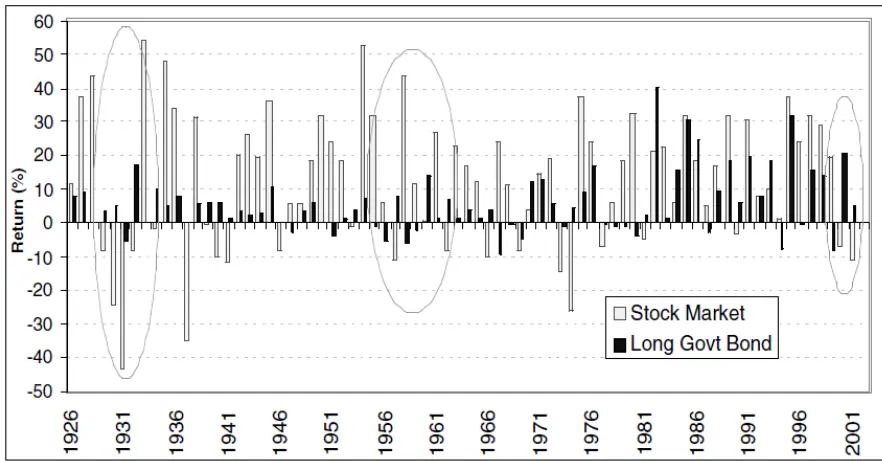
数据来源：Ilmanen(2003),国泰君安证券研究

图 2：美国市场股票与债券滚动相关性(1926-2001)
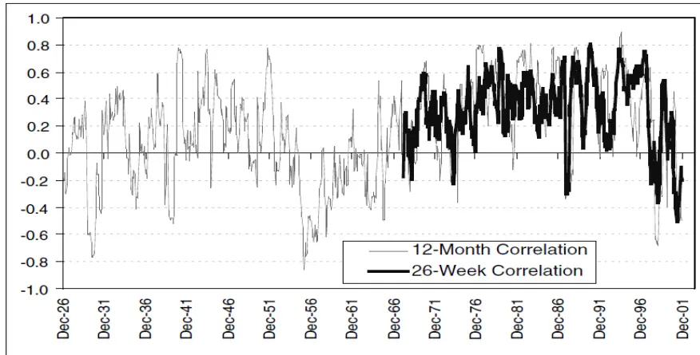
数据来源：Ilmanen(2003),国泰君安证券研究

## 3. 影响股债相关性的因素

我们认为影响股债相关性符号的一个直接因素在于两类资产变动的因果关系。通常投资者认为由债券市场内生发生的冲击会同方向的影响股票市场(比如下降的债券利率会使得股票折现率同样下降)，而股票市场内生发生的变动会反方向的影响债券市场(比如股票大跌会促使宽松的货币政策从而引发债券牛市)。图 3 中的领先滞后分析也与这一直觉相一致。前一月的债券收益率与当月股票收益率正相关，而前一月的股票收益率则与当月债券收益率负相关。

图 3：美国市场股票与债券相关性(1926-2001)
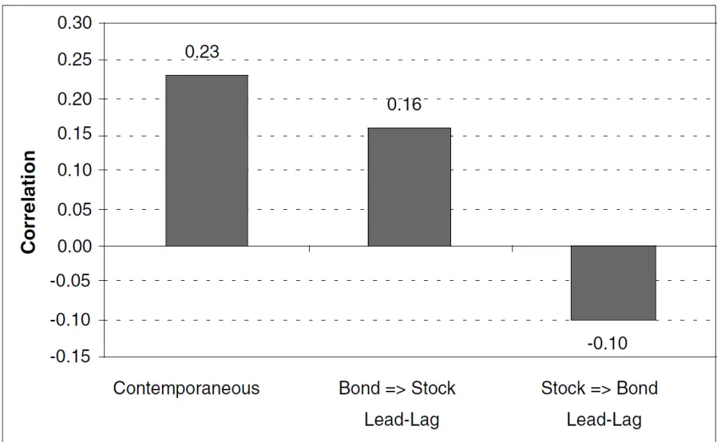
数据来源：Ilmanen(2003),国泰君安证券研究

为了探索接下来的市场股债之间相关性是由哪类冲击决定的，我们需要分析两类资产价格变动背后隐含的因素。我们尝试去描述会使得两类资产反向变化的经济环境。具体而言，我们根据以下四类经济状态变量对时间进行划分以划定经济状态，研究在不同的经济状态下股债两类资产平均收益率、相关性、相对收益率等特征。

- 商业周期/增长预期

- 通胀环境

- 波动率环境

- 货币政策

这四个维度是投资者普遍关注的资产收益的主要驱动因素。股债收益率背离现象可能正源自于两类资产对某一驱动因素相反的敏感性，因此这种基于经济状态的分析可以帮助我们揭示当下两类资产负相关性的来源。

我们借助股利折现模型的框架来揭示这些不同因素对于两类资产价格的影响。如公式 1 与公式 2 所示，股票与债券的价格 $(P_{s}$ 和 $(P_{B})$ 都可以被表示为未来现金流经各自风险溢价调整后的折现率的折现值。其中国债具有固定的现金支付金额与支付时间而股票的现金流则不确定，受到预期增长G 的影响。因此与债券不同，预期增长对于股票资产有着至关重要的影响。

两类资产同样受到折现率及其不确定性的影响。国债的到期收益率Y反映了未来短期利率的预期以及代表利率不确定性的债券风险溢价，而股票折现率除国债到期收益率外还包括股权风险溢价(ERP)以补偿持有股票所承担的额外风险。

$$
P_{s}\;=\;E[\sum_{t=1}^{\infty}(\frac{1+G}{1+Y_{t}+ERP_{t}})^{t}D]\tag{1}
$$

$$
\begin{array}{r}{P_{B}\;=\;E[{\sum}_{t=1}^{T}\frac{C_{t}}{(1\;+\;Y_{t})^{t}}\;+\;\frac{100}{(1\;+\;Y_{T})^{T}}].}\end{array}\tag{2}
$$

由于预期增长G仅仅影响股票价格，预期增长可能是导致股债收益率背离的一个因素。当预期增长G 在扩张的商业周期中上升时，股票价格随之上升，此时债券却不因经济增长改进而受益。

股票与债券的折现率中有着共同的部分：预期通胀。通胀变化与债券价格之间存在着清晰的负向关系，通胀的上升会提升投资者对于未来利率的预期以及与通胀不确定性相关的债券风险溢价。而通胀对股票的影响却并不明确。当通胀变化对股票现金流与折现率有着同样的影响时，理论上股票价格可以不受到任何通胀变化的影响。在实际的市场环境中，当经济处于高通胀环境中时，过高的通胀可能会引发紧缩的货币政策从而对真实盈利增长有着负面的影响。高通胀环境下剧烈变化的真实利率水平会同时影响股票和债券的价格，从而股票和债券更有可能具有正相关的关系。20世纪 60年代到90年代期间很高的股债相关性就是由此而来。

当然，由于股权风险溢价与债券风险溢价的存在，股票与债券的折现率也可以反向变化。最为明显的例子是安全投资转移时期(Flight To Quality)投资者抛售高风险的股票资产而买入具有避险功能的债权资产。此时股权风险溢价升高而债券风险溢价下降。

## 4. 不同经济环境下的股债特征

商业货币周期、通胀水平以及其他市场环境都会对股票与债券的表现有着深远的影响。

## 4.1. 商业与货币周期

我们首先来研究过去半个世纪以来，商业与货币周期是如何影响股票(以标普 500 为代表)以及债券(以 20 年国债为例)的。如图 4 所示，股票在扩张的商业周期有着更好的表现，而债券在衰退的商业周期有着更优的表现。股票与债券对于经济增长有着不同方向的敏感性。而如图 5中所示，宽松的货币政策对于股票和债券都是利好消息。两类资产的预期收益率在宽松的货币政策时期都高于其他时期。

图 4：商业周期与资产平均收益
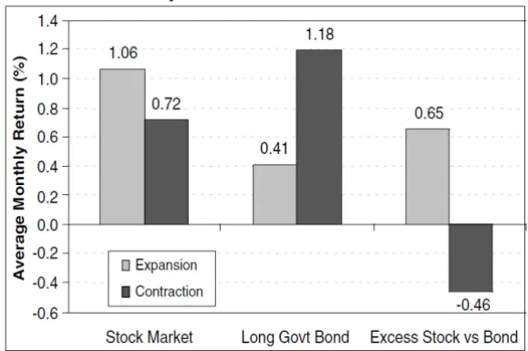
数据来源：Ilmanen(2003),国泰君安证券研究

图 5：货币周期与资产平均收益
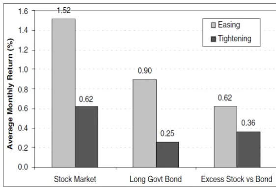
数据来源：Ilmanen(2003),国泰君安证券研究

图6与表1对商业与货币周期进行了更为细致的划分。我们分别把扩张与收紧的商业周期更进一步的划分为第一、第二以及第三阶段。并以 7个月的时间窗口长度分别划定了周期顶点与周期底部以更进一步的细分他们对于股债收益率的影响。得到了以下结论：

两类资产在商业周期底部有着比周期顶端更高的预期收益率，我们认为这或许反映了逆周期的货币政策。

由于金融市场面向预期的特点，股票收益率在商业周期收缩的最后一阶段最高。在衰退的最后阶段以及复苏的第一阶段股票有着最好的收益率。此时投资者对经济增长的预期改善而并没有对通胀上升以及逆周期货币政策的担忧，最为有利于股票资产的表现。

债券在商业周期紧缩的中间时段表现最佳。只有在周期顶端以及衰退周期的前两个阶段股票收益为负时，债券跑赢了股票。

图 6：商业周期与股票、债券收益率(1951-2001)
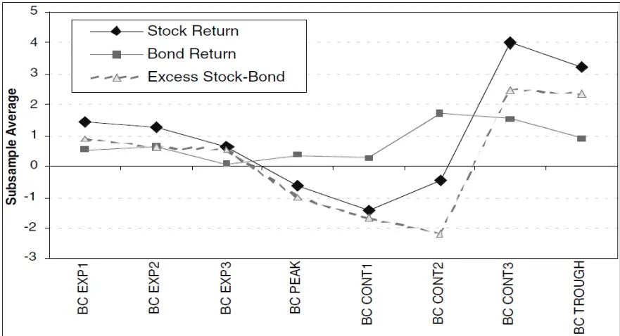
数据来源：Ilmanen(2003),国泰君安证券研究

表1中同样展示了货币政策周期以及真实盈利增长。使用利率期限斜率作为货币政策的代理变量。我们发现，货币政策具有逆周期的特性，领先于商业周期。宽松的货币政策通常发生在商业周期的底部。真实盈利增长随着商业周期的变化而变化，在商业周期扩展的所有阶段都为正，在商业周期收缩的所有阶段都为负。

表 1：美国市场股票与债券相关性(1952-2001)

|  | Stock | Bond | Excess | Earnings | Stock-Bond |  |  | ΔReal |  |  |
| --- | --- | --- | --- | --- | --- | --- | --- | --- | --- | --- |
|  | Return | Return | Stock-Bond | Yield | Bond Yield | Yield Ratio | Correl. | Yield Curve | Earm. | No of Obs |
| All | 1.01 | 0.53 | 0.48 | 7.10 | 6.74 | 0.95 | 0.19 | 1.11 | 0.18 | 600 |
| Business Cycle Expansion | 1.06 | 0.41 | 0.65 | 6.79 | 6.62 | 0.98 | 0.19 | 1.13 | 0.38 | 505 |
| Business Cycle Contraction | 0.72 | 1.18 | -0.46 | 8.75 | 7.41 | 0.85 | 0.20 | 1.05 | -0.93 | 95 |
| Business Cycle Exp 1 | 1.43 | 0.55 | 0.88 | 6.63 | 7.05 | 1.06 | 0.25 | 1.99 | 0.28 | 161 |
| Business Cycle Exp 2 | 1.23 | 0.63 | 0.60 | 6.70 | 6.50 | 0.97 | 0.21 | 1.22 | 0.66 | 165 |
| Business Cycle Exp 3 | 0.61 | 0.08 | 0.52 | 7.03 | 6.34 | 0.90 | 0.12 | 0.26 | 0.22 | 178 |
| Business Cycle Peak | -0.66 | 0.37 | -1.03 | 8.26 | 7.11 | 0.86 | 0.07 | 0.09 | -0.54 | 63 |
| Business Cycle Cont 1 | -1.44 | 0.24 | -1.68 | 8.46 | 7.50 | 0.89 | 0.09 | 0.42 | -0.89 | 32 |
| Business Cycle Cont 2 | -0.47 | 1.72 | -2.19 | 9.34 | 7.62 | 0.82 | 0.22 | 0.91 | -1.35 | 33 |
| Business Cycle Cont 3 | 4.01 | 1.53 | 2.48 | 8.26 | 7.05 | 0.85 | 0.29 | 1.82 | -0.33 | 31 |
| Business Cycle Trough | 3.23 | 0.89 | 2.34 | 7.61 | 6.65 | 0.87 | 0.23 | 1.80 | -1.41 | 59 |
| Monetary Policy Easing | 1.52 | 0.90 | 0.62 | 6.99 | 7.39 | 1.06 | 0.28 | 1.71 | -0.43 | 261 |
| Monetary Policy Tightening | 0.62 | 0.25 | 0.36 | 7.18 | 6.25 | 0.87 | 0.13 | 0.65 | 0.64 | 339 |

数据来源：Ilmanen(2003),国泰君安证券研究

## 4.2. 通胀水平

我们首先来研究通胀水平对股债相关性的影响。图7 与图8 显示了通胀水平是股债相关性的一个重要影响因素。时间序列与散点图都表明了股债相关性随通胀水平的变化而同向变化，我们认为：

当通胀水平较高时，折现率的变化是股票与债券价格变化的最主要因素，也因此两类资产在此时具有较高的相关性。

在温和通胀时期，折现率比较稳定，此时关于增长的不确定性是股票与债券价格变化的最主要因素，也因此两类资产在此时具有较低的相关性。

在发生通货紧缩的时期，通货紧缩可能导致更高的股权风险溢价以及更低的债券风险溢价。此时股票与债券收益率之间更可能有负的相关性。

接下来，我们检查通胀变化对两类资产的收益率的影响。通胀与债券之间的存在简单的线性关系。由于债券未来具有固定不变的现金流，通胀上升会使得扣除通胀后的债券真实收益率下降，从而导致债券价格下降。反之，通胀的下降则会使得债券真实收益率上升。

而与债券不同，我们认为通胀对股票价格的影响并不是线性的。温和的通胀水平是公司盈利增长的理想环境。与之相对应的，过高的通货膨胀与通货紧缩都会对盈利增长有负面的影响，并且很有可能会提高投资者的风险厌恶，从而对股票价格产生伤害。尽管80年代到90年代的通胀下行导致了股票与债券的大涨，当通胀水平继续进一步下降并接近紧缩时，债券价格继续上升，而股票价格却并没有随之继续变化。

图 7：通胀水平与股债相关性
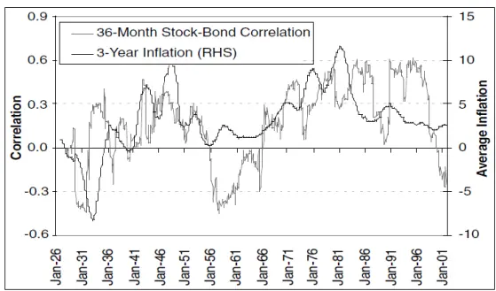
数据来源：Ilmanen(2003),国泰君安证券研究

图 8：通胀水平与股债相关性
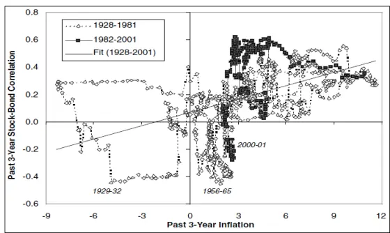
数据来源：Ilmanen(2003),国泰君安证券研究

Li(2002)针对 G7 发达国家研究了驱动股债相关性变化的宏观变量。他的主要发现在于预期通胀的不确定性是最为主要的股债相关性决定因素。这一发现与我们的结论相一致。

## 4.3. 市场状态

在图 9 至图 12 以及表 2 中，我们展示了不同宏观状态下股债收益率、相对收益率以及两者相关性。我们使用了自 1926 年至今的数据将历史划分为以下子集：

- 高/低经济增长

- 高/低通货膨胀

- 高/低市场波动

- 紧/松货币政策

我们使用对应时间点6个月之前的同比数据形式的经济增长与通胀变量。参考变量的水平(同比变化)以及趋势(同比变化相比自身3年均值)来进行子集的划分。针对市场波动与货币政策，我们分别使用历史1年实现波动率以及长短期期限利差来衡量。

图9至图12 中的主要实证结果总结如下：

高经济增长利好股票而利空国债。高波动率利空股票利好债券。因此经济增长以及波动率的变化天然会导致股债之间产生负相关的关系。

宽松的货币政策同时利好股债两类资产，也因此并不是导致股债负相关性产生的原因。

- 货币政策以及通胀水平相比增长与波动率具有更强的股债价格区分能力。

图 9：不同宏观状态下股票收益
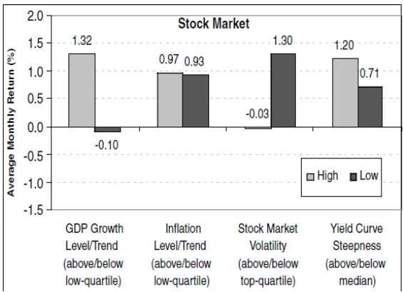
数据来源：Ilmanen(2003),国泰君安证券研究

图 10：不同宏观状态下债券收益
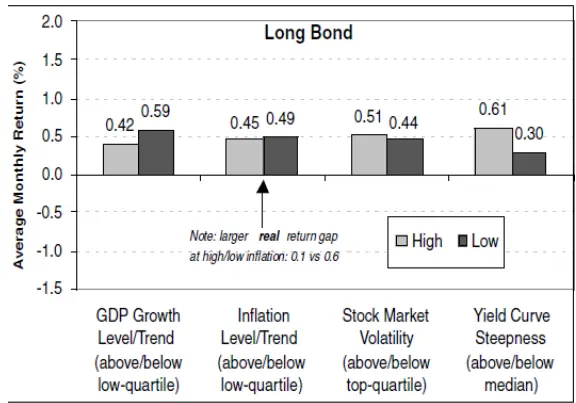
数据来源：Ilmanen(2003),国泰君安证券研究

图 11：不同宏观状态下股债相对收益
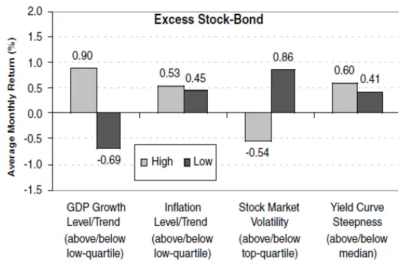
数据来源：Ilmanen(2003),国泰君安证券研究

图 12：不同宏观状态下股债相关性
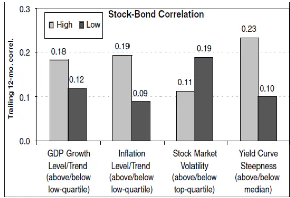
数据来源：Ilmanen(2003),国泰君安证券研究

考虑到上述四种纬度进行的经济环境划分互相之间有所重叠，我们在图13 至图 16 中提供了增长与通胀四分的子集划分下对应的股债分析。伴随低通胀的增长时期最为利好股票资产，而伴随紧缩的衰退期最为利空股票资产。股债相关性最低发生在紧缩衰退以及股票高波动时期。

我们的结论基本与其他相关研究一致。Stivers & Sun(2002)发现当股票指数隐含波动率更高时，股债收益率的相关性更低。Gulko(2002)发现当股债分离通常发生在股票大跌的时期，其余时间两更多呈现同向变动的关系。

图 13：不同宏观状态下股票收益
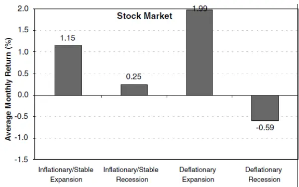
数据来源：Ilmanen(2003),国泰君安证券研究

图 14：不同宏观状态下债券收益
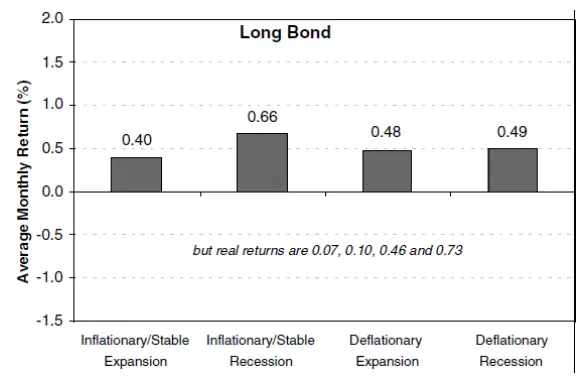
数据来源：Ilmanen(2003),国泰君安证券研究

图 15：不同宏观状态下股债相对收益
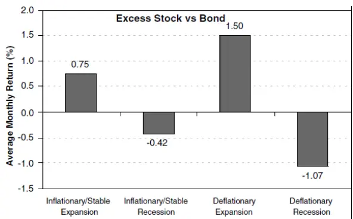
数据来源：Ilmanen(2003),国泰君安证券研究

图 16：不同宏观状态下股债相关性
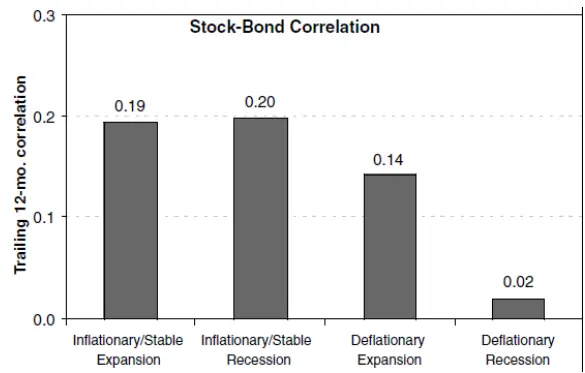
数据来源：Ilmanen(2003),国泰君安证券研究

## 5. 市场含义

总体而言，我们认为股债负相关的现象更多的发生在低通胀、股票资产表现较弱以及波动率较高的时期。此时经济增长的影响压倒了利率水平以及通胀变化的影响从而导致了股债表现的持续分离。基于未来通胀水平继续维持低位的判断，我们认为未来股债相关性仍将很低。

从低股债相关性对于市场含义而言，我们认为低的股债相关性会对债券估值产生较大影响。相对股票收益的负敏感性会使得国债具备作为优良分散股票风险资产的效果。这种效果会降低投资者对债券要求的风险溢价从而极大提升债券估值。

如图 17 所示，在 1998 年与 2001 年股债相关性为负期间，债券风险溢价为负。正的股债相关性会使得债券资产吸引力的下降。在 1979至1980年由于石油价格冲击导致的滞涨时期，债券并不是对冲经济衰退的好选择。我们认为图17中的债券风险溢价可以由以下三个因素解释：

- 长期通胀预期

- 货币政策

- 股债相关性

图 17：债券风险溢价及成分分解(1983-2002)
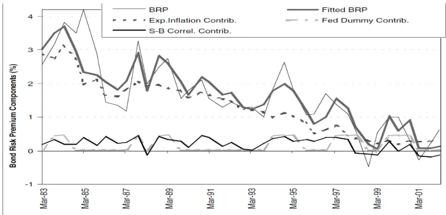
数据来源：Ilmanen(2003),国泰君安证券研究

此外，股债相关性对于资产配置的决策同样重要。大多数机构在进行组合优化的过程中会设置 0.3 的股债相关性。这一假设参数在未来将不再可行。当下还没有很多机构开始考虑修正他们对股债相关性的假设。投资机构的这种参数修正将会极大的提升机构投资者对于债权类资产的需求。

## 本公司具有中国证监会核准的证券投资咨询业务资格

## 分析师声明

作者具有中国证券业协会授予的证券投资咨询执业资格或相当的专业胜任能力，保证报告所采用的数据均来自合规渠道，分析逻辑基于作者的职业理解，本报告清晰准确地反映了作者的研究观点，力求独立、客观和公正，结论不受任何第三方的授意或影响，特此声明。

## 免责声明

本报告仅供国泰君安证券股份有限公司（以下简称“本公司”）的客户使用。本公司不会因接收人收到本报告而视其为本公司的当然客户。本报告仅在相关法律许可的情况下发放，并仅为提供信息而发放，概不构成任何广告。

本报告的信息来源于已公开的资料，本公司对该等信息的准确性、完整性或可靠性不作任何保证。本报告所载的资料、意见及推测仅反映本公司于发布本报告当日的判断，本报告所指的证券或投资标的的价格、价值及投资收入可升可跌。过往表现不应作为日后的表现依据。在不同时期，本公司可发出与本报告所载资料、意见及推测不一致的报告。本公司不保证本报告所含信息保持在最新状态。同时，本公司对本报告所含信息可在不发出通知的情形下做出修改，投资者应当自行关注相应的更新或修改。

本报告中所指的投资及服务可能不适合个别客户，不构成客户私人咨询建议。在任何情况下，本报告中的信息或所表述的意见均不构成对任何人的投资建议。在任何情况下，本公司、本公司员工或者关联机构不承诺投资者一定获利，不与投资者分享投资收益，也不对任何人因使用本报告中的任何内容所引致的任何损失负任何责任。投资者务必注意，其据此做出的任何投资决策与本公司、本公司员工或者关联机构无关。

本公司利用信息隔离墙控制内部一个或多个领域、部门或关联机构之间的信息流动。因此，投资者应注意，在法律许可的情况下，本公司及其所属关联机构可能会持有报告中提到的公司所发行的证券或期权并进行证券或期权交易，也可能为这些公司提供或者争取提供投资银行、财务顾问或者金融产品等相关服务。在法律许可的情况下，本公司的员工可能担任本报告所提到的公司的董事。

市场有风险，投资需谨慎。投资者不应将本报告作为作出投资决策的唯一参考因素，亦不应认为本报告可以取代自己的判断。
在决定投资前，如有需要，投资者务必向专业人士咨询并谨慎决策。

本报告版权仅为本公司所有，未经书面许可，任何机构和个人不得以任何形式翻版、复制、发表或引用。如征得本公司同意进行引用、刊发的，需在允许的范围内使用，并注明出处为“国泰君安证券研究”，且不得对本报告进行任何有悖原意的引用、删节和修改。

若本公司以外的其他机构（以下简称“该机构”）发送本报告，则由该机构独自为此发送行为负责。通过此途径获得本报告的投资者应自行联系该机构以要求获悉更详细信息或进而交易本报告中提及的证券。本报告不构成本公司向该机构之客户提供的投资建议，本公司、本公司员工或者关联机构亦不为该机构之客户因使用本报告或报告所载内容引起的任何损失承担任何责任。

## 评级说明

## 1.投资建议的比较标准

投资评级分为股票评级和行业评级。

以报告发布后的12个月内的市场表现为比较标准，报告发布日后的 12个月内的公司股价（或行业指数）的涨跌幅相对同期的沪深 300 指数涨跌幅为基准。

## 2.投资建议的评级标准

报告发布日后的 12 个月内的公司股价（或行业指数）的涨跌幅相对同期的沪深 300 指数的涨跌幅。

|  | 评级 说明 |  |
| --- | --- | --- |
| 股票投资评级 | 增持 | 相对沪深 300指数涨幅15%以上 |
|  | 谨慎增持 | 相对沪深300指数涨幅介于5%～15%之间 |
|  | 中性 | 相对沪深300指数涨幅介于-5%～5% |
|  | 减持 | 相对沪深300指数下跌5%以上 |
| 行业投资评级 | 增持 | 明显强于沪深300指数 |
|  | 中性 | 基本与沪深300指数持平 |
|  | 减持 | 明显弱于沪深300指数 |

## 国泰君安证券研究所

|  | 上海 | 深圳 | 北京 |
| --- | --- | --- | --- |
| 地址 | 上海市静安区新闸路669号博华广场 20层 | 深圳市福田区益田路 6009 号新世界 商务中心34层 | 北京市西城区金融大街甲9号金融 街中心南楼18层 |
| 邮编 | 200041 | 518026 | 100032 |
| 电话 | （021)38676666 | （0755)23976888 | (010)83939888 |
|  | E-mail: gtjaresearch@gtjas.com |  |  |