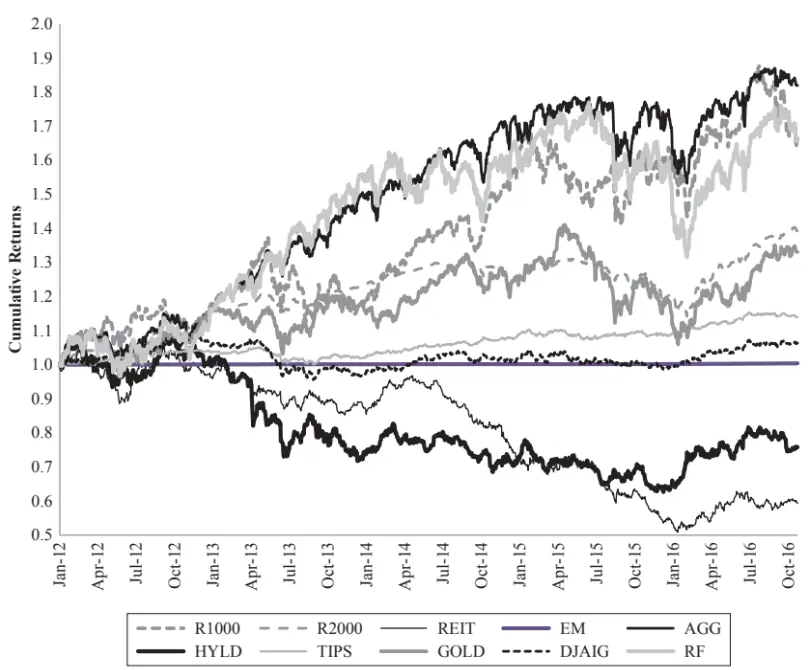
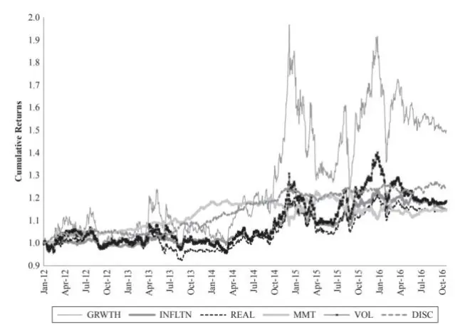
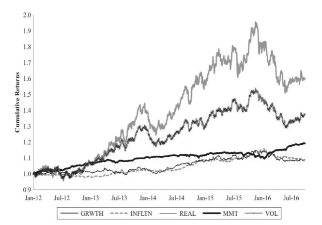
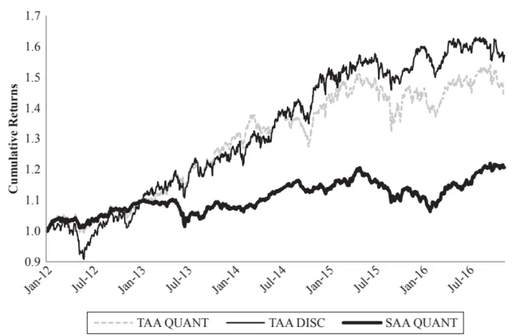

[Table_Title2021.03.08

# 因子与资产的统一配置框架

## ——精品文献解读系列（五）

## 本报告导读：

本篇报告解读的文献提出了一个结合因子与资产的统一配置框架。该框架兼顾了风格因子和宏观因子，还允许投资者融入自己的主观观点，可以针对不同投资目标灵活生成最优资产配置组合。

## 摘要：

le_Summary]投资学是一门学术界与业界紧密结合的学科，其中大类资产配置是这种紧密结合的代表。从Markowitz（1952）开创现代投资组合理论开始，学术界为业界提供了丰富的理论参考和方法模型，推动了大类资产配置实践的繁荣发展。为了帮助读者及时跟踪学术前沿，我们推出了“精品文献解读”系列报告，从大量学术文献中挑选出精品论文进行剖析解读，为读者呈现大类资产配置领域最新的思路和方法。

本篇为读者解读的文献是 Bender et al.（2019）在期刊 The Journal ofPortfolio Management 上发表的论文“Asset Allocation vs. FactorAllocation—Can We Build a Unified Method?”。

本文提出了一个结合因子与资产的统一配置框架。该框架不仅兼顾了风格因子和宏观因子，还允许投资者融入自己的主观观点，可以针对不同投资目标灵活生成最优资产配置组合。从实证结果来看，基于该框架构建的战略资产配置组合、战术资产配置组合在回测区间内取得了较好的业绩表现，夏普比例在 0.82~0.94之间。

该文献在理论方法上有两个突出贡献：（1）通过构建因子模拟投资组合以及推导资产预期收益过程，实现了因子层面与资产层面的相互映射；（2）将宏观因子、风格因子以及主观观点融合到统一的配置框架中，可以应用于不同的场景，满足投资者多样的投资目标。总而言之，该文献提供了一套完整而且灵活的资产配置框架，非常值得参考借鉴。

大类资产配置研究

## or] 报告作者

李祥文(分析师)

8 021-38031560

lixiangwen@gtjas.com

证书编号 S0880520100001

王瑞韬(研究助理)

8 021-38038208

wangruitao@gtjas.com

证书编号 S0880121010024

## cReport] 相关报告

股票与债券相关性

2021.03.02

战术资产配置的宏观经济仪表盘

2021.02.18

如何有效对冲配置组合中的股票风险

2021.02.10

兼顾资产与因子的大类资产配置方法

2021.01.29

大类资产配置方法体系探秘

2021.01.22

## 1. 文献概述

## 文献来源：

Bender, Jennifer, Jerry Le Sun, and Ric Thomas. "Asset Allocation Vs. Factor Allocation—Can we Build a Unified Method?". Journal of Portfolio Management 45.2 (2019): 9-22.

## 文献摘要：

本文提出了一个结合因子与资产的统一配置框架。该框架不仅兼顾了风格因子和宏观因子，还允许投资者融入自己的主观观点，可以针对不同投资目标灵活生成最优资产配置组合。从实证结果来看，基于该框架构建的战略资产配置组合、战术资产配置组合在回测区间内取得了较好的业绩表现，夏普比例在 0.82~0.94 之间。

## 文献评述：

如何将资产配置与因子配置结合起来，是近年来研究与实践的热门方向。我们的首篇“精品文献解读”研报即关注了Bergeron etal.（2018）提出的兼顾资产与因子的大类资产配置方法（详见研报《兼顾资产与因子的大类资产配置方法——精品文献解读系列（一）》）。相比于 Bergeron etal.（2018），本文解读的文献提供了一套更加完整而且灵活的资产配置框架，非常值得参考借鉴。

我们认为该文献在理论方法上有两个突出贡献：（1）通过构建因子模拟投资组合以及推导资产预期收益过程，实现了因子层面与资产层面的相互映射；（2）将宏观因子、风格因子以及主观观点融合到统一的配置框架中，可以应用与不同的场景，满足投资者多样的投资目标。

## 2. 引言

投资者在采用基于资产类别的配置方法时，发现“多样化在人们最需要它的时候反而消失了”（Diversification disappears when you need it themost）。长期以来，投资者认为不同类别的资产可以提供多元化的收益，并能够分散风险。但是回顾历史，我们可以看到市场在低迷时常常会出现各类资产普遍下跌的局面，这使得基于资产类别构建的投资组合蒙受了巨大损失。因此，人们开始将配置的焦点从资产转向因子。

因子配置方法将配置决策从资产层面转换到因子层面。诸多大类资产的价格，通常由少量的因子共同驱动。比如，诸如房地产和高收益债券之类的资产，它们对股票 beta 因子和利率久期因子存在正向的风险暴露，这些因子是决定相应资产组合预期收益和风险的主要因素。这意味着投资者可以通过对这些共同因子进行分析研究，来构建更加优异的资产组合。当然，如何准确地识别因子、稳健地预测因子风险收益特性，这是因子配置方法面临的重要问题。

对因子进行配置可以更好的分散风险、获取风险溢价。这一观点已经成为学界和业界的共识（Clarke and Murdock，2005；Bender et al.，2010；Page and Taborsky，2011）。基于因子的资产配置方法就是要识别这些影响资产收益风险的因子，然后根据投资目标确定待配置资产在这些风险因子上的最佳敞口，最后构建最优投资组合。

基于因子的资产配置实践可以追溯到 1996 年桥水基金（BridgewaterAssociates）推出的“全天候”策略。“全天候”策略根据各类资产对经济增长和通货膨胀的风险敞口来配置资产。这个方法仅仅利用两个宏观风险因子，就构建出穿越牛熊、表现优异的投资组合，在市场上取得了巨大成功。

基于因子的配置方法可以分为两大阵营。在桥水基金的“全天候”策略取得成功之后，越来越多的投资机构开始设计开发自己的因子配置方法。总体来看，可以把他们分为两大阵营：

阵营 1：主要关注资产内部的风格因子。这些因子最初来源于研究股市异象的学术文献，通常与大类资产层面的溢价无关。投资者可以通过构建多头组合（long-only portfolios）或者多空组合（long-short portfolios）来构建风格因子。在各个大类资产内部分别构建风险因子组合后，再将这些因子组合整合在一起，成为最终的跨资产投资组合。具体方法可参考 Asness et al.（2015）和 Brightman and Shepherd（2016）。

阵营 2：主要关注反应宏观经济状况的宏观因子（如经济增长和通货膨胀等）。基于各类别资产对于宏观因子的目标暴露，通过最优化方法，可以构建基于宏观因子的投资组合。其中，宏观因子的暴露程度可以通过回归模型进行估计，有时候也可以结合主观判断，来确保资产对于宏观因子的暴露程度更容易被直观地理解。具体方法可参考 Blyth et al.（2016）和 Greenberg et al.（2016）。

本文提出了一个基于因子与资产的统一配置框架，并且兼顾了风格因子和宏观因子，还允许投资者融入自己的主观判断。具体而言，该框架的特别之处在于它将基于因子的资产配置方法扩展到资产预期收益的推导过程，并且整合了量化因子（quantitative factor）和主观因子（discretionaryfactor），可以使用投资组合最优化来生成针对不同投资目标的最优资产配置组合。

## 3. 从传统资产配置到因子模型

传统的资产配置通常先在大类资产类别（如股票、债券、货币、商品、另类资产等）之间进行分配，然后再在各个资产内部进行分配（如在股票类别中进一步配置美国、欧洲、新兴市场等国家地区股票）。表 1 展示了一个典型的资产配置框架示例。

表 1：传统资产配置框架示例

| Class | Strategic Asset Allocation (%) |
| --- | --- |
| Equity | 60 |
| US Equity | 30 |
| Europe Equity | 15 |
| UK Equity | 5 |
| Japan Equity | 5 |
| Emerging Markets Equity | 5 |
| Fixed Income | 20 |
| Global Investment Grade | 15 |
| High Yield | 5 |
| Alternatives | 20 |
| Hedge Funds | 10 |
| Private Equity | 10 |
| Cash | 0 |
| Total | 100 |

数据来源：Bender et al.（2019），国泰君安证券研究

投资者在进行资产配置时通常包括战略资产配置和战术资产配置。首先，投资者会结合投资目标、资产的长期期望收益和风险，进行战略资产配置。在此基础上，一些投资者会根据资产的短期预测模型，进行主动的战术资产配置，使得仓位暂时偏离战略配置比例，以期获得短期的超额收益。进行战术资产配置可以使用行业轮动模型、国家轮动模型，或使用单独的指标（如流动性、估值、动量/技术指标、情绪/风险指标、宏观经济变量等）。投资者们通常还会使用 B-L 模型等方法，在这些量化模型的基础上添加自己的主观观点，来构建最终的投资组合。

那么，如何将资产和因子建立联系？我们将宏观因子和风格因子统称为系统性因子，并将二者放在同一个资产定价因子模型中，如式（1）所示：

$$
\boldsymbol{R}_{t}=\boldsymbol{B}_{t}\boldsymbol{F}_{t}+\boldsymbol{\epsilon}_{t}\tag{1}
$$

其中， $R_{t1}$ 表示资产收益率向量； $F_{t}$ 表示系统性因子（包括宏观因子和风格因子）向量； $B_{t}$ 表示资产收益率对因子的敏感度； $\epsilon_{t1}$ 表示收益率残差向量。

值得注意的是，在横截面上，并非所有残差都为零。残差收益有可能会表现出某种可预测的动态模式，比如一些农业和能源商品的季节性。此外，残差收益中还包含了一些无法因子化，但可以被投资者洞察的因素，比如突发性事件（nonrecurring event）——典型例子是英国脱欧或主权国家违约。考虑到上述情况，我们可以将残差 $\epsilon_{t}$ 进一步扩展为：

$$
\boldsymbol{\epsilon}_{i,t}=\boldsymbol{\Gamma}_{i,t}\boldsymbol{I}_{i,t}+\boldsymbol{V}_{i,t}+\boldsymbol{\eta}_{i,t}\tag{2}
$$

其中， $I_{i,t}$ 表示资产内部特质因子，用来捕捉可预测的残差收益（如商品的季节性）； $\Gamma_{i,t}$ 表示对 $I_{i,t}$ 的风险敞口； $V_{i,t}$ 是投资者的观点向量； $\eta_{i,t}$ 则表示上述收益率来源均被纳入考虑后的剩余残差，其期望值可以认为是零。

为了更好地阐述如何使用该框架来进行战略与战术资产配置，我们把式（1）中的因子 $|F_{t}|$ 分解为长期部分 $\left(\;\bar{F}_{t}\;\right)$ ）和短期部分 $\left(\;\Delta F_{t}\;\right)$ ），他们分别代表了不同投资期限的收益机会。进一步地，整合式（1）和式（2），可以将资产收益率表示为：

$$
\boldsymbol{R}_{t}=\underbrace{\boldsymbol{B}_{t}\overline{\boldsymbol{F}}_{t}+\boldsymbol{B}_{t}\Delta\boldsymbol{F}_{t}+\boldsymbol{\Gamma}_{t}\boldsymbol{I}_{t}+\boldsymbol{V}_{t}+\boldsymbol{\eta}_{t}}_{战术配置}\tag{3}
$$

## 4. 因子与资产的统一配置框架

## 4.1. 框架概述

本文将构建一个基于因子与资产的统一配置框架。该框架以系统的方法融合了有关因子和资产预期收益的信息，因此构建的投资组合会优于传统的资产配置方法。

基于因子风险敞口和收益预测，我们直接使用式（3）的资产定价模型来预测未来资产收益：

$$
\boldsymbol{E}(\boldsymbol{R}_{t+1})=\boldsymbol{B}_{t}\boldsymbol{E}(\overline{{\boldsymbol{F}}}_{t+1})+\boldsymbol{B}_{t}\boldsymbol{E}(\Delta\boldsymbol{F}_{t+1})+\boldsymbol{\Gamma}_{t}\boldsymbol{E}(\boldsymbol{I}_{t+1})+\boldsymbol{E}(\boldsymbol{V}_{t+1})\tag{4}
$$

尽管式（4）可以直接用来计算资产的预期收益，但我们希望在将所有类型的因子组合到一个框架中时具有更大的灵活性，并在收益预测中更好地控制因子组成。因此，我们进一步结合Jones et al.（2007）提出的alpha构造方法，并将其扩展到了多资产类别场景。

我们的配置框架包含以下步骤，稍后将对其进行详细描述：

1. 选择宏观经济因子和风格因子；

2. 估计资产对这些因子的风险敞口；

3. 构建因子模拟投资组合；

4. 预测因子模拟投资组合的收益；

5. 构建最优因子组合；

6. 推断各类资产的预期收益；

7. 构建最优投资组合。

该框架可以更加直观地描述如下：首先找到驱动资产收益率的主要因子，然后通过对因子收益率和资产收益率的预测来把因子和资产联系起来，最终构建最优投资组合。

## 4.2. 框架应用实例

在本节中，我们将详细阐述上述步骤，并检验使用该方法是否能够得到合理的实证结果。我们选择 10 种具有代表性的资产，并遵循前面概述的步骤来计算战术和战略配置的资产预期收益。对于战术配置预期收益，我们还将说明如何将主观判断融入配置框架。我们使用有实际约束的预期收益集进行回测，并计算比较投资组合的绩效。

我们选用的 10 种代表性资产如下：

## 1. 股票：

a. 美国大盘股（R1000）

b. 美国小盘股（R2000）

c. 美国房地产投资信托（REIT）

d. 新兴市场（EM）

## 2. 债券：

a. 雷曼综合债券指数（AGG）

b. 美国高收益 ETF（HYLD）

c. 通胀挂钩债券（TIPS）

## 3. 商品：

a. 黄金（GOLD）

b. DJ 商品指数 (DJAIG)

4. 货币：

a. 美元现金（RF）

图1展示了上述10类资产在 2012年1 月至2016年12月期间的累计收益率。

图 1：10 类代表性资产的累积收益率（2011-12 至 2016-09）

数据来源：Bender et al.（2019），国泰君安证券研究

## 4.2.1. 第 1步：选择宏观因子和风格因子

基于因子的框架首先将资产配置问题转换为因子配置问题。在选择因子时，通常需要因子具备如下特性：（1）能够很好地解释资产的横截面收益；（2）具有跨资产一致性；（3）解释直观，计算简便。

表 2 展示了现有文献（Greenberg et al，2016；Asness et al.，2015；Brightmanand Shepherd，2016）使用的宏观因子、风格因子和特质因子示例。

表 2：因子示例

| Macro Factors |  |
| --- | --- |
| Economic Growth | Risk associated with global economic growth Broad-market equity index returns |
| Real Rates | Risk of bearing exposure to real interest rate changes |
| Inflation | Inflation-linked bond returns Risk of bearing exposure to changes in nominal prices |
| Credit | Return of portfolio long nominal bonds, short inflation-linked bonds Risk of default or spread widening associated with financial distress |
| Emerging Markets | Return of portfolio long corporate bonds, short nominal bonds Risk that emerging sovereign governments will change capital market rules or |
|  | general political risk in emerging markets Basket of EM equity premiums, EM CDX, and EM FX |
| Commodity | Risk associated with commodity markets Weighted GSCI Commodity Index returns |
| FX | Risk associated with exchange rate fluctuation Trade-weighted dollar index |
| Style Factors |  |
| Value | Cheap assets tend to mean-revert Asset-specific valuation spread portfolios |
| Momentum | Asset prices trend tends to continue |
| Carry | Asset-specific momentum spread portfolios High-yielding assets earn higher return |
|  | Asset-specific yield spread portfolios |
| Quality | Low-risk assets tend to outperform |
|  | Asset-specific volatility spread portfolios |
| Idiosyncratic Factors |  |
| Asset Flow | Large asset institutional flows generate sentiment |
|  | Aggregate fund flows by asset class |
| Crowding | Crowding peaks lead crash |
|  | Within-asset-class pairwise correlation |
| Statistical |  |
|  | Short-term statistical signals |
|  | Cointegrated spreads movement |

数据来源：Bender et al.（2019），国泰君安证券研究

本文在实证检验中，参考Greenberget al.（2016），选择了三个宏观因子：经济增长（GRWTH）、通货膨胀（INFLTN）和实际利率（REAL）；参考 Asness et al.（2015）和 Brightman and Shepherd（2016），选择了两个风格因子：动量（MMT）和波动率（VOL）。

## 1. 宏观因子：

a. 经济增长

b. 通货膨胀

c. 实际利率

## 2. 风格因子：

a. 动量（MMT）

b. 波动率（VOL）

## 4.2.2. 第 2步：估计资产对因子的风险敞口

从资产到因子的转换通过因子模拟投资组合（factor-mimicking portfolio）来完成。为了构建因子模拟投资组合，需要估计每个资产的因子风险敞口，以确定相应资产的权重。

对于宏观因子，因为资产对其风险敞口在短期内相对稳定，所以我们使用短期历史时间序列回归来估算风险敞口。具体来说，对于每一类资产，我们首先用该资产的总回报（以美元计）对宏观因子代理变量（参见表2）进行回归，得到因子敞口；然后对因子敞口进行标准化处理，使所有资产对某一因子的风险敞口均值为0，标准差为1。

对于风格因子，考虑到我们的目标是建立跨资产（cross-asset-class）的因子模拟投资组合，所以不同资产对同一风格因子的风险敞口需要具有可比性。为此，我们把风格因子分为两类：一类依赖于资产收益，另一类包括资产特质基本面变量（asset-class-specific fundamental variables）。对于依赖资产收益的风格因子，比如动量和波动性，我们可以直接比较不同资产的风险敞口；对于使用资产特质基本变量的因子，比如估值和利差，我们需要将因子敞口转换为其在时间序列上的百分位数，或者是Z-scores，进而可以在不同资产之间进行比较。

表3给出了各类资产对宏观因子和风格因子的标准化风险敞口示例。对于宏观因子，我们使用滚动 3 年的时间序列数据进行回归来估计资产在因子上的风险敞口；对于风格因子，我们将滚动1年累计收益率作为动量因子，将滚动1 年收益标准差作为波动率因子。

表 3：不同资产对宏观因子和风格因子的标准化风险敞口

|  | GRWTH | INFLTN | REAL | MMT | VOL |
| --- | --- | --- | --- | --- | --- |
| R1000 | 1.14 | -0.92 | -1.18 | 0.63 | 0.34 |
| R2000 | 1.43 | -1.35 | -1.26 | 0.63 | 1.20 |
| REIT | 0.62 | 0.06 | 0.53 | -0.05 | 0.86 |
| EM | 0.52 | -0.53 | -0.59 | 0.40 | 0.17 |
| AGG | -1.10 | 1.20 | 0.58 | -0.50 | -1.55 |
| HYLD | -0.46 | 0.24 | -0.48 | 1.08 | -1.03 |
| TIPS | -1.04 | 0.74 | 1.52 | -0.28 | -1.20 |
| GOLD | -1.21 | 1.47 | 1.19 | 0.40 | 0.69 |
| DJAIG | 0.11 | -0.92 | -0.30 | -2.32 | 0.52 |
| RF | 0 | 0 | 0 | 0 | 0 |

数据来源：Bender et al.（2019），国泰君安证券研究

该框架既可以应用于战术资产配置（TAA），也可以应用于战略资产配置（SAA）策略，二者的差别在于对因子敞口的估算。在构建 TAA 因子模拟投资组合时，我们使用同期风险敞口，以期获取短期的超额收益；在构建 SAA 因子模拟投资组合时，我们使用拓展时间窗口中短期因子风险敞口的均值，来反映资产和因子的长期关系。

## 4.2.3. 第 3步：构建因子模拟投资组合

因子模拟投资组合是因子配置的基石。因子通常是不能被直接观测的，也是不可直接投资的，因此我们需要构建投资组合来模拟因子。因子模拟投资组合使我们能够将资产空间中的资产配置问题转化为因子空间中的因子配置问题。因子模拟投资组合的收益还能提供样本数据来研究因子收益的概率分布，有助于进行收益预测。

构建因子模拟投资组合通常有如下几种方法：

## 方法 1：投资组合排序法

基于风险因子敞口，对所有证券进行排序并分为五组，然后做多排名最高组，做空排名最低组，构建一个零价差投资组合（zero-investment spreadportfolio），即为因子模拟投资组合。这种构建因子的方法虽然会受到市场噪音影响，但胜在直观简便，因此被广泛采用。

## 方法 2：最优化方法

举例来说，为了创建一个因子模拟投资组合，需要解决如下最优化问题：

$$
\begin{array}{c}{{{}_{h}^{max}h^{\prime}{\pmb\beta}_{i}}}\\{{s.t.h^{\prime}\sum h={\bf1}}}\\{{|h^{\prime}{\pmb\beta}_{i}|\leq\tau,i\neq j}}\end{array}\tag{5}
$$

其中，h表示因子 i的因子模拟投资组合的权重向量；∑表示各类资产的方差-协方差矩阵； $\beta_{i1}$ 表示因子i的风险敞口。上述优化问题要求投资组合在该因子 i 上有最大的风险敞口，同时在其他因子上的风险敞口低于容忍阈值τ。当然，式（5）中的优化目标和约束条件并不是唯一的，可以根据投资者要求灵活设定。

## 方法 3：因子模型法

该方法参考 Jones et al.（2007），可视为一种扩展的 Fama-MacBeth 回归方法。假设可以用如下因子模型来表示资产的收益：

$$
\boldsymbol{R}=\boldsymbol{F}\boldsymbol{B}+\boldsymbol{\varepsilon}
$$

其中，R 表示资产的收益向量；B 表示资产对因子的风险敞口矩阵；F表示相应因子模拟投资组合的收益向量。作为广义最小二乘系数，我们可以得到F的解析解如式（6）所示：

$$
\widehat{\pmb{F}}=[\pmb{B}^{\prime}\pmb{\Sigma}^{-1}\pmb{B}]^{-1}\pmb{B}^{\prime}\pmb{\Sigma}^{-1}\pmb{R}\tag{6}
$$

由此，可以得到因子模拟投资组合P：

$$
\pmb{P}=[\pmb{B^{\prime}}\pmb{\Sigma^{-1}}\pmb{B}]^{-1}\pmb{B^{\prime}}\pmb{\Sigma^{-1}}\tag{7}
$$

在本文中，我们使用因子模型法来构建因子模拟投资组合。对表2中的每个因子，我们用式（7）来计算得到因子模拟投资组合。以这种方法构造的因子模拟投资组合，对目标因子有1个单位的风险暴露，对其他因子的风险暴露则为 0。除此之外，主观观点也可以用一个零投资组合（zero-investment portfolio）来表示。

在每个时期，重复上述方法来构建因子模拟投资组合，最后可以得到组合收益率的时间序列。战术资产配置、战略资产配置因子模拟投资组合的累计收益率分别如图 2和图 3所示，具体业绩如表 4和表 5所示。

图 2：战术资产配置因子模拟投资组合收益

注：统计区间为 2011-12 至 2016-09；DISC 为主观观点因子。数据来源：Bender et al.（2019），国泰君安证券研究

图 3：战略资产配置因子模拟投资组合收益

注：统计区间为 2011-12 至 2016-09。
数据来源：Bender et al.（2019），国泰君安证券研究

表 4：战术资产配置因子模拟投资组合业绩汇总（2016-09）

|  | GRWTH | INFLTN | REAL | MMT | VOL | DISC |
| --- | --- | --- | --- | --- | --- | --- |
| Ann. Return | 8.8% | 2.9% | 2.8% | 2.8% | 3.6% | 4.6% |
| Ann. Std. Dev. | 24.8% | 6.5% | 9.8% | 6.5% | 12.0% | 4.7% |
| Sharpe Ratio | 0.35 | 0.45 | 0.29 | 0.44 | 0.30 | 1.00 |

数据来源：Bender et al.（2019），国泰君安证券研究

表 5：战略资产配置因子模拟投资组合业绩汇总（2016-09）

|  | GRWTH | INFLTN | REAL | MMT | VOL |
| --- | --- | --- | --- | --- | --- |
| Ann. Return | 10.3% | 1.7% | 1.8% | 3.7% | 6.8% |
| Ann. Std. Dev. | 13.2% | 2.5% | 4.5% | 1.9% | 9.2% |
| Sharpe Ratio | 0.78 | 0.66 | 0.40 | 2.00 | 0.74 |

数据来源：Bender et al.（2019），国泰君安证券研究

因子模拟投资组合的业绩可以帮助我们了解：

（1）该因子是否具有风险溢价；

（2）是否可以通过可投资的资产来复制这种风险溢价；

（3）该溢价的存在是否受其他因子影响。

图 2 和图 3 证明了因子模拟投资组合可以获取因子溢价。从表 4 和表 5中也可以看到，无论是从战术还是从战略角度来看，所有因子都显示出正的超额收益，这表明承担这些系统性风险可以获得风险溢价。

此外，与战略型因子相比，战术型因子的业绩波动性要大得多（成长因子业绩波动性的差异尤其明显）。这种差异源于二者构建方法的不同：战略投资组合使用的是扩展窗口中的风险敞口的平均值；而战术投资组合则使用当期的（短期）风险敞口，从而导致投资组合业绩的稳定性下降。

## 4.2.4. 第 4步：预测因子模拟投资组合的收益

以因子模拟投资组合作为配置基石，可以创建最优化（如最大化风险调整收益）因子投资组合。为此，我们需要预测因子模拟投资组合的收益。

我们在第3步中构建了因子模拟投资组合，可以进一步得到因子模拟投资组合收益的时间序列数据，并据此分析组合收益的分布特性，以对未来收益进行预测。

在本文中，我们用因子模拟投资组合的历史平均收益作为其未来收益的预测。为了区分长期预测和短期预测，我们使用滚动 1年的因子模拟投资组合收益率作为短期预测，使用扩展时间窗口内的组合收益的平均值作为长期预测。表6给出了估算的示例。

表 6：因子模拟和主观观点投资组合的收益及协方差矩阵

|  | Covariance Matrix |  |  |  |  |  |  |
| --- | --- | --- | --- | --- | --- | --- | --- |
|  | Avg. Ann. Ret. | GRWTH | INFLTN | REAL | MMT | VOL | DISC |
| GRWTH | 7.7% | 0.07 | 0.018 | 0.024 | -0.016 | 0.032 | -0.001 |
| INFLTN | 2.3% | 0.018 | 0.005 | 0.006 | -0.005 | 0.008 | 0 |
| REAL | 3.3% | 0.024 | 0.006 | 0.009 | -0.006 | 0.011 | 0 |
| MMT | 0.4% | -0.016 | -0.005 | -0.006 | 0.006 | -0.007 | 0 |
| VOL | 2.1% | 0.032 | 0.008 | 0.011 | -0.007 | 0.017 | 0.001 |
| DISC | 1.5% | -0.001 | 0 | 0 | 0 | 0.001 | 0.002 |

注：统计区间为 2011-12 至 2016-09。
数据来源：Bender et al.（2019），国泰君安证券研究

## 4.2.5. 第 5步：构建最优因子组合

基于目标收益或目标风险等最优化要求，对因子模拟投资组合和主观观点投资组合进行加权配置，可以得到最优因子组合。

通常，投资者面对的最优化目标如下：

## 1. 最小化风险

通过设置因子模拟投资组合的权重，使得因子投资组合的波动性最小。该最优化目标可以用式（8）表示：

$$
\begin{aligned}\min_{h}&\lambda^{\prime}\Omega\lambda\\s.t.&\lambda^{\prime}\mathfrak{t}=\mathbf{1}\\&\lambda>0\end{aligned}\tag{8}
$$

其中，ι表示全 1 向量；λ表示因子权重向量；Ω表示因子模拟投资组合收益的方差-协方差矩阵。约束条件用来保证因子配置权重为正，且总和为 1。

## 2. 目标因子风险敞口

投资组合对因子的风险敞口可以按照自上而下的风险敞口决策进行设置。具体方法可以参考 Blyth et al.（2016）和 Greenberg et al.（2016）。

## 3. 最大化风险调整收益

最大化风险调整收益问题可以用式（9）表示：

$$
\max_{\lambda}\left(\lambda^{\prime}Q-\frac{1}{2}\lambda^{\prime}\Omega\lambda\right)\tag{9}
$$

其中，λ表示因子权重向量；Q 表示因子模拟投资组合的预期收益；Ω 表示因子模拟投资组合收益的方差-协方差矩阵。在不同的应用场景中，可以灵活设置约束条件，因此式（9）中未明确写出约束条件。

在本文中，我们采用第三种方法来确定最优因子权重。在每个时期，我们通过最大化风险调整收益（式（9））来构建最优因子组合。

我们既希望资产在长期可以获得正的因子收益，也希望抓住市场短期失衡带来的盈利机会。因此，我们在构建战略资产配置最优因子组合时，要求因子暴露为非负数，但在进行战术资产配置时不对因子暴露设置非负约束条件（即可以做空）。

表7展示了一个战术资产配置的示例。其中，“TAAQUANT”栏列示了通过最优化风险调整收益得到的因子配置权重，“TAADISC”栏列示了在TAAQUANT 基础上加入主观观点投资组合后的因子配置权重。

表 7：最优因子配置权重（2016-09）

|  | TAA QUANT | TAA DISC |
| --- | --- | --- |
| GRWTH | 15% | -19% |
| INFLTN | 46% | 6% |
| REAL | 42% | 85% |
| MMT | 50% | 126% |
| VOL | -53% | -153% |
| DISC |  | 55% |

数据来源：Bender et al.（2019），国泰君安证券研究

## 4.2.6. 第 6步：推断各类资产的预期收益

最优因子组合可以表示为最优因子权重λ与因子模拟投资组合资产权重P 的乘积。在不考虑交易摩擦的理想市场中，该投资组合可以获取期望收益α。定义∑为所有资产类别的方差-协方差矩阵，将最优因子组合简记为 OFP（Optimal Factor Portfolio）， $\omega_{OFP}$ 和α的关系可以表示为：

$$
\boldsymbol{\omega}_{OFP}=\boldsymbol{P}^{\prime}\boldsymbol{\lambda}=\boldsymbol{\Sigma}^{-1}\boldsymbol{\alpha}\tag{10}
$$

由此可以推导出隐含预期收益：

$$
\pmb{\alpha}=\pmb{\Sigma}\pmb{P}^{\prime}\pmb{\lambda}\tag{11}
$$

通过式（10），可以将因子权重（如表7）转换为资产权重；通过式（11），可以由投资组合权重得到预期收益。表 8 给出了资产权重和预期收益示例（其中预期收益已经做了年化处理）。

表 8：最优因子组合资产配置权重和预期收益率（2016-09）

| Weights | Alpha |
| --- | --- |
| R1000 6.0% | 4.7% |
| R2000 | -0.9% 4.0% |
| REIT 0.5% | 8.0% |
| EM | 2.1% 2.7% |
| AGG | 51.1% 1.7% |
| HYLD | -9.1% -0.5% |
| TIPS | -18.2% 1.5% |
| GOLD | -1.2% -0.4% |
| DJAIG | 0.1% -2.2% |
| RF | -30.4% 0.0% |

数据来源：Bender et al.（2019），国泰君安证券研究

## 4.2.7. 第 7 步：构建最优投资组合

在最后一步中，使用第 6步推断出的资产预期收益来构建最终的投资组合。根据投资目标，可以再次使用不同的目标函数进行优化。在这里，我们与构建最优因子组合的方式保持一致，将风险调整后的收益最大化作为优化目标。最终的投资组合只包含多头持仓，且没有使用杠杆。

我们使用上述步骤得到 3组投资组合，分别是SAA QUANT（使用长期因子敞口，约束条件较严格）、TAA QUANT（使用短期因子敞口，约束条件较宽松）和 TAA DISC（融入主观观点的增强TAA QUANT）。在每个月末，我们都会通过最大化风险调整收益来进行再平衡操作（资产配置权重约束在 1%-35%区间）。

图4和表9给出了这三组投资组合在2011年12月至2016年9月期间的回测结果。从图表中可以看到，这三组投资组合均获得了较高的风险调整收益，夏普比率分别为0.82、0.87和 0.94。SAA 策略的换手率非常低，仅为23%。此外，TAA策略的信息比例也较为合理，分别为0.52和0.75。

图 4：SAA 和 TAA 策略的收益（2011-12 至 2016-09）

数据来源：Bender et al.（2019），国泰君安证券研究

表 9：SAA 和 TAA 策略的业绩汇总

|  | SAA QUANT | TAA QUANT | TAA DISC |
| --- | --- | --- | --- |
| Ann. Return | 4% | 8% | 10% |
| Ann. Standard Dev. | 5% | 9% | 10% |
| Sharpe Ratio | 0.82 | 0.87 | 0.94 |
| Turnover | 23% | 229% | 240% |
| Excess Return |  | 4% | 6% |
| Tracking Error |  | 8% | 8% |
| Information Ratio |  | 0.52 | 0.75 |

数据来源：Bender et al.（2019），国泰君安证券研究

## 5. 结论

本文拓展了现有文献研究成果（Blyth et al.，2016；Greenberg et al.，2016；Jones et al.，2007），提出了一个结合因子与资产的统一配置框架。综合来看，本文的创新之处有如下几点：

1. 将资产配置问题转化为因子配置问题，使得投资者在进行配置时可以综合使用因子和资产的相关信息和预测；同时，将因子预测转化为资产层面预测的方法简单直观，便于实践应用。

2. 通过设置系统性因子的长期或短期风险敞口，该框架既可以生成战略资产配置策略，也可以战术资产配置策略。

3. 由于系统性因子仅能够部分表征资产的短期回报，因此本文在配置框架中考虑了特质性因子。这种混合框架使得投资者能够将其对资产层面的特殊洞见充分融入资产配置决策中。

4. 本文提出的配置框架可以为待配置资产产生一致的预期收益，投资者可以在此基础上灵活创建不同的投资策略。

## 本公司具有中国证监会核准的证券投资咨询业务资格

## 分析师声明

作者具有中国证券业协会授予的证券投资咨询执业资格或相当的专业胜任能力，保证报告所采用的数据均来自合规渠道，分析逻辑基于作者的职业理解，本报告清晰准确地反映了作者的研究观点，力求独立、客观和公正，结论不受任何第三方的授意或影响，特此声明。

## 免责声明

本报告仅供国泰君安证券股份有限公司（以下简称“本公司”）的客户使用。本公司不会因接收人收到本报告而视其为本公司的当然客户。本报告仅在相关法律许可的情况下发放，并仅为提供信息而发放，概不构成任何广告。

本报告的信息来源于已公开的资料，本公司对该等信息的准确性、完整性或可靠性不作任何保证。本报告所载的资料、意见及推测仅反映本公司于发布本报告当日的判断，本报告所指的证券或投资标的的价格、价值及投资收入可升可跌。过往表现不应作为日后的表现依据。在不同时期，本公司可发出与本报告所载资料、意见及推测不一致的报告。本公司不保证本报告所含信息保持在最新状态。同时，本公司对本报告所含信息可在不发出通知的情形下做出修改，投资者应当自行关注相应的更新或修改。

本报告中所指的投资及服务可能不适合个别客户，不构成客户私人咨询建议。在任何情况下，本报告中的信息或所表述的意见均不构成对任何人的投资建议。在任何情况下，本公司、本公司员工或者关联机构不承诺投资者一定获利，不与投资者分享投资收益，也不对任何人因使用本报告中的任何内容所引致的任何损失负任何责任。投资者务必注意，其据此做出的任何投资决策与本公司、本公司员工或者关联机构无关。

本公司利用信息隔离墙控制内部一个或多个领域、部门或关联机构之间的信息流动。因此，投资者应注意，在法律许可的情况下，本公司及其所属关联机构可能会持有报告中提到的公司所发行的证券或期权并进行证券或期权交易，也可能为这些公司提供或者争取提供投资银行、财务顾问或者金融产品等相关服务。在法律许可的情况下，本公司的员工可能担任本报告所提到的公司的董事。

市场有风险，投资需谨慎。投资者不应将本报告作为作出投资决策的唯一参考因素，亦不应认为本报告可以取代自己的判断。
在决定投资前，如有需要，投资者务必向专业人士咨询并谨慎决策。

本报告版权仅为本公司所有，未经书面许可，任何机构和个人不得以任何形式翻版、复制、发表或引用。如征得本公司同意进行引用、刊发的，需在允许的范围内使用，并注明出处为“国泰君安证券研究”，且不得对本报告进行任何有悖原意的引用、删节和修改。

若本公司以外的其他机构（以下简称“该机构”）发送本报告，则由该机构独自为此发送行为负责。通过此途径获得本报告的投资者应自行联系该机构以要求获悉更详细信息或进而交易本报告中提及的证券。本报告不构成本公司向该机构之客户提供的投资建议，本公司、本公司员工或者关联机构亦不为该机构之客户因使用本报告或报告所载内容引起的任何损失承担任何责任。

## 评级说明

## 1.投资建议的比较标准

投资评级分为股票评级和行业评级。

以报告发布后的12个月内的市场表现为比较标准，报告发布日后的 12个月内的公司股价（或行业指数）的涨跌幅相对同期的沪深 300 指数涨跌幅为基准。

## 2.投资建议的评级标准

报告发布日后的 12 个月内的公司股价（或行业指数）的涨跌幅相对同期的沪深 300 指数的涨跌幅。

|  | 评级 说明 |  |
| --- | --- | --- |
| 股票投资评级 | 增持 | 相对沪深 300指数涨幅15%以上 |
|  | 谨慎增持 | 相对沪深300指数涨幅介于5%～15%之间 |
|  | 中性 | 相对沪深300指数涨幅介于-5%～5% |
|  | 减持 | 相对沪深300指数下跌5%以上 |
| 行业投资评级 | 增持 | 明显强于沪深 300指数 |
|  | 中性 | 基本与沪深300指数持平 |
|  | 减持 | 明显弱于沪深300指数 |

## 国泰君安证券研究所

|  | 上海 | 深圳 | 北京 |
| --- | --- | --- | --- |
| 地址 | 上海市静安区新闸路669号博华广场 20层 | 深圳市福田区益田路 6009 号新世界 商务中心34层 | 北京市西城区金融大街甲9号金融 街中心南楼18层 |
| 邮编 | 200041 | 518026 | 100032 |
| 电话 | （021)38676666 | （0755)23976888 | (010)83939888 |
|  | E-mail: gtjaresearch@gtjas.com |  |  |