[Table_Title2021.03.15

## 战略再平衡

## --精品文献解读系列（六）

## 本报告导读：

本篇报告解读的文献介绍了一种借助资产趋势信息进行再平衡的方法:战略再平衡。
这种方法可以有效管理由于组合定期再平衡引入的负凸度暴露从而改善组合回撤。

## 摘要：

le_Summary]投资学是一门学术界与业界紧密结合的学科，其中大类资产配置是这种紧密结合的代表。从Markowitz（1952）开创现代投资组合理论开始，学术界为业界提供了丰富的理论参考和方法模型，推动了大类资产配置实践的繁荣发展。为了帮助读者及时跟踪学术前沿，我们推出了“精品文献解读”系列报告，从大量学术文献中挑选出精品论文进行剖析解读，为读者呈现大类资产配置领域最新的思路和方法。

- 本期为读者解读的文章为 Rattray 等人于 2020 年发表于期刊 TheJournal of Portfolio Management 的文章:“Strategic Rebalancing”。

本篇文章是杜克大学教授Campbell Harvey与英仕曼集团首席投资官Sandy Rattray等人在 2016 至 2020 期间发表的一系列组合管理研究文献 其 中 之 一 。 该 系 列 文 章 从 战 略 风 险 管 理 (Strategic RiskManagement)的视角出发，尤为关注对于缓解传统股债配置组合风险有帮助的组合管理方法。我们认为这种将风险管理与组合管理统一的思想有益于提升组合表现。而本篇文章重点研究的是再平衡的方法。

作者们发现，对配置组合进行定期再平衡可能会带来更大的回撤。其原因在于定期再平衡(尤其是以固定权重为目标权重的定期再平衡)等价于一个卖出前期表现优良资产，买入前期表现不佳资产的反转策略。这个策略具有对股票与债券相对收益率的负凸度暴露从而会削弱组合在市场波动时期的表现。

为了应对定期再平衡为配置组合引入的负凸度暴露，作者们介绍了基于资产趋势信息的战略再平衡(Strategic Rebalancing)的方法对组合凸度进行管理。具体而言，战略再平衡基于趋势信号对再平衡的时间以及幅度进行调整，从而达到管理组合凸度减小回撤的目的。作者们结合美国实证结果，总结了历史上表现最优的再平衡方式:当再平衡调仓方向与股票与债券相对趋势信号一致时，进行50%的部分再平衡调仓。反之当再平衡调仓方向与股票与债券相对趋势信号相反时，延后进行再平衡。在美国历史上 5次重大股票回撤时期，战略再平衡可以平均减少组合3%以上的最大回撤。

大类资产配置研究

## or] 报告作者

李祥文(分析师)

8 021-38031560

lixiangwen@gtjas.com

证书编号 S0880520100001

王瑞韬(研究助理)

8 021-38038208

wangruitao@gtjas.com

证书编号 S0880121010024

## cReport] 相关报告

美债利率对资产配置策略的影响

2021.03.08

因子与资产的统一配置框架

2021.03.08

股票与债券相关性

2021.03.02

战术资产配置的宏观经济仪表盘

2021.02.18

如何有效对冲配置组合中的股票风险2021.02.10

## 1. 文献概述

## 文献来源：

Rattray, Granger, Harvey & Van Hemert (2020). Strategic Rebalancing. 
The Journal of Portfolio Management, 46(6), 10-31.

## 文章摘要：

对固定权重组合进行定期调仓的再平衡方法事实上是一个主动策略，它卖出前期表现更优的资产并买入前期表现较差的资产。在具有下跌趋势的市场环境下，这种再平衡方法引入了负的凸度(convexity)暴露，可能会导致组合遭受更大的回撤。本篇文章以传统的60/40股债组合为例，证实了由于再平衡引入的负凸度暴露可以被有效的对冲与转移。其中一种方法是将部分权重配置于趋势跟随策略。趋势跟随策略所具有的正凸度暴露可以有效的抵消定期再平衡所带来的负凸度暴露以及最大回撤的影响。第二种方法是我们称作战略再平衡(Strategic Rebalancing)的再平衡方式。借助趋势跟随信号对再平衡时间以及幅度进行调整。以股票资产为例，当趋势跟随信号显示股票市场处于下跌趋势中时，可以延迟进行再平衡。

## 文章解读：

本篇文章是杜克大学教授 Campbell Harvey 与英仕曼集团首席投资官Sandy Rattray 等人在 2016 至 2020 期间发表的一系列组合管理研究文献之一。该系列文章从战略风险管理(Strategic Risk Management)的视角出发，尤为关注对于缓解传统股债配置组合风险有帮助的组合管理方法。我们认为这种将风险管理与组合管理统一的思想有益于提升配置组合表现。本篇文章重点研究的是再平衡的方法。

作者们发现，对配置组合进行定期再平衡可能会带来更大的回撤。其原因在于定期再平衡(尤其是以固定权重为目标权重的定期再平衡)等价于一个卖出前期表现优良资产，买入前期表现不佳资产的反转策略。这个策略具有对股票与债券相对收益率的负凸度暴露从而会削弱组合在市场波动时期的表现。

为了应对定期再平衡为配置组合引入的负凸度暴露，作者们介绍了基于资产趋势信息的战略再平衡(Strategic Rebalancing)的方法对组合凸度进行管理。具体而言，战略再平衡基于趋势信号对再平衡的时间以及幅度进行调整，从而达到管理组合凸度减小回撤的目的。作者们结合美国实证结果，总结了历史上表现最优的再平衡方式:当再平衡调仓方向与股票与债券相对趋势信号一致时，进行 50%的部分再平衡调仓。反之当再平衡调仓方向与股票与债券相对趋势信号相反时，延后进行再平衡。在美国历史上 5 次重大股票回撤时期，战略再平衡可以平均减少组合 3%以上的最大回撤。

## 2. 前言

买入并持有(buy-and-hold)组合的资产权重会随时间变化而偏移，因此不利于投资者实现分散风险的目的。如图 1 所示，对于一个 1927 年起，将 60%初始资金分配于股票的组合，在不进行再平衡的情况下，组合股票权重于 1929 年变为 76%，并进一步在 1932 年变为 32%。由于长期看股票类资产跑赢债券，随持有时间的增加，组合的股票权重逐步增加并接近 100%。

图 1：股票权重：月度再平衡 VS 买入并持有
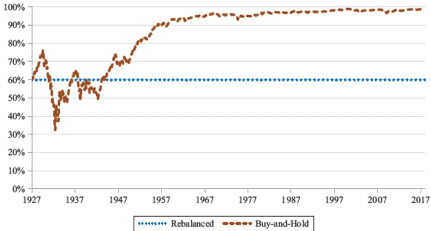
数据来源：Rattray et al (2020),国泰君安证券研究

进行定期再平衡可以有效缓解这一问题。但当某类资产持续表现更优时，定期再平衡的收益会低于不进行再平衡的组合。本文中我们使用了一个简化的两期模型来解释这一现象：再平衡意味着卖出前期表现更好的资产，而如果这个资产在未来持续更优的表现，再平衡会导致组合收益的下降。

由于股票收益率的波动通常大于债券，股债的相对收益一般是由股票所驱动的。因此我们尤为关注股票市场发生重大回撤的时期。如图2所示，我们对买入并持有组合以及月度再平衡组合分别进行了回测。两个组合都于 2016 年 12 月以 60%比 40%的初始股债权重进行建仓。月度再平衡组合在金融危机期间的最大回撤是买入并持有组合的 1.2倍。

Granger et al(2004)展示了对组合进行定期再平衡等价于买入并持有组合后叠加一个以股债相对收益为标的资产的跨式期权空头(以相等行权价卖出一个看跌期权以及一个看涨期权)。期权空头引入的负凸度暴露会放大组合在股债表现持续背离波动时组合的回撤。

我们发现应用于股票以及债券市场的时间序列动量策略(或者趋势跟随策略)可以帮助对冲定期再平衡引入的负凸度暴露。这是因为趋势跟随类策略的收益分布与跨式期权类似，具有正的凸度暴露。Martin &Zou(2012)以及 Hamill, Rattray & Van Hemert(2016)都对于趋势跟随类策略收益分布的这一特性进行过讨论。

图 2：组合表现：月度再平衡 VS 买入并持有
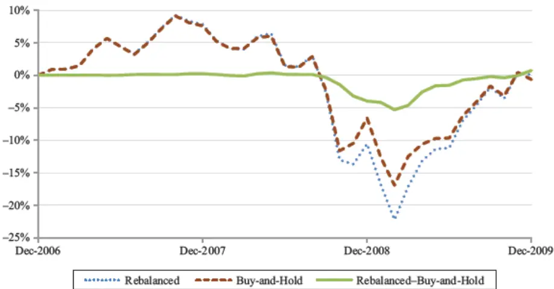
数据来源：Rattray et al (2020),国泰君安证券研究

我们使用 1960-2017 的数据进行分析，这一样本时期包含了 60 年代以及 70 年代的债券熊市。我们观察 1 个月、3 个月以及 12 个月的趋势跟随策略在60/40股债组合回撤最严重的 5个时期的表现。可以发现，将10%的权重分配于趋势跟随策略可以减少组合在这些重大回撤时期 5%的平均回撤。并且趋势跟随策略对于组合的平均收益率并没有负面影响。这是因为，尽管通常将配置权重分配于防守类策略会影响组合收益率，在我们的样本时期，趋势跟随的风险溢价抵消了这种成本。

另一种获得趋势暴露的方法是借助趋势跟随信号调整再平衡的时间以及幅度，我们将其称作战略再平衡(Strategic Rebalancing)。我们首先分析了诸如改变再平衡频率、设定阈值，只进行部分再平衡等主观规则类再平衡方法。这类依据主观规则进行的再平衡可以最多减少 1%的平均回撤。随后我们分析了借助了股债收益率以及相对收益率趋势的战略再平衡，其可以获得2%-3%的平均回撤的降低。

关于再平衡的研究最早可以追溯到Perold & Sharpe(1988)。而本篇文章的主要贡献在于，我们展示了再平衡引入的负凸度暴露可以通过获得时间序列动量(趋势)暴露的方式进行有效的对冲和管理。投资者可以通过直接在组合中纳入趋势跟随策略或者以战略再平衡的方式进行再平衡两种方式来达到获得趋势暴露的目的。两种方法都对 60/40 股债组合在1960-2017年间最为严重的 5次回撤有着显著的改善作用。

本文此后如下安排。在第一部分，我们从公式解析以及实证结果两个方面证实定期再平衡与买入并持有组合的收益率差值是股票与债券相对收益率的一个凹函数(负凸度暴露)。在第二部分，我们展示了股票与债券的趋势跟随类策略的收益率是股票与债券相对收益率的一个凸函数。只需要少量配置于趋势跟随类策略就能有效的对冲定期再平衡引入的负的凸度暴露，减少组合的最大回撤。在第三部分，我们探讨了各种规则类的再平衡方法以及基于趋势信息的战略再平衡，并发现了战略再平衡可以有效降低60/40 股债组合的历史回撤。最后，我们对于两者获得趋势暴露的方法进行比较并做一些评论。

## 3. 再平衡 VS 买入并持有

60/40 股债组合是资产配置实践中广为流传的概念。从长期均衡角度而言，这类组合也是合乎情理的：在过去的 10 年间，美国股票与债券的总市值比例整体维持在 6:4 的比例附近。也因此，大型养老金以及主权基金通常都明确追踪一个 60/40 的股债组合。Chambers, Dimson &Ilmanen(2012)就曾发现，2007 年挪威养老金基金60%的权重配置于股票，其余权重中的绝大多数配置于债券类资产。在本章中，我们以60/40股债组合为分析对象，从一个两期的模型出发，展示月度再平衡(记作Rebal)与买入持有(记作Hold)两种组合的区别。

分别使用 $R_{t}^{s}$ 与 $R_{t}^{B}$ 代表股票与债券在第 t 期的收益率。使用 $w^{s}$ 与 $w^{B}$ 代表股票与债券的目标权重，则月度再平衡组合的两期收益率如公式1所示。而对于买入并持有组合，其两期收益率如公式2 所示。

$$
1+\ R^{Rebal}\ =\ (1\ +\ w^{s}R_{1}^{s}\ +\ w^{B}R_{1}^{B})(1\ +\ w^{s}R_{2}^{s}\ +\ w^{B}R_{2}^{B})\tag{1}
$$

$$
1+\ R^{Hold}=w^{s}(1\ +\ R_{1}^{s})(1\ +\ R_{2}^{s})\ +w^{B}(1\ +\ R_{1}^{B})(1\ +\ R_{2}^{B})\tag{2}
$$

我们可以引入股票与债券的平均收益率 $R_{t}^{Avg}\ :=\ :(R_{t}^{B}\ :+\ :R_{t}^{S})/2$ 来分别改写股票与债券的单期收益率，将股票与债券的相对收益率记作 $K_{t}\ =$ $R_{t}^{S}\mathrm{~-~}R_{t}^{B}$ 。股票与债券收益率可以以相对收益的形式表达如公式3与公式 4

$$
R_{t}^{S}=(R_{t}^{Avg}+0.5{K}_{t})\tag{3}
$$

$$
R_{t}^{B}=\left(R_{t}^{Avg}-0.5{K_{t}}\right)\tag{4}
$$

将公式3与 4 带入公式 1与公式2 的差值中，可以得到：

$$
R^{Rebal}-R^{Hold}=-w^{S}w^{B}K_{1}K_{2}\tag{5}
$$

由公式5我们可以得知，当股票与债券相对收益率具有趋势时(此时 $K_{1}$ 与$K_{2}$ 具有相同的符号)，再平衡组合(Rebal)表现弱于买入并持有组合(Hold)。此时以固定权重为目标的再平衡意味着卖出前期表现更好的资产，而如果前期表现更好的资产在下一期亦然强势，则再平衡的行为会削弱组合收益率。

在多周期的设定下，再平衡组合(Rebal)与买入并持有组合(Hold)的收益率差值分布非常接近以股票与债券收益率差值为标的资产的跨式期权(straddle)空头头寸的收益分布。

数据方面，我们使用在纽交所、美国交易所以及纳斯达克上市的所有公司价值加权的组合代表股票组合，使用美国国库债代表债券组合进行分析。在图3中，我们绘出了再平衡与买入持有组合的相对收益率(Rebal -Hold)以及股票与债券资产相对收益率(Stock - Bond)的收益分布散点图。图中每一个点都对应了滚动历史 12 个月的收益率。我们可以非常清晰的发现，Rebal-Hold 的收益率分布非常接近Stock-Bond收益率的跨式期权空头头寸，具有显著的负凸度暴露。

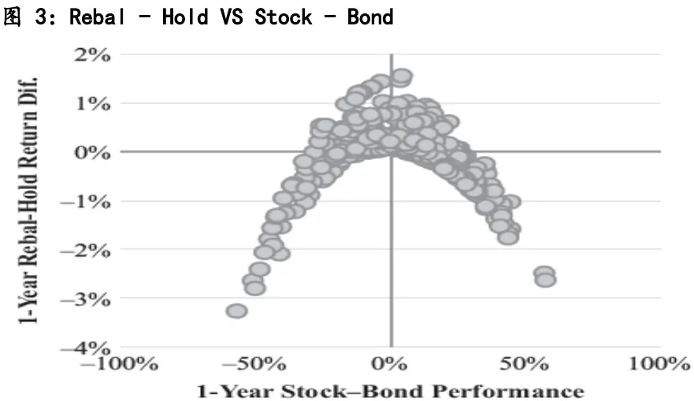
数据来源：Rattray et al (2020),国泰君安证券研究

## 4. 加入趋势跟随策略

我们首先来定义一个简单的时间序列动量信号：资产 K 在过去N个月中的收益率除以同期波动率：

$$
\begin{array}{r}{mom_{t-1}^{k}(N)=\frac{\sum_{i=1}^{N}R_{t-i}^{k}}{\sigma_{t-i}^{k}\sqrt{N}}}\end{array}\tag{6}
$$

将公式6 分别应用于股票与债券相对于短期国库券的超额收益率，可以得到股票与债券的趋势信号。我们分别以股票、债券以及股票债券相对收益率为标的资产构建对应趋势跟随策略。并且使用如公式7构建了混合股票趋势跟随策略与债券趋势跟随策略的股债等风险趋势跟随策略，其中σRef为设定的目标波动率，通常设置在 15%至 20%之间。我们假设20%的资金用于作为期货保证金，因此剩余80%的资金可以投资于无风险资产以增强收益。

$$
\begin{array}{r}{R_{t}^{mom(N)}=0.5mom_{t-1}^{S}(N)\frac{\sigma^{Ref}}{\sigma_{t-1}^{S}}R_{t}^{S}+}\\{0.5mom_{t-1}^{B}(N)\frac{\sigma^{Ref}}{\sigma_{t-1}^{B}}R_{t}^{B}+0.8R_{t}^{F}}\end{array}\tag{7}
$$

针对所有的趋势跟随策略，我们还引入了两个规则来使策略仓位更为合理。首先，我们对信号数值进行截尾，将其最大值与最小值分别限定为1 和-1。其次我们把股票波动率设置为最低不低于 10%，把债券波动率设置为最低不低于5%。这个改动可以在低波动时期避免策略过高的杠杆。这两个改动都并没有实质上改变策略的收益分布，但却是投资者在实践中广泛采用的控制仓位规则。

针对使用期货进行的策略回测，我们依照 Harvey et al(2018)使用 0.01%的股票期货成交成本以及0.005%的债券期货成交成本。而针对股票与债券现货组合的回测，我们参考 Norges Bank(2018)使用 0.3%的股票交易成本以及0.13%的债券交易成本。

图 4A：趋势跟随策略分布:股票
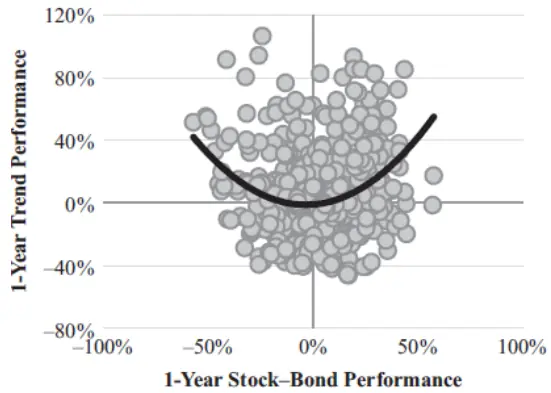
数据来源：Rattray et al (2020),国泰君安证券研究

图 4B：趋势跟随策略分布:债券
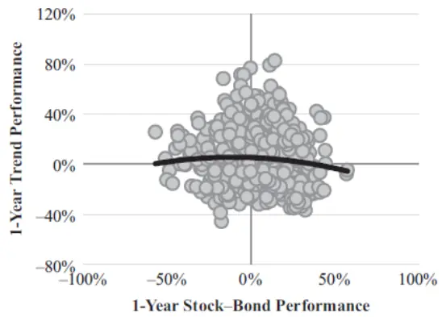
数据来源：Rattray et al (2020),国泰君安证券研究

图 4C：趋势跟随策略分布:股债等风险
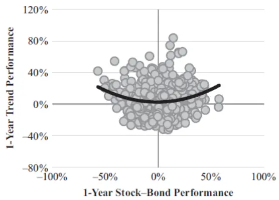
数据来源：Rattray et al (2020),国泰君安证券研究

图 4D：趋势跟随策略分布：股债相对
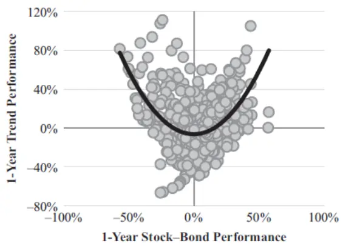
数据来源：Rattray et al (2020),国泰君安证券研究

图 4E：趋势跟随策略分布：股债相对（负趋势）
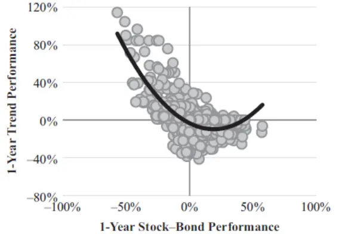
数据来源：Rattray et al (2020),国泰君安证券研究

图 4F：趋势跟随策略分布：股债相对（正趋势）
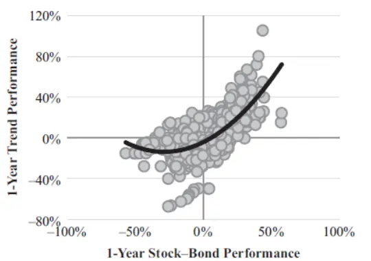
数据来源：Rattray et al (2020),国泰君安证券研究

在图 4 中，我们展示了趋势跟随策略(Y 轴)与股债相对收益率(X 轴)的分布散点图，图中的曲线对应了最优拟合的二次多项式。我们在图4.A-4.F 中使用了不同标的资产构建趋势类策略。分别对应:股票(A)、债券(B)、股债等风险(C)、股债相对收益率(D)、股债相对收益率正趋势(E)、股债相对收益率负趋势(F)。其中股债相对收益率正趋势(E)只会在相对趋势为正时建仓。类似的，股债相对收益率负趋势(F)只会在相对趋势为负时建仓。

在股债相对收益率趋势策略例子中(图 4.D)，可以发现一个非常明显的微笑形状。这与趋势策略收益率相对底层资产具有凸度的认知是一致的。此外股票趋势跟随策略(A)以及股债趋势跟随等风险策略(C)的收益率分布相比股债相对收益率也是其凸函数。这是由于股票收益率的变化主导了股债相对收益率变化，在 1960-2017 的近 60 年间，股票收益率与股债相对收益率的相关性高达 0.9。债券趋势跟随策略(B)相比股债相对收益率并不具备明显的分布趋势。此外股债相对收益正趋势(E)与股债相对收益率负趋势(F)则分别对应了看跌期权以及看涨期权的收益率分布。

图 5：月度再平衡 60-40股债组合历史回撤
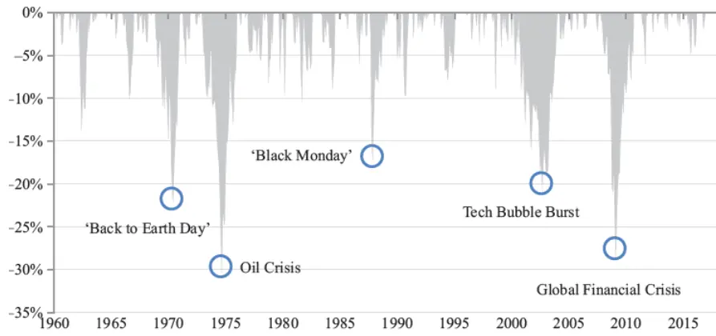
数据来源：Rattray et al (2020),国泰君安证券研究

我们把 90%资金分配于 60/40 股债月度再平衡组合，将剩余 10%分配于趋势跟随策略，观察趋势跟随策略的加入是否如所想减少了再平衡组合的最大回撤。图5展示了我们重点关注的月度再平衡 60/40 股债组合历史上的 5 次重大回撤。对应了美国股市 5 次(1970/6、1974/9、1987/11、2002/6 以及 2009/2)超过 15%的重大回撤。在表 1.1-1.3 中，我们展示了加入前述各类趋势跟随策略配置后，月度再平衡股债组合的表现。

表1.1中加入股票(A)与债券(B)趋势跟随策略后的再平衡组合平均收益率并无显著变化，波动率则有所下降。最大回撤也得到改善，不同策略对应了大体 3.6%到 5.7%的最大回撤减少。值得一提的是，股票趋势跟随策略的加入使得组合在1987/11的黑色星期一遭受了更大的回撤。表1.2 中加入股债等风险(C)趋势跟随策略后的再平衡组合也有类似的表现，收益率并没有发生变化，最大回撤水平显著改善。

整体来说，表1.1-表 1.3中以 10%的权重加入各类趋势跟随策略后，组合的夏普比率在 0.45 到 0.54 之间，相比原始月度再平衡组合 0.47 的夏普并没有显著改变。为了更进一步的展示在月度再平衡组合中加入趋势跟随策略会怎样影响组合回撤。我们使用Goetzman et al(2007)提出的考虑了高阶矩信息的绩效评价指标:CEQ(certainty-equivalent return)。这个指标会惩罚策略的负偏度以及过高的峰值从而把历史回撤信息纳入了考量。当把 10%资金配置于趋势跟随策略后，月度再平衡组合获得了显著更高的 CEQ。并且这种改善相对配置于趋势跟随策略的资金比例成比例。

表1.1：月度再平衡60-40股债组合历史回撤

|  | Rebal (100%) | Rebal (90%) 1m Trend (10%) | Rebal (90%) 3m Trend (10%) | Rebal (90%) 12m Trend (10%) |
| --- | --- | --- | --- | --- |
| Panel A: Trend Applied to Stocks Only |  |  |  |  |
| Stock Allocation (avg) | 60.0% | 57.7% | 60.1% | 64.5% |
| Bond Allocation (avg) | 40.0% | 36.0% | 36.0% | 36.0% |
| Total Allocation (avg) | 100.0% | 93.7% | 96.1% | 100.5% |
| Rebal Trade (ann) | 10.2% | 9.1% | 9.1% | 9.1% |
| Stock Fut. Trade (ann) | 0.0% | 207.3% | 106.7% | 45.1% |
| Bond Fut. Trade (ann) | 0.0% | 0.0% | 0.0% | 0.0% |
| Cost Estimate (ann), bps | 4.4 | 6.0 | 5.0 | 4.4 |
| Return (ann) | 9.1% | 9.0% | 9.1% | 9.6% |
| Volatility (ann) | 9.8% | 8.7% | 9.1% | 9.7% |
| Ret./Vol. (ann) | 0.92 | 1.03 | 1.00 | 0.99 |
| Sharpe Ratio (ann) | 0.47 | 0.52 | 0.51 | 0.53 |
| ΔDD June 1970 | 0.0% | 3.6% | 1.9% | 5.4% |
| ΔDD September 1974 | 0.0% | 9.7% | 8.9% | 9.8% |
| ∆DD November 1987 | 0.0% | 4.9% | –0.8% | -3.0% |
| ΔDD September 2002 | 0.0% | 4.2% | 4.2% | 6.0% |
| ∆DD February 2009 | 0.0% | 6.1% | 7.9% | 9.0% |
| ΔDD Average | 0.0% | 5.7% | 4.4% | 5.4% |
| Panel B: Trend Applied to Bonds Only |  |  |  |  |
| Stock Allocation (avg) | 60.0% | 54.0% | 54.0% | 54.0% |
| Bond Allocation (avg) | 40.0% | 39.9% | 41.7% | 45.3% |
| Total Allocation (avg) | 100.0% | 93.9% | 95.7% | 99.3% |
| Rebal Trade (ann) | 10.2% | 9.1% | 9.1% | 9.1% |
| Stock Fut. Trade (ann) | 0.0% | 0.0% | 0.0% | 0.0% |
| Bond Fut, Trade (ann) | 0.0% | 438.0% | 245.4% | 111.6% |
| Cost Estimate (ann), bps | 4.4 | 6.1 | 5.2 | 4.5 |
| Return (ann) | 9.1% | 9.4% | 9.1% | 9.3% |
| Volatility (ann) | 9.8% | 9.2% | 9.2% | 9.2% |
| Ret./Vol. (ann) | 0.92 | 1.02 | 0.99 | 1.01 |
| Sharpe Ratio (ann) | 0.47 | 0.54 | 0.50 | 0.53 |
| ΔDD June 1970 | 0.0% | 5.1% | 3.5% | 5.6% |
| ΔDD September 1974 | 0.0% | 6.0% | 5.0% | 6.2% |
| ΔDD November 1987 | 0.0% | 0.9% | 0.8% | 1.1% |
| ΔDD September 2002 | 0.0% | 6.4% | 5.2% | 7.7% |
| ΔDD February 2009 | 0.0% | 2.1% | 3.8% | 6.0% |
| ΔDD Average | 0.0% | 4.1% | 3.6% | 5.3% |

数据来源：Rattray et al (2020),国泰君安证券研究

表1.2：月度再平衡60-40股债组合历史回撤
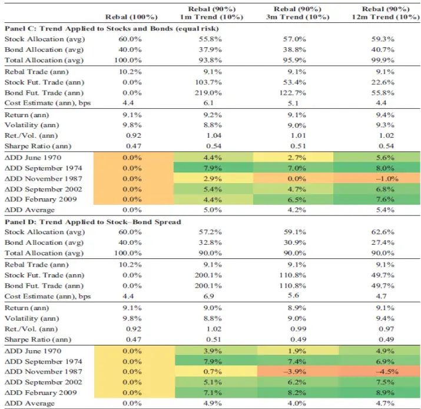
数据来源：Rattray et al (2020),国泰君安证券研究

表1.3：月度再平衡60-40股债组合历史回撤
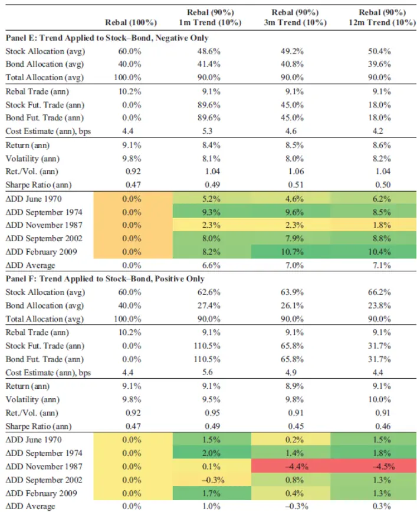
数据来源：Rattray et al (2020),国泰君安证券研究

在图6中，我们展示了加入趋势跟随策略后的再平衡组合股债权重的变化情况。因为我们对趋势跟随信号进行了截尾处理，股票期货的权重被限制在-15%与 15%的范围内，而债券的权重被限制在-30%与 30%的范围内。加入趋势跟随策略后的再平衡组合的股票权重围绕长期目标波动，并没有显著的长期偏离。

图 6：加入趋势跟随策略后股票与债券权重
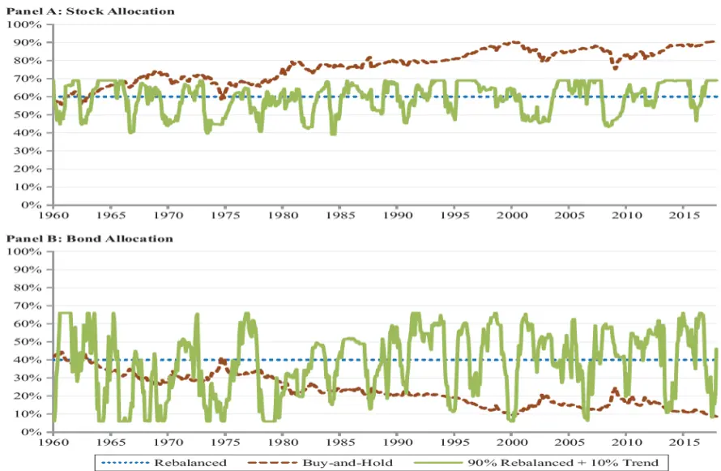
数据来源：Rattray et al (2020),国泰君安证券研究

## 5. 战略再平衡

在这一章中，我们来研究是否可以通过调整再平衡时间以及幅度来获得类似配置趋势跟随策略的效果。我们考虑了常见的规则类再平衡方法以及基于时间序列动量信息的战略再平衡方法。

大部分关于配置组合再平衡的研究专注于进行再平衡的频率以及如何设定触发再平衡的阈值。此外还有研究推荐相比将组合完全调整为目标权重，仅进行部分再平衡调仓以削减交易成本。这方面，Arnott &Lovell(1993)的相关研究可供参考。

我们在表2中提供了使用不同再平衡规则对组合的回撤的影响。可以发现，以月度频率相对 60/40进行部分再平衡最为有效的限制了回撤以及交易成本。其年度换手仅仅6.2%，远低于原始月度再平衡策略10.2%的换手率。以更低的频率进行再平衡同样可以减少回撤。与此相对应的是，设定再平衡触发阈值的方法对于改善回撤并不具备显著的效果。

表 2：使用不同再平衡频率以及再平衡阈值进行再平衡

|  | Monthly |  |  | Quarterly |  |  | Annual |  |  | 2% Threshold |  |  | 4% Threshold |  |  |
| --- | --- | --- | --- | --- | --- | --- | --- | --- | --- | --- | --- | --- | --- | --- | --- |
|  | Full | Half | Quarter | Full | Half | Quarter | Full | Half | Quarter | Full | Half | Quarter | Full | Half | Quarter |
| Stock Allocation (avg) | 60.0% | 60.1% | 60.2% |  | 60.1% 60.3% | 60.6% | 60.4% 61.1% |  | 62.2% | 60.2%60.4% |  | 60.5% | 60.5% 61.1% |  | 61.4% |
| Stock Allocation (std) | 0.0% | 0.7% | 1.4% | 1.3% | 1.7% | 2.5% | 2.9% | 3.3% | 4.1% | 0.9% | 1.2% | 1.7% | 1.7% 1.9% |  | 2.3% |
| % Months Rebal | 100.0% 100.0% |  | 100.0% 33.3% 33.3% |  |  | 33.3% | 8.3% | 8.3% | 8.3% | 15.8% 23.0% |  | 34.5% |  | 6.6% 9.3% | 14.2% |
| Rebal Trade (ann) | 10.2% | 6.2% | 4.2% | 6.6% | 3.9% | 2.5% | 3.6% | 1.8% | 1.1% | 5.2% 3.9% |  | 3.1% | 3.7% | 2.6% | 2.1% |
| Cost (ann), bps | 4.4 | 2.7 | 1.8 | 2.9 | 1.7 | 1.1 | 1.6 | 0.8 | 0.5 | 2.3 | 1.7 | 1.4 | 1.6 | 1.1 | 0.9 |
| Return (ann) | 9.1% | 9.2% | 9.2% | 9.2% | 9.2% | 9.2% | 9.3% | 9.2% | 9.1% | 9.1% | 9.2% | 9.2% | 9.2% | 9.2% | 9.2% |
| Volatility (ann) | 9.8% | 9.8% | 9.8% | 9.8% | 9.8% | 9.8% | 9.8% | 9.8% | 10.0% | 9.9% | 9.8% | 9.8% | 9.8% | 9.9% | 9.9% |
| Ret./Vol. (ann) | 0.93 | 0.94 | 0.94 | 0.94 | 0.95 | 0.94 | 0.95 | 0.94 | 0.92 | 0.93 | 0.94 | 0.94 | 0.93 | 0.94 | 0.94 |
| DD June 1970 | 0.0% | 0.1% | 0.1% | 0.1% | 0.3% | 0.2% | 0.5% | 0.2% | -0.7% | -0.2% | 0.0% | 0.1% | -0.2% | 0.2% | –0.2% |
| DD September 1974 | 0.0% | 0.2% | 0.6% | 0.5% | 0.9% | 1.3% | 1.3% | 1.7% | 1.4% | 0.0% | 0.4% | 0.7% | 0.4% | 0.4% | 0.6% |
| DD November 1987 | 0.0% | 0.1% | -0.3% |  | 0.5%-0.2% | -1.0% | –2.3% –2.2% |  | -2.4% | -0.4% -0.2% |  | -0.3% | -0.7% -0.7% |  | -0.7% |
| DD September 2002 | 0.0% | 0.4% | 0.9% | 1.2% | 1.5% | 1.9% | 1.7% | 1.9% | -0.1% | -0.2% | 0.5% | 1.2% | 0.0% | 1.1% | 1.3% |
| DD February 2009 | 0.0% | 0.8% | 1.8% | 0.9% | 2.1% | 3.0% | 2.8% | 3.2% | 2.9% | 0.2% | 1.1% | 2.0% | 0.0% | 1.1% | 1.9% |
| DD Average | 0.0% | 0.3% | 0.6% | 0.6% | 0.9% | 1.1% | 0.8% | 0.9% | 0.2% | -0.1% | 0.4% | 0.8% | -0.1% | 0.4% | 0.6% |

数据来源：Rattray et al (2020),国泰君安证券研究

接下来，我们把注意力转向借助趋势信息进行的再平衡：战略再平衡(Strategic Rebalancing)。当再平衡的资产购入方向与股债相对收益趋势相同时，进行预先设定比例(50%)的再平衡。反之当再平衡的资产购入方向与股债相对收益趋势相反时，则延后再平衡的时间。我们分别使用了1 个月、3个月以及 12个月的时间窗口计算的趋势跟随信号进行了回测。结果如表3所示。

对于三种不同时间窗口的趋势跟随信号，当信号为负(股票持续跑输债券)时触发的延后再平衡的决策都显著的减少了回撤的幅度。尤其依据12 个月的趋势信号而出发的再平衡延后对历史回撤产生了 5%以上的优化，效果堪比对于趋势跟随策略的直接配置。这也与逻辑直觉相一致，组合所遭受的重大回撤普遍是由股票市场的下跌所导致的。而与之对应的是，趋势信号为正(股票持续跑赢债券)时触发的延后再平衡的决策对于历史回撤并没有显著的改善。

表 3：使用股债相对收益率趋势跟随信号进行再平衡

|  | Delay if 1m Trend |  |  | Delay if 3m Trend |  |  | Delay if 12m Trend |  |  |
| --- | --- | --- | --- | --- | --- | --- | --- | --- | --- |
|  | Negative | Positive | Continues | Negative | Positive | Continues | Negative | Positive | Continues |
| Stock Allocation (avg) | 59.3% | 61.0% | 60.0% | 58.9% | 61.5% | 60.2% | 58.1% | 61.6% | 59.9% |
| Stock Allocation (std) | 2.2% | 1.6% | 2.3% | 2.6% | 2.3% | 2.8% | 3.9% | 2.5% | 4.9% |
| % Months Rebal | 49.3% | 50.7% | 48.3% | 48.0% | 52.0% | 25.6% | 42.2% | 57.8% | 12.6% |
| Rebal Trade (ann) | 4.0% | 4.5% | 3.8% | 3.5% | 4.4% | 2.7% | 4.5% | 4.3% | 1.7% |
| Cost Estimate (ann), bps | 1.7 | 1.9 | 1.7 | 1.5 | 1.9 | 1.2 | 1.9 | 1.9 | 0.7 |
| Return (ann) | 9.1% | 9.2% | 9.1% | 9.1% | 9.2% | 9.1% | 9.0% | 9.2% | 9.1% |
| Volatility (ann) | 9.6% | 9.9% | 9.7% | 9.5% | 10.0% | 9.7% | 9.4% | 10.0% | 9.7% |
| Ret./Vol. (ann) | 0.95 | 0.93 | 0.94 | 0.96 | 0.93 | 0.94 | 0.96 | 0.92 | 0.94 |
| DD June 1970 | 0.5% | -0.1% | 0.3% | 0.7% | -0.1% | 0.4% | 0.7% | 0.0% | 0.3% |
| DD September 1974 | 1.6% | 0.2% | 1.2% | 1.6% | 0.1% | 1.1% | 3.0% | 0.2% | 2.5% |
| DD November 1987 | 0.3% | -2.2% | -1.8% | 0.3% | -2.2% | -1.7% | 0.5% | -1.9% | -1.7% |
| DD September 2002 | 1.8% | 0.2% | 1.3% | 2.0% | 0.2% | 1.4% | 5.2% | 0.2% | 4.8% |
| DD February 2009 | 4.2% | 0.7% | 3.5% | 4.8% | 0.7% | 3.6% | 5.6% | 0.8% | 5.6% |
| DD Average | 1.7% | -0.2% | 0.9% | 1.9% | -0.2% | 0.9% | 3.0% | -0.1% | 2.3% |

数据来源：Rattray et al (2020),国泰君安证券研究

图7与图8中，我们分别展示了前文介绍的两种获得趋势暴露的方法相比股债相对收益率的分布。通过任意方法所得的趋势暴露都可以在股票跑输债券的时期为组合提供帮助。考虑到股票波动率远大于债券，这表明借助趋势跟随信息进行的再平衡在股票下跌阶段获益最多。

结合表3 中战略再平衡的收益特征，我们可以得到结论，将资金配置于趋势跟随策略以及采用战略再平衡的方法进行再平衡调仓都有益于减少组合的负凸度暴露从而削减回撤。然而两类方法都对黑色星期一的突然下跌起不到保护作用。

图 7：配置趋势跟随策略(10%,股债等风险)
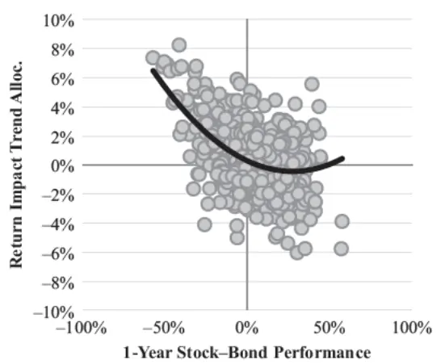
数据来源：Rattray et al (2020),国泰君安证券研究

图 8：战略再平衡(相对趋势为负时延后再平衡)
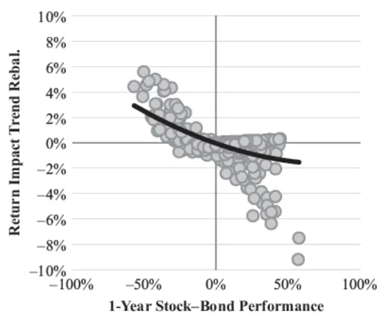
数据来源：Rattray et al (2020),国泰君安证券研究

## 6. 结论

由于买入并持有的组合会导致组合过度集中于某些资产，其并不适用于绝大多数的投资者。然而，以60/40权重建仓并进行定期再平衡则会导致组合在股票下跌的阶段遭受更为严重的回撤。从本质上来说，向固定比例再平衡的配置方法等价于定期卖出前期表现更好的资产并买入前期表现更差的资产,因此会在相对收益具备趋势的市场状态下持续承担损失。在本文中我们证实了由定期再平衡引入的负的凸度暴露可以通过配置趋势跟随策略或使用战略再平衡的方式引入趋势暴露进行有效对冲。

尽管我们的目标集中于对冲由再平衡引发的负凸度暴露，我们同样希望强调的是，其他的考虑在再平衡的过程中同样至关重要。比如，投资者可以借助换仓日以外日期的资金流入与流出进行部分的再平衡。Chanbers, Dimson & Ilmanen(2012)在他们的研究中提及，挪威政府养老基金会将这类资金流入买入相对基准最为低配的资产从而实现部分的再平衡效果。而对于有纳税顾虑的投资者，使用收益进行再平衡同样具备优势，具体可参照 Colleen, Kinniry & Zilbering(2010)的研究。

最后，我们注意到借助股票与债券的趋势信息仅仅只是其中一种在股票下跌行情中缓解回撤的方法。一个囊括了更多资产类别的更为分散的配置组合无疑是一个很好的出发点。配置于以其他资产为标的资产的趋势跟随策略同样也是很好的选择。此外Harvey et al. (2018)研究的目标波动率的仓位管理方法同样可以帮助管理 60/40股债组合的风险。

## 本公司具有中国证监会核准的证券投资咨询业务资格

## 分析师声明

作者具有中国证券业协会授予的证券投资咨询执业资格或相当的专业胜任能力，保证报告所采用的数据均来自合规渠道，分析逻辑基于作者的职业理解，本报告清晰准确地反映了作者的研究观点，力求独立、客观和公正，结论不受任何第三方的授意或影响，特此声明。

## 免责声明

本报告仅供国泰君安证券股份有限公司（以下简称“本公司”）的客户使用。本公司不会因接收人收到本报告而视其为本公司的当然客户。本报告仅在相关法律许可的情况下发放，并仅为提供信息而发放，概不构成任何广告。

本报告的信息来源于已公开的资料，本公司对该等信息的准确性、完整性或可靠性不作任何保证。本报告所载的资料、意见及推测仅反映本公司于发布本报告当日的判断，本报告所指的证券或投资标的的价格、价值及投资收入可升可跌。过往表现不应作为日后的表现依据。在不同时期，本公司可发出与本报告所载资料、意见及推测不一致的报告。本公司不保证本报告所含信息保持在最新状态。同时，本公司对本报告所含信息可在不发出通知的情形下做出修改，投资者应当自行关注相应的更新或修改。

本报告中所指的投资及服务可能不适合个别客户，不构成客户私人咨询建议。在任何情况下，本报告中的信息或所表述的意见均不构成对任何人的投资建议。在任何情况下，本公司、本公司员工或者关联机构不承诺投资者一定获利，不与投资者分享投资收益，也不对任何人因使用本报告中的任何内容所引致的任何损失负任何责任。投资者务必注意，其据此做出的任何投资决策与本公司、本公司员工或者关联机构无关。

本公司利用信息隔离墙控制内部一个或多个领域、部门或关联机构之间的信息流动。因此，投资者应注意，在法律许可的情况下，本公司及其所属关联机构可能会持有报告中提到的公司所发行的证券或期权并进行证券或期权交易，也可能为这些公司提供或者争取提供投资银行、财务顾问或者金融产品等相关服务。在法律许可的情况下，本公司的员工可能担任本报告所提到的公司的董事。

市场有风险，投资需谨慎。投资者不应将本报告作为作出投资决策的唯一参考因素，亦不应认为本报告可以取代自己的判断。
在决定投资前，如有需要，投资者务必向专业人士咨询并谨慎决策。

本报告版权仅为本公司所有，未经书面许可，任何机构和个人不得以任何形式翻版、复制、发表或引用。如征得本公司同意进行引用、刊发的，需在允许的范围内使用，并注明出处为“国泰君安证券研究”，且不得对本报告进行任何有悖原意的引用、删节和修改。

若本公司以外的其他机构（以下简称“该机构”）发送本报告，则由该机构独自为此发送行为负责。通过此途径获得本报告的投资者应自行联系该机构以要求获悉更详细信息或进而交易本报告中提及的证券。本报告不构成本公司向该机构之客户提供的投资建议，本公司、本公司员工或者关联机构亦不为该机构之客户因使用本报告或报告所载内容引起的任何损失承担任何责任。

## 评级说明

## 1.投资建议的比较标准

投资评级分为股票评级和行业评级。

以报告发布后的12个月内的市场表现为比较标准，报告发布日后的 12个月内的公司股价（或行业指数）的涨跌幅相对同期的沪深 300 指数涨跌幅为基准。

## 2.投资建议的评级标准

报告发布日后的 12 个月内的公司股价（或行业指数）的涨跌幅相对同期的沪深 300 指数的涨跌幅。

|  | 评级 说明 |  |
| --- | --- | --- |
| 股票投资评级 | 增持 | 相对沪深 300指数涨幅15%以上 |
|  | 谨慎增持 | 相对沪深300指数涨幅介于5%～15%之间 |
|  | 中性 | 相对沪深300指数涨幅介于-5%～5% |
|  | 减持 | 相对沪深300指数下跌5%以上 |
| 行业投资评级 | 增持 | 明显强于沪深 300指数 |
|  | 中性 | 基本与沪深300指数持平 |
|  | 减持 | 明显弱于沪深300指数 |

## 国泰君安证券研究所

|  | 上海 | 深圳 | 北京 |
| --- | --- | --- | --- |
| 地址 | 上海市静安区新闸路669号博华广场 20层 | 深圳市福田区益田路 6009 号新世界 商务中心34层 | 北京市西城区金融大街甲9号金融 街中心南楼18层 |
| 邮编 | 200041 | 518026 | 100032 |
| 电话 | （021)38676666 | （0755)23976888 | (010)83939888 |
|  | E-mail: gtjaresearch@gtjas.com |  |  |