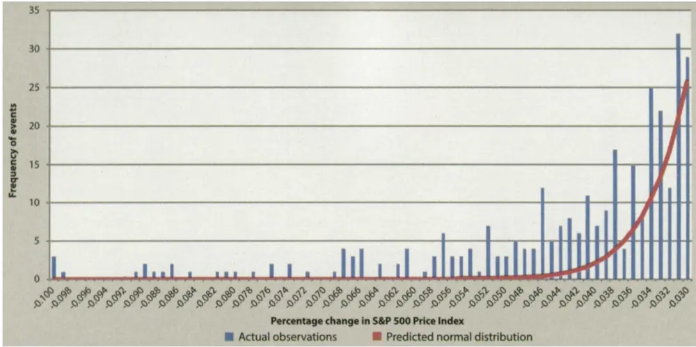
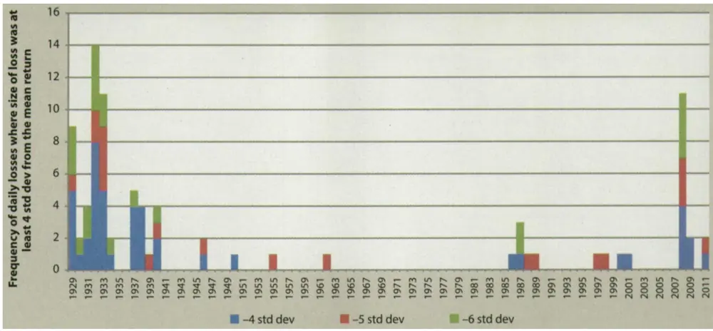
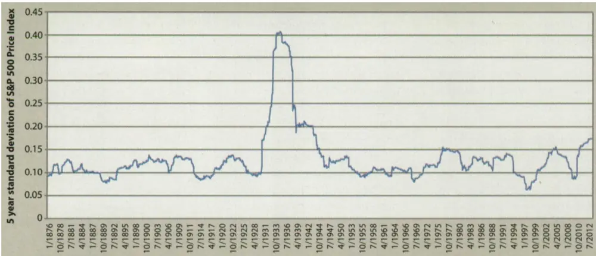
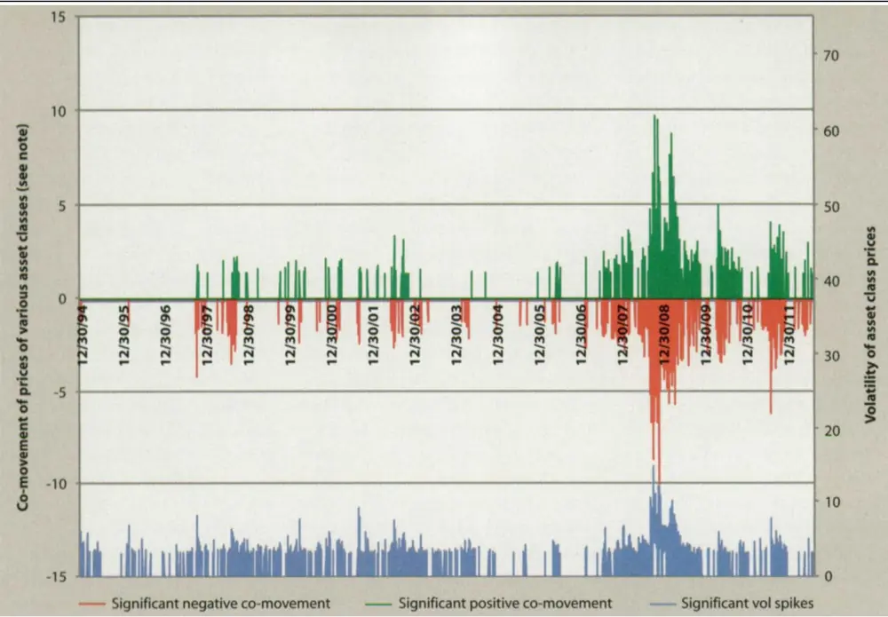

[Table_Title2021.03.23

# 投资组合优化：理论与实践的差异

## ——精品文献解读系列（七）

## 本报告导读：

本篇报告解读的文献讨论了投资组合优化理论与投资实践之间的差异，以及由此导致的诸多问题。投资者在构建投资组合时，既要借助数理统计方法，也要考虑诸多现实因素，并将这些现实因素纳入投资组合优化过程。

## 摘要：

le_Summary]投资学是一门学术界与业界紧密结合的学科，其中大类资产配置是这种紧密结合的代表。从Markowitz（1952）开创现代投资组合理论开始，学术界为业界提供了丰富的理论参考和方法模型，推动了大类资产配置实践的繁荣发展。为了帮助读者及时跟踪学术前沿，我们推出了“精品文献解读”系列报告，从大量学术文献中挑选出精品论文进行剖析解读，为读者呈现大类资产配置领域最新的思路和方法。

本篇为读者解读的文献是 Ballentine（2013）在期刊 Journal ofFinancial Planning 上发表的论文“Portfolio Optimization TheoryVersus Practice”。

本文讨论了投资组合优化理论与投资实践之间的差异。具体来说，本文分析了投资者在应用投资组合优化模型时遇到的诸多问题，涉及资产类别的定义、收益率的分布、资产属性的稳定性、投资者的偏好等各个方面。为了解决理论与实践的差异，投资者在构建投资组合时，既要借助数理统计方法，也要考虑诸多现实因素，并将这些现实因素纳入到投资组合优化过程。

资产配置是一门科学，更是一门艺术。现代投资组合理论虽然为投资者进行资产配置提供了较为完备的理论方法，但是其假设过于理想，这导致在投资实践中会遇到诸多问题。投资者应该深刻理解和把握理论与实践之间的差异，在进行资产配置时融入主观经验和判断，避免过于依赖数理模型。该文献不是一篇严格意义上的学术论文，但是文中提出的诸多问题具有非常好的现实意义，值得我们去深入思考。

大类资产配置研究

## or] 报告作者

李祥文(分析师)

8 021-38031560

lixiangwen@gtjas.com

证书编号 S0880520100001

王瑞韬(研究助理)

8 021-38038208

wangruitao@gtjas.com

证书编号 S0880121010024

## cReport] 相关报告

战略再平衡

2021.03.15

美债利率对资产配置策略的影响

2021.03.08

因子与资产的统一配置框架 2021.03.08

股票与债券相关性

2021.03.02

战术资产配置的宏观经济仪表盘2021.02.18

## 1. 文献概述

## 文献来源：

Ballentine,Roy. "Portfolio Optimization Theory Versus Practice." Journal of Financial Planning. 26.4(2013):40-50.

## 文献摘要：

本文讨论了投资组合优化理论与投资实践之间的差异。具体来说，本文分析了投资者在应用投资组合优化模型时遇到的诸多问题，涉及资产类别的定义、收益率的分布、资产属性的稳定性、投资者的偏好等各个方面。为了解决理论与实践的差异，投资者在构建投资组合时，既要借助数理统计方法，也要考虑诸多现实因素，并将这些现实因素纳入到投资组合优化过程。

## 文献评述：

资产配置是一门科学，更是一门艺术。现代投资组合理论虽然为投资者进行资产配置提供了较为完备的理论方法，但是其假设过于理想，这导致在投资实践中会遇到诸多问题。投资者应该深刻理解和把握理论与实践之间的差异，在进行资产配置时融入主观经验和判断，避免过于依赖梳理模型。

该文献不是一篇严格意义上的学术论文，但是文中提出的诸多问题具有非常好的现实意义，值得我们去深入思考。

## 2. 引言

几乎所有专业投资者，都会使用基于现代投资组合理论（ModernPortfolio Theory，MPT）的优化技术，来构建投资组合。通过使用数理统计方法和计算机辅助建模，投资者可以将资金配置到不同种类的资产（比如股票、债券、现金、不动产、对冲基金等）中，并声称以此构建的投资组合能够在特定风险水平上提供最高的收益，或者在达到特定收益的要求下实现风险最小化。

这里存在的问题是,真实世界与理论模型之间存在一定的差异，有时候甚至相距甚远。正如哲学家 Yogi Berra所说，“在理论中，理论与实践是相同的；但是在实践中，二者却存在区别”（In theory there is nodifference between theory and practice. In practice there is.）。同样地，这句话也适应于当今的投资组合优化理论和实践。

本文接下来主要从实践角度，分析评论投资组合优化理论存在的诸多问题。

## 3. 投资组合优化理论与实践的差异

我们首先来分析大部分投资组合优化模型的前提假设，并逐一探讨理论与实践的差异。值得说明的是，为了强调这些差异，下文以投资实践中的真实情况作为各个小节的标题。

## 资产类别的定义模糊，构成不稳定

在理论模型中：资产类别的定义是完善的，构成是稳定的。

在投资实践中：资产类别的定义模糊，且构成不稳定。

在投资实践中，“资产类别”（asset class）并没有统一的定义。个人投资者（以及许多专业投资者）在使用优化模型来构建投资组合时，通常很少去考虑下述问题：

- 资产类别是如何定义的？

- 资产类别的构成是否会随时间变化而变化？

- 使用历史数据来估计资产未来的表现是否合理？

这类问题又会衍生出许多具体问题，比如：资产类型到底如何来区分？需要用哪些资产类别来完整代表股权资产？对冲基金算是一类资产吗，还是应该被认为是全球股权资产（global equities）的一部分？对于这些问题，目前都没有明确的、被广泛接受的答案。

任何资产类别的构成，都不会保持长时间的稳定。比如，在进行投资组合优化过程中，“新兴市场股票”这一资产类别通常用某个新兴市场指数来表示。但是，这些指数往往会随着时间发生持续变化。中国和印度目前已经成为世界上最大的经济体，但他们依然被纳入了这些新兴市场指数。在这种情况下，使用新兴市场指数的历史数据来预测中国经济未来的表现，显然是不尽合理的，因为新兴市场指数可能很快就会剔除中国市场。诸如此类的问题，几乎存在于任何资产类别中。

## 资产类别难以用某个指数来表示

在理论模型中：任何资产类别，都可以用某个指数，或者其他度量资产收益的指标来表示。

在投资实践中：尽管大家可能认为使用一些基准来表示资产类别是被普遍接受的，但事实是，市场上根本没有一致的观点。对于一些资产类别，投资者甚至很难找到数据来估计收益率、风险和相关性。

比如，对于私募股权（private equity）这一类资产，在行业发展初期， p4私募股权基金凭借优异的业绩和多元化收益受到投资者的广泛关注。但是在现阶段，私募股权投资基金数量繁多，行业竞争极为激烈，业绩表现也大不如前。此时，用基于历史收益的基准来表示现阶段私募股权资产就显得极不合理。风险投资基金（venture capital）、对冲基金（hedgefunds）、不动产（real estate）和大宗商品等，都存在类似的问题。这个问题在构建投资组合过程中是一个非常大的挑战。

## 投资者关心的不仅仅是收益与风险

在理论模型中：投资组合优化的主要关注点是收益与风险。

在投资实践中：投资者不仅会关注投资组合的预期收益与风险，还同样会关注其他因素。但是这些因素在投资组合优化模型中均没有被考虑。

这些因素包括但不限于如下几点：

- 投资者每年需要从投资组合中获取多少现金流？

- 投资者需要为投资收益缴纳多少税收？

- 投资组合的流动性如何？是否能够满足投资者即刻的变现需求？

各类资产的最小购买规模是多少？顶尖的对冲基金、风险投资基金、私募股权基金等的最小购买规模可能已经超越了许多个人投资者的配置能力。

- 对于特定资产的基金管理人选择风险（manager selection risk）有多大？投资者是否可以接受基金管理人选择错误导致的后果？

评估投资组合业绩的周期有多长？如果投资者A的投资目的是为了30年后获得养老金，而投资者B急需现金来缴纳自己的房产税，那么二者评估投资组合业绩的周期显然是完全不同的。

投资者的风险承受能力如何？即，如果投资组合的业绩低于预期，投资者将会面临如何的境况？如果投资者A需要在特定日期偿还一笔债务，而投资者B 家庭富裕，计划用投资收益来支付儿女的部分学费，那么二者在投资组合业绩低于预期时，所面临的境况也是完全不同的。

## 资产的收益与风险难以被准确预测

在理论模型中：投资者能够在任意给定时间区间内，精确地预测每种资产类别的预期收益、波动性和不同资产收益的相关性。

在投资实践中：没有任何人能够持续地、准确地预测上述数据。大多数依赖于历史数据的预测常常会出现偏差。比如，某资产的收益暂时出现下跌可能只是因为均值回归现象，但基于历史数据的预测有可能会认为该资产在未来会长期表现不佳。

在投资组合优化过程中，模型的输入参数通常包含如下变量：资产的预期收益率、收益率的标准差、各类资产收益率的相关系数。假设我们在构建投资组合时考虑 10 种资产类别，那么在使用优化模型时，需要估计10个预期收益率数据、10个收益率标准差数据和45个相关系数数据， p5即一共需要估计65个变量数据。

可以想象，要在不同时间区间内，持续地、准确地估计这么多预测变量，进而得到理想的最优化资产配置比例，这几乎是一项不可能完成的任务。同时，我们知道预测不准确带来的影响很大，特别是对资产预期收益率的预测。在 MVO等最优化模型中，预期收益率的一点小变动可能会导致最终资产配置比例的巨大变化。

## 投资者并不接受位于有效前沿上的投资组合

在理论模型中：理性投资者希望自己的投资组合位于有效前沿上，这样能够在一定风险水平上获得最高的收益。

在投资实践中：几乎没有人选择位于有效前沿上的投资组合。

通过无约束的优化模型构建的投资组合，通常会大比例配置当期预测表现优异的少数几种资产类别。如果基于历史数据来估计收益率，那么资金配置将会集中在近期表现优异的资产中。在这种情况下，有效前沿上的投资组合可能并不理想，因为近期表现优异的资产很有可能估值过高，因而在未来存在较大的下跌风险。

假设投资组合 A 位于有效前沿上，但是资产配置比较集中；投资组合 B不在有效前沿上，但是资产配置更加分散。那么一个理性投资者会偏好于哪种投资组合呢？可能只有在对资产收益率估计非常有信心的情况下，投资者才会选择投资组合 A。实际上，大部分投资者对于收益率预测信心不足，因此更倾向于选择投资组合B。

解决该问题的一个办法是，在使用优化模型时对各类资产的配置比例进行一定的约束（约束条件通常包括各类资产配置比例的最大值和最小值等），保证模型输出的投资组合具备足够的分散性。

这种做法本质上是根据预期的结果来逆向调整优化模型，因此表面上采用的是数理分析方法，实际上主观判断的成分非常大。尽管如此，我们仍然认为这种做法要优于单纯使用无约束优化模型。当然，这也相当于承认了一个事实，那就是尽管使用数理模型来实现投资组合最优化的方法可能更加稳健，但是在投资实践中依然离不开大量的投资经验和主观判断。

## 资产收益率并不服从正态分布

在理论模型中：资产收益率服从正态分布。

在投资实践中：大多数资产的收益率并不服从正态分布。

在正态分布下，收益率偏离均值 3 倍标准的概率极其微小。但实际上，资产收益偏离均值 3 倍标准差的情况时常会发生（Mandelbrot andHudson,2004）。大部分资产的收益率分布均有肥尾特征，即峰度为负， p6因此在现实世界中投资者蒙受巨额亏损的概率也远远大于理论推导的结果。

诸多学者在发展现代投资组合理论（MPT）时，也意识到资产收益并不严格服从正态分布。Mandelbrot（1963）建议使用稳定帕累托分布（Stable Pareto distribution）来描述资产收益，这种分布的尾部相比正态分布更“肥”，表示极端事件发生的概率更高。近年来，人们开始普遍使用对数正态分布来描述资产收益，似乎取得了一定的成果。但是2008年金融危机的发生，让人们重新开始重视这一问题。

基于正态分布得到的一系列数理推导结果可能导致在投资实践中出现严重失误，因为各资产的下跌风险会被严重低估。那么风险低估的程度有多大呢？如果基于正态分布假设，根据投资组合优化模型得到的风险估计，那么诸如2007年中和2009年3 月底发生的市场暴跌在理论上是不可能发生的。

Cook Pine Capital（2008）对风险低估问题给出了更为细致的数据论证。假设标普 500 指数日度收益率服从正态分布，那么可以推算得出：理论上，某个交易日出现-3.5%收益率（低于均值 3 倍标准差）的情况在100年时间内只会出现27 次，但实际上1927年至 2008年这81年间共发生了100次；某个交易日出现-4.7%收益率（低于均值 4倍标准差）的情况理论上在 100 年时间内只会出现 1 次，但是实际上 1927 年以来已经发生了43次；收益率低于均值5个标准差的概率已经低到0.00003%，但是实际上 81 年间我们经历了 40 次，其中 2008 年一年时间内就发生了3次。

图 1 统计了 1929 年 1 月 1 日至 2012 年 9 月 13 日期间，标普 500 指数日度收益率真实发生频次，与理论上正态分布概率的对比。在图中，红线表示基于正态分布得到了理论概率，蓝色柱状图表示实际发生的频次。很明显地，在真实的投资世界中，市场极端暴跌事件发生的次数要远远高于理论预测。

图 1：标普500指数日度收益率真实发生频次 vs. 正态分布概率（1929 年 1月 1日至 2012 年 9 月 13日）

数据来源：Ballentine（2013）

图2统计了 1929年至 2011年期间，标普 500指数极端暴跌事件发生的频次和所在年份。Cook Pine Capital（2008）将极端暴跌定义为收益率低于均值4 倍标准差。上文提到，在理论上，日收益率低于均值 4倍标准差的情况在 100 年时间内只会出现 1 次。但是从图 2 中可以看到，极端暴跌事件时常发生，而且具有非常明显的聚集现象。这也再次验证了资产收益并不服从正态分布，基于正态分布假设进行数理建模会严重低估市场尾部风险。

图 2：标普500 指数极端暴跌事件发生的频次和所在年份（1929 年至 2011 年）

数据来源：Ballentine（2013）

## 资产属性随时间变化而变化

在理论模型中：各类资产的期望收益、标准差和相关性是稳定不变的。

在投资实践中：几乎所有资产的期望收益、标准差和相关性都会随时间变化而变化，难以保持稳定。

以股票的波动性为例，图3 展示了1876年 1月至 2012年8 月期间，美国大盘股收益率的5年滚动标准差。从图3中可以看到，美国大盘股的波动性会逐年发生变化，尤其是在 1930s经济大萧条时期，市场出现了极端的波动性偏离。

同样地，资产收益率之间的相关性也是持续变化的，甚至可能偏离长期趋势线数十年之久。图 4 展示了一些常见资产的价格波动性和相关性。资产包括美国大盘股、发达国家股票、新兴市场股票、房地产、大宗商品和美国国债。从图 4中可以看到，资产价格的高波动时期往往伴随着资产相关性的提高。换句话说，在资产价格高波动性时期，各类资产往往会出现同涨同跌现象，此时，即使配置多种资产的投资组合也无法分 p8散风险。

图 3：美国大盘股收益率的5年滚动标准差（1876年 1 月至 2012 年 8 月）

数据来源：Ballentine（2013）

图 4：市场波动性与资产价格相关性（1995年1 月1 日至 2012 年 6 月 30 日）

数据来源：Ballentine（2013）

构建投资组合能够分散风险的关键在于资产之间是相互独立的，这意味着各类资产不会出现同时亏损的局面。这也是为什么越来越多的投资者 p9开始进行全球配置。然而，不幸的是，在极端情境下（如 2008 年金融危机），许多投资者发现他们的分散化配置并不能抵抗市场暴跌，进而承受了巨大损失。

## 其他

投资组合优化理论与实践的差异还有很多，下面再简单列举一些常见的问题。

## （1）投资者非常关注资产的流动性

在理论模型中：在进行资产配置时不考虑资产的流动性。

在投资实践中：大多数投资者对资产流动性非常关注（Novy-Marx，2004）。在投资非流动性资产时，投资者往往希望得到更高的收益补偿（McCulloch，1975）。

为了强调资产的流动性属性，一些模型会调整非流动性资产的交易费用和期望收益。更多的做法是，投资者会在优化模型中，对非流动性资产的配置比例进行约束。通常来说，非流动性资产（如私募股权基金、风险投资基金、对冲基金等）往往具有较高的期望收益，并且与其他资产的相关性较低。因此在构架投资组合时，非流动性资产是非常理想的配置标的。如果不对其配置比例进行约束，那么通过优化模型得出的投资组合往往会以较大比例配置非流动性资产。

## （2）使用标准差度量风险不尽合理

在理论模型中：使用标准差来度量各类资产和投资组合的风险是合理的。

在投资实践中：使用标准差来度量风险存在诸多问题，比如低估极端事件发生的概率（前文有详细论述）等。此外，标准差度量了收益率偏离均值的程度，但是投资者往往只关注亏损风险，即收益率低于均值的程度。

## （3）再平衡操作面临缴税和交易成本问题

在理论模型中：投资者进行再平衡操作不存在任何障碍，可以方便地在各类资产之间重新配置资金比例。

在投资实践中：投资者在进行再平衡操作时面临缴税和交易成本问题。

## 4. 如何解决理论与实践的差异？

为了解决理论与实践的差异，我们在构建投资组合时，既要借助数理统计方法（如投资组合优化模型），也要考虑诸多现实因素，如前文提到的现金流需求、风险容忍度、流动性需求等等。相比于单纯地使用数理统计方法，将现实因素纳入优化过程会得到更加理想的投资组合。为了 p10做到这一点，结合上文，我们需要回答一系列问题，包括但不限于如下几点：

## （1）如何度量风险？

投资者的投资目标一般是在达到既定收益目标的同时最小化亏损风险。相比于投资组合的预期标准差，投资者更应该知道在各种不同极端情境下，投资组合的可能亏损情况。这可以结合历史不同时期的数据，通过蒙塔卡罗或情境模拟来进行评估。

## （2）投资者的风险承受能力如何？

可以结合历史数据，通过情境分析来评估投资者的风险承受能力。当然，投资者应该时刻谨记，市场未来可能会出现更加极端的事件。

## （3）在投资组合中，各类资产的投资前景如何？

回答这个问题需要投资者评估资产的当前定价是否合理。比如，如果预期通货膨胀，此时大宗商品价格在未来不一定会表现优异，因为通胀预期也许已经反应在价格之中。

## （4）资产配置策略在不同情境下的表现如何？

投资者应该围绕各种可能发生的情境对资产配置策略进行压力测试，以评估各类资产以及整个投资组合在不同情境下的表现。同时，投资者还要深入探究看似分散化的各类资产之间的潜在关系，判断是否会出现导致分散化失效的因素。

## （5）配置资产的初衷是什么？

当资产配置策略确定以后，要确保投资组合中的每一类资产都能够“各司其职”。投资者往往过于关注收益率，这使得他们容易忽视配置某类资产的初衷。一个典型例子是，投资者可能会通过主动暴露信用风险来从固定收益类资产中获取超额收益，这就忽视了配置固定收益类资产的目的，即为整个投资组合抵抗市场下跌风险，并保证一定的流动性。

## 5. 总结

无论是在业界还是学术界，大家都在努力寻求如何构建优异的投资组合优化模型。但是我们应该清楚地认识到理论模型与投资实践的差异，这些差异往往难以单纯用数理统计方法来解决。因此，在构建资产配置策略时，应该充分考虑现实中的约束，而不能完全套用数理模型。

总而言之，投资组合优化理论依赖于理想假设，这些假设与真实世界存在一定的差异。当我们深入理解这些差异后，就不得不承认，构建投资组合是一门科学，更是一门艺术。要获得优异的投资业绩，离不开丰富的投资经验、敏锐的判断和一定的运气。

## 本公司具有中国证监会核准的证券投资咨询业务资格

## 分析师声明

作者具有中国证券业协会授予的证券投资咨询执业资格或相当的专业胜任能力，保证报告所采用的数据均来自合规渠道，分析逻辑基于作者的职业理解，本报告清晰准确地反映了作者的研究观点，力求独立、客观和公正，结论不受任何第三方的授意或影响，特此声明。

## 免责声明

本报告仅供国泰君安证券股份有限公司（以下简称“本公司”）的客户使用。本公司不会因接收人收到本报告而视其为本公司的当然客户。本报告仅在相关法律许可的情况下发放，并仅为提供信息而发放，概不构成任何广告。

本报告的信息来源于已公开的资料，本公司对该等信息的准确性、完整性或可靠性不作任何保证。本报告所载的资料、意见及推测仅反映本公司于发布本报告当日的判断，本报告所指的证券或投资标的的价格、价值及投资收入可升可跌。过往表现不应作为日后的表现依据。在不同时期，本公司可发出与本报告所载资料、意见及推测不一致的报告。本公司不保证本报告所含信息保持在最新状态。同时，本公司对本报告所含信息可在不发出通知的情形下做出修改，投资者应当自行关注相应的更新或修改。

本报告中所指的投资及服务可能不适合个别客户，不构成客户私人咨询建议。在任何情况下，本报告中的信息或所表述的意见均不构成对任何人的投资建议。在任何情况下，本公司、本公司员工或者关联机构不承诺投资者一定获利，不与投资者分享投资收益，也不对任何人因使用本报告中的任何内容所引致的任何损失负任何责任。投资者务必注意，其据此做出的任何投资决策与本公司、本公司员工或者关联机构无关。

本公司利用信息隔离墙控制内部一个或多个领域、部门或关联机构之间的信息流动。因此，投资者应注意，在法律许可的情况下，本公司及其所属关联机构可能会持有报告中提到的公司所发行的证券或期权并进行证券或期权交易，也可能为这些公司提供或者争取提供投资银行、财务顾问或者金融产品等相关服务。在法律许可的情况下，本公司的员工可能担任本报告所提到的公司的董事。

市场有风险，投资需谨慎。投资者不应将本报告作为作出投资决策的唯一参考因素，亦不应认为本报告可以取代自己的判断。
在决定投资前，如有需要，投资者务必向专业人士咨询并谨慎决策。

本报告版权仅为本公司所有，未经书面许可，任何机构和个人不得以任何形式翻版、复制、发表或引用。如征得本公司同意进行引用、刊发的，需在允许的范围内使用，并注明出处为“国泰君安证券研究”，且不得对本报告进行任何有悖原意的引用、删节和修改。

若本公司以外的其他机构（以下简称“该机构”）发送本报告，则由该机构独自为此发送行为负责。通过此途径获得本报告的投资者应自行联系该机构以要求获悉更详细信息或进而交易本报告中提及的证券。本报告不构成本公司向该机构之客户提供的投资建议，本公司、本公司员工或者关联机构亦不为该机构之客户因使用本报告或报告所载内容引起的任何损失承担任何责任。

## 评级说明

## 1.投资建议的比较标准

投资评级分为股票评级和行业评级。

以报告发布后的12个月内的市场表现为比较标准，报告发布日后的 12个月内的公司股价（或行业指数）的涨跌幅相对同期的沪深 300 指数涨跌幅为基准。

## 2.投资建议的评级标准

报告发布日后的 12 个月内的公司股价（或行业指数）的涨跌幅相对同期的沪深 300 指数的涨跌幅。

|  | 评级 说明 |  |
| --- | --- | --- |
| 股票投资评级 | 增持 | 相对沪深 300指数涨幅15%以上 |
|  | 谨慎增持 | 相对沪深300指数涨幅介于5%～15%之间 |
|  | 中性 | 相对沪深300指数涨幅介于-5%～5% |
|  | 减持 | 相对沪深300指数下跌5%以上 |
| 行业投资评级 | 增持 | 明显强于沪深300指数 |
|  | 中性 | 基本与沪深300指数持平 |
|  | 减持 | 明显弱于沪深300指数 |

## 国泰君安证券研究所

|  | 上海 | 深圳 | 北京 |
| --- | --- | --- | --- |
| 地址 | 上海市静安区新闸路669号博华广场 20层 | 深圳市福田区益田路 6009 号新世界 商务中心34层 | 北京市西城区金融大街甲9号金融 街中心南楼18层 |
| 邮编 | 200041 | 518026 | 100032 |
| 电话 | （021)38676666 | （0755)23976888 | (010)83939888 |
|  | E-mail: gtjaresearch@gtjas.com |  |  |