[Table_Title2021.03.29

## 目标波动率的效果

## --精品文献解读系列（八）

## 本报告导读：

本篇报告解读的文献探讨了目标波动率应用于各类资产的效果，作者们发现目标波动率可以有效改善所有资产的风险属性，并提升风险资产(股票、信用)的夏普比率。

## 摘要：

le_Summary]投资学是一门学术界与业界紧密结合的学科，其中大类资产配置是这种紧密结合的代表。从Markowitz（1952）开创现代投资组合理论开始，学术界为业界提供了丰富的理论参考和方法模型，推动了大类资产配置实践的繁荣发展。为了帮助读者及时跟踪学术前沿，我们推出了“精品文献解读”系列报告，从大量学术文献中挑选出精品论文进行剖析解读，为读者呈现大类资产配置领域最新的思路和方法。

本期为读者解读的文章为 Harvey et al.于 2018 年发表于期刊 TheJournal of Portfolio Management 的文章:“The Impact of VolatilityTargeting”。

本篇文章是杜克大学教授 Campbell Harvey 与英仕曼集团首席投资官Sandy Rattray等人在 2016 至 2020 期间发表的一系列组合管理研究文献之一。该系列文章从战略风险管理(Strategic Risk Management)的视角出发，尤为关注对于改善传统股债配置组合风险属性有帮助的组合管理方法。我们认为这种将风险管理与组合管理统一的思想有益于提升配置组合表现。本篇文章重点研究的目标波动率应用于各类资产的效果。

作者们发现，目标波动率(Volatility Targeting)的方法可以有效提升所有资产(股票、债权、信用、商品等)的风险属性。具体而言，使用了目标波动率的资产组合具有时间上更为稳定的波动率分布(波动率的波动率更小)以及更小的回撤概率。这是由于波动率所具备的聚集特性导致的，使用当期波动率可以对下一期波动率进行有效的预测。因此基于当期波动率的权重管理方式可以确保组合具有稳定的波动率暴露。此外历史上资产的重大回撤更多发生在波动率上升阶段，此时目标波动率对应的低持仓可以帮助投资者有效回避回撤风险。

作者们还发现，目标波动率的方法可以提升风险资产(股票、信用)的夏普比率，而对其他资产的夏普比率并无显著影响。作者们认为这是由于风险资产所具备的杠杆效应(Leverage Effect)引入的动量暴露所导致的。具备杠杆效应的资产，同期波动率与收益率存在负相关关系。考虑到动量策略在历史上优良的表现，资产夏普比率因动量暴露的引入而提升合乎情理。而对于不具备杠杆效应的其他资产，目标波动率并不能改善他们的夏普比率。作者们关于目标波动率引入的动量暴露与夏普比率提升程度的截面分析结果验证了这一猜想。

大类资产配置研究

## or] 报告作者

李祥文(分析师)

8 021-38031560

lixiangwen@gtjas.com

证书编号 S0880520100001

王瑞韬(研究助理)

8 021-38038208

wangruitao@gtjas.com

证书编号 S0880121010024

## cReport] 相关报告

投资组合优化：理论与实践的差异 2021.03.23

美债利率对资产配置策略的影响2021.03.08

因子与资产的统一配置框架 2021.03.08 2021.03.08

股票与债券相关性股票与债券相关性

2021.03.02

## 1. 文献概述

## 文献来源：

Harvey, Hoyle, Korgaonkar, Rattray, Sargaison & Van Hemert (2018). The Impact of Volatility Targeting. The Journal of Portfolio Management, 45(1), 14-33.

## 文章摘要：

近期有研究发现，使用波动率管理股票持仓的组合相比固定股票持仓的组合具有更高的夏普比率。我们发现，波动率的这一效果与杠杆效应(Leverage Effect)的存在相关，并且仅仅对如股票与信用债等风险资产成立。将目标波动率的方法应用于债券、货币以及商品并不能获得显著的夏普的提升。此外目标波动率对于组合的影响不仅限于夏普比率，它对组合极端收益也有改善。尤其相关的是，市场大跌的尾部事件相对而言更容易发生在波动率上升的阶段。而此时目标波动率组合具有相对较小的名义金额暴露。我们将目标波动率的方法应用在各类单个资产、60/40股债组合以及股票、债券、信用以及大宗商品的风险平价组合中。使用波动率对单个资产以及组合权重进行调整可以有效提升组合夏普比率并减少尾部事件发生的可能。

## 文章解读：

本篇文章是杜克大学教授 Campbell Harvey 与英仕曼集团首席投资官Sandy Rattray 等人在 2016 至 2020 期间发表的一系列组合管理研究文献之一。该系列文章从战略风险管理(Strategic Risk Management)的视角出发，尤为关注对于改善传统股债配置组合风险属性有帮助的组合管理方法。我们认为这种将风险管理与组合管理统一的思想有益于提升配置组合表现。本篇文章重点研究的是目标波动率在各类资产中的应用效果。

作者们发现，目标波动率(Volatility Targeting)的方法可以有效提升所有资产(股票、债权、信用、商品等)的风险属性。具体而言，使用了目标波动率的资产组合具有时间上更为稳定的波动率分布(波动率的波动率更小)以及更小的回撤概率。这是由于波动率所具备的聚集特性导致的，基于当期波动率可以对下一期波动率进行有效的预测。从而基于当期波动率的权重管理方式可以确保组合具有稳定的波动率暴露。此外历史上资产的重大回撤更多发生在波动率上升阶段，此时目标波动率对应的低持仓可以帮助投资者有效回避回撤风险。

此外作者们还发现，目标波动率的方法可以提升风险资产(股票、信用)的夏普比率，而对其他资产的夏普比率并无显著影响。作者们认为这是由于风险资产所具备的杠杆效应(Leverage Effect)引入的动量暴露所导致的。具备杠杆效应的资产，同期波动率与收益率存在负相关关系。考虑到动量策略在历史上优良的表现，资产夏普比率因动量暴露的引入而提升合乎情理。而对于不具备杠杆效应的其他资产，目标波动率并不能改善他们的夏普比率。作者们关于目标波动率引入的动量暴露与夏普比率提升程度的截面分析结果验证了这一猜想。

## 2. 前言

波动率所具备的聚集现象(volatility clustering)是其主要特征之一，当期的市场高波动往往意味着下一期市场波动仍会处于高位。这一实证观察是 Engle(1982)提出的 ARCH 模型的核心思想所在，ARCH 模型被广泛使用在波动率时间序列的建模中。本文中，我们讨论以波动率决定组合总持仓的策略所具备的风险以及收益特征。具体而言，我们在低波动时期加大组合总持仓，在高波动时期削减组合总持仓，从而达到组合具备不变波动率目标的效果。

以波动率管理组合的方法近期吸引了诸多注意。Moreira & Muir(2017)发现使用波动率管理组合的方式可以显著提升股票策略的夏普比率。本文中，我们使用自 1926 年以来的数据，研究目标波动率在包括股票在内的 60 多种资产中的应用效果。我们发现目标波动率对于高风险资产(股票、信用债)以及具有显著风险资产头寸的多资产组合(如 60-40 的股债组合、股债风险平价组合等)的夏普比率都有显著提升。

风险资产具备的杠杆效应(Leverage Effect,资产收益与波动率之间存在负相关关系)，也因此目标波动率的方法也资产引入了时间序列动量的元素。波动率上升的幅度在下跌市场中通常更大，此时依据目标波动率减少组合总持仓的决策与时间序列动量不谋而合。历史上，动量策略具有良好的表现(Hamill, Rattray & Van Hemert 2016)。而对于债券、货币以及商品等资产，目标波动率对夏普比率的提升较小。

基于将目标波动率应用于 60 类资产的实证结果，我们发现，目标波动率可以有效的减少极端收益的发生(波动率的波动率更小 volatility ofvolatility)。在相同夏普比率的比较中，投资者无疑更偏好于极端亏损更少的组合。目标波动率的方法可以有效的减少均衡股债组合以及风险平价的多资产组合的回撤。

## 3. 目标波动率

本文中使用波动率加权(如下方公式)的方式具体实施目标波动率方法。使用提前24 个小时的条件波动率估计 $(\sigma_{t-2})$ 作为当下波动率的估计。公式中kscaled的加入是为了将组合的全样本波动率设置为 10%以便于目标波动率的跨资产比较。

$$
\displaystyle r_{t}^{scaled}~=~r_{t}\times\frac{\sigma^{target}}{\sigma_{t-2}}\times k^{scaled}
$$

与之作为对比的是，不以波动率给管理的固定加权的组合收益kunscaled的加入也是为了将组合的全样本波动率设置为 10%以便于比较。具体公式如下：

$$
r_{t}^{\mathrm{unscaled}}=r_{t}\times k^{unscaled}
$$

我们使用指数加权的样本实现波动率作为估计。作为鲁棒性检验，我们还尝试了使用不同权重计算波动率，对目标波动率的组合管理效果并无显著影响。此外，由于更高频率的数据可能有利于波动率的估计，我们也尝试使用标普500以及十年期美债期货的日内实现波动率作为两类资产的波动率估计。

在接下来对目标波动率在各类资产的应用效果实证分析中，我们参考表1 中的绩效指标。表 1 中的指标由上至下分别是夏普比率、平均持仓、换手、波动率的波动率、左尾平均损失(代表重大损失)以及右尾平均收益(代表重大收益)。其中波动率的波动率代表了组合风险在时间上的分部，更小的波动率的波动率代表组合具备稳定的风险暴露，会带来更为平滑的曲线。而左尾平均损失则衡量了回撤水平。

表 1：绩效指标

| Statistic | Description |
| --- | --- |
| Sharpe ratio | Ratio of the mean and standard deviation of the excess return (annualized) |
| Mean notional exposure | Mean daily exposure |
| Turnover notional exposure | Mean absolute daily exposure change, annualized and divided by twice the mean exposure |
| Vol of vol | Standard deviation of the rolling one-year standard deviation of 21-weekday or 30-calendar-day overlapping returns |
| Mean shortfall (left tail) | Mean of returns below the p-th percentile (p = 1 and 5 will be considered) |
| Mean exceedance (right tail) | Mean of returns above the p-th percentile (p = 95 and 99 will be considered) |

数据来源：Harvey et al (2018),国泰君安证券研究

在绩效指标中，我们并没有囊括偏度以及峰度。原因主要有两点：首先，两个统计指标对极值非常敏感。其次，偏度同时受到了左尾事件以及右尾事件的影响。而通常投资者对于左尾事件更为敏感。

## 4. 目标波动率回测

本章检查目标波动率应用于各类单资产，以及多资产组合(均衡组合、风险平价组合)的效果。重点观察目标波动率组合是否提升了资产夏普、是否改善了资产风险属性(波动率的波动率以及左尾平均回撤减小)。

## 4.1. 美国股票

## 股票波动率呈现显著的聚集现象

图1与图2中，我们基于当月波动率对时间进行分组，分别考虑当月波动率与下一月的收益率以及下一月的波动率之间的关系。图2 中可以观察到显著的波动率聚集现象，当月较高的波动率对应着下月较高的波动率。而当月波动率与下一月收益率之间并不存在显著关系。这也意味着，如果使用历史数据进行波动率预测，在预测波动率更高的时期，股票并没有提供更高的收益率。这一现象也解释了为何目标波动率可以有效提升多头股票组合的夏普比例。

图1：当月波动率 VS 下一月收益率 （股票）
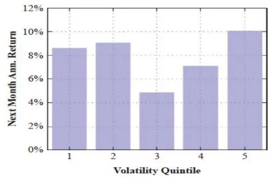
数据来源：Harvey et al(2018),国泰君安证券研究

图2：当月波动率 VS 下一月波动率（股票）
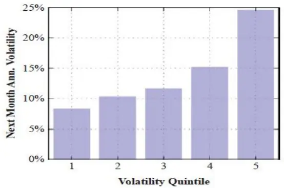
数据来源：Harvey et al(2018),国泰君安证券研究

表 2 展示了目标波动率应用于股票组合的回测结果，对应回测时期为1927-2017。我们使用指数加权的方式计算波动率预测，并分别列示不同加权方法对应的回测结果。

波动率加权的股票组合相比固定权重股票组合具有显著的夏普比率提升。相比固定权重股票组合 0.4的夏普比率，各类风险加权组合获得了0.08 至 0.11 不等的夏普比率的提升，这一夏普比例提升对波动率的计算权重选择决策是稳健的。波动率加权组合具有整体更高的平均仓位，原因是这一方法在低风险时期会有更高的权重。此外波动率加权的股票组合在左尾平均损失以及波动率的波动率上都有显著改善。右尾平均收益不出意料的也有所减少。目标波动率的方法会减少左右两侧尾部事件对股票组合的影响。

表 2：目标波动率：股票(1927-2017)

| Scaling | Sharpe Ratio |  | Notional Exposure |  | Vol of Vol | Left Tail |  | Right Tail |  |
| --- | --- | --- | --- | --- | --- | --- | --- | --- | --- |
|  | Gross | Net | Mean | Turnover |  | 1% | 5% | 95% | 99% |
| Unscaled | 0.40 | 0.40 | 52% | 0.00 | 4.6% | –11.4% | –6.9% | 6.3% | 11.8% |
| Scaled (10-day half-life) | 0.48 | 0.48 | 71% | 4.66 | 1.7% | -8.3% | –6.1% | 5.8% | 7.3% |
| Scaled (20-day haf-life) | 0.49 | 0.49 | 70% | 2.39 | 1.8% | -9.0% | -6.4% | 5.8% | 7.3% |
| Scaled (40-day half-life) | 0.50 | 0.50 | 69% | 1.22 | 1.9% | -9.6% | -6.5% | 5.8% | 7.4% |
| Scaled (60-day half-life) | 0.51 | 0.51 | 68% | 0.82 | 2.1% | –9.9% | -6.6% | 5.9% | 7.5% |
| Scaled (90-day half-life) | 0.51 | 0.51 | 67% | 0.56 | 2.2% | -10.1% | -6.7% | 5.9% | 7.7% |

数据来源：Harvey et al (2018),国泰君安证券研究

图3与图4中，我们也对波动率加权股票组合与固定权重组合的时间序列特征进行了描述。波动率加权的股票组合相比固定权重组合在累计收益率上有所提升。而目标波动率改善组合风险属性的效果在图4中展现的淋漓尽致，波动率的波动率由 4.6%大幅下降至 1.8%。波动率加权的组合在时间上具备非常稳定的实现波动率。

图3：股票累计收益率
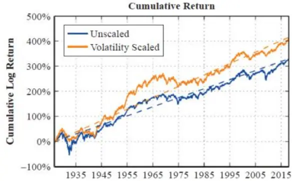
数据来源：Harvey et al(2018),国泰君安证券研究

图 4：股票实现波动率
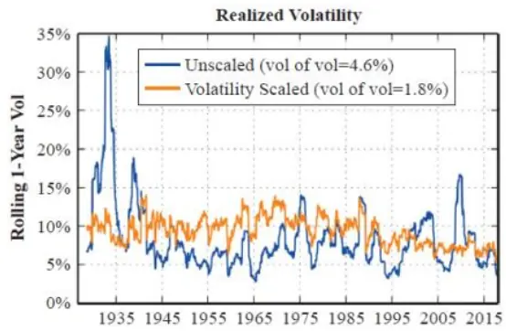
数据来源：Harvey et al(2018),国泰君安证券研究

我们还尝试了使用日内数据进行波动率的估计。结果如表 3 所示。使用5 分钟的日内收益率数据计算的波动率使得波动率加权的股票组合在夏普比率、波动率的波动率以及左尾平均损失都有一定程度的提升。其换手率并没有发生显著的变化。但是这种提升在边际上并不十分明显。

表 3：目标波动率：标普 500 期货(1988-2017)
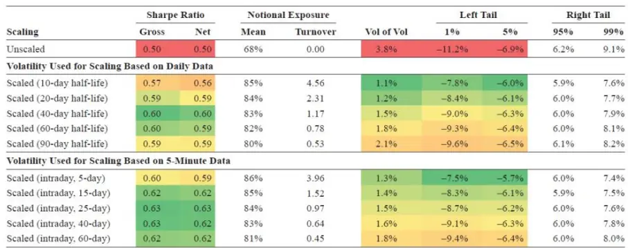
数据来源：Harvey et al (2018),国泰君安证券研究

## 4.2. 其他资产

类似前一章节，我们使用前一月的债券波动率作对时间进行分组，探讨其与下一个月债券收益率以及波动率的关系。波动率聚集的现象在债券中仍然成立。然而与股票的分组结果有所不同的是，债券波动最大的分组对应了下一个月显著更高的收益率。也因此，我们认为目标波动率的方法对债券组合夏普比率的提升可能并不明显。

图5：当月波动率 VS 下一月收益率 （债券）
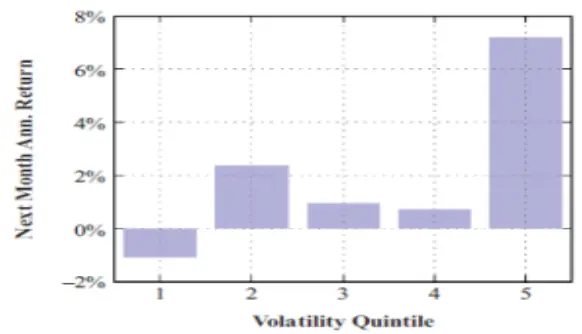
数据来源：Harvey et al(2018),国泰君安证券研究

图 6：当月波动率 VS 下一月波动率（债券）
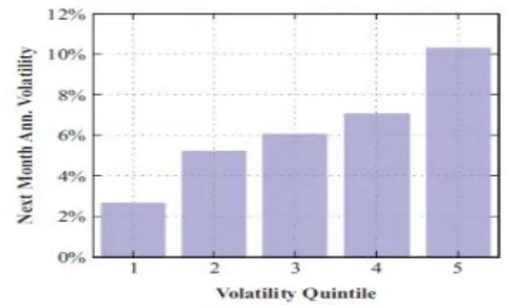
数据来源：Harvey et al(2018),国泰君安证券研究

表4中展示了1963-2017年间波动率加权的债券组合与固定权重的债券组合的比较。与之前的分组分析结果相一致的是，目标波动率的方法使得债券组合的夏普比率出现了显著的下降。这一结果其实也很好理解，1960-1980 年对应了债券市场长期的低波动以及负收益，目标波动率的方法会使得组合在此期间有着更高的组合权重。而与股票结果类似的是，波动率加权的组合具有显著更稳健的风险暴露(更低的波动率的波动率)。

表 4：目标波动率：债券(1963-2017)

| Scaling | Sharpe Ratio |  | Notional Exposure |  | Vol of Vol | Left Tail |  | Right Tail |  |
| --- | --- | --- | --- | --- | --- | --- | --- | --- | --- |
|  | Gross | Net | Mean | Turnover |  | 1% | 5% | 95% | 99% |
| Unscaled | 0.25 | 0.25 | 127% | 0.00 | 3.9% | –8.4% | -5.9% | 7.1% | 11.7% |
| Scaled (10-day half-life) | 0.05 | 0.04 | 180% | 4.96 | 2.1% | –8.6% | -6.3% | 6.0% | 8.2% |
| Scaled (20-day half-life) | 0.06 | 0.06 | 179% | 2.51 | 2.1% | -8.9% | -6.3% | 6.1% | 8.4% |
| Scaled (40-day half-life) | 0.08 | 0.08 | 177% | 1.27 | 2.2% | -9.0% | -6.4% | 6.2% | 8.5% |
| Scaled (60-day half-life) | 0.08 | 0.08 | 174% | 0.86 | 2.4% | –9.2% | -6.4% | 6.2% | 8.5% |
| Scaled (90-day half-life) | 0.09 | 0.09 | 170% | 0.58 | 2.6% | –9.5% | 6.4% | 6.2% | 8.6% |

数据来源：Harvey et al (2018),国泰君安证券研究

观察图7 中的结果，我们可以发现，在1964-1980的债券低波动与收益率同期下行期间，波动率加权的债券组合显著的跑输了固定权重债券组合。然而考虑到在19 世纪80年代中期，美联储发生了货币政策目标的转变(更加稳定物价导向)，我们认为 1988 年后的回测结果可能更能代表当今的债券市场。

图7：债券累计收益率
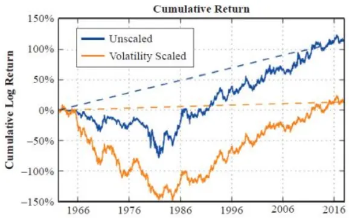
数据来源：Harvey et al(2018),国泰君安证券研究

图8：债券实现波动率
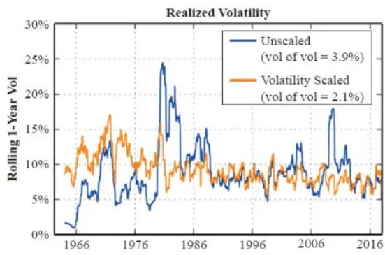
数据来源：Harvey et al(2018),国泰君安证券研究

表 5 展示了自 1988 至 2017 年间使用十年期国债期货进行的回测结果。波动率加权的债券组合与固定权重的债券组合具备类似的夏普比率，但具备更为稳健的风险属性。具体而言，表5中的上半部分对应了使用日频数据估计的波动率进行的目标波动率的管理，而表 5 中的下半部分对应了使用期货日内5分钟收益数据估计的波动率进行的目标波动率的管理。两者在夏普比例以及风险属性等方面都不具备较大的差异。

表5：目标波动率：十年期国债期货(1988-2017)
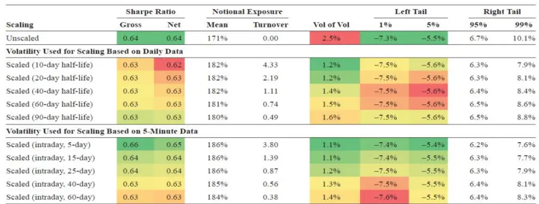
数据来源：Harvey et al (2018),国泰君安证券研究

我们将注意力转移到以商品、货币、股票、信用等等资产为标的资产的期货与远期合约上，所有资产最终以美元计价。参考图9中的回测结果，我们发现，目标波动率的方法可以有效提升股票与信用资产的夏普比率，而对于其他资产则效果甚微。而对于所有的资产，目标波动率的方法可以有效减少波动率的波动率以及左尾回撤。

图 9：目标波动率：各类期货(1988-2017)
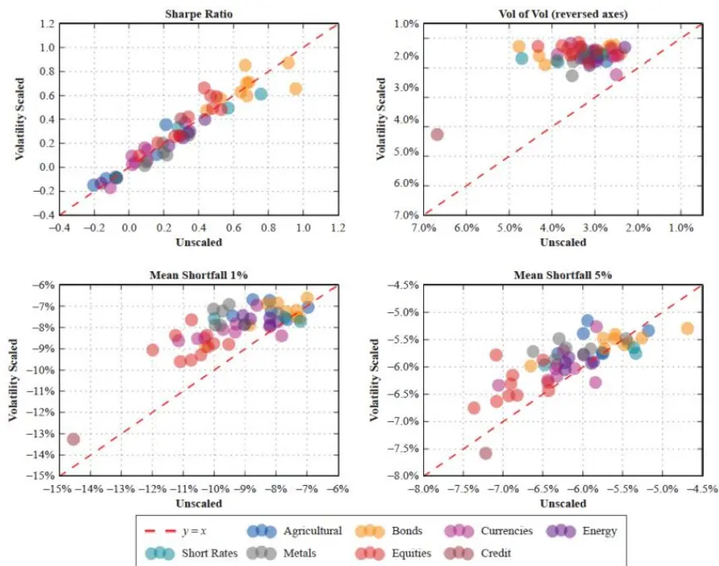
数据来源：Harvey et al (2018),国泰君安证券研究

## 4.3. 多资产

到目前为止，我们仅仅考虑了对单一资产使用目标波动率的方法。在本节中，我们考察目标波动率的方法在股债均衡组合以及多资产风险平价组合(股票、债券、商品、信用)的应用效果。我们比较以下三种组合的表现：

1. 不使用波动率加权

2. 仅对组合内资产进行波动率加权

3. 对组合内资产以及组合都进行波动率加权表6中展示了将目标波动率应用于60/40股债组合中的效果。波动率加权组合的夏普比率、波动率的波动率以及左尾回撤都有显著改善。对组合内资产进行波动率加权以及对组合进行波动率加权对上述三种绩效指标边际上都有所提升。

表 6：目标波动率：均衡股债组合(1988-2017)

| Asset Scaling | Portfolio Scaling | Sharpe Ratio |  | Notional Exposure |  |  | Left Tail |  | Right Tail |  |
| --- | --- | --- | --- | --- | --- | --- | --- | --- | --- | --- |
|  |  | Gross | Net | Mean | Turnover |  | Vol of Vol 1% | 5% | 95% | 99% |
| Unscaled | Unscaled | 0.80 | 0.80 | 153% | 0.00 | 3.4% | –9.7% | –6.0% | 6.8% | 9.7% |
| Scaled (20-day half-life) | Unscaled | 0.87 | 0.87 | 179% | 2.24 | 2.2% | -8.0% | –5.6% | 6.6% | 8.7% |
| Scaled (20-day half-life) | Scaled (20-day half-life) | 0.91 | 0.90 | 183% | 3.95 | 1.3% | –7.3% | –5.5% | 6.5% | 8.0% |

数据来源：Harvey et al (2018),国泰君安证券研究

观察图10以及图11可以发现，在使用了目标波动率的方法后，均衡组合的累计收益率有小幅跑赢，方法对于波动率所具备的稳定暴露仍然是最大的亮点。

图10：股债均衡组合累计收益率
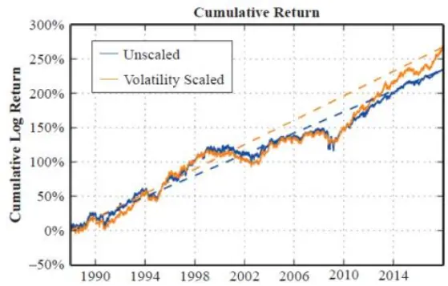
数据来源：Harvey et al(2018),国泰君安证券研究

图11：股债均衡组合实现波动率
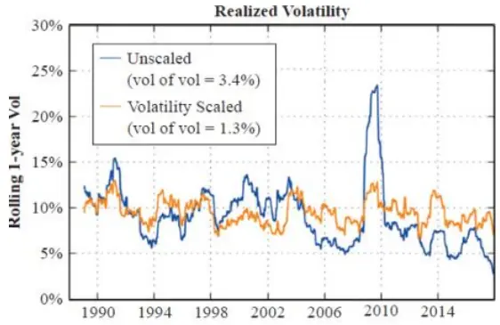
数据来源：Harvey et al(2018),国泰君安证券研究

总结本章的内容，我们发现目标波动率可以有效改善所有资产的风险属性，这是由于波动率所具备的聚集现象所导致的。但是目标波动率仅能对股票以及信用等风险资产的夏普比率有所提升，其中的原因又是为何呢？

## 5. 为何目标波动率可以提升风险资产夏普比率

在这一章中，我们探讨目标波动率为何对风险资产(股票、信用)的夏普比率有所提升，但对其他资产的夏普比率并无显著影响。我们认为这一现象可能由以下三点导致：

1. 仅有风险资产在实证中具备杠杆效应(Leverage Effect)的现象

2. 杠杆效应的存在为目标波动率引入了动量暴露

3. 动量历史上优异的表现有助于组合夏普比率的提升

股票与信用资产所具备的杠杆效应在于资产收益率与同期波动率之间具备负相关的关系。对这一现象最为经典的解释是 Black(1976)认为负的股票收益率导致了代表公司杠杆的债务股权比率随之上升，资本结构的变化导致了公司风险的增大以及股票波动率的提高。观察图 12，我们也确实发现，各类资产中仅有股票与信用资产具备明显的杠杆效应。

图12：各类资产的杠杆效应
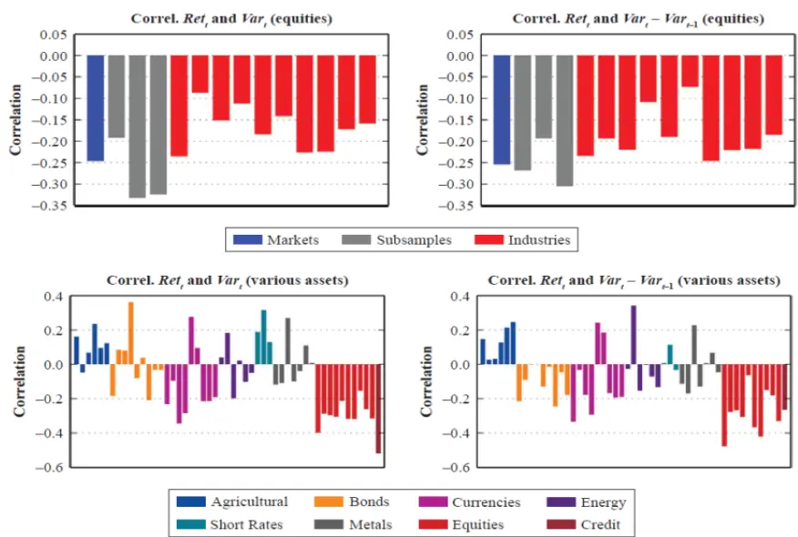
数据来源：Harvey et al (2018),国泰君安证券研究

对于具备杠杆效应的资产，目标波动率的方法有效的引入了动量暴露。负的资产收益率导致了波动率的更大上升从而带来了更低的资产仓位，反之正的波动率带来更小的波动率上升从而带来了更高的资产仓位。图13中的实证结果也印证了我们的猜想，对于具备杠杆效应的股票与信用资产，动量信号与波动率信号之间具备显著的正相关关系。目标波动率为具备杠杆效应的资产引入了动量暴露。

图13：各资产历史收益与1/Vol相关性
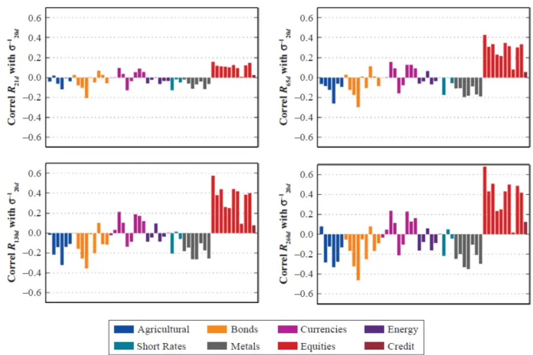
数据来源：Harvey et al (2018),国泰君安证券研究

Hamill, Rattray & Van Hemert(2016)等文献都记载了时间序列动量策略在历史上具备的优良表现。观察图 13 中的实证结果我们发现，目标波动率所带来的动量暴露与资产夏普比例的提升存在显著的正相关关系。当目标波动率为某一类产引入了更多的时间序列暴露时，目标波动率对改资产的夏普比率将具备更大的提升。

图13：各资产历史收益与1/Vol相关性
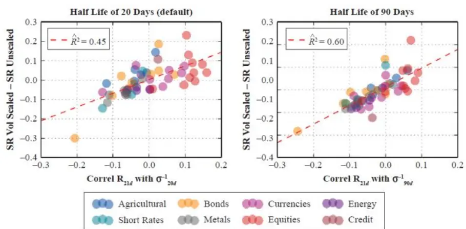
数据来源：Harvey et al (2018),国泰君安证券研究

## 6. 总结

近期的研究发现了目标波动率(Volatility Targeting)可以提升股票组合的夏普比例。我们的研究发现目标波动率的这一效果仅适用于风险资产(股票与信用)而对其他资产并不成立。也就是说目标波动率的方法对于固定收益、货币以及商品资产的夏普比率的影响微乎其微。

与夏普比率一样，其他投资者关注的投资目标也同样重要。我们发现目标波动率可以有效改善所有资产受极端收益的影响(波动率的波动率)。考虑到在针对相同夏普比率的策略比较中，投资者会更为倾向于具备更小回撤的策略，这使得目标波动率的方法对于各类资产的投资者都具备使用价值。

尽管我们对目标波动率在多达 60 类资产中的效果进行了检测，但是相关的很多结果都与本文目标并没有直接相关。我们只选取三点进行评论。

首先，本文中的实证结果依赖于美国股票与债券市场的历史表现。需要提及的是，从事后的角度来看，美国是经济增长中的“胜利者”。在很长的一段时间内，美国经济持续增长，并且没有在本土开展任何一场战争。这一点对于债券资产尤为重要，当政府的信誉受到投资者质疑时，债券也会开始展现出一些信用资产的特征。此时目标波动率的方法极有可能可以提升债券资产的夏普比率。

其次，除本文集中讨论的目标波动率外，还有其他的方法可以有效管理多头组合的风险。Hamill, Rattray, & Van Hemert(2016)发现趋势跟随策略也可以有效的改善组合风险属性。

最后，本文中我们探索了使用日内数据进行波动率的估计，我们认为这只是粗浅的涉及这一课题。越来越多的资产开始具备品质优良的日内收益率数据。一些更先进的计量方法也可以有效提升波动率的估计精度。读者可参考 Noureldin, Shephard,& Sheppard(2012)中的多维高频波动率模型。

# 本公司具有中国证监会核准的证券投资咨询业务资格

## 分析师声明

作者具有中国证券业协会授予的证券投资咨询执业资格或相当的专业胜任能力，保证报告所采用的数据均来自合规渠道，分析逻辑基于作者的职业理解，本报告清晰准确地反映了作者的研究观点，力求独立、客观和公正，结论不受任何第三方的授意或影响，特此声明。

## 免责声明

本报告仅供国泰君安证券股份有限公司（以下简称“本公司”）的客户使用。本公司不会因接收人收到本报告而视其为本公司的当然客户。本报告仅在相关法律许可的情况下发放，并仅为提供信息而发放，概不构成任何广告。

本报告的信息来源于已公开的资料，本公司对该等信息的准确性、完整性或可靠性不作任何保证。本报告所载的资料、意见及推测仅反映本公司于发布本报告当日的判断，本报告所指的证券或投资标的的价格、价值及投资收入可升可跌。过往表现不应作为日后的表现依据。在不同时期，本公司可发出与本报告所载资料、意见及推测不一致的报告。本公司不保证本报告所含信息保持在最新状态。同时，本公司对本报告所含信息可在不发出通知的情形下做出修改，投资者应当自行关注相应的更新或修改。

本报告中所指的投资及服务可能不适合个别客户，不构成客户私人咨询建议。在任何情况下，本报告中的信息或所表述的意见均不构成对任何人的投资建议。在任何情况下，本公司、本公司员工或者关联机构不承诺投资者一定获利，不与投资者分享投资收益，也不对任何人因使用本报告中的任何内容所引致的任何损失负任何责任。投资者务必注意，其据此做出的任何投资决策与本公司、本公司员工或者关联机构无关。

本公司利用信息隔离墙控制内部一个或多个领域、部门或关联机构之间的信息流动。因此，投资者应注意，在法律许可的情况下，本公司及其所属关联机构可能会持有报告中提到的公司所发行的证券或期权并进行证券或期权交易，也可能为这些公司提供或者争取提供投资银行、财务顾问或者金融产品等相关服务。在法律许可的情况下，本公司的员工可能担任本报告所提到的公司的董事。

市场有风险，投资需谨慎。投资者不应将本报告作为作出投资决策的唯一参考因素，亦不应认为本报告可以取代自己的判断。
在决定投资前，如有需要，投资者务必向专业人士咨询并谨慎决策。

本报告版权仅为本公司所有，未经书面许可，任何机构和个人不得以任何形式翻版、复制、发表或引用。如征得本公司同意进行引用、刊发的，需在允许的范围内使用，并注明出处为“国泰君安证券研究”，且不得对本报告进行任何有悖原意的引用、删节和修改。

若本公司以外的其他机构（以下简称“该机构”）发送本报告，则由该机构独自为此发送行为负责。通过此途径获得本报告的投资者应自行联系该机构以要求获悉更详细信息或进而交易本报告中提及的证券。本报告不构成本公司向该机构之客户提供的投资建议，本公司、本公司员工或者关联机构亦不为该机构之客户因使用本报告或报告所载内容引起的任何损失承担任何责任。

## 评级说明

## 1.投资建议的比较标准

投资评级分为股票评级和行业评级。

以报告发布后的12个月内的市场表现为比较标准，报告发布日后的 12个月内的公司股价（或行业指数）的涨跌幅相对同期的沪深 300 指数涨跌幅为基准。

## 2.投资建议的评级标准

报告发布日后的 12 个月内的公司股价（或行业指数）的涨跌幅相对同期的沪深 300 指数的涨跌幅。

|  | 评级 说明 |  |
| --- | --- | --- |
| 股票投资评级 | 增持 | 相对沪深 300指数涨幅15%以上 |
|  | 谨慎增持 | 相对沪深300指数涨幅介于5%～15%之间 |
|  | 中性 | 相对沪深300指数涨幅介于-5%～5% |
|  | 减持 | 相对沪深300指数下跌5%以上 |
| 行业投资评级 | 增持 | 明显强于沪深300指数 |
|  | 中性 | 基本与沪深300指数持平 |
|  | 减持 | 明显弱于沪深300指数 |

## 国泰君安证券研究所

|  | 上海 | 深圳 | 北京 |
| --- | --- | --- | --- |
| 地址 | 上海市静安区新闸路669号博华广场 20层 | 深圳市福田区益田路 6009 号新世界 商务中心34层 | 北京市西城区金融大街甲9号金融 街中心南楼18层 |
| 邮编 | 200041 | 518026 | 100032 |
| 电话 | (021)38676666 | (0755)23976888 | (010)83939888 |
|  | E-mail: gtjaresearch@gtjas.com |  |  |