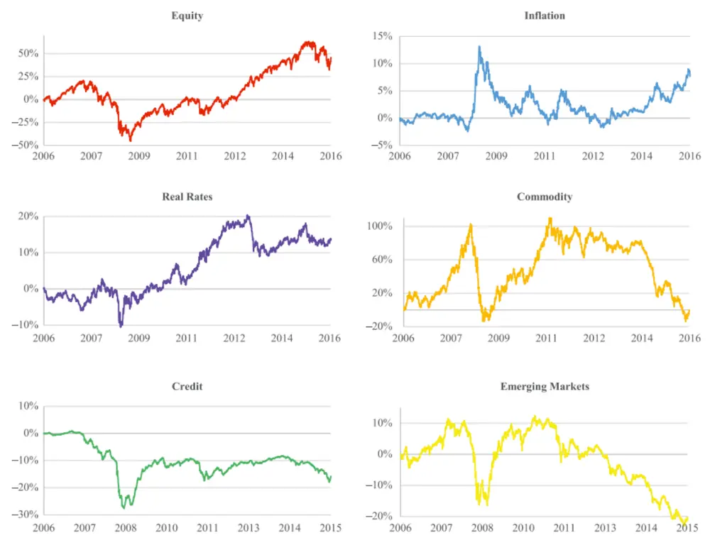
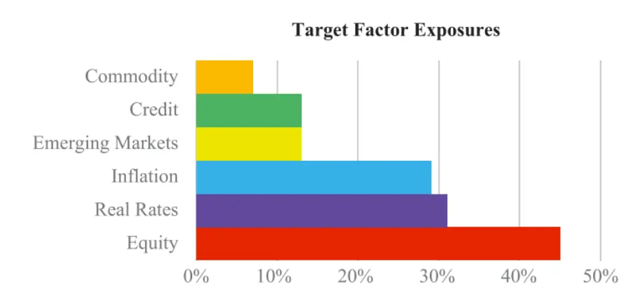
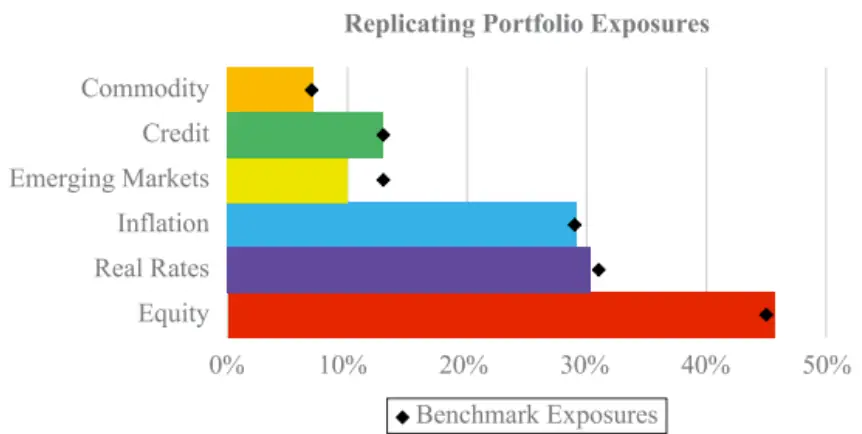
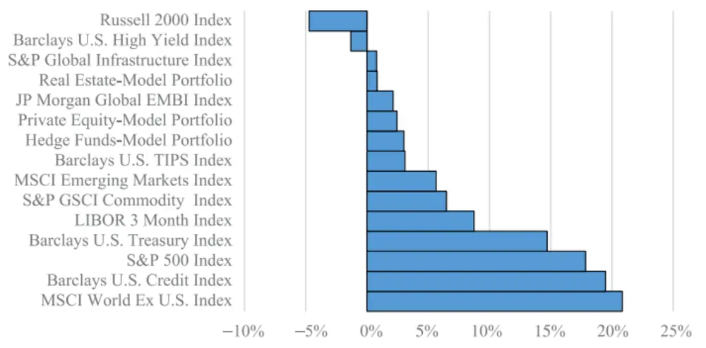
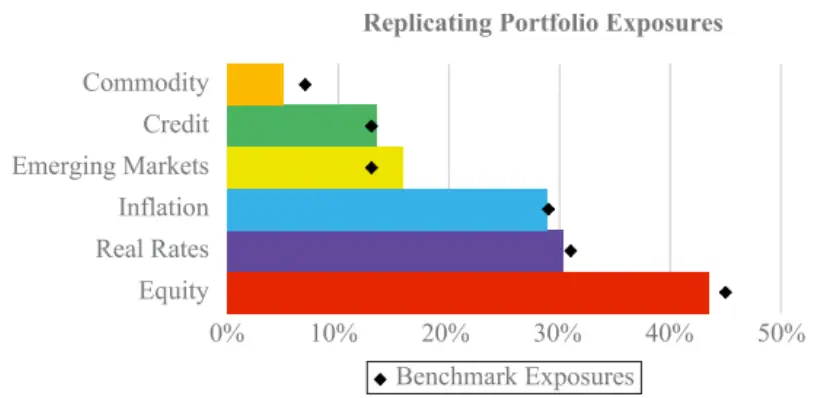
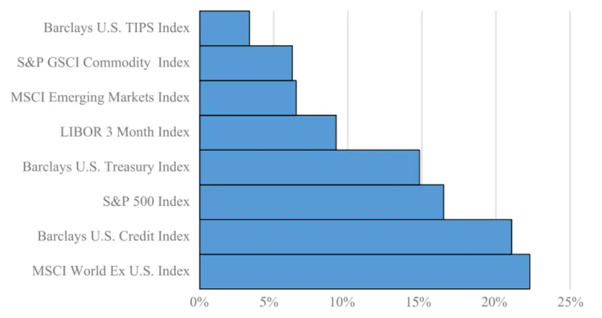
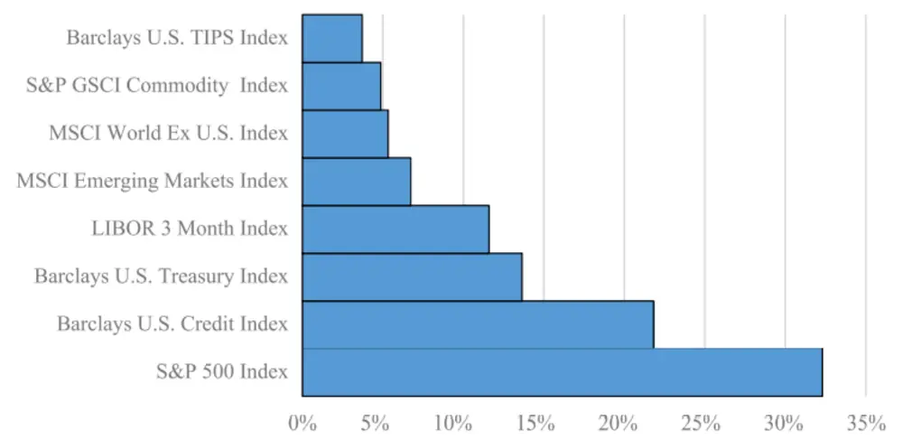
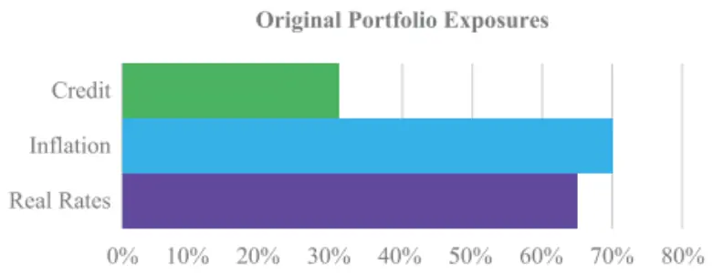
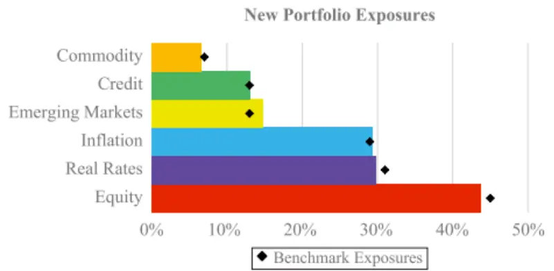
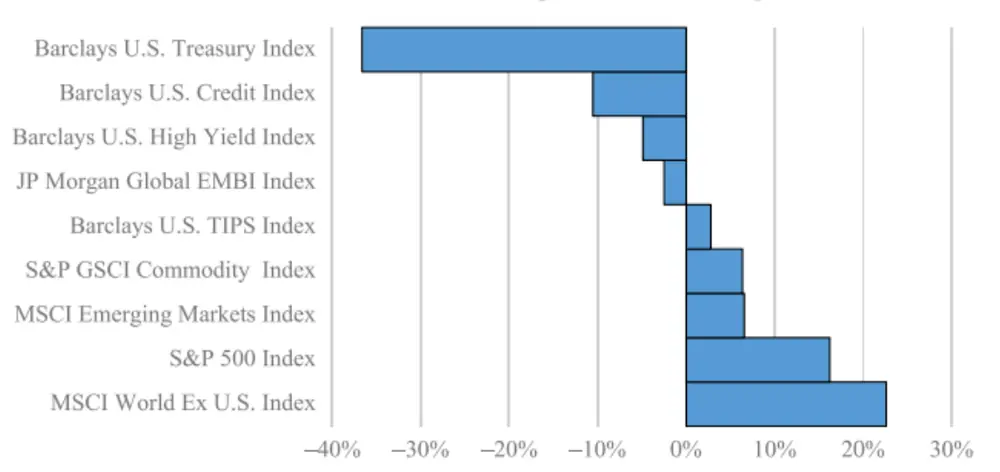

[Table_Title2021.04.06

# 从因子暴露到资产配置的映射

## ——精品文献解读系列（九）

## 本报告导读：

本篇报告解读的文献提出了一种将因子暴露映射到资产配置的方法，同时还考虑了现实投资的约束条件。本文提出的方法框架是通用的，投资者可以以此为基础实现基于因子的资产配置策略。

## 摘要：

le_Summary]投资学是一门学术界与业界紧密结合的学科，其中大类资产配置是这种紧密结合的代表。从Markowitz（1952）开创现代投资组合理论开始，学术界为业界提供了丰富的理论参考和方法模型，推动了大类资产配置实践的繁荣发展。为了帮助读者及时跟踪学术前沿，我们推出了“精品文献解读”系列报告，从大量学术文献中挑选出精品论文进行剖析解读，为读者呈现大类资产配置领域最新的思路和方法。

本篇为读者解读的文献是 Greenberg（2016）在期刊 Journal ofPortfolio Management 上发表的论文“Factors to Assets: MappingFactor Exposures to Asset Allocations”。

本文提出了一种将因子暴露映射到资产配置的方法，同时还考虑了现实投资的约束条件。具体来说，本文通过最优化方法构建一个投资组合，使其在满足投资约束的条件下，因子风险暴露和主动风险与目标配置的差异最小。其中，约束条件包括做空限制、最小交易规模限制、交易费用比率限制、资产类别限制、非流动资产持有限制、主动风险和换手率限制等。

在因子层面进行配置可以更好地实现多样化，有效提高投资组合的风险收益特征。本文作者供职于 BlackRock，为我们介绍了他们将因子暴露映射到资产配置的思路方法。不同于主成分分析（PCA）和构建因子模拟投资组合（factor mimicking portfolio），本文通过最优化目标函数并且施加约束条件的方法，得到最优资产配置方案。本文所提出的方法框架是通用的，投资者可以根据投资经验和实际情况自行设置待配置资产、因子种类以及因子基准，同时添加投资约束条件。

大类资产配置研究

## or] 报告作者

李祥文(分析师)

8 021-38031560

lixiangwen@gtjas.com

证书编号 S0880520100001

王瑞韬(研究助理)

8 021-38038208

wangruitao@gtjas.com

证书编号 S0880121010024

## cReport] 相关报告

将“碳中和”理念纳入投资框架

2021.04.05

目标波动率的效果

2021.03.29

投资组合优化：理论与实践的差异 2021.03.23

战略再平衡

2021.03.15

美债利率对资产配置策略的影响2021.03.08

## 1. 文献概述

## 文献来源：

Greenberg, David, Abhilash Babu, and Andrew Ang. "Factors to Assets: Mapping Factor Exposures to Asset Allocations." Journal of Portfolio Management. 42.5(2016):18-27.

## 文献摘要：

本文提出了一种将因子暴露映射到资产配置的方法，同时还考虑了现实投资的约束条件。具体来说，我们通过最优化方法构建一个投资组合，使其在满足投资约束的条件下，因子风险暴露和主动风险与目标配置的差异最小。其中，约束条件包括做空限制、最小交易规模限制、交易费用比率限制、资产类别限制、非流动资产持有限制、主动风险和换手率限制等。

## 文献评述：

在因子层面进行配置可以更好地实现多样化，有效提高投资组合的风险收益特征。本文作者供职于 BlackRock，为我们介绍了他们将因子暴露映射到资产配置的思路方法。不同于主成分分析（PCA）和构建因子模拟投资组合（factor mimicking portfolio），本文通过最优化目标函数并且施加约束条件的方法，得到最优资产配置方案。本文所提出的方法框架是通用的，投资者可以根据投资经验和实际情况自行设置待配置资产、因子种类以及因子基准，同时添加投资约束条件。

## 2. 引言

现代资产定价理论的范式是将资产的预期收益表示为一个或多个系统性风险因子的组合（Sharpe，1964；Lintner，1965；Ross，1976），但是投资组合优化过程通常直接给出资产类别的配置比例，而不是因子的配置比例。导致这种实践与理论脱节的部分原因是，目前还没有将因子暴露映射到资产配置的标准方法。

本文提出了一种将因子暴露映射到资产配置的方法。通常来说，因子数量少于资产种类，所以这种映射不是唯一的。我们的贡献在于将一组给定的因子暴露表示为特定的资产组合，这个资产组合具有相似的风险敞口，同时可以反映投资者的实际约束。简单来说，我们可以构建一个资产组合，使其在实际投资约束条件下与目标因子暴露的差异最小。这些约束条件包括杠杆率、资产的最大/最小头寸、非流动性资产与流动性资产比例、主动风险、换手率等。实际上，正是这些约束条件最终确定了唯一的最优资产配置方案。

与配置资产类别相比，直接配置因子有如下几个优点：首先，因子投资直接阐明了影响风险和收益的关键驱动因素。在2008年至2009年金融危机期间，许多按照资产类别进行分散配置的投资者承受了超出预期的亏损，这是因为他们并没有深入考虑资产背后的潜在风险（Ang，2014）。

其次，使用因子可以在进行资产配置时更加灵活。如果按照资产类别进行分类，那么上市股票和私募股权是两类不同的资产，但是从因子投资角度来看，二者均受到成长风险（growth risk）因子的影响。将成长因子映射到资产，可以使得投资者同时配置这些不同的资产类别。因此，通过将因子映射到资产，投资者可以专注于选择希望暴露的风险因子，进而获得长期的风险溢价。

从现有文献来看，我们的方法与因子模拟投资组合（factor-mimickingportfolios）方法（Chen，Roll and Ross,1986）相仿。实际上，最快捷的配置方法就是直接投资因子模拟投资组合。但是，这么做在实际投资中往往会碰到诸多问题：因子是不可交易的，比如经济增长（economicgrowth）因子；某些资产的流动性极差，比如私人市场资产（privatemarket assets）；某些资产无法定期对其进行准确的定价；有时候有些因子无法表示为资产的函数。我们的方法可以解决这些问题，能够构建最接近目标因子暴露的资产组合。

我们的方法与 Asl and Etula（2012）最为类似。Asl and Etula（2012）将风险因子映射到宏观经济因子，进而解决了均值-方差稳健最优化的问题。但是，他们仅仅考虑了投资者的收益和风险假设，而没有考虑其它投资约束问题。

本文假设投资者已经确定了最优目标因子配置，我们将聚焦于在考虑现实约束的情况下，如何通过构建投资组合来实现因子配置。

## 3. 因子和资产类别

为了阐述我们的方法，本文使用宏观因子和一系列资产进行研究。其中，资产类别的数量多于因子的数量，各类资产的收益率是宏观因子的线性函数。当然，我们的例子只是为了阐述方法，在实际应用中可以选取任意数量的因子和资产类别。

## 宏观因子

我们选用6种宏观经济因子，包括权益、实际利率、信用、通胀、新兴市场和大宗商品。这些宏观经济因子是全球性的，涵盖了所有资产类别的主要风险驱动因子。而且这些因子非常直观，经常被机构投资者用来分析和构建投资组合。图1详细说明了宏观因子的概念和所使用的代理变量。

图1：宏观因子

| Equity | Risk associated with global equity markets Broad-market equity index returns |
| --- | --- |
| Inflation | Risk of bearing exposure to changes in nominal prices Return of long nominal government bonds, short inflation-linked bonds portfolio |
| Real Rates | Risk of bearing exposure to real interest rate changes Inflation-linked bond returns |
| Commodity | Risk associated with commodity markets Weighted commodity index returns |
| Credit | Risk of default or spread widening Return of long corporate bonds, short nominal government bonds portfolio |
| Emerging Markets | Risk that emerging sovereign governments will change capital market rules Return of long EM equity and short DM equity, EM CDX, and EM FX |

数据来源：Greenberg（2016）

图2展示了 6 种宏观经济因子的历史累计收益率情况。这些因子在商业周期的不同阶段表现出了不同程度的波动性和收益率。从图中可以看到，从2014年开始，大宗商品和新兴市场出现了明显下跌。在2015年，通货膨胀因子实现了稳定的收益回报。

图2：宏观因子的累计收益（2006 年2 月至 2016 年2 月）

数据来源：Greenberg（2016）

## 投资范围

我们将投资范围设置为 15 种资产类别，如图 3 所示。所有收益回报均以美元计价。可以将资产i的回报率表示为宏观因子 $f_{j}$ 的标准线性因子模型，如式（1）所示：

$$
r_{i}=\alpha_{i}+\textstyle\sum b_{j}f_{j}+\epsilon_{i}\tag{1}
$$

我们假设式（1）中的 $\alpha_{i}$ 为零，然后使用约束性逐步回归来估计宏观因子的风险敞口。约束条件主要通过经济金融经验来设定，比如，权益的因子模型中通常不包含信用因子。

因子模型的应用场景有很多，包括基准测试（度量未由风险因子解释的超额收益α）、风险管理和分析（度量因子负荷）或因子选择（度量回归拟合度）。本文使用因子模型，是为了找出在特定约束条件下用投资组合表示因子暴露的最佳方案。

图3：待配置资产类别

| Asset Class | Index Proxy |
| --- | --- |
| U.S. Large Cap | S&P 500 |
| U.S. Small Cap | Russell 2000 |
| Int'l Developed Equity | MSCI World Ex-US |
| EM Equity | MSCI Emerging Markets |
| Treasuries | Barclays Treasury |
| Credit | Barclays Credit |
| TIPS | Barclays TIPS |
| EM Fixed Income | JP Morgan EMBI |
| High Yield | Barclays High Yield |
| Commodities | S&P GSCI Commodity |
| Private Equity | Model Portfolio |
| Hedge Funds | Model Portfolio |
| Real Estate | Model Portfolio |
| Infrastructure | S&P Global Infrastructure Index |
| Cash | LIBOR 3 Month Index |

数据来源：Greenberg（2016）

## 4. 从因子映射到资产

## 目标因子暴露

我们选择一组特定的因子暴露目标，如图4所示，并将其作为因子基准（factor benchmark）。在本文所给示例中，因子基准设定为由贝莱德解决方案公司（BlackRock Solutions）提出的全球资本市场投资组合的因子敞口。当然，因子基准的选择因人而异，本文采用此因子基准仅仅是为了说明配置方法。

接下来我们将详细说明如何用一系列风险等价投资组合来表示因子基准，同时满足相应的投资约束条件。

图 4：目标因子暴露

数据来源：Greenberg（2016）

## 目标函数

我们有 15 类待配置资产和 6 种宏观经济因子，理论上可以构建无数多个与因子基准风险暴露相匹配的资产组合。本文在优化过程中施加了一系列投资约束，使得我们可以在可行的投资范围内构建匹配因子基准风险暴露的投资组合。

我们构建的目标函数如式（2）所示，通过最优化目标函数可以确定资产配置权重。该目标函数最小化因子基准风险暴露偏离的平方，并对投资组合相对于因子基准的主动风险（active risk）进行惩罚，惩罚系数为 λ。较大的 λ 表示投资者更加厌恶风险暴露偏移，同时还能够有效地将非宏观经济因子（如行业因子）暴露的波动降至最小。主动风险项保证了因子暴露不是通过在某个资产上进行极端仓位配置而得到。投资者可以根据自己偏好灵活设置λ。

假设有N种资产，K种因子，目标函数如式（2）所示：

$$
\begin{array}{r}{argmin_{w_{p}}(1-\lambda)\big({w}_{p}^{T}A-e_{b}^{T}\big)\big({w}_{p}^{T}A-e_{b}^{T}\big)^{T}+}\\{\lambda\big({w}_{p}^{T}A-e_{b}^{T}\big)\textstyle\Sigma\big({w}_{p}^{T}A-e_{b}^{T}\big)^{T}+\lambda{w}_{p}^{T}Q{w}_{p}}\end{array}\tag{2}
$$

约束条件为：

$$
\begin{array}{c}{w_{p}^{T}\mathbf{1}=1}\\{w_{i}\ge0\left(i=1,\dots,N\right)}\\{w_{i}\ge w_{min},ifw_{i}\ne0\left(i=1,\dots,N\right)}\\{l_{j}\le w_{p}^{T}\pi_{j}\le u_{j}\left(j=1,\dots,M\right)}\end{array}
$$

其中，

$w_{p}=N$ 类资产的权重向量

$\pmb{A}=[\pmb{a}_{1},\dots,\pmb{a}_{k}]=$ 资产因子暴露的N∗K阶矩阵

Σ = 因子的K∗K阶协方差矩阵

Q = 证券特质风险的N∗N阶协方差矩阵

$$
e_{b}=\boxed{\pm}\neq\pm\sqrt{\pm}\sqrt{\pm}\sqrt{\pm}\sqrt{\pm}\sqrt{\pm}\sqrt{\pm}\sqrt{\pm}\sqrt{\pm}\sqrt{\pm}\sqrt{\pm}\sqrt{\pm}
$$

$$
\lambda=\pm\frac{1}{2}\pi\vert\stackrel{\sqrt{2}}{\underset{1\leq\frac{1}{2}}{\sum}}\langle\frac{3}{\hbar\eta}\frac{3\sigma}{\vert2\eta\vert}\phi\rangle\ast\frac{1}{2},\quad\stackrel{\sqrt{2}}{\vert2\eta\vert}\pm\frac{1}{2}\pi\vert\stackrel{\sqrt{2}}{\underset{1\leq\frac{1}{2}}{\sum}}\sqrt{2}\ast\frac{3}{\hbar\eta}\frac{4}{\underset{1\leq\frac{1}{2}}{\sum}}(0\leq\lambda\leq1)
$$

$$
w_{min}=4\times5\times4\times5\times4\times5\times4\times5\times4\times5\times2\times4\times5\times4\times5\times4\times5\times4\times5\times4\times5\times4\times5\times4\times5\times4\times5\times4\times5\times4\times5\times4\times5\times4\times5\times2\times5\times4\times5\times2\times5\times4\times5\times5\times5\times5\times5\times5\times5\times5\times5\times5\times5\times5\times5\times5\times5\times5\times5\times5\times5\times5\times5\times5\times5\times5\times5\times5\times5\times5\times5\times5\times5\times5\times5\times5\times5\times5\times5\times5\times5\times5\times5\times5\times5\times5\times5\times5\times5\times5\times5\times5\times5\times5\times5\times5\times5\times5\times5\times5\times5\times5\times5\times5\times5\times5\times5\times5\times5\times5\times5\times5\times5\times5\times5\times5\times5\times5\times5\times5\times5\times5\times5\times5\times5\times5\times5\times5\times5\times5\times5\times5\times5\times5\times5\times5\times5\times5\times5\times5\times5\times5\times5\times5\times5\times5\times5\times5\times5\times5\times55\times5\times5\times5\times5\times55\times5\times5\times5\times55\times5\times5\times5\times5\times55\times5\times55\times5\times55\times5\times55\times55\times5\times55\times55\times55\times5\times55\times55\times5555\times5\times555\times5\times55555\times555\times555555\times555\times5555555\times555555555\times5555555555555555555555555555555555555555555555555555
$$

$$
\pi_{j}=\hbar\hbar\frac{\angle E}{2},\hbar,\hbar\pm\hbar,\hbar\pm\hbar,\hbar\pm\hbar,\hbar\pm\hbar,\frac{\angle}{2}
$$

$$
l_{j}\sharp\circ u_{j}=\pi_{j}\sharp\sharp\mp\sharp\mathbb{R}\neq\mu\perp\mathbb{R}
$$

我们将λ设置为 0.99,表示优化目标是要最小化主动投资组合的波动性。通过实证分析，我们发现该设置可以最大化最优资产配置的准确性和稳健性。我们还通过微扰目标因子暴露、量化投资组合换手率、比较因子暴露不匹配等方法来修正参数。

为了避免本土偏好（home bias），我们假设货币风险在确定最优资产配置之后会被完全对冲，因此在计算主动风险和偏离平方时没有包括货币因子。

表 1 展示了模拟因子投资组合在各种情景下的风险统计情况（4 种情景将在本文第5 节中进行详细介绍）。

表 1：复制投资组合的风险和跟踪误差

| Optimization Framework | Replicating Portfolio Risk(Benchmark Risk: 6.50%) | TrackingError | Macro Factor RiskContribution | Residual RiskContribution |
| --- | --- | --- | --- | --- |
| Unconstrained Scenario | 6.52% | 0.89% | 6.20% | 0.32% |
| Liquid Assets Only | 6.52% | 0.93% | 6.31% | 0.21% |
| Lower-Cost Assets | 6.40% | 0.96% | 6.18% | 0.22% |
| Completion Portfolio | 6.53% | 1.00% | 6.30% | 0.23% |

数据来源：Greenberg（2016）

## 约束条件

投资者可以根据自己的偏好设置构建投资组合的约束条件。按照一般情况下的投资实践，本文设置如下约束：

## 1. 完全投资，且只持有多头仓位

完全投资即要求资产配置权重合计为100%。值得注意的是我们的待配置资产中包含现金或无风险等价资产。除构建完整投资组合（completionportfolio）外，我们还施加了多头仓位约束。

## 2. 最小交易规模约束

我们要求资产在投资组合中的配置比例最小为2.5%，以防出现持有某类资产的仓位极端小的情况。

## 3. 交易费用比率约束

流动性资产的交易费用比率可以从公开交易对手处获取。非流动性资产的交易费用比率我们直接设置为2.5%。

## 4. 资产类别约束

一些委托规定限制了对某些资产类别的配置规模，比如基金投资者通常不允许基金经理过度配置非流动性资产。因此，我们引入了特定的资产类别约束。

## 5. 流动性约束

投资者在构建投资组合时，通常会限制非流动性资产的总规模。我们按照流动性从强到弱，将资产细分为 5级，并对每个层级设置配置约束。

第1级：现金，全球政府债券；

第2级：美国固定收益证券，全球股票，大宗商品；

第3级：新兴市场资产，小市值股票，高收益债券，REITs

第4级：对冲基金，不动产；

第5级：私募股权、基础设施。

## 6. 主动风险约束

投资者可以根据自己偏好来设置外生基准的上限约束。

## 7. 换手率约束

在构建完整投资组合时，我们施加了换手率约束，并放松了多头持仓的限制。

## 5. 实证结果

接下来，我们考虑如下 4种情景的最优化问题：

1. 资产配置权重合计为100%的无约束最优化问题；

2. 只考虑流动性资产，即不包括流动性第 4 级（对冲基金、不动产）和第 5级（私募股权、基础设施）的资产；

3. 只考虑低交易成本资产，即限制整个投资组合的平均交易费用比率；

4. 构建完整投资组合。

在上述这些情景中，我们的目标都是通过构建不同的资产组合来实现目标因子配置。

## 情景1：无约束最优化配置

在这种情景下，我们只要求资产配置权重合计为 100%，而不施加其他任何约束。图5给出了该情景下的因子配置和复制投资组合（replicatingportfolio）。从图中可以看到，复制投资组合的因子暴露与我们的配置目标非常匹配。但是，我们看到复制投资组合中包含一些持有仓位较小的资产。此外，罗素 2000 指数（Russell 2000）和巴克莱美国高收益指数（Barclays us High-Yield index）的配置权重出现了负值。

图5：情景1：无约束最优化配置

Replicating Portfolio Weights

数据来源：Greenberg（2016）

## 情景2：约束非流动资产类别的配置

在这种情景下，我们设置了如下约束：（1）资产在投资组合中的配置比例最小为2.5%；（2）只能持有多头仓位；（3）不再配置非流动性资产类别。

施加这些约束后，可以得到一个更加可行的投资组合配置方案，同时与因子基准依然非常匹配，如图 6所示。在这个投资组合中，每类资产的持有头寸都具有经济意义，而且没有空头仓位。这个结果也说明，我们通过配置流动性资产就可以达到配置目标因子的目的。

Replicating Portfolio Weights
图6：情景2：约束非流动资产类别的配置

数据来源：Greenberg（2016）

## 情景3：约束交易费用比率

在这种情景下，我们设置了如下约束：（1）资产在投资组合中的配置比例最小为2.5%；（2）只能持有多头仓位；（3）投资组合的平均交易费用比率上限设置为0.20%。

施加约束后，交易成本较高的资产类别（比如另类投资等）的配置受到了明显限制，同时，交易成本较低的资产类别（如标普 500 指数）的配置比例明显提高，如图 7所示。从配置结果来看，投资组合的因子风险暴露依然与目标配置非常匹配。

结合前两种情景的优化结果，我们发现能够匹配目标因子暴露的投资组合方案有很多种。最终，我们通过设置一定的约束条件，得到最佳的资产配置方案。

图7：情景3：约束交易费用比率

Replicating Portfolio Weights

数据来源：Greenberg（2016）

## 情景4：构建完整投资组合

投资者可能已经持有一个资产组合，并希望通过构建一个完整投资组合来改变因子风险暴露。为了解决这个问题，可以对最优化框架做一些小的修改，包括将完整投资组合配置权重的总和限制为 0%、管理交易成本等。

我们假设投资者持有巴克莱美国综合债券指数（Barclays U.S.Aggregate Bond Index），并希望将指数因子敞口调整为图 4 所示的目标配置。在调整了配置框架之后，我们得到了最优的资产配置方案，如图8所示。完整投资组合成功地将投资组合的风险敞口与目标因子暴露相匹配。

图8：情景4：构建完整投资组合

数据来源：Greenberg（2016）

## 6. 结论

本文提出了一种将因子暴露映射到资产配置的方法，同时还考虑了现实投资的约束条件。具体来说，我们通过最优化方法构建一个投资组合，使其在满足投资约束的条件下，因子风险暴露和主动风险与目标配置的差异最小。其中，约束条件包括做空限制、最小交易规模限制、交易费用比率限制、资产类别限制、非流动资产持有限制、主动风险和换手率限制等。

## 本公司具有中国证监会核准的证券投资咨询业务资格

## 分析师声明

作者具有中国证券业协会授予的证券投资咨询执业资格或相当的专业胜任能力，保证报告所采用的数据均来自合规渠道，分析逻辑基于作者的职业理解，本报告清晰准确地反映了作者的研究观点，力求独立、客观和公正，结论不受任何第三方的授意或影响，特此声明。

## 免责声明

本报告仅供国泰君安证券股份有限公司（以下简称“本公司”）的客户使用。本公司不会因接收人收到本报告而视其为本公司的当然客户。本报告仅在相关法律许可的情况下发放，并仅为提供信息而发放，概不构成任何广告。

本报告的信息来源于已公开的资料，本公司对该等信息的准确性、完整性或可靠性不作任何保证。本报告所载的资料、意见及推测仅反映本公司于发布本报告当日的判断，本报告所指的证券或投资标的的价格、价值及投资收入可升可跌。过往表现不应作为日后的表现依据。在不同时期，本公司可发出与本报告所载资料、意见及推测不一致的报告。本公司不保证本报告所含信息保持在最新状态。同时，本公司对本报告所含信息可在不发出通知的情形下做出修改，投资者应当自行关注相应的更新或修改。

本报告中所指的投资及服务可能不适合个别客户，不构成客户私人咨询建议。在任何情况下，本报告中的信息或所表述的意见均不构成对任何人的投资建议。在任何情况下，本公司、本公司员工或者关联机构不承诺投资者一定获利，不与投资者分享投资收益，也不对任何人因使用本报告中的任何内容所引致的任何损失负任何责任。投资者务必注意，其据此做出的任何投资决策与本公司、本公司员工或者关联机构无关。

本公司利用信息隔离墙控制内部一个或多个领域、部门或关联机构之间的信息流动。因此，投资者应注意，在法律许可的情况下，本公司及其所属关联机构可能会持有报告中提到的公司所发行的证券或期权并进行证券或期权交易，也可能为这些公司提供或者争取提供投资银行、财务顾问或者金融产品等相关服务。在法律许可的情况下，本公司的员工可能担任本报告所提到的公司的董事。

市场有风险，投资需谨慎。投资者不应将本报告作为作出投资决策的唯一参考因素，亦不应认为本报告可以取代自己的判断。
在决定投资前，如有需要，投资者务必向专业人士咨询并谨慎决策。

本报告版权仅为本公司所有，未经书面许可，任何机构和个人不得以任何形式翻版、复制、发表或引用。如征得本公司同意进行引用、刊发的，需在允许的范围内使用，并注明出处为“国泰君安证券研究”，且不得对本报告进行任何有悖原意的引用、删节和修改。

若本公司以外的其他机构（以下简称“该机构”）发送本报告，则由该机构独自为此发送行为负责。通过此途径获得本报告的投资者应自行联系该机构以要求获悉更详细信息或进而交易本报告中提及的证券。本报告不构成本公司向该机构之客户提供的投资建议，本公司、本公司员工或者关联机构亦不为该机构之客户因使用本报告或报告所载内容引起的任何损失承担任何责任。

## 评级说明

## 1.投资建议的比较标准

投资评级分为股票评级和行业评级。

以报告发布后的12个月内的市场表现为比较标准，报告发布日后的 12个月内的公司股价（或行业指数）的涨跌幅相对同期的沪深 300 指数涨跌幅为基准。

## 2.投资建议的评级标准

报告发布日后的 12 个月内的公司股价（或行业指数）的涨跌幅相对同期的沪深 300 指数的涨跌幅。

|  | 评级 说明 |  |
| --- | --- | --- |
| 股票投资评级 | 增持 | 相对沪深 300指数涨幅15%以上 |
|  | 谨慎增持 | 相对沪深300指数涨幅介于5%～15%之间 |
|  | 中性 | 相对沪深300指数涨幅介于-5%～5% |
|  | 减持 | 相对沪深300指数下跌5%以上 |
| 行业投资评级 | 增持 | 明显强于沪深300指数 |
|  | 中性 | 基本与沪深300指数持平 |
|  | 减持 | 明显弱于沪深300指数 |

## 国泰君安证券研究所

|  | 上海 | 深圳 | 北京 |
| --- | --- | --- | --- |
| 地址 | 上海市静安区新闸路669号博华广场 20层 | 深圳市福田区益田路 6009 号新世界 商务中心34层 | 北京市西城区金融大街甲9号金融 街中心南楼18层 |
| 邮编 | 200041 | 518026 | 100032 |
| 电话 | （021)38676666 | （0755)23976888 | (010)83939888 |
|  | E-mail: gtjaresearch@gtjas.com |  |  |