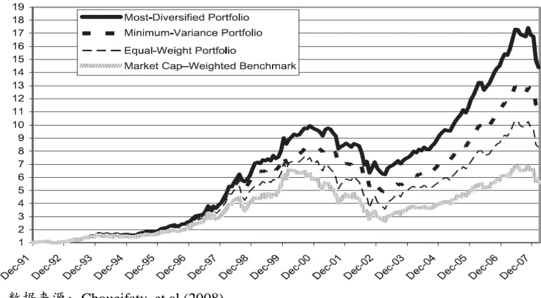
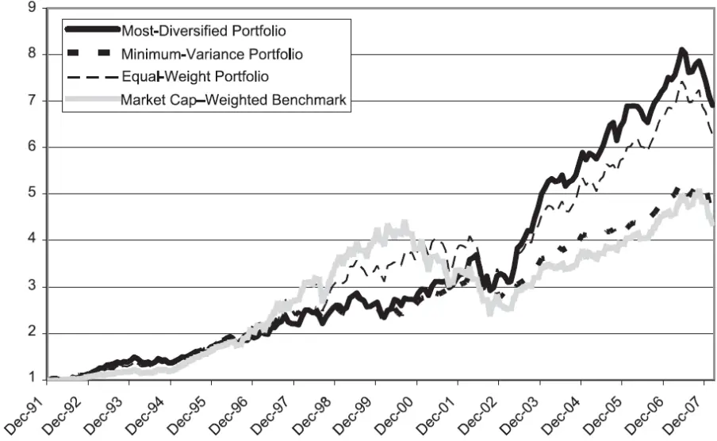
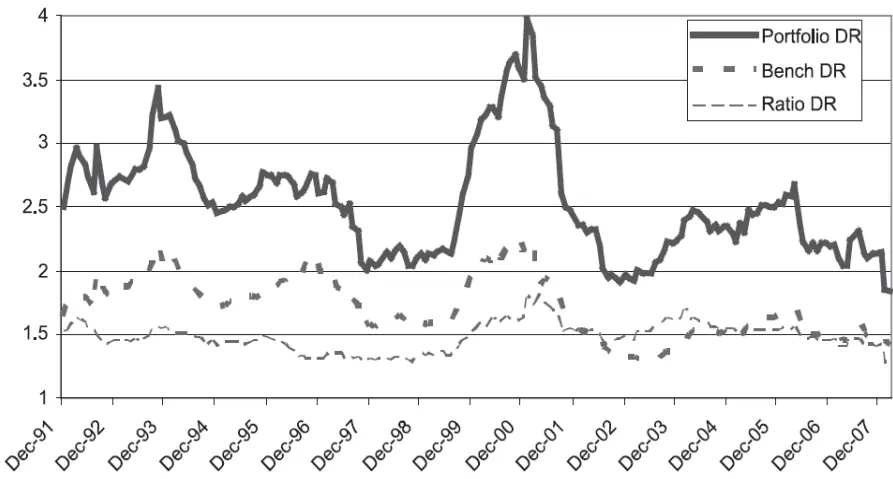

[Table_Title2021.04.13

## 如何理解最大分散度组合

## --精品文献解读系列（十）

## 本报告导读：

本篇报告解读的文献探讨了最大分散度组合对应的理论基础以及实证结果。作者们发现最大分散度组合相比传统市值加权的组合具有显著更好的风险调整收益。优异的表现可能来源于对于风险更有效率的使用。

## 摘要：

le_Summary]投资学是一门学术界与业界紧密结合的学科，其中大类资产配置是这种紧密结合的代表。从Markowitz（1952）开创现代投资组合理论开始，学术界为业界提供了丰富的理论参考和方法模型，推动了大类资产配置实践的繁荣发展。为了帮助读者及时跟踪学术前沿，我们推出了“精品文献解读”系列报告，从大量学术文献中挑选出精品论文进行剖析解读，为读者呈现大类资产配置领域最新的思路和方法。

- 本期为读者解读的文章为 Choueifaty et al 于 2008 年发表于期刊 TheJournal of Portfolio Management 的 文 章 :“Toward MaximumDiversification”。

传统均值方差框架下的组合构建方法依赖于对于资产预期收益率以及协方差矩阵的有效预测。其中资产协方差矩阵相对稳定，基于历史数据可以获得协方差矩阵稳健的预测。而单纯依赖于历史数据无法获得对资产预期收益率的有效预测。实践中投资者往往通过对收益率预测增添结构约束(CAPM、Black-Litterman 等)的方式进行改进。值得注意的是，这些改进方法通常都假设资产市值包含了预期收益率的信息。假设的成立依赖于资本资产定价模型(CAPM)可以有效描述市场均衡状态。而对于并不认可 CAPM 能有效描述市场均衡状态的投资者而言，这类方法的可行性也会存疑。也因此，由 CAPM 以外的理论出发，不依赖于资产市值信息的组合构建方法在投资实践中很有意义。

作者提出了以组合分散度为核心的组合构建方法作为一种新的思路。这一方法基于分散投资是投资中唯一的免费午餐的角度出发，设计了以最大化组合分散度为目标的组合构建方法。这一方法有效的规避了对于预期收益率预测以及对资产市值信息的依赖，而仅仅依靠于协方差矩阵这一可以稳健估计的变量。也因此最大分散度的方法非常稳健，实证中使用不同方法估计协方差矩阵对最大分散度组合的表现没有显著的影响。此外其不依赖于市值信息的特点在中国市场债券等大类资产市值难以确定的环境下也很有实践意义。

作者们发现最大分散度组合相比市值组合、最小方差组合以及等权组合具有更优的夏普比率(更高的收益以及更低的风险)。这很有可能代表了最大分散度组合更为有效的使用了风险，捕捉了更多的资产风险溢价。这一现象发生的原因可能在于使得最大分散度组合最优的假设(资产预期收益率与波动率成比例)相比传统组合构建方式所依赖的假设更贴近市场真实情况。

大类资产配置研究

## or] 报告作者

李祥文(分析师)

8 021-38031560

lixiangwen@gtjas.com

证书编号 S0880520100001

王瑞韬(研究助理)

8 021-38038208

wangruitao@gtjas.com

证书编号 S0880121010024

## cReport] 相关报告

从因子暴露到资产配置的映射

2021.04.07

将“碳中和”理念纳入投资框架

2021.04.05

目标波动率的效果

2021.03.29

投资组合优化：理论与实践的差异 2021.03.23

战略再平衡 2021.03.15

## 1. 文献概述

## 文献来源：

Choueifaty, Y. & Coignard, Y. (2008). Toward maximum diversification. 
The Journal of Portfolio Management, 35(1), 40-51.

## 文章摘要：

近期出现的各类研究尝试从不同角度探索不依赖于资产市值的指数构建方法。本文介绍以分散度为核心的组合构建方法。作者们介绍了一个用于衡量组合分散程度的指标:分散度 (diversification ratio)。并使用该指标构建了一个有效利用风险的最为分散的组合：最大分散度组合(Maximum Diversification Portfolio)。作者将得到的最大分散度度组合的理论性质及实证结果与其他流行的组合(市值加权组合、等全组合以及最小方差组合)进行了对比，发现了最大分散度组合优于这些流行的组合。这一发现的意义在于，长期看，最大分散度组合相比被动跟踪于指数的方法更有可能获得稳健优异的表现。投资者应该注意到最大分散度组合的优势。

## 文章解读：

传统均值方差框架下的组合构建方法依赖于对于资产预期收益率以及协方差矩阵的有效预测。其中资产协方差矩阵相对稳定，基于历史数据可以获得协方差矩阵稳健的预测。而单纯依赖于历史数据无法获得对资产预期收益率的有效预测。实践中投资者往往通过对收益率预测增添结构约束(CAPM、Black-Litterman 等)的方式进行改进。值得注意的是，这些改进方法通常都假设资产市值包含了预期收益率的信息。假设的成立依赖于资本资产定价模型(CAPM)可以有效描述市场均衡状态。而对于并不认可CAPM能有效描述市场均衡状态的投资者而言，这类方法的可行性也会存疑。也因此，由 CAPM 以外理论出发，不依赖于资产市值信息的组合构建方法在投资实践中很有意义。

本文中作者提出了以组合分散度为核心的组合构建方法作为一种新的思路。这一方法基于分散投资是投资中唯一的免费午餐的角度出发，设计了以最大化组合分散度为目标的组合构建方法。这一方法有效的规避了对于预期收益率预测以及对资产市值信息的依赖，而仅仅依靠于协方差矩阵这一可以稳健估计的变量。也因此最大分散度的方法非常稳健，实证中使用不同方法估计协方差矩阵对最大分散度组合的表现没有显著的影响。此外其不依赖于市值信息的特点在中国市场债券等大类资产市值难以确定的环境下也很有实践意义。

结合欧洲与美国股票市场的数据，作者对最大分散度组合(MaximumDiversification Portfolio)表现进行了测算。他们发现最大分散度组合相比市值组合、最小方差组合以及等权组合具有更优的夏普比率(更高的收益以及更低的风险)。这很有可能代表了最大分散度组合更为有效的使用了风险，捕捉了更多的资产风险溢价。这一现象发生的原因可能在于会使得最大分散度组合最优的假设(资产预期收益率与波动率成比例)相比传统组合构建方式所依赖的假设更贴近市场真实情况。

## 2. 前言

分散投资风险是近 50 年来金融学理论研究的核心所在。马科维茨在他划时代的研究(Markowitz, 1952)中提出了均值方差框架下的组合构建方法，并认为，分散投资是金融领域中唯一的免费午餐。此后研究者在这一均值方差的框架下展开了诸多研究。其中最为有名的成果是Sharpe(1964)提出的资本资产定价模型(CAPM)。尽管资本资产定价模型由于其清晰明了的经济内涵而广受认可，这一模型是否可以有效代表市场的真实状况却饱受争议。与之相应，资本资产定价模型相关的结论(市场组合是风险收益最优的切线组合)能否有效应用于组合管理也有待进一步验证。

也因此，其他一部分研究者从与组合动态相关的其他角度探索组合构建的方法。Fernholz & Shay(1982)认为定期调仓至固定权重的组合相比买入并持有组合(Buy-and-Hold)具有更高的收益。Booth & Fama(1992)将固定权重组合更高的收益归因为其更加充分的投资分散。他们的分析更多的是从组合权重固定后的再平衡角度进行，也因此对于组合权重的构建并没有直接的意义。

尽管均值方差的框架是最为传统的构建并理解资产组合的方法，它在实践中面临了诸多挑战。以参数估计为例，稳健的协方差矩阵估计相对容易获得，有效的预期收益率估计却难以获得。投资者通常依赖 CAPM以及Black-Litterman 等模型对预期收益率进行预测。这两种方法从不同角度出发，但都涉及到市值加权的市场组合的信息，或者以市值加权的组合为出发点进行组合构建。除此之外，也存在一些其他经验性的组合构建方法(如:基本面变量加权、等权等)也存在。

在本篇文章中，我们探索以分散度(diversification)为核心指标的组合构建方法。我们将以最大化分散度指标为目标的最大分散度组合和其他常见的指数组合构建方式（市值加权指数、最小方差组合、等权组合等）进行对比。尤其专注于理解最大分散度理论与实证结果上和其他常见组合的差异。

## 3. 分散度与最大分散度组合

我们首先给出组合分散度度量的定义。

假设 $x_{1},\ x_{2},\cdots,\ x_{N}$ 是投资域U中的风险资产。为了简化分析，我们在这里假设x 对应了股票资产。以V 代表风险资产的协方差矩阵，并以C代表了风险资产的相关性矩阵。同时假设 $\Sigma=[\sigma_{1},\sigma_{2},\ldots,\sigma_{N}]^{1}$ 对应了风险资产的波动率向量。

对于任意权重为 $\mathrm{~P~}=\ [w_{p1},w_{p2},\dotsc,w_{pN}]^{T},\dotsc w_{pi}=1$ 的组合，我们定义组合 P 的分散度(diversification ratio) D(P)为公式 1：

$$
\begin{array}{r}{\mathsf{D}(\mathsf{P})=\frac{\mathsf{P}^{\mathrm{T}}\Sigma}{\sqrt{\mathsf{P}^{\mathrm{T}}\mathsf{V}\mathsf{P}}}}\end{array}\tag{1}
$$

组合的分散度以该组合的加权波动率与组合波动率的比值衡量。

再来看最大分散度组合。

以Γ指代在构建组合 P 的优化过程中所使用的线性约束。一个常见的组合约束是禁止做空的约束(此时所有资产权重非负)。我们将在Γ的约束下在投资域 U 中构建的具有最大化分散度的组合称作最大分散度组合(Most Diversified Portfolio)。并以M(Γ, U)代表。

我们使用接下来的两个例子来解释最大分散度组合所对应的经济含义。

## 例子 1

假设我们的投资域由 A 与 B 两个股票构成，他们的相关性小于 1，且分别具有 15%与 30%的年化波动率。在这个例子下，分散投资意味着两只股票对组合波动率有着相等的风险贡献。也因此在A 与B构成的最大分散度组合中，他们的权重分别为 66.6%与 33.3%，与他们的波动率的倒数成比例。

## 例子 2

我们对上述的例子进行更进一步的拓展，假设投资域有三只股票构成。假设其中两只股票同属于银行行业，两者互相之间具有 0.9 的相关性。而第三只股票来自其他行业，与前两只股票分别具有 0.1 的相关性。如果三只股票的波动率相等，则在最大分散度组合中，两只银行股票的权重都为 25.7%，而第三只股票的权重为 48.6%。和其他资产具备最低相关性的第三只股票具有最高的权重。

## 4. 最大分散度组合的特征

## 4.1. 预期收益率与波动率成比例时组合最优

参考分散度的定义，可以发现，任意多头组合的分散度都是大于 1 的。只有当所有资产之间相关性都为0 的时候，组合的分散度指标才有可能等于1。

当资产的预期超额收益率与他们的波动率成比例时(所有的资产具有相同的夏普比率)，最大分散度组合(Most-Diversified Portfolio)就是最优的切线组合(Tangency Portfolio)。此时 $\mathrm{ER}(\mathrm{P})=\mathrm{kP}^{\mathrm{T}}\Sigma$ ，K 是一个常数，最大化分散度的优化等价于最大化夏普比率 $(\frac{ER(P)}{\sqrt{\mathrm{P}^{\mathrm{T}}\mathrm{VP}}})$ 优化。

为了便于更好的理解这一结果，我们简化了数学运算，假设所有股票具有相等的预期波动率。同样假设投资者可以以相等的利率任意去借入或借出资金。使用公式 2 定义合成资产(synthetic asset) $Y_{1}$ , Y2,…, $Y_{N}$

$$
\begin{array}{r}{\mathrm{Y_{i}}=\frac{\mathrm{X_{i}}}{\mathrm{\sigma_{i}}}+(1-\frac{1}{\mathrm{\sigma_{o_{i}}}})\mathrm{r_{f}}}\end{array}\tag{2}
$$

其中 $\boldsymbol{\mathrm{r_{f}}}$ 对应了无风险资 $\dot{\bar{y}}$ 收益。此时我们获得了一个由合成资 $\dot{\bar{y}}$ 构成的新的投资域 $\mathrm{U}_{s}$ 。在这个投资域内，所有资 $\dot{\bar{y}}$ 的波动率 $\sigma_{\mathrm{si}}$ 都等于1，也因此 $\Sigma_{s}=(1,1,\ldots,1)^{T}$

在这一投资域内，由合成资产组成的组合S的分散度可以表达为 $D(S)=$ $\frac{S^{\mathrm{T}}\Sigma_{s}}{\sqrt{S^{\mathrm{T}}\mathsf{V}_{s}S}}$ 。 $V_{s}$ 是合成资 $\dot{\bar{y}}$ 的协方差矩阵。当 $\mathsf{S}^{\mathrm{T}}\Sigma_{s}=1$ 时，最大化 D(S)的优化等价于最大化 $\frac{1}{\sqrt{\mathsf{S}^{\mathrm{T}}\mathsf{V}_{s}\mathsf{S}}}$ 的优化。这是因为所有的合成资产都具有相等的波动率 1，而资 $\dot{\bar{y}}$ 的相关性却不随杠杆的缩放而产生变化。 $\mathrm{V}_{s}$ 与原投资于的相关性矩阵C 是相等的，此时最大化分散度的优化可以写为最小化公式3的优化。

$$
S^{\mathrm{T}}CS\tag{3}
$$

也因此，在一个所有资产具有相等波动率的世界里，最大分散度组合等价于最小方差组合。

而如果把无风险资产也纳入考虑，则此时的最大分散度组合如公式 4：

$$
\begin{array}{r}{M=(\frac{w_{s1}}{\sigma_{1}},\frac{w_{s2}}{\sigma_{2}},\dots,\frac{w_{sN}}{\sigma_{N}},(1-\sum_{i=1}^{N}\frac{w_{si}}{\sigma_{i}}))}\end{array}\tag{4}
$$

其中最后一项对应了组合中投资于无风险资 $\dot{\bar{y}}$ 的权重。

## 4.2. 其他组合特征

当相关性矩阵C可逆，在构建最大分散度组合的过程中没有引入任何约束的情况下，此时 $S=M(\Gamma_{s},U_{s})$ 是唯一存在的，且具有如下式的解析结果

$$
S\propto C^{-1}1\tag{5}
$$

合成资产的权重S 等于相关性矩阵的逆乘以 1向量。我们可以通过使用原资产波动率进行放缩的方式将公式5 转化为原资产的组合：

$$
\mathsf{M}\propto\mathsf{\sigma}^{-1}\mathsf{C}^{-1}\mathsf{1}\tag{6}
$$

接下来我们观察最大分散度组合所能具备的性质。我们可以计算任意一个组合P与最大分散度组合M的相关性，因为M与σ和C是成比例的，我们可以将最大分散度组合M写成如下形式：

$$
\mathsf{M}=\mathsf{k}\sigma^{-1}\mathsf{C}^{-1}\mathsf{1}\tag{7}
$$

此处k是一个常数，则任意一个组合P 与最大分散度组合的相关性可以写作：

$$
\begin{array}{l}{\rho_{P,M}=\frac{P^{T}\sigma C\sigma M}{\sigma_{P}\sigma_{M}}=\frac{P^{T}\sigma C\sigma\operatorname{k}\sigma^{-1}\operatorname{C}^{-1}1}{\sigma_{P}\sigma_{M}}}\\{\ =\frac{\sum_{i}w_{i}\sigma_{i}}{\sigma_{P}}\frac{k}{\sigma_{M}}=D(P)\frac{k}{\sigma_{M}}}\end{array}\tag{8}
$$

参考公式 8 可以发现，任意一个组合 P 与最大分散度组合 M 的相关性和组合P自身的最大分散度 D(P)成比例。

我们再来考虑单只股票与最大分散度组合之间的相关性。单只股票的组合由于并不存在任何分散投资，它的分散度等于 1。参考公式 8，我们可以将单个股票i当作在股票i的权重为1，在其他所有股票权重为 0的组合。则这只股票i与最大分散度组合的相关性为：

$$
\begin{array}{r}{\rho_{i,M}=\frac{k}{\sigma_{M}}}\end{array}\tag{9}
$$

所有单只股票与最大分散度组合之间的相关性都是相等的。也因此最大分散度组合等价于与所有资产相关性都相等的组合。

当P就是最大分散度组合时，可以带入公式8求解常数 k，常数k等于：

$$
\begin{array}{r}{k\mathrm{~=~}\frac{\sigma_{M}}{D(M)}}\end{array}\tag{10}
$$

把k的值带入公式8中，我们可以得到任意组合P与最大分散度组合的相关性:

$$
\begin{array}{r}{\rho_{i,M}=\frac{D(P)}{D(M)}}\end{array}\tag{11}
$$

在获得了任意资产相对最大分散度组合的相关性后，我们可以类比CAPM的方式构建以分散度为单因子的因子模型：

$$
\begin{array}{r}{\mathrm{R_{p}=\alpha\alpha_{p}+\frac{\sigma_{P}}{\sigma_{M}}\frac{D(P)}{D(M)}R_{M}+\varepsilon_{p}}}\end{array}\tag{12}
$$

其中 $\mathrm{R_{p}}$ 代表了组合p 相比现金的超额收益率，而 $\alpha_{\mathrm{p}}$ 与 $\varepsilon_{\mathrm{{p}}}$ 分别代表了由回归得到的常数项以及残差项。

在现实世界中，投资者通常在组合构建中添加约束限制，也因此Γ并不会是空集。禁止空头仓位就是最为常见的线性约束之一。前一节中提及的最大分散度组合所具备的性质也需要更进一步的分析。接下来我们将更为关注多头下的最大分散度组合的性质。

对组合添加禁止做空的约束通常有两个意义。一是通过这一约束来减少预期收益率估计误差对组合的影响。其次使用这一约束可以确保组合具备对股权风险溢价的正的暴露。

此时，最大分散度组合中具有持仓的资产都与最大分散度组合具有相等的相关性。而在最大分散度组合中并没有持仓的资产则与最大分散度组合有着更高的相关性。

当投资域中所有的资产具有相等的波动率时，最大分散度组合等价于最小方差组合。而在现实世界中，投资组合再平衡持续发生的环境下，因为最大分散度组合与资产市值独立，其会获得相比买入并持有组合(buy-and-hold)更高的分散收益(Booth & Fama, 1992)。

## 5. 实证结果

在本章的分析中，我们使用欧洲以及美国的股票数据来分析最大分散度组合的历史表现。尤其我们重点关注最大分散度组合与其他常见组合在收益与特征角度的差异。

## 5.1. 测算方法

在测试最大分散度组合的效果之前，首先需要确定几个问题。我们需要确定投资域内所包含的资产，搜集资产收益率数据，并对资产真实收益率可能会产生影响的拆股、股利以及幸存者偏差的相关信息进行整理。

在获得了干净的收益率数据后，我们首先来估计资产的方差协方差矩阵。市场中广泛使用的方差估计方法包括：滚动样本方差估计、时间加权滚动样本方差估计、GARCH 模型以及多种基于贝叶斯方法的预测模型。尽管估计误差同样存在于方差以及相关性的估计中，研究者通常认为相关性的估计比方差的估计更为稳定。也因此，我们发现基于不同协方差矩阵估计的最大分散度组合具备非常一致的特性。改变用于协方差矩阵估计的数据频率以及估计期间等参数对于最大分散度组合的结果的影响并不明显。甚至使用未来的数据估计协方差矩阵并构建最大分散度组合，结果也并没有与使用历史数据构建的最大分散度组合有很大差异。

有一点需要注意的是，优化器会赋予波动率被低估的因子更高的权重(参考Michaud, 1998)。这对基于有严重多重共线性问题的投资域构建的多空组合的影响时尤为显著的。解决这一问题最简单的方法是给投资组合加上禁止卖空的优化约束。更进一步的给资产添加最大权重上限也有助于减少估计误差对优化组合的影响。

为了便于测试最大分散度组合的历史表现，我们在每个月的月末以公式1 为优化目标构建最大分散度组合，并将组合的历史测算结果与市值加权指数、最小方差组合以及等权组合的测算结果进行对照。我们分别分析了美国以及欧洲市场中最大分散度组合的效果。

针对美国市场，我们使用标普 500 指数自 1990/12 至 2008/2 的日频收益率数据。对于欧洲市场，我们使用道琼斯欧洲大盘指数(Dow JonesEuro Stoxx Large Cap Index)自 1990/12 至 2008/2 的日频收益率。

## 5.2. 最大分散度组合表现更优

表 1 与表 2 分别总结了最大分散度组合在欧洲市场与美国市场的表现。在两个市场中，最大分散度组合都获得了相比其他三类组合更优的风险调整收益。与预期一致，最大分散度组合的风险小于市值加权的指数(欧洲市场波动率 13.9% vs 17.9%, 美国市场波动率 12.7% vs 13.4%)。

为了便于更进一步的分析最大分散度组合在不同的市场情况下的表现，我们还把全样本进一步划分为1992-2000以及2001-2008两个子样本进行表现测算与分析。

图 1：欧洲股票指数回测结果 (1992-2008)

数据来源：Choueifaty et al (2008)

表 1：欧洲股票指数回测结果 (1992-2008)

| Full Period 1992–2008 | MDP | B | MV | EW |
| --- | --- | --- | --- | --- |
| Annualized Return | 17.9% | 11.3% | 16.1% | 14.0% |
| Annualized Excess Return | 13.3% | 6.6% | 11.5% | 9.4% |
| Annualized Volatility | 13.9% | 17.9% | 13.3% | 18.1% |
| Sharpe Ratio | 0.96 | 0.37 | 0.87 | 0.52 |
| 1992-2000 | MDP | B | MV | EW |
| Annualized Return | 28.7% | 21.6% | 26.5% | 24.2% |
| Annualized Excess Return | 22.9% | 15.8% | 20.7% | 18.4% |
| Annualized Volatility | 13.8% | 16.8% | 13.0% | 16.4% |
| Sharpe Ratio | 1.66 | 0.94 | 1.59 | 1.12 |
| 2001-2008 | MDP | B | MV | EW |
| Annualized Return | 5.7% | -0.5% | 4.3% | 2.3% |
| Annualized Excess Return | 2.6% | -3.7% | 1.2% | -0.8% |
| Annualized Volatility | 13.4% | 18.9% | 13.1% | 19.6% |
| Sharpe Ratio | 0.21 | -0.20 | 0.10 | -0.06 |

数据来源：Choueifaty et al (2008)

图 2：美国股票指数回测结果 (1992-2008)

数据来源：Choueifaty et al (2008)

表 2：美国股票指数回测结果 (1992-2008)

| Full Period 1992–2008 | MDP | B | MV | EW |
| --- | --- | --- | --- | --- |
| Annualized Return | 12.7% | 9.6% | 10.1% | 12.0% |
| Annualized Excess Return | 8.4% | 5.2% | 5.8% | 7.7% |
| Annualized Volatility | 12.7% | 13.4% | 9.9% | 14.3% |
| Sharpe Ratio | 0.66 | 0.39 | 0.59 | 0.54 |
| 1992-2000 | MDP | B | MV | EW |
| Annualized Return | 12.4% | 16.1% | 11.6% | 16.1% |
| Annualized Excess Return | 7.3% | 10.9% | 6.5% | 10.9% |
| Annualized Volatility | 11.9% | 13.1% | 10.6% | 13.1% |
| Sharpe Ratio | 0.61 | 0.83 | 0.61 | 0.84 |
| 2001-2008 | MDP | B | MV | EW |
| Annualized Return | 13.0% | 1.9% | 8.3% | 7.1% |
| Annualized Excess Return | 9.8% | -1.4% | 5.0% | 3.8% |
| Annualized Volatility | 13.8% | 13.4% | 9.1% | 15.6% |
| Sharpe Ratio | 0.69 | -0.14 | 0.53 | 0.21 |

数据来源：Choueifaty et al (2008)

需要注意的是，所有不以市值加权的指数相比市值加权指数都会有更小的大市值暴露。为了度量最大分散度组合相比传统市值加权指数的风格偏移，我们对所有4种指数进行 Fama-Macbeth的回归，并在表 3与表 4中分别展示了欧洲股票与美国股票在不同样本内的结果。表中的 HML对应了价值因子，而 SMB对应了市值因子。

表 3 中可以发现，在全样本的 Fama-Macbeth 的回归中，最大分散度组合以 4.14 的 t 统计量获得了 6%的超额收益。最小方差组合的这两个数据分别为3.51以及5.1%。等权组合的这两个数值分别为1.16以及0.6%。

表4中的美国市场的回归结果与欧洲市场的回归结果有所类似，最大分散度组合以 1.83 的 t 统计量获得了 3.1%的超额收益率。最小方差组合的这两个量是 1.4 以及 2.2%。而等权组合的这两个量分别是 2.27 以及1.2%。

我们还使用绩效归因工具(Lehman Brothers Equity Risk Analysis)对欧洲市场的最大分散度组合进行了归因分析。股票的特异风险，而不是某一或某些风格的持续暴露可以解释大部分(48%中的 18%)的超额收益率。

表 3：欧洲股票指数 Fama-Macbeth 回归系数 (1992-2008)

| FULL PERIOD | MKT (Xs) | HML | SMB | Intercept |
| --- | --- | --- | --- | --- |
| Most-Diversified Portfolio (tstat) | 0.71 (31.37) | 0.03 (0.75) | 0.21 (4.63) | 0.50% (4.14) |
| Minimum-Variance Portfolio (tstat) | 0.68 (29.46) | 0.14 (3.23) | 0.13 (2.81) | 0.43% (3.51) |
| Equal-Weight Portfolio (tstat) | 1.01 (115.85) | 0.11 (6.48) | 0.24 (14.05) | 0.05% (1.16) |
| 1992-2000 | MKT (Xs) | HML | SMB | Intercept |
| Most-Diversified Portfolio (tstat) Minimum-Variance Portfolio | 0.81 (25.11) 0.76 | -0.06 (-1.15) 0.08 | 0.42 (6.87) 0.31 | 0.37% (2.25) |
| (tstat) Equal-Weight Portfolio | (23.71) 1.01 | (1.51) 0.11 | (5.24) 0.23 | 0.40% (2.47) |
| (tstat) | (64.88) | (4.31) | (7.86) | 0.03% (0.40) |
| 2001-2008 Most-Diversified Portfolio | MKT (Xs) 0.64 | HML | SMB | Intercept |
| (tstat) | (22.16) | 0.22 (3.20) | 0.10 | 0.25% |
| Minimum-Variance Portfolio (tstat) | 0.62 (19.55) | 0.28 (3.65) | (1.50) 0.00 (-0.05) | (1.56) 0.14% |

数据来源：Choueifaty et al (2008)

表 4：美国股票指数 Fama-Macbeth 回归系数 (1992-2008)

| FULL PERIOD | MKT (Xs) | HML SMB |  | Intercept |
| --- | --- | --- | --- | --- |
| Most-Diversified Portfolio (tstat) | 0.64 (16.86) | 0.18 (3.01) | 0.44 (8.95) | 0.26% (1.83) 0.19% |
| Minimum-Variance Portfolio (tstat) | 0.51 (14.30) | 0.30 (5.19) | 0.15 (3.20) | (1.40) |
| Equal-Weight Portfolio (tstat) | 0.95 (82.32) | 0.20 (10.91) | 0.37 (25.14) | 0.10% (2.27) |
| 1992-2000 Most-Diversified Portfolio | MKT (Xs) 0.67 | HML 0.11 | SMB 0.53 | Intercept 0.08% |
| (tstat) Minimum-Variance Portfolio (tstat) Equal-Weight Portfolio | (13.94) 0.60 (12.70) 0.96 | (1.57) 0.29 (4.43) 0.22 | (7.71) 0.28 (4.23) | (0.45) 0.06% (0.33) |
| (tstat) 2001-2008 | (63.45) | (10.41) HML | 0.38 (17.69) SMB | 0.10% (1.67) |
| Most-Diversified Portfolio (tstat) | MKT (Xs) 0.65 (9.89) | 0.36 (2.85) | 0.34 | Intercept 0.50% |
| Minimum-Variance Portfolio (tstat) | 0.46 (8.12) | 0.19 (1.80) | (4.45) 0.07 (1.07) 0.38 | (2.19) 0.35% (1.78) |

数据来源：Choueifaty et al (2008)

图3中给出了基于欧洲股票市场的最大分散度组合的分散度量的时间序列走势。可以发现最大分散度组合的分散比率也随资产相关性的变化而波动。整体上来说，最大分散度组合的分散程度是市值加权指数的 1.5倍左右。

图3：欧洲股票最大分散度组合的分散度量 (1992-2008)

数据来源：Choueifaty et al (2008)

## 5.3. 为何最大分散度组合表现更优？

前文中我们发现最大分散度组合相比市值组合以及最小方差组合有更高的夏普比率。这意味着最大分散度组合更为接近有效前沿。这三种不同组合在不同的假设下可以对应最优的切线组合(tangency portfolio，夏普最高)。最大分散度组合对应的更好的表现可能来源于其对应的假设更为贴近市场真实情况。

我们先来回顾使得这三种组合是最优组合所需对应的资产预期收益率假设。

当资产的预期收益率与资产波动率成比率时，最大分散度组合是最优组合。此时 $\mathrm{E(R_{i})=K\sigma_{i}}$ ,其中 k 是一个常数。当资产的预期收益率由其相对于市场组合M的敏感性决定时，市值加权组合是最优组合。这一描述也对应了资本资产定价模型下对预期收益率决定因素的描述(公式13)

$$
\mathrm{{E}(R_{i})=\ \beta_{i}\mathrm{{E}(R_{B})=\ \rho_{i,B}\frac{\sigma_{i}}{\sigma_{B}}\mathrm{{E}(R_{B})}}}\tag{13}
$$

这里为了简化分析，我们假设无风险收益为 0，更进一步的，如果我们假设市场组合的预期收益率E $\left(\operatorname{R}_{\mathrm{B}}\right)$ 以及波动率 $\sigma_{\mathrm{B}}$ 已经给定,则资产预期收益率假设可以简化为与资产波动率和相关性乘积成比例(如公式 14)。

$$
\mathrm{E}(\mathrm{R}_{\mathrm{i}})=\mathrm{K}\rho_{i,B}\sigma_{\mathrm{i}}\tag{14}
$$

其中K是一个常数，也就是说，当资产预期收益率和它的波动率与市场组合相关性乘积成比例时，市值组合是最优组合。

而当所有资产具有相同的预期收益率时，最小方差组合就是最优组合。

此时E(R ) = K，K 同样是一个常数。

结合三种组合对应的预期收益率假设，我们发现，虽然最大分散度组合与市值组合差异十分显著，但是最大分散度组合所需的预期收益率假设与市值组合所需的预期收益假设十分的接近。事实上两者所需预期收益率假设的唯一区别在于市值组合的预期收益率假设在资产波动率外同样考虑了资产与市场组合的相关性。

最大分散度组合历史上更优的表现可能对应了其所需的预期收益率假设更为接近市场实证情况。也就是资产预期收益率与波动率之间成比例。以下，我们列出这一假设可能与市场情况更为一致的原因：

- 投资者是理性的(当其他所有特征一致时，对于波动更高的资产，投资者期待更高的收益)。

- 市场足够有效，因而单资产层级的套利机会并不存在。

- 投资者对于波动率的预测是相对准确的。

投资者在对资产进行定价时，除波动率之外的其他预测不准确或不重要，因而对资产的定价不产生系统性作用。

## 6. 总结

本文中，我们提供了组合分散度度量的数学定义，并描述了以组合分散度为核心的组合构建方法。长期看，最大分散度组合相比市值加权的指数以及其他常见另类组合构建方法具有更高的夏普比率(风险更低且收益更高)。我们认为这一现象可能代表了最大分散度组合更好的捕捉到了资产对应的风险溢价。

实证结果整体上支持以组合分散度为核心的组合构建框架。我们无从得知最大分散度组合是否在投资前的意义上(ex ante)更接近有效前沿。但是从组合历史表现的角度看，最大分散度组合比市值加权指数、最小方差组合以及等权组合都更接近有效前沿。

在我们构造最大分散度组合中使用到的假设并非限于股票，也因此最大分散度组合同样适用于其他资产。任意投资组合与最大分散度组合相关性与组合分散度成比例的特性也使得我们可以使用最大分散度组合来解释任意投资组合的收益。最大分散度组合的目的并不是提供一个类似CAPM一样的均衡定价模型。当然更进一步的添加诸如基本面约束等假设后，可能可以得到一个更为接近均衡定价的模型。这些约束可以使得模型更适用于各类不同错误定价。

我们定义的这种以最大分散度为核心的组合构建方法可以作为传统以市值为核心的业绩基准方法的一个替代(参考 Fernholz & Shay, 1982;Arnott, Hsu, & Moore, 2005)。这种以分散风险为核心的投资可以有效规避投资组合构建中对于收益率预测或市值组合对应的假设的依赖。

# 本公司具有中国证监会核准的证券投资咨询业务资格

## 分析师声明

作者具有中国证券业协会授予的证券投资咨询执业资格或相当的专业胜任能力，保证报告所采用的数据均来自合规渠道，分析逻辑基于作者的职业理解，本报告清晰准确地反映了作者的研究观点，力求独立、客观和公正，结论不受任何第三方的授意或影响，特此声明。

## 免责声明

本报告仅供国泰君安证券股份有限公司（以下简称“本公司”）的客户使用。本公司不会因接收人收到本报告而视其为本公司的当然客户。本报告仅在相关法律许可的情况下发放，并仅为提供信息而发放，概不构成任何广告。

本报告的信息来源于已公开的资料，本公司对该等信息的准确性、完整性或可靠性不作任何保证。本报告所载的资料、意见及推测仅反映本公司于发布本报告当日的判断，本报告所指的证券或投资标的的价格、价值及投资收入可升可跌。过往表现不应作为日后的表现依据。在不同时期，本公司可发出与本报告所载资料、意见及推测不一致的报告。本公司不保证本报告所含信息保持在最新状态。同时，本公司对本报告所含信息可在不发出通知的情形下做出修改，投资者应当自行关注相应的更新或修改。

本报告中所指的投资及服务可能不适合个别客户，不构成客户私人咨询建议。在任何情况下，本报告中的信息或所表述的意见均不构成对任何人的投资建议。在任何情况下，本公司、本公司员工或者关联机构不承诺投资者一定获利，不与投资者分享投资收益，也不对任何人因使用本报告中的任何内容所引致的任何损失负任何责任。投资者务必注意，其据此做出的任何投资决策与本公司、本公司员工或者关联机构无关。

本公司利用信息隔离墙控制内部一个或多个领域、部门或关联机构之间的信息流动。因此，投资者应注意，在法律许可的情况下，本公司及其所属关联机构可能会持有报告中提到的公司所发行的证券或期权并进行证券或期权交易，也可能为这些公司提供或者争取提供投资银行、财务顾问或者金融产品等相关服务。在法律许可的情况下，本公司的员工可能担任本报告所提到的公司的董事。

市场有风险，投资需谨慎。投资者不应将本报告作为作出投资决策的唯一参考因素，亦不应认为本报告可以取代自己的判断。
在决定投资前，如有需要，投资者务必向专业人士咨询并谨慎决策。

本报告版权仅为本公司所有，未经书面许可，任何机构和个人不得以任何形式翻版、复制、发表或引用。如征得本公司同意进行引用、刊发的，需在允许的范围内使用，并注明出处为“国泰君安证券研究”，且不得对本报告进行任何有悖原意的引用、删节和修改。

若本公司以外的其他机构（以下简称“该机构”）发送本报告，则由该机构独自为此发送行为负责。通过此途径获得本报告的投资者应自行联系该机构以要求获悉更详细信息或进而交易本报告中提及的证券。本报告不构成本公司向该机构之客户提供的投资建议，本公司、本公司员工或者关联机构亦不为该机构之客户因使用本报告或报告所载内容引起的任何损失承担任何责任。

## 评级说明

## 1.投资建议的比较标准

投资评级分为股票评级和行业评级。

以报告发布后的12个月内的市场表现为比较标准，报告发布日后的 12个月内的公司股价（或行业指数）的涨跌幅相对同期的沪深 300 指数涨跌幅为基准。

## 2.投资建议的评级标准

报告发布日后的 12 个月内的公司股价（或行业指数）的涨跌幅相对同期的沪深 300 指数的涨跌幅。

|  | 评级 说明 |  |
| --- | --- | --- |
| 股票投资评级 | 增持 | 相对沪深 300指数涨幅15%以上 |
|  | 谨慎增持 | 相对沪深300指数涨幅介于5%～15%之间 |
|  | 中性 | 相对沪深300指数涨幅介于-5%～5% |
|  | 减持 | 相对沪深300指数下跌5%以上 |
| 行业投资评级 | 增持 | 明显强于沪深300指数 |
|  | 中性 | 基本与沪深300指数持平 |
|  | 减持 | 明显弱于沪深300指数 |

## 国泰君安证券研究所

|  | 上海 | 深圳 | 北京 |
| --- | --- | --- | --- |
| 地址 | 上海市静安区新闸路669号博华广场 20层 | 深圳市福田区益田路 6009 号新世界 商务中心34层 | 北京市西城区金融大街甲9号金融 街中心南楼18层 |
| 邮编 | 200041 | 518026 | 100032 |
| 电话 | (021)38676666 | (0755)23976888 | (010)83939888 |
|  | E-mail: gtjaresearch@gtjas.com |  |  |