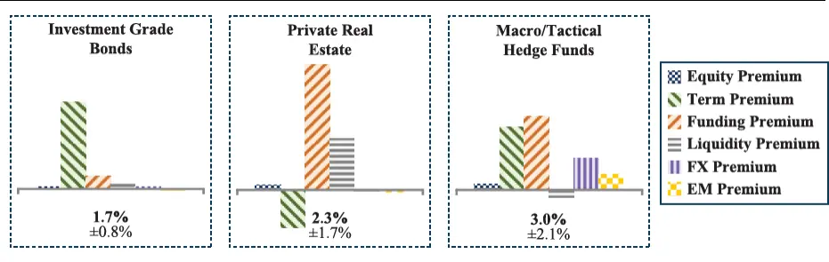
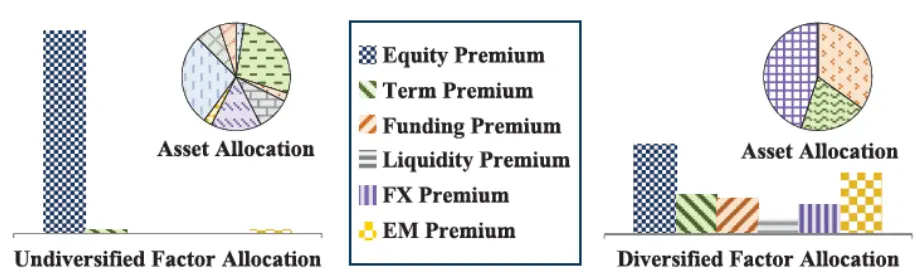
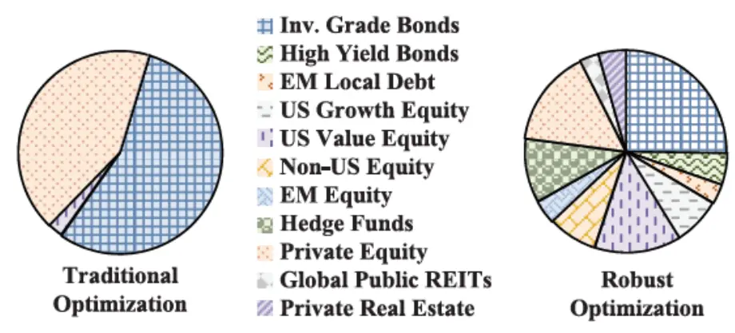
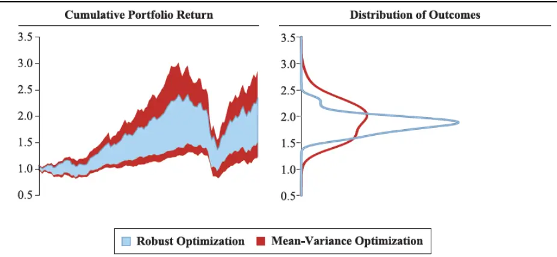
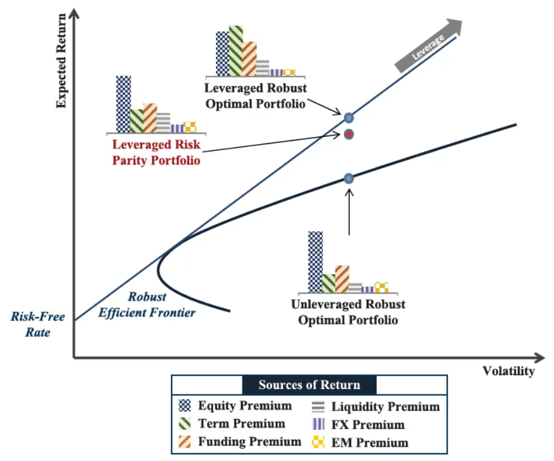

[Table_Title2021.04.23

# 基于多因子的战略资产配置方法

## ——精品文献解读系列（十一）

## 本报告导读：

本篇报告解读的文献提出了基于六因子的战略资产配置模型，以及稳健的投资组合优化方法。该资产配置方法注重对风险溢价因子的多元化配置，对收益率预测误差敏感性较低，能够构建风险收益特征更加优异的投资组合。

## 摘要：

le_Summary]投资学是一门学术界与业界紧密结合的学科，其中大类资产配置是这种紧密结合的代表。从Markowitz（1952）开创现代投资组合理论开始，学术界为业界提供了丰富的理论参考和方法模型，推动了大类资产配置实践的繁荣发展。为了帮助读者及时跟踪学术前沿，我们推出了“精品文献解读”系列报告，从大量学术文献中挑选出精品论文进行剖析解读，为读者呈现大类资产配置领域最新的思路和方法。

本篇为读者解读的文献是 Asl and Etula（2012）在期刊 The Journalof Portfolio Management 上发表的论文“Advancing StrategicAsset Allocation in a Multi-Factor World”。

本文提出了基于六因子的战略资产配置模型，以及稳健的投资组合优化方法。与传统方法对资产类别进行多元化配置不同，基于因子的战略配置方法注重对于风险溢价因子的配置。同时，本文提出了稳健的投资组合优化方法，通过该方法构建的投资组合业绩表现要优于传统的均值-方差优化方法，且对于收益率误差的敏感性更低。除此之外，本文还分析了将因子模型应用于风险分析和投资组合预测中的优势。

将因子投资的理念应用于资产配置已经成为全球投资者的共识。本文通过构建六因子模型和稳健优化方法来构建风险收益特征更加优异的投资组合。值得注意的是，本文分析了应用因子模型进行资产配置、风险分析和投资组合表现预测的诸多优点，但是并没有详细说明个中方法。如果要构建完整的因子配置策略，读者还需要自行解决诸如因子构造等诸多细节问题。

大类资产配置研究

## or] 报告作者

李祥文(分析师)

8 021-38031560

lixiangwen@gtjas.com

证书编号 S0880520100001

王瑞韬(研究助理)

8 021-38038208

wangruitao@gtjas.com

证书编号 S0880121010024

## cReport] 相关报告

如何理解最大分散度组合

2021.04.13

从因子暴露到资产配置的映射

2021.04.07

将“碳中和”理念纳入投资框架

2021.04.05

目标波动率的效果

2021.03.29

投资组合优化：理论与实践的差异 2021.03.23

## 1. 文献概述

## 文献来源：

Asl, Farshid M., and Erkko Etula. "Advancing Strategic Asset Allocation in a Multi-Factor World.". Journal of Portfolio Management. 39.1(2012): 59-66.

## 文献摘要：

本文提出了基于六因子的战略资产配置模型，以及稳健的投资组合优化方法。与传统方法对资产类别进行多元化配置不同，基于因子的战略配置方法注重对于风险溢价因子的配置。同时，本文提出了稳健的投资组合优化方法，通过该方法构建的投资组合业绩表现要优于传统的均值-方差优化方法，且对于收益率误差的敏感性更低。除此之外，本文还分析了将因子模型应用于风险分析和投资组合预测中的优势。

## 文献评述：

将因子投资的理念应用于资产配置已经成为全球投资者的共识。本文通过构建六因子模型和稳健优化方法来构建风险收益特征更加优异的投资组合。值得注意的是，本文分析了应用因子模型进行资产配置、风险分析和投资组合表现预测的诸多优点，但是并没有详细说明个中方法。如果要构建完整的因子配置策略，读者还需要自行解决诸如因子构造等诸多细节问题。

## 2. 引言

战略资产配置是资产配置中最重要的环节，但是其理论方法的发展却相对缓慢。经典研究表明，从长期来看，战略资产配置能够解释投资组合90%的波动和 100%的回报水平。然而，自 Black 和 Litterman 在 20 世纪90年代初引入均衡方法以来，战略资产配置理论和方法几乎没有取得任何发展。特别是与其他金融领域（如资产证券化和统计套利等）涌现出的实质性创新相比，战略资产配置工具的发展乏善可陈。

在此背景下，本文提出了一种新的战略资产配置方法。这种方法基于因子投资的理念，认为资产的长期收益由多种不同的因子驱动，我们将这些因子称为“收益驱动因子”（return-generating factors）。我们的方法主要有四个关键的创新点：

首先，本文通过建立多因子模型来确定资产在复杂投资环境中的主要收益来源。这一模型能够大幅提高对各类资产预期收益的预测准确度，使投资者的关注重点从资产类别的多元化转向风险溢价的多元化。

其次，本文提出了一种稳健的投资组合优化方法，旨在更加准确地解释 p3预期收益估计中的不确定性，以构建风险特征优异的多元化投资组合。

第三，本文设计了一种基于因子的风险分析方法，能够更好地分析资产收益特征（比如金融危机时期，收益率分布呈现厚尾特性，各资产收益的相关性也会增加），这使得我们可以更精确地对投资组合下行风险进行建模。

最后，本文开发了一种因子模拟方法来解释不同宏观经济状态（如低利率）对投资组合未来收益的影响，从而可以得到更精确的前瞻性预测。

总而言之，本文提出的方法能够准确地反映投资者的投资目标和约束，帮助投资者做出更好的投资决策。除此之外，在一些市场环境下（如2008-2009年的危机），传统多元化投资组合蒙受了超出预期的亏损，而本文的方法可以让投资者在更广泛的市场环境中（包括 2008-2009年的危机）更好地了解投资组合的潜在表现。

## 3. 基于因子的战略资产配置方法

无论投资者的具体目标是什么，战略资产配置都是从理解全球市场提供的投资机会开始。我们必须深入理解各类资产（包括股票、债券、另类投资、私人资产等可配置资产）的预期收益和风险。传统方法试图通过Sharpe（1964）、Lintner（1965）和 Mossin（1966）等提出的资产定价模型（CAPM）及各种扩展模型来应对这一挑战，迄今为止，这些模型仍然是从业者默认的行业标准。这些方法基于单因子模型，所包含的唯一因子是市场的超额收益，通常由股票或者股票和债券的市值加权投资组合来表示。这些方法背后隐含的逻辑是，具有更高市场风险敞口（beta）的资产肯定具有更高的风险，因此也要求更高的预期收益。

然而，自 CAPM 引入以来，大量的实证和理论研究表明，现实情况比单因子模型要复杂得多。除了市场风险外，市场中还存在其他很多风险，投资者可以通过承担这些风险来获取超额的收益，与市场风险相关的溢价并不是唯一可靠的收益来源。

基于这一思想，多因子模型被开发出来，其起源于 Merton （1969，1973）和 Ross（1976）的研究工作，后来由 Fama and French（1992）等人改进。在这些模型中，每一个因子（如规模或价值）都反映了不同的风险溢价。从业人员还开发了风险因子模型，用来解释资产的波动性和相关性。风险模型通常包含大量的因子，但大多数因子不承载风险溢价。

之前多因子模型的应用主要集中在估计资产类别内部的预期收益和风险，而本文将多因子模型应用到战略资产配置中，用来估计跨资产类别的预期收益和风险。几十年来，对冲基金和量化权益基金一直使用因子模型作为系统化交易策略中选股的基本方法。例如，这些基金可能通过构建买入价值股、卖空成长股的投资组合来获取价值因子溢价。自 20世纪 70 年代以来，权益型基金经理开始使用多因子风险模型。如今，基于因子的风险模型正在越来越多地应用于其他各类资产类别。 p4

本文构建的因子模型由六个因子组成（见图1），它们代表了全球投资者的长期收益来源。该模型有如下四个重要特点：

首先，每一个因子都反映了不同的风险溢价，不同因子的风险溢价在很大程度上是相互独立的。这个特性使得我们可以以一种新的方式思考投资组合的多样化。

第二，每一种风险溢价都具备明确的经济学原理，市场参与者愿意支付溢价来化解风险。

第三，与每个因子相关的报酬反映了对预期收益中相应系统性风险的补偿。言下之意，对因子具有更高风险敞口的资产有望获得更高的回报。

最后，每个风险溢价都是可投资的。因子收益可以通过对可交易资产构建多空组合来实现。

图1：估计预期收益的六因子模型

| RISK PREMIUM | REWARDS INVESTORS FOR... |
| --- | --- |
| &Equity | Market risk |
| 3Term | Inflation and interest rate risk |
| 4Funding | Risk in short-term credit conditions |
| =Liquidity | Risk in market-wide liquidity conditions |
| IIFX | Systematic exchange rate risk |
| EM | Risks specific to emerging markets |

数据来源：Asl and Etula（2012）

由于每类资产都可以用六种因子进行表示，并且每种因子代表着资产长期收益的不同来源，因此从因子的视角使得我们可以更好地理解资产多元化配置的好处。为了说明这一点，图2展示了三种资产类别的风险溢价示例。通过本文因子模型的六维视角去观察不同的资产类别，可以看到每种资产类别都有一个独特的风险溢价结构。很明显，资产类别的名称仅仅是不同的潜在因子敞口组合的标签，这些不同因子敞口正是获取收益的驱动力。了解这些收益的驱动因子为投资组合构建提供了重要的线索。

图2：选定资产类别的风险溢价模式

数据来源：Asl and Etula（2012）

一个理想的投资组合由许多独立的收益驱动因子构成。本文所使用的因 p5子其反映的长期收益来源在很大程度上是不相关的，这使得我们能够以一种新的方式来思考投资组合的多样化。一个长期投资组合应该从均衡配置的因子中获取风险溢价，而不是仅仅关注资产类别的多样化。

这一点很重要，因为并非所有的因子都会一直产生回报。例如，在过去十年中，权益溢价已经大大低于其长期平均水平。在这种情况下，有效的多元化投资组合应该继续从其他风险溢价中获取回报。使用本文的因子模型，可以为投资组合设置独特的风险溢价结构，这有助于我们更深入地了解配置的多元化程度。

图3展示了两个虚构的投资组合示例。从资产配置的角度来看，左侧的投资组合似乎比右侧的投资组合更加多样化。然而，通过检查每个投资组合收益背后的风险溢价，可以清楚地看到，右侧的投资组合实质上更加多样化。

图3：多样化配置的新视角

数据来源：Asl and Etula（2012）

了解投资组合收益的风险溢价构成，对于进行中期资产配置决策也有帮助。例如，在低利率环境下，投资者可能担心中期利率上升对其投资组合的影响。高收益债券、对冲基金和许多新兴市场证券等资产类别的历史收益数据通常不超过几十年，但本文模型中的因子收益数据可以超过几十年。这使得投资者在不同经济环境下能够对资产类别收益进行更可靠的估计。

例如，本文的因子模型估计，在利率上升的环境中所有对冲基金策略（不包括宏观/战术交易）都应该表现更好。宏观/战术对冲基金表现不佳的潜在原因是它们对期限因子（term factor）的敞口较大（见图 2），当利率上升时，其溢价会变成负值。

## 4. 战略资产配置中的稳健优化

优化的目的是构建最符合投资目标的投资组合。为了做到这一点，大多数方法用投资组合的预期收益和方差来描述投资目标，然后基于Markowitz（1952）的均值-方差优化（MVO）模型来求得最优投资组合。然而，在没有限制性约束的情况下，直接应用均值-方差框架通常会得到配置过于集中的投资组合，其业绩表现也差强人意。

许多方法都试图解决 MVO 模型的缺点，包括 Black and Litterman（1992）的贝叶斯方法、Michaud（1998）的重新抽样（re-sampling）方法、许 p6多投资者青睐的风险平价方法（如 Asness et al.,2012）和许多稳健优化算法（如 Scherer，2007）。在这些方法中，本文倾向于使用稳健优化方法，因为这种方法分析严谨，并且能够适应于各种不同的投资目标。

MVO 模型的另一个缺点是对收益率参数非常敏感,预期收益率的微小变化会导致最优投资组合的构成发生较大变动，而且经常会产生角点解（corner solution）。而资产收益率通常又难以准确预测。对于中等风险的投资组合，Chopra and Ziemba（1993）发现预期收益估计的误差敏感性大约比风险波动的误差敏感性大一个数量级。

本文的稳健优化技术试图通过准确地衡量投资组合中预期收益的标准误差来解决这一问题。图4中右侧是通过该稳健优化方法得到的投资组合，其构成与左侧传统均值-方差优化得到的投资组合形成鲜明对比。稳健优化使我们能够用较少的主观输入来构建优异的投资组合。

图4：通过稳健优化方法构建投资组合

数据来源：Asl and Etula（2012）

本文使用“稳健”来反映优化器处理参数敏感性的能力。在数学上，本文的稳健性方法类似于 Scherer（2007）、Meucci（2007）和 Ceria andStubbs（2006），他们通过考虑预期收益的不确定性来扩展传统的均值-方差优化模型。回顾一下，均值-方差优化模型如下：

$$
\begin{array}{c}{{max_{w}E\left[w^{'}R\right]}}\\{{}}\\{{s.t.\quad Var\left[w^{'}R\right]\leq\sigma_{Target}^{2}}}\\{{}}\\{{\displaystyle\sum w\leq1}}\end{array}\tag{1}
$$

其中， $E\left[w^{\prime}\ R\right]$ 是投资组合的预期收益， $Var\left[\boldsymbol{w^{\prime}}\boldsymbol{R}\right]$ 是投资组合的方差，$\sigma_{Target}^{2}$ 是目标波动率。稳健优化将其拓展为如下问题：

$$
\begin{array}{rlr}&{}&{\operatorname*{max}_{\mathbf{w}}\left\{\operatorname*{min}_{\widetilde{\mathrm{R}}\in\mathrm{U}}\mathrm{E}\left[w^{'}~\widetilde{R}\right]\right\}}\\&{}&{\quad\quad\quad\quad\quad\quad\quad\quad\quad\quad\quad\quad\quad\quad\quad}\\&{}&{\quad\quad\quad\quad\quad\quad\quad\quad\quad\quad\quad\quad s.t.\quad Var\left[w^{'}~R\right]\leq\sigma_{Target}^{2}}\\&{}&{\quad\quad\quad\quad\quad\quad\quad\quad\quad\quad\quad\quad\quad\quad\quad\quad\quad\quad\quad\quad\quad\quad\quad}\\&{}&{\quad\quad\quad\quad\quad\quad\quad\quad\quad\quad\quad\quad\quad\quad\quad\quad\quad\quad\quad\quad\quad}\end{array}\tag{2}
$$

其中，U表示不确定性集合。

为了更好地展示本文的稳健优化器如何处理预期收益估计中的误差，我们进行了如下测试。首先，使用因子模型估计 15 种战略配置资产类别的预期收益和风险（统计区间截至 2000 年 12 月），并通过添加独立随机误差产生 1000 个预期收益的扰动，这些独立随机误差服从均值为 0且波动率与预期收益估计标准误差相匹配的正态分布。

然后，将这些扰动期望收益和资产协方差矩阵输入稳健优化方程（2）和传统的均值-方差优化方程（1），可以得到1000 个扰动对应的投资组合权重。我们使用 2001 年到2010年间的市场数据来评估这些投资组合的表现，如图 5 所示。从图 5 中可以看到，与传统的均值-方差优化方法相比，稳健优化方法产生的累积收益的分散性更小。

图 5：稳健最优投资组合与均值-方差最优投资组合的比较（2001-2010年）

数据来源：Asl and Etula（2012）

Ceria and Stubbs（2006）使用另外一种方法对稳健优化构建的投资组合的业绩表现进行测试。他们没有扰乱预期收益，而是模拟了成千上万个假设的市场结果，然后比较两种优化方法构建的投资组合的业绩表现。

他们的结果表明，稳健优化组合在相同风险水平下可获得更大的平均收益，从而产生更高的有效前沿。均值-方差优化组合“承诺”的预期收益往往高于事后实际的平均投资组合收益。Ceria and Stubbs（2006）的分析表明，稳健优化投资组合的预期收益率更接近于其事后实现的收益。这一特点源于稳健最优投资组合所提供的更大的多样化，这将使投资者对其预期的投资组合回报具有更高的信心。

## 5. 稳健优化与风险平价

在解决均值-方差优化模型对预期收益参数敏感性较高的方法中，风险平价可能是最受关注的。风险平价的方法完全忽略预期收益，仅仅通过平均配置各类资产的风险贡献来构建投资组合。这么做的结果是，风险平价投资组合对债券和其他低波动性资产类别具有较高的配置比例，并 p8依赖杠杆将投资组合风险增加到投资者期望的水平。

我们认为，完全忽略资产的预期收益会导致次优配置。这是因为并非所有的风险都能得到回报，如异质性风险。此外，风险收益往往也是不等价的。例如，与单位流动性风险相关的溢价可能与单位汇率风险相关的溢价存在显著差别。本文使用的因子模型对于风险的识别和定价是非常有价值的工具。

在考虑杠杆后，本文构建的稳健最优投资组合与风险平价投资组合具有一定的可比性。图6 展示了包含 21种资产的典型战略配置示例。从图6中可以看到，加入杠杆的稳健最优投资组合在相同的风险水平下产生了更高的预期收益，这可以归因于该组合中风险溢价更大的多元性。这一结果凸显了对不同收益来源进行优化配置的重要性，正是这些收益来源驱动着投资组合的长期业绩。

图6：使用稳健优化方法可以构建风险收益特征更加优异的投资组合

数据来源：Asl and Etula（2012）

## 6. 因子模型在战略资产配置中的其他应用

## 6.1. 基于因子的风险分析

传统的资产配置方法倾向于假设资产收益服从正态分布，是连续且相互独立的。这些假设意味着，像2008-2009年金融危机这样的小概率事件是不可能发生的。但实际上，这样的尾部事件发生得非常频繁，此时市场呈现高波动聚集性，不同风险资产的相关性也会急剧增加。而基于因子的风险分析和压力测试有助于捕捉投资组合收益的实际特征，能够更好地衡量投资者面临的真正的下行风险。 p9

因子模型还可以帮助我们评估给定投资组合在特定历史时期中的可能表现，比如1973-1974年的石油禁运时期或 1978-1980年间美国的高通胀时期。在这些期间许多资产类别的历史回报数据都不可用，而基于因子的风险分析可以帮助我们了解投资组合在此期间的表现情况。

## 6.2. 基于因子的投资组合预测

预测计划支出、资金流入、通货膨胀和税收等对未来投资组合业绩分布的影响是战略资产配置过程的另一个关键部分，特别是对于有支出要求的捐赠基金和基金会。人们通常使用蒙特卡洛模拟来解决这一问题，但是我们认为基于因子来预测投资组合的表现更加合适。

首先，使用因子方法允许投资者避开收益是独立的、正态分布的假设，转而采用更现实的基于因子的分布；其次，基于因子模型的预测可以解释当前经济环境对投资组合预期绩效的影响。例如，从低利率环境开始，在未来十年内投资组合的预期收益不仅会受到无风险利率上行的影响，而且还会受到风险溢价调整的影响。基于因子的投资组合预测能够捕捉了这些特征，从而可以在更大范围内理解投资组合潜在的表现。

## 7. 结论

尽管战略资产配置对长期投资者很重要，但大多数战略资产配置决策仍基于20世纪50年代和60年代提出的技术方法，这些方法有许多缺点，限制了它们在投资过程中的应用价值。本文基于稳健的因子配置框架来解决这些缺点，该框架可应用于资产配置过程中多个重要的方面，使投资者能够做出更适合其投资目标和约束的投资决策。

使用因子模型进行战略资产配置具有很多优点，但是需要强调的是，资产配置的整体过程仍然是艺术与科学的结合。本文解决了传统资产配置方法中的一些关键缺陷，大大减少了使用艺术来弥补这些缺陷的程度。尽管如此，艺术仍然是理解投资者特定目标和偏好的重要组成部分，我们在进行资产配置时依然离不开定性分析。

## 本公司具有中国证监会核准的证券投资咨询业务资格

## 分析师声明

作者具有中国证券业协会授予的证券投资咨询执业资格或相当的专业胜任能力，保证报告所采用的数据均来自合规渠道，分析逻辑基于作者的职业理解，本报告清晰准确地反映了作者的研究观点，力求独立、客观和公正，结论不受任何第三方的授意或影响，特此声明。

## 免责声明

本报告仅供国泰君安证券股份有限公司（以下简称“本公司”）的客户使用。本公司不会因接收人收到本报告而视其为本公司的当然客户。本报告仅在相关法律许可的情况下发放，并仅为提供信息而发放，概不构成任何广告。

本报告的信息来源于已公开的资料，本公司对该等信息的准确性、完整性或可靠性不作任何保证。本报告所载的资料、意见及推测仅反映本公司于发布本报告当日的判断，本报告所指的证券或投资标的的价格、价值及投资收入可升可跌。过往表现不应作为日后的表现依据。在不同时期，本公司可发出与本报告所载资料、意见及推测不一致的报告。本公司不保证本报告所含信息保持在最新状态。同时，本公司对本报告所含信息可在不发出通知的情形下做出修改，投资者应当自行关注相应的更新或修改。

本报告中所指的投资及服务可能不适合个别客户，不构成客户私人咨询建议。在任何情况下，本报告中的信息或所表述的意见均不构成对任何人的投资建议。在任何情况下，本公司、本公司员工或者关联机构不承诺投资者一定获利，不与投资者分享投资收益，也不对任何人因使用本报告中的任何内容所引致的任何损失负任何责任。投资者务必注意，其据此做出的任何投资决策与本公司、本公司员工或者关联机构无关。

本公司利用信息隔离墙控制内部一个或多个领域、部门或关联机构之间的信息流动。因此，投资者应注意，在法律许可的情况下，本公司及其所属关联机构可能会持有报告中提到的公司所发行的证券或期权并进行证券或期权交易，也可能为这些公司提供或者争取提供投资银行、财务顾问或者金融产品等相关服务。在法律许可的情况下，本公司的员工可能担任本报告所提到的公司的董事。

市场有风险，投资需谨慎。投资者不应将本报告作为作出投资决策的唯一参考因素，亦不应认为本报告可以取代自己的判断。
在决定投资前，如有需要，投资者务必向专业人士咨询并谨慎决策。

本报告版权仅为本公司所有，未经书面许可，任何机构和个人不得以任何形式翻版、复制、发表或引用。如征得本公司同意进行引用、刊发的，需在允许的范围内使用，并注明出处为“国泰君安证券研究”，且不得对本报告进行任何有悖原意的引用、删节和修改。

若本公司以外的其他机构（以下简称“该机构”）发送本报告，则由该机构独自为此发送行为负责。通过此途径获得本报告的投资者应自行联系该机构以要求获悉更详细信息或进而交易本报告中提及的证券。本报告不构成本公司向该机构之客户提供的投资建议，本公司、本公司员工或者关联机构亦不为该机构之客户因使用本报告或报告所载内容引起的任何损失承担任何责任。

## 评级说明

## 1.投资建议的比较标准

投资评级分为股票评级和行业评级。

以报告发布后的12个月内的市场表现为比较标准，报告发布日后的 12个月内的公司股价（或行业指数）的涨跌幅相对同期的沪深 300 指数涨跌幅为基准。

## 2.投资建议的评级标准

报告发布日后的 12 个月内的公司股价（或行业指数）的涨跌幅相对同期的沪深 300 指数的涨跌幅。

|  | 评级 说明 |  |
| --- | --- | --- |
| 股票投资评级 | 增持 | 相对沪深 300指数涨幅15%以上 |
|  | 谨慎增持 | 相对沪深300指数涨幅介于5%～15%之间 |
|  | 中性 | 相对沪深300指数涨幅介于-5%～5% |
|  | 减持 | 相对沪深300指数下跌5%以上 |
| 行业投资评级 | 增持 | 明显强于沪深300指数 |
|  | 中性 | 基本与沪深300指数持平 |
|  | 减持 | 明显弱于沪深300指数 |

## 国泰君安证券研究所

|  | 上海 | 深圳 | 北京 |
| --- | --- | --- | --- |
| 地址 | 上海市静安区新闸路669号博华广场 20层 | 深圳市福田区益田路 6009 号新世界 商务中心34层 | 北京市西城区金融大街甲9号金融 街中心南楼18层 |
| 邮编 | 200041 | 518026 | 100032 |
| 电话 | （021)38676666 | （0755)23976888 | (010)83939888 |
|  | E-mail: gtjaresearch@gtjas.com |  |  |