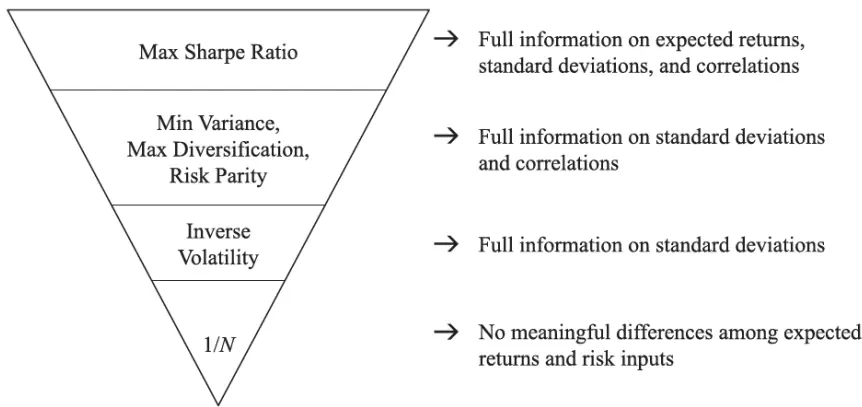
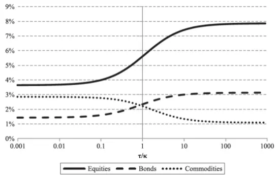
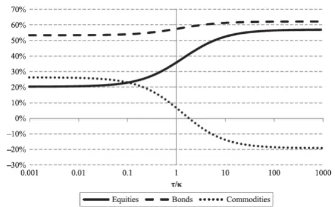
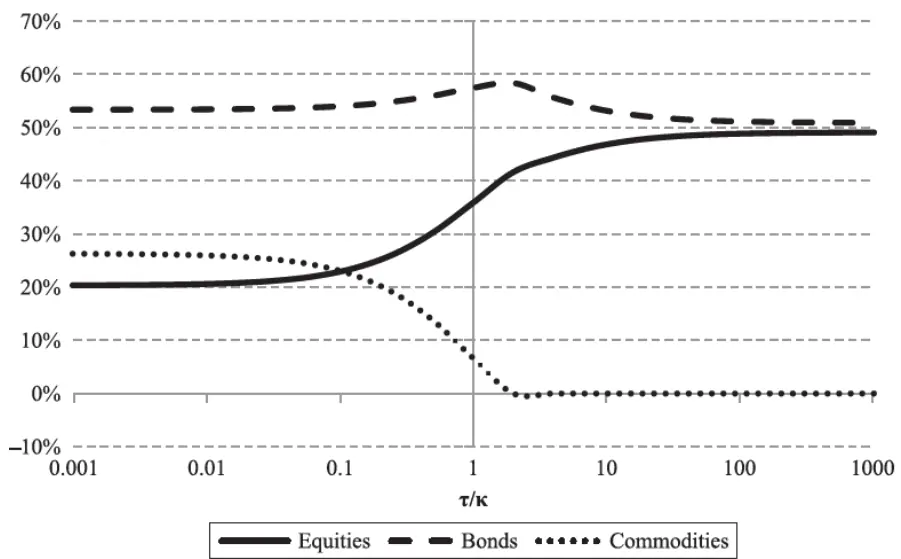

[Table_Title2021.04.28

# 如何使用投资观点增强风险平价组合

## --精品文献解读系列（十二）

## 本报告导读：

本篇报告解读的文献探讨了如何在以风险为核心的组合构建中纳入预期收益率的观点。作者推荐以风险平价组合作为出发点并以此演示了纳入预期收益率观点的方法。

## 摘要：

le_Summary]投资学是一门学术界与业界紧密结合的学科，其中大类资产配置是这种紧密结合的代表。从Markowitz（1952）开创现代投资组合理论开始，学术界为业界提供了丰富的理论参考和方法模型，推动了大类资产配置实践的繁荣发展。为了帮助读者及时跟踪学术前沿，我们推出了“精品文献解读”系列报告，从大量学术文献中挑选出精品论文进行剖析解读，为读者呈现大类资产配置领域最新的思路和方法。

本期为读者解读的文章为 Haesen, Hallerbach, Markwat & Molenaar 于2017 年 发 表 于 期 刊 The Journal of Portfolio Management 的 文章:“Enhancing Risk Parity by Including Views”。

均值方差优化与风险平价是时下最为广泛使用的配置组合构建方法。两类方法对预期收益率的使用处于两个极端。均值方差优化的方法将投资者对预期收益率的估计以常数形式使用，而风险平价则完全忽略了关于预期收益率的任何信息。在实际的投资活动中，100%信任或者完全忽视预期收益率的估计显然都并不理想，那么投资者该如何在组合中合理纳入预期收益率估计呢。

本文作者结合Black-Litterman 组合构建流程，提出了在风险平价组合中纳入投资者观点的方法。最终得到的组合将是均值方差最优组合与风险平价组合的折中选择，当投资者对自身观点更具信心时组合将更为靠近均值方差最优组合，反之当投资者对自身观点缺少信心时，组合将更为靠近作为中立出发点的风险平价组合。这一方法同样可以推广至其他以风险为核心的组合。

作者提出的组合构建方法分为三个步骤。首先以风险平价组合作为参考组合,以逆优化的方式提取关于预期收益率的隐含观点(先验观点, Prior)。其次结合投资者对预期收益率的观点以及对两类观点的相对信心对先验观点进行调整，得到综合了风险平价隐含观点与投资者观点的对预期收益率的后验观点(Posterior)。最终以后验观点作为预期收益率的估计再次进行均值方差优化。

大类资产配置研究

## or] 报告作者

李祥文(分析师)

8 021-38031560

lixiangwen@gtjas.com

证书编号 S0880520100001

王瑞韬(研究助理)

8 021-38038208

wangruitao@gtjas.com

证书编号 S0880121010024

## cReport] 相关报告

根深叶茂：金融监管视角下的公共养老金发展（上）

2021.04.27

基于多因子的战略资产配置方法2021.04.23

如何理解最大分散度组合

2021.04.13

从因子暴露到资产配置的映射 2021.04.07

将“碳中和”理念纳入投资框架 2021.04.05

## 1. 文献概述

## 文献来源：

Haesen, Hallerbach, Markwat & Molenaar(2017). Enhancing Risk Parity by Including Views. The Journal of Investing, 26(4), 53-68.

## 文章摘要：

金融文献的介绍中，风险平价组合与传统均值方差组合存在着显著的差异。前者完全忽略了资产的预期收益率的存在，而后者则将资产预期收益率当作完全确定的参数纳入。本文中，我们提出的组合构建框架可以帮助投资者在这两个极端中获得折中方案。在这一框架下，根据投资者对自己预期收益率估计的信心程度不同，最终组合更为靠近风险平价组合或者均值方差组合。我们以资产配置为背景演示这一组合构建框架。

## 文章解读：

均值方差优化与风险平价是时下最为广泛使用的配置组合构建方法。两类方法对预期收益率的使用处于两个极端。均值方差优化的方法将投资者对预期收益率的估计以常数形式使用，而风险平价则完全忽略了关于预期收益率的任何信息。在实际的投资活动中，100%信任或者完全忽视预期收益率的估计显然都并不理想，那么投资者该如何在组合中合理纳入预期收益率估计呢？

本文作者结合Black-Litterman 组合构建流程，提出了在风险平价组合中纳入投资者观点的方法。最终得到的组合将是均值方差最优组合与风险平价组合的折中选择，当投资者对自身观点更具信心时组合将更为靠近均值方差最优组合，反之当投资者对自身观点缺少信心时，组合将更为靠近作为中立出发点的风险平价组合。这一方法同样可以推广至其他以风险为核心的组合。

作者提出的组合构建方法分为三个步骤。首先以风险平价组合作为参考组合以逆优化的方式提取关于预期收益率的隐含观点(先验观点, Prior)。其次结合投资者对预期收益率的观点以及对两类观点的相对信心对先验观点进行调整，得到综合了风险平价隐含观点与投资者观点的对预期收益率的后验观点(Posterior)。最终以后验观点作为预期收益率的估计再次进行均值方差优化。

## 2. 前言

近期诸多研究将注意力放在了如何将风险控制技术(risk controltechniques)应用于资产配置组合构建之中。这些基于风险控制的组合构建方法包括：等权组合(DeMiguel, Garlappi & Uppal, 2009)、波动率倒数加权组合(Fleming, Kirby & Ostdiek, 2001)、最大分散度组合(Choueifaty& Coignard, 2008)以及风险平价组合(Qian, 2005)。这类组合构建方法的主要目标在于避免风险的过度集中，以组合分散抵御可能发生的损失。历史测算的结果表明，由不同风险度量的角度出发，足以构建历史上表现良好的完整投资组合，也因此这类组合作为一类风险出发的组合构建方法，开始被与均值方差的组合构建方法进行直接比较。

从对预期收益率的使用角度而言，均值方差优化(以最大化组合夏普比率为目标)与风险控制的方法处于两个极端。后者认为资产的预期收益率无法预测，而前者假设投资者可以获得完美的预期收益率预测。事实上在实践中，均值方差优化对预期收益率的使用确实存在挑战。一方面投资者极难获得稳健的预期收益率预测。另一方面，预期收益率预测的误差会在均值方差优化的过程中被放大。从这个角度而言，削减组合构建过程中对预期收益率预测的依赖很有必要。而对于处在另一个极端的风险控制出发的组合构建，其历史上的优异表现能否在未来得以延续则值得更进一步的讨论。也因此，如何在这类组合中纳入预期收益率的信息显得尤为有意义。

这些考虑都促使我们在这两种极端中取得一个折中方案。我们推荐使用Black & Litterman(1991, 1992)的优化流程将预期收益率的信息纳入由风险控制角度出发构建的组合中。Black & Litterman(1991, p14)由代表均衡状态信息的市场组合出发，提取其中的市场隐含预期收益率。而在我们推荐的组合构建方法中，我们以风险平价组合为参考组合。这也对应当投资者对于预期收益率无明确观点时，风险信息是仅有的可获得的信息的思想。

## 我们推荐如下的组合构建流程：

1. 构建风险平价组合作为参考组合。风险平价组合中所有资产对于组合风险的贡献都是相等的。我们以这一组合作为获取隐含预期收益率信息的参考组合。

2. 提取参考组合对应隐含收益率。以逆优化的方法获取参考组合对应的隐含预期收益率，这些隐含收益率是使得参考组合具有最大夏普比率的收益率估计。

3. 调整隐含预期收益率并再度优化。参考投资者对预期收益率的观点以及信心调整隐含预期收益率，并使用调整后的预期收益率再次进行组合优化获得投资组合。

使用上述流程所获得的投资组合位于风险平价组合(投资者对预期收益率观点无信心)与最大夏普组合(投资者对预期收益率观点有完全的信心)的中间。

我们的研究与 Jurczenko & Teiletche(2015)的研究有相似之处。我们使用风险平价组合作为中性的出发点，并参考投资者对于预期收益率的观点以及对两类观点的相对信心对这一组合进行调整。而 Jurczenko &Teiletche(2015)则是从以波动率倒数加权的目标波动率组合作为基准组合出发。

Roncalli(2015)提供了另外一种将预期收益率信息纳入风险平价组合的方法。他使用了一个不仅考虑了风险维度(波动率)，还考虑了收益维度(预期收益率)的综合风险度量指标。正态分布假设下的在值风险(Valueat Risk)等是这类同时依赖预期收益率信息与风险信息的风险度量的一个代表。通过使用这一类考虑资产预期收益率信息的综合风险度量指标，风险平价组合等价于一个分散权重约束下的均值方差组合。投资者可以通过设置风险度量中的一个常数来调节预期收益率与波动率对风险度量的贡献。尽管这一方法在数学上非常优雅，但是如何设定风险度量中的这一常数却并没有定论。

本篇文章以如下形式组织。我们首先总结了风险平价组合以及贝叶斯的组合调整步骤的理论基础。此后我们将这两种方法应用于以股票、债券以及商品为代表的大类资产配置组合。最后，我们讨论了基于这一方法得到配置组合对应了怎样的经济含义，并为未来的研究方向提供了建议。

## 3. 如何在风险平价组合中纳入自身观点

## 3.1. 为何选择风险平价组合为出发点

首先从对风险平价组合的介绍开始。基于风险控制的组合在历史测算的表现中优于市值加权组合以及均值方差优化的组合(参考 Asness,Frazzini & Pedersen,2012 的研究)。考虑到这类组合忽略了所有的关于预期收益率的信息，这一实证结果令人惊讶。学术文献的研究中存在相关文献认为这类以风险为基础的策略过于依赖一些测算的历史细节(详情可参考 Anderson, Bianchi & Goldberg, 2012 的研究)。

此外，即使关于风险平价组合历史测算的假设并无问题，组合历史上优异的表现也在很大程度上来源于成功选择了历史中低波动且表现优异的资产。这一现象对于过去 30 年间的债券尤为显著。然而考虑到当下已经较低的利率环境，简单的认为债券在未来同样会具备如此优异的表现的观点值得更进一步的推敲。2013年 6 月美国利率上升后风险平价基金所遭遇的重大回撤无疑对应了这一质疑。

然而，我们认为基于风险控制的配置组合却是在缺少对预期收益率观点(或者缺少对预期收益率观点的信心)的时候的一个很好的出发点。当投资者并不具备与预期收益率相关的信息与观点时，将投资组合充分分散将是最好的选择。在最为简单的分散中，投资者可以将资金平均的分配到所有的资产中。当然，在一个资产具备不同风险水平以及相关性的组合中，这样的简单分散难以起到对风险的真正分散。以股债的波动率为例，股票的波动率将是利率债波动率的数倍之多，将资金等权的分配于股票债券所得的组合无疑对应了不均衡的股票与债券的风险。

更为合理的做法是让不同资产对于组合的风险贡献相等。此时我们也就得到了风险平价组合。在这样一个风险平价的组合中，并不存在任何资产占据了组合中的更多的风险。也因此，风险平价组合是获得了完美风险/损失分散的组合(参考Qian, 2006的研究)。

在一个风险平价的组合中，所有N个资产的权重与资产对风险平价组合的敏感性beta成反比:

$$
\mathrm{\Delta w_{i}^{RP}\sim\frac{1}{\beta_{\mathrm{ip}}}}\tag{1}
$$

参考公式1的等比例关系， $\beta_{ip}$ 是以资产i的超额收益率为因变量，以风险平价组合超额收益率为解释变量的回归中的回归系数。由于风险平价组合要求所有资产对组合风险的贡献为相等的 1/N，我们也可以如下方程来代表风险平价的组合：

$$
\mathsf{w_{i}^{RP}}\mathsf{\beta_{ip}}=\mathrm{~1~/~N~}
$$

值得注意的是，这里的 $\beta_{ip}$ 可以以相关性以及资产波动率的形式表示，此时：

$$
\beta_{ip}=\rho_{ip}\sigma_{i}\sigma_{p}\tag{2}
$$

当资产之间相关性相等时，公式1所对应的风险平价组合权重与各资产的波动率成反比。通过使用标准化的方式确保组合权重加总为 1，可以得到波动率倒数加权组合(inverse volatility portfolio, IVP)。由于 IVP 组合忽略了相关性的信息，其相比完整的风险平价组合相比被认为一个相对简化的组合。在现实的投资活动中，投资者长期使用这一方法来提升各类资产可比性并控制组合风险。这一组合构建方式可能来源于统计学的启发，统计学中大量使用方差的倒数来合并多个随机变量。当组合中仅包含2 个资产，或者所有资产相关性都相等时，IVP组合与风险平价组合是等价的。

关于风险平价组合的相关特征值得一提。首先，参考公式 1 与公式 2对敏感性以及组合风险的度量，我们可以发现风险平价组合更为偏好低波动率、和其他资产相关性更低的资产。也因此，在现实投资活动中，投资者通常会需要使用杠杆来提升风险平价组合的收益与风险以满足投资者对收益目标或风险目标的需求。其次，和大多数不依赖于市值信息的组合类似，风险平价组合相对依赖于投资域中包含的资产类别与个数(参考Lee,2011)。举个例子，当某一投资域中包含5 个资产时，风险平价组合将给所有资产 20%的风险预算。然而当我们将其中的某两类资产(比如投资级债券以及高收益债券)合并为一个资产类别时，风险平价组合将给4 个资产分别以 25%的风险预算。

## 3.2. 不同投资组合构建方法对应了怎样的信息要求

我们推荐使用风险平价组合作为组合构建流程中的中性出发点。本章中，我们首先来讨论不同可选组合之间的关系以及这些组合对应需要怎么样的不同信息。

参考图1 中不同组合所对应的不同信息需求，沿金字塔由下而上从等权组合到最大夏普组合的演进中，投资者会需要越来越多的关于资产收益分布的信息。

在金字塔的最底层是等权组合。在均值方差的传统组合构建框架中，等权组合的构建不依赖于关于资产的预期收益率、波动率以及相关性的任何收益分布信息。此时投资者所能做到的最优的决策是将资金平均的分散到组合的不同资产中。

而在金字塔的下一层，投资者可以获得对资产不同波动率的稳健的比较。这一新增的信息使得投资者可以将组合由简单的资金分散转移至波动率倒数加权，从而获得了波动率倒数加权组合(IVP)。

而在金字塔的更上一层，投资者可以获得关于风险的完整信息，投资者可以获得资产协方差矩阵的信息。此时基于完整的风险信息，投资者可以构建最小方差组合(MVP)、最大分散度组合(MDP)或者风险平价组合(RPP)。

而在金字塔的最上层，投资者需要有效对资产各方面(预期收益率与协方差矩阵估计)进行比较的信息与能力。此时投资者可以依据这些信息进行完整的均值方差优化并获得最大夏普比率的组合。

图1：投资组合与信息需求层级

数据来源：Haesen et al (2017)

当投资者处于信息金字塔的第三层时(此时投资者具备完整的风险信息，而不具备预期收益率的信息)，我们推荐使用风险平价组合而不是其他的风险为核心的组合作为我们组合构建流程中的出发点。具体理由如下：

1. 以风险贡献以及损失贡献角度出发，风险平价组合是最完美分散的组合。

2. 其相比最小方差组合以及最大分散度组合具备更为分散的持仓，风险平价组合中将包含投资域中所有的资产。

3. 风险平价组合相比最小方差组合更为稳健，更不易受到协方差矩阵估计中估计误差的影响。

## 3.3. 如何减少投资观点不确定性影响

尽管马科维茨的均值方差组合优化至今仍在被广泛应用，这一方法最大的问题在于其对于参数输入变化极为敏感。Chopra & Ziemba(1993)认为关于预期收益率的估计误差对最终组合的影响是协方差矩阵估计误差的 10 倍之多。预期收益率的细微变化将会导致均值方差组合巨大且不合常理的改变。诸多研究者尝试以贝叶斯方法、纳入优化约束等方法来解决这一问题(可参考 Jorion, 1986; Michaud, 1989; Black & Litterman1992; Chopra, 1993; DeMiguel et al, 2009 等研究)。

其中 Black-Litterman 模型(以下简称 BL 模型)是最为常用的以贝叶斯思想来减少均值方差最优组合对预期收益率敏感性的方法。这一方法由一个参考组合(reference portfolio)出发，提出这一参考组合所对应的隐含预期收益率观点。这一隐含预期收益率是确保参考组合作为均值方差最优组合的预期收益率估计。随后投资者可以将其对于资产预期收益率的观点以及对于观点的信心以线性方式表达。BL 流程可以将两类关于预期收益率的观点进行合并加总，以获得一个充分考虑两类不同来源信息的预期收益率估计。加总的权重依赖于投资者对两类预期收益率估计相对信心的多少。最终以这一加权后验概率表示的预期收益率进行的均值方差优化可以得到更为合理且分散的组合。关于BL优化流程的更多细节，可以参考 Idzorek(2005)的总结。

在这里，我们希望强调的是。我们的方法与 Black & Litterman(1991, 1992)的方法差异在于我们使用了风险平价组合作为参考组合。Sefton, Bulsing& Scowcroft(2004); Pessaris(2012);Carhart et al.(2014)都曾以这一思路将BL 的方法延伸至有其他参考组合出发。前一章中，我们解释了使用风险平价组合作为 BL 参考组合的原因。在我们的组合构建流程中，风险平价组合仅仅是作为决定隐含预期收益率的出发点。当投资者对预期收益率没有观点或者投资者对于预期收益率观点的信心很低时，基于隐含预期收益率进行的均值方差优化将自动得到风险平价组合作为最优组合。

## 4. 如何理解纳入观点后的组合

## 4.1. 数据

为了尽可能贴近机构投资者的配置组合，我们选择使用 3个常见的资产类别：美国股票、国库券以及商品。对于美国股票，我们使用 CSRP 数据库以及Kenneth French 网站提供的市场组合作为代理。对于债券，我们使用巴克莱斯资本美国国库券中期指数以及巴克莱斯资本美国国库券长期指数的等权重组合作为代理。这样平均加权的债券组合可以更好的匹配一个典型的养老金的负债结构。而对于商品，我们使用 GSCI 标4普能源指数。这一指数因相比标普GSCI指数更为分散而获得青睐。

所有资产收益以相比无风险利率的超额收益率的形式出现。我们使用来自Kenneth French网站的一月期国库券作为无风险收益率。全样本中，这一年化无风险收益率的均值为4.9%。我们使用自1978年 2月至2013年 12 月的月频数据进行历史测算。这里选用月度数据的原因在于，针对战略资产配置的相关研究，更高频率的数据会因含有过多的短期扰动而混淆重点。

表1展示了各类资产超额收益率的主要分布特征信息。其中A 组展示了资产的收益、波动率以及夏普比率的信息。在全样本中，股票获得了最高的(7.9%)年化超额收益率。债券与商品分别获得了 3%以及 1%的超额收益率。同样股票具有最高的波动率(15.8%)，而债券的波动率最低(7.4%)。B 组则展示了资产之间的相关性信息。债券与股票以及商品之间都具备较低的相关性(分别为 7%以及-7%)，也因此具备最优的分散风险属性。股票与商品之间的相关性则在31%。

表 1：资产特征总结 (1978-2013)
Panel A: Excess Return Statistics, Annualized

|  | Average | Volatility | Sharpe Ratio |
| --- | --- | --- | --- |
| Equities | 7.9% | 15.8% | 0.50 |
| Bonds | 3.1% | 7.4% | 0.43 |
| Commodities | 1.1% | 13.3% | 0.08 |

Panel B: Correlations

|  | Equities | Bonds | Commodities |
| --- | --- | --- | --- |
| Equities | 100% |  |  |
| Bonds | 7% | 100% |  |
| Commodities | 31% | -7% | 100% |

数据来源：Haesen et al (2017)

## 4.2. 主要结果

本章中，我们对组合构建流程得到的最终组合进行实证分析。我们以参考组合权重以及隐含预期收益率为出发点，展示基于投资者对两类观点的相对信心，后验预期收益率估计与最优组合权重的变化。

表2展示了风险平价组合、对应隐含预期收益率以及对应隐含夏普比率的信息。这里我们使用 5 作为市场风险厌恶以计算隐含预期收益率(参考 Campbell & Viceira, 2002)。风险平价组合于股票、债券以及商品分别分配了 20.4%,53.4%以及 26.3%的权重。债券较大的权重来源于其较低的波动率以及与另外两类资产较低的相关性。

风险平价组合所对应的隐含股票、债券以及商品收益率分别为 3.7%,1.4%以及2.9%。我们使用隐含收益率与历史实现波动率计算得到隐含夏普比率。三类资产对应了非常接近的夏普比率。值得一提的是，当所有资产具有相等的夏普且资产间相关性相等时，风险平价组合是具有最大夏普比率的组合。这里由于资产间相关性并不一致，我们也因此观测到有所差异的隐含夏普比率。

表 2：风险平价组合隐含收益率与隐含夏普

|  | Portfolio Weight | Implied View | Implied Sharpe Ratio |
| --- | --- | --- | --- |
| Equities | 20.4% | 3.7% | 0.23 |
| Bonds | 53.4% | 1.4% | 0.19 |
| Commodities | 26.3% | 2.9% | 0.21 |

数据来源：Haesen et al (2017)

此处为了演示投资组合构建的流程，我们以表1中的资产历史超额收益率作为投资者观点，我们还假设投资者对于风险信息并无额外观点。值得一提的是，使用历史收益率作为投资者观点仅仅是为了掩饰组合构建的流程。在实际投资活动中，投资者通常会以经济以及计量分析出发得到投资观点。BL 的流程可以将两类投资观点进行加权平均。基于投资者对自身观点信心的不同，最终得到的组合可能会更为偏向参考组合隐含观点或者投资者自身观点。

我们使用τ/k来反映隐含观点与投资者观点的相对信心程度。在大多数的BL应用中，一个常用的τ的选值是用于估计协方差矩阵的历史数据长度(τ = 1/T)。而 k则需由投资者根据自身对自己投资观点的信心而给定。当投资者对自身投资观点具有完全的信心(此时投资者认为自身观点在未来 100%会实现)，则 k 会趋向于 0。反之当投资者对自身投资观点毫无信心时，k 则将倾向于无穷大。最终基于后验观点的均值方差优化得到的组合将会反映投资者对自身投资观点的信心程度。

图2：后验观点收益率预测

数据来源：Haesen et al (2017)

图 3：组合权重

数据来源：Haesen et al (2017)

图 2 与图 3 分别展示了对应不同观点相对信心(τ/k)的后验观点与最终组合权重的分布。当观点相对信心(τ/k)趋向于 0 时，投资者对自身观点非常不确定，后验观点与参考组合所隐含的观点完全一致。而在图 2的右方，当观点相对信心(τ/k)趋向于无穷大时，后验观点非常接近资产历史超额收益率。而当相对信心为 1时，投资者相对参考组合的隐含观点与自身观点有大体相等的信心，此时后验观点也大体等于投资者观点与参考组合隐含观点的算术平均。

参考图 3，最终配置组合权重同样随后观点相对信心的变化而变化。当观点相对信心(τ/k)趋向于 0 时，最终组合就是风险平价组合。而当观点相对信心趋向于无穷大时，最终组合就是均值方差组合。随相对信心由 0 倾向于无穷大，最终组合将由风险平价组合向均值方差组合移动。当观点相对信心为1时，投资者对两类观点有类似的信心，此时得到的组合对应了36%的股票权重，58%的债券权重以及7%的商品权重。

## 4.3. 不同市场状态下的资产配置

本节中，我们展示基于市场状态的观点应用。市场状态可以使用不同计量方法从不同角度进行提取。我们使用国家经济研究局对于经济增长与收缩的划分(参考 Lustig & Verdelhan, 2012)来进行演示。

表 3：资产超额收益 vs 经济状态

|  | Expansions | Contractions | Full Sample |
| --- | --- | --- | --- |
| Equities | 10.8% | -12.0% | 7.9% |
| Bonds | 2.4% | 7.9% | 3.1% |
| Commodities | 3.2% | -13.1% | 1.1% |
| # Observations | 375 | 56 | 431 |

数据来源：Haesen et al (2017)

表3展示了扩张与衰退的不同经济转态下，各类资产不同的超额收益表现。当经济处于扩张状态时，股票资产可以平均获得 10.8%的超额收益。商品资产同样在经济扩张中具有更优的表现。而在经济处于收缩的状态时，股票与商品则分别取得-12%以及-13%的较差表现。债券此时收益高达 8%，这通常是伴随着的危机时期的安全投资转移现象(Flight toQuality)。

表 4：不同经济状态下后验观点与组合权重

|  | Posterior Views |  |  | Portfolio Weights |  |  |
| --- | --- | --- | --- | --- | --- | --- |
|  | τ/k↓0 | τ/k=1 | τ/k →∞ | τ/k↓0 | τ/k=1 | τ/k →∞ |
| Expansions |  |  |  |  |  |  |
| Equities | 3.7% | 7.2% | 10.8% | 20.4% | 46.1% | 77.1% |
| Bonds | 1.4% | 2.0% | 2.4% | 53.4% | 39.2% | 28.6% |
| Commodities | 2.9% | 3.5% | 3.2% | 26.3% | 14.7% | -5.7% |
| Contractions |  |  |  |  |  |  |
| Equities | 3.7% | -5.2% | -12.0% | 20.4% | -32.5% | -78.0% |
| Bonds | 1.4% | 4.7% | 7.9% | 53.4% | 179.9% | 287.1% |
| Commodities | 2.9% | -6.2% | -13.1% | 26.3% | -47.4% | -109.1% |

数据来源：Haesen et al (2017)

表4总结了两种经济状态下，后验观点与组合权重随先验观点相对信心的变化情况。以扩张的经济状态为例。当投资者基于国家经济研究局对经济状态的划分认为当下处于扩张的经济状态时，后验观点对于债券与商品收益率的预测相对变化不大。而关于股票预期收益率的两种观点分别为3.7%(风险平价组合)以及 10.8%(投资者观点)，相差较大，此时经济扩张状态下的配置组合相比全样本配置组合有更高的股票权重。

## 4.4. 风险厌恶与卖空限制的影响

本节中，我们进行一些必要的补充分析。我们首先分析风险厌恶系数对最终组合的影响。随后我们研究卖空限制以及杠杆对这一框架下最终组合的影响。

表 5：不同风险厌恶系数下后验观点与组合权重

|  | Posterior Views |  |  | Portfolio Weights |  |  |
| --- | --- | --- | --- | --- | --- | --- |
|  | τ/k↓0 | τ/k=1 | τ/k →∞ | τ/k↓0 | τ/k=1 | τ/k →∞ |
| δ = 2 |  |  |  |  |  |  |
| Equities | 1.5% | 4.7% | 7.9% | 20.4% | 71.5% | 131.3% |
| Bonds | 0.6% | 1.9% | 3.1% | 53.4% | 47.1% | 48.3% |
| Commodities | 1.1% | 1.5% | 1.1% | 26.3% | -18.5% | -79.6% |
| δ = 10 |  |  |  |  |  |  |
| Equities | 7.3% | 7.1% | 7.9% | 20.4% | 24.0% | 32.1% |
| Bonds | 2.9% | 3.1% | 3.1% | 53.4% | 61.0% | 66.8% |
| Commodities | 5.7% | 3.5% | 1.1% | 26.3% | 15.0% | 1.1% |

数据来源：Haesen et al (2017)

首先参考表5 的结果来观察风险厌恶系数对于最终组合的影响。我们分别使用 2 与 10 作为市场风险厌恶系数重复如前一节所述的组合构建流程。当风险厌恶系数变化时，平价组合隐含观点将随之等比例变化。使用更低的市场厌恶系数会带来相对更为激进的最终组合。这一现象尤为反映在观点相对信心趋向于 0 时。

图 4：卖空约束下的组合权重

数据来源：Haesen et al (2017)

再来看卖空与杠杆约束对最终组合的影响。在此之前的组合构建中，我们对组合施加的唯一约束是其权重加总应当为 1。然而在现实投资活动中，投资机构往往会对组合施加更多的约束以限制杠杆以及卖空行为。图4对应了禁止任何卖空与杠杆行为的组合随观点相对信心变化的过程。此时后验的观点相比无约束的组合并无任何差异。而当观点相对信心趋向于无穷大时，无约束优化中-19.1%的商品空头组合变为 0，对应股票与债券的权重分别由于 62.2%以及 50.9%下降至 56.9%以及 49.1%。整体来说，在不允许杠杆与卖空的优化中，当两类约束并未被激活时，组合与未施加约束的优化组合完全一致。

## 5. 总结

投资者在组合优化中面临着参数输入不确定性的问题，这一问题在预期收益率的估计上显得尤为显著。传统均值方差优化的组合构建对预期收益率的估计给予了100%的信任，而以风险平价为代表的以风险为核心的组合则完全忽略了任何关于预期收益率的信心。我们提出了一种方案可以获得两种极端方法的折中。在我们的方法中，我们以风险平价组合为决定隐含观点的参考组合。投资者以Black-Litterman 的方法根据自身观点以及对两类观点的信心对这一隐含观点进行调整从而得到后验观点。当投资者在这一过程中给予自身观点更大的信心时，最终得到的组合将更为接近传统的最大夏普组合。

我们以美国股票、债券以及商品为例演示了这一方法的应用。我们假设了投资者使用历史超额收益率作为自身观点，且以历史波动率作为对自身观点信心。当然现实投资活动中，投资者可以自由选择进行预期收益率预测的框架方法。使用投资者观点以及投资者对自身观点的信心，借助Black-Litterman 的方法投资者可以获得后验的预期收益率估计。我们的分析结果证实，随投资者对自身观点相对信心的提升，优化流程得到的最终组合由对应隐含市场观点的风险平价组合向对应投资者观点的均值方差组合移动。这一组合构建框架下，投资者可以有效的基于市场环境(如利率环境变化等)对配置组合进行调整。

# 本公司具有中国证监会核准的证券投资咨询业务资格

## 分析师声明

作者具有中国证券业协会授予的证券投资咨询执业资格或相当的专业胜任能力，保证报告所采用的数据均来自合规渠道，分析逻辑基于作者的职业理解，本报告清晰准确地反映了作者的研究观点，力求独立、客观和公正，结论不受任何第三方的授意或影响，特此声明。

## 免责声明

本报告仅供国泰君安证券股份有限公司（以下简称“本公司”）的客户使用。本公司不会因接收人收到本报告而视其为本公司的当然客户。本报告仅在相关法律许可的情况下发放，并仅为提供信息而发放，概不构成任何广告。

本报告的信息来源于已公开的资料，本公司对该等信息的准确性、完整性或可靠性不作任何保证。本报告所载的资料、意见及推测仅反映本公司于发布本报告当日的判断，本报告所指的证券或投资标的的价格、价值及投资收入可升可跌。过往表现不应作为日后的表现依据。在不同时期，本公司可发出与本报告所载资料、意见及推测不一致的报告。本公司不保证本报告所含信息保持在最新状态。同时，本公司对本报告所含信息可在不发出通知的情形下做出修改，投资者应当自行关注相应的更新或修改。

本报告中所指的投资及服务可能不适合个别客户，不构成客户私人咨询建议。在任何情况下，本报告中的信息或所表述的意见均不构成对任何人的投资建议。在任何情况下，本公司、本公司员工或者关联机构不承诺投资者一定获利，不与投资者分享投资收益，也不对任何人因使用本报告中的任何内容所引致的任何损失负任何责任。投资者务必注意，其据此做出的任何投资决策与本公司、本公司员工或者关联机构无关。

本公司利用信息隔离墙控制内部一个或多个领域、部门或关联机构之间的信息流动。因此，投资者应注意，在法律许可的情况下，本公司及其所属关联机构可能会持有报告中提到的公司所发行的证券或期权并进行证券或期权交易，也可能为这些公司提供或者争取提供投资银行、财务顾问或者金融产品等相关服务。在法律许可的情况下，本公司的员工可能担任本报告所提到的公司的董事。

市场有风险，投资需谨慎。投资者不应将本报告作为作出投资决策的唯一参考因素，亦不应认为本报告可以取代自己的判断。
在决定投资前，如有需要，投资者务必向专业人士咨询并谨慎决策。

本报告版权仅为本公司所有，未经书面许可，任何机构和个人不得以任何形式翻版、复制、发表或引用。如征得本公司同意进行引用、刊发的，需在允许的范围内使用，并注明出处为“国泰君安证券研究”，且不得对本报告进行任何有悖原意的引用、删节和修改。

若本公司以外的其他机构（以下简称“该机构”）发送本报告，则由该机构独自为此发送行为负责。通过此途径获得本报告的投资者应自行联系该机构以要求获悉更详细信息或进而交易本报告中提及的证券。本报告不构成本公司向该机构之客户提供的投资建议，本公司、本公司员工或者关联机构亦不为该机构之客户因使用本报告或报告所载内容引起的任何损失承担任何责任。

## 评级说明

## 1.投资建议的比较标准

投资评级分为股票评级和行业评级。

以报告发布后的12个月内的市场表现为比较标准，报告发布日后的 12个月内的公司股价（或行业指数）的涨跌幅相对同期的沪深 300 指数涨跌幅为基准。

## 2.投资建议的评级标准

报告发布日后的 12 个月内的公司股价（或行业指数）的涨跌幅相对同期的沪深 300 指数的涨跌幅。

|  | 评级 说明 |  |
| --- | --- | --- |
| 股票投资评级 | 增持 | 相对沪深 300指数涨幅15%以上 |
|  | 谨慎增持 | 相对沪深300指数涨幅介于5%～15%之间 |
|  | 中性 | 相对沪深300指数涨幅介于-5%～5% |
|  | 减持 | 相对沪深300指数下跌5%以上 |
| 行业投资评级 | 增持 | 明显强于沪深 300指数 |
|  | 中性 | 基本与沪深300指数持平 |
|  | 减持 | 明显弱于沪深300指数 |

## 国泰君安证券研究所

|  | 上海 | 深圳 | 北京 |
| --- | --- | --- | --- |
| 地址 | 上海市静安区新闸路669号博华广场 20层 | 深圳市福田区益田路 6009 号新世界 商务中心34层 | 北京市西城区金融大街甲9号金融 街中心南楼18层 |
| 邮编 | 200041 | 518026 | 100032 |
| 电话 | (021)38676666 | (0755)23976888 | (010)83939888 |
|  | E-mail: gtjaresearch@gtjas.com |  |  |