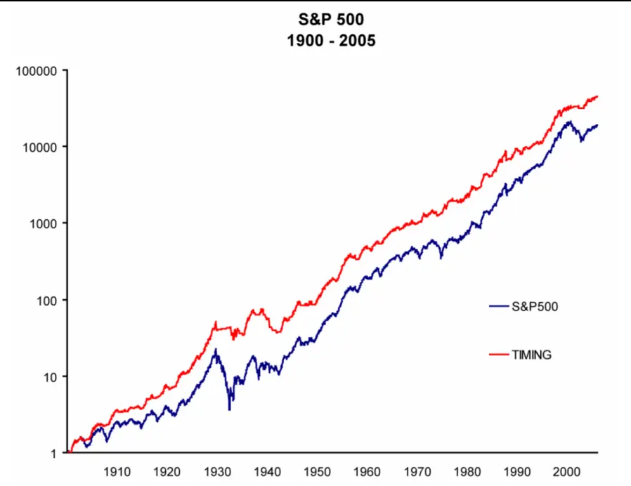
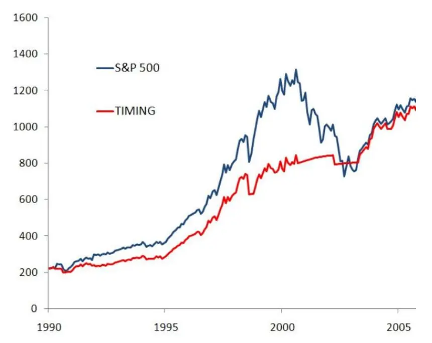
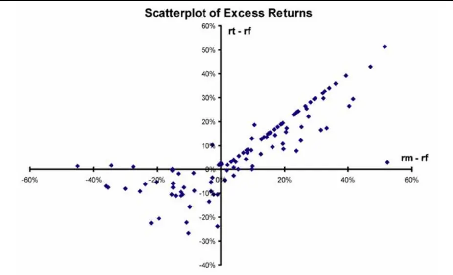
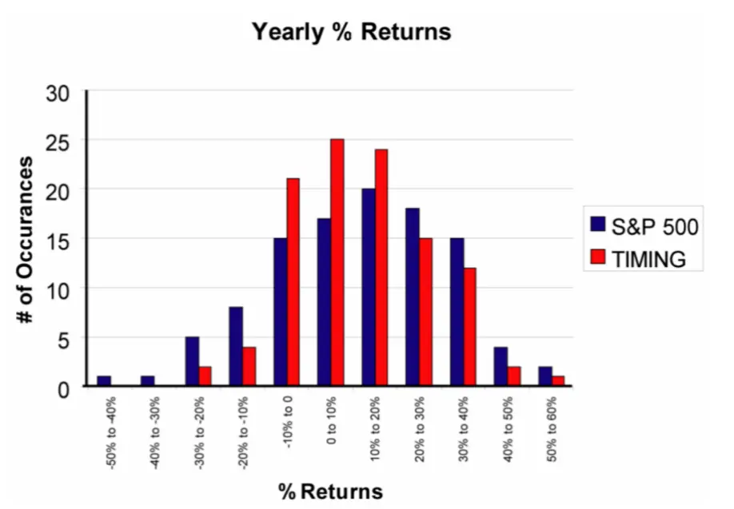
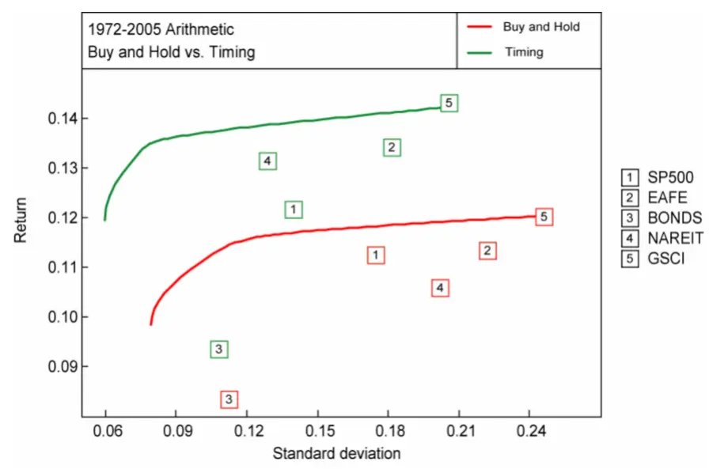
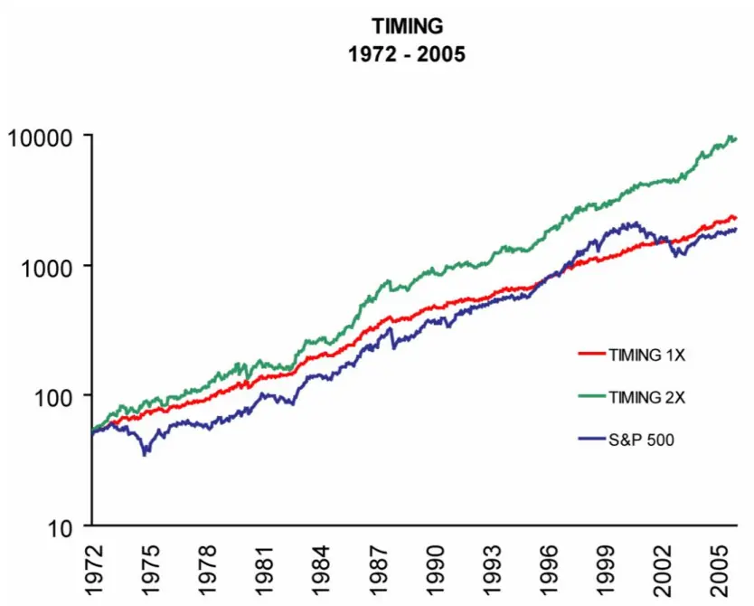
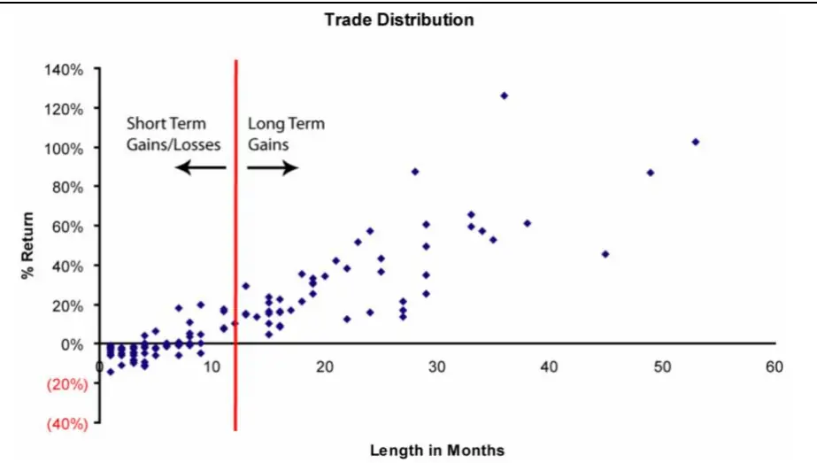

[Table_Title2021.05.11

# 战术资产配置的量化方法（上）

## ——精品文献解读系列（十三）

## 本报告导读：

本篇报告解读的文献提出了一个基于 10 个月简单移动均线的量化择时模型，回测结果表明该模型在 20 多个市场以及资产配置中，均能够显著提高风险调整收益。

## 摘要：

le_Summary]投资学是一门学术界与业界紧密结合的学科，其中大类资产配置是这种紧密结合的代表。从Markowitz（1952）开创现代投资组合理论开始，学术界为业界提供了丰富的理论参考和方法模型，推动了大类资产配置实践的繁荣发展。为了帮助读者及时跟踪学术前沿，我们推出了“精品文献解读”系列报告，从大量学术文献中挑选出精品论文进行剖析解读，为读者呈现大类资产配置领域最新的思路和方法。

本篇为读者解读的文献是 Faber（2007）在期刊 The Journal of WealthManagement 上发表的论文“A Quantitative Approach to TacticalAsset Allocation”。

该文献提出了一个基于 10 个月简单移动均线（10-month SMA）的量化择时模型。作者使用该模型对 20 多个市场以及包含 5 类资产的投资组合进行了回测，发现风险调整收益几乎全部得到了提高。除此之外，量化择时模型还能够帮助投资者规避各类资产的熊市，在取得股票资产收益率水平的同时，只承担债券水平的波动率和回撤，并且在最近30年的时间区间内持续取得年度正收益。

本文构建的量化择时模型极为简单，但是其回测表现却较为优异和稳定，这表明择时策略的应用价值非常之大，投资者在不断探究复杂数理模型的时候不应该忽视趋势跟踪这一简单而有效的方法。同时值得注意的是，本文的实证结果表明，量化择时的作用更多的是降低风险，而不是增强收益。

本文作者在 2016 年又发表了本文的续篇——“A QuantitativeApproach to Tactical Asset Allocation Revisited 10 YearsLater”，跟踪检验了量化择时模型的表现，并进行了相关扩展研究。我们将在后续研报“战术资产配置的量化方法（下）”中对其进行解读。

大类资产配置研究

## or] 报告作者

李祥文(分析师)

8 021-38031560

lixiangwen@gtjas.com

证书编号 S0880520100001

王瑞韬(研究助理)

8 021-38038208

wangruitao@gtjas.com

证书编号 S0880121010024

## cReport] 相关报告

机构投资者的“碳中和”之路

2021.05.10

如何理解出口对我国经济的贡献

2021.05.09

如何使用投资观点增强风险平价组合

2021.04.29

根深叶茂：金融监管视角下的公共养老金发展（上）

2021.04.27

基于多因子的战略资产配置方法

2021.04.23

## 文献概述

## 文献来源：

Faber, Mebane T. "A Quantitative Approach to Tactical Asset Allocation". The Journal of Wealth Management. 9.4(2007):69-79.

## 文献摘要：

本文提出了一个基于 10 个月简单移动均线（10-month SMA）的量化择时模型。我们使用该模型对 20 多个市场以及包含 5 类资产的投资组合进行了回测，发现风险调整收益几乎全部得到了提高。除此之外，量化择时模型还能够帮助投资者规避各类资产的熊市，在取得股票资产收益率水平的同时，只承担债券水平的波动率和回撤，并且在最近 30 年的时间区间内持续取得年度正收益。

## 文献评述：

本文构建的量化择时模型极为简单，但是其回测表现却较为优异和稳定，这表明择时策略的应用价值非常之大，投资者在不断探究复杂数理模型的时候不应该忽视趋势跟踪这一简单而有效的方法。同时值得注意的是，本文的实证结果表明，量化择时的作用更多的是降低风险，而不是增强收益。

本文作者在 2016 年又发表了本文的续篇——“A Quantitative Approachto Tactical Asset Allocation Revisited 10 Years Later”，跟踪检验了量化择时模型的表现，并进行了相关扩展研究。我们将在后续研报“战术资产配置的量化方法（下）”中对其进行解读。

## 引言

许多全球资产在20世纪为买入并长期持有的投资者创造了可观的收益。然而，其中大部分资产都经历了大幅的回撤，比如许多投资者的资产市值在前些年的全球股票市场崩盘中承受了40%-80%的跌幅。从数学上看，在承受75%的跌幅之后，投资者需要再获得 300%的收益才能回到初始资金水平，如果按照上个世纪股市的平均收益率（约 10%）计算，这大约需要 15 年的时间。因此，虽然很多资产能够取得长期收益，但是那些在 20 世纪 20 年代末和 30 年代初投资于美国股市、19 世纪 10 年代和40 年代投资于德国资产、50 年代中期投资于美国房地产、80 年代末投资于日本股市或 90 年代末投资于新兴市场和大宗商品的投资者可能会认为，持有这些资产并不是好的选择。

现代投资组合理论假定，投资者必须承担资产的波动性，来获得相应水平的收益。然而，随着许多投资者开始分开考虑投资组合中alpha和beta，对“被动投资某类资产可能不是获得该资产风险敞口的最佳方式”这一问题的讨论变得越来越重要。

本文提出了一个简单的量化择时模型。我们对该趋势跟踪模型在美国股市进行了样本内测试，然后在其它 20 多个市场进行了样本外测试。本文的目的并不是建立一个优化模型，而是要建立一个适用于绝大多数市场的简单交易策略。研究结果表明，市场择时的作用更多的是降低风险，而不是增强收益。

在样本外测试中，本文配置的资产包括标准普尔 500 指数（S&P 500）、MSCI 发达市场指数（MSCI EAFE）、高盛商品指数（GSCI）、美国房地产投资信托协会指数（NAREIT）及美国政府 10 年期国债等不同的资产类别。实证结果表明，使用该模型构建的投资组合具有股票资产的收益率水平，同时波动性和回撤水平与债券类资产相当，并且连续 30 年以上获得正收益。

## 市场择时与趋势跟踪

将趋势跟踪方法应用于金融市场并不是一项新的尝试，趋势跟踪方法的规则和标准也千差万别。最早提出并被广泛关注的两个趋势跟踪系统是由 Charles Dow 提出的道式理论（Dow Theory）和由 Ned Davis 提出的百分之四模型（Four Percent Model）。Timothy Hayes（2001）的《TheResearch Driven Investor》和 Martin Zweig（1986）的《Winning onWall Street》分别对这两种趋势跟踪系统进行了分析评述。

Merriman Capital Management（MCM）的团队使用市场择时策略对多种资产类别（包括股票、债券和黄金等）进行了量化回测，并使用这些策略来管理客户委托资金。本文验证并且扩展了他们的工作。Tilley andMerriman（1998-2002）分析了市场择时系统的特点，以及实施市场择时策略所面临的情绪和行为上的困难。

Wilcox and Crittenden（2005）在《Does Trend-Following Work onStocks?》中研究了趋势跟踪系统在美国股票市场中的应用效果。他们得出的结论是，即使根据幸存者偏差、流动性和交易成本等对研究样本进行调整，趋势跟踪策略也能够很好地应用于股票市场。

期货市场是趋势跟踪策略被大量使用的领域。许多全球宏观对冲基金和商品交易顾问（CTAs）多年来一直在期货市场使用趋势跟踪系统，累计管理着数十亿美元的资金。期货趋势跟踪与本文详述的策略截然不同，Mulvey et al.（2003）对期货趋势跟踪策略的收益组成进行了分解，包括抵押收益(国债利息）、跟踪趋势收益和再平衡收益等。他们认为抵押收益是总体回报中的最大组成部分，这一点可能出乎人们意料。

也有很多人尝试分析趋势跟踪系统为什么会取得成功。这些系统之所以奏效，是因为在不同的时间尺度上，由于反应不足或反应过度，市场表现出了动量特性(正序列相关性)。Kahneman and Tversky（1979）提出了一种行为理论，名为前景理论（prospect theory），该理论认为人类有一种非理性的倾向，在面临获利的时候是风险规避的，而在面临损失的时候是风险喜好的。简而言之，投资者倾向于过早卖出获利股票，而长时间持有亏损股票。

## 量化择时系统

## 4.1. 量化择时系统标准与规则

在确定量化系统的逻辑基础时，需要确保系统符合如下几个标准，以构建一个投资者可遵循的、足够机械化的、可消除情绪和主观影响的模型。

1. 简单的、纯机械化的逻辑；

2. 模型和参数对于各个资产类别来说都是相同的；

3. 仅以价格为基础。

根据 Taylor and Allen（1992）以及 Lui and Mole（1998），基于移动均线的交易系统是最简单和最流行的趋势跟踪系统。在技术分析领域，最常用到的长期趋势指标是 200日简单移动均线（SMA）。Siegel（2002）在《Stocks for the Long Run》一书中，使用 200 日 SMA 择时策略对道琼斯工业平均指数（DJIA）进行回测，发现与买入并持有道琼斯工业平均指数相比，使用择时策略能够提高绝对收益和风险调整后收益。即使在考虑所有交易成本（包括税收、买卖价差和佣金等）的情况下，择时策略依然可以获得更高的风险调整收益。本文中使用的是 10 个月的简单移动均线（10-Month SMA），与 Siegel（2002）所使用的 200 日简单移动均线（200-Day SMA）相似。

由于在进行测试之前我们已知 Siegel（2002）的研究结果，故此次分析应该被视为样本内分析。Siegel在进行回测时可能会针对样本区间进行策略参数优化，因此为了消除对数据窥探（data snooping）的担忧，本文将择时策略在 20 多个其他市场中进行样本外测试，以检验其有效性。

该量化择时系统具体如下：

买入规则：当月价格大于10个月 SMA时，买入；

卖出规则：当月价格小于10个月 SMA时，卖出。

1.买入和卖出价格采用当日收盘价。

2.所有数据序列均为月频数据。

3.现金收益率按照 90 天商业票据来估算，保证金率（margin rates）(用于杠杆模型)按照券商提供的利率水平来估算。

4.不考虑税收、佣金和滑点。

## 4.2. 对 S&P 500 指数的应用分析

为了展示择时系统的逻辑和特性，我们对1900-2005 年标准普尔500指数（S&P 500）进行了回测。表1展示了在回测区间内，S&P 500指数和择时策略的收益率情况。从表中可以看到，择时策略在 70%的时间里持有仓位，每年轧平交易次数不超过 1 次，最终提高了累计年化收益率（CAGR），同时降低了风险（标准差、最大回撤、溃疡指数（Ulcer Index））。

择时系统的整体表现比较优异，原因之一是其波动性较低，这一点通过比较平均收益和复合收益也可以看出。在回测区间内，S&P 500 指数的平均收益率是11.66%，复合收益率是9.75%；择时系统的平均收益率是11.72%，复合收益率是 10.66%。买入并持有的投资者受到波动性影响的跌幅为191个基点，而择时系统仅为106个基点。

表 1：S&P 500 指数和择时系统的整体表现（1900-2005 年）

|  | SP500 | TIMING |
| --- | --- | --- |
| CAGR | 9.75% | 10.66% |
| Stdev | 19.91% | 15.38% |
| Sharpe | 0.29 | 0.43 |
| MaxDD | (83.66%) | (49.98%) |
| MAR Ratio | 0.14 | 0.23 |
| Ulcerlndex %TimeinMkt | 20.33% | 11.70% |
| RT Trades/Year | 100.00% | 69.77% |
|  |  | 0.67 |
| % + Trades |  | 63% |
| Best Year | 52.88% | 52.40% |
| Worst Year | (43.86%) | (26.69%) |

数据来源：Faber（2007）

图 1 展示了 S&P 500 指数和择时系统的对数收益率。从图中可以看到，择时系统在过去一个世纪里表现优异，并且在很大程度上避开了 1930s和2000s的两次大熊市。在1930s，择时系统将回测从-83.86%降低到了-42.24%。

图1：S&P 500 指数和择时系统的对数收益率（1900-2005 年）

数据来源：Faber（2007）

对最近15年进行分析，可以发现择时系统的一些特征变得很明显。图2对比了S&P 500指数和择时系统在最近 15年（1990-2005年）的收益率曲线（非对数收益率）。首先，在 1990s 美国股票的牛市期间，趋势跟踪策略的表现差于买入持有策略。择时系统需要在至少跨越一个经济周期的时间区间中才能表现出优势。第二个特点是择时系统在股票处于熊市时不会参与到市场当中去。从图 2 中可以看到，择时系统在 2000 年10月退出了股票市场，从而规避了后续两年的亏损，最终在此轮熊市中的回撤仅为-16.52%，而买入持有策略的回撤则达到了-44.73%。

图2：S&P 500 指数和择时系统的累计收益率（1900-2005 年）

数据来源：Faber（2007）

表 2 展示了 S&P 500 指数在 1900-2005 年区间内表现最糟糕的 10 年。从表中可以看到，S&P 500 指数与择时系统的表现差异较大。事实上，在 S&P 500 指数收益为负的所有年份，S&P 500 指数与择时系统的相关性约为-0.37，而在全样本区间内二者的相关性约为0.82。

表 2：S&P 500 指数在 1900-2005 年区间内表现最糟糕的 10 年

|  | S&P 500 | TIMING |
| --- | --- | --- |
| WORST 10 1931 | (43.86%) | 2.49% |
| Years 1937 | (35.26%) | (7.37%) |
| 1907 | (29.61%) | (0.50%) |
| 1974 | (26.47%) | 9.73% |
| 1917 | (25.26%) | (3.33%) |
| 1930 | (25.26%) | 3.29% |
| 2002 | (22.10%) | (4.73%) |
| 1920 | (19.69%) | (3.50%) |
| 1973 | (14.69%) | (15.02%) |
| 1903 | (14.65%) | 0.19% |

数据来源：Faber（2007）

图 3 比较了择时策略的超额收益（rt-rf)与买入持有策略的超额收益（rm-rf）。从图中可以看到，在正超额收益率区间内二者存在线性关系，而在负超额收益率区间内二者的关系则较为分散。

图3：S&P 500 指数与择时系统的超额收益对比

数据来源：Faber（2007）

图4展示了S&P 500指数与择时系统的收益分布情况。从图中可以看到，相比于S&P 500指数，择时系统出现高收益和高亏损的次数较少。从本质上说，择时系统告诉投资者何时应该入市持有风险资产来获得潜在收益，以及何时应该退出市场持有现金。正是因为适时退出市场持有现金，规避了可能出现的大幅回撤（同时也错过了一些获得高收益的机会）,进而降低了投资的整体风险。

图 4：S&P 500 指数与择时系统的收益分布（1900-2005 年）

数据来源：Faber（2007）

如上文所述，Siegel（或其他等人）在进行回测时可能针对择时策略进行了参数优化。为了进一步检验择时策略的稳健性，并证明使用 10 个月SMA不是唯一的方案，表 3 展示了使用各种不同参数情况下择时策略的表现情况。

表3：标普 500与各种移动平均时间长度下的指标对比

|  | S&P 500 | 6 month | 8 month | 10 month12 | month | 14 month |
| --- | --- | --- | --- | --- | --- | --- |
| CAGRStdevSharpeMaxDDMAR%TimeinMktUlcerlndex | 9.75% | 10.02% | 10.60% | 10.66% | 10.80% | 10.55% |
|  | 19.91% | 15.08% | 15.37% | 15.37% | 15.57% | 15.81% |
|  | 0.29 | 0.40 | 0.43 | 0.43 | 0.44 | 0.41 |
|  | -83.66% | 44.65% | -56.09% | -49.98% | -47.74% | -51.35% |
|  | 0.14 | 0.25 | 0.21 | 0.23 | 0.25 | 0.23 |
|  | 100% | 69.00% | 70.00% | 70.00% | 71.00% | 72.00% |
|  | 20.33% | 11.55% | 13.35% | 11.70% | 11.76% | 12.86% |

数据来源：Faber（2007）

总体来看，基于不同周期SMA 的择时策略表现大致相同。表中灰色方框内的数据表示在相应统计指标下的最佳SMA参数。从表中可以看到，10个月SMA并不是任何业绩指标的最佳参数，但是其表现相对均衡，具有一定的稳定性。

## 4.3. 样本外测试和战术资产配置

为了消除对数据窥探（data snooping）的担忧，我们在其他20多个市场中对量化择时系统进行了样本外测试。结果证实，在大约 70%的市场中，绝对收益得到了改善；在 90%以上的市场中，风险调整收益、溃疡指数和最大回撤均有所改善。

接下来，本文检验了一个基于择时系统的资产配置模型。除 S&P 500指数外，我们还选择了其他 4 类资产，包括外国股票(MSCI EAFE)、美国债券(10年期国债)、大宗商品(GSCI)和房地产(NAREIT)。表 4展示了每类资产的收益情况和应用择时策略后的业绩表现。

从表4中可以看到，择时策略的收益率与资产本身差异不大（其中4类资产在应用择时策略后获得的收益率更高），但是标准差、最大回撤、溃疡指数和最差年份收益率等风险指标均有所降低。另外，择时策略的获利交易平均收益比亏损交易大7 倍，且获利交易的持仓时间比亏损交易长 6 倍。整体来看，5 类资产应用择时策略之后的平均胜率达到了54.8%。

表 4：资产总收益和应用择时策略后的业绩表现（1972-2005）

|  | SP500 | TIMING | EAFE | TIMING | 10Yr Bond | TIMING | GSCI | TIMING | NAREIT | TIMING |  |
| --- | --- | --- | --- | --- | --- | --- | --- | --- | --- | --- | --- |
| CAGR | 11.24% 17.47% | 11.18% | 11.34% | 12.02% 18.17% | 8.35% | 8.73% | 12.03% | 12.46% 20.44% | 10.60% 20.21% | 12.33% 12.92% |  |
| Stdev | 0.41 | 14.00% | 22.19% |  | 11.24% | 10.87% | 24.58% 0.33 | 0.41 | 0.33 | 0.64 |  |
| Sharpe MaxDD | (44.73%) | 0.51 (23.26%) | 0.33 (47.47%) | 0.44 (23.23%) | 0.39 (18.79%) | 0.44 (11.18%) | (48.25%) | (37.98%) |  | (16.42%) |  |
| MAR | 0.25 | 0.48 | 0.24 | 0.52 | 0.44 | 0.78 | 0.25 | 0.33 | (58.10%) 0.18 | 0.75 |  |
| UlcerIndex | 12.85% | 6.30% | 15.00% | 7.48% | 4.13% | 3.29% | 16.64% | 13.92% | 13.93% | 4.43% |  |
| Best Year | 37.58% | 37.58% | 69.94% | 69.94% | 44.28% | 44.28% | 74.96% | 74.96% | 48.97% | 48.97% |  |
| Worst Year | (26.47%) | (15.02%) | (23.20%) | (13.74%) | (7.51%) | (4.96%) | (35.75%) | (21.98%) | (42.23%) | (14.34%) | Averages |
| %TimeinMkt |  | 75.79% |  | 72.13% |  | 77.26% |  | 69.44% |  | 74.02% | 73.73% |
| RT Trades/Year |  | 0.59 |  | 0.71 |  | 0.76 |  | 0.79 |  | 0.62 | 0.69 |
| % + Trades |  | 63.00% |  | 56.00% |  | 52.00% |  | 44.00% |  | 59.00% | 54.80% |
| Avg win trade |  | 25.35% |  | 27.22% |  | 17.96% |  | 38.90% |  | 30.02% | 27.89% |
| Avg win trade length |  | 19.20 |  | 16.53 |  | 20.92 |  | 20.27 |  | 20.46 | 19.48 |
| Avg lose trade |  | (5.06%) |  | (5.17%) |  | (1.91%) |  | (3.67%) |  | (3.66%) | (3.90%) |
| Avg lose trade length |  | 1.89 |  | 3.42 |  | 3.17 |  | 3.4 |  | 4.11 | 3.20 |

数据来源：Faber（2007）

图 5 展示了买入持有策略和择时策略的风险与收益。从图中可以看到，对于所有5类资产，择时策略均使得风险收益位置向左上方移动，说明与买入持有策略相比，择时策略提高了收益、降低了风险。

图5：买入持有策略和择时策略的风险收益比较（1972-2005）

数据来源：Faber（2007）

上文所述的简单择时策略在各类不同资产类别中均取得了较好的业绩表现，因此我们进一步考虑将其应用于资产配置中。我们买入并持有上述5类资产，配置比例为等权重，构建投资组合。然后，我们对投资组合中的每类资产单独应用择时策略。表 5 展示了择时系统持有不同仓位水平的月份数量百分比。从表中可以看到，择时系统在绝大多数时间里保持着60-100%的投资仓位。

表5：择时配置策略的持仓情况

| # of Positions | # of Months | % of Months |
| --- | --- | --- |
| 0 (all cash) | 4 | 0.98% |
| 1 | 18 | 4.41% |
| 2 | 46 | 11.27% |
| 3 | 88 | 21.57% |
| 4 | 150 | 36.76% |
| 5 (100% invested) | 102 | 25.00% |
| Total | 408 | 100.00% |

数据来源：Faber（2007）

表 6 展示了投资组合使用买入持有配置策略（AA）和择时配置策略（TIMING）的业绩对比。得益于分散化投资，买入持有配置策略本身取得了较好的收益水平。而择时配置策略则进一步将波动性和最大回撤降低至个位数水平，溃疡指数也减少了一半。应用择时配置策略后，投资组合在1972年之后的年收益率均为正值。

表6：买入持有配置策略和择时配置策略的业绩对比（1972-2005 年）

|  | AA | TIMING |  | AA | TIMING |
| --- | --- | --- | --- | --- | --- |
| 1972 | 21.92% | 21.11% | 1989 | 19.25% | 18.15% |
| 1973 | 1.03% | 7.67% | 1990 | (1.10%) | 4.92% |
| 1974 | (11.80%) | 13.35% | 1991 | 18.19% | 6.33% |
| 1975 | 20.16% | 1.40% | 1992 | 3.88% | 4.73% |
| 1976 | 15.04% | 15.95% | 1993 | 11.90% | 12.81% |
| 1977 | 8.24% | 7.17% | 1994 | 1.76% | 2.49% |
| 1978 | 13.65% | 11.94% | 1995 | 22.74% | 21.72% |
| 1979 | 17.89% | 14.63% | 1996 | 19.32% | 19.26% |
| 1980 | 18.95% | 12.69% | 1997 | 9.96% | 9.94% |
| 1981 | (3.34%) | 4.57% | 1998 | (0.49%) | 7.44% |
| 1982 | 21.34% | 22.10% | 1999 | 14.16% | 13.12% |
| 1983 | 17.97% | 15.74% | 2000 | 12.73% | 13.76% |
| 1984 | 9.43% | 6.92% | 2001 | (9.74%) | 3.10% |
| 1985 | 26.58% | 26.17% | 2002 | 2.09% | 3.33% |
| 1986 | 25.50% | 21.52% | 2003 | 25.70% | 20.52% |
| 1987 | 8.53% | 11.86% | 2004 | 17.44% | 15.08% |
| 1988 | 18.46% | 11.83% | 2005 | 11.74% | 8.21% |

|  | AA | TIMING | S&P 500 | 10Yr Bond |
| --- | --- | --- | --- | --- |
| CAGR | 11.57% | 11.92% | 11.24% | 8.35% |
| Stdev | 10.04% | 6.61% | 17.47% | 11.24% |
| Sharpe | 0.75 | 1.20 | 0.41 | 0.39 |
| MaxDD | (19.62%) | (9.51%) | (44.73%) | (18.79%) |
| MAR | 0.59 | 1.25 | 0.25 | 0.44 |
| UlcerIndex | 4.04% | 1.70% | 12.85% | 4.13% |
| Best Year | 26.58% | 26.17% | 37.58% | 44.28% |
| Worst Year | (11.80%) | 1.40% | (26.47%) | (7.51%) |

数据来源：Faber（2007）

在择时配置策略的基础上使用杠杆，可以进一步提高投资组合的超额收益。表7 展示了使用 2 倍杠杆后投资组合的业绩表现情况。

表 7：买入持有配置策略和择时配置策略（2 倍杠杆）的业绩对比（1972-2005 年）

|  | AA | TIMING | TIMING 2X |
| --- | --- | --- | --- |
| CAGR Stdev | 11.57% 10.04% | 11.92% 6.61% | 16.56% 13.88% |
| Sharpe | 0.75 | 1.20 | 0.90 |
| MaxDD | (19.62%) | (9.51%) | (21.87%) |
| MAR |  | 1.25 | 0.76 |
| Ulcerlndex | 0.59 |  |  |
| Best Year | 4.04% | 1.70% | 5.10% |
| Worst Year | 26.58% (11.80%) | 26.17% 1.40% | 46.42% (5.51%) |

数据来源：Faber（2007）

由于投资者在加杠杆时需要承担融资成本，因此 2 倍杠杆并不会产生 2倍的收益。2 倍杠杆择时配置投资组合（TIMING 2X）的风险水平与买入持有投资组合（AA）非常相近，但是复合年均增长率提高了约 500个基点。图6 展示了S&P 500指数、择时策略和2倍杠杆择时策略的业绩曲线（对数收益率）。

图6：S&P 500 指数、择时策略和 2 倍杠杆择时策略的业绩曲线

数据来源：Faber（2007）

## 4.4. 模型的现实考虑因素

在将择时策略应用于投资实践之前，投资者必须考虑一些现实因素——管理费、佣金、滑点和税收。

对于管理费，买入持有策略和择时策略应该相同，且均视投资工具而异。如果使用 ETF 基金或和低费率共同基金（no-load mutual funds），管理费用大约为 20-100 个基点。

由于择时策略的低换手率，佣金的影响较小。对于整个投资组合，择时配置策略的年换手率平均约为 3-4,其中每类资产每年换手率不超过 1。同样地，滑点的影响也可以忽略不计，因为投资者可以选择共同基金（0滑点）以及流动性较好的ETF 基金。

税收是一个非常实际的考虑因素。捐赠基金和养老基金等许多投资机构享有免税待遇。对于个人投资者来说，较好的方案是通过一个递延税款账户(如IRA或401(k))来进行择时交易。由于不同投资者有不同的资本收益率（不同时期税率以及股息也不同），所以很难估计投资者在使用择时配置策略时应该缴纳的税费。Gannon and Blum（2006）估算了 1961年以来个人投资者投资于S&P 500指数的税后收益（按照个税最高等级来计算）。对于换手率为20%的投资者来说，其税后收益将从税前的10.62%下降到6.72%。他们还估计，换手率从 20%上升至 70%将导致税后收益再下跌近50个基点，至 6.27%。

择时系统的特点是承担大量的短期小额亏损，但在长期获得较高的收益回报，这有助于减轻投资者的税收负担，对于那些必须在应税账户中采用择时策略的投资者是非常有益的。图 7 展示了自 1972 年以来，择时策略对这5类资产的所有交易的持仓时间和收益分布。

图7：择时策略的交易持仓时间和收益分布（1972-2005年）

数据来源：Faber（2007）

## 结论

本文的目的是创建一个简单易行的方法来管理某类资产以及投资组合的风险。不掺杂主观观点的趋势跟踪模型是一种能够降低风险的量化方法，且对收益几乎没有影响。我们使用该趋势跟踪模型对 20 多个市场进行了回测，发现风险调整收益几乎全部得到了提高。对于包含5类资产的投资组合，应用择时策略同样可以提高风险调整收益。除此之外，趋势跟踪模型还能够帮助投资者规避各类资产的熊市，在取得股票资产收益率水平的同时，只承担债券水平的波动率和回撤，并且在最近 30年的时间区间内持续取得年度正收益。

## 本公司具有中国证监会核准的证券投资咨询业务资格

## 分析师声明

作者具有中国证券业协会授予的证券投资咨询执业资格或相当的专业胜任能力，保证报告所采用的数据均来自合规渠道，分析逻辑基于作者的职业理解，本报告清晰准确地反映了作者的研究观点，力求独立、客观和公正，结论不受任何第三方的授意或影响，特此声明。

## 免责声明

本报告仅供国泰君安证券股份有限公司（以下简称“本公司”）的客户使用。本公司不会因接收人收到本报告而视其为本公司的当然客户。本报告仅在相关法律许可的情况下发放，并仅为提供信息而发放，概不构成任何广告。

本报告的信息来源于已公开的资料，本公司对该等信息的准确性、完整性或可靠性不作任何保证。本报告所载的资料、意见及推测仅反映本公司于发布本报告当日的判断，本报告所指的证券或投资标的的价格、价值及投资收入可升可跌。过往表现不应作为日后的表现依据。在不同时期，本公司可发出与本报告所载资料、意见及推测不一致的报告。本公司不保证本报告所含信息保持在最新状态。同时，本公司对本报告所含信息可在不发出通知的情形下做出修改，投资者应当自行关注相应的更新或修改。

本报告中所指的投资及服务可能不适合个别客户，不构成客户私人咨询建议。在任何情况下，本报告中的信息或所表述的意见均不构成对任何人的投资建议。在任何情况下，本公司、本公司员工或者关联机构不承诺投资者一定获利，不与投资者分享投资收益，也不对任何人因使用本报告中的任何内容所引致的任何损失负任何责任。投资者务必注意，其据此做出的任何投资决策与本公司、本公司员工或者关联机构无关。

本公司利用信息隔离墙控制内部一个或多个领域、部门或关联机构之间的信息流动。因此，投资者应注意，在法律许可的情况下，本公司及其所属关联机构可能会持有报告中提到的公司所发行的证券或期权并进行证券或期权交易，也可能为这些公司提供或者争取提供投资银行、财务顾问或者金融产品等相关服务。在法律许可的情况下，本公司的员工可能担任本报告所提到的公司的董事。

市场有风险，投资需谨慎。投资者不应将本报告作为作出投资决策的唯一参考因素，亦不应认为本报告可以取代自己的判断。
在决定投资前，如有需要，投资者务必向专业人士咨询并谨慎决策。

本报告版权仅为本公司所有，未经书面许可，任何机构和个人不得以任何形式翻版、复制、发表或引用。如征得本公司同意进行引用、刊发的，需在允许的范围内使用，并注明出处为“国泰君安证券研究”，且不得对本报告进行任何有悖原意的引用、删节和修改。

若本公司以外的其他机构（以下简称“该机构”）发送本报告，则由该机构独自为此发送行为负责。通过此途径获得本报告的投资者应自行联系该机构以要求获悉更详细信息或进而交易本报告中提及的证券。本报告不构成本公司向该机构之客户提供的投资建议，本公司、本公司员工或者关联机构亦不为该机构之客户因使用本报告或报告所载内容引起的任何损失承担任何责任。

## 评级说明

## 1.投资建议的比较标准

投资评级分为股票评级和行业评级。

以报告发布后的12个月内的市场表现为比较标准，报告发布日后的 12个月内的公司股价（或行业指数）的涨跌幅相对同期的沪深 300 指数涨跌幅为基准。

## 2.投资建议的评级标准

报告发布日后的 12 个月内的公司股价（或行业指数）的涨跌幅相对同期的沪深 300 指数的涨跌幅。

|  | 评级 说明 |  |
| --- | --- | --- |
| 股票投资评级 | 增持 | 相对沪深 300指数涨幅15%以上 |
|  | 谨慎增持 | 相对沪深300指数涨幅介于5%～15%之间 |
|  | 中性 | 相对沪深300指数涨幅介于-5%～5% |
|  | 减持 | 相对沪深300指数下跌5%以上 |
| 行业投资评级 | 增持 | 明显强于沪深 300指数 |
|  | 中性 | 基本与沪深300指数持平 |
|  | 减持 | 明显弱于沪深300指数 |

## 国泰君安证券研究所

|  | 上海 | 深圳 | 北京 |
| --- | --- | --- | --- |
| 地址 | 上海市静安区新闸路669号博华广场 20层 | 深圳市福田区益田路 6009 号新世界 商务中心34层 | 北京市西城区金融大街甲9号金融 街中心南楼18层 |
| 邮编 | 200041 | 518026 | 100032 |
| 电话 | （021)38676666 | （0755）23976888 | (010)83939888 |
|  | E-mail: gtjaresearch@gtjas.com |  |  |